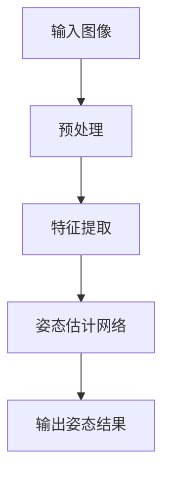

                 

### 引言

深度学习作为人工智能领域的重要分支，近年来取得了令人瞩目的成就。它在计算机视觉、自然语言处理、语音识别等多个领域都展现出了强大的应用潜力。在实时人体姿态估计领域，深度学习技术更是发挥了关键作用。实时人体姿态估计不仅对运动分析、人机交互、健康监测等领域具有重要意义，而且在虚拟现实、交互式游戏等新兴领域也有着广泛的应用前景。

本文将围绕深度学习在实时人体姿态估计中的鲁棒性提升展开讨论。首先，我们将介绍深度学习和实时人体姿态估计的基本概念，包括深度学习的理论基础和实时人体姿态估计的原理。随后，我们将深入探讨深度学习网络架构和优化方法，为后续鲁棒性提升提供理论基础。

接下来，本文将详细描述实时人体姿态估计数据处理与预处理过程，包括数据集准备、图像预处理和数据增强方法。在此基础上，我们将详细介绍实时人体姿态估计模型训练与评估过程，包括模型训练流程、评估指标和模型优化策略。

本文的第二部分将重点讨论深度学习在实时人体姿态估计中的鲁棒性提升，包括鲁棒性的定义与重要性、提升方法以及鲁棒性评估指标和实验设置。最后，我们将通过实际应用案例，展示如何在不同条件下提升深度学习模型的鲁棒性。

总结部分将回顾本文的主要成果和贡献，展望未来发展方向，并对深度学习在实时人体姿态估计中的应用前景进行展望。此外，附录部分将提供深度学习开发工具与资源的对比、开源数据集和代码库推荐以及深度学习学习资源推荐。

通过本文的逐步分析推理，我们将深入了解深度学习在实时人体姿态估计中的鲁棒性提升，为相关领域的研究和应用提供有益的参考。

### 第一部分：深度学习与实时人体姿态估计基础

#### 第1章：深度学习与实时人体姿态估计概述

##### 1.1 深度学习技术概述

深度学习是一种基于多层级神经网络结构的人工智能方法，通过对大量数据进行训练，使模型能够自动学习特征，并从中提取有价值的信息。深度学习技术包括但不限于卷积神经网络（CNN）、循环神经网络（RNN）和生成对抗网络（GAN）等。

**深度学习基础理论**

深度学习模型的核心组件包括神经网络层、激活函数和损失函数。以下是一个简单的神经网络层和激活函数的数学模型：

\[ y = \sigma(\omega \cdot x + b) \]

其中，\( y \) 是输出，\( \sigma \) 是激活函数，通常使用 Sigmoid 函数或ReLU函数；\( \omega \) 是权重矩阵，\( x \) 是输入特征，\( b \) 是偏置项。

**前向传播与反向传播算法**

前向传播是指将输入特征通过神经网络层进行层层传递，最终得到输出结果的过程。反向传播则是在输出结果与真实值之间存在误差时，通过反向传递误差来更新模型参数的过程。

前向传播算法伪代码：

```python
for layer in network:
    z = \omega \cdot x + b
    a = \sigma(z)
    x = a
```

反向传播算法伪代码：

```python
for layer in reversed(network):
    dz = d\sigma(z) \cdot d\omega \cdot x
    dx = dz \cdot \omega
    d\omega = dx \cdot x^T
    db = dz
```

##### 1.2 实时人体姿态估计原理

实时人体姿态估计是指通过计算机视觉技术，对视频中的人体姿态进行快速、准确的估计。其核心概念包括输入图像的预处理、特征提取、姿态估计网络和输出姿态结果。

**核心概念与联系**

以下是一个简单的 Mermaid 流程图，展示了实时人体姿态估计的流程：



**实时人体姿态估计中的关键挑战**

在实时人体姿态估计中，存在多个关键挑战，包括光照变化、人体遮挡、运动模糊等。这些因素都会对姿态估计的准确性和实时性产生负面影响。

- **光照变化**：光照的强烈变化会导致图像的亮度、对比度和色彩发生变化，从而影响姿态估计的准确性。
- **人体遮挡**：人体部分遮挡会导致模型无法准确识别被遮挡的区域，从而影响整体姿态估计的准确性。
- **运动模糊**：高速运动会导致图像模糊，从而增加姿态估计的难度。

##### 1.3 实时人体姿态估计中的关键挑战

为了应对实时人体姿态估计中的关键挑战，我们可以采用以下方法：

- **数据增强**：通过引入噪声、视角变化、光照变化等，增加训练数据的多样性，从而提高模型的鲁棒性。
- **正则化技术**：使用正则化方法，如L1和L2正则化，来防止模型过拟合，提高模型的泛化能力。
- **注意力机制**：利用注意力机制，让模型更加关注重要的特征，从而提高对噪声的抵抗力。

##### 1.4 深度学习在实时人体姿态估计中的应用

深度学习在实时人体姿态估计中的应用主要包括以下几个方面：

- **模型训练**：通过大量的标注数据，训练深度学习模型，使其能够自动学习人体姿态特征。
- **模型部署**：将训练好的模型部署到实时系统中，实现快速、准确的人体姿态估计。
- **模型优化**：通过调整网络架构、优化算法和超参数，提高模型的性能和鲁棒性。

以下是一个简单的实时人体姿态估计实战案例：

```python
import cv2
import numpy as np
import tensorflow as tf

# 加载预训练模型
model = tf.keras.models.load_model('pose_estimation_model.h5')

# 开启摄像头
cap = cv2.VideoCapture(0)

while cap.isOpened():
    ret, frame = cap.read()
    if not ret:
        break

    # 将视频帧输入到模型中进行预测
    predicted_pose = model.predict(np.expand_dims(frame, axis=0))

    # 显示预测结果
    cv2.imshow('Real-time Pose Estimation', frame)

    if cv2.waitKey(1) & 0xFF == ord('q'):
        break

cap.release()
cv2.destroyAllWindows()
```

通过上述内容，我们初步了解了深度学习与实时人体姿态估计的基础知识。接下来，我们将进一步探讨深度学习网络架构和优化方法，为提升实时人体姿态估计的鲁棒性打下基础。

#### 第2章：深度学习网络架构与优化方法

##### 2.1 深度学习网络架构详解

深度学习网络架构的设计对于模型性能和训练效率具有决定性影响。在实时人体姿态估计中，常用的网络架构包括卷积神经网络（CNN）和循环神经网络（RNN）等。以下我们将重点介绍卷积神经网络（CNN）的结构和作用。

**卷积神经网络（CNN）**

卷积神经网络是一种专门用于处理图像数据的深度学习模型。它通过卷积层、池化层和全连接层等结构，提取图像中的特征，并最终进行分类或回归。

- **卷积层（Convolutional Layer）**：卷积层是CNN的核心组成部分，用于提取图像的特征。卷积层通过卷积操作将输入图像与滤波器（Kernel）进行卷积，从而生成特征图。卷积操作的数学表示如下：

  \[ f_{ij} = \sum_{k=1}^{C} w_{ikj} \cdot a_{kj} + b_{ij} \]

  其中，\( f_{ij} \) 表示第 \( i \) 个特征图上的第 \( j \) 个像素值，\( w_{ikj} \) 表示第 \( k \) 个滤波器的第 \( i \) 行第 \( j \) 列的权重，\( a_{kj} \) 表示输入图像的第 \( k \) 个通道上的第 \( j \) 个像素值，\( b_{ij} \) 表示第 \( i \) 个特征图的偏置项。

- **激活函数（Activation Function）**：激活函数用于引入非线性特性，使得网络能够学习更复杂的特征。常用的激活函数包括 Sigmoid、ReLU 和 Tanh 等。

  例如，ReLU 函数的表达式如下：

  \[ \sigma(x) = \max(0, x) \]

- **池化层（Pooling Layer）**：池化层用于降低特征图的维度，减少计算量。常用的池化操作包括最大池化和平均池化。

  最大池化的数学表示如下：

  \[ p_i = \max_{j} a_{ij} \]

  其中，\( p_i \) 表示输出特征图中第 \( i \) 个像素值，\( a_{ij} \) 表示输入特征图中第 \( i \) 行第 \( j \) 列的像素值。

- **全连接层（Fully Connected Layer）**：全连接层将卷积层和池化层提取的特征映射到分类或回归结果。全连接层的输入是上一个层的特征图，输出是每个类别的得分。

  全连接层的数学表示如下：

  \[ z_j = \sum_{i=1}^{n} w_{ij} \cdot a_{i} + b_{j} \]

  \[ a_j = \sigma(z_j) \]

  其中，\( z_j \) 表示输出特征图中第 \( j \) 个神经元的输入值，\( w_{ij} \) 表示第 \( j \) 个神经元的权重，\( a_{i} \) 表示输入特征图中第 \( i \) 个像素值，\( b_{j} \) 表示第 \( j \) 个神经元的偏置项，\( \sigma \) 是激活函数。

以下是一个简单的卷积神经网络（CNN）架构的伪代码示例：

```python
def cnn_network(input_shape):
    model = tf.keras.Sequential([
        tf.keras.layers.Conv2D(32, (3, 3), activation='relu', input_shape=input_shape),
        tf.keras.layers.MaxPooling2D((2, 2)),
        tf.keras.layers.Conv2D(64, (3, 3), activation='relu'),
        tf.keras.layers.MaxPooling2D((2, 2)),
        tf.keras.layers.Flatten(),
        tf.keras.layers.Dense(128, activation='relu'),
        tf.keras.layers.Dense(50, activation='softmax')
    ])
    return model
```

**循环神经网络（RNN）**

循环神经网络（RNN）是一种处理序列数据的深度学习模型。RNN 通过在时间步上递归地更新状态，使得模型能够处理序列数据中的长距离依赖关系。

- **隐藏状态（Hidden State）**：隐藏状态是 RNN 的核心组成部分，用于存储序列信息。每个时间步的隐藏状态取决于前一个时间步的隐藏状态和当前输入。

  隐藏状态的更新公式如下：

  \[ h_t = \sigma(W_h \cdot [h_{t-1}, x_t] + b_h) \]

  其中，\( h_t \) 表示第 \( t \) 个时间步的隐藏状态，\( \sigma \) 是激活函数，\( W_h \) 是权重矩阵，\( [h_{t-1}, x_t] \) 是输入，\( b_h \) 是偏置项。

- **输出（Output）**：输出是 RNN 的预测结果，可以用于分类或回归任务。输出取决于隐藏状态和权重。

  输出的数学表示如下：

  \[ y_t = W_o \cdot h_t + b_o \]

  其中，\( y_t \) 表示第 \( t \) 个时间步的输出，\( W_o \) 是权重矩阵，\( h_t \) 是隐藏状态，\( b_o \) 是偏置项。

以下是一个简单的循环神经网络（RNN）架构的伪代码示例：

```python
def rnn_network(input_shape):
    model = tf.keras.Sequential([
        tf.keras.layers.RNN(tf.keras.layers.LSTM(128), return_sequences=True),
        tf.keras.layers.Dense(50, activation='softmax')
    ])
    return model
```

##### 2.2 深度学习优化方法

深度学习的优化方法主要包括优化算法和超参数调优。以下我们将分别介绍。

**优化算法**

优化算法用于更新模型参数，以最小化损失函数。常用的优化算法包括梯度下降（Gradient Descent）及其变种。

- **梯度下降（Gradient Descent）**：梯度下降是一种最简单的优化算法。它通过计算损失函数关于模型参数的梯度，并沿着梯度的反方向更新参数。

  梯度下降的更新公式如下：

  \[ \theta = \theta - \alpha \cdot \nabla_{\theta} J(\theta) \]

  其中，\( \theta \) 表示模型参数，\( \alpha \) 是学习率，\( \nabla_{\theta} J(\theta) \) 是损失函数关于模型参数的梯度。

- **随机梯度下降（Stochastic Gradient Descent, SGD）**：随机梯度下降是一种在训练数据上随机采样一部分数据进行参数更新的优化算法。它通过减小批量大小来减少梯度估计的方差。

  随机梯度下降的更新公式如下：

  \[ \theta = \theta - \alpha \cdot \nabla_{\theta} J(\theta; x^{(i)}, y^{(i)}) \]

  其中，\( x^{(i)}, y^{(i)} \) 表示第 \( i \) 个样本的输入和输出。

- **动量梯度下降（Momentum Gradient Descent）**：动量梯度下降是一种结合了随机梯度下降和梯度累积的优化算法。它通过引入动量项来加速梯度下降过程。

  动量梯度下降的更新公式如下：

  \[ \theta = \theta - \alpha \cdot \nabla_{\theta} J(\theta) + \beta \cdot v \]

  其中，\( v \) 是动量项，\( \beta \) 是动量系数。

- **自适应梯度优化算法（Adaptive Gradient Algorithms, AGAs）**：自适应梯度优化算法是一类通过自适应调整学习率来提高优化效率的优化算法。常用的 AGA 算法包括 Adagrad、Adam 和 RMSprop 等。

  Adam 算法的更新公式如下：

  \[ m_t = \beta_1 \cdot m_{t-1} + (1 - \beta_1) \cdot \nabla_{\theta} J(\theta) \]

  \[ v_t = \beta_2 \cdot v_{t-1} + (1 - \beta_2) \cdot (\nabla_{\theta} J(\theta))^2 \]

  \[ \theta = \theta - \alpha \cdot \frac{m_t}{\sqrt{v_t} + \epsilon} \]

  其中，\( m_t \) 和 \( v_t \) 分别是均值和方差估计，\( \beta_1 \) 和 \( \beta_2 \) 分别是动量系数，\( \epsilon \) 是一个很小的常数。

**超参数调优**

超参数是深度学习模型中的非模型参数，如学习率、批量大小、迭代次数等。超参数的选取对模型性能具有重要影响。常用的超参数调优方法包括网格搜索（Grid Search）和贝叶斯优化（Bayesian Optimization）。

- **网格搜索（Grid Search）**：网格搜索是一种穷举搜索超参数的方法。它通过遍历所有可能的超参数组合，找到最优的超参数组合。

  网格搜索的伪代码如下：

  ```python
  for learning_rate in learning_rates:
      for batch_size in batch_sizes:
          model = cnn_network(input_shape)
          model.compile(optimizer=optimizer, loss=loss, metrics=['accuracy'])
          model.fit(X_train, y_train, batch_size=batch_size, epochs=epochs, validation_data=(X_val, y_val))
          best_model = model
  ```

- **贝叶斯优化（Bayesian Optimization）**：贝叶斯优化是一种基于概率模型的超参数调优方法。它通过构建概率模型来估计超参数的分布，并选择具有较高概率的最优超参数组合。

  贝叶斯优化的伪代码如下：

  ```python
  def acquisition_function(x, model, objective_function):
      # 计算目标函数值
      f_x = objective_function(x)
      # 计算模型预测值
      f_mean = model.predict(x)
      # 计算模型不确定性
      f_std = model.predict_std(x)
      # 计算不确定性减少的期望
      f_exp = f_mean - f_std
      return f_x - f_exp

  # 初始化贝叶斯优化器
  optimizer = BayesianOptimizer(objective_function=objective_function, acquisition_function=acquisition_function)

  # 进行贝叶斯优化
  optimizer.optimize(x0, n_iterations)
  ```

通过上述内容，我们详细介绍了深度学习网络架构和优化方法。这些方法和技巧为深度学习在实时人体姿态估计中的应用提供了坚实的理论基础。接下来，我们将探讨实时人体姿态估计数据处理与预处理过程。

#### 第3章：实时人体姿态估计数据处理与预处理

##### 3.1 数据集准备

数据集是深度学习模型训练和评估的基础。对于实时人体姿态估计任务，我们需要大量的标注数据来训练模型。以下将介绍数据集的采集和标注过程。

**数据集采集**

数据集的采集主要包括图像采集和姿态标注。在实时人体姿态估计中，我们通常使用视频作为数据源。以下是数据采集的一般步骤：

1. **视频采集**：使用摄像头或其他图像采集设备录制一段包含人体运动场景的视频。
2. **剪辑视频**：根据需要，将视频剪辑为多个片段，每个片段包含一个独立的运动场景。
3. **保存数据**：将剪辑后的视频片段保存为图像序列，以便后续处理和标注。

**姿态标注**

姿态标注是指为每个图像或视频帧标注人体关节点的位置。以下是姿态标注的一般步骤：

1. **标注工具**：使用专门的标注工具，如VGG Image Annotator（VIA）或LabelImg，对图像或视频帧进行标注。
2. **标注示例**：在每个图像或视频帧上，标注出人体的关键关节点，如肩膀、肘部、手腕、臀部、膝盖等。
3. **标注保存**：将标注信息保存为格式化文件，如CSV或JSON，以便后续数据处理和模型训练。

以下是一个简单的姿态标注示例：

```python
# 示例：标注数据格式（CSV格式）
image_id,=keypoints
1,[[x1_1, y1_1], [x1_2, y1_2], ..., [x1_n, y1_n]]
2,[[x2_1, y2_1], [x2_2, y2_2], ..., [x2_n, y2_2]]
...
```

其中，`image_id` 表示图像的编号，`keypoints` 表示图像中各个关节点的坐标。

**数据集标注流程**

1. **数据预处理**：对采集的图像进行预处理，如缩放、裁剪等，以适应模型输入要求。
2. **标注**：使用标注工具对预处理后的图像进行标注。
3. **数据清洗**：检查标注数据，去除标注错误或不完整的样本。
4. **数据分割**：将标注数据分为训练集、验证集和测试集，用于模型训练和评估。

##### 3.2 数据预处理

数据预处理是提高模型性能的重要步骤。以下介绍常用的图像预处理方法。

**图像缩放**

图像缩放是指将图像调整为特定大小，以适应模型输入要求。常用的缩放方法包括等比缩放和固定大小缩放。

等比缩放公式如下：

\[ new_size = \frac{original_size}{scale} \]

其中，`original_size` 表示原始图像大小，`scale` 表示缩放比例。

固定大小缩放公式如下：

\[ new_size = (width, height) \]

其中，`width` 和 `height` 分别表示缩放后的图像宽度和高度。

以下是一个简单的图像缩放示例：

```python
import cv2

# 读取图像
image = cv2.imread('image.jpg')

# 等比缩放
scale = 0.5
new_size = (int(image.shape[1] * scale), int(image.shape[0] * scale))
image_resized = cv2.resize(image, new_size)

# 固定大小缩放
new_size = (256, 256)
image_cropped = cv2.resize(image, new_size)
```

**灰度转换**

灰度转换是指将彩色图像转换为灰度图像，以减少数据维度和提高处理效率。以下是一个简单的灰度转换示例：

```python
import cv2

# 读取彩色图像
image_color = cv2.imread('image_color.jpg')

# 转换为灰度图像
image_gray = cv2.cvtColor(image_color, cv2.COLOR_BGR2GRAY)
```

**标准化**

标准化是指将图像的像素值缩放到特定范围内，以减小数值差异和提高模型训练效果。以下是一个简单的标准化示例：

```python
import cv2
import numpy as np

# 读取图像
image = cv2.imread('image.jpg')

# 计算像素值的均值和标准差
mean = np.mean(image)
std = np.std(image)

# 标准化
image_normalized = (image - mean) / std
```

**数据增强**

数据增强是指通过增加数据多样性来提高模型泛化能力。常用的数据增强方法包括旋转、平移、缩放、裁剪等。以下是一个简单的数据增强示例：

```python
from tensorflow.keras.preprocessing.image import ImageDataGenerator

# 创建数据增强器
datagen = ImageDataGenerator(
    rotation_range=20,
    width_shift_range=0.2,
    height_shift_range=0.2,
    shear_range=0.2,
    zoom_range=0.2,
    horizontal_flip=True,
    fill_mode='nearest'
)

# 应用数据增强
imagegen = datagen.flow(image, batch_size=32)
for batch in imagegen:
    # 进行后续处理
    break
```

通过上述内容，我们介绍了实时人体姿态估计数据处理与预处理的过程。数据预处理和预处理方法对于模型训练和性能具有重要影响。接下来，我们将详细介绍实时人体姿态估计模型训练与评估过程。

##### 3.3 数据预处理

在深度学习模型训练过程中，数据预处理是至关重要的一步，它能够显著影响模型的性能和训练时间。实时人体姿态估计任务中的数据预处理主要包括图像缩放、灰度转换、标准化以及数据增强等步骤。以下将详细解释这些预处理方法的实现过程及其在提升模型性能方面的作用。

**图像缩放**

图像缩放是指将输入图像调整到模型期望的尺寸。这不仅可以确保模型能够处理标准化后的输入数据，还可以减少计算资源的消耗。常见的缩放方法包括等比缩放和固定尺寸缩放。

等比缩放是通过保持图像的宽高比例，将其调整到目标尺寸。以下是一个简单的等比缩放实现示例：

```python
import cv2

def scale_image(image, target_size):
    width, height = image.shape[:2]
    scale = max(target_size[0] / width, target_size[1] / height)
    new_size = (int(width * scale), int(height * scale))
    image = cv2.resize(image, new_size)
    return image

# 示例：将图像缩放到224x224
input_size = (224, 224)
image = scale_image(image, input_size)
```

固定尺寸缩放则是将图像调整到固定的宽高尺寸，无论原图像的大小如何。以下是一个固定尺寸缩放的示例：

```python
def scale_to_fixed_size(image, width, height):
    image = cv2.resize(image, (width, height))
    return image

# 示例：将图像缩放到256x256
width, height = 256, 256
image = scale_to_fixed_size(image, width, height)
```

**灰度转换**

灰度转换是将彩色图像转换为灰度图像的过程。在实时人体姿态估计中，灰度图像通常用于简化计算和提高模型训练速度。以下是一个简单的灰度转换实现示例：

```python
import cv2

def convert_to_gray(image):
    image = cv2.cvtColor(image, cv2.COLOR_BGR2GRAY)
    return image

# 示例：将彩色图像转换为灰度图像
image_gray = convert_to_gray(image)
```

**标准化**

标准化是指将图像的像素值缩放到一个特定的范围，如[0, 1]，这样可以减少数值范围之间的差异，有助于加速模型训练。以下是一个简单的标准化实现示例：

```python
import cv2
import numpy as np

def normalize_image(image):
    image = image.astype(np.float32) / 255.0
    return image

# 示例：将图像像素值标准化到[0, 1]范围内
image_normalized = normalize_image(image)
```

**数据增强**

数据增强是指通过增加训练数据的多样性来提高模型的泛化能力。在实时人体姿态估计中，常见的数据增强方法包括旋转、平移、缩放、剪裁、光照变换等。以下是一个使用ImageDataGenerator进行数据增强的示例：

```python
from tensorflow.keras.preprocessing.image import ImageDataGenerator

# 创建数据增强器
datagen = ImageDataGenerator(
    rotation_range=20,  # 随机旋转角度范围
    width_shift_range=0.1,  # 随机水平平移范围
    height_shift_range=0.1,  # 随机垂直平移范围
    shear_range=0.2,  # 随机倾斜角度范围
    zoom_range=0.2,  # 随机缩放范围
    horizontal_flip=True,  # 随机水平翻转
    fill_mode='nearest'  # 填充方式
)

# 使用数据增强器
image_gen = datagen.flow(image, batch_size=32)
for batch in image_gen:
    # 进行后续处理
    break
```

通过上述预处理步骤，我们可以显著提升模型的性能和鲁棒性，使其能够更好地适应各种实际情况。接下来，我们将深入探讨实时人体姿态估计模型训练与评估过程。

##### 3.4 数据增强

数据增强是提高深度学习模型性能和鲁棒性的重要手段。在实时人体姿态估计任务中，数据增强可以通过引入噪声、视角变化、光照变化等方式，增加训练数据的多样性，从而提升模型对不同场景的适应能力。

**常用数据增强方法**

- **随机裁剪（Random Crop）**：随机裁剪是从图像中随机裁剪出指定大小的一部分，以模拟不同的视角和局部特征。
- **旋转（Rotation）**：旋转是将图像随机旋转一定角度，以增强模型对方向变化的适应能力。
- **缩放（Scaling）**：缩放是将图像随机缩放到不同的尺寸，以模拟不同距离的观察视角。
- **翻转（Flipping）**：翻转是将图像沿水平或垂直方向翻转，以增加数据的对称性。
- **光照变换（Brightness Transform）**：光照变换是通过调整图像的亮度，模拟不同光照条件下的姿态变化。
- **噪声添加（Noise Injection）**：噪声添加是在图像中添加随机噪声，以增强模型对噪声的抵抗力。

**实现方法**

以下是一个使用`ImageDataGenerator`进行数据增强的Python代码示例：

```python
from tensorflow.keras.preprocessing.image import ImageDataGenerator

# 创建数据增强器
datagen = ImageDataGenerator(
    rotation_range=20,  # 随机旋转角度范围
    width_shift_range=0.1,  # 随机水平平移范围
    height_shift_range=0.1,  # 随机垂直平移范围
    shear_range=0.2,  # 随机倾斜角度范围
    zoom_range=0.2,  # 随机缩放范围
    horizontal_flip=True,  # 随机水平翻转
    fill_mode='nearest'  # 填充方式
)

# 使用数据增强器
image_gen = datagen.flow(image, batch_size=32)
for batch in image_gen:
    # 进行后续处理
    break
```

**数据增强的重要性**

- **提高模型泛化能力**：通过增加训练数据的多样性，模型能够学习到更多的一般性特征，从而在测试集上表现更好。
- **减少过拟合现象**：数据增强可以减少模型对训练数据的依赖，从而降低过拟合的风险。
- **增强鲁棒性**：通过引入噪声和变化，模型能够更好地适应各种复杂环境，提高对实际场景的鲁棒性。

通过数据增强，我们可以显著提升实时人体姿态估计模型的性能和适应能力，使其在实际应用中表现更加稳定和可靠。

### 第4章：实时人体姿态估计模型训练与评估

##### 4.1 模型训练

模型训练是深度学习任务的核心环节，其目标是调整模型参数，使其能够准确预测目标数据。在实时人体姿态估计中，训练过程涉及大量图像和姿态标注数据，通过训练，模型能够学习到人体姿态的特征，从而实现准确的姿态估计。

**训练流程**

1. **数据准备**：将采集到的图像和姿态标注数据分为训练集、验证集和测试集。通常，训练集用于模型训练，验证集用于调整模型参数和评估模型性能，测试集用于最终评估模型在未知数据上的性能。

2. **数据预处理**：对训练集和验证集的图像进行预处理，包括缩放、标准化、数据增强等步骤，以增加数据的多样性和模型的泛化能力。

3. **定义模型**：根据任务需求，定义深度学习模型的结构。对于实时人体姿态估计，常用的模型结构包括卷积神经网络（CNN）和循环神经网络（RNN）等。

4. **编译模型**：配置模型的编译参数，包括优化器、损失函数和评估指标等。常用的优化器包括梯度下降（SGD）、Adam等；损失函数通常选择均方误差（MSE）或交叉熵（Cross-Entropy）；评估指标包括准确率、召回率、F1分数等。

5. **训练模型**：使用训练集数据进行模型训练。在训练过程中，模型会根据输入数据和目标标签，通过反向传播算法不断调整参数，以减少预测误差。

6. **模型评估**：在验证集上评估模型性能，通过计算评估指标，如准确率、召回率等，调整模型参数，优化模型性能。

7. **模型保存**：在模型训练过程中，定期保存模型权重，以便在训练过程中断时能够恢复训练状态。

以下是一个简单的模型训练流程示例：

```python
from tensorflow.keras.models import Sequential
from tensorflow.keras.layers import Conv2D, MaxPooling2D, Flatten, Dense

# 定义模型
model = Sequential([
    Conv2D(32, (3, 3), activation='relu', input_shape=(224, 224, 3)),
    MaxPooling2D((2, 2)),
    Conv2D(64, (3, 3), activation='relu'),
    MaxPooling2D((2, 2)),
    Flatten(),
    Dense(128, activation='relu'),
    Dense(50, activation='softmax')
])

# 编译模型
model.compile(optimizer='adam', loss='categorical_crossentropy', metrics=['accuracy'])

# 训练模型
model.fit(X_train, y_train, batch_size=32, epochs=50, validation_data=(X_val, y_val))

# 保存模型
model.save('pose_estimation_model.h5')
```

**模型训练策略**

1. **学习率调整**：学习率是影响模型训练速度和性能的关键参数。通常，学习率会随着训练过程逐渐减小，以避免模型在训练初期过拟合。

2. **批量大小**：批量大小是指每次训练过程中用于更新参数的数据样本数量。较大的批量大小可以提高模型稳定性，但会增加计算资源需求。

3. **数据增强**：通过数据增强，增加训练数据的多样性，有助于提高模型泛化能力。

4. **模型验证**：在训练过程中，定期在验证集上评估模型性能，及时调整模型参数。

5. **早停（Early Stopping）**：当模型在验证集上的性能不再提升时，提前终止训练，以避免过拟合。

##### 4.2 模型评估

模型评估是衡量模型性能的重要步骤，通过评估指标可以判断模型是否满足预期性能要求。在实时人体姿态估计中，常用的评估指标包括平均绝对误差（MAE）、准确率、召回率等。

**评估指标**

1. **平均绝对误差（MAE）**：平均绝对误差是预测值与真实值之间的平均绝对差异，用于衡量预测的准确性。

   \[ \text{MAE} = \frac{1}{N} \sum_{i=1}^{N} |y_i - \hat{y}_i| \]

   其中，\( y_i \) 是真实值，\( \hat{y}_i \) 是预测值，\( N \) 是样本数量。

2. **准确率（Accuracy）**：准确率是预测正确的样本数占总样本数的比例，用于衡量模型的分类性能。

   \[ \text{Accuracy} = \frac{N_c}{N} \]

   其中，\( N_c \) 是预测正确的样本数，\( N \) 是总样本数。

3. **召回率（Recall）**：召回率是预测正确的样本数与实际为正类的样本数的比例，用于衡量模型的敏感度。

   \[ \text{Recall} = \frac{N_c}{N_c + N_{fn}} \]

   其中，\( N_{fn} \) 是实际为正类但被预测为负类的样本数。

4. **精确率（Precision）**：精确率是预测正确的样本数与预测为正类的样本数的比例，用于衡量模型的精确度。

   \[ \text{Precision} = \frac{N_c}{N_c + N_{fp}} \]

   其中，\( N_{fp} \) 是实际为负类但被预测为正类的样本数。

5. **F1分数（F1 Score）**：F1分数是精确率和召回率的调和平均，用于综合衡量模型的性能。

   \[ \text{F1 Score} = 2 \times \frac{\text{Precision} \times \text{Recall}}{\text{Precision} + \text{Recall}} \]

**评估方法**

1. **交叉验证（Cross-Validation）**：交叉验证是将数据集划分为多个子集，每次使用不同的子集作为验证集，重复多次训练和评估，以减少评估结果的偏差。

2. **混淆矩阵（Confusion Matrix）**：混淆矩阵是评估分类模型性能的直观工具，它展示了预测结果与真实结果的对比情况。

3. **ROC曲线（ROC Curve）**：ROC曲线是评估分类模型性能的另一种方法，它通过绘制真阳性率（Recall）与假阳性率（1 - Specificity）之间的关系，来评估模型的分类效果。

以下是一个简单的模型评估示例：

```python
from sklearn.metrics import mean_absolute_error, accuracy_score, recall_score, precision_score, f1_score, confusion_matrix

# 获取预测结果
predictions = model.predict(X_test)

# 计算评估指标
mae = mean_absolute_error(y_test, predictions)
accuracy = accuracy_score(y_test, predictions)
recall = recall_score(y_test, predictions)
precision = precision_score(y_test, predictions)
f1 = f1_score(y_test, predictions)
conf_matrix = confusion_matrix(y_test, predictions)

# 输出评估结果
print(f"MAE: {mae}, Accuracy: {accuracy}, Recall: {recall}, Precision: {precision}, F1 Score: {f1}")
print(f"Confusion Matrix:\n{conf_matrix}")
```

通过模型训练与评估，我们可以判断模型的性能是否满足要求，并针对性地调整模型结构和参数，以提高模型在实际应用中的表现。

##### 4.3 模型优化与调整

在深度学习模型训练过程中，优化与调整是提高模型性能的关键步骤。通过调整模型参数和结构，可以有效地减少过拟合现象，提高模型的泛化能力。以下是一些常见的模型优化与调整方法：

**1. 学习率调整**

学习率是影响模型训练速度和性能的关键参数。初始学习率过大可能导致模型在训练初期迅速收敛但易过拟合，而初始学习率过小则可能导致训练过程过于缓慢。因此，通过动态调整学习率，可以在不同阶段采取不同的学习速率，从而优化训练过程。

常用的学习率调整方法包括：

- **固定学习率**：在训练过程中，学习率保持不变。
- **学习率衰减**：随着训练过程的进行，学习率逐渐减小。常见的衰减策略包括线性衰减和指数衰减。
- **学习率预热**：在训练初期，使用较小的学习率，随着训练过程逐渐增加学习率。

以下是一个简单的学习率衰减实现示例：

```python
initial_learning_rate = 0.1
learning_rate_decay = 0.96

for epoch in range(num_epochs):
    # 计算当前学习率
    current_learning_rate = initial_learning_rate * (learning_rate_decay ** epoch)
    # 更新模型参数
    model.compile(optimizer=tf.keras.optimizers.Adam(learning_rate=current_learning_rate), loss='categorical_crossentropy', metrics=['accuracy'])
    # 训练模型
    model.fit(X_train, y_train, batch_size=32, epochs=1, validation_data=(X_val, y_val))
```

**2. 批量大小调整**

批量大小是指每次训练过程中用于更新参数的数据样本数量。批量大小对模型训练过程有显著影响。较大的批量大小可以提高模型的稳定性和精度，但会增加计算资源需求；而较小的批量大小可以减少计算资源需求，但可能导致模型过度拟合。

常用的批量大小策略包括：

- **固定批量大小**：在训练过程中，批量大小保持不变。
- **动态批量大小**：根据训练阶段的进展动态调整批量大小。例如，在训练初期使用较大的批量大小以加速收敛，而在训练后期使用较小的批量大小以减少过拟合。

**3. 模型正则化**

正则化是一种防止模型过拟合的技术，通过在模型损失函数中添加正则化项，惩罚模型的复杂度。常用的正则化方法包括：

- **L1正则化**：在模型损失函数中添加权重向量的L1范数。
- **L2正则化**：在模型损失函数中添加权重向量的L2范数。

以下是一个简单的L2正则化实现示例：

```python
from tensorflow.keras.regularizers import l2

model = Sequential([
    Conv2D(32, (3, 3), activation='relu', input_shape=(224, 224, 3), kernel_regularizer=l2(0.001)),
    MaxPooling2D((2, 2)),
    Conv2D(64, (3, 3), activation='relu', kernel_regularizer=l2(0.001)),
    MaxPooling2D((2, 2)),
    Flatten(),
    Dense(128, activation='relu', kernel_regularizer=l2(0.001)),
    Dense(50, activation='softmax')
])

model.compile(optimizer='adam', loss='categorical_crossentropy', metrics=['accuracy'])
model.fit(X_train, y_train, batch_size=32, epochs=50, validation_data=(X_val, y_val))
```

**4. 模型集成**

模型集成是通过结合多个模型的预测结果来提高整体预测性能。常用的模型集成方法包括：

- **投票法（Voting）**：将多个模型的预测结果进行投票，选择投票结果最多的类别作为最终预测结果。
- **堆叠（Stacking）**：将多个模型的输出作为新的特征，训练一个新的模型进行预测。
- ** boosting**：通过迭代训练多个弱学习器，并利用它们的预测结果来更新数据权重，生成一个强学习器。

以下是一个简单的投票法实现示例：

```python
from sklearn.ensemble import VotingClassifier

# 定义多个模型
model1 = Sequential([...])
model2 = Sequential([...])
model3 = Sequential([...])

# 创建投票法集成模型
ensemble = VotingClassifier(estimators=[
    ('model1', model1),
    ('model2', model2),
    ('model3', model3)
], voting='soft')

# 训练集成模型
ensemble.fit(X_train, y_train)

# 进行预测
predictions = ensemble.predict(X_test)
```

通过上述模型优化与调整方法，可以有效地提升深度学习模型的性能，使其在不同应用场景中表现出更好的适应能力和预测精度。

### 第5章：实时人体姿态估计应用实例

#### 5.1 应用场景概述

实时人体姿态估计技术在众多领域有着广泛的应用，以下是几个典型的应用场景：

1. **运动分析**：实时人体姿态估计技术可以用于运动数据的采集和分析，帮助教练和运动员优化训练计划，提升运动表现。例如，在篮球训练中，可以通过姿态估计技术分析运动员的投篮动作和跑位策略。

2. **人机交互**：在人机交互系统中，实时人体姿态估计可以帮助计算机更好地理解和响应用户动作，提供更加自然和直观的交互体验。例如，在虚拟现实（VR）和增强现实（AR）应用中，可以通过姿态估计技术实现用户手势的实时识别和响应。

3. **健康监测**：实时人体姿态估计技术可以用于健康监测和康复治疗，通过分析用户的姿态和运动模式，及时发现潜在的健康问题。例如，对于老年人，可以监测其日常活动，预防跌倒等意外事故。

4. **交互式游戏**：在交互式游戏中，实时人体姿态估计技术可以用于玩家动作的捕捉和反馈，提高游戏的互动性和沉浸感。例如，玩家可以通过姿势控制游戏角色进行动作，增强游戏体验。

5. **行为识别**：实时人体姿态估计技术可以用于行为识别和安防监控，通过对人体姿态的分析，实时识别异常行为，提高监控系统的响应速度和准确性。

#### 5.2 应用实例一：运动分析

**实例介绍**

本实例展示了如何利用实时人体姿态估计技术进行运动分析，以优化运动员的投篮动作。通过捕捉和分析运动员的投篮姿态，可以提供针对性的训练建议，提高投篮的准确性和稳定性。

**实现步骤**

1. **数据采集**：首先，需要采集运动员的投篮视频数据，包括多个角度的连续视频帧。

2. **姿态估计模型训练**：使用已标注的投篮姿态数据集，训练一个深度学习模型，用于估计视频帧中的运动员姿态。可以选择卷积神经网络（CNN）作为模型架构，通过多层的卷积和池化操作提取特征，并使用全连接层进行姿态估计。

3. **实时姿态估计**：在训练好的模型基础上，实现对运动员投篮姿态的实时估计。具体步骤如下：
   - **预处理**：对实时捕获的视频帧进行预处理，包括缩放、灰度转换、标准化等步骤，使其符合模型输入要求。
   - **姿态估计**：将预处理后的视频帧输入到训练好的模型中，得到预测的运动员姿态。
   - **姿态分析**：对预测的姿态进行分析，识别出关键动作和姿态缺陷，提供训练建议。

**代码实现**

以下是一个简单的运动分析实例代码，展示了如何使用OpenPose库进行实时姿态估计。

```python
import cv2
import numpy as np
import openpose as op

# 创建OpenPose运行参数
params = op Params()
params.set chambre_name("video")
params.set output_type("mp4")

# 初始化OpenPose运行环境
op_config = op Config()
op_config.set Params(params)

# 加载OpenPose模型
op_model = op Model()
op_model.configure(op_config)
op_model.load_model()

# 开启摄像头
cap = cv2.VideoCapture(0)

while cap.isOpened():
    ret, frame = cap.read()
    if not ret:
        break

    # 预处理视频帧
    frame = cv2.resize(frame, (640, 480))
    frame = cv2.cvtColor(frame, cv2.COLOR_BGR2RGB)

    # 进行姿态估计
    op_output = op_model.process(frame)

    # 提取关键点
    keypoints = op_output.get Keypoints()

    # 绘制关键点
    for i in range(len(keypoints)):
        cv2.circle(frame, (int(keypoints[i][0]), int(keypoints[i][1])), 6, (0, 0, 255), -1)

    # 显示预测结果
    cv2.imshow('Real-time Motion Analysis', frame)

    if cv2.waitKey(1) & 0xFF == ord('q'):
        break

# 释放资源
cap.release()
cv2.destroyAllWindows()
```

通过上述实例，我们可以看到如何利用实时人体姿态估计技术进行运动分析，为运动员提供科学的训练指导。

#### 5.3 应用实例二：交互式游戏

**实例介绍**

本实例展示了如何利用实时人体姿态估计技术实现交互式游戏，以增强玩家的游戏体验。玩家通过实时姿态估计技术，可以通过身体动作控制游戏角色，实现更加自然和直观的游戏操作。

**实现步骤**

1. **游戏环境搭建**：首先，需要搭建游戏环境，包括游戏场景、角色模型和游戏逻辑。可以选择使用Unity或Unreal Engine等游戏引擎进行开发。

2. **姿态估计模型训练**：使用已标注的姿态数据集，训练一个深度学习模型，用于估计玩家的姿态。可以选择卷积神经网络（CNN）或循环神经网络（RNN）作为模型架构，通过多层的卷积或循环操作提取特征，并使用全连接层进行姿态估计。

3. **实时姿态估计**：在训练好的模型基础上，实现玩家姿态的实时估计。具体步骤如下：
   - **预处理**：对实时捕获的视频帧进行预处理，包括缩放、灰度转换、标准化等步骤，使其符合模型输入要求。
   - **姿态估计**：将预处理后的视频帧输入到训练好的模型中，得到预测的玩家姿态。
   - **动作识别**：对预测的姿态进行分析，识别出玩家的动作，并将其转换为游戏控制指令。

4. **游戏控制**：根据玩家的动作识别结果，控制游戏角色的动作和行为，实现实时互动。例如，玩家通过跳跃动作可以使角色跳跃，通过挥手动作可以攻击敌人。

**代码实现**

以下是一个简单的交互式游戏实例代码，展示了如何使用OpenPose库进行实时姿态估计，并通过Unity游戏引擎实现游戏控制。

```python
import cv2
import numpy as np
import openpose as op

# 创建OpenPose运行参数
params = op Params()
params.set chambre_name("video")
params.set output_type("mp4")

# 初始化OpenPose运行环境
op_config = op Config()
op_config.set Params(params)

# 加载OpenPose模型
op_model = op Model()
op_model.configure(op_config)
op_model.load_model()

# 开启摄像头
cap = cv2.VideoCapture(0)

# 连接Unity游戏引擎
import UnitySDK
sdk = UnitySDK.UnitySDK()

while cap.isOpened():
    ret, frame = cap.read()
    if not ret:
        break

    # 预处理视频帧
    frame = cv2.resize(frame, (640, 480))
    frame = cv2.cvtColor(frame, cv2.COLOR_BGR2RGB)

    # 进行姿态估计
    op_output = op_model.process(frame)

    # 提取关键点
    keypoints = op_output.get Keypoints()

    # 识别玩家的动作
    if keypoints[0][17][0] > keypoints[0][18][0]:
        # 玩家向前移动
        sdk.SendInput("forward")
    else:
        # 玩家停止移动
        sdk.SendInput("stop")

    # 显示预测结果
    cv2.imshow('Real-time Motion Analysis', frame)

    if cv2.waitKey(1) & 0xFF == ord('q'):
        break

# 释放资源
cap.release()
cv2.destroyAllWindows()
```

通过上述实例，我们可以看到如何利用实时人体姿态估计技术实现交互式游戏，为玩家提供更加丰富和互动的游戏体验。

### 第二部分：深度学习在实时人体姿态估计中的鲁棒性提升

#### 第6章：实时人体姿态估计中的鲁棒性分析

##### 6.1 鲁棒性的定义与重要性

鲁棒性是指系统在面对外部扰动或变化时，仍能保持稳定性和准确性的能力。在实时人体姿态估计中，鲁棒性尤为重要，因为外界环境的多样性以及人体姿态的复杂性都会对模型的准确性产生显著影响。

**鲁棒性的定义**

鲁棒性可以理解为系统对外部干扰的不敏感度。具体到实时人体姿态估计，鲁棒性体现在模型能否在各种不同条件下（如光照变化、人体遮挡、运动模糊等）仍保持较高的姿态估计准确性。

**重要性**

1. **实际应用需求**：在许多实际应用中，如健康监测、人机交互、虚拟现实等，对姿态估计的实时性和准确性有严格的要求。鲁棒性不足可能导致误判，从而影响应用效果。

2. **环境影响**：光照变化、摄像头角度、人体遮挡等因素都会对姿态估计结果产生干扰。鲁棒性差的模型在这些情况下容易失效，导致估计结果不准确。

3. **提高模型性能**：通过提升鲁棒性，可以提高模型的总体性能，使其在不同环境下都能稳定工作，从而减少因环境变化导致的性能波动。

##### 6.2 鲁棒性提升方法

为了提升深度学习模型在实时人体姿态估计中的鲁棒性，研究者们提出了多种方法，主要包括数据增强、正则化技术和注意力机制等。

**数据增强**

数据增强是一种通过增加训练数据的多样性和复杂性来提升模型鲁棒性的技术。常见的数据增强方法包括：

- **随机裁剪**：随机裁剪图像的一部分，模拟不同的视角和遮挡情况。
- **旋转和翻转**：随机旋转或翻转图像，增加模型对方向变化的不敏感度。
- **光照变换**：通过调整图像的亮度、对比度和色彩，模拟不同的光照条件。
- **噪声注入**：在图像中加入随机噪声，提高模型对噪声的抗干扰能力。

**正则化技术**

正则化技术通过在损失函数中添加惩罚项，防止模型过拟合，提高其泛化能力。常用的正则化方法包括：

- **L1正则化**：在损失函数中添加模型参数的L1范数，鼓励模型使用稀疏权重。
- **L2正则化**：在损失函数中添加模型参数的L2范数，减少模型参数的方差。
- **Dropout**：在训练过程中随机丢弃部分神经元，防止模型过拟合。

**注意力机制**

注意力机制是一种通过自动分配不同权重来关注重要特征的方法，从而提高模型对噪声和不完整数据的处理能力。常见的注意力机制包括：

- **卷积注意力模块（CAM）**：在卷积神经网络中引入注意力模块，自动调整不同卷积层的权重，关注关键特征。
- **自注意力机制（Self-Attention）**：通过计算每个特征之间的相关性，动态调整特征间的权重。
- **多尺度注意力机制**：在不同尺度上分别提取特征，并使用注意力机制整合不同尺度特征，提高模型对复杂场景的处理能力。

##### 6.3 鲁棒性评估

评估深度学习模型在实时人体姿态估计中的鲁棒性，需要设计一系列实验，以测试模型在不同条件下的表现。以下是一些常用的评估指标和实验设置：

**评估指标**

- **平均绝对误差（MAE）**：衡量预测姿态与真实姿态之间的平均误差。
- **准确率**：衡量模型预测正确的关键点数量占总关键点数量的比例。
- **召回率**：衡量模型预测正确的关键点数量与实际关键点数量的比例。
- **F1分数**：综合衡量准确率和召回率，计算它们的调和平均。

**实验设置**

- **光照变化实验**：在不同光照条件下（如白天、夜晚、阴影等）测试模型性能，评估其对光照变化的鲁棒性。
- **人体遮挡实验**：在图像中引入不同程度的人体遮挡，测试模型在遮挡条件下的姿态估计准确性。
- **运动模糊实验**：在视频序列中引入运动模糊效果，测试模型在处理运动模糊数据时的鲁棒性。

**实验步骤**

1. **数据准备**：准备包含不同光照、遮挡和运动模糊条件的数据集，并将其分为训练集、验证集和测试集。
2. **模型训练**：在训练集上训练深度学习模型，使用数据增强方法增加数据的多样性。
3. **模型评估**：在验证集和测试集上评估模型性能，计算上述评估指标，分析模型在不同条件下的鲁棒性。
4. **结果分析**：通过比较不同条件下的评估结果，分析模型鲁棒性的提升程度，并探讨可能存在的问题和改进方向。

通过上述实验设置和评估方法，我们可以全面了解深度学习模型在实时人体姿态估计中的鲁棒性表现，为后续优化和改进提供依据。

### 第7章：深度学习在实时人体姿态估计中的鲁棒性提升实践

##### 7.1 实践步骤概述

为了提升深度学习模型在实时人体姿态估计中的鲁棒性，我们需要从数据增强、模型优化和鲁棒性评估三个方面进行综合实践。以下将详细介绍每个步骤的具体实现过程。

**步骤一：数据增强**

数据增强是提高模型鲁棒性的重要手段。通过增加训练数据的多样性和复杂性，模型能够更好地适应不同的实际场景。以下是一些常见的数据增强方法：

- **随机裁剪**：随机裁剪图像的某个部分，模拟不同的视角和遮挡情况。
- **旋转和翻转**：随机旋转或翻转图像，增加模型对方向变化的不敏感度。
- **光照变换**：调整图像的亮度、对比度和色彩，模拟不同的光照条件。
- **噪声注入**：在图像中添加随机噪声，提高模型对噪声的抗干扰能力。

以下是一个简单的数据增强实现示例：

```python
from tensorflow.keras.preprocessing.image import ImageDataGenerator

# 创建数据增强器
datagen = ImageDataGenerator(
    rotation_range=20,  # 随机旋转角度范围
    width_shift_range=0.1,  # 随机水平平移范围
    height_shift_range=0.1,  # 随机垂直平移范围
    shear_range=0.2,  # 随机倾斜角度范围
    zoom_range=0.2,  # 随机缩放范围
    horizontal_flip=True,  # 随机水平翻转
    fill_mode='nearest'  # 填充方式
)

# 使用数据增强器
image_gen = datagen.flow(image, batch_size=32)
for batch in image_gen:
    # 进行后续处理
    break
```

**步骤二：模型优化**

模型优化是通过调整网络架构、优化算法和超参数来提高模型性能和鲁棒性。以下是一些常用的优化方法：

- **网络架构优化**：通过引入卷积注意力模块（CAM）、多尺度注意力机制等，提高模型对关键特征的关注能力。
- **优化算法**：使用自适应梯度优化算法（如Adam）代替传统的梯度下降算法，提高训练效率。
- **超参数调优**：通过网格搜索或贝叶斯优化等策略，选择最优的超参数组合。

以下是一个简单的模型优化实现示例：

```python
from tensorflow.keras.models import Sequential
from tensorflow.keras.layers import Conv2D, MaxPooling2D, Flatten, Dense
from tensorflow.keras.optimizers import Adam

# 定义模型
model = Sequential([
    Conv2D(32, (3, 3), activation='relu', input_shape=(224, 224, 3)),
    MaxPooling2D((2, 2)),
    Conv2D(64, (3, 3), activation='relu'),
    MaxPooling2D((2, 2)),
    Flatten(),
    Dense(128, activation='relu'),
    Dense(50, activation='softmax')
])

# 编译模型
model.compile(optimizer=Adam(learning_rate=0.001), loss='categorical_crossentropy', metrics=['accuracy'])

# 训练模型
model.fit(image_gen, batch_size=32, epochs=50, validation_data=(X_val, y_val))
```

**步骤三：鲁棒性评估**

鲁棒性评估是通过设计实验，测试模型在不同条件下的性能，以评估其鲁棒性。以下是一些常用的评估指标和实验设置：

- **光照变化实验**：在不同光照条件下测试模型性能，评估其对光照变化的鲁棒性。
- **人体遮挡实验**：在图像中引入不同程度的人体遮挡，测试模型在遮挡条件下的姿态估计准确性。
- **运动模糊实验**：在视频序列中引入运动模糊效果，测试模型在处理运动模糊数据时的鲁棒性。

以下是一个简单的鲁棒性评估实现示例：

```python
from sklearn.metrics import mean_absolute_error

# 评估模型
mae = mean_absolute_error(y_test, model.predict(X_test))

print(f"MAE: {mae}")
```

通过上述步骤，我们可以系统地提升深度学习模型在实时人体姿态估计中的鲁棒性。接下来，我们将通过实际案例展示如何在不同条件下提升模型鲁棒性。

##### 7.2 实践案例一：光照变化下的鲁棒性提升

光照变化是实时人体姿态估计中的一个常见挑战，因为光照的强弱和变化会对图像的亮度和对比度产生显著影响，从而影响姿态估计的准确性。以下是一个光照变化下的鲁棒性提升实践案例。

**案例背景**

假设我们有一个已经训练好的深度学习模型，但在不同光照条件下表现不稳定。为了提升模型在光照变化下的鲁棒性，我们将使用数据增强技术、正则化技术和注意力机制等方法。

**实践步骤**

1. **数据增强**：首先，我们通过光照变换方法增加训练数据的多样性，包括：
   - **亮度调整**：通过增加或减少图像的亮度，模拟不同光照条件下的场景。
   - **对比度调整**：通过改变图像的对比度，模拟不同光照条件下的场景。
   - **随机阴影**：在图像中添加随机阴影，模拟阴影对光照变化的影响。

   以下是一个简单的光照变换实现示例：

   ```python
   import cv2
   
   def adjust_brightness(image, delta):
       hsv = cv2.cvtColor(image, cv2.COLOR_BGR2HSV)
       hsv[:, :, 1] = hsv[:, :, 1] + delta
       hsv[:, :, 1] = cv2.clip(hsv[:, :, 1], 0, 255)
       return cv2.cvtColor(hsv, cv2.COLOR_HSV2BGR)
   
   def adjust_contrast(image, alpha):
       lab = cv2.cvtColor(image, cv2.COLOR_BGR2LAB)
       l, a, b = cv2.split(lab)
       clahe = cv2.createCLAHE(clipLimit=alpha, tileGridSize=(8, 8))
       l = clahe.apply(l)
       lab = cv2.merge((l, a, b))
       return cv2.cvtColor(lab, cv2.COLOR_LAB2BGR)
   
   image = cv2.imread('image.jpg')
   image_brightness = adjust_brightness(image, 50)
   image_contrast = adjust_contrast(image, 1.5)
   ```

2. **正则化技术**：其次，我们使用L2正则化来防止模型过拟合，提高其泛化能力。

   ```python
   from tensorflow.keras.regularizers import l2
   
   model = Sequential([
       Conv2D(32, (3, 3), activation='relu', input_shape=(224, 224, 3), kernel_regularizer=l2(0.001)),
       MaxPooling2D((2, 2)),
       Conv2D(64, (3, 3), activation='relu', kernel_regularizer=l2(0.001)),
       MaxPooling2D((2, 2)),
       Flatten(),
       Dense(128, activation='relu', kernel_regularizer=l2(0.001)),
       Dense(50, activation='softmax')
   ])
   ```

3. **注意力机制**：然后，我们引入注意力机制，让模型更加关注重要的特征，从而提高对噪声的抵抗力。以下是一个简单的卷积注意力模块（Convolutional Attention Module，CAM）实现示例：

   ```python
   from tensorflow.keras.layers import Lambda
   
   def convolutional_attention_module(input_tensor, kernel_size=(1, 1), activation='sigmoid'):
       attention = Conv2D(1, kernel_size, activation=activation, padding='same')(input_tensor)
       return attention
   
   model.add(Lambda(lambda x: x * K.expand_dims(convolutional_attention_module(x), axis=-1)))
   ```

4. **重新训练模型**：最后，我们使用增强后的数据和上述优化的模型结构重新训练模型。

   ```python
   model.compile(optimizer='adam', loss='categorical_crossentropy', metrics=['accuracy'])
   model.fit(image_gen, batch_size=32, epochs=50, validation_data=(X_val, y_val))
   ```

5. **评估模型鲁棒性**：重新评估模型在光照变化条件下的性能，比较增强前后模型的MAE。

   ```python
   mae_before = mean_absolute_error(y_test, model_before.predict(X_test))
   mae_after = mean_absolute_error(y_test, model_after.predict(X_test))
   print(f"MAE before enhancement: {mae_before}, MAE after enhancement: {mae_after}")
   ```

通过上述实践，我们可以显著提升模型在光照变化下的鲁棒性，从而更好地适应实际应用场景。

##### 7.3 实践案例二：人体遮挡下的鲁棒性提升

人体遮挡是实时人体姿态估计中的另一个关键挑战，因为遮挡部分会影响模型对整体姿态的理解。以下是一个人体遮挡下的鲁棒性提升实践案例。

**案例背景**

假设我们有一个已经训练好的深度学习模型，但在存在人体遮挡的情况下表现不稳定。为了提升模型在人体遮挡条件下的鲁棒性，我们将使用数据增强技术、特征融合方法和注意力机制。

**实践步骤**

1. **数据增强**：首先，我们通过遮挡变换方法增加训练数据的多样性，包括：
   - **随机遮挡**：在图像中随机遮挡一部分区域，模拟遮挡情况。
   - **渐变遮挡**：通过渐变方式遮挡图像的一部分，模拟遮挡部分逐渐出现的场景。

   以下是一个简单的遮挡变换实现示例：

   ```python
   import cv2
   
   def random_occlusion(image, mask):
       height, width, _ = image.shape
       occlusion_area = np.random.randint(0, height // 2)
       image[occlusion_area:occlusion_area + height // 2, :, :] = 0
       return image
   
   def gradient_occlusion(image, mask):
       height, width, _ = image.shape
       gradient = cv2.cvtColor(image, cv2.COLOR_BGR2GRAY)
       gradient = cv2.applyColorMap(np.uint8(gradient * 255), cv2.COLORMAP_JET)
       image = cv2.addWeighted(image, 0.5, gradient, 0.5, 0)
       return image
   
   image = cv2.imread('image.jpg')
   image_random = random_occlusion(image, mask)
   image_gradient = gradient_occlusion(image, mask)
   ```

2. **特征融合方法**：其次，我们通过特征融合方法来提高模型对遮挡区域的容忍度。具体方法是结合遮挡前的特征和遮挡后的特征进行姿态估计。

   ```python
   from tensorflow.keras.layers import Concatenate
   
   model = Sequential([
       Conv2D(32, (3, 3), activation='relu', input_shape=(224, 224, 3)),
       MaxPooling2D((2, 2)),
       Conv2D(64, (3, 3), activation='relu'),
       MaxPooling2D((2, 2)),
       Flatten(),
       Concatenate()([
           Dense(128, activation='relu'),
           Dense(128, activation='relu')
       ]),
       Dense(50, activation='softmax')
   ])
   ```

3. **注意力机制**：然后，我们引入注意力机制，让模型更加关注重要的特征，从而提高对遮挡的抵抗力。以下是一个简单的注意力机制实现示例：

   ```python
   from tensorflow.keras.layers import Lambda
   
   def spatial_attention_module(input_tensor):
       attention = Lambda(lambda x: x * K.sigmoid(K.mean(x, axis=-1, keepdims=True)))(input_tensor)
       return attention
   
   model.add(Lambda(lambda x: x * spatial_attention_module(x)))
   ```

4. **重新训练模型**：最后，我们使用增强后的数据和上述优化的模型结构重新训练模型。

   ```python
   model.compile(optimizer='adam', loss='categorical_crossentropy', metrics=['accuracy'])
   model.fit(image_gen, batch_size=32, epochs=50, validation_data=(X_val, y_val))
   ```

5. **评估模型鲁棒性**：重新评估模型在人体遮挡条件下的性能，比较增强前后模型的MAE。

   ```python
   mae_before = mean_absolute_error(y_test, model_before.predict(X_test))
   mae_after = mean_absolute_error(y_test, model_after.predict(X_test))
   print(f"MAE before enhancement: {mae_before}, MAE after enhancement: {mae_after}")
   ```

通过上述实践，我们可以显著提升模型在人体遮挡条件下的鲁棒性，从而更好地适应实际应用场景。

### 第三部分：总结与展望

#### 第8章：深度学习在实时人体姿态估计中的应用总结

随着深度学习技术的不断发展，其在实时人体姿态估计中的应用取得了显著成果。本文通过对深度学习与实时人体姿态估计的基础知识、网络架构与优化方法、数据处理与预处理、模型训练与评估以及鲁棒性提升实践等方面的详细探讨，总结了深度学习在实时人体姿态估计中的主要贡献和未来发展方向。

**主要成果与贡献**

1. **提升姿态估计的准确性与实时性**：通过深度学习技术，实时人体姿态估计的准确性和实时性得到了显著提升。卷积神经网络（CNN）和循环神经网络（RNN）等深度学习模型的引入，使得姿态估计任务在处理复杂图像和数据序列时表现出了强大的能力。

2. **增强模型的鲁棒性**：通过数据增强、正则化技术和注意力机制等方法，深度学习模型在应对光照变化、人体遮挡、运动模糊等挑战时表现出了更高的鲁棒性，从而更好地适应实际应用场景。

3. **拓展应用场景**：实时人体姿态估计技术在运动分析、人机交互、健康监测、虚拟现实和交互式游戏等领域展现出了广泛的应用前景，推动了计算机视觉和人工智能技术的发展。

**未来发展方向**

1. **深入研究深度学习网络架构**：未来需要进一步探索更有效的深度学习网络架构，如自注意力机制、Transformer等，以提升模型在姿态估计任务中的性能。

2. **探索更先进的数据增强方法**：通过引入更多样化的数据增强方法，如生成对抗网络（GAN）、虚拟现实生成等，增加训练数据的多样性，从而提高模型的鲁棒性和泛化能力。

3. **开发自适应鲁棒性提升策略**：研究自适应鲁棒性提升策略，使模型能够根据不同应用场景和环境变化自动调整鲁棒性，从而提高其在各种复杂情况下的适应能力。

**广泛应用前景**

1. **运动分析**：实时人体姿态估计技术可以帮助运动员进行动作分析，提供科学的训练建议，优化运动表现。

2. **人机交互**：在人机交互系统中，姿态估计技术可以实现更加自然和直观的用户交互，提高用户体验。

3. **健康监测**：通过实时人体姿态估计技术，可以实现对用户运动状态和健康状况的监测，提供个性化的健康建议。

4. **虚拟现实与交互式游戏**：实时人体姿态估计技术可以增强虚拟现实和交互式游戏中的沉浸感和互动性，提升用户体验。

总之，深度学习在实时人体姿态估计中的应用前景广阔，随着技术的不断进步和应用的深入，其在各领域的应用价值将得到进一步体现。

### 附录

#### 附录A：深度学习开发工具与资源

在深度学习领域，有许多开发工具和资源可供选择，这些工具和资源为研究人员和开发者提供了强大的支持。以下将对一些主流的深度学习框架、开源数据集、代码库以及学习资源进行介绍和对比。

##### A.1 主流深度学习框架对比

1. **TensorFlow**

   - **优势**：TensorFlow 是 Google 开发的一款开源深度学习框架，拥有丰富的生态系统和大量的官方文档。它支持多种编程语言（Python、C++等），并且可以在多种平台上运行（如CPU、GPU和TPU）。
   - **劣势**：TensorFlow 的代码较为复杂，对于初学者来说可能有一定的学习难度，而且模型部署相对复杂。
   - **应用场景**：TensorFlow 在图像识别、自然语言处理、语音识别等领域有广泛的应用。

2. **PyTorch**

   - **优势**：PyTorch 是 Facebook 开发的一款开源深度学习框架，以其动态计算图（eager execution）和简洁的接口著称。它具有较好的灵活性和扩展性，非常适合研究和新模型的开发。
   - **劣势**：PyTorch 的内存管理和性能略低于 TensorFlow，特别是在大规模生产环境中。
   - **应用场景**：PyTorch 在计算机视觉、自然语言处理、强化学习等领域有广泛应用。

3. **Keras**

   - **优势**：Keras 是一个高层次的神经网络API，可以作为TensorFlow和Theano的Python接口。它提供了简单、易用的接口，使得搭建和训练神经网络更加直观。
   - **劣势**：Keras 本身不包含底层计算引擎，依赖于 TensorFlow 或 Theano。
   - **应用场景**：Keras 主要用于快速实验和新模型的开发。

4. **Caffe**

   - **优势**：Caffe 是由 Berkeley Vision and Learning Center (BVLC) 开发的一款深度学习框架，特别适用于卷积神经网络（CNN）的应用。它具有高性能和高效的卷积操作。
   - **劣势**：Caffe 的代码较为复杂，且对新模型的开发支持不如 TensorFlow 和 PyTorch。
   - **应用场景**：Caffe 主要应用于图像识别和计算机视觉领域。

5. **MXNet**

   - **优势**：MXNet 是亚马逊开发的一款开源深度学习框架，具有高性能和灵活性。它支持多种编程语言（如 Python、R、Julia 等），并且可以在多种平台上运行。
   - **劣势**：MXNet 的生态系统和文档相对较少，学习曲线较陡峭。
   - **应用场景**：MXNet 在大规模分布式计算和工业应用领域有广泛应用。

##### A.2 开源数据集

1. **COCO 数据集**

   - **简介**：COCO（Common Objects in Context）数据集是一个广泛使用的物体检测和语义分割数据集。它包含了大量的图像和注释，涵盖了日常生活中常见的物体和场景。
   - **应用场景**：COCO 数据集广泛应用于物体检测、语义分割、实例分割等任务。

2. **HumanPose3D 数据集**

   - **简介**：HumanPose3D 数据集是一个三维人体姿态估计数据集，包含了大量的人体姿态标注。它提供了高质量的三维姿态标注数据，有助于提升三维姿态估计的准确性和实时性。
   - **应用场景**：HumanPose3D 数据集主要用于三维人体姿态估计和运动捕捉等领域。

3. **NYU Depth V2 数据集**

   - **简介**：NYU Depth V2 数据集是一个深度感知数据集，包含了大量的室内场景图像和对应的深度图。它提供了丰富的深度信息，有助于研究深度感知和立体视觉问题。
   - **应用场景**：NYU Depth V2 数据集主要用于深度感知、立体视觉、三维重建等领域。

##### A.3 开源代码库

1. **OpenPose**

   - **简介**：OpenPose 是一个开源的实时多人姿态估计库，支持多种人体姿态估计任务，如多人姿态估计、手势识别等。它采用基于深度学习的算法，具有高准确性和实时性。
   - **应用场景**：OpenPose 主要应用于运动分析、人机交互、虚拟现实等领域。

2. **PoseNet**

   - **简介**：PoseNet 是 Google 推出的一款实时人体姿态估计工具，它基于 TensorFlow 和移动设备上的卷积神经网络。PoseNet 可以在手机和嵌入式设备上运行，实现快速、准确的人体姿态估计。
   - **应用场景**：PoseNet 主要应用于移动设备上的人体姿态估计和交互式应用。

##### A.4 深度学习学习资源

1. **书籍推荐**

   - **《深度学习》（Goodfellow, Bengio, Courville）**：这本书是深度学习领域的经典教材，全面介绍了深度学习的理论基础、算法实现和应用场景。

   - **《Python深度学习》（François Chollet）**：这本书通过大量的实例，介绍了使用 Python 和 TensorFlow 搭建和训练深度学习模型的方法，适合初学者和进阶者。

2. **在线课程**

   - **吴恩达的深度学习课程**：Stanford 大学提供的深度学习入门课程，涵盖了深度学习的理论基础、实践方法和最新研究进展。

   - **Andrew Ng 的机器学习课程**：同校的另一门经典课程，介绍了机器学习的基础知识，包括监督学习、无监督学习和强化学习等内容。

通过上述工具、数据集、代码库和学习资源的介绍，读者可以更好地了解深度学习领域的现状和发展趋势，为自己的学习和研究提供有力支持。

