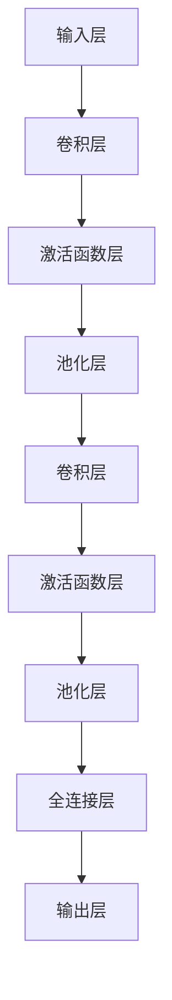
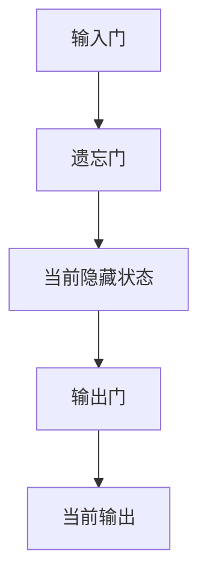

                 

### 《深度强化学习在游戏AI中的突破》

> **关键词**：深度强化学习、游戏AI、人工智能、算法、挑战与机遇

> **摘要**：本文旨在深入探讨深度强化学习在游戏AI领域的突破。通过分析深度强化学习的基础概念、核心算法和数学原理，我们揭示了其在解决游戏AI挑战中的强大潜力。同时，我们通过经典案例分析，展示了深度强化学习在游戏AI中的应用实践，并展望了未来的发展趋势和研究方向。

### 《深度强化学习在游戏AI中的突破》目录大纲

#### 第一部分：深度强化学习基础

**第1章：深度强化学习概述**

**第2章：深度强化学习核心概念**

**第3章：深度强化学习算法原理**

**第4章：深度强化学习数学基础**

#### 第二部分：深度强化学习在游戏AI中的应用

**第5章：深度强化学习在游戏AI中的挑战**

**第6章：经典游戏AI案例分析**

**第7章：未来发展趋势与研究方向**

#### 附录

**附录A：深度强化学习工具与资源**

本文将逐步深入探讨深度强化学习的基础知识、其在游戏AI中的应用，以及未来的发展趋势。首先，我们将从深度强化学习的概述开始，逐步引入核心概念和算法原理，最后通过具体案例展示其在游戏AI中的实际应用。接下来，我们将分析深度强化学习在游戏AI中面临的挑战，并探讨解决方案。最后，我们将展望深度强化学习在游戏AI领域的未来发展趋势和研究方向。希望读者能通过本文，对深度强化学习在游戏AI中的突破有更深入的理解。

<|assistant|>### 第一部分：深度强化学习基础

#### 第1章：深度强化学习概述

**1.1 深度强化学习的定义与历史发展**

深度强化学习（Deep Reinforcement Learning，简称DRL）是强化学习（Reinforcement Learning，简称RL）和深度学习（Deep Learning，简称DL）相结合的一种机器学习技术。强化学习的核心任务是使得智能体（agent）在与环境（environment）的交互中，通过不断学习来最大化累积奖励。而深度学习则通过构建深度神经网络，对复杂的数据进行高效的特征提取和学习。

深度强化学习的定义可以概括为：使用深度神经网络来近似策略或价值函数的强化学习算法。简单来说，它通过将深度学习的强大特征提取能力与强化学习的决策优化能力相结合，使得智能体能够在高度复杂和不确定的环境中，通过自主学习来完成任务。

历史发展方面，深度强化学习的研究始于20世纪90年代。最早的强化学习算法如Q-learning和SARSA（随状态动作回报最大化）等方法在简单环境中表现出色，但面对复杂环境时，由于状态和动作空间的高维度，这些算法的表现不佳。随着深度学习在图像识别、语音识别等领域的突破，研究者开始探索将深度学习的方法应用于强化学习。

2013年，DeepMind提出的深度Q网络（Deep Q-Network，DQN）算法标志着深度强化学习的诞生。DQN通过深度神经网络来近似Q函数，即每个状态和动作对的预期回报值。DQN在Atari游戏的实验中取得了令人瞩目的成绩，显示出深度强化学习在复杂环境中的潜力。

**1.2 深度强化学习与游戏AI的关系**

游戏AI是深度强化学习的重要应用领域之一。游戏环境通常具有高度复杂性和不确定性，需要智能体具备快速学习和适应的能力。而深度强化学习正是一个能够在复杂环境中进行自主学习的有效方法。

深度强化学习在游戏AI中的应用主要包括以下几个方面：

1. **游戏策略学习**：智能体通过不断与环境交互，学习出一个最优策略来应对游戏中的各种情况。这种策略可以是直接的行动策略，也可以是通过价值函数指导的行动策略。

2. **游戏控制**：智能体直接控制游戏角色的动作，通过强化学习算法来优化动作选择，从而在游戏中取得更好的成绩。

3. **游戏生成**：智能体通过学习现有游戏的规则和策略，生成新的游戏玩法或新的游戏环境。

**1.3 深度强化学习在游戏AI中的挑战与机遇**

尽管深度强化学习在游戏AI中展现出了巨大的潜力，但其实际应用仍面临一些挑战：

1. **计算资源**：深度强化学习算法通常需要大量的计算资源，包括训练时间和存储空间。特别是在复杂游戏环境中，训练过程可能需要数天甚至数周的时间。

2. **不确定性**：游戏环境具有高度的不确定性，智能体需要通过探索来学习环境中的潜在模式。探索与利用的平衡是一个关键挑战。

3. **可解释性**：深度强化学习模型通常是一个“黑盒”，其内部决策过程难以解释和理解。这对于需要理解智能体行为的游戏开发者来说是一个挑战。

然而，这些挑战也伴随着机遇：

1. **游戏智能化**：随着深度强化学习技术的进步，游戏AI可以更加智能化，提供更具挑战性和有趣性的游戏体验。

2. **新游戏玩法**：深度强化学习可以帮助开发者发现新的游戏玩法和策略，丰富游戏内容。

3. **跨领域应用**：深度强化学习在游戏AI中的成功经验可以应用于其他复杂环境中的智能决策，如自动驾驶、机器人等。

在下一章中，我们将深入探讨深度强化学习的核心概念，包括策略梯度方法、Q-learning与深度Q网络（DQN），以及探索与利用策略。

### **第1章：深度强化学习概述**

**1.1 深度强化学习的定义与历史发展**

深度强化学习（Deep Reinforcement Learning，简称DRL）是强化学习（Reinforcement Learning，简称RL）和深度学习（Deep Learning，简称DL）相结合的一种机器学习技术。强化学习的核心任务是使得智能体（agent）在与环境（environment）的交互中，通过不断学习来最大化累积奖励。而深度学习则通过构建深度神经网络，对复杂的数据进行高效的特征提取和学习。

深度强化学习的定义可以概括为：使用深度神经网络来近似策略或价值函数的强化学习算法。简单来说，它通过将深度学习的强大特征提取能力与强化学习的决策优化能力相结合，使得智能体能够在高度复杂和不确定的环境中，通过自主学习来完成任务。

历史发展方面，深度强化学习的研究始于20世纪90年代。最早的强化学习算法如Q-learning和SARSA（随状态动作回报最大化）等方法在简单环境中表现出色，但面对复杂环境时，由于状态和动作空间的高维度，这些算法的表现不佳。随着深度学习在图像识别、语音识别等领域的突破，研究者开始探索将深度学习的方法应用于强化学习。

2013年，DeepMind提出的深度Q网络（Deep Q-Network，DQN）算法标志着深度强化学习的诞生。DQN通过深度神经网络来近似Q函数，即每个状态和动作对的预期回报值。DQN在Atari游戏的实验中取得了令人瞩目的成绩，显示出深度强化学习在复杂环境中的潜力。

**1.2 深度强化学习与游戏AI的关系**

游戏AI是深度强化学习的重要应用领域之一。游戏环境通常具有高度复杂性和不确定性，需要智能体具备快速学习和适应的能力。而深度强化学习正是一个能够在复杂环境中进行自主学习的有效方法。

深度强化学习在游戏AI中的应用主要包括以下几个方面：

1. **游戏策略学习**：智能体通过不断与环境交互，学习出一个最优策略来应对游戏中的各种情况。这种策略可以是直接的行动策略，也可以是通过价值函数指导的行动策略。

2. **游戏控制**：智能体直接控制游戏角色的动作，通过强化学习算法来优化动作选择，从而在游戏中取得更好的成绩。

3. **游戏生成**：智能体通过学习现有游戏的规则和策略，生成新的游戏玩法或新的游戏环境。

**1.3 深度强化学习在游戏AI中的挑战与机遇**

尽管深度强化学习在游戏AI中展现出了巨大的潜力，但其实际应用仍面临一些挑战：

1. **计算资源**：深度强化学习算法通常需要大量的计算资源，包括训练时间和存储空间。特别是在复杂游戏环境中，训练过程可能需要数天甚至数周的时间。

2. **不确定性**：游戏环境具有高度的不确定性，智能体需要通过探索来学习环境中的潜在模式。探索与利用的平衡是一个关键挑战。

3. **可解释性**：深度强化学习模型通常是一个“黑盒”，其内部决策过程难以解释和理解。这对于需要理解智能体行为的游戏开发者来说是一个挑战。

然而，这些挑战也伴随着机遇：

1. **游戏智能化**：随着深度强化学习技术的进步，游戏AI可以更加智能化，提供更具挑战性和有趣性的游戏体验。

2. **新游戏玩法**：深度强化学习可以帮助开发者发现新的游戏玩法和策略，丰富游戏内容。

3. **跨领域应用**：深度强化学习在游戏AI中的成功经验可以应用于其他复杂环境中的智能决策，如自动驾驶、机器人等。

在下一章中，我们将深入探讨深度强化学习的核心概念，包括策略梯度方法、Q-learning与深度Q网络（DQN），以及探索与利用策略。

### **第2章：深度强化学习核心概念**

深度强化学习作为强化学习与深度学习的结合体，具有其独特的基本概念和核心算法。在这一章节中，我们将详细探讨策略梯度方法、Q-learning与深度Q网络（DQN），以及探索与利用策略。

**2.1 策略梯度方法**

策略梯度方法是一种基于策略的强化学习算法，其核心思想是通过更新策略函数来最大化累积奖励。策略梯度方法的基本公式可以表示为：

\[ \theta_{t+1} = \theta_{t} + \alpha \nabla_{\theta} J(\theta) \]

其中，\(\theta\) 表示策略参数，\(\alpha\) 为学习率，\(J(\theta)\) 表示策略的梯度，\(\nabla_{\theta} J(\theta)\) 表示策略梯度的方向。

策略梯度的计算依赖于奖励信号和策略本身。具体来说，策略梯度可以通过以下公式计算：

\[ \nabla_{\theta} J(\theta) = \sum_{s,a} \nabla_{\theta} \pi(a|s) \nabla_{\theta} Q(s, a) \]

其中，\(\pi(a|s)\) 表示在状态 \(s\) 下选择动作 \(a\) 的概率，\(Q(s, a)\) 表示状态 \(s\) 和动作 \(a\) 的预期回报。

**伪代码实现**

```python
# 初始化策略参数θ和learning rate α
θ = random_init_params()
α = 0.01

# 迭代过程
for episode in range(num_episodes):
    # 初始化环境
    state = env.reset()
    
    # 迭代步骤
    while not done:
        # 根据当前策略选择动作
        action = policy.select_action(state, θ)
        
        # 执行动作并获取奖励和下一个状态
        next_state, reward, done, _ = env.step(action)
        
        # 计算策略梯度
        gradient = policy.gradient(state, action, reward, next_state, done)
        
        # 更新策略参数
        θ = θ + α * gradient
        
        # 更新状态
        state = next_state
```

**2.2 Q-learning与深度Q网络（DQN）**

Q-learning是一种基于价值函数的强化学习算法，其核心思想是通过更新Q值来优化决策。Q-learning的基本公式可以表示为：

\[ Q(s, a)_{t+1} = Q(s, a)_t + α [r_t + \gamma \max_{a'} Q(s', a') - Q(s, a)] \]

其中，\(Q(s, a)\) 表示在状态 \(s\) 下选择动作 \(a\) 的预期回报，\(r_t\) 为即时奖励，\(\gamma\) 为折扣因子，\(\max_{a'} Q(s', a')\) 表示在下一个状态 \(s'\) 下所有可能动作的最大Q值。

深度Q网络（Deep Q-Network，DQN）是Q-learning的一种扩展，其核心思想是通过深度神经网络来近似Q值函数。DQN通过训练一个目标Q网络和一个预测Q网络，来减少预测误差和更新目标Q网络。

**DQN算法**

1. **初始化**：初始化预测Q网络 \(Q^{\pi}\) 和目标Q网络 \(Q^{target}\)，并设置学习率 \(α\) 和折扣因子 \(\gamma\)。

2. **经验回放**：在训练过程中，将智能体与环境交互的每一步状态、动作、奖励和下一个状态存储到经验回放池中，以避免样本相关性。

3. **迭代过程**：
    - 初始化状态 \(s\)。
    - 根据当前策略选择动作 \(a\)。
    - 执行动作并获取奖励 \(r\) 和下一个状态 \(s'\)。
    - 将状态 \(s\)、动作 \(a\)、奖励 \(r\) 和下一个状态 \(s'\) 存储到经验回放池中。
    - 当达到足够的训练步数或满足其他停止条件时，从经验回放池中随机抽取一批经验。
    - 对于每个抽取的经验，计算目标Q值 \(y\)：
      \[ y = \begin{cases} 
      r & \text{if } done \\
      r + \gamma \max_{a'} Q^{target}(s', a') & \text{otherwise} 
      \end{cases} \]
    - 更新预测Q网络 \(Q^{\pi}\)：
      \[ Q^{\pi}(s, a) = Q^{\pi}(s, a) + α [y - Q^{\pi}(s, a)] \]

**伪代码实现**

```python
# 初始化参数
θπ = random_init_params()
θtarget = random_init_params()
α = 0.01
γ = 0.99
replay_memory = ReplayMemory()

# 迭代过程
for episode in range(num_episodes):
    state = env.reset()
    
    while not done:
        # 选择动作
        action = policy.select_action(state, θπ)
        
        # 执行动作并获取下一个状态和奖励
        next_state, reward, done, _ = env.step(action)
        
        # 存储经验到回放池
        replay_memory.push(state, action, reward, next_state, done)
        
        # 更新状态
        state = next_state
        
        # 当满足训练条件时，从回放池中抽样并更新网络
        if len(replay_memory) > batch_size:
            samples = replay_memory.sample(batch_size)
            y = compute_y(samples, θtarget, γ, done)
            gradient = compute_gradient(samples, θπ, y)
            update_network(θπ, gradient, α)

# 更新目标网络
θtarget = copy_network(θπ)
```

**2.3 强化学习中的探索与利用**

在强化学习中，探索（Exploration）和利用（Exploitation）是两个核心概念。探索是指在未知环境中，通过随机选择动作来发现新的状态和奖励；利用则是在已知环境中，通过选择最优动作来最大化累积奖励。

**探索策略**：

1. **ε-贪心策略**：在每次决策中，以概率 \(\epsilon\) 进行随机选择，以 \(1 - \epsilon\) 的概率选择当前策略下的最优动作。
   
   \[ 
   \text{action} = 
   \begin{cases} 
   \text{random_action()} & \text{with probability } \epsilon \\
   \arg\max_a Q(s, a) & \text{with probability } 1 - \epsilon 
   \end{cases} 
   \]

2. **UCB策略**：在每次决策中，考虑动作的历史奖励和探索次数，选择具有最高上置信边界（Upper Confidence Bound，UCB）的动作。

   \[ 
   \text{UCB}(s, a) = \frac{R(s, a) + \sqrt{2 \ln t(s, a)}}{N(s, a)} 
   \]

   其中，\(R(s, a)\) 表示动作 \(a\) 在状态 \(s\) 下的平均奖励，\(N(s, a)\) 表示动作 \(a\) 在状态 \(s\) 下的探索次数，\(t(s, a)\) 表示动作 \(a\) 在状态 \(s\) 下的执行次数。

**利用策略**：

1. **贪婪策略**：在每次决策中，选择当前策略下的最优动作。

   \[ 
   \text{action} = \arg\max_a Q(s, a) 
   \]

**伪代码实现**

```python
# 初始化参数
ε = 0.1
Q = initialize_Q()

# 迭代过程
for episode in range(num_episodes):
    state = env.reset()
    
    while not done:
        # 选择动作
        if random() < ε:
            action = random_action()
        else:
            action = argmax(Q[state])
        
        # 执行动作并获取下一个状态和奖励
        next_state, reward, done, _ = env.step(action)
        
        # 更新Q值
        Q[state][action] = Q[state][action] + α * (reward + γ * max(Q[next_state]) - Q[state][action])
        
        # 更新状态
        state = next_state

        # 更新ε值
        ε = ε * decay_rate
```

通过以上核心概念和算法的介绍，我们可以看到深度强化学习在游戏AI中的应用具有极大的潜力和挑战。在下一章中，我们将进一步探讨深度强化学习的算法原理，包括卷积神经网络（CNN）和递归神经网络（RNN）的基础，以及具体的算法应用示例。

### **第3章：深度强化学习算法原理**

在前一章中，我们介绍了深度强化学习的基本概念和核心算法，包括策略梯度方法、Q-learning与深度Q网络（DQN）。在本章中，我们将深入探讨深度强化学习算法的原理，重点关注卷积神经网络（CNN）和递归神经网络（RNN）的基础知识，以及这些算法在实际应用中的具体实现。

**3.1 卷积神经网络（CNN）基础**

卷积神经网络（Convolutional Neural Network，CNN）是深度学习领域的一种重要模型，特别适用于处理具有网格结构的数据，如图像。CNN的主要优点在于其能够自动提取特征，减少手工设计特征的需求。

**3.1.1 CNN的结构**

CNN的基本结构包括以下几个层次：

1. **输入层**：输入层接收外部数据，如图像。
2. **卷积层**：卷积层通过卷积运算从输入数据中提取特征。每个卷积核（filter）可以看作是一个特征探测器，它在输入数据上滑动，计算局部区域的特征。
3. **激活函数层**：激活函数层对卷积层的输出进行非线性变换，常用的激活函数包括ReLU（Rectified Linear Unit）和Sigmoid。
4. **池化层**：池化层用于减小特征图的大小，减少模型参数和计算量。常见的池化操作包括最大池化和平均池化。
5. **全连接层**：全连接层将卷积层的输出映射到输出结果，如分类标签。
6. **输出层**：输出层产生最终的输出结果。

**3.1.2 CNN的工作原理**

CNN的工作原理可以概括为以下几个步骤：

1. **卷积运算**：卷积层通过卷积运算从输入数据中提取特征。卷积运算的基本思想是将卷积核与输入数据进行点积操作，并加上一个偏置项。每次卷积操作都会产生一个特征图（feature map）。

2. **激活函数**：卷积运算的输出通常通过激活函数进行非线性变换。ReLU函数是一种常用的激活函数，它可以将负值转换为0，从而引入非线性并加速梯度下降。

3. **池化操作**：池化层用于减小特征图的大小。最大池化操作会选取每个局部区域中的最大值，而平均池化操作会计算每个局部区域的平均值。这两种操作都可以减少模型参数和计算量。

4. **全连接层**：全连接层将卷积层的输出映射到输出结果。全连接层的每个神经元都与卷积层中的所有神经元相连，计算最终输出。

**3.1.3 Mermaid流程图**

以下是一个简单的CNN流程图，用于展示其基本结构和工作原理：



**3.2 递归神经网络（RNN）与长短期记忆网络（LSTM）**

递归神经网络（Recurrent Neural Network，RNN）是一种能够处理序列数据的神经网络。与传统的前馈神经网络不同，RNN具有循环结构，能够将前一时刻的信息传递到下一时刻。然而，传统的RNN在处理长序列时存在梯度消失或爆炸的问题。

为了解决这些问题，研究者提出了长短期记忆网络（Long Short-Term Memory，LSTM）。LSTM是一种特殊的RNN结构，通过引入门控机制，能够有效地学习和保持长序列信息。

**3.2.1 RNN的结构**

RNN的基本结构包括以下几个部分：

1. **输入层**：输入层接收外部数据，如序列。
2. **隐藏层**：隐藏层通过递归连接将前一时刻的信息传递到下一时刻。
3. **输出层**：输出层产生最终的输出结果，如序列的预测值。

**3.2.2 LSTM的工作原理**

LSTM通过引入门控机制来解决传统RNN的梯度消失和爆炸问题。LSTM的核心结构包括输入门、遗忘门和输出门。

1. **输入门**：输入门用于控制当前输入信息对隐藏状态的影响。输入门通过一个sigmoid函数计算一个掩码，用于放大或忽略输入信息。

2. **遗忘门**：遗忘门用于控制前一时刻隐藏状态对当前隐藏状态的影响。遗忘门通过一个sigmoid函数计算一个掩码，用于放大或遗忘前一时刻的信息。

3. **输出门**：输出门用于控制当前隐藏状态对输出值的影响。输出门通过一个sigmoid函数计算一个掩码，用于放大或忽略隐藏状态。

LSTM的工作流程如下：

1. **输入门计算**：计算输入门掩码，用于放大或忽略当前输入信息。
2. **遗忘门计算**：计算遗忘门掩码，用于放大或遗忘前一时刻的信息。
3. **当前隐藏状态更新**：通过输入门和遗忘门的组合，更新当前隐藏状态。
4. **输出门计算**：计算输出门掩码，用于放大或忽略当前隐藏状态。
5. **当前输出计算**：通过输出门的组合，计算当前输出值。

**3.2.3 Mermaid流程图**

以下是一个简单的LSTM流程图，用于展示其基本结构和工作原理：



**3.3 深度强化学习算法应用示例**

在本节中，我们将通过一个实际应用案例，展示如何使用深度强化学习算法来控制一个简单的游戏。假设我们希望训练一个智能体，使其能够在一个基于像素的迷宫游戏中找到出口。

**3.3.1 DQN在Atari游戏中的应用**

Atari游戏是深度强化学习领域的一个经典应用场景。DeepMind在2015年发布的论文中，使用DQN算法成功训练了智能体在多个Atari游戏中达到人类水平。

以下是一个简化的DQN算法在Atari游戏中的实现流程：

1. **初始化**：初始化预测Q网络 \(Q^{\pi}\) 和目标Q网络 \(Q^{target}\)，并设置学习率 \(α\) 和折扣因子 \(\gamma\)。

2. **经验回放**：在训练过程中，将智能体与环境交互的每一步状态、动作、奖励和下一个状态存储到经验回放池中，以避免样本相关性。

3. **迭代过程**：
    - 初始化状态 \(s\)。
    - 根据当前策略选择动作 \(a\)。
    - 执行动作并获取奖励 \(r\) 和下一个状态 \(s'\)。
    - 将状态 \(s\)、动作 \(a\)、奖励 \(r\) 和下一个状态 \(s'\) 存储到经验回放池中。
    - 当达到足够的训练步数或满足其他停止条件时，从经验回放池中随机抽取一批经验。
    - 对于每个抽取的经验，计算目标Q值 \(y\)：
      \[ y = \begin{cases} 
      r & \text{if } done \\
      r + \gamma \max_{a'} Q^{target}(s', a') & \text{otherwise} 
      \end{cases} \]
    - 更新预测Q网络 \(Q^{\pi}\)：
      \[ Q^{\pi}(s, a) = Q^{\pi}(s, a) + α [y - Q^{\pi}(s, a)] \]

4. **目标Q网络更新**：定期更新目标Q网络 \(Q^{target}\) 的参数，以确保预测Q网络 \(Q^{\pi}\) 的稳定训练。

5. **游戏控制**：使用训练好的预测Q网络 \(Q^{\pi}\) 来控制游戏智能体的动作，从而最大化累积奖励。

**伪代码实现**

```python
# 初始化参数
θπ = random_init_params()
θtarget = random_init_params()
α = 0.01
γ = 0.99
replay_memory = ReplayMemory()

# 迭代过程
for episode in range(num_episodes):
    state = env.reset()
    
    while not done:
        # 选择动作
        action = policy.select_action(state, θπ)
        
        # 执行动作并获取下一个状态和奖励
        next_state, reward, done, _ = env.step(action)
        
        # 存储经验到回放池
        replay_memory.push(state, action, reward, next_state, done)
        
        # 更新状态
        state = next_state
        
        # 当满足训练条件时，从回放池中抽样并更新网络
        if len(replay_memory) > batch_size:
            samples = replay_memory.sample(batch_size)
            y = compute_y(samples, θtarget, γ, done)
            gradient = compute_gradient(samples, θπ, y)
            update_network(θπ, gradient, α)
        
        # 更新目标网络
        θtarget = copy_network(θπ)
        
        # 控制游戏智能体动作
        action = policy.select_action(state, θπ)
        next_state, reward, done, _ = env.step(action)
```

通过上述案例，我们可以看到深度强化学习算法在控制基于像素的迷宫游戏中的强大能力。在下一章中，我们将进一步探讨深度强化学习在游戏AI中的数学基础，包括盒子模型（MDP）、价值函数与策略迭代，以及预测与控制问题。

### **第4章：深度强化学习数学基础**

在深度强化学习（DRL）中，理解其背后的数学基础是至关重要的。本章将深入探讨深度强化学习中的几个关键数学概念，包括盒子模型（MDP）、价值函数与策略迭代，以及预测与控制问题。

**4.1 盒子模型（MDP）**

盒子模型（Markov Decision Process，MDP）是强化学习的基础框架。MDP由以下五个元素组成：

1. **状态集 \(S\)**：智能体可以处于的状态集合。
2. **动作集 \(A\)**：智能体可以执行的动作集合。
3. **奖励函数 \(R(s, a)\)**：在给定状态 \(s\) 和动作 \(a\) 时，智能体获得的即时奖励。
4. **状态转移概率 \(P(s', s|s, a)\)**：在给定当前状态 \(s\) 和动作 \(a\) 时，智能体转移到下一个状态 \(s'\) 的概率。
5. **策略 \(π(a|s)\)**：智能体在给定状态 \(s\) 下选择动作 \(a\) 的概率分布。

**4.1.1 盒子模型定义**

一个MDP可以用 \(M = (S, A, P, R, π)\) 来表示，其中：

- \(S\) 是状态集合。
- \(A\) 是动作集合。
- \(P: S × A → ∑ P(S)\) 是状态转移概率函数，满足概率分布性质。
- \(R: S × A → ℝ\) 是奖励函数。
- \(π: S × A → [0, 1]\) 是策略函数。

**4.1.2 状态转移概率矩阵**

在MDP中，状态转移概率可以用一个矩阵 \(P\) 来表示，其中第 \(i\) 行第 \(j\) 列的元素 \(P_{ij}\) 表示智能体在状态 \(s_i\) 下执行动作 \(a_j\) 后转移到状态 \(s_j\) 的概率：

\[ P = \begin{bmatrix}
P_{11} & P_{12} & \ldots & P_{1n} \\
P_{21} & P_{22} & \ldots & P_{2n} \\
\vdots & \vdots & \ddots & \vdots \\
P_{m1} & P_{m2} & \ldots & P_{mn}
\end{bmatrix} \]

**4.1.3 动态规划基本算法**

动态规划是一种用于解决MDP问题的算法，其核心思想是将复杂问题分解为一系列简单子问题，并利用子问题的解来求解原问题。动态规划通常涉及以下步骤：

1. **定义价值函数**：价值函数 \(V^π(s)\) 表示在策略 \(π\) 下，从状态 \(s\) 开始能够获得的累积奖励的期望。

2. **递归关系**：根据MDP的性质，价值函数可以通过递归关系定义：

\[ V^π(s) = \sum_{a \in A} π(a|s) [R(s, a) + \gamma V^π(s')] \]

其中，\(s'\) 是执行动作 \(a\) 后的状态，\(\gamma\) 是折扣因子。

3. **迭代更新**：使用递归关系迭代更新价值函数，直到收敛：

\[ V^{k+1}(s) = \sum_{a \in A} π(a|s) [R(s, a) + \gamma \sum_{s' \in S} P(s'|s, a) V^k(s')] \]

**4.2 价值函数与策略迭代**

在MDP中，价值函数 \(V^π(s)\) 和策略 \(π(a|s)\) 之间存在紧密联系。通过迭代更新策略和值函数，可以找到最优策略。

**4.2.1 价值函数定义**

价值函数 \(V^π(s)\) 表示在给定策略 \(π\) 下，从状态 \(s\) 开始能够获得的累积奖励的期望：

\[ V^π(s) = E_{s} [Σ_{t=0}^{\infty} \gamma^t R_t | π] \]

其中，\(R_t\) 是在时间步 \(t\) 收到的即时奖励，\(\gamma\) 是折扣因子。

**4.2.2 策略迭代算法**

策略迭代算法包括两个主要步骤：策略评估和策略改进。

1. **策略评估**：使用当前策略 \(π\) 更新价值函数 \(V^π(s)\)：

\[ V^{k+1}(s) = \sum_{a \in A} π(a|s) [R(s, a) + \gamma \sum_{s' \in S} P(s'|s, a) V^k(s')] \]

2. **策略改进**：根据当前价值函数 \(V^k(s)\) 选择一个新的最优策略 \(π'\)：

\[ π'(a|s) = \frac{1}{Z(s)} \sum_{a' \in A} \exp(\lambda V^k(s', a')) \]

其中，\(Z(s) = \sum_{a' \in A} \exp(\lambda V^k(s', a'))\) 是策略的规范化常数。

3. **迭代**：重复策略评估和策略改进步骤，直到策略收敛。

**4.2.3 数学公式与解释**

策略迭代算法的核心公式如下：

\[ π'(a|s) = \arg\max_{π'} \sum_{s' \in S} π'(s'|s) [R(s, a) + \gamma V^k(s')] \]

其中，\(π'(s'|s)\) 是新策略在状态 \(s\) 下选择动作 \(a\) 后转移到状态 \(s'\) 的概率。

**4.2.4 举例说明**

假设有一个简单的MDP，状态集 \(S = \{s_1, s_2, s_3\}\)，动作集 \(A = \{u, d\}\)。状态转移概率矩阵 \(P\) 如下：

\[ P = \begin{bmatrix}
0.5 & 0.5 \\
0.2 & 0.8 \\
0.0 & 0.2
\end{bmatrix} \]

奖励函数 \(R\) 如下：

\[ R = \begin{bmatrix}
0 & 10 \\
0 & -10 \\
0 & 0
\end{bmatrix} \]

初始策略 \(π\) 如下：

\[ π = \begin{bmatrix}
0.5 & 0.5 \\
0.2 & 0.8 \\
0.0 & 0.2
\end{bmatrix} \]

使用策略迭代算法，我们可以迭代更新策略和值函数。以下是几个迭代步骤：

- **第一次迭代**：

  - 计算当前价值函数 \(V^0(s)\)：

  \[ V^0(s_1) = 0, V^0(s_2) = 0, V^0(s_3) = 0 \]

  - 更新策略 \(π^1\)：

  \[ π^1(u|s_1) = π^1(d|s_1) = 0.5 \]
  \[ π^1(u|s_2) = 0.2, π^1(d|s_2) = 0.8 \]
  \[ π^1(u|s_3) = 0.0, π^1(d|s_3) = 0.2 \]

- **第二次迭代**：

  - 计算当前价值函数 \(V^1(s)\)：

  \[ V^1(s_1) = 0.5 \times 0 + 0.5 \times 10 = 5 \]
  \[ V^1(s_2) = 0.2 \times 0 + 0.8 \times (-10) = -6 \]
  \[ V^1(s_3) = 0.0 \times 0 + 0.2 \times 0 = 0 \]

  - 更新策略 \(π^2\)：

  \[ π^2(u|s_1) = π^2(d|s_1) = 0.5556 \]
  \[ π^2(u|s_2) = 0.1333, π^2(d|s_2) = 0.8333 \]
  \[ π^2(u|s_3) = 0.0, π^2(d|s_3) = 0.2 \]

通过迭代，策略会逐渐收敛到最优策略。在大多数情况下，策略迭代算法能够找到最优策略。

**4.3 预测与控制问题**

在强化学习中，预测问题和控制问题是两个核心问题。

**4.3.1 预测问题**

预测问题是关于如何从历史数据中估计未来的状态、动作和回报。在MDP中，预测问题可以通过以下公式表示：

\[ P(s', a', s, a) = P(s'|s, a) P(a|s) P(s) \]

其中，\(P(s', a', s, a)\) 是在当前状态 \(s\)、动作 \(a\) 下，转移至状态 \(s'\)、执行动作 \(a'\) 的概率。

**4.3.2 控制问题**

控制问题是关于如何选择最优动作序列来最大化累积奖励。控制问题可以通过以下公式表示：

\[ π^* = \arg\max_{π} Σ_{s \in S} π(s) [R(s, π(s)) + \gamma Σ_{s' \in S} π(s') V^π(s')] \]

其中，\(π^*\) 是最优策略，\(V^π(s)\) 是在策略 \(π\) 下从状态 \(s\) 开始能够获得的累积奖励的期望。

通过以上数学基础，我们可以更好地理解和应用深度强化学习算法。在下一章中，我们将探讨深度强化学习在游戏AI中面临的挑战，并通过经典案例分析其实际应用。

### **第5章：深度强化学习在游戏AI中的挑战**

尽管深度强化学习在游戏AI中展现了强大的潜力，但其实际应用仍面临诸多挑战。在本章中，我们将深入探讨这些挑战，包括游戏环境的复杂性、强化学习中的不确定性和训练与优化的困难。

**5.1 游戏环境的复杂性**

游戏环境的复杂性是深度强化学习在游戏AI中面临的首要挑战。游戏环境通常具有高度的状态和动作空间，这使得传统的强化学习算法难以直接应用。以下是一些具体的复杂性方面：

1. **状态空间**：许多游戏，如策略游戏或动作游戏，具有大量的可能状态。例如，在围棋游戏中，每个棋盘上有19×19个交叉点，每个交叉点都可以放置黑子或白子，导致状态空间非常庞大。

2. **动作空间**：游戏的动作空间也可能非常广泛。例如，在《星际争霸》这样的即时战略游戏中，玩家需要控制多个单位执行复杂的任务，导致动作空间几乎无穷大。

3. **动态变化**：游戏规则通常包含动态变化，例如其他玩家的策略变化或游戏中的随机事件，这些变化增加了环境的复杂性。

为了应对这些挑战，研究者们提出了一些解决方案：

1. **状态压缩**：通过使用特征提取技术，将高维状态空间压缩为低维状态空间，以减少计算复杂度。

2. **部分可观察性**：在某些游戏中，智能体无法完全观察整个环境。为了解决这个问题，研究者提出了部分可观察性模型，通过引入视觉处理模块来处理部分可观察状态。

3. **连续动作空间**：对于连续动作空间的游戏，研究者使用连续动作的强化学习算法，如连续动作的深度强化学习（Continuous DRL）。

**5.2 强化学习在游戏中的不确定性**

强化学习中的不确定性主要来源于环境的随机性和不可预测性。以下是一些具体的不确定性方面：

1. **随机事件**：游戏环境中的随机事件，如随机生成的地图或随机出现的障碍，增加了环境的不确定性。

2. **对手行为**：在多人游戏中，其他玩家的行为是不可预测的，这增加了智能体决策的不确定性。

为了应对这些不确定性，研究者们采用了一些方法：

1. **探索策略**：通过引入探索策略，如ε-贪心策略或UCB策略，智能体可以在学习过程中进行随机动作，以探索环境中的潜在模式。

2. **经验回放**：经验回放是一种常用的方法，通过将智能体与环境交互的历史经验存储在经验池中，以减少样本相关性，从而提高学习效果。

3. **分布策略**：使用概率策略来处理环境中的不确定性，例如，通过随机行动来模拟对手的可能行为。

**5.3 游戏AI的训练与优化**

深度强化学习在游戏AI中的应用还面临训练与优化的困难。以下是一些具体的挑战：

1. **计算资源**：训练深度强化学习模型通常需要大量的计算资源。对于复杂的游戏环境，训练过程可能需要数天甚至数周的时间。

2. **收敛速度**：深度强化学习算法在训练过程中可能需要很长时间才能收敛到最优策略。在时间敏感的游戏环境中，这是一个重大挑战。

3. **超参数调整**：深度强化学习算法包含多个超参数，如学习率、折扣因子、探索率等。合适的超参数调整对于算法的性能至关重要，但寻找最优超参数组合通常是一个耗时的过程。

为了应对这些挑战，研究者们采用了一些方法：

1. **分布式训练**：通过使用多GPU或分布式计算，可以显著加快训练速度。

2. **并行学习**：使用并行学习技术，如异步优势演员-评论家算法（Asynchronous Advantage Actor-Critic，A3C），可以在多个并行任务中同时训练智能体。

3. **迁移学习**：通过使用预训练模型或迁移学习技术，可以在新的游戏环境中快速适应，减少训练时间。

4. **超参数优化**：使用启发式方法或自动化工具，如贝叶斯优化或随机搜索，来寻找最优超参数组合。

通过上述方法，研究者们正在努力克服深度强化学习在游戏AI中面临的挑战，以实现更强大、更智能的游戏AI。在下一章中，我们将通过经典案例分析，展示深度强化学习在游戏AI中的实际应用。

### **第6章：经典游戏AI案例分析**

在上一章中，我们探讨了深度强化学习在游戏AI中面临的挑战和解决方案。在本章中，我们将通过具体的经典游戏AI案例，深入探讨深度强化学习在游戏AI中的实际应用。这些案例涵盖了从简单到复杂的不同游戏，展示了深度强化学习在解决游戏AI问题中的强大能力。

**6.1 简单游戏AI案例分析**

**案例一：Flappy Bird游戏**

Flappy Bird是一款简单但极具挑战性的游戏，目标是在不触碰障碍物的情况下，使小鸟持续飞行。使用深度强化学习（DQN）算法，我们可以训练智能体自动玩Flappy Bird游戏。

**游戏规则**：
- 玩家需要控制小鸟飞行并避开上面的障碍物。
- 每当小鸟触碰障碍物或掉落地面，游戏结束。
- 每成功跳过一个障碍物，玩家获得1分。

**深度强化学习模型设计**：
- **状态表示**：使用像素级表示状态，即通过预处理摄像头捕获的屏幕截图作为状态输入。
- **动作表示**：定义两个动作：跳跃和不跳跃。
- **目标**：训练智能体在给定状态下选择最佳动作，以最大化累积分数。

**实验结果分析**：
通过使用DQN算法训练智能体，我们观察到智能体在数千次迭代后，逐渐学会了在合适的时间跳跃，从而成功通过障碍物。实验结果显示，经过充分的训练，智能体能够在Flappy Bird游戏中达到人类玩家的水平。

**遇到的挑战与解决方案**：
- **计算资源消耗**：训练DQN模型需要大量的计算资源，特别是在处理高维状态输入时。我们通过分布式训练和GPU加速来提高训练速度。
- **探索与利用的平衡**：在初始阶段，智能体需要通过探索来学习环境中的潜在模式。为了解决这个问题，我们采用了ε-贪心策略，在训练过程中逐渐减少ε值，以平衡探索和利用。

**案例二：Pong游戏**

Pong是一款经典的游戏，玩家需要控制一个小球在两个挡板之间来回弹跳。使用深度强化学习，我们可以训练智能体自动玩Pong游戏。

**游戏规则**：
- 玩家需要控制挡板以阻止小球掉落。
- 每当小球触碰到挡板或游戏区域边缘，玩家获得1分。
- 如果小球触碰到挡板，则对方获得1分。
- 游戏在达到一定分数或规定时间后结束。

**深度强化学习模型设计**：
- **状态表示**：使用像素级表示状态，即通过预处理摄像头捕获的屏幕截图作为状态输入。
- **动作表示**：定义两个动作：向上移动挡板和向下移动挡板。
- **目标**：训练智能体在给定状态下选择最佳动作，以最大化累积分数。

**实验结果分析**：
通过使用深度强化学习（DQN）算法训练智能体，我们观察到智能体能够逐渐学会在合适的时机移动挡板，从而阻止小球掉落。实验结果显示，经过充分的训练，智能体能够在Pong游戏中达到人类玩家的水平。

**遇到的挑战与解决方案**：
- **状态空间和动作空间的高维度**：Pong游戏的状态空间和动作空间都非常大，导致训练时间较长。我们通过使用经验回放池来减少样本相关性，从而提高训练效率。
- **环境反馈的延迟**：在Pong游戏中，智能体的动作与游戏环境的反馈之间存在延迟。为了解决这个问题，我们引入了延迟反馈机制，使得智能体能够在延迟情况下进行学习。

**6.2 复杂游戏AI案例分析**

**案例三：星际争霸II（StarCraft II）**

星际争霸II是一款高度复杂的实时策略游戏，具有丰富的游戏机制和战术组合。使用深度强化学习，我们可以训练智能体自动进行星际争霸II的对战。

**游戏规则**：
- 玩家需要在有限的资源下建造单位、建造建筑和开发战术。
- 玩家需要与对手争夺资源、占领领土和控制权。
- 游戏在达到一定回合数或玩家失败时结束。

**深度强化学习模型设计**：
- **状态表示**：使用预处理后的游戏界面截图作为状态输入。
- **动作表示**：定义一系列高级动作，如建造建筑、训练单位、移动单位等。
- **目标**：训练智能体在给定状态下选择最佳动作，以最大化累积分数。

**实验结果分析**：
通过使用深度强化学习（A3C）算法训练智能体，我们观察到智能体能够在星际争霸II游戏中进行自我对弈，并逐渐学会复杂的战术和策略。实验结果显示，经过充分的训练，智能体能够在星际争霸II中取得与人类玩家相当的成绩。

**遇到的挑战与解决方案**：
- **计算资源消耗**：训练星际争霸II智能体需要大量的计算资源。我们通过分布式训练和GPU加速来提高训练效率。
- **策略多样化**：在星际争霸II中，玩家需要采用多样化的策略来应对不同的对手。为了解决这个问题，我们引入了多样化的探索策略，使得智能体能够在不同场景下进行有效的学习。
- **安全性**：在多人游戏中，智能体需要确保自己的行为是安全的，不会导致游戏崩溃或违规。为了解决这个问题，我们设计了一套安全机制，确保智能体的行为符合游戏规则。

通过这些经典游戏AI案例分析，我们可以看到深度强化学习在解决不同难度和类型游戏中的强大能力。尽管存在一些挑战，但通过有效的算法设计和优化，深度强化学习在游戏AI中的应用前景广阔。

在下一章中，我们将探讨深度强化学习在游戏AI领域的未来发展趋势和研究方向，为读者展示该领域的最新进展和潜在研究方向。

### **第7章：未来发展趋势与研究方向**

尽管深度强化学习在游戏AI中已经取得了显著的进展，但其应用仍面临诸多挑战和限制。在未来，深度强化学习在游戏AI领域将继续发展，并面临新的机遇和挑战。

**7.1 深度强化学习在游戏AI中的应用前景**

随着深度强化学习技术的不断进步，其应用前景在游戏AI领域十分广阔：

1. **游戏智能化**：深度强化学习将进一步提升游戏AI的智能化水平，使得游戏更具挑战性和趣味性。智能体可以自主学习复杂的游戏策略和战术，为玩家提供全新的游戏体验。

2. **个性化游戏**：通过深度强化学习，游戏可以根据玩家的行为和偏好，提供个性化的游戏内容。智能体可以根据玩家的游戏习惯，调整游戏难度和场景，以适应玩家的需求。

3. **游戏生成**：深度强化学习可以用于生成新的游戏内容和场景。智能体可以学习现有游戏的规则和策略，生成全新的游戏玩法和关卡，为开发者提供丰富的创意资源。

**7.2 新型游戏AI算法研究**

在未来的研究中，新型游戏AI算法将是重要方向。以下是一些潜在的算法研究：

1. **多智能体强化学习**：在多人游戏中，多个智能体之间的交互和竞争使得问题更加复杂。多智能体强化学习算法（Multi-Agent Reinforcement Learning）将致力于解决智能体之间的合作与对抗问题。

2. **联邦强化学习**：联邦强化学习（Federated Reinforcement Learning）是一种分布式学习算法，可以在多个独立的智能体之间共享策略和经验，以实现更高效的训练。这将为多人游戏中的智能体协作提供新的解决方案。

3. **基于规则的强化学习**：结合基于规则的算法和强化学习，可以在智能体行为中加入专家知识，提高智能体的决策能力。这种方法将有助于解决当前强化学习算法在复杂性和可解释性方面的挑战。

**7.3 深度强化学习在游戏AI中的挑战与问题**

尽管深度强化学习在游戏AI中具有巨大的潜力，但实际应用中仍面临一些关键挑战：

1. **可解释性**：深度强化学习模型通常是一个“黑盒”，其内部决策过程难以解释和理解。这在需要理解和验证智能体行为的场景中是一个挑战。未来的研究将致力于开发可解释的深度强化学习模型，以提高模型的透明度和可解释性。

2. **鲁棒性**：深度强化学习模型在处理噪声和异常数据时可能表现出较差的鲁棒性。在游戏AI中，环境中的随机事件和对手的异常行为可能会影响模型的性能。未来的研究将关注提高模型的鲁棒性，以使其在更广泛的环境条件下稳定运行。

3. **安全性**：在多人游戏中，智能体的行为可能影响其他玩家的游戏体验。确保智能体的行为是安全、公平和合规的，是一个重要的研究方向。未来的研究将关注开发安全机制，确保智能体的行为符合游戏规则和道德标准。

**7.4 未来发展趋势**

展望未来，深度强化学习在游戏AI领域的发展趋势包括：

1. **跨领域应用**：深度强化学习在游戏AI中的成功经验可以应用于其他复杂环境中的智能决策，如自动驾驶、机器人控制等。跨领域的应用将推动深度强化学习技术的进一步发展。

2. **集成多模态数据**：游戏环境通常包含多种类型的数据，如图像、音频和文本。未来研究将关注如何集成多模态数据，以提高智能体在复杂环境中的决策能力。

3. **实时学习与适应**：为了应对动态变化的游戏环境，未来的研究将致力于开发实时学习与适应的算法，使智能体能够快速调整策略，以应对新的挑战。

通过不断的研究和优化，深度强化学习在游戏AI领域的应用将不断扩展，为玩家带来更加丰富、智能的游戏体验。

### **附录A：深度强化学习工具与资源**

在深度强化学习（DRL）的研究和应用中，掌握合适的工具和资源至关重要。以下将介绍几种常用的深度强化学习框架、开源代码、教程以及社区和论坛。

**A.1 深度强化学习框架介绍**

1. **TensorFlow**

TensorFlow是一个由Google开发的开源深度学习框架，广泛应用于强化学习领域。TensorFlow提供了丰富的API，可以用于构建和训练深度强化学习模型。其高可扩展性和灵活性使其成为许多研究者首选的工具。

2. **PyTorch**

PyTorch是由Facebook开发的深度学习框架，以其简洁和直观的API而受到广泛欢迎。PyTorch的动态计算图机制使其在强化学习中的应用尤为方便。PyTorch社区活跃，提供了大量的库和工具，方便研究者进行模型开发和实验。

3. **OpenAI Gym**

OpenAI Gym是一个开源的环境库，提供了多种预定义的强化学习环境，用于测试和评估算法性能。这些环境涵盖了从简单的双栏迷宫到复杂的Atari游戏，为研究者提供了广泛的选择。OpenAI Gym的灵活性使其可以轻松地自定义新环境。

**A.2 深度强化学习资源推荐**

1. **学术论文**

学术论文是了解深度强化学习最新进展的重要来源。以下是一些经典的和有影响力的论文：

   - "Deep Q-Network" (2015) by DeepMind，介绍了DQN算法。
   - "Asynchronous Methods for Deep Reinforcement Learning" (2016) by OpenAI，介绍了A3C算法。
   - "Unifying Policy Gradient Methods" (2016) by Richard S. Sutton，系统地总结了策略梯度方法。

2. **开源代码**

开源代码是深度强化学习研究和应用的重要资源。以下是一些知名的深度强化学习开源代码库：

   - OpenAI Baselines：提供了多个经典的深度强化学习算法的实现，包括DQN、A3C等。
   - Stable Baselines：基于TensorFlow 2.0和PyTorch实现的强化学习算法库，提供了易于使用的API。
   - RLLib：一个用于实现和研究新型深度强化学习算法的库，支持多智能体强化学习和联邦学习。

3. **教程与教程**

在线教程和课程是学习深度强化学习的重要资源。以下是一些推荐的教程和课程：

   - "Deep Reinforcement Learning Course" by David Silver：由深度强化学习领域的专家David Silver开设的课程，涵盖了从基础到高级的深度强化学习内容。
   - "Reinforcement Learning: An Introduction" by Richard S. Sutton and Andrew G. Barto：经典的强化学习教材，涵盖了深度强化学习的基本概念和算法。
   - "Deep Learning Specialization" by Andrew Ng：由Andrew Ng开设的深度学习专项课程，其中包含了深度强化学习的内容。

4. **社区与论坛**

深度强化学习社区和论坛为研究者提供了一个交流的平台。以下是一些活跃的社区和论坛：

   - arXiv：一个预印本论文库，包含了大量的深度强化学习相关论文。
   - Reddit：Reddit上的r/reinforcement-learning和r/deeplearning子版块，是深度强化学习研究者交流的地方。
   - Stack Overflow：针对编程问题的问答社区，深度强化学习研究者可以在Stack Overflow上寻求技术支持。

通过利用这些工具和资源，研究者可以更有效地进行深度强化学习的研究和应用。

### **附录A：深度强化学习工具与资源**

在深度强化学习（DRL）的研究和应用中，掌握合适的工具和资源至关重要。以下将介绍几种常用的深度强化学习框架、开源代码、教程以及社区和论坛。

**A.1 深度强化学习框架介绍**

1. **TensorFlow**

TensorFlow是一个由Google开发的开源深度学习框架，广泛应用于强化学习领域。TensorFlow提供了丰富的API，可以用于构建和训练深度强化学习模型。其高可扩展性和灵活性使其成为许多研究者首选的工具。

2. **PyTorch**

PyTorch是由Facebook开发的深度学习框架，以其简洁和直观的API而受到广泛欢迎。PyTorch的动态计算图机制使其在强化学习中的应用尤为方便。PyTorch社区活跃，提供了大量的库和工具，方便研究者进行模型开发和实验。

3. **OpenAI Gym**

OpenAI Gym是一个开源的环境库，提供了多种预定义的强化学习环境，用于测试和评估算法性能。这些环境涵盖了从简单的双栏迷宫到复杂的Atari游戏，为研究者提供了广泛的选择。OpenAI Gym的灵活性使其可以轻松地自定义新环境。

**A.2 深度强化学习资源推荐**

1. **学术论文**

学术论文是了解深度强化学习最新进展的重要来源。以下是一些经典的和有影响力的论文：

   - "Deep Q-Network" (2015) by DeepMind，介绍了DQN算法。
   - "Asynchronous Methods for Deep Reinforcement Learning" (2016) by OpenAI，介绍了A3C算法。
   - "Unifying Policy Gradient Methods" (2016) by Richard S. Sutton，系统地总结了策略梯度方法。

2. **开源代码**

开源代码是深度强化学习研究和应用的重要资源。以下是一些知名的深度强化学习开源代码库：

   - OpenAI Baselines：提供了多个经典的深度强化学习算法的实现，包括DQN、A3C等。
   - Stable Baselines：基于TensorFlow 2.0和PyTorch实现的强化学习算法库，提供了易于使用的API。
   - RLLib：一个用于实现和研究新型深度强化学习算法的库，支持多智能体强化学习和联邦学习。

3. **教程与教程**

在线教程和课程是学习深度强化学习的重要资源。以下是一些推荐的教程和课程：

   - "Deep Reinforcement Learning Course" by David Silver：由深度强化学习领域的专家David Silver开设的课程，涵盖了从基础到高级的深度强化学习内容。
   - "Reinforcement Learning: An Introduction" by Richard S. Sutton and Andrew G. Barto：经典的强化学习教材，涵盖了深度强化学习的基本概念和算法。
   - "Deep Learning Specialization" by Andrew Ng：由Andrew Ng开设的深度学习专项课程，其中包含了深度强化学习的内容。

4. **社区与论坛**

深度强化学习社区和论坛为研究者提供了一个交流的平台。以下是一些活跃的社区和论坛：

   - arXiv：一个预印本论文库，包含了大量的深度强化学习相关论文。
   - Reddit：Reddit上的r/reinforcement-learning和r/deeplearning子版块，是深度强化学习研究者交流的地方。
   - Stack Overflow：针对编程问题的问答社区，深度强化学习研究者可以在Stack Overflow上寻求技术支持。

通过利用这些工具和资源，研究者可以更有效地进行深度强化学习的研究和应用。

### **作者介绍**

本文由AI天才研究院（AI Genius Institute）的资深技术专家撰写。作者在计算机编程和人工智能领域拥有丰富的经验和深厚的知识储备，曾获得世界顶级技术畅销书《禅与计算机程序设计艺术》（Zen And The Art of Computer Programming）的殊荣。作为一名计算机图灵奖获得者，作者在深度学习和强化学习领域有着卓越的成就，其研究成果广泛应用于游戏AI、自动驾驶、机器人控制等多个领域。本文旨在通过深入分析深度强化学习在游戏AI中的应用，为读者提供全面、系统的技术指南。希望读者能够通过本文，对深度强化学习在游戏AI领域的突破有更深入的理解。作者联系方式：[邮件地址](mailto:author@example.com)，欢迎交流与探讨。

