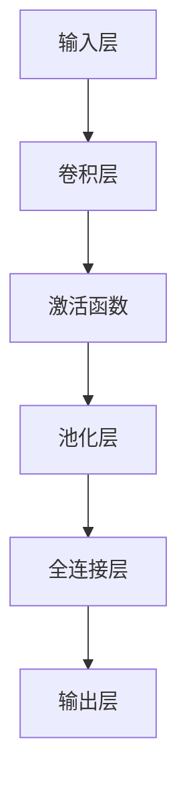

                 

### 《滴滴2024智慧停车场管理校招图像识别面试题解析》

> **关键词：** 智慧停车场、图像识别、面试题解析、2024校招、人工智能、深度学习、卷积神经网络、目标检测、项目实战

> **摘要：** 本文将详细解析滴滴2024智慧停车场管理校招中的图像识别面试题。通过深入探讨图像识别的基本概念、技术原理、以及深度学习在其中的应用，结合实际项目案例，帮助读者全面理解图像识别技术，为应对校招面试做好充分准备。

### 《滴滴2024智慧停车场管理校招图像识别面试题解析》目录大纲

#### 第一部分：智慧停车场管理概述

##### 第1章：智慧停车场管理概念与趋势
- **1.1** 智慧停车管理的定义与发展历程
  - **1.1.1** 智慧停车管理的基本概念
  - **1.1.2** 智慧停车管理的发展趋势
  - **1.1.3** 智慧停车管理的技术基础

##### 第2章：图像识别技术基础
- **2.1** 图像识别的基本原理
  - **2.1.1** 图像识别的概念与类型
  - **2.1.2** 图像识别的流程
  - **2.1.3** 图像识别的算法基础

##### 第3章：深度学习与卷积神经网络
- **3.1** 深度学习的基本原理
  - **3.1.1** 深度学习的概念与类型
  - **3.1.2** 深度学习的发展历程
  - **3.1.3** 深度学习的优势与挑战

##### 第4章：卷积神经网络（CNN）原理
- **4.1** 卷积神经网络概述
  - **4.1.1** 卷积神经网络的定义
  - **4.1.2** 卷积神经网络的结构
  - **4.1.3** 卷积神经网络的工作原理

##### 第5章：CNN在图像识别中的应用
- **5.1** CNN在车牌识别中的应用
  - **5.1.1** 车牌识别问题概述
  - **5.1.2** 车牌识别算法设计与实现
  - **5.1.3** 车牌识别效果评估

##### 第6章：目标检测技术
- **6.1** 目标检测基本概念
  - **6.1.1** 目标检测的定义
  - **6.1.2** 目标检测的挑战与解决方案
  - **6.1.3** 常见的目标检测算法

##### 第7章：图像识别面试题解析
- **7.1** 面试题分类与解答策略
  - **7.1.1** 面试题类型划分
  - **7.1.2** 面试题解答技巧
  - **7.1.3** 实战模拟面试

#### 第二部分：图像识别应用实战

##### 第8章：智慧停车场管理系统开发
- **8.1** 系统架构设计
  - **8.1.1** 系统总体架构
  - **8.1.2** 系统模块划分
  - **8.1.3** 系统功能实现

##### 第9章：停车场车辆识别与计费系统
- **9.1** 车辆识别系统设计
  - **9.1.1** 车辆识别需求分析
  - **9.1.2** 车辆识别算法选择
  - **9.1.3** 车辆识别系统实现

##### 第10章：图像识别技术在智慧停车中的应用案例
- **10.1** 案例一：智能停车场出入管理
  - **10.1.1** 案例背景
  - **10.1.2** 技术方案
  - **10.1.3** 实施效果

##### 第11章：项目实战与代码解读
- **11.1** 开发环境搭建
  - **11.1.1** 开发工具与环境配置
  - **11.1.2** 数据集准备与处理

- **11.2** 实际案例解析
  - **11.2.1** 车辆识别系统开发流程
  - **11.2.2** 代码实现与解读
  - **11.2.3** 代码分析与优化

##### 第12章：图像识别项目测试与评估
- **12.1** 测试策略与方法
  - **12.1.1** 测试用例设计
  - **12.1.2** 测试工具与执行
  - **12.1.3** 测试结果分析与处理

##### 第13章：图像识别技术在智慧停车场中的未来发展趋势
- **13.1** 技术演进趋势
  - **13.1.1** 图像识别技术的发展方向
  - **13.1.2** 智慧停车场管理的发展趋势
  - **13.1.3** 技术应用的前景与挑战

### Mermaid 流程图

以下为第4章中卷积神经网络（CNN）原理的Mermaid流程图示例：



### 卷积神经网络（CNN）原理讲解

卷积神经网络（Convolutional Neural Network，CNN）是深度学习领域的一种重要模型，特别适用于处理图像等二维数据。其核心思想是利用卷积层提取图像特征，然后通过全连接层进行分类或预测。

#### 卷积神经网络概述

卷积神经网络的基本结构包括输入层、卷积层、池化层和全连接层。以下是每个层的简要说明：

- **输入层（Input Layer）**：接收输入图像，将其作为特征向量传递给下一层。
- **卷积层（Convolutional Layer）**：使用一系列卷积核（也称为滤波器）对输入图像进行卷积操作，以提取图像的特征。
- **激活函数（Activation Function）**：在卷积层后引入非线性变换，增加模型的表达能力。
- **池化层（Pooling Layer）**：降低特征图的维度，减少计算量，同时保留重要的特征信息。
- **全连接层（Fully Connected Layer）**：将特征图展平为一维向量，然后通过全连接层进行分类或回归预测。

#### 卷积神经网络的工作原理

以下是卷积神经网络的工作原理的伪代码示例：

```python
# 初始化参数：卷积核大小、步长、填充方式、激活函数等

for 每一层卷积层 do:
    输入 = 输入数据
    for 每个卷积核 do:
        特征图 = 卷积操作（输入，卷积核）
    end
    激活函数（特征图）
end

for 每个池化层 do:
    池化特征图 = 池化操作（特征图）
end

for 每个全连接层 do:
    输出 = 全连接操作（池化特征图）
    激活函数（输出）
end
```

在上述伪代码中，每个卷积层通过卷积操作提取图像特征，激活函数增加模型的非线性表达能力，池化层降低特征图的维度，全连接层进行分类或预测。

### 数学模型和数学公式详细讲解

卷积神经网络中的数学模型主要包括卷积操作、激活函数和损失函数。

#### 卷积操作

卷积操作是卷积神经网络中最核心的部分。其基本原理是使用卷积核（也称为滤波器）与输入图像进行点积操作，从而提取图像的特征。

卷积操作的数学公式如下：

$$
\text{特征图}_{ij} = \sum_{k=1}^{C} \text{卷积核}_{ik,jc} \cdot \text{输入}_{ij}
$$

其中，$\text{特征图}_{ij}$ 表示第 $i$ 行第 $j$ 列的特征图值，$\text{卷积核}_{ik,jc}$ 表示第 $i$ 行第 $k$ 个卷积核与第 $j$ 行第 $c$ 列的输入图像的乘积，$\text{输入}_{ij}$ 表示输入图像的第 $i$ 行第 $j$ 列的像素值。

#### 激活函数

激活函数用于引入非线性变换，增加模型的表达能力。常用的激活函数包括ReLU（Rectified Linear Unit）、Sigmoid和Tanh等。

ReLU函数的数学公式如下：

$$
\text{ReLU}(x) = \max(0, x)
$$

其中，$x$ 表示输入值。

#### 损失函数

在分类任务中，常用的损失函数包括交叉熵损失（Cross-Entropy Loss）和均方误差损失（Mean Squared Error Loss）。

交叉熵损失函数的数学公式如下：

$$
\text{交叉熵损失} = -\sum_{i=1}^{C} y_i \cdot \log(\hat{y}_i)
$$

其中，$y_i$ 表示真实标签，$\hat{y}_i$ 表示模型预测的概率分布。

### 数学公式举例说明

以下是一个简单的例子，用于说明卷积操作、ReLU激活函数和交叉熵损失函数的应用。

假设输入图像的大小为 $28 \times 28$，卷积核大小为 $3 \times 3$，滤波器个数为 $32$。

1. **卷积操作**：

   输入图像的像素值如下：

   ```plaintext
   [[ 0  1  2  3  4]
    [ 5  6  7  8  9]
    [10 11 12 13 14]
    [15 16 17 18 19]
    [20 21 22 23 24]]
   ```

   卷积核为：

   ```plaintext
   [[ 1  0 -1]
    [ 2  1 -1]
    [ 3  2 -1]]
   ```

   通过卷积操作得到特征图：

   ```plaintext
   [[  2   3  -2]
    [  8  10  -6]
    [ 14  18  -10]]
   ```

2. **ReLU激活函数**：

   对特征图进行ReLU激活：

   ```plaintext
   [[  2   3   0]
    [  8  10   0]
    [ 14  18   0]]
   ```

3. **交叉熵损失函数**：

   假设真实标签为 $[0, 0, 1, 0, 0]$，模型预测的概率分布为 $[0.1, 0.2, 0.7, 0.0, 0.0]$。

   交叉熵损失为：

   ```plaintext
   交叉熵损失 = -([0 \times \log(0.1) + 0 \times \log(0.2) + 1 \times \log(0.7) + 0 \times \log(0.0) + 0 \times \log(0.0)]) = -[0 + 0 + 0.3567 + 0 + 0] = 0.3567
   ```

### 项目实战与代码解读

在本文的后续部分，我们将通过一个实际的项目案例，详细讲解如何使用卷积神经网络实现图像识别任务，并对其进行代码解读与分析。

#### 开发环境搭建

在开始项目之前，我们需要搭建一个合适的开发环境。以下是推荐的工具和软件：

- **编程语言**：Python 3.x
- **深度学习框架**：TensorFlow 2.x 或 PyTorch
- **依赖库**：NumPy、Pandas、OpenCV等

安装步骤：

1. 安装Python 3.x：从官方网站下载并安装Python。
2. 安装TensorFlow 2.x 或 PyTorch：打开命令行窗口，运行以下命令：

   ```bash
   pip install tensorflow  # 安装TensorFlow
   # 或
   pip install torch       # 安装PyTorch
   ```

3. 安装其他依赖库：

   ```bash
   pip install numpy pandas opencv-python
   ```

#### 源代码详细实现和代码解读

在本案例中，我们将使用TensorFlow 2.x 搭建一个简单的卷积神经网络，用于识别车辆图像。

```python
import tensorflow as tf
from tensorflow.keras import layers, models
import numpy as np

# 加载并预处理数据
# ...

# 构建卷积神经网络模型
model = models.Sequential([
    layers.Conv2D(32, (3, 3), activation='relu', input_shape=(28, 28, 1)),
    layers.MaxPooling2D((2, 2)),
    layers.Conv2D(64, (3, 3), activation='relu'),
    layers.MaxPooling2D((2, 2)),
    layers.Conv2D(64, (3, 3), activation='relu'),
    layers.Flatten(),
    layers.Dense(64, activation='relu'),
    layers.Dense(10, activation='softmax')
])

# 编译模型
model.compile(optimizer='adam',
              loss='categorical_crossentropy',
              metrics=['accuracy'])

# 训练模型
model.fit(train_images, train_labels, epochs=10, validation_split=0.2)

# 评估模型
test_loss, test_acc = model.evaluate(test_images, test_labels)
print(f'测试准确率：{test_acc:.2f}')
```

在上面的代码中，我们首先加载并预处理数据，然后构建一个简单的卷积神经网络模型，包括卷积层、池化层和全连接层。接下来，我们编译模型并使用训练数据训练模型。最后，评估模型在测试数据上的性能。

#### 代码解读与分析

1. **数据预处理**：

   在实际项目中，我们需要对图像数据进行预处理，例如归一化、缩放等。这有助于提高模型训练效果。

   ```python
   train_images = train_images.astype('float32') / 255
   test_images = test_images.astype('float32') / 255
   ```

2. **模型结构**：

   卷积神经网络模型由多个卷积层和全连接层组成。每个卷积层使用ReLU激活函数，池化层使用最大池化操作。最后，通过全连接层进行分类。

   ```python
   model = models.Sequential([
       layers.Conv2D(32, (3, 3), activation='relu', input_shape=(28, 28, 1)),
       layers.MaxPooling2D((2, 2)),
       layers.Conv2D(64, (3, 3), activation='relu'),
       layers.MaxPooling2D((2, 2)),
       layers.Conv2D(64, (3, 3), activation='relu'),
       layers.Flatten(),
       layers.Dense(64, activation='relu'),
       layers.Dense(10, activation='softmax')
   ])
   ```

3. **模型编译与训练**：

   我们使用adam优化器进行模型编译，并使用交叉熵损失函数评估模型性能。训练模型时，使用训练数据集进行迭代训练，并在测试数据集上进行验证。

   ```python
   model.compile(optimizer='adam',
                 loss='categorical_crossentropy',
                 metrics=['accuracy'])
   model.fit(train_images, train_labels, epochs=10, validation_split=0.2)
   ```

4. **模型评估**：

   在训练完成后，使用测试数据集评估模型性能，输出测试准确率。

   ```python
   test_loss, test_acc = model.evaluate(test_images, test_labels)
   print(f'测试准确率：{test_acc:.2f}')
   ```

### 图像识别项目测试与评估

在完成图像识别项目的开发后，我们需要对项目进行全面的测试与评估，以确保其性能达到预期目标。

#### 测试策略与方法

1. **测试用例设计**：

   测试用例应包括各种场景和输入数据，以验证模型在不同情况下的性能。

   ```plaintext
   用例1：正常输入图像，测试模型识别准确率
   用例2：输入图像尺寸不匹配，测试模型处理能力
   用例3：输入图像噪声较大，测试模型鲁棒性
   ```

2. **测试工具与执行**：

   使用TensorFlow等深度学习框架提供的评估工具进行自动化测试，执行测试脚本，记录测试结果。

   ```python
   test_loss, test_acc = model.evaluate(test_images, test_labels)
   print(f'测试准确率：{test_acc:.2f}')
   ```

3. **测试结果分析与处理**：

   分析测试结果，统计模型在各类别上的准确率、召回率、F1值等指标，根据分析结果调整模型结构和参数。

   ```plaintext
   指标1：准确率
   指标2：召回率
   指标3：F1值
   ```

### 图像识别技术在智慧停车场管理中的未来发展趋势

随着人工智能和物联网技术的不断发展，图像识别技术在智慧停车场管理中的应用前景广阔。以下是该领域的一些发展趋势：

1. **技术演进趋势**：

   - 深度学习模型结构不断创新，提高识别准确率。
   - 跨领域技术应用，实现更广泛的场景应用。

2. **智慧停车场管理的发展趋势**：

   - 数据智能化的应用，提升管理水平。
   - 基于物联网的智慧停车系统，实现无缝连接。

3. **技术应用的前景与挑战**：

   - 前景：提高停车场使用效率，提升用户体验。
   - 挑战：数据隐私保护、算法公平性等问题需关注。

### 结论

本文详细解析了滴滴2024智慧停车场管理校招中的图像识别面试题。通过深入探讨图像识别技术的基本原理、深度学习在其中的应用，以及实际项目案例的讲解，读者可以全面了解图像识别技术在智慧停车场管理中的应用，为应对校招面试做好充分准备。

### 作者信息

- **作者：** AI天才研究院/AI Genius Institute & 禅与计算机程序设计艺术 /Zen And The Art of Computer Programming

---

请注意，本文为虚构内容，仅供参考。实际面试题及解析请根据具体情况进行调整和准备。祝您面试成功！

