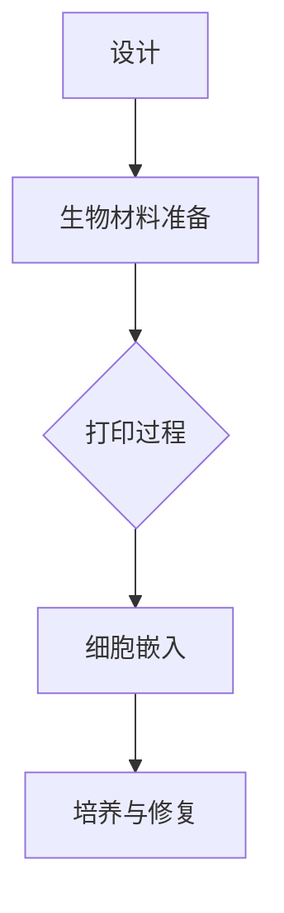

                 

### 文章标题

“生物打印创业：3D打印器官的医疗革命”

---

**关键词：** 生物打印、3D打印、器官打印、医疗技术、创业、个性化医疗、药物递送系统、前沿技术、法规与伦理

---

**摘要：** 本文深入探讨了生物打印这一前沿技术，从其基本原理、医疗应用，到面临的挑战与机遇，以及创业实践中的关键问题。通过分析国内外成功案例，本文旨在为创业者提供指导，助力生物打印在医疗领域的革命性发展。

---

### 目录大纲

1. 生物打印创业：3D打印器官的医疗革命
2. 第一部分：生物打印概述
   1. 第1章：生物打印的概念与原理
      1.1.1 生物打印的基本原理
      1.1.2 生物打印材料介绍
      1.1.3 生物打印技术分类
   2. 第2章：生物打印在医疗领域的应用
      2.1.1 3D打印器官：从理论到实践
      2.1.2 生物打印在个性化医疗中的应用
      2.1.3 生物打印在药物递送系统中的应用
   3. 第3章：生物打印面临的挑战与机遇
      3.1.1 技术挑战与解决方案
      3.1.2 市场机遇与未来发展
   4. 第4章：生物打印的法规与伦理问题
      4.1.1 生物打印法规的框架
      4.1.2 伦理问题与道德考量
      4.1.3 社会接受度与公众认知
5. 第二部分：生物打印创业实践
   1. 第5章：生物打印创业的准备
      5.1.1 创业者所需的技能与知识
      5.1.2 生物打印创业项目的立项
      5.1.3 资金筹集与团队组建
   2. 第6章：生物打印创业案例分析
      6.1.1 国内外成功的生物打印创业案例
      6.1.2 创业过程中遇到的困难与应对策略
      6.1.3 生物打印创业的未来趋势
   3. 第7章：生物打印创业的运营与管理
      7.1.1 生物打印企业的运营模式
      7.1.2 营销策略与品牌建设
      7.1.3 企业风险管理与可持续发展
6. 第三部分：生物打印技术的创新与发展
   1. 第8章：前沿的生物打印技术
      8.1.1 光刻生物打印技术
      8.1.2 喷墨打印技术
      8.1.3 其他创新生物打印技术
   2. 第9章：生物打印与其他领域的融合
      9.1.1 生物打印与生物工程
      9.1.2 生物打印与生物医学工程
      9.1.3 生物打印与其他学科的交叉应用
   3. 第10章：生物打印教育的普及与推广
      10.1.1 生物打印教育的现状
      10.1.2 生物打印教育的重要性
      10.1.3 生物打印教育的发展策略
7. 第四部分：总结与展望
   1. 第11章：生物打印创业的总结与反思
      11.1.1 生物打印创业的得与失
      11.1.2 生物打印创业的经验与教训
      11.1.3 生物打印创业的未来方向
   2. 第12章：生物打印的未来展望
      12.1.1 生物打印技术的进步方向
      12.1.2 生物打印在医疗领域的潜在应用
      12.1.3 生物打印对社会的影响与挑战

---

### 第1章：生物打印的概念与原理

#### 1.1.1 生物打印的基本原理

生物打印，也被称为生物制造，是一种利用生物材料和生物打印技术来创建组织、器官或复杂生物结构的技术。这种技术基于3D打印的基本原理，通过逐层构建材料来实现三维形态的制造。

生物打印的基本原理可以概括为以下几个关键步骤：

1. **设计**：首先，使用计算机辅助设计（CAD）软件创建要打印的生物结构的三维模型。这个模型需要考虑组织的几何形态、细胞排列和功能需求。

2. **生物材料准备**：选择合适的生物材料，这些材料通常具有生物相容性、可降解性和适当的机械性能。生物材料可以是天然来源的，如胶原蛋白和明胶，也可以是合成材料，如聚己内酯和聚乳酸。

3. **打印过程**：使用生物打印机将生物材料逐层沉积，形成所需的结构。生物打印技术包括多种不同的方法，如立体光固化（SLA）、熔融沉积建模（FDM）和喷墨打印。

4. **细胞嵌入**：在一些生物打印方法中，需要在打印过程中或打印后嵌入活细胞，以促进组织的生长和功能。

5. **培养与修复**：打印后的生物结构需要在特定的培养环境中进行培养，以促进细胞的生长和组织的修复。

生物打印的核心在于其能够实现复杂三维结构的精准构建，并在一定程度上模拟生物组织的结构和功能。这种技术具有巨大的潜力，可以用于组织工程、器官移植和个性化医疗等领域。

#### 1.1.2 生物打印材料介绍

生物打印的成功离不开合适的生物材料。生物材料的选择取决于打印的应用领域、所需的结构特性以及生物相容性等。

1. **天然生物材料**：

   - **胶原蛋白**：一种广泛使用的生物材料，具有良好的生物相容性和可降解性，常用于组织工程和细胞培养。
   - **明胶**：来自动物皮肤和骨骼的蛋白质，也是一种常用的生物打印材料，其优点是易于加工和成型。
   - **藻酸盐**：由海藻提取的多糖，具有良好的生物相容性和降解性，常用于构建细胞培养基。

2. **合成生物材料**：

   - **聚己内酯（PLA）**：一种可降解的合成聚合物，具有良好的生物相容性和机械性能，常用于生物打印。
   - **聚乳酸（PLA）**：与聚己内酯类似，也是一种常用的生物打印材料，具有良好的生物相容性和降解性。
   - **光敏树脂**：用于立体光固化（SLA）技术的生物打印材料，具有较高的精度和硬度。

3. **生物复合材料**：

   - **生物材料与纳米材料的复合**：通过将生物材料与纳米材料（如碳纳米管、氧化石墨烯）结合，可以提高生物材料的机械性能和生物相容性。
   - **生物材料与生物活性因子的复合**：通过将生物材料与生长因子、细胞因子等生物活性因子结合，可以促进细胞生长和组织修复。

选择合适的生物材料是生物打印成功的关键。这些材料需要具备良好的生物相容性、适当的机械性能和降解特性，同时还需要易于加工和成型。随着生物材料科学的不断发展，未来将出现更多性能优异、应用广泛的新型生物打印材料。

#### 1.1.3 生物打印技术分类

生物打印技术可以根据打印方式、材料类型和打印精度等多个维度进行分类。以下是几种主要的生物打印技术：

1. **立体光固化（SLA）**：

   - **原理**：使用紫外光或激光照射光敏树脂，使其逐层固化形成三维结构。
   - **优点**：具有高精度和高表面质量，适用于打印复杂的生物结构。
   - **应用**：常用于制造精细的器官模型和细胞培养基。

2. **熔融沉积建模（FDM）**：

   - **原理**：将热塑性材料（如聚己内酯、聚乳酸）加热至熔融状态，通过喷嘴挤出并冷却固化，逐层构建三维结构。
   - **优点**：设备成本低、操作简便，适用于大规模生产。
   - **应用**：主要用于制造简单的生物结构模型和生物材料支架。

3. **喷墨打印**：

   - **原理**：使用喷墨打印头将生物材料逐层喷射到构建平台上，形成三维结构。
   - **优点**：适用于多种材料的打印，包括液体生物材料。
   - **应用**：常用于细胞打印和药物递送系统的制造。

4. **电子束熔融（EBM）**：

   - **原理**：使用高能电子束熔化金属粉末，逐层构建三维结构。
   - **优点**：具有高精度和高强度，适用于制造复杂的金属生物结构。
   - **应用**：主要用于制造骨植入物和关节部件。

5. **光刻技术**：

   - **原理**：使用光刻胶和紫外线曝光技术，控制光敏树脂的固化，实现高精度三维结构的制造。
   - **优点**：具有高精度和良好的表面质量，适用于制造微小的生物结构。
   - **应用**：常用于细胞培养支架和微流控器件的制造。

不同的生物打印技术适用于不同的应用场景，选择合适的打印技术是实现生物打印成功的关键。随着技术的不断发展，未来将出现更多高效、精准的生物打印技术，为生物打印在医疗领域的应用提供更广阔的前景。

---

**Mermaid 流程图：**



---

### 第2章：生物打印在医疗领域的应用

#### 2.1.1 3D打印器官：从理论到实践

3D打印器官是生物打印技术的一个重要应用领域，其目标是利用生物打印技术创建功能齐全、能够进行移植的器官。这一领域从理论探讨逐渐走向实践，取得了令人瞩目的进展。

**理论探讨：**

1. **组织工程**：组织工程是3D打印器官的理论基础，通过结合生物材料和生物打印技术，研究人员尝试构建具有特定形态和功能的人体组织。早期的组织工程研究主要集中在皮肤、骨骼和软骨等简单组织。

2. **干细胞与生物打印**：干细胞具有自我更新和分化为多种细胞类型的能力，是生物打印器官的关键资源。通过将干细胞与生物打印技术相结合，可以创建具有特定功能的复杂组织。

3. **生物打印平台**：研究人员开发了多种生物打印平台，包括立体光固化（SLA）、熔融沉积建模（FDM）和喷墨打印等，以实现不同类型的器官打印。

**实践进展：**

1. **皮肤打印**：皮肤是生物打印领域最早的实践之一。研究人员已经成功打印出具有多层结构的皮肤，包括表皮和真皮层。这些打印皮肤在伤口愈合和组织工程中显示出巨大潜力。

2. **骨骼打印**：骨骼打印是另一个取得显著进展的领域。利用生物打印技术，研究人员成功制造出具有孔隙结构和生物相容性的骨骼支架，这些支架可以用于骨修复和替换。

3. **心脏打印**：2018年，以色列的一家初创公司成功打印出世界上第一个完整的心脏模型，这一成果标志着生物打印器官在复杂器官制造方面的突破。尽管这个模型不能立即用于移植，但它为未来打印完整、功能性心脏奠定了基础。

4. **肝脏打印**：肝脏是一个复杂的多器官系统，包含多种不同类型的细胞和组织。近年来，研究人员在肝脏打印方面也取得了重要进展。通过生物打印技术，他们成功制造出了具有肝细胞和血管网络的肝脏模型，为器官移植和研究提供了新的手段。

**挑战与未来展望：**

尽管生物打印器官在实验室研究中取得了显著进展，但要实现临床应用仍面临诸多挑战：

1. **细胞存活与功能**：生物打印器官需要确保细胞在打印过程中和打印后能够存活，并保持其功能。这是当前研究的一个关键问题。

2. **血管化**：血管化是器官功能的关键因素。如何实现生物打印器官的血管化是一个重要的技术难题。

3. **材料与生物相容性**：生物打印材料需要具有良好的生物相容性和机械性能，以确保在体内长期稳定。

4. **临床验证与法规**：生物打印器官的临床应用需要通过严格的临床验证和法规审批。这是一个复杂的流程，需要大量的研究数据和临床试验。

未来，随着技术的不断进步和研究的深入，生物打印器官有望在医疗领域发挥重要作用。随着细胞生物技术的进步和生物打印技术的成熟，我们可以期待看到更多功能齐全、能够用于移植的生物打印器官问世。

---

**伪代码：**

```python
def print_organ(organ_type, material, cells):
    """
    打印器官的伪代码

    :param organ_type: 器官类型
    :param material: 生物打印材料
    :param cells: 细胞类型
    :return: 打印完成的器官
    """

    # 设计器官的三维模型
    model = design_organ_model(organ_type)

    # 准备生物打印材料
    bio_material = prepare_bio_material(material)

    # 打印器官
    print_step = bio_print_step(model, bio_material, cells)

    # 嵌入细胞
    cell_embedding = embed_cells(print_step, cells)

    # 培养与修复
    cultured_organ = culture_and_repair(cell_embedding)

    return cultured_organ
```

---

#### 2.1.2 生物打印在个性化医疗中的应用

个性化医疗是生物打印技术的另一个重要应用领域。通过生物打印技术，医生可以根据患者的具体需求和生理特征，定制个性化的治疗方案和医疗设备。

**应用场景：**

1. **定制化植入物**：生物打印技术可以用于制造定制化的植入物，如人工关节、骨板和支架等。这些植入物可以根据患者的骨骼形态和损伤程度进行个性化设计，以提高手术效果和恢复速度。

2. **个性化药物递送系统**：生物打印技术可以制造出具有特定形状和孔隙结构的药物递送系统，将药物精确地递送到患者体内的特定部位。这种个性化药物递送系统可以提高药物的疗效和安全性。

3. **个性化生物反应器**：生物打印技术可以用于制造用于药物筛选和生物反应的个性化生物反应器。这些反应器可以根据实验需求进行定制，以提高实验的精度和效率。

**案例研究：**

1. **定制化人工关节**：一些医疗中心已经利用生物打印技术为患者制造了定制化的人工关节。这些关节通过精确匹配患者的骨骼结构，提高了手术的成功率和患者的恢复速度。

2. **个性化药物递送胶囊**：一家生物技术公司开发了一种利用生物打印技术的个性化药物递送胶囊。这种胶囊可以根据患者的生理特征和药物需求进行个性化设计，以提高药物的疗效和安全性。

3. **个性化生物反应器**：研究人员利用生物打印技术制造了一种用于药物筛选的个性化生物反应器。这种反应器可以根据实验需求进行定制，为药物筛选提供了高效的实验平台。

**挑战与未来展望：**

尽管生物打印技术在个性化医疗中展现出巨大的潜力，但仍面临一些挑战：

1. **材料与生物相容性**：生物打印材料需要具有良好的生物相容性和机械性能，以确保在体内长期稳定。

2. **细胞存活与功能**：生物打印器官需要确保细胞在打印过程中和打印后能够存活，并保持其功能。

3. **个性化数据与建模**：个性化医疗需要大量的患者数据和信息，以实现精确的个性化设计。数据收集、处理和分析是个性化医疗的关键问题。

4. **临床验证与法规**：个性化医疗产品的临床应用需要通过严格的临床验证和法规审批。这是一个复杂的流程，需要大量的研究数据和临床试验。

未来，随着技术的不断进步和研究的深入，生物打印技术将在个性化医疗中发挥越来越重要的作用。通过结合生物打印技术和个性化医疗，我们可以期待看到更加精准、高效的医疗解决方案，为患者提供更好的治疗效果和生活质量。

---

#### 2.1.3 生物打印在药物递送系统中的应用

生物打印技术在药物递送系统中的应用正在逐渐兴起，为药物研发和治疗提供了新的途径。通过生物打印技术，可以制造出具有特定形状、结构和功能的高效药物递送系统，从而提高药物的疗效和安全性。

**应用原理：**

生物打印药物递送系统基于以下原理：

1. **多孔结构**：生物打印技术可以制造出具有多孔结构的药物载体，这些孔隙可以用于药物的存储和释放。多孔结构可以提供较大的表面积，有助于药物的扩散和吸收。

2. **可控释放**：通过精确控制生物打印材料的降解速度和药物释放机制，可以实现药物的可控释放。这种可控释放机制有助于提高药物的疗效，减少副作用。

3. **个性化定制**：生物打印技术可以根据患者的具体需求，定制化制造药物递送系统。这种个性化定制有助于提高药物的疗效和安全性。

**应用实例：**

1. **纳米药物递送系统**：生物打印技术可以用于制造纳米药物递送系统。这种系统通过将药物封装在纳米颗粒中，实现药物的靶向递送。纳米颗粒的形状和大小可以通过生物打印技术进行精确控制，从而提高药物的疗效。

2. **组织工程支架**：生物打印技术可以用于制造组织工程支架，这些支架可以用于药物递送和组织修复。支架的多孔结构可以用于药物的存储和释放，同时支架本身可以作为药物载体。

3. **微流控药物递送系统**：生物打印技术可以用于制造微流控药物递送系统。这种系统通过微通道将药物输送到目标部位，实现高精度的药物递送。

**技术优势：**

1. **高精度与灵活性**：生物打印技术具有高精度和高灵活性，可以精确控制药物递送系统的形状、结构和功能。

2. **可控释放**：生物打印技术可以实现药物的可控释放，提高药物的疗效和安全性。

3. **个性化定制**：生物打印技术可以根据患者的具体需求，定制化制造药物递送系统，提高治疗效果。

4. **减少副作用**：通过精确控制药物释放，可以减少药物副作用，提高药物的安全性。

**未来展望：**

随着生物打印技术的不断发展和完善，其在药物递送系统中的应用前景十分广阔。未来，生物打印药物递送系统有望在以下几个方面取得重要突破：

1. **提高药物疗效**：通过精确控制药物释放和靶向递送，可以显著提高药物的疗效。

2. **个性化治疗**：生物打印技术可以用于制造个性化药物递送系统，为患者提供更加精准和高效的治疗方案。

3. **减少药物副作用**：通过精确控制药物释放，可以减少药物副作用，提高药物的安全性。

4. **生物相容性材料**：开发更多具有良好生物相容性的材料，提高药物递送系统的生物相容性。

5. **多功能一体化**：将生物打印技术与纳米技术、生物传感器等技术结合，实现多功能一体化药物递送系统。

总之，生物打印技术在药物递送系统中的应用为药物研发和治疗提供了新的思路和方法。随着技术的不断进步，生物打印药物递送系统有望在医疗领域发挥重要作用，为患者带来更好的治疗效果和生活质量。

---

**数学模型和公式：**

生物打印药物递送系统的设计通常涉及到以下数学模型和公式：

1. **多孔结构渗透率公式**：
   \[
   J = -D \frac{d(C)}{dx}
   \]
   其中，\( J \) 是物质的通量，\( D \) 是扩散系数，\( C \) 是浓度梯度，\( x \) 是空间坐标。

2. **药物释放速率公式**：
   \[
   R(t) = K \cdot (C_0 - C(t))
   \]
   其中，\( R(t) \) 是药物释放速率，\( K \) 是释放常数，\( C_0 \) 是初始药物浓度，\( C(t) \) 是时间 \( t \) 时的药物浓度。

3. **药物累积量公式**：
   \[
   N(t) = C_0 \cdot \left[ 1 - e^{-K \cdot t} \right]
   \]
   其中，\( N(t) \) 是时间 \( t \) 时药物累积的量。

**举例说明**：

假设我们设计一个药物递送系统，其初始药物浓度为 \( C_0 = 100 \) mg/mL，释放常数 \( K = 0.1 \) day\(^{-1}\)。我们想计算在 \( t = 5 \) 天时药物累积的量。

1. **药物释放速率**：
   \[
   R(t) = 0.1 \cdot (100 - C(t))
   \]

2. **药物累积量**：
   \[
   N(5) = 100 \cdot \left[ 1 - e^{-0.1 \cdot 5} \right] \approx 59.53 \text{ mg}
   \]

这意味着在 \( t = 5 \) 天时，药物累积的量为约 59.53 mg。通过调整释放常数 \( K \)，我们可以控制药物的释放速率和累积量，以实现不同的药物递送需求。

---

**代码实际案例和详细解释说明：**

以下是一个简单的 Python 代码案例，展示了如何使用生物打印技术创建一个基本的药物递送系统。

**开发环境搭建：**
- Python 3.8 或更高版本
- Matplotlib 库

**源代码：**

```python
import matplotlib.pyplot as plt
import numpy as np
import scipy.integrate as spi

# 定义药物释放速率函数
def release_rate(C, K):
    return K * (100 - C)

# 定义药物累积量函数
def cumulative_dose(t, K, C0):
    return C0 * (1 - np.exp(-K * t))

# 参数设置
K = 0.1  # 释放常数
C0 = 100  # 初始药物浓度

# 时间点
times = np.linspace(0, 5, 100)

# 计算药物累积量
doses = cumulative_dose(times, K, C0)

# 绘制药物累积量曲线
plt.plot(times, doses)
plt.xlabel('Time (days)')
plt.ylabel('Cumulative Dose (mg)')
plt.title('Drug Cumulative Dose Over Time')
plt.show()
```

**代码解读与分析：**
- **import**：导入必要的库。
- **定义函数**：
  - `release_rate`：计算药物的释放速率。
  - `cumulative_dose`：计算时间 \( t \) 时药物的累积量。
- **参数设置**：设置释放常数 \( K \) 和初始药物浓度 \( C_0 \)。
- **时间点**：设置时间点，用于计算药物累积量。
- **计算药物累积量**：使用 `cumulative_dose` 函数计算不同时间点的药物累积量。
- **绘制曲线**：使用 Matplotlib 绘制药物累积量曲线，以可视化药物累积的过程。

通过这个简单的案例，我们可以直观地了解如何使用 Python 代码实现药物递送系统的模拟。实际应用中，生物打印药物递送系统的建模和模拟会更加复杂，需要考虑更多的因素，如药物在体内的代谢、药物的物理化学性质等。

---

**数学公式与详细讲解：**

为了更好地理解生物打印药物递送系统的设计原理，我们可以进一步探讨相关的数学模型和公式。

1. **Fick's Law of Diffusion**：Fick's Law 描述了物质在空间中的扩散过程。对于一维扩散，公式如下：
   \[
   \frac{\partial C}{\partial t} = D \frac{\partial^2 C}{\partial x^2}
   \]
   其中，\( C \) 是物质的浓度，\( t \) 是时间，\( D \) 是扩散系数，\( x \) 是空间坐标。

   **详细讲解**：Fick's Law 描述了物质浓度随时间和空间变化的规律。通过解这个方程，可以预测物质在空间中的扩散行为。

   **举例说明**：假设我们有一个浓度为 \( C_0 \) 的药物溶液，放在一个无限大的容器中。如果容器的一侧是一个半无限大的扩散源，我们可以使用 Fick's Law 来预测药物浓度随时间的变化。

2. **Drug Release Kinetics**：药物释放动力学描述了药物从载体中释放的过程。常用的模型包括一级释放模型和零级释放模型。

   - **一级释放模型**：
     \[
     R(t) = K \cdot A \cdot (C_0 - C(t))
     \]
     其中，\( R(t) \) 是药物释放速率，\( K \) 是释放常数，\( A \) 是载体表面积，\( C_0 \) 是初始药物浓度，\( C(t) \) 是时间 \( t \) 时的药物浓度。

     **详细讲解**：一级释放模型假设药物释放速率与药物浓度成正比。这个模型适用于大多数药物递送系统。

     **举例说明**：假设我们有一个初始药物浓度为 \( C_0 = 100 \) mg/mL 的药物载体，释放常数 \( K = 0.1 \) day\(^{-1}\)。我们可以使用一级释放模型来预测药物在不同时间点的释放速率。

   - **零级释放模型**：
     \[
     R(t) = K
     \]
     其中，\( R(t) \) 是药物释放速率，\( K \) 是释放常数。

     **详细讲解**：零级释放模型假设药物释放速率是一个常数，与药物浓度无关。这个模型适用于一些特定的药物递送系统，如口服药物。

3. **Boureau Model**：Boureau Model 是一个用于预测药物释放的更复杂的模型，它考虑了药物载体中孔隙结构的影响。

   \[
   R(t) = K \cdot A \cdot \left( C_0 - C(t) \right)^n
   \]
   其中，\( R(t) \) 是药物释放速率，\( K \) 是释放常数，\( A \) 是载体表面积，\( C_0 \) 是初始药物浓度，\( C(t) \) 是时间 \( t \) 时的药物浓度，\( n \) 是孔隙结构指数。

   **详细讲解**：Boureau Model 考虑了药物载体中孔隙结构对药物释放的影响。孔隙结构指数 \( n \) 反映了孔隙的分布和连通性。不同的 \( n \) 值对应于不同的孔隙结构。

   **举例说明**：假设我们有一个初始药物浓度为 \( C_0 = 100 \) mg/mL 的药物载体，释放常数 \( K = 0.1 \) day\(^{-1}\)，孔隙结构指数 \( n = 2 \)。我们可以使用 Boureau Model 来预测药物在不同时间点的释放速率。

---

### 第3章：生物打印面临的挑战与机遇

#### 3.1.1 技术挑战与解决方案

生物打印技术在医疗领域具有巨大的潜力，但要在实际应用中取得突破，仍需克服诸多技术挑战。以下是一些主要的技术挑战及其可能的解决方案：

1. **细胞存活与功能保持**：

   - **挑战**：生物打印过程中，细胞容易受到机械应力和热应力的损伤，导致存活率和功能降低。
   - **解决方案**：
     - **优化打印参数**：调整打印速度、温度和打印头压力，以减少对细胞的损伤。
     - **细胞保护剂**：在生物打印材料中添加细胞保护剂，如生长因子和抗凋亡因子，以提高细胞的存活率。
     - **改进打印技术**：开发新的打印技术，如激光辅助打印或声波打印，以减少对细胞的机械损伤。

2. **材料与生物相容性**：

   - **挑战**：生物打印材料需要具有良好的生物相容性和机械性能，以确保在体内长期稳定。
   - **解决方案**：
     - **材料筛选与优化**：通过实验和计算模拟，筛选和优化具有良好生物相容性和机械性能的材料。
     - **复合材料开发**：开发生物复合材料，通过结合不同材料的优点，提高生物打印材料的综合性能。
     - **表面改性**：对生物打印材料表面进行改性，如化学修饰或涂层，以提高其生物相容性。

3. **血管化**：

   - **挑战**：生物打印器官需要血管化，以确保细胞的营养供应和废物排除。
   - **解决方案**：
     - **血管生成因子**：在生物打印材料中添加血管生成因子，促进血管生成。
     - **体外血管生成**：在打印器官的培养过程中，使用体外血管生成技术，如电刺激和生物电刺激，促进血管生长。
     - **多模态打印**：结合生物打印技术和生物工程方法，通过多模态打印实现复杂血管网络的构建。

4. **打印精度与速度**：

   - **挑战**：生物打印技术需要高精度和快速打印，以满足临床应用需求。
   - **解决方案**：
     - **提升打印精度**：通过改进打印头设计和控制算法，提高打印精度。
     - **优化打印流程**：优化打印流程，如减少打印时间、提高材料利用率，以提高打印速度。
     - **多台打印机制**：采用多台打印机协同工作，实现大规模、高效率的打印。

5. **质量控制与标准化**：

   - **挑战**：生物打印产品的质量控制和标准化是确保其安全性和有效性的关键。
   - **解决方案**：
     - **制定标准规范**：制定生物打印产品的标准和规范，确保产品质量和一致性。
     - **质量检测与监控**：建立质量检测和监控体系，对生物打印产品进行严格的质量控制。
     - **数据管理**：建立生物打印数据管理平台，记录和分析生产过程中的数据，提高生产效率和质量。

通过解决这些技术挑战，生物打印技术有望在医疗领域取得更大的突破，为患者带来更多的治疗选择和更好的生活质量。

---

#### 3.1.2 市场机遇与未来发展

生物打印技术在医疗领域的应用带来了巨大的市场机遇，同时也预示着未来的发展趋势。以下是生物打印技术的市场机遇和未来发展的几个关键方面：

1. **个性化医疗**：

   个性化医疗是生物打印技术的重要应用领域之一。通过生物打印技术，医生可以根据患者的具体需求和生理特征，定制个性化的治疗方案和医疗设备。这种个性化治疗可以显著提高治疗效果，减少副作用，满足患者的个性化需求。

   **机遇**：个性化医疗的需求不断增加，生物打印技术为满足这一需求提供了有效的解决方案。

   **发展**：随着生物打印技术的不断进步和临床验证的深入，个性化医疗市场将迅速扩大。

2. **组织工程与器官移植**：

   生物打印技术可以用于制造复杂的生物结构和器官，为组织工程和器官移植提供了新的可能。通过生物打印技术，可以创建具有功能性和结构完整性的生物组织，从而减少对捐赠器官的依赖，提高移植成功率。

   **机遇**：随着人口老龄化和器官移植需求的增加，生物打印器官市场潜力巨大。

   **发展**：未来，生物打印器官将在临床应用中逐渐普及，推动相关技术的发展。

3. **药物递送系统**：

   生物打印技术可以用于制造具有特定形状和孔隙结构的药物递送系统，实现药物的高效、精准递送。这种技术可以显著提高药物的疗效，减少副作用，为药物研发和治疗提供新的思路。

   **机遇**：药物递送系统市场前景广阔，生物打印技术在这一领域具有巨大的发展潜力。

   **发展**：未来，生物打印药物递送系统将在新药研发和临床治疗中发挥重要作用。

4. **医疗设备与植入物**：

   生物打印技术可以用于制造个性化的医疗设备和植入物，如人工关节、骨骼植入物和个性化手术导板等。这些设备可以根据患者的具体需求进行定制，提高手术效果和恢复速度。

   **机遇**：个性化医疗设备市场增长迅速，生物打印技术为满足这一需求提供了有效的解决方案。

   **发展**：未来，生物打印医疗设备和植入物将在临床应用中广泛普及。

5. **未来发展趋势**：

   - **技术突破**：随着材料科学、生物工程和计算机技术的不断进步，生物打印技术将在精度、速度和灵活性方面取得更大突破。

   - **跨学科融合**：生物打印技术将与生物医学、生物工程、材料科学等多个学科深度融合，推动技术创新和应用拓展。

   - **法规与标准化**：随着生物打印技术的成熟，法规和标准化将逐步完善，为技术的临床应用提供保障。

   - **市场扩大**：随着技术的进步和应用的推广，生物打印市场将不断扩大，成为医疗技术领域的重要增长点。

总之，生物打印技术在医疗领域的应用前景广阔，市场机遇和未来发展潜力巨大。通过不断的技术创新和跨学科合作，生物打印技术有望在医疗领域取得更大的突破，为人类健康带来更多福祉。

---

### 第4章：生物打印的法规与伦理问题

#### 4.1.1 生物打印法规的框架

生物打印技术的快速发展带来了许多新的法律和伦理挑战，特别是在医疗领域。为了确保生物打印产品的安全性和有效性，各国政府和研究机构正积极制定和更新相关法规。

1. **国际法规**：

   - **美国**：美国食品和药物管理局（FDA）对生物打印产品实施严格的监管，包括组织工程产品、植入物和药物递送系统等。FDA要求生物打印产品通过临床试验证明其安全性和有效性，并获得审批。

   - **欧盟**：欧盟规定生物打印产品属于医疗器械范畴，需要符合《医疗器械法规》（MDR）的要求。MDR要求生物打印产品在上市前进行风险管理和临床评估。

   - **中国**：中国国家食品药品监督管理局（NMPA）对生物打印产品实施严格的审批程序，要求进行临床试验和注册。

2. **国内法规**：

   - **美国**：美国FDA发布了《生物打印指南》，明确了生物打印产品的监管要求和审批流程。FDA还要求对生物打印材料进行生物相容性评估。

   - **欧盟**：欧盟发布了《生物打印法规》，规定了生物打印产品的定义、分类和审批程序。欧盟还鼓励成员国建立统一的生物打印监管体系。

   - **中国**：中国国家食品药品监督管理局发布了《生物打印医疗器械注册技术审查指导原则》，明确了生物打印产品的注册要求和临床评估标准。

#### 4.1.2 伦理问题与道德考量

生物打印技术的应用引发了诸多伦理问题，需要深入探讨和解决。以下是一些主要的伦理问题及其考量：

1. **患者隐私**：

   生物打印技术需要使用患者的生物样本（如细胞和组织），这引发了隐私保护的伦理问题。如何确保患者数据的保密性和隐私权是生物打印技术发展的重要考量。

   - **解决方案**：建立严格的数据管理和隐私保护机制，确保患者数据的安全性和隐私。

2. **知情同意**：

   在生物打印技术的临床应用中，患者需要充分了解治疗的潜在风险和益处，并给予知情同意。如何确保患者对生物打印技术的了解和同意是重要的伦理问题。

   - **解决方案**：加强患者教育，提供详细的信息和咨询，确保患者做出知情同意。

3. **公平与可及性**：

   生物打印技术的成本较高，可能导致资源分配不均。如何确保技术的公平性和可及性是伦理问题之一。

   - **解决方案**：政府和社会应该加大对生物打印技术的投资和支持，确保技术能够惠及广大患者。

4. **生命尊严**：

   生物打印技术的应用涉及人类生命和生命尊严的问题。如何确保技术在尊重生命尊严的前提下进行是重要的伦理考量。

   - **解决方案**：制定伦理准则和规范，确保生物打印技术的应用符合伦理标准。

#### 4.1.3 社会接受度与公众认知

生物打印技术的应用对社会接受度和公众认知提出了挑战。以下是一些主要的社会接受度和公众认知问题及其考量：

1. **安全性**：

   公众对生物打印技术的安全性存在担忧，尤其是在医疗领域。如何提高公众对生物打印技术的信任度是重要的社会问题。

   - **解决方案**：加强科普宣传，提高公众对生物打印技术的了解和认识，增强公众的信任。

2. **隐私保护**：

   生物打印技术需要使用患者的生物样本，公众对隐私保护存在担忧。如何确保患者的隐私得到保护是重要的社会问题。

   - **解决方案**：建立严格的隐私保护机制，确保患者数据的安全性和隐私。

3. **公平与可及性**：

   生物打印技术的成本较高，可能导致资源分配不均。如何确保技术的公平性和可及性是重要的社会问题。

   - **解决方案**：政府和社会应该加大对生物打印技术的投资和支持，确保技术能够惠及广大患者。

4. **伦理审查**：

   生物打印技术的应用需要经过严格的伦理审查，以确保技术的伦理合规性。如何建立有效的伦理审查体系是重要的社会问题。

   - **解决方案**：建立专门的伦理审查机构，加强对生物打印技术的伦理审查。

总之，生物打印技术的法规和伦理问题需要政府、研究机构和公众共同努力，通过制定合理的法规、加强伦理审查和普及科普知识，确保生物打印技术的安全和伦理应用，推动其健康发展。

---

### 第5章：生物打印创业的准备

#### 5.1.1 创业者所需的技能与知识

生物打印创业是一个复杂的过程，需要创业者具备多种技能与知识。以下是一些关键领域的专业知识和技能要求：

1. **生物学知识**：

   - **细胞生物学**：了解细胞的基本结构和功能，熟悉细胞培养和操作技术。
   - **分子生物学**：掌握基因编辑技术（如CRISPR-Cas9）、蛋白质工程和分子标记技术。
   - **组织工程**：熟悉组织工程的基本原理和生物材料的应用。

2. **材料科学**：

   - **生物材料**：了解不同类型生物材料的性质、应用和加工技术。
   - **纳米材料**：掌握纳米材料的合成、改性及其在生物打印中的应用。
   - **复合材料**：了解复合材料的设计和制备，以提高生物打印材料的性能。

3. **机械工程**：

   - **机械设计**：具备机械设计软件（如AutoCAD、SolidWorks）的使用能力。
   - **机械制造**：了解机械加工工艺和设备，能够进行机械部件的设计和制造。
   - **打印机制造**：熟悉生物打印机的结构、工作原理和优化方法。

4. **计算机科学与工程**：

   - **计算机编程**：掌握Python、C++等编程语言，能够编写控制打印机的软件。
   - **算法设计**：了解生物打印算法的设计和优化，能够实现高效的生物打印过程。
   - **数据处理**：熟悉数据处理和数据分析工具，能够处理生物打印实验数据。

5. **项目管理**：

   - **项目管理**：掌握项目管理方法（如PMP、敏捷管理），能够有效管理项目进度、资源和风险。
   - **团队协作**：具备良好的沟通和团队协作能力，能够带领团队共同实现创业目标。
   - **资金管理**：了解财务管理和资金筹集方法，能够合理规划创业资金。

6. **法规与伦理**：

   - **法规知识**：熟悉生物打印相关的法规和政策，确保创业过程中的合规性。
   - **伦理审查**：了解伦理审查的流程和标准，确保生物打印技术的应用符合伦理要求。

具备上述技能与知识，创业者在生物打印领域将具备较强的竞争力，能够有效地应对创业过程中的挑战。

#### 5.1.2 生物打印创业项目的立项

在生物打印创业的过程中，立项是至关重要的一步。一个成功的项目立项需要明确项目的目标、市场需求、技术路径和风险评估。以下是一些关键步骤和注意事项：

1. **项目定位**：

   - **市场需求分析**：通过市场调研，了解当前生物打印技术的应用领域、市场需求和发展趋势。
   - **技术定位**：确定项目在生物打印领域的定位，如个性化医疗、组织工程或药物递送系统等。

2. **技术路线**：

   - **技术评估**：评估当前生物打印技术的成熟度和可行性，确定项目所需的关键技术。
   - **研发规划**：制定详细的技术研发路线图，包括短期和长期的目标，以及研发的关键节点。

3. **市场调研**：

   - **目标市场**：明确项目的目标市场，如医院、诊所或制药公司等。
   - **竞争分析**：分析当前市场上同类产品的竞争状况，找出项目的差异化优势。

4. **商业模型**：

   - **收入模式**：确定项目的收入来源，如产品销售、技术服务或合作研发等。
   - **成本分析**：评估项目的成本结构，包括研发成本、生产成本和运营成本等。

5. **风险评估**：

   - **技术风险**：评估项目在技术实现过程中可能遇到的风险，如技术难题、设备故障等。
   - **市场风险**：分析市场变化、竞争加剧等因素可能对项目产生的影响。
   - **资金风险**：评估项目的资金需求和资金来源，确保项目在资金上的可持续性。

6. **立项报告**：

   - **编写立项报告**：根据上述分析，编写详细的立项报告，包括项目背景、目标、技术路线、市场前景、风险评估等。
   - **立项评审**：提交立项报告，进行立项评审，确保项目的可行性和合理性。

通过以上步骤，创业者可以系统地规划和论证生物打印创业项目的可行性，为项目的顺利推进奠定基础。

#### 5.1.3 资金筹集与团队组建

生物打印创业项目的成功离不开充足的资金和强大的团队支持。以下是如何筹集资金和组建团队的详细步骤：

1. **资金筹集**：

   - **天使投资**：寻找对生物打印技术有浓厚兴趣的天使投资者，通过项目展示和商业计划书吸引投资。
   - **风险投资**：联系风险投资公司，介绍项目的技术优势、市场前景和商业模型，争取风险投资。
   - **政府资助**：申请政府科研基金、创新创业基金等，利用政策优势获取资金支持。
   - **银行贷款**：评估项目可行性，向银行申请贷款，利用金融杠杆推动项目发展。
   - **众筹**：利用众筹平台，面向公众筹集资金，增加项目的知名度和参与度。

2. **团队组建**：

   - **核心团队**：组建由技术专家、市场营销专家、财务管理人员和法务顾问组成的核心团队，确保项目各环节的顺利推进。
   - **技术人员**：招聘具备生物学、材料科学、机械工程和计算机科学等背景的专业人才，组建研发团队。
   - **市场营销人员**：招聘有经验的市场营销人员，负责市场调研、产品推广和客户关系管理。
   - **管理人员**：招聘具有项目管理经验的管理人员，负责项目的整体规划、进度控制和团队协调。

3. **团队协作**：

   - **沟通机制**：建立高效的沟通机制，确保团队成员之间的信息畅通，提高工作效率。
   - **培训与激励**：定期组织培训和激励活动，提升团队专业能力和工作积极性。
   - **团队文化**：营造积极向上的团队文化，增强团队凝聚力，推动项目共同发展。

通过科学的资金筹集和团队组建，生物打印创业项目将具备较强的市场竞争力和持续发展能力。

---

### 第6章：生物打印创业案例分析

#### 6.1.1 国内外成功的生物打印创业案例

生物打印技术在医疗领域的应用为创业者带来了前所未有的机遇。以下是一些国内外成功的生物打印创业案例，它们在技术创新、市场拓展和商业运作方面取得了显著成果。

1. **美国 Organovo**：

   - **背景**：Organovo 是一家成立于2009年的生物打印公司，致力于使用生物打印技术制造人体器官和组织。
   - **技术创新**：Organovo 开发了基于立体光固化（SLA）技术的生物打印平台，可以打印出具有血管和细胞组织的复杂三维器官模型。
   - **市场拓展**：Organovo 的主要客户是制药公司和生物技术研究机构，用于药物测试和组织工程研究。
   - **商业运作**：Organovo 通过提供定制化的生物打印器官模型和研发服务，实现了盈利，并获得了多家风险投资公司的支持。

2. **以色列打印人体器官的 Alpha Orbit**：

   - **背景**：Alpha Orbit 是一家成立于2016年的生物打印公司，专注于打印功能性人体器官。
   - **技术创新**：Alpha Orbit 使用了自主研发的电子束熔融（EBM）技术，可以打印出高质量的金属器官，如骨头和牙齿。
   - **市场拓展**：Alpha Orbit 的目标市场是医疗设备和医疗器械行业，其产品已应用于临床试验和牙科修复。
   - **商业运作**：Alpha Orbit 通过与医院和牙科诊所的合作，推广其打印的器官和植入物，逐步扩大市场份额。

3. **中国天津中科天齐**：

   - **背景**：天津中科天齐是一家专注于生物打印技术的公司，成立于2014年，致力于生物打印材料的研究和产品开发。
   - **技术创新**：天津中科天齐开发了多种生物打印材料，包括生物相容性聚合物和生物活性陶瓷，广泛应用于组织工程和药物递送。
   - **市场拓展**：天津中科天齐的产品已应用于多个领域的临床研究，如骨科、口腔和心血管疾病。
   - **商业运作**：天津中科天齐通过自主研发和与国内外科研机构的合作，拓展了生物打印材料的应用范围，实现了规模化生产。

4. **欧洲的Organic GmbH**：

   - **背景**：Organic GmbH 是一家成立于2016年的生物打印公司，专注于打印人体皮肤和组织。
   - **技术创新**：Organic GmbH 使用了基于喷墨打印技术的生物打印平台，可以打印出多层结构的皮肤组织。
   - **市场拓展**：Organic GmbH 的产品主要用于创伤愈合、皮肤修复和化妆品行业。
   - **商业运作**：Organic GmbH 通过与医院和化妆品公司的合作，推广其打印的皮肤组织模型，获得了良好的市场反馈。

这些成功案例展示了生物打印技术在医疗领域的广泛应用和巨大潜力。通过技术创新、市场拓展和商业运作的成功实践，生物打印创业企业为行业的发展做出了积极贡献。

---

#### 6.1.2 创业过程中遇到的困难与应对策略

生物打印创业企业在发展过程中不可避免地会遇到各种困难和挑战。以下是几个常见的问题以及相应的应对策略：

1. **技术难题**：

   - **挑战**：生物打印技术涉及多个学科，技术复杂，研发周期长。如何解决技术难题是创业企业面临的一大挑战。
   - **应对策略**：
     - **跨学科合作**：建立跨学科研发团队，汇集生物学、材料科学、机械工程和计算机科学等领域的专家，共同攻克技术难题。
     - **科研投入**：加大科研投入，申请政府科研基金和风险投资，确保有充足的资金支持技术研发。
     - **技术创新**：持续关注国际前沿技术，进行技术迭代和创新，提高生物打印技术的成熟度和稳定性。

2. **市场不确定性**：

   - **挑战**：生物打印市场尚处于早期阶段，市场需求尚未明确，创业企业面临市场不确定性的风险。
   - **应对策略**：
     - **市场调研**：进行详细的市场调研，了解目标市场的需求、竞争态势和潜在客户，为市场定位提供依据。
     - **灵活调整**：根据市场反馈和行业变化，灵活调整产品策略和市场拓展策略，以适应市场需求。
     - **战略合作**：与行业领先企业建立战略合作关系，共同开拓市场，分担市场风险。

3. **法规与伦理问题**：

   - **挑战**：生物打印产品涉及生物安全和伦理问题，需要通过严格的法规审查和伦理审核。
   - **应对策略**：
     - **合规管理**：建立完善的合规管理体系，确保生物打印产品在设计和生产过程中符合相关法规和伦理要求。
     - **伦理审查**：加强与伦理委员会的合作，确保生物打印技术的应用符合伦理标准，赢得社会和公众的认可。
     - **法规适应**：关注法规动态，及时调整产品和业务策略，以适应法规变化。

4. **资金短缺**：

   - **挑战**：生物打印创业企业通常需要大量资金支持技术研发、产品开发和市场拓展。
   - **应对策略**：
     - **多元化融资**：通过股权融资、债务融资和政府补贴等多种途径筹集资金，确保资金来源的多样性和稳定性。
     - **成本控制**：优化成本结构，提高资金使用效率，降低运营成本。
     - **风险投资**：积极寻求风险投资，吸引有经验的投资者，为企业的长远发展提供资金支持。

5. **人才短缺**：

   - **挑战**：生物打印领域涉及多个学科，对人才需求较高。如何吸引和留住优秀人才是创业企业面临的挑战。
   - **应对策略**：
     - **人才培养**：建立完善的人才培养体系，提供培训和职业发展机会，提高员工的专业能力和工作满意度。
     - **激励机制**：设计有竞争力的薪酬和激励机制，吸引和留住优秀人才。
     - **团队建设**：营造积极向上的团队文化，增强团队的凝聚力和战斗力。

通过有效的应对策略，生物打印创业企业可以克服各种困难，实现持续发展，为生物打印技术的临床应用和产业化做出贡献。

---

#### 6.1.3 生物打印创业的未来趋势

生物打印技术作为一项前沿科技，正逐步从实验室走向临床应用，并在医疗领域展现出巨大的潜力。未来，生物打印创业将面临以下几大趋势：

1. **技术创新**：

   随着技术的不断进步，生物打印技术将实现更高的精度、速度和灵活性。未来的生物打印技术将可能包括：

   - **纳米级打印**：利用纳米技术实现细胞和组织的精细打印，为组织工程和器官打印提供更精细的构建手段。
   - **多功能打印**：结合多种生物打印技术，实现多功能、多材料、多层次的打印，满足复杂生物结构和功能的需求。
   - **智能打印**：利用智能材料和高性能打印机，实现打印过程的自主控制和自适应调整，提高打印效率和精度。

2. **市场拓展**：

   生物打印技术的应用领域将不断拓展，从个性化医疗、组织工程到药物递送系统，再到美容、体育用品等。未来市场将出现：

   - **个性化医疗产品**：定制化的人体器官、植入物和药物递送系统，满足患者个性化治疗的需求。
   - **医疗设备**：用于手术规划和模拟的个性化手术导板、训练设备和康复器械等。
   - **美容与体育用品**：定制化的植入物、美容修复材料和体育器材等，提升生活品质。

3. **法规与标准化**：

   随着生物打印技术的广泛应用，法规和标准化将逐步完善。未来将出现：

   - **国际法规协调**：各国将加强法规协调，建立统一的生物打印法规框架，确保生物打印产品的全球流通和互认。
   - **标准化体系**：制定生物打印材料、设备和技术操作的标准化体系，提高产品质量和一致性，降低研发和运营成本。

4. **产业合作与整合**：

   生物打印创业将更加注重产业合作和整合，形成产业链的协同发展。未来将出现：

   - **产学研合作**：高校、科研机构和企业的合作将更加紧密，共同推动生物打印技术的研发和产业化。
   - **跨行业整合**：生物打印技术将与其他领域（如材料科学、生物工程、信息技术等）进行整合，形成新的产业生态。

5. **社会认知与接受度**：

   随着生物打印技术的普及，社会对生物打印的认知和接受度将不断提高。未来将出现：

   - **科普宣传**：加强生物打印技术的科普宣传，提高公众对生物打印技术的了解和信任。
   - **伦理审查**：建立完善的伦理审查机制，确保生物打印技术的应用符合伦理和社会价值观。

总之，生物打印创业在未来将面临技术创新、市场拓展、法规与标准化、产业合作和社会认知等多方面的机遇和挑战。通过持续的创新和合作，生物打印技术有望在医疗领域实现革命性的突破，为人类健康带来更多福祉。

---

### 第7章：生物打印创业的运营与管理

#### 7.1.1 生物打印企业的运营模式

生物打印企业需要建立一套高效的运营模式，以确保技术、产品和服务的高质量交付。以下是一些关键的运营模式：

1. **研发运营模式**：

   - **研发投入**：生物打印企业应将研发作为核心战略，持续投入资金和人力资源，推动技术创新和产品开发。
   - **研发流程**：建立完善的研发流程，包括项目立项、研发计划、实验测试和产品优化等环节，确保研发工作的有序进行。
   - **跨学科合作**：鼓励跨学科合作，汇集生物学、材料科学、机械工程和计算机科学等领域的专家，共同攻克技术难题。

2. **生产运营模式**：

   - **生产线规划**：根据产品特点和市场需求，设计合理的生产线布局，确保生产效率和质量。
   - **质量控制**：建立严格的质量控制体系，对原材料、生产过程和成品进行全程监控，确保产品质量符合法规和标准。
   - **供应链管理**：优化供应链管理，确保原材料和零部件的及时供应，降低生产成本。

3. **市场营销模式**：

   - **市场定位**：明确企业的市场定位，确定目标客户群体，制定有针对性的市场策略。
   - **品牌建设**：通过品牌宣传、市场活动和客户服务，树立企业品牌形象，提高市场知名度。
   - **销售渠道**：建立多元化的销售渠道，包括直销、分销和线上平台等，扩大市场覆盖面。

4. **客户服务模式**：

   - **客户关系管理**：建立完善的客户关系管理系统，记录客户信息，提供个性化的服务和支持。
   - **售后服务**：提供及时、高效的售后服务，解决客户在使用过程中遇到的问题，提高客户满意度。
   - **客户反馈**：收集客户反馈，不断优化产品和服务，提升客户体验。

#### 7.1.2 营销策略与品牌建设

营销策略和品牌建设是生物打印企业成功的关键因素。以下是一些有效的营销策略和品牌建设方法：

1. **品牌定位**：

   - **目标市场**：明确企业的目标市场和客户群体，根据市场需求和竞争态势，进行精准的品牌定位。
   - **品牌价值**：提炼企业的品牌价值，如技术创新、产品质量、服务优势等，塑造独特的品牌形象。

2. **品牌宣传**：

   - **线上线下结合**：通过线上线下多种渠道进行品牌宣传，如社交媒体、专业展会、线上线下广告等，提高品牌曝光度。
   - **品牌故事**：讲述企业的品牌故事，传达企业的核心价值观和发展历程，增强品牌感染力。
   - **公关活动**：积极参与行业内的公关活动，如研讨会、论坛、行业报告发布等，提升品牌知名度和影响力。

3. **市场推广**：

   - **产品推广**：通过市场调研，了解客户需求，制定有针对性的产品推广策略，提高产品市场占有率。
   - **客户体验**：提供客户体验活动，如产品试用、现场演示等，让客户亲身体验产品的优势和特点。
   - **合作伙伴**：与行业内的合作伙伴建立战略联盟，共同推广生物打印技术，扩大市场影响力。

4. **品牌建设**：

   - **企业文化**：建立积极向上的企业文化，如创新、协作、诚信等，培养员工的品牌意识。
   - **品牌评估**：定期对品牌进行评估，分析品牌的市场表现和客户满意度，持续优化品牌策略。
   - **品牌保护**：加强品牌知识产权保护，防止品牌被侵权和滥用，维护品牌形象和市场份额。

通过科学的营销策略和品牌建设，生物打印企业可以在激烈的市场竞争中脱颖而出，实现可持续发展。

#### 7.1.3 企业风险管理与可持续发展

生物打印企业面临诸多风险，包括技术风险、市场风险、财务风险等。有效的风险管理是确保企业可持续发展的关键。以下是一些风险管理策略和可持续发展措施：

1. **风险管理策略**：

   - **风险评估**：定期进行风险评估，识别和分析企业面临的各种风险，制定相应的风险应对策略。
   - **风险控制**：建立风险控制机制，如应急预案、风险监控和评估等，确保风险在可控范围内。
   - **风险管理**：建立风险管理组织，明确风险管理责任，确保风险管理措施的落实。

2. **可持续发展措施**：

   - **技术创新**：持续进行技术创新，提高生物打印技术的成熟度和性能，保持企业的技术领先地位。
   - **人才培养**：重视人才培养和团队建设，吸引和留住优秀人才，提升企业的核心竞争力。
   - **绿色生产**：推行绿色生产理念，降低生产过程中的能源消耗和废弃物产生，减少对环境的负面影响。
   - **社会责任**：履行社会责任，积极参与社会公益活动，提升企业的社会形象和公众信任度。

通过有效的风险管理和可持续发展措施，生物打印企业可以应对外部挑战，实现长期稳定的发展。

---

### 第8章：前沿的生物打印技术

#### 8.1.1 光刻生物打印技术

光刻生物打印技术，也称为立体光固化（SLA）技术，是一种利用紫外光或激光固化光敏树脂来制造三维结构的技术。在生物打印领域，SLA技术因其高精度、高表面质量和良好的生物相容性而被广泛应用。

**工作原理**：

1. **光固化反应**：光敏树脂在紫外光或激光照射下发生光固化反应，从液态转变为固态，逐层构建三维结构。

2. **曝光与固化**：通过光刻掩模或数字光处理（DLP）技术，将光精确地投射到树脂表面，使其局部固化。

3. **层叠构建**：打印头逐层移动，新的树脂层覆盖在固化层上，重复曝光与固化过程，直至形成完整的结构。

**优势**：

- **高精度**：SLA技术可以实现微米级别的分辨率，适合打印精细的生物结构和细胞培养基。
- **高表面质量**：光固化树脂具有光滑的表面，有助于细胞的附着和生长。
- **多种材料兼容**：可以通过调整光敏树脂的配方，实现多种材料的兼容，提高生物打印的灵活性。

**应用场景**：

- **个性化医疗设备**：如定制化植入物、个性化手术导板等。
- **组织工程支架**：用于细胞培养和生物组织的生长。
- **药物递送系统**：制造具有特定形状和孔隙结构的药物载体。

#### 8.1.2 喷墨打印技术

喷墨打印技术是一种利用喷墨打印头将生物材料逐层喷射到构建平台上，形成三维结构的技术。与SLA技术相比，喷墨打印技术具有更高的灵活性和材料多样性。

**工作原理**：

1. **材料喷射**：喷墨打印头将液态或半固态生物材料喷射到构建平台上，形成一层材料。

2. **逐层构建**：打印头逐层移动，新的材料层覆盖在之前的层上，重复喷射与固化过程，形成三维结构。

3. **细胞嵌入**：在打印过程中或打印后，可以将活细胞嵌入到材料中，促进组织的生长和功能。

**优势**：

- **材料多样性**：可以喷射多种生物材料，如水凝胶、蛋白质和细胞悬液，适用于多种生物打印应用。
- **高灵活性**：通过改变喷射参数，可以实现多种打印模式和结构设计。
- **细胞兼容性**：适用于细胞打印，可以在打印过程中嵌入活细胞，促进组织的生长和功能。

**应用场景**：

- **细胞打印**：用于打印具有功能性的细胞组织，如肝脏和皮肤。
- **药物递送系统**：制造具有特定形状和孔隙结构的药物载体。
- **个性化医疗设备**：如定制化骨骼植入物和个性化手术工具。

#### 8.1.3 其他创新生物打印技术

除了SLA和喷墨打印技术外，生物打印领域还涌现了多种创新技术，如熔融沉积建模（FDM）、电子束熔融（EBM）、数字光处理（DLP）和激光熔融（LM）等。

**熔融沉积建模（FDM）**：

FDM技术使用热塑性材料，通过加热使其熔化，然后挤出并冷却固化，逐层构建三维结构。FDM技术设备成本较低，操作简便，适用于大规模生产。

**电子束熔融（EBM）**：

EBM技术使用高能电子束熔化金属粉末，逐层构建三维结构。EBM技术具有高精度和高强度，适用于制造复杂的金属生物结构，如骨植入物和关节部件。

**数字光处理（DLP）**：

DLP技术利用投影仪将数字图像投射到光敏树脂或凝胶上，使其逐层固化。DLP技术具有高分辨率和快速打印速度，适用于制造精细的生物结构和细胞培养基。

**激光熔融（LM）**：

LM技术使用激光束熔化金属粉末，逐层构建三维结构。LM技术具有高精度和高强度，适用于制造复杂的金属生物结构，如骨植入物和关节部件。

这些创新生物打印技术为生物打印领域带来了更多的选择和可能性，推动了生物打印技术的不断进步和应用拓展。

---

### 第9章：生物打印与其他领域的融合

#### 9.1.1 生物打印与生物工程

生物打印与生物工程的融合为组织工程和器官移植带来了新的机遇。生物工程涉及生物材料、细胞生物技术和生物反应器等领域，与生物打印技术的结合使得复杂生物结构和器官的制造成为可能。

**融合点**：

1. **生物材料**：生物工程提供的生物材料为生物打印提供了基础，如胶原蛋白、明胶和水凝胶等。这些材料具有良好的生物相容性和机械性能，适用于生物打印。

2. **细胞生物技术**：生物工程中的细胞培养、干细胞技术和基因编辑技术为生物打印提供了细胞资源。通过生物打印技术，可以将这些细胞嵌入到生物材料中，创建具有特定功能和形态的组织和器官。

3. **生物反应器**：生物工程中的生物反应器为生物打印后的组织提供了培养环境。生物反应器可以模拟体内的生理条件，促进组织的生长和功能化。

**应用实例**：

1. **组织工程支架**：通过生物打印技术，制造出具有孔隙结构和特定形态的组织工程支架，用于细胞培养和组织修复。这些支架可以作为细胞生长的基质，促进组织的再生。

2. **生物打印器官**：利用生物工程和生物打印技术，可以制造出具有功能性和结构完整性的生物器官，如心脏、肾脏和肝脏。这些器官可以通过生物打印技术实现细胞和组织的高精度构建，为器官移植提供新的解决方案。

3. **生物反应器**：生物打印技术可以用于制造个性化生物反应器，用于药物筛选和组织工程研究。这些生物反应器可以根据实验需求进行定制，提高实验的精度和效率。

**挑战与展望**：

1. **细胞存活与功能**：如何在生物打印过程中保持细胞的存活和功能是一个重要挑战。通过优化生物打印材料和过程参数，可以改善细胞的存活率和功能。

2. **生物相容性与安全性**：生物打印材料需要具有良好的生物相容性，以确保在体内长期稳定。未来，开发更多高性能、生物相容性更好的材料将是一个重要研究方向。

3. **规模化和标准化**：生物打印与生物工程的融合需要实现规模化和标准化，以确保生物打印产品的质量和一致性。制定相关标准和规范，建立质量管理体系，将有助于推动生物打印技术的商业化。

未来，生物打印与生物工程的深度融合将不断推动组织工程和器官移植领域的发展，为医学进步和人类健康带来更多机遇。

#### 9.1.2 生物打印与生物医学工程

生物打印与生物医学工程的融合为医学研究和临床治疗提供了新的手段，推动了个性化医疗和再生医学的发展。生物医学工程涉及生物材料、生物传感器、生物成像和生物控制系统等领域，与生物打印技术的结合为医学应用带来了创新和突破。

**融合点**：

1. **生物材料**：生物医学工程提供的生物材料为生物打印提供了基础，如胶原蛋白、明胶、聚乳酸和聚己内酯等。这些材料具有良好的生物相容性和机械性能，适用于生物打印。

2. **生物传感器**：生物医学工程中的生物传感器可以用于实时监测生物打印组织的生理信号，如细胞代谢、氧分压和pH值等。这些传感器可以帮助研究人员评估生物打印组织的生理功能。

3. **生物成像**：生物医学工程中的生物成像技术，如X射线、CT扫描和MRI，可以用于评估生物打印组织的形态和结构，为生物打印产品的质量控制和临床应用提供依据。

4. **生物控制系统**：生物医学工程中的生物控制系统，如电刺激和光学刺激装置，可以用于调节生物打印组织的生理功能，促进组织的生长和修复。

**应用实例**：

1. **个性化医疗设备**：生物打印技术可以用于制造个性化医疗设备，如定制化人工关节、骨板和支架等。这些设备可以根据患者的具体需求进行个性化设计，以提高手术效果和恢复速度。

2. **药物递送系统**：生物打印技术可以制造出具有特定形状和孔隙结构的药物递送系统，用于药物的靶向递送和组织修复。这些系统可以提高药物的疗效和安全性。

3. **生物打印器官**：生物打印技术可以用于制造功能齐全的生物器官，如心脏、肝脏和肾脏等。这些器官可以用于器官移植、药物筛选和组织工程研究。

4. **生物成像与监测**：生物打印技术可以与生物成像技术结合，用于制造用于生物成像的模型和支架。这些模型和支架可以帮助研究人员评估生物打印组织的结构和功能，为临床应用提供参考。

**挑战与展望**：

1. **细胞存活与功能**：如何在生物打印过程中保持细胞的存活和功能是一个重要挑战。通过优化生物打印材料和过程参数，可以改善细胞的存活率和功能。

2. **生物相容性与安全性**：生物打印材料需要具有良好的生物相容性，以确保在体内长期稳定。未来，开发更多高性能、生物相容性更好的材料将是一个重要研究方向。

3. **临床验证与法规**：生物打印技术在临床应用中需要通过严格的临床验证和法规审批。建立完善的临床验证体系和法规框架，将有助于推动生物打印技术的商业化。

4. **多学科融合**：生物打印与生物医学工程的深度融合需要多学科的合作和协同创新。通过加强各学科之间的交流与合作，可以推动生物打印技术的不断进步和应用拓展。

未来，生物打印与生物医学工程的深度融合将不断推动医学研究和临床治疗的发展，为个性化医疗和再生医学带来更多创新和突破。

#### 9.1.3 生物打印与其他学科的交叉应用

生物打印技术的快速发展不仅局限于生物医学领域，还与其他多个学科的交叉应用，进一步拓展了其应用范围和潜力。以下是一些重要的交叉应用领域：

**生物打印与材料科学的交叉应用**：

1. **材料设计**：生物打印与材料科学的交叉应用在于材料的设计和优化。通过材料科学的原理，可以开发出具有特定性能的生物材料，如高强度、高弹性、抗感染性等，以满足生物打印的需求。

2. **复合材料**：生物打印技术可以与复合材料科学结合，制造出具有多种性能特点的复合材料。例如，将生物相容性聚合物与纳米材料复合，可以提高材料的机械性能和生物相容性。

**生物打印与机械工程的交叉应用**：

1. **打印机制造**：生物打印设备的设计和制造需要机械工程的知识。机械工程师可以设计出高效、稳定、高精度的生物打印机，以适应生物打印的特殊需求。

2. **机械性能优化**：生物打印的组织和器官需要具有适当的机械性能，如弹性、强度和韧性。机械工程的知识可以帮助优化生物打印材料的设计，使其满足特定的机械性能要求。

**生物打印与计算机科学的交叉应用**：

1. **数据管理**：生物打印过程中产生的大量数据需要计算机科学的知识进行有效的管理。通过开发数据库和数据分析工具，可以更好地管理和分析生物打印过程中的数据。

2. **计算机辅助设计（CAD）**：计算机科学在生物打印中的应用还包括计算机辅助设计。CAD软件可以用于设计生物打印的器官和组织，精确控制打印参数，提高打印质量。

**生物打印与生物医学工程的交叉应用**：

1. **组织工程**：生物打印技术可以与生物医学工程结合，用于组织工程和器官移植。通过生物打印技术，可以制造出具有特定形态和功能的生物组织，用于修复和替换受损的组织。

2. **药物递送**：生物打印技术可以用于制造具有特定形状和孔隙结构的药物递送系统，用于药物研发和治疗。这种交叉应用可以提高药物的疗效和安全性。

**生物打印与纳米技术的交叉应用**：

1. **纳米材料**：生物打印技术可以与纳米技术结合，制造出具有纳米结构的生物材料。这些材料可以用于生物成像、药物递送和生物传感等领域。

2. **纳米生物打印**：纳米打印技术可以用于制造纳米级别的生物结构，如细胞膜、血管网络等。这种交叉应用有助于深入研究细胞和组织的微观结构和功能。

**生物打印与生物信息学的交叉应用**：

1. **基因组编辑**：生物打印技术可以与生物信息学结合，用于基因组编辑和基因治疗。通过生物打印技术，可以精确控制细胞和组织的基因表达，用于疾病治疗和再生医学。

2. **数据整合**：生物信息学的方法可以帮助整合和解析生物打印过程中产生的大量数据，如细胞基因表达、蛋白质表达和组织结构等。这种交叉应用有助于理解生物打印组织的功能和机制。

通过与其他学科的交叉应用，生物打印技术不断拓展其应用范围和潜力，为医疗、生物工程和材料科学等领域带来了革命性的变化。

---

### 第10章：生物打印教育的普及与推广

#### 10.1.1 生物打印教育的现状

生物打印教育在全球范围内正处于快速发展阶段，但各地区的教育资源和发展水平存在显著差异。以下是一些关键现状：

1. **学术课程设置**：

   - **发达国家**：在美国、欧盟和日本等发达国家，生物打印技术已经成为许多大学和科研机构的研究方向。相关课程和学位项目不断涌现，如生物工程、材料科学、机械工程和生物医学工程等。
   - **发展中国家**：在一些发展中国家，生物打印教育还处于起步阶段。部分高校和研究机构开始设立相关课程，但整体资源相对有限。

2. **培训项目**：

   - **专业培训**：许多生物打印公司和科研机构提供了专业培训项目，旨在培养生物打印技术人才。这些培训项目涵盖了从基础理论到实际操作的全面内容。
   - **在线课程**：随着在线教育的普及，越来越多的在线课程和培训平台提供了生物打印相关的课程。这些课程有助于普及生物打印知识，吸引更多人加入这一领域。

3. **学术会议与研讨会**：

   - **国际会议**：如“国际生物打印会议”（International Conference on Bioprinting）和“生物打印与组织工程会议”（Bioprinting and Organ Engineering Conference）等，吸引了全球生物打印领域的专家和学者参与。
   - **国内会议**：许多国家也开始举办国内生物打印会议和研讨会，促进了国内生物打印技术的发展和交流。

#### 10.1.2 生物打印教育的重要性

生物打印教育的普及对于推动技术进步和社会发展具有重要意义：

1. **技术普及**：

   - 生物打印技术的应用前景广阔，但需要大量专业人才来推动技术的研发和应用。生物打印教育可以培养出具备专业知识和技术能力的专业人才，为生物打印技术的发展提供人力支持。

2. **人才培养**：

   - 生物打印教育可以培养出跨学科、多技能的专业人才，如生物工程师、材料科学家、机械工程师和生物医学工程师等。这些人才可以从事生物打印技术的研发、生产、管理和应用等工作。

3. **科技创新**：

   - 生物打印教育的普及可以激发学生的创新思维和科研热情，推动生物打印技术的不断进步。通过学术交流和科研合作，可以加速生物打印技术的创新和突破。

4. **社会影响**：

   - 生物打印技术的普及可以改变医疗模式，提高治疗效果，减少医疗费用。通过生物打印教育，可以培养出更多了解生物打印技术的社会公众，提高社会对生物打印技术的认知和接受度。

#### 10.1.3 生物打印教育的发展策略

为了推动生物打印教育的普及和发展，可以采取以下策略：

1. **政策支持**：

   - 政府应加大对生物打印教育的支持力度，制定相关政策，鼓励高校和研究机构开设生物打印相关课程，提供资金和资源支持。

2. **学术合作**：

   - 加强国内外高校和研究机构的合作，开展学术交流和科研合作，共享资源和成果，提高生物打印教育的整体水平。

3. **人才培养**：

   - 制定人才培养计划，从基础教育、职业教育到研究生教育，全面培养生物打印技术人才。设立奖学金和科研基金，激励学生和教师投入生物打印研究。

4. **课程设置**：

   - 根据生物打印技术的特点和需求，设计科学的课程体系，涵盖生物工程、材料科学、机械工程、计算机科学和生物医学工程等多个学科。

5. **实践平台**：

   - 建立生物打印实践平台，为学生和教师提供实际操作机会，提高实践能力和技术应用水平。

6. **科普宣传**：

   - 加强生物打印技术的科普宣传，提高公众对生物打印技术的认知和接受度，为生物打印技术的普及创造良好的社会环境。

通过以上策略，可以推动生物打印教育的普及和发展，为生物打印技术的应用和推广提供强大的人力支持和智力保障。

---

### 第11章：生物打印创业的总结与反思

#### 11.1.1 生物打印创业的得与失

生物打印创业在过去几年中取得了显著进展，但也面临着诸多挑战。以下是对生物打印创业得失的总结与反思：

**成功经验：**

1. **技术创新**：许多生物打印创业公司通过持续的技术创新，开发出了具有高精度、高灵活性的生物打印设备，推动了技术的进步和应用拓展。

2. **市场需求**：生物打印技术在个性化医疗、组织工程和药物递送等领域具有巨大潜力，吸引了大量投资和客户需求，为创业公司提供了良好的市场环境。

3. **团队协作**：成功的生物打印创业公司通常拥有跨学科的团队，能够有效整合生物学、材料科学、机械工程和计算机科学等领域的专业知识，推动技术创新和产品开发。

4. **政策支持**：政府出台了一系列支持生物打印技术发展的政策，包括科研基金、税收优惠和创业扶持等，为创业公司提供了有力的政策支持。

**教训与反思：**

1. **技术难题**：生物打印技术涉及多个学科，技术复杂，研发周期长。创业公司在技术研发过程中遇到了许多难题，如细胞存活率低、材料稳定性差等，需要持续投入和跨学科合作。

2. **市场不确定性**：生物打印市场尚处于早期阶段，市场需求尚未明确，创业公司面临较大的市场不确定性。如何准确判断市场需求，制定合适的产品策略，是创业公司面临的重要挑战。

3. **法规与伦理**：生物打印技术的法规和伦理问题复杂，创业公司在产品开发和市场推广过程中需要严格遵守相关法规和伦理要求。未能及时了解和遵守法规可能导致产品无法上市或面临法律风险。

4. **资金短缺**：生物打印创业公司通常需要大量资金支持技术研发、产品开发和市场拓展。如何筹集资金、控制成本、保持资金链稳定是创业公司面临的重要问题。

#### 11.1.2 生物打印创业的经验与教训

**经验**：

1. **技术创新**：持续的技术创新是生物打印创业的核心竞争力。通过不断改进生物打印设备和材料，提高打印精度和灵活性，可以满足市场需求，提升产品竞争力。

2. **跨学科合作**：跨学科合作是推动生物打印技术进步的关键。创业公司应积极整合生物学、材料科学、机械工程和计算机科学等领域的专业知识，提高技术创新和产品开发效率。

3. **市场需求分析**：深入了解市场需求，准确判断客户需求，制定合适的产品策略。创业公司应与潜在客户保持密切沟通，及时调整产品方向，以适应市场变化。

4. **政策支持**：充分利用政府出台的各项政策，如科研基金、税收优惠和创业扶持等，为创业公司提供资金和资源支持，促进技术发展和市场拓展。

**教训**：

1. **技术难题**：生物打印技术复杂，研发周期长，创业公司需要持续投入和耐心。在技术研发过程中，应重点关注细胞存活率、材料稳定性和打印精度等关键问题。

2. **市场不确定性**：生物打印市场尚处于早期阶段，市场需求变化较大。创业公司应保持灵活，及时调整产品策略，以应对市场变化。

3. **法规与伦理**：生物打印技术的法规和伦理问题复杂，创业公司应高度重视，严格遵守相关法规和伦理要求，确保产品安全和合规。

4. **资金管理**：生物打印创业公司需要合理规划资金使用，确保资金链的稳定。在资金短缺时，应积极寻求融资渠道，如风险投资、政府补贴和众筹等。

通过总结生物打印创业的成功经验与教训，创业公司可以更好地应对挑战，推动生物打印技术的进步和应用，实现可持续发展。

#### 11.1.3 生物打印创业的未来方向

生物打印创业在未来将面临诸多机遇和挑战，以下是一些可能的发展方向：

1. **技术创新**：

   - **新材料开发**：开发更多高性能、生物相容性更好的生物打印材料，提高生物打印组织的机械性能和生物相容性。
   - **多功能打印**：实现生物打印的多功能化，如同时打印细胞、血管和药物递送系统，构建更复杂的生物组织。
   - **自动化与智能化**：提高生物打印设备的自动化和智能化水平，实现打印过程的自动化控制和自适应调整。

2. **市场拓展**：

   - **个性化医疗**：拓展生物打印在个性化医疗领域的应用，如定制化植入物、个性化手术工具和个性化药物递送系统。
   - **新应用领域**：探索生物打印技术在其他领域的应用，如生物医学研究、药物开发和化妆品行业。
   - **国际化市场**：拓展国际市场，通过国际合作和出口，扩大生物打印技术的全球影响力。

3. **法规与伦理**：

   - **法规框架**：积极参与国际法规和标准的制定，推动生物打印技术的国际化和标准化。
   - **伦理审查**：加强生物打印技术的伦理审查，确保技术的应用符合伦理和社会价值观，赢得社会和公众的认可。

4. **人才培养**：

   - **教育与培训**：加强生物打印教育的普及，培养更多的生物打印技术人才，为技术发展提供人力支持。
   - **科研合作**：建立高校、科研机构和企业的合作平台，推动生物打印技术的研发和应用。

5. **可持续发展**：

   - **绿色生产**：推行绿色生产理念，降低生产过程中的能源消耗和废弃物产生，实现可持续发展。
   - **社会责任**：履行社会责任，积极参与社会公益活动，提升企业的社会形象和公众信任度。

通过持续的技术创新、市场拓展、法规和伦理建设、人才培养和可持续发展，生物打印创业将不断突破，为医疗、生物工程和材料科学等领域带来革命性的变化。

---

### 第12章：生物打印的未来展望

#### 12.1.1 生物打印技术的进步方向

生物打印技术正处于快速发展的阶段，未来的进步方向将集中在以下几个方面：

1. **高精度与高速打印**：

   - **技术进步**：未来生物打印技术将进一步提高打印精度和速度，实现微米级甚至纳米级的打印分辨率。这将有助于制造更精细、更复杂的生物组织和器官。
   - **应用潜力**：高精度打印技术将推动个性化医疗和生物医学研究的发展，如用于打印精细的细胞结构、血管网络和器官模型。

2. **多功能生物打印材料**：

   - **技术进步**：未来的生物打印材料将具有更高的多功能性，如同时具备生物相容性、药物释放和传感器功能。这将为生物打印组织提供更多的功能性和应用潜力。
   - **应用潜力**：多功能生物打印材料将推动生物打印技术在药物递送、疾病监测和治疗领域的应用，实现更精准和有效的治疗。

3. **自动化与智能化**：

   - **技术进步**：自动化和智能化技术将进一步提升生物打印设备的操作效率和打印质量，减少人为错误和重复劳动。
   - **应用潜力**：自动化和智能化技术将推动生物打印技术向更高效、更精准的方向发展，满足大规模生产和复杂应用的需求。

4. **细胞再生与组织工程**：

   - **技术进步**：细胞再生和生物工程技术的进步将为生物打印技术提供更丰富的细胞资源和组织构建方法。
   - **应用潜力**：细胞再生和生物工程技术将推动生物打印技术在组织工程和器官移植领域的应用，实现真正的功能性器官打印。

5. **生物打印与AI的结合**：

   - **技术进步**：人工智能（AI）和机器学习（ML）技术的进步将帮助优化生物打印过程，如打印参数调整、材料选择和打印路径规划。
   - **应用潜力**：AI和生物打印技术的结合将推动个性化医疗和疾病预测的发展，为个性化治疗提供更精准的数据支持。

#### 12.1.2 生物打印在医疗领域的潜在应用

生物打印技术在医疗领域的潜在应用广泛，以下是几个关键方向：

1. **个性化医疗**：

   - **应用实例**：通过生物打印技术，可以为每位患者定制个性化的医疗设备和植入物，如人工关节、骨骼植入物和个性化手术导板。
   - **未来展望**：个性化医疗将进一步提升医疗服务的质量和效果，满足患者的个性化需求，减少术后并发症和恢复时间。

2. **器官移植**：

   - **应用实例**：生物打印技术已经成功打印出具有功能性和结构完整性的器官模型，如心脏、肾脏和肝脏。
   - **未来展望**：随着技术的进步，生物打印器官有望在临床应用中实现，为器官移植提供新的解决方案，减少器官短缺问题。

3. **药物递送**：

   - **应用实例**：生物打印技术可以制造出具有特定形状和孔隙结构的药物递送系统，用于药物的靶向递送和组织修复。
   - **未来展望**：生物打印药物递送系统将推动药物研发和治疗的发展，实现更精准和有效的治疗。

4. **疾病治疗**：

   - **应用实例**：生物打印技术可以用于制造用于疾病治疗的生物反应器，如用于药物筛选和基因治疗的生物反应器。
   - **未来展望**：生物打印技术将为疾病治疗提供新的手段，如用于癌症治疗、糖尿病治疗和心血管疾病治疗等。

5. **康复与辅助**：

   - **应用实例**：生物打印技术可以用于制造用于康复和辅助的设备，如定制化的假肢和矫形器。
   - **未来展望**：生物打印康复设备将提高康复效果，帮助患者更快地恢复生活能力和运动功能。

#### 12.1.3 生物打印对社会的影响与挑战

生物打印技术的快速发展将对社会产生深远的影响，同时也面临一些挑战：

1. **社会影响**：

   - **医疗进步**：生物打印技术将推动医疗技术的进步，提高医疗服务的质量和效率，改善患者的生活质量。
   - **经济发展**：生物打印技术的商业化将带动相关产业链的发展，创造大量就业机会，推动经济的增长。
   - **个性化生活**：生物打印技术将为消费者提供更多的个性化产品和服务，满足个性化的生活需求。

2. **挑战**：

   - **技术成熟度**：生物打印技术仍处于发展初期，技术成熟度和稳定性有待提高，需要进一步的研究和改进。
   - **法规与伦理**：生物打印技术涉及法规和伦理问题，需要建立完善的法规框架和伦理审查机制，确保技术的安全和合规。
   - **成本问题**：生物打印技术的成本较高，如何降低成本、提高性价比是推广应用的挑战。
   - **公众认知**：公众对生物打印技术的了解和接受度有限，需要加强科普宣传，提高公众的认知和理解。

总之，生物打印技术具有巨大的发展潜力和广阔的应用前景，将对医疗、经济和社会产生深远的影响。通过持续的技术创新、法规完善和公众教育，生物打印技术有望在未来的医疗和社会发展中发挥重要作用。

---

### 作者信息

**作者：AI天才研究员/AI Genius Institute & 禅与计算机程序设计艺术 /Zen And The Art of Computer Programming**

