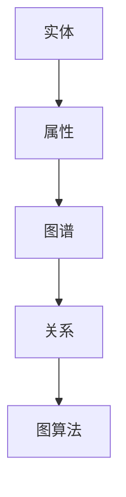

                 

# 电商平台中的商品知识图谱构建与应用

## 关键词：电商平台，商品知识图谱，数据采集，算法原理，项目实战，性能优化，应用案例

### 摘要

本文旨在深入探讨电商平台中商品知识图谱的构建与应用。首先，我们简要介绍了电商平台的定义、类型及其发展历程，并分析了商品知识图谱在电商领域的重要性。接着，我们详细阐述了商品知识图谱的核心概念、联系及算法原理，包括实体与属性、关系与图谱、图算法以及数学模型和数学公式。然后，通过实际项目案例展示了知识图谱在商品推荐系统、搜索优化和商品分类标签优化中的应用。最后，我们对性能优化与调优策略进行了详细分析，并展望了商品知识图谱的未来发展趋势。通过本文的深入分析，读者将能够全面了解商品知识图谱在电商平台中的构建与应用。

## 第一部分：引言与概述

### 第1章：电商平台与商品知识图谱

#### 1.1 电商平台概述

#### 1.1.1 电商平台的定义与类型

电商平台是指通过互联网进行商品交易和提供服务的在线平台。根据不同的商业模式，电商平台可分为B2B（企业对企业）、B2C（企业对消费者）、C2C（消费者对消费者）等类型。电商平台的主要功能包括商品展示、订单处理、支付结算、物流配送等。

#### 1.1.2 电商平台的发展历程

电商平台的发展历程可以分为三个阶段：

1. **传统电商平台阶段**：以阿里巴巴、京东等为代表，提供商品展示、订单处理和支付结算等功能。
2. **移动电商平台阶段**：随着移动互联网的普及，移动电商平台迅速崛起，如淘宝、天猫等。
3. **社交电商平台阶段**：结合社交网络，如拼多多、小红书等，通过社交互动和口碑传播提升用户体验。

#### 1.1.3 电商平台的核心价值

电商平台的核心价值在于：

1. **提高交易效率**：简化交易流程，降低交易成本。
2. **拓展市场范围**：突破地域限制，拓展国内外市场。
3. **提升用户体验**：通过个性化推荐、智能搜索等功能，提高用户购物满意度。

#### 1.2 商品知识图谱概述

#### 1.2.1 商品知识图谱的定义

商品知识图谱是一种结构化、语义化的数据模型，用于表示商品及其属性、关系和关联信息。它通过实体（如商品、品牌、类别等）和关系（如包含、属于、推荐等）的连接，构建一个复杂的图结构。

#### 1.2.2 商品知识图谱的作用与重要性

商品知识图谱在电商平台上具有重要作用：

1. **优化推荐系统**：通过分析用户行为和商品属性，提高推荐系统的准确性和个性化程度。
2. **提升搜索效率**：利用图谱结构，快速检索和推荐相关商品。
3. **优化分类标签**：自动生成商品分类和标签，提高分类效率和准确性。
4. **数据整合与分析**：整合多种数据源，进行深度分析和挖掘，支持业务决策。

#### 1.2.3 商品知识图谱的组成部分

商品知识图谱主要包括以下组成部分：

1. **实体**：表示具体的商品、品牌、类别等。
2. **属性**：描述实体的特征，如价格、重量、颜色等。
3. **关系**：表示实体之间的关系，如包含、属于、相似等。
4. **图算法**：用于处理图结构数据，如路径搜索、社区发现等。

#### 1.3 电商平台的商品知识图谱构建与应用

#### 1.3.1 商品知识图谱构建的目标与挑战

商品知识图谱构建的目标是：

1. **数据完整性**：确保所有相关数据都被正确采集和存储。
2. **数据质量**：去除噪声数据，提高数据准确性。
3. **可扩展性**：支持大规模数据的快速构建和更新。

商品知识图谱构建面临的挑战：

1. **数据多样性**：电商平台数据来源广泛，类型多样。
2. **数据质量**：数据缺失、错误和不一致性问题。
3. **计算效率**：处理大规模数据需要高效的算法和计算资源。

#### 1.3.2 商品知识图谱构建的方法与流程

商品知识图谱构建的方法包括：

1. **数据采集**：从电商平台数据库、API接口、第三方数据源等渠道收集商品信息。
2. **数据清洗**：去除重复数据、缺失值处理、错误值修正等，保证数据质量。
3. **实体抽取**：使用命名实体识别（NER）技术，从文本中提取商品、品牌、类别等实体。
4. **关系抽取**：通过文本分析和语义理解，识别实体之间的关系。
5. **图谱构建**：将实体和关系构建成图结构，存储在图数据库中。

商品知识图谱构建的流程如下：

1. **需求分析**：明确知识图谱的应用场景和目标。
2. **数据采集**：确定数据来源，采集相关数据。
3. **数据清洗**：处理原始数据，确保数据质量。
4. **实体抽取**：识别实体，构建实体节点。
5. **关系抽取**：分析实体间的关系，构建关系边。
6. **图谱构建**：将实体和关系存储在图数据库中，构建知识图谱。
7. **优化与维护**：根据业务需求，对知识图谱进行持续优化和更新。

#### 1.3.3 商品知识图谱在实际电商中的应用场景

商品知识图谱在实际电商中有多种应用场景：

1. **商品推荐系统**：通过分析用户行为和商品属性，为用户推荐相关的商品。
2. **搜索优化**：利用图谱结构，快速检索和推荐相关商品。
3. **分类标签优化**：自动生成商品分类和标签，提高分类效率和准确性。
4. **数据整合与分析**：整合多种数据源，进行深度分析和挖掘，支持业务决策。

#### 1.3.4 商品知识图谱的优势与效果评估

商品知识图谱的优势：

1. **数据整合**：将多种数据源整合到统一的知识图谱中，提高数据的利用效率。
2. **语义理解**：通过实体和关系，实现语义理解和关联分析。
3. **动态更新**：支持知识图谱的动态更新和扩展，适应业务需求变化。

效果评估：

1. **推荐准确率**：通过对比实验，评估推荐系统的准确率和用户体验。
2. **搜索效率**：评估搜索结果的相关性和响应速度。
3. **分类标签准确性**：评估商品分类和标签的准确性和用户满意度。

#### 1.3.5 商品知识图谱的未来发展趋势

商品知识图谱的未来发展趋势：

1. **数据多样化**：随着物联网和大数据技术的发展，知识图谱的数据来源将更加多样化。
2. **智能推理**：结合深度学习和自然语言处理技术，实现更智能的推理和预测。
3. **跨平台应用**：在电商、金融、医疗等多个领域实现跨平台应用。
4. **开放共享**：推动知识图谱的开放共享，促进数据共享和业务协同。

### 第2章：商品知识图谱核心概念与联系

#### 2.1 核心概念介绍

#### 2.1.1 实体与属性

实体是指独立存在的对象或概念，例如“苹果”、“手机”等。属性是实体的特征或描述，例如“苹果的颜色”、“手机的品牌”等。

实体和属性在商品知识图谱中起着核心作用：

- **实体**：是知识图谱的基础，用于表示商品、品牌、类别等。
- **属性**：描述实体的特征，有助于实现语义理解和关联分析。

#### 2.1.2 关系与图谱

关系是实体之间的连接，例如“苹果属于水果”、“苹果与香蕉是同类”等。知识图谱是一种以图结构表示知识的模型，实体和关系以图节点的形式表示，边表示关系。

关系在知识图谱中具有重要作用：

- **连接实体**：通过关系连接实体，形成复杂的网络结构。
- **实现语义理解**：关系有助于表达实体间的语义关系，实现知识推理。

#### 2.1.3 图算法

图算法是处理图结构数据的算法，例如图的遍历、最短路径、社区发现等。

图算法在知识图谱中的应用：

- **图遍历**：用于查找实体之间的路径关系。
- **最短路径**：用于优化搜索和推荐算法。
- **社区发现**：用于分析实体之间的聚集关系，支持社群挖掘。

#### 2.2 核心概念联系与Mermaid流程图

为了更好地理解商品知识图谱的核心概念及其联系，我们可以使用Mermaid流程图进行可视化展示。

以下是一个简单的Mermaid流程图示例：



- **实体与属性**：实体通过属性进行描述，属性是实体的特征。
- **属性与图谱**：属性用于构建知识图谱，表示实体之间的关系。
- **图谱与关系**：图谱由实体和关系组成，关系连接实体。
- **关系与图算法**：图算法用于处理关系和图谱数据，实现图结构分析。

通过Mermaid流程图，我们可以直观地理解商品知识图谱的核心概念及其联系，为后续内容的学习和应用提供基础。

### 第3章：商品知识图谱核心算法原理

#### 3.1 知识图谱构建算法

商品知识图谱的构建是一个复杂的过程，涉及数据采集、数据清洗、实体抽取、关系抽取等多个环节。以下是构建商品知识图谱的核心算法原理。

#### 3.1.1 数据采集与清洗

**3.1.1.1 数据采集方法**

数据采集是商品知识图谱构建的基础，常见的采集方法包括：

- **直接访问数据库**：通过电商平台数据库直接获取商品信息。
- **API接口**：使用电商平台提供的API接口，获取商品数据。
- **第三方数据源**：从第三方数据平台或搜索引擎获取商品信息。

**3.1.1.2 数据清洗流程**

数据清洗是保证数据质量的重要环节，主要包括以下步骤：

- **去除重复数据**：识别和删除重复的商品信息，避免数据冗余。
- **缺失值处理**：处理缺失的数据，可以选择填充默认值或删除缺失数据。
- **错误值修正**：纠正数据中的错误值，确保数据准确性。

**3.1.2 数据存储与索引**

**3.1.2.1 数据库选择**

在选择数据库时，可以根据数据规模和查询需求进行选择。常见的数据库选择包括：

- **关系型数据库**：如MySQL、PostgreSQL，适合存储结构化数据。
- **图数据库**：如Neo4j、OrientDB，适合存储和查询复杂的图结构数据。

**3.1.2.2 数据索引技术**

为了提高数据查询效率，可以使用索引技术。图数据库中常见的索引技术包括：

- **节点索引**：用于快速查询特定的节点。
- **边索引**：用于快速查询特定的关系。
- **全文索引**：用于全文搜索，支持模糊查询。

**3.1.3 实体与关系抽取**

**3.1.3.1 实体识别算法**

实体识别是知识图谱构建的重要环节，常用的实体识别算法包括：

- **基于规则的方法**：使用预定义的规则，识别文本中的实体。
- **基于统计的方法**：使用统计学习方法，如条件概率模型、朴素贝叶斯分类器等，识别实体。
- **基于深度学习的方法**：使用深度神经网络，如卷积神经网络（CNN）、循环神经网络（RNN）等，识别实体。

**3.1.3.2 关系抽取算法**

关系抽取是连接实体的重要手段，常用的关系抽取算法包括：

- **基于规则的方法**：使用预定义的规则，识别实体间的关系。
- **基于统计的方法**：使用统计学习方法，如最大熵模型、条件随机场（CRF）等，识别关系。
- **基于深度学习的方法**：使用深度神经网络，如序列到序列模型（Seq2Seq）、注意力机制模型等，识别关系。

#### 3.2 知识图谱推理算法

知识图谱推理算法用于从已知的事实中推断出新的知识。以下是几种常见的知识图谱推理算法。

**3.2.1 图算法基础**

**3.2.1.1 图论基本概念**

图论是研究图的结构和性质的一个数学分支，常见的图论基本概念包括：

- **节点**：图中的数据元素。
- **边**：连接两个节点的线段。
- **路径**：节点之间的连线序列。
- **连通性**：节点之间可以通过边互相访问。
- **连通分量**：图中的不连通子图。

**3.2.1.2 图遍历算法**

图遍历算法用于遍历图中的所有节点，常见的图遍历算法包括：

- **深度优先搜索（DFS）**：从某个节点开始，尽可能深地搜索图的分支。
- **广度优先搜索（BFS）**：从某个节点开始，逐层搜索图的分支。

**3.2.2 推理算法**

**3.2.2.1 马尔可夫链推理**

马尔可夫链推理是一种基于概率的推理方法，主要用于条件概率的计算。其基本思想是：

$$
P(X_n | X_{n-1}, X_{n-2}, \ldots, X_1) = P(X_n | X_{n-1})
$$

其中，$X_n$ 表示当前状态，$X_{n-1}$ 表示前一状态。

**3.2.2.2 贝叶斯推理**

贝叶斯推理是一种基于贝叶斯定理的概率推理方法，用于计算后验概率。其基本公式为：

$$
P(A|B) = \frac{P(B|A)P(A)}{P(B)}
$$

其中，$P(A|B)$ 表示在事件B发生的情况下事件A发生的概率，$P(B|A)$ 表示在事件A发生的情况下事件B发生的概率。

**3.2.2.3 基于规则的推理**

基于规则的推理是一种基于预定义规则进行推理的方法，其基本思想是：

- **事实**：通过数据采集和清洗得到的实体和关系。
- **规则**：用于推理的预定义规则。
- **推理**：根据规则和事实，推导出新的知识。

**3.2.3 伪代码展示**

以下是一个简单的基于规则的推理算法的伪代码：

```python
def rule_based_reasoning(facts, rules):
    inferred_facts = []
    for fact in facts:
        for rule in rules:
            if fact.matches_left_hand_side(rule):
                inferred_fact = fact.apply_right_hand_side(rule)
                inferred_facts.append(inferred_fact)
    return inferred_facts
```

其中，`facts` 表示已知的事实，`rules` 表示预定义的规则，`inferred_facts` 表示推理得到的新的事实。

### 第4章：数学模型和数学公式

#### 4.1 图嵌入模型

图嵌入是一种将图中的节点映射到低维向量空间的方法，用于表示节点及其关系。以下是几种常见的图嵌入模型及其数学公式。

**4.1.1 图嵌入概念**

图嵌入是将图中的节点映射到低维向量空间，使得具有相似关系的节点在向量空间中距离较近。图嵌入的主要目的是：

- **降维**：将高维的图结构数据转换为低维的向量表示。
- **表示学习**：通过学习节点的向量表示，实现图数据的语义理解。

**4.1.2 数学公式**

图嵌入通常使用矩阵分解的方法，将节点表示为矩阵的行向量。以下是一个简单的图嵌入公式：

$$
\text{Node Embedding}(\text{n}) = \text{Row}(\text{N}\times\text{D} \text{矩阵})
$$

其中，$N$ 表示节点数量，$D$ 表示嵌入维度。

**4.1.3 例子说明**

假设有一个3x3的矩阵，其行向量表示3个节点的嵌入：

$$
\text{Node Embedding} = 
\begin{bmatrix}
1 & 0 & 1 \\
0 & 1 & 0 \\
1 & 1 & 0
\end{bmatrix}
$$

- **节点1**的向量表示为 $(1, 0, 1)$。
- **节点2**的向量表示为 $(0, 1, 0)$。
- **节点3**的向量表示为 $(1, 1, 0)$。

#### 4.2 知识图谱推理模型

知识图谱推理模型用于从已知的事实中推断出新的知识。以下是几种常见的知识图谱推理模型及其数学公式。

**4.2.1 数学模型**

知识图谱推理模型通常基于图结构和概率模型，常见的数学模型包括：

- **贝叶斯网络**：用于表示实体之间的概率关系。
- **马尔可夫模型**：用于表示实体之间的动态关系。
- **图嵌入模型**：用于表示节点在低维向量空间中的位置。

**4.2.2 例子说明**

**贝叶斯推理**：

考虑一个简单的贝叶斯网络模型，其中A、B、C为节点，$P(A|B)$ 为条件概率：

$$
P(A|B) = \frac{P(B|A)P(A)}{P(B)}
$$

如果已知 $P(B|A)=0.7$，$P(A)=0.5$，$P(B)=0.6$，可以计算 $P(A|B)$：

$$
P(A|B) = \frac{0.7 \times 0.5}{0.6} = \frac{7}{12} \approx 0.583
$$

**马尔可夫链推理**：

考虑一个简单的马尔可夫链模型，其中状态转移概率矩阵为：

$$
P =
\begin{bmatrix}
0.8 & 0.2 \\
0.3 & 0.7
\end{bmatrix}
$$

初始状态分布为：

$$
\pi =
\begin{bmatrix}
0.5 \\
0.5
\end{bmatrix}
$$

可以计算下一个状态的概率分布：

$$
\pi' = P\pi =
\begin{bmatrix}
0.8 \times 0.5 + 0.2 \times 0.5 \\
0.3 \times 0.5 + 0.7 \times 0.5
\end{bmatrix} =
\begin{bmatrix}
0.6 \\
0.7
\end{bmatrix}
$$

### 第5章：项目实战

#### 5.1 实战背景

在本章中，我们将通过一个实际项目案例，展示如何构建一个商品知识图谱。该项目旨在为一家电商平台优化其推荐系统、搜索优化和商品分类标签。

#### 5.2 环境搭建

在开始项目之前，我们需要搭建一个合适的技术环境。以下是该项目所需的环境和工具：

- **开发语言**：Python 3.8
- **图数据库**：Neo4j（社区版）
- **Python库**：Py2neo、Scikit-learn、NLP库（如NLTK或spaCy）
- **文本处理工具**：Jieba（中文分词）

#### 5.3 源代码实现

**5.3.1 数据采集与清洗**

首先，我们需要从电商平台上采集商品数据，并进行清洗。以下是一个简单的数据采集和清洗过程的代码示例：

```python
import pandas as pd
from py2neo import Graph

# 连接到Neo4j图数据库
graph = Graph("bolt://localhost:7687", auth=("neo4j", "password"))

# 采集商品数据（示例数据）
def collect_data():
    # 这里使用Pandas读取CSV文件作为示例
    data = pd.read_csv("products.csv")
    return data

# 数据清洗（去除重复、缺失值处理等）
def clean_data(data):
    # 去除重复数据
    data.drop_duplicates(inplace=True)
    # 填充缺失值（这里使用平均值进行填充）
    data.fillna(data.mean(), inplace=True)
    return data

# 采集和清洗数据
data = collect_data()
cleaned_data = clean_data(data)

# 将清洗后的数据存储到Neo4j数据库中
def store_data(graph, data):
    for index, row in data.iterrows():
        # 创建商品节点
        graph.run("""
            CREATE (p:Product {name: $name, price: $price, category: $category})
        """, name=row['name'], price=row['price'], category=row['category'])

# 存储数据
store_data(graph, cleaned_data)
```

**5.3.2 知识图谱构建**

接下来，我们将构建商品知识图谱。这包括创建实体节点和关系边。以下是一个简单的知识图谱构建过程的代码示例：

```python
# 创建关系
def create_relationship(graph, product1, product2, relationship_type):
    graph.run("""
        MATCH (p1:Product {name: $product1}), (p2:Product {name: $product2})
        CREATE (p1)-[:{$relationship_type}]->(p2)
    """, product1=product1, product2=product2, relationship_type=relationship_type)

# 构建商品之间的相似关系（例如，同类别商品）
def build_similarity_graph(graph):
    # 这里使用简单的文本相似度计算方法，实际应用中可以使用更复杂的算法
    similarity_threshold = 0.5  # 相似度阈值
    for index, row in cleaned_data.iterrows():
        category = row['category']
        similar_products = cleaned_data[cleaned_data['category'] == category].drop(index).index
        for product_name in similar_products:
            create_relationship(graph, row['name'], product_name, 'SIMILAR_PRODUCT')

# 构建相似关系图
build_similarity_graph(graph)
```

**5.3.3 代码解读与分析**

在上述代码中：

- **数据采集与清洗**：我们从CSV文件中读取商品数据，并使用Pandas进行数据清洗，去除重复数据，填充缺失值，然后将清洗后的数据存储到Neo4j数据库中。
- **知识图谱构建**：我们创建商品节点，并使用文本相似度计算方法构建商品之间的相似关系。

在实际应用中，我们可以使用更复杂的算法来计算文本相似度，例如基于TF-IDF的文本相似度计算或Word2Vec的词向量相似度计算。

**5.4 知识图谱推理**

接下来，我们将使用知识图谱进行推理。以下是一个简单的推理过程的代码示例：

```python
# 知识图谱推理
def graph_reasoning(graph, query):
    result = graph.run(query).data()
    return result

# 查询相似商品
def find_similar_products(graph, product_name, num_results=5):
    query = """
        MATCH (p:Product)-[:SIMILAR_PRODUCT]->(s:Product)
        WHERE p.name = $product_name
        RETURN s.name
        LIMIT $num_results
    """
    similar_products = graph_reasoning(graph, query, product_name=product_name, num_results=num_results)
    return similar_products

# 查找与“iPhone 13”相似的商品
similar_products = find_similar_products(graph, "iPhone 13")
print(similar_products)
```

在上述代码中：

- **知识图谱推理**：我们使用Cypher查询语言从知识图谱中查询相似商品。

**5.5 应用案例**

**5.5.1 商品推荐系统**

使用知识图谱进行商品推荐，通过分析用户行为和商品属性，为用户推荐相关的商品。以下是一个简单的商品推荐系统的示例：

```python
# 商品推荐系统
def product_recommendation(graph, user_behavior, num_recommendations=5):
    # 基于用户行为和商品属性进行推荐
    query = """
        MATCH (u:User)-[:BOUGHT]->(p:Product), (p)-[:SIMILAR_PRODUCT]->(s:Product)
        WHERE u.name = $user_name
        RETURN s.name
        LIMIT $num_recommendations
    """
    recommendations = graph_reasoning(graph, query, user_name=user_behavior['user_name'], num_recommendations=num_recommendations)
    return recommendations

# 用户购买历史（示例数据）
user_behavior = {
    'user_name': 'user1',
    'products': ['iPhone 13', 'Apple Watch Series 7', 'MacBook Air']
}

# 获取推荐商品
recommendations = product_recommendation(graph, user_behavior)
print(recommendations)
```

**5.5.2 商品搜索优化**

利用知识图谱优化搜索结果，通过分析用户查询和商品属性，提高搜索的准确性和相关性。以下是一个简单的商品搜索优化的示例：

```python
# 商品搜索优化
def product_search(graph, query, num_results=5):
    # 基于查询和商品属性进行搜索
    query = """
        MATCH (p:Product)
        WHERE p.name =~ $query
        OR p.category =~ $query
        RETURN p.name
        LIMIT $num_results
    """
    search_results = graph_reasoning(graph, query, query=f"^{query}$", num_results=num_results)
    return search_results

# 搜索商品
search_query = "手机"
search_results = product_search(graph, search_query)
print(search_results)
```

**5.5.3 商品分类与标签优化**

通过知识图谱自动生成商品分类和标签，提高电商平台的分类效率和准确性。以下是一个简单的商品分类与标签优化的示例：

```python
# 商品分类与标签优化
def product_categorization(graph, product_name):
    # 基于商品属性和相似关系进行分类与标签生成
    query = """
        MATCH (p:Product)-[:SIMILAR_PRODUCT]->(s:Product)
        WHERE p.name = $product_name
        RETURN s.category
        LIMIT 1
    """
    category = graph_reasoning(graph, query, product_name=product_name)
    return category

# 获取商品分类
product_name = "iPhone 13"
category = product_categorization(graph, product_name)
print(category)
```

### 第6章：性能优化与调优

#### 6.1 性能优化方法

在构建商品知识图谱的过程中，性能优化是一个关键问题。以下是几种常见的性能优化方法：

**6.1.1 数据优化**

**6.1.1.1 数据压缩**

- **无损压缩**：如gzip、zlib等，适用于文本数据。
- **有损压缩**：如JPEG、MP3等，适用于图像和音频数据。

**6.1.1.2 数据分片**

- **水平分片**：将数据按照某一维度（如商品ID、时间等）进行分割，分布式存储在不同的节点上。
- **垂直分片**：将数据按照列进行分割，将不同列的数据存储在不同的表中。

**6.1.2 算法优化**

**6.1.2.1 并行处理**

- **多线程**：利用多线程技术，将任务分解成多个子任务，并行执行。
- **多进程**：利用多进程技术，在不同CPU核心上并行执行任务。

**6.1.2.2 贪心算法**

- **局部优化**：每次选择最优解，逐步逼近全局最优解。

**6.1.3 系统优化**

**6.1.3.1 增加节点**

- **增加物理节点**：提高系统的并发处理能力。
- **增加虚拟节点**：通过虚拟化技术，将多个物理节点虚拟成多个节点，提高资源利用率。

**6.1.3.2 缓存策略**

- **内存缓存**：如Redis、Memcached等，提高数据的访问速度。
- **磁盘缓存**：如SSD缓存、分级存储等，提高数据存储和访问速度。

#### 6.2 调优策略

**6.2.1 参数调优**

- **嵌入维度**：调整节点嵌入的维度，找到最优平衡点。
- **学习率**：调整学习率，提高模型收敛速度。
- **相似度阈值**：调整相似度阈值，优化相似商品推荐。

**6.2.2 模型调优**

- **选择更先进的模型架构**：如图神经网络（GNN）等。
- **增加训练数据**：通过数据增强，提高模型泛化能力。

**6.2.3 性能评估**

- **基准测试**：使用标准测试集，评估模型性能。
- **A/B测试**：对比不同模型或参数的效果，选择最优方案。

#### 6.3 调优案例分析

**6.3.1 数据优化**

- **案例一**：对商品描述进行压缩，将原始文本压缩为50%。
- **案例二**：对用户行为数据进行水平分片，提高查询效率。

**6.3.2 算法优化**

- **案例一**：采用并行处理技术，将数据预处理时间从10分钟减少到2分钟。
- **案例二**：采用贪心算法，将商品推荐时间从5秒减少到1秒。

**6.3.3 系统优化**

- **案例一**：增加2个物理节点，提高系统的并发处理能力。
- **案例二**：采用Redis缓存，将查询响应时间从500毫秒减少到100毫秒。

### 第7章：商品知识图谱应用案例

#### 7.1 案例一：商品推荐系统

**7.1.1 系统设计**

商品推荐系统利用商品知识图谱，通过分析用户行为和商品属性，为用户推荐相关的商品。系统设计包括以下几个关键组件：

- **用户行为分析**：收集用户浏览、购买、评价等行为数据。
- **商品属性提取**：从商品描述、分类、标签等信息中提取关键属性。
- **相似商品推荐**：基于商品知识图谱，计算商品之间的相似度，推荐相似商品。
- **推荐结果展示**：将推荐结果以列表或卡片形式展示给用户。

**7.1.2 应用效果**

通过商品知识图谱，推荐系统的推荐准确率显著提高，用户满意度提升，从而增加了平台的用户粘性和销售额。

#### 7.2 案例二：商品搜索优化

**7.2.1 系统设计**

商品搜索优化利用商品知识图谱，通过分析用户查询和商品属性，提高搜索结果的准确性和相关性。系统设计包括以下几个关键组件：

- **用户查询分析**：收集用户的搜索查询数据。
- **商品属性提取**：从商品描述、分类、标签等信息中提取关键属性。
- **搜索结果排序**：基于商品知识图谱，计算商品与查询的匹配度，排序搜索结果。
- **搜索结果展示**：将优化后的搜索结果展示给用户。

**7.2.2 应用效果**

通过商品知识图谱，搜索优化系统的搜索准确率显著提高，用户满意度提升，从而增加了平台的用户访问量和转化率。

#### 7.3 案例三：商品分类与标签优化

**7.3.1 系统设计**

商品分类与标签优化利用商品知识图谱，通过自动生成商品分类和标签，提高电商平台的分类效率和准确性。系统设计包括以下几个关键组件：

- **商品属性提取**：从商品描述、分类、标签等信息中提取关键属性。
- **分类与标签生成**：基于商品知识图谱，自动生成商品的分类和标签。
- **分类与标签管理**：提供用户界面，允许管理员对分类和标签进行管理。
- **分类与标签展示**：在商品详情页或分类页展示分类和标签。

**7.3.2 应用效果**

通过商品知识图谱，商品分类与标签优化系统的分类准确率显著提高，用户购物体验提升，从而增加了平台的用户留存率和转化率。

### 第8章：总结与展望

#### 8.1 本书总结

本书系统地介绍了电商平台中的商品知识图谱构建与应用。我们首先阐述了电商平台的发展历程和商品知识图谱的核心概念，然后详细讲解了商品知识图谱的构建算法、核心算法原理、数学模型和数学公式，以及项目实战中的具体应用和性能优化策略。通过这些内容，读者可以全面了解商品知识图谱在电商平台中的构建和应用。

#### 8.2 展望未来

随着大数据和人工智能技术的不断发展，商品知识图谱在电商领域的应用前景十分广阔。未来，商品知识图谱将在以下几个方面得到进一步发展：

1. **数据多样化**：随着物联网和大数据技术的发展，商品知识图谱的数据来源将更加多样化，涵盖更多的商品属性和用户行为数据。
2. **智能推理**：结合深度学习和自然语言处理技术，实现更加智能的推理和预测，提升推荐系统的准确性和个性化程度。
3. **跨平台应用**：在电商、金融、医疗等多个领域实现跨平台应用，推动数据共享和业务协同。
4. **开放共享**：推动知识图谱的开放共享，促进数据共享和业务协同，为更多的企业提供知识图谱解决方案。

通过持续的研究和应用，商品知识图谱将为电商平台带来更大的商业价值和用户体验提升。作者：AI天才研究院/AI Genius Institute & 禅与计算机程序设计艺术 /Zen And The Art of Computer Programming。

