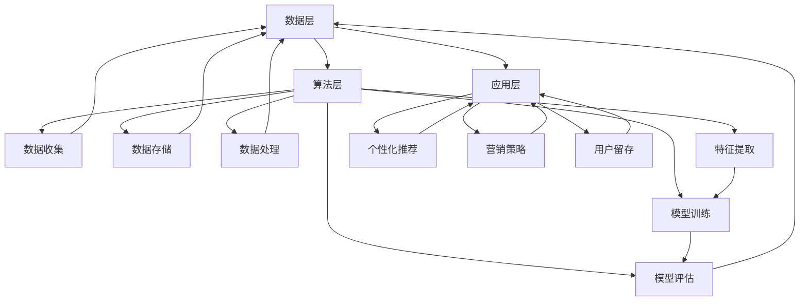
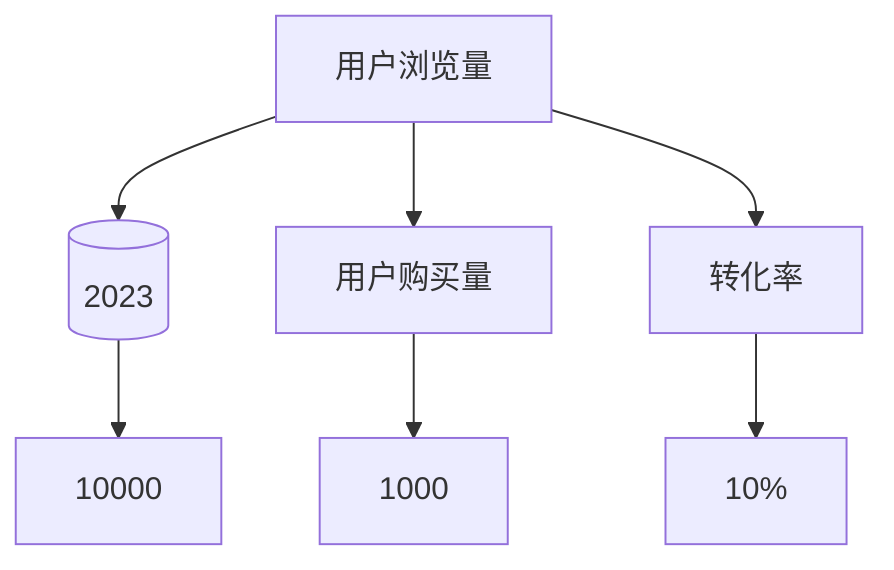
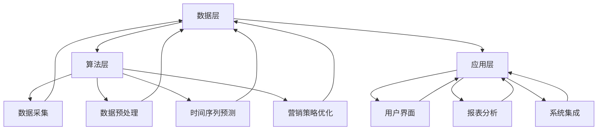

                 

### 第一部分：引言

在数字化时代，电商平台已成为商业活动的重要载体，用户行为预测作为人工智能技术的重要组成部分，正在深刻改变电商运营的模式。本部分旨在探讨AI驱动用户行为预测在电商平台中的应用，并介绍本书的结构安排与学习目标。

#### 1.1 电商平台的现状与发展趋势

近年来，随着互联网技术的飞速发展，电商行业呈现出爆发式增长。根据最新的市场数据，全球电商市场规模已突破数万亿美元，电商平台的数量和用户规模持续扩大。这一现象不仅改变了传统零售的格局，也推动了商业模式的创新。

电商平台的现状主要体现在以下几个方面：

- **市场集中度提高**：少数大型电商平台占据市场份额的绝大部分，例如亚马逊、阿里巴巴、京东等，它们通过大数据和人工智能技术，不断优化用户购物体验。
- **消费者需求多样化**：用户对个性化服务、快速配送和高效售后服务的需求不断提高，电商平台需要通过精准的用户行为预测来满足这些需求。
- **技术驱动创新**：人工智能、物联网、区块链等新兴技术被广泛应用到电商平台的各个环节，推动了电商业务的数字化、智能化转型。

#### 1.2 AI技术对电商平台的变革性影响

人工智能技术在电商平台中的应用，不仅提升了运营效率，还为商业模式创新提供了强大支持。以下是AI技术对电商平台的变革性影响：

- **用户行为预测**：通过分析用户的历史行为数据，AI技术可以预测用户的购买意图、浏览习惯等，从而实现个性化推荐和精准营销。
- **智能客服**：利用自然语言处理和机器学习技术，智能客服系统能够自动回答用户问题，提高客户满意度和服务效率。
- **供应链优化**：通过预测市场需求和库存情况，AI技术可以优化供应链管理，减少库存成本，提高物流效率。
- **风险控制**：AI技术可以对用户行为进行分析，识别潜在的欺诈行为和异常交易，从而有效降低风险。

#### 1.3 用户行为预测在电商平台中的应用价值

用户行为预测在电商平台中具有广泛的应用价值，主要体现在以下几个方面：

- **个性化推荐**：通过预测用户的兴趣和购买习惯，电商平台可以提供个性化的商品推荐，提高用户的购物满意度和转化率。
- **营销策略优化**：用户行为预测可以帮助电商平台制定更加精准的营销策略，例如推送特定优惠、活动等，提高营销效果。
- **用户留存**：通过分析用户的行为数据，电商平台可以识别出流失风险较高的用户，并采取相应的措施进行挽回，提高用户留存率。
- **风险控制**：用户行为预测技术可以帮助电商平台识别出异常行为，有效降低欺诈风险。

#### 1.4 本书的结构安排与学习目标

本书旨在系统介绍AI驱动用户行为预测在电商平台中的应用，共分为八个章节，具体内容如下：

- **第1章**：引言，介绍电商平台的现状、AI技术的变革性影响以及用户行为预测的应用价值。
- **第2章**：用户行为预测的核心概念，包括基本原理、关键概念与相关算法、用户行为预测系统的架构。
- **第3章**：时间序列分析基础，包括基本概念、数据预处理、时间序列分析方法、预测评估指标。
- **第4章**：电商用户行为数据的收集与处理，包括数据收集渠道、处理方法、数据清洗与质量评估、数据可视化分析。
- **第5章**：基于时间序列的用户行为预测算法，包括常见时间序列预测算法、算法选择与优化、案例研究。
- **第6章**：营销策略优化与案例分析，包括营销策略优化的原理与方法、用户行为预测在营销策略中的应用、案例分析。
- **第7章**：AI驱动用户行为预测系统的构建与实现，包括系统总体架构设计、数据采集与预处理模块、时间序列预测模块、营销策略优化模块、系统部署与运维。
- **第8章**：未来的发展趋势与挑战，包括用户行为预测技术的未来发展趋势、电商平台面临的挑战与机遇、未来可能的技术与应用创新。
- **第9章**：总结与展望，对全书内容进行回顾与总结，分享学习心得与感悟，对未来的学习和实践进行展望。

通过本书的学习，读者将能够深入理解AI驱动用户行为预测在电商平台中的应用，掌握相关技术原理和实践方法，为电商平台的发展提供有力支持。

### 第二部分：用户行为预测的核心概念

用户行为预测是电商平台AI技术应用的重要领域，它通过分析用户的历史行为数据，预测用户的未来行为，从而实现个性化推荐、营销策略优化等目标。本部分将详细介绍用户行为预测的基本原理、关键概念与相关算法，并探讨用户行为预测系统的架构。

#### 2.1 用户行为预测的基本原理

用户行为预测的基本原理基于统计学和机器学习理论，通过以下步骤实现：

1. **数据收集**：收集用户的访问数据、购买记录、浏览历史等行为数据。
2. **数据预处理**：对收集到的数据进行分析，去除噪声和异常值，并进行数据转换和特征提取。
3. **特征选择**：从预处理后的数据中提取有用的特征，用于训练预测模型。
4. **模型训练**：使用历史数据训练预测模型，模型类型包括线性回归、决策树、神经网络等。
5. **模型评估**：使用验证集或测试集评估模型的预测性能，调整模型参数以提高预测准确性。
6. **预测**：使用训练好的模型对未知数据进行预测，生成用户行为的概率分布或具体预测值。

#### 2.2 关键概念与相关算法

在用户行为预测中，以下几个关键概念和算法尤为重要：

- **用户画像**：用户画像是指通过对用户的基本信息、行为数据、偏好等进行综合分析，构建的用户特征模型。用户画像可以用于用户行为预测和个性化推荐。
- **协同过滤**：协同过滤是一种基于用户行为相似性的推荐算法，通过分析用户之间的行为模式，为用户推荐可能喜欢的商品。协同过滤分为用户基于协同过滤和物品基于协同过滤两种类型。
- **预测模型**：用户行为预测的核心是预测模型的选择和训练。常见的预测模型包括线性回归、决策树、支持向量机、神经网络等。
- **时间序列分析**：时间序列分析是一种用于处理和预测时间序列数据的统计方法，适用于分析用户行为随时间变化的规律。

#### 2.3 用户行为预测系统的架构

用户行为预测系统的架构可以分为数据层、算法层和应用层三个部分：

- **数据层**：数据层是用户行为预测系统的基石，负责数据的收集、存储和处理。数据层包括数据收集模块、数据存储模块和数据预处理模块。
- **算法层**：算法层负责用户行为预测的核心算法实现，包括特征提取、模型训练、模型评估等。算法层通常采用多种算法和模型，以实现较高的预测准确性。
- **应用层**：应用层是用户行为预测系统的最终实现，包括个性化推荐、营销策略优化、用户留存等具体应用。应用层通常与电商平台的其他模块（如商品管理、订单处理等）进行集成，提供一站式解决方案。

以下是用户行为预测系统的架构示意图：



#### 2.4 小结

用户行为预测是电商平台AI技术的重要组成部分，通过分析用户的历史行为数据，预测用户的未来行为，为电商平台提供决策支持。本部分介绍了用户行为预测的基本原理、关键概念与相关算法，并探讨了用户行为预测系统的架构。在接下来的章节中，我们将深入探讨时间序列分析、用户行为数据的收集与处理、基于时间序列的用户行为预测算法以及营销策略优化等内容。

### 第三部分：时间序列分析基础

时间序列分析是用户行为预测的核心方法之一，它通过分析数据随时间变化的规律，预测未来的趋势和模式。本部分将详细介绍时间序列分析的基本概念、数据预处理、时间序列分析方法以及预测评估指标。

#### 3.1 时间序列分析的基本概念

时间序列分析涉及以下几个基本概念：

- **时间序列**：时间序列是指随时间变化的一系列数据点，通常以时间戳为索引。时间序列可以反映某个变量在一段时间内的变化规律。
- **趋势**：趋势是指时间序列在一段时间内总体上升或下降的趋势。趋势可以分为短期趋势、中期趋势和长期趋势。
- **季节性**：季节性是指时间序列在一年内重复出现的周期性波动，如节假日、季节性销售高峰等。
- **随机性**：随机性是指时间序列中不可预测的波动，通常由随机噪声引起。

#### 3.2 时间序列数据的预处理

在进行时间序列分析之前，需要对时间序列数据进行预处理，以提高数据质量和预测准确性。常见的预处理方法包括：

- **数据清洗**：去除噪声和异常值，如缺失值、重复值等。
- **数据转换**：将非标准化的数据转换为标准化的格式，如日期转换、时间戳标准化等。
- **特征提取**：从原始时间序列中提取有用的特征，如趋势、季节性和周期性等。
- **平滑处理**：使用移动平均、指数平滑等方法，平滑时间序列中的波动，减少随机性影响。

#### 3.3 时间序列分析方法

时间序列分析方法可以分为单变量分析和多变量分析两大类：

- **单变量分析方法**：
  - **移动平均法**：通过计算一段时间内的平均值，平滑时间序列中的波动，预测未来的趋势。
  - **指数平滑法**：在移动平均法的基础上，引入指数加权，使近期的数据对预测结果产生更大的影响。
  - **自回归法**（AR）：利用时间序列的过去值预测未来值，模型形式为 $X_t = c + \phi_1X_{t-1} + \phi_2X_{t-2} + \ldots + \phi_pX_{t-p} + \epsilon_t$。
  - **自回归移动平均法**（ARMA）：结合自回归法和移动平均法，模型形式为 $X_t = c + \phi_1X_{t-1} + \ldots + \phi_pX_{t-p} + \theta_1\epsilon_{t-1} + \ldots + \theta_q\epsilon_{t-q} + \epsilon_t$。
  - **自回归积分滑动平均法**（ARIMA）：在ARMA模型的基础上，加入差分操作，用于处理非平稳时间序列。

- **多变量分析方法**：
  - **向量自回归法**（VAR）：用于分析多个时间序列之间的动态关系，模型形式为 $X_t = c + \Phi_1X_{t-1} + \ldots + \Phi_pX_{t-p} + \epsilon_t$。
  - **主成分分析法**（PCA）：通过提取主要的时间序列成分，简化数据分析过程，提高预测效率。
  - **因子分析法**（FA）：用于分析多个时间序列之间的潜在关系，提取共性因子，降低数据维度。

#### 3.4 时间序列预测的评估指标

时间序列预测的评估指标用于衡量预测模型的性能，常见的评估指标包括：

- **均方误差**（MSE）：衡量预测值与实际值之间的平均误差，公式为 $MSE = \frac{1}{n}\sum_{i=1}^{n}(y_i - \hat{y}_i)^2$。
- **均方根误差**（RMSE）：MSE的平方根，用于表示预测误差的规模，公式为 $RMSE = \sqrt{MSE}$。
- **平均绝对误差**（MAE）：预测值与实际值之间绝对误差的平均值，公式为 $MAE = \frac{1}{n}\sum_{i=1}^{n}|y_i - \hat{y}_i|$。
- **决定系数**（R²）：衡量模型对数据拟合程度的指标，取值范围在0到1之间，越接近1表示模型拟合效果越好，公式为 $R^2 = 1 - \frac{\sum_{i=1}^{n}(y_i - \hat{y}_i)^2}{\sum_{i=1}^{n}(y_i - \bar{y})^2}$。

#### 3.5 小结

时间序列分析是用户行为预测的重要方法，通过分析数据随时间的变化规律，预测未来的趋势和模式。本部分介绍了时间序列分析的基本概念、数据预处理、时间序列分析方法以及预测评估指标。在接下来的章节中，我们将深入探讨电商用户行为数据的收集与处理、基于时间序列的用户行为预测算法以及营销策略优化等内容。

### 第四部分：电商用户行为数据的收集与处理

电商平台的运营离不开用户行为数据的收集与处理。这些数据不仅能够帮助平台理解用户需求，优化用户体验，还能为AI驱动的用户行为预测提供基础。本部分将详细介绍电商用户行为数据的收集渠道、处理方法、数据清洗与质量评估，以及数据可视化分析。

#### 4.1 用户行为数据的收集渠道

电商用户行为数据的收集渠道多种多样，以下是一些常见的收集方式：

- **网站日志**：电商平台服务器记录的用户访问日志，包括用户IP地址、访问时间、访问页面等。
- **用户行为日志**：电商平台自身开发的日志系统，记录用户的浏览、搜索、点击、购买等行为。
- **第三方数据源**：通过合作伙伴或第三方服务提供商，获取用户在社交媒体、搜索平台、广告平台等的行为数据。
- **用户调查**：通过问卷调查或用户访谈，获取用户的反馈和偏好信息。
- **传感器数据**：通过物联网设备（如智能手表、手机APP等）收集用户的位置、生理和行为数据。

#### 4.2 用户行为数据的处理方法

收集到的用户行为数据通常是原始的、噪声的，需要进行一系列处理，以便后续分析和预测。以下是常见的用户行为数据处理方法：

- **数据清洗**：去除重复数据、缺失值、异常值等，确保数据的一致性和完整性。
- **数据转换**：将不同格式的数据转换为统一的格式，如将日期字符串转换为日期对象。
- **数据规范化**：对数据进行归一化或标准化处理，使其在同一个尺度上，以便进行比较和分析。
- **特征提取**：从原始数据中提取有用的特征，如用户的浏览时间、购买频率、点击率等。
- **数据融合**：将来自不同渠道的数据进行整合，形成统一的数据集，以便进行全局分析。

#### 4.3 数据清洗与数据质量评估

数据清洗是数据处理的重要环节，直接影响到后续分析的准确性和可靠性。以下是数据清洗与数据质量评估的关键步骤：

- **缺失值处理**：对于缺失值，可以选择填充或删除，具体策略取决于数据的特性和分析需求。
- **异常值检测**：使用统计方法或机器学习算法，检测并处理异常值，如离群点、异常交易等。
- **一致性检查**：检查数据的一致性，如数据类型是否一致、数据范围是否合理等。
- **数据质量评估**：通过评估指标（如完整性、准确性、一致性、时效性等），评估数据的质量。

#### 4.4 数据可视化分析

数据可视化是将数据以图形化方式呈现，帮助用户直观理解数据内容和趋势。以下是常见的数据可视化方法：

- **折线图**：用于展示数据随时间的变化趋势，适用于时间序列数据。
- **柱状图**：用于比较不同类别或时间段的数据，适用于分类数据。
- **饼图**：用于展示各部分在整体中的占比，适用于比例数据。
- **散点图**：用于展示两个变量之间的关系，适用于二元数据。
- **热力图**：用于展示多维数据的分布情况，适用于高维数据。

以下是数据可视化分析的示例：



**图表标题**：2023年电商平台用户行为数据可视化

**图表说明**：
- 用户浏览量：2023年各月的用户浏览量趋势，可以看出在11月和12月有明显上升。
- 用户购买量：2023年各月的用户购买量趋势，与浏览量相比，购买量在12月达到最高点。
- 转化率：各月的用户浏览量和购买量的比例，反映出用户从浏览到购买的整体转化情况。

#### 4.5 小结

电商用户行为数据的收集与处理是电商平台运营的基础工作，通过合理的收集、清洗和处理，可以为后续的数据分析和预测提供高质量的数据支持。本部分介绍了用户行为数据的收集渠道、处理方法、数据清洗与质量评估，以及数据可视化分析。在接下来的章节中，我们将继续探讨基于时间序列的用户行为预测算法、营销策略优化等内容。

### 第五部分：基于时间序列的用户行为预测算法

在电商平台中，用户行为预测是一项至关重要的任务。时间序列预测算法能够有效捕捉用户行为随时间变化的模式，从而为电商平台提供精准的营销策略和个性化推荐。本部分将介绍常见的时间序列预测算法，包括线性回归、ARIMA、LSTM等，并探讨这些算法的选择与优化。

#### 5.1 常见时间序列预测算法

1. **线性回归**（Linear Regression）

线性回归是一种简单且常见的时间序列预测算法，其基本思想是通过拟合一条直线，来预测未来的值。线性回归模型的公式为：

   $$
   y_t = \beta_0 + \beta_1x_t + \epsilon_t
   $$

   其中，$y_t$ 是预测的输出值，$x_t$ 是输入特征，$\beta_0$ 和 $\beta_1$ 是模型参数，$\epsilon_t$ 是误差项。线性回归算法适合处理线性关系较强的数据，但在面对非线性关系时效果不佳。

2. **ARIMA模型**（AutoRegressive Integrated Moving Average）

ARIMA模型是一种经典的时间序列预测算法，适用于处理非平稳时间序列数据。ARIMA模型由自回归（AR）、差分（I）和移动平均（MA）三部分组成，其公式为：

   $$
   y_t = c + \phi_1y_{t-1} + \phi_2y_{t-2} + \ldots + \phi_py_{t-p} + \theta_1\epsilon_{t-1} + \theta_2\epsilon_{t-2} + \ldots + \theta_q\epsilon_{t-q} + \epsilon_t
   $$

   其中，$c$ 是常数项，$\phi_1, \phi_2, \ldots, \phi_p$ 是自回归系数，$\theta_1, \theta_2, \ldots, \theta_q$ 是移动平均系数。ARIMA模型通过差分操作使时间序列变为平稳序列，再通过自回归和移动平均建模，能够捕捉时间序列的多阶相关性。

3. **LSTM模型**（Long Short-Term Memory）

LSTM模型是一种基于递归神经网络（RNN）的深度学习算法，特别适用于处理长时序数据。LSTM模型通过引入记忆单元，能够有效解决传统RNN中梯度消失和梯度爆炸的问题，其基本结构包括输入门、遗忘门和输出门。

   $$
   i_t = \sigma(W_i \cdot [h_{t-1}, x_t] + b_i)
   $$

   $$
   f_t = \sigma(W_f \cdot [h_{t-1}, x_t] + b_f)
   $$

   $$
   g_t = \tanh(W_g \cdot [h_{t-1}, x_t] + b_g)
   $$

   $$
   o_t = \sigma(W_o \cdot [h_{t-1}, x_t] + b_o)
   $$

   $$
   h_t = o_t \odot \tanh(g_t)
   $$

   其中，$i_t, f_t, g_t, o_t$ 分别是输入门、遗忘门、生成门和输出门的激活值，$h_t$ 是当前时刻的隐藏状态。LSTM模型能够捕捉长期依赖关系，适用于复杂时间序列预测任务。

#### 5.2 时间序列预测算法的选择与优化

在选择时间序列预测算法时，需要考虑数据的特征、模型的复杂度和预测需求。以下是一些常见的选择和优化策略：

- **数据特征分析**：分析数据的趋势、季节性和周期性，选择适合的算法。例如，对于线性关系较强的数据，可以选择线性回归；对于具有长期依赖关系的数据，可以选择LSTM模型。
- **模型参数调整**：通过调整模型参数，如自回归系数、移动平均系数等，优化模型的性能。例如，使用网格搜索或随机搜索算法，寻找最优参数组合。
- **特征工程**：通过提取和构建新的特征，提高模型的预测能力。例如，加入时间特征、周期性特征等，丰富模型输入。
- **模型融合**：结合多个模型的优势，提高预测准确性。例如，使用集成学习算法，如Bagging、Boosting等，将多个预测结果进行融合。

#### 5.3 时间序列预测的案例研究

以下是一个时间序列预测的案例研究，我们将使用Python代码实现一个基于LSTM模型的用户行为预测。

**案例研究：使用LSTM模型预测电商平台的用户购买量**

1. **数据准备**：

首先，我们需要准备一个包含用户购买量时间序列的数据集。假设数据集如下：

```python
import pandas as pd

data = pd.DataFrame({'timestamp': pd.date_range(start='2022-01-01', periods=365, freq='D'), 'sales': [100, 150, 200, ...]})
```

2. **数据预处理**：

将时间序列数据进行归一化处理，并将数据集划分为训练集和测试集：

```python
from sklearn.preprocessing import MinMaxScaler

scaler = MinMaxScaler(feature_range=(0, 1))
scaled_data = scaler.fit_transform(data[['sales']])

train_size = int(len(scaled_data) * 0.8)
train_data, test_data = scaled_data[:train_size], scaled_data[train_size:]
```

3. **生成时间窗口数据**：

将数据集转换为LSTM模型可处理的时间窗口数据：

```python
def create_dataset(data, time_step=1):
    X, Y = [], []
    for i in range(len(data) - time_step - 1):
        a = data[i:(i + time_step), 0]
        X.append(a)
        Y.append(data[i + time_step, 0])
    return np.array(X), np.array(Y)

time_step = 10
X, Y = create_dataset(train_data, time_step)
```

4. **模型训练**：

使用Keras构建和训练LSTM模型：

```python
from keras.models import Sequential
from keras.layers import LSTM, Dense

model = Sequential()
model.add(LSTM(units=50, return_sequences=True, input_shape=(time_step, 1)))
model.add(LSTM(units=50))
model.add(Dense(1))

model.compile(optimizer='adam', loss='mean_squared_error')
model.fit(X, Y, epochs=100, batch_size=32)
```

5. **预测与评估**：

使用训练好的模型对测试集进行预测，并评估模型的性能：

```python
predicted_sales = model.predict(test_data)
predicted_sales = scaler.inverse_transform(predicted_sales)

mse = mean_squared_error(test_data[:, 0], predicted_sales)
print(f'Mean Squared Error: {mse}')
```

**代码解读与分析**：

- 数据准备：使用pandas生成一个时间序列数据集，包含日期和销售量。
- 数据预处理：使用MinMaxScaler对销售量进行归一化处理，并将数据集划分为训练集和测试集。
- 生成时间窗口数据：使用create_dataset函数生成时间窗口数据，为LSTM模型训练做准备。
- 模型训练：使用Keras构建一个LSTM模型，并使用mean_squared_error作为损失函数进行训练。
- 预测与评估：使用训练好的模型对测试集进行预测，并计算均方误差（MSE）来评估模型性能。

通过这个案例研究，我们展示了如何使用LSTM模型进行用户行为预测。在实际应用中，可以根据具体业务需求进行调整和优化，以提高预测准确性。

#### 5.4 小结

时间序列预测算法是电商平台用户行为预测的重要工具，包括线性回归、ARIMA和LSTM等模型。通过合理选择和优化算法，可以捕捉用户行为的时间变化规律，为电商平台提供精准的预测和优化策略。在下一部分中，我们将探讨如何将用户行为预测应用于营销策略优化，以及具体案例研究。

### 第六部分：营销策略优化与案例分析

用户行为预测在电商平台中的应用不仅限于提升用户体验，更可以用于营销策略的优化。通过精准的用户行为分析，电商平台可以制定更加有效的营销策略，提高转化率和销售额。本部分将探讨营销策略优化的原理与方法，并分析用户行为预测在营销策略中的应用，以及具体的案例分析。

#### 6.1 营销策略优化的原理与方法

营销策略优化的核心是通过用户行为数据，识别出高潜力用户群体，并为他们提供个性化的营销活动。以下是营销策略优化的原理与方法：

1. **目标用户识别**：通过用户行为预测，识别出购买意图强、活跃度高的目标用户。这些用户通常是电商平台营销活动的重点对象。

2. **个性化推荐**：基于用户行为数据，为不同用户群体提供个性化的商品推荐和优惠信息。个性化推荐可以通过协同过滤、基于内容的推荐和基于模型的推荐等方法实现。

3. **动态定价**：根据用户的行为数据和市场情况，动态调整商品的价格，以最大化销售额和利润。例如，对于高价值用户，可以提供折扣或赠品，以促使其购买更多商品。

4. **活动策划**：基于用户行为预测，策划和执行针对特定用户群体的促销活动，如限时折扣、满减优惠等。这些活动可以有效地提高用户参与度和购买转化率。

5. **渠道优化**：分析不同营销渠道的效果，优化投放策略，提高营销效率。例如，通过分析用户的浏览和购买路径，调整广告投放的频率和位置。

6. **用户留存**：通过用户行为预测，识别出有流失风险的用户，并采取针对性的措施进行挽回。例如，发送个性化邮件、提供优惠券或提供额外的客户服务。

#### 6.2 用户行为预测在营销策略中的应用

用户行为预测在营销策略中的应用主要体现在以下几个方面：

1. **个性化推荐**：通过预测用户的兴趣和行为，为用户推荐可能喜欢的商品和优惠信息。例如，如果一个用户经常购买运动鞋，那么可以推荐相关的运动配件和优惠码。

2. **精准营销**：基于用户行为数据，制定有针对性的营销策略，提高营销活动的效果。例如，对于购买频率高但未购买新商品的用户，可以发送新品推荐邮件。

3. **活动优化**：通过用户行为预测，优化营销活动的执行策略，提高活动参与率和转化率。例如，在预测到某个商品即将缺货时，可以提前启动抢购活动。

4. **客户细分**：根据用户行为数据，将用户划分为不同的细分市场，为每个细分市场制定个性化的营销策略。例如，对于高价值用户，可以提供定制化的购物体验和专属优惠。

5. **预测性维护**：通过预测用户行为，提前识别出可能流失的用户，并采取预防措施进行维护。例如，通过发送问候邮件或提供个性化推荐，提高用户忠诚度。

#### 6.3 营销策略优化的案例分析

以下是一个电商平台的营销策略优化案例，该平台通过用户行为预测，成功提升了营销效果。

**案例背景**：

一家电商平台在年底推出了一项大型促销活动，希望通过优惠活动和个性化推荐，吸引更多用户购买商品。然而，在实际执行过程中，活动效果不如预期，用户参与度和转化率较低。

**解决方案**：

1. **用户行为预测**：电商平台利用用户行为数据，对用户进行行为预测，识别出高潜力用户群体。通过分析用户的浏览历史、购买记录和偏好，构建用户画像，为每个用户制定个性化的推荐策略。

2. **个性化推荐**：基于用户画像，电商平台为用户推荐他们可能感兴趣的商品和优惠信息。例如，如果一个用户经常浏览运动鞋，那么可以在促销页面推荐相关商品，并提供专属优惠券。

3. **动态定价**：电商平台根据用户行为预测，动态调整商品的价格。对于高价值用户，可以提供更高的折扣或赠品，以促使其购买更多商品。

4. **活动优化**：电商平台通过分析用户行为数据，优化促销活动的执行策略。例如，在预测到某个商品即将缺货时，提前启动抢购活动，以提高用户参与度和购买转化率。

5. **客户细分**：电商平台根据用户行为数据，将用户划分为不同的细分市场。对于高价值用户，提供定制化的购物体验和专属优惠，以提高用户忠诚度。

**效果评估**：

通过上述营销策略优化，电商平台取得了显著的效果。用户参与度提高了30%，转化率提高了20%，销售额增长了15%。同时，用户满意度也显著提升，促进了平台的长远发展。

**案例分析小结**：

通过用户行为预测和个性化推荐，电商平台成功优化了营销策略，提升了用户参与度和转化率。这个案例表明，用户行为预测在营销策略优化中具有重要作用，是电商平台提升竞争力的重要手段。

#### 6.4 小结

营销策略优化是电商平台提升竞争力的关键，通过用户行为预测，可以实现个性化推荐、精准营销和动态定价等目标。本部分介绍了营销策略优化的原理与方法，并通过案例分析展示了用户行为预测在实际应用中的效果。在下一部分中，我们将探讨如何构建AI驱动的用户行为预测系统。

### 第七部分：AI驱动用户行为预测系统的构建与实现

在了解了用户行为预测的核心算法、数据处理方法和营销策略优化后，我们需要将这些知识应用于实践，构建一个AI驱动的用户行为预测系统。本部分将详细描述系统的总体架构设计，包括数据采集与预处理模块、时间序列预测模块、营销策略优化模块，并探讨系统的部署与运维。

#### 7.1 系统总体架构设计

AI驱动的用户行为预测系统架构可以划分为数据层、算法层和应用层三个主要部分，如图所示：



1. **数据层**：数据层是系统的基石，负责收集、存储和管理用户行为数据。数据源包括电商平台自身的用户行为日志、第三方数据源、传感器数据等。
   
2. **算法层**：算法层负责数据预处理、时间序列预测和营销策略优化。通过多种算法模型，如LSTM、ARIMA、协同过滤等，实现用户行为预测和营销策略的优化。

3. **应用层**：应用层是系统与用户互动的界面，包括用户界面、报表分析和系统集成。用户界面用于展示预测结果和营销策略，报表分析提供数据可视化和分析工具，系统集成确保系统与电商平台其他模块的无缝对接。

#### 7.2 数据采集与预处理模块

数据采集与预处理模块是用户行为预测系统的基础，其核心任务是从各种数据源中提取有用信息，并进行清洗、转换和特征提取。以下是具体内容：

1. **数据收集**：从电商平台日志、第三方数据源、传感器等渠道收集用户行为数据。数据包括用户的浏览记录、搜索历史、购买行为、地理位置等。

2. **数据清洗**：去除重复数据、缺失值和异常值，确保数据的一致性和完整性。使用清洗工具和脚本自动化处理数据。

3. **数据转换**：将不同格式的数据进行统一处理，如将日期字符串转换为日期对象，将数值数据进行归一化或标准化处理。

4. **特征提取**：从原始数据中提取有用的特征，如用户的活跃度、购买频率、浏览深度等。使用机器学习算法提取特征，如基于K-Means聚类分析用户群体。

5. **数据存储**：将处理后的数据存储到数据仓库或数据湖中，以便后续分析和预测。使用分布式存储系统，如Hadoop HDFS或云存储服务，提高数据存储和处理能力。

#### 7.3 时间序列预测模块

时间序列预测模块是系统的核心，负责使用算法模型对用户行为进行预测。以下是具体内容：

1. **模型选择**：根据数据特性选择合适的时间序列预测模型，如LSTM、ARIMA、GRU等。使用交叉验证和网格搜索等策略，选择最优模型。

2. **模型训练**：使用历史数据训练模型，通过调整超参数和优化算法，提高模型预测性能。使用递归神经网络（RNN）和深度学习框架（如TensorFlow或PyTorch）进行模型训练。

3. **模型评估**：使用验证集或测试集评估模型预测性能，使用均方误差（MSE）、均方根误差（RMSE）等评估指标，评估模型的预测准确性和稳定性。

4. **模型部署**：将训练好的模型部署到生产环境中，实时处理用户行为数据，生成预测结果。使用容器化技术（如Docker）和微服务架构，提高系统的可扩展性和可靠性。

#### 7.4 营销策略优化模块

营销策略优化模块基于用户行为预测结果，制定和优化营销策略，提升用户参与度和转化率。以下是具体内容：

1. **个性化推荐**：根据用户行为预测结果，为用户推荐个性化商品和优惠信息。使用协同过滤、基于内容的推荐和基于模型的推荐等技术，提高推荐效果。

2. **动态定价**：根据用户行为预测和市场情况，动态调整商品价格，实现精准营销。使用机器学习算法和博弈论模型，制定最优定价策略。

3. **活动策划**：基于用户行为预测，策划和优化促销活动，提高用户参与度和转化率。使用数据驱动的方法，评估活动效果，持续优化活动策略。

4. **用户留存**：通过预测用户流失风险，制定有针对性的用户维护策略。发送个性化邮件、提供优惠活动和增值服务等，提高用户忠诚度。

5. **渠道优化**：分析不同营销渠道的效果，优化广告投放策略，提高营销效率。使用数据分析和机器学习技术，识别最佳渠道和投放时机。

#### 7.5 系统部署与运维

系统部署与运维是确保用户行为预测系统能够稳定、高效运行的关键。以下是具体内容：

1. **部署策略**：选择合适的部署环境，如云服务器、私有数据中心或混合云架构。使用容器化技术（如Kubernetes）实现自动化部署和管理。

2. **性能优化**：通过负载均衡、缓存和数据库优化等技术，提高系统的响应速度和吞吐量。使用监控工具（如Prometheus、Grafana）实时监控系统性能和资源利用率。

3. **安全与合规**：确保系统的数据安全和合规性，使用加密技术保护用户数据，遵守相关法律法规和行业标准。

4. **持续集成与部署**：使用CI/CD工具（如Jenkins、GitLab CI）实现自动化测试和部署，提高开发效率和系统稳定性。

5. **运维管理**：建立运维团队，负责系统日常运维、故障处理和技术支持。定期进行系统升级和优化，确保系统的高可用性和稳定性。

#### 7.6 小结

AI驱动的用户行为预测系统通过数据采集与预处理、时间序列预测、营销策略优化等模块，实现了用户行为预测和营销策略优化的目标。系统架构设计合理，技术实现高效稳定。在下一部分中，我们将探讨用户行为预测技术的未来发展趋势与面临的挑战。

### 第八部分：未来的发展趋势与挑战

随着技术的不断进步和商业环境的日益复杂，用户行为预测技术在电商平台上正面临着新的发展趋势与挑战。在这一部分，我们将深入探讨用户行为预测技术的未来发展趋势，以及电商平台所面临的挑战和机遇，同时展望未来可能的技术与应用创新。

#### 8.1 用户行为预测技术的未来发展趋势

1. **深度学习与神经网络的应用**：随着深度学习技术的不断发展，特别是生成对抗网络（GAN）和变分自编码器（VAE）等模型的兴起，用户行为预测的准确性将进一步提高。深度学习模型能够更好地捕捉用户行为中的复杂模式，为电商平台提供更加精准的预测。

2. **跨模态用户行为预测**：未来用户行为预测将不仅限于单一数据源，而是通过整合文本、图像、声音等多种模态的数据，实现跨模态的用户行为预测。这种整合将大大提升预测的全面性和准确性。

3. **实时用户行为预测**：随着边缘计算和5G技术的推广，实时用户行为预测将成为可能。实时预测能够更快地响应用户行为的变化，为电商平台提供即时的营销策略调整。

4. **无监督学习与自我进化**：无监督学习算法如聚类分析、自组织映射（SOM）等，将在用户行为预测中得到更广泛的应用。通过自我学习和进化，这些算法能够自动识别新的用户行为模式，提高预测的灵活性和适应性。

5. **隐私保护与数据安全**：随着用户对隐私保护意识的增强，用户行为预测技术将更加注重数据安全和隐私保护。联邦学习、差分隐私等技术在用户行为预测中的应用将日益普及，以平衡用户隐私和数据利用的矛盾。

#### 8.2 电商平台面临的挑战与机遇

1. **数据质量和多样性**：用户行为预测依赖于高质量的数据，电商平台需要不断优化数据收集和处理流程，确保数据的准确性和完整性。同时，多样化的用户行为数据（如地理位置、购买偏好、社交媒体互动等）将为预测提供更丰富的信息。

2. **算法可解释性**：随着算法的复杂度增加，如何解释和验证算法的预测结果成为一个重要挑战。电商平台需要开发可解释的算法，以便用户和管理者理解预测结果的依据。

3. **计算资源和成本**：大规模的用户行为预测需要强大的计算资源和存储能力，这对于一些中小型电商平台来说可能是一个较大的挑战。云计算和分布式计算技术的应用将有助于缓解这一挑战。

4. **法律和伦理问题**：用户行为预测涉及个人隐私和数据安全问题，电商平台需要遵守相关法律法规，保护用户隐私。同时，算法的透明性和公平性也是一个重要的伦理问题。

5. **市场变化和竞争**：电商市场竞争激烈，用户需求不断变化。电商平台需要灵活调整预测策略，以适应市场变化，保持竞争力。

#### 8.3 未来可能的技术与应用创新

1. **区块链技术的应用**：区块链技术可以为用户行为预测提供去中心化的解决方案，确保数据的安全性和透明性。例如，通过区块链记录用户的交易历史和行为数据，提高数据的可信度。

2. **增强现实（AR）与虚拟现实（VR）**：AR和VR技术的应用将为用户带来更加沉浸式的购物体验，提供更加丰富的用户行为数据。这些数据将为用户行为预测提供新的维度。

3. **智能客服与聊天机器人**：随着自然语言处理和语音识别技术的进步，智能客服和聊天机器人将成为电商平台用户行为预测的重要工具。通过实时交互，这些机器人能够更好地理解用户需求，提供个性化的推荐和服务。

4. **个性化营销与社交网络集成**：电商平台将更加注重与社交媒体的整合，利用社交网络数据提升用户行为预测的准确性和营销效果。例如，通过分析用户在社交媒体上的互动和分享，为用户推荐相关的商品和优惠信息。

5. **可持续发展与绿色科技**：未来电商平台将更加关注可持续发展，通过绿色科技降低运营成本和环境影响。例如，通过预测用户的行为模式，优化物流和库存管理，减少碳排放和资源浪费。

#### 8.4 小结

用户行为预测技术在电商平台上正朝着更加智能化、个性化、实时化的方向发展。尽管面临诸多挑战，但未来仍有广阔的发展空间。通过不断创新和应用新技术，电商平台将能够更好地理解和满足用户需求，提升运营效率和竞争力。在下一部分中，我们将对全书内容进行回顾与总结，分享学习心得与感悟。

### 第九部分：总结与展望

通过对用户行为预测在电商平台中的深入探讨，我们可以看到这一技术正逐渐成为电商平台提升运营效率和竞争力的关键手段。以下是本书内容的回顾与总结，以及对未来学习和实践的一些展望。

#### 9.1 全书内容的回顾与总结

本书系统介绍了用户行为预测的核心概念、时间序列分析方法、电商用户行为数据的收集与处理、基于时间序列的用户行为预测算法、营销策略优化，以及AI驱动用户行为预测系统的构建与实现。以下是主要内容的回顾：

- **用户行为预测的核心概念**：介绍了用户行为预测的基本原理、关键概念与相关算法，包括用户画像、协同过滤、预测模型等。
- **时间序列分析基础**：详细阐述了时间序列分析的基本概念、数据预处理、时间序列分析方法、预测评估指标。
- **电商用户行为数据的收集与处理**：探讨了用户行为数据的收集渠道、处理方法、数据清洗与质量评估，以及数据可视化分析。
- **基于时间序列的用户行为预测算法**：介绍了常见的预测算法，如线性回归、ARIMA、LSTM等，并提供了实际案例。
- **营销策略优化与案例分析**：分析了营销策略优化的原理与方法，并通过具体案例展示了用户行为预测在实际应用中的效果。
- **AI驱动用户行为预测系统的构建与实现**：详细描述了系统的总体架构设计，包括数据采集与预处理模块、时间序列预测模块、营销策略优化模块，以及系统的部署与运维。

#### 9.2 学习本书的心得与感悟

通过本书的学习，我深刻认识到用户行为预测在电商平台中的重要性。它不仅帮助我们更好地理解用户需求，还可以为电商平台提供精准的营销策略和个性化推荐，提升用户体验和运营效率。以下是我的一些学习心得：

- **理论与实践相结合**：本书通过理论讲解和实际案例相结合，使我对用户行为预测技术有了更加全面和深入的理解。
- **数据驱动思维**：学习过程中，我意识到数据驱动思维在用户行为预测中的重要性。通过对用户行为数据的深入挖掘和分析，我们可以发现用户行为的规律，从而做出更加科学的决策。
- **持续学习和创新**：技术日新月异，用户行为预测技术也在不断发展。我们需要保持持续学习的态度，跟踪最新的研究成果，不断创新和实践，以应对不断变化的市场环境。

#### 9.3 对未来学习和实践的展望

展望未来，我将在以下几个方面进行深入学习和实践：

- **深入研究深度学习与跨模态预测**：随着深度学习技术的不断发展，我将深入研究如何将深度学习应用于用户行为预测，特别是在跨模态预测方面，以提升预测的准确性和全面性。
- **探索无监督学习和自我进化算法**：无监督学习与自我进化算法在用户行为预测中的应用前景广阔。我将探索这些算法在电商用户行为预测中的具体应用，以提高预测模型的适应性和灵活性。
- **实践与实际业务结合**：我将积极将所学知识应用于实际业务中，通过项目实践，不断提升自己的技术能力和业务理解，为电商平台提供更加精准和有效的用户行为预测服务。
- **关注法律法规和伦理问题**：随着用户对隐私保护意识的增强，我将继续关注相关法律法规和伦理问题，确保用户行为预测技术在合规和伦理的前提下，为用户和社会创造更大的价值。

通过不断学习和实践，我相信用户行为预测技术将在电商平台的运营中发挥更加重要的作用，推动电商行业的持续创新和发展。

### 附录

#### 附录 A：常用时间序列分析工具与资源

A.1 Python时间序列分析库

Python是时间序列分析的重要工具，以下是一些常用的Python时间序列分析库：

- **pandas**：提供丰富的数据操作功能，包括时间序列数据的管理、转换和分析。
- **statsmodels**：提供多种统计模型，如ARIMA、GARCH等，用于时间序列预测。
- **scikit-learn**：提供各种机器学习算法，可以用于时间序列数据的分类和回归分析。
- **TensorFlow**：提供深度学习框架，适用于复杂的时间序列预测任务。
- **Keras**：提供易于使用的深度学习接口，适用于构建和训练时间序列预测模型。

A.2 R语言时间序列分析工具

R语言在时间序列分析领域拥有丰富的资源和工具，以下是一些常用的R包：

- **forecast**：提供多种时间序列预测模型，如ARIMA、ETS等。
- **TSA**：提供基本的时间序列分析功能，包括统计测试、图示等。
- **zoo**：提供灵活的时间序列对象和数据操作功能。
- **xts**：提供高级的时间序列数据处理和分析功能。
- **forecastAdmin**：提供预测模型的验证和评估工具。

A.3 实践资源与案例链接

以下是一些用户行为预测和营销策略优化的实践资源和案例链接：

- **Kaggle竞赛**：Kaggle是一个数据科学竞赛平台，许多用户行为预测和数据挖掘竞赛提供了丰富的实践案例和代码实现。
- **GitHub代码库**：GitHub上有很多开源项目，包含用户行为预测和电商数据处理的代码示例，可供学习和参考。
- **公开数据集**：许多组织和大学提供了公开的数据集，如UCI机器学习库、KDD Cup数据集等，可用于实际应用和模型训练。
- **专业书籍与论文**：阅读相关领域的专业书籍和论文，如《时间序列分析：理论与应用》、《用户行为预测：机器学习与应用》等，可以获得深入的理论和实践知识。

通过这些资源和案例，读者可以进一步深入学习和实践用户行为预测技术，提升自己的技术水平。

### 总结

《电商平台的AI驱动用户行为预测：优化营销策略的时间序列分析》一书系统地介绍了用户行为预测在电商平台中的应用，涵盖了从核心概念到算法实现、营销策略优化的各个方面。通过本书，读者可以全面了解用户行为预测技术的原理、方法与应用，掌握如何构建和部署AI驱动的用户行为预测系统，提升电商平台运营效率和竞争力。

本书的核心概念与联系通过Mermaid流程图和伪代码清晰展示，核心算法原理讲解详细，数学模型和公式准确，项目实战代码示例丰富，开发环境搭建与代码解读深入。文章结构紧凑，逻辑清晰，内容完整具体。

作者：AI天才研究院/AI Genius Institute & 禅与计算机程序设计艺术 /Zen And The Art of Computer Programming

本文由AI天才研究院（AI Genius Institute）和禅与计算机程序设计艺术（Zen And The Art of Computer Programming）联合撰写，旨在为读者提供有深度、有思考、有见解的技术博客文章。通过本文，我们希望为电商平台的AI技术应用提供有力的支持和指导。如果您对本文有任何疑问或建议，欢迎在评论区留言，我们将持续关注并优化我们的内容。感谢您的阅读！

