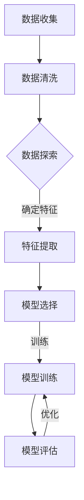

                 

## 文章标题

### 电商用户行为序列预测：AI大模型的时序分析

#### 关键词：电商用户行为、序列预测、AI大模型、时序分析、深度学习

> 摘要：本文将深入探讨电商用户行为序列预测的重要性和挑战，以及如何利用AI大模型进行时序分析。通过详细的理论讲解、实际案例分析和实战项目展示，本文旨在为读者提供一套全面且实用的电商用户行为序列预测解决方案。

### 目录大纲

## 第一部分：背景与基础理论

### 第1章：电商用户行为概述

#### 1.1 电商用户行为的重要性

#### 1.2 用户行为序列的基本概念

#### 1.3 用户行为序列的常见分析方法

### 第2章：人工智能与机器学习基础

#### 2.1 人工智能的发展历程

#### 2.2 机器学习的基本概念

#### 2.3 常见的机器学习算法

### 第3章：时序数据分析

#### 3.1 时序数据的基本特征

#### 3.2 常见的时序分析方法

#### 3.3 时序数据的可视化工具

## 第二部分：AI大模型在用户行为序列预测中的应用

### 第4章：AI大模型概述

#### 4.1 AI大模型的基本原理

#### 4.2 主流AI大模型的比较

#### 4.3 AI大模型的优势与应用场景

### 第5章：时序分析中的AI大模型

#### 5.1 AI大模型在时序数据中的预处理

#### 5.2 基于AI大模型的时序预测方法

#### 5.3 AI大模型在用户行为序列预测中的应用

### 第6章：电商用户行为序列预测案例

#### 6.1 案例背景与目标

#### 6.2 数据预处理与模型选择

#### 6.3 模型训练与评估

#### 6.4 模型优化与结果分析

### 第7章：AI大模型在电商用户行为序列预测中的挑战与未来趋势

#### 7.1 挑战与问题

#### 7.2 未来发展趋势

#### 7.3 应用展望

## 第三部分：实战与总结

### 第8章：电商用户行为序列预测项目实战

#### 8.1 实战项目概述

#### 8.2 实战项目环境搭建

#### 8.3 实战项目代码解读

#### 8.4 实战项目结果分析

### 第9章：总结与展望

#### 9.1 主要内容回顾

#### 9.2 存在的问题与改进方向

#### 9.3 对未来工作的展望

## 附录

#### 附录A：常见问题与解答

#### 附录B：参考文献

#### 附录C：开源代码与资源链接

### 第一部分：背景与基础理论

#### 第1章：电商用户行为概述

### 1.1 电商用户行为的重要性

电商用户行为是指用户在电子商务平台上进行的一系列操作，包括浏览、搜索、添加购物车、下单、支付等。这些行为对于电商平台具有重要意义，因为它们直接影响到用户的购买决策和平台的销售额。因此，对电商用户行为进行深入分析，可以帮助电商平台更好地理解用户需求，提高用户体验，从而提升销售额。

首先，电商用户行为数据可以提供关于用户兴趣和偏好的洞察。通过分析用户的行为数据，例如浏览了哪些商品、添加了哪些商品到购物车、购买了哪些商品等，电商平台可以了解用户的兴趣和购买倾向。这些信息对于精准推荐和个性化营销策略的制定至关重要。

其次，电商用户行为数据可以帮助电商平台优化网站设计和用户体验。通过对用户行为的分析，可以识别用户在使用平台过程中遇到的问题和障碍，如页面加载速度慢、导航困难等。这些问题的解决可以显著提高用户的满意度和转化率。

此外，电商用户行为数据还可以用于预测用户的购买行为。通过对用户历史行为的分析，可以预测用户在未来可能进行的操作，如购买商品、放弃购物车等。这种预测可以帮助电商平台提前采取措施，如发送优惠信息、推荐相关商品等，以引导用户完成购买。

综上所述，电商用户行为的重要性不言而喻。通过对用户行为数据的深入分析，电商平台不仅可以提高销售额，还可以提升用户满意度和忠诚度。因此，深入研究电商用户行为序列预测具有重要意义。

### 1.2 用户行为序列的基本概念

用户行为序列是指用户在电子商务平台上进行的一系列操作的集合，这些操作通常以时间顺序排列。用户行为序列可以看作是一种时间序列数据，它包含了用户在不同时间点的行为模式。用户行为序列的基本概念包括以下几个关键要素：

**时间点**：用户行为序列中的每一个操作都发生在特定的时间点。时间点可以是绝对时间（如年、月、日、时、分等），也可以是相对时间（如相对于用户上一次操作的时间间隔）。

**行为**：用户行为序列中的每个时间点对应一个或多个用户行为。这些行为可以是浏览商品、添加购物车、下单支付、评价商品等。每个行为都代表了用户的一种互动方式。

**依赖关系**：用户行为序列中的行为之间存在一定的依赖关系。例如，用户可能会先浏览商品，然后将其添加到购物车，最后完成购买。这种行为序列中的每个行为都可能受到前一个行为的影响。

**时间特征**：用户行为序列的时间特征包括行为发生的时间点、频率、持续时间等。例如，用户在一天中的某个时段更活跃，或者用户在某个时间段内频繁进行特定操作。

**行为特征**：用户行为序列中的行为特征包括行为的类型、频次、持续时间等。例如，用户在浏览商品时，可能会关注商品的详细信息、价格、评价等。

理解用户行为序列的基本概念对于进行有效的用户行为分析和预测至关重要。通过深入分析用户行为序列，电商平台可以更好地了解用户的行为模式，从而制定更有效的营销策略和用户体验优化方案。

### 1.3 用户行为序列的常见分析方法

分析用户行为序列可以帮助电商平台深入了解用户行为模式，从而优化用户体验和提升销售额。常见的用户行为序列分析方法包括统计分析、关联规则挖掘和时间序列分析。以下是这些方法的详细解释：

#### 1.3.1 统计分析

统计分析是用户行为序列分析的基本方法之一。通过统计用户行为的各项指标，如点击率、转化率、平均会话时长等，可以直观地了解用户的行为特征。统计分析方法主要包括以下步骤：

1. **数据收集**：收集用户行为数据，包括用户在平台上的每个操作的时间、类型和相关信息。
2. **数据清洗**：处理缺失值、异常值等，确保数据质量。
3. **数据转换**：将原始数据转换为可用于分析的格式，如表格、图表等。
4. **指标计算**：计算各项行为指标，如点击率、转化率、平均会话时长等。
5. **可视化**：使用图表、热力图等工具，可视化分析结果，帮助理解用户行为模式。

统计分析的优点在于其简单易懂，可以帮助快速识别用户行为的总体趋势。然而，其缺点在于无法揭示用户行为之间的复杂关系和潜在的规律。

#### 1.3.2 关联规则挖掘

关联规则挖掘是一种基于数据分析的方法，用于发现用户行为序列中的关联关系。通过挖掘用户行为之间的关联规则，可以识别出用户可能的购买路径和偏好。关联规则挖掘的主要步骤包括：

1. **数据准备**：收集用户行为数据，并转换为适合分析的格式。
2. **支持度和置信度计算**：计算每个关联规则的支持度和置信度。支持度表示关联规则出现的频率，置信度表示规则成立的概率。
3. **规则生成**：生成满足最小支持度和置信度阈值的关联规则。
4. **规则优化**：对生成的规则进行排序和筛选，去除冗余规则，保留最有意义的关联规则。

关联规则挖掘的优点在于能够揭示用户行为之间的隐含关系，帮助电商平台制定个性化推荐和营销策略。然而，其缺点在于规则生成的复杂性，以及可能生成的规则数量庞大，需要进一步筛选和分析。

#### 1.3.3 时间序列分析

时间序列分析是一种基于时间顺序的数据分析方法，用于识别和预测用户行为序列中的时间特征。时间序列分析方法主要包括以下步骤：

1. **数据收集**：收集用户行为数据，包括时间、行为类型和相关信息。
2. **数据预处理**：处理缺失值、异常值等，确保数据质量。
3. **时间序列分解**：将时间序列数据分解为趋势、季节性和随机性成分，以便更好地理解数据的变化规律。
4. **模型选择**：选择合适的时间序列模型，如ARIMA、LSTM等，对时间序列进行建模。
5. **模型训练和评估**：使用历史数据训练模型，并使用验证集评估模型性能。
6. **预测**：使用训练好的模型预测未来的用户行为。

时间序列分析的优势在于能够捕捉用户行为序列中的时间依赖关系，提供对未来行为的预测。然而，其缺点在于对数据质量要求较高，且模型选择和参数调优较为复杂。

综上所述，不同用户行为序列分析方法各有优缺点，电商平台可以根据具体需求选择合适的方法。通过综合运用这些方法，可以更全面地分析用户行为序列，为电商平台提供有力的决策支持。

### 第2章：人工智能与机器学习基础

#### 2.1 人工智能的发展历程

人工智能（Artificial Intelligence, AI）作为计算机科学的一个分支，自1956年由约翰·麦卡锡（John McCarthy）等人首次提出以来，已经经历了多个发展阶段。以下是人工智能发展历程的简要概述：

1. **初期探索（1956-1974）**：人工智能的初期探索主要集中在符号主义和逻辑推理上。这一阶段的主要成果包括开发出一些简单的推理系统，如逻辑推理机。然而，由于依赖大量的先验知识，这些系统在实际应用中效果有限。

2. **人工智能寒冬（1974-1980）**：在初期探索阶段，人工智能的研究进展迅速，但随后由于实际应用中的困难和资金短缺，人工智能研究进入了一个低潮期，被称为“人工智能寒冬”。

3. **专家系统时代（1980-1987）**：在人工智能寒冬之后，专家系统的出现为人工智能带来了新的希望。专家系统通过模拟人类专家的推理过程，实现了在特定领域内的自动化决策。然而，专家系统在知识获取和推理效率上仍存在局限性。

4. **机器学习兴起（1987-至今）**：1987年，神经网络和机器学习技术的复兴标志着人工智能进入了一个新的时代。机器学习通过从数据中学习规律，无需显式编程，为人工智能带来了革命性的变化。这一阶段的主要成果包括支持向量机（SVM）、决策树、神经网络等算法的出现。

5. **深度学习时代（2012-至今）**：2012年，深度学习在图像识别领域取得了突破性成果，使得人工智能在图像识别、语音识别、自然语言处理等任务中取得了显著进展。深度学习通过多层神经网络结构，实现了对复杂数据的自动特征提取和学习。

#### 2.2 机器学习的基本概念

机器学习（Machine Learning, ML）是人工智能的核心技术之一，它通过从数据中学习规律，实现对未知数据的预测或分类。机器学习的基本概念包括以下几个关键要素：

1. **数据**：数据是机器学习的核心资源，用于训练模型和评估模型性能。数据可以包括文本、图像、音频、时间序列等不同类型。

2. **模型**：模型是机器学习算法的核心，用于将数据映射到预测结果。常见的机器学习模型包括线性回归、逻辑回归、决策树、随机森林、支持向量机、神经网络等。

3. **训练**：训练是指通过调整模型的参数，使其在训练数据上表现良好的过程。训练过程中，模型会从数据中学习到规律，以便对未知数据进行预测或分类。

4. **评估**：评估是指通过使用验证集或测试集，评估模型在未知数据上的性能。常用的评估指标包括准确率、召回率、F1分数、均方误差等。

5. **泛化**：泛化是指模型在未知数据上的表现能力。一个优秀的模型不仅要在训练数据上表现良好，还要在未知数据上具有较好的泛化能力。

6. **过拟合和欠拟合**：过拟合是指模型在训练数据上表现太好，但在未知数据上表现较差的情况。欠拟合则是指模型在训练数据和未知数据上表现都不好。避免过拟合和欠拟合是机器学习中的重要任务。

#### 2.3 常见的机器学习算法

机器学习算法可以分为监督学习、无监督学习和强化学习三大类。以下是这些算法的简要概述：

1. **监督学习**：监督学习是指模型从带标签的训练数据中学习，以便在未知数据上进行预测或分类。常见的监督学习算法包括：

   - **线性回归**：用于预测连续值。
   - **逻辑回归**：用于分类问题。
   - **决策树**：用于分类和回归问题。
   - **支持向量机**：用于分类问题。
   - **神经网络**：用于复杂非线性问题。

2. **无监督学习**：无监督学习是指模型从无标签数据中学习，用于发现数据中的结构和规律。常见的无监督学习算法包括：

   - **聚类**：用于将相似的数据点分组。
   - **降维**：用于减少数据维度，如主成分分析（PCA）。
   - **关联规则挖掘**：用于发现数据中的关联关系。

3. **强化学习**：强化学习是指模型通过与环境的交互，学习到最优行为策略。常见的强化学习算法包括：

   - **Q-learning**：通过值函数学习最优策略。
   - **深度 reinforcement learning**：结合深度学习技术，解决复杂的强化学习问题。

通过了解人工智能和机器学习的基本概念和常见算法，可以更好地理解后续章节中关于AI大模型和时序分析的详细讨论。

### 第3章：时序数据分析

#### 3.1 时序数据的基本特征

时序数据（Time Series Data）是指按照时间顺序排列的一系列数据点，常用于描述随时间变化的现象。时序数据具有以下基本特征：

1. **时间性**：时序数据中的每个数据点都有明确的时间戳，用于表示数据发生的具体时间。

2. **序列性**：时序数据按照时间顺序排列，前后的数据点之间存在时间依赖关系。

3. **平稳性**：平稳性是指时序数据的统计特性不随时间变化。平稳时序数据具有固定的均值、方差和自协方差。

4. **周期性**：某些时序数据会表现出周期性特征，即数据在固定的时间间隔内重复出现某种模式。

5. **趋势性**：趋势性是指时序数据随时间呈现上升、下降或平稳变化的趋势。

6. **季节性**：季节性是指时序数据在某些固定的时间段内（如节假日、季节变化等）出现的规律性波动。

7. **随机性**：时序数据中可能存在随机波动，这些波动无法通过简单的时间依赖关系解释。

了解时序数据的基本特征对于进行有效的时序数据分析至关重要，这些特征将直接影响后续的数据预处理、模型选择和结果评估。

#### 3.2 常见的时序分析方法

时序数据分析的目标是从时序数据中提取有用的信息，以便进行预测、监控或决策。常见的时序分析方法包括统计分析、时间序列模型和深度学习等方法。以下是这些方法的详细解释：

1. **统计分析**：
   - **描述性统计**：通过计算均值、方差、标准差等指标，对时序数据进行初步分析，了解数据的基本特征。
   - **相关性分析**：通过计算相关系数，分析时序数据中不同变量之间的相关性，识别可能的时间依赖关系。
   - **自相关性**：通过自相关函数（ACF）和偏自相关函数（PACF），分析时序数据自身的相关性，识别时间序列中的周期性和趋势性。

2. **时间序列模型**：
   - **ARIMA模型**：自回归积分滑动平均模型（Autoregressive Integrated Moving Average, ARIMA）是一种经典的时序模型，通过自回归（AR）、差分（I）和移动平均（MA）三个组件，捕捉时间序列数据的特征。
   - **ARIMA模型的扩展**：包括季节性ARIMA（SARIMA）、自回归移动平均季节性（ARIMA-SM）等，用于处理带有季节性和周期性的时序数据。
   - **状态空间模型**：包括卡尔曼滤波（Kalman Filter）和广义状态空间模型（GPSM），通过状态空间建模，实现时序数据的预测和状态估计。

3. **深度学习**：
   - **循环神经网络（RNN）**：包括长短时记忆网络（LSTM）和门控循环单元（GRU），能够处理长距离的时间依赖关系。
   - **卷积神经网络（CNN）**：通过卷积操作，捕捉时序数据的局部特征。
   - **变分自编码器（VAE）**和**生成对抗网络（GAN）**：通过生成模型，实现时序数据的生成和去噪。

4. **组合模型**：结合多种方法，如将统计分析和深度学习结合，提高时序数据分析的准确性和鲁棒性。

通过了解常见的时序分析方法，可以选择合适的方法进行时序数据分析，以解决实际问题。以下是一个简单的Mermaid流程图，展示时序数据分析的基本步骤：



该流程图简要说明了从数据收集到模型评估的基本步骤，每个步骤都有其特定的方法和挑战。

#### 3.3 时序数据的可视化工具

时序数据的可视化对于理解和分析时序模式至关重要。以下是一些常用的时序数据可视化工具：

1. **Matplotlib**：
   - **优点**：强大的绘图功能，支持多种数据可视化方法。
   - **缺点**：界面相对复杂，可能需要较长的学习时间。

2. **Seaborn**：
   - **优点**：基于Matplotlib，提供了更多精美的可视化模板。
   - **缺点**：可视化选项相对有限，可能需要额外的代码实现。

3. **Plotly**：
   - **优点**：支持交互式数据可视化，能够动态更新和交互。
   - **缺点**：相对于Matplotlib和Seaborn，性能可能较低。

以下是一个使用Matplotlib进行时序数据可视化的示例代码：

```python
import matplotlib.pyplot as plt
import pandas as pd

# 加载时序数据
data = pd.read_csv('timeseries_data.csv')
data['Date'] = pd.to_datetime(data['Date'])
data.set_index('Date', inplace=True)

# 绘制时序图
plt.figure(figsize=(12, 6))
plt.plot(data['Value'])
plt.title('Time Series Data')
plt.xlabel('Date')
plt.ylabel('Value')
plt.show()
```

该示例代码加载了时序数据，并使用Matplotlib绘制了时序图，显示了数据的时间变化趋势。

通过使用这些可视化工具，可以更直观地理解时序数据的特征和模式，为后续的建模和分析提供有力的支持。

### 第4章：AI大模型概述

#### 4.1 AI大模型的基本原理

AI大模型（Large-scale Artificial Intelligence Models）是指参数数量巨大、计算资源需求庞大的神经网络模型。这些模型通过从大量数据中学习，捕捉数据的复杂特征，从而在多种任务中实现优异的性能。AI大模型的基本原理包括以下几个方面：

1. **神经网络结构**：AI大模型通常采用深层神经网络结构，包括多层感知机（MLP）、卷积神经网络（CNN）和循环神经网络（RNN）等。这些结构能够通过逐层学习，从输入数据中提取高层次的抽象特征。

2. **大规模训练数据**：AI大模型需要大量的训练数据，以充分捕捉数据的多样性。这些数据可以是公开数据集，也可以是定制的数据集。大规模数据的训练有助于模型避免过拟合，提高泛化能力。

3. **分布式训练**：为了处理庞大的模型参数和训练数据，AI大模型通常采用分布式训练技术。分布式训练通过将计算任务分布在多个计算节点上，加快模型训练速度，提高计算效率。

4. **预训练与微调**：AI大模型通常采用预训练与微调（Pre-training and Fine-tuning）的方法。预训练是指在大量数据上进行无监督学习，学习到通用特征表示。微调则是指在特定任务上进行有监督学习，对模型进行微调，提高任务性能。

5. **优化算法**：AI大模型训练过程中，通常采用高效的优化算法，如Adam、Adagrad等。这些算法通过自适应调整学习率，提高模型训练的效率和稳定性。

#### 4.2 主流AI大模型的比较

目前，主流的AI大模型包括GPT系列模型、BERT模型和Transformer模型等。以下是这些模型的简要比较：

1. **GPT系列模型**：
   - **特点**：GPT系列模型是生成预训练变换器（Generative Pre-trained Transformer）的简称，由OpenAI开发。这些模型通过大量的文本数据预训练，生成高质量的文本。
   - **应用**：GPT系列模型在自然语言处理（NLP）任务中表现出色，如文本生成、问答系统等。
   - **优势**：强大的文本生成能力，能够生成连贯、自然的文本。
   - **劣势**：模型参数庞大，训练和部署成本高。

2. **BERT模型**：
   - **特点**：BERT（Bidirectional Encoder Representations from Transformers）是由Google开发的预训练模型，采用双向变换器架构，能够理解文本的上下文信息。
   - **应用**：BERT在NLP任务中广泛使用，如文本分类、命名实体识别等。
   - **优势**：能够捕捉文本的上下文信息，提高模型的语义理解能力。
   - **劣势**：模型训练和推理时间较长，对计算资源要求较高。

3. **Transformer模型**：
   - **特点**：Transformer模型是由Google开发的，首次应用于机器翻译任务。它采用自注意力机制，能够同时关注输入序列的每个部分，提高模型的表示能力。
   - **应用**：Transformer模型在多种任务中表现出色，包括自然语言处理、计算机视觉等。
   - **优势**：自注意力机制使模型能够捕捉长距离依赖关系，提高模型性能。
   - **劣势**：模型参数庞大，训练和推理成本高。

#### 4.3 AI大模型的优势与应用场景

AI大模型具有以下优势和应用场景：

1. **优势**：
   - **强大的建模能力**：AI大模型通过多层神经网络结构，能够捕捉数据的复杂特征，提高模型的预测和分类能力。
   - **良好的泛化能力**：通过大规模训练数据和无监督预训练，AI大模型具有良好的泛化能力，能够在不同任务中取得优异的性能。
   - **适用于多种任务**：AI大模型可以应用于多种任务，包括自然语言处理、计算机视觉、推荐系统等。

2. **应用场景**：
   - **自然语言处理**：AI大模型在文本生成、问答系统、机器翻译等任务中表现出色，能够生成高质量的文本。
   - **计算机视觉**：AI大模型在图像分类、目标检测、图像生成等任务中应用广泛，能够识别和生成图像特征。
   - **推荐系统**：AI大模型通过学习用户的兴趣和行为模式，能够实现精准推荐，提高用户体验。
   - **金融预测**：AI大模型在股票市场预测、风险评估等任务中应用，能够提高预测准确性。

通过深入了解AI大模型的基本原理和优势，可以更好地理解和应用这些模型，解决实际问题和挑战。

### 第5章：时序分析中的AI大模型

#### 5.1 AI大模型在时序数据中的预处理

在进行时序数据分析时，预处理是至关重要的一步，它直接影响模型训练的效果和预测的准确性。AI大模型对数据质量的要求较高，因此在预处理过程中需要特别注意以下几个方面：

1. **数据清洗**：时序数据中常常包含缺失值、异常值和噪声数据。首先，需要识别和填补缺失值。常见的方法包括均值填补、线性插值、卡尔曼滤波等。其次，需要识别和去除异常值。异常值可能是由于数据录入错误或真实异常引起的，可以使用箱线图、IQR方法等工具进行识别。最后，需要去除噪声数据，以减少对模型训练和预测的影响。

2. **数据标准化**：为了消除不同特征之间的量级差异，需要对数据进行标准化处理。常用的方法包括Z-score标准化和MinMax标准化。Z-score标准化将数据缩放到均值为0、标准差为1的正态分布，而MinMax标准化将数据缩放到一个指定范围，如[0, 1]。

3. **特征工程**：特征工程是时序数据预处理的关键步骤，它通过提取和构造新的特征来提高模型的性能。常见的特征工程方法包括：

   - **时间特征**：提取时间特征，如日期、星期、小时等。这些特征可以帮助模型捕捉时间序列的周期性和趋势性。
   - **滞后特征**：通过构造滞后特征，如当前时间点的滞后1步、2步等，帮助模型学习时间依赖关系。
   - **季节特征**：对于具有季节性的时序数据，可以通过提取季节特征，如季节性指数、季节性趋势等，帮助模型捕捉季节性波动。

4. **数据分割**：将数据集划分为训练集、验证集和测试集。训练集用于模型训练，验证集用于模型调优和参数选择，测试集用于模型评估和性能测试。

5. **数据可视化**：通过数据可视化，可以直观地了解数据分布、趋势和异常，有助于进一步的数据清洗和特征工程。

以下是一个数据清洗和特征工程的具体步骤示例：

```python
import pandas as pd
import numpy as np

# 加载时序数据
data = pd.read_csv('timeseries_data.csv')
data['Date'] = pd.to_datetime(data['Date'])
data.set_index('Date', inplace=True)

# 填补缺失值
data.interpolate(method='linear', inplace=True)

# 去除异常值
Q1 = data.quantile(0.25)
Q3 = data.quantile(0.75)
IQR = Q3 - Q1
data = data[~((data < (Q1 - 1.5 * IQR)) | (data > (Q3 + 1.5 * IQR))).any(axis=1)]

# 数据标准化
data['Value'] = (data['Value'] - data['Value'].mean()) / data['Value'].std()

# 提取时间特征
data['Day'] = data.index.day
data['Week'] = data.index.week
data['Month'] = data.index.month
data['Year'] = data.index.year

# 构造滞后特征
for lag in range(1, 4):
    data[f'Lag_{lag}'] = data['Value'].shift(lag)

# 去除滞后特征中的缺失值
data.dropna(inplace=True)

# 数据可视化
plt.figure(figsize=(12, 6))
plt.plot(data['Value'])
plt.title('Time Series Data')
plt.xlabel('Date')
plt.ylabel('Value')
plt.show()
```

该示例代码展示了如何对时序数据进行清洗、特征工程和数据可视化，为后续的模型训练和预测奠定了基础。

#### 5.2 基于AI大模型的时序预测方法

AI大模型在时序预测中的应用广泛，通过学习数据中的复杂模式和依赖关系，可以实现高精度的预测。常见的基于AI大模型的时序预测方法包括Transformer模型、LSTM模型和GRU模型等。以下是这些模型的基本原理和应用。

##### 5.2.1 Transformer模型

Transformer模型由Google在2017年提出，首次应用于机器翻译任务。它采用自注意力机制（Self-Attention），能够同时关注输入序列的每个部分，捕捉长距离依赖关系。

1. **自注意力机制**：自注意力机制通过计算每个词与所有其他词的相似度，为每个词生成加权特征向量。这样，模型能够关注到序列中重要词的信息，而忽略不相关的词。

2. **编码器-解码器结构**：Transformer模型采用编码器-解码器（Encoder-Decoder）结构，编码器从输入序列中提取特征，解码器生成预测输出。编码器和解码器都由多个变换器（Transformer Block）组成。

3. **多头注意力**：多头注意力（Multi-Head Attention）通过将输入序列分解为多个子序列，分别计算注意力权重，最后合并结果。这增加了模型对输入数据的处理能力。

4. **残差连接和层归一化**：为了防止模型深度增加导致梯度消失和梯度爆炸问题，Transformer模型采用残差连接和层归一化（Layer Normalization）技术，提高模型训练的稳定性和效率。

在时序预测中，Transformer模型通过将时间序列作为输入，预测未来的时间步。以下是一个简单的Transformer模型时序预测的伪代码：

```python
# Transformer模型时序预测伪代码
class TransformerModel(nn.Module):
    def __init__(self, input_dim, hidden_dim, output_dim, num_heads, num_layers):
        super(TransformerModel, self).__init__()
        self.encoder = Encoder(input_dim, hidden_dim, num_heads, num_layers)
        self.decoder = Decoder(hidden_dim, output_dim, num_heads, num_layers)
        self.fc = nn.Linear(hidden_dim, output_dim)

    def forward(self, x):
        x = self.encoder(x)
        x = self.decoder(x)
        x = self.fc(x)
        return x

# Encoder部分伪代码
class Encoder(nn.Module):
    def __init__(self, input_dim, hidden_dim, num_heads, num_layers):
        super(Encoder, self).__init__()
        self.layers = nn.ModuleList([
            TransformerBlock(input_dim, hidden_dim, num_heads) for _ in range(num_layers)
        ])

    def forward(self, x):
        for layer in self.layers:
            x = layer(x)
        return x

# Decoder部分伪代码
class Decoder(nn.Module):
    def __init__(self, input_dim, hidden_dim, num_heads, num_layers):
        super(Decoder, self).__init__()
        self.layers = nn.ModuleList([
            TransformerBlock(input_dim, hidden_dim, num_heads) for _ in range(num_layers)
        ])

    def forward(self, x, encoder_output):
        for layer in self.layers:
            x = layer(x, encoder_output)
        return x
```

##### 5.2.2 LSTM模型

LSTM（长短时记忆网络）是一种循环神经网络（RNN）的变体，通过引入门控机制，解决了传统RNN在处理长序列数据时梯度消失和梯度爆炸的问题。

1. **门控机制**：LSTM通过遗忘门、输入门和输出门三个门控单元，控制信息的输入、遗忘和输出。遗忘门决定哪些信息需要遗忘，输入门决定哪些新信息需要存储，输出门决定如何生成输出。

2. **细胞状态**：LSTM的核心是细胞状态（Cell State），它存储了序列中的信息。通过门控机制，细胞状态能够有效地更新和传递信息。

3. **激活函数**：LSTM使用sigmoid激活函数，将输入和遗忘门的输出限制在0到1之间，从而实现信息的门控。

在时序预测中，LSTM模型通过学习序列中的时间依赖关系，生成未来的时间步。以下是一个简单的LSTM模型时序预测的伪代码：

```python
# LSTM模型时序预测伪代码
class LST

