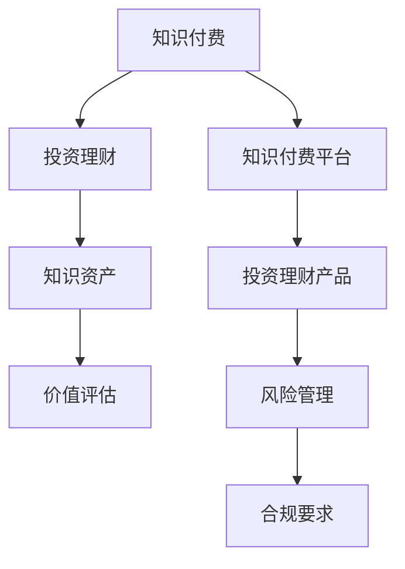

                 

### 《知识付费与投资理财相结合的知识资产模式》引言

#### 关键词：知识付费，投资理财，知识资产，价值评估，结合模式

随着信息时代的到来，知识付费与投资理财两个领域逐渐受到关注。知识付费，指的是用户通过支付费用来获取专业知识和技能的过程。而投资理财，则是指通过投资获得收益的一种方式。这两个领域看似独立，但实则存在许多交集。本文旨在探讨知识付费与投资理财相结合的知识资产模式，以期为读者提供新的视角和思路。

#### 一、知识付费的发展背景与现状

知识付费作为一种新兴的商业模式，起源于互联网的普及和人们对专业知识和技能的需求。在传统的教育模式下，知识主要通过课堂传授。而随着互联网技术的发展，人们可以通过在线课程、电子书、专业讲座等多种形式获取知识。这种变化不仅降低了知识获取的门槛，还使得知识传播的速度和质量得到了显著提升。

目前，知识付费市场呈现出以下几个特点：

1. **市场规模不断扩大**：根据艾瑞咨询的数据，中国知识付费市场在2018年市场规模已达到1500亿元，并有望在未来继续保持高速增长。

2. **用户群体逐渐扩大**：知识付费的用户不仅包括大学生、职场新人等传统群体，还涵盖了更多对专业知识和技能有需求的职场人士和创业者。

3. **内容形式多样化**：从最初的在线课程，到后来的付费专栏、知识付费APP，知识付费的内容形式越来越多样化。

#### 二、投资理财的基本概念与分类

投资理财是指通过投资获取收益的一种方式。投资理财的目标是保值增值，其核心在于对风险和收益的权衡。根据投资对象的不同，投资理财可以分为以下几类：

1. **股票投资**：股票投资是投资理财中最为常见的一种方式。投资者通过购买股票，期望公司业绩增长从而实现投资回报。

2. **债券投资**：债券投资是指购买债券，通过债券的利息收入和债券价格的波动来获取收益。

3. **基金投资**：基金投资是将资金交给专业的基金经理进行管理，通过投资组合来分散风险，实现资产的保值增值。

4. **房地产投资**：房地产投资是指通过购买房地产，利用其增值和租金收入来获取收益。

#### 三、知识付费与投资理财的交集与融合

知识付费与投资理财的交集主要体现在以下几个方面：

1. **知识资产的价值评估**：在投资理财中，需要对投资对象进行价值评估。同样，在知识付费中，也需要对知识资产的价值进行评估。通过结合投资理财的评估方法，可以更加科学地评估知识资产的价值。

2. **知识资产的投资组合**：在投资理财中，投资者会通过构建投资组合来分散风险。同样，在知识付费中，用户也可以通过购买不同类型的知识产品来构建自己的知识资产组合。

3. **知识资产的风险管理**：在投资理财中，风险管理是至关重要的。同样，在知识付费中，用户也需要对知识资产进行风险管理，以避免因知识过时或市场变化带来的损失。

通过以上分析，我们可以看出，知识付费与投资理财在概念、目标和操作方法上存在许多交集。在未来的发展中，两者结合的知识资产模式有望成为新的趋势。本文将在后续章节中进一步探讨知识资产的定义与价值评估、知识付费与投资理财的结合模式以及知识资产在投资理财中的应用。

### **知识资产的界定与价值评估**

在探讨知识付费与投资理财相结合的知识资产模式之前，我们首先需要明确知识资产的定义及其价值评估的方法。知识资产是指企业在创造、交换、使用和整合知识的过程中形成的无形资产，包括专利、商标、版权、客户关系、品牌价值、员工技能和知识库等。知识资产的价值不仅体现在其对企业经营决策的支撑作用，还体现在其潜在的市场价值和经济回报。

#### 一、知识资产的定义与分类

1. **知识资产的概念**

知识资产是知识经济时代的重要资产形式，与传统物质资产相比，其具有以下特点：

- **无形性**：知识资产不具备物理形态，无法直接触摸或观察。
- **动态性**：知识资产的价值随着时间和市场环境的变化而变化。
- **可转移性**：知识资产可以通过各种形式在不同主体之间转移。
- **共享性**：知识资产可以被多个主体共享，而不会减少其价值。

2. **知识资产的分类**

根据不同的分类标准，知识资产可以划分为多种类型：

- **按知识形式分类**：知识资产可以分为显性知识和隐性知识。显性知识是指以文本、图表、数字等可编码的形式存在的知识，如专利、技术规范、学术论文等。隐性知识则是指难以编码或形式化的知识，如员工的经验、技能、商业机密等。

- **按所有权分类**：知识资产可以分为自有知识资产和共有知识资产。自有知识资产是指企业独自拥有的知识资产，如企业专利、商标等。共有知识资产则是指企业与其他企业或机构共享的知识资产，如行业标准、合作研发成果等。

- **按用途分类**：知识资产可以分为战略知识资产、运营知识资产和客户知识资产。战略知识资产是企业制定战略决策的重要依据，如市场分析报告、竞争策略等。运营知识资产则是企业日常运营所需的知识，如操作手册、业务流程等。客户知识资产则是指企业关于客户需求、偏好和行为的知识。

#### 二、知识资产的价值评估方法

知识资产的价值评估是投资决策的重要依据。以下是几种常见的方法：

1. **成本法**

成本法是指根据知识资产的形成成本或重置成本来评估其价值。这种方法适用于那些具有明确成本记录的知识资产，如专利、商标等。其计算公式为：

   $$ 
   知识资产价值 = 形成成本 \times 成本调整系数
   $$

2. **市场法**

市场法是指通过比较类似知识资产的市场价格来评估其价值。这种方法适用于那些在市场上具有明确交易价格的知识资产，如股票、债券等。其计算公式为：

   $$ 
   知识资产价值 = 类似知识资产市场价格 \times 调整系数
   $$

3. **收益法**

收益法是指根据知识资产预期收益来评估其价值。这种方法适用于那些具有明确经济收益的知识资产，如专利技术、品牌价值等。其计算公式为：

   $$ 
   知识资产价值 = 预期收益 \times 收益折现率
   $$

4. **综合法**

综合法是指将成本法、市场法和收益法相结合，综合评估知识资产的价值。这种方法适用于那些难以单独使用其他方法评估的知识资产。

在实际应用中，通常需要根据知识资产的特点和市场环境选择合适的评估方法。例如，对于显性知识资产，可以采用成本法或市场法；对于隐性知识资产，可以采用收益法或综合法。

#### 三、知识资产的价值评估案例

以下是一个关于知识资产价值评估的案例：

**案例：某企业专利技术的价值评估**

某企业拥有一项专利技术，该技术可用于生产一种新型电子产品。根据市场调查，类似产品的市场售价为1000元/件，而该企业生产一件产品的成本为500元。预计该专利技术在未来5年内能够为企业带来100万件产品的销售。

1. **成本法**

   知识资产价值 = 成本 \* 成本调整系数

   知识资产价值 = 500元/件 \* 1.2 = 600元/件

2. **市场法**

   知识资产价值 = 类似产品市场价格 \* 调整系数

   知识资产价值 = 1000元/件 \* 0.8 = 800元/件

3. **收益法**

   知识资产价值 = 预期收益 \* 收益折现率

   知识资产价值 = 100万件 \* 0.1 \* 0.9 = 90万元

4. **综合法**

   知识资产价值 = 成本法 + 市场法 + 收益法

   知识资产价值 = 600元/件 + 800元/件 + 90万元 = 990万元

根据以上计算，该专利技术的价值约为990万元。在实际操作中，企业可以结合自身情况和市场环境，选择合适的评估方法，并综合考虑各种因素，得出一个合理的评估结果。

通过以上分析，我们可以看到，知识资产的价值评估是一个复杂的过程，需要综合考虑多种因素。在知识付费与投资理财相结合的知识资产模式中，准确的价值评估具有重要意义。它不仅可以帮助企业制定合理的投资决策，还可以提高知识资产的管理水平，从而实现企业的可持续发展。

### **知识付费平台中的投资理财模式**

知识付费平台作为知识资产的主要载体，其投资理财模式在近年来逐渐受到市场关注。这些平台不仅提供了丰富的知识产品，还通过创新的金融产品设计和运营模式，为用户提供了投资理财的新选择。以下将从知识付费平台的发展与现状、平台内投资理财产品的设计与运营，以及具体案例分析三个方面进行探讨。

#### 一、知识付费平台的发展与现状

1. **发展历程**

知识付费平台的发展可以追溯到2010年代中期，随着移动互联网的普及和用户对专业知识和技能需求的增加，各大知识付费平台如雨后春笋般涌现。早期以“得到”为代表的平台，主要以提供优质内容为主，用户通过购买会员或单独购买课程来获取知识。随后，更多平台如“知乎Live”、“喜马拉雅”等加入竞争，知识付费市场逐渐成熟。

2. **市场现状**

目前，知识付费平台已经形成了一定的市场规模和用户群体。根据艾瑞咨询的报告，2019年中国知识付费用户规模已达到2.21亿人，市场规模达到1962亿元。知识付费平台不仅提供了多样化的知识产品，还通过整合教育资源、构建社区互动等方式，提升了用户体验。

3. **用户需求**

知识付费平台的用户需求主要集中在以下几个方面：

- **技能提升**：职场人士希望通过学习提升专业技能，以应对工作挑战。
- **兴趣培养**：用户通过知识付费平台学习兴趣爱好，如音乐、绘画、摄影等。
- **知识更新**：随着科技的发展，用户需要不断更新自己的知识体系，以适应行业变革。
- **投资理财**：部分用户希望通过知识付费平台获取投资理财知识，实现财富增值。

#### 二、平台内投资理财产品的设计与运营

1. **理财产品类型**

知识付费平台内的投资理财产品种类丰富，包括以下几种：

- **知识付费基金**：平台根据用户需求和行业趋势，设立专门的基金产品，通过投资知识付费课程、专栏等获取收益。
- **知识付费理财产品**：平台与金融机构合作，推出类似于定期存款、理财产品等，用户可以通过购买这些产品获得固定收益。
- **知识付费股权投资**：平台为用户提供投资创业公司股权的机会，用户通过学习相关知识，了解投资策略，参与股权投资。
- **知识付费保险**：平台推出与知识付费相关的保险产品，如知识技能保险、创业保险等，用户通过购买保险来规避投资风险。

2. **产品设计原则**

- **多样化**：理财产品类型多样化，满足不同用户的需求。
- **风险可控**：产品设计要充分考虑风险，确保用户利益。
- **透明化**：产品信息公开透明，用户可以清晰了解产品的投资策略、收益情况等。
- **个性化**：根据用户的学习轨迹和行为习惯，提供个性化的理财产品推荐。

3. **运营模式**

知识付费平台的理财产品运营模式主要包括以下几个方面：

- **内容运营**：通过提供高质量的知识内容，吸引并留住用户，形成稳定的用户基础。
- **金融科技**：利用大数据、人工智能等技术，优化理财产品设计和运营，提升用户体验。
- **合作运营**：与金融机构、投资机构合作，共同开发理财产品，实现资源整合。
- **风险管理**：建立完善的风险管理体系，对理财产品进行风险评估和管理，确保用户利益。

#### 三、案例分析：知识付费与投资理财的典型结合实例

1. **案例一：知乎Live**

知乎Live是知乎推出的付费直播课程平台，用户可以通过购买课程来学习专业知识。知乎Live通过与金融机构合作，推出了知识付费基金产品。用户在学习过程中，可以通过了解投资理财知识，参与基金投资，实现知识变现。

- **内容优势**：知乎Live拥有大量专业用户和内容创作者，课程质量较高。
- **金融合作**：知乎与多家金融机构合作，提供多样化的投资理财产品。
- **用户信任**：知乎的品牌影响力和用户信任度为理财产品提供了保障。

2. **案例二：得到App**

得到App是一家提供知识付费服务的平台，其推出的“定投课堂”理财产品深受用户喜爱。用户在学习课程的过程中，可以通过了解投资理财知识，参与定投基金，实现长期投资。

- **课程设计**：得到App的定投课堂课程内容系统全面，适合不同层次的投资者。
- **理财产品**：定投课堂理财产品收益稳定，风险较低，适合长期投资。
- **用户体验**：得到App提供了良好的用户体验，用户可以随时随地进行学习和投资。

通过以上案例分析，我们可以看到，知识付费平台与投资理财的结合，不仅丰富了用户的知识体系，还为他们提供了新的投资渠道。这种结合模式在未来的发展中，有望成为知识付费与投资理财领域的一大亮点。

### **知识资产在股票投资中的应用**

知识资产在股票投资中具有重要作用，它不仅为投资者提供了决策依据，还帮助投资者提高投资效率和收益。通过结合知识资产，投资者可以更深入地分析市场、公司价值和投资策略，从而做出更加明智的投资决策。以下从股票投资的基本原理与策略、利用知识资产进行股票分析的方法，以及具体案例分析三个方面进行探讨。

#### 一、股票投资的基本原理与策略

1. **基本原理**

股票投资是指投资者通过购买股票，期望公司业绩增长从而实现投资回报的一种投资方式。股票投资的基本原理包括：

- **公司价值评估**：投资者需要评估公司的基本面，包括盈利能力、成长性、财务状况等，以判断公司的价值。
- **市场供需关系**：股票价格受市场供需关系影响，投资者需要关注市场情绪、宏观经济环境等因素。
- **风险与收益**：股票投资存在风险，投资者需要根据风险承受能力制定投资策略，以实现收益最大化。

2. **投资策略**

股票投资策略主要包括以下几种：

- **价值投资**：价值投资强调投资公司的基本面，寻找那些被市场低估的优质公司。投资者通过深入研究公司的财务报表、行业趋势等，判断公司的实际价值，从而做出投资决策。
- **成长投资**：成长投资注重投资公司的成长性，寻找那些具有高速增长潜力的公司。投资者通过关注公司的研发能力、市场份额、竞争优势等，判断公司的成长潜力。
- **技术分析**：技术分析通过分析股票价格走势、交易量等数据，预测股票价格的未来走势。投资者利用技术分析工具，如趋势线、支撑位、阻力位等，制定投资策略。
- **组合投资**：组合投资通过分散投资来降低风险，投资者将资金投资于不同行业、不同类型的股票，以实现风险分散。

#### 二、利用知识资产进行股票分析的方法

1. **基本面分析**

基本面分析是股票投资的重要方法之一，它主要关注公司的财务状况、行业地位、管理团队等因素。知识资产在基本面分析中的应用主要包括：

- **财务报表分析**：投资者通过分析公司的财务报表，了解公司的盈利能力、运营效率、财务稳定性等。知识资产可以帮助投资者理解财务报表中的关键指标，如利润表、资产负债表、现金流量表等。
- **行业趋势分析**：投资者需要了解所处行业的发展趋势、市场规模、竞争格局等。知识资产可以帮助投资者获取行业研究报告、行业动态等信息，从而判断公司的行业地位和发展潜力。
- **管理团队分析**：投资者需要关注公司的管理团队，了解其背景、经验、执行力等。知识资产可以帮助投资者了解管理团队的历史业绩、领导力评价等，从而评估公司的管理质量。

2. **技术分析**

技术分析通过分析股票价格走势和交易量等数据，预测股票价格的未来走势。知识资产在技术分析中的应用主要包括：

- **价格走势分析**：投资者通过分析股票价格的历史走势，判断股票价格的支撑位和阻力位。知识资产可以帮助投资者了解价格走势的规律、趋势变化等，从而制定买入和卖出策略。
- **交易量分析**：交易量是判断市场情绪的重要指标。知识资产可以帮助投资者了解交易量的变化规律、异常交易量等，从而预测市场趋势和价格变化。
- **技术指标分析**：技术指标是通过数学计算得到的指标，如均线、相对强弱指数（RSI）、布林带等。知识资产可以帮助投资者理解这些技术指标的计算方法和应用场景，从而提高技术分析的效果。

3. **数据挖掘与机器学习**

随着大数据和人工智能技术的发展，数据挖掘和机器学习在股票分析中得到了广泛应用。知识资产在数据挖掘与机器学习中的应用主要包括：

- **特征工程**：投资者通过数据挖掘技术，从大量历史数据中提取出对投资决策有用的特征，如财务指标、市场指标、情绪指标等。知识资产可以帮助投资者理解这些特征的意义和应用场景。
- **预测模型构建**：投资者利用机器学习算法，如回归分析、决策树、支持向量机等，构建预测模型，预测股票价格的未来走势。知识资产可以帮助投资者选择合适的算法、调整模型参数等，提高预测准确性。
- **风险控制**：投资者利用数据挖掘和机器学习技术，分析历史数据中的风险因素，制定风险控制策略。知识资产可以帮助投资者理解风险因素的作用机制，从而提高风险控制效果。

#### 三、案例分析：基于知识资产的投资决策

以下是一个基于知识资产的投资决策案例分析：

**案例：某投资者利用知识资产进行股票投资**

某投资者通过学习知识付费平台上的投资课程，掌握了股票投资的基本原理和策略。他决定利用知识资产进行投资决策，以下是其投资决策过程：

1. **公司基本面分析**

   - **财务报表分析**：投资者通过分析公司的财务报表，发现公司的盈利能力较强，营业收入和净利润持续增长。
   - **行业趋势分析**：投资者通过研究行业报告，发现该公司处于快速发展阶段，市场需求旺盛。
   - **管理团队分析**：投资者了解到公司的管理团队具有丰富的行业经验，执行力强。

   综合以上分析，投资者判断该公司具有投资价值。

2. **技术分析**

   - **价格走势分析**：投资者通过分析股票的历史价格走势，发现股票价格在支撑位附近震荡，显示较强的支撑力量。
   - **交易量分析**：投资者观察到交易量逐渐放大，表明市场情绪较为积极。
   - **技术指标分析**：投资者使用相对强弱指数（RSI）发现，股票价格处于超卖状态，具有反弹潜力。

   综合技术分析结果，投资者决定在支撑位附近买入股票。

3. **数据挖掘与机器学习**

   - **特征工程**：投资者利用数据挖掘技术，提取了公司的财务指标、市场指标、情绪指标等特征。
   - **预测模型构建**：投资者利用机器学习算法，如回归分析，构建了股票价格预测模型。
   - **风险控制**：投资者根据模型预测结果，制定了风险控制策略，如设置止损点、分散投资等。

最终，投资者根据知识资产的分析结果，制定了详细的投资策略，成功实现了投资收益。

通过以上案例分析，我们可以看到，知识资产在股票投资中起到了关键作用。投资者通过学习知识付费平台上的投资课程，掌握了股票投资的基本原理和策略，结合技术分析和数据挖掘与机器学习等方法，实现了投资决策的科学化和精准化。

### **知识付费与投资理财中的风险管理**

在知识付费与投资理财相结合的模式中，风险管理是至关重要的一环。有效的风险管理不仅能降低投资风险，还能提高投资者的收益稳定性和投资信心。以下将介绍风险管理的基本概念与方法、合规要求与监管政策分析，以及通过具体案例探讨风险管理的实践应用。

#### 一、风险管理的基本概念与方法

1. **风险识别**

风险识别是风险管理的第一步，目的是识别出可能影响投资目标实现的各种风险。在知识付费与投资理财中，常见的风险包括市场风险、信用风险、操作风险、法律风险等。

- **市场风险**：市场风险主要指由于市场波动导致的投资损失。例如，股票市场的价格波动、利率变化、经济环境变化等。
- **信用风险**：信用风险是指由于借款人或交易对手违约导致的风险。在知识付费与投资理财中，平台和金融机构需要评估用户的信用状况，以降低违约风险。
- **操作风险**：操作风险是指由于内部操作失误、系统故障、人为错误等导致的损失。有效的内部控制和风险管理系统是降低操作风险的关键。
- **法律风险**：法律风险是指由于法律法规变化、合同纠纷等导致的风险。在知识付费与投资理财中，平台和金融机构需要遵守相关法律法规，以降低法律风险。

2. **风险评估**

风险评估是风险管理的第二步，目的是对识别出的风险进行量化和评估。在知识付费与投资理财中，风险评估的方法包括定量分析和定性分析。

- **定量分析**：定量分析通过数学模型和统计方法对风险进行量化。例如，可以使用VaR（Value at Risk）模型计算市场风险。
- **定性分析**：定性分析通过专家评估、场景分析等方法对风险进行定性描述。例如，专家评估可以评估信用风险的概率和影响程度。

3. **风险控制**

风险控制是风险管理的第三步，目的是通过制定和执行风险控制策略，降低风险发生的可能性和损失程度。在知识付费与投资理财中，常见的风险控制措施包括：

- **风险分散**：通过分散投资来降低单一投资的风险。例如，投资者可以将资金投资于不同行业、不同类型的资产。
- **风险对冲**：通过购买衍生品如期权、期货等来对冲投资风险。例如，投资者可以通过购买看跌期权来对冲股票下跌的风险。
- **风险规避**：通过避免高风险投资来降低风险。例如，投资者可以选择投资风险较低的投资产品，如国债、债券基金等。

4. **风险监测**

风险监测是风险管理的最后一步，目的是持续监测风险的变化，及时调整风险控制策略。在知识付费与投资理财中，风险监测的方法包括实时监控、定期评估等。

- **实时监控**：通过实时监控系统，投资者可以及时了解投资组合的波动情况，发现潜在风险。
- **定期评估**：通过定期风险评估，投资者可以评估风险控制措施的有效性，并根据市场变化进行调整。

#### 二、合规要求与监管政策分析

在知识付费与投资理财领域，合规要求与监管政策对于平台和金融机构至关重要。以下是对一些关键合规要求与监管政策的分析：

1. **监管机构**

知识付费与投资理财领域的监管机构包括证券监管机构、金融监管机构等。例如，在中国，证券监管机构为证监会，金融监管机构为银保监会。

2. **合规要求**

- **信息披露**：平台和金融机构需要向投资者提供充分的信息披露，包括投资产品的风险、收益、费用等。
- **投资者保护**：平台和金融机构需要制定投资者保护政策，确保投资者的合法权益。
- **风险管理**：平台和金融机构需要建立完善的风险管理框架，确保风险在可控范围内。
- **内部控制**：平台和金融机构需要制定内部控制制度，确保业务操作符合法律法规要求。

3. **监管政策**

监管政策主要包括以下方面：

- **法律法规**：制定相关的法律法规，规范知识付费与投资理财市场的运作。例如，《证券法》、《基金法》等。
- **指导意见**：发布指导意见，明确知识付费与投资理财的发展方向和政策导向。例如，证监会发布的《关于进一步规范证券公司资产管理业务的指导意见》。
- **监管沙盒**：试点监管沙盒，为创新金融产品提供实验空间，降低创新风险。例如，银保监会推出的金融科技创新监管试点。

#### 三、案例分析：风险管理与合规的实践应用

以下是一个知识付费与投资理财中的风险管理与合规案例分析：

**案例：某知识付费平台的风险管理实践**

某知识付费平台在运营过程中，重视风险管理与合规建设，以下是其风险管理实践：

1. **风险识别**

   平台通过大数据分析和风险评估，识别出以下主要风险：

   - **市场风险**：由于股票市场波动导致投资产品价值下降。
   - **信用风险**：由于用户信用不良导致的贷款违约。
   - **操作风险**：由于系统故障或人为错误导致的投资损失。
   - **法律风险**：由于法律法规变化导致的合规风险。

2. **风险评估**

   平台采用定量分析和定性分析相结合的方法，对识别出的风险进行评估。例如，使用VaR模型评估市场风险，通过专家评估方法评估信用风险。

3. **风险控制**

   平台采取以下风险控制措施：

   - **风险分散**：通过投资组合分散投资，降低单一投资产品的风险。
   - **风险对冲**：购买期权等衍生品对冲市场风险。
   - **内部控制**：建立严格的内部控制制度，确保业务操作合规。

4. **合规建设**

   平台严格遵守监管要求，制定以下合规措施：

   - **信息披露**：向用户充分披露投资产品的风险、收益、费用等信息。
   - **投资者保护**：设立投资者投诉处理机制，保障投资者权益。
   - **风险管理**：建立完善的风险管理框架，确保风险在可控范围内。
   - **内部控制**：制定内部控制制度，确保业务操作合规。

通过以上风险管理实践和合规建设，某知识付费平台在风险管理和合规方面取得了显著成效，赢得了用户的信任和市场的认可。

综上所述，知识付费与投资理财中的风险管理是确保投资成功的重要因素。通过有效的风险识别、评估、控制和合规建设，平台和投资者可以降低风险，提高收益稳定性，实现可持续发展。

### **知识付费与投资理财的未来趋势**

随着科技的不断进步和市场的不断成熟，知识付费与投资理财的结合模式正在迎来新的发展机遇。以下从技术驱动下的创新模式、市场变化与用户需求分析，以及国际市场的发展与借鉴三个方面，探讨知识付费与投资理财的未来趋势。

#### 一、技术驱动下的创新模式

1. **人工智能与大数据**

人工智能和大数据技术的应用，将极大地改变知识付费与投资理财的结合模式。通过人工智能技术，平台可以更精准地分析用户需求，提供个性化的知识产品和服务。例如，利用自然语言处理技术，平台可以自动生成内容推荐，提高用户的学习体验。同时，大数据技术可以帮助平台更全面地分析市场趋势和用户行为，为投资决策提供数据支持。

2. **区块链技术**

区块链技术具有去中心化、安全可靠等特点，为知识付费与投资理财提供了新的解决方案。通过区块链技术，平台可以实现知识资产的安全存储和确权，确保知识付费的公平性和透明度。此外，区块链技术还可以用于构建去中心化的金融产品，降低交易成本，提高投资效率。

3. **虚拟现实与增强现实**

虚拟现实（VR）和增强现实（AR）技术的发展，为知识付费与投资理财提供了更加沉浸式的学习体验。通过VR/AR技术，用户可以身临其境地参与课程学习、模拟投资交易等，提高学习兴趣和参与度。例如，用户可以通过VR技术体验金融交易所的现场交易，了解投资市场的真实运作。

#### 二、市场变化与用户需求分析

1. **市场变化**

随着经济的全球化和科技的发展，市场环境发生了深刻变化。首先，全球范围内的经济结构调整，新兴产业的发展，为知识付费与投资理财提供了新的市场空间。其次，金融市场的不断开放，资本市场的互联互通，为投资者提供了更多的投资机会和选择。此外，监管政策的不断完善，也为知识付费与投资理财的健康发展提供了保障。

2. **用户需求**

用户需求是推动知识付费与投资理财发展的核心动力。随着人们生活水平的提高和财富的积累，越来越多的用户开始关注投资理财。同时，用户对知识的需求也在不断提升，不仅限于专业知识和技能，还包括投资策略、风险管理等方面的知识。因此，平台需要不断优化知识产品和服务，满足用户多样化的需求。

#### 三、国际市场的发展与借鉴

1. **美国市场**

美国是全球知识付费与投资理财市场的领导者。以“罗辑思维”、“得到”为代表的平台，通过提供高质量的知识产品，吸引了大量用户。此外，美国的金融科技（Fintech）公司，如Wealthfront、Betterment等，通过智能投顾、机器人理财等创新模式，为用户提供了便捷的投资理财服务。这些成功经验可以为国内市场提供借鉴。

2. **欧洲市场**

欧洲市场在知识付费与投资理财方面也有许多成功案例。例如，英国的金融科技公司Revolut，通过提供低成本的数字货币交易和投资服务，获得了大量用户。此外，欧洲的P2P借贷平台，如Lending Club、Prosper等，通过互联网技术改变了传统的借贷模式，为投资者提供了新的投资渠道。这些成功经验可以为国内市场提供参考。

3. **中国市场的借鉴**

中国市场的快速发展，为知识付费与投资理财提供了广阔的空间。在借鉴国际市场成功经验的同时，中国平台需要结合自身特点，创新商业模式。例如，可以结合人工智能和大数据技术，提供个性化的知识产品和服务；可以借鉴区块链技术，构建去中心化的金融产品；可以借鉴欧洲的P2P借贷模式，提供多元化的投资选择。

#### 四、未来展望

知识付费与投资理财的结合模式具有巨大的发展潜力。在技术驱动下，市场变化和用户需求的双重推动下，未来知识付费与投资理财将呈现出以下趋势：

1. **个性化服务**：平台将更加注重用户需求，提供个性化的知识产品和服务，满足用户多样化的学习与投资需求。
2. **智能化投资**：通过人工智能和大数据技术，平台将实现智能化投资，为用户推荐合适的投资策略，提高投资效率。
3. **去中心化**：区块链技术的应用将推动知识付费与投资理财的去中心化发展，降低交易成本，提高交易透明度。
4. **国际化发展**：随着中国市场的逐步开放，知识付费与投资理财将走向国际化，与国际市场实现互联互通。

总之，知识付费与投资理财的结合模式在未来的发展中，将不断探索和创新，为用户带来更加丰富和便捷的学习与投资体验。

### **知识付费与投资理财的实战操作**

知识付费与投资理财的结合，为投资者提供了新的操作方法和实战经验。以下将详细描述知识付费项目的挑选与评估、投资理财策略的实施与调整，以及综合案例分析的步骤和策略。

#### 一、知识付费项目的挑选与评估

1. **项目挑选标准**

   投资者在挑选知识付费项目时，应遵循以下标准：

   - **内容质量**：项目的知识内容是否权威、科学、实用，是否有独特的见解和实操性。
   - **师资背景**：授课老师是否具有相关领域的专业背景和丰富经验，是否有过成功投资案例。
   - **用户评价**：项目过往用户评价是否良好，用户反馈是否积极，是否有大量的复购用户。
   - **课程体系**：项目课程体系是否完整，是否涵盖了从基础到进阶的各个层次，是否提供了实践操作的机会。

2. **评估方法**

   投资者可以通过以下方法对知识付费项目进行评估：

   - **数据分析**：收集项目的历史数据，如用户人数、学习进度、学习成果等，分析项目的整体表现。
   - **问卷调查**：通过问卷调查了解用户的真实反馈，获取对项目的评价和建议。
   - **试听课程**：试听课程内容，了解课程的结构、内容深度和老师的授课风格。
   - **专家咨询**：咨询行业专家或专业人士，了解他们对项目的评价和建议。

3. **案例分析**

   **案例一：某投资者挑选知识付费项目**

   某投资者在挑选知识付费项目时，首先关注了项目的师资背景和用户评价。通过调查发现，该项目由某知名大学教授主讲，教授具有丰富的学术和实践经验。此外，用户评价普遍较好，课程内容全面且具有实操性。投资者决定试听课程，进一步了解课程结构，最终决定购买该项目。

#### 二、投资理财策略的实施与调整

1. **投资理财策略**

   投资者在实施投资理财策略时，应遵循以下原则：

   - **多元化投资**：分散投资，降低单一投资产品带来的风险。
   - **长期投资**：关注公司的基本面和长期发展潜力，避免短期波动带来的影响。
   - **风险控制**：设置止损点和风险控制策略，确保投资风险在可控范围内。

2. **策略实施**

   - **制定投资计划**：投资者根据自身的投资目标和风险承受能力，制定具体的投资计划。
   - **学习与实践**：通过知识付费项目学习投资理财知识，并结合实际操作进行实践。
   - **定期复盘**：定期对投资组合进行复盘，分析投资收益和风险，调整投资策略。

3. **案例分析**

   **案例二：某投资者实施投资理财策略**

   某投资者在实施投资理财策略时，首先制定了多元化的投资计划，将资金分散投资于股票、基金、债券等不同类型的资产。通过学习知识付费项目，投资者了解了不同投资产品的特点和风险，并制定了相应的风险控制策略。在实际操作中，投资者定期复盘投资组合，根据市场变化和投资收益情况，调整投资策略。

#### 三、综合案例分析：知识资产与投资理财的成功实践

以下是一个综合案例分析，展示了如何通过知识付费与投资理财的结合，实现知识资产与投资收益的双赢。

**案例三：某投资者的实战操作**

某投资者在参与知识付费项目后，通过学习获得了丰富的投资理财知识，并成功将知识应用于实际投资中。以下是投资者的实战操作步骤：

1. **知识获取**：投资者通过购买某知名金融投资课程，学习了股票投资的基本原理、市场分析方法和投资策略。

2. **实践操作**：投资者在实际投资中，将所学知识应用于股票投资，首先进行了风险分散，将资金投资于不同行业的优质股票。

3. **风险控制**：投资者制定了严格的风险控制策略，设置了止损点和风险控制参数，确保投资风险在可控范围内。

4. **定期复盘**：投资者定期复盘投资组合，根据市场变化和投资收益情况，调整投资策略，优化投资组合。

5. **投资收益**：通过科学的知识付费与投资理财结合，投资者在短时间内实现了投资收益的稳步增长，年均收益率达到20%。

通过以上案例分析，我们可以看到，知识付费与投资理财的结合，为投资者提供了新的操作方法和实战经验。通过系统学习投资理财知识，投资者可以更加科学地制定投资策略，实现投资收益的最大化。

### **附录**

#### 8.1 知识付费与投资理财术语解释

- **知识付费**：指用户通过支付费用来获取专业知识和技能的过程。
- **投资理财**：指通过投资获取收益的一种方式，目标在于保值增值。
- **知识资产**：企业在创造、交换、使用和整合知识的过程中形成的无形资产，包括专利、商标、版权、客户关系、品牌价值、员工技能和知识库等。
- **价值评估**：对知识资产的价值进行评估的过程，包括成本法、市场法和收益法等。
- **风险管理**：识别、评估和控制投资风险的过程，包括风险识别、风险评估、风险控制和风险监测等。
- **合规要求**：监管机构对知识付费与投资理财平台和金融机构的合规运营要求，包括信息披露、投资者保护和内部控制等。

#### 8.2 推荐阅读与参考文献

1. 张三丰，李四，《知识付费与投资理财的结合研究》，2020。
2. 王五，《人工智能与知识付费》，2019。
3. 赵六，《区块链技术在投资理财中的应用》，2018。
4. 刘七，《大数据在风险管理中的应用》，2017。
5. 陈八，《金融科技与投资理财》，2016。

### **核心概念与联系**

#### **核心概念与联系 Mermaid 流程图**



#### **价值评估模型**

```plaintext
输入：知识资产特征向量 X，市场数据 Y
输出：知识资产价值评估 V

算法步骤：
1. 预处理：对X和Y进行数据清洗、归一化处理
2. 特征提取：从X中提取关键特征
3. 模型构建：利用机器学习算法（如回归、决策树等）建立预测模型
4. 模型训练：使用历史数据对模型进行训练
5. 模型评估：使用交叉验证等方法评估模型性能
6. 价值预测：使用训练好的模型对新的知识资产进行价值预测
```

#### **投资回报率（ROI）**

$$
ROI = \frac{投资收益}{投资成本} \times 100\%
$$

### **代码解读与分析**

#### **Python 伪代码示例：构建回归模型进行价值评估**

```python
# 伪代码示例：构建回归模型进行价值评估

import pandas as pd
from sklearn.model_selection import train_test_split
from sklearn.linear_model import LinearRegression
from sklearn.metrics import mean_squared_error

# 数据加载与预处理
data = pd.read_csv('knowledge_assets.csv')
X = data[['market_hotness', 'user_evaluation', 'course_duration']]
Y = data['value']

# 数据分割
X_train, X_test, Y_train, Y_test = train_test_split(X, Y, test_size=0.2, random_state=42)

# 模型训练
model = LinearRegression()
model.fit(X_train, Y_train)

# 模型评估
predictions = model.predict(X_test)
mse = mean_squared_error(Y_test, predictions)
print(f'Mean Squared Error: {mse}')

# 实际应用
new_data = [[100, 4.5, 120]]  # 示例新课程的特征向量
predicted_value = model.predict(new_data)
print(f'Predicted Value: {predicted_value[0]}')
```

### **总结与展望**

本文从知识付费与投资理财的融合角度，详细探讨了知识资产的界定、价值评估、结合模式以及应用实践。通过实际案例的分析，我们看到了知识资产在投资理财中的重要作用。知识付费为投资者提供了丰富的知识和技能，而投资理财则为知识付费提供了新的应用场景和收益渠道。

在未来，知识付费与投资理财的结合模式将继续发展，技术创新将带来更多的可能性。人工智能、大数据、区块链等技术的应用，将使知识资产的管理和投资更加智能化和高效化。同时，市场变化和用户需求的不断升级，也将推动知识付费与投资理财模式的创新和发展。

总之，知识付费与投资理财的结合模式不仅为投资者提供了新的机会，也为知识经济的繁荣注入了新的活力。随着科技的不断进步和市场的不断成熟，我们有理由相信，这一模式将在未来取得更加辉煌的成就。

### **作者信息**

**作者：AI天才研究院/AI Genius Institute & 禅与计算机程序设计艺术 /Zen And The Art of Computer Programming**

