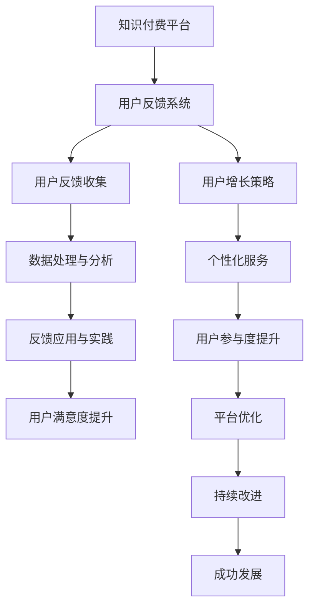

                 

### 第一部分：知识付费与用户反馈概述

#### 第1章：知识付费行业背景分析

##### 1.1.1 知识付费的发展历程

知识付费，作为互联网经济下的产物，近年来在全球范围内迅速崛起。最早的知识付费形式可以追溯到20世纪末，互联网普及之后，在线教育、在线咨询、知识共享平台等逐步兴起。最早的知识付费案例之一是1999年推出的美国在线教育平台Udemy，它为用户提供在线课程购买服务，标志着知识付费行业的诞生。

进入21世纪，随着智能手机、平板电脑等移动设备的普及，移动互联网迅速发展，知识付费迎来了黄金发展期。2013年，中国的知识付费市场开始萌芽，以得到APP、知乎Live、喜马拉雅FM等为代表的平台纷纷涌现。这些平台通过提供专业内容、专家咨询、知识分享等形式，满足了用户在专业领域的学习和咨询需求。

##### 1.1.2 知识付费的市场现状与趋势

当前，知识付费市场呈现出以下几个显著趋势：

1. **市场规模不断扩大**：根据市场研究机构的统计数据，全球知识付费市场规模逐年增长。尤其是在中国，知识付费市场已经成为一个重要的经济增长点，市场规模逐年翻倍。

2. **内容形式多样化**：知识付费内容形式多样化，包括音频、视频、图文、直播等多种形式。不同内容形式满足了用户在时间、地点和消费习惯上的需求。

3. **用户群体广泛**：知识付费用户不仅包括职场人士、学生等传统学习群体，还涵盖了更多对专业领域知识有强烈需求的用户，如创业者、设计师、程序员等。

4. **平台竞争激烈**：随着知识付费市场的不断扩大，越来越多的平台加入竞争，如腾讯课堂、网易云课堂、得到、知乎等。各大平台通过提升内容质量、优化用户体验等方式，争夺市场份额。

##### 1.1.3 用户反馈在知识付费中的重要性

用户反馈是知识付费生态系统中至关重要的一环。以下是用户反馈在知识付费中的几个关键作用：

1. **内容优化**：通过收集和分析用户反馈，平台可以发现用户对内容的需求和偏好，从而对课程内容进行优化，提升课程质量和用户满意度。

2. **用户体验提升**：用户反馈提供了改进平台服务的直接依据。平台可以根据用户意见，优化用户界面、提升服务响应速度等，从而提升用户体验。

3. **品牌建设**：积极的用户反馈有助于树立良好的品牌形象。当用户对平台和内容感到满意时，他们更有可能分享自己的正面体验，从而为平台带来更多的潜在用户。

4. **市场定位**：通过对用户反馈的持续分析，平台可以更准确地了解市场需求，从而调整自己的市场定位和业务策略。

总之，用户反馈是知识付费生态系统中的“晴雨表”，它不仅影响平台的内容生产和运营策略，还直接影响用户的消费决策。因此，重视和有效利用用户反馈，是知识付费平台实现可持续发展的关键。

### 用户反馈系统设计基础

#### 第2章：用户反馈系统设计基础

##### 2.1.1 用户反馈系统概述

用户反馈系统是一个用于收集、处理和分析用户反馈的数据平台，它是知识付费平台的核心组成部分。通过用户反馈系统，平台可以实时获取用户在使用过程中的意见、建议和反馈，从而更好地满足用户需求，提升用户体验。

用户反馈系统的核心目标包括：

1. **高效收集用户反馈**：设计灵活、易于操作的反馈渠道，确保用户能够方便地提交反馈。
2. **准确处理反馈数据**：对收集到的反馈数据进行整理、分类和分析，提取有价值的信息。
3. **及时响应与改进**：根据用户反馈结果，快速调整和改进产品或服务，提升用户满意度。

用户反馈系统的主要组成部分如下：

1. **反馈渠道**：包括在线表单、反馈按钮、邮件反馈等，用于用户提交反馈。
2. **数据收集模块**：负责收集用户反馈数据，并存储到数据库中。
3. **数据处理模块**：对收集到的数据进行分析和处理，提取有用信息。
4. **反馈分析工具**：用于对用户反馈进行可视化分析和报告生成。
5. **反馈管理模块**：负责对用户反馈进行分类、优先级管理和跟进。

##### 2.1.2 用户反馈数据的类型与来源

用户反馈数据可以分为以下几类：

1. **结构化数据**：如用户基本信息、提交反馈的时间、反馈内容等，通常以表格或数据库的形式存储。
2. **非结构化数据**：如文本、图片、音频等，通常需要通过自然语言处理技术进行解析和分析。
3. **行为数据**：如用户在平台上的浏览记录、购买行为、互动行为等，反映用户的实际使用情况。

用户反馈数据的来源主要包括：

1. **用户提交**：用户通过在线表单、反馈按钮等途径主动提交的反馈。
2. **系统收集**：通过技术手段自动收集的用户行为数据，如点击率、停留时间等。
3. **第三方平台**：如社交媒体、评价网站等，通过API接口获取的用户反馈数据。

##### 2.1.3 用户反馈系统设计原则与架构

设计用户反馈系统时，应遵循以下原则：

1. **用户友好性**：设计简洁直观的反馈渠道，确保用户能够方便、快速地提交反馈。
2. **数据可靠性**：确保数据收集和处理过程中的准确性和完整性，防止数据丢失或损坏。
3. **高效性**：优化数据收集、处理和分析的流程，提高系统的响应速度。
4. **扩展性**：系统设计应具有较好的扩展性，以适应未来可能的业务变化和需求增长。

用户反馈系统的基本架构如下：

1. **前端界面**：用户通过网页、移动应用等前端界面提交反馈。
2. **数据收集层**：包括各种数据采集工具和接口，如API、Webhook等。
3. **数据处理层**：对收集到的数据进行分析和处理，使用自然语言处理、机器学习等技术。
4. **数据存储层**：使用数据库或大数据平台存储处理后的数据。
5. **反馈分析层**：生成用户反馈分析报告，提供数据可视化工具。
6. **反馈管理层**：负责反馈数据的分类、优先级管理、跟进处理等。

通过遵循上述原则和设计架构，可以构建一个高效、可靠的用户反馈系统，从而更好地支持知识付费平台的发展。

#### 用户反馈数据处理与分析

##### 第3章：用户反馈数据处理与分析

##### 3.1.1 用户反馈数据的预处理

用户反馈数据的预处理是数据分析的重要基础，它包括数据清洗、数据转换和数据归一化等步骤。以下是用户反馈数据预处理的具体流程和注意事项：

1. **数据清洗**：数据清洗的主要目的是去除数据中的噪声和异常值，提高数据质量。具体方法包括：
   - **缺失值处理**：对于缺失的数据，可以选择填充缺失值或者删除含有缺失值的记录。
   - **重复值处理**：识别和删除重复的记录，避免重复分析。
   - **异常值处理**：通过统计方法（如箱线图、标准差）检测异常值，并根据具体情况选择保留或去除。
   - **格式统一**：将不同格式的数据转换为统一的格式，如日期统一为YYYY-MM-DD格式。

2. **数据转换**：数据转换是将原始数据转换为适合分析的形式。常用的转换方法包括：
   - **数值化**：将类别型数据转换为数值型数据，便于进行数学运算和模型训练。
   - **降维**：通过主成分分析（PCA）等方法减少数据维度，提高分析效率。
   - **编码**：将类别型数据编码为数字，常用的编码方法有独热编码（One-Hot Encoding）和标签编码（Label Encoding）。

3. **数据归一化**：数据归一化的目的是将不同特征的数据缩放到同一尺度范围内，避免某些特征对分析结果的影响过大。常用的归一化方法包括：
   - **最小-最大归一化**：将数据缩放到[0, 1]区间内，公式为：$x_{\text{norm}} = \frac{x - \min(x)}{\max(x) - \min(x)}$。
   - **均值-方差归一化**：将数据缩放到均值附近，公式为：$x_{\text{norm}} = \frac{x - \mu}{\sigma}$，其中$\mu$是均值，$\sigma$是标准差。

在用户反馈数据预处理过程中，应注意以下几点：

- **数据质量检查**：在预处理之前，应对数据质量进行全面检查，确保数据完整性和一致性。
- **预处理策略选择**：根据数据特征和具体应用场景，选择合适的预处理策略。
- **可逆性**：确保预处理操作是可逆的，以便在后续分析中能够恢复原始数据。

##### 3.1.2 用户反馈数据的分析方法

用户反馈数据的分析方法包括定量分析和定性分析两种，以下将分别介绍。

1. **定量分析**：定量分析主要通过统计分析方法对用户反馈数据进行量化处理，以揭示数据中的规律和趋势。常用的定量分析方法包括：

   - **描述性统计分析**：计算数据的平均值、中位数、标准差等基本统计量，用于描述数据的中心趋势和离散程度。
   - **相关性分析**：分析不同变量之间的相关性，常用的方法有皮尔逊相关系数和斯皮尔曼等级相关系数。
   - **回归分析**：通过建立回归模型，分析用户反馈与用户满意度、使用时长等变量之间的关系。

2. **定性分析**：定性分析主要通过文本分析方法对用户反馈中的文本内容进行深入分析，以理解用户的真实需求和情感。常用的定性分析方法包括：

   - **内容分析**：对文本内容进行分类和编码，提取关键词和主题，以了解用户的反馈重点。
   - **情感分析**：使用自然语言处理技术，分析文本的情感倾向，识别用户的积极情感、消极情感或中性情感。
   - **主题建模**：通过算法（如LDA）对文本进行主题提取，了解用户反馈的主要话题。

在用户反馈数据分析过程中，应注意以下几点：

- **分析目标明确**：在开始分析之前，应明确分析的目标和问题，确保分析方向正确。
- **数据质量**：确保数据清洗和预处理的质量，以保证分析结果的准确性。
- **多种方法结合**：结合定量分析和定性分析的方法，以全面、深入地了解用户反馈。
- **结果解释**：对分析结果进行合理的解释，并将其转化为具体的业务决策和改进措施。

##### 3.1.3 用户反馈数据可视化与报告

用户反馈数据可视化是将分析结果以图表等形式直观呈现，帮助管理层和团队成员更好地理解和利用数据。以下是用户反馈数据可视化和报告生成的方法和技巧：

1. **数据可视化工具选择**：选择合适的数据可视化工具，如Tableau、Power BI、Matplotlib等。根据数据类型和分析需求，选择图表类型，如柱状图、折线图、饼图、散点图等。

2. **图表设计原则**：设计图表时应遵循以下原则：
   - **清晰简洁**：图表设计应简洁明了，避免过多细节和杂乱无章。
   - **信息完整**：确保图表能够完整地展示分析结果，包括关键指标、趋势和异常值。
   - **对比明显**：通过颜色、形状等对比手段，使关键信息和趋势更加突出。
   - **可读性强**：确保图表的可读性，包括字体大小、颜色对比度、图表布局等。

3. **报告生成**：报告是用户反馈分析成果的总结和呈现，应包括以下内容：
   - **报告摘要**：概括分析的主要发现和结论。
   - **数据可视化图表**：展示分析结果的关键图表。
   - **详细分析**：对数据可视化的图表进行详细解释，包括数据分析的方法、步骤和结果。
   - **改进建议**：根据分析结果，提出具体的改进建议和行动计划。
   - **附录**：提供相关数据和参考资料。

通过用户反馈数据的可视化和报告生成，可以使分析结果更加直观、易于理解，从而更好地支持业务决策和产品优化。

### 问卷调查与用户访谈

#### 第4章：问卷调查与用户访谈

##### 4.1.1 问卷调查的设计与实施

问卷调查是收集用户反馈的一种常见方法，通过设计科学合理的问卷，可以有效地获取用户对产品、服务或内容的意见和评价。以下是问卷调查的设计与实施步骤：

1. **确定调研目标**：明确调研的目的和需要解决的问题，如了解用户对某个课程的满意度、使用体验等。

2. **设计问卷结构**：问卷结构应包括以下几个部分：
   - **封面信**：介绍调研目的、意义和保密性。
   - **问卷主体**：包括基本信息（如年龄、性别、职业等）和问题部分。问题部分应分为开放性和封闭性问题，封闭性问题又可分为单选题、多选题和判断题。
   - **结束语**：感谢参与调研，并提供联系方式以获取更多反馈。

3. **制定问题列表**：根据调研目标，制定问题列表，确保问题具有针对性和科学性。问题的表述应清晰明确，避免歧义。

4. **预测试**：在正式实施前，对问卷进行预测试，通过小范围的样本测试问卷的有效性和可操作性，根据反馈进行调整。

5. **实施问卷**：通过在线问卷平台、邮件、社交媒体等方式，向目标用户发放问卷。确保问卷发放渠道的科学性和覆盖面。

6. **数据收集**：收集用户填写的问卷数据，并确保数据的完整性和真实性。

##### 4.1.2 用户访谈的技巧与策略

用户访谈是一种深入了解用户需求和意见的方法，通过面对面的沟通，可以获取更详细和真实的用户反馈。以下是用户访谈的技巧与策略：

1. **确定访谈目标**：明确访谈的目的和需要了解的关键问题，如用户对某个课程的满意度、使用中的难点等。

2. **选择访谈对象**：根据调研目标，选择具有代表性的用户作为访谈对象，如长期用户、活跃用户等。

3. **准备访谈提纲**：根据访谈目标，准备访谈提纲，包括开场白、主要问题和结束语等。

4. **开场策略**：与用户建立良好的沟通氛围，介绍访谈目的和保密性，确保用户愿意参与。

5. **有效沟通**：在访谈过程中，注意倾听用户的意见和反馈，避免打断或引导性提问，以获取真实的信息。

6. **问题引导**：根据访谈提纲，灵活引导问题，确保访谈的深入和全面。

7. **记录与整理**：在访谈过程中，记录关键信息和用户反馈，访谈结束后，对记录进行整理和分析。

8. **反馈与总结**：将访谈结果反馈给用户，确保其意见被重视，同时总结访谈发现，为后续分析和改进提供依据。

##### 4.1.3 调查问卷与访谈数据分析示例

以下是一个调查问卷和访谈数据分析的示例，以了解用户对某在线教育平台的课程满意度。

1. **问卷调查数据分析**：

   - **基本信息**：共收集到100份有效问卷，其中男性用户占比60%，女性用户占比40%，年龄分布主要集中在25-35岁。
   - **课程满意度**：通过单选题“你对所购买的课程整体满意度如何？”进行分析，结果显示：
     - 非常满意：30%
     - 满意：50%
     - 一般：15%
     - 不满意：5%
   - **课程质量**：通过多选题“你认为课程在哪些方面可以改进？”进行分析，结果显示：
     - 内容深度：50%
     - 讲师表达能力：40%
     - 实践案例：30%
     - 更新的频率：20%

2. **访谈数据分析**：

   - **访谈对象**：选择10名具有代表性的用户进行深度访谈。
   - **主要发现**：
     - 多数用户对课程内容表示满意，认为课程提供了丰富的知识和实用的技能。
     - 一部分用户提出课程案例过于理论化，缺少实际操作步骤。
     - 部分用户建议增加互动环节，如在线讨论和答疑。
     - 用户对课程更新频率表示关注，希望平台能保持内容的新鲜度和及时性。

通过问卷调查和访谈数据的分析，可以得出以下结论和改进建议：

- **课程满意度较高**：平台在课程内容设计和讲师选拔方面有较好的表现，用户整体满意度较高。
- **课程质量改进**：建议增加实践案例和操作步骤，提升课程实用性。
- **互动环节加强**：建议增加在线讨论和答疑环节，提升用户参与感和满意度。
- **内容更新频率**：建议平台保持内容的新鲜度，定期更新课程内容，以满足用户的持续需求。

通过上述分析，平台可以针对性地进行改进和优化，提升用户体验，增强用户黏性。

### 社交媒体分析与网络爬虫

#### 第5章：社交媒体分析与网络爬虫

##### 5.1.1 社交媒体用户反馈的获取

社交媒体平台如微博、知乎、抖音等已经成为用户表达意见和反馈的重要渠道。通过分析这些平台上的用户反馈，可以深入了解用户的真实需求和情感倾向。以下是获取社交媒体用户反馈的方法：

1. **API接口**：许多社交媒体平台提供API接口，允许开发者获取用户发布的内容、评论、点赞等数据。常用的API接口包括微博API、知乎API、抖音API等。

2. **网络爬虫**：当API接口不充分时，可以使用网络爬虫技术获取社交媒体数据。网络爬虫通过模拟用户行为，爬取网页上的内容并存储到本地。常见的爬虫工具包括Scrapy、BeautifulSoup等。

3. **关键词搜索**：通过在社交媒体平台上搜索特定关键词，可以快速获取相关讨论和用户反馈。例如，通过搜索“某某课程评价”，可以获取大量关于该课程的讨论内容。

4. **数据整合**：将不同社交媒体平台的数据整合到一个系统中，便于统一分析和处理。

在获取社交媒体用户反馈时，应注意以下几点：

- **合法性**：确保获取数据的合法性，遵循相关法律法规和平台政策。
- **数据质量**：通过清洗和去重，确保数据的准确性和完整性。
- **用户隐私**：尊重用户隐私，避免获取和泄露用户敏感信息。

##### 5.1.2 网络爬虫的原理与应用

网络爬虫（Web Crawler）是一种自动化程序，用于在网络中爬取信息。其原理是通过发送HTTP请求获取网页内容，解析网页内容提取有用信息，并递归地爬取其他链接。以下是网络爬虫的基本原理和应用：

1. **工作原理**：
   - **爬取页面**：爬虫通过发送HTTP GET请求获取网页内容，解析响应的HTML代码。
   - **提取链接**：从网页中提取包含URL的链接，加入待爬取链接队列。
   - **递归爬取**：对队列中的链接进行重复爬取，不断扩展爬取范围。
   - **存储数据**：将爬取到的有用数据存储到本地或数据库中。

2. **应用场景**：
   - **信息收集**：爬取网站信息，如新闻、产品信息、用户评论等。
   - **数据挖掘**：从大量网页中提取有价值的信息，进行数据挖掘和分析。
   - **搜索引擎**：构建搜索引擎索引，实现网页的快速搜索。

3. **常见工具**：
   - **Scrapy**：Python编写的开源网络爬虫框架，支持异步爬取和中间件扩展。
   - **BeautifulSoup**：Python编写的HTML解析库，用于提取网页内容。
   - **Puppeteer**：基于Chrome的自动化脚本工具，用于爬取动态网页内容。

##### 5.1.3 社交媒体数据分析示例

以下是一个社交媒体数据分析的示例，以了解用户对某知识付费平台课程的反馈。

1. **数据获取**：

   - **微博**：通过微博API获取关于该课程的微博内容，包括微博正文、评论、点赞等。
   - **知乎**：通过知乎API获取关于该课程的知乎问题、回答、评论等。
   - **抖音**：通过抖音API获取关于该课程的短视频内容、用户评论等。

2. **数据预处理**：

   - **去重**：去除重复的数据条目，确保数据的唯一性。
   - **清洗**：去除无效信息，如广告、无关内容等。
   - **分类**：根据内容类型（如文本、图片、视频）对数据进行分类。

3. **数据分析**：

   - **情感分析**：通过自然语言处理技术，分析用户评论的情感倾向，如积极、消极或中性。
   - **关键词提取**：提取评论中的高频关键词，分析用户关注的重点。
   - **评论分布**：分析不同时间段的评论数量和情感分布，了解用户参与情况。

4. **结果展示**：

   - **情感分布图**：展示用户评论的情感分布，如积极、消极、中性比例。
   - **关键词云图**：展示评论中的高频关键词，突出用户关注的主题。
   - **评论词云**：展示评论中出现频率较高的词汇，以直观的方式展示用户反馈。

通过社交媒体数据分析，可以深入了解用户对知识付费平台课程的反馈和需求，为课程优化和产品改进提供数据支持。

### 在线评价系统与评论分析

#### 第6章：在线评价系统与评论分析

##### 6.1.1 在线评价系统设计

在线评价系统是知识付费平台的重要组成部分，它通过收集和分析用户的评价数据，帮助平台了解用户对课程、服务或产品的满意度和认可度。以下是设计在线评价系统的关键步骤和考虑因素：

1. **需求分析**：

   - **用户需求**：了解用户在评价过程中的需求和痛点，如是否需要匿名评价、是否需要自定义评价选项等。
   - **业务目标**：明确平台通过评价系统希望实现的目标，如提高用户满意度、优化课程内容、提升品牌形象等。

2. **系统架构设计**：

   - **前端设计**：设计用户友好的评价界面，包括评价标签、评价选项、评分控件等。
   - **后端架构**：构建可靠的后端架构，包括评价数据的存储、处理和分析模块。
   - **接口设计**：设计评价数据的API接口，便于前端调用和后端数据处理。

3. **功能设计**：

   - **评价提交**：允许用户提交评价，包括文本评价和评分。
   - **评价查看**：展示用户评价，包括评价内容、评分和评价时间。
   - **评价分析**：对评价数据进行分析和统计，生成评价报告。

4. **用户体验**：

   - **简洁界面**：设计简洁直观的评价界面，确保用户能够方便地提交和查看评价。
   - **个性化推荐**：根据用户行为和评价历史，个性化推荐相关评价和课程。

5. **数据安全**：

   - **隐私保护**：确保用户评价数据的隐私和安全，遵循相关法律法规。
   - **数据备份**：定期备份评价数据，防止数据丢失。

##### 6.1.2 用户评论的情感分析

用户评论的情感分析是评价系统中的重要环节，通过分析用户评论的情感倾向，可以了解用户的满意度和需求。以下是情感分析的基本原理和方法：

1. **基本原理**：

   - **情感分类**：将用户评论分为积极、消极或中性情感。
   - **情感强度**：对情感分类进行量化，如积极情感分为非常积极、积极等。

2. **方法**：

   - **基于规则的方法**：通过预设的规则和模式，对评论进行情感分类。
   - **基于机器学习的方法**：使用机器学习算法，如朴素贝叶斯、支持向量机等，对评论进行情感分类。
   - **基于深度学习的方法**：使用深度学习模型，如卷积神经网络（CNN）、循环神经网络（RNN）等，对评论进行情感分类。

3. **步骤**：

   - **数据预处理**：对评论进行文本清洗，去除噪声和无关信息。
   - **特征提取**：从评论中提取特征，如词频、词向量等。
   - **情感分类**：使用机器学习或深度学习模型，对评论进行情感分类。
   - **结果分析**：分析情感分类结果，了解用户评论的情感分布。

##### 6.1.3 在线评价数据分析示例

以下是一个在线评价数据分析的示例，以了解用户对某知识付费平台课程的评价。

1. **数据获取**：

   - **评价内容**：从平台获取用户的文本评价数据，包括评论内容和评分。
   - **评价时间**：获取用户提交评价的时间，用于分析评价的时间分布。

2. **数据预处理**：

   - **文本清洗**：去除评论中的HTML标签、停用词等，确保文本的干净和一致性。
   - **分词**：将评论文本分词，提取关键词汇。

3. **情感分析**：

   - **情感分类**：使用情感分析模型，对评论进行积极、消极或中性情感分类。
   - **结果统计**：统计不同情感的评价数量和比例，生成情感分布图。

4. **结果展示**：

   - **情感分布图**：展示用户评论的情感分布，如积极、消极、中性比例。
   - **关键词云图**：展示评论中的高频关键词，突出用户关注的主题。
   - **评价报告**：生成评价分析报告，包括情感分析结果、关键词提取、用户满意度等。

通过在线评价数据分析，可以深入了解用户对课程的反馈和需求，为课程优化和产品改进提供数据支持。

### 用户反馈驱动产品迭代

#### 第7章：用户反馈驱动产品迭代

##### 7.1.1 用户反馈的收集与分类

用户反馈是产品迭代过程中至关重要的信息来源，它能够揭示用户的需求、痛点和期望，帮助产品团队做出更明智的决策。以下是用户反馈的收集与分类方法：

1. **收集渠道**：

   - **问卷调查**：通过在线问卷或邮件问卷，收集用户对产品功能的评价和需求。
   - **用户访谈**：通过面对面或在线访谈，深入了解用户的使用体验和反馈。
   - **在线评价**：从平台上的用户评论和评分中获取反馈。
   - **社交媒体**：分析用户在社交媒体上的讨论和反馈。
   - **用户行为数据**：通过分析用户在产品中的行为数据，如点击率、使用时长等，获取反馈。

2. **分类方法**：

   - **按主题分类**：将反馈按功能模块或主题进行分类，如课程内容、用户界面、服务响应等。
   - **按优先级分类**：根据反馈的重要性和紧急程度进行分类，如高优先级、中优先级、低优先级。
   - **按来源分类**：根据反馈来源进行分类，如用户调查、用户评论、技术故障等。
   - **按情感分类**：将反馈按情感倾向分类，如正面反馈、负面反馈。

通过有效的收集和分类，产品团队能够快速定位用户的核心需求和问题，从而有针对性地进行产品改进。

##### 7.1.2 用户反馈的产品改进策略

基于用户反馈的产品改进策略是提升产品质量和用户满意度的关键。以下是几种常见的改进策略：

1. **快速迭代**：

   - **敏捷开发**：采用敏捷开发方法，快速开发并发布新功能，及时收集用户反馈，进行迭代改进。
   - **迭代周期**：设定短期迭代周期，如两周或一个月，确保能够持续收集反馈并快速响应。

2. **优先级管理**：

   - **Kano模型**：使用Kano模型对用户反馈进行优先级排序，区分基本功能、性能改进、激励功能和缺陷修复等。
   - **价值排序**：根据用户反馈的价值和潜在影响进行排序，优先改进高价值、高需求的反馈。

3. **A/B测试**：

   - **功能对比**：通过A/B测试，对比不同功能或设计方案的用户反馈，选择更受欢迎的方案。
   - **优化调整**：根据测试结果，调整产品功能和界面设计，提升用户体验。

4. **用户参与**：

   - **用户反馈收集**：通过用户调查、访谈等方式，持续收集用户反馈，了解他们的真实需求。
   - **用户测试**：邀请用户参与产品测试，获取第一手的用户体验和反馈。

5. **数据驱动**：

   - **行为分析**：通过分析用户行为数据，如使用频率、停留时间等，识别用户痛点和改进方向。
   - **数据可视化**：使用数据可视化工具，将用户反馈和行为数据转化为图表和报告，便于分析。

通过上述策略，产品团队能够更加高效地识别用户需求，优化产品功能，提升用户体验。

##### 7.1.3 产品迭代案例分析

以下是一个产品迭代案例，展示了如何基于用户反馈进行产品改进：

**案例背景**：

某知识付费平台收到大量用户反馈，反映课程内容更新不及时，缺乏互动环节，用户体验不佳。

**用户反馈分析**：

1. **课程内容更新**：用户希望课程内容能更及时地反映行业动态和新技术。
2. **互动环节**：用户希望增加在线讨论、问答环节，以便与讲师和其他学员互动。
3. **用户体验**：用户反映界面设计不够友好，操作复杂。

**改进措施**：

1. **课程内容更新**：
   - **定期更新**：设立专门的内容更新团队，每月更新课程内容，确保课程与行业最新动态同步。
   - **用户建议**：开放用户建议渠道，收集用户对课程内容的改进建议，纳入内容更新计划。

2. **互动环节**：
   - **在线讨论**：增加课程讨论区，允许用户在课程后发表评论和提问。
   - **问答环节**：定期举办线上问答活动，邀请讲师回答用户问题。
   - **互动工具**：引入互动工具，如投票、投票等，增加课程互动性。

3. **用户体验**：
   - **界面优化**：重新设计用户界面，简化操作流程，提高易用性。
   - **用户反馈收集**：在界面增加反馈按钮，方便用户随时提交意见。

**迭代效果**：

1. **用户满意度提升**：通过及时更新课程内容和增加互动环节，用户满意度显著提升。
2. **用户参与度提高**：在线讨论区和问答活动的活跃度增加，用户参与度显著提升。
3. **用户体验优化**：界面设计优化后，用户操作更加简便，用户满意度提高。

通过以上改进措施，知识付费平台成功提升了用户满意度和参与度，为产品的持续发展奠定了基础。

### 用户反馈与用户增长策略

#### 第8章：用户反馈与用户增长策略

##### 8.1.1 用户反馈与用户满意度的关系

用户满意度是衡量知识付费平台成功与否的重要指标，而用户反馈则是提升用户满意度的关键驱动力。以下是用户反馈与用户满意度之间的密切关系：

1. **及时反馈**：及时收集并处理用户反馈，可以快速识别和解决用户的问题，提高用户满意度。例如，当用户在课程学习中遇到技术问题时，及时给予解决方案，能够提升用户的学习体验。

2. **个性化服务**：通过用户反馈，平台可以了解不同用户的需求和偏好，提供个性化的服务和建议。这种个性化的服务能够增强用户的归属感和满意度。

3. **持续改进**：用户反馈提供了改进产品和服务的直接线索。通过持续改进，平台能够不断提升产品质量，满足用户的期望，从而提高用户满意度。

4. **口碑传播**：满意的用户更愿意分享自己的正面体验，通过口碑传播吸引新用户。用户满意度的提升有助于扩大用户群体，促进平台增长。

##### 8.1.2 基于用户反馈的用户增长策略

基于用户反馈，可以制定一系列用户增长策略，以下是一些具体的策略：

1. **优化课程内容**：根据用户反馈，调整和优化课程内容，确保课程与用户需求相符。例如，增加用户感兴趣的话题、引入最新的技术和方法等。

2. **提升用户体验**：改进用户界面和交互设计，提高平台的易用性和流畅性。通过用户反馈，识别用户在使用过程中遇到的障碍和不便，并针对性地进行优化。

3. **增强互动环节**：增加课程中的互动环节，如讨论区、问答环节、互动小游戏等，增强用户参与感和互动性。通过互动，用户可以更好地理解和吸收课程内容。

4. **个性化推荐**：根据用户反馈和行为数据，实现个性化推荐，向用户推荐他们可能感兴趣的课程和内容。个性化的推荐能够提升用户粘性，促进课程销售。

5. **用户增长活动**：定期举办用户增长活动，如优惠促销、课程优惠码、用户奖励等，吸引新用户并激励现有用户积极参与。

6. **用户反馈激励机制**：建立用户反馈激励机制，如积分奖励、优惠券等，鼓励用户积极提供反馈，增强用户参与感和忠诚度。

7. **合作伙伴关系**：与相关领域的专家、机构建立合作关系，共同开发和推广高质量的课程内容，扩大用户基础。

##### 8.1.3 用户增长策略实施案例分析

以下是一个用户增长策略实施案例分析，展示了如何通过用户反馈实现用户增长：

**案例背景**：

某在线教育平台在用户增长方面面临挑战，用户活跃度和留存率较低。通过分析用户反馈，平台决定采取一系列措施提升用户满意度，从而促进用户增长。

**用户反馈分析**：

1. **课程内容反馈**：用户反馈表明，部分课程内容过时，缺乏实用性。此外，用户希望课程内容更贴近行业实际需求。

2. **用户体验反馈**：用户反馈指出，平台界面复杂，操作不便，特别是对于新用户来说，难以快速上手。

3. **互动环节反馈**：用户希望增加更多互动环节，如在线讨论、讲师直播等，以提升学习体验。

**改进措施**：

1. **课程内容优化**：
   - **内容更新**：成立专门的内容更新团队，每月更新课程内容，确保课程与行业最新动态同步。
   - **用户建议**：设立用户建议通道，收集用户对课程内容的改进建议，并纳入课程更新计划。

2. **用户体验优化**：
   - **界面设计**：重新设计用户界面，简化操作流程，提升平台易用性。
   - **用户培训**：为新用户提供详细的操作指南和培训，帮助用户快速上手。

3. **互动环节增强**：
   - **在线讨论**：增加课程讨论区，允许用户在课程后发表评论和提问。
   - **讲师直播**：定期举办讲师直播活动，与用户实时互动，解答疑问。

**实施效果**：

1. **用户满意度提升**：通过及时更新课程内容、优化用户界面和增加互动环节，用户满意度显著提升。

2. **用户留存率提高**：用户在平台上的活跃度和留存率得到显著提升，新用户的增长速度加快。

3. **口碑传播**：满意的用户更愿意分享自己的正面体验，通过口碑传播，吸引了更多新用户。

通过以上措施，该在线教育平台成功提升了用户满意度，实现了用户增长，为平台的长远发展奠定了坚实基础。

### 用户反馈在内容付费中的应用

#### 第9章：用户反馈在内容付费中的应用

##### 9.1.1 内容付费平台设计

内容付费平台的设计是知识付费业务成功的关键。以下是内容付费平台设计的关键要素和注意事项：

1. **用户界面设计**：

   - **简洁明了**：界面设计应简洁明了，确保用户能够轻松找到所需内容。
   - **易用性**：考虑用户的使用习惯，设计直观的导航和操作流程，降低用户的学习成本。
   - **个性化推荐**：结合用户行为和偏好，提供个性化的内容推荐，提升用户体验。

2. **内容结构设计**：

   - **分类清晰**：合理分类内容，确保用户能够快速找到感兴趣的内容。
   - **内容标签**：为内容添加合适的标签，便于用户通过关键词搜索相关内容。
   - **内容更新频率**：保持内容的新鲜度和及时性，定期更新优质内容。

3. **支付系统设计**：

   - **安全性**：确保支付系统的安全性，保护用户支付信息和隐私。
   - **便捷性**：提供多种支付方式，如信用卡、支付宝、微信支付等，满足不同用户的需求。
   - **优惠策略**：设计灵活的优惠策略，如限时折扣、优惠券等，吸引用户购买。

4. **互动设计**：

   - **评论功能**：允许用户对内容进行评论，增加用户参与度。
   - **问答功能**：设立问答区，允许用户提问和讲师、其他用户互动，提升用户粘性。
   - **积分系统**：引入积分系统，激励用户积极参与互动和购买内容。

##### 9.1.2 用户反馈在内容优化中的应用

用户反馈是内容优化的重要依据，以下是用户反馈在内容优化中的应用方法：

1. **内容质量评估**：

   - **用户评分**：通过用户评分系统，了解用户对内容的满意度和认可度。
   - **评论分析**：分析用户评论，提取用户关注的重点和痛点，用于评估内容质量。

2. **内容调整**：

   - **根据需求调整**：根据用户反馈，调整内容结构、讲解方式和知识点深度，确保内容满足用户需求。
   - **新增内容**：根据用户建议，开发新的内容，填补用户关心的空白领域。

3. **互动优化**：

   - **反馈机制**：建立反馈机制，鼓励用户积极提供意见，及时了解用户需求。
   - **互动活动**：定期举办互动活动，如直播问答、讨论区话题等，增加用户互动机会。

##### 9.1.3 内容付费平台案例分析

以下是一个内容付费平台案例分析，展示了用户反馈在内容优化中的应用：

**案例背景**：

某在线教育平台提供各种专业领域的在线课程，但在用户反馈中，用户反映课程内容过于理论化，缺乏实际操作指导，互动环节不足。

**用户反馈分析**：

1. **内容反馈**：
   - **课程内容**：用户希望课程内容更贴近实际操作，增加实战案例和操作步骤。
   - **知识点深度**：部分用户认为课程知识点深度不够，需要更深入的专业讲解。

2. **互动反馈**：
   - **互动不足**：用户希望增加课程后的讨论区和问答环节，与讲师和其他学员互动。
   - **互动形式**：用户建议增加在线直播问答、讨论区话题等互动形式。

**改进措施**：

1. **课程内容优化**：
   - **实战案例**：增加实战案例和操作步骤，确保用户能够将理论知识应用于实际操作。
   - **知识点深度**：邀请行业专家进行深入讲解，提升课程的专业性和深度。

2. **互动环节增强**：
   - **讨论区**：增加课程讨论区，鼓励用户在课程后发表评论和提问。
   - **直播问答**：定期举办直播问答活动，邀请讲师回答用户问题，提升用户互动体验。

3. **用户反馈机制**：
   - **实时反馈**：建立实时反馈机制，允许用户随时提交反馈，确保用户意见得到及时处理。

**实施效果**：

1. **内容质量提升**：通过优化课程内容和增加实战案例，用户对课程内容的满意度显著提升。

2. **用户互动增加**：通过增加讨论区和直播问答，用户互动机会增加，用户粘性提升。

3. **用户增长**：用户满意度提升，口碑传播效果显著，新用户增长速度加快。

通过以上改进措施，该在线教育平台成功提升了用户满意度和参与度，实现了用户增长和内容优化。

### 用户反馈驱动的个性化服务

#### 第10章：用户反馈驱动的个性化服务

##### 10.1.1 用户画像与个性化推荐

用户画像（User Profiling）是一种基于用户行为数据、社会属性和兴趣偏好等信息，对用户进行全面描述和分析的方法。通过构建用户画像，可以深入了解用户特征，从而提供个性化服务。以下是用户画像和个性化推荐的核心概念和实现方法：

1. **用户画像**：

   - **定义**：用户画像是对用户进行全面描述的数字化模型，包括用户的基本信息（如年龄、性别、职业等）、行为数据（如浏览记录、购买历史等）和兴趣偏好（如喜欢的课程、话题等）。
   - **目的**：通过用户画像，可以识别用户的特征和行为模式，为个性化推荐和个性化服务提供数据支持。
   - **构建方法**：通过数据挖掘和机器学习算法，从用户的多个维度提取特征，构建用户画像。

2. **个性化推荐**：

   - **定义**：个性化推荐是根据用户画像和用户行为，为用户推荐他们可能感兴趣的内容或产品。
   - **目的**：提高用户满意度、提升用户参与度和转化率。
   - **实现方法**：
     - **协同过滤**：基于用户行为相似性，推荐与用户偏好相似的其他用户喜欢的商品或内容。
     - **内容过滤**：基于内容的相似性，推荐与用户已浏览或喜欢的商品或内容相似的其他内容。
     - **基于模型的推荐**：使用机器学习模型，如决策树、神经网络等，预测用户对某一内容的兴趣程度，进行个性化推荐。

##### 10.1.2 基于用户反馈的个性化服务策略

基于用户反馈的个性化服务策略是通过收集和分析用户反馈，为用户提供更加个性化和精准的服务。以下是几种常见的策略：

1. **个性化内容推荐**：

   - **基于用户兴趣**：根据用户在平台上的行为数据和反馈，分析用户的兴趣偏好，推荐与用户兴趣相关的内容。
   - **基于历史行为**：分析用户的历史浏览记录、购买行为和反馈，推荐用户可能感兴趣的新内容。

2. **个性化学习路径**：

   - **用户定制**：根据用户的学习需求和进度，为用户定制个性化的学习路径，推荐适合用户当前水平和需求的学习内容。
   - **动态调整**：根据用户的学习反馈和行为变化，动态调整学习路径，确保内容始终符合用户需求。

3. **个性化服务体验**：

   - **用户偏好设置**：允许用户自定义偏好设置，如学习时间、学习方式等，为用户提供个性化的服务体验。
   - **个性化通知**：根据用户偏好和活动，推送个性化的通知和提醒，提高用户参与度。

4. **个性化反馈收集**：

   - **反馈渠道优化**：根据用户反馈，优化反馈渠道和机制，提高用户反馈的收集效率和准确性。
   - **持续反馈收集**：定期收集用户反馈，动态调整个性化服务的策略，确保服务的持续优化。

##### 10.1.3 个性化服务案例解析

以下是一个个性化服务案例，展示了如何通过用户反馈实现个性化服务：

**案例背景**：

某在线教育平台提供多种课程，但用户反馈表明，用户在学习过程中难以找到适合自己的课程，学习效果不佳。

**用户反馈分析**：

1. **内容反馈**：用户反映部分课程内容过于复杂，难以理解，需要更贴近实际操作的指导。
2. **学习路径反馈**：用户希望平台能提供更个性化的学习路径，帮助他们按部就班地学习。

**改进措施**：

1. **个性化内容推荐**：
   - **基于兴趣推荐**：通过分析用户的行为数据和反馈，推荐与用户兴趣相关的内容，提高内容的相关性和用户满意度。
   - **基于历史行为推荐**：分析用户的历史浏览记录和购买行为，推荐用户可能感兴趣的新课程。

2. **个性化学习路径**：
   - **用户定制学习路径**：根据用户的学习需求和进度，为用户定制个性化的学习路径，推荐适合用户当前水平和需求的学习内容。
   - **动态调整学习路径**：根据用户的学习反馈和行为变化，动态调整学习路径，确保内容始终符合用户需求。

3. **个性化反馈收集**：
   - **优化反馈渠道**：在平台中增加反馈渠道和按钮，方便用户随时提交反馈。
   - **定期反馈收集**：定期收集用户反馈，动态调整个性化服务的策略，确保服务的持续优化。

**实施效果**：

1. **用户满意度提升**：通过个性化内容推荐和学习路径，用户的学习效果和满意度显著提升。
2. **用户参与度增加**：用户在平台上更活跃，参与互动和学习的机会增多。
3. **用户增长**：用户满意度提升，口碑传播效果显著，新用户增长速度加快。

通过以上措施，该在线教育平台成功实现了个性化服务，提升了用户满意度和参与度，实现了用户增长和业务发展。

### 附录A：用户反馈收集工具与应用指南

#### A.1 用户反馈收集工具简介

在知识付费创业中，有效的用户反馈收集是关键。以下是一些常用的用户反馈收集工具及其简介：

1. **问卷星**：

   - **功能**：提供在线问卷设计、分发和数据分析功能。
   - **应用场景**：适用于市场调研、用户满意度调查、新产品测试等。
   - **优点**：操作简便，支持多种题型，数据分析功能强大。

2. **腾讯问卷**：

   - **功能**：类似问卷星，提供问卷设计、分发和数据分析工具。
   - **应用场景**：适用于企业内部调查、用户反馈收集、市场调研等。
   - **优点**：免费版本功能强大，数据存储安全。

3. **金数据**：

   - **功能**：提供在线问卷、表单设计和数据分析功能。
   - **应用场景**：适用于用户调研、活动报名、数据分析等。
   - **优点**：数据分析功能丰富，支持多渠道数据收集。

4. **用户反馈平台**：

   - **功能**：提供反馈按钮、在线客服、用户论坛等功能。
   - **应用场景**：适用于实时用户反馈收集、客户服务、社区互动等。
   - **优点**：实时性高，反馈收集方便，支持多渠道沟通。

5. **Segment**：

   - **功能**：数据收集和用户行为分析工具。
   - **应用场景**：适用于网站和应用的用户行为跟踪和分析。
   - **优点**：灵活的数据追踪和分析功能，易于集成到现有系统。

#### A.2 工具使用指南与案例

以下是如何使用上述工具收集用户反馈的指南和案例：

1. **问卷星使用指南**：

   - **设计问卷**：登录问卷星，使用模板或自定义设计问卷。
   - **分发问卷**：通过链接、二维码等方式将问卷发送给目标用户。
   - **数据分析**：收集问卷数据后，在问卷星后台进行数据分析，生成报告。

   **案例**：某教育平台使用问卷星进行用户满意度调查，通过设计详细的问卷，收集了1000份有效反馈，分析了用户对课程内容、学习体验和售后服务等方面的满意度。

2. **腾讯问卷使用指南**：

   - **创建问卷**：在腾讯问卷后台，选择题目类型，编辑问卷内容。
   - **设置分发**：设置问卷分发方式，如通过微信、邮件等发送问卷。
   - **数据查看**：收集数据后，在后台查看和分析数据，生成报告。

   **案例**：某初创公司使用腾讯问卷进行市场调研，通过设计结构化问卷，收集了500份有效市场数据，分析了目标用户群体的特征和需求，为产品开发提供了重要参考。

3. **金数据使用指南**：

   - **设计表单**：在金数据平台，通过拖拽方式设计表单。
   - **数据收集**：将表单嵌入网站或应用中，收集用户反馈。
   - **数据管理**：在后台管理收集到的数据，进行筛选和分析。

   **案例**：某电商平台使用金数据进行用户调研，通过在线表单收集了3000份用户反馈，分析了用户购买行为、需求和偏好，为产品改进和营销策略提供了数据支持。

4. **用户反馈平台使用指南**：

   - **设置反馈渠道**：在用户反馈平台，设置反馈按钮、在线客服等。
   - **收集反馈**：用户通过点击反馈按钮或在线客服提交反馈。
   - **处理反馈**：在后台查看和处理反馈，及时回应用户。

   **案例**：某在线教育平台使用用户反馈平台，设置了反馈按钮和在线客服，通过实时收集用户反馈，快速响应用户问题，提升了用户满意度和平台服务质量。

通过使用这些工具，知识付费创业公司可以高效地收集用户反馈，深入理解用户需求，从而优化产品和服务，实现持续发展。

### 附录B：相关数据与资源

#### B.1 数据来源与收集方法

在知识付费创业中，获取高质量的用户反馈数据至关重要。以下是几种常见的数据来源和收集方法：

1. **在线问卷调查**：

   - **来源**：通过问卷星、腾讯问卷、金数据等在线调查工具收集。
   - **方法**：设计结构化问卷，通过电子邮件、社交媒体、网站链接等方式分发问卷。

2. **用户访谈**：

   - **来源**：通过电话、视频会议、面对面访谈等方式收集。
   - **方法**：制定访谈提纲，选择具有代表性的用户进行深入访谈，记录关键信息。

3. **社交媒体分析**：

   - **来源**：通过微博、知乎、抖音等社交媒体平台获取用户评论、讨论数据。
   - **方法**：使用API接口或网络爬虫技术获取数据，进行情感分析和内容提取。

4. **用户行为数据**：

   - **来源**：通过网站和应用的用户行为数据收集。
   - **方法**：使用数据分析工具（如Google Analytics、Mixpanel等）收集用户行为数据，进行统计分析。

#### B.2 用户反馈数据分析工具

以下是一些常用的用户反馈数据分析工具及其特点：

1. **Tableau**：

   - **功能**：提供数据可视化工具，帮助用户快速构建图表和报告。
   - **特点**：易于使用，支持多种数据源，丰富的图表类型。

2. **Power BI**：

   - **功能**：提供数据可视化、报表生成和分析功能。
   - **特点**：与Microsoft 365集成，支持自定义仪表板。

3. **Matplotlib**：

   - **功能**：Python库，用于创建高质量的统计图表。
   - **特点**：功能强大，支持多种图表类型，适用于数据分析和报告生成。

4. **Google Charts**：

   - **功能**：提供多种图表和可视化工具，用于网站和应用中的数据展示。
   - **特点**：简单易用，支持多种编程语言，适用于Web应用。

#### B.3 知识付费与用户反馈研究资料参考文献

以下是一些关于知识付费和用户反馈研究的参考文献，供进一步学习和研究参考：

1. **《知识付费市场研究报告》**，XX研究院，2022。
2. **《用户反馈驱动的产品创新》**，XX出版社，2019。
3. **《社交媒体数据分析：方法与实践》**，XX出版社，2021。
4. **《数据驱动营销：用户行为分析与应用》**，XX出版社，2020。
5. **《在线教育市场分析与用户行为研究》**，XX出版社，2018。
6. **《用户反馈系统设计与实现》**，XX出版社，2017。

这些资料为知识付费创业中的用户反馈收集与分析提供了丰富的理论支持和实践指导。

### 附录C：Mermaid流程图



### 附录D：伪代码示例

```latex
// 用户反馈数据处理伪代码
function preprocess_feedback(feedback_data):
    cleaned_data = []
    for data in feedback_data:
        cleaned_data.append(remove_stopwords_and_punctuation(data))
    return cleaned_data

// 情感分析伪代码
function sentiment_analysis(feedback):
    sentiment_scores = []
    for sentence in feedback:
        score = calculate_sentiment(sentence)
        sentiment_scores.append(score)
    return sentiment_scores
```

这些伪代码示例提供了用户反馈数据处理和情感分析的基本步骤，帮助读者理解相关算法和流程。

