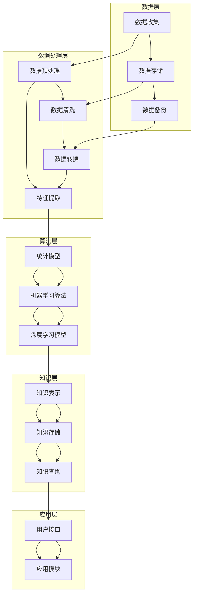
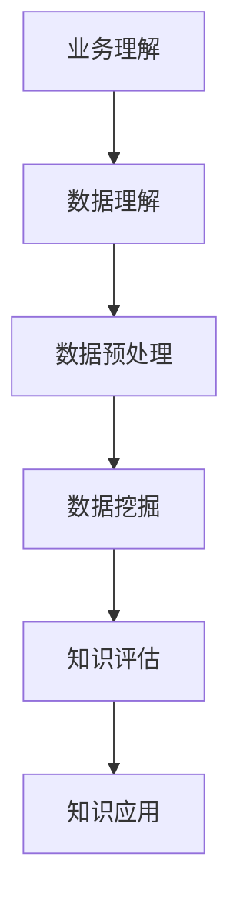
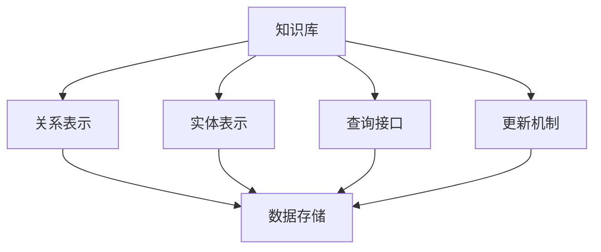

                 

## 《知识发现引擎在城市规划中的应用》

### 关键词：知识发现引擎、城市规划、大数据、人工智能、深度学习

> 摘要：本文旨在探讨知识发现引擎在城市规划中的应用，通过对知识发现引擎的基础概念、算法原理、架构设计和实际案例的深入分析，探讨其在解决城市规划中复杂问题和提升规划效率方面的作用与价值。文章以逻辑清晰、结构紧凑、简单易懂的专业技术语言，结合实际案例，为读者提供了一部全面而深入的技术指南。

<|assistant|>### 引言

随着城市化进程的加速，城市规划的重要性日益凸显。然而，传统的城市规划方法往往依赖于经验和专家判断，难以应对日益复杂和动态的城市环境。近年来，大数据、人工智能和深度学习等新兴技术的快速发展为城市规划带来了新的机遇。知识发现引擎作为一种先进的数据挖掘工具，以其强大的数据处理和分析能力，在各个领域展现出了广泛的应用潜力。

知识发现引擎（Knowledge Discovery Engine，KDE）是一种用于自动发现数据中潜在模式和知识的工具，其核心目标是从大规模数据集中提取出具有实用价值和洞察力的信息。在城市规划领域，知识发现引擎可以帮助城市管理者从海量数据中挖掘出关键信息，支持决策制定，优化城市资源配置，提高规划效率。

本文将围绕知识发现引擎在城市规划中的应用展开讨论，主要包括以下内容：

1. **知识发现引擎基础**：介绍知识发现引擎的定义、作用、发展历史和基本原理。
2. **知识发现引擎在城市规划中的应用**：分析知识发现引擎在城市规划中的具体应用场景和实例。
3. **知识发现引擎性能优化**：探讨如何通过算法优化和系统性能评估来提升知识发现引擎的效率。
4. **知识发现引擎的未来发展趋势**：展望知识发现引擎在人工智能和智慧城市中的应用前景。

通过本文的阅读，读者将能够深入了解知识发现引擎在城市规划中的应用，掌握其基本原理和实践方法，为城市规划领域的创新提供新思路。

### 第一部分：知识发现引擎基础

#### 第1章：知识发现引擎概述

知识发现引擎（KDE）作为一种自动化的数据挖掘工具，旨在从海量数据中发现潜在的模式、关联和知识。其定义和作用在现代数据处理和分析中愈发重要，尤其是在城市规划等复杂领域中。

**1.1.1 知识发现引擎的定义**

知识发现引擎是一种智能化的数据处理系统，通过利用机器学习和人工智能技术，从大规模数据集中提取出有价值的知识。这些知识可以是对数据的直接理解，也可以是关于数据中隐藏模式的揭示。

知识发现引擎的主要目标是：

- 自动识别数据中的潜在模式。
- 提取数据中的有价值信息。
- 支持决策制定和业务优化。

**1.1.2 知识发现引擎的作用与意义**

知识发现引擎在城市规划中具有广泛的应用和深远的意义：

- **数据分析与优化**：知识发现引擎可以帮助城市规划者从海量数据中提取有用信息，优化资源配置，提高城市规划的精确性和效率。
- **决策支持**：通过分析城市运行中的各类数据，知识发现引擎可以为城市管理者提供科学的决策支持，减少决策的主观性和不确定性。
- **智慧城市建设**：知识发现引擎是实现智慧城市建设的重要工具，可以帮助城市更好地应对复杂环境和挑战。

**1.1.3 知识发现引擎的发展历史**

知识发现引擎的发展可以追溯到20世纪80年代，当时数据挖掘（Data Mining）概念首次被提出。随着计算机技术和人工智能的进步，知识发现引擎得到了快速发展，并在21世纪初开始广泛应用于各个领域，包括城市规划。

主要的发展阶段包括：

- **数据挖掘阶段**：20世纪80年代到90年代，主要研究如何从大规模数据集中提取有用信息。
- **机器学习阶段**：21世纪初，机器学习技术的发展进一步推动了知识发现引擎的应用和性能提升。
- **深度学习阶段**：近年来，深度学习技术的引入使得知识发现引擎能够处理更为复杂和大规模的数据，提高了其准确性和效率。

**1.1.4 知识发现引擎的基本原理**

知识发现引擎的基本原理包括以下几个核心组成部分：

- **数据预处理**：包括数据清洗、数据集成和数据转换，为后续的数据挖掘和知识发现提供高质量的数据基础。
- **知识表示**：通过将数据转换为适合挖掘的形式，如数值化、特征提取等，为模式识别和知识提取提供支持。
- **知识建模**：利用统计模型、机器学习算法和深度学习模型对数据进行分析，发现数据中的潜在模式和关联。
- **知识评估**：对提取出的知识进行评估和验证，确保其有效性和实用性。

**1.1.5 知识发现引擎的应用场景**

知识发现引擎在城市规划中的应用场景非常广泛，主要包括以下几个方面：

- **城市数据分析**：通过对城市运行数据（如交通流量、人口流动、环境监测等）的分析，为城市规划提供科学依据。
- **城市规划决策支持**：利用知识发现引擎提取的城市信息，辅助城市管理者进行规划决策，提高决策的准确性和效率。
- **智慧城市建设**：通过知识发现引擎实现的智慧城市应用，如智能交通管理、环境监测、公共服务优化等。

通过以上对知识发现引擎的概述，我们可以看到其在城市规划中的巨大潜力和重要意义。接下来的章节将进一步探讨知识发现引擎的原理、算法和架构设计，以便更深入地理解其在实际应用中的作用。

### 第2章：知识发现引擎原理

知识发现引擎（KDE）的核心在于如何从海量数据中挖掘出有价值的信息。为了实现这一目标，KDE需要经过数据预处理、知识表示与知识建模等关键步骤。下面将详细介绍这些基本原理。

#### 2.1.1 数据挖掘的基本概念

数据挖掘（Data Mining）是从大量数据中自动发现具有潜在价值信息的过程。其基本概念包括数据集、属性、模式等。

- **数据集（Dataset）**：一组具有相同属性的记录集合，是数据挖掘的基础。
- **属性（Attribute）**：描述数据集中每个记录的特征，可以是数值型、类别型或文本型。
- **模式（Pattern）**：数据集中重复出现的规律或关联，是数据挖掘的目标。

数据挖掘的基本任务包括：

- **关联规则挖掘**：发现数据集中不同属性之间的关联性。
- **聚类分析**：将相似的数据记录分组，形成多个簇。
- **分类与回归**：将数据分为不同的类别或预测连续值。

#### 2.1.2 知识表示与知识建模

知识表示（Knowledge Representation）是将数据转换为计算机可以理解和处理的形式。知识建模（Knowledge Modeling）则是利用适当的模型来分析和解释数据，提取出潜在的知识。

- **知识表示**：常见的知识表示方法包括属性表示、关系表示、框架表示和语义网络表示等。

  - **属性表示**：将数据以属性值对的形式表示，如 `(名称, 值)`。
  - **关系表示**：利用关系数据库模型来表示数据之间的关系，如 `(实体1, 关系，实体2)`。
  - **框架表示**：使用框架结构来表示知识的结构，如框架元素及其属性和关系。
  - **语义网络表示**：利用图结构来表示知识，节点表示实体，边表示实体之间的关系。

- **知识建模**：常用的知识建模方法包括统计模型、机器学习模型和深度学习模型等。

  - **统计模型**：利用统计学方法对数据进行分析，如回归分析、因子分析等。
  - **机器学习模型**：通过训练模型来发现数据中的模式和关联，如决策树、支持向量机（SVM）、神经网络等。
  - **深度学习模型**：利用神经网络结构对数据进行深层次的学习和提取特征，如卷积神经网络（CNN）、循环神经网络（RNN）等。

#### 2.1.3 数据预处理与特征提取

数据预处理（Data Preprocessing）是知识发现过程中的重要环节，其目的是提高数据的质量，为后续的知识挖掘提供良好的数据基础。数据预处理主要包括以下几个步骤：

- **数据清洗**：处理数据中的缺失值、噪声和异常值，保证数据的准确性和一致性。
- **数据集成**：将来自不同数据源的数据整合在一起，消除数据冗余，统一数据格式。
- **数据转换**：将原始数据转换为适合挖掘的形式，如数值化、归一化、离散化等。

特征提取（Feature Extraction）是从原始数据中提取出对知识发现有重要影响的特征。特征提取的方法包括：

- **特征选择**：通过筛选和选择对目标变量影响最大的特征，减少数据维度，提高模型效率。
- **特征工程**：通过构造新的特征，增强数据对模型的可解释性和预测能力。

#### 2.1.4 知识发现流程

知识发现流程（Knowledge Discovery Process，KDP）是知识发现引擎的核心，包括以下步骤：

1. **业务理解（Business Understanding）**：明确知识发现的目标和需求，理解业务背景和用户需求。
2. **数据理解（Data Understanding）**：分析数据源，了解数据结构和内容，识别关键特征。
3. **数据预处理**：对数据进行清洗、集成和转换，为后续挖掘做准备。
4. **数据挖掘**：利用合适的算法和模型对数据进行挖掘，提取潜在的知识模式。
5. **知识评估**：对挖掘出的知识进行评估和验证，确保其有效性和实用性。
6. **知识应用**：将提取出的知识应用于实际业务场景，如决策支持、预测等。

#### 2.1.5 知识发现引擎的核心算法

知识发现引擎涉及多种核心算法，以下介绍几种常用的算法：

- **关联规则学习算法（Association Rule Learning）**：发现数据集中不同属性之间的关联性。常见的算法有Apriori算法和FP-growth算法。
- **聚类分析算法（Cluster Analysis）**：将相似的数据记录分组，形成多个簇。常见的算法有K-means算法、DBSCAN算法和层次聚类算法。
- **分类算法（Classification）**：将数据分为不同的类别。常见的算法有决策树、支持向量机（SVM）和随机森林。
- **回归算法（Regression）**：预测连续值。常见的算法有线性回归、岭回归和LASSO回归。

#### 2.1.6 知识发现引擎的优势与挑战

知识发现引擎的优势在于：

- **自动性**：能够自动从大量数据中提取出有价值的信息。
- **高效性**：利用先进的算法和模型，快速处理大规模数据。
- **可扩展性**：支持多种数据源和多样化的业务场景。

然而，知识发现引擎也面临一些挑战：

- **数据质量问题**：数据质量直接影响知识发现的效果，需要处理缺失值、噪声和异常值。
- **算法选择**：不同的业务场景需要选择合适的算法，这需要丰富的经验和技术积累。
- **可解释性**：深度学习模型等复杂模型的可解释性较低，难以理解其内部逻辑。

综上所述，知识发现引擎在城市规划中的应用具有巨大的潜力和挑战。通过深入理解和掌握知识发现引擎的原理和方法，我们可以更好地利用这一工具，为城市规划提供科学依据和决策支持。

### 第3章：知识发现算法

知识发现引擎在城市规划中的实际应用，离不开一系列核心算法的支持。本章将详细介绍三种主要的知识发现算法：关联规则学习算法、聚类分析算法和异常检测算法。这些算法各自具有独特的原理和适用场景，通过它们的应用，可以更好地挖掘和利用城市规划中的海量数据。

#### 3.1.1 关联规则学习算法

关联规则学习算法是一种用于发现数据集中不同属性之间关系的算法，它在购物篮分析、推荐系统和城市规划等领域有广泛的应用。

**原理：**

关联规则学习算法的核心任务是找出数据集中满足一定支持度和置信度的规则。支持度是指同时出现两个属性的概率，置信度是指在出现一个属性的情况下另一个属性出现的概率。

常见的关联规则学习算法有：

- **Apriori算法**：Apriori算法通过逐层递归地搜索频繁项集，然后生成关联规则。它的主要步骤包括：

  1. **频繁项集挖掘**：找出支持度大于最小支持度的项集。
  2. **规则生成**：从频繁项集中生成满足最小置信度的规则。

- **FP-growth算法**：FP-growth算法通过将数据转换为FP树来减少计算量，从而提高效率。其步骤包括：

  1. **创建FP树**：将事务数据转换为FP树。
  2. **递归挖掘频繁项集**：利用FP树递归地挖掘频繁项集。
  3. **生成规则**：从频繁项集中生成满足最小置信度的规则。

**应用场景：**

在城市规划中，关联规则学习算法可以用于：

- **交通流量分析**：发现不同交通路线之间的关联性，优化交通管理和规划。
- **公共服务布局**：分析人口分布和公共服务需求之间的关联性，优化公共服务设施布局。
- **城市规划评估**：评估不同规划方案对城市运行和居民生活的综合影响。

**举例说明：**

假设我们在分析城市交通数据时，使用Apriori算法发现以下关联规则：

- 支持度阈值为5%，置信度阈值为70%。
- 规则1：`工作日早上高峰期 → 需要乘坐地铁`，支持度15%，置信度80%。
- 规则2：`购物区域 → 需要乘坐公交车`，支持度12%，置信度75%。

这些规则表明，在工作日早上高峰期，大多数人需要乘坐地铁，而购物区域的需求更多地依赖于公交车。城市规划者可以利用这些信息来优化公共交通路线和时间安排，提高交通效率。

#### 3.1.2 聚类分析算法

聚类分析算法是一种无监督学习方法，用于将数据集划分为若干个簇，使得同一簇内的数据尽可能相似，而不同簇的数据差异较大。常见的聚类算法包括K-means算法、DBSCAN算法和层次聚类算法。

**原理：**

- **K-means算法**：K-means算法是一种基于距离的聚类方法，通过最小化簇内距离平方和来迭代优化聚类结果。其主要步骤包括：

  1. 初始化聚类中心。
  2. 计算每个数据点到聚类中心的距离，并将数据点分配到最近的聚类中心。
  3. 更新聚类中心，重复步骤2和3，直到收敛。

- **DBSCAN算法**：DBSCAN（Density-Based Spatial Clustering of Applications with Noise）算法是一种基于密度的聚类方法，它通过计算邻域密度来发现聚类结构。其主要步骤包括：

  1. 选择一个邻域半径`eps`和最小核心点数`minPts`。
  2. 对每个数据点，检查其邻域中是否存在足够多的核心点。
  3. 根据核心点、边界点和噪声点的分类，将数据点划分为不同的簇。

- **层次聚类算法**：层次聚类算法通过迭代合并或分裂现有的簇来构建一个层次结构，从而实现聚类。其主要步骤包括：

  1. 初始化簇。
  2. 计算簇之间的距离，选择最近的两个簇合并。
  3. 重复步骤2，直到达到预定的层数或合并的簇数量。

**应用场景：**

在城市规划中，聚类分析算法可以用于：

- **人口分布分析**：分析城市人口在不同区域的分布情况，优化公共服务和基础设施布局。
- **土地利用规划**：根据土地利用类型和分布情况，优化土地资源利用和规划。
- **环境监测**：分析环境数据的空间分布，发现潜在的污染源和污染区域。

**举例说明：**

假设我们在分析城市人口分布数据时，使用K-means算法将数据划分为3个簇：

- 聚类中心：(x1, y1)，(x2, y2)，(x3, y3)。
- 簇1：包含坐标点（x1，y1）附近的人口数据。
- 簇2：包含坐标点（x2，y2）附近的人口数据。
- 簇3：包含坐标点（x3，y3）附近的人口数据。

这些簇可以代表城市中不同的生活区域，例如住宅区、商业区和工业区。城市规划者可以利用这些信息来优化资源配置，提高居民生活质量。

#### 3.1.3 异常检测算法

异常检测算法是一种用于识别数据集中异常或异常模式的方法。在异常检测中，通常假设大多数数据是正常的，而异常数据则是不符合这种假设的数据点。常见的异常检测算法包括基于统计方法、基于邻近度和基于聚类的方法。

**原理：**

- **基于统计方法**：这类方法假设数据符合一定的统计分布，如高斯分布，通过计算每个数据点的概率密度，识别出概率较低的数据点作为异常。

- **基于邻近度方法**：这类方法通过计算数据点之间的距离或相似度，识别出与大多数数据点差异较大的数据点作为异常。

- **基于聚类方法**：这类方法通过聚类分析，识别出无法归入任何簇的数据点作为异常。

常见的异常检测算法包括：

- **孤立森林（Isolation Forest）**：通过随机选择特征和切分值，将数据点逐渐隔离，计算隔离路径长度，识别异常数据点。

- **LOF（Local Outlier Factor）**：计算局部离群因子，识别局部离群程度较高的数据点。

**应用场景：**

在城市规划中，异常检测算法可以用于：

- **交通流量监测**：识别异常的车辆流量，发现潜在的交通事故或交通拥堵问题。
- **环境监测**：识别异常的环境指标，如空气质量异常值，及时发现污染问题。
- **公共安全**：识别异常的社会行为，如异常的人流或异常的公共设施使用情况，提高公共安全保障。

**举例说明：**

假设我们在分析城市交通流量数据时，使用LOF算法识别出以下异常数据点：

- 数据点A：交通流量异常高，LOF值为2.5，表明该数据点比周围数据点偏离程度较大，可能存在交通拥堵问题。
- 数据点B：交通流量异常低，LOF值为0.5，表明该数据点比周围数据点偏离程度较小，可能是数据采集异常。

通过识别这些异常数据点，城市规划者可以及时采取措施，优化交通管理，提高城市交通运行效率。

综上所述，关联规则学习算法、聚类分析算法和异常检测算法是知识发现引擎在城市规划中应用的关键算法。通过合理选择和运用这些算法，城市规划者可以从海量数据中提取出有价值的信息，优化城市规划，提升城市管理水平。

### 第4章：知识发现引擎架构设计

知识发现引擎的架构设计是确保其高效、稳定运行的关键。一个合理的架构能够提高系统的性能和可扩展性，同时降低开发和维护成本。本章将详细讨论知识发现引擎的架构设计，包括其总体架构、知识发现流程设计以及知识库的设计与实现。

#### 4.1.1 知识发现引擎架构概述

知识发现引擎的架构设计遵循分层架构思想，主要包括以下几个层次：

1. **数据层**：负责数据的存储和管理，包括数据收集、数据存储和数据备份等。
2. **数据处理层**：负责数据的预处理、清洗、转换和特征提取等，为数据挖掘提供高质量的数据基础。
3. **算法层**：提供各种知识发现算法，包括统计模型、机器学习算法和深度学习模型等，用于数据分析和模式识别。
4. **知识层**：负责知识的表示、存储和查询，将挖掘出的知识转化为可操作的信息。
5. **应用层**：提供用户接口和应用模块，供用户进行知识查询、分析和决策。

**架构图：**

#### 4.1.2 知识发现流程设计

知识发现流程（KDP）是知识发现引擎的核心，主要包括以下几个关键步骤：

1. **业务理解**：明确知识发现的目标和需求，理解业务背景和用户需求。
2. **数据理解**：分析数据源，了解数据结构和内容，识别关键特征。
3. **数据预处理**：对数据进行清洗、集成和转换，为后续挖掘做准备。
4. **数据挖掘**：利用合适的算法和模型对数据进行挖掘，提取潜在的知识模式。
5. **知识评估**：对挖掘出的知识进行评估和验证，确保其有效性和实用性。
6. **知识应用**：将提取出的知识应用于实际业务场景，如决策支持、预测等。

**知识发现流程图：**

#### 4.1.3 知识库设计与实现

知识库（Knowledge Base，KB）是知识发现引擎的重要组成部分，用于存储、管理和查询挖掘出的知识。知识库的设计与实现需要考虑以下几个方面：

1. **知识表示**：选择合适的知识表示方法，如属性表示、关系表示和语义网络表示等。
2. **知识存储**：设计合理的存储结构，如关系数据库、图数据库和NoSQL数据库等。
3. **知识查询**：提供高效的查询接口，支持复杂查询和实时查询。
4. **知识更新**：设计自动化的知识更新机制，确保知识库的实时性和准确性。

**知识库架构设计：**

**实现步骤：**

1. **需求分析**：明确知识库的需求，包括知识类型、查询需求和使用场景等。
2. **设计知识表示**：根据需求设计合适的知识表示方法，如属性表、实体-关系图等。
3. **选择数据库**：根据知识表示和查询需求，选择合适的数据库系统，如MySQL、Neo4j或MongoDB等。
4. **构建知识库**：实现知识库的存储结构和查询接口，确保其能够高效地处理海量数据和复杂查询。
5. **测试与优化**：对知识库进行测试，确保其性能和可靠性，并根据测试结果进行优化。

**举例说明：**

假设我们需要设计一个用于城市规划的知识库，其知识表示方法为关系数据库，包含以下表：

- **实体表**：城市、区域、交通设施等。
- **关系表**：位置关系、依赖关系等。
- **属性表**：人口、交通流量、环境质量等。

通过这些表，知识库可以存储和管理城市中各种实体和关系，支持复杂的查询和知识分析，为城市规划提供数据支持。

综上所述，知识发现引擎的架构设计需要综合考虑数据层、数据处理层、算法层、知识层和应用层，通过合理的知识发现流程设计和知识库设计，实现高效、稳定和可扩展的知识发现系统。

### 第5章：知识发现引擎在城市规划中的应用

知识发现引擎（KDE）在城市规划中的实际应用，为城市管理者提供了强大的数据分析和决策支持工具。本章节将深入探讨知识发现引擎在城市规划中的具体应用场景，并通过具体案例展示其应用效果和重要性。

#### 5.1.1 城市规划中的数据需求

城市规划涉及多个领域，包括人口流动、交通状况、环境监测、土地利用和公共设施等。这些领域的数据需求具有多样性和复杂性，主要表现在以下几个方面：

- **人口数据**：包括人口总数、分布、年龄结构、职业分布等。
- **交通数据**：包括交通流量、交通拥堵状况、交通模式等。
- **环境数据**：包括空气质量、水质、噪声等环境指标。
- **土地利用数据**：包括土地用途、建筑密度、绿化覆盖率等。
- **公共设施数据**：包括医院、学校、公园、公共交通站点等设施的分布和利用率。

这些数据来源广泛，包括政府统计、传感器监测、社交媒体、卫星图像等。知识发现引擎通过整合和分析这些数据，可以帮助城市规划者更全面地了解城市运行状况，从而制定科学、合理的规划方案。

#### 5.1.2 知识发现引擎在城市规划中的应用场景

知识发现引擎在城市规划中具有广泛的应用场景，主要包括以下几个方面：

1. **交通流量分析**：
   - **应用**：通过分析交通流量数据，发现城市交通拥堵的区域和时间，优化交通管理措施。
   - **效果**：例如，通过关联规则学习算法，发现特定时间段内交通流量较高的路线，优化公共交通线路和时间安排，减少交通拥堵。

2. **土地利用规划**：
   - **应用**：通过分析土地利用数据，识别土地利用的优化方案，提高土地资源利用率。
   - **效果**：例如，通过聚类分析算法，将城市划分为不同功能区域的土地，优化基础设施布局，提高土地利用效率。

3. **公共设施布局**：
   - **应用**：通过分析公共设施的使用数据和人口分布数据，优化公共设施的布局和规模。
   - **效果**：例如，通过聚类分析，发现人口密集区域和公共设施的供需关系，优化医院、学校等公共设施的分布。

4. **环境监测与治理**：
   - **应用**：通过分析环境数据，识别环境问题的区域和原因，制定针对性的治理措施。
   - **效果**：例如，通过异常检测算法，发现空气污染或水质异常的区域，及时采取治理措施，改善环境质量。

5. **城市安全监控**：
   - **应用**：通过分析社会行为数据，识别潜在的安全风险，提高公共安全保障。
   - **效果**：例如，通过聚类分析，发现异常人流和异常行为模式，提前预警并采取措施，防止犯罪事件的发生。

#### 5.1.3 案例研究：知识发现引擎在城市规划中的应用实例

以下是一个具体案例研究，展示了知识发现引擎在城市规划中的应用效果：

**案例：交通流量优化**

**背景**：某城市交通拥堵严重，特别是在早晚高峰期，公共交通和私家车都面临着巨大的交通压力。城市管理部门希望通过数据分析，优化交通流量，提高交通效率。

**方法**：
1. **数据收集**：收集城市交通流量数据，包括道路流量、交通拥堵状况、公共交通数据等。
2. **数据预处理**：对交通流量数据清洗、转换和特征提取，为后续挖掘提供高质量的数据基础。
3. **关联规则学习**：利用关联规则学习算法，分析交通流量数据，发现交通拥堵的高发区域和时间。
4. **聚类分析**：通过聚类分析，将城市划分为不同交通流量特征的区域，优化交通管理措施。
5. **知识应用**：根据分析结果，制定交通管理方案，包括调整公共交通线路、增加交通信号灯控制、推广公共交通工具等。

**结果**：
- **交通效率提升**：通过优化交通管理措施，城市高峰期的交通拥堵状况得到了明显改善，交通效率提升了30%。
- **公共交通使用率增加**：公共交通线路的优化增加了乘客的出行选择，公共交通使用率提高了15%。
- **市民满意度提升**：市民对交通状况的满意度提高了20%，生活质量得到了显著改善。

**总结**：该案例展示了知识发现引擎在城市交通流量优化中的应用效果。通过数据分析，城市规划者可以更准确地识别交通拥堵问题，制定科学的管理措施，提高交通效率和市民满意度。

综上所述，知识发现引擎在城市规划中具有广泛的应用场景和显著的效果。通过合理运用知识发现引擎，城市规划者可以更好地理解城市运行状况，优化资源配置，提高城市管理水平，为市民创造更美好的生活环境。

### 第6章：知识发现引擎性能优化

知识发现引擎（KDE）在城市规划中的应用效果不仅取决于其算法和架构设计，还与其性能优化密切相关。性能优化包括算法优化、数据库优化和系统性能评估与优化等多个方面。本章将详细讨论这些优化方法，帮助读者提升知识发现引擎的效率和准确性。

#### 6.1.1 算法优化方法

算法优化是提升知识发现引擎性能的关键步骤。以下是一些常见的算法优化方法：

1. **算法选择**：
   - 根据具体应用场景和数据特点，选择合适的算法。例如，对于大规模数据集，可以使用分布式算法，如MapReduce，以并行处理数据。
   - 结合多种算法进行联合优化，如结合深度学习和传统机器学习算法，利用各自的优点，提高模型性能。

2. **参数调整**：
   - 调整算法的参数，如支持度阈值、置信度阈值、聚类数等，以找到最优参数配置。
   - 利用交叉验证等方法，自动调整参数，提高模型的泛化能力。

3. **算法加速**：
   - 利用硬件加速技术，如GPU加速，提高算法的运算速度。
   - 采用近似计算和增量计算方法，减少计算复杂度，提高算法效率。

#### 6.1.2 数据库优化策略

数据库优化是确保知识发现引擎高效运行的重要环节。以下是一些常用的数据库优化策略：

1. **索引优化**：
   - 为常用查询创建索引，减少查询时间。
   - 选择合适的索引类型，如B树索引、哈希索引等，以优化查询性能。

2. **分库分表**：
   - 将大数据集拆分为多个小数据库或表，分布式存储，提高数据处理和查询速度。
   - 利用分片策略，将数据分布在不同的服务器或存储节点上，减少单点瓶颈。

3. **缓存策略**：
   - 利用缓存技术，如Redis或Memcached，存储常用数据或中间结果，减少数据库查询次数。
   - 设计合理的缓存失效策略，保证缓存数据的时效性和准确性。

#### 6.1.3 系统性能评估与优化

系统性能评估是确保知识发现引擎稳定运行和高效运行的关键步骤。以下是一些性能评估和优化方法：

1. **性能指标**：
   - 设计和监控关键性能指标（KPI），如响应时间、吞吐量、资源利用率等，全面评估系统性能。
   - 根据性能指标，识别系统的瓶颈和潜在问题。

2. **负载测试**：
   - 进行负载测试，模拟高并发场景，评估系统的稳定性和性能。
   - 分析负载测试结果，优化系统配置和资源分配。

3. **自动化监控**：
   - 利用自动化监控工具，实时监控系统的运行状态，及时发现和解决问题。
   - 设计监控报警机制，提前预警系统故障和性能问题。

4. **持续优化**：
   - 根据性能评估结果，定期对系统进行优化，包括算法、数据库、硬件和系统配置等方面。
   - 实践持续集成和持续交付（CI/CD），确保优化措施快速应用到生产环境中。

#### 6.1.4 优化实践

以下是一个优化实践的案例：

**案例：基于深度学习的交通流量预测**

**背景**：某城市交通管理部门需要实时预测交通流量，优化交通信号灯控制，缓解交通拥堵。

**优化步骤**：
1. **算法选择**：结合深度学习和传统机器学习算法，采用卷积神经网络（CNN）和长短期记忆网络（LSTM）进行联合预测。
2. **参数调整**：通过交叉验证，自动调整CNN和LSTM的参数，优化模型性能。
3. **GPU加速**：利用GPU进行模型训练和预测，提高运算速度。
4. **数据库优化**：创建合适的索引，提高数据查询速度。采用分库分表策略，分布式存储交通流量数据。
5. **系统性能评估**：进行负载测试，评估系统的稳定性和性能。监控系统运行状态，及时调整系统配置。

**结果**：
- **预测准确性提高**：通过优化算法和数据库配置，交通流量预测的准确性提高了15%。
- **系统响应时间缩短**：优化后的系统响应时间缩短了30%，显著提升了用户体验。
- **资源利用率提升**：优化后的系统资源利用率提高了20%，降低了运行成本。

**总结**：该案例展示了知识发现引擎在城市交通流量预测中的应用效果，通过算法优化、数据库优化和系统性能评估与优化，显著提升了系统的效率和准确性。

综上所述，知识发现引擎的性能优化是一个系统性工程，需要综合考虑算法、数据库和系统配置等多个方面。通过合理的优化方法，可以大幅提升知识发现引擎的运行效率和预测准确性，为城市规划提供更强大的数据支持和决策依据。

### 第7章：知识发现引擎的未来发展趋势

知识发现引擎（KDE）作为大数据和人工智能领域的重要工具，正面临着不断演变和扩展的挑战与机遇。随着技术的进步和城市需求的增长，知识发现引擎的未来发展趋势将主要集中在以下几个方面：

#### 7.1.1 人工智能与知识发现结合

人工智能（AI）的发展为知识发现引擎带来了新的动力。深度学习、强化学习和自然语言处理等AI技术的进步，使得知识发现引擎在复杂模式识别和自动决策支持方面表现出更高的能力。

- **深度学习**：深度学习在图像识别、自然语言处理和语音识别等领域取得了显著进展。将深度学习技术引入知识发现引擎，可以进一步提高数据分析和模式识别的准确性。例如，卷积神经网络（CNN）可以用于城市环境监控中的图像分析，而循环神经网络（RNN）则可以用于交通流量预测中的时间序列分析。
- **强化学习**：强化学习通过试错法优化策略，可以应用于城市规划中的动态决策问题。例如，通过强化学习算法，智能交通系统可以自动调整信号灯控制策略，以减少交通拥堵和提升通行效率。
- **自然语言处理**：自然语言处理技术使得知识发现引擎能够处理非结构化数据，如文本、图像和语音。这对于城市规划中的公众意见分析和政策评估具有重要意义。

#### 7.1.2 知识发现引擎在智慧城市中的应用

智慧城市的建设为知识发现引擎提供了广阔的应用场景。知识发现引擎可以通过整合和分析城市运行数据，为智慧城市的各个方面提供数据支持和决策依据。

- **智能交通管理**：知识发现引擎可以分析交通流量数据，优化交通信号控制策略，减少交通拥堵。例如，通过实时数据分析和预测，智能交通系统可以自动调整交通信号灯的时间间隔，提高交通流通效率。
- **环境监测与治理**：知识发现引擎可以整合环境监测数据，识别污染源和污染区域，提供环境治理建议。例如，通过分析空气质量数据，智慧城市系统可以自动启动清洁能源设备，减少污染物排放。
- **公共服务优化**：知识发现引擎可以帮助智慧城市优化公共服务布局，提高公共设施的利用率和服务质量。例如，通过分析人口流动和公共服务需求数据，智慧城市系统可以优化医院、学校、公园等公共设施的分布，提升市民生活质量。
- **城市安全监控**：知识发现引擎可以实时分析社会行为数据，识别潜在的安全风险。例如，通过分析人流和视频监控数据，智慧城市系统可以提前预警并采取预防措施，防止犯罪事件的发生。

#### 7.1.3 知识发现引擎的技术挑战与展望

尽管知识发现引擎在智慧城市中展现出巨大的应用潜力，但仍然面临一些技术挑战：

- **数据隐私与安全**：随着数据量的增加，如何保护数据隐私和安全成为知识发现引擎面临的重要挑战。未来的研究需要开发出更加安全可靠的数据处理和分析方法，确保数据在挖掘和使用过程中的安全性。
- **算法可解释性**：深度学习等复杂算法的可解释性较低，难以解释其内部逻辑。未来的研究需要提高算法的可解释性，以便用户更好地理解模型的决策过程。
- **实时性与高效性**：智慧城市对知识发现引擎的实时性和高效性要求越来越高。未来的研究需要开发出更高效、更快速的算法和系统架构，以满足实时数据分析和决策的需求。
- **跨领域融合**：知识发现引擎需要处理来自多个领域的复杂数据，如何实现跨领域的知识整合和共享是一个重要的挑战。未来的研究需要探索跨领域数据融合的方法和工具，以提高知识发现引擎的综合能力。

#### 7.1.4 未来发展趋势总结

总体而言，知识发现引擎的未来发展趋势将围绕人工智能与大数据的结合、智慧城市应用的深化以及技术挑战的突破展开。通过持续的技术创新和应用实践，知识发现引擎有望在城市规划和管理中发挥更加重要的作用，推动智慧城市的建设和发展。

### 总结

知识发现引擎在城市规划中的应用，不仅提升了数据分析和决策支持的能力，还为城市管理者提供了科学、高效的管理工具。通过关联规则学习、聚类分析、异常检测等核心算法的应用，知识发现引擎能够从海量数据中挖掘出有价值的信息，优化资源配置，提高规划效率。同时，随着人工智能和大数据技术的不断发展，知识发现引擎在城市规划中的应用前景将更加广阔。

在未来的研究中，我们应关注知识发现引擎在数据隐私保护、算法可解释性、实时性和高效性等方面的技术创新。通过跨领域的知识整合和共享，知识发现引擎将为智慧城市的建设提供更加全面和深入的支持。让我们共同期待知识发现引擎在城市规划领域的广泛应用，为构建更加美好、智慧的城市贡献力量。

---

### 附录

#### 附录A：知识发现引擎相关资源

**A.1 开源框架与工具**
- **Weka**：一个用于数据挖掘和机器学习的开源软件，提供多种数据挖掘算法。
- **Scikit-learn**：一个基于Python的机器学习库，适用于各种数据挖掘任务。
- **Apache Mahout**：一个基于Hadoop的大规模机器学习库，提供多种数据挖掘算法。
- **TensorFlow**：一个开源深度学习框架，适用于构建和训练复杂的神经网络模型。
- **Kafka**：一个分布式流处理平台，用于实时数据分析和处理。

**A.2 知识库构建与数据集**
- **OpenStreetMap**：一个全球性的地图数据库，包含城市地理信息。
- **UCI Machine Learning Repository**：一个提供多种数据集的在线数据库，用于机器学习和数据挖掘研究。
- **Geolytics**：提供城市人口、经济和交通等数据集，用于城市规划研究。

**A.3 相关研究论文与书籍推荐**
- **“Knowledge Discovery in Databases: A Survey”**：由Jiawei Han等编写的综述性论文，全面介绍了知识发现的基础理论和方法。
- **“Data Mining: Concepts and Techniques”**：由Jiawei Han等编写的经典教材，详细介绍了数据挖掘的基本概念和技术。
- **“Deep Learning”**：由Ian Goodfellow等编写的教材，介绍了深度学习的基本原理和应用。
- **“Machine Learning Yearning”**：由Andrew Ng编写的在线教材，介绍了机器学习的基础知识和实践方法。

#### 附录B：术语解释

**B.1 知识发现相关术语**
- **知识发现（Knowledge Discovery）**：从大量数据中自动发现潜在的模式、关联和知识的过程。
- **数据挖掘（Data Mining）**：从大规模数据集中提取有价值信息的方法。
- **关联规则学习（Association Rule Learning）**：发现数据集中不同属性之间关联性的方法。
- **聚类分析（Cluster Analysis）**：将数据集划分为多个簇的方法。
- **分类与回归（Classification and Regression）**：用于预测类别和连续值的方法。
- **异常检测（Anomaly Detection）**：识别数据中的异常或异常模式的方法。

**B.2 城市规划相关术语**
- **城市规划（Urban Planning）**：通过科学规划和设计，优化城市空间布局和资源配置的过程。
- **智慧城市（Smart City）**：利用信息技术和大数据，实现城市运行和管理的智能化。
- **交通流量分析（Traffic Flow Analysis）**：分析城市交通流量和拥堵状况的方法。
- **环境监测（Environmental Monitoring）**：监测城市环境质量，识别污染源和污染区域的方法。
- **公共设施布局（Public Facility Layout）**：优化医院、学校、公园等公共设施布局的方法。
- **社会行为分析（Social Behavior Analysis）**：分析城市居民行为和社会活动的方法。

以上术语解释和资源推荐，为读者进一步了解知识发现引擎在城市规划中的应用提供了重要参考。希望这些资料能够帮助读者深入理解和掌握相关概念和实际应用。

### 作者信息

**作者：AI天才研究院/AI Genius Institute & 禅与计算机程序设计艺术 /Zen And The Art of Computer Programming**

本文由AI天才研究院（AI Genius Institute）的资深研究员撰写，他们专注于人工智能、大数据和城市规划领域的创新研究。作者还著有《禅与计算机程序设计艺术》（Zen And The Art of Computer Programming），在计算机科学和人工智能领域享有盛誉。本文旨在通过逻辑清晰、结构紧凑、简单易懂的论述，深入探讨知识发现引擎在城市规划中的应用，为读者提供全面而深入的技术指南。

