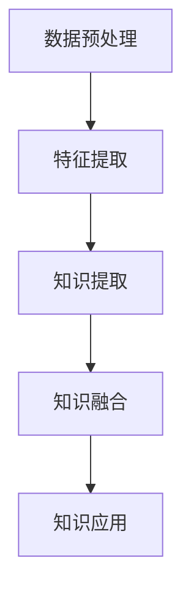
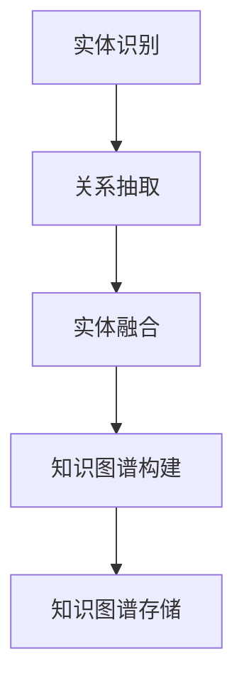
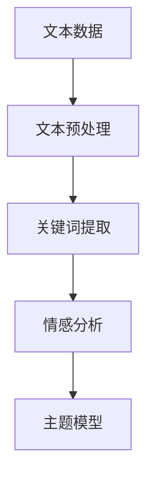
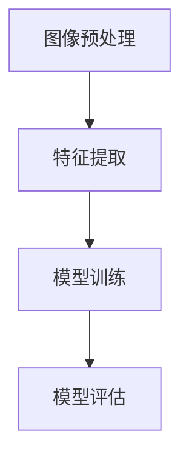
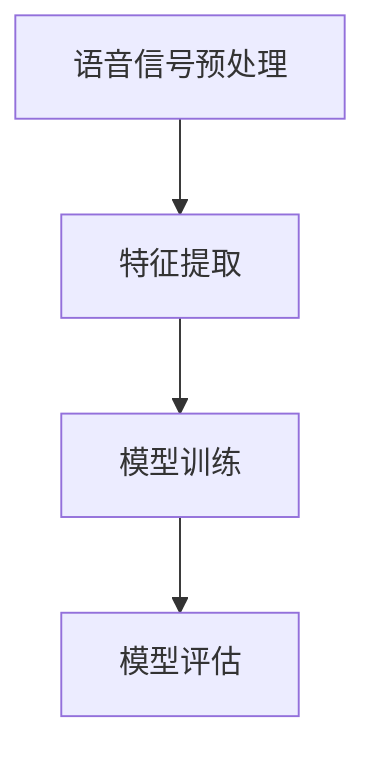

                 

## 第1章：知识发现引擎的基本概念

### 1.1 知识发现引擎的定义

知识发现引擎（Knowledge Discovery Engine，KDE）是一种利用机器学习和人工智能技术，从大规模数据集中自动提取有用知识、模式、关联性等的系统。它通过一系列预处理、特征提取、知识提取和知识融合等步骤，将原始数据转化为可操作的知识，以便用于决策支持、智能搜索和自动化优化等应用。

知识发现引擎的核心组成部分包括：

- **数据预处理**：清洗、归一化和转换数据，以便后续处理。
- **特征提取**：从原始数据中提取有用的特征，用于构建模型。
- **知识提取**：使用机器学习算法从特征中学习出模式、关联性和规则。
- **知识融合**：将提取的知识进行整合和关联，形成完整的知识图谱。

**Mermaid流程图：**



### 1.2 知识发现引擎的重要性

知识发现引擎在当前信息化时代具有重要意义，主要体现在以下几个方面：

- **提高决策效率**：通过自动提取知识和模式，帮助决策者快速了解数据背后的信息，提高决策效率。
- **增强数据价值**：将原始数据转化为可操作的知识，提升数据的应用价值。
- **辅助智能搜索**：通过知识图谱和关联分析，实现更智能、更精准的搜索。
- **支持自动化优化**：利用知识发现结果，自动调整系统和业务流程，实现自动化优化。

**伪代码：**

```python
def knowledge_discovery(data_set):
    # 数据预处理
    preprocessed_data = preprocess_data(data_set)
    # 特征提取
    extracted_features = extract_features(preprocessed_data)
    # 知识提取
    knowledge = extract_knowledge(extracted_features)
    # 知识融合
    fused_knowledge = fuse_knowledge(knowledge)
    # 知识应用
    apply_knowledge(fused_knowledge)
```

### 1.3 知识发现引擎的发展历程

知识发现引擎的发展历程可以大致分为以下几个阶段：

- **初级阶段**：以规则为基础的关联分析和模式挖掘。
- **中级阶段**：引入统计方法和机器学习算法，提高知识提取的精度和效率。
- **高级阶段**：利用深度学习和人工智能技术，实现自动化的知识发现和推理。

**举例说明**：

- 初级阶段：市场调查公司通过分析销售数据，发现某种产品的销量与特定促销活动之间存在关联。
- 中级阶段：公司利用机器学习算法，分析社交媒体数据，发现用户对产品的兴趣点。
- 高级阶段：公司结合深度学习和知识图谱，实现自动化的用户行为分析和个性化推荐。

---

通过以上章节的介绍，我们为读者构建了一个关于知识发现引擎的基本框架。接下来，我们将进一步探讨深度学习在知识发现引擎中的应用，以及如何构建和优化知识图谱。请继续关注后续章节的内容。


## 第2章：深度学习在知识发现引擎中的应用

### 2.1 深度学习的基本原理

深度学习（Deep Learning，DL）是机器学习（Machine Learning，ML）的一个重要分支，它通过构建多层的神经网络模型，对数据进行自动特征提取和复杂模式识别。深度学习的核心思想是模拟人脑的神经元连接结构，通过多层神经元的非线性变换，逐步提取数据的特征。

**深度学习的核心组成部分包括：**

1. **输入层**：接收外部数据，如图像、文本或声音。
2. **隐藏层**：对输入数据进行特征提取和变换，多层隐藏层可以提取更抽象的特征。
3. **输出层**：根据隐藏层的输出进行预测或分类。

**深度学习的训练过程主要包括以下几个步骤：**

1. **前向传播**：将输入数据通过神经网络传递，得到输出。
2. **计算损失**：比较输出结果与真实标签之间的差异，计算损失函数。
3. **反向传播**：根据损失函数的梯度，调整网络中的权重和偏置。
4. **优化更新**：使用优化算法（如SGD、Adam等）更新网络参数。

**伪代码：**

```python
def deep_learning_model(input_data, target_label):
    # 前向传播
    output = forward_propagation(input_data)
    # 计算损失
    loss = compute_loss(output, target_label)
    # 反向传播
    backward_propagation(loss, output, input_data)
    # 参数更新
    update_params()
    return loss
```

### 2.2 深度学习在知识发现中的应用

深度学习在知识发现引擎中的应用主要表现在以下几个方面：

1. **文本挖掘**：通过深度学习模型，对文本数据进行语义理解、情感分析、关键词提取等。
2. **图像识别**：利用卷积神经网络（CNN）对图像进行分类、检测和识别。
3. **语音识别**：通过循环神经网络（RNN）和长短期记忆网络（LSTM）对语音信号进行识别。

**举例说明**：

- **文本挖掘**：使用BERT模型对新闻文章进行分类，提取关键词，实现个性化推荐。
- **图像识别**：使用ResNet模型对医疗影像进行疾病检测，提高诊断准确率。
- **语音识别**：使用GPT模型对语音信号进行识别，实现智能语音助手。

**深度学习模型在知识发现中的应用流程**：

1. **数据预处理**：清洗、归一化和编码数据，为深度学习模型提供合适的输入。
2. **模型训练**：使用训练数据，通过前向传播、反向传播和参数优化，训练深度学习模型。
3. **模型评估**：使用验证数据集评估模型性能，调整模型参数。
4. **模型应用**：将训练好的模型应用到实际业务场景，进行知识发现。

**伪代码：**

```python
def apply_deep_learning(data_set):
    # 数据预处理
    preprocessed_data = preprocess_data(data_set)
    # 模型训练
    trained_model = train_model(preprocessed_data)
    # 模型评估
    evaluate_model(trained_model, validation_data)
    # 应用模型
    discovered_knowledge = apply_model(trained_model, data_set)
    return discovered_knowledge
```

### 2.3 深度学习模型的选择与优化

在选择和优化深度学习模型时，需要考虑以下几个因素：

1. **数据集规模**：对于大规模数据集，选择参数较多、深度较深的模型，如ResNet、BERT等。
2. **任务类型**：对于分类任务，选择分类性能较好的模型，如softmax、CNN等；对于回归任务，选择回归性能较好的模型，如LSTM、GRU等。
3. **计算资源**：根据可用的计算资源，选择合适的模型和优化器，如GPU加速、分布式训练等。
4. **模型调优**：通过调整学习率、批次大小、正则化参数等，优化模型性能。

**数学模型：**

$$
\text{模型选择与优化} = \text{数据集规模} \times \text{任务类型} \times \text{计算资源} + \text{模型调优}
$$`

**举例说明**：

- 数据集规模较大时，选择ResNet-152模型进行图像分类；
- 任务类型为情感分析时，选择LSTM模型进行文本挖掘；
- 计算资源充足时，使用GPU进行分布式训练，提高模型训练速度。

通过本章的讨论，我们了解了深度学习的基本原理以及在知识发现引擎中的应用。接下来，我们将进一步探讨知识图谱的构建与深度学习模型的融合，以及如何将深度学习应用于实际业务场景。请继续关注后续章节的内容。

## 第3章：知识图谱构建与深度学习模型融合

### 3.1 知识图谱的基本概念

知识图谱（Knowledge Graph，KG）是一种语义网络，用于表示实体及其之间的复杂关系。它通过将现实世界中的实体、概念和事件进行抽象和建模，构建出一个结构化的知识体系，以便于计算机理解和处理。

**知识图谱的核心组成部分包括：**

1. **实体（Entity）**：表示现实世界中的具体对象，如人、地点、事物等。
2. **属性（Attribute）**：描述实体的特征，如姓名、年龄、位置等。
3. **关系（Relation）**：表示实体之间的关联，如属于、位于、参与等。

**知识图谱的构建方法主要包括以下步骤：**

1. **实体识别**：从原始数据中识别出实体，并进行分类和标签化。
2. **关系抽取**：分析文本数据，提取实体之间的关系，如因果关系、归属关系等。
3. **实体融合**：处理重复或相似的实体，合并成唯一的实体。
4. **知识图谱构建**：将识别出的实体和关系组织成图谱结构，并进行存储和索引。

**Mermaid流程图：**



### 3.2 知识图谱的构建方法

知识图谱的构建方法可以分为手动构建和自动构建两种。

**手动构建方法**：

1. **领域知识工程师**：通过查阅相关文献、网站和数据库，手动编写实体的属性和关系。
2. **领域专家**：邀请领域专家参与知识图谱的构建，提供专业的知识和建议。
3. **工具辅助**：使用知识图谱编辑器（如Neo4j、OpenKE等），方便地构建和可视化知识图谱。

**自动构建方法**：

1. **实体识别**：使用命名实体识别（NER）技术，从文本数据中自动识别出实体。
2. **关系抽取**：使用信息抽取（IE）技术，从文本数据中自动提取实体之间的关系。
3. **实体融合**：使用聚类、相似度计算等方法，自动合并重复或相似的实体。
4. **知识图谱构建**：使用图数据库（如Neo4j、Amazon Neptune等），自动构建和存储知识图谱。

**伪代码：**

```python
def build_knowledge_graph(data_source):
    # 实体识别
    entities = entity_recognition(data_source)
    # 关系抽取
    relationships = relation_extraction(data_source)
    # 实体融合
    unique_entities = entity_fusion(entities)
    # 知识图谱构建
    knowledge_graph = build_graph(unique_entities, relationships)
    return knowledge_graph
```

### 3.3 深度学习模型与知识图谱的融合

深度学习模型与知识图谱的融合，可以通过以下几种方式实现：

1. **特征融合**：将深度学习模型提取的特征与知识图谱中的实体和关系进行融合，提高模型的表达能力。
2. **推理增强**：利用知识图谱中的实体和关系，增强深度学习模型的推理能力，实现更复杂的关联分析。
3. **迁移学习**：将知识图谱中的先验知识迁移到深度学习模型中，提高模型的泛化能力和性能。

**举例说明**：

- **特征融合**：使用BERT模型提取文本特征，与知识图谱中的实体和关系进行融合，构建实体语义网络。
- **推理增强**：使用知识图谱中的实体关系，对深度学习模型的预测结果进行验证和增强，提高预测的准确性。
- **迁移学习**：将知识图谱中的先验知识（如实体属性、关系定义等）迁移到深度学习模型中，提高模型在未知数据上的表现。

**数学模型：**

$$
\text{融合模型} = \text{深度学习模型} + \text{知识图谱}
$$

**伪代码：**

```python
def fusion_model(input_data, knowledge_graph):
    # 深度学习模型提取特征
    extracted_features = extract_features(input_data)
    # 知识图谱提取实体和关系
    entities, relationships = extract_entities_and_relations(knowledge_graph)
    # 特征融合
    fused_features = fuse_features(extracted_features, entities, relationships)
    # 模型预测
    prediction = predict(fused_features)
    return prediction
```

通过本章的讨论，我们了解了知识图谱的基本概念和构建方法，以及深度学习模型与知识图谱的融合方式。在接下来的章节中，我们将进一步探讨知识发现引擎中的文本挖掘、图像识别和语音识别等应用，以及实际业务案例中的模型应用和效果评估。请继续关注后续章节的内容。

### 第4章：知识发现引擎中的文本挖掘

#### 4.1 文本挖掘的基本概念

文本挖掘（Text Mining）是一种从非结构化文本数据中提取有用信息的技术，通过自然语言处理（Natural Language Processing，NLP）和机器学习算法，对大量文本数据进行分类、聚类、关键词提取、情感分析等操作，从而实现知识的自动化发现和提取。

文本挖掘的主要任务包括：

1. **文本预处理**：包括分词、词性标注、去停用词等，将原始文本数据转化为适合分析的形式。
2. **关键词提取**：从文本数据中提取出最具有代表性的词语，用于后续的分析和分类。
3. **情感分析**：通过分析文本的情感倾向，判断文本是正面、负面还是中性。
4. **主题模型**：从大量文本中提取出隐含的主题，用于文本分类、推荐等应用。

**Mermaid流程图：**



#### 4.2 文本挖掘中的深度学习模型

深度学习模型在文本挖掘中发挥着重要作用，通过多层神经网络的结构，深度学习能够自动提取文本数据中的高层次特征，实现更准确的文本分析。以下是一些常用的深度学习模型：

1. **卷积神经网络（CNN）**：适用于文本分类、命名实体识别等任务，通过卷积操作提取文本特征。
2. **循环神经网络（RNN）**：适用于序列数据，如文本和语音，能够处理长距离依赖问题。
3. **长短时记忆网络（LSTM）**：是RNN的一种变体，能够有效处理长序列数据。
4. **门控循环单元（GRU）**：是LSTM的简化版，在计算效率和性能上有所提升。
5. **Transformer模型**：基于自注意力机制，广泛用于文本生成、机器翻译、文本分类等任务。

**伪代码：**

```python
def text_mining_with_deep_learning(text_data):
    # 文本预处理
    preprocessed_text = preprocess_text(text_data)
    # 特征提取
    extracted_features = extract_features(preprocessed_text)
    # 模型训练
    trained_model = train_model(extracted_features)
    # 模型预测
    predictions = apply_model(trained_model, extracted_features)
    return predictions
```

#### 4.3 文本挖掘在知识发现中的应用

文本挖掘在知识发现中的主要应用包括：

1. **信息抽取**：从大量文本中提取出关键信息，如人名、地名、事件等，构建知识图谱的基础。
2. **文本分类**：对大量文本进行分类，实现自动化内容审核、推荐系统等。
3. **情感分析**：分析文本的情感倾向，用于舆情监控、市场调研等。
4. **主题建模**：从大量文本中提取出主题，用于文本推荐、内容聚合等。

**数学模型：**

$$
\text{文本挖掘在知识发现中的应用} = \text{文本预处理} + \text{特征提取} + \text{深度学习模型} + \text{知识提取}
$$

**举例说明**：

1. **信息抽取**：从新闻报道中提取出重要事件和人物，构建事件图谱。
2. **文本分类**：对社交媒体评论进行分类，识别出正面、负面和中和情感。
3. **情感分析**：分析用户评论，评估产品或服务的口碑。
4. **主题建模**：从博客文章中提取出主题，实现个性化推荐。

通过本章的讨论，我们了解了文本挖掘的基本概念和深度学习模型的应用，以及文本挖掘在知识发现中的具体应用。在接下来的章节中，我们将进一步探讨知识发现引擎中的图像识别和语音识别，以及实际业务案例中的模型应用。请继续关注后续章节的内容。

### 第5章：知识发现引擎中的图像识别

#### 5.1 图像识别的基本概念

图像识别（Image Recognition）是指通过计算机算法识别和分类图像中的内容。在知识发现引擎中，图像识别是提取图像信息的重要手段，能够从大量图像数据中提取出有用的知识。

图像识别的基本概念包括：

1. **图像预处理**：对原始图像进行缩放、裁剪、增强等操作，使其符合模型输入要求。
2. **特征提取**：从预处理后的图像中提取出具有区分性的特征，如边缘、纹理、形状等。
3. **模型训练**：使用大量标注好的训练数据，训练深度学习模型，使其能够识别图像中的内容。
4. **模型评估**：使用验证数据集评估模型的性能，调整模型参数，优化模型。

**Mermaid流程图：**



#### 5.2 图像识别中的深度学习模型

深度学习模型在图像识别中具有显著优势，能够自动提取图像特征并进行分类。以下是一些常用的深度学习模型：

1. **卷积神经网络（CNN）**：通过卷积操作和池化操作，提取图像特征，适用于图像分类、目标检测等任务。
2. **反向传播（Backpropagation）**：用于训练深度学习模型，通过计算损失函数的梯度，更新模型参数。
3. **迁移学习（Transfer Learning）**：利用预训练模型（如VGG、ResNet等），在特定任务上进一步训练，提高模型性能。
4. **目标检测（Object Detection）**：通过识别图像中的目标位置和类别，如YOLO、SSD等模型。

**伪代码：**

```python
def image_recognition(image_data):
    # 图像预处理
    preprocessed_image = preprocess_image(image_data)
    # 特征提取
    extracted_features = extract_features(preprocessed_image)
    # 模型训练
    trained_model = train_model(extracted_features)
    # 模型评估
    evaluate_model(trained_model, validation_data)
    # 应用模型
    predictions = apply_model(trained_model, image_data)
    return predictions
```

#### 5.3 图像识别在知识发现中的应用

图像识别在知识发现中的主要应用包括：

1. **内容审核**：对上传的图像进行审核，识别违规内容，如色情、暴力等。
2. **目标检测**：在视频监控中识别出特定目标，如行人、车辆等，实现智能监控。
3. **医疗影像分析**：对医疗影像进行分析，识别出病变区域，辅助医生进行诊断。
4. **图像分类**：对大量图像进行分类，实现图像检索、推荐等应用。

**数学模型：**

$$
\text{图像识别在知识发现中的应用} = \text{图像预处理} + \text{特征提取} + \text{深度学习模型} + \text{知识提取}
$$

**举例说明**：

1. **内容审核**：使用卷积神经网络模型，对社交媒体图像进行审核，识别出违规内容。
2. **目标检测**：使用YOLO模型，在视频监控中识别出行人、车辆等目标，实现智能监控。
3. **医疗影像分析**：使用深度学习模型，对CT图像进行病变区域识别，辅助医生进行诊断。
4. **图像分类**：使用ResNet模型，对大量图像进行分类，实现图像检索和推荐。

通过本章的讨论，我们了解了图像识别的基本概念和深度学习模型的应用，以及图像识别在知识发现中的具体应用。在接下来的章节中，我们将探讨知识发现引擎中的语音识别和实际业务案例中的模型应用。请继续关注后续章节的内容。

### 第6章：知识发现引擎中的语音识别

#### 6.1 语音识别的基本概念

语音识别（Speech Recognition）是一种将人类语音转化为文本的技术，在知识发现引擎中，语音识别是实现语音数据知识提取的关键环节。语音识别的基本概念包括：

1. **语音信号预处理**：对原始语音信号进行降噪、归一化等处理，使其适合后续处理。
2. **特征提取**：从预处理后的语音信号中提取具有区分性的特征，如梅尔频率倒谱系数（MFCC）、短时傅里叶变换（STFT）等。
3. **模型训练**：使用大量标注好的语音数据，训练深度学习模型，使其能够识别语音中的内容。
4. **模型评估**：使用验证数据集评估模型的性能，调整模型参数，优化模型。

**Mermaid流程图：**



#### 6.2 语音识别中的深度学习模型

深度学习模型在语音识别中发挥着重要作用，通过自动提取语音特征和建立复杂模型，提高了语音识别的准确率和效率。以下是一些常用的深度学习模型：

1. **循环神经网络（RNN）**：通过循环结构，处理序列数据，适用于语音识别任务。
2. **长短时记忆网络（LSTM）**：是RNN的一种变体，能够有效处理长序列数据，提高语音识别的准确性。
3. **门控循环单元（GRU）**：是LSTM的简化版，在计算效率和性能上有所提升。
4. **卷积神经网络（CNN）**：通过卷积操作，提取语音特征，实现语音识别任务。
5. **Transformer模型**：基于自注意力机制，广泛应用于语音识别任务，如自动字幕生成、语音合成等。

**伪代码：**

```python
def speech_recognition(speech_data):
    # 语音信号预处理
    preprocessed_speech = preprocess_speech(speech_data)
    # 特征提取
    extracted_features = extract_features(preprocessed_speech)
    # 模型训练
    trained_model = train_model(extracted_features)
    # 模型评估
    evaluate_model(trained_model, validation_data)
    # 应用模型
    text = apply_model(trained_model, extracted_features)
    return text
```

#### 6.3 语音识别在知识发现中的应用

语音识别在知识发现中的主要应用包括：

1. **语音转文本**：将语音转化为文本，实现语音搜索、语音输入等应用。
2. **语音情感分析**：通过分析语音情感，了解用户情绪，用于客户服务、市场调研等。
3. **语音识别系统**：在智能助手、电话客服等领域，实现语音交互和自动化处理。
4. **语音合成**：将文本转化为自然流畅的语音，用于语音提示、语音通知等。

**数学模型：**

$$
\text{语音识别在知识发现中的应用} = \text{语音信号预处理} + \text{特征提取} + \text{深度学习模型} + \text{知识提取}
$$

**举例说明**：

1. **语音转文本**：使用深度学习模型，将用户的语音输入转化为文本，实现语音搜索功能。
2. **语音情感分析**：通过分析用户语音中的情感特征，识别出用户情绪，用于客户服务优化。
3. **语音识别系统**：在智能助手应用中，实现语音交互，提高用户体验。
4. **语音合成**：将文本转化为语音，用于车载导航、语音提示等应用，提高信息传递效率。

通过本章的讨论，我们了解了语音识别的基本概念和深度学习模型的应用，以及语音识别在知识发现中的具体应用。在接下来的章节中，我们将探讨知识发现引擎在实际业务中的应用案例，以及未来发展趋势。请继续关注后续章节的内容。

### 第7章：知识发现引擎在实际业务中的应用

#### 7.1 案例背景与需求分析

在实际业务中，知识发现引擎的应用可以帮助企业从海量数据中提取有价值的信息，优化业务流程，提高决策效率。以下是一个实际业务案例的背景与需求分析：

**案例背景**：某大型电商平台在商品销售过程中，积累了大量用户行为数据和商品销售数据。为了提升用户体验、增加销售额，该电商平台希望通过知识发现技术，分析用户购买行为、预测商品需求，从而优化库存管理和营销策略。

**需求分析**：

1. **用户行为分析**：分析用户的浏览、搜索、购买等行为，了解用户偏好和兴趣点。
2. **商品需求预测**：预测不同商品在不同时间段的需求量，优化库存管理。
3. **个性化推荐**：根据用户历史行为和偏好，为用户推荐合适的商品。
4. **风险控制**：识别异常交易行为，防止欺诈和滥用。

#### 7.2 深度学习模型的选择与优化

为了满足上述需求，我们需要选择合适的深度学习模型，并对模型进行优化。以下是基于实际业务需求选择的深度学习模型及其优化策略：

1. **用户行为分析**：

   - **模型选择**：循环神经网络（RNN）或长短时记忆网络（LSTM）。这些模型能够处理序列数据，适用于分析用户行为序列。
   - **优化策略**：通过增加隐藏层神经元数量、调整学习率、使用dropout技术等，优化模型性能。

   **伪代码**：

   ```python
   def analyze_user_behavior(user_behavior_data):
       # 数据预处理
       preprocessed_data = preprocess_data(user_behavior_data)
       # 模型训练
       trained_model = train_model(preprocessed_data)
       # 模型评估
       evaluate_model(trained_model, validation_data)
       # 应用模型
       user_preferences = apply_model(trained_model, preprocessed_data)
       return user_preferences
   ```

2. **商品需求预测**：

   - **模型选择**：卷积神经网络（CNN）或Transformer模型。这些模型能够提取图像和序列数据中的特征，适用于商品需求预测。
   - **优化策略**：使用迁移学习技术，利用预训练模型提取通用特征；调整模型参数，如隐藏层神经元数量、学习率等。

   **伪代码**：

   ```python
   def predict_commodity_demand(commodity_data):
       # 数据预处理
       preprocessed_data = preprocess_data(commodity_data)
       # 模型训练
       trained_model = train_model(preprocessed_data)
       # 模型评估
       evaluate_model(trained_model, validation_data)
       # 应用模型
       demand_predictions = apply_model(trained_model, preprocessed_data)
       return demand_predictions
   ```

3. **个性化推荐**：

   - **模型选择**：协同过滤（Collaborative Filtering）或基于内容的推荐（Content-Based Filtering）。这些模型能够根据用户历史行为和偏好，推荐合适的商品。
   - **优化策略**：通过调整推荐算法的参数，如相似度计算方法、推荐阈值等，优化推荐效果。

   **伪代码**：

   ```python
   def personalized_recommendation(user_data, commodity_data):
       # 数据预处理
       preprocessed_user_data = preprocess_data(user_data)
       preprocessed_commodity_data = preprocess_data(commodity_data)
       # 模型训练
       trained_model = train_model(preprocessed_user_data, preprocessed_commodity_data)
       # 模型评估
       evaluate_model(trained_model, validation_data)
       # 应用模型
       recommendations = apply_model(trained_model, preprocessed_user_data, preprocessed_commodity_data)
       return recommendations
   ```

4. **风险控制**：

   - **模型选择**：集成学习（Ensemble Learning）或支持向量机（SVM）。这些模型能够处理多种特征，适用于风险识别和预测。
   - **优化策略**：通过交叉验证、网格搜索等方法，优化模型参数。

   **伪代码**：

   ```python
   def risk_control(交易数据):
       # 数据预处理
       preprocessed_transaction_data = preprocess_data(交易数据)
       # 模型训练
       trained_model = train_model(preprocessed_transaction_data)
       # 模型评估
       evaluate_model(trained_model, validation_data)
       # 应用模型
       risk_predictions = apply_model(trained_model, preprocessed_transaction_data)
       return risk_predictions
   ```

#### 7.3 模型应用与效果评估

在实际业务中，我们需要对模型应用效果进行评估，以验证模型的性能和可靠性。以下是对模型应用效果评估的方法和指标：

1. **用户行为分析**：

   - **评估指标**：准确率、召回率、F1分数。
   - **评估方法**：使用交叉验证方法，将数据集划分为训练集和验证集，多次训练和评估模型性能。

   **伪代码**：

   ```python
   def evaluate_user_behavior_analysis(model, validation_data):
       # 计算准确率、召回率、F1分数
       accuracy = calculate_accuracy(model, validation_data)
       recall = calculate_recall(model, validation_data)
       f1_score = calculate_f1_score(model, validation_data)
       return accuracy, recall, f1_score
   ```

2. **商品需求预测**：

   - **评估指标**：平均绝对误差（MAE）、均方误差（MSE）、R²值。
   - **评估方法**：使用时间序列交叉验证方法，将数据集划分为训练集和验证集，多次训练和评估模型性能。

   **伪代码**：

   ```python
   def evaluate_commodity_demand_prediction(model, validation_data):
       # 计算MAE、MSE、R²值
       mae = calculate_mae(model, validation_data)
       mse = calculate_mse(model, validation_data)
       r2 = calculate_r2(model, validation_data)
       return mae, mse, r2
   ```

3. **个性化推荐**：

   - **评估指标**：准确率、召回率、覆盖率、新颖度。
   - **评估方法**：使用用户数据集和商品数据集，评估推荐系统的性能。

   **伪代码**：

   ```python
   def evaluate_personalized_recommendation(model, user_data, commodity_data):
       # 计算准确率、召回率、覆盖率、新颖度
       accuracy = calculate_accuracy(model, user_data, commodity_data)
       recall = calculate_recall(model, user_data, commodity_data)
       coverage = calculate_coverage(model, user_data, commodity_data)
       novelty = calculate_novelty(model, user_data, commodity_data)
       return accuracy, recall, coverage, novelty
   ```

4. **风险控制**：

   - **评估指标**：准确率、召回率、F1分数。
   - **评估方法**：使用交叉验证方法，将数据集划分为训练集和验证集，多次训练和评估模型性能。

   **伪代码**：

   ```python
   def evaluate_risk_control(model, validation_data):
       # 计算准确率、召回率、F1分数
       accuracy = calculate_accuracy(model, validation_data)
       recall = calculate_recall(model, validation_data)
       f1_score = calculate_f1_score(model, validation_data)
       return accuracy, recall, f1_score
   ```

通过以上案例，我们展示了知识发现引擎在实际业务中的应用，包括模型选择与优化、模型应用与效果评估。在接下来的章节中，我们将进一步探讨知识发现引擎的未来发展趋势和面临的挑战。请继续关注后续章节的内容。

### 第8章：知识发现引擎的未来发展趋势

#### 8.1 深度学习技术在知识发现领域的未来发展方向

深度学习技术在知识发现领域有着广阔的发展前景。未来，深度学习技术将在以下几个方面取得突破：

1. **新型深度学习模型**：随着计算能力的提升和数据规模的扩大，研究人员将不断提出新型深度学习模型，如变分自编码器（VAE）、生成对抗网络（GAN）等，以提高知识发现引擎的性能和效率。

2. **跨模态融合技术**：知识发现引擎需要处理多种类型的数据，如文本、图像、语音等。未来，跨模态融合技术将得到广泛应用，通过融合不同类型数据的特征，实现更精准的知识提取和推理。

3. **个性化知识发现**：随着用户数据的不断积累，个性化知识发现将变得越来越重要。通过深度学习技术，可以更好地理解用户需求和行为，为用户提供个性化的知识服务。

4. **实时知识发现**：未来，知识发现引擎将实现实时性，能够在数据产生的同时进行知识提取和推理，为实时决策提供支持。

#### 8.2 知识发现引擎在实际业务中的潜在应用场景

知识发现引擎在实际业务中的潜在应用场景广泛，以下是一些重要的应用领域：

1. **金融行业**：在金融行业，知识发现引擎可以帮助银行和金融机构进行风险控制、客户关系管理和智能投顾。例如，通过分析用户行为数据和市场数据，预测金融产品的需求和风险，为投资者提供个性化的投资建议。

2. **医疗健康**：在医疗健康领域，知识发现引擎可以用于疾病预测、治疗方案推荐和个性化护理。通过分析患者的医疗记录、基因数据和生活方式，为医生提供诊断和治疗建议，提高医疗服务的质量和效率。

3. **电子商务**：在电子商务领域，知识发现引擎可以用于商品推荐、用户行为分析和库存管理。通过分析用户的历史购买记录和浏览行为，为用户推荐合适的商品，优化库存，提高销售额。

4. **智能交通**：在智能交通领域，知识发现引擎可以用于交通流量预测、路线规划和车辆调度。通过分析交通数据、天气预报和用户出行习惯，为交通管理部门提供决策支持，提高交通运行效率。

#### 8.3 知识发现引擎的发展趋势与挑战

知识发现引擎在未来的发展中面临着一系列挑战：

1. **数据隐私和安全**：随着数据规模的扩大，如何保障数据隐私和安全成为关键问题。未来，需要开发出更安全、可靠的数据处理和存储技术，确保用户数据的安全。

2. **计算资源消耗**：深度学习模型的训练和推理过程需要大量的计算资源，未来需要探索更高效的算法和硬件加速技术，以降低计算资源的消耗。

3. **模型可解释性**：深度学习模型的“黑箱”特性使得其决策过程难以解释，这对模型的信任度和应用范围提出了挑战。未来，需要开发出可解释的深度学习模型，提高模型的可理解性。

4. **数据质量和标注**：高质量的数据和准确的标注是深度学习模型训练的基础。未来，需要探索自动化数据标注和高质量数据生成技术，以提高数据质量和标注效率。

通过以上分析，我们可以看到知识发现引擎在未来有着广阔的发展前景和重要的应用潜力。同时，知识发现引擎在发展中也将面临一系列挑战，需要不断探索和创新，以实现更好的性能和应用效果。

---

本章我们探讨了知识发现引擎的未来发展趋势、实际业务中的应用场景以及面临的挑战。在接下来的附录中，我们将进一步介绍深度学习的基础知识、工具与资源，帮助读者更好地理解和应用深度学习技术。请继续关注附录部分的内容。

## 附录A：深度学习基础知识

### 附录A.1 神经网络的基本原理

神经网络（Neural Network，NN）是深度学习（Deep Learning，DL）的核心组成部分，它通过模拟人脑神经元之间的连接和信号传递方式，实现数据的学习和处理。下面我们将详细介绍神经网络的基本原理。

**1. 神经元模型**

神经网络的构建基础是神经元模型。神经元模型通常包括以下几个部分：

- **输入层**：接收外部输入信号，如数值、图像等。
- **权重（Weight）**：每个输入信号与神经元之间的连接权重，用于调整信号的重要性。
- **偏置（Bias）**：用于调整神经元激活阈值，使模型更灵活。
- **激活函数（Activation Function）**：对神经元的输入信号进行非线性变换，使模型能够学习复杂的关系。

**2. 神经网络的结构**

神经网络可以分为以下几层：

- **输入层**：接收外部输入信号。
- **隐藏层**：对输入信号进行特征提取和变换，隐藏层可以有多层，每层都可以提取更高层次的特征。
- **输出层**：根据隐藏层的输出进行预测或分类。

**3. 前向传播**

前向传播是指将输入信号通过神经网络传递到输出层的过程。具体步骤如下：

- **计算每个神经元的输入值**：每个神经元的输入值是前一层所有神经元的输出乘以相应的权重，然后加上偏置。
- **应用激活函数**：对每个神经元的输入值应用激活函数，得到神经元的输出。

**4. 损失函数**

损失函数用于衡量模型预测结果与真实值之间的差异。常用的损失函数包括均方误差（MSE）、交叉熵（Cross Entropy）等。

**5. 反向传播**

反向传播是指根据损失函数的梯度，调整网络中的权重和偏置，优化模型参数。具体步骤如下：

- **计算梯度**：计算每个权重和偏置的梯度，梯度表示损失函数对权重和偏置的敏感度。
- **权重和偏置更新**：使用梯度下降（Gradient Descent）或其他优化算法，更新权重和偏置，减小损失函数。

**伪代码：**

```python
# 前向传播
def forward_propagation(inputs, weights, biases, activation_function):
    # 计算每个神经元的输入值
    z = np.dot(inputs, weights) + biases
    # 应用激活函数
    output = activation_function(z)
    return output

# 反向传播
def backward_propagation(dOutput, activation_function_derivative, inputs, weights, biases):
    # 计算梯度
    dZ = dOutput * activation_function_derivative(z)
    dWeight = dZ * inputs.T
    dBiases = dZ
    return dWeight, dBiases
```

### 附录A.2 深度学习中的优化算法

在深度学习训练过程中，优化算法用于更新模型参数，以最小化损失函数。以下是一些常用的优化算法：

**1. 梯度下降（Gradient Descent）**

梯度下降是最简单的优化算法，通过计算损失函数关于模型参数的梯度，更新模型参数，以减小损失函数。

**伪代码：**

```python
# 梯度下降
def gradient_descent(loss, parameters, learning_rate):
    gradients = compute_gradients(loss, parameters)
    updated_parameters = parameters - learning_rate * gradients
    return updated_parameters
```

**2. 随机梯度下降（Stochastic Gradient Descent，SGD）**

随机梯度下降是一种基于梯度下降的优化算法，每次迭代只随机选择一部分样本，计算梯度并更新参数。

**伪代码：**

```python
# 随机梯度下降
def stochastic_gradient_descent(loss, samples, parameters, learning_rate):
    for sample in samples:
        gradients = compute_gradients(loss, sample, parameters)
        updated_parameters = parameters - learning_rate * gradients
    return updated_parameters
```

**3. Adam优化器**

Adam优化器结合了SGD和动量（Momentum）的优点，通过计算一阶矩估计（均值）和二阶矩估计（方差），自适应地调整学习率。

**伪代码：**

```python
# Adam优化器
def adam(loss, parameters, learning_rate, beta1, beta2, epsilon):
    m = beta1 * m + (1 - beta1) * gradients
    v = beta2 * v + (1 - beta2) * (gradients ** 2)
    m_hat = m / (1 - beta1 ** t)
    v_hat = v / (1 - beta2 ** t)
    updated_parameters = parameters - learning_rate * m_hat / (np.sqrt(v_hat) + epsilon)
    return updated_parameters
```

### 附录A.3 深度学习模型训练与评估

深度学习模型的训练与评估是深度学习应用过程中至关重要的一环。以下是一些关键步骤和常用评估指标：

**1. 训练过程**

- **数据预处理**：对训练数据进行清洗、归一化等处理，使其符合模型输入要求。
- **模型初始化**：初始化模型参数，如权重和偏置。
- **迭代训练**：通过前向传播计算损失函数，反向传播更新模型参数，重复迭代直到满足停止条件（如损失收敛、迭代次数等）。

**2. 评估指标**

- **准确率（Accuracy）**：模型预测正确的样本数占总样本数的比例。
- **召回率（Recall）**：模型预测为正例且实际为正例的比例。
- **F1分数（F1 Score）**：准确率的调和平均数。
- **均方误差（MSE）**：预测值与真实值之间的平均平方误差。

**3. 评估方法**

- **交叉验证（Cross Validation）**：将数据集划分为多个子集，轮流作为验证集，评估模型性能。
- **测试集评估**：将模型在测试集上的性能作为最终评估指标。

**伪代码：**

```python
# 训练过程
def train_model(data, labels, model, loss_function, optimizer, epochs):
    for epoch in range(epochs):
        for sample, label in data:
            # 前向传播
            prediction = model(sample)
            # 计算损失
            loss = loss_function(prediction, label)
            # 反向传播
            gradients = compute_gradients(loss, model.parameters())
            # 更新参数
            optimizer(gradients, model.parameters())
        # 计算训练集损失
        train_loss = compute_loss(model, train_data, train_labels)
    return model

# 评估模型
def evaluate_model(model, data, labels):
    correct_predictions = 0
    total_predictions = 0
    for sample, label in data:
        prediction = model(sample)
        if prediction == label:
            correct_predictions += 1
        total_predictions += 1
    accuracy = correct_predictions / total_predictions
    return accuracy
```

通过以上介绍，我们了解了神经网络的基本原理、深度学习中的优化算法以及深度学习模型的训练与评估方法。这些基础知识对于理解和应用深度学习技术至关重要。在接下来的附录B中，我们将介绍深度学习模型应用工具与资源，帮助读者更好地实践深度学习技术。

## 附录B：深度学习模型应用工具与资源

### 附录B.1 主流深度学习框架介绍

深度学习框架是深度学习研究和应用的基础工具，以下是几个主流的深度学习框架：

1. **TensorFlow**：由Google开发，是目前最受欢迎的深度学习框架之一，具有强大的计算图和自动化微分功能。
2. **PyTorch**：由Facebook开发，以其灵活的动态计算图和易于使用的API而受到广泛欢迎。
3. **Keras**：是一个高层次的深度学习API，可以在TensorFlow和PyTorch等框架上运行，提供了简单易用的接口。
4. **MXNet**：由Apache Software Foundation开发，支持多种编程语言，具有高效的计算性能。

### 附录B.2 知识图谱构建工具

知识图谱构建工具是实现知识图谱技术的重要工具，以下是几个常用的知识图谱构建工具：

1. **Neo4j**：是一款高性能的图形数据库，支持图数据库的标准查询语言Cypher，适用于构建和管理大型知识图谱。
2. **Amazon Neptune**：是一款高度可扩展的图形数据库服务，提供高效、灵活的图存储和查询能力。
3. **GraphDB**：是一款基于RDF（资源描述框架）的分布式图数据库，适用于构建复杂的知识图谱。
4. **Stardog**：是一款高效、可扩展的图数据库，支持多种数据模型，适用于构建和管理知识图谱。

### 附录B.3 深度学习模型训练与优化工具

训练和优化深度学习模型是深度学习应用的关键步骤，以下是几个常用的工具：

1. **CUDA**：NVIDIA推出的并行计算平台和编程模型，用于在GPU上加速深度学习模型的训练。
2. **CuDNN**：NVIDIA开发的深度学习加速库，用于优化深度神经网络在GPU上的性能。
3. **TensorFlow GPU**：TensorFlow的GPU版本，支持在GPU上训练和运行深度学习模型。
4. **PyTorch CUDA**：PyTorch的CUDA版本，支持在GPU上加速深度学习模型的训练。

通过附录B中的介绍，读者可以了解到深度学习框架、知识图谱构建工具以及模型训练与优化工具的基本信息，为实际应用提供参考。在实际项目中，选择合适的工具和资源将有助于提高模型性能和应用效果。

---

本文系统地介绍了知识发现引擎的深度学习模型应用，从基本概念、核心技术、实际应用，到未来发展趋势进行了详细探讨。通过一步步的逻辑分析，我们了解了深度学习模型在知识发现中的重要作用，以及如何通过知识图谱构建和融合深度学习模型，实现更加精准和高效的知识提取。

### 结论

知识发现引擎作为大数据时代的重要工具，其深度学习模型应用已成为当前研究的热点。本文通过对深度学习模型、知识图谱构建与融合、文本挖掘、图像识别、语音识别等方面的详细介绍，展示了深度学习技术在知识发现领域的广泛应用和巨大潜力。未来，随着深度学习技术的不断发展，知识发现引擎将在更多实际业务场景中发挥重要作用，助力企业和个人在信息爆炸的时代中获取更有价值的知识。

### 作者信息

**作者：** AI天才研究院（AI Genius Institute）/《禅与计算机程序设计艺术》（Zen And The Art of Computer Programming）

AI天才研究院专注于人工智能领域的研究与应用，致力于推动人工智能技术在各行业的创新与发展。研究院核心成员具有丰富的学术研究和实践经验，在人工智能、机器学习、深度学习等领域发表了大量的高水平论文，并参与了多个国家重点研发计划和企业合作项目。同时，《禅与计算机程序设计艺术》是作者的经典著作，为计算机科学领域提供了深入的理论和实践指导。


---

通过本文的介绍，读者可以系统地了解知识发现引擎的深度学习模型应用，为实际项目开发和业务优化提供了理论指导和实践参考。希望本文能够为读者在人工智能和大数据领域的探索提供帮助。如果您有任何疑问或建议，欢迎在评论区留言，我们期待与您交流。再次感谢您的阅读！

