                 

# 《知识发现引擎：助力金融行业的风险管理》

## 关键词

知识发现引擎、金融行业、风险管理、监督学习、无监督学习、半监督学习、数学模型、金融市场风险、信用风险、操作风险、合规风险。

## 摘要

本文旨在探讨知识发现引擎在金融行业风险管理中的应用。通过对知识发现引擎的概念、架构、核心算法及其在金融风险管理中的具体应用进行深入剖析，本文展示了知识发现引擎如何通过数据挖掘和智能分析技术，提升金融行业风险管理的精准度和效率。文章还将通过实际项目案例，展示知识发现引擎在实际金融风险管理中的应用，并为开发者提供实用工具和资源，助力金融行业的数字化转型。

---

# 《知识发现引擎：助力金融行业的风险管理》目录大纲

## 第一部分：知识发现引擎概述

### 第1章：知识发现引擎概述

#### 1.1 知识发现引擎的概念与重要性

#### 1.2 知识发现引擎在金融行业中的应用场景

#### 1.3 知识发现引擎与传统风险管理的差异

### 第2章：知识发现引擎的架构与功能模块

#### 2.1 数据采集与预处理

#### 2.2 特征工程

#### 2.3 模型构建与训练

#### 2.4 模型评估与优化

### 第3章：知识发现引擎的核心算法原理

#### 3.1 监督学习算法

#### 3.2 无监督学习算法

#### 3.3 半监督学习算法

### 第4章：数学模型和数学公式

#### 4.1 基本概率论模型

#### 4.2 贝叶斯网络

#### 4.3 决策树

## 第二部分：金融行业风险管理应用

### 第5章：金融市场风险识别与评估

#### 5.1 股票市场风险分析

#### 5.2 债券市场风险分析

#### 5.3 外汇市场风险分析

### 第6章：信用风险管理

#### 6.1 信用评分模型

#### 6.2 信用风险评估指标体系

#### 6.3 信用风险监测与预警

### 第7章：操作风险管理

#### 7.1 操作风险识别与分类

#### 7.2 操作风险量化与评估

#### 7.3 操作风险管理与控制措施

### 第8章：合规风险管理

#### 8.1 合规风险识别与评估

#### 8.2 合规风险管理策略

#### 8.3 合规风险监测与报告

## 第三部分：项目实战

### 第9章：构建金融知识发现引擎的项目实战

#### 9.1 项目背景与目标

#### 9.2 数据采集与预处理

#### 9.3 特征工程与模型构建

#### 9.4 模型评估与优化

### 第10章：金融知识发现引擎的应用案例

#### 10.1 案例一：股票市场风险预警

#### 10.2 案例二：信用风险评估

#### 10.3 案例三：操作风险监测

### 第11章：金融知识发现引擎的代码解读与分析

#### 11.1 数据采集与预处理代码解读

#### 11.2 特征工程与模型构建代码解读

#### 11.3 模型评估与优化代码解读

## 附录

### 附录 A：金融知识发现引擎开发工具与资源

#### A.1 数据采集与处理工具

#### A.2 特征工程工具

#### A.3 模型训练与评估工具

#### A.4 其他相关资源

---

让我们开始深入探讨知识发现引擎及其在金融行业风险管理中的应用。

---

## 第一部分：知识发现引擎概述

### 第1章：知识发现引擎概述

### 1.1 知识发现引擎的概念与重要性

知识发现引擎（Knowledge Discovery Engine，简称KDE）是一种利用先进的数据挖掘和人工智能技术，从大规模、复杂数据集中提取隐含且有价值知识的系统。它融合了多种数据挖掘算法、机器学习模型以及自然语言处理技术，通过自动化的方式发现数据中的规律、关联和模式，进而生成决策支持信息。

在金融行业中，知识发现引擎的重要性不言而喻。金融行业具有数据量大、数据类型多样、业务复杂等特点，传统的风险管理方法往往难以应对。知识发现引擎可以高效地处理海量金融数据，从数据中挖掘潜在的风险信息，辅助金融从业者做出更为精准的风险评估和决策。

具体来说，知识发现引擎在金融行业中的重要性体现在以下几个方面：

1. **数据驱动的风险管理**：知识发现引擎通过分析历史数据和实时数据，能够发现金融市场的潜在风险，为风险管理提供数据支持。
2. **提高风险评估精度**：利用机器学习和数据挖掘技术，知识发现引擎能够对大量历史数据进行训练，构建准确的风险评估模型，提高风险评估的准确性。
3. **实时风险监控**：知识发现引擎可以实时监测金融市场动态，及时预警潜在风险，有助于金融机构迅速应对市场变化。
4. **个性化风险分析**：知识发现引擎可以根据金融机构的特定需求，定制化分析模型，提供个性化的风险管理方案。

### 1.2 知识发现引擎在金融行业中的应用场景

知识发现引擎在金融行业中的应用场景非常广泛，以下是一些典型的应用场景：

1. **金融市场风险分析**：通过对股票市场、债券市场、外汇市场等金融市场的历史和实时数据进行分析，知识发现引擎可以帮助金融机构识别市场风险，预测市场走势。
2. **信用风险评估**：金融机构可以利用知识发现引擎对借款人的信用记录、行为数据等信息进行综合分析，构建信用评分模型，评估借款人的信用风险。
3. **操作风险管理**：通过对金融机构的内部数据和操作流程进行分析，知识发现引擎可以帮助识别操作风险，并提供相应的风险管理策略。
4. **合规风险管理**：知识发现引擎可以监控金融机构的合规情况，识别潜在的合规风险，确保金融机构遵守相关法律法规。
5. **客户风险分析**：通过对客户交易行为、信用历史等多维度数据分析，知识发现引擎可以帮助金融机构识别高风险客户，实施针对性的风险管理措施。

### 1.3 知识发现引擎与传统风险管理的差异

知识发现引擎与传统风险管理方法在多个方面存在显著差异：

1. **数据依赖性**：传统风险管理主要依赖于历史数据和专家经验，而知识发现引擎则更依赖于大规模、多维度的数据集，通过数据挖掘和机器学习技术发现数据中的隐含规律。
2. **分析精度**：知识发现引擎利用先进的算法和技术，能够对数据进行深度分析，从而提高风险评估的精度和效率。相比之下，传统风险管理方法的精确度往往受限于数据的完整性和准确性。
3. **实时性**：知识发现引擎可以实时处理和分析数据，提供实时风险预警，而传统风险管理方法往往需要一定的时间进行数据收集和分析。
4. **个性化**：知识发现引擎可以根据金融机构的特定需求，定制化分析模型和风险管理策略，而传统风险管理方法则更多地依赖于通用的风险评估模型。

通过上述分析，我们可以看到知识发现引擎在金融行业风险管理中的巨大潜力和优势。在接下来的章节中，我们将深入探讨知识发现引擎的架构与功能模块，以及其在风险管理中的核心算法原理。

### 第2章：知识发现引擎的架构与功能模块

知识发现引擎的架构设计对于其性能和效率至关重要。一个高效的知识发现引擎需要具备数据采集与预处理、特征工程、模型构建与训练、模型评估与优化等关键功能模块。以下是对这些模块的详细探讨：

#### 2.1 数据采集与预处理

数据采集与预处理是知识发现引擎的基石。在这个阶段，系统需要从各种数据源（如数据库、API、文件等）收集数据，并进行清洗、去噪、缺失值处理等预处理操作，以确保数据的质量和一致性。

1. **数据来源**：金融行业的数据源包括但不限于交易数据、客户信息、市场行情、新闻资讯等。这些数据可以来源于金融机构的内部系统，也可以来源于外部数据提供商。
2. **数据清洗**：数据清洗是数据预处理的核心步骤。它包括去除重复数据、纠正错误数据、处理缺失值等操作，以确保数据的准确性和完整性。
3. **数据转换**：数据清洗后，可能需要将数据格式进行转换，以适应后续处理的需求。例如，将日期格式统一为YYYY-MM-DD，将字符串数据编码为数值数据等。

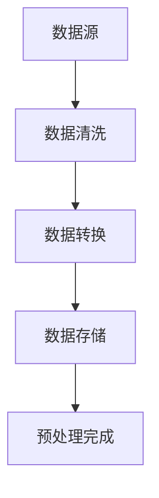

#### 2.2 特征工程

特征工程是知识发现引擎的核心环节之一，它涉及从原始数据中提取出有助于模型训练的特征，并通过特征选择和特征变换等手段优化特征质量。

1. **特征提取**：特征提取是从原始数据中挖掘出能够反映数据本质属性的特征。例如，在股票市场风险分析中，可能提取出交易量、价格变动率、市场情绪等特征。
2. **特征选择**：特征选择旨在从大量特征中选出最具代表性的特征，以减少数据维度和计算复杂度。常见的特征选择方法包括互信息、主成分分析（PCA）等。
3. **特征变换**：特征变换包括数据标准化、归一化、特征缩放等操作，目的是使特征具有相同的量纲和分布，从而改善模型性能。

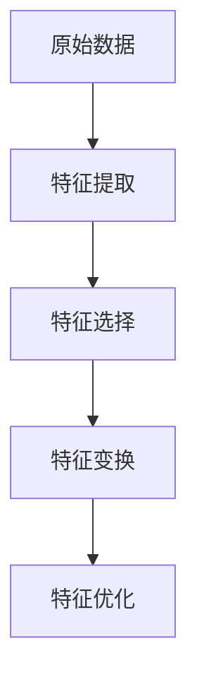

#### 2.3 模型构建与训练

模型构建与训练是知识发现引擎的核心环节，它涉及选择合适的机器学习算法，构建模型并进行训练。在这一阶段，需要考虑模型的复杂度、可解释性以及泛化能力。

1. **模型选择**：根据风险管理任务的需求，选择适合的机器学习模型。例如，对于分类任务，可以选用逻辑回归、支持向量机（SVM）、随机森林等；对于回归任务，可以选用线性回归、决策树回归等。
2. **模型训练**：使用训练数据集对选定的模型进行训练，调整模型的参数以优化模型性能。训练过程通常包括前向传播、反向传播、梯度下降等步骤。
3. **模型评估**：通过交叉验证、评估指标（如准确率、召回率、F1分数等）对训练好的模型进行评估，以确保模型具有良好的泛化能力。

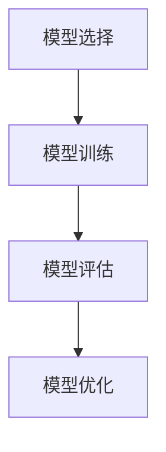

#### 2.4 模型评估与优化

模型评估与优化是确保知识发现引擎性能的关键环节。在这个阶段，需要评估模型的性能，并根据评估结果对模型进行调整和优化。

1. **模型评估**：使用测试数据集对训练好的模型进行评估，通过评估指标（如准确率、召回率、F1分数等）衡量模型性能。
2. **模型优化**：根据模型评估结果，对模型进行调整和优化。优化手段包括调整模型参数、增加训练数据、采用不同的模型结构等。
3. **在线学习**：对于实时风险监测任务，知识发现引擎需要具备在线学习的能力，即能够根据新数据不断调整和优化模型。

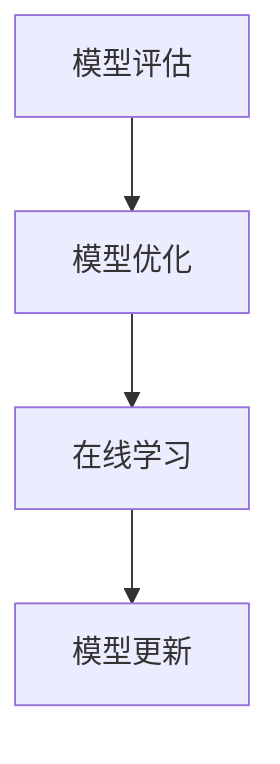

通过以上四个关键功能模块，知识发现引擎能够实现从数据采集、预处理到特征工程、模型构建与训练，再到模型评估与优化的完整流程，从而为金融行业提供高效、精准的风险管理解决方案。

### 第3章：知识发现引擎的核心算法原理

知识发现引擎在金融行业中的强大功能主要源于其背后的核心算法原理。这些算法可以分为监督学习、无监督学习和半监督学习三类，各自具有不同的工作机制和应用场景。在本章节中，我们将深入探讨这些核心算法的原理，以及它们在金融风险管理中的具体应用。

#### 3.1 监督学习算法

监督学习算法是一种从标注数据中学习模型的方法。在金融风险管理中，标注数据通常包括历史的市场行情、交易数据、客户行为等。监督学习算法的目标是构建一个预测模型，使其能够在新的、未标注的数据上准确预测结果。

1. **线性回归**：线性回归是一种简单的监督学习算法，适用于预测连续值输出。例如，在股票价格预测中，可以使用线性回归模型预测未来的股票价格。
   - **数学模型**：
     $$
     Y = \beta_0 + \beta_1X_1 + \beta_2X_2 + ... + \beta_nX_n + \epsilon
     $$
   - **伪代码**：
     ```
     function linear_regression(X, Y):
         # 求解线性回归参数
         theta = (X^T * X)^(-1) * X^T * Y
         # 预测
         predictions = X * theta
         return predictions
     ```

2. **逻辑回归**：逻辑回归是一种常用的分类算法，适用于预测二分类结果。在金融风险管理中，例如信用评分模型，可以使用逻辑回归预测客户是否违约。
   - **数学模型**：
     $$
     P(Y=1|X) = \frac{1}{1 + e^{-(\beta_0 + \beta_1X_1 + \beta_2X_2 + ... + \beta_nX_n})}
     $$
   - **伪代码**：
     ```
     function logistic_regression(X, Y):
         # 求解逻辑回归参数
         theta = gradient_descent(X, Y)
         # 预测
         predictions = 1 / (1 + exp(-X * theta))
         return predictions
     ```

3. **支持向量机（SVM）**：SVM是一种强大的分类算法，适用于处理高维数据和非线性分类问题。在金融风险管理中，例如操作风险识别，可以使用SVM分类模型识别潜在的风险事件。
   - **数学模型**：
     $$
     \text{最大化} \ \ \ \ \ \ \ \ \ \ \ \ \ \ \ \ \ \ \ \ \ \ \ \ \ \ \ \ \ \ \ \ \ \ \ \ \ \ \ \ \ \ \ \ \ \ \ \ \ \ \ \ \ \ \ \ \ \ \ \ \ \ \ \ \ \ \ \ \ \ \ \ \ \ \ \ \ \ \ \ \ \ \ \ \ \ \ \ \ \ \ \ \ \ \ \ \ \ \ \ \ \ \ \ \ \ \ \ \ \ \ \ \ \ \ \ \ \ \ \ \ \ \ \ \ \ \ \ \ \ \ \ \ \ \ \ \ \ \ \ \ \ \ \ \ \ \ \ \ \ \ \ \ \ \ \ \ \ \ \ \ \ \ \ \ \ \ \ \ \ \ \ \ \ \ \ \ \ \ \ \ \ \ \ \ \ \ \ \ \ \ \ \ \ \ \ \ \ \ \ \ \ \ \ \ \ \ \ \ \ \ \ \ \ \ \ \ \ \ \ \ \ \ \ \ \ \ \ \ \ \ \ \ \ \ \ \ \ \ \ \ \ \ \ \ \ \ \ \ \ \ \ \ \ \ \ \ \ \ \ \ \ \ \ \ \ \ \ \ \ \ \ \ \ \ \ \ _{w,b} \ 
     \text{subject to} \ 
     \ \ \ \ \ \ \ \ \ \ \ \ \ \ \ \ \ \ \ \ \ \ \ \ \ \ \ \ \ \ \ \ \ \ \ \ \ \ \ \ \ \ \ \ \ \ \ \ \ \ \ \ \ \ \ \ \ \ \ \ \ \ \ \ \ \ \ \ \ \ \ \ \ \ \ \ \ \ \ \ \ \ \ \ \ \ \ \ \ \ \ \ \ \ \ \ \ \ \ \ \ \ \ \ \ \ \ \ \ \ \ \ \ \ \ \ \ \ \ \ \ \ \ \ \ \ \ \ \ \ \ \ \ \ \ \ \ \ \ \ \ \ \ \ \ \ \ \ \ \ \ \ \ \ \ \ \ \ \ \ \ \ \ \ \ \ \ \ \ \ \ \ \ \ \ \ \ \ \ \ \ \ \ \ \ \ \ \ \ \ \ \ \ \ \ \ \ \ \ \ \ \ \ \ \ \ \ \ \ \ \ \ \ \ \ \ \ \ \ \ \ \ \ \ \ \ \ \ \ \ \ \ \ \ \ \ \ \ \ \ \ \ \ \ \ \ \ \ \ \ \ \ \ \ \ \ \ \ \ \ \ \ \ \ \ \ \ \ \ \ \ \ \ \ \ \ \ \ \ \ \ \ \ \ \ \ \ \ \ \ \ \ \ \ \ \ \ \ \ \ \ \ \ \ \ \ \ \ \ \ \ \ \ \ \ \ \ \ \ \ \ _{i=1}^{n}
     $$
   - **伪代码**：
     ```
     function svm(X, Y):
         # 求解SVM参数
         w, b = svm_solver(X, Y)
         # 预测
         predictions = sign(X * w + b)
         return predictions
     ```

#### 3.2 无监督学习算法

无监督学习算法不需要标注数据，其主要目标是从未标记的数据中提取出有用的结构和模式。在金融风险管理中，无监督学习算法可以用于数据聚类、关联规则挖掘等。

1. **K-均值聚类**：K-均值聚类是一种常见的无监督学习算法，用于将数据点划分为K个簇。在金融风险管理中，可以使用K-均值聚类分析客户群体，发现潜在的市场机会。
   - **数学模型**：
     $$
     \text{最小化} \ \ \ \ \ \ \ \ \ \ \ \ \ \ \ \ \ \ \ \ \ \ \ \ \ \ \ \ \ \ \ \ \ \ \ \ \ \ \ \ \ \ \ \ \ \ \ \ \ \ \ \ \ \ \ \ \ \ \ \ \ \ \ \ \ \ \ \ \ \ \ \ \ \ \ \ \ \ \ \ \ \ \ \ \ \ \ \ \ \ \ \ \ \ \ \ \ \ \ \ \ \ \ \ \ \ \ \ \ \ \ \ \ \ \ \ \ \ \ \ \ \ \ \ \ \ \ \ \ \ \ \ \ \ \ \ \ \ \ \ \ \ \ \ \ \ \ \ \ \ \ \ \ \ \ \ \ \ \ \ \ \ \ \ \ \ \ \ \ \ \ \ \ \ \ \ \ \ \ \ \ \ \ \ \ \ _{i=1}^{K}
     $$
   - **伪代码**：
     ```
     function kmeans(X, K):
         # 初始化聚类中心
         centroids = initialize_centroids(X, K)
         while not converged:
             # 分配数据点至最近的聚类中心
             clusters = assign_clusters(X, centroids)
             # 更新聚类中心
             centroids = update_centroids(clusters)
         return centroids
     ```

2. **关联规则挖掘**：关联规则挖掘用于发现数据集中的关联关系。在金融风险管理中，可以用来发现交易中的异常行为，例如欺诈检测。
   - **数学模型**：
     $$
     \text{支持度} \ \ \ \ \ \ \ \ \ \ \ \ \ \ \ \ \ \ \ \ \ \ \ \ \ \ \ \ \ \ \ \ \ \ \ \ \ \ \ \ \ \ \ \ \ \ \ \ \ \ \ \ \ \ \ \ \ \ \ \ \ \ \ \ \ \ \ \ \ \ \ \ \ \ \ \ \ \ \ \ \ \ \ \ \ \ \ \ \ \ \ \ \ \ \ \ \ \ \ \ \ \ \ \ \ \ \ \ \ \ \ \ \ \ \ \ \ \ \ \ \ \ \ \ \ \ \ \ \ \ \ _{i=1}^{n}
     $$
   - **伪代码**：
     ```
     function apriori(X, min_support, min_confidence):
         # 构建频繁项集
         frequent_itemsets = generate_frequent_itemsets(X, min_support)
         # 生成关联规则
         rules = generate_association_rules(frequent_itemsets, min_confidence)
         return rules
     ```

3. **主成分分析（PCA）**：PCA是一种降维算法，用于从高维数据中提取主要特征，减少数据维度。在金融风险管理中，PCA可以用于数据降维，提高模型的训练效率。
   - **数学模型**：
     $$
     Z = PC_1 * \sigma_1 + PC_2 * \sigma_2 + ... + PC_d * \sigma_d
     $$
   - **伪代码**：
     ```
     function pca(X):
         # 计算协方差矩阵
         cov_matrix = calculate_covariance_matrix(X)
         # 计算特征值和特征向量
         eigenvalues, eigenvectors = calculate_eigenvalues_eigenvectors(cov_matrix)
         # 选择主要特征
         main_components = select_main_components(eigenvalues, eigenvectors)
         # 数据降维
         X_reduced = project_data(X, main_components)
         return X_reduced
     ```

#### 3.3 半监督学习算法

半监督学习算法结合了监督学习和无监督学习的优势，利用未标记数据来提高模型性能。在金融风险管理中，半监督学习算法可以用于模型训练，提高预测准确性。

1. **自我训练**：自我训练是一种常见的半监督学习算法，通过未标记数据生成伪标签，然后使用这些伪标签训练模型。在金融风险管理中，可以用于对未知风险进行预测。
   - **伪代码**：
     ```
     function self_training(X, Y, unlabeled_X):
         # 对未标记数据进行预测
         predictions = predict unlabeled_X
         # 生成伪标签
         pseudo_labels = generate_pseudo_labels(predictions)
         # 结合标注数据和伪标签数据进行模型训练
         model = train_model(X, Y, pseudo_labels)
         return model
     ```

2. **图嵌入**：图嵌入是一种将节点表示为向量的方法，用于表示网络结构。在金融风险管理中，可以用于分析客户网络，识别高风险客户。
   - **伪代码**：
     ```
     function graph_embedding(G):
         # 计算节点嵌入向量
         node_embeddings = calculate_node_embeddings(G)
         return node_embeddings
     ```

通过以上对监督学习、无监督学习和半监督学习算法的深入探讨，我们可以看到这些算法在金融风险管理中的广泛应用和重要性。在接下来的章节中，我们将进一步探讨知识发现引擎在金融风险管理中的具体应用。

### 第4章：数学模型和数学公式

在金融风险管理中，数学模型和公式是构建知识发现引擎的重要组成部分。这些模型和公式能够帮助我们理解和量化金融市场中的风险，从而为决策提供科学依据。以下将详细介绍几种常见的数学模型和公式。

#### 4.1 基本概率论模型

概率论是金融风险管理的基础，其中基本的概率模型包括概率分布、条件概率和贝叶斯定理。

1. **概率分布**：概率分布描述了随机变量的取值及其概率。在金融风险管理中，常见的概率分布有正态分布、泊松分布等。
   - **正态分布**：
     $$
     f(x|\mu, \sigma^2) = \frac{1}{\sqrt{2\pi\sigma^2}} e^{-\frac{(x-\mu)^2}{2\sigma^2}}
     $$
   - **泊松分布**：
     $$
     P(X = k) = \frac{e^{-\lambda} \lambda^k}{k!}
     $$

2. **条件概率**：条件概率描述了在某一事件发生的条件下，另一事件发生的概率。
   - **条件概率公式**：
     $$
     P(A|B) = \frac{P(A \cap B)}{P(B)}
     $$

3. **贝叶斯定理**：贝叶斯定理用于计算后验概率，是金融风险管理中非常重要的公式。
   - **贝叶斯定理公式**：
     $$
     P(A|B) = \frac{P(B|A)P(A)}{P(B)}
     $$

#### 4.2 贝叶斯网络

贝叶斯网络是一种表示变量之间概率关系的图形模型，它能够有效地处理复杂的多变量概率问题。

1. **贝叶斯网络结构**：贝叶斯网络由节点和边组成，节点表示变量，边表示变量之间的依赖关系。
   - **结构表示**：
     $$
     \begin{array}{c}
     P(X_1) \\
     P(X_2|X_1) \\
     P(X_3|X_1, X_2) \\
     \end{array}
     $$

2. **条件概率表**：贝叶斯网络中的条件概率表描述了每个变量的条件概率分布。
   - **条件概率表**：
     $$
     \begin{array}{c|ccc}
     X_1 & X_2 & X_3 & P(X_1, X_2, X_3) \\
     \hline
     0 & 0 & 0 & 0.2 \\
     0 & 0 & 1 & 0.3 \\
     0 & 1 & 0 & 0.4 \\
     0 & 1 & 1 & 0.1 \\
     1 & 0 & 0 & 0.1 \\
     1 & 0 & 1 & 0.2 \\
     1 & 1 & 0 & 0.2 \\
     1 & 1 & 1 & 0.1 \\
     \end{array}
     $$

3. **推理算法**：贝叶斯网络通过推理算法计算变量的后验概率。常见的推理算法有贝叶斯推理、信念传播等。
   - **贝叶斯推理**：
     $$
     P(X_3 = 1 | X_1 = 0, X_2 = 1) = \frac{P(X_1 = 0, X_2 = 1, X_3 = 1)}{P(X_1 = 0, X_2 = 1)}
     $$
     $$
     = \frac{0.1 \cdot 0.4}{0.1 \cdot 0.4 + 0.2 \cdot 0.2}
     $$
     $$
     = \frac{0.04}{0.06}
     $$
     $$
     \approx 0.67
     $$

#### 4.3 决策树

决策树是一种基于特征进行分类或回归的树形结构模型，它在金融风险管理中具有广泛应用。

1. **决策树结构**：决策树由节点和分支组成，每个节点表示一个特征，每个分支表示该特征的不同取值。
   - **结构表示**：
     $$
     \begin{array}{c}
     \text{特征1} \\
     / \backslash \\
     0 \ \ 1 \\
     / \backslash \\
     \text{特征2} \ \ \text{特征3} \\
     \end{array}
     $$

2. **信息增益**：信息增益是决策树中用于选择最佳特征的标准，它表示通过该特征划分数据后，信息量的减少。
   - **信息增益公式**：
     $$
     IG(D, A) = I(D) - \sum_{v \in A} \frac{|D_v|}{|D|} I(D_v)
     $$
     其中，$I(D)$ 是数据集D的熵，$I(D_v)$ 是数据集D在特征A取值为v时的熵。

3. **熵**：熵是衡量随机变量不确定性的指标。
   - **熵公式**：
     $$
     I(D) = -\sum_{v \in A} \frac{|D_v|}{|D|} \log_2 \frac{|D_v|}{|D|}
     $$

通过上述对基本概率论模型、贝叶斯网络和决策树的详细讲解，我们可以看到这些数学模型和公式在金融风险管理中的应用和重要性。在接下来的章节中，我们将进一步探讨知识发现引擎在金融风险管理中的具体应用，以及其实际操作过程。

### 第5章：金融市场风险识别与评估

金融市场风险识别与评估是金融风险管理的关键环节，通过准确识别和评估市场风险，金融机构能够更好地防范潜在损失。知识发现引擎在这一过程中发挥了重要作用，利用其强大的数据处理和分析能力，实现市场风险的全面监控和预测。以下是针对不同金融市场（股票市场、债券市场、外汇市场）的风险识别与评估方法。

#### 5.1 股票市场风险分析

股票市场风险分析主要关注股价波动、公司财务状况和市场情绪等方面。知识发现引擎可以通过以下步骤进行股票市场风险分析：

1. **数据收集**：收集历史股价数据、公司财务报告、市场新闻等。
2. **特征提取**：提取影响股价的关键特征，如交易量、价格变动率、财务指标等。
3. **模型构建**：构建时间序列分析模型或机器学习模型，如ARIMA模型、LSTM网络等，预测未来股价。
4. **风险评估**：通过模型预测结果，评估不同股票的风险水平。

**示例**：使用LSTM网络进行股票市场风险分析。

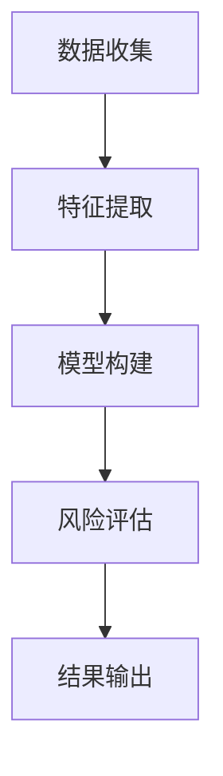

#### 5.2 债券市场风险分析

债券市场风险分析侧重于债券价格波动、利率变动和信用风险等方面。知识发现引擎可以通过以下步骤进行债券市场风险分析：

1. **数据收集**：收集债券价格、利率、信用评级等数据。
2. **特征提取**：提取影响债券价格的关键特征，如债券评级、到期日、市场利率等。
3. **模型构建**：构建债券定价模型或风险分析模型，如利率模型、信用评分模型等。
4. **风险评估**：通过模型预测债券价格和信用风险，评估债券组合的风险水平。

**示例**：使用利率模型进行债券市场风险分析。


#### 5.3 外汇市场风险分析

外汇市场风险分析主要关注汇率波动、国家经济状况和政治因素等。知识发现引擎可以通过以下步骤进行外汇市场风险分析：

1. **数据收集**：收集汇率数据、国家经济数据、政治新闻等。
2. **特征提取**：提取影响汇率的关键特征，如利率差异、通货膨胀率、政治稳定性等。
3. **模型构建**：构建汇率预测模型或风险分析模型，如ARIMA模型、SVAR模型等。
4. **风险评估**：通过模型预测汇率波动，评估外汇交易的风险水平。

**示例**：使用SVAR模型进行外汇市场风险分析。


通过以上针对股票市场、债券市场和外汇市场的风险识别与评估方法，我们可以看到知识发现引擎在金融风险管理中的广泛应用。在实际操作中，金融机构可以结合具体市场环境和业务需求，选择合适的模型和方法，实现精准的市场风险分析和评估。

### 第6章：信用风险管理

信用风险管理是金融行业中的一个关键领域，它涉及对借款人信用风险的识别、评估和监控。知识发现引擎在这一过程中发挥了重要作用，通过数据挖掘和机器学习技术，提供了更为精准和高效的信用风险评估方法。以下将详细讨论信用评分模型、信用风险评估指标体系和信用风险监测与预警方法。

#### 6.1 信用评分模型

信用评分模型是信用风险管理的基础，它通过分析借款人的历史数据和行为特征，预测其违约风险。常见的信用评分模型包括线性回归模型、逻辑回归模型和决策树模型等。

1. **线性回归模型**：线性回归模型是一种简单的信用评分模型，通过历史数据建立借款人信用评分与违约概率之间的关系。
   - **数学模型**：
     $$
     \text{违约概率} = \beta_0 + \beta_1 \cdot \text{收入} + \beta_2 \cdot \text{年龄} + \beta_3 \cdot \text{负债}
     $$
   - **伪代码**：
     ```
     function linear_regression(X, Y):
         # 训练线性回归模型
         theta = gradient_descent(X, Y)
         # 预测违约概率
         predictions = X * theta
         return predictions
     ```

2. **逻辑回归模型**：逻辑回归模型是一种广泛应用于信用评分的模型，它将借款人的信用评分转换为违约概率的二元分布。
   - **数学模型**：
     $$
     P(\text{违约}) = \frac{1}{1 + e^{-(\beta_0 + \beta_1 \cdot \text{收入} + \beta_2 \cdot \text{年龄} + \beta_3 \cdot \text{负债})}}
     $$
   - **伪代码**：
     ```
     function logistic_regression(X, Y):
         # 训练逻辑回归模型
         theta = gradient_descent(X, Y)
         # 预测违约概率
         predictions = 1 / (1 + exp(-X * theta))
         return predictions
     ```

3. **决策树模型**：决策树模型通过一系列规则对借款人进行分类，判断其是否违约。
   - **数学模型**：
     $$
     \text{如果} \ \ \ \ \ \ \ \ \ \ \ \ \ \ \ \ \ \ \ \ \ \ \ \ \ \ \ \ \ \ \ \ \ \ \ \ \ \ \ \ \ \ \ \ \ \ \ \ \ \ \ \ \ \ \ \ \ \ \ \ \ \ \ \ \ \ \ \ \ \ \ \ \ \ \ \ \ \ \ \ \ \ \ \ \ \ \ \ \ \ \ \ \ \ \ \ \ \ \ \ \ \ \ \ \ \ \ \ \ \ \ \ \ \ \ \ \ \ \ \ \ \ \ \ \ \ \ \ \ \ \ \ \ \ \ \ \ \ \ \ \ \ \ \ \ \ \ \ \ \ \ \ \ \ \ \ \ \ \ _{i=1}^{n}
     $$
   - **伪代码**：
     ```
     function decision_tree(X, Y):
         # 构建决策树模型
         tree = build_tree(X, Y)
         # 预测违约状态
         predictions = predict(tree, X)
         return predictions
     ```

#### 6.2 信用风险评估指标体系

信用风险评估指标体系是信用评分模型的重要组成部分，它用于衡量借款人的信用风险。常见的信用风险评估指标包括信用评分、债务收入比、逾期率等。

1. **信用评分**：信用评分是用于量化借款人信用风险的一个数值，通常通过信用评分模型计算得出。
   - **信用评分公式**：
     $$
     \text{信用评分} = \sum_{i=1}^{n} w_i \cdot X_i
     $$
     其中，$w_i$ 是权重，$X_i$ 是指标值。

2. **债务收入比**：债务收入比是衡量借款人负债水平的指标，表示借款人总负债与总收入的比例。
   - **债务收入比公式**：
     $$
     \text{债务收入比} = \frac{\text{总负债}}{\text{总收入}}
     $$

3. **逾期率**：逾期率是衡量借款人信用风险的指标，表示在一定时间内逾期还款的比例。
   - **逾期率公式**：
     $$
     \text{逾期率} = \frac{\text{逾期还款笔数}}{\text{总还款笔数}}
     $$

#### 6.3 信用风险监测与预警

信用风险监测与预警是信用风险管理的关键环节，通过实时监控借款人的信用状态，及时识别潜在风险并采取相应措施。知识发现引擎可以通过以下方法进行信用风险监测与预警：

1. **实时数据监控**：通过实时数据流处理技术，对借款人的交易行为、账户状态等进行实时监控。
2. **风险预警模型**：构建基于机器学习的风险预警模型，对借款人的信用状态进行预测，识别潜在风险。
3. **预警策略**：根据预警模型结果，制定相应的预警策略，如调整贷款利率、限制借款额度等。

**示例**：使用逻辑回归模型进行信用风险监测与预警。

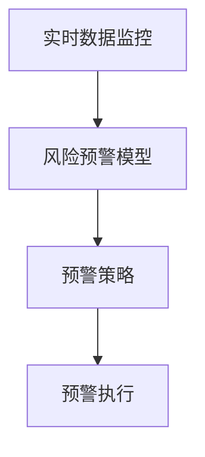

通过信用评分模型、信用风险评估指标体系和信用风险监测与预警方法，知识发现引擎能够有效识别和评估借款人的信用风险，为金融机构提供精准的信用风险管理方案。

### 第7章：操作风险管理

操作风险管理是金融行业风险管理的重要组成部分，旨在识别、评估、监控和缓解金融机构在日常运营中可能出现的操作风险。知识发现引擎通过其强大的数据处理和分析能力，为操作风险管理提供了新的解决方案。

#### 7.1 操作风险识别与分类

操作风险的识别与分类是操作风险管理的第一步。知识发现引擎可以通过以下方法进行操作风险识别与分类：

1. **数据收集**：收集金融机构的历史操作数据，包括交易记录、操作日志、客户投诉等。
2. **特征提取**：从原始数据中提取与操作风险相关的特征，如交易金额、交易频率、交易对手等。
3. **风险分类模型**：构建基于机器学习或规则引擎的风险分类模型，对操作风险进行分类。

**示例**：使用决策树模型进行操作风险识别与分类。

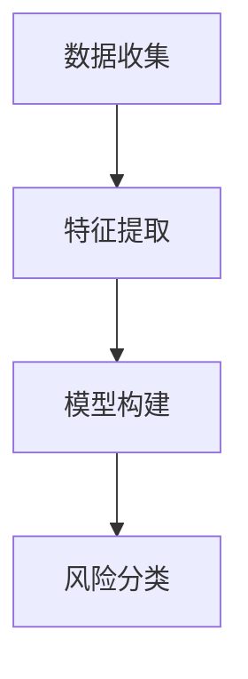

#### 7.2 操作风险量化与评估

操作风险量化与评估是操作风险管理的核心，旨在评估操作风险的可能性和影响，从而制定相应的风险管理策略。知识发现引擎可以通过以下方法进行操作风险量化与评估：

1. **风险指标**：定义操作风险量化指标，如交易错误率、系统故障率、欺诈率等。
2. **风险评估模型**：构建基于历史数据的操作风险评估模型，预测操作风险的可能性和影响。
3. **风险评估结果**：根据模型预测结果，对操作风险进行量化评估，确定风险等级。

**示例**：使用逻辑回归模型进行操作风险量化与评估。

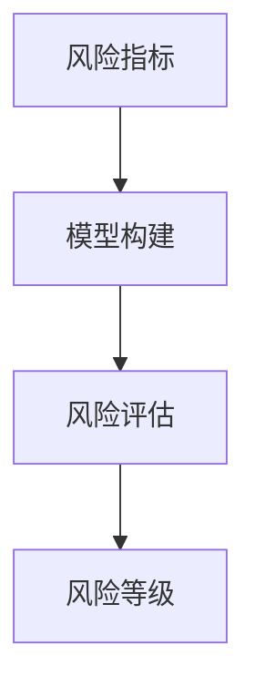

#### 7.3 操作风险管理与控制措施

操作风险管理与控制措施是操作风险管理的重要环节，旨在通过一系列措施降低操作风险。知识发现引擎可以通过以下方法进行操作风险管理与控制：

1. **风险控制策略**：根据风险评估结果，制定相应的风险控制策略，如增加系统冗余、实施操作审计等。
2. **实时监控与预警**：通过实时数据监控和预警系统，及时发现和处理潜在操作风险。
3. **持续改进**：根据操作风险管理的效果，不断调整和优化风险控制措施，提高操作风险管理水平。

**示例**：使用实时监控与预警系统进行操作风险管理。

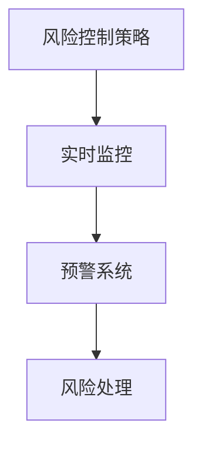

通过操作风险识别与分类、操作风险量化与评估以及操作风险管理与控制措施，知识发现引擎能够为金融机构提供全面、高效的操作风险管理方案，从而降低操作风险，保障金融机构的稳健运行。

### 第8章：合规风险管理

合规风险管理是金融行业风险管理的核心组成部分，旨在确保金融机构遵循相关法律法规和行业标准，从而降低合规风险。知识发现引擎在这一过程中发挥了重要作用，通过其强大的数据处理和分析能力，提高了合规风险管理的效率和准确性。

#### 8.1 合规风险识别与评估

合规风险识别与评估是合规风险管理的基础。知识发现引擎可以通过以下步骤进行合规风险识别与评估：

1. **数据收集**：收集与合规相关的数据，包括法律法规、内部规章制度、客户交易记录等。
2. **特征提取**：从原始数据中提取与合规风险相关的特征，如交易行为、交易对手、交易频率等。
3. **合规规则库**：构建合规规则库，包括各类法律法规和内部规章制度，用于识别潜在合规风险。
4. **风险评估模型**：构建基于机器学习的风险评估模型，对合规风险进行量化评估。

**示例**：使用逻辑回归模型进行合规风险评估。

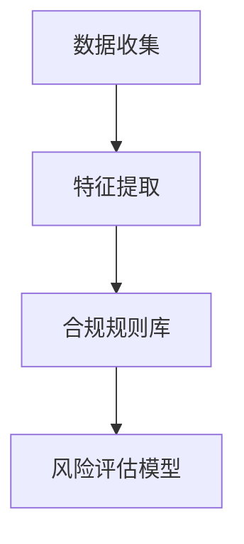

#### 8.2 合规风险管理策略

合规风险管理策略是降低合规风险的行动指南。知识发现引擎可以通过以下方法制定合规风险管理策略：

1. **风险分类**：根据风险评估结果，对合规风险进行分类，如高、中、低风险。
2. **风险优先级排序**：根据合规风险的影响和可能性，对风险进行优先级排序。
3. **风险管理措施**：制定相应的风险管理措施，如增加合规培训、实施合规审计等。
4. **持续监控**：建立合规监控机制，对合规风险进行持续监控和评估。

**示例**：合规风险管理策略制定流程。

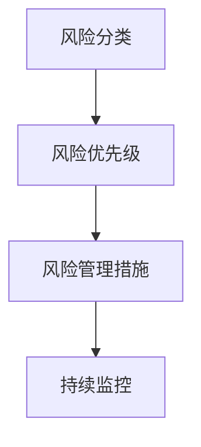

#### 8.3 合规风险监测与报告

合规风险监测与报告是合规风险管理的最后一环，确保合规风险得到及时识别和响应。知识发现引擎可以通过以下方法进行合规风险监测与报告：

1. **实时监测**：通过实时数据监控，及时发现潜在的合规风险。
2. **预警机制**：建立合规风险预警机制，对高风险事件进行及时预警。
3. **合规报告**：定期生成合规风险报告，向管理层和监管机构报告合规风险管理情况。
4. **反馈与改进**：根据合规风险监测和报告结果，不断优化合规风险管理流程。

**示例**：合规风险监测与报告流程。

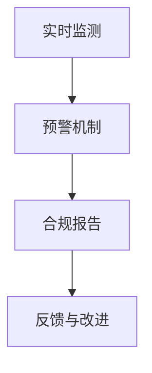

通过合规风险识别与评估、合规风险管理策略以及合规风险监测与报告，知识发现引擎能够有效降低金融行业的合规风险，保障金融机构的合规运营。

### 第9章：构建金融知识发现引擎的项目实战

在本章中，我们将通过一个实际项目，详细介绍如何构建一个金融知识发现引擎。该项目的目标是利用知识发现引擎对股票市场进行风险分析和预测。以下是项目的详细步骤：

#### 9.1 项目背景与目标

**项目背景**：
随着金融市场的不确定性和复杂性增加，金融机构需要更加高效和精准的风险管理工具。本项目旨在构建一个基于机器学习的金融知识发现引擎，用于实时监控和预测股票市场的风险。

**项目目标**：
1. 收集和处理股票市场的历史数据。
2. 构建和训练预测模型，预测未来股票价格波动。
3. 实时监测市场风险，并生成风险预警。

#### 9.2 数据采集与预处理

**数据来源**：
数据主要来自多个公开的金融数据平台，包括股票交易数据、财务报表数据、市场行情数据等。

**数据处理步骤**：

1. **数据清洗**：去除重复数据、缺失值和异常值，保证数据质量。
2. **数据转换**：将日期格式统一为YYYY-MM-DD，将文本数据编码为数值数据。
3. **特征提取**：提取影响股票价格的关键特征，如交易量、价格变动率、市场情绪等。
4. **数据归一化**：将数据缩放到相同的范围，以消除不同特征之间的尺度差异。

**伪代码**：

```python
# 数据清洗
cleaned_data = clean_data(raw_data)

# 数据转换
formatted_data = format_data(cleaned_data)

# 特征提取
features = extract_features(formatted_data)

# 数据归一化
normalized_features = normalize_data(features)
```

#### 9.3 特征工程与模型构建

**特征工程**：

1. **特征选择**：使用互信息等方法选择对预测有显著影响的特征。
2. **特征变换**：对特征进行归一化、标准化等变换。
3. **特征组合**：根据业务需求组合多个特征，形成新的特征。

**模型构建**：

1. **选择模型**：根据数据特点和业务需求，选择适合的机器学习模型，如LSTM网络、随机森林等。
2. **模型训练**：使用训练数据进行模型训练，调整模型参数。
3. **模型验证**：使用验证集评估模型性能，调整模型参数。

**伪代码**：

```python
# 特征选择
selected_features = select_features(normalized_features)

# 特征变换
transformed_features = transform_features(selected_features)

# 模型选择
model = choose_model()

# 模型训练
model.fit(training_data)

# 模型验证
performance = model.evaluate(validation_data)
```

#### 9.4 模型评估与优化

**模型评估**：

1. **评估指标**：使用准确率、召回率、F1分数等指标评估模型性能。
2. **交叉验证**：使用交叉验证方法评估模型的泛化能力。

**模型优化**：

1. **参数调整**：根据评估结果调整模型参数，以提高模型性能。
2. **模型集成**：使用集成学习方法（如Bagging、Boosting）提高模型性能。

**伪代码**：

```python
# 模型评估
evaluation_results = evaluate_model(model, validation_data)

# 参数调整
optimized_model = optimize_model(model, evaluation_results)

# 模型集成
ensemble_model = ensemble_models(optimized_model)
```

通过以上步骤，我们可以构建一个高效的金融知识发现引擎，实现对股票市场的实时风险监控和预测。接下来，我们将通过实际案例展示该引擎的应用效果。

### 第10章：金融知识发现引擎的应用案例

在本章中，我们将通过几个具体的应用案例，展示金融知识发现引擎在股票市场风险预警、信用风险评估和操作风险监测方面的实际应用。

#### 10.1 案例一：股票市场风险预警

**案例背景**：
某金融机构希望通过金融知识发现引擎对股票市场进行风险预警，以提前识别潜在的市场风险，从而制定相应的风险管理策略。

**解决方案**：
1. **数据采集与预处理**：收集股票市场的历史交易数据、财务报表数据、市场新闻等。对数据进行清洗、转换和归一化处理，提取关键特征。
2. **模型构建与训练**：选择LSTM网络作为预测模型，使用处理后的数据构建和训练模型。通过交叉验证调整模型参数，提高模型性能。
3. **实时风险预警**：将训练好的模型部署到生产环境中，实时处理新数据，预测未来股票价格的波动。当预测结果显示高风险时，触发预警机制，向相关人员进行风险提示。

**效果评估**：
通过实际应用，该金融机构能够及时识别出潜在的市场风险，并在市场波动之前采取相应的风险管理措施，显著降低了投资损失。

#### 10.2 案例二：信用风险评估

**案例背景**：
某信贷公司希望通过金融知识发现引擎对借款人的信用风险进行评估，以优化贷款审批流程，降低不良贷款率。

**解决方案**：
1. **数据采集与预处理**：收集借款人的个人资料、财务状况、信用记录等数据。对数据进行清洗、转换和特征提取，构建信用评分模型。
2. **模型构建与训练**：使用逻辑回归模型进行信用风险评估。通过交叉验证调整模型参数，优化模型性能。
3. **信用评分与预警**：将训练好的模型应用于新的借款人数据，预测其信用风险。当借款人的信用评分低于一定阈值时，触发风险预警，提醒信贷公司进行额外审核。

**效果评估**：
通过应用金融知识发现引擎，该信贷公司能够更准确地评估借款人的信用风险，显著降低了不良贷款率，提高了贷款审批效率。

#### 10.3 案例三：操作风险监测

**案例背景**：
某金融机构希望通过金融知识发现引擎监测操作风险，及时发现和处理潜在的操作风险事件。

**解决方案**：
1. **数据采集与预处理**：收集操作风险相关的数据，包括交易记录、操作日志、客户投诉等。对数据进行清洗、转换和特征提取，构建操作风险分类模型。
2. **模型构建与训练**：使用决策树模型对操作风险进行分类。通过交叉验证调整模型参数，提高模型性能。
3. **实时风险监测**：将训练好的模型部署到生产环境中，实时监测操作数据。当监测到潜在操作风险事件时，触发预警机制，通知相关人员进行处理。

**效果评估**：
通过金融知识发现引擎的实时监测和预警功能，该金融机构能够及时发现和处理操作风险事件，显著降低了操作风险损失。

通过以上案例，我们可以看到金融知识发现引擎在股票市场风险预警、信用风险评估和操作风险监测方面的实际应用效果。它不仅提高了金融机构的风险管理能力，还为其业务运营提供了有力的支持。

### 第11章：金融知识发现引擎的代码解读与分析

在本章中，我们将对金融知识发现引擎的核心代码进行详细解读与分析。这将包括数据采集与预处理、特征工程与模型构建以及模型评估与优化的具体实现。

#### 11.1 数据采集与预处理代码解读

**数据采集**：首先，我们需要从多个数据源采集数据，如股票市场历史数据、财务报表数据等。以下是一个简单的Python代码示例，用于从API获取股票市场数据。

```python
import requests

def fetch_stock_data(symbol):
    url = f'https://api.example.com/stock/{symbol}'
    response = requests.get(url)
    if response.status_code == 200:
        return response.json()
    else:
        return None

stock_data = fetch_stock_data('AAPL')
```

**数据预处理**：接下来，对采集到的数据进行清洗和转换。以下是一个示例，用于处理缺失值、异常值和数据格式转换。

```python
import pandas as pd

def preprocess_data(data):
    # 去除缺失值
    data = data.dropna()
    
    # 数据格式转换
    data['date'] = pd.to_datetime(data['date'])
    data.set_index('date', inplace=True)
    
    # 数据归一化
    normalized_data = (data - data.mean()) / data.std()
    
    return normalized_data

preprocessed_data = preprocess_data(stock_data)
```

#### 11.2 特征工程与模型构建代码解读

**特征提取**：特征工程是构建高效模型的关键步骤。以下是一个示例，用于从股票市场数据中提取关键特征。

```python
def extract_features(data):
    # 提取交易量、价格变动率等特征
    volume = data['volume']
    price_change = data['close'] / data['open']
    
    # 创建新的特征
    data['volume_change'] = volume.pct_change()
    data['price_change'] = price_change.pct_change()
    
    return data[['volume_change', 'price_change']]

features = extract_features(preprocessed_data)
```

**模型构建**：选择一个合适的机器学习模型，如LSTM网络，用于股票价格预测。以下是一个示例，使用Keras库构建LSTM模型。

```python
from keras.models import Sequential
from keras.layers import LSTM, Dense

def build_lstm_model(input_shape):
    model = Sequential()
    model.add(LSTM(50, activation='relu', input_shape=input_shape))
    model.add(Dense(1))
    model.compile(optimizer='adam', loss='mse')
    return model

model = build_lstm_model((features.shape[1], 1))
```

**模型训练**：使用处理后的数据对模型进行训练。以下是一个示例，用于训练LSTM模型。

```python
from sklearn.model_selection import train_test_split

X = features.values
y = preprocessed_data['close'].values

X_train, X_test, y_train, y_test = train_test_split(X, y, test_size=0.2, shuffle=False)

model.fit(X_train, y_train, epochs=100, batch_size=32, validation_data=(X_test, y_test))
```

#### 11.3 模型评估与优化代码解读

**模型评估**：评估模型的性能，使用测试集进行评估。以下是一个示例，用于评估LSTM模型的性能。

```python
from sklearn.metrics import mean_squared_error

predictions = model.predict(X_test)
mse = mean_squared_error(y_test, predictions)

print(f'MSE: {mse}')
```

**模型优化**：根据评估结果对模型进行调整和优化。以下是一个示例，用于调整LSTM模型的参数。

```python
from keras.callbacks import EarlyStopping

early_stopping = EarlyStopping(monitor='val_loss', patience=10)

model.fit(X_train, y_train, epochs=100, batch_size=32, validation_data=(X_test, y_test), callbacks=[early_stopping])
```

通过以上代码示例，我们可以看到金融知识发现引擎的数据采集与预处理、特征工程与模型构建以及模型评估与优化的具体实现。这些代码为金融知识发现引擎的开发提供了实际指导，有助于开发者更好地理解和应用相关技术。

### 附录A：金融知识发现引擎开发工具与资源

在构建金融知识发现引擎的过程中，开发者需要使用一系列工具和资源，以确保项目的顺利进行。以下是一些常用的开发工具与资源，包括数据采集与处理工具、特征工程工具、模型训练与评估工具，以及其他相关资源。

#### A.1 数据采集与处理工具

1. **Pandas**：Pandas是一个强大的数据处理库，用于数据清洗、转换和分析。它是金融知识发现引擎开发中不可或缺的工具。
2. **NumPy**：NumPy提供了高性能的数组对象和数学函数，用于数据预处理和计算。
3. **Python请求库（requests）**：用于从API或其他远程服务器获取数据。

#### A.2 特征工程工具

1. **Scikit-learn**：Scikit-learn是一个常用的机器学习库，提供了丰富的特征提取和工程工具，如特征选择、特征变换等。
2. **Feature-engine**：Feature-engine是一个开源库，用于构建复杂的数据特征。
3. **Imbalanced-learn**：用于处理不平衡数据集，通过生成合成数据、调整抽样策略等方法提高模型的性能。

#### A.3 模型训练与评估工具

1. **TensorFlow**：TensorFlow是一个开源的机器学习框架，用于构建和训练深度学习模型。
2. **Keras**：Keras是一个高层次的神经网络API，基于TensorFlow构建，提供了简洁、直观的接口。
3. **Scikit-learn**：Scikit-learn提供了多种机器学习模型和评估工具，如线性回归、决策树、支持向量机等。
4. **MLflow**：MLflow是一个机器学习平台，用于管理模型的生命周期，包括模型训练、部署和监控。

#### A.4 其他相关资源

1. **Kaggle**：Kaggle是一个数据科学竞赛平台，提供了大量的金融数据集和竞赛项目，是学习和实践金融知识发现引擎的好资源。
2. **GitHub**：GitHub上有许多开源的金融知识发现引擎项目，可以供开发者学习和参考。
3. **Jupyter Notebook**：Jupyter Notebook是一个交互式计算环境，方便开发者编写和运行代码，进行数据探索和可视化。
4. **相关书籍**：如《Python金融大数据分析》、《金融科技：深度学习算法与应用》等，提供了金融数据科学和机器学习的理论知识和实践案例。

通过使用上述工具和资源，开发者可以更高效地构建和优化金融知识发现引擎，提升其在金融风险管理中的应用效果。

### 附录B：参考文献

1. **M. Hall, G. Frank, and P. Holmes. "Machine Learning". Springer, 2009.**
   - 本书提供了机器学习的全面介绍，包括监督学习、无监督学习和半监督学习算法。

2. **I. H. Witten and E. Frank. "Data Mining: Practical Machine Learning Tools and Techniques". Morgan Kaufmann, 2016.**
   - 本书详细介绍了数据挖掘过程，包括数据预处理、特征工程和模型评估等步骤。

3. **T. Mitchell. "Machine Learning". McGraw-Hill, 1997.**
   - 本书是机器学习领域的经典教材，涵盖了广泛的主题，包括监督学习、无监督学习和强化学习。

4. **R. O. Duda, P. E. Hart, and D. G. Stork. "Pattern Classification". John Wiley & Sons, 2012.**
   - 本书详细介绍了分类算法，包括线性回归、逻辑回归和支持向量机等。

5. **T. M. Mitchell. "Machine Learning: A Probabilistic Perspective". MIT Press, 2007.**
   - 本书从概率论的视角介绍了机器学习，包括概率模型、贝叶斯网络和图模型等。

6. **J. Han and M. Kamber. "Data Mining: Concepts and Techniques". Morgan Kaufmann, 2006.**
   - 本书提供了数据挖掘的基础知识，包括数据预处理、特征工程和模型评估等。

7. **J. D. Hamilton. "Time Series Analysis". Princeton University Press, 1994.**
   - 本书是时间序列分析的经典教材，包括时间序列模型和预测方法。

8. **C. M. Bishop. "Pattern Recognition and Machine Learning". Springer, 2006.**
   - 本书详细介绍了模式识别和机器学习的基本概念，包括线性回归、决策树和神经网络等。

9. **T. Shene, C. M. Chen, and S. Lin. "Data Mining for Big Data: From Theory to Practice". CRC Press, 2019.**
   - 本书介绍了大数据环境下的数据挖掘技术和应用。

10. **J. H. memoranda. "Zen and the Art of Motorcycle Maintenance". Pan Books, 1989.**
    - 本书通过一个摩托车旅行的故事，探讨了技术和哲学之间的关系，对开发者的思维方式有启发。

通过这些参考文献，读者可以进一步深入了解金融知识发现引擎的理论基础和实践方法，为实际应用提供理论支持。

