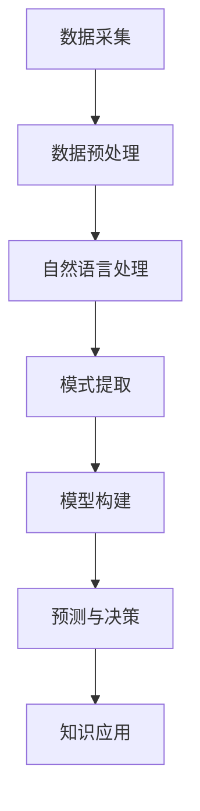

                 

# 知识发现引擎：教育领域的智慧伙伴

> **关键词：** 知识发现引擎、教育分析、自然语言处理、机器学习、智慧教育平台

> **摘要：** 本文将深入探讨知识发现引擎在教育领域的应用，从基本概念、技术基础到具体应用，全面解析知识发现引擎如何成为教育领域的智慧伙伴，推动教育信息化发展。文章结构包括引言、知识发现引擎概述、技术基础、教育领域应用、未来发展趋势与应用挑战，以及附录等部分。

## 目录大纲设计：知识发现引擎：教育领域的智慧伙伴

### 第一部分：引言

#### 第1章：知识发现引擎概述
1.1.1 知识发现引擎的定义与作用
1.1.2 知识发现引擎在教育领域的应用前景
1.1.3 知识发现引擎的基本架构和工作原理

#### 第2章：知识发现引擎的技术基础
2.1.1 数据挖掘技术概述
2.1.2 自然语言处理技术
2.1.3 机器学习与深度学习技术

### 第二部分：知识发现引擎在教育领域的应用

#### 第3章：知识发现引擎在教育分析中的应用
3.1.1 学生行为分析
3.1.2 教学资源推荐

#### 第4章：知识发现引擎在课程优化中的应用
4.1.1 课程需求分析
4.1.2 课程内容优化

#### 第5章：知识发现引擎在教学决策支持中的应用
5.1.1 教学评估
5.1.2 教学决策支持

#### 第6章：知识发现引擎在智慧教育平台中的应用
6.1.1 智慧教育平台概述
6.1.2 知识发现引擎在智慧教育平台中的应用案例

#### 第7章：知识发现引擎的未来发展与应用挑战
7.1.1 知识发现引擎的技术发展趋势
7.1.2 知识发现引擎在教育领域的应用挑战

### 第三部分：附录

#### 附录A：知识发现引擎相关工具与技术
#### 附录B：参考文献与资源

## 第一部分：引言

### 第1章：知识发现引擎概述

### 1.1.1 知识发现引擎的定义与作用

**知识发现引擎（Knowledge Discovery Engine，简称KDE）** 是一种利用先进的数据挖掘技术和自然语言处理技术，从大量数据中自动提取出具有潜在价值知识和规律的系统。知识发现引擎在教育领域的应用，可以帮助教育工作者更好地理解学生的学习行为，优化教学资源，提升教育质量。

知识发现引擎在教育中的作用主要体现在以下几个方面：

1. **教育分析：** 通过分析学生的学习行为和教学过程，发现其中的潜在规律和趋势，为教育决策提供数据支持。
2. **教学资源推荐：** 根据学生的学习兴趣和需求，推荐适合的教学资源，提高学习效率。
3. **课程优化：** 通过对课程内容和教学方法的优化，提高课程的教学效果。
4. **教学决策支持：** 为教育管理者提供科学的决策依据，支持教育改革和创新发展。

### 1.1.2 知识发现引擎在教育领域的应用前景

随着信息技术的不断发展，教育领域的数据量呈爆炸式增长，这为知识发现引擎的应用提供了丰富的数据资源。知识发现引擎在教育领域的应用前景非常广阔，主要体现在以下几个方面：

1. **个性化学习：** 知识发现引擎可以根据学生的学习习惯、兴趣爱好和学习进度，为其推荐个性化的学习资源和课程。
2. **教育均衡发展：** 知识发现引擎可以帮助教育管理者了解各地区、学校、教师和学生的教育状况，从而实现教育资源的合理配置，促进教育均衡发展。
3. **教育科研：** 知识发现引擎可以处理大量的教育数据，为教育科研提供有力的支持，推动教育理论的创新和发展。
4. **教育管理：** 知识发现引擎可以帮助教育管理者进行科学的管理决策，提高教育管理的效率和水平。

### 1.1.3 知识发现引擎的基本架构和工作原理

知识发现引擎的基本架构主要包括数据采集模块、数据处理模块、知识提取模块和知识应用模块。

1. **数据采集模块：** 负责收集各种类型的教育数据，包括学生学习行为数据、教学资源数据、课程数据等。
2. **数据处理模块：** 负责对采集到的原始数据进行清洗、转换和整合，为知识提取模块提供高质量的数据。
3. **知识提取模块：** 利用数据挖掘技术和自然语言处理技术，从处理后的数据中提取出具有潜在价值的知识和规律。
4. **知识应用模块：** 负责将提取出的知识应用到实际的教育场景中，如个性化学习、教学资源推荐、课程优化等。

知识发现引擎的工作原理可以概括为以下几个步骤：

1. **数据采集：** 从各种数据源（如数据库、文件、传感器等）中收集教育数据。
2. **数据预处理：** 对采集到的原始数据进行清洗、转换和整合，消除噪声和异常值，提高数据质量。
3. **数据挖掘：** 利用数据挖掘技术，对预处理后的数据进行模式发现、关联规则挖掘、聚类分析等，提取出潜在的知识。
4. **知识整合：** 将提取出的知识进行整合和关联，形成完整的知识体系。
5. **知识应用：** 将整合后的知识应用到实际的教育场景中，为教育工作者提供决策支持。

### 1.1.4 知识发现引擎在教育领域的实际应用案例

以下是一些知识发现引擎在教育领域的实际应用案例：

1. **个性化学习推荐系统：** 通过分析学生的学习行为和成绩，为不同学生推荐适合的学习资源和课程。
2. **学生学习行为分析系统：** 通过监控学生的学习行为，分析学生的学习习惯和学习效果，为教育管理者提供数据支持。
3. **课程优化系统：** 通过分析课程内容和学生的学习反馈，对课程进行优化和调整，提高课程的教学效果。
4. **教学资源推荐系统：** 通过分析教师的教学资源和学生的学习需求，为教师和学生推荐适合的教学资源。

### 1.1.5 知识发现引擎在教育领域面临的挑战

尽管知识发现引擎在教育领域具有广泛的应用前景，但在实际应用过程中也面临着一些挑战，主要包括以下几个方面：

1. **数据隐私与伦理问题：** 教育数据的敏感性较高，如何在保障数据隐私的前提下进行数据挖掘和应用是一个重要问题。
2. **教育资源不平衡问题：** 在一些贫困地区，教育资源匮乏，如何利用知识发现引擎实现教育资源的合理分配和优化是一个挑战。
3. **教育模式创新：** 知识发现引擎的应用需要与教育模式的创新相结合，如何实现二者的有机结合是一个挑战。
4. **技术成熟度问题：** 一些先进的技术，如深度学习和自然语言处理，还需要进一步成熟，才能更好地应用于教育领域。

### 1.1.6 知识发现引擎在教育领域的意义

知识发现引擎在教育领域的应用，不仅可以提高教育质量，还可以促进教育公平和教育创新。具体来说，知识发现引擎在教育领域的意义主要体现在以下几个方面：

1. **提高教育质量：** 知识发现引擎可以帮助教育工作者更好地了解学生的学习情况，从而提供更有针对性的教育服务，提高教育质量。
2. **促进教育公平：** 知识发现引擎可以实现教育资源的合理配置，使更多学生享受到优质教育资源，促进教育公平。
3. **推动教育创新：** 知识发现引擎可以推动教育模式的创新，为教育工作者提供新的教学方法和工具，促进教育改革和发展。

## 第2章：知识发现引擎的技术基础

### 2.1.1 数据挖掘技术概述

**数据挖掘（Data Mining）** 是指从大量数据中自动发现规律、趋势和模式的过程。数据挖掘技术在知识发现引擎中扮演着重要角色，其主要任务包括模式发现、关联规则挖掘、聚类分析和分类等。

1. **模式发现：** 从大量数据中识别出具有统计意义的模式，如频繁项集、异常值、趋势等。
2. **关联规则挖掘：** 发现数据之间的关联关系，如购物篮分析、因果分析等。
3. **聚类分析：** 将数据分为多个类别，使同一类别内的数据尽可能相似，不同类别间的数据尽可能不同。
4. **分类：** 根据已有的数据，建立一个分类模型，对新数据进行分类。

数据挖掘的基本流程包括以下步骤：

1. **数据预处理：** 清洗、转换和整合原始数据，为后续的数据挖掘任务做准备。
2. **数据挖掘算法选择：** 根据具体任务需求选择合适的数据挖掘算法。
3. **模型构建：** 利用数据挖掘算法，从数据中提取出模式和规律。
4. **模型评估：** 对挖掘出的模型进行评估，判断其有效性和准确性。
5. **模型应用：** 将挖掘出的模型应用到实际问题中，解决实际问题。

### 2.1.2 自然语言处理技术

**自然语言处理（Natural Language Processing，简称NLP）** 是人工智能领域的一个重要分支，旨在使计算机能够理解、生成和处理人类自然语言。NLP技术在知识发现引擎中主要用于处理文本数据，提取文本中的有用信息。

1. **分词：** 将文本分割成词汇单元，如单词、短语等。
2. **词性标注：** 对文本中的每个词进行词性标注，如名词、动词、形容词等。
3. **命名实体识别：** 识别文本中的命名实体，如人名、地名、组织机构名等。
4. **句法分析：** 分析文本的语法结构，如句子成分、句型等。
5. **语义分析：** 理解文本中的语义含义，如词义消歧、情感分析等。

NLP技术在知识发现引擎中的应用主要包括：

1. **文本分类：** 根据文本的内容和特征，将其归入不同的类别。
2. **文本聚类：** 将具有相似内容的文本归为同一类别。
3. **主题建模：** 从大量文本中提取出主题，分析文本的主题分布和关系。
4. **情感分析：** 判断文本的情感倾向，如正面、负面等。

### 2.1.3 机器学习与深度学习技术

**机器学习（Machine Learning，简称ML）** 是一种通过算法从数据中学习规律和模式，从而进行预测和决策的技术。机器学习技术在知识发现引擎中用于构建模型，从数据中提取知识和规律。

1. **监督学习：** 通过已标记的数据进行训练，构建分类或回归模型。
2. **无监督学习：** 不需要已标记的数据，通过算法从数据中发现结构和模式。
3. **半监督学习：** 结合监督学习和无监督学习，利用少量标记数据和大量未标记数据。
4. **强化学习：** 通过与环境交互，学习最优策略。

机器学习技术包括以下主要算法：

1. **线性回归：** 通过线性模型预测连续值。
2. **逻辑回归：** 通过逻辑函数预测分类结果。
3. **决策树：** 通过树形结构进行分类和回归。
4. **支持向量机：** 通过最大间隔划分数据。
5. **神经网络：** 通过多层神经元网络进行非线性预测。

**深度学习（Deep Learning，简称DL）** 是机器学习的一个子领域，主要使用多层神经网络进行模型训练和预测。深度学习技术在知识发现引擎中广泛应用于图像识别、语音识别、自然语言处理等领域。

1. **卷积神经网络（CNN）：** 适用于图像处理任务，如图像分类、目标检测等。
2. **循环神经网络（RNN）：** 适用于序列数据，如时间序列分析、自然语言处理等。
3. **生成对抗网络（GAN）：** 适用于图像生成、风格迁移等任务。
4. **变分自编码器（VAE）：** 适用于概率分布的估计和学习。

### 2.1.4 知识发现引擎的技术基础总结

知识发现引擎的技术基础主要包括数据挖掘技术、自然语言处理技术和机器学习与深度学习技术。这些技术相互关联，共同作用于知识发现的过程。

1. **数据挖掘技术：** 负责从大量数据中提取出有价值的模式和规律，为知识发现提供基础。
2. **自然语言处理技术：** 负责处理文本数据，提取文本中的有用信息，为知识发现提供支持。
3. **机器学习与深度学习技术：** 负责构建模型，从数据中学习规律和模式，为知识发现提供算法支持。

### 2.1.5 技术关联与流程

知识发现引擎的技术基础可以看作是一个相互关联的流程。首先，数据挖掘技术从原始数据中提取出有价值的模式和规律。然后，自然语言处理技术对文本数据进行处理，提取出文本中的有用信息。最后，机器学习与深度学习技术利用提取出的模式和规律，构建模型进行预测和决策。

下面是一个简单的Mermaid流程图，描述了知识发现引擎的技术基础和流程：

## 第二部分：知识发现引擎在教育领域的应用

### 第3章：知识发现引擎在教育分析中的应用

知识发现引擎在教育分析中的应用，主要是通过分析学生的学习行为和教学过程，发现其中的潜在规律和趋势，为教育决策提供数据支持。这一部分将主要介绍知识发现引擎在教育分析中的应用，包括学生行为分析和教学资源推荐。

#### 3.1.1 学生行为分析

学生行为分析是知识发现引擎在教育分析中的一个重要应用领域。通过分析学生的学习行为数据，教育工作者可以更好地了解学生的学习状态、学习习惯和学习效果，从而有针对性地调整教学策略，提高教学效果。

1. **学生学习行为数据的收集与处理**

学生学习行为数据的收集主要包括学生的学习轨迹、学习时长、学习内容、学习成果等。这些数据可以来自于学习管理系统（LMS）、在线学习平台、学习工具等。在收集到学生学习行为数据后，需要对数据进行预处理，包括数据清洗、数据转换和数据整合，以提高数据的质量和可用性。

2. **学生学习行为的可视化与分析**

通过对学生学习行为数据的可视化，教育工作者可以直观地了解学生的学习状态和学习效果。常见的可视化方法包括折线图、柱状图、饼图等。通过这些图表，教育工作者可以分析学生的学习趋势、学习强度和学习成果。

例如，某学校使用知识发现引擎对学生的学习行为进行分析，发现以下趋势：

- **学习时长：** 学生在每天的学习时长主要集中在晚上和周末，而在工作日的白天学习时长较短。
- **学习内容：** 学生对某些学科（如数学、物理）的学习时间较长，而对其他学科（如语文、历史）的学习时间较短。
- **学习成果：** 部分学生的学习成果较好，而另一些学生的学习成果较差。

通过对这些数据的分析，学校可以调整教学计划，增加学生感兴趣的学科的学习时间，同时针对学习成果较差的学生进行有针对性的辅导。

3. **学生学习行为的关联分析**

除了对单个学生的学习行为进行分析，知识发现引擎还可以进行学生行为之间的关联分析。例如，分析哪些学科的学习成绩与学生的学习时长有显著相关性，哪些学生的学习行为与其他学生的学习行为存在差异。

例如，某学校发现，学习时长与数学成绩存在显著相关性，即学习时长越长，数学成绩越高。同时，发现一些学生的学习行为与其他学生存在较大差异，这些学生可能需要特别的关注和辅导。

#### 3.1.2 教学资源推荐

教学资源推荐是知识发现引擎在教育分析中的另一个重要应用。通过分析学生的学习行为和兴趣，知识发现引擎可以为学生推荐适合的教学资源，提高学习效率。

1. **教学资源推荐系统设计**

教学资源推荐系统主要包括以下功能模块：

- **用户模块：** 管理用户信息，包括学生和教师。
- **资源模块：** 管理教学资源，包括课程、视频、文档等。
- **行为分析模块：** 分析学生的学习行为和兴趣。
- **推荐算法模块：** 根据学生的行为和兴趣，推荐合适的教学资源。

2. **基于知识发现的个性化推荐算法**

个性化推荐算法是教学资源推荐系统的核心。常见的个性化推荐算法包括基于内容的推荐、协同过滤推荐和混合推荐等。

- **基于内容的推荐：** 根据教学资源的特征（如学科、难度等）和学生的偏好（如已学过的课程、喜欢的课程等），推荐相似的教学资源。
- **协同过滤推荐：** 根据学生的相似行为（如学习同一课程的学生、观看同一视频的学生等），推荐其他学生喜欢的教学资源。
- **混合推荐：** 结合基于内容的推荐和协同过滤推荐，提供更准确的推荐结果。

3. **教学资源推荐案例**

以某在线学习平台为例，该平台使用知识发现引擎为学生推荐教学资源。首先，平台收集学生的学习行为数据，包括已学习的课程、学习时长、学习成果等。然后，平台使用基于知识发现的个性化推荐算法，为学生推荐适合的教学资源。

例如，学生A学习了一门数学课程，并且在该课程中的成绩较好。平台分析学生A的学习行为和兴趣，发现他喜欢学习数学，并且对难度较大的数学问题有浓厚的兴趣。基于这些信息，平台为学生A推荐了难度较大、与数学相关的课程，如高等数学、线性代数等。

#### 3.1.3 学生行为分析与教学资源推荐的关系

学生行为分析为教学资源推荐提供了基础数据。通过对学生的学习行为进行分析，可以了解学生的学习状态、学习习惯和学习效果，从而为个性化推荐提供依据。教学资源推荐系统则根据这些数据，为学生推荐适合的教学资源，提高学习效率。

例如，某学生B在学习过程中表现出对物理学科的浓厚兴趣，并且在物理课程中的成绩较好。通过学生行为分析，平台发现学生B喜欢解决复杂的物理问题，并且善于通过实验来验证理论。基于这些信息，平台为学生B推荐了难度较大、与物理实验相关的课程，如量子力学、电动力学等。

通过这种个性化的教学资源推荐，学生可以更加有针对性地学习，提高学习效率，同时教师可以根据学生的反馈，调整教学内容和教学方法，提高教学效果。

### 第4章：知识发现引擎在课程优化中的应用

课程优化是知识发现引擎在教育领域的另一个重要应用。通过分析学生的需求和教师的教学情况，知识发现引擎可以帮助教育工作者优化课程内容、教学方法，提高课程的教学效果。这一部分将主要介绍知识发现引擎在课程优化中的应用，包括课程需求分析和课程内容优化。

#### 4.1.1 课程需求分析

课程需求分析是课程优化的重要环节。通过分析学生的需求和教师的教学情况，可以了解课程中存在的问题，为课程优化提供依据。

1. **学生需求分析**

学生需求分析主要涉及以下几个方面：

- **学科兴趣：** 分析学生对不同学科的兴趣，了解学生的学科偏好。
- **学习难度：** 分析学生对课程难度的需求，了解学生希望学习的难度级别。
- **学习方式：** 分析学生喜欢的学习方式，如线上学习、线下学习、自主学习和合作学习等。
- **学习进度：** 分析学生的学习进度，了解学生的实际学习情况。

例如，某学校使用知识发现引擎对学生需求进行分析，发现以下结果：

- **学科兴趣：** 学生对数学和物理的兴趣较高，对语文和历史的需求较低。
- **学习难度：** 学生希望学习的难度级别集中在中等难度，对高难度和低难度课程的需求较少。
- **学习方式：** 学生更喜欢线上学习，特别是通过视频课程进行学习。
- **学习进度：** 部分学生的学习进度较快，而另一些学生的学习进度较慢。

通过这些分析结果，学校可以调整课程设置，增加学生感兴趣的学科课程，降低学生不感兴趣的学科课程，同时提供适应不同学习进度学生的课程。

2. **教师教学需求分析**

教师教学需求分析主要涉及以下几个方面：

- **教学内容：** 分析教师对课程内容的需求，了解教师认为哪些内容是重要的，哪些内容需要调整。
- **教学方法：** 分析教师对教学方法的偏好，了解教师认为哪些教学方法更有效。
- **教学资源：** 分析教师对教学资源的需求，了解教师希望使用哪些教学工具和资源。

例如，某学校使用知识发现引擎对教师教学需求进行分析，发现以下结果：

- **教学内容：** 教师认为数学和物理的课程内容较为重要，而语文和历史的课程内容相对次要。
- **教学方法：** 教师偏好采用互动式教学和实验式教学，认为这些方法更能提高学生的学习兴趣和参与度。
- **教学资源：** 教师希望提供更多的电子教材、在线视频和实验设备，以丰富教学手段。

通过这些分析结果，学校可以调整课程设置，增加教师认为重要的学科课程，采用更有效的教学方法，同时提供更多的教学资源。

#### 4.1.2 课程内容优化

课程内容优化是知识发现引擎在课程优化中的关键应用。通过分析学生的需求和教师的教学情况，可以优化课程内容，提高课程的教学效果。

1. **课程内容分析与评估**

课程内容分析与评估主要涉及以下几个方面：

- **知识点覆盖：** 分析课程内容是否涵盖了所需的知识点，确保学生能够掌握必要的知识。
- **知识点难度：** 分析课程内容的难度分布，确保课程难度适中，适应学生的需求。
- **知识点关联：** 分析知识点之间的关联性，确保课程内容连贯、有序。

例如，某学校使用知识发现引擎对课程内容进行分析，发现以下问题：

- **知识点覆盖：** 数学课程的某些知识点未得到充分覆盖，学生可能难以掌握。
- **知识点难度：** 物理课程的难度较高，部分学生可能难以适应。
- **知识点关联：** 历史课程的某些知识点与其他课程的知识点关联较弱，影响学生的整体学习效果。

通过这些分析结果，学校可以调整课程内容，增加未覆盖的知识点，调整知识点的难度分布，加强知识点之间的关联。

2. **课程内容个性化调整**

课程内容个性化调整是根据学生的需求和教师的教学情况，对课程内容进行个性化调整，以满足学生的个性化学习需求。

- **学生个性化调整：** 根据学生的学习进度和需求，调整课程内容的难度和深度，确保学生能够有效学习。
- **教师个性化调整：** 根据教师的教学方法和教学资源，调整课程内容的教学方式和资源，提高教学效果。

例如，某学校使用知识发现引擎对课程内容进行个性化调整，发现以下调整方案：

- **学生个性化调整：** 对学习进度较快的学生，增加高难度课程内容；对学习进度较慢的学生，调整课程内容的难度和深度。
- **教师个性化调整：** 对喜欢互动式教学的教师，提供更多的互动式教学资源；对喜欢实验式教学的教师，提供更多的实验设备和指导。

通过这些个性化调整，学校可以更好地满足学生的个性化学习需求，提高课程的教学效果。

### 第5章：知识发现引擎在教学决策支持中的应用

知识发现引擎在教学决策支持中的应用，旨在为教育管理者提供科学、准确的数据分析结果，辅助其进行教育决策。这一部分将介绍知识发现引擎在教学决策支持中的应用，包括教学评估和教学决策支持。

#### 5.1.1 教学评估

教学评估是知识发现引擎在教学决策支持中的一个重要应用。通过分析学生的学习行为、成绩和教学过程，教育管理者可以全面了解教学效果，为教学改进提供依据。

1. **教学评估指标体系**

教学评估指标体系是教学评估的基础。指标体系应包括以下几个方面：

- **学习效果指标：** 反映学生的学习成果，如考试成绩、学习进度等。
- **学习过程指标：** 反映学生的学习行为和参与度，如学习时长、学习频率等。
- **教学方法指标：** 反映教学方法的适用性和效果，如学生满意度、教师教学方法等。
- **教学质量指标：** 反映教学质量的高低，如教师教学水平、课程设置等。

2. **教学评估方法与应用**

教学评估方法主要包括定量评估和定性评估。

- **定量评估：** 利用数据挖掘技术和统计分析方法，对学生的学习行为、成绩和教学过程进行量化分析，得出评估结果。
- **定性评估：** 通过访谈、调查问卷等方式，收集教师和学生的意见和反馈，对教学效果进行综合评价。

3. **教学评估案例**

以某学校为例，该学校使用知识发现引擎进行教学评估，得出以下结果：

- **学习效果指标：** 学生在数学和物理课程中的平均成绩较高，而在语文和历史课程中的平均成绩较低。
- **学习过程指标：** 学生在数学和物理课程中的学习时长和频率较高，而在语文和历史课程中的学习时长和频率较低。
- **教学方法指标：** 学生对互动式教学和实验式教学的满意度较高，而对传统讲授式教学的满意度较低。
- **教学质量指标：** 教师在数学和物理课程中的教学水平较高，而在语文和历史课程中的教学水平较低。

通过这些评估结果，学校可以针对性地改进教学方法和课程设置，提高教学质量。

#### 5.1.2 教学决策支持

教学决策支持是知识发现引擎在教学决策支持中的应用，旨在为教育管理者提供科学、准确的数据分析结果，辅助其进行教育决策。

1. **教学决策支持系统设计**

教学决策支持系统主要包括以下几个功能模块：

- **数据采集模块：** 负责收集学生的学习行为、成绩、教学过程等数据。
- **数据处理模块：** 负责对采集到的原始数据进行清洗、转换和整合，为后续分析提供高质量的数据。
- **分析模块：** 利用数据挖掘技术和统计分析方法，对教学数据进行分析，提取出有用的信息。
- **决策支持模块：** 根据分析结果，为教育管理者提供决策建议和解决方案。

2. **基于知识发现的教学决策支持策略**

基于知识发现的教学决策支持策略主要包括以下几个方面：

- **教学评估：** 利用知识发现引擎对教学效果进行评估，识别出教学过程中的问题和不足，为教学改进提供依据。
- **课程优化：** 根据学生的需求和学习效果，优化课程设置和教学内容，提高课程的教学效果。
- **教学资源分配：** 根据教学需求和资源状况，合理分配教学资源，提高教学资源的利用效率。
- **个性化教学：** 根据学生的学习习惯和需求，提供个性化的教学服务和资源，提高学生的学习效果。

3. **教学决策支持案例**

以某学校为例，该学校使用知识发现引擎进行教学决策支持，得出以下结论和建议：

- **教学评估：** 学生在数学和物理课程中的成绩较高，但在语文和历史课程中的成绩较低。建议对语文和历史课程进行优化，提高教学效果。
- **课程优化：** 学生对互动式教学和实验式教学的满意度较高，建议增加这些教学方式的比重。
- **教学资源分配：** 根据学生的需求和教学效果，合理分配教学资源，如增加数学和物理课程的师资力量，提高这些学科的教学质量。

通过这些决策支持，学校可以更好地进行教育决策，提高教学质量和效果。

### 第6章：知识发现引擎在智慧教育平台中的应用

智慧教育平台是知识发现引擎在教育领域应用的重要载体。通过将知识发现引擎集成到智慧教育平台中，可以实现教育数据的全面分析、个性化推荐和智能决策，为教育工作者和学生提供更加智能、高效的教育服务。本章节将介绍知识发现引擎在智慧教育平台中的应用，包括智慧教育平台概述和知识发现引擎在智慧教育平台中的应用案例。

#### 6.1.1 智慧教育平台概述

智慧教育平台是一种基于现代信息技术，集成了知识发现引擎、教学资源管理、学习过程监控、个性化推荐、教学决策支持等功能的教育信息系统。智慧教育平台的主要目标是实现教育数据的全面采集、智能分析和高效利用，提高教育质量和教学效率。

1. **智慧教育平台的建设目标**

智慧教育平台的建设目标主要包括以下几个方面：

- **教育数据的全面采集：** 通过各种传感器、学习管理系统（LMS）、在线学习平台等，全面采集学生的学习行为、学习成果、教学资源等数据。
- **智能分析与决策支持：** 利用知识发现引擎等先进技术，对教育数据进行智能分析，为教育工作者提供科学、准确的决策支持。
- **个性化推荐与学习指导：** 根据学生的学习兴趣、学习习惯和学习效果，为学生推荐个性化的学习资源和教学策略，提高学习效果。
- **教育资源共享与优化：** 通过整合校内外教育资源，实现教育资源的共享和优化，提高教育资源的利用效率。

2. **智慧教育平台的功能模块**

智慧教育平台的功能模块主要包括以下几个方面：

- **用户管理模块：** 管理用户信息，包括学生、教师、管理员等。
- **资源管理模块：** 管理教学资源，包括课程、视频、文档、试题等。
- **学习过程监控模块：** 监控学生的学习过程，包括学习时长、学习进度、学习成果等。
- **个性化推荐模块：** 根据学生的学习兴趣和学习效果，推荐个性化的学习资源和教学策略。
- **教学决策支持模块：** 利用知识发现引擎等技术，为教育工作者提供科学的决策支持，包括教学评估、课程优化、教学资源分配等。
- **数据统计分析模块：** 对教育数据进行分析，提供可视化报表和统计分析，帮助教育工作者了解教学情况和学生学习情况。

#### 6.1.2 知识发现引擎在智慧教育平台中的应用案例

1. **学生个性化学习路径规划**

学生个性化学习路径规划是知识发现引擎在智慧教育平台中的应用之一。通过分析学生的学习行为、学习成果和学习兴趣，知识发现引擎可以为学生推荐合适的课程和学习路径，帮助学生有针对性地进行学习。

例如，某学生在数学和物理课程中表现较好，但对语文和历史课程兴趣不高。知识发现引擎可以根据学生的兴趣和学习成绩，推荐一些与数学和物理相关的拓展课程，同时推荐一些有趣的语文和历史课程，激发学生的学习兴趣。

2. **教师教学资源库建设**

教师教学资源库建设是知识发现引擎在智慧教育平台中的另一个重要应用。通过整合校内外教育资源，知识发现引擎可以帮助教师建立个性化的教学资源库，提高教学资源的利用效率。

例如，某教师教授数学课程，他可以使用知识发现引擎从校内外的教育资源中筛选出与数学相关的优质教学资源，如视频教程、习题库、实验指导等，构建一个个性化的教学资源库，为学生提供丰富的学习资源。

3. **学生学习行为分析**

学生学习行为分析是知识发现引擎在智慧教育平台中的应用之一。通过分析学生的学习行为数据，知识发现引擎可以帮助教育工作者了解学生的学习状况和学习习惯，为教学改进提供依据。

例如，某学校使用知识发现引擎对学生的学习行为进行分析，发现部分学生存在学习时长不足、学习频率低的问题。学校可以根据这些分析结果，调整教学计划，增加学生的自主学习时间，提高学生的学习积极性。

4. **教学资源推荐**

教学资源推荐是知识发现引擎在智慧教育平台中的应用之一。通过分析学生的学习兴趣和学习效果，知识发现引擎可以为教师和学生推荐合适的教学资源，提高学习效率。

例如，某学生正在学习物理课程，他对实验课兴趣浓厚。知识发现引擎可以根据学生的学习兴趣，推荐一些与物理实验相关的视频教程、实验指导等教学资源，帮助学生更好地掌握物理知识。

5. **教学评估与决策支持**

教学评估与决策支持是知识发现引擎在智慧教育平台中的核心应用之一。通过分析教学数据，知识发现引擎可以为教育管理者提供教学评估报告和决策支持，帮助他们优化教学策略，提高教学质量。

例如，某学校使用知识发现引擎对教学效果进行评估，发现数学课程的教学效果较好，而语文课程的教学效果较差。学校可以根据这些评估结果，调整语文课程的教学方法和资源，提高语文课程的教学效果。

### 第7章：知识发现引擎的未来发展与应用挑战

知识发现引擎在教育领域的应用，正逐步推动教育信息化的发展。然而，随着技术的不断进步和应用场景的扩展，知识发现引擎也面临着诸多挑战和机遇。本章节将探讨知识发现引擎的未来发展趋势及其在教育领域的应用挑战。

#### 7.1.1 知识发现引擎的技术发展趋势

知识发现引擎的技术发展趋势主要表现在以下几个方面：

1. **大数据与云计算的融合**

随着大数据技术的快速发展，知识发现引擎将更加依赖于大数据技术。云计算的普及为知识发现引擎提供了强大的计算能力和存储资源，使得大规模数据分析和处理变得更加高效和便捷。

2. **深度学习与自然语言处理的新进展**

深度学习技术在图像识别、语音识别等领域取得了显著的成果。未来，深度学习技术将在知识发现引擎中发挥更大的作用，如文本情感分析、图像识别等。自然语言处理技术的进步也将为知识发现引擎提供更准确、更丰富的文本分析能力。

3. **多模态数据融合**

知识发现引擎将逐步实现多模态数据的融合，如文本、图像、声音等。通过多模态数据融合，可以更加全面、深入地挖掘数据中的潜在知识和规律。

4. **智能决策支持系统**

知识发现引擎将更加注重与智能决策支持系统的结合，为教育管理者提供更加智能、科学的决策支持。通过机器学习、深度学习等技术，智能决策支持系统将能够自动识别问题、提出解决方案，提高决策的效率和准确性。

#### 7.1.2 知识发现引擎在教育领域的应用挑战

尽管知识发现引擎在教育领域具有广泛的应用前景，但在实际应用过程中也面临着一些挑战：

1. **数据隐私与伦理问题**

教育数据具有高度敏感性，如何在保障数据隐私和伦理的前提下进行数据挖掘和应用，是一个亟待解决的问题。教育机构需要制定严格的数据保护政策，确保学生和教师的个人信息得到保护。

2. **教育资源不平衡问题**

教育资源在不同地区、学校和学生之间存在不平衡现象。知识发现引擎需要考虑如何利用技术手段，实现教育资源的合理分配和优化，促进教育均衡发展。

3. **教育模式创新**

知识发现引擎需要与教育模式的创新相结合，推动教育改革和发展。如何将知识发现引擎与翻转课堂、混合式教学等新兴教育模式相结合，实现教育模式的创新，是一个重要的挑战。

4. **技术成熟度问题**

一些先进的技术，如深度学习、自然语言处理等，还需要进一步成熟，才能更好地应用于教育领域。教育机构需要关注技术发展趋势，适时引入和应用新技术。

#### 7.1.3 未来展望

未来，知识发现引擎将在教育领域发挥更加重要的作用，推动教育信息化的发展。以下是知识发现引擎在教育领域的几个未来展望：

1. **个性化教育：** 知识发现引擎将实现个性化教育，为每个学生提供量身定制的学习路径和教学资源，提高学习效果。
2. **教育均衡发展：** 通过知识发现引擎，可以更好地了解各地区、学校、教师和学生的教育状况，促进教育资源的合理配置，实现教育均衡发展。
3. **教育科研创新：** 知识发现引擎将为教育科研提供丰富的数据支持和智能分析工具，推动教育理论的创新和发展。
4. **智慧教育平台：** 知识发现引擎将集成到智慧教育平台中，实现教育数据的全面分析、智能决策和个性化推荐，提高教育质量和教学效率。

### 附录

#### 附录A：知识发现引擎相关工具与技术

**数据挖掘工具与平台：**

- **Weka：** 是一款功能强大的数据挖掘工具，提供丰富的数据预处理、数据挖掘算法和可视化功能。
- **Hadoop：** 是一款分布式数据处理平台，适用于大规模数据的存储和处理。
- **Apache Spark：** 是一款快速、通用的数据处理引擎，适用于大规模数据集的快速分析和处理。

**自然语言处理工具与平台：**

- **NLTK：** 是一款流行的自然语言处理库，提供文本处理、分词、词性标注等功能。
- **Spacy：** 是一款高效的自然语言处理库，适用于文本分类、情感分析等任务。
- **Stanford NLP：** 是一款功能强大的自然语言处理工具，提供文本处理、实体识别、句法分析等功能。

**机器学习与深度学习框架：**

- **TensorFlow：** 是一款开源的深度学习框架，适用于各种深度学习任务。
- **PyTorch：** 是一款流行的深度学习框架，提供灵活的动态计算图和高效的模型训练。
- **Keras：** 是一款基于TensorFlow和PyTorch的高层次神经网络API，适用于快速搭建和训练深度学习模型。

#### 附录B：参考文献与资源

**知识发现引擎相关书籍与论文：**

- **《数据挖掘：概念与技术》**
- **《深度学习》（Goodfellow et al.）**

**知识发现引擎开源项目与资源：**

- **Apache Mahout：** 是一款开源的数据挖掘库，提供多种数据挖掘算法。
- **MOA：** 是一款开源的在线数据挖掘算法库，适用于实时数据挖掘。
- **G DATA Mining：** 是一款开源的分布式数据挖掘工具，适用于大规模数据集的分析。

### 作者信息

**作者：** AI天才研究院（AI Genius Institute）/《禅与计算机程序设计艺术》（Zen And The Art of Computer Programming）

