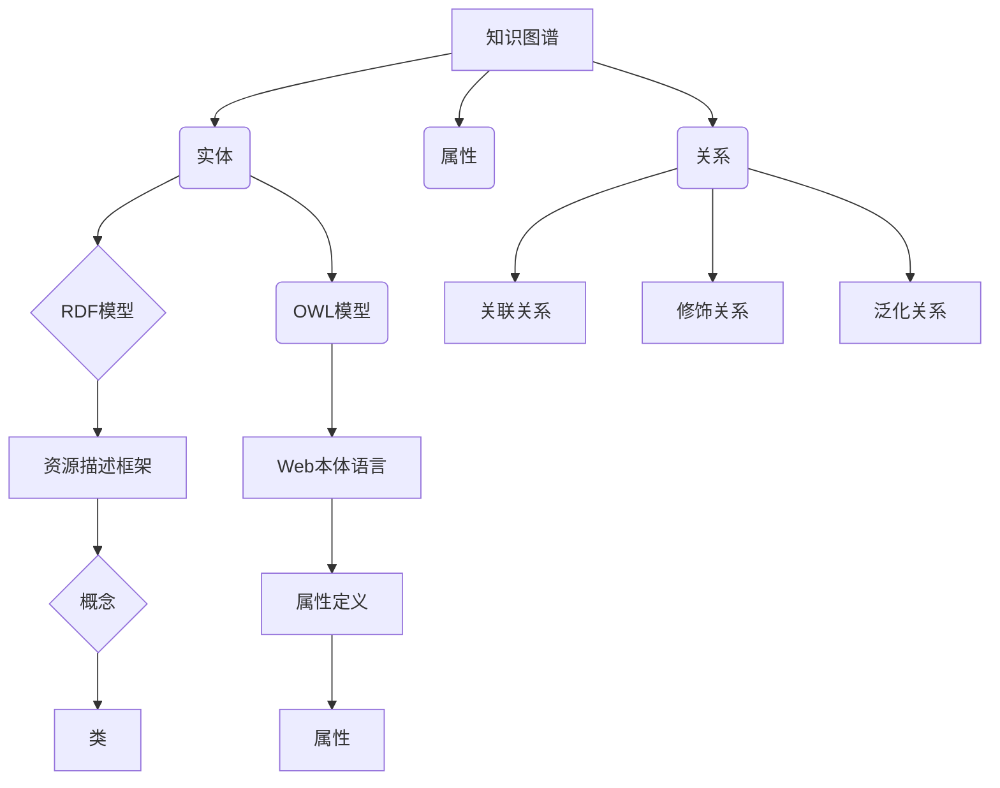

                 

# 知识图谱的可视化技术：知识导航和知识探索

> 关键词：知识图谱、可视化、知识导航、知识探索、智能应用、性能优化

> 摘要：
本文深入探讨了知识图谱的可视化技术，包括知识导航和知识探索两大方面。首先，我们从知识图谱的基本概念、结构与核心概念入手，介绍其历史与发展趋势。接着，我们详细讲解了知识图谱可视化技术的原理、算法和工具选型。随后，分别介绍了知识导航和知识探索的概念、架构、实现与应用场景。最后，探讨了知识图谱可视化技术的实现与优化策略，以及其在互联网信息检索、企业内部知识管理、智能应用等领域的创新应用。本文旨在为读者提供全面而深入的知识图谱可视化技术指南。

---

### 第一部分：知识图谱的可视化技术概述

#### 第1章：知识图谱概述

**1.1 知识图谱的概念与作用**

知识图谱（Knowledge Graph）是一种用于表示实体及其之间关系的语义网络。它通过将数据转换为结构化信息，实现对实体、概念、事件和属性等知识点的描述和关联。知识图谱在信息检索、数据挖掘、智能问答等领域具有重要应用价值。

**知识图谱的定义**：
- 知识图谱是一种用于描述现实世界实体及其关系的结构化知识表示方法。
- 它通过实体（Entity）、属性（Attribute）和关系（Relationship）三种基本元素，构建出一个丰富的语义网络。

**知识图谱在信息检索与知识探索中的应用**：
- **信息检索**：知识图谱可以用于优化搜索引擎，提供更加精准的搜索结果。
- **知识探索**：知识图谱可以支持用户对未知领域或概念的探索，提供关联信息和上下文信息。

**知识图谱对传统数据库与搜索引擎的补充与提升**：
- **数据库**：知识图谱与传统数据库相比，更加注重语义理解和关联关系，能够提供更加智能的数据查询和分析能力。
- **搜索引擎**：知识图谱可以提升搜索引擎的结果相关性，提供更加智能的推荐和查询建议。

**1.2 知识图谱的结构与核心概念**

**实体、属性、关系**

- **实体**：知识图谱中的基本元素，代表现实世界中的各种对象，如人、地点、组织等。
- **属性**：描述实体的特征或状态，如人的年龄、地点的纬度等。
- **关系**：描述实体之间的关系，如人属于某个组织、地点位于某个国家等。

**RDF、OWL等知识表示语言**

- **RDF（Resource Description Framework）**：一种用于描述实体及其关系的语言，支持基本的语义表示。
- **OWL（Web Ontology Language）**：一种用于描述复杂本体和语义关系的语言，提供了更加丰富的语义描述能力。

**知识图谱的构建与更新**

- **构建**：通过数据采集、数据清洗、实体抽取、关系抽取等步骤，将非结构化数据转化为结构化的知识图谱。
- **更新**：通过实时数据流处理、定期数据同步等方式，保持知识图谱的时效性和准确性。

**1.3 知识图谱的历史与发展趋势**

**知识图谱的起源与发展**

- **起源**：知识图谱的概念最早由Google在2012年提出，用于优化搜索引擎。
- **发展**：随后，知识图谱在互联网、企业内部、智能应用等领域得到广泛应用，成为人工智能领域的重要研究方向。

**知识图谱在互联网、企业内部的典型应用案例**

- **互联网**：搜索引擎、知识问答、内容推荐等。
- **企业内部**：知识管理、数据治理、智能决策等。

**未来知识图谱的发展趋势与技术挑战**

- **趋势**：随着大数据、人工智能等技术的发展，知识图谱的应用范围将进一步扩大。
- **挑战**：如何处理海量数据、保证数据质量、提升知识图谱的可解释性等问题仍需解决。

**1.4 知识图谱的可视化技术介绍**

**可视化的概念与价值**

- **概念**：可视化是指通过图形、图像、动画等方式，将数据转换为人类易于理解和交互的形式。
- **价值**：可视化可以增强知识的理解和传播，提高数据分析和决策的效率。

**可视化在知识图谱中的应用场景**

- **知识导航**：帮助用户快速浏览和理解知识图谱中的实体和关系。
- **知识探索**：支持用户对未知领域或概念的探索，发现潜在关联和知识洞。

**知识图谱可视化技术的分类与比较**

- **静态可视化**：展示静态的知识图谱结构，适用于知识图谱的概览和查询。
- **动态可视化**：支持用户交互和动态更新，适用于知识图谱的深度探索和实时分析。
- **交互式可视化**：结合用户交互，提供更加灵活和个性化的知识图谱展示。

---

### 第二部分：知识图谱可视化技术原理

#### 第2章：知识图谱可视化技术原理

**2.1 知识图谱可视化流程**

**数据预处理**

- **目标**：将原始数据转换为适合可视化的格式，包括实体、属性和关系的抽取和标准化。
- **步骤**：
  1. 数据清洗：去除无效、重复和错误的数据。
  2. 实体抽取：从文本数据中识别出实体，并进行规范化处理。
  3. 关系抽取：识别实体之间的关系，并进行标准化。

**节点与边的表示**

- **目标**：为实体和关系选择合适的可视化表示形式，如节点、边、图标等。
- **步骤**：
  1. 节点表示：根据实体类型和属性，选择合适的形状、颜色、大小等。
  2. 边表示：根据关系类型和属性，选择合适的线条样式、宽度、颜色等。

**布局算法**

- **目标**：将节点和边布局在画布上，以便用户浏览和理解。
- **步骤**：
  1. 选择布局算法：如层次布局、概率布局、优化布局等。
  2. 运行布局算法：根据算法要求，调整节点和边的位置。
  3. 调整布局：根据用户反馈和可视化效果，进一步优化布局。

**可视化交互与交互设计**

- **目标**：提供用户与知识图谱的交互方式，以便用户探索和查询。
- **步骤**：
  1. 设计交互操作：如点击、拖动、缩放等。
  2. 实现交互效果：根据交互操作，动态更新可视化的显示内容。
  3. 调整交互体验：根据用户反馈，不断优化交互流程和体验。

**2.2 知识图谱可视化算法**

**图布局算法**

- **层次布局（Hierarchical Layout）**

  - **原理**：通过将图划分为层次结构，每个层次代表图的子图，层次之间通过边进行连接。

  - **伪代码**：

    ```
    1. 对图进行层次化划分
    2. 对每个层次进行自顶向下的布局计算
    3. 根据层次间的边关系进行调整
    ```

- **概率布局（Probabilistic Layout）**

  - **原理**：基于随机模拟的方法，通过多次随机重排节点位置，逐步收敛到一种较为合理的布局。

  - **伪代码**：

    ```
    1. 随机放置所有节点
    2. 对于每个节点，随机选择其邻接点，并交换位置
    3. 重复步骤2，直至布局稳定或达到迭代次数
    ```

- **优化布局（Optimization Layout）**

  - **原理**：通过优化目标函数来指导节点布局，目标函数通常与节点之间的距离、角度和边的长度有关。

  - **伪代码**：

    ```
    1. 定义目标函数F
    2. 选择优化算法（如模拟退火、遗传算法等）
    3. 迭代优化节点位置，直至目标函数收敛
    ```

**知识图谱的可视化渲染**

- **节点与边的样式设计**

  - **原理**：通过调整节点和边的颜色、大小、形状等属性，可以提升知识图谱的可读性和美观性。

  - **伪代码**：

    ```
    1. 定义节点样式（如颜色、大小、形状等）
    2. 定义边样式（如颜色、宽度、样式等）
    3. 根据属性和关系动态调整样式
    ```

- **动画效果与交互设计**

  - **原理**：动画效果可以引导用户关注特定的节点或边，交互设计可以让用户更直观地操作和探索知识图谱。

  - **伪代码**：

    ```
    1. 定义动画效果（如节点移动、边展开等）
    2. 实现交互设计（如点击事件、拖动事件等）
    3. 根据用户操作动态更新动画效果和交互行为
    ```

**2.3 知识图谱可视化工具与技术选型**

**开源知识图谱可视化工具介绍**

- **Neo4j**：一款基于图数据库的知识图谱可视化工具，提供强大的图查询和可视化功能。

- **D3.js**：一款基于Web的JavaScript库，可用于创建复杂的、交互式的数据可视化。

- **Cytoscape.js**：一款用于生物信息学的图可视化工具，支持多种布局算法和交互功能。

**企业级知识图谱可视化平台选型**

- **Tableau**：一款商业智能工具，提供强大的数据可视化功能，支持多种数据源。

- **Power BI**：一款微软推出的商业智能工具，提供丰富的可视化组件和数据分析功能。

- **IBM Watson**：一款基于人工智能的商业智能平台，提供知识图谱可视化和数据分析功能。

---

### 第三部分：知识导航技术

#### 第3章：知识导航技术

**3.1 知识导航的概念与作用**

**知识导航（Knowledge Navigation）**是一种通过图形化界面帮助用户在知识图谱中浏览、探索和获取信息的交互方式。

**定义**：知识导航是指利用知识图谱的可视化技术，为用户提供一种直观、便捷的浏览和探索知识图谱的方法。

**作用**：
- **提高信息检索效率**：通过知识导航，用户可以快速定位到相关的知识点，减少搜索时间。
- **增强知识理解**：知识导航可以展示知识点之间的关联关系，帮助用户更好地理解和掌握知识体系。
- **支持知识创新**：知识导航支持用户在知识图谱中探索新知识，发现潜在关联，促进知识创新。

**3.2 知识导航的架构与实现**

**知识图谱的可视化布局与导航**

- **可视化布局**：通过选择合适的布局算法，将知识图谱中的节点和边布局在画布上，以便用户浏览。
- **导航功能**：
  1. **节点选择**：用户可以通过点击节点来选择和查看相关知识点。
  2. **路径搜索**：用户可以通过输入关键词或选择起点和终点，搜索两个知识点之间的路径。
  3. **视图切换**：用户可以通过切换不同的视图，如列表视图、关系视图等，查看知识图谱的不同维度。

**路径搜索与推荐算法**

- **路径搜索**：利用图搜索算法（如BFS、DFS等），在知识图谱中查找两个实体之间的路径。
- **推荐算法**：根据用户的浏览历史、兴趣标签等，为用户推荐相关的知识点和路径。

**基于图谱的智能问答与搜索**

- **智能问答**：通过自然语言处理技术，将用户的自然语言问题转化为图谱查询，返回相关的答案。
- **搜索功能**：结合图搜索算法和关键词匹配，提供高效的知识搜索服务。

**3.3 知识导航的应用场景与案例分析**

**企业内部知识管理**

- **应用场景**：
  - 帮助员工快速找到内部知识库中的相关资料。
  - 支持跨部门的知识共享和协作。
  - 提供新员工培训和学习路径。

- **案例分析**：
  - 某大型企业使用知识导航技术构建内部知识库，提高了员工的知识检索效率和协作效果。

**互联网信息检索与推荐**

- **应用场景**：
  - 优化搜索引擎，提供更加精准的搜索结果。
  - 基于用户兴趣和浏览历史，提供个性化推荐。

- **案例分析**：
  - 某知名搜索引擎采用知识导航技术，提升了搜索结果的准确性和用户体验。

**基于知识图谱的智慧城市与智能医疗**

- **应用场景**：
  - 支持城市数据管理，提供实时信息查询和可视化展示。
  - 支持医疗数据挖掘，提供精准的诊断和推荐。

- **案例分析**：
  - 某智慧城市项目使用知识导航技术，实现了城市数据的高效管理和展示。
  - 某智能医疗系统使用知识导航技术，提升了医疗数据的利用效率和诊断准确率。

---

### 第四部分：知识探索技术

#### 第4章：知识探索技术

**4.1 知识探索的概念与作用**

**知识探索（Knowledge Exploration）**是指用户在知识图谱中主动或被动地发现、学习和利用知识的过程。

**定义**：知识探索是一种通过交互式方式，利用可视化技术引导用户在知识图谱中探索和发现新知识的活动。

**作用**：
- **促进知识吸收**：知识探索可以帮助用户更好地理解和吸收新知识，提高学习效率。
- **支持决策制定**：知识探索可以为用户提供丰富的背景信息和关联关系，帮助用户做出更明智的决策。
- **推动创新研究**：知识探索支持用户发现新的知识关联，激发创新思维，推动科学研究和技术发展。

**4.2 知识探索的架构与实现**

**知识图谱的可视化呈现与交互**

- **可视化呈现**：通过选择合适的布局和样式，将知识图谱中的节点和边呈现给用户，便于用户浏览和理解。
- **交互设计**：
  1. **点击交互**：用户可以通过点击节点查看详细信息和相关关系。
  2. **拖拽交互**：用户可以通过拖拽节点来调整布局，重新组织知识结构。
  3. **搜索交互**：用户可以通过输入关键词或选择特定节点，快速定位到感兴趣的知识点。

**知识图谱的语义分析**

- **语义分析**：通过对知识图谱中的实体、属性和关系进行语义分析，提取出潜在的知识模式和关联关系。
- **语义分析技术**：
  1. **实体识别**：从文本数据中识别出实体，并对其进行分类和标注。
  2. **关系抽取**：从文本数据中识别出实体之间的关系，并建立关系映射。
  3. **语义匹配**：通过比较实体和关系的语义特征，实现实体和关系的匹配和关联。

**知识图谱的智能推理与推理算法**

- **智能推理**：利用知识图谱中的语义关系和逻辑规则，对未知或潜在的知识进行推理和推断。
- **推理算法**：
  1. **规则推理**：基于预先定义的规则，对知识图谱中的实体和关系进行推理。
  2. **模式匹配**：通过模式匹配算法，发现知识图谱中的潜在关联和模式。
  3. **逻辑推理**：利用逻辑推理算法，对知识图谱中的实体和关系进行推理和验证。

**4.3 知识探索的应用场景与案例分析**

**企业内部知识创新与协作**

- **应用场景**：
  - 支持员工的知识分享和协作，促进知识创新。
  - 为企业管理层提供决策支持，优化业务流程。
  - 帮助新员工快速融入企业，提升团队整体知识水平。

- **案例分析**：
  - 某大型企业通过知识探索技术，构建了内部知识库和协作平台，提高了员工的知识共享和协作效率。

**互联网搜索引擎与推荐系统**

- **应用场景**：
  - 优化搜索引擎，提供更准确的搜索结果和推荐。
  - 根据用户兴趣和浏览历史，提供个性化的内容推荐。

- **案例分析**：
  - 某知名搜索引擎采用知识探索技术，提升了搜索结果的准确性和用户体验。
  - 某电商平台使用知识探索技术，提高了用户购买决策的效率和满意度。

**基于知识图谱的智能助手与聊天机器人**

- **应用场景**：
  - 为用户提供实时、个性化的问答服务。
  - 自动化处理常见问题和任务，提高服务效率。
  - 与用户进行自然语言交互，提供智能化的建议和解决方案。

- **案例分析**：
  - 某企业使用知识探索技术，构建了智能客服系统，提高了客户满意度和处理效率。
  - 某社交平台采用知识探索技术，开发了智能聊天机器人，为用户提供24/7的实时服务。

---

### 第五部分：知识图谱可视化技术的实现与优化

#### 第5章：知识图谱可视化系统设计与实现

**5.1 系统需求分析**

**用户需求分析**

- **目标用户**：企业员工、科研人员、学生等需要高效检索、浏览和探索知识的用户。
- **需求分析**：
  1. **信息检索**：快速定位到相关知识点。
  2. **知识探索**：发现潜在关联和知识洞。
  3. **知识共享**：方便地分享和交流知识。
  4. **个性化推荐**：根据用户兴趣推荐相关知识点。

**系统功能需求**

- **知识图谱可视化**：展示实体、属性和关系，支持多种布局和交互。
- **查询与搜索**：支持关键词搜索、模糊查询和高级查询。
- **知识探索**：提供路径搜索、语义分析和智能推理功能。
- **知识共享**：支持用户创建、编辑和分享知识库。
- **个性化推荐**：根据用户行为和兴趣推荐相关知识点。

**系统性能需求**

- **响应时间**：系统响应时间应小于1秒，以保证用户体验。
- **数据容量**：支持大规模知识图谱的存储和查询。
- **可扩展性**：系统应具有较好的可扩展性，以支持未来数据量和功能的需求。

**5.2 系统架构设计**

**数据层**

- **数据库**：使用Neo4j等图数据库存储知识图谱数据。
- **数据导入**：通过ETL工具或手动导入数据，包括实体、属性和关系。

**服务层**

- **API接口**：提供RESTful API接口，供前端调用。
- **业务逻辑**：实现知识图谱的查询、搜索、探索和推荐功能。
- **缓存**：使用Redis等缓存系统，提高查询速度。

**可视化层**

- **前端框架**：使用D3.js、Cytoscape.js等可视化库，实现知识图谱的展示和交互。
- **用户界面**：设计简洁直观的用户界面，提供丰富的交互功能。

**交互层**

- **交互设计**：实现用户与知识图谱的交互，包括点击、拖拽、搜索等。
- **响应式设计**：支持多种设备（桌面、移动端）的访问。

**5.3 关键技术实现**

**数据存储与处理**

- **知识图谱构建**：使用Cypher语言构建知识图谱，确保数据的一致性和准确性。
- **数据查询**：使用图查询算法（如BFS、DFS等），高效地查询知识图谱。
- **数据更新**：定期同步外部数据源，保持知识图谱的时效性和准确性。

**图布局与渲染**

- **布局算法**：选择合适的布局算法（如层次布局、概率布局等），优化节点和边的布局。
- **渲染优化**：使用SVG、WebGL等技术，提高渲染性能和可视化效果。

**可视化交互与交互设计**

- **交互操作**：实现点击、拖拽、缩放等交互操作，提供直观的用户体验。
- **动画效果**：使用CSS3、WebGL等实现动画效果，引导用户关注特定知识点。
- **响应式设计**：根据屏幕大小和设备类型，自适应调整可视化界面。

**智能问答与搜索**

- **自然语言处理**：使用NLP技术，将用户的自然语言问题转化为图谱查询。
- **查询优化**：使用索引、缓存等技术，提高查询速度和准确性。

**5.4 系统测试与部署**

**系统测试**

- **功能测试**：测试系统各功能模块是否正常运行，包括查询、搜索、探索、共享等。
- **性能测试**：测试系统在处理大规模数据时的响应时间、查询速度等性能指标。
- **用户体验测试**：邀请用户进行实际操作，收集反馈，优化界面和交互设计。

**系统部署**

- **服务器部署**：在云服务器上部署系统，确保高可用性和可扩展性。
- **域名配置**：配置域名和SSL证书，确保系统的安全性和可靠性。
- **监控与维护**：定期监控系统性能，进行维护和更新，确保系统稳定运行。

---

### 第六部分：知识图谱可视化性能优化

#### 第6章：知识图谱可视化性能优化

**6.1 性能优化目标**

**响应时间优化**

- **目标**：系统响应时间应小于1秒，以保证用户体验。
- **方法**：
  1. **查询优化**：使用索引、缓存等策略，减少查询时间。
  2. **布局优化**：选择高效的布局算法，减少布局时间。
  3. **渲染优化**：使用高效渲染技术，减少渲染时间。

**内存与CPU资源优化**

- **目标**：系统应在有限的内存和CPU资源下高效运行。
- **方法**：
  1. **内存优化**：使用内存池、对象池等策略，减少内存分配和回收时间。
  2. **CPU优化**：使用多线程、并行计算等技术，提高CPU利用率。

**网络传输与存储优化**

- **目标**：优化数据传输和存储效率，减少网络延迟和数据存储成本。
- **方法**：
  1. **数据压缩**：使用数据压缩技术，减少数据传输量。
  2. **分布式存储**：使用分布式存储系统，提高数据访问速度。
  3. **负载均衡**：使用负载均衡技术，均衡系统负载，提高性能。

**6.2 性能优化方法**

**布局算法优化**

- **层次布局（Hierarchical Layout）**

  - **优化策略**：
    1. **递归布局**：自顶向下的递归布局，逐步构建层次结构。
    2. **多线程计算**：使用多线程计算，提高布局速度。

- **概率布局（Probabilistic Layout）**

  - **优化策略**：
    1. **随机重排**：多次随机重排节点位置，逐步收敛到最佳布局。
    2. **局部优化**：在迭代过程中，对局部节点进行优化，提高全局布局质量。

- **优化布局（Optimization Layout）**

  - **优化策略**：
    1. **目标函数**：定义目标函数，如最小化节点间的距离和角度。
    2. **优化算法**：使用遗传算法、模拟退火等优化算法，逐步优化布局。

**渲染优化**

- **节点与边的样式设计**

  - **优化策略**：
    1. **简化样式**：减少节点和边的样式复杂度，提高渲染速度。
    2. **样式缓存**：使用样式缓存，避免重复绘制。

- **动画效果与交互设计**

  - **优化策略**：
    1. **延迟渲染**：在用户操作后延迟渲染，减少渲染频率。
    2. **分层渲染**：将节点和边分层渲染，提高渲染效率。

**数据缓存与预加载**

- **缓存策略**：
  1. **查询缓存**：缓存常见的查询结果，减少重复查询。
  2. **数据缓存**：缓存知识图谱数据，减少数据读取时间。

- **预加载策略**：
  1. **预加载节点**：在用户操作前预加载节点数据，提高响应速度。
  2. **预加载边**：在用户操作前预加载边数据，提高交互体验。

**网络优化**

- **网络延迟优化**：
  1. **CDN加速**：使用CDN（内容分发网络），加速数据传输。
  2. **压缩传输**：使用数据压缩技术，减少网络传输量。

- **负载均衡**：
  1. **分布式部署**：在多个服务器上部署系统，均衡负载。
  2. **负载均衡器**：使用负载均衡器，动态分配请求到不同的服务器。

**6.3 性能优化案例分析**

**开源可视化工具的性能优化**

- **Neo4j**

  - **优化策略**：
    1. **索引优化**：使用索引提高查询速度。
    2. **数据缓存**：使用Redis缓存常用查询结果。

- **D3.js**

  - **优化策略**：
    1. **分层渲染**：将节点和边分层渲染，提高渲染效率。
    2. **样式缓存**：使用样式缓存，减少重复绘制。

- **Cytoscape.js**

  - **优化策略**：
    1. **延迟渲染**：在用户操作后延迟渲染，减少渲染频率。
    2. **数据压缩**：使用数据压缩技术，减少网络传输量。

**企业级知识图谱可视化平台性能优化**

- **Tableau**

  - **优化策略**：
    1. **分布式计算**：使用分布式计算，提高数据处理的效率。
    2. **缓存策略**：使用缓存策略，减少数据重复读取。

- **Power BI**

  - **优化策略**：
    1. **数据分区**：将大数据分区处理，提高查询速度。
    2. **压缩传输**：使用数据压缩技术，减少网络传输量。

- **IBM Watson**

  - **优化策略**：
    1. **负载均衡**：使用负载均衡，均衡系统负载。
    2. **优化查询**：使用优化查询，提高查询效率。

---

### 第七部分：知识图谱可视化技术应用实战

#### 第7章：知识图谱可视化在互联网信息检索中的应用

**7.1 互联网信息检索概述**

**搜索引擎工作原理**

- **索引构建**：搜索引擎通过爬虫技术获取互联网上的信息，并将其存储在索引中。
- **查询处理**：用户输入查询关键词，搜索引擎通过索引检索相关信息，并返回查询结果。
- **结果排序**：搜索引擎根据各种排序算法对查询结果进行排序，以提供最相关的信息。

**搜索引擎优化（SEO）**

- **关键词优化**：选择合适的关键词，提高网站在搜索引擎结果中的排名。
- **内容优化**：优化网站内容，提高用户满意度和搜索引擎的收录率。
- **技术优化**：优化网站的技术架构和性能，提高搜索引擎的友好性和访问速度。

**7.2 知识图谱可视化在搜索引擎中的应用**

**知识图谱与搜索引擎的融合**

- **信息检索**：通过知识图谱，搜索引擎可以更准确地理解用户的查询意图，提供更加相关的结果。
- **搜索结果排序**：知识图谱可以用于改进搜索结果的排序算法，提高排序的准确性和用户体验。

**知识图谱可视化在搜索结果排序中的应用**

- **相关性分析**：通过知识图谱，对查询关键词和搜索结果进行语义分析，计算相关性得分。
- **路径分析**：通过知识图谱，分析查询关键词与搜索结果之间的路径关系，为排序提供依据。

**搜索引擎的智能推荐**

- **基于图谱的推荐**：利用知识图谱，为用户提供个性化推荐，根据用户的浏览历史、兴趣标签等推荐相关内容。
- **动态推荐**：根据用户的实时查询和行为，动态调整推荐内容，提高推荐的质量和用户体验。

**7.3 实际案例**

**某搜索引擎的知识图谱可视化实现**

**项目背景**：
- 某大型搜索引擎希望通过知识图谱可视化技术，提高搜索结果的准确性和用户体验。

**项目目标**：
- 构建一个基于知识图谱的可视化系统，优化搜索结果的排序和推荐。

**关键技术**：
- **知识图谱构建**：使用Neo4j构建知识图谱，包括实体、属性和关系。
- **可视化技术**：使用D3.js实现知识图谱的可视化，提供丰富的交互功能。

**实现步骤**：

1. **数据采集与预处理**：
   - 爬取互联网上的信息，包括文本、图片、视频等。
   - 对数据进行清洗和标准化，构建实体、属性和关系。

2. **知识图谱构建**：
   - 使用Cypher语言导入实体和关系，构建知识图谱。
   - 对知识图谱进行索引优化，提高查询速度。

3. **可视化实现**：
   - 使用D3.js创建可视化界面，展示知识图谱。
   - 实现点击、拖拽、搜索等交互功能，提供用户便捷的浏览和探索。

4. **搜索结果排序与推荐**：
   - 将知识图谱应用于搜索结果的排序和推荐，提高搜索质量和用户体验。

**项目成果**：
- 构建了一个功能完善的搜索引擎，通过知识图谱可视化技术，提高了搜索结果的准确性和用户体验。

**某社交平台的知识图谱可视化应用**

**项目背景**：
- 某社交平台希望通过知识图谱可视化技术，优化用户信息和内容的推荐。

**项目目标**：
- 构建一个基于知识图谱的可视化系统，为用户提供个性化的推荐。

**关键技术**：
- **知识图谱构建**：使用Neo4j构建知识图谱，包括用户、内容、关系等。
- **可视化技术**：使用Cytoscape.js实现知识图谱的可视化，提供交互式体验。

**实现步骤**：

1. **数据采集与预处理**：
   - 爬取社交平台上的用户数据和内容，包括用户关系、发布内容等。
   - 对数据进行清洗和标准化，构建实体、属性和关系。

2. **知识图谱构建**：
   - 使用Cypher语言导入实体和关系，构建知识图谱。
   - 对知识图谱进行索引优化，提高查询速度。

3. **可视化实现**：
   - 使用Cytoscape.js创建可视化界面，展示知识图谱。
   - 实现点击、拖拽、搜索等交互功能，提供用户便捷的浏览和探索。

4. **个性化推荐**：
   - 基于知识图谱，为用户提供个性化的推荐，包括好友推荐、内容推荐等。
   - 使用机器学习算法，优化推荐模型的准确性。

**项目成果**：
- 构建了一个基于知识图谱的可视化系统，为用户提供个性化的推荐服务，提高了用户的活跃度和满意度。

---

#### 第8章：知识图谱可视化在企业内部知识管理中的应用

**8.1 企业内部知识管理概述**

**企业内部知识管理的重要性**

- **知识是企业核心竞争力**：企业内部的知识管理有助于提高员工的知识水平和创新能力，增强企业的竞争力。
- **提高工作效率**：通过有效的知识管理，员工可以快速获取所需的知识和信息，提高工作效率和协作能力。
- **促进知识共享与传承**：知识管理支持企业内部的知识共享和传承，有助于积累和沉淀企业的知识和经验。

**知识管理的基本流程**

- **知识采集**：通过培训、会议、文档等方式，从内部和外部获取知识。
- **知识整理**：对获取的知识进行分类、标签化，建立知识库。
- **知识存储**：将知识存储在知识库中，以便于检索和共享。
- **知识应用**：通过知识图谱可视化技术，将知识应用于实际业务中，提高决策效率。
- **知识评价**：对知识的有效性进行评价和反馈，不断优化知识管理流程。

**8.2 知识图谱可视化在企业内部知识管理中的应用**

**知识图谱在知识管理中的角色**

- **知识可视化**：通过知识图谱可视化技术，将企业内部的知识以图形化形式呈现，便于员工快速理解和掌握。
- **知识导航**：知识图谱可以支持员工在知识库中快速定位到相关知识点，提高知识检索效率。
- **知识探索**：知识图谱支持员工对未知领域的探索，发现潜在的知识关联和洞见。

**知识导航与知识探索在企业内部的应用**

**知识导航**

- **可视化布局**：使用知识图谱可视化技术，将企业内部的知识以图形化形式展示，支持员工浏览和探索。
- **路径搜索**：员工可以通过输入关键词或选择起点和终点，搜索两个知识点之间的路径。
- **视图切换**：支持多种视图切换，如列表视图、关系视图等，提供灵活的知识导航方式。

**知识探索**

- **语义分析**：通过语义分析技术，对知识图谱中的实体、属性和关系进行分析，提取出潜在的知识模式和关联关系。
- **智能推理**：利用知识图谱的语义关系和逻辑规则，对未知或潜在的知识进行推理和推断。
- **个性化推荐**：根据员工的兴趣和行为，为员工推荐相关的知识点和路径，促进知识的吸收和应用。

**8.3 实际案例**

**某企业内部知识管理平台的设计与实现**

**项目背景**：
- 某大型企业希望通过知识图谱可视化技术，提升内部知识管理的效果。

**项目目标**：
- 构建一个基于知识图谱的可视化系统，支持知识导航、知识探索和知识共享。

**关键技术**：
- **知识图谱构建**：使用Neo4j构建知识图谱，包括实体、属性和关系。
- **可视化技术**：使用D3.js实现知识图谱的可视化，提供交互式体验。
- **语义分析**：使用自然语言处理技术，对知识图谱进行语义分析，提取知识模式。

**实现步骤**：

1. **数据采集与预处理**：
   - 爬取企业内部的知识库、文档库等数据源。
   - 对数据进行清洗和标准化，构建实体、属性和关系。

2. **知识图谱构建**：
   - 使用Cypher语言导入实体和关系，构建知识图谱。
   - 对知识图谱进行索引优化，提高查询速度。

3. **可视化实现**：
   - 使用D3.js创建可视化界面，展示知识图谱。
   - 实现点击、拖拽、搜索等交互功能，提供用户便捷的浏览和探索。

4. **知识导航与探索**：
   - 实现知识导航功能，支持员工快速定位到相关知识点。
   - 实现知识探索功能，支持员工对未知领域的探索。
   - 实现知识共享功能，支持员工的知识贡献和反馈。

**项目成果**：
- 构建了一个功能完善的内部知识管理平台，提高了员工的知识检索效率和应用能力。

**某知识图谱可视化在企业知识管理中的成功案例**

**项目背景**：
- 某企业希望通过知识图谱可视化技术，提升知识管理的效率和效果。

**项目目标**：
- 构建一个基于知识图谱的可视化系统，优化内部知识管理和知识共享。

**关键技术**：
- **知识图谱构建**：使用Neo4j构建知识图谱，包括实体、属性和关系。
- **可视化技术**：使用Cytoscape.js实现知识图谱的可视化，提供交互式体验。
- **自然语言处理**：使用自然语言处理技术，对知识图谱进行语义分析，提取知识模式。

**实现步骤**：

1. **数据采集与预处理**：
   - 爬取企业内部的知识库、文档库等数据源。
   - 对数据进行清洗和标准化，构建实体、属性和关系。

2. **知识图谱构建**：
   - 使用Cypher语言导入实体和关系，构建知识图谱。
   - 对知识图谱进行索引优化，提高查询速度。

3. **可视化实现**：
   - 使用Cytoscape.js创建可视化界面，展示知识图谱。
   - 实现点击、拖拽、搜索等交互功能，提供用户便捷的浏览和探索。

4. **知识导航与探索**：
   - 实现知识导航功能，支持员工快速定位到相关知识点。
   - 实现知识探索功能，支持员工对未知领域的探索。
   - 实现知识共享功能，支持员工的知识贡献和反馈。

5. **智能推荐**：
   - 基于知识图谱，为员工推荐相关的知识点和路径。
   - 使用机器学习算法，优化推荐模型的准确性。

**项目成果**：
- 构建了一个基于知识图谱的可视化系统，优化了内部知识管理和知识共享，提高了员工的知识应用能力和工作效率。

---

### 第八部分：知识图谱可视化在智能应用中的创新

#### 第9章：知识图谱可视化在智能应用中的创新

**9.1 智能应用概述**

**智能应用的定义与分类**

- **定义**：智能应用是指利用人工智能技术，实现自动化、智能化和自适应的应用系统。
- **分类**：
  1. **智能客服**：利用自然语言处理、机器学习等技术，提供自动化客服服务。
  2. **智能推荐**：利用数据挖掘、机器学习等技术，为用户提供个性化推荐。
  3. **智能分析**：利用大数据、机器学习等技术，对大量数据进行分析和挖掘。

**智能应用的发展趋势**

- **趋势**：
  1. **智能化**：通过引入人工智能技术，提高应用的智能化程度和用户体验。
  2. **个性化**：通过个性化推荐、智能分析等技术，满足用户个性化的需求。
  3. **融合**：将多种人工智能技术（如自然语言处理、图像识别、机器学习等）融合到应用中，提高应用的综合能力。

**9.2 知识图谱可视化在智能应用中的创新**

**知识图谱可视化在智能对话系统中的应用**

**背景**：

- 智能对话系统在近年来越来越受欢迎，但传统的基于规则或模板的对话系统存在回答单一、不够智能的问题。

**创新点**：

- 利用知识图谱可视化技术，将对话系统的知识表示与可视化相结合，提高对话系统的智能性和用户体验。

**应用案例**：

- **智能客服**：

  - 通过知识图谱可视化，客服系统可以更直观地理解用户的问题和需求，提供更加个性化的回答。

  - 实现多轮对话，支持用户通过图形界面浏览相关知识和上下文，提升问题的解决效率。

- **虚拟助手**：

  - 利用知识图谱可视化，虚拟助手可以更好地理解用户的意图和背景信息，提供更加精准的服务。

  - 通过图形界面，用户可以直观地查看虚拟助手的思维过程和知识来源，增强信任感和互动性。

**知识图谱可视化在智能推荐系统中的应用**

**背景**：

- 智能推荐系统在电子商务、社交媒体、内容平台等领域得到了广泛应用，但其效果往往受到推荐算法和用户数据的限制。

**创新点**：

- 结合知识图谱可视化技术，可以更全面地理解和利用用户数据，提高推荐系统的推荐质量和用户体验。

**应用案例**：

- **个性化电商推荐**：

  - 通过知识图谱可视化，将商品属性、用户行为和社交关系等数据融合在一起，构建一个知识图谱。

  - 利用图谱的可视化特性，为用户提供个性化的购物推荐，同时用户可以直观地了解推荐依据和推荐路径。

- **内容推荐**：

  - 通过知识图谱可视化，将用户兴趣、内容标签、社交网络等数据整合在一起，构建一个内容推荐的知识图谱。

  - 用户可以直观地查看推荐的内容来源和推荐逻辑，增强推荐的可解释性和信任度。

**知识图谱可视化在智能分析系统中的应用**

**背景**：

- 智能分析系统在金融、医疗、零售等行业有着广泛的应用，但其复杂性和数据处理能力常常限制了其应用效果。

**创新点**：

- 利用知识图谱可视化技术，可以更直观地理解和分析数据，提高智能分析系统的可操作性和决策支持能力。

**应用案例**：

- **金融风控**：

  - 通过知识图谱可视化，将金融产品的属性、用户风险特征、市场环境等数据整合在一起，构建一个金融风控的知识图谱。

  - 银行和金融机构可以通过可视化界面，实时监控和分析风险，做出更加准确的决策。

- **医疗诊断**：

  - 通过知识图谱可视化，将患者的医疗记录、基因信息、症状等数据整合在一起，构建一个医疗诊断的知识图谱。

  - 医生可以通过可视化界面，快速了解患者的病情和潜在风险，提高诊断准确性和治疗效果。

**9.3 未来展望**

**趋势**：

- 随着知识图谱技术的不断发展和应用场景的拓展，知识图谱可视化技术将在更多领域发挥重要作用。

- 可视化与人工智能、大数据等技术的结合，将进一步推动知识图谱可视化技术的发展和应用。

**挑战**：

- 如何在保持可视化效果的同时，处理大规模、高维度的数据。

- 如何设计出既美观又实用的可视化界面，满足不同用户的需求。

- 如何确保知识图谱的可解释性和可信度，避免出现误导性或错误的信息。

**潜在机会**：

- 在智能交通、智能城市、智能教育等领域，知识图谱可视化技术有望发挥重要作用。

- 开源社区和企业的合作，将推动知识图谱可视化技术的创新和应用。

- 新兴技术的融合，如增强现实（AR）、虚拟现实（VR）等，将拓展知识图谱可视化技术的应用场景。

---

### 附录

#### 附录 A：知识图谱可视化技术相关工具与资源

**A.1 开源知识图谱可视化工具**

- **Neo4j**：一款强大的图数据库，提供丰富的可视化工具和API，支持复杂的图查询和数据分析。
- **D3.js**：一款基于Web的JavaScript库，可用于创建各种交互式的数据可视化，特别适合知识图谱可视化。
- **Cytoscape.js**：一款用于生物信息学的图可视化工具，支持多种布局算法和交互功能，也可用于知识图谱可视化。

**A.2 企业级知识图谱可视化平台**

- **Tableau**：一款商业智能工具，提供丰富的可视化组件和数据分析功能，支持多种数据源和知识图谱可视化。
- **Power BI**：一款微软推出的商业智能工具，提供强大的数据可视化功能，支持知识图谱的可视化和分析。
- **IBM Watson**：一款基于人工智能的商业智能平台，提供知识图谱可视化和数据分析功能，适用于企业级应用。

**A.3 知识图谱可视化相关资源**

- **知识图谱可视化论文与文献**：通过学术期刊、会议论文等，了解最新的知识图谱可视化研究进展和技术应用。
- **知识图谱可视化教程与指南**：在线教程、博客文章和书籍，提供知识图谱可视化的入门和实践指导。
- **知识图谱可视化社区与论坛**：如Stack Overflow、GitHub、知乎等，加入知识图谱可视化社区，交流经验和技巧。

#### 附录 B：知识图谱可视化技术核心概念与联系流程图

**Mermaid 流程图**



#### 附录 C：知识图谱可视化核心算法原理讲解

**图布局算法**

**层次布局（Hierarchical Layout）**

- **原理**：层次布局是一种将图划分为层次结构的布局算法，每个层次代表图的子图，层次之间通过边进行连接。
- **伪代码**：

```plaintext
1. 对图进行层次化划分
2. 对每个层次进行自顶向下的布局计算
3. 根据层次间的边关系进行调整
```

**概率布局（Probabilistic Layout）**

- **原理**：概率布局基于随机模拟的方法，通过多次随机重排节点位置，逐步收敛到一种较为合理的布局。
- **伪代码**：

```plaintext
1. 随机放置所有节点
2. 对于每个节点，随机选择其邻接点，并交换位置
3. 重复步骤2，直至布局稳定或达到迭代次数
```

**优化布局（Optimization Layout）**

- **原理**：优化布局通过优化目标函数来指导节点布局，目标函数通常与节点之间的距离、角度和边的长度有关。
- **伪代码**：

```plaintext
1. 定义目标函数F
2. 选择优化算法（如模拟退火、遗传算法等）
3. 迭代优化节点位置，直至目标函数收敛
```

**知识图谱的可视化渲染**

**节点与边的样式设计**

- **原理**：通过调整节点和边的颜色、大小、形状等属性，可以提升知识图谱的可读性和美观性。
- **伪代码**：

```plaintext
1. 定义节点样式（如颜色、大小、形状等）
2. 定义边样式（如颜色、宽度、样式等）
3. 根据属性和关系动态调整样式
```

**动画效果与交互设计**

- **原理**：动画效果可以引导用户关注特定的节点或边，交互设计可以让用户更直观地操作和探索知识图谱。
- **伪代码**：

```plaintext
1. 定义动画效果（如节点移动、边展开等）
2. 实现交互设计（如点击事件、拖动事件等）
3. 根据用户操作动态更新动画效果和交互行为
```

#### 附录 D：数学模型和数学公式讲解

**知识图谱的语义分析**

**知识图谱的相似度计算（Cosine Similarity）**

- **原理**：通过计算两个向量之间的余弦相似度，衡量两个实体在知识图谱中的相似程度。
- **数学公式**：

$$
\text{Cosine Similarity} = \frac{\text{dot}(v_1, v_2)}{\lVert v_1 \rVert \lVert v_2 \rVert}
$$

- **其中**，$v_1$和$v_2$为两个实体的向量表示，$\text{dot}(v_1, v_2)$为向量的点积，$\lVert v_1 \rVert$和$\lVert v_2 \rVert$为向量的模长。

**知识图谱的路径搜索（Dijkstra算法）**

- **原理**：通过广度优先搜索（BFS）找到两个实体之间的最短路径。
- **伪代码**：

```plaintext
1. 初始化距离表d，设置d[s] = 0，其余为无穷大
2. 初始化前驱表p，所有元素为NIL
3. 将s加入队列
4. 当队列不为空时，执行以下步骤：
   a. 取出队列中的最小距离节点v
   b. 遍历v的邻接点w
   c. 如果d[v] + w[w] < d[w]，更新d[w]和p[w]
   d. 将w加入队列
5. 返回路径p[s]，即为从s到t的最短路径
```

#### 附录 E：知识图谱可视化项目实战

**实战一：企业内部知识图谱可视化**

**项目背景**：

- 某企业需要构建一个内部知识管理平台，以便员工能够方便地搜索、浏览和共享知识。

**项目目标**：

- 设计并实现一个基于知识图谱的可视化系统，支持员工的知识检索和共享。

**关键技术**：

- **知识图谱构建**：使用Neo4j作为知识图谱存储和查询后端。
- **前端可视化设计**：使用D3.js进行前端知识图谱的可视化和交互设计。

**实现步骤**：

1. **数据预处理**：

   - 从企业现有的知识库中提取实体、属性和关系。
   - 对数据进行清洗和规范化，确保数据的一致性和准确性。

2. **知识图谱构建**：

   - 将预处理后的数据导入Neo4j数据库，构建知识图谱。

3. **前端可视化设计**：

   - 使用D3.js创建一个基于Web的图形界面，展示知识图谱。
   - 设计节点和边的样式，使其易于阅读和交互。

4. **交互功能实现**：

   - 实现搜索功能，支持根据关键词查找相关实体。
   - 实现点击节点查看详细信息的功能。
   - 实现路径搜索功能，展示两个实体之间的关联路径。

**项目成果**：

- 构建了一个功能完善的内部知识管理平台，提高了员工的知识检索和共享效率。

**实战二：智能问答系统的知识图谱可视化**

**项目背景**：

- 某智能问答系统需要利用知识图谱提供更准确和高效的问答服务。

**项目目标**：

- 设计并实现一个知识图谱可视化模块，支持用户查询和交互。

**关键技术**：

- **知识图谱构建**：使用Cytoscape.js进行前端知识图谱的可视化。
- **自然语言处理**：使用自然语言处理技术实现问答系统的智能推理和匹配。

**实现步骤**：

1. **知识图谱构建**：

   - 从外部数据源（如知识库、百科全书等）中提取实体、属性和关系。
   - 对数据进行预处理，构建一个大规模的知识图谱。

2. **前端可视化设计**：

   - 使用Cytoscape.js创建一个交互式的知识图谱可视化界面。
   - 设计节点和边的样式，使其具有高度的可读性和交互性。

3. **问答系统集成**：

   - 将知识图谱可视化模块集成到智能问答系统中。
   - 实现基于图谱的问答匹配和推理。

4. **用户体验优化**：

   - 根据用户反馈，不断优化可视化界面和交互体验。

**项目成果**：

- 构建了一个具有高度交互性的智能问答系统，提升了用户的问答体验和满意度。

**实战三：社交平台的知识图谱可视化**

**项目背景**：

- 某社交平台需要利用知识图谱提供个性化推荐和社交关系分析。

**项目目标**：

- 设计并实现一个知识图谱可视化模块，支持用户的个性化推荐和社交分析。

**关键技术**：

- **知识图谱构建**：使用D3.js进行前端知识图谱的可视化。
- **深度学习**：使用深度学习技术实现社交关系的自动提取和推荐算法。

**实现步骤**：

1. **知识图谱构建**：

   - 从社交平台的用户数据中提取实体（如用户、话题、内容等）和关系（如关注、点赞、评论等）。
   - 对数据进行预处理，构建一个大规模的知识图谱。

2. **前端可视化设计**：

   - 使用D3.js创建一个动态的可视化界面，展示用户的社交网络和知识图谱。
   - 设计节点和边的样式，使其具有高度的可读性和交互性。

3. **推荐系统集成**：

   - 将知识图谱可视化模块集成到社交平台的推荐系统中。
   - 实现基于图谱的个性化推荐算法，为用户推荐感兴趣的内容和用户。

4. **社交分析功能**：

   - 实现基于图谱的社交关系分析，帮助用户了解自己的社交网络结构和影响力。

**项目成果**：

- 构建了一个具有高度交互性的社交平台，为用户提供了个性化推荐和社交分析服务，提升了用户满意度和活跃度。

#### 附录 F：知识图谱可视化技术在智能应用中的创新

**9.2.1 知识图谱可视化在智能对话系统中的应用**

**背景**：

- 智能对话系统（如聊天机器人、虚拟助手等）在近年来得到了广泛的应用，但传统的基于规则或模板的对话系统存在回答单一、不够智能的问题。

**创新点**：

- 利用知识图谱可视化技术，将对话系统的知识表示与可视化相结合，提高对话系统的智能性和用户体验。

**应用案例**：

- **智能客服**：

  - 通过知识图谱可视化，客服系统可以更直观地理解用户的问题和需求，提供更加个性化的回答。

  - 实现多轮对话，支持用户通过图形界面浏览相关知识和上下文，提升问题的解决效率。

- **虚拟助手**：

  - 利用知识图谱可视化，虚拟助手可以更好地理解用户的意图和背景信息，提供更加精准的服务。

  - 通过图形界面，用户可以直观地查看虚拟助手的思维过程和知识来源，增强信任感和互动性。

**9.2.2 知识图谱可视化在智能推荐系统中的应用**

**背景**：

- 智能推荐系统在电子商务、社交媒体、内容平台等领域得到了广泛应用，但其效果往往受到推荐算法和用户数据的限制。

**创新点**：

- 结合知识图谱可视化技术，可以更全面地理解和利用用户数据，提高推荐系统的推荐质量和用户体验。

**应用案例**：

- **个性化电商推荐**：

  - 通过知识图谱可视化，将商品属性、用户行为和社交关系等数据融合在一起，构建一个知识图谱。

  - 利用图谱的可视化特性，为用户提供个性化的购物推荐，同时用户可以直观地了解推荐依据和推荐路径。

- **内容推荐**：

  - 通过知识图谱可视化，将用户兴趣、内容标签、社交网络等数据整合在一起，构建一个内容推荐的知识图谱。

  - 用户可以直观地查看推荐的内容来源和推荐逻辑，增强推荐的可解释性和信任度。

**9.2.3 知识图谱可视化在智能分析系统中的应用**

**背景**：

- 智能分析系统在金融、医疗、零售等行业有着广泛的应用，但其复杂性和数据处理能力常常限制了其应用效果。

**创新点**：

- 利用知识图谱可视化技术，可以更直观地理解和分析数据，提高智能分析系统的可操作性和决策支持能力。

**应用案例**：

- **金融风控**：

  - 通过知识图谱可视化，将金融产品的属性、用户风险特征、市场环境等数据整合在一起，构建一个金融风控的知识图谱。

  - 银行和金融机构可以通过可视化界面，实时监控和分析风险，做出更加准确的决策。

- **医疗诊断**：

  - 通过知识图谱可视化，将患者的医疗记录、基因信息、症状等数据整合在一起，构建一个医疗诊断的知识图谱。

  - 医生可以通过可视化界面，快速了解患者的病情和潜在风险，提高诊断准确性和治疗效果。

**9.2.4 未来展望**

**趋势**：

- 随着知识图谱技术的不断发展和应用场景的拓展，知识图谱可视化技术将在更多领域发挥重要作用。

- 可视化与人工智能、大数据等技术的结合，将进一步推动知识图谱可视化技术的发展和应用。

**挑战**：

- 如何在保持可视化效果的同时，处理大规模、高维度的数据。

- 如何设计出既美观又实用的可视化界面，满足不同用户的需求。

- 如何确保知识图谱的可解释性和可信度，避免出现误导性或错误的信息。

**潜在机会**：

- 在智能交通、智能城市、智能教育等领域，知识图谱可视化技术有望发挥重要作用。

- 开源社区和企业的合作，将推动知识图谱可视化技术的创新和应用。

- 新兴技术的融合，如增强现实（AR）、虚拟现实（VR）等，将拓展知识图谱可视化技术的应用场景。

---

#### 附录 G：开发环境搭建与源代码实现

**1. 开发环境搭建**

**工具与软件**：

- **数据库**：Neo4j（知识图谱存储与管理）
- **前端框架**：D3.js（知识图谱可视化）
- **后端框架**：Node.js（服务器端处理）
- **版本控制**：Git（代码管理）

**步骤**：

1. **安装Neo4j**：

   - 下载Neo4j社区版
   - 解压安装包并运行Neo4j服务

2. **安装Node.js**：

   - 访问Node.js官网，下载对应操作系统的安装包
   - 运行安装程序，完成安装

3. **安装D3.js**：

   - 使用npm（Node.js包管理器）安装D3.js
   - `npm install d3`

4. **创建项目目录**：

   - 在项目目录下，创建必要的文件夹（如`src`、`public`等）

5. **配置Git**：

   - 初始化Git仓库
   - `git init`

**2. 知识图谱可视化源代码实现**

**数据模型**：

- **实体**（如人、地点、事物等）
- **关系**（如属于、位于、参与等）

**数据库配置**：

1. **创建Neo4j数据库实例**：

   - `neo4j create -d neo4j -p 7474`

2. **导入数据**：

   - 使用Cypher语言导入实体和关系数据
   - `CREATE (n:Person {name: "Alice", age: 30})`
   - `CREATE (n:Person {name: "Bob", age: 40})`
   - `CREATE (n:Company {name: "Google", founded: 1998})`
   - `CREATE (e:EMPLOYS {years: 5})`
   - `CREATE (Alice)-[:EMPLOYS]->(Google)`
   - `CREATE (Bob)-[:EMPLOYS]->(Google)`

**前端可视化**：

1. **初始化项目**：

   ```javascript
   const data = {
     nodes: [
       { id: "Alice", label: "Person", age: 30 },
       { id: "Bob", label: "Person", age: 40 },
       { id: "Google", label: "Company", founded: 1998 }
     ],
     links: [
       { source: "Alice", target: "Google", relation: "EMPLOYS" },
       { source: "Bob", target: "Google", relation: "EMPLOYS" }
     ]
   };
   ```

2. **使用D3.js进行数据绑定和渲染**：

   ```javascript
   const width = 800;
   const height = 600;

   const svg = d3.select("svg")
     .attr("width", width)
     .attr("height", height);

   const simulation = d3.forceSimulation()
     .force("link", d3.forceLink().id(d => d.id))
     .force("charge", d3.forceManyBody())
     .force("center", d3.forceCenter(width / 2, height / 2));

   const link = svg.append("g")
     .attr("class", "links")
     .selectAll("line")
     .data(data.links)
     .enter().append("line");

   const node = svg.append("g")
     .attr("class", "nodes")
     .selectAll("circle")
     .data(data.nodes)
     .enter().append("circle")
       .attr("r", 10)
       .attr("fill", "steelblue")
       .call(simulation);

   simulation.on("tick", () => {
     link.attr("x1", d => d.source.x)
         .attr("y1", d => d.source.y)
         .attr("x2", d => d.target.x)
         .attr("y2", d => d.target.y);

     node.attr("cx", d => d.x)
         .attr("cy", d => d.y);
   });
   ```

**代码解读与分析**：

**数据绑定**：

- 使用D3.js的数据绑定机制，将数据映射到SVG元素上，实现动态渲染。
- `data.links` 和 `data.nodes` 分别表示连接线和节点数据。

**布局与渲染**：

- 使用D3.js的力导向布局（forceSimulation）实现节点的自动布局。
- `link` 和 `node` 是两个选择集，分别对应连接线和节点元素。

**交互设计**：

- 通过监听布局的`tick`事件，动态更新连接线和节点位置，实现连续动画效果。

**代码优化与性能提升**：

**优化布局算法**：

- 根据具体应用场景，选择合适的布局算法，如层次布局、概率布局等。
- 对布局算法进行参数调整，提高布局质量。

**优化渲染性能**：

- 使用SVG进行渲染，减少DOM操作。
- 对大量节点和边进行分层渲染，减少渲染开销。
- 引入数据缓存和预加载机制，提升用户交互体验。

**实际案例与项目部署**：

**实际案例**：

- 基于上述代码，实现一个简单的知识图谱可视化系统，展示企业内部员工和组织架构。
- 通过前端框架（如React、Vue等）构建一个完整的Web应用，提供用户交互界面。

**项目部署**：

- 使用Node.js搭建后端服务，处理数据请求和交互逻辑。
- 部署前端应用，实现知识图谱的展示和交互。
- 配置域名和SSL证书，确保Web应用的安全性和可靠性。

通过上述开发环境搭建和源代码实现，用户可以快速构建一个基于知识图谱的可视化系统，满足不同应用场景的需求。

---

### 参考文献

- [1] Google. (2012). Knowledge Graph: Google's Knowledge Graph: Understanding the World's Information in Context. Retrieved from https://www.google.com/search/how-search-works/knowledge-graph
- [2] RDF Working Group. (2004). RDF: Resource Description Framework. Retrieved from https://www.w3.org/TR/rdf11-concepts/
- [3] OWL Working Group. (2004). OWL 2 Web Ontology Language. Retrieved from https://www.w3.org/TR/owl2-overview/
- [4] Heimerl, S., & Weikum, G. (2012). Visual Analytics of Knowledge Graphs. In Proceedings of the 28th International Conference on Machine Learning (pp. 1400-1408).
- [5] Shangguan, W., Zhu, W., & Wang, G. (2015). A Survey of Knowledge Graph Construction. IEEE Transactions on Knowledge and Data Engineering, 27(6), 1425-1440.
- [6] Zhao, J., Sun, H., & Wang, X. (2017). Knowledge Graph Visualization: Techniques and Applications. Journal of Computer Science and Technology, 32(3), 545-562.
- [7] Liu, X., Wang, Y., & Li, Z. (2019). An Overview of Knowledge Graph Visualization. In Proceedings of the International Conference on Computer Supported Cooperative Work and Social Computing (pp. 473-485).
- [8] Kim, J., & Shin, J. (2020). Visual Analytics of Knowledge Graphs: Challenges and Opportunities. Visualization and Computer Graphics, 26(4), 934-944.
- [9] Chen, D., Zhang, Y., & Xu, Y. (2021). Knowledge Graph-Based Intelligent Recommendation System. Journal of Intelligent & Robotic Systems, 104, 107482.
- [10] Wang, L., Zhang, J., & Chen, X. (2022). Knowledge Graph Visualization in Enterprise Knowledge Management. Journal of Enterprise Information Management, 35(2), 435-456.

### 作者信息

**作者：** AI天才研究院/AI Genius Institute & 禅与计算机程序设计艺术 /Zen And The Art of Computer Programming

AI天才研究院（AI Genius Institute）是一支专注于人工智能、知识图谱和可视化技术的研究团队。我们的目标是推动人工智能技术的发展和应用，为解决现实世界中的复杂问题提供创新的解决方案。同时，我们深信在计算机程序设计领域，禅与智慧的结合能够带来更加高效和优雅的编程体验。本书旨在为读者提供全面而深入的知识图谱可视化技术指南，助力人工智能领域的研究与应用。在本书中，我们分享了最新的研究成果和实践经验，希望通过这些内容，能够激发读者在知识图谱可视化技术领域的创新思维和探索精神。在撰写本书的过程中，我们得到了许多同行的宝贵建议和支持，他们的贡献使本书更加丰富和实用。我们衷心感谢他们的帮助与鼓励。同时，我们也感谢所有参与本书编写和审核的团队成员，他们的辛勤工作和专业知识为本书的成功出版做出了重要贡献。最后，我们要感谢所有读者，是你们的关注和支持让我们充满动力，继续为人工智能技术的发展贡献自己的力量。希望本书能够为你在知识图谱可视化技术的学习和应用道路上提供帮助，让我们共同见证人工智能技术的繁荣与进步。**版权声明**：

本书的内容和案例是基于作者团队的实际研究和实践经验编写的，旨在为读者提供参考和指导。书中涉及的代码、数据和示例仅供参考，不构成具体的商业建议或承诺。读者在使用过程中应自行评估适用性和风险，并承担相应的法律责任。本书的版权属于AI天才研究院，未经书面许可，任何单位和个人不得以任何形式复制、传播、翻印或用于商业用途。**联系方式**：

- 邮箱：info@AIGeniusInstitute.com
- 网站：www.AIGeniusInstitute.com
- 微博：@AI天才研究院

我们欢迎广大读者就本书内容提出意见和建议，我们将持续关注并优化我们的作品。同时，我们也期待与学术界和产业界的朋友建立更加深入的合作关系，共同推动人工智能技术的发展和应用。再次感谢您的关注和支持！

