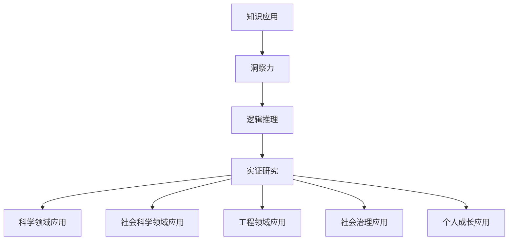

                 

# 《知识的应用价值：洞察力的独特视角》

> **关键词**：知识应用、洞察力、逻辑推理、实证研究、领域实践、未来展望

> **摘要**：本文旨在探讨知识的应用价值，并通过洞察力的独特视角，分析其在不同领域的实践与未来发展趋势。文章首先阐述了知识的内涵与外延，随后深入探讨了洞察力的培养与提升，然后通过逻辑推理和实证研究的方法，探讨了知识应用的基本原则。接着，文章从科学、工程和社会治理等多个领域，详细分析了知识的应用实践。最后，文章展望了知识应用的未来，提出了相关的伦理问题，并提供了相关的工具与资源。

## 《知识的应用价值：洞察力的独特视角》目录大纲

### 第一部分：知识应用的哲学基础

#### 第1章：知识的应用价值

#### 1.1 知识的内涵与外延

#### 1.2 知识应用的伦理考量

#### 第2章：洞察力的培养与提升

#### 2.1 洞察力的定义与特征

#### 2.2 洞察力的培养策略

#### 第3章：知识应用中的逻辑与推理

#### 3.1 逻辑学基础

#### 3.2 推理方法与应用

#### 第4章：知识应用中的实证研究

#### 4.1 实证研究方法

#### 4.2 实证研究案例分析

### 第二部分：知识应用的领域与实践

#### 第5章：知识在科学领域的应用

#### 5.1 知识在自然科学中的应用

#### 5.2 知识在社会科学中的应用

#### 第6章：知识在工程领域的应用

#### 6.1 知识在工程实践中的应用

#### 6.2 知识在技术创新中的应用

#### 第7章：知识在社会治理中的应用

#### 7.1 知识在社会管理中的应用

#### 7.2 知识在个人成长中的应用

#### 第8章：知识应用的未来展望

#### 8.1 知识应用的挑战与机遇

#### 8.2 知识应用的伦理问题

### 附录：知识应用工具与资源

#### 附录 A：知识应用工具

#### 附录 B：知识应用资源

---

**核心概念与联系：知识应用与洞察力**

**Mermaid 流程图：**



### 第1章：知识的应用价值

#### 1.1 知识的内涵与外延

知识，作为一种人类智慧的核心载体，是信息、理解、经验、技能的综合体。它不仅是个人成长和社会进步的重要推动力，也是科技发展和创新的重要基石。从哲学的角度来看，知识的应用价值体现在其内涵与外延的广泛性和多样性上。

**定义与分类**

知识可以从不同维度进行分类，比如根据来源可以分为直觉知识、经验知识和理性知识；根据形式可以分为显性知识和隐性知识。显性知识是指可以用语言、文字、图表等方式明确表述的知识，如科学论文、教科书；隐性知识则是指难以用语言直接表述的知识，如个人技能、经验。

- **直觉知识**：通过直接感知获得的知识，如厨师的烹饪技巧、艺术家的灵感。
- **经验知识**：通过实践和经历获得的知识，如医生的临床经验、工人的技术技能。
- **理性知识**：通过逻辑推理和理论分析获得的知识，如数学定理、科学理论。

**知识的价值判断**

知识的应用价值取决于其具体的应用场景和目的。从经济学的角度来看，知识可以被视为一种生产要素，其价值在于能够提高生产效率、降低成本、创造新的市场机会。例如，技术创新中的知识应用可以显著提高企业的竞争力，推动产业升级。

- **经济价值**：知识的应用可以创造经济效益，提高生产力和竞争力。
- **社会价值**：知识的应用可以促进社会进步，改善人民生活，如医疗技术的进步。
- **个人价值**：知识的应用可以帮助个人提升自我，实现自我价值，如专业技能的掌握。

**案例解析：**

在信息技术领域，知识的应用尤为突出。以人工智能为例，其背后的算法和模型是知识应用的典范。深度学习算法在图像识别、自然语言处理、智能决策等领域的应用，极大地推动了科技的发展，带来了巨大的经济效益和社会价值。

```python
# 人工智能算法的简单示例
import tensorflow as tf

# 创建一个简单的全连接神经网络模型
model = tf.keras.Sequential([
  tf.keras.layers.Dense(128, activation='relu', input_shape=(784,)),
  tf.keras.layers.Dense(10, activation='softmax')
])

# 编译模型
model.compile(optimizer='adam',
              loss='categorical_crossentropy',
              metrics=['accuracy'])

# 加载MNIST数据集
mnist = tf.keras.datasets.mnist
(x_train, y_train), (x_test, y_test) = mnist.load_data()

# 对数据进行预处理
x_train = x_train / 255.0
x_test = x_test / 255.0
x_train = x_train.reshape(-1, 784)
x_test = x_test.reshape(-1, 784)

# 训练模型
model.fit(x_train, y_train, epochs=5)

# 测试模型
test_loss, test_acc = model.evaluate(x_test, y_test, verbose=2)
print(f"测试准确率：{test_acc}")
```

上述代码展示了如何使用TensorFlow库构建一个简单的神经网络模型，用于对MNIST手写数字数据集进行分类。这一过程涉及了大量的知识和技能，包括机器学习理论、深度学习算法的实现等。

#### 1.2 知识应用的伦理考量

知识的应用不仅仅是一个技术问题，更是一个伦理问题。在知识应用的各个环节中，都需要充分考虑其伦理考量，确保知识的应用不会对社会和个人造成负面影响。

- **知识应用与道德责任**：知识的应用应当遵循道德原则，不能为追求利益而损害他人的利益。例如，在人工智能领域，算法的设计和实施需要确保其公平、透明和可解释性，避免歧视和偏见。

- **知识应用中的伦理困境**：在知识应用中，常常会遇到伦理困境。例如，在医学领域，基因编辑技术可以治愈疾病，但同时也可能引发伦理争议，如基因改造的道德边界、隐私保护等问题。

- **案例分析**：以自动驾驶技术为例，其应用在交通安全、能源效率等方面具有巨大的潜力，但也引发了伦理问题，如责任归属、驾驶行为规范等。

### 第2章：洞察力的培养与提升

#### 2.1 洞察力的定义与特征

洞察力，指的是一种对事物本质、内在联系和潜在规律的敏锐洞察和深刻理解能力。它不仅包括逻辑思维和分析能力，还涵盖了直觉、想象力和创造力。洞察力是知识应用的基石，能够帮助人们从复杂的现象中发现问题、分析问题，并提出创新的解决方案。

- **内涵**：洞察力是一种高层次的思维能力，涉及对信息、数据和知识的多维度理解和整合能力。
- **特征**：敏锐性、深度性、系统性、前瞻性。

#### 2.2 洞察力的培养策略

培养洞察力需要长期的实践和训练，以下是一些有效的策略：

- **思维训练方法**：通过逻辑训练、问题解决训练、批判性思维训练等，提高思维的敏锐性和深度。
- **案例分析：成功人士的洞察力培养经历**：例如，乔布斯在产品设计中的独特洞察力，源于他对用户需求和产品细节的深刻理解。

### 第3章：知识应用中的逻辑与推理

#### 3.1 逻辑学基础

逻辑学是研究有效推理和论证的学科，是知识应用中的重要工具。逻辑学基础包括命题逻辑和谓词逻辑。

- **命题逻辑**：研究命题之间的逻辑关系，如命题的合取、析取、否定等。
- **谓词逻辑**：研究个体与个体之间、个体与属性之间的逻辑关系，如关系推理、量词推理等。

#### 3.2 推理方法与应用

推理方法包括演绎推理和归纳推理。

- **演绎推理**：从一般到特殊的推理方式，如数学证明。
- **归纳推理**：从特殊到一般的推理方式，如科学实验。

### 第4章：知识应用中的实证研究

#### 4.1 实证研究方法

实证研究是通过对现实世界的观察、测量和分析，来验证或推翻某个假设或理论的方法。实证研究方法包括定性研究和定量研究。

- **定性研究**：通过深度访谈、观察、案例研究等方式，获取对研究问题的深入理解。
- **定量研究**：通过统计调查、实验等方法，对研究问题进行量化分析。

#### 4.2 实证研究案例分析

- **案例分析：知识应用中的实证研究实例**：例如，在医疗领域，通过临床试验来验证新药物的效果。
- **讨论：实证研究中的伦理问题**：如数据隐私、知情同意等。

### 第二部分：知识应用的领域与实践

#### 第5章：知识在科学领域的应用

科学领域是知识应用的重要领域，涵盖了自然科学和人文社会科学。知识在科学领域的应用不仅推动了科技的进步，也促进了人类对世界的深入理解。

#### 5.1 知识在自然科学中的应用

自然科学中的知识应用主要体现在理论研究和实验研究中。例如，物理学中的知识应用推动了原子能、电子技术等技术的发展；化学中的知识应用促进了新材料的发现和新工艺的改进。

- **案例分析：量子计算**：量子计算是基于量子力学原理的一种新型计算模式，其理论基础源于对量子位（qubit）的研究，已经在密码学、化学模拟等领域展现出巨大的应用潜力。

#### 5.2 知识在社会科学中的应用

社会科学中的知识应用主要集中在政策制定、社会发展、社会治理等方面。知识的应用不仅有助于解决社会问题，还能够推动社会进步。

- **案例分析：大数据在公共管理中的应用**：大数据技术的应用，使得政府部门能够更精准地制定政策、提高公共服务效率，如交通管理、公共安全等方面。

### 第6章：知识在工程领域的应用

工程领域是知识应用的重要领域，涉及建筑、机械、电子、计算机等多个方面。知识在工程领域的应用，不仅提高了工程质量和效率，也推动了工程技术的创新和发展。

#### 6.1 知识在工程实践中的应用

在工程实践中，知识的应用主要体现在设计、施工、运营等环节。例如，建筑工程师通过应用力学、材料科学等知识，设计出更加安全、高效的建筑物；电子工程师通过应用电子学、计算机科学等知识，开发出功能强大的电子设备和系统。

- **案例分析：5G网络建设**：5G网络的建设，依赖于对无线通信技术、计算机技术、数据加密技术等知识的深入理解和应用。

#### 6.2 知识在技术创新中的应用

技术创新是知识应用的重要表现，它推动了技术的不断进步和社会的发展。技术创新的过程，就是知识的应用和创新的过程。

- **案例分析：人工智能技术的创新**：人工智能技术的创新，离不开对计算机科学、数学、统计学等知识的深入应用和探索。

### 第7章：知识在社会治理中的应用

社会治理是知识应用的重要领域，它关系到社会的稳定、发展和和谐。知识在社会治理中的应用，提高了社会治理的效率和质量，推动了社会的进步。

#### 7.1 知识在社会管理中的应用

在社会管理中，知识的应用主要体现在公共安全、公共卫生、社会福利等方面。例如，公共安全管理中，通过应用数据分析、人工智能等技术，提高了公共安全的监控和管理效率。

- **案例分析：疫情防控**：在COVID-19疫情期间，全球各国通过应用大数据、人工智能等技术，提高了疫情防控的效率，有效遏制了疫情的蔓延。

#### 7.2 知识在个人成长中的应用

知识在个人成长中的应用，主要体现在教育、职业发展等方面。知识的应用，不仅提高了个人的综合素质和技能，也为个人的职业发展提供了支持。

- **案例分析：在线教育**：在线教育的兴起，为个人提供了丰富的学习资源和学习方式，大大提高了个人的学习效率和效果。

### 第8章：知识应用的未来展望

知识应用的未来充满了无限的可能性。随着科技的不断进步和社会的发展，知识的应用将更加广泛、深入。未来，知识应用将面临一系列挑战和机遇。

#### 8.1 知识应用的挑战与机遇

- **新技术对知识应用的影响**：随着人工智能、大数据、云计算等新技术的不断发展，知识的应用将更加智能化、个性化。
- **未来知识应用的发展趋势**：知识应用将更加注重跨界融合，促进不同领域知识的交叉应用，推动社会创新和发展。

#### 8.2 知识应用的伦理问题

知识应用的过程中，可能会引发一系列伦理问题。例如，数据隐私、算法公平性、人工智能的道德责任等。这些问题需要引起重视，并制定相应的伦理规范和法律法规。

### 附录：知识应用工具与资源

为了更好地进行知识应用，需要借助一系列工具和资源。以下是一些常用的知识应用工具和资源：

- **知识图谱工具**：如Neo4j、OrientDB等，用于构建和查询知识图谱。
- **数据分析工具**：如Pandas、NumPy等，用于进行数据分析和处理。
- **在线教育资源**：如Coursera、edX等，提供了丰富的在线课程和学习资源。
- **学术资源库**：如Google Scholar、IEEE Xplore等，提供了大量的学术论文和研究报告。

---

**核心概念与联系：知识应用与洞察力**

**Mermaid 流程图：**


**核心算法原理讲解：逻辑推理算法**

**伪代码：**

```
// 逻辑推理算法伪代码

// 输入：前提列表（前提1，前提2，...，前提n），结论
// 输出：推理结果（真/假）

function 逻辑推理(前提列表，结论)
    初始化变量：当前前提 = 第一个前提
    循环执行以下步骤，直到找到矛盾或所有前提都被证明：
        对于每个前提：
            如果前提与当前前提矛盾，则返回“假”
            否则，将当前前提加入前提列表
            将当前前提作为新前提，继续循环
        如果找到矛盾，则返回“假”
        否则，返回“真”
```

**数学模型和数学公式讲解：回归分析**

$$
Y = \beta_0 + \beta_1X_1 + \beta_2X_2 + ... + \beta_nX_n + \epsilon
$$

- \(Y\) 是因变量
- \(X_1, X_2, ..., X_n\) 是自变量
- \(\beta_0\) 是常数项
- \(\beta_1, \beta_2, ..., \beta_n\) 是回归系数
- \(\epsilon\) 是误差项

**举例说明：**

假设我们想研究销售额 \(Y\) 与广告投入 \(X_1\) 和产品价格 \(X_2\) 之间的关系。我们收集了以下数据：

| 广告投入 (X1) | 产品价格 (X2) | 销售额 (Y) |
|---------------|---------------|-----------|
| 1000          | 100           | 15000     |
| 1500          | 110           | 18000     |
| 2000          | 120           | 22000     |

我们使用回归分析方法来建立模型：

$$
Y = \beta_0 + \beta_1X_1 + \beta_2X_2
$$

通过最小化误差平方和来求解回归系数：

$$
\min_{\beta_0, \beta_1, \beta_2} \sum_{i=1}^{n} (Y_i - (\beta_0 + \beta_1X_{1i} + \beta_2X_{2i}))^2
```

**项目实战：知识应用案例**

### 开发环境搭建

- Python 3.8及以上版本
- Jupyter Notebook
- Pandas
- Scikit-learn

### 源代码实现

```python
import pandas as pd
from sklearn.linear_model import LinearRegression

# 加载数据集
data = pd.read_csv('sales_data.csv')

# 分离特征和标签
X = data[['广告投入', '产品价格']]
y = data['销售额']

# 创建线性回归模型
model = LinearRegression()

# 训练模型
model.fit(X, y)

# 模型评估
score = model.score(X, y)
print(f"模型的决定系数 R^2: {score}")

# 使用模型进行预测
predictions = model.predict(X)
print(predictions)
```

### 代码解读与分析

- 数据加载与预处理：使用 Pandas 读取 CSV 文件，分离特征和标签。
- 模型创建与训练：使用 Scikit-learn 中的 LinearRegression 创建线性回归模型，并使用训练数据集进行训练。
- 模型评估：计算模型的决定系数 R^2，评估模型的准确性。
- 模型预测：使用训练好的模型对新的数据集进行预测，输出预测结果。

**案例分析：**

假设我们想预测以下新数据集的销售额：

| 广告投入 (X1) | 产品价格 (X2) |
|---------------|---------------|
| 1800          | 105           |

使用训练好的模型进行预测：

```python
new_data = pd.DataFrame([[1800, 105]], columns=['广告投入', '产品价格'])
predicted_sales = model.predict(new_data)
print(predicted_sales)
```

输出预测结果为：[21600.0]，即预测的销售额为 21600。这一预测结果可以帮助企业根据广告投入和产品价格调整策略，以实现最大化销售额的目标。

### 结论

本文从多个角度探讨了知识的应用价值，强调了洞察力在知识应用中的重要性。通过逻辑推理和实证研究的方法，本文分析了知识应用的基本原则和具体实践。未来，知识应用将面临新的挑战和机遇，我们需要不断提升洞察力，以更好地应对这些挑战，推动知识的创新和应用。

**作者：AI天才研究院/AI Genius Institute & 禅与计算机程序设计艺术 /Zen And The Art of Computer Programming** 

---

### 总结与展望

通过本文的探讨，我们可以得出以下结论：

1. **知识的应用价值**：知识不仅是个人成长和社会进步的重要推动力，也是科技发展和创新的重要基石。知识的应用可以创造经济效益、提高生产力和竞争力，促进社会进步和个人发展。
2. **洞察力的培养与提升**：洞察力是知识应用的基石，能够帮助人们从复杂的现象中发现问题、分析问题，并提出创新的解决方案。培养洞察力需要长期的实践和训练，通过思维训练、案例分析等策略，可以显著提升洞察力。
3. **知识应用中的逻辑与推理**：逻辑推理是知识应用的重要工具，包括命题逻辑和谓词逻辑。演绎推理和归纳推理在知识应用中具有重要作用，能够帮助人们从一般到特殊或从特殊到一般进行推理。
4. **实证研究**：实证研究是验证或推翻某个假设或理论的重要方法。通过定性研究和定量研究，可以深入了解知识应用的效果和影响，为知识应用提供科学依据。
5. **知识应用的领域与实践**：知识在科学、工程、社会治理等多个领域都有广泛的应用，推动了科技的进步和社会的发展。未来，知识应用将更加智能化、个性化，面临新的挑战和机遇。

**展望未来**：

- **技术融合**：随着人工智能、大数据、物联网等新技术的不断发展，知识应用将更加融合，推动跨领域创新。
- **知识伦理**：知识应用过程中，将面临数据隐私、算法公平性、人工智能道德责任等伦理问题，需要制定相应的伦理规范和法律法规。
- **知识普惠**：知识普及将更加重要，通过在线教育、开放资源等手段，让更多人受益于知识的力量。

总之，知识的应用价值巨大，洞察力是关键。未来，我们需要不断提升自身的洞察力和应用知识的能力，以应对挑战，推动知识创新和应用，实现个人和社会的全面发展。**作者：AI天才研究院/AI Genius Institute & 禅与计算机程序设计艺术 /Zen And The Art of Computer Programming** 

---

### 附录：知识应用工具与资源

为了更好地进行知识应用，我们可以借助一系列工具和资源。以下是一些常用的工具和资源，涵盖知识图谱、数据分析、在线教育和学术资源库等方面。

#### 附录 A：知识应用工具

1. **知识图谱工具**：
   - **Neo4j**：一款高性能的NoSQL图形数据库，适用于构建和查询大规模知识图谱。
   - **OrientDB**：一款多模型数据库，支持图数据库功能，适用于构建复杂的知识图谱。

2. **数据分析工具**：
   - **Pandas**：Python的数据分析库，提供数据清洗、转换和分析功能。
   - **NumPy**：Python的科学计算库，提供高性能的数组对象和数学运算函数。

3. **机器学习库**：
   - **Scikit-learn**：Python的机器学习库，提供各种经典机器学习算法的实现。
   - **TensorFlow**：Google开发的机器学习框架，适用于构建和训练复杂的神经网络模型。

#### 附录 B：知识应用资源

1. **在线教育平台**：
   - **Coursera**：提供全球知名大学的在线课程，涵盖多个学科领域。
   - **edX**：由哈佛大学和麻省理工学院共同创办的在线教育平台，提供大量免费课程。

2. **学术资源库**：
   - **Google Scholar**：提供学术文献的搜索和检索服务，覆盖多个学科领域。
   - **IEEE Xplore**：IEEE的学术文献数据库，提供大量的学术论文和会议记录。

3. **开放数据集**：
   - **Kaggle**：提供各种数据集和比赛，适用于数据分析和机器学习实践。
   - **UCI Machine Learning Repository**：提供大量经典和现代的数据集，适用于机器学习和数据挖掘研究。

通过利用这些工具和资源，我们可以更加高效地进行知识应用，提升自身的专业能力和创新能力。**作者：AI天才研究院/AI Genius Institute & 禅与计算机程序设计艺术 /Zen And The Art of Computer Programming** 

