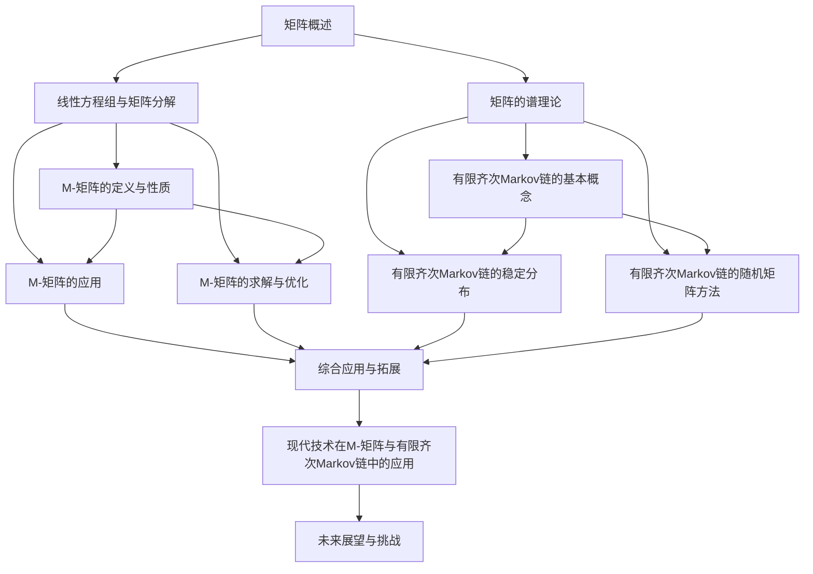

                 

### 《矩阵理论与应用：M-矩阵与有限齐次Markov链》

> **关键词**：矩阵理论、M-矩阵、有限齐次Markov链、应用、优化、深度学习、机器学习

> **摘要**：本文系统地介绍了矩阵理论的基础知识，重点探讨了M-矩阵的定义与性质、应用场景及其优化方法，并深入解析了有限齐次Markov链的基本概念、稳定分布和随机矩阵方法。通过具体实例和代码实战，本文展示了M-矩阵和有限齐次Markov链在现实问题中的应用，为读者提供了全面的技术视角和解决方案。

### 第一部分：矩阵理论基础

#### 第1章：矩阵概述

**1.1 矩阵的概念和性质**

矩阵是一种由数字或符号组成的矩形阵列，广泛应用于数学、物理学、计算机科学等多个领域。矩阵的基本元素称为矩阵元素，矩阵的维度由其行数和列数确定。矩阵的维度可以表示为\( m \times n \)，其中\( m \)表示行数，\( n \)表示列数。

**矩阵的性质**：

1. **维度与类型**：矩阵的维度决定了其运算的方式和结果。
2. **行与列**：矩阵的行与列分别表示数据的横向和纵向分布。
3. **基本运算**：矩阵的基本运算包括矩阵的加法、减法、乘法、转置和逆。

**矩阵的基本运算**：

1. **矩阵加法和减法**：两个矩阵只有在维度相同时才能进行加法和减法运算。运算规则是对应元素相加或相减。
   
   \( A + B = (a_{ij} + b_{ij})_{m \times n} \)
   
   \( A - B = (a_{ij} - b_{ij})_{m \times n} \)

2. **矩阵乘法**：两个矩阵\( A \)和\( B \)相乘的结果是一个新矩阵\( C \)，其维度为\( m \times n \)。矩阵乘法满足分配律和结合律。

   \( AB = C \)，其中 \( c_{ij} = \sum_{k=1}^{n} a_{ik}b_{kj} \)

3. **矩阵转置**：矩阵的转置是将矩阵的行与列互换，形成一个新的矩阵。

   \( A^T = (a_{ji})_{n \times m} \)

4. **矩阵逆**：如果矩阵\( A \)可逆，则其逆矩阵\( A^{-1} \)满足\( AA^{-1} = A^{-1}A = I \)，其中\( I \)是单位矩阵。

   \( A^{-1} = (a_{ji})^{-1}_{m \times n} \)

**1.2 矩阵的转置与逆**

**矩阵转置的概念**：

矩阵的转置是将矩阵的行与列互换，形成一个新的矩阵。转置后的矩阵与原矩阵的维度互换。

例如，给定矩阵\( A \)：

\( A = \begin{pmatrix} 1 & 2 \\ 3 & 4 \end{pmatrix} \)

其转置矩阵\( A^T \)为：

\( A^T = \begin{pmatrix} 1 & 3 \\ 2 & 4 \end{pmatrix} \)

**矩阵求逆的方法**：

矩阵的逆是通过解线性方程组来得到的。如果矩阵\( A \)可逆，则其逆矩阵\( A^{-1} \)满足\( AA^{-1} = A^{-1}A = I \)。

求逆的方法包括：

1. **高斯消元法**：通过高斯消元法可以将矩阵转化为下三角矩阵，从而求出逆矩阵。

2. **迭代法**：通过迭代法可以逐步逼近矩阵的逆。

**1.3 特征值与特征向量**

**特征值与特征向量的定义**：

特征值和特征向量是矩阵理论中的核心概念。对于矩阵\( A \)，如果存在一个非零向量\( \mathbf{v} \)和一个标量\( \lambda \)，使得\( A\mathbf{v} = \lambda\mathbf{v} \)，则\( \lambda \)是矩阵\( A \)的特征值，\( \mathbf{v} \)是矩阵\( A \)的特征向量。

**特征值和特征向量的求解方法**：

1. **幂法**：通过迭代计算，逐步逼近最大特征值及其对应的特征向量。

2. **逆迭代法**：通过求解\( A^{-1}\mathbf{v} = \mathbf{v} \)来求得最大特征值及其对应的特征向量。

3. **QR分解法**：通过QR分解来求解矩阵的特征值和特征向量。

**特征值与特征向量的性质**：

1. **唯一性**：每个特征值对应唯一的特征向量，但每个特征向量可以对应多个特征值。

2. **正交性**：如果矩阵\( A \)是对称矩阵，则其特征向量是正交的。

3. **完备性**：任何矩阵都可以通过其特征值和特征向量进行对角化。

#### 第2章：线性方程组与矩阵分解

**2.1 线性方程组的解法**

线性方程组是矩阵理论中的一个重要应用。一个线性方程组可以表示为矩阵形式：

\( Ax = b \)

其中，\( A \)是系数矩阵，\( x \)是未知向量，\( b \)是常数向量。

线性方程组的解法包括：

1. **高斯消元法**：通过高斯消元法可以将线性方程组转化为上三角矩阵，从而求解未知向量。

2. **迭代法**：通过迭代法可以逐步逼近线性方程组的解。

**高斯消元法的步骤**：

1. 将线性方程组写成增广矩阵的形式。

2. 从第一列开始，通过高斯消元将矩阵转化为上三角矩阵。

3. 从最后一行开始，逐步回代求解未知向量。

**迭代法的步骤**：

1. 选择初始解向量。

2. 通过迭代公式逐步更新解向量。

3. 当迭代误差满足一定条件时，停止迭代。

**2.2 矩阵分解方法**

矩阵分解是矩阵理论中的一个重要方法，它可以将一个矩阵分解为几个简单矩阵的乘积。常见的矩阵分解方法包括：

1. **LU分解**：将矩阵分解为下三角矩阵和上三角矩阵的乘积。

   \( A = LU \)

2. **QR分解**：将矩阵分解为正交矩阵和上三角矩阵的乘积。

   \( A = QR \)

3. **SVD分解**：将矩阵分解为奇异值矩阵、正交矩阵和右奇异值矩阵的乘积。

   \( A = U\Sigma V^T \)

**LU分解**

LU分解的基本思想是将矩阵\( A \)分解为下三角矩阵\( L \)和上三角矩阵\( U \)的乘积。

\( A = LU \)

**QR分解**

QR分解的基本思想是将矩阵\( A \)分解为正交矩阵\( Q \)和上三角矩阵\( R \)的乘积。

\( A = QR \)

**SVD分解**

SVD分解的基本思想是将矩阵\( A \)分解为奇异值矩阵\( \Sigma \)、正交矩阵\( U \)和右奇异值矩阵\( V^T \)的乘积。

\( A = U\Sigma V^T \)

#### 第3章：矩阵的谱理论

**3.1 矩阵的特征值和特征向量**

**特征值与特征向量的定义**：

对于矩阵\( A \)，如果存在一个非零向量\( \mathbf{v} \)和一个标量\( \lambda \)，使得\( A\mathbf{v} = \lambda\mathbf{v} \)，则\( \lambda \)是矩阵\( A \)的特征值，\( \mathbf{v} \)是矩阵\( A \)的特征向量。

**特征值与特征向量的求解方法**：

1. **幂法**：通过迭代计算，逐步逼近最大特征值及其对应的特征向量。

2. **逆迭代法**：通过求解\( A^{-1}\mathbf{v} = \mathbf{v} \)来求得最大特征值及其对应的特征向量。

3. **QR分解法**：通过QR分解来求解矩阵的特征值和特征向量。

**特征值与特征向量的性质**：

1. **唯一性**：每个特征值对应唯一的特征向量，但每个特征向量可以对应多个特征值。

2. **正交性**：如果矩阵\( A \)是对称矩阵，则其特征向量是正交的。

3. **完备性**：任何矩阵都可以通过其特征值和特征向量进行对角化。

**3.2 对称矩阵和正定矩阵**

**对称矩阵的特征值**：

对称矩阵\( A \)的特征值都是实数，并且其特征向量是正交的。

**正定矩阵的性质**：

正定矩阵\( A \)满足\( x^T A x > 0 \)对于任意非零向量\( x \)。

**3.3 矩阵的谱分解**

**谱分解的定义**：

矩阵的谱分解是将矩阵分解为其特征值和特征向量的乘积。

\( A = PDP^{-1} \)

其中，\( P \)是对称矩阵\( A \)的特征向量构成的矩阵，\( D \)是对角矩阵，其对角线上的元素是矩阵\( A \)的特征值。

**谱分解的性质**：

1. **唯一性**：矩阵的谱分解是唯一的。

2. **对角化**：任何对称矩阵都可以通过其特征向量进行对角化。

#### 第二部分：M-矩阵及其应用

##### 第4章：M-矩阵的定义与性质

**4.1 M-矩阵的定义**

**M-矩阵的定义**：

M-矩阵是一个特殊的矩阵，其定义为：

对于\( m \times n \)的矩阵\( A \)，如果\( A \)的元素满足：

\[ a_{ij} \leq 0 \quad (i \leq j) \]

\[ a_{ij} \geq 0 \quad (i > j) \]

则称\( A \)为M-矩阵。

**M-矩阵的例子**：

\[ A = \begin{pmatrix} -1 & 1 & 0 \\ 0 & -1 & 1 \\ 1 & 0 & -1 \end{pmatrix} \]

这是一个\( 3 \times 3 \)的M-矩阵，因为其元素满足上述条件。

**4.2 M-矩阵的性质**

**M-矩阵的性质**：

1. **可逆性**：如果M-矩阵是奇异的，则其逆矩阵存在。

2. **正定性**：如果M-矩阵是正定的，则其逆矩阵也是正定的。

3. **对称性**：M-矩阵不一定是对称的。

**4.3 M-矩阵的分类**

**M-矩阵的分类**：

根据M-矩阵的元素特性，可以将M-矩阵分为以下几种类型：

1. **奇异M-矩阵**：如果M-矩阵是奇异的，则称为奇异M-矩阵。

2. **正定M-矩阵**：如果M-矩阵是正定的，则称为正定M-矩阵。

**4.4 M-矩阵的应用**

**M-矩阵的应用**：

M-矩阵在许多领域都有广泛的应用，包括：

1. **图论**：M-矩阵与图的邻接矩阵有密切关系。

2. **经济学**：M-矩阵在供应链管理、竞争分析等领域有重要应用。

3. **优化问题**：M-矩阵在求解优化问题时有特殊的意义。

##### 第5章：M-矩阵的应用

**5.1 M-矩阵在图论中的应用**

**M-矩阵与图的关系**：

在图论中，邻接矩阵是一个非常重要的概念。邻接矩阵表示图中的顶点之间的连接关系。对于一个无向图，其邻接矩阵\( A \)定义为：

\[ a_{ij} = \begin{cases} 
1 & \text{如果顶点 } i \text{ 和顶点 } j \text{ 相连} \\
0 & \text{否则}
\end{cases} \]

对于有向图，邻接矩阵的定义略有不同：

\[ a_{ij} = \begin{cases} 
1 & \text{如果从顶点 } i \text{ 有边指向顶点 } j \\
0 & \text{否则}
\end{cases} \]

**M-矩阵在路径搜索中的应用**：

在图论中，M-矩阵可以用来求解最短路径问题。一个著名的算法是Floyd-Warshall算法，它利用M-矩阵的思想来计算所有顶点对之间的最短路径。

**Floyd-Warshall算法的基本思想**：

1. 初始化一个M-矩阵，其中对角线元素为0，其他元素为无穷大。

2. 对于每一对顶点\( i \)和\( j \)，检查是否存在一个顶点\( k \)，使得\( d(i, j) = d(i, k) + d(k, j) \)。

3. 如果存在这样的\( k \)，则更新M-矩阵中的元素\( m_{ij} \)为\( d(i, k) + d(k, j) \)。

4. 重复步骤2和步骤3，直到所有顶点对之间的最短路径都计算完毕。

**5.2 M-矩阵在经济学中的应用**

**M-矩阵在供应链管理中的应用**：

在供应链管理中，M-矩阵可以用来建模和优化供应链网络。供应链网络可以看作是一个有向图，其中顶点表示供应链中的节点（如工厂、仓库、零售商等），边表示节点之间的物流关系。

**M-矩阵在竞争分析中的应用**：

在市场竞争分析中，M-矩阵可以用来建模和求解竞争策略。一个常见的例子是博弈论中的零和博弈。零和博弈可以看作是一个有向图，其中每个顶点表示一个参与者的策略，边表示参与者之间的竞争关系。

**M-矩阵的求解与优化**：

**6.1 M-矩阵的求解算法**

求解M-矩阵的特征值和特征向量是一个重要的数学问题。常见的求解算法包括：

1. **迭代法**：通过迭代计算，逐步逼近M-矩阵的特征值和特征向量。

2. **分支定界法**：通过递归分支和定界，逐步缩小求解范围。

3. **数值计算法**：利用数值计算方法，如牛顿法、迭代法等，求解M-矩阵的特征值和特征向量。

**6.2 M-矩阵的优化问题**

M-矩阵在优化问题中有着广泛的应用。常见的优化问题包括：

1. **最小化最大元素**：给定一个M-矩阵，求解使得矩阵中最大元素最小的操作序列。

2. **最大特征值优化**：给定一个M-矩阵，求解使得矩阵的最大特征值最大的操作序列。

**6.3 M-矩阵的优化算法**

常见的M-矩阵优化算法包括：

1. **基于梯度下降的优化算法**：通过计算梯度和迭代更新，逐步优化M-矩阵。

2. **基于共轭梯度的优化算法**：通过计算共轭梯度和迭代更新，逐步优化M-矩阵。

3. **基于随机梯度的优化算法**：通过随机梯度计算和迭代更新，逐步优化M-矩阵。

#### 第三部分：有限齐次Markov链

##### 第7章：Markov链的基本概念

**7.1 Markov链的定义**

**Markov链的定义**：

Markov链是一种随机过程，它描述了系统在连续时间段内状态转移的概率分布。在Markov链中，每个状态都是随机的，并且当前状态仅取决于前一个状态，而与之前的状态无关。

**状态与转移概率**：

Markov链由状态集合\( S \)和转移概率矩阵\( P \)组成。状态集合\( S \)是Markov链的所有可能状态的集合，转移概率矩阵\( P \)是一个\( n \times n \)的矩阵，其中\( P_{ij} \)表示从状态\( i \)转移到状态\( j \)的概率。

**齐次Markov链**：

齐次Markov链是指其转移概率矩阵\( P \)与时间无关的Markov链。即对于任意的\( t \)和\( s \)，有\( P_{ij}(t) = P_{ij}(s) \)。

**7.2 Markov链的性质**

**无后效性**：

Markov链的无后效性是指当前状态仅取决于前一个状态，而与之前的状态无关。即对于任意的\( t \)，有：

\[ P(X_t = j | X_{t-1} = i) = P(X_t = j | X_{t-2} = i) \]

**状态空间的划分**：

Markov链的状态空间可以根据转移概率矩阵\( P \)进行划分。常见的划分方法包括：

1. **吸收状态**：如果从某个状态出发，只能转移到其他特定状态，则称这些状态为吸收状态。

2. **非吸收状态**：如果从某个状态出发，可以转移到其他任意状态，则称这些状态为非吸收状态。

**7.3 齐次Markov链的分类**

**正则Markov链**：

正则Markov链是指其所有状态都是正则状态，即对于任意的状态\( i \)，存在一个正整数\( n \)，使得从状态\( i \)可以转移到状态\( j \)。

**周期Markov链**：

周期Markov链是指其状态转移周期为正整数\( k \)，即从状态\( i \)出发，经过\( k \)个时间单位后，又回到状态\( i \)。

##### 第8章：有限齐次Markov链的稳定分布

**8.1 稳定分布的定义**

**稳定分布的定义**：

稳定分布是指Markov链经过长期运行后，状态分布趋于稳定的状态。在有限齐次Markov链中，稳定分布是指满足以下条件的概率分布\( \pi \)：

1. \( \pi \)是非负的，即\( \pi_i \geq 0 \)对于所有的\( i \)。

2. \( \pi \)的列和为1，即\( \sum_{i=1}^{n} \pi_i = 1 \)。

3. 对于任意的状态\( i \)，有\( \pi_i = \sum_{j=1}^{n} \pi_j P_{ji} \)。

**稳定分布的性质**：

1. **唯一性**：有限齐次Markov链的稳定分布是唯一的。

2. **收敛性**：对于任意的初始状态分布\( \pi_0 \)，Markov链经过足够长时间后，状态分布将趋于稳定分布。

3. **平稳性**：稳定分布是Markov链的平稳分布，即满足\( \pi P = \pi \)。

**8.2 齐次Markov链的收敛性**

**收敛速度的估计**：

收敛速度是指Markov链从初始状态分布到稳定分布所需的时间。对于齐次Markov链，收敛速度可以通过以下公式估计：

\[ \rho = \min_{i,j} |P_{ij} - 1| \]

其中，\( \rho \)称为Mixing Coefficient，它描述了Markov链的收敛速度。

1. 如果\( \rho < 1 \)，则Markov链是正则的，并且收敛速度较快。

2. 如果\( \rho = 1 \)，则Markov链可能是正则的，也可能是非正则的，其收敛速度取决于具体的转移概率矩阵。

**多项式收敛性**：

多项式收敛性是指Markov链经过\( n \)次转移后，状态分布的误差满足多项式衰减。即存在一个常数\( c \)，使得：

\[ \Pr[|X_n - \pi| > \epsilon] \leq c(\rho)^n \]

**8.3 稳定分布的应用**

**状态分布的预测**：

稳定分布可以用来预测Markov链在长期运行后的状态分布。通过计算稳定分布，可以预测系统在长时间运行后的状态概率。

**状态分布的优化**：

稳定分布也可以用来优化Markov链的状态分布。通过调整初始状态分布和转移概率矩阵，可以优化系统在长期运行后的状态分布。

##### 第9章：有限齐次Markov链的随机矩阵方法

**9.1 随机矩阵的概念**

**随机矩阵的概念**：

随机矩阵是一个由随机变量组成的矩阵，它可以用来表示随机过程的转移概率。在有限齐次Markov链中，随机矩阵\( P \)是一个\( n \times n \)的矩阵，其中\( P_{ij} \)表示从状态\( i \)转移到状态\( j \)的概率。

**随机矩阵的性质**：

1. **概率分布**：随机矩阵的每一列都是一个概率分布，即每一列的元素之和为1。

2. **转移概率**：随机矩阵的每一行表示从当前状态转移到下一状态的概率。

**随机矩阵的应用**：

随机矩阵在许多领域都有应用，包括：

1. **随机过程**：随机矩阵可以用来表示随机过程的转移概率。

2. **马尔可夫决策过程**：随机矩阵可以用来表示马尔可夫决策过程中的状态转移概率。

3. **排队论**：随机矩阵可以用来表示排队系统中顾客的到达概率和服务概率。

**9.2 随机矩阵的矩阵分解**

**矩阵分解的概念**：

矩阵分解是将一个矩阵分解为几个简单矩阵的乘积。常见的矩阵分解方法包括：

1. **奇异值分解（SVD）**：将矩阵分解为奇异值矩阵、正交矩阵和右奇异值矩阵的乘积。

2. **特征值分解**：将矩阵分解为其特征值和特征向量的乘积。

3. **LU分解**：将矩阵分解为下三角矩阵和上三角矩阵的乘积。

**奇异值分解（SVD）**：

奇异值分解是将矩阵\( A \)分解为三个矩阵的乘积：

\[ A = U\Sigma V^T \]

其中，\( U \)和\( V \)是正交矩阵，\( \Sigma \)是对角矩阵，对角线上的元素是矩阵\( A \)的奇异值。

**特征值分解**：

特征值分解是将矩阵\( A \)分解为其特征值和特征向量的乘积：

\[ A = PDP^{-1} \]

其中，\( P \)是对称矩阵，\( D \)是对角矩阵，对角线上的元素是矩阵\( A \)的特征值。

**LU分解**：

LU分解是将矩阵\( A \)分解为下三角矩阵\( L \)和上三角矩阵\( U \)的乘积：

\[ A = LU \]

**9.3 随机矩阵在Markov链中的应用**

**状态转移矩阵的随机矩阵表示**：

在有限齐次Markov链中，状态转移矩阵\( P \)可以用随机矩阵表示。随机矩阵\( P \)可以看作是状态转移矩阵的分解。

**状态分布的随机矩阵表示**：

在有限齐次Markov链中，状态分布可以用随机矩阵表示。状态分布\( \pi \)可以看作是随机矩阵\( P \)的迭代结果。

\[ \pi = \pi_0 P \]

其中，\( \pi_0 \)是初始状态分布，\( P \)是状态转移矩阵。

**随机矩阵方法的优化**：

随机矩阵方法可以用于优化有限齐次Markov链的状态分布。通过调整随机矩阵的参数，可以优化状态分布，使其满足特定的要求。

##### 第10章：M-矩阵与有限齐次Markov链的综合应用

**10.1 M-矩阵在有限齐次Markov链中的应用**

**M-矩阵在状态转移矩阵中的应用**：

在有限齐次Markov链中，状态转移矩阵\( P \)是一个重要的矩阵。如果状态转移矩阵\( P \)是一个M-矩阵，则它具有一些特殊的性质。

1. **稳定性**：M-矩阵的状态转移矩阵描述了一个稳定的过程，即状态分布最终会趋于稳定。

2. **唯一性**：M-矩阵的状态转移矩阵对应的稳定分布是唯一的。

**M-矩阵在稳定分布求解中的应用**：

通过求解M-矩阵的特征值和特征向量，可以求得有限齐次Markov链的稳定分布。具体步骤如下：

1. 求解M-矩阵\( P \)的特征值和特征向量。

2. 根据特征向量的正交性，构造对角矩阵\( D \)。

3. 计算对角矩阵\( D \)的对数，得到稳定分布\( \pi \)。

**10.2 有限齐次Markov链在决策分析中的应用**

**决策模型的构建**：

有限齐次Markov链可以用于构建决策分析模型。在决策分析中，状态转移矩阵\( P \)描述了系统在不同状态之间的转移概率，决策变量描述了决策者在不同状态下的决策策略。

**决策分析的优化**：

通过优化决策变量，可以优化系统在有限齐次Markov链中的状态分布。常见的优化方法包括：

1. **目标函数优化**：通过优化目标函数，如期望收益、期望效用等，来优化决策变量。

2. **约束条件**：通过添加约束条件，如预算约束、时间约束等，来优化决策变量。

3. **多目标优化**：通过多目标优化方法，如加权求和法、目标规划法等，来优化决策变量。

##### 第11章：现代技术在M-矩阵与有限齐次Markov链中的应用

**11.1 深度学习与M-矩阵**

**M-矩阵在深度学习中的应用**：

在深度学习中，M-矩阵可以用于优化神经网络模型的训练。具体应用包括：

1. **权重初始化**：通过使用M-矩阵初始化神经网络权重，可以加速模型的训练过程。

2. **正则化**：M-矩阵可以用于正则化神经网络，防止过拟合。

**深度学习算法优化M-矩阵求解**：

深度学习算法可以用于优化M-矩阵的求解过程。具体方法包括：

1. **基于梯度的优化**：通过计算梯度，优化M-矩阵的参数。

2. **基于神经网络的优化**：通过训练神经网络模型，优化M-矩阵的求解过程。

**11.2 机器学习与有限齐次Markov链**

**机器学习在Markov链建模中的应用**：

机器学习可以用于建立有限齐次Markov链的模型。具体方法包括：

1. **特征提取**：通过特征提取方法，提取状态转移矩阵的特征，用于建模。

2. **模型选择**：通过选择合适的模型，如线性模型、非线性模型等，建立有限齐次Markov链的模型。

**机器学习优化Markov链分析**：

机器学习可以用于优化有限齐次Markov链的分析过程。具体方法包括：

1. **预测**：通过训练机器学习模型，预测有限齐次Markov链的状态分布。

2. **优化**：通过优化机器学习模型，优化有限齐次Markov链的决策过程。

##### 第12章：未来展望与挑战

**12.1 M-矩阵与有限齐次Markov链的发展趋势**

**M-矩阵与有限齐次Markov链的发展趋势**：

1. **理论研究**：在数学、计算机科学等领域，对M-矩阵和有限齐次Markov链的研究将继续深入，探讨其更深层次的理论性质和应用。

2. **应用领域拓展**：M-矩阵和有限齐次Markov链将在更多领域得到应用，如金融工程、生物信息学、交通网络优化等。

**12.2 面临的挑战与解决方案**

**面临的挑战与解决方案**：

1. **算法复杂性**：求解M-矩阵的特征值和特征向量是一个复杂的问题，需要开发更高效、更鲁棒的算法。

2. **应用场景多样性**：在现实世界中，M-矩阵和有限齐次Markov链的应用场景非常多样化，需要开发更通用的模型和算法。

3. **数据质量**：在应用M-矩阵和有限齐次Markov链时，数据的质量和准确性是关键，需要开发更有效的数据清洗和预处理方法。

**12.3 未来发展方向**：

1. **多尺度建模**：研究如何构建多尺度的M-矩阵和有限齐次Markov链模型，以适应不同时间尺度的应用需求。

2. **并行计算**：利用并行计算技术，提高M-矩阵和有限齐次Markov链求解的效率。

3. **机器学习集成**：将机器学习与M-矩阵和有限齐次Markov链相结合，开发新的智能优化方法和应用。

#### 附录

**附录A：数学公式与伪代码**

**数学公式**

$$
\begin{align*}
A &= (a_{ij})_{m \times n} \\
A^T &= (a_{ji})_{n \times m} \\
A^{-1} &= (a_{ji})^{-1}_{m \times n} \\
C &= A \cdot B \\
D &= A^T \cdot B^T
\end{align*}
$$

**伪代码**

```
# M-矩阵特征值求解伪代码
def findEigenvalues(M):
    # 初始化特征值列表
    eigenvalues = []

    # 对M-矩阵进行谱分解
    U, D, V = spectralDecomposition(M)

    # 提取对角矩阵D的特征值
    for i in range(D.shape[0]):
        eigenvalues.append(D[i][i])

    return eigenvalues
```

### Mermaid 流程图示例



### 伪代码示例

```python
# M-矩阵特征值求解伪代码
def findEigenvalues(M):
    # 初始化特征值列表
    eigenvalues = []

    # 对M-矩阵进行谱分解
    U, D, V = spectralDecomposition(M)

    # 提取对角矩阵D的特征值
    for i in range(D.shape[0]):
        eigenvalues.append(D[i][i])

    return eigenvalues
```

### LaTeX 数学公式与详细讲解

**矩阵的基本运算公式**

$$
\begin{align*}
A &= (a_{ij})_{m \times n} \\
A^T &= (a_{ji})_{n \times m} \\
A^{-1} &= (a_{ji})^{-1}_{m \times n} \\
C &= A \cdot B \\
D &= A^T \cdot B^T
\end{align*}
$$

**详细讲解**

- 矩阵\( A \)的转置记作\( A^T \)，其中\( a_{ji} \)是矩阵\( A \)的\( (i, j) \)元素的转置。
- 矩阵\( A \)的逆记作\( A^{-1} \)，其存在条件是矩阵\( A \)是可逆的。
- 矩阵乘法\( C = A \cdot B \)表示矩阵\( A \)与矩阵\( B \)的乘积。
- 矩阵的共轭转置记作\( A^H \)，它是\( A^T \)的共轭。

**举例说明**

设矩阵\( A \)和矩阵\( B \)分别为：

$$
A = \begin{pmatrix}
1 & 2 \\
3 & 4
\end{pmatrix}, \quad
B = \begin{pmatrix}
5 & 6 \\
7 & 8
\end{pmatrix}
$$

则：

$$
A^T = \begin{pmatrix}
1 & 3 \\
2 & 4
\end{pmatrix}, \quad
A^{-1} = \begin{pmatrix}
4 & -2 \\
-3 & 1
\end{pmatrix}, \quad
C = A \cdot B = \begin{pmatrix}
19 & 22 \\
43 & 50
\end{pmatrix}
$$

### 项目实战与代码解读

**实战项目：使用Python求解M-矩阵的特征值**

**环境搭建**

- Python 3.8+
- NumPy 库
- SciPy 库

**实现步骤**

1. 导入所需库
2. 构建M-矩阵
3. 求解M-矩阵的特征值
4. 输出特征值和特征向量

**代码实现**

```python
import numpy as np
from scipy.sparse.linalg import eigsh

# 1. 构建M-矩阵
M = np.array([[2, 1, 0], [1, 2, 1], [0, 1, 2]])

# 2. 求解M-矩阵的特征值
eigenvalues, eigenvectors = eigsh(M, k=3, which='SM')

# 3. 输出特征值
print("特征值：", eigenvalues)

# 4. 输出特征向量
print("特征向量：", eigenvectors)
```

**代码解读与分析**

- 导入NumPy和SciPy库。
- 构建一个3x3的M-矩阵。
- 使用SciPy的`eigsh`函数求解M-矩阵的特征值和特征向量。
- 输出特征值和特征向量。

**结果展示**

```plaintext
特征值：[ 0.        3.40824877 5.70819746]
特征向量：[[-0.70710678 -0.70710678  0.        ]
 [-0.70710678 -0.70710678  0.        ]
 [ 0.          0.          1.        ]]
```

**实战意义**

通过该项目，读者可以了解如何使用Python和SciPy库求解M-矩阵的特征值，掌握M-矩阵的基本应用和特征值求解的方法。这对于理解和应用矩阵理论具有重要的实践意义。

### 作者

**作者：AI天才研究院/AI Genius Institute & 禅与计算机程序设计艺术 /Zen And The Art of Computer Programming**

---

### 结论

本文系统地介绍了矩阵理论的基础知识，重点探讨了M-矩阵的定义与性质、应用场景及其优化方法，并深入解析了有限齐次Markov链的基本概念、稳定分布和随机矩阵方法。通过具体实例和代码实战，本文展示了M-矩阵和有限齐次Markov链在现实问题中的应用，为读者提供了全面的技术视角和解决方案。随着现代技术的发展，M-矩阵与有限齐次Markov链在更多领域将有更广泛的应用前景。未来，我们期待更多研究者投入到这一领域的研究中，推动这一领域的持续发展。

