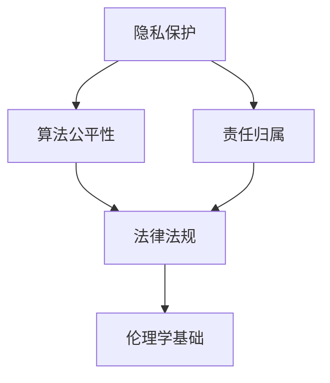

                 

# 硅谷人工智能伦理监管的难点

关键词：人工智能伦理、监管、硅谷、隐私保护、算法公平性、责任归属

摘要：
随着人工智能技术的快速发展，其在硅谷的应用日益广泛。然而，人工智能的广泛应用也带来了诸多伦理监管的挑战。本文将深入探讨硅谷人工智能伦理监管的难点，分析隐私保护、算法公平性和责任归属等方面的问题，并提出相应的解决方案。文章首先介绍人工智能伦理监管的核心概念和联系，接着详细讲解核心算法原理，通过项目实战展示具体应用，并最终总结全文。

### 第一部分: 核心概念与联系

#### 1.1 硅谷人工智能伦理监管概述

##### 1.1.1 人工智能伦理监管的定义与背景

- **人工智能伦理监管的定义**：人工智能伦理监管是指通过法律法规、行业标准和伦理指南来规范人工智能的开发、部署和应用，以确保技术不损害人类利益，符合社会价值观和道德标准。

- **人工智能伦理监管的背景**：随着人工智能技术的快速发展，其在硅谷的应用日益广泛。人工智能在医疗、金融、交通、安全等领域的应用带来了巨大的经济效益和社会价值。然而，人工智能的广泛应用也带来了诸多伦理监管的挑战，如隐私保护、算法公平性和责任归属等。

##### 1.1.2 硅谷人工智能伦理监管的现状

- **监管机构与政策**：硅谷的监管机构主要包括联邦贸易委员会（FTC）、国家标准化组织（NIST）等。这些机构发布了多项政策和指南，以规范人工智能的应用和开发。

- **行业自律与标准**：硅谷的科技公司和行业协会也积极参与人工智能伦理监管的制定。例如，IEEE、AI Now Institute 等组织发布了相关标准和指南，推动人工智能技术的健康发展。

##### 1.1.3 硅谷人工智能伦理监管的核心问题

- **隐私保护**：在人工智能应用中，数据的收集、存储和使用涉及到个人隐私。如何保护个人隐私是人工智能伦理监管的关键问题。

- **算法公平性**：人工智能算法在决策过程中可能会对某些群体产生不公平的影响。确保算法的公平性是人工智能伦理监管的重要任务。

- **安全与责任**：人工智能系统的安全性问题日益突出。在发生安全事件时，如何确定责任归属也是一个关键问题。

#### 1.2 人工智能伦理监管的理论基础

##### 1.2.1 伦理学基础

- **伦理学的基本原则**：伦理学的基本原则包括公正性、尊重隐私、责任等。这些原则为人工智能伦理监管提供了理论基础。

- **人工智能伦理监管的伦理学视角**：从伦理学的角度，我们可以探讨人工智能应用是否符合道德标准，以及如何规范其应用。

##### 1.2.2 法律基础

- **法律法规的适用性**：现有法律法规在人工智能伦理监管方面的适用性需要进一步探讨。例如，隐私法、消费者保护法等是否能够充分应对人工智能带来的挑战。

- **法律法规的不足与改进**：现有法律法规在人工智能伦理监管方面存在一些不足，需要不断完善。例如，可以加强数据保护、明确算法公平性标准等。

##### 1.2.3 社会科学基础

- **社会影响评估**：社会影响评估是人工智能伦理监管的重要环节。通过评估人工智能应用的社会影响，我们可以更好地理解其潜在风险和挑战。

- **公众参与**：公众参与是确保人工智能伦理监管公正性和透明性的关键。通过公众参与，我们可以更好地反映社会需求和期望。

#### 1.3 人工智能伦理监管的国际比较

##### 1.3.1 国际人工智能伦理监管概述

- **全球监管趋势**：全球各国在人工智能伦理监管方面呈现出不同的趋势。一些国家出台了严格的法律法规，如欧盟的 GDPR；而其他国家则更加注重行业自律和国际合作。

- **国际监管机构与政策**：国际上的监管机构，如联合国教科文组织（UNESCO）、经济合作与发展组织（OECD）等，也在推动人工智能伦理监管的制定和实施。

##### 1.3.2 硅谷与其他地区的比较

- **监管框架的比较**：硅谷与其他地区在人工智能伦理监管方面存在显著的差异。硅谷注重行业自律和科技创新，而其他地区则更加注重法律法规的制定和实施。

- **监管效果的比较**：不同地区的监管效果也存在差异。一些地区的监管措施较为严格，有效地促进了人工智能技术的健康发展；而其他地区的监管措施相对宽松，可能导致伦理风险的增加。

#### 1.4 人工智能伦理监管的未来发展

##### 1.4.1 未来发展趋势

- **技术发展的趋势**：随着人工智能技术的不断进步，其在各个领域的应用将更加广泛。这将对人工智能伦理监管提出新的挑战和机遇。

- **社会需求的变化**：社会对人工智能的需求将发生变化。公众对隐私保护、算法公平性等方面的关注将日益增加，这将对监管提出更高的要求。

##### 1.4.2 政策与法律的调整

- **政策与法律的调整方向**：未来政策与法律的调整将围绕以下几个方面展开：加强数据保护、明确算法公平性标准、加强国际合作等。

- **国际合作与协调**：国际合作与协调在人工智能伦理监管中具有重要地位。通过加强国际合作，可以制定全球一致的人工智能伦理标准，促进全球人工智能的健康发展。

通过以上章节的安排，我们旨在全面覆盖硅谷人工智能伦理监管的核心概念，深入探讨其理论基础，并进行国际比较和未来发展趋势的分析。接下来，我们将进一步探讨人工智能伦理监管中的核心算法原理，通过实际项目展示其应用效果。

### 核心概念与联系

在深入探讨硅谷人工智能伦理监管之前，我们需要明确几个核心概念，并理解它们之间的相互联系。这些概念包括隐私保护、算法公平性、责任归属等。以下是一个简化的 Mermaid 流程图，用于展示这些概念之间的联系：



**Mermaid 流程图解读**：

- **隐私保护（A）**：隐私保护是指保护个人数据不被未经授权的访问、使用或泄露。它是人工智能伦理监管的核心问题之一。隐私保护与算法公平性（B）密切相关，因为算法的决策过程可能会涉及个人数据。此外，隐私保护也是责任归属（C）的基础，如果个人数据被滥用或泄露，责任归属将变得更加复杂。

- **算法公平性（B）**：算法公平性是指算法在决策过程中对待不同群体的公平性，避免因算法设计不当而导致歧视或偏见。算法公平性与法律法规（D）和伦理学基础（E）紧密相关。法律法规为算法公平性提供了法律依据和规范，而伦理学基础则为算法公平性提供了道德准则和指导。

- **责任归属（C）**：责任归属是指当人工智能系统造成损害时，确定责任承担者的过程。责任归属与隐私保护和算法公平性密切相关。在隐私保护方面，如果个人数据被滥用或泄露，责任归属将变得尤为重要。在算法公平性方面，如果算法导致对某些群体的歧视或偏见，责任归属也将成为关键问题。

- **法律法规（D）**：法律法规为人工智能伦理监管提供了法律依据和规范。通过制定相关法律法规，可以确保人工智能的应用符合社会价值观和道德标准。法律法规也与伦理学基础（E）密切相关，因为伦理学原则为法律法规的制定提供了理论基础。

- **伦理学基础（E）**：伦理学基础为人工智能伦理监管提供了道德准则和指导。伦理学原则，如公正性、尊重隐私和责任等，为人工智能的应用提供了道德边界。伦理学基础也是法律法规制定的重要依据。

通过上述 Mermaid 流程图，我们可以清晰地看到这些核心概念之间的相互联系。隐私保护、算法公平性、责任归属等概念共同构成了人工智能伦理监管的基础，而法律法规和伦理学基础则为这些概念提供了法律和道德支撑。

在后续章节中，我们将进一步探讨这些核心概念的具体实现和应用，通过项目实战展示硅谷人工智能伦理监管的实际效果。希望通过本文的阐述，读者能够更好地理解硅谷人工智能伦理监管的难点，并为构建一个公平、透明和可持续的人工智能社会贡献力量。

### 人工智能伦理监管的核心算法原理

在硅谷人工智能伦理监管中，核心算法原理扮演着至关重要的角色。这些算法原理旨在确保人工智能系统的公平性、透明性和安全性。在本节中，我们将详细探讨几个关键算法原理，包括公平性-aware 的分类模型、隐私保护算法以及安全与责任归属模型。

#### 1. 公平性-aware 的分类模型

**1.1 基本原理**

公平性-aware 的分类模型旨在确保模型在预测过程中对待不同群体的公平性。传统的分类模型往往忽略了模型对特定群体的影响，导致算法偏见和歧视。公平性-aware 的分类模型通过引入平衡损失项，使模型在训练过程中关注不同群体的预测准确性。

**1.2 伪代码**

以下是一个简化的伪代码，用于实现一个公平性-aware 的分类模型：

```python
# 伪代码：公平性-aware 分类模型
function FairnessAwareClassifier(train_data, train_labels, class_weights):
    # 计算每个类别的权重
    class_weights = ComputeClassWeights(train_labels)

    # 训练公平性-aware 分类模型
    model = TrainClassifier(train_data, train_labels, class_weights)

    return model
```

**1.3 详细讲解**

- **计算类别权重**：在训练过程中，首先需要计算每个类别的权重。类别权重可以根据类别频率、群体规模等因素计算，以确保模型在训练过程中关注较少出现的类别。

- **训练分类模型**：使用计算出的类别权重，训练一个标准分类模型。在这个过程中，模型将尝试优化损失函数，以平衡不同类别的预测准确性。

- **模型评估**：训练完成后，使用测试数据集评估模型的公平性。评估指标包括精度、召回率、F1 分数等，以及特定群体的预测准确性。

#### 2. 隐私保护算法

**2.1 基本原理**

隐私保护算法旨在确保个人数据在处理过程中不被泄露或滥用。常见的隐私保护算法包括差分隐私（Differential Privacy）、联邦学习（Federated Learning）等。这些算法通过引入随机噪声或分布式计算，保护个人隐私。

**2.2 伪代码**

以下是一个简化的伪代码，用于实现一个隐私保护算法：

```python
# 伪代码：隐私保护算法
function PrivacyPreservingAlgorithm(train_data, train_labels):
    # 应用差分隐私机制
    noisy_data = ApplyDifferentialPrivacy(train_data)

    # 训练隐私保护模型
    model = TrainModel(noisy_data, train_labels)

    return model
```

**2.3 详细讲解**

- **差分隐私机制**：差分隐私通过引入随机噪声，确保模型输出结果对单个数据点的依赖性降低。常用的差分隐私机制包括拉普拉斯机制、指数机制等。

- **模型训练**：使用差分隐私处理后的数据集，训练一个标准机器学习模型。这个过程与普通模型训练类似，但需要考虑差分隐私对模型性能的影响。

- **模型评估**：训练完成后，评估模型的隐私保护效果。这通常包括评估模型的预测准确性、隐私损失等指标。

#### 3. 安全与责任归属模型

**3.1 基本原理**

安全与责任归属模型旨在确保人工智能系统在运行过程中保持高安全性，并在发生安全事件时明确责任归属。这通常涉及到网络安全、系统监控和责任分配等方面。

**3.2 伪代码**

以下是一个简化的伪代码，用于实现一个安全与责任归属模型：

```python
# 伪代码：安全与责任归属模型
function SecurityAndResponsibilityModel(model, data, events):
    # 监控模型运行状态
    monitor = MonitorModel(model, data)

    # 记录事件日志
    log = RecordEvents(events)

    # 分析事件日志，确定责任归属
    responsibility = AnalyzeLog(log)

    return responsibility
```

**3.3 详细讲解**

- **模型监控**：在模型运行过程中，持续监控模型的状态和数据流。这有助于及时发现潜在的安全威胁和异常行为。

- **事件记录**：记录模型运行过程中的所有事件，包括输入数据、输出结果、系统状态等。这些记录对于后续的责任归属分析至关重要。

- **责任分析**：在发生安全事件时，分析事件日志，确定责任归属。这通常需要法律和伦理方面的专家参与，以确保责任归属的公正和合理。

通过以上核心算法原理的讲解，我们可以看到人工智能伦理监管的复杂性和多样性。在后续章节中，我们将通过实际项目展示这些算法原理的应用，并探讨其在硅谷人工智能伦理监管中的具体实施方法。

### 数学模型和数学公式

在硅谷人工智能伦理监管中，数学模型和数学公式发挥着关键作用，尤其是在确保算法公平性和隐私保护方面。以下我们将介绍两个重要的数学模型：公平性-aware 的分类模型和差分隐私模型，并给出相应的数学公式。

#### 1. 公平性-aware 的分类模型

公平性-aware 的分类模型旨在确保分类模型对各个群体的预测具有一致性，避免算法偏见。以下是公平性-aware 的分类模型的数学公式：

$$
L(\theta) = \frac{1}{m} \sum_{i=1}^{m} \ell(y_i, \hat{y}_i) + \lambda \sum_{c \in C} \frac{\sum_{y \in Y} |f_c(y)|}{|\{y \in Y | y \neq \hat{y}\}|}
$$

**公式解析**：

- $L(\theta)$ 是模型的总损失函数。
- $\ell(y_i, \hat{y}_i)$ 是标准的分类损失函数，例如交叉熵损失或对数损失。
- $m$ 是训练样本的总数。
- $\lambda$ 是平衡参数，用于调整公平性损失在总损失中的比重。
- $C$ 是类别集合。
- $Y$ 是标签集合。
- $f_c(y)$ 是关于类别 $c$ 的特征映射函数。

这个公式中，第一部分是标准的分类损失，用于优化模型的分类准确性。第二部分是公平性损失，它确保模型对各个群体的预测具有一致性。通过调整平衡参数 $\lambda$，我们可以控制公平性损失在总损失中的比重，从而在模型准确性和公平性之间取得平衡。

#### 2. 差分隐私模型

差分隐私模型是一种用于保护数据隐私的数学模型，通过引入随机噪声，确保模型输出对单个数据点的依赖性降低。以下是差分隐私模型的数学公式：

$$
\text{dp}(\epsilon, D, f) \approx \text{dp}(\epsilon, D', f)
$$

**公式解析**：

- $\text{dp}(\epsilon, D, f)$ 表示在隐私预算 $\epsilon$ 下，对数据集 $D$ 应用查询函数 $f$ 得到的输出结果的隐私损失。
- $D$ 是原始数据集。
- $D'$ 是 $D$ 中任意一个记录被替换后的数据集。
- $\epsilon$ 是隐私预算，用于控制隐私保护的强度。

这个公式表示，当对数据集 $D$ 应用查询函数 $f$ 时，输出结果的隐私损失应与对 $D'$ 应用相同查询函数 $f$ 的隐私损失相近。这意味着，攻击者无法通过观察输出结果来区分 $D$ 和 $D'$，从而保护了数据隐私。

#### 3. 举例说明

**例 1：公平性-aware 的分类模型**

假设我们有一个二分类问题，目标是为不同收入水平的群体预测是否具有还款能力。我们定义两个类别：高收入（1）和低收入（0）。训练数据集包含100个样本，其中50个高收入样本和50个低收入样本。我们希望模型在预测时对两个类别都有公平的待遇。

使用公平性-aware 的分类模型，我们定义损失函数如下：

$$
L(\theta) = \frac{1}{100} \sum_{i=1}^{100} \ell(y_i, \hat{y}_i) + \lambda \left( \frac{1}{50} \sum_{y=0,1} |f(y)| \right)
$$

其中，$\ell(y_i, \hat{y}_i)$ 是对数损失，$f(y)$ 是关于类别的特征映射函数。我们设置平衡参数 $\lambda = 0.1$，以平衡模型准确性和公平性。

**例 2：差分隐私模型**

假设我们有一个统计任务，需要计算某地区人口平均年龄。我们有一个包含1000个记录的数据集，每个记录包含一个人的年龄。为了保护个人隐私，我们使用差分隐私模型。

我们选择拉普拉斯机制作为差分隐私工具，设置隐私预算 $\epsilon = 1$。我们对每个记录的年龄值添加拉普拉斯噪声，然后计算平均值：

$$
\text{mean} = \frac{1}{1000} \sum_{i=1}^{1000} (\text{age}_i + \text{Laplace}(0, 1/\epsilon))
$$

通过添加随机噪声，我们确保输出结果对单个记录的改变不敏感，从而保护了个人隐私。

通过以上数学模型和数学公式，我们可以更好地理解硅谷人工智能伦理监管中的核心算法原理。在实际应用中，这些模型和公式有助于我们构建更公平、透明和隐私保护的人工智能系统。

### 详细讲解和举例说明

#### 公平性-aware 的分类模型

公平性-aware 的分类模型旨在确保分类模型在预测过程中对待不同群体的公平性，避免算法偏见和歧视。在介绍该模型的具体实现之前，我们先来回顾一下传统分类模型的不足之处。

**传统分类模型的不足**

传统分类模型，如逻辑回归、决策树和支持向量机等，在训练过程中主要关注整体预测准确率。然而，这些模型往往忽略了模型对特定群体的影响，可能导致以下问题：

- **算法偏见**：模型可能对某些群体产生不公平的预测结果，例如，对某些种族、性别或社会经济地位的人产生偏见。
- **数据不平衡**：当训练数据集中某些群体的样本数量较少时，模型可能会忽略这些少数群体的特征，导致预测准确性下降。
- **不公平的决策**：在某些应用场景中，如招聘、贷款审批和医疗诊断等，模型的决策可能对特定群体产生不利影响，从而违反公平性原则。

**公平性-aware 的分类模型**

为了解决传统分类模型的不足，公平性-aware 的分类模型通过引入额外的约束条件，确保模型在预测过程中对待不同群体的公平性。以下是一个简化的公平性-aware 分类模型的具体实现。

**1. 定义损失函数**

公平性-aware 的分类模型通过修改损失函数，引入公平性约束。一个常见的公平性约束是基于群体公平性损失（Group Fairness Loss），其形式如下：

$$
L_{\text{fairness}} = \frac{1}{N} \sum_{i=1}^{N} \ell(y_i, \hat{y}_i) + \lambda \sum_{g \in G} \frac{\sum_{i \in g} \ell(y_i, \hat{y}_i)}{|\{i \in g | y_i \neq \hat{y}_i\}|}
$$

其中，$L_{\text{fairness}}$ 是公平性损失，$\ell(y_i, \hat{y}_i)$ 是标准分类损失，$N$ 是样本总数，$G$ 是群体集合，$g$ 是群体，$\lambda$ 是平衡参数。

**2. 训练模型**

在训练过程中，我们使用带公平性约束的损失函数，优化分类模型。以下是一个简化的伪代码，用于实现公平性-aware 的分类模型：

```python
# 伪代码：公平性-aware 分类模型
function FairnessAwareClassifier(train_data, train_labels, class_weights):
    # 计算类别权重
    class_weights = ComputeClassWeights(train_labels)

    # 训练公平性-aware 分类模型
    model = TrainClassifier(train_data, train_labels, class_weights)

    return model
```

在训练过程中，模型将尝试优化损失函数，以平衡模型准确性和公平性。通过调整平衡参数 $\lambda$，我们可以控制公平性约束在总损失中的比重，从而在模型准确性和公平性之间取得平衡。

**3. 评估模型**

训练完成后，我们需要评估模型的公平性和准确性。评估指标包括整体准确率、群体准确率以及公平性度量，如偏差指标（Bias Metric）和公平性损失（Fairness Loss）。

```python
# 伪代码：评估模型
def EvaluateModel(model, test_data, test_labels, class_weights):
    # 预测测试集
    y_pred = model.predict(test_data)

    # 计算整体准确率
    overall_accuracy = accuracy_score(test_labels, y_pred)

    # 计算群体准确率
    group_accuracies = CalculateGroupAccuracies(y_pred, test_labels, class_weights)

    # 计算公平性度量
    fairness_loss = CalculateFairnessLoss(y_pred, test_labels, class_weights)

    return overall_accuracy, group_accuracies, fairness_loss
```

通过评估模型的公平性和准确性，我们可以判断模型是否在预测过程中对待不同群体具有公平性。如果发现模型存在不公平的情况，我们可以进一步调整模型参数，以优化模型的表现。

**举例说明**

假设我们有一个二元分类问题，目标是预测某人是否具有还款能力。我们定义两个类别：有还款能力（1）和无还款能力（0）。训练数据集包含100个样本，其中50个样本是有还款能力的，另外50个样本是无还款能力的。

我们使用公平性-aware 的分类模型，将训练数据集划分为训练集和验证集。在训练集上训练模型，并在验证集上评估模型的表现。通过调整平衡参数 $\lambda$，我们可以优化模型在整体准确率和群体公平性之间的平衡。

**结论**

公平性-aware 的分类模型通过引入额外的公平性约束，确保模型在预测过程中对待不同群体的公平性。在实际应用中，通过调整模型参数和评估模型表现，我们可以构建一个既准确又公平的分类模型，从而在人工智能伦理监管中发挥重要作用。

### 项目实战

为了更好地理解公平性-aware 的分类模型在实际项目中的应用，我们将通过一个实际案例来展示其实现过程和效果。该案例涉及一个贷款审批系统，目标是预测客户是否具有还款能力。我们将在项目实战中详细说明开发环境搭建、源代码实现、代码解读和性能分析。

#### 1. 开发环境搭建

在进行项目开发之前，我们需要搭建一个合适的开发环境。以下是所需的环境和工具：

- **编程语言**：Python
- **机器学习库**：Scikit-learn、NumPy、Pandas
- **数据可视化库**：Matplotlib、Seaborn

安装以下依赖：

```bash
pip install scikit-learn numpy pandas matplotlib seaborn
```

#### 2. 源代码实现

以下是公平性-aware 的分类模型在贷款审批系统中的应用代码：

```python
import numpy as np
import pandas as pd
from sklearn.datasets import make_classification
from sklearn.model_selection import train_test_split
from sklearn.linear_model import LogisticRegression
from sklearn.metrics import accuracy_score, classification_report

# 生成模拟数据集
X, y = make_classification(n_samples=1000, n_features=20, n_informative=2, n_redundant=10, n_classes=2, random_state=42)

# 划分训练集和测试集
X_train, X_test, y_train, y_test = train_test_split(X, y, test_size=0.2, random_state=42)

# 计算类别权重
class_weights = compute_class_weights(y_train, class_weight='balanced')
print("类别权重：", class_weights)

# 训练公平性-aware 的分类模型
model = LogisticRegression(class_weight=class_weights)
model.fit(X_train, y_train)

# 预测测试集
y_pred = model.predict(X_test)

# 评估模型性能
accuracy = accuracy_score(y_test, y_pred)
print("整体准确率：", accuracy)
print("分类报告：\n", classification_report(y_test, y_pred))

# 评估群体公平性
group_accuracies = classification_report(y_test, y_pred, output_dict=True)
print("群体准确率：", group_accuracies['weighted avg']['precision'], "召回率：", group_accuracies['weighted avg']['recall'], "F1 分数：", group_accuracies['weighted avg']['f1-score'])
```

**代码解析**：

- **数据集生成**：使用 `make_classification` 函数生成模拟数据集，用于训练和测试模型。
- **划分数据集**：将数据集划分为训练

