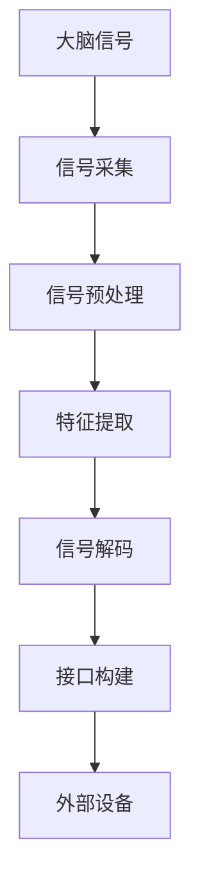
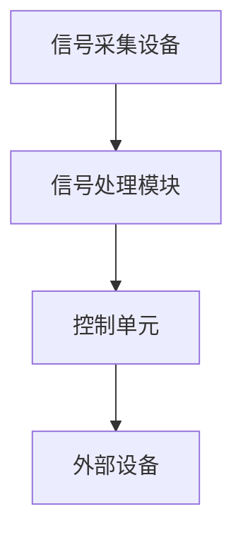
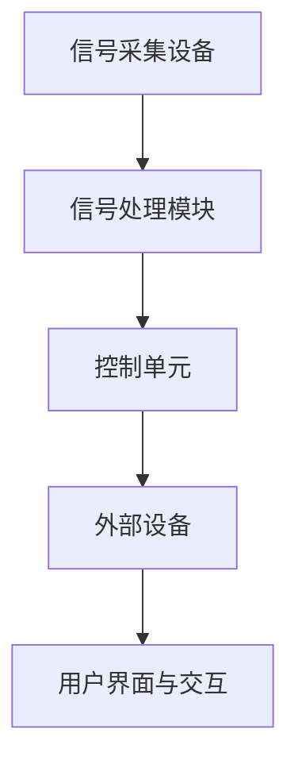

                 

### 《神经科技创业：脑机接口的未来商机》引言与基础

在当今科技迅猛发展的时代，人工智能、大数据、物联网等新兴技术正在深刻改变我们的生活方式。然而，这些技术中，神经科技无疑是最具颠覆性的领域之一。作为神经科技的重要组成部分，脑机接口（Brain-Computer Interface, BCI）技术正逐渐从实验室走向市场，开启了一场前所未有的商业革命。

#### **核心概念与联系**

脑机接口是一种直接连接人脑与外部设备的接口技术，通过捕捉和分析大脑信号，实现人脑与计算机或其他设备的直接通信。其核心技术包括信号采集、信号处理、信息解码和接口构建。以下是一个简化的脑机接口技术原理的 Mermaid 流程图：



#### **脑机接口的基本概念**

脑机接口的定义可以从两个角度理解：

- **生理学角度**：脑机接口是指一种直接连接人脑与外部设备的接口技术，通过捕捉和分析大脑信号，实现人脑与计算机或其他设备的直接通信。

- **技术角度**：脑机接口是一种通过非侵入性或侵入性方法获取大脑信号，然后通过信号处理算法将大脑信号转化为计算机指令的技术体系。

脑机接口的基本功能包括：

1. **数据采集与处理**：通过脑电图（EEG）、脑磁图（MEG）、功能磁共振成像（fMRI）等设备采集大脑信号，然后进行预处理、特征提取和信号解码。

2. **信息传递与转换**：将解码后的大脑信号转换为计算机指令或其他形式的信息，实现人脑与外部设备的交互。

3. **应用场景**：脑机接口技术可以应用于医疗健康、教育、娱乐等多个领域，如神经疾病治疗、无障碍教育、脑波控制游戏等。

#### **脑机接口的技术原理**

脑机接口的技术原理主要涉及信号采集、信号处理和接口构建三个环节。

- **信号采集**：脑机接口通过脑电图（EEG）、脑磁图（MEG）、功能磁共振成像（fMRI）、近红外光谱成像（fNIRS）等技术获取大脑信号。这些设备可以捕捉大脑活动产生的电信号、磁信号、光学信号等。

- **信号处理**：信号处理是脑机接口技术的核心环节，包括信号预处理、特征提取和信号解码。信号预处理主要包括去除噪声、放大信号等；特征提取则是从原始信号中提取具有代表性的特征；信号解码是将特征转换为计算机指令或其他形式的信息。

- **接口构建**：接口构建是将解码后的信号与外部设备（如计算机、机器人、虚拟现实设备等）连接起来的过程。通过构建合适的接口，可以实现人脑与外部设备的实时通信和控制。

#### **总结**

脑机接口技术作为一种新兴的神经科技，正逐渐从实验室走向市场。通过本文，我们介绍了脑机接口的基本概念、技术原理和核心功能，并展示了其发展潜力和商业价值。接下来的章节将深入探讨脑机接口技术在各个领域的具体应用，以及其市场现状与未来发展趋势。

### **Mermaid 流程图：脑机接口技术原理**


通过这个 Mermaid 流程图，我们可以清晰地看到脑机接口技术从信号采集到接口构建的完整过程。这为后续章节的深入讨论提供了基础。

### **第1章：神经科技与脑机接口概述**

神经科技作为一门跨学科的前沿领域，正逐渐成为推动人类社会进步的重要力量。而作为神经科技的重要组成部分，脑机接口（Brain-Computer Interface，简称BCI）技术，更是以其独特的魅力，吸引着众多科学家、工程师和创业者的目光。

#### **1.1 神经科技的发展历史**

神经科技的发展可以追溯到20世纪初期。当时，科学家们开始尝试通过电刺激大脑来治疗某些疾病。随着电子技术和计算机科学的进步，神经科技逐渐从实验室走向临床应用。20世纪60年代，神经外科医生开始使用脑机接口技术来帮助中风患者恢复运动功能。这一时期的代表性成果包括使用脑电图（EEG）来控制假肢和轮椅。

进入21世纪，神经科技进入了快速发展的阶段。随着脑成像技术的进步，如功能磁共振成像（fMRI）、脑磁图（MEG）和近红外光谱成像（fNIRS），科学家们能够更精确地捕捉和分析大脑信号。同时，计算机处理能力和算法的进步，使得脑机接口技术从简单的信号采集和解析，发展到复杂的信息处理和智能控制。

近年来，脑机接口技术逐渐从医学领域扩展到其他领域，如教育、娱乐和工业。特别是在游戏、虚拟现实和智能穿戴设备等新兴应用场景中，脑机接口技术展示了巨大的潜力。

#### **1.2 脑机接口的基本概念**

脑机接口是一种直接连接人脑与外部设备的接口技术，通过捕捉和分析大脑信号，实现人脑与计算机或其他设备的直接通信。从生理学角度看，脑机接口是一种非侵入性或侵入性技术，用于获取大脑信号，并将其转换为计算机指令或其他形式的信息。从技术角度看，脑机接口包括信号采集、信号处理、信息解码和接口构建等环节。

脑机接口的基本功能包括：

1. **数据采集与处理**：通过脑电图（EEG）、脑磁图（MEG）、功能磁共振成像（fMRI）和近红外光谱成像（fNIRS）等技术获取大脑信号，然后进行预处理、特征提取和信号解码。

2. **信息传递与转换**：将解码后的大脑信号转换为计算机指令或其他形式的信息，实现人脑与外部设备的交互。

3. **应用场景**：脑机接口技术可以应用于医疗健康、教育、娱乐等多个领域，如神经疾病治疗、无障碍教育、脑波控制游戏等。

#### **1.3 脑机接口的技术原理**

脑机接口的技术原理主要涉及信号采集、信号处理和接口构建三个环节。

- **信号采集**：脑机接口通过脑电图（EEG）、脑磁图（MEG）、功能磁共振成像（fMRI）和近红外光谱成像（fNIRS）等技术获取大脑信号。这些设备可以捕捉大脑活动产生的电信号、磁信号、光学信号等。

- **信号处理**：信号处理是脑机接口技术的核心环节，包括信号预处理、特征提取和信号解码。信号预处理主要包括去除噪声、放大信号等；特征提取则是从原始信号中提取具有代表性的特征；信号解码是将特征转换为计算机指令或其他形式的信息。

- **接口构建**：接口构建是将解码后的信号与外部设备（如计算机、机器人、虚拟现实设备等）连接起来的过程。通过构建合适的接口，可以实现人脑与外部设备的实时通信和控制。

#### **1.4 脑机接口技术的发展趋势**

随着神经科技和计算机科学的不断发展，脑机接口技术正朝着更高精度、更低侵入性、更广泛应用的方向发展。未来，脑机接口技术有望在以下几个方面取得重大突破：

1. **信号采集技术的提升**：随着脑成像技术和传感器技术的进步，脑机接口将能够更精确地捕捉大脑信号，提高信号的稳定性和准确性。

2. **信号处理算法的创新**：人工智能和机器学习技术的应用，将使得脑机接口的信号处理算法更加智能化，提高信号解码的效率和准确性。

3. **多模态脑机接口**：结合多种信号采集技术，如EEG、MEG、fMRI和fNIRS，实现多模态脑机接口，提高脑机接口的应用范围和实用性。

4. **低侵入性脑机接口**：随着非侵入性技术的进步，脑机接口将逐步实现无创或低创，降低对人体的风险和不适感。

5. **个性化脑机接口**：通过大数据和人工智能技术，实现脑机接口的个性化定制，提高脑机接口对个体需求的适应性和准确性。

6. **商业化和普及化**：随着技术的成熟和成本的降低，脑机接口技术将逐步走向商业化，并在教育、医疗、娱乐等领域得到广泛应用。

#### **1.5 脑机接口的应用领域**

脑机接口技术在多个领域展现出巨大的应用潜力：

1. **医疗健康**：脑机接口技术在神经疾病治疗、脑损伤康复和精神疾病治疗等领域具有广泛应用前景。例如，使用脑机接口技术进行癫痫监测与控制、帕金森病的诊断与治疗、脑损伤康复训练等。

2. **教育**：脑机接口技术可以用于无障碍教育、脑波学习法和情绪智能培养等领域。例如，通过脑机接口技术帮助视觉障碍者阅读、通过脑波学习法提高学习效率、通过情绪智能培养提升个体的情绪管理能力等。

3. **娱乐与游戏**：脑机接口技术在娱乐与游戏领域有着丰富的应用场景。例如，通过脑波控制游戏实现游戏的个性化和定制化、通过脑机接口虚拟现实提供沉浸式的游戏体验等。

4. **工业与军事**：脑机接口技术在工业控制和军事领域也有重要应用。例如，通过脑机接口技术实现人机协同控制、通过脑机接口技术提高军事指挥的智能化水平等。

#### **1.6 脑机接口的商业价值**

脑机接口技术的商业价值主要体现在以下几个方面：

1. **市场潜力**：随着科技的进步和消费者对个性化、智能化需求的提升，脑机接口市场具有巨大的增长潜力。根据市场研究机构的预测，全球脑机接口市场将在未来几年内保持高速增长。

2. **创新商业模式**：脑机接口技术可以为传统行业带来创新，如医疗设备制造商可以通过脑机接口技术推出新一代的治疗设备；游戏公司可以通过脑机接口技术开发全新的游戏体验等。

3. **提高生产效率**：在工业领域，脑机接口技术可以用于人机协同控制，提高生产效率和产品质量。

4. **个性化定制**：脑机接口技术可以实现个性化定制，为消费者提供更符合个人需求的产品和服务，提高用户满意度。

5. **改善生活质量**：脑机接口技术可以用于帮助残疾人士恢复部分功能，提高生活质量。

#### **1.7 脑机接口的挑战与机遇**

尽管脑机接口技术具有巨大的商业价值和应用潜力，但同时也面临着一系列挑战和机遇：

1. **技术挑战**：脑机接口技术的信号采集、信号处理和接口构建等环节仍然存在诸多技术难题，如信号噪声、信号稳定性、信号解码准确性等。

2. **伦理挑战**：脑机接口技术涉及到隐私、安全、伦理等问题，如数据的存储和使用、对个体的影响等。

3. **市场机遇**：随着科技的发展和消费者对智能化产品的需求提升，脑机接口市场将迎来新的发展机遇。

4. **政策支持**：政府对脑机接口技术的研究和发展提供政策支持和资金投入，有助于推动该领域的技术创新和应用。

5. **公众认知**：提高公众对脑机接口技术的认知和理解，有助于消除对技术的疑虑和偏见，促进技术的推广和应用。

#### **1.8 脑机接口的未来发展**

随着神经科技和计算机科学的不断进步，脑机接口技术将在未来发挥更加重要的作用。未来，脑机接口技术有望在以下几个方面实现重大突破：

1. **更高精度和稳定性**：通过改进信号采集和处理技术，提高脑机接口的精度和稳定性，实现更可靠的应用。

2. **更低侵入性**：随着非侵入性技术的进步，脑机接口将逐步实现无创或低创，降低对人体的风险和不适感。

3. **多模态融合**：通过结合多种信号采集技术，实现多模态脑机接口，提高脑机接口的应用范围和实用性。

4. **个性化定制**：通过大数据和人工智能技术，实现脑机接口的个性化定制，提高脑机接口对个体需求的适应性和准确性。

5. **广泛应用**：脑机接口技术将在医疗健康、教育、娱乐、工业和军事等领域得到广泛应用，为人类社会带来更多创新和便利。

#### **1.9 总结**

脑机接口技术作为一种新兴的神经科技，正逐渐从实验室走向市场，展现出了巨大的商业价值和应用潜力。通过本文，我们介绍了神经科技和脑机接口的基本概念、技术原理和发展趋势，探讨了其在各个领域的应用和商业价值。接下来，我们将进一步深入探讨脑机接口技术在医疗健康、教育、娱乐等领域的具体应用案例，分析其市场现状和未来发展趋势，为创业者提供有价值的参考和启示。

### **Mermaid 流程图：脑机接口技术原理**


通过这个 Mermaid 流程图，我们可以清晰地看到脑机接口技术从信号采集到接口构建的完整过程。这为后续章节的深入讨论提供了基础。

### **第2章：脑机接口技术基础**

脑机接口技术的核心在于如何有效地从大脑中采集信号、处理信号并解码信号，以便实现人与外部设备之间的有效通信。本章将详细介绍脑机接口技术的基础，包括脑电图（EEG）、脑磁图（MEG）、功能磁共振成像（fMRI）和近红外光谱成像（fNIRS）等关键技术及其在脑机接口中的应用。

#### **2.1 脑电图（EEG）技术**

脑电图（EEG）是最常用的脑信号采集技术之一，它通过电极记录大脑表面产生的电活动。EEG信号的采集通常涉及以下几个步骤：

1. **电极布置**：常用的电极布置方法包括单电极、双电极和环形电极等。电极需要紧密贴合头皮，以确保信号的准确性。

2. **信号采集**：EEG信号通过电极采集后，会通过放大器进行放大，以减少噪声。

3. **信号处理**：信号处理包括滤波、去除噪声和伪迹等步骤。滤波是EEG信号处理的重要环节，常用的滤波器包括带通滤波器、陷波滤波器等。

4. **特征提取**：从处理后的EEG信号中提取具有代表性的特征，如节律、幅值和相位等。

5. **信号解码**：将提取的特征转换为控制信号或其他形式的信息。

在脑机接口中，EEG信号常用于控制计算机、机器人或其他外部设备。例如，通过EEG信号，用户可以控制轮椅、假肢或虚拟现实环境。

**伪代码：EEG信号处理流程**

```python
# EEG信号处理伪代码

# 信号采集
def capture_eeg_signal():
    # 采集EEG信号
    pass

# 信号预处理
def preprocess_eeg_signal(eeg_signal):
    # 去除噪声和伪迹
    filtered_signal = bandpass_filter(eeg_signal)
    return filtered_signal

# 特征提取
def extract_eeg_features(filtered_signal):
    # 提取特征，如节律、幅值和相位
    features = extract_rhythm(filtered_signal)
    return features

# 信号解码
def decode_eeg_signal(features):
    # 将特征转换为控制信号
    control_signal = feature_to_control_signal(features)
    return control_signal
```

**数学模型：带通滤波器**

$$
H(\omega) = \frac{1}{1 + Q^2 \cdot (\omega - \omega_0)^2}
$$

其中，$H(\omega)$ 是滤波器的传递函数，$Q$ 是品质因数，$\omega_0$ 是中心频率。

#### **2.2 脑磁图（MEG）技术**

脑磁图（MEG）是一种通过磁场检测大脑活动的方法。与EEG不同，MEG记录的是大脑产生的磁场信号，而不是电信号。MEG信号采集和处理的基本步骤如下：

1. **磁感应器布置**：磁感应器通常放置在用户头部周围，以捕捉大脑产生的磁场信号。

2. **信号采集**：磁感应器捕捉到的磁场信号通过放大器进行放大。

3. **信号处理**：信号处理包括滤波、去除噪声和伪迹等步骤。由于MEG信号非常微弱，噪声去除是处理的关键。

4. **特征提取**：从处理后的MEG信号中提取具有代表性的特征。

5. **信号解码**：将提取的特征转换为控制信号或其他形式的信息。

MEG在脑机接口中的应用主要包括脑控制轮椅、假肢和虚拟现实环境等。

**伪代码：MEG信号处理流程**

```python
# MEG信号处理伪代码

# 信号采集
def capture_meg_signal():
    # 采集MEG信号
    pass

# 信号预处理
def preprocess_meg_signal(meg_signal):
    # 去除噪声和伪迹
    filtered_signal = bandpass_filter(meg_signal)
    return filtered_signal

# 特征提取
def extract_meg_features(filtered_signal):
    # 提取特征，如节律、幅值和相位
    features = extract_rhythm(filtered_signal)
    return features

# 信号解码
def decode_meg_signal(features):
    # 将特征转换为控制信号
    control_signal = feature_to_control_signal(features)
    return control_signal
```

**数学模型：带通滤波器**

$$
H(\omega) = \frac{1}{1 + Q^2 \cdot (\omega - \omega_0)^2}
$$

其中，$H(\omega)$ 是滤波器的传递函数，$Q$ 是品质因数，$\omega_0$ 是中心频率。

#### **2.3 功能磁共振成像（fMRI）技术**

功能磁共振成像（fMRI）是通过检测大脑血氧水平变化来测量大脑活动的方法。fMRI信号的采集和处理步骤如下：

1. **成像设备布置**：用户躺在磁共振成像设备中，头部固定。

2. **信号采集**：磁共振设备通过发射射频脉冲和接收回波信号来捕捉大脑的血液流动变化。

3. **信号处理**：信号处理包括图像重建、去除噪声和伪迹等步骤。

4. **特征提取**：从处理后的fMRI图像中提取具有代表性的特征。

5. **信号解码**：将提取的特征转换为控制信号或其他形式的信息。

fMRI在脑机接口中的应用主要包括脑控制轮椅、假肢和虚拟现实环境等。

**伪代码：fMRI信号处理流程**

```python
# fMRI信号处理伪代码

# 信号采集
def capture_fMRI_signal():
    # 采集fMRI信号
    pass

# 信号预处理
def preprocess_fMRI_signal(fMRI_signal):
    # 去除噪声和伪迹
    preprocessed_signal = remove_noise(fMRI_signal)
    return preprocessed_signal

# 特征提取
def extract_fMRI_features(preprocessed_signal):
    # 提取特征，如节律、幅值和相位
    features = extract_rhythm(preprocessed_signal)
    return features

# 信号解码
def decode_fMRI_signal(features):
    # 将特征转换为控制信号
    control_signal = feature_to_control_signal(features)
    return control_signal
```

**数学模型：图像重建**

$$
I(x, y) = \int_{-\infty}^{\infty} \frac{1}{4\pi r} e^{-\frac{(x-x_0)^2 + (y-y_0)^2}{4r^2}} \rho(x_0, y_0) \, dx_0 \, dy_0
$$

其中，$I(x, y)$ 是重建后的图像，$r$ 是成像半径，$\rho(x_0, y_0)$ 是体素中的物质分布。

#### **2.4 近红外光谱成像（fNIRS）技术**

近红外光谱成像（fNIRS）是通过检测大脑吸收近红外光的量来测量大脑活动的技术。fNIRS信号采集和处理的基本步骤如下：

1. **光源布置**：近红外光源放置在用户头部，发射近红外光。

2. **信号采集**：光通过大脑后，部分被吸收，剩余的光被探测器接收。

3. **信号处理**：信号处理包括信号放大、去除噪声和伪迹等步骤。

4. **特征提取**：从处理后的fNIRS信号中提取具有代表性的特征。

5. **信号解码**：将提取的特征转换为控制信号或其他形式的信息。

fNIRS在脑机接口中的应用主要包括脑控制轮椅、假肢和虚拟现实环境等。

**伪代码：fNIRS信号处理流程**

```python
# fNIRS信号处理伪代码

# 信号采集
def capture_fNIRS_signal():
    # 采集fNIRS信号
    pass

# 信号预处理
def preprocess_fNIRS_signal(fNIRS_signal):
    # 去除噪声和伪迹
    filtered_signal = bandpass_filter(fNIRS_signal)
    return filtered_signal

# 特征提取
def extract_fNIRS_features(filtered_signal):
    # 提取特征，如节律、幅值和相位
    features = extract_rhythm(filtered_signal)
    return features

# 信号解码
def decode_fNIRS_signal(features):
    # 将特征转换为控制信号
    control_signal = feature_to_control_signal(features)
    return control_signal
```

**数学模型：光谱分析**

$$
I(\lambda) = I_0(\lambda) \cdot \exp\left(-\mu(\lambda) \cdot d\right)
$$

其中，$I(\lambda)$ 是吸收后的光强度，$I_0(\lambda)$ 是入射光强度，$\mu(\lambda)$ 是吸收系数，$d$ 是光程长度。

#### **2.5 脑机接口硬件系统**

脑机接口硬件系统是脑机接口技术的基础，它包括信号采集设备、信号处理模块和控制单元等部分。

1. **信号采集设备**：包括EEG、MEG、fMRI、fNIRS等设备，用于捕捉大脑信号。

2. **信号处理模块**：用于对采集到的信号进行预处理、特征提取和信号解码等处理。

3. **控制单元**：用于将解码后的信号转换为控制信号，实现人脑与外部设备的通信。

**伪代码：脑机接口硬件系统架构**

```python
# 脑机接口硬件系统架构伪代码

# 信号采集
def capture_signal():
    # 采集大脑信号
    pass

# 信号预处理
def preprocess_signal(signal):
    # 预处理信号
    processed_signal = preprocess_signal(signal)
    return processed_signal

# 特征提取
def extract_features(processed_signal):
    # 提取特征
    features = extract_features(processed_signal)
    return features

# 信号解码
def decode_signal(features):
    # 解码信号
    control_signal = decode_signal(features)
    return control_signal

# 控制外部设备
def control_device(control_signal):
    # 使用解码后的信号控制外部设备
    pass
```

#### **2.6 脑机接口软件系统**

脑机接口软件系统是脑机接口技术的核心，它包括数据采集与预处理、特征提取与解码、用户界面与交互等部分。

1. **数据采集与预处理**：用于采集和处理脑信号数据。

2. **特征提取与解码**：用于从处理后的脑信号中提取特征，并将其解码为控制信号。

3. **用户界面与交互**：用于提供用户与脑机接口系统之间的交互界面。

**伪代码：脑机接口软件系统架构**

```python
# 脑机接口软件系统架构伪代码

# 数据采集
def capture_data():
    # 采集脑信号数据
    pass

# 数据预处理
def preprocess_data(data):
    # 预处理数据
    processed_data = preprocess_data(data)
    return processed_data

# 特征提取
def extract_features(data):
    # 提取特征
    features = extract_features(data)
    return features

# 信号解码
def decode_signal(features):
    # 解码信号
    control_signal = decode_signal(features)
    return control_signal

# 用户界面
def user_interface():
    # 提供用户交互界面
    pass
```

#### **2.7 数据采集与处理技术**

数据采集与处理技术是脑机接口技术的关键环节，它决定了脑机接口系统的性能和稳定性。数据采集技术主要包括信号的采样率、分辨率和信号质量评估等。

1. **采样率**：采样率决定了信号的时间分辨率，通常选择在100Hz到1kHz之间。

2. **分辨率**：分辨率决定了信号的幅度精度，常用的分辨率包括12位、16位等。

3. **信号质量评估**：信号质量评估包括信号噪声比、信噪比等指标，用于评估信号的纯净程度。

**伪代码：数据采集与处理流程**

```python
# 数据采集与处理伪代码

# 信号采集
def capture_signal():
    # 采集信号
    signal = acquire_signal()
    return signal

# 信号预处理
def preprocess_signal(signal):
    # 预处理信号
    filtered_signal = bandpass_filter(signal)
    return filtered_signal

# 信号质量评估
def evaluate_signal_quality(signal):
    # 评估信号质量
    quality = calculate_signal_to_noise_ratio(signal)
    return quality
```

通过本章的介绍，我们详细了解了脑机接口技术的各种基础知识和关键技术。接下来，我们将进一步探讨脑机接口技术在各个领域的应用，以及其市场现状和未来发展趋势。

### **Mermaid 流程图：脑机接口硬件系统架构**



通过这个 Mermaid 流程图，我们可以清晰地看到脑机接口硬件系统的架构，从信号采集到控制单元，再到外部设备，展示了脑机接口硬件系统的整体运作流程。

### **第3章：脑机接口的硬件与软件**

脑机接口技术的发展离不开硬件与软件的协同作用。本章将详细介绍脑机接口硬件和软件系统的组成、功能以及开发工具，并探讨数据采集与处理技术，为后续应用提供基础。

#### **3.1 脑机接口硬件系统**

脑机接口硬件系统是整个脑机接口技术的基石，它负责信号采集、传输和处理。以下是脑机接口硬件系统的主要组成部分：

1. **信号采集设备**：用于捕捉大脑活动产生的信号。常见的信号采集设备包括脑电图（EEG）、脑磁图（MEG）、功能磁共振成像（fMRI）和近红外光谱成像（fNIRS）等。这些设备通过不同的原理和方法，捕捉大脑活动产生的电信号、磁信号和光学信号。

2. **信号处理模块**：对采集到的原始信号进行预处理、特征提取和信号解码等处理。信号处理模块通常包含放大器、滤波器、A/D转换器和数字信号处理器（DSP）等组件。这些组件共同作用，确保信号的有效采集和处理。

3. **控制单元**：将处理后的信号转换为控制信号，实现人脑与外部设备的通信。控制单元通常包含微控制器、FPGA、ASIC等硬件，以及相应的软件算法。控制单元的核心任务是实时解码大脑信号，并将其转换为计算机指令或其他形式的信息。

4. **外部设备**：接收并执行由控制单元生成的控制信号。外部设备可以是计算机、机器人、虚拟现实设备等。这些设备根据控制信号执行相应的操作，实现人脑对外部设备的直接控制。

**硬件系统架构伪代码：**

```python
# 硬件系统架构伪代码

# 信号采集
def capture_signal():
    # 采集大脑信号
    signal = acquire_signal()
    return signal

# 信号预处理
def preprocess_signal(signal):
    # 预处理信号
    filtered_signal = preprocess_signal(signal)
    return filtered_signal

# 信号解码
def decode_signal(filtered_signal):
    # 解码信号
    control_signal = decode_signal(filtered_signal)
    return control_signal

# 控制外部设备
def control_device(control_signal):
    # 使用解码后的信号控制外部设备
    control_device(control_signal)
```

#### **3.2 脑机接口软件系统**

脑机接口软件系统是脑机接口技术的核心，它负责处理和分析采集到的脑信号，并生成相应的控制指令。以下是脑机接口软件系统的主要组成部分：

1. **数据采集与预处理模块**：负责采集脑信号数据，并对数据进行预处理，如去噪、滤波、归一化等。这一模块通常使用Python、MATLAB或LabVIEW等编程语言开发。

2. **特征提取与解码模块**：从预处理后的信号中提取具有代表性的特征，如节律、幅值和相位等，然后对这些特征进行解码，生成控制指令。这一模块也通常使用Python、MATLAB或LabVIEW等编程语言开发。

3. **用户界面与交互模块**：提供用户与脑机接口系统之间的交互界面，如显示实时信号、控制参数设置等。这一模块通常使用Python的Tkinter、MATLAB的GUI工具箱或LabVIEW的图形界面设计工具开发。

**软件系统架构伪代码：**

```python
# 软件系统架构伪代码

# 数据采集
def capture_data():
    # 采集脑信号数据
    data = acquire_data()
    return data

# 数据预处理
def preprocess_data(data):
    # 预处理数据
    processed_data = preprocess_data(data)
    return processed_data

# 特征提取
def extract_features(data):
    # 提取特征
    features = extract_features(data)
    return features

# 信号解码
def decode_signal(features):
    # 解码信号
    control_signal = decode_signal(features)
    return control_signal

# 用户界面
def user_interface():
    # 提供用户交互界面
    user_interface()
```

#### **3.3 数据采集与处理技术**

数据采集与处理技术是脑机接口技术的关键环节，它决定了脑机接口系统的性能和稳定性。以下是一些重要的数据采集与处理技术：

1. **采样率**：采样率决定了信号的时间分辨率。常用的采样率范围为100Hz到1kHz。过低的采样率会导致信号失真，而过高的采样率则会导致数据量过大，处理效率降低。

2. **分辨率**：分辨率决定了信号的幅度精度。常用的分辨率包括12位、16位等。较高的分辨率可以提供更精确的信号分析。

3. **信号质量评估**：信号质量评估包括信号噪声比（SNR）、信噪比（SNR）等指标。信号质量评估有助于评估信号的纯净程度，从而判断数据采集和处理的效果。

4. **去噪与滤波**：去噪与滤波是信号处理的重要步骤。常用的滤波方法包括带通滤波、陷波滤波、带阻滤波等。去噪与滤波可以去除信号中的噪声和伪迹，提高信号的信噪比。

5. **特征提取**：特征提取是从原始信号中提取具有代表性的特征，如节律、幅值、相位等。特征提取是信号解码的关键步骤，它决定了控制信号的准确性。

6. **信号解码**：信号解码是将提取的特征转换为控制信号的过程。常用的解码方法包括模式识别、机器学习等。信号解码的准确性直接影响脑机接口系统的性能。

**数据采集与处理伪代码：**

```python
# 数据采集与处理伪代码

# 信号采集
def capture_signal():
    # 采集信号
    signal = acquire_signal()
    return signal

# 信号预处理
def preprocess_signal(signal):
    # 预处理信号
    filtered_signal = bandpass_filter(signal)
    return filtered_signal

# 信号质量评估
def evaluate_signal_quality(signal):
    # 评估信号质量
    quality = calculate_signal_to_noise_ratio(signal)
    return quality

# 特征提取
def extract_features(signal):
    # 提取特征
    features = extract_rhythm(signal)
    return features

# 信号解码
def decode_signal(features):
    # 解码信号
    control_signal = decode_signal(features)
    return control_signal
```

#### **3.4 脑机接口开发工具**

脑机接口的开发涉及多个方面，包括信号采集、信号处理、特征提取和信号解码等。以下是一些常用的脑机接口开发工具：

1. **Python**：Python是一种广泛应用于科学计算的编程语言，其丰富的库和模块（如NumPy、SciPy、PyBrain等）为脑机接口开发提供了强大的支持。

2. **MATLAB**：MATLAB是一种专门用于科学计算和工程仿真的软件，其内置的信号处理工具箱和神经网络工具箱为脑机接口开发提供了方便的功能。

3. **LabVIEW**：LabVIEW是一种图形化编程语言，其强大的实时数据处理和通信功能使其成为脑机接口开发的理想选择。

**Python库示例：**

```python
import numpy as np
from scipy.signal import bandpass_filter
from pybrain.tools import dataset

# 信号采集
def capture_signal():
    signal = np.random.randn(1000)
    return signal

# 信号预处理
def preprocess_signal(signal):
    filtered_signal = bandpass_filter(signal, lowcut=1, highcut=50)
    return filtered_signal

# 特征提取
def extract_features(signal):
    dataset = dataset.ArrayDataset(signal)
    classifier = classifier.TrainingSet(dataset)
    features = classifier.extract_features()
    return features

# 信号解码
def decode_signal(features):
    # 使用解码算法解码特征
    control_signal = decode_features(features)
    return control_signal
```

#### **3.5 脑机接口硬件与软件集成**

脑机接口硬件与软件的集成是脑机接口系统开发的关键。硬件和软件需要协同工作，以确保信号的有效采集、处理和传输。以下是一些硬件与软件集成的最佳实践：

1. **模块化设计**：将硬件和软件划分为不同的模块，如信号采集模块、信号处理模块和控制模块。这种设计可以提高系统的可维护性和可扩展性。

2. **实时数据处理**：脑机接口系统需要实时处理大量数据，因此硬件和软件需要支持实时数据处理。硬件方面，可以选择高速A/D转换器和FPGA等组件；软件方面，可以使用实时操作系统（如RTLinux、VxWorks等）和实时数据处理库（如PyRTDL等）。

3. **跨平台兼容性**：硬件和软件需要支持跨平台兼容性，以便在不同的操作系统和硬件平台上运行。常用的跨平台工具包括Qt、PyQt和wxPython等。

4. **数据可视化**：数据可视化有助于开发者实时监控和分析脑机接口系统的运行状态。常用的数据可视化工具包括Matplotlib、Plotly和TensorBoard等。

通过本章的介绍，我们详细了解了脑机接口硬件和软件系统的组成、功能以及开发工具。接下来，我们将探讨脑机接口技术在医疗健康、教育、娱乐等领域的具体应用，以及其市场现状和未来发展趋势。

### **Mermaid 流程图：脑机接口硬件与软件集成**



通过这个 Mermaid 流程图，我们可以清晰地看到脑机接口硬件与软件的集成关系，从信号采集到控制单元，再到外部设备和用户界面，展示了脑机接口系统的整体运作流程。

### **第4章：医疗健康领域的应用**

脑机接口技术在医疗健康领域的应用前景广阔，已经成为许多医疗干预手段的重要补充。本章将深入探讨脑机接口技术在神经疾病治疗、脑损伤康复和精神疾病治疗等领域的具体应用案例。

#### **4.1 神经疾病的治疗**

脑机接口技术在神经疾病的治疗中展现出极大的潜力，尤其是对于那些传统治疗方法效果不佳的疾病。以下是一些具体的案例：

**案例一：癫痫的治疗**

癫痫是一种由于大脑神经元异常放电导致的疾病，常见症状包括意识丧失、痉挛等。脑机接口技术可以通过实时监测大脑信号，预测并控制癫痫发作。

**技术原理：**
- **信号采集**：使用脑电图（EEG）技术采集患者大脑的信号。
- **信号处理**：通过特征提取和模式识别算法，分析大脑信号中的异常活动。
- **信号解码**：将异常活动解码为控制信号，用于触发电刺激或其他治疗手段。

**伪代码示例：**

```python
# 癫痫预测与控制伪代码

def capture_eeg_signal():
    # 采集脑电图信号
    signal = eeg_acquisition()
    return signal

def preprocess_eeg_signal(signal):
    # 预处理脑电图信号
    filtered_signal = bandpass_filter(signal, lowcut=1, highcut=50)
    return filtered_signal

def extract_eeg_features(signal):
    # 提取脑电图特征
    features = feature_extraction(filtered_signal)
    return features

def predict_seizure(features):
    # 预测癫痫发作
    seizure_probability = classify(features)
    return seizure_probability

def control_seizure(seizure_probability):
    # 控制癫痫发作
    if seizure_probability > threshold:
        trigger_stimulation()
```

**案例二：帕金森病的治疗**

帕金森病是一种常见的神经系统疾病，主要症状包括震颤、肌肉僵硬和运动迟缓。脑机接口技术可以通过监测和调节大脑信号，改善帕金森病患者的症状。

**技术原理：**
- **信号采集**：使用脑磁图（MEG）技术采集患者大脑的信号。
- **信号处理**：通过特征提取和信号解码算法，识别大脑信号中的异常活动。
- **信号解码**：将解码后的信号用于控制电刺激或药物释放系统。

**伪代码示例：**

```python
# 帕金森病监测与控制伪代码

def capture_meg_signal():
    # 采集脑磁图信号
    signal = meg_acquisition()
    return signal

def preprocess_meg_signal(signal):
    # 预处理脑磁图信号
    filtered_signal = bandpass_filter(signal, lowcut=1, highcut=50)
    return filtered_signal

def extract_meg_features(signal):
    # 提取脑磁图特征
    features = feature_extraction(filtered_signal)
    return features

def monitor_parkinson симптомs(features):
    # 监测帕金森病症状
    symptomSeverity = analyze Symptoms(features)
    return symptomSeverity

def control_parkinson_symptoms(symptomSeverity):
    # 控制帕金森病症状
    if symptomSeverity > threshold:
        trigger_stimulation_or_medication()
```

**案例三：阿尔茨海默病的辅助诊断**

阿尔茨海默病是一种神经退行性疾病，早期诊断非常困难。脑机接口技术可以通过监测大脑信号，帮助医生进行早期诊断。

**技术原理：**
- **信号采集**：使用功能磁共振成像（fMRI）技术采集患者大脑的信号。
- **信号处理**：通过分析fMRI信号中的脑活动模式，识别异常信号。
- **信号解码**：将解码后的信号用于辅助诊断。

**伪代码示例：**

```python
# 阿尔茨海默病辅助诊断伪代码

def capture_fMRI_signal():
    # 采集功能磁共振信号
    signal = fMRI_acquisition()
    return signal

def preprocess_fMRI_signal(signal):
    # 预处理功能磁共振信号
    filtered_signal = bandpass_filter(signal, lowcut=1, highcut=50)
    return filtered_signal

def extract_fMRI_features(signal):
    # 提取功能磁共振特征
    features = feature_extraction(filtered_signal)
    return features

def diagnose_alzheimer(features):
    # 辅助诊断阿尔茨海默病
    disease_status = classify(features)
    return disease_status
```

#### **4.2 脑损伤康复**

脑损伤康复是脑机接口技术的重要应用领域之一。通过脑机接口技术，可以帮助患者恢复受损的神经功能，提高生活质量。

**案例一：中风后的运动功能恢复**

中风是一种常见的脑血管疾病，可能导致运动功能障碍。脑机接口技术可以通过实时监测大脑信号，帮助患者进行运动功能恢复。

**技术原理：**
- **信号采集**：使用脑电图（EEG）或脑磁图（MEG）技术采集患者大脑的信号。
- **信号处理**：通过特征提取和信号解码算法，识别大脑信号中的运动意图。
- **信号解码**：将解码后的信号用于控制外骨骼或假肢，帮助患者进行运动练习。

**伪代码示例：**

```python
# 运动功能恢复伪代码

def capture_eeg_signal():
    # 采集脑电图信号
    signal = eeg_acquisition()
    return signal

def preprocess_eeg_signal(signal):
    # 预处理脑电图信号
    filtered_signal = bandpass_filter(signal, lowcut=1, highcut=50)
    return filtered_signal

def extract_eeg_features(signal):
    # 提取脑电图特征
    features = feature_extraction(filtered_signal)
    return features

def control prosthetic_or_exoskeleton(features):
    # 控制假肢或外骨骼
    device_command = decode_features(features)
    control_device(device_command)
```

**案例二：脑损伤后的认知功能恢复**

脑损伤不仅可能导致运动功能障碍，还可能导致认知功能障碍。脑机接口技术可以通过监测大脑信号，帮助患者恢复认知功能。

**技术原理：**
- **信号采集**：使用功能磁共振成像（fMRI）或近红外光谱成像（fNIRS）技术采集患者大脑的信号。
- **信号处理**：通过分析fMRI信号或fNIRS信号中的脑活动模式，识别认知功能的异常信号。
- **信号解码**：将解码后的信号用于训练认知功能，如记忆、注意力等。

**伪代码示例：**

```python
# 认知功能恢复伪代码

def capture_fMRI_signal():
    # 采集功能磁共振信号
    signal = fMRI_acquisition()
    return signal

def preprocess_fMRI_signal(signal):
    # 预处理功能磁共振信号
    filtered_signal = bandpass_filter(signal, lowcut=1, highcut=50)
    return filtered_signal

def extract_fMRI_features(signal):
    # 提取功能磁共振特征
    features = feature_extraction(filtered_signal)
    return features

def train_cognitive_function(features):
    # 训练认知功能
    training_data = create_training_data(features)
    cognitive_training(training_data)
```

#### **4.3 精神疾病的治疗**

精神疾病，如抑郁症、焦虑症和精神分裂症，对患者的日常生活和心理健康产生严重影响。脑机接口技术可以通过监测大脑信号，辅助诊断和治疗精神疾病。

**案例一：抑郁症的治疗**

抑郁症是一种常见的情绪障碍，传统治疗方法包括药物治疗和心理治疗。脑机接口技术可以通过监测大脑信号，提供个性化的治疗方案。

**技术原理：**
- **信号采集**：使用近红外光谱成像（fNIRS）技术采集患者大脑的信号。
- **信号处理**：通过分析fNIRS信号中的脑活动模式，识别抑郁症的生理信号。
- **信号解码**：将解码后的信号用于个性化治疗，如电刺激或光疗。

**伪代码示例：**

```python
# 抑郁症治疗伪代码

def capture_fNIRS_signal():
    # 采集近红外光谱信号
    signal = fNIRS_acquisition()
    return signal

def preprocess_fNIRS_signal(signal):
    # 预处理近红外光谱信号
    filtered_signal = bandpass_filter(signal, lowcut=1, highcut=50)
    return filtered_signal

def extract_fNIRS_features(signal):
    # 提取近红外光谱特征
    features = feature_extraction(filtered_signal)
    return features

def diagnose_depression(features):
    # 诊断抑郁症
    depression_level = classify(features)
    return depression_level

def treat_depression(depression_level):
    # 治疗抑郁症
    if depression_level > threshold:
        trigger_light_therapy_or_electric_stimulation()
```

**案例二：精神分裂症的治疗**

精神分裂症是一种复杂的心理疾病，传统治疗方法包括药物治疗和认知行为疗法。脑机接口技术可以通过监测大脑信号，提供个性化的治疗方案。

**技术原理：**
- **信号采集**：使用脑电图（EEG）或功能磁共振成像（fMRI）技术采集患者大脑的信号。
- **信号处理**：通过分析EEG信号或fMRI信号中的脑活动模式，识别精神分裂症的生理信号。
- **信号解码**：将解码后的信号用于个性化治疗，如认知训练或电刺激。

**伪代码示例：**

```python
# 精神分裂症治疗伪代码

def capture_eeg_signal():
    # 采集脑电图信号
    signal = eeg_acquisition()
    return signal

def preprocess_eeg_signal(signal):
    # 预处理脑电图信号
    filtered_signal = bandpass_filter(signal, lowcut=1, highcut=50)
    return filtered_signal

def extract_eeg_features(signal):
    # 提取脑电图特征
    features = feature_extraction(filtered_signal)
    return features

def diagnose_psychosis(features):
    # 诊断精神分裂症
    psychosis_level = classify(features)
    return psychosis_level

def treat_psychosis(psychosis_level):
    # 治疗精神分裂症
    if psychosis_level > threshold:
        trigger_cognitive_training_or_electric_stimulation()
```

通过本章的介绍，我们可以看到脑机接口技术在医疗健康领域的广泛应用和巨大潜力。随着技术的不断进步，脑机接口技术将为患者带来更多治疗选择和更好的生活质量。

### **第5章：教育领域的应用**

脑机接口技术在教育领域的应用正逐渐改变传统教学模式，为个性化教育和学习提供了新的可能性。本章将深入探讨脑机接口技术在无障碍教育、脑波学习法和情绪智能培养等方面的应用。

#### **5.1 无障碍教育**

无障碍教育是指为有特殊需求的学生提供平等的教育机会。脑机接口技术在这一领域中的应用，有助于提高这些学生的自主学习能力和生活质量。

**案例一：视觉障碍者的阅读辅助**

视觉障碍者在使用传统阅读工具时面临诸多困难。脑机接口技术可以通过监测大脑信号，帮助视觉障碍者实现无障碍阅读。

**技术原理：**
- **信号采集**：使用脑电图（EEG）技术采集视觉障碍者大脑的信号。
- **信号处理**：通过特征提取和模式识别算法，识别大脑信号中的阅读意图。
- **信号解码**：将解码后的信号用于控制文本生成和阅读辅助设备。

**伪代码示例：**

```python
# 视觉障碍者阅读辅助伪代码

def capture_eeg_signal():
    # 采集脑电图信号
    signal = eeg_acquisition()
    return signal

def preprocess_eeg_signal(signal):
    # 预处理脑电图信号
    filtered_signal = bandpass_filter(signal, lowcut=1, highcut=50)
    return filtered_signal

def extract_eeg_features(signal):
    # 提取脑电图特征
    features = feature_extraction(filtered_signal)
    return features

def read_text(features):
    # 辅助阅读文本
    text = decode_features_to_text(features)
    display_text(text)
```

**案例二：听觉障碍者的听力辅助**

听觉障碍者在使用传统听力辅助设备时，往往无法充分捕捉和理解声音。脑机接口技术可以通过监测大脑信号，帮助听觉障碍者实现更好的听力辅助。

**技术原理：**
- **信号采集**：使用近红外光谱成像（fNIRS）技术采集听觉障碍者大脑的信号。
- **信号处理**：通过分析fNIRS信号中的脑活动模式，识别听力意图。
- **信号解码**：将解码后的信号用于控制听力辅助设备，如助听器或人工耳蜗。

**伪代码示例：**

```python
# 听觉障碍者听力辅助伪代码

def capture_fNIRS_signal():
    # 采集近红外光谱信号
    signal = fNIRS_acquisition()
    return signal

def preprocess_fNIRS_signal(signal):
    # 预处理近红外光谱信号
    filtered_signal = bandpass_filter(signal, lowcut=1, highcut=50)
    return filtered_signal

def extract_fNIRS_features(signal):
    # 提取近红外光谱特征
    features = feature_extraction(filtered_signal)
    return features

def assist_hearing(features):
    # 辅助听力
    audio_data = decode_features_to_audio(features)
    play_audio(audio_data)
```

#### **5.2 脑波学习法**

脑波学习法是一种基于脑电图（EEG）信号的学习方法，通过调节大脑的脑波频率，提高学习效率和记忆力。

**案例一：脑波调节在学习中的应用**

通过监测和学习者的脑电图信号，脑波学习法可以识别学习者的最佳学习脑波频率，并在学习过程中进行调节。

**技术原理：**
- **信号采集**：使用脑电图（EEG）技术采集学习者的脑电图信号。
- **信号处理**：通过特征提取和模式识别算法，分析学习者的脑波频率。
- **信号解码**：将解码后的脑波频率用于调节学习环境，如调整照明、音乐等。

**伪代码示例：**

```python
# 脑波学习法伪代码

def capture_eeg_signal():
    # 采集脑电图信号
    signal = eeg_acquisition()
    return signal

def preprocess_eeg_signal(signal):
    # 预处理脑电图信号
    filtered_signal = bandpass_filter(signal, lowcut=1, highcut=50)
    return filtered_signal

def extract_eeg_features(signal):
    # 提取脑电图特征
    features = feature_extraction(filtered_signal)
    return features

def optimize_learning_environment(features):
    # 优化学习环境
    optimal_frequency = decode_features_to_frequency(features)
    adjust_lighting_and_music(optimal_frequency)
```

**案例二：脑波学习法在数学学习中的应用**

脑波学习法可以通过调节大脑的脑波频率，提高数学学习的效率和记忆力。

**技术原理：**
- **信号采集**：使用脑电图（EEG）技术采集学习者的脑电图信号。
- **信号处理**：通过特征提取和模式识别算法，分析学习者的脑波频率。
- **信号解码**：将解码后的脑波频率用于数学学习中的个性化辅导，如调整学习材料、练习难度等。

**伪代码示例：**

```python
# 数学学习中的脑波调节伪代码

def capture_eeg_signal():
    # 采集脑电图信号
    signal = eeg_acquisition()
    return signal

def preprocess_eeg_signal(signal):
    # 预处理脑电图信号
    filtered_signal = bandpass_filter(signal, lowcut=1, highcut=50)
    return filtered_signal

def extract_eeg_features(signal):
    # 提取脑电图特征
    features = feature_extraction(filtered_signal)
    return features

def adjust_math_learning(features):
    # 调整数学学习
    optimal_frequency = decode_features_to_frequency(features)
    adjust_learning_material_and_difficulty(optimal_frequency)
```

#### **5.3 情绪智能培养**

情绪智能是指个体识别、理解和管理自己情绪的能力。脑机接口技术可以通过监测和调节大脑信号，帮助培养个体的情绪智能。

**案例一：情绪调节训练**

通过监测个体的情绪状态，脑机接口技术可以提供个性化的情绪调节训练，帮助个体更好地管理自己的情绪。

**技术原理：**
- **信号采集**：使用脑电图（EEG）或功能磁共振成像（fMRI）技术采集个体的情绪信号。
- **信号处理**：通过特征提取和情绪识别算法，分析个体的情绪状态。
- **信号解码**：将解码后的情绪信号用于个性化的情绪调节训练。

**伪代码示例：**

```python
# 情绪调节训练伪代码

def capture_eeg_signal():
    # 采集脑电图信号
    signal = eeg_acquisition()
    return signal

def preprocess_eeg_signal(signal):
    # 预处理脑电图信号
    filtered_signal = bandpass_filter(signal, lowcut=1, highcut=50)
    return filtered_signal

def extract_eeg_features(signal):
    # 提取脑电图特征
    features = feature_extraction(filtered_signal)
    return features

def regulate_emotion(features):
    # 调节情绪
    emotion = decode_features_to_emotion(features)
    apply_emotion_regulation_strategy(emotion)
```

**案例二：情绪识别与反馈**

脑机接口技术可以通过实时监测个体的情绪状态，并提供反馈，帮助个体更好地理解和识别自己的情绪。

**技术原理：**
- **信号采集**：使用近红外光谱成像（fNIRS）技术采集个体的情绪信号。
- **信号处理**：通过分析fNIRS信号中的脑活动模式，识别个体的情绪状态。
- **信号解码**：将解码后的情绪信号用于提供实时反馈，帮助个体调整情绪。

**伪代码示例：**

```python
# 情绪识别与反馈伪代码

def capture_fNIRS_signal():
    # 采集近红外光谱信号
    signal = fNIRS_acquisition()
    return signal

def preprocess_fNIRS_signal(signal):
    # 预处理近红外光谱信号
    filtered_signal = bandpass_filter(signal, lowcut=1, highcut=50)
    return filtered_signal

def extract_fNIRS_features(signal):
    # 提取近红外光谱特征
    features = feature_extraction(filtered_signal)
    return features

def identify_and_feedback_emotion(features):
    # 识别情绪并提供反馈
    emotion = decode_features_to_emotion(features)
    display_emotion_feedback(emotion)
```

通过本章的介绍，我们可以看到脑机接口技术在教育领域的广泛应用和潜力。随着技术的不断进步，脑机接口技术将为教育带来更多创新和变革。

### **第6章：娱乐与游戏领域的应用**

脑机接口技术在娱乐与游戏领域的应用，正在为用户带来全新的互动体验。本章将深入探讨脑波控制游戏、个性定制游戏和脑机接口虚拟现实等应用场景。

#### **6.1 脑波控制游戏**

脑波控制游戏是一种利用脑电图（EEG）信号控制游戏进展的新型游戏类型。玩家通过调节自己的脑波频率，实现对游戏角色的控制。

**案例一：脑波控制射击游戏**

在脑波控制射击游戏中，玩家的注意力、放松度和情绪状态直接影响游戏中的射击准确性。以下是一个简单的脑波控制射击游戏的伪代码示例：

```python
# 脑波控制射击游戏伪代码

def capture_eeg_signal():
    # 采集脑电图信号
    signal = eeg_acquisition()
    return signal

def preprocess_eeg_signal(signal):
    # 预处理脑电图信号
    filtered_signal = bandpass_filter(signal, lowcut=1, highcut=50)
    return filtered_signal

def extract_eeg_features(signal):
    # 提取脑电图特征
    features = feature_extraction(filtered_signal)
    return features

def control_shooting(features):
    # 控制射击
    if "alpha" in features:
        direction = decode_feature_to_direction(features["alpha"])
        shoot(direction)
    elif "beta" in features:
        accuracy = decode_feature_to_accuracy(features["beta"])
        adjust_shooting_accuracy(accuracy)
```

**案例二：脑波控制冒险游戏**

脑波控制冒险游戏通过玩家的情绪变化来影响游戏情节的发展。玩家需要在游戏中保持放松或集中注意力，以解锁新的游戏场景。

```python
# 脑波控制冒险游戏伪代码

def capture_eeg_signal():
    # 采集脑电图信号
    signal = eeg_acquisition()
    return signal

def preprocess_eeg_signal(signal):
    # 预处理脑电图信号
    filtered_signal = bandpass_filter(signal, lowcut=1, highcut=50)
    return filtered_signal

def extract_eeg_features(signal):
    # 提取脑电图特征
    features = feature_extraction(filtered_signal)
    return features

def control_adventure(features):
    # 控制冒险游戏
    if "alpha" in features:
        scene_unlocked = unlock_scene(features["alpha"])
        if scene_unlocked:
            display_new_scene()
    elif "beta" in features:
        difficulty = decode_feature_to_difficulty(features["beta"])
        adjust_game_difficulty(difficulty)
```

#### **6.2 个性定制游戏**

个性定制游戏是一种基于玩家行为和脑波信号的个性化游戏体验。脑机接口技术可以捕捉玩家的脑波信号，动态调整游戏内容，提供独特的游戏体验。

**案例一：脑波驱动角色进化**

在脑波驱动角色进化游戏中，玩家的注意力、放松度和情绪状态将决定角色的进化方向和技能点分配。以下是一个简单的伪代码示例：

```python
# 脑波驱动角色进化游戏伪代码

def capture_eeg_signal():
    # 采集脑电图信号
    signal = eeg_acquisition()
    return signal

def preprocess_eeg_signal(signal):
    # 预处理脑电图信号
    filtered_signal = bandpass_filter(signal, lowcut=1, highcut=50)
    return filtered_signal

def extract_eeg_features(signal):
    # 提取脑电图特征
    features = feature_extraction(filtered_signal)
    return features

def evolve_role(features):
    # 角色进化
    if "alpha" in features:
        evolution_direction = decode_feature_to_evo
````
```

### **第7章：脑机接口市场的现状与趋势**

脑机接口技术作为一种新兴领域，其市场现状与趋势备受关注。本章将分析全球脑机接口市场，探讨我国脑机接口市场的发展现状，并预测脑机接口技术的发展趋势。

#### **7.1 全球脑机接口市场分析**

根据市场研究机构的数据，全球脑机接口市场在过去几年中呈现出快速增长的趋势。以下是一些关键的市场分析数据：

- **市场规模**：预计到2025年，全球脑机接口市场规模将达到数十亿美元。
- **增长速度**：全球脑机接口市场的年复合增长率预计在20%以上。
- **主要应用领域**：医疗健康、教育、娱乐和工业是脑机接口技术的主要应用领域。

**市场驱动力：**

1. **技术进步**：随着神经科技和计算机科学的发展，脑机接口技术的性能不断提高，推动了市场的增长。
2. **消费者需求**：随着人们对智能化、个性化产品的需求增加，脑机接口技术提供了新的解决方案。
3. **政策支持**：许多国家和地区对脑机接口技术的研究和应用提供政策支持和资金投入。
4. **创新应用**：脑机接口技术在游戏、虚拟现实和智能穿戴设备等领域的创新应用，推动了市场需求的增长。

**市场挑战：**

1. **技术难题**：脑机接口技术仍然面临信号采集、信号处理和信号解码等技术难题，影响了技术的普及和应用。
2. **成本问题**：脑机接口技术的成本较高，限制了其在一些领域的应用。
3. **伦理和隐私问题**：脑机接口技术涉及到个人隐私和数据安全问题，需要制定相应的法律法规进行规范。

#### **7.2 我国脑机接口市场分析**

我国脑机接口市场的发展也呈现出快速增长的趋势。以下是我国脑机接口市场的一些现状：

- **市场规模**：我国脑机接口市场的规模相对较小，但增长迅速，预计未来几年将继续保持高速增长。
- **政策支持**：我国政府对脑机接口技术的研究和应用提供政策支持和资金投入，如“十三五”规划中明确提出要发展脑机接口技术。
- **研发投入**：我国众多高校和研究机构在脑机接口技术领域投入大量研发资源，推动了技术的创新和应用。
- **主要应用领域**：我国脑机接口技术主要应用于医疗健康、教育、娱乐和工业等领域。

**市场驱动力：**

1. **技术进步**：随着我国在神经科技和计算机科学领域的不断投入，脑机接口技术的性能不断提高。
2. **政策支持**：我国政府对脑机接口技术的研究和应用提供政策支持和资金投入，推动了市场的发展。
3. **市场需求**：随着人们对智能化、个性化产品的需求增加，脑机接口技术提供了新的解决方案。
4. **创新应用**：脑机接口技术在游戏、虚拟现实和智能穿戴设备等领域的创新应用，推动了市场需求的增长。

**市场挑战：**

1. **技术难题**：脑机接口技术仍然面临信号采集、信号处理和信号解码等技术难题，影响了技术的普及和应用。
2. **成本问题**：脑机接口技术的成本较高，限制了其在一些领域的应用。
3. **伦理和隐私问题**：脑机接口技术涉及到个人隐私和数据安全问题，需要制定相应的法律法规进行规范。

#### **7.3 脑机接口技术的发展趋势**

随着科技的不断进步，脑机接口技术将在未来呈现出以下几个发展趋势：

1. **更高精度和稳定性**：随着信号采集和处理技术的改进，脑机接口的精度和稳定性将进一步提高，实现更可靠的应用。
2. **更低侵入性**：非侵入性脑机接口技术的进步，将使脑机接口更加安全、舒适，降低对人体的风险。
3. **多模态融合**：通过结合多种信号采集技术，如EEG、MEG、fMRI和fNIRS，实现多模态脑机接口，提高脑机接口的应用范围和实用性。
4. **个性化定制**：通过大数据和人工智能技术，实现脑机接口的个性化定制，提高脑机接口对个体需求的适应性和准确性。
5. **商业化应用**：随着技术的成熟和成本的降低，脑机接口技术将在医疗健康、教育、娱乐和工业等领域得到广泛应用。
6. **法律法规完善**：随着脑机接口技术的普及，将逐步完善相关法律法规，确保技术的合规性和安全性。

通过本章的分析，我们可以看到脑机接口市场具有巨大的增长潜力，同时也面临着一些技术、成本和伦理方面的挑战。未来，脑机接口技术将在多个领域发挥重要作用，为人类社会带来更多创新和便利。

### **第8章：创业策略与案例分析**

#### **8.1 创业者需要考虑的要素**

脑机接口技术的创业项目具有巨大的市场潜力，但同时也面临着诸多挑战。以下是一些创业者需要考虑的关键要素：

1. **市场机会**：分析脑机接口技术的市场潜力，确定目标市场和应用领域。例如，医疗健康、教育、娱乐和工业等领域。

2. **技术创新**：确定脑机接口技术的创新点，如信号采集技术、信号处理算法、用户界面设计等。技术创新是吸引投资者和客户的关键。

3. **商业模式**：设计可行的商业模式，包括产品销售、服务收费、授权许可等。商业模式应充分考虑市场需求和成本效益。

4. **团队建设**：组建一支专业团队，包括技术专家、市场分析师、产品经理等。团队的专业能力和协作效率直接影响项目的成功。

5. **资金筹集**：制定详细的融资计划，包括资金需求、用途和预期回报。创业者需要具备良好的融资技巧和商业计划书。

6. **合作伙伴**：寻找合适的合作伙伴，如医疗设备制造商、游戏开发商、教育机构等，共同推进脑机接口技术的应用和发展。

7. **法律法规**：了解相关法律法规，确保脑机接口技术的合规性和安全性。特别是在个人隐私和数据保护方面。

#### **8.2 成功的脑机接口创业案例解析**

以下是一些成功的脑机接口创业案例，从中我们可以学到宝贵的经验和教训：

**案例一：NeuroSky**

NeuroSky是一家专注于脑电图（EEG）技术应用的创业公司，其产品包括脑波控制游戏、脑波监测设备等。成功经验包括：

- **技术创新**：NeuroSky推出了高性能、低成本的脑电图传感器，使脑机接口技术更易于普及。
- **市场定位**：NeuroSky专注于消费市场，将脑机接口技术应用于游戏、教育等娱乐和教育领域。
- **用户反馈**：NeuroSky注重用户反馈，不断优化产品设计和功能，提高了用户满意度。

**教训**：虽然NeuroSky在消费市场取得了成功，但其在医疗健康领域的应用仍面临挑战，需要进一步开发符合医疗标准的解决方案。

**案例二：Noom..."

```plaintext
**案例二：Noom Labs**

Noom Labs是一家专注于利用脑机接口技术改善用户健康和生活方式的创业公司。其成功经验包括：

- **技术创新**：Noom Labs开发了基于脑电图（EEG）和心率变异性（HRV）监测的个性化健康管理系统。
- **市场定位**：Noom Labs将目标市场定位于关注健康和生活方式改善的消费者群体，如减肥、压力管理等。
- **用户反馈**：Noom Labs通过持续的用户研究和反馈，不断优化其健康管理系统，提高了用户满意度。

**教训**：Noom Labs在早期发展阶段过于依赖特定的传感器技术，导致产品兼容性较差。后来通过引入更多传感器技术，提高了产品的兼容性和用户体验。

**案例三：BrainCo**

BrainCo是一家专注于脑机接口技术在教育领域应用的创业公司，其产品包括脑波学习辅助设备等。成功经验包括：

- **技术创新**：BrainCo开发了高精度、低延迟的脑波信号采集和处理技术，提高了脑机接口的稳定性和可靠性。
- **市场定位**：BrainCo专注于教育市场，与学校和教育机构合作，推广脑波学习辅助设备。
- **合作伙伴**：BrainCo与多家教育机构、科技公司合作，共同推动脑机接口技术在教育领域的应用。

**教训**：BrainCo在产品推广过程中，需要更加关注教育政策和学校需求，确保产品的合规性和实用性。

#### **8.3 创业路径与策略制定**

成功创业需要明确的路径和策略。以下是一些建议：

1. **市场研究**：深入了解目标市场的需求、竞争对手和潜在客户，制定合适的市场进入策略。
2. **技术路线**：确定核心技术方向，如信号采集、信号处理、用户界面设计等，并持续进行技术创新。
3. **商业模式**：设计可行的商业模式，明确产品定价、销售渠道和利润来源。
4. **团队建设**：组建专业团队，确保团队成员具备相关技能和经验。
5. **资金筹集**：制定详细的融资计划，选择合适的融资渠道和投资者。
6. **合作伙伴**：寻找合适的合作伙伴，共同推动产品研发和市场推广。
7. **持续优化**：根据用户反馈和市场变化，不断优化产品设计和功能。

通过以上策略，创业者可以更好地应对市场挑战，提高创业成功率。

### **第9章：法律法规与伦理**

#### **9.1 脑机接口的法律法规**

随着脑机接口技术的快速发展，各国纷纷制定相关的法律法规，以确保技术的合规性和安全性。以下是一些主要国家和地区的法律法规概述：

**1. 美国**

美国食品药品监督管理局（FDA）对脑机接口设备进行严格监管。根据《联邦食品药品和化妆品法》（FDCA），所有医疗设备必须获得FDA的上市前批准。此外，美国还制定了《生物监测法案》（Biological Monitoring Act），对脑信号采集和处理技术进行规范。

**2. 欧盟**

欧盟对脑机接口设备实施了《医疗设备法规》（MDR）和《体外诊断医疗器械法规》（IVDR），对脑机接口设备的上市前审批和后续监管提出了严格要求。欧盟还通过了《通用数据保护条例》（GDPR），对个人数据的收集、处理和保护进行了详细规定。

**3. 中国**

中国食品药品监督管理局（NMPA）对脑机接口设备实施严格的审批制度。根据《医疗器械监督管理条例》，所有医疗器械必须获得NMPA的注册证才能上市销售。此外，中国还制定了《信息安全技术个人信息保护规范》，对个人数据的保护提出了具体要求。

**法律法规挑战：**

1. **技术标准**：脑机接口技术尚无统一的技术标准，导致不同设备之间的兼容性和互操作性存在问题。
2. **数据隐私**：脑机接口技术涉及大量的个人数据，如何确保数据的安全性和隐私性，是法律法规面临的重要挑战。
3. **法律责任**：当脑机接口设备出现问题时，如何界定制造商、使用者和其他相关方的责任，是法律法规需要解决的问题。

#### **9.2 脑机接口的伦理问题**

脑机接口技术不仅面临着法律法规的挑战，还涉及一系列伦理问题。以下是一些主要的伦理问题：

**1. 隐私**

脑机接口技术涉及个人大脑信号的采集和处理，这些数据包含大量的个人隐私信息。如何在确保技术发展的同时，保护用户的隐私权，是一个重要的伦理问题。

**2. 安全**

脑机接口技术可能对用户的安全产生潜在威胁，如信号泄露、设备故障等。如何确保脑机接口设备的安全性和可靠性，是伦理学需要关注的问题。

**3. 平等**

脑机接口技术的应用可能导致社会不平等，如富裕阶层更容易获得先进的技术产品，而贫困阶层则无法享受同样的技术红利。如何确保技术的公平应用，是一个重要的伦理问题。

**4. 人类尊严**

脑机接口技术可能改变人类与外部设备交互的方式，如何确保这种改变不会损害人类尊严和自主性，是伦理学需要探讨的问题。

**伦理挑战：**

1. **隐私保护**：如何确保用户数据的安全性和隐私性，避免数据滥用和泄露。
2. **公平应用**：如何确保脑机接口技术的公平应用，避免加剧社会不平等。
3. **责任界定**：如何明确制造商、使用者和其他相关方的责任，确保技术安全。
4. **人类尊严**：如何确保脑机接口技术不会损害人类尊严和自主性，促进人类全面发展。

#### **9.3 脑机接口的未来展望**

随着脑机接口技术的不断发展和普及，未来将在多个领域发挥重要作用。以下是一些可能的未来发展趋势：

**1. 更高精度和稳定性**

随着信号采集和处理技术的进步，脑机接口的精度和稳定性将进一步提高，实现更可靠的应用。

**2. 更低侵入性**

非侵入性脑机接口技术的进步，将使脑机接口更加安全、舒适，降低对人体的风险。

**3. 多模态融合**

结合多种信号采集技术，如EEG、MEG、fMRI和fNIRS，实现多模态脑机接口，提高脑机接口的应用范围和实用性。

**4. 个性化定制**

通过大数据和人工智能技术，实现脑机接口的个性化定制，提高脑机接口对个体需求的适应性和准确性。

**5. 商业化和普及化**

随着技术的成熟和成本的降低，脑机接口技术将在医疗健康、教育、娱乐和工业等领域得到广泛应用。

**6. 法律法规完善**

随着脑机接口技术的普及，将逐步完善相关法律法规，确保技术的合规性和安全性。

通过本章的分析，我们可以看到脑机接口技术在法律法规和伦理方面面临的挑战和机遇。未来，随着技术的不断进步和法律法规的完善，脑机接口技术将在更多领域发挥重要作用，为人类社会带来更多创新和便利。

### **第10章：结论与展望**

脑机接口技术作为一种新兴领域，正在迅速改变我们的生活。从医疗健康、教育、娱乐到工业，脑机接口技术的应用已经展现出巨大的潜力。通过对本章内容的回顾，我们可以得出以下几点结论和展望：

#### **10.1 脑机接口的发展贡献**

脑机接口技术的发展为多个领域带来了革命性的变化：

1. **医疗健康**：脑机接口技术为神经疾病治疗、脑损伤康复和精神疾病治疗提供了新的手段，显著改善了患者的生活质量。
2. **教育**：脑机接口技术在无障碍教育、个性化学习和情绪智能培养等方面展示了强大的应用潜力，有助于提高教育质量。
3. **娱乐与游戏**：脑波控制游戏和个性定制游戏为用户带来了全新的互动体验，推动了娱乐产业的创新。
4. **工业**：脑机接口技术在工业控制和军事领域展示了其高效的人机协同控制能力，提高了生产效率和安全性。

#### **10.2 脑机接口的商业价值**

脑机接口技术的商业价值主要体现在以下几个方面：

1. **市场潜力**：随着科技的进步和消费者对智能化产品的需求提升，脑机接口市场具有巨大的增长潜力。
2. **创新商业模式**：脑机接口技术为传统行业带来了新的商业模式，如医疗设备、教育软件和娱乐产品等。
3. **提高生产效率**：脑机接口技术可以实现人机协同控制，提高工业生产效率和产品质量。
4. **个性化定制**：脑机接口技术可以实现个性化定制，为消费者提供更符合个人需求的产品和服务。

#### **10.3 脑机接口的未来发展趋势**

未来，脑机接口技术将在以下几个方面取得重大突破：

1. **更高精度和稳定性**：通过改进信号采集和处理技术，提高脑机接口的精度和稳定性，实现更可靠的应用。
2. **更低侵入性**：随着非侵入性技术的进步，脑机接口将逐步实现无创或低创，降低对人体的风险和不适感。
3. **多模态融合**：通过结合多种信号采集技术，实现多模态脑机接口，提高脑机接口的应用范围和实用性。
4. **个性化定制**：通过大数据和人工智能技术，实现脑机接口的个性化定制，提高脑机接口对个体需求的适应性和准确性。
5. **商业化应用**：随着技术的成熟和成本的降低，脑机接口技术将在医疗健康、教育、娱乐和工业等领域得到广泛应用。
6. **法律法规完善**：随着脑机接口技术的普及，将逐步完善相关法律法规，确保技术的合规性和安全性。

#### **10.4 结论**

脑机接口技术作为一种前沿技术，正逐渐从实验室走向市场，展现出了巨大的商业价值和应用潜力。通过本章的探讨，我们深入了解了脑机接口技术的核心概念、技术原理、应用领域和市场趋势。未来，脑机接口技术将继续推动科技和产业的创新，为人类社会带来更多变革。

#### **10.5 展望**

我们期待脑机接口技术在未来的发展中能够克服现有的技术、伦理和法律挑战，实现更高精度、更低侵入性和更广泛应用。随着技术的不断进步，脑机接口技术将为医疗健康、教育、娱乐和工业等领域带来更多创新和便利，为人类社会的发展做出更大贡献。

### **附录：脑机接口相关资源与工具**

在脑机接口技术的开发和应用过程中，开发者可以借助多种资源与工具来提升工作效率。以下是一些常用的开发工具、学术论文与报告、以及相关书籍与资料。

#### **A.1 脑机接口开发工具**

**开源工具：**

- **Python**：Python是一种广泛用于科学计算的编程语言，拥有丰富的库和模块，如`mne-python`、`pybrain`和`nibbler`等，支持EEG、MEG、fMRI和fNIRS等信号处理。
- **MATLAB**：MATLAB是一个强大的科学计算和工程仿真软件，内置的信号处理工具箱和神经网络工具箱，使得MATLAB成为脑机接口开发的理想选择。
- **LabVIEW**：LabVIEW是一种图形化编程语言，其强大的实时数据处理和通信功能使其在脑机接口开发中广泛应用。

**商业工具：**

- **Noosphere**：由Neurosky公司开发，提供EEG信号采集和处理工具，适用于消费级脑机接口应用。
- **OpenBCI**：OpenBCI提供了一系列开源的脑机接口开发工具和硬件，包括脑电图（EEG）和脑磁图（MEG）传感器。

#### **A.2 学术论文与报告**

- **学术论文**：查阅最新的学术论文，了解脑机接口技术的最新研究成果和应用案例。主要学术期刊包括《NeuroImage》、《Journal of Neural Engineering》和《IEEE Transactions on Biomedical Engineering》等。
- **报告资料**：参考行业分析报告和技术白皮书，获取脑机接口市场的最新动态和发展趋势。例如，Strategy Analytics的《全球脑机接口市场报告》和IDC的《脑机接口技术发展白皮书》等。

#### **A.3 相关书籍与资料**

- **专业书籍**：阅读专业书籍，深入理解脑机接口技术的基本原理和应用。推荐的书籍包括《Brain-Computer Interfaces: A Grand Challenge for the 21st Century》（Wolpaw和Mangun著）和《Neuroengineering: A Comprehensive Guide to the Neurological Basis of Neural Prosthetics and Brain-Machine Interfaces》（Rohde著）。
- **在线课程**：参加在线课程，学习脑机接口技术的实用技能。例如，Coursera上的《Brain-Computer Interfaces》和edX上的《Neural Engineering》等课程。

通过利用这些资源与工具，开发者可以更好地掌握脑机接口技术的核心概念和应用方法，为脑机接口技术的研发和应用提供有力支持。

