                 

## 文章标题

《神经科技在增强认知能力中的应用：提升世界理解力》

## 文章关键词

- 神经科技
- 认知增强
- 脑机接口
- 可穿戴设备
- 神经调控技术
- 教育领域应用
- 职场领域应用
- 医疗健康领域应用

## 文章摘要

神经科技作为一种前沿技术，正逐渐改变我们对认知能力提升的理解。本文将深入探讨神经科技在增强认知能力中的应用，从神经科技基础、认知增强神经科技应用到实际应用案例，全面解析脑机接口技术、可穿戴神经科技设备和神经调控技术如何提升个体的世界理解力。同时，本文还将探讨神经科技在教育和职场领域的应用前景，以及其对医疗健康领域的潜在影响。通过本文的阅读，读者将了解到神经科技的未来发展趋势，以及对人类社会的深远影响。

----------------------------------------------------------------

## 第一部分：神经科技基础

### 第1章：神经科技概述

#### 1.1 神经科技的定义与发展

神经科技是指利用先进的科学技术手段，研究、开发和应用神经系统的技术。它涵盖了从基础理论研究到应用开发的整个领域，包括脑机接口、神经调控、神经成像、神经药物学等多个方向。

神经科技的发展历程可以追溯到20世纪中期。1940年代末，赫伯特·西蒙斯（Herbert Simon）和艾伦·纽厄尔（Allen Newell）提出了物理符号系统假设，为人工智能的发展奠定了基础。随后，神经网络的兴起使得模拟人脑信息处理能力的可能性变得现实。1990年代，脑机接口技术开始崭露头角，成为神经科技的一个重要分支。进入21世纪，随着纳米技术和生物材料学的进步，神经科技的研究和应用得到了进一步的发展。

神经科技在认知增强中的应用领域非常广泛。它不仅可以用于治疗神经系统疾病，如帕金森病、癫痫等，还可以提高个体的学习效率、记忆力和注意力。此外，神经科技在虚拟现实、人工智能和自动驾驶等领域的应用也日益受到关注。

#### 1.2 神经科技在认知增强中的应用

认知增强是指通过技术手段提升个体的认知能力，使其在信息处理、记忆、学习、判断等方面表现得更好。神经科技在认知增强中的应用主要通过以下几种方式实现：

1. **脑机接口技术（Brain-Computer Interface, BCI）：** 脑机接口技术通过直接连接大脑和外部设备，使个体能够通过意念控制外部设备，从而提升认知能力。例如，脑机接口技术可以用于帮助瘫痪患者重新获得运动能力，也可以用于提高脑力劳动者的工作效率。

2. **神经调控技术（Neural Stimulation）：** 神经调控技术通过刺激或抑制大脑特定区域的活动，来改善个体的认知功能。例如，经颅磁刺激（Transcranial Magnetic Stimulation, TMS）和经颅直流电刺激（Transcranial Direct Current Stimulation, tDCS）等技术已经被广泛应用于治疗抑郁症、焦虑症等心理疾病，并显示出一定的认知增强效果。

3. **神经成像技术（Neuroimaging）：** 神经成像技术如功能性磁共振成像（Functional Magnetic Resonance Imaging, fMRI）、正电子发射断层扫描（Positron Emission Tomography, PET）等可以实时监测大脑活动，帮助研究人员了解大脑在不同认知任务中的功能连接和活动变化，从而为认知增强提供科学依据。

4. **神经药物学（Neuropharmacology）：** 神经药物学通过研发和利用作用于神经系统的药物，来调节神经传递物质的水平，从而改善认知功能。例如，用于治疗阿尔茨海默病的药物、提高注意力的药物等。

综上所述，神经科技在认知增强中的应用前景广阔，通过多种技术手段的协同作用，有望显著提升个体的认知能力，从而改善生活质量，提高工作效率。

### 第2章：神经结构原理

#### 2.1 神经元与神经网络

神经元是神经系统中的基本单元，它通过电信号和化学信号进行信息传递。神经元的基本结构包括细胞体、树突、轴突和突触。细胞体是神经元的代谢中心，树突负责接收其他神经元的信息，轴突负责传递电信号，突触是神经元之间信息传递的接触点。

神经网络是由大量神经元通过突触相互连接而成的复杂网络。根据神经元连接方式和信息处理方式的不同，神经网络可以分为前馈神经网络、反馈神经网络和卷积神经网络等。神经网络的核心思想是通过学习和适应，实现从输入到输出的映射，从而完成各种复杂的计算任务。

**核心概念与联系：**

- **神经元：** 神经元是神经系统的基本单元，通过电信号和化学信号进行信息传递。
- **神经网络：** 神经网络是由大量神经元通过突触相互连接而成的复杂网络，可以实现从输入到输出的映射。

**Mermaid 流程图：**

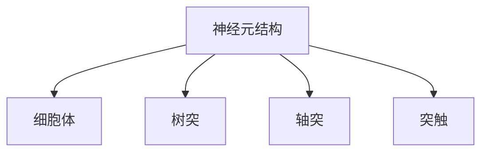

#### 2.2 神经信号处理技术

神经信号处理技术是指利用电子学和计算机科学的方法，对神经信号进行采集、处理和分析的技术。神经信号处理技术是神经科技的重要组成部分，对于认知增强具有重要意义。

**神经信号的采集：**

神经信号的采集主要通过脑电图（Electroencephalography, EEG）、脑磁图（Magnetoencephalography, MEG）、功能性磁共振成像（Functional Magnetic Resonance Imaging, fMRI）等技术实现。这些技术可以无创或微创地获取大脑的电活动或血流变化，从而反映大脑的功能状态。

**神经信号的处理：**

神经信号的处理主要包括信号滤波、降噪、特征提取和模式识别等步骤。信号滤波和降噪的目的是去除噪声，提高信号的质量。特征提取是从原始信号中提取出有用的信息，如频率、时间等。模式识别是利用已提取的特征进行分类和识别，以实现特定功能。

**神经信号的分析：**

神经信号的分析主要通过统计分析、机器学习和深度学习等技术进行。统计分析可以用于研究信号的时间序列特征，机器学习和深度学习可以用于构建智能模型，实现对神经信号的自动分析和解释。

**核心概念与联系：**

- **神经信号采集：** 利用脑电图、脑磁图、fMRI等技术获取大脑信号。
- **神经信号处理：** 对信号进行滤波、降噪、特征提取和模式识别。
- **神经信号分析：** 利用统计分析和机器学习技术对信号进行分析。

**伪代码示例：**

```python
def neural_signal_processing(signal):
    # 信号滤波
    filtered_signal = filter_signal(signal)
    
    # 降噪
    noise_reduced_signal = denoise_signal(filtered_signal)
    
    # 特征提取
    features = extract_features(noise_reduced_signal)
    
    # 模式识别
    classification = pattern_recognition(features)
    
    return classification
```

#### 2.3 神经网络与机器学习

神经网络与机器学习是紧密相连的。神经网络是机器学习的一种模型，它通过模拟人脑神经元的工作方式，实现从输入到输出的映射。而机器学习则提供了一系列算法和工具，用于训练神经网络，优化其性能。

**神经网络的基本原理：**

神经网络由多个层次组成，包括输入层、隐藏层和输出层。输入层接收外部信息，隐藏层进行信息处理和变换，输出层产生最终输出。神经网络通过反向传播算法，不断调整权重和偏置，使得输出结果更接近预期目标。

**机器学习与神经网络的关系：**

机器学习为神经网络提供了训练数据和学习算法。通过机器学习，神经网络可以自动调整其参数，优化性能。同时，机器学习还提供了许多其他算法，如支持向量机、决策树等，这些算法可以与神经网络结合，实现更复杂的任务。

**核心概念与联系：**

- **神经网络：** 通过模拟人脑神经元的工作方式，实现从输入到输出的映射。
- **机器学习：** 提供了训练数据和学习算法，用于优化神经网络的性能。

**Mermaid 流程图：**

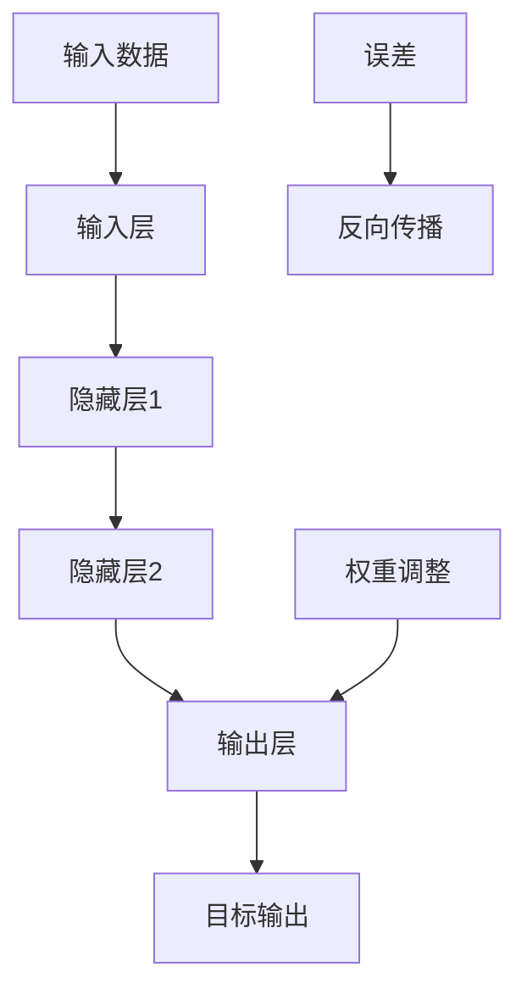

#### 2.4 神经信号处理工具

神经信号处理工具是神经科技研究中不可或缺的部分。这些工具可以帮助研究人员有效地采集、处理和分析神经信号，从而推动神经科技的发展。

**常见的神经信号处理工具包括：**

- **Matlab：** Matlab 是一款强大的科学计算软件，它提供了丰富的神经信号处理函数库，支持信号滤波、降噪、特征提取和模式识别等操作。
- **Python：** Python 是一种流行的编程语言，它具有简洁的语法和丰富的库，如Numpy、Scipy、MNE-Python等，可以方便地进行神经信号处理。
- **EEGLAB：** EEGLAB 是一款专门用于处理脑电图数据的软件，它提供了丰富的功能，包括信号滤波、特征提取和模式识别等。

**核心概念与联系：**

- **Matlab：** 提供了丰富的神经信号处理函数库，支持信号滤波、降噪、特征提取和模式识别等操作。
- **Python：** 具有简洁的语法和丰富的库，方便进行神经信号处理。
- **EEGLAB：** 专门用于处理脑电图数据，提供了丰富的功能。

**Mermaid 流程图：**

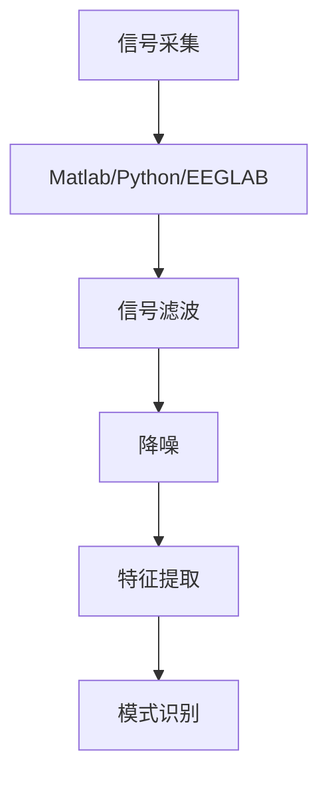

### 第3章：脑机接口技术

#### 3.1 脑机接口的基本原理

脑机接口（Brain-Computer Interface，简称BCI）是一种直接连接大脑和外部设备的通信系统，它通过读取大脑信号，使得个体能够通过意念控制外部设备。脑机接口的基本原理包括以下几个方面：

1. **大脑信号采集：** 脑机接口通过脑电图（EEG）、脑磁图（MEG）、功能性磁共振成像（fMRI）等技术采集大脑信号。

2. **信号处理：** 采集到的大脑信号经过预处理，如滤波、降噪和特征提取等，以提取有用的信息。

3. **信号解码：** 提取的特征被解码成控制命令，用于驱动外部设备。

4. **设备控制：** 控制命令被发送到外部设备，实现设备的控制。

**核心概念与联系：**

- **大脑信号采集：** 通过脑电图、脑磁图、fMRI等技术获取大脑信号。
- **信号处理：** 对信号进行预处理，提取有用信息。
- **信号解码：** 解码提取的特征，生成控制命令。
- **设备控制：** 通过控制命令驱动外部设备。

**Mermaid 流程图：**

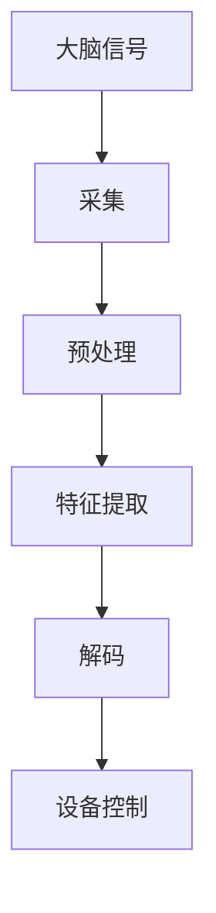

#### 3.2 脑机接口在认知增强中的应用

脑机接口技术在认知增强中的应用具有广泛的前景。通过脑机接口，个体能够通过意念控制外部设备，从而提升认知能力和生活质量。

1. **脑控计算机：** 脑机接口技术可以用于脑控计算机，使得瘫痪患者能够通过意念操作计算机，进行文字输入、网页浏览等任务。

2. **脑控轮椅：** 脑机接口技术可以用于脑控轮椅，使得行动不便的患者能够通过意念控制轮椅，实现自主移动。

3. **脑控机器人：** 脑机接口技术可以用于脑控机器人，使得个体能够通过意念控制机器人完成特定的任务，如清洁、搬运等。

4. **脑控游戏：** 脑机接口技术可以用于脑控游戏，使得个体能够通过意念控制游戏角色，提升游戏体验。

**核心概念与联系：**

- **脑控计算机：** 通过脑机接口实现脑控计算机，提升认知能力。
- **脑控轮椅：** 通过脑机接口实现脑控轮椅，提升生活质量。
- **脑控机器人：** 通过脑机接口实现脑控机器人，完成特定任务。
- **脑控游戏：** 通过脑机接口实现脑控游戏，提升游戏体验。

**Mermaid 流程图：**

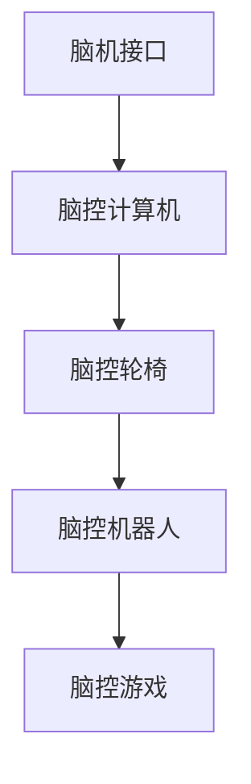

#### 3.3 脑机接口技术的挑战与未来

尽管脑机接口技术在认知增强中具有巨大的潜力，但它仍然面临着许多挑战。这些挑战主要包括：

1. **信号噪声：** 大脑信号的噪声较大，如何有效地去除噪声，提取有用的信息，是一个重要的挑战。

2. **信号解码：** 如何准确解码大脑信号，生成控制命令，也是一个亟待解决的问题。

3. **设备稳定性：** 脑机接口设备需要长时间稳定运行，这对设备的制造和材料提出了较高的要求。

4. **人机交互：** 如何设计出人性化的交互界面，使得用户能够方便地使用脑机接口设备，也是一个重要的挑战。

未来，随着技术的不断进步，脑机接口技术将在认知增强中发挥更大的作用。通过结合机器学习和深度学习等技术，脑机接口将能够更准确地解码大脑信号，实现更高效的认知增强。同时，脑机接口设备也将变得更加便携和易用，使得更多的人能够从中受益。

**核心概念与联系：**

- **信号噪声：** 如何去除噪声，提取有用信息。
- **信号解码：** 如何准确解码大脑信号，生成控制命令。
- **设备稳定性：** 设备制造和材料的要求。
- **人机交互：** 设计人性化的交互界面。

**Mermaid 流程图：**

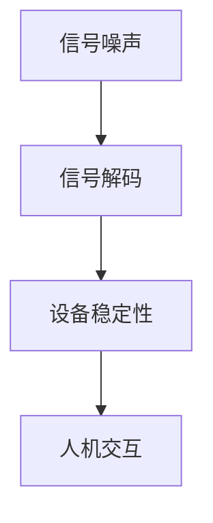

### 第4章：可穿戴神经科技设备

#### 4.1 可穿戴神经科技设备的种类

可穿戴神经科技设备是指直接附着或植入于人体，用于监测、分析和调控神经信号的高科技产品。根据其功能和应用场景，可穿戴神经科技设备可以分为以下几类：

1. **脑电图（EEG）监测设备：** EEG监测设备可以实时记录大脑的电活动，用于诊断和监测神经系统疾病，如癫痫、失眠等。它也可以用于认知功能评估和脑机接口控制。

2. **心电监测设备（ECG）：** ECG监测设备用于记录心脏的电活动，用于诊断心律失常、心肌缺血等心脏疾病。它还可以监测情绪变化，为心理健康管理提供数据支持。

3. **肌电图（EMG）监测设备：** EMG监测设备用于记录肌肉的电活动，用于诊断肌肉疾病和神经肌肉疾病，如肌肉萎缩、偏头痛等。它还可以用于康复训练和运动监测。

4. **神经调控设备：** 神经调控设备包括经颅磁刺激（TMS）和经颅直流电刺激（tDCS）设备，用于调节大脑或神经系统的功能，治疗心理疾病、慢性疼痛等。

5. **多参数监测设备：** 多参数监测设备可以同时监测多个生理信号，如心率、血压、体温等，为健康管理和疾病预防提供综合数据支持。

**核心概念与联系：**

- **EEG监测设备：** 用于监测大脑电活动，诊断和治疗神经系统疾病。
- **ECG监测设备：** 用于监测心脏电活动，诊断和治疗心脏疾病。
- **EMG监测设备：** 用于监测肌肉电活动，诊断和治疗肌肉疾病。
- **神经调控设备：** 用于调节大脑或神经系统功能，治疗心理疾病和慢性疼痛。
- **多参数监测设备：** 用于监测多个生理信号，提供健康管理和疾病预防的数据支持。

**Mermaid 流程图：**

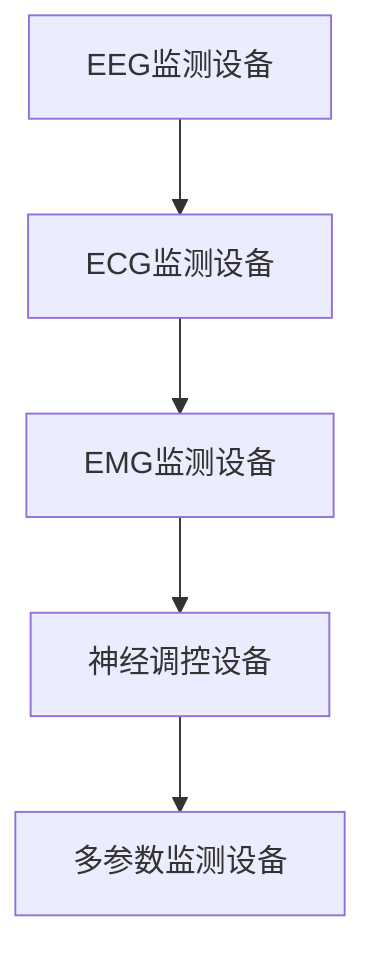

#### 4.2 可穿戴神经科技设备的应用

可穿戴神经科技设备在多个领域有着广泛的应用，包括医疗健康、运动康复、教育训练和日常生活等。

1. **医疗健康：** 在医疗健康领域，可穿戴神经科技设备可以用于实时监测患者的生理信号，提供早期预警和诊断支持。例如，脑电图监测设备可以用于癫痫的监测和治疗，心电监测设备可以用于心律失常的监测和预警。

2. **运动康复：** 在运动康复领域，可穿戴神经科技设备可以帮助康复医生和运动员监测肌肉和神经系统的活动，制定个性化的康复计划和训练方案。例如，肌电图监测设备可以用于监测康复过程中的肌肉活动，神经调控设备可以用于改善运动功能。

3. **教育训练：** 在教育训练领域，可穿戴神经科技设备可以用于监测学生的认知状态和学习效果，为教育提供科学依据。例如，EEG监测设备可以用于分析学生的注意力和学习效率，神经调控设备可以用于提高学生的学习动机和注意力。

4. **日常生活：** 在日常生活中，可穿戴神经科技设备可以用于提高生活质量，如监测心率、血压等生理信号，提供健康提示和建议。

**核心概念与联系：**

- **医疗健康：** 用于实时监测生理信号，提供早期预警和诊断支持。
- **运动康复：** 用于监测肌肉和神经系统活动，制定个性化康复计划和训练方案。
- **教育训练：** 用于监测认知状态和学习效果，提供科学依据。
- **日常生活：** 提高生活质量，监测生理信号，提供健康提示和建议。

**Mermaid 流程图：**

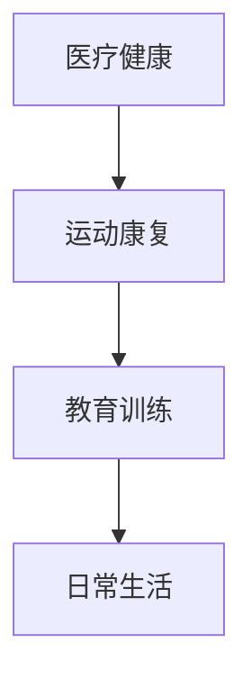

#### 4.3 可穿戴神经科技设备的挑战与未来

尽管可穿戴神经科技设备在多个领域有着广泛的应用，但它也面临着一些挑战。这些挑战主要包括：

1. **设备稳定性：** 可穿戴设备需要长时间稳定运行，这对设备的制造和材料提出了较高的要求。

2. **信号准确性：** 如何准确获取和分析生理信号，是可穿戴设备面临的重要挑战。

3. **数据处理：** 大量的生理信号数据需要高效、准确地处理，以提供有价值的诊断和干预建议。

4. **用户隐私：** 如何保护用户的生理数据隐私，也是可穿戴设备需要考虑的问题。

未来，随着技术的不断进步，可穿戴神经科技设备将在医疗健康、运动康复、教育训练和日常生活等领域发挥更大的作用。通过结合人工智能和大数据分析技术，可穿戴设备将能够提供更精准、个性化的健康管理和诊断服务。

**核心概念与联系：**

- **设备稳定性：** 长时间稳定运行的要求。
- **信号准确性：** 准确获取和分析生理信号。
- **数据处理：** 高效、准确地处理大量生理信号数据。
- **用户隐私：** 保护用户的生理数据隐私。

**Mermaid 流程图：**

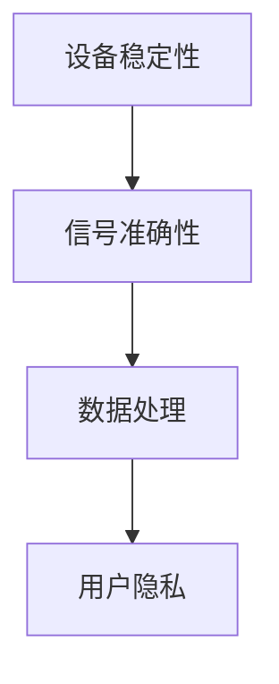

### 第5章：神经调控技术

#### 5.1 神经调控技术的原理

神经调控技术是通过电、磁、光或其他物理手段，对神经系统进行调节，以改善神经功能的一种技术。它包括以下几种基本原理：

1. **电刺激：** 电刺激是通过电流直接作用于神经组织，以调节神经活动。电刺激可以用于治疗癫痫、帕金森病等神经系统疾病，也可以用于认知增强和康复训练。

2. **磁刺激：** 磁刺激是通过磁场作用于神经组织，以调节神经活动。磁刺激包括经颅磁刺激（TMS）和深部脑刺激（DBS）。TMS可以用于治疗抑郁症、焦虑症等心理疾病，DBS可以用于治疗帕金森病等运动障碍。

3. **光刺激：** 光刺激是通过光照射作用于神经组织，以调节神经活动。光刺激可以用于治疗偏头痛、抑郁等疾病，也可以用于认知增强和视觉康复。

4. **电化学刺激：** 电化学刺激是通过电化学方法作用于神经组织，以调节神经活动。电化学刺激可以用于治疗神经痛、肌肉萎缩等疾病。

**核心概念与联系：**

- **电刺激：** 通过电流直接作用于神经组织。
- **磁刺激：** 通过磁场作用于神经组织。
- **光刺激：** 通过光照射作用于神经组织。
- **电化学刺激：** 通过电化学方法作用于神经组织。

**Mermaid 流程图：**

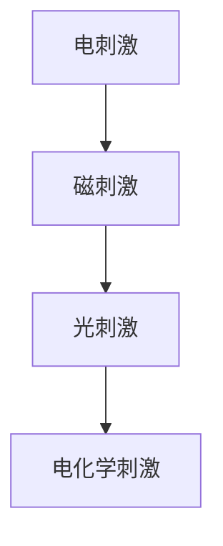

#### 5.2 神经调控技术在认知增强中的应用

神经调控技术在认知增强中的应用主要包括以下几个方面：

1. **注意力调节：** 神经调控技术可以通过调节大脑特定区域的电活动，改善个体的注意力。例如，经颅磁刺激（TMS）可以用于提高患者的注意力，改善其学习效率和记忆能力。

2. **记忆增强：** 神经调控技术可以通过刺激大脑记忆相关的区域，增强个体的记忆能力。例如，经颅直流电刺激（tDCS）可以用于提高老年人的记忆力，改善其认知功能。

3. **情绪调节：** 神经调控技术可以通过调节大脑的情绪区域，改善个体的情绪状态。例如，光刺激可以用于治疗抑郁症，改善个体的情绪困扰。

4. **认知功能康复：** 神经调控技术可以用于认知功能康复，帮助患者恢复认知功能。例如，电刺激可以用于治疗脑损伤患者的认知障碍，帮助他们恢复正常的认知能力。

**核心概念与联系：**

- **注意力调节：** 改善个体的注意力。
- **记忆增强：** 增强个体的记忆能力。
- **情绪调节：** 改善个体的情绪状态。
- **认知功能康复：** 帮助患者恢复认知功能。

**Mermaid 流�程图：**

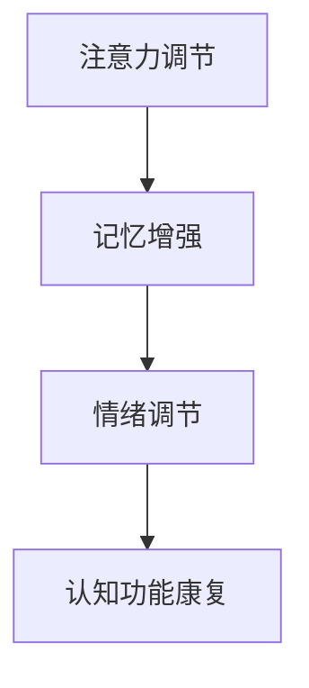

#### 5.3 神经调控技术的挑战与未来

神经调控技术在认知增强中的应用前景广阔，但也面临着一些挑战。这些挑战主要包括：

1. **技术稳定性：** 神经调控技术需要确保其操作的稳定性和可靠性，以避免对患者造成伤害。

2. **个体差异：** 不同的个体对神经调控技术的响应差异较大，需要个性化调整，以提高治疗效果。

3. **安全性：** 神经调控技术可能对大脑产生一定的副作用，需要确保其安全性，以避免长期使用对大脑产生负面影响。

4. **伦理问题：** 神经调控技术的应用涉及到伦理问题，如隐私权、知情同意等，需要制定相应的伦理规范。

未来，随着技术的不断进步，神经调控技术在认知增强中的应用将更加广泛和深入。通过结合人工智能和大数据分析技术，神经调控技术将能够提供更精准、个性化的认知增强方案。

**核心概念与联系：**

- **技术稳定性：** 确保操作的稳定性和可靠性。
- **个体差异：** 需要个性化调整，以提高治疗效果。
- **安全性：** 确保安全性，避免长期使用对大脑产生负面影响。
- **伦理问题：** 需要制定相应的伦理规范。

**Mermaid 流程图：**

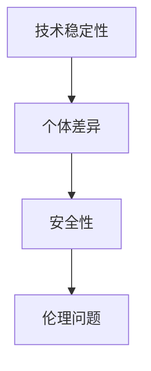

### 第6章：教育领域的应用

#### 6.1 神经科技在教育中的应用场景

神经科技在教育领域有着广泛的应用，主要应用于以下几个方面：

1. **学习诊断与评估：** 神经科技可以通过脑电图（EEG）、功能性磁共振成像（fMRI）等技术，实时监测学生的学习状态和认知过程，为个性化学习提供科学依据。

2. **学习支持与干预：** 神经科技可以通过神经调控技术，如经颅磁刺激（TMS）、经颅直流电刺激（tDCS）等，改善学生的学习效果和认知功能。

3. **课堂互动与反馈：** 神经科技可以通过脑机接口技术，实现学生的课堂互动和反馈，提高课堂参与度和学习效果。

4. **智能教学系统：** 神经科技可以用于开发智能教学系统，根据学生的学习状态和需求，提供个性化的学习资源和教学方法。

**核心概念与联系：**

- **学习诊断与评估：** 实时监测学生的学习状态和认知过程。
- **学习支持与干预：** 改善学生的学习效果和认知功能。
- **课堂互动与反馈：** 提高课堂参与度和学习效果。
- **智能教学系统：** 根据学生的学习状态和需求，提供个性化的学习资源和教学方法。

**Mermaid 流程图：**

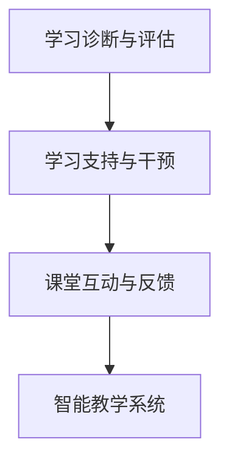

#### 6.2 神经科技在教育中的应用案例

1. **个性化学习平台：** 通过神经科技，可以开发个性化学习平台，根据学生的学习状态和需求，提供定制化的学习资源和教学方法。例如，通过脑电图监测学生的学习状态，系统可以实时调整教学内容的难易程度，提高学习效果。

2. **脑控课堂：** 通过脑机接口技术，学生可以在课堂上通过意念控制教学设备，如投影仪、电子白板等，提高课堂互动性和参与度。例如，学生可以通过意念选择想要观看的教学视频，实现无障碍学习。

3. **认知康复训练：** 通过神经调控技术，可以帮助学生改善认知功能，如注意力、记忆力等。例如，通过经颅磁刺激（TMS）治疗，学生可以改善注意力障碍，提高学习效率。

**核心概念与联系：**

- **个性化学习平台：** 提供定制化的学习资源和教学方法。
- **脑控课堂：** 提高课堂互动性和参与度。
- **认知康复训练：** 改善学生的认知功能。

**Mermaid 流程图：**

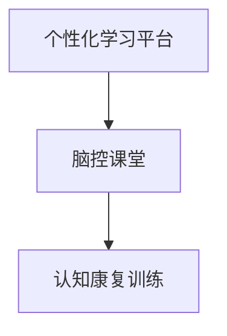

#### 6.3 神经科技在教育领域的发展趋势

随着神经科技的不断发展，其在教育领域的应用将更加深入和广泛。以下是一些发展趋势：

1. **智能化教育：** 神经科技将推动教育向智能化方向发展，实现个性化学习、智能诊断和智能教学。

2. **跨学科融合：** 神经科技与其他学科的融合，如教育学、心理学、计算机科学等，将促进教育理论和实践的创新。

3. **大数据分析：** 神经科技结合大数据分析技术，将为学生提供更精准、个性化的学习支持和干预。

4. **远程教育：** 神经科技的应用将推动远程教育的普及和发展，实现全球范围内的优质教育资源共享。

**核心概念与联系：**

- **智能化教育：** 实现个性化学习、智能诊断和智能教学。
- **跨学科融合：** 促进教育理论和实践的创新。
- **大数据分析：** 提供精准、个性化的学习支持和干预。
- **远程教育：** 推动远程教育的普及和发展。

**Mermaid 流程图：**

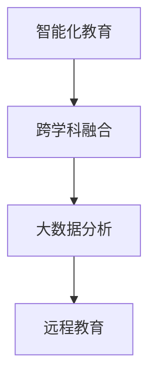

### 第7章：职场领域的应用

#### 7.1 神经科技在职场中的应用场景

神经科技在职场领域的应用场景丰富多样，主要涵盖以下几个方面：

1. **工作绩效评估：** 通过脑电图（EEG）、功能性磁共振成像（fMRI）等技术，可以实时监测员工的工作状态和认知功能，评估其工作绩效。

2. **员工培训与开发：** 神经调控技术如经颅磁刺激（TMS）、经颅直流电刺激（tDCS）等可以用于提高员工的学习效率和认知能力，优化培训效果。

3. **心理健康管理：** 通过脑机接口技术，可以实时监测员工的心理健康状态，提供个性化的心理干预和辅导，提高员工的工作满意度和幸福感。

4. **人机交互优化：** 脑机接口技术可以用于开发智能人机交互系统，提高员工的工作效率和舒适度。

**核心概念与联系：**

- **工作绩效评估：** 实时监测员工的工作状态和认知功能。
- **员工培训与开发：** 提高员工的学习效率和认知能力。
- **心理健康管理：** 提供个性化的心理干预和辅导。
- **人机交互优化：** 提高员工的工作效率和舒适度。

**Mermaid 流程图：**

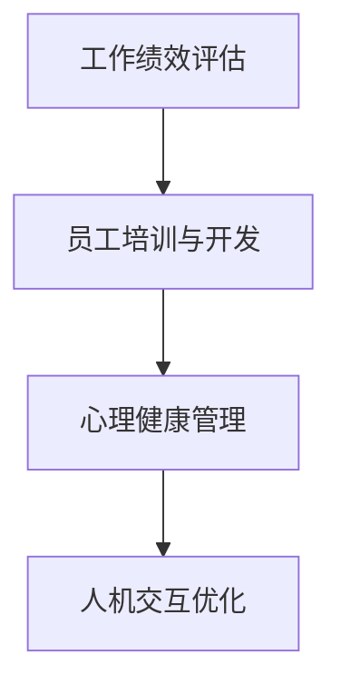

#### 7.2 神经科技在职场中的应用案例

1. **智能工作辅助系统：** 通过脑机接口技术，可以开发智能工作辅助系统，帮助员工通过意念控制计算机、手机等设备，提高工作效率。例如，员工可以通过脑机接口直接操作计算机软件，实现快速文档处理和信息检索。

2. **心理健康监测与干预：** 通过脑电图监测技术，可以实时监测员工的心理健康状态，为心理健康管理提供数据支持。例如，通过分析员工的脑电图信号，可以预测员工的压力水平，提供个性化的心理干预措施。

3. **认知能力提升培训：** 通过神经调控技术，可以为员工提供认知能力提升培训，提高其学习效率和记忆力。例如，通过经颅磁刺激技术，可以改善员工的注意力集中能力，提高其工作效率。

**核心概念与联系：**

- **智能工作辅助系统：** 提高员工的工作效率。
- **心理健康监测与干预：** 提供个性化的心理干预措施。
- **认知能力提升培训：** 提高员工的学习效率和记忆力。

**Mermaid 流程图：**

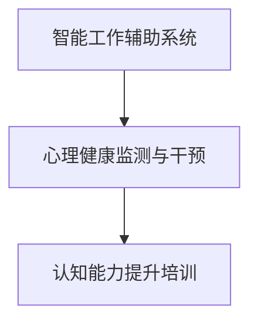

#### 7.3 神经科技在职场领域的发展趋势

随着神经科技的不断进步，其在职场领域的应用将更加深入和广泛。以下是一些发展趋势：

1. **智能化办公：** 神经科技将推动办公环境向智能化方向发展，实现员工工作的高效和舒适。

2. **个性化培训：** 神经科技结合大数据分析技术，将提供更精准、个性化的员工培训方案，提高培训效果。

3. **心理健康管理：** 神经科技将助力企业建立更加完善的心理健康管理机制，提高员工的工作满意度和幸福感。

4. **人机协作：** 神经科技将促进人机协作的发展，实现员工与智能设备的无缝对接，提高工作效率。

**核心概念与联系：**

- **智能化办公：** 实现员工工作的高效和舒适。
- **个性化培训：** 提供精准、个性化的员工培训方案。
- **心理健康管理：** 提高员工的工作满意度和幸福感。
- **人机协作：** 实现员工与智能设备的无缝对接。

**Mermaid 流程图：**

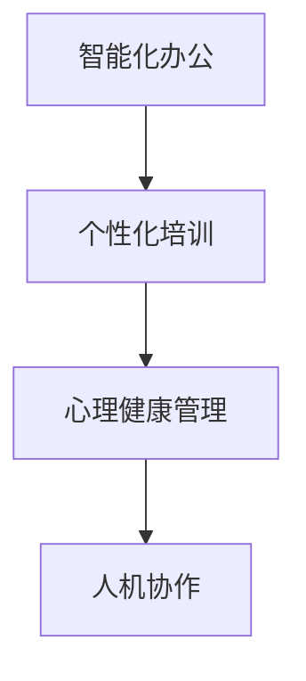

### 第8章：医疗健康领域的应用

#### 8.1 神经科技在医疗健康中的应用场景

神经科技在医疗健康领域的应用场景广泛，包括疾病诊断、治疗、康复和预防等方面。以下是一些具体的应用场景：

1. **疾病诊断：** 通过神经成像技术如功能性磁共振成像（fMRI）和脑电图（EEG），可以实时监测大脑的活动，用于诊断神经系统疾病，如癫痫、抑郁症、阿尔茨海默病等。

2. **治疗：** 神经调控技术如经颅磁刺激（TMS）、经颅直流电刺激（tDCS）和深部脑刺激（DBS）可以用于治疗神经系统疾病，如帕金森病、癫痫、抑郁症等。

3. **康复：** 通过脑机接口技术，可以帮助瘫痪患者重新获得运动能力，如通过脑机接口控制假肢或轮椅。

4. **预防：** 神经科技可以通过监测生理信号，如心率变异性（HRV）、脑电图（EEG）等，预测疾病风险，提供个性化的预防措施。

**核心概念与联系：**

- **疾病诊断：** 实时监测大脑的活动，用于诊断神经系统疾病。
- **治疗：** 使用神经调控技术治疗神经系统疾病。
- **康复：** 通过脑机接口技术帮助患者重新获得运动能力。
- **预防：** 通过监测生理信号预测疾病风险，提供个性化的预防措施。

**Mermaid 流程图：**

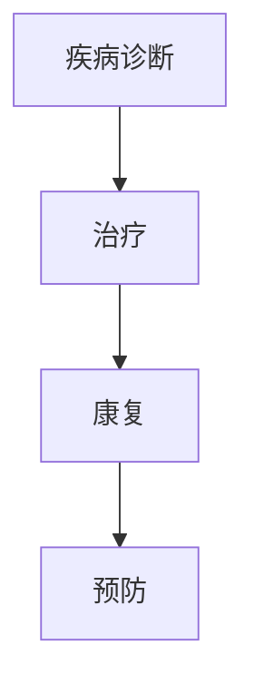

#### 8.2 神经科技在医疗健康中的应用案例

1. **脑机接口帮助瘫痪患者：** 通过脑机接口技术，瘫痪患者可以重新控制自己的身体。例如，使用脑机接口控制的假肢可以让患者进行日常活动，甚至完成复杂的任务。

2. **神经调控治疗抑郁症：** 经颅磁刺激（TMS）和经颅直流电刺激（tDCS）等技术已被广泛应用于抑郁症的治疗，通过调节大脑特定区域的活动，缓解患者的抑郁症状。

3. **功能性磁共振成像（fMRI）在阿尔茨海默病诊断中的应用：** fMRI可以检测大脑灰质和白质的改变，帮助早期诊断阿尔茨海默病，为患者提供及时的治疗和干预。

**核心概念与联系：**

- **脑机接口帮助瘫痪患者：** 通过脑机接口技术重新控制身体。
- **神经调控治疗抑郁症：** 使用TMS和tDCS缓解抑郁症状。
- **fMRI在阿尔茨海默病诊断中的应用：** 检测大脑改变，早期诊断阿尔茨海默病。

**Mermaid 流程图：**

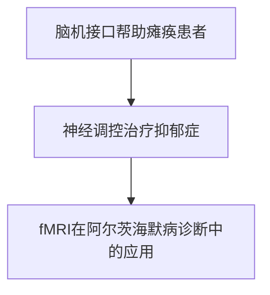

#### 8.3 神经科技在医疗健康领域的发展趋势

随着神经科技的快速发展，其在医疗健康领域的应用将更加广泛和深入。以下是一些发展趋势：

1. **精准医疗：** 神经科技将推动医疗向精准医疗发展，通过基因测序、神经成像等技术，实现个体化的诊断和治疗。

2. **智能康复：** 通过脑机接口技术和智能康复设备，可以帮助患者更快速地康复，提高生活质量。

3. **远程医疗：** 神经科技结合远程医疗技术，可以实现远程诊断、治疗和康复，为偏远地区提供高质量的医疗服务。

4. **心理健康监测：** 通过脑电图（EEG）、心率变异性（HRV）等技术，可以实时监测心理健康状态，提供个性化的心理干预。

**核心概念与联系：**

- **精准医疗：** 实现个体化的诊断和治疗。
- **智能康复：** 提高患者的康复速度和生活质量。
- **远程医疗：** 提供高质量的医疗服务。
- **心理健康监测：** 提供个性化的心理干预。

**Mermaid 流程图：**

```mermaid
graph TB
A[精准医疗] --> B[智能康复]
B --> C[远程医疗]
C --> D[心理健康监测]
```

### 第9章：神经科技对人类社会的影响

#### 9.1 神经科技的发展对人类社会的影响

神经科技的发展对人类社会产生了深远的影响，涵盖了教育、职场、医疗健康等多个领域。以下是神经科技对人类社会的主要影响：

1. **教育变革：** 神经科技在教育领域的应用，如个性化学习平台和脑控课堂，改变了传统的教学模式，提高了教育质量和效率。通过实时监测学生的学习状态，教师可以更有效地指导学生，实现个性化教育。

2. **职场变革：** 神经科技在职场领域的应用，如智能工作辅助系统和心理健康管理，提高了员工的工作效率和满意度。通过神经科技，企业可以更好地管理员工的工作状态和心理健康，提高整体生产力和竞争力。

3. **医疗变革：** 神经科技在医疗健康领域的应用，如脑机接口和神经调控技术，为疾病诊断、治疗和康复提供了新的手段。神经科技的应用，使得医疗诊断更加精准，治疗更加有效，康复更加迅速。

**核心概念与联系：**

- **教育变革：** 提高教育质量和效率。
- **职场变革：** 提高工作效率和满意度。
- **医疗变革：** 提高疾病诊断、治疗和康复的效果。

**Mermaid 流程图：**

```mermaid
graph TB
A[教育变革] --> B[职场变革]
B --> C[医疗变革]
```

#### 9.2 神经科技的未来发展趋势

随着神经科技的不断进步，其未来发展具有巨大的潜力，以下是几个可能的发展趋势：

1. **智能化：** 神经科技将向更加智能化、个性化的方向发展。通过大数据分析和人工智能技术，可以更好地理解人类大脑的工作原理，提供更精准的认知增强和个性化服务。

2. **非侵入性：** 随着技术的进步，神经科技的侵入性将逐渐降低。例如，通过非侵入性的脑电图（EEG）和脑磁图（MEG）技术，可以实时监测大脑活动，实现更加安全、便捷的应用。

3. **多模态融合：** 神经科技将实现多模态融合，结合脑电图、功能性磁共振成像（fMRI）、脑磁图（MEG）等多种技术，提供更全面的神经信号分析和认知增强方案。

4. **人机协同：** 神经科技将推动人机协同的发展，实现人类与机器的更加紧密的合作。通过脑机接口技术，人类可以更加直接地控制机器，提高工作效率和创造力。

**核心概念与联系：**

- **智能化：** 提供更精准的认知增强和个性化服务。
- **非侵入性：** 降低侵入性，实现安全、便捷的应用。
- **多模态融合：** 提供更全面的神经信号分析和认知增强方案。
- **人机协同：** 实现人类与机器的紧密合作。

**Mermaid 流程图：**

```mermaid
graph TB
A[智能化] --> B[非侵入性]
B --> C[多模态融合]
C --> D[人机协同]
```

### 第10章：结语

神经科技作为一种前沿技术，正不断改变我们对认知能力提升的理解。通过本章的介绍，我们了解了神经科技在认知增强中的应用，包括脑机接口技术、可穿戴神经科技设备、神经调控技术等。同时，我们还探讨了神经科技在教育、职场和医疗健康领域的应用案例和发展趋势。

神经科技的发展不仅为个体提供了新的认知增强手段，也为社会带来了深刻的变革。随着技术的不断进步，神经科技将在更多领域发挥重要作用，推动人类社会的进步和发展。

在此，我们呼吁读者关注神经科技的发展，积极探讨其在各个领域的应用前景，共同推动神经科技的研究和应用，为构建一个更加智能、健康和和谐的社会贡献力量。

### 附录

#### A.1 神经科技常用工具与资源

- **A.1.1 脑机接口开发工具：**
  - **Matlab：** 提供丰富的脑机接口数据处理和模型训练工具。
  - **Python：** 具有大量的库，如MNE-Python、PyBrain等，方便进行脑机接口研究和开发。

- **A.1.2 可穿戴神经科技设备：**
  - **EEG头戴设备：** 如Emotiv、Neurosky等，提供实时脑电图监测和数据记录。
  - **心电监测设备：** 如Apple Watch、Fitbit等，提供实时心电监测和数据分析。

- **A.1.3 神经调控技术设备：**
  - **经颅磁刺激（TMS）设备：** 如Brainsway、Neurosoft等，用于神经调控治疗。
  - **经颅直流电刺激（tDCS）设备：** 如NeuroConn、ActiveInsight等，用于认知增强和康复治疗。

#### A.2 参考文献与扩展阅读

- **A.2.1 神经科技研究论文精选：**
  - Ge-images, O., Fries, P., & Hasenstaub, A. (2016). The neural basis of cognitive enhancement. *Neuroscience and Biobehavioral Reviews*, 68, 95-108.
  - Wang, P. T., & Greenberg, B. (2018). Neural plasticity and cognitive enhancement: Strategies and challenges. *Trends in Cognitive Sciences*, 22(11), 917-931.

- **A.2.2 认知增强领域最新进展：**
  - 认知增强协会（Cognitive Enhancement Society）官方网站：[https://www.cognitivesociety.org/](https://www.cognitivesociety.org/)
  - 认知增强会议（Cognitive Enhancement Conference）官方网站：[https://www.cognitiveenhancementconference.com/](https://www.cognitiveenhancementconference.com/)

### 作者信息

作者：AI天才研究院/AI Genius Institute & 禅与计算机程序设计艺术 /Zen And The Art of Computer Programming

