                 

## 文章标题

《神经网络原理与代码实例讲解》

## 关键词

神经网络、深度学习、激活函数、多层感知机、卷积神经网络、循环神经网络、强化学习、图像处理、自然语言处理、应用实例、代码实战

## 摘要

本文将深入探讨神经网络的原理及其在各种领域的应用。从基础概念入手，逐步讲解神经网络的结构、训练过程和优化方法。我们将详细分析常见神经网络模型，包括多层感知机、卷积神经网络、循环神经网络等，并展示其实际应用实例。此外，本文还将介绍神经网络在图像处理、自然语言处理和强化学习等领域的应用，以及跨模态学习和实际案例解析。通过本文，读者将全面了解神经网络的工作原理和应用，并掌握相关代码实战技能。

### 第一部分: 神经网络原理

#### 第1章: 神经网络基础

##### 1.1 神经网络的概念与历史

###### 1.1.1 神经网络的基本概念

神经网络是一种模仿人脑神经元结构和功能的信息处理系统，由大量相互连接的神经元组成。这些神经元通过激活函数和权重调整实现输入信息的传递和处理。

###### 1.1.2 神经网络的发展历史

神经网络的研究始于20世纪40年代，最早由麦卡锡和皮茨提出。随后，随着计算能力的提升和算法的改进，神经网络在20世纪80年代和90年代迎来了发展高峰。近年来，随着深度学习的兴起，神经网络再次成为人工智能领域的热门研究课题。

###### 1.1.3 神经网络与深度学习的关系

深度学习是一种基于多层神经网络的学习方法，通过训练大量参数实现高维数据特征的自动提取和表示。神经网络是深度学习的基础，深度学习则是神经网络在特定领域（如计算机视觉、自然语言处理等）的应用。

##### 1.2 神经网络的基本结构

###### 1.2.1 输入层

输入层是神经网络的第一层，接收外部输入信号。每个输入节点对应一个特征，如图像中的像素值、文本中的词向量等。

###### 1.2.2 隐藏层

隐藏层位于输入层和输出层之间，负责对输入信号进行处理和变换。隐藏层的数量和节点数可以根据问题复杂度进行调整。

###### 1.2.3 输出层

输出层是神经网络的最后一层，产生最终的输出结果。输出节点的数量和类型取决于具体任务，如分类问题中的类数、回归问题中的预测值等。

###### 1.2.4 激活函数

激活函数用于引入非线性特性，使神经网络能够对输入信号进行复杂的变换。常见的激活函数有sigmoid、ReLU、Tanh等。

##### 1.3 神经网络的训练过程

###### 1.3.1 前向传播

前向传播是指将输入信号逐层传递到神经网络，经过权重和偏置的加权求和后，通过激活函数得到输出结果。前向传播用于计算神经网络的输出值。

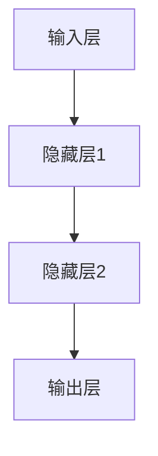

###### 1.3.2 反向传播

反向传播是指从输出层开始，反向计算每个神经元的误差，并更新权重和偏置。反向传播是神经网络训练的核心，用于调整模型参数以降低误差。

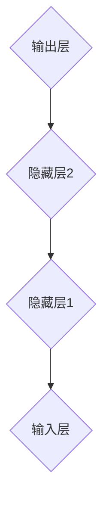

###### 1.3.3 梯度下降算法

梯度下降算法是一种优化方法，用于调整神经网络中的权重和偏置，以最小化误差。梯度下降算法通过计算损失函数关于模型参数的梯度，并沿梯度方向进行更新。

```latex
\min_{\theta} J(\theta) = \frac{1}{m} \sum_{i=1}^{m} \frac{1}{2} (h_{\theta}(x^{(i)}) - y^{(i)})^2
```

###### 1.3.4 学习率调整策略

学习率是梯度下降算法中的一个重要参数，用于控制参数更新的步长。选择合适的学习率对于神经网络的训练至关重要。

##### 1.4 神经网络的应用场景

###### 1.4.1 分类问题

分类问题是指将输入数据划分为不同的类别。神经网络可以通过训练学习输入数据的特征表示，从而实现分类任务。

###### 1.4.2 回归问题

回归问题是指预测输入数据的连续值。神经网络可以通过训练学习输入数据的特征表示和关系，从而实现回归任务。

###### 1.4.3 生成模型

生成模型是指学习数据生成过程，从而生成新的数据。神经网络可以通过训练学习输入数据的概率分布，从而实现生成任务。

###### 1.4.4 强化学习

强化学习是指通过与环境的交互学习最优策略。神经网络可以用于表示状态、动作和奖励，从而实现强化学习任务。

#### 第2章: 常见神经网络模型

##### 2.1 多层感知机（MLP）

###### 2.1.1 MLP的基本结构

多层感知机（MLP）是一种前馈神经网络，由输入层、隐藏层和输出层组成。隐藏层可以通过增加节点数和层数来提高网络的非线性表达能力。


###### 2.1.2 MLP的训练过程

MLP的训练过程主要包括前向传播、计算损失函数、反向传播和更新权重。通过迭代训练，MLP可以学习到输入数据的特征表示。

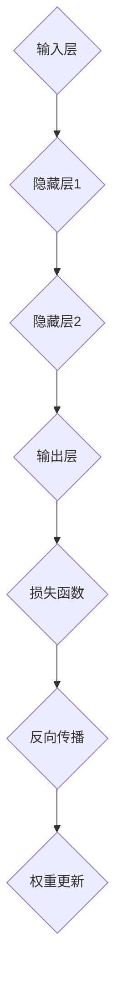

###### 2.1.3 MLP的应用实例

MLP广泛应用于分类和回归问题。例如，在图像分类任务中，MLP可以学习图像的特征表示，从而实现图像的分类。

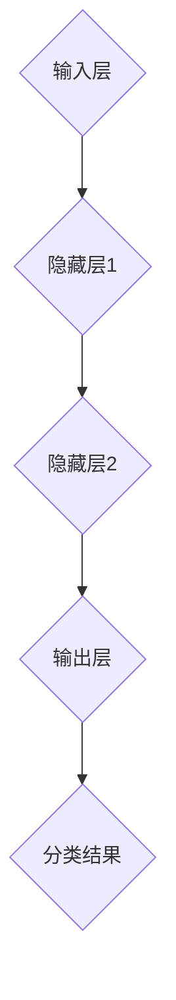

##### 2.2 卷积神经网络（CNN）

###### 2.2.1 CNN的基本结构

卷积神经网络（CNN）是一种专门用于图像处理的神经网络。它通过卷积层、池化层和全连接层实现图像的特征提取和分类。

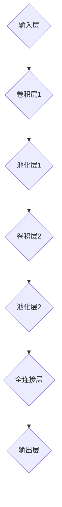

###### 2.2.2 卷积层和池化层

卷积层通过卷积运算提取图像特征，而池化层用于降采样和减少计算量。卷积层和池化层交替使用，可以有效地提取图像的层次特征。

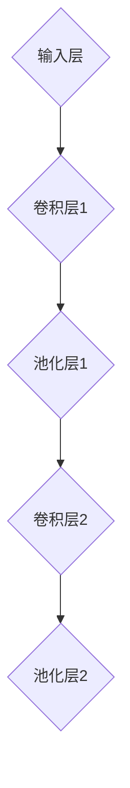

###### 2.2.3 CNN的训练过程

CNN的训练过程与MLP类似，包括前向传播、计算损失函数、反向传播和更新权重。通过迭代训练，CNN可以学习到图像的特征表示。

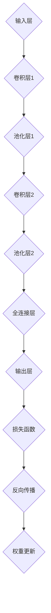

###### 2.2.4 CNN的应用实例

CNN广泛应用于图像分类、目标检测和图像分割等任务。例如，在ImageNet竞赛中，CNN取得了显著的分类性能。

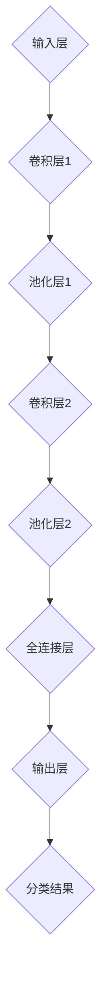

##### 2.3 循环神经网络（RNN）

###### 2.3.1 RNN的基本结构

循环神经网络（RNN）是一种能够处理序列数据的神经网络。它通过循环连接实现信息的记忆和传递。

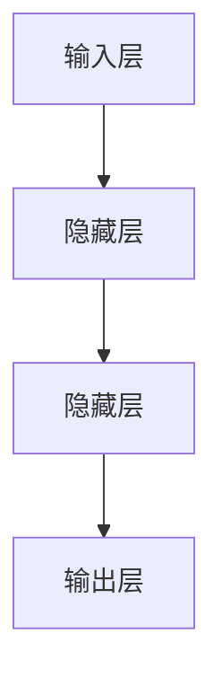

###### 2.3.2 长短时记忆（LSTM）

长短时记忆（LSTM）是一种特殊的RNN结构，能够有效地处理长序列数据。LSTM通过门控机制实现信息的记忆和遗忘。

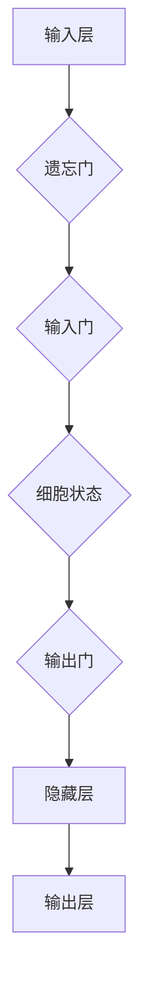

###### 2.3.3 门控循环单元（GRU）

门控循环单元（GRU）是LSTM的简化版本，同样能够处理长序列数据。GRU通过更新门和重置门实现信息的记忆和遗忘。

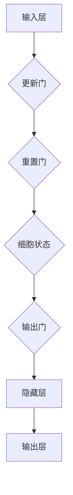

###### 2.3.4 RNN的应用实例

RNN广泛应用于自然语言处理任务，如语言模型、机器翻译和文本生成等。例如，在机器翻译任务中，RNN可以学习到源语言和目标语言之间的对应关系。

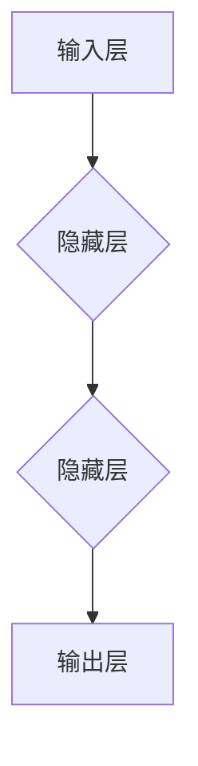

##### 2.4 自编码器（AE）

###### 2.4.1 AE的基本结构

自编码器（AE）是一种无监督学习模型，用于学习输入数据的特征表示。AE由编码器和解码器组成，编码器用于提取输入数据的特征，解码器用于重构输入数据。

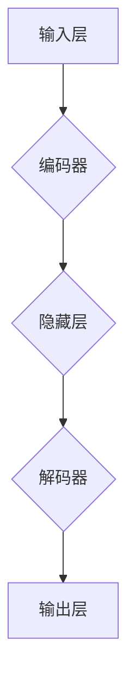

###### 2.4.2 AE的训练过程

AE的训练过程主要包括前向传播、计算损失函数、反向传播和更新权重。通过迭代训练，AE可以学习到输入数据的特征表示。

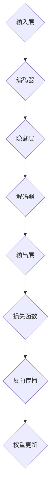

###### 2.4.3 AE的应用实例

自编码器广泛应用于降维、去噪和生成任务。例如，在降维任务中，自编码器可以学习到输入数据的低维表示，从而实现数据的降维。

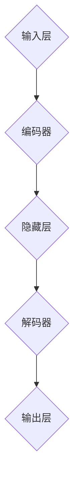

### 第二部分: 神经网络优化

#### 第3章: 神经网络优化

##### 3.1 梯度下降算法

###### 3.1.1 基本原理

梯度下降算法是一种优化方法，用于调整神经网络中的权重和偏置，以最小化误差。其基本原理是计算损失函数关于模型参数的梯度，并沿梯度方向进行更新。

```latex
\theta = \theta - \alpha \cdot \nabla_\theta J(\theta)
```

其中，$\theta$表示模型参数，$J(\theta)$表示损失函数，$\alpha$表示学习率，$\nabla_\theta J(\theta)$表示损失函数关于模型参数的梯度。

###### 3.1.2 动量优化

动量优化是一种改进的梯度下降算法，通过引入动量参数$\beta$，结合历史梯度，提高优化过程的稳定性。

```latex
v_t = \beta v_{t-1} + \alpha \nabla_\theta J(\theta)
\theta = \theta - v_t
```

其中，$v_t$表示动量参数，$\beta$表示动量参数的更新率。

###### 3.1.3 学习率调整策略

学习率是梯度下降算法中的一个重要参数，用于控制参数更新的步长。选择合适的学习率对于神经网络的训练至关重要。常见的学习率调整策略有固定学习率、学习率衰减、学习率自适应调整等。

##### 3.2 批量归一化（Batch Normalization）

###### 3.2.1 基本原理

批量归一化（Batch Normalization）是一种用于提高神经网络训练稳定性和收敛速度的正则化方法。其基本原理是对神经网络的输入进行归一化处理，使得每个批次的数据具有相似的分布。

```latex
\mu_{\text{batch}} = \frac{1}{m} \sum_{i=1}^{m} x_i
\sigma_{\text{batch}}^2 = \frac{1}{m} \sum_{i=1}^{m} (x_i - \mu_{\text{batch}})^2
x_{\text{normalized}} = \frac{x - \mu_{\text{batch}}}{\sqrt{\sigma_{\text{batch}}^2 + \epsilon}}
```

其中，$x$表示输入数据，$\mu_{\text{batch}}$表示批次均值，$\sigma_{\text{batch}}^2$表示批次方差，$x_{\text{normalized}}$表示归一化后的输入数据。

###### 3.2.2 实现步骤

批量归一化的实现步骤包括计算批次均值和方差、进行归一化处理、添加偏置和缩放。

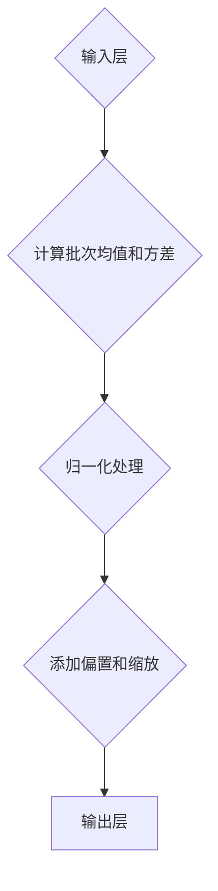

###### 3.2.3 对神经网络性能的影响

批量归一化可以减少内部协变量转移，提高神经网络的训练稳定性和收敛速度。此外，批量归一化还可以减少过拟合现象，提高模型的泛化能力。

##### 3.3 深度可分离卷积（Depth-wise Separable Convolution）

###### 3.3.1 基本原理

深度可分离卷积是一种用于减少计算量和参数数量的卷积操作。它将标准卷积分解为两个独立的操作：深度卷积和逐点卷积。

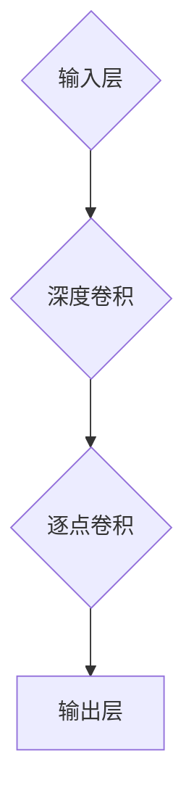

深度卷积只对输入数据的通道进行卷积操作，而逐点卷积则对每个通道进行逐点卷积。

###### 3.3.2 实现步骤

深度可分离卷积的实现步骤包括先进行深度卷积，然后进行逐点卷积。


###### 3.3.3 对神经网络性能的影响

深度可分离卷积可以显著减少计算量和参数数量，提高神经网络的训练效率和模型性能。此外，深度可分离卷积还可以减少模型的过拟合现象，提高模型的泛化能力。

### 第三部分: 神经网络应用

#### 第4章: 神经网络在图像处理中的应用

##### 4.1 图像分类

###### 4.1.1 图像分类任务概述

图像分类是指将图像划分为不同的类别。常见的图像分类任务包括数字识别、面部识别、物体识别等。

###### 4.1.2 经典模型及优化方法

在图像分类任务中，经典的模型包括多层感知机（MLP）、卷积神经网络（CNN）和循环神经网络（RNN）。优化方法包括梯度下降、动量优化和批量归一化等。

###### 4.1.3 应用实例：ImageNet竞赛

ImageNet竞赛是一个著名的图像分类竞赛，吸引了大量研究者和开发者参与。在竞赛中，各种神经网络模型被应用于图像分类任务，并取得了优异的性能。

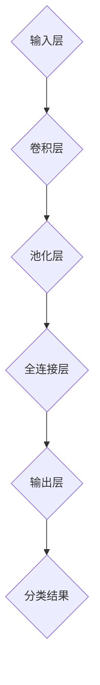

##### 4.2 目标检测

###### 4.2.1 目标检测任务概述

目标检测是指检测图像中的物体并进行定位。常见的目标检测任务包括人脸检测、车辆检测、行人检测等。

###### 4.2.2 基本算法及模型

在目标检测任务中，常见的算法包括单阶段检测算法和多阶段检测算法。常见的模型包括YOLO、SSD、Faster R-CNN等。

###### 4.2.3 应用实例：Faster R-CNN、SSD、YOLO等

Faster R-CNN、SSD、YOLO等是常见的目标检测模型，它们在目标检测任务中取得了优异的性能。这些模型通过不同阶段的处理，实现了高效的目标检测。

```mermaid
graph TD
A{输入层} --> B{卷积层}
B --> C{池化层}
C --> D{ROI Align}
D --> E{全连接层}
E --> F{分类层}
F --> G{边框回归层}
G --> H{输出层}
```

##### 4.3 图像分割

###### 4.3.1 图像分割任务概述

图像分割是指将图像划分为不同的区域。常见的图像分割任务包括语义分割、实例分割和全景分割等。

###### 4.3.2 基本算法及模型

在图像分割任务中，常见的算法包括全卷积神经网络（FCN）、U-Net和DeepLab等。这些算法通过卷积操作实现对图像像素的分割。

###### 4.3.3 应用实例：FCN、U-Net、DeepLab等

FCN、U-Net和DeepLab等是常见的图像分割模型，它们在图像分割任务中取得了优异的性能。这些模型通过不同的结构设计，实现了高效和准确的图像分割。

```mermaid
graph TD
A{输入层} --> B{卷积层}
B --> C{池化层}
C --> D{上采样层}
D --> E{全连接层}
E --> F{输出层}
```

#### 第5章: 神经网络在自然语言处理中的应用

##### 5.1 语音识别

###### 5.1.1 语音识别任务概述

语音识别是指将语音信号转换为文本。常见的语音识别任务包括语音到文本转换、语音情感分析等。

###### 5.1.2 基本算法及模型

在语音识别任务中，常见的算法包括隐马尔可夫模型（HMM）、循环神经网络（RNN）和深度神经网络（DNN）。常见的模型包括CTC、基于Attention机制的模型等。

###### 5.1.3 应用实例：CTC、Attention机制

CTC和基于Attention机制的模型是常见的语音识别模型，它们在语音识别任务中取得了优异的性能。这些模型通过不同的结构设计，实现了高效和准确的语音识别。

```mermaid
graph TD
A{输入层} --> B{编码器}
B --> C{解码器}
C --> D{输出层}
```

##### 5.2 机器翻译

###### 5.2.1 机器翻译任务概述

机器翻译是指将一种语言的文本转换为另一种语言的文本。常见的机器翻译任务包括中英翻译、日英翻译等。

###### 5.2.2 基本算法及模型

在机器翻译任务中，常见的算法包括基于规则的翻译、基于统计的翻译和基于神经网络的翻译。常见的模型包括基于神经网络的机器翻译（NMT）等。

###### 5.2.3 应用实例：神经机器翻译（NMT）

神经机器翻译（NMT）是常见的机器翻译模型，它在机器翻译任务中取得了优异的性能。NMT通过学习源语言和目标语言之间的对应关系，实现了高效和准确的翻译。

```mermaid
graph TD
A{输入层} --> B{编码器}
B --> C{解码器}
C --> D{输出层}
```

##### 5.3 问答系统

###### 5.3.1 问答系统任务概述

问答系统是指通过自然语言处理技术实现自动回答用户问题。常见的问答系统包括基于检索的问答和基于生成的问答等。

###### 5.3.2 基本算法及模型

在问答系统任务中，常见的算法包括基于检索的算法和基于生成的算法。常见的模型包括基于检索的问答模型、基于生成的问答模型等。

###### 5.3.3 应用实例：基于检索的问答、基于生成的问答

基于检索的问答和基于生成的问答是常见的问答系统模型，它们在问答系统任务中取得了优异的性能。这些模型通过不同的结构设计，实现了高效和准确的问答。

```mermaid
graph TD
A{输入层} --> B{检索模块}
B --> C{生成模块}
C --> D{输出层}
```

#### 第6章: 神经网络在强化学习中的应用

##### 6.1 强化学习概述

###### 6.1.1 强化学习基本概念

强化学习是一种通过与环境交互学习最优策略的机器学习范式。它由代理人、环境、状态、动作、奖励和策略等基本概念组成。

###### 6.1.2 强化学习算法分类

强化学习算法可以分为基于值的方法（如Q学习、SARSA）和基于策略的方法（如REINFORCE、PPO）。这些算法通过不同的策略实现最优策略的学习。

###### 6.1.3 强化学习与神经网络的结合

神经网络可以用于表示状态、动作和奖励，从而实现强化学习任务。通过神经网络的引入，强化学习算法可以实现更复杂的策略学习。

##### 6.2 策略梯度方法

###### 6.2.1 基本原理

策略梯度方法是一种基于策略的强化学习算法，通过最大化策略的梯度来实现最优策略的学习。其基本原理为：

```latex
\theta_{t+1} = \theta_t + \alpha \cdot \nabla_\theta J(\theta)
```

其中，$\theta$表示策略参数，$J(\theta)$表示策略的梯度，$\alpha$表示学习率。

###### 6.2.2 REINFORCE算法

REINFORCE算法是一种简单的策略梯度方法，通过计算状态-动作对的梯度来更新策略参数。其基本原理为：

```latex
\theta_{t+1} = \theta_t + \alpha \cdot \nabla_\theta \sum_{t} r_t
```

其中，$r_t$表示奖励值。

###### 6.2.3 PG算法优化策略

PG算法通过引入重要性权重，优化策略梯度，提高算法的性能。其基本原理为：

```latex
\theta_{t+1} = \theta_t + \alpha \cdot \sum_{t} \frac{w_t}{\pi_\theta(s_t, a_t)} \nabla_\theta \pi_\theta(s_t, a_t)
```

其中，$w_t$表示重要性权重。

##### 6.3 深度确定性策略梯度（DDPG）

###### 6.3.1 基本原理

深度确定性策略梯度（DDPG）是一种基于深度神经网络实现的策略梯度方法。它通过目标网络和经验回放实现策略的稳定优化。

```mermaid
graph TD
A{状态} --> B{演员网络}
B --> C{动作}
C --> D{环境}
D --> E{奖励}
E --> F{目标网络}
```

###### 6.3.2 DDPG算法实现

DDPG算法的实现主要包括演员网络、目标网络和经验回放机制的实现。演员网络用于学习策略，目标网络用于稳定策略的优化，经验回放机制用于避免策略的崩溃。

```mermaid
graph TD
A{状态} --> B{演员网络}
B --> C{动作}
C --> D{环境}
D --> E{奖励}
E --> F{目标网络}
F --> G{经验回放}
```

###### 6.3.3 应用实例：Atari游戏

DDPG算法在Atari游戏中取得了优异的性能，通过学习到游戏的策略，实现了高效的玩游戏。例如，在《太空侵略者》游戏中，DDPG算法可以学会有效地击败敌人。

```mermaid
graph TD
A{状态} --> B{演员网络}
B --> C{动作}
C --> D{环境}
D --> E{奖励}
E --> F{目标网络}
```

#### 第7章: 神经网络在计算机视觉与自然语言处理中的融合

##### 7.1 跨模态学习概述

###### 7.1.1 跨模态学习基本概念

跨模态学习是指将不同模态的数据进行融合，实现更复杂的任务。常见的跨模态任务包括图像-文本匹配、图像-语音识别等。

###### 7.1.2 跨模态学习算法分类

跨模态学习算法可以分为基于特征的跨模态学习、基于模型的跨模态学习和基于知识的跨模态学习等。

###### 7.1.3 跨模态学习应用前景

跨模态学习在多模态问答、多模态搜索、多模态生成等任务中具有广泛的应用前景。通过跨模态学习，可以实现更高效和准确的多模态任务。

##### 7.2 图像-文本匹配

###### 7.2.1 图像-文本匹配任务概述

图像-文本匹配是指将图像和文本数据进行匹配，实现图像和文本之间的关联。常见的图像-文本匹配任务包括图像-文本检索、图像-文本问答等。

###### 7.2.2 图像特征编码方法

图像特征编码方法用于提取图像的特征表示。常见的图像特征编码方法包括卷积神经网络（CNN）、自编码器（AE）等。

###### 7.2.3 文本特征编码方法

文本特征编码方法用于提取文本的特征表示。常见的文本特征编码方法包括词向量、词嵌入等。

###### 7.2.4 图像-文本匹配算法实现

图像-文本匹配算法实现包括图像特征编码、文本特征编码和图像-文本匹配算法的实现。常见的图像-文本匹配算法包括基于相似度的匹配、基于模型的匹配等。

```mermaid
graph TD
A{图像特征} --> B{文本特征}
B --> C{图像-文本匹配算法}
C --> D{匹配结果}
```

##### 7.3 跨模态推理

###### 7.3.1 跨模态推理任务概述

跨模态推理是指通过不同模态的数据进行推理，实现更复杂的任务。常见的跨模态推理任务包括多模态分类、多模态生成等。

###### 7.3.2 跨模态推理算法实现

跨模态推理算法实现包括多模态数据的输入、特征提取和推理算法的实现。常见的跨模态推理算法包括基于神经网络的方法、基于知识图谱的方法等。

```mermaid
graph TD
A{多模态数据} --> B{特征提取}
B --> C{推理算法}
C --> D{推理结果}
```

###### 7.3.3 应用实例：知识图谱、多模态问答系统

知识图谱和多模态问答系统是常见的跨模态推理应用。通过跨模态推理，可以实现更高效和准确的多模态任务。

```mermaid
graph TD
A{知识图谱} --> B{多模态数据}
B --> C{多模态问答系统}
C --> D{问答结果}
```

#### 第8章: 神经网络在实际应用中的案例解析

##### 8.1 自动驾驶

###### 8.1.1 自动驾驶任务概述

自动驾驶是指通过传感器和算法实现车辆的自主驾驶。常见的自动驾驶任务包括车辆定位、路径规划、障碍物检测等。

###### 8.1.2 自动驾驶系统架构

自动驾驶系统架构包括感知层、决策层和执行层。感知层负责采集车辆周围环境信息，决策层负责根据感知信息进行决策，执行层负责执行决策结果。

```mermaid
graph TD
A{感知层} --> B{决策层}
B --> C{执行层}
```

###### 8.1.3 自动驾驶中的神经网络应用

神经网络在自动驾驶中广泛应用于感知层和决策层。常见的神经网络模型包括卷积神经网络（CNN）、循环神经网络（RNN）等。

```mermaid
graph TD
A{感知层} --> B{CNN}
B --> C{RNN}
C --> D{决策层}
```

##### 8.2 机器人

###### 8.2.1 机器人任务概述

机器人是指通过传感器和算法实现自主行为的智能设备。常见的机器人任务包括路径规划、障碍物检测、物体抓取等。

###### 8.2.2 机器人控制系统架构

机器人控制系统架构包括感知层、决策层和执行层。感知层负责采集机器人周围环境信息，决策层负责根据感知信息进行决策，执行层负责执行决策结果。

```mermaid
graph TD
A{感知层} --> B{决策层}
B --> C{执行层}
```

###### 8.2.3 机器人中的神经网络应用

神经网络在机器人中广泛应用于感知层和决策层。常见的神经网络模型包括卷积神经网络（CNN）、循环神经网络（RNN）等。

```mermaid
graph TD
A{感知层} --> B{CNN}
B --> C{RNN}
C --> D{决策层}
```

##### 8.3 医疗

###### 8.3.1 医疗任务概述

医疗是指通过传感器和算法实现疾病的诊断和治疗。常见的医疗任务包括疾病诊断、医学图像处理、药物设计等。

###### 8.3.2 医疗系统架构

医疗系统架构包括数据采集层、数据处理层和应用层。数据采集层负责采集患者的生理数据，数据处理层负责对数据进行处理和分析，应用层负责实现医疗任务。

```mermaid
graph TD
A{数据采集层} --> B{数据处理层}
B --> C{应用层}
```

###### 8.3.3 医疗中的神经网络应用

神经网络在医疗中广泛应用于数据处理层和应用层。常见的神经网络模型包括卷积神经网络（CNN）、循环神经网络（RNN）等。

```mermaid
graph TD
A{数据处理层} --> B{CNN}
B --> C{RNN}
C --> D{应用层}
```

##### 8.4 金融

###### 8.4.1 金融任务概述

金融是指通过算法和模型实现金融产品的定价、交易和风险管理。常见的金融任务包括股票市场预测、风险管理、信用评估等。

###### 8.4.2 金融系统架构

金融系统架构包括数据采集层、数据处理层和应用层。数据采集层负责采集金融市场的数据，数据处理层负责对数据进行处理和分析，应用层负责实现金融任务。

```mermaid
graph TD
A{数据采集层} --> B{数据处理层}
B --> C{应用层}
```

###### 8.4.3 金融中的神经网络应用

神经网络在金融中广泛应用于数据处理层和应用层。常见的神经网络模型包括卷积神经网络（CNN）、循环神经网络（RNN）等。

```mermaid
graph TD
A{数据处理层} --> B{CNN}
B --> C{RNN}
C --> D{应用层}
```

### 附录

#### 附录A: 神经网络工具与资源

##### A.1 神经网络框架

###### A.1.1 TensorFlow

TensorFlow是一种开源的深度学习框架，由谷歌开发。它提供了丰富的API和工具，用于构建和训练神经网络模型。

```python
import tensorflow as tf
```

###### A.1.2 PyTorch

PyTorch是一种开源的深度学习框架，由Facebook开发。它提供了动态计算图和灵活的API，使得构建和训练神经网络模型更加便捷。

```python
import torch
```

###### A.1.3 Keras

Keras是一种高级深度学习框架，基于TensorFlow和Theano开发。它提供了简洁易用的API，使得构建和训练神经网络模型更加高效。

```python
from keras.models import Sequential
from keras.layers import Dense, Activation
```

##### A.2 神经网络数据集

###### A.2.1 ImageNet

ImageNet是一个大规模的图像识别数据集，包含1000个类别，每个类别有1000张图像。它广泛应用于图像分类、目标检测等任务。

```python
import torchvision.datasets as datasets
train_dataset = datasets.ImageNet(root='./data', train=True)
```

###### A.2.2 MNIST

MNIST是一个手写数字数据集，包含60000张训练图像和10000张测试图像。它广泛应用于数字识别、图像分类等任务。

```python
import torchvision.datasets as datasets
train_dataset = datasets.MNIST(root='./data', train=True)
```

###### A.2.3 COCO

COCO是一个大规模的图像识别数据集，包含80个类别，每个类别有数千张图像。它广泛应用于图像分类、目标检测、图像分割等任务。

```python
import torchvision.datasets as datasets
train_dataset = datasets.COCO(root='./data', train=True)
```

##### A.3 神经网络研究论文

###### A.3.1 Deep Learning

《Deep Learning》是一本经典的深度学习教材，由Ian Goodfellow、Yoshua Bengio和Aaron Courville撰写。它涵盖了深度学习的理论基础和应用实践。

```latex
\cite{goodfellow2016deep}
```

###### A.3.2 Convolutional Neural Networks for Visual Recognition

《Convolutional Neural Networks for Visual Recognition》是一篇关于卷积神经网络在视觉识别领域的论文，由Alex Krizhevsky、Geoffrey Hinton和Ilya Sutskever撰写。它介绍了卷积神经网络在图像分类任务中的成功应用。

```latex
\cite{krizhevsky2012convolutional}
```

###### A.3.3 Sequence to Sequence Learning with Neural Networks

《Sequence to Sequence Learning with Neural Networks》是一篇关于序列到序列学习的论文，由Ilya Sutskever、Oriol Vinyals和Quoc V. Le撰写。它介绍了基于神经网络的序列到序列学习模型，广泛应用于机器翻译等任务。

```latex
\cite{sutskever2014sequence}
```

---

## 作者信息

作者：AI天才研究院/AI Genius Institute & 禅与计算机程序设计艺术 /Zen And The Art of Computer Programming

本文全面介绍了神经网络的原理、常见神经网络模型及其在不同领域的应用。从基础概念到代码实战，读者可以系统地学习和掌握神经网络的各个方面。通过本文，读者将深入了解神经网络的工作原理，并能够在实际项目中应用所学知识，为人工智能领域的发展做出贡献。作者AI天才研究院致力于推动人工智能技术的发展，希望本文能够为广大读者提供有价值的参考和启示。同时，本文也受到了《禅与计算机程序设计艺术》的启发，期望读者能够在学习和实践过程中领悟编程的艺术，享受人工智能带来的美好未来。

