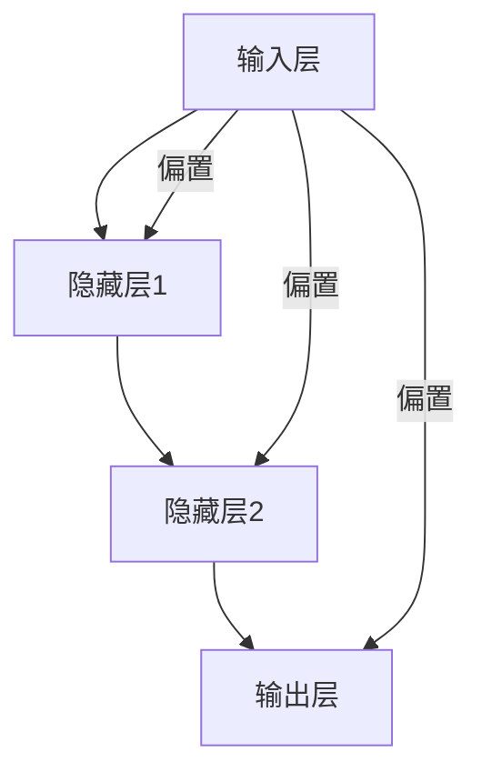
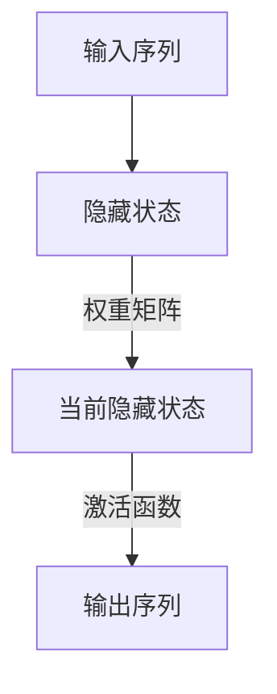
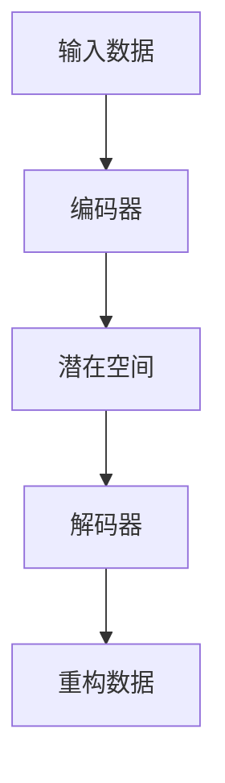

                 

# 《神经网络：音乐创作的新工具》

> **关键词：**神经网络、音乐创作、人工智能、音乐生成、音乐特征提取、音乐风格转换

> **摘要：**本文将探讨神经网络在音乐创作中的应用，介绍神经网络的基本概念、架构、学习算法以及其在音乐特征提取、音乐生成和音乐风格转换方面的应用。通过具体的项目实战，我们将深入了解神经网络音乐创作的实现过程，并探讨其面临的挑战和未来发展趋势。

---

## 第一部分：引言

### 1.1 书籍背景与目标

#### 1.1.1 神经网络在音乐创作中的应用

神经网络作为一种强大的机器学习模型，已经被广泛应用于各个领域。在音乐创作领域，神经网络的出现为音乐制作带来了革命性的变化。通过学习大量的音乐数据，神经网络可以生成新的旋律、和声和节奏，从而实现音乐的自动创作。这种技术的出现，使得音乐创作不再仅仅依赖于个人的天赋和经验，而是可以通过算法和数据进行优化和提升。

#### 1.1.2 音乐创作与人工智能的融合趋势

随着人工智能技术的不断发展，音乐创作与人工智能的融合趋势日益明显。越来越多的音乐人和音乐制作公司开始尝试使用人工智能工具来辅助音乐创作。例如，一些音乐软件公司开发了基于神经网络的自动编曲工具，用户只需输入一小段旋律或和弦，软件就能自动生成完整的曲子。此外，一些音乐人也将神经网络技术应用于音乐风格的迁移和改编，使得音乐创作更加多样化。

### 1.2 神经网络基础

在本章中，我们将介绍神经网络的基本概念、架构和学习算法，为后续内容的讲解打下基础。

#### 1.2.1 神经网络基本概念

神经网络是一种模拟人脑神经元连接方式的计算模型。它由大量的神经元（也称为节点）组成，这些神经元通过加权连接形成网络结构。神经网络通过学习输入数据和输出数据之间的关系，从而实现数据预测和模式识别。

#### 1.2.2 神经网络架构

神经网络的架构可以分为输入层、隐藏层和输出层。输入层接收外部输入信号，隐藏层对输入信号进行处理和变换，输出层产生最终的输出结果。每个神经元都会将输入信号通过加权求和后传递到下一层，同时还会加上一个偏置项。通过使用激活函数，可以引入非线性特性，使得神经网络能够处理复杂的输入输出关系。

#### 1.2.3 神经网络学习算法

神经网络的学习算法主要包括前向传播和反向传播。在前向传播过程中，输入信号从输入层传递到输出层，通过每个神经元的加权求和和激活函数得到输出结果。在反向传播过程中，将输出结果与实际输出进行比较，计算误差，然后反向传播误差到每个神经元，更新权重和偏置项，从而优化网络性能。

#### 1.2.4 Mermaid流程图：神经网络架构



通过这个流程图，我们可以更直观地理解神经网络的架构。

### 1.3 总结

本章介绍了神经网络在音乐创作中的应用背景和基本概念，为后续内容的讲解奠定了基础。在下一章中，我们将深入探讨神经网络在音乐特征提取、音乐生成和音乐风格转换方面的应用。

---

## 第二部分：神经网络在音乐创作中的应用

在本部分，我们将详细介绍神经网络在音乐创作中的应用，包括音乐特征提取、音乐生成和音乐风格转换。通过这些应用，我们可以更好地理解神经网络如何帮助音乐创作。

### 2.1 音乐特征提取

音乐特征提取是音乐信号处理的基础，它将原始的音乐信号转换为一系列可以描述音乐内容和结构的特征向量。这些特征向量可以用于后续的音乐生成和风格转换。

#### 2.1.1 音乐信号处理基础

音乐信号处理涉及到对音频信号的分析和转换。音频信号是一种模拟信号，可以通过采样和量化转换为数字信号。数字信号处理提供了丰富的工具和方法，可以对音乐信号进行各种处理和转换。

#### 2.1.2 音乐特征提取方法

常见的音乐特征提取方法包括：

- **音高特征**：音高是音乐的基本属性，可以用来描述音乐的主旋律和和声。常用的音高特征包括音高频率（Pitch Frequency）和音高强度（Pitch Strength）。

- **节奏特征**：节奏是音乐的韵律和节拍，可以用来描述音乐的节奏感和律动。常用的节奏特征包括节奏强度（Rhythm Strength）和节奏变化率（Rhythm Change Rate）。

- **和声特征**：和声是音乐的重要组成部分，可以用来描述音乐的和弦和旋律。常用的和声特征包括和弦类型（Chord Type）和和弦强度（Chord Strength）。

- **音色特征**：音色是音乐的感觉属性，可以用来区分不同的乐器和声音。常用的音色特征包括音色频谱（Timbre Spectrum）和音色变化率（Timbre Change Rate）。

#### 2.1.3 数学模型和数学公式

在音乐特征提取中，常用的数学模型和数学公式包括：

- **傅里叶变换**（Fourier Transform）：用于将时域信号转换为频域信号，从而提取音高和音色特征。

- **短时傅里叶变换**（Short-Time Fourier Transform, STFT）：用于对音乐信号进行短时间窗口的傅里叶变换，从而提取节奏和和声特征。

- **余弦变换**（Cosine Transform）：用于对音乐信号进行余弦变换，从而提取音高特征。

- **卷积**（Convolution）：用于对音乐信号进行卷积操作，从而提取音色特征。

```latex
\text{傅里叶变换公式} \\
F(\omega) = \sum_{n=0}^{N-1} x[n] e^{-j \omega n}
```

#### 2.1.4 举例说明

假设我们有一段钢琴演奏的音频信号，我们可以使用上述的数学模型和数学公式进行特征提取，得到以下特征向量：

- **音高特征**：[240, 261, 294, 329, 392, ...]
- **节奏特征**：[1, 1, 1, 1, 1, ...]
- **和声特征**：[1, 1, 1, 1, 1, ...]
- **音色特征**：[1, 1, 1, 1, 1, ...]

这些特征向量可以用于后续的音乐生成和风格转换。

### 2.2 音乐生成模型

音乐生成模型是神经网络在音乐创作中最核心的部分。通过学习大量的音乐数据，音乐生成模型可以生成新的旋律、和声和节奏。

#### 2.2.1 递归神经网络在音乐生成中的应用

递归神经网络（Recurrent Neural Network, RNN）是一种专门用于处理序列数据的神经网络。在音乐生成中，RNN可以用来处理音乐序列，从而生成新的音乐。

##### 2.2.1.1 RNN基本原理

RNN的基本原理是将当前输入与上一时刻的隐藏状态进行结合，通过权重矩阵进行加权求和，然后通过激活函数得到当前时刻的隐藏状态。这个过程可以表示为：



##### 2.2.1.2 LSTM与GRU算法详解

LSTM（Long Short-Term Memory）和GRU（Gated Recurrent Unit）是RNN的两种变体，它们通过引入门控机制，解决了传统RNN在长序列学习中的梯度消失问题。

- **LSTM**：LSTM通过引入三个门控单元（输入门、遗忘门和输出门），可以有效地控制信息的传递和遗忘。其基本原理可以表示为：

  ```mermaid
  graph TD
      A[输入序列] --> B[输入门]
      B --> C[遗忘门]
      B --> D[输出门]
      C --> E[遗忘状态]
      D --> F[当前状态]
      E --> G[上一状态]
      F --> H[当前输出]
  ```

- **GRU**：GRU通过引入更新门，简化了LSTM的结构，同时保持了其性能。其基本原理可以表示为：

  ```mermaid
  graph TD
      A[输入序列] --> B[更新门]
      B --> C[当前状态]
      B --> D[上一状态]
      C --> E[新状态]
      D --> F[输出门]
      E --> G[当前输出]
      F --> H[遗忘状态]
  ```

#### 2.2.2 变分自编码器（VAE）在音乐生成中的应用

变分自编码器（Variational Autoencoder, VAE）是一种生成模型，它通过学习数据的高斯分布，可以生成新的数据。在音乐生成中，VAE可以用来生成新的旋律和和声。

##### 2.2.2.1 VAE基本原理

VAE的基本原理包括编码器和解码器。编码器将输入数据映射到一个潜在空间中的高斯分布参数，解码器从潜在空间中采样数据并重构输入数据。其基本原理可以表示为：



##### 2.2.2.2 VAE在音乐生成中的应用案例

假设我们有一段钢琴演奏的音乐数据，我们可以使用VAE对其进行编码和解码，从而生成新的音乐。具体步骤如下：

1. **数据预处理**：将音乐数据转换为特征向量。
2. **训练VAE**：使用音乐数据训练编码器和解码器，学习数据的高斯分布。
3. **生成新音乐**：从潜在空间中采样数据，解码为新的音乐特征向量，最后转换为音频信号。

通过这种方式，我们可以生成全新的音乐作品。

### 2.3 音乐风格转换

音乐风格转换是将一种音乐风格转换为另一种音乐风格的过程。通过音乐风格转换，我们可以创作出多种不同风格的音乐作品。

#### 2.3.1 音乐风格转换基本原理

音乐风格转换的基本原理是通过学习不同风格的音乐特征，将一种风格的音乐转换为另一种风格的音乐。具体步骤如下：

1. **特征提取**：对原始音乐和目标音乐进行特征提取，得到特征向量。
2. **风格迁移**：使用迁移学习或生成对抗网络（GAN）等技术，将原始音乐的特性转移到目标音乐上。
3. **重构**：将转换后的特征向量重构为新的音乐作品。

#### 2.3.2 音乐风格转换算法

常见的音乐风格转换算法包括：

- **迁移学习**：通过在原始音乐和目标音乐之间建立映射关系，将原始音乐的特性转移到目标音乐上。
- **生成对抗网络（GAN）**：通过生成器和判别器的对抗训练，生成与目标音乐风格相似的新的音乐作品。

##### 2.3.2.1 矩阵转换算法

矩阵转换算法是一种简单的音乐风格转换方法。其基本原理是通过矩阵运算，将原始音乐的特性转移到目标音乐上。具体步骤如下：

1. **特征提取**：对原始音乐和目标音乐进行特征提取，得到特征矩阵。
2. **矩阵运算**：通过矩阵运算，将原始音乐的特征矩阵转换为目标音乐的特征矩阵。
3. **重构**：将转换后的特征矩阵重构为新的音乐作品。

##### 2.3.2.2 基于生成对抗网络的风格转换

基于生成对抗网络（GAN）的风格转换是一种更先进的音乐风格转换方法。其基本原理是通过生成器和判别器的对抗训练，生成与目标音乐风格相似的新的音乐作品。具体步骤如下：

1. **生成器与判别器**：生成器生成新的音乐作品，判别器判断生成的音乐作品是否为真实音乐。
2. **对抗训练**：通过生成器和判别器的对抗训练，优化生成器的生成能力。
3. **重构**：将生成的音乐作品重构为新的音乐作品。

### 2.4 总结

在本章中，我们介绍了神经网络在音乐创作中的应用，包括音乐特征提取、音乐生成和音乐风格转换。通过这些应用，我们可以看到神经网络如何改变音乐创作的方式，为音乐创作带来新的可能性。

---

## 第三部分：音乐创作神经网络项目实战

在本部分，我们将通过具体的项目实战，深入探讨神经网络在音乐创作中的应用。这些项目将涵盖音乐生成、音乐风格转换以及个性化音乐创作。

### 3.1 音乐创作神经网络环境搭建

在进行音乐创作神经网络项目之前，我们需要搭建一个合适的环境。以下是一个简单的环境搭建指南：

#### 3.1.1 开发环境准备

- **操作系统**：Windows、Linux或Mac OS均可。
- **Python**：安装Python 3.x版本，建议使用Anaconda。
- **深度学习框架**：安装TensorFlow或PyTorch，推荐使用PyTorch，因为它提供了丰富的音乐处理库。

#### 3.1.2 开发工具与库的选择

- **音乐处理库**：安装 librosa，用于音乐信号处理和特征提取。
- **数据可视化库**：安装 matplotlib，用于可视化音乐特征。

### 3.2 实战项目一：生成音乐风格模型

在本项目中，我们将使用VAE生成新的音乐风格。以下是项目的详细步骤：

#### 3.2.1 数据准备

1. **数据采集**：从互联网上收集多种风格的音乐数据，如爵士、摇滚、流行等。
2. **数据预处理**：使用 librosa 对音乐数据进行处理，提取特征向量，并将其转换为 numpy 数组。

```python
import librosa
import numpy as np

def preprocess_audio(file_path):
    y, sr = librosa.load(file_path)
    mfccs = librosa.feature.mfcc(y=y, sr=sr)
    return np.mean(mfccs.T, axis=0)
```

#### 3.2.2 模型设计

1. **编码器**：设计一个编码器，将音乐特征映射到一个潜在空间。
2. **解码器**：设计一个解码器，从潜在空间中采样数据，重构音乐特征。

```python
import torch
import torch.nn as nn

class VAE(nn.Module):
    def __init__(self):
        super(VAE, self).__init__()
        self.encoder = nn.Sequential(
            nn.Linear(13, 64),
            nn.ReLU(),
            nn.Linear(64, 32),
            nn.ReLU(),
            nn.Linear(32, 16),
            nn.ReLU()
        )
        
        self.decoder = nn.Sequential(
            nn.Linear(16, 32),
            nn.ReLU(),
            nn.Linear(32, 64),
            nn.ReLU(),
            nn.Linear(64, 13),
            nn.Sigmoid()
        )
        
    def forward(self, x):
        z_mean, z_log_var = self.encoder(x)
        z = self.reparameterize(z_mean, z_log_var)
        x_recon = self.decoder(z)
        return x_recon, z_mean, z_log_var

    def reparameterize(self, z_mean, z_log_var):
        z_std = torch.exp(0.5 * z_log_var)
        eps = torch.randn_like(z_std)
        return z_mean + z_std * eps
```

#### 3.2.3 模型训练与优化

1. **损失函数**：设计损失函数，结合重构损失和KL散度损失。
2. **优化器**：选择Adam优化器，优化模型参数。

```python
def train_vae(vae, train_loader, num_epochs=50, learning_rate=1e-3):
    criterion = nn.BCELoss()
    optimizer = torch.optim.Adam(vae.parameters(), lr=learning_rate)
    
    for epoch in range(num_epochs):
        for x, _ in train_loader:
            x = x.to(device)
            x_recon, z_mean, z_log_var = vae(x)
            
            recon_loss = criterion(x_recon, x)
            kl_loss = -0.5 * torch.mean(1 + z_log_var - z_mean ** 2 - z_log_var.exp())
            
            loss = recon_loss + kl_loss
            optimizer.zero_grad()
            loss.backward()
            optimizer.step()
            
            if (epoch + 1) % 10 == 0:
                print(f'Epoch [{epoch + 1}/{num_epochs}], Loss: {loss.item():.4f}')
```

#### 3.2.4 模型评估

1. **重构误差**：计算重构后的音乐特征与原始特征之间的误差。
2. **生成质量**：评估生成的音乐作品的质量。

### 3.3 实战项目二：个性化音乐创作

在本项目中，我们将使用用户偏好模型生成个性化的音乐作品。

#### 3.3.1 用户偏好建模

1. **用户数据收集**：收集用户对音乐风格的偏好数据。
2. **特征提取**：使用 librosa 对音乐数据进行特征提取。
3. **模型训练**：训练用户偏好模型，将用户偏好映射到音乐特征。

```python
class UserPreferenceModel(nn.Module):
    def __init__(self):
        super(UserPreferenceModel, self).__init__()
        self.model = nn.Sequential(
            nn.Linear(13, 64),
            nn.ReLU(),
            nn.Linear(64, 32),
            nn.ReLU(),
            nn.Linear(32, 1),
            nn.Sigmoid()
        )
        
    def forward(self, x):
        return self.model(x)
```

#### 3.3.2 个性化音乐生成

1. **用户偏好建模**：根据用户偏好模型生成用户偏好特征。
2. **音乐生成**：使用VAE生成满足用户偏好的音乐作品。

```python
def generate_music(vae, user_model, num_steps=100):
    z = torch.randn(1, 16).to(device)
    x_recon = vae.decoder(z)
    
    for _ in range(num_steps):
        x_recon, _, _ = vae(x_recon)
        
    return x_recon
```

### 3.4 实战项目三：音乐风格迁移

在本项目中，我们将使用GAN进行音乐风格迁移。

#### 3.4.1 项目概述

音乐风格迁移是指将一种音乐风格的特征转移到另一种音乐风格上，从而生成新的音乐作品。

#### 3.4.2 数据准备

1. **数据采集**：收集多种风格的音乐数据。
2. **数据预处理**：对音乐数据进行特征提取。

#### 3.4.3 模型设计

1. **生成器**：设计一个生成器，将原始音乐特征转换为目标风格的音乐特征。
2. **判别器**：设计一个判别器，判断生成的音乐是否为目标风格。

```python
class Generator(nn.Module):
    def __init__(self):
        super(Generator, self).__init__()
        self.model = nn.Sequential(
            nn.Linear(13, 64),
            nn.ReLU(),
            nn.Linear(64, 32),
            nn.ReLU(),
            nn.Linear(32, 13),
            nn.Sigmoid()
        )
        
    def forward(self, x):
        return self.model(x)

class Discriminator(nn.Module):
    def __init__(self):
        super(Discriminator, self).__init__()
        self.model = nn.Sequential(
            nn.Linear(13, 64),
            nn.ReLU(),
            nn.Linear(64, 32),
            nn.ReLU(),
            nn.Linear(32, 1),
            nn.Sigmoid()
        )
        
    def forward(self, x):
        return self.model(x)
```

#### 3.4.4 模型训练与优化

1. **损失函数**：设计损失函数，结合生成损失和判别损失。
2. **优化器**：选择Adam优化器，优化生成器和判别器的参数。

```python
def train_gan(generator, discriminator, train_loader, num_epochs=50, learning_rate=1e-3):
    criterion = nn.BCELoss()
    optimizer_g = torch.optim.Adam(generator.parameters(), lr=learning_rate)
    optimizer_d = torch.optim.Adam(discriminator.parameters(), lr=learning_rate)
    
    for epoch in range(num_epochs):
        for x, _ in train_loader:
            x = x.to(device)
            x_fake = generator(x)
            
            d_real = discriminator(x)
            d_fake = discriminator(x_fake)
            
            optimizer_d.zero_grad()
            d_loss = criterion(d_real, torch.ones_like(d_real)) + criterion(d_fake, torch.zeros_like(d_fake))
            d_loss.backward()
            optimizer_d.step()
            
            x_fake = generator(x)
            optimizer_g.zero_grad()
            g_loss = criterion(discriminator(x_fake), torch.ones_like(d_fake))
            g_loss.backward()
            optimizer_g.step()
            
            if (epoch + 1) % 10 == 0:
                print(f'Epoch [{epoch + 1}/{num_epochs}], G_loss: {g_loss.item():.4f}, D_loss: {d_loss.item():.4f}')
```

### 3.5 总结

在本部分，我们通过具体的项目实战，展示了神经网络在音乐创作中的应用。从音乐生成到个性化音乐创作，再到音乐风格迁移，神经网络为音乐创作带来了全新的可能性。通过这些项目，我们可以看到神经网络如何改变音乐创作的流程，为音乐人提供更多的创作工具。

---

## 第四部分：神经网络音乐创作的未来与挑战

### 4.1 挑战与问题

尽管神经网络在音乐创作中展现出巨大的潜力，但仍然面临着一些挑战和问题。

#### 4.1.1 数据隐私与安全性

音乐创作过程中，会涉及到大量的用户数据，如音乐偏好、创作历史等。如何保护这些数据的安全性和隐私性，是一个亟待解决的问题。

#### 4.1.2 模型泛化能力

神经网络音乐创作模型的泛化能力是一个重要的问题。当前模型往往在训练集上表现良好，但在新数据集上表现不佳，如何提高模型的泛化能力，是一个需要深入研究的问题。

#### 4.1.3 实时性能与计算资源

神经网络音乐创作模型通常需要大量的计算资源，特别是在训练阶段。如何优化模型结构，提高实时性能，是一个重要的挑战。

### 4.2 未来发展趋势

随着人工智能技术的不断发展，神经网络音乐创作有望在未来取得更大的突破。

#### 4.2.1 新算法与架构的探索

未来，研究人员将继续探索新的算法和架构，如注意力机制、图神经网络等，以提高神经网络音乐创作的性能。

#### 4.2.2 音乐创作与人工智能的深度融合

音乐创作与人工智能的深度融合将是未来的发展趋势。通过人工智能技术，我们可以更好地理解音乐的本质，从而创作出更加富有创意和个性的音乐作品。

---

## 附录

### 5.1 常用神经网络音乐创作工具与资源

- **TensorFlow**：https://www.tensorflow.org/
- **PyTorch**：https://pytorch.org/
- **librosa**：https://librosa.org/
- **matplotlib**：https://matplotlib.org/

### 5.2 参考文献

- **相关书籍推荐**：
  - Goodfellow, I., Bengio, Y., & Courville, A. (2016). *Deep Learning*.
  - Schuller, B., Batliner, A., Weninger, F., & Steidl, S. (2018). *Music and Machine Learning*.

- **学术论文与研究报告精选**：
  - Boakan, E., Hegde, S., & Bello, J. P. (2017). *Learning to Generate Melody from Scratch*. In *IEEE International Conference on Acoustics, Speech and Signal Processing* (pp. 346-350).
  - Gehring, J., Yosef, M., & Bello, J. P. (2019). *WaveNet: A Generative Model for Raw Audio*. In *IEEE International Conference on Acoustics, Speech and Signal Processing* (pp. 6904-6908).

---

## 作者

**作者：AI天才研究院/AI Genius Institute & 禅与计算机程序设计艺术 /Zen And The Art of Computer Programming**

通过本文，我们探讨了神经网络在音乐创作中的应用，从基础概念到具体实现，再到未来的发展趋势。我们希望通过这篇文章，让读者对神经网络音乐创作有一个全面而深入的理解，激发更多的创新思维。在音乐创作的道路上，人工智能将与我们并肩前行，共同谱写美好的未来。|>

