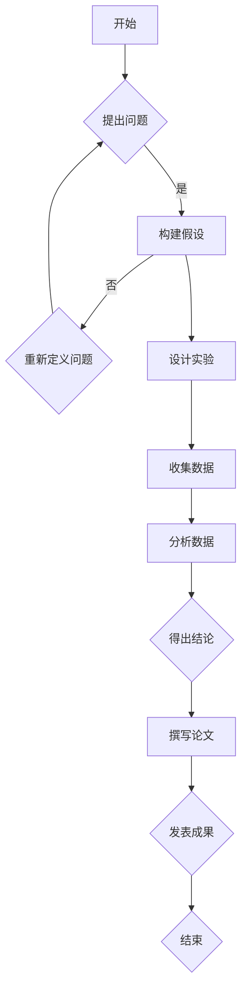
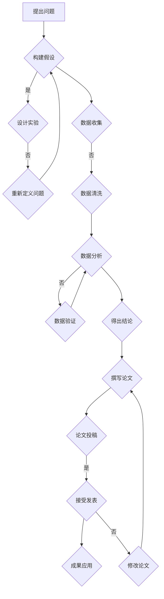

                 

# 《科学探究：从假说到真理》

> **关键词**：科学探究、假说、实验设计、数据分析、伦理道德

> **摘要**：本文通过深入探讨科学探究的历程，从假说到真理的转化，旨在揭示科学探究的本质和方法。文章分为三大部分，首先介绍了科学探究的基本原理和哲学基础，接着详细阐述了科学探究的过程、方法与技术，最后通过具体案例分析了科学探究的实践与未来展望。本文旨在为读者提供一个清晰、系统的科学探究指南。

### 目录大纲

# 《科学探究：从假说到真理》

## 第一部分：科学探究的引论

### 第1章：科学的本质与哲学基础

#### 1.1 科学探究的定义与目标

#### 1.2 科学方法的基本原则

#### 1.3 科学与哲学的关系

### 第2章：科学探究的过程

#### 2.1 从问题到假设

#### 2.2 设计实验与收集数据

#### 2.3 分析数据与得出结论

### 第3章：科学探究中的伦理与道德

#### 3.1 科学伦理的重要性

#### 3.2 科学探究中的道德困境

#### 3.3 科学伦理的案例分析

## 第二部分：科学探究的方法与技术

### 第4章：观察与描述

#### 4.1 观察的技巧与方法

#### 4.2 描述性研究的优点与局限

### 第5章：实验设计

#### 5.1 实验设计的基本原则

#### 5.2 实验类型与选择

#### 5.3 随机化的应用

### 第6章：统计分析

#### 6.1 统计分析的基本概念

#### 6.2 常见的统计方法

#### 6.3 统计分析在科学探究中的应用

### 第7章：科学探究中的数据可视化

#### 7.1 数据可视化的作用

#### 7.2 常见的数据可视化工具

#### 7.3 数据可视化实例解析

## 第三部分：科学探究的实践与案例

### 第8章：科学研究项目的启动

#### 8.1 研究项目的规划

#### 8.2 资源与资金的筹集

#### 8.3 研究团队的组建

### 第9章：科学研究中的团队合作

#### 9.1 团队合作的重要性

#### 9.2 团队沟通与协作

#### 9.3 团队冲突的解决

### 第10章：科学论文的撰写与发表

#### 10.1 科学论文的结构

#### 10.2 学术道德与学术诚信

#### 10.3 论文投稿与评审

### 第11章：科学探究中的成功案例

#### 11.1 量子力学的重大突破

#### 11.2 癌症治疗研究的里程碑

#### 11.3 人工智能的发展历程

### 第12章：科学探究的未来展望

#### 12.1 科学探究的新趋势

#### 12.2 科学探究中的新挑战

#### 12.3 科学探究对社会的影响

## 附录

### 附录A：科学探究常用工具与资源

#### A.1 科学探究的软件与平台

#### A.2 科研数据库与文献资源

#### A.3 科学探究相关的学术会议与期刊

### 附录B：科学探究中的数学模型与公式

#### B.1 数学模型在科学探究中的应用

#### B.2 常见的数学公式与解释

#### B.3 数学公式在科学探究中的实际应用案例

### 附录C：科学探究中的 Mermaid 流程图

#### C.1 Mermaid 基本语法与使用方法

#### C.2 Mermaid 在科学探究中的实际应用

#### C.3 Mermaid 实例解析与技巧

----------------------------------------------------------------

## 第一部分：科学探究的引论

### 第1章：科学的本质与哲学基础

#### 1.1 科学探究的定义与目标

科学探究是人类对自然现象和未知领域进行探索和研究的过程。它不仅包括对现有知识的验证，还包括对新问题的发现和解决。科学探究的目标是揭示自然界的规律，理解事物的本质，并为人类的生活和生产提供指导。

科学探究的定义可以从以下几个方面来理解：

1. **提出问题**：科学探究始于对自然现象的观察和疑问。科学家通过提出问题，引发思考，寻求答案。

2. **构建假说**：在提出问题后，科学家会基于现有的知识和理论，构建一个初步的假设，即假说。假说是对问题可能的答案的猜想。

3. **设计实验**：为了验证假说，科学家会设计实验，通过实验来收集数据和证据。

4. **分析数据**：科学家会对实验数据进行分析，以确定假说的正确性。

5. **得出结论**：根据数据分析的结果，科学家会得出结论，并对假说进行修正或接受。

6. **理论构建**：最终的结论会进一步发展成理论，为科学知识体系做出贡献。

科学探究的目标可以概括为以下几个方面：

- **理解自然**：揭示自然界的规律和原理，理解自然现象的本质。
- **解决难题**：解决人类面临的各种实际问题，如疾病、能源、环境等。
- **推动技术进步**：科学探究推动了技术的不断进步，提高了人类的生产力和生活质量。
- **拓展知识边界**：科学探究不断拓展人类的知识边界，使我们对世界的认识更加深入和全面。

#### 1.2 科学方法的基本原则

科学方法是一套系统的研究方法和原则，用于指导科学探究的过程。它包括以下几个基本原则：

1. **客观性**：科学探究要求研究者保持客观，避免主观偏见。研究者应该尽可能地避免个人情感、价值观等因素对研究结果的干扰。

2. **系统性**：科学方法强调将研究对象作为一个整体，从多个角度和层面进行研究。这有助于全面、深入地理解研究对象的本质。

3. **可重复性**：科学探究的结果应该是可重复的。其他研究者应该能够通过相同的方法和实验条件，得到相同或类似的结果。

4. **可验证性**：科学探究的结论应该是可以通过实验和数据验证的。这要求科学家在设计实验时，确保实验结果具有可靠性和准确性。

5. **证据导向**：科学探究依赖于实验和观测的数据，而不是基于信仰或直觉。科学家应该根据证据来支持或反驳假说。

6. **开放性**：科学方法鼓励开放和透明的学术交流。科学家应该分享自己的研究成果，接受同行的评审和批评，以促进科学的进步。

#### 1.3 科学与哲学的关系

科学和哲学有着密切的关系。哲学是科学的起源，为科学探究提供了基础和指导。以下从几个方面来看科学与哲学的关系：

1. **哲学对科学的指导**：哲学为科学探究提供了世界观和方法论。科学家在研究过程中，会借鉴哲学中的思想和方法，如逻辑推理、实证主义等。

2. **科学对哲学的贡献**：科学的发展推动了哲学的进步。科学探究揭示了自然界的规律，扩展了人类的认识边界，为哲学提供了新的研究对象和问题。

3. **科学与哲学的互动**：科学和哲学之间存在着相互影响和互动。科学家在研究过程中，会反思和探讨科学的本质、目的和方法，这些思考又反过来影响了科学的发展。

4. **科学与哲学的独立性**：虽然科学和哲学密切相关，但它们在本质上又是独立的。科学关注的是可观测和可验证的事实，而哲学则关注概念、原理和价值观。

科学探究是一个复杂而系统的过程，从提出问题、构建假说到设计实验、分析数据和得出结论，每一步都需要严谨的逻辑思考和科学的实证方法。科学方法的基本原则为科学探究提供了指导和保障，而科学与哲学的关系则揭示了科学探究的本质和意义。

在下一章中，我们将进一步探讨科学探究的过程，从问题到假设，再到实验设计和数据分析，逐步揭示科学探究的奥秘。

## 第2章：科学探究的过程

科学探究是一个系统的过程，它从对自然现象的观察和疑问开始，通过提出问题、构建假说、设计实验、收集数据和数据分析，最终得出结论。这一过程不仅要求严谨的逻辑思考，还需要科学的方法和技巧。本章将详细探讨科学探究的每一个步骤。

#### 2.1 从问题到假设

科学探究始于对自然现象的观察和疑问。科学家在观察过程中，会发现一些有趣或矛盾的现象，从而激发他们的好奇心。以下是一个从问题到假设的例子：

**观察现象**：为什么天空是蓝色的？

**提出问题**：天空为什么是蓝色的？

**构建假设**：可能是大气中的气体和粒子散射了太阳光中的蓝色光。

这一过程涉及到几个关键步骤：

1. **观察与记录**：科学家通过观察自然现象，记录下有趣或矛盾的信息。
2. **提出问题**：科学家根据观察结果，提出需要解决的科学问题。
3. **构建假设**：科学家基于现有的知识和理论，构建一个初步的假设，以解释观察到的现象。

#### 2.2 设计实验与收集数据

在提出问题和构建假设之后，科学家需要设计实验来验证假设。实验设计是科学探究的重要环节，它决定了实验的可行性和有效性。以下是一个设计实验的例子：

**假设**：大气中的气体和粒子散射了太阳光中的蓝色光。

**实验设计**：

1. **实验目的**：验证大气中的气体和粒子是否散射了太阳光中的蓝色光。
2. **实验材料**：太阳光、透明容器、蓝色滤光片、测量工具。
3. **实验步骤**：
   - 将太阳光通过透明容器射入室内。
   - 在光线路径上放置蓝色滤光片。
   - 使用测量工具测量透过蓝色滤光片的光线强度。
   - 改变透明容器中的气体和粒子浓度，重复实验。

**数据收集**：在实验过程中，科学家需要记录以下数据：

- 光线强度（透过蓝色滤光片的光线）。
- 透明容器中气体和粒子的浓度。
- 实验环境的温度和湿度。

这些数据将用于验证假设，并支持科学结论。

#### 2.3 分析数据与得出结论

在收集到实验数据后，科学家需要对数据进行分析。数据分析是科学探究的核心环节，它决定了假设的正确性和科学结论的可靠性。以下是一个数据分析的例子：

**实验数据**：
- 未添加气体和粒子时，透过蓝色滤光片的光线强度为100%。
- 添加气体和粒子后，透过蓝色滤光片的光线强度降低到60%。

**数据分析**：

1. **描述性统计**：计算透过蓝色滤光片的光线强度的平均值和标准差。
2. **假设检验**：使用统计方法（如t检验）比较添加气体和粒子前后的光线强度差异，判断假设是否成立。
3. **回归分析**：分析透明容器中气体和粒子浓度与透过蓝色滤光片的光线强度之间的关系。

**得出结论**：

- 根据数据分析结果，可以得出结论：大气中的气体和粒子散射了太阳光中的蓝色光。

#### 2.4 科学探究的循环过程

科学探究是一个循环过程，它不仅包括从问题到假设、实验设计和数据分析的步骤，还包括假设的修正和新的问题的提出。以下是一个科学探究的循环过程的例子：

1. **提出问题**：为什么天空是蓝色的？
2. **构建假设**：大气中的气体和粒子散射了太阳光中的蓝色光。
3. **设计实验**：验证假设，收集数据。
4. **分析数据**：得出结论，修正假设。
5. **提出新问题**：气体和粒子的散射机制是什么？

这个循环过程使得科学探究不断深入，逐步揭示自然界的规律。

#### 2.5 科学探究的复杂性

科学探究是一个复杂的过程，它不仅涉及到科学方法的应用，还需要跨学科的合作和综合分析。以下是一些科学探究的复杂性方面：

1. **多因素影响**：自然现象往往受到多种因素的影响，科学家需要考虑这些因素，并设计实验来控制它们。
2. **不确定性**：科学探究中存在不确定性，科学家需要通过多次实验和数据分析来降低不确定性。
3. **跨学科合作**：科学探究往往需要跨学科的知识和技能，科学家需要与其他领域的专家合作。
4. **技术挑战**：科学探究中的实验和技术要求较高，科学家需要不断更新技术和方法。

#### 2.6 科学探究的伦理道德

科学探究不仅涉及到科学方法和技术，还涉及到伦理道德。科学家在探究过程中需要遵循以下伦理道德原则：

1. **诚实与诚信**：科学家应保持诚实和诚信，不篡改数据，不捏造结果。
2. **尊重隐私**：在涉及人类或动物的研究中，科学家应尊重被研究者的隐私。
3. **公平与公正**：科学家应公平地对待不同观点和证据，公正地进行科学评审。
4. **责任与义务**：科学家有责任将研究成果分享给公众，为社会做出贡献。

科学探究的过程是一个复杂而系统性的过程，从问题到假设、实验设计和数据分析，每一步都需要严谨的逻辑思考和科学的实证方法。科学方法的基本原则为科学探究提供了指导和保障，而伦理道德则为科学探究提供了伦理和道德的规范。在下一章中，我们将探讨科学探究中的伦理道德问题，分析科学家在探究过程中可能面临的道德困境和解决方案。

## 第3章：科学探究中的伦理与道德

科学探究不仅仅是科学方法和技术的应用，还涉及到伦理和道德的问题。科学家在进行科学探究时，必须遵守一系列伦理道德原则，以确保研究过程的正当性和结果的可靠性。本章将探讨科学探究中的伦理道德问题，分析科学家可能面临的道德困境，并提出解决这些困境的方案。

#### 3.1 科学伦理的重要性

科学伦理是指科学家在科学探究过程中应遵循的道德原则和行为规范。科学伦理的重要性体现在以下几个方面：

1. **确保研究的正当性和可靠性**：科学伦理规范了科学家的行为，确保研究的正当性和结果的可靠性，从而维护科学的权威和声誉。
2. **保护研究对象的权益**：科学探究往往涉及人类、动物或环境等研究对象。科学伦理要求科学家尊重研究对象的权益，确保其不受伤害。
3. **促进科学合作与交流**：科学伦理鼓励科学家之间的合作与交流，共同推动科学进步。
4. **提高社会对科学的信任**：科学伦理规范了科学家的行为，提高了社会对科学的信任，有利于科学在社会中的普及和应用。

#### 3.2 科学探究中的道德困境

科学探究过程中，科学家可能会面临各种道德困境。以下是一些常见的道德困境及其解决方法：

1. **隐私与知情同意**：在涉及人类研究时，科学家需要确保研究对象的隐私得到保护，并获得知情同意。道德困境在于如何在确保研究对象隐私的同时，获得必要的信息和数据。

**解决方案**：科学家应采取以下措施：
- **隐私保护**：使用匿名化数据，确保研究对象的信息不会被泄露。
- **知情同意**：在研究开始前，向研究对象详细解释研究目的、过程和潜在风险，并获得其明确同意。

2. **利益冲突**：科学家在进行研究时，可能会面临个人利益与科学研究之间的冲突。

**解决方案**：科学家应采取以下措施：
- **公开透明**：公开披露可能存在的利益冲突，接受同行的监督和评审。
- **独立审查**：在研究过程中，邀请独立专家进行审查，确保研究的公正性和客观性。

3. **实验动物的使用**：在涉及动物的研究中，科学家需要权衡动物的福利和科学研究的价值。

**解决方案**：科学家应采取以下措施：
- **最小化动物使用**：在确保研究可靠性的前提下，尽量减少动物的使用数量。
- **动物福利**：遵守动物福利原则，确保动物在研究过程中受到适当的照顾和尊重。

4. **数据共享与知识产权**：科学家在研究过程中产生的数据和信息，可能会涉及知识产权问题。

**解决方案**：科学家应采取以下措施：
- **数据共享**：在尊重知识产权的前提下，促进数据共享，推动科学进步。
- **知识产权保护**：合理申请专利和版权，保护科学家及其研究机构的权益。

5. **结果公开与负责任披露**：科学研究的结论可能会对公众和社会产生重大影响。

**解决方案**：科学家应采取以下措施：
- **负责任披露**：在公开研究结果时，充分考虑可能的社会影响，避免误导和恐慌。
- **透明公开**：在研究成果发表前，进行严格审查，确保结果的可靠性和真实性。

#### 3.3 科学伦理的案例分析

以下是一些科学伦理的典型案例，以及科学家如何处理这些案例：

1. **医学研究中的利益冲突**：某医学研究者在涉及某种新药物的研究中，同时是该药物的专利持有者。这引发了利益冲突的争议。

**解决方案**：研究者公开披露其利益冲突，并邀请独立专家进行审查。最终，研究者在确保研究结果公正和客观的前提下，公开了研究数据。

2. **基因编辑研究**：某科学家在进行基因编辑研究时，涉及到人类胚胎的修改。这一行为引发了广泛的伦理争议。

**解决方案**：国际科学界对基因编辑研究进行了严格的伦理审查，并在共识的基础上制定了相关规范。科学家在遵守这些规范的前提下，继续进行基因编辑研究。

3. **气候变化研究**：某科学家在气候变化研究中，发现了一些敏感的数据，可能会对政策制定产生重大影响。

**解决方案**：科学家在公开研究结果时，充分考虑了社会影响，并进行了负责任的披露。研究结果被政策制定者广泛引用，推动了气候变化的应对措施。

科学探究中的伦理道德问题至关重要，它关系到科学研究的正当性和可靠性，以及科学家个人的道德责任。科学家在探究过程中，应遵循科学伦理原则，处理各种道德困境，确保科学研究的正当性和公正性。通过案例分析，我们可以看到科学家如何应对这些伦理问题，并找到合理的解决方案。在下一章中，我们将深入探讨科学探究的方法与技术，从观察与描述、实验设计、统计分析和数据可视化等方面，揭示科学探究的奥秘。

## 第二部分：科学探究的方法与技术

科学探究不仅依赖于科学家对自然现象的敏锐观察，还需要一系列科学方法和技术的支持。本章将详细讨论科学探究的方法和技术，包括观察与描述、实验设计、统计分析、数据可视化等。通过这些方法和技术，科学家可以系统地收集、分析和解释数据，从而揭示自然界的规律。

### 第4章：观察与描述

科学探究始于观察，这是科学家获取信息的重要途径。观察不仅仅是用眼睛看，而是通过多种感官和工具，对自然现象进行系统的记录和描述。以下从几个方面讨论观察与描述的方法：

#### 4.1 观察的技巧与方法

1. **直接观察**：直接观察是通过感官对自然现象进行观察。科学家可以运用视觉、听觉、触觉等感官，直接记录自然现象的特点和变化。

2. **仪器观察**：当直接观察无法满足需求时，科学家可以使用各种仪器来辅助观察。例如，望远镜用于观察天体，显微镜用于观察微生物，红外线探测器用于观察热辐射等。

3. **长期观察**：长期观察是指对某一自然现象进行持续、长期的监测和记录。这种方法有助于揭示自然现象的周期性变化和长期趋势。

4. **对比观察**：对比观察是通过比较不同条件下的自然现象，来研究某一因素对现象的影响。这种方法有助于确定因果关系。

#### 4.2 描述性研究的优点与局限

描述性研究是对自然现象进行描述和分类，它具有以下优点：

1. **简单易行**：描述性研究不需要复杂的实验设计，只需对自然现象进行观察和记录。

2. **快速获得信息**：描述性研究可以快速获得关于自然现象的基本信息，有助于初步了解研究对象。

3. **基础数据积累**：描述性研究可以为后续的实验研究提供基础数据，为深入分析奠定基础。

然而，描述性研究也存在一定的局限：

1. **无法确定因果关系**：描述性研究只能揭示现象之间的相关性，无法确定因果关系。

2. **主观性**：描述性研究受观察者主观因素的影响较大，可能导致结果的偏差。

3. **数据量有限**：描述性研究的数据量通常较小，可能不足以支持广泛的结论。

### 第5章：实验设计

实验设计是科学探究的核心环节，它决定了实验的可行性和有效性。以下从几个方面讨论实验设计的基本原则和方法：

#### 5.1 实验设计的基本原则

1. **控制变量**：实验设计应尽量控制无关变量，确保实验结果的准确性。

2. **随机化**：实验设计应采用随机化方法，避免主观偏见对实验结果的影响。

3. **重复实验**：实验设计应包括重复实验，以验证结果的可靠性和稳定性。

4. **可重复性**：实验设计应确保其他研究者能够在相同条件下重复实验，验证实验结果的可靠性。

5. **实验伦理**：实验设计应遵循实验伦理原则，保护研究对象的权益。

#### 5.2 实验类型与选择

1. **实验室实验**：实验室实验是在受控条件下进行的实验，有助于控制变量和减少干扰因素。

2. **现场实验**：现场实验是在自然环境中进行的实验，可以更真实地模拟自然现象。

3. **模拟实验**：模拟实验是通过计算机模拟来模拟自然现象，适用于无法进行实际实验的情况。

4. **对比实验**：对比实验通过比较不同条件下的实验结果，来确定某一因素对实验结果的影响。

#### 5.3 随机化的应用

1. **随机分组**：随机分组可以确保实验组和对照组的初始状态相似，减少分组偏差。

2. **随机抽样**：随机抽样可以确保样本的代表性，减少抽样误差。

3. **随机化分配**：随机化分配可以确保研究对象在实验组和对照组之间的分配是随机的，减少主观偏见。

通过实验设计，科学家可以系统地收集数据，验证假设，得出科学结论。实验设计的基本原则和方法为科学探究提供了坚实的保障。

### 第6章：统计分析

统计分析是科学探究中不可或缺的一部分，它用于对实验数据进行处理、分析和解释。以下从几个方面讨论统计分析的基本概念、常见方法和应用：

#### 6.1 统计分析的基本概念

1. **数据类型**：包括定量数据和分类数据。

2. **描述性统计**：用于描述数据的中心趋势和离散程度，如平均值、中位数、标准差等。

3. **推断性统计**：用于根据样本数据推断总体特征，如t检验、方差分析等。

4. **概率分布**：描述数据在不同条件下的概率分布，如正态分布、二项分布等。

#### 6.2 常见的统计方法

1. **t检验**：用于比较两组数据的差异，判断差异是否显著。

2. **方差分析（ANOVA）**：用于比较多组数据的差异，判断差异是否显著。

3. **回归分析**：用于研究变量之间的关系，预测一个变量基于其他变量的变化。

4. **聚类分析**：用于将数据分为不同的类别，揭示数据的内在结构。

5. **生存分析**：用于研究时间到事件的发生概率，如癌症患者的生存时间。

#### 6.3 统计分析在科学探究中的应用

1. **假设检验**：通过统计分析验证科学假设的正确性。

2. **数据挖掘**：通过统计分析发现数据中的模式和规律，支持科学发现。

3. **风险评估**：通过统计分析评估科学探究中的风险，为决策提供依据。

4. **模型建立**：通过统计分析建立数学模型，预测和解释自然现象。

统计分析为科学探究提供了强大的工具，有助于科学家从数据中提取有价值的信息，支持科学结论的得出。

### 第7章：科学探究中的数据可视化

数据可视化是将数据转换为视觉形式，以更直观地展示数据特征和关系。以下从几个方面讨论数据可视化的作用、工具和实例：

#### 7.1 数据可视化的作用

1. **数据解释**：通过数据可视化，可以更直观地理解数据的含义和趋势。

2. **数据发现**：通过数据可视化，可以发现数据中的模式和异常。

3. **数据沟通**：通过数据可视化，可以更有效地向非专业人士传达数据信息。

4. **决策支持**：通过数据可视化，可以直观地展示数据对决策的影响，支持科学决策。

#### 7.2 常见的数据可视化工具

1. **图表**：包括柱状图、折线图、饼图等，用于展示数据分布和趋势。

2. **图像**：包括热力图、散点图等，用于展示复杂数据的关系和分布。

3. **地图**：用于展示空间数据，如地理分布、气候变化等。

4. **交互式可视化**：通过交互式界面，用户可以动态地探索和分析数据。

#### 7.3 数据可视化实例解析

1. **温度变化**：使用折线图展示不同地区的温度变化趋势。

2. **销售数据**：使用饼图展示不同产品的销售占比。

3. **基因表达**：使用热力图展示基因在不同细胞类型的表达水平。

4. **社会网络**：使用散点图展示社交网络中节点之间的关系。

数据可视化在科学探究中具有重要作用，它使得复杂数据变得更加直观和易于理解，有助于科学家发现数据中的模式和规律。通过本章的讨论，我们了解了科学探究的方法和技术，为后续的实践和案例分析奠定了基础。在下一部分中，我们将通过具体的案例，深入探讨科学探究的实践过程和实际应用。

### 第8章：科学研究项目的启动

科学研究项目的启动是一个复杂而关键的过程，它涉及到项目的规划、资源的筹集以及团队的组建。以下是科学研究项目启动过程中的几个关键步骤。

#### 8.1 研究项目的规划

研究项目的规划是项目启动的第一步，它为整个项目提供了方向和目标。以下是一些规划的关键要素：

1. **项目目标**：明确项目的目标是什么，例如解决某个科学问题、开发新技术或提出新的理论。

2. **研究问题**：基于项目目标，提出具体的研究问题，这些问题将指导整个研究过程。

3. **研究范围**：界定研究范围，明确研究的深度和广度，避免研究过程中偏离主题。

4. **时间表**：制定详细的时间表，包括各个阶段的时间节点和任务分配。

5. **资源需求**：分析项目所需的资源，包括资金、设备、人力资源和材料等。

6. **风险评估**：评估项目可能面临的风险，并制定相应的风险应对策略。

#### 8.2 资源与资金的筹集

科学研究项目通常需要大量的资金支持。以下是一些筹集资金的关键步骤：

1. **预算编制**：根据项目规划，编制详细的预算，包括直接成本（如实验材料、设备租赁）和间接成本（如人员工资、管理费用）。

2. **资金申请**：向政府研究机构、学术机构、基金会、企业或其他潜在资助者提交资金申请。申请材料应包括项目概述、研究目标、预期成果和预算表。

3. **合作伙伴**：寻找合作伙伴，如其他研究机构、企业或政府机构，共同分担研究成本和风险。

4. **筹资策略**：根据项目的特点和需求，制定多样化的筹资策略，包括政府资金、私人捐赠、企业合作等。

5. **预算管理**：在项目实施过程中，严格管理预算，确保资金的有效使用和合理分配。

#### 8.3 研究团队的组建

研究团队是科学研究项目成功的关键因素。以下是一些组建研究团队的关键步骤：

1. **团队结构**：根据项目需求和资源，确定团队结构，包括核心成员、辅助成员和顾问。

2. **人才招募**：通过招聘会、学术会议和在线平台等渠道，招募具备相关技能和经验的团队成员。

3. **角色分配**：明确团队成员的角色和职责，确保每个成员都能充分发挥其专长。

4. **团队培训**：为团队成员提供必要的培训和指导，确保他们能够胜任各自的职责。

5. **团队协作**：建立有效的团队协作机制，促进团队成员之间的沟通和合作，提高项目效率。

6. **团队文化**：培养积极向上的团队文化，鼓励创新和协作，激发团队成员的创造力和潜力。

通过合理的项目规划、有效的资源筹集和团队的组建，科学研究项目可以顺利启动。这些步骤不仅为项目提供了坚实的基础，也为项目的成功实施和目标达成奠定了关键的基础。

### 第9章：科学研究中的团队合作

科学研究往往需要跨学科、跨领域的合作，这要求团队成员之间具备良好的沟通和协作能力。团队合作在科学研究中的重要性不言而喻，它不仅关系到项目的进展和成果，还影响到团队成员的个人成长和发展。本章将探讨团队合作的重要性、沟通与协作的方法，以及如何解决团队冲突。

#### 9.1 团队合作的重要性

团队合作在科学研究中具有以下几个方面的意义：

1. **知识互补**：科学研究涉及多个学科领域，团队合作可以集合不同领域的专家，发挥各自的专业优势，实现知识的互补和融合。

2. **资源整合**：通过团队合作，可以整合各种资源，包括资金、设备、数据和人才，提高项目的研究效率和成果质量。

3. **协同创新**：团队合作可以激发创新思维，通过不同观点的碰撞和交流，产生新的研究思路和方法。

4. **提高效率**：团队成员可以分工合作，各自负责不同的任务，提高项目进展的效率。

5. **增强稳定性**：团队合作有助于形成稳定的研究团队，降低项目因人员变动带来的风险。

#### 9.2 团队沟通与协作

良好的团队沟通与协作是确保科学研究顺利进行的重要保障。以下是一些团队沟通与协作的方法：

1. **明确目标与任务**：确保每个团队成员都清楚项目的目标、自己的任务和责任，避免工作上的误解和冲突。

2. **定期会议**：定期召开团队会议，讨论项目的进展、存在的问题和下一步计划，确保团队成员之间的信息同步。

3. **透明沟通**：鼓励团队成员之间的开放沟通，分享自己的想法和意见，促进信息的流动和问题的解决。

4. **分工协作**：明确团队成员之间的分工，确保每个人都能在自己的领域内发挥最大的作用。

5. **冲突解决**：建立冲突解决机制，当出现意见分歧时，通过讨论和协商找到共识。

6. **跨领域合作**：鼓励跨领域的合作和交流，促进不同领域专家之间的互动和协作。

#### 9.3 团队冲突的解决

团队冲突是团队合作中不可避免的问题，关键在于如何有效解决这些冲突。以下是一些解决团队冲突的方法：

1. **倾听与理解**：在冲突发生时，首先倾听各方的意见和立场，理解他们的需求和期望。

2. **保持冷静**：避免在冲突中情绪化，保持冷静和客观，以便更理性地分析和解决问题。

3. **寻找共识**：通过讨论和协商，找到各方都能接受的解决方案，避免单方面的决策。

4. **公正处理**：在解决冲突时，要公正对待所有团队成员，确保每个声音都能被听到。

5. **积极沟通**：保持积极的沟通态度，鼓励团队成员提出建议和解决方案，共同寻找最佳方案。

6. **培训与指导**：为团队成员提供沟通与协作的培训，提高他们的沟通能力和协作意识。

团队合作在科学研究中至关重要，它不仅关系到项目的进展和成果，还影响到团队成员的个人成长和发展。通过有效的沟通和协作，团队能够克服困难，实现共同的目标。在解决团队冲突时，采取合理的策略和方法，可以减少冲突带来的负面影响，促进团队的稳定和高效运行。在下一章中，我们将探讨科学论文的撰写与发表，了解学术论文的结构和撰写技巧，以及学术道德和诚信的重要性。

### 第10章：科学论文的撰写与发表

科学论文是科学探究成果的重要载体，它通过系统地阐述研究问题、方法、结果和结论，为科学界提供新的知识和见解。撰写和发表科学论文不仅是对研究成果的总结和展示，也是科学家学术生涯的重要里程碑。本章将详细介绍科学论文的结构、撰写技巧以及学术道德和诚信的重要性。

#### 10.1 科学论文的结构

科学论文通常包括以下几个部分：

1. **标题**：标题应简洁、明确地反映论文的主题和研究内容。

2. **摘要**：摘要是论文的简短概述，包括研究背景、方法、结果和结论，通常不超过250个单词。

3. **引言**：引言部分介绍研究背景、研究问题和研究意义，引出论文的核心内容。

4. **材料与方法**：详细描述研究的设计、实验方法、数据收集和分析过程，确保其他研究者可以重复实验。

5. **结果**：报告实验数据和分析结果，通常以图表和表格的形式展示数据。

6. **讨论**：讨论结果，解释数据的意义，讨论研究的局限性和未来研究方向。

7. **结论**：总结研究的主要发现和结论，强调研究的贡献和影响。

8. **参考文献**：列出论文中引用的所有文献，确保学术诚信和资料的准确性。

9. **附录**：提供额外的补充材料，如原始数据、详细的计算过程等。

#### 10.2 学术道德与学术诚信

学术道德和诚信是科学研究的基石，它关系到论文的真实性和科学性。以下是一些学术道德和诚信的重要原则：

1. **原创性**：论文应基于作者自己的研究工作，不得抄袭或剽窃他人的成果。

2. **诚信引用**：引用他人的观点、数据或方法时，必须给出明确的引用，确保论文的透明度和可信度。

3. **数据真实**：确保实验数据的真实性和准确性，不得篡改或捏造数据。

4. **诚实报告**：如实报告实验结果，不得隐瞒负面的结果或夸大研究成果。

5. **合作精神**：在合作研究中，公平分配研究成果和荣誉，尊重合作者的贡献。

6. **尊重知识产权**：尊重他人的知识产权，不得侵犯他人的专利、版权和商标权。

#### 10.3 论文投稿与评审

投稿和评审是科学论文发表的关键环节。以下是一些投稿和评审的步骤和注意事项：

1. **选择合适的期刊**：根据论文的研究领域和期刊的影响力，选择合适的期刊进行投稿。

2. **撰写投稿信**：撰写一封简短的投稿信，介绍论文的主题、创新点和研究意义，确保编辑对论文感兴趣。

3. **遵守格式要求**：按照期刊的格式要求撰写论文，确保论文的结构、引用和图表符合规范。

4. **提交论文**：按照期刊的要求提交论文，包括正文、图表、参考文献和附录等。

5. **接受评审**：论文提交后，将进入评审阶段。评审过程通常包括编辑的初步筛选和同行评审。

6. **修改与回复**：根据评审意见，修改论文并进行必要的回复，以改进论文的质量。

7. **接受发表**：当论文通过评审后，编辑将发出接受发表的通知，论文将进入排版和校对阶段。

8. **发表与传播**：论文发表后，通过期刊和学术网络进行传播，为科学界提供新的知识和成果。

撰写和发表科学论文是科学探究的重要环节，它不仅展示了研究者的研究成果，也为科学界提供了宝贵的知识资源。通过遵守学术道德和诚信原则，以及掌握论文撰写和评审的技巧，科学家可以确保研究成果的准确性和可靠性，为科学进步做出贡献。

### 第11章：科学探究中的成功案例

科学探究的历史中充满了令人瞩目的成功案例，这些案例不仅揭示了自然界的奥秘，还推动了科学的发展和技术进步。本章将通过三个具体案例——量子力学的重大突破、癌症治疗研究的里程碑以及人工智能的发展历程，深入探讨科学探究的成功经验。

#### 11.1 量子力学的重大突破

量子力学是20世纪最重要的科学革命之一，它揭示了微观世界的奇异性质，颠覆了经典物理学的观念。以下是一些关键事件和科学家的贡献：

1. **普朗克的黑体辐射定律**（1900年）：马克斯·普朗克提出了量子假说，认为能量以离散的量子形式发射和吸收。这一理论为量子力学的诞生奠定了基础。

2. **玻尔的原子模型**（1913年）：尼尔斯·玻尔提出了基于量子理论的原子模型，解释了氢原子的光谱。玻尔的模型为量子力学的进一步发展提供了启示。

3. **海森堡的不确定性原理**（1927年）：维尔纳·海森堡提出了不确定性原理，指出粒子的位置和动量无法同时被精确测量。这一原理成为量子力学的重要基石。

4. **薛定谔的波动方程**（1926年）：埃尔温·薛定谔提出了薛定谔方程，描述了量子系统的波动性质。这一方程为量子力学提供了数学框架。

5. **爱因斯坦、波多尔斯基和罗森的EPR悖论**（1935年）：爱因斯坦等人提出了EPR悖论，质疑量子力学的完备性。这引发了关于量子纠缠和量子非定域性的广泛讨论。

6. **约翰·贝尔的不确定性关系**（1964年）：约翰·贝尔提出了贝尔不等式，用于验证量子纠缠和量子非定域性。实验验证了贝尔不等式，支持了量子力学的预测。

量子力学的成功在于其理论框架的突破性，以及实验验证的支持。它不仅揭示了微观世界的奇异性质，还推动了量子信息技术、量子计算等领域的发展。

#### 11.2 癌症治疗研究的里程碑

癌症是威胁人类健康的重大疾病，癌症治疗研究取得了许多重要突破。以下是一些关键事件和科学家的贡献：

1. **化疗的发现**（20世纪40年代）：科学家发现了化疗药物，如氮芥和环磷酰胺，可以抑制癌细胞的生长和扩散。这一发现为癌症治疗提供了新的手段。

2. **放疗的发展**（20世纪50年代）：放疗技术逐渐成熟，成为癌症治疗的重要手段。高能X射线和粒子束可以破坏癌细胞的DNA，从而抑制癌细胞的生长。

3. **免疫疗法的突破**（20世纪80年代）：科学家发现了免疫细胞在抗癌中的作用，开发出了一系列免疫疗法，如细胞因子疗法和肿瘤疫苗。这些疗法可以激活人体免疫系统，攻击癌细胞。

4. **靶向治疗的兴起**（21世纪初）：科学家发现了肿瘤细胞的特异性分子，开发出了靶向药物，如吉非替尼和特罗凯。这些药物可以针对肿瘤细胞的特点进行精准治疗，减少对正常细胞的损害。

5. **免疫检查点抑制剂的应用**（21世纪初）：科学家发现免疫检查点分子在肿瘤免疫逃逸中的作用，开发出了免疫检查点抑制剂，如PD-1抑制剂和CTLA-4抑制剂。这些药物可以解除免疫系统的抑制，增强抗肿瘤免疫反应。

癌症治疗研究的成功在于多学科合作和持续创新。它不仅显著提高了癌症的治愈率，还改善了患者的生存质量和预后。

#### 11.3 人工智能的发展历程

人工智能是当代科学技术的热点领域，它通过模拟人类智能，实现了机器在感知、推理、学习和决策等方面的能力。以下是一些关键事件和科学家的贡献：

1. **图灵测试的提出**（1950年）：艾伦·图灵提出了图灵测试，用于评估机器是否具有智能。这一测试奠定了人工智能研究的理论基础。

2. **符号主义方法的兴起**（20世纪50年代）：科学家通过符号主义方法，利用逻辑和数学模型模拟人类思维过程，发展了早期的专家系统和推理机。

3. **人工神经网络的发展**（20世纪80年代）：科学家发现了神经网络在模式识别和图像处理中的应用，推动了神经网络和深度学习的发展。

4. **大数据和云计算的兴起**（21世纪初）：大数据和云计算技术的进步，为人工智能提供了海量的数据和强大的计算能力，推动了人工智能的快速发展。

5. **深度学习的突破**（21世纪10年代）：科学家通过深度学习算法，实现了图像识别、语音识别和自然语言处理等方面的重大突破。深度学习成为人工智能的重要技术路线。

人工智能的成功在于其技术的不断创新和跨学科合作。它不仅改变了人类的生活方式，还在各个领域产生了深远的影响。

通过这些成功案例，我们可以看到科学探究的历程是充满挑战和创新的。科学家们通过严谨的实验、系统的分析和不断的探索，揭示了自然界的奥秘，推动了科学和技术的发展。这些案例不仅展示了科学探究的成功经验，也为未来的科学探究提供了启示和借鉴。

### 第12章：科学探究的未来展望

随着科技的不断进步和社会的快速发展，科学探究正面临着前所未有的机遇和挑战。本章将探讨科学探究的新趋势、新挑战以及其对社会的潜在影响。

#### 12.1 科学探究的新趋势

1. **跨学科研究**：未来科学探究将更加注重跨学科合作，整合不同领域的知识和方法，以解决复杂科学问题。例如，环境科学、生物技术、信息技术的结合，有望推动生态保护和可持续发展的新突破。

2. **大数据与人工智能**：大数据和人工智能技术的应用，将极大地提升科学探究的效率和准确性。通过大数据分析，科学家可以快速获取和分析大量信息，发现新的研究问题和方向。人工智能则可以通过模拟和预测，加速科学发现的进程。

3. **量子科学**：量子科学的研究正在取得突破性进展，量子计算、量子通信和量子传感等领域有望带来革命性的技术变革。量子计算机的发明和应用，将极大地提升计算能力和数据处理速度，为科学探究提供新的工具。

4. **空间科学**：随着人类对宇宙的探索不断深入，空间科学将成为未来科学探究的重要领域。通过航天器的发射和观测，科学家将揭示宇宙的起源、演化和结构，推动天文学、物理学等领域的发展。

5. **生物医学**：生物医学领域的科学探究将更加关注人类健康和疾病治疗。基因编辑、免疫疗法、再生医学等新兴技术，有望带来革命性的医学突破，提高人类的健康水平和寿命。

#### 12.2 科学探究中的新挑战

1. **伦理问题**：随着科学技术的快速发展，伦理问题成为科学探究的重要挑战。例如，基因编辑技术的应用引发了关于人类基因改造和生物伦理的讨论。如何平衡科技发展与社会伦理，将成为科学家和社会必须面对的问题。

2. **数据隐私与安全**：大数据和人工智能技术的应用，带来了数据隐私和安全的问题。如何保护个人隐私，确保数据的安全性和可靠性，是科学探究中需要解决的重要问题。

3. **资源与资金**：科学探究需要大量的资金和资源支持。如何合理分配资源，确保科学研究的可持续性，是未来科学探究面临的挑战。

4. **跨学科合作**：跨学科合作虽然带来了新的机遇，但也带来了沟通和协调的挑战。如何建立有效的跨学科合作机制，促进知识的流动和共享，是科学探究需要解决的重要问题。

5. **科学普及与教育**：科学普及和科学教育的重要性日益凸显。如何提高公众的科学素养，培养新一代科学人才，是科学探究需要关注的重要问题。

#### 12.3 科学探究对社会的影响

科学探究对社会的影响是深远和广泛的。以下是一些主要方面：

1. **经济发展**：科学技术的进步推动了经济的快速发展。新的科技成果不仅带动了新兴产业的发展，也提高了传统产业的生产效率和竞争力。

2. **生活质量**：科学探究改善了人类的生活质量。医疗技术的进步延长了人类的寿命，提高了健康水平。信息技术的发展改变了人类的生活方式，提高了工作和生活的便利性。

3. **环境保护**：科学探究为环境保护提供了新的思路和方法。通过环境科学的研究，人类可以更好地理解生态系统的运作规律，制定更有效的环境保护政策。

4. **社会进步**：科学探究推动了社会的进步和文明的发展。科学知识和技术创新为人类解决社会问题提供了新的工具和方法，促进了社会的公平、公正和和谐。

5. **国际合作**：科学探究促进了国际合作。科学家通过跨国合作，共同解决全球性科学问题，推动了全球科学事业的进步。

未来，科学探究将继续推动社会的进步和发展。科学家们需要不断创新，应对新的挑战，为人类创造更加美好的未来。

## 附录

### 附录A：科学探究常用工具与资源

科学探究过程中，使用合适的工具和资源可以显著提高研究效率。以下是一些常用的科学探究工具和资源：

#### A.1 科学探究的软件与平台

1. **MATLAB**：用于数据分析和可视化，广泛应用于工程和科学领域。
2. **R语言**：适用于统计分析、数据挖掘和图形处理，是生物医学和统计学研究的常用工具。
3. **Python**：多用途编程语言，广泛应用于数据科学、机器学习和人工智能。
4. **LaTeX**：用于撰写和排版科学论文，具有高质量的排版和数学公式支持。
5. **Jupyter Notebook**：交互式的计算环境，适用于数据分析和科学计算。
6. **SQL**：用于数据库管理和数据查询，是大数据分析的重要工具。

#### A.2 科研数据库与文献资源

1. **PubMed**：生物医学领域的主要数据库，提供大量的科学文献和研究成果。
2. **Web of Science**：涵盖多个学科的引文数据库，用于检索和评估科研成果。
3. **IEEE Xplore**：电气工程和计算机科学领域的数据库，提供大量的学术论文和技术报告。
4. **Google Scholar**：广泛的学术文献检索工具，覆盖多个学科领域。
5. **CNKI**：中国知网，提供中国学术文献的检索和下载。
6. **ACM Digital Library**：计算机科学领域的主要数据库，提供大量的学术论文和会议记录。

#### A.3 科学探究相关的学术会议与期刊

1. **国际科学大会**：如国际数学家大会（ICM）、国际物理学大会（IPC）等，是全球科学界的重要交流平台。
2. **国际学术期刊**：如《自然》（Nature）、《科学》（Science）、《细胞》（Cell）等，是科学研究成果的重要发表平台。
3. **国内学术期刊**：如《中国科学》、《科学通报》等，是中文科学研究成果的重要发表平台。
4. **学术会议**：如国际人工智能与机器学习会议（ICML）、国际计算机视觉会议（CVPR）等，是相关领域的重要学术会议。

通过使用这些工具和资源，科学家可以更有效地进行科学探究，提高研究成果的传播和影响力。

### 附录B：科学探究中的数学模型与公式

数学模型在科学探究中起着至关重要的作用，它可以帮助科学家描述和理解复杂现象，预测未来趋势。以下是一些常见的数学模型和公式及其应用：

#### B.1 数学模型在科学探究中的应用

1. **线性回归模型**：用于分析两个或多个变量之间的线性关系。公式为：
   $$ y = \beta_0 + \beta_1x + \epsilon $$
   其中，$y$ 是因变量，$x$ 是自变量，$\beta_0$ 和 $\beta_1$ 是模型的参数，$\epsilon$ 是误差项。

2. **逻辑回归模型**：用于分析因变量为二元分类变量（0或1）时的影响因素。公式为：
   $$ \log\left(\frac{P(Y=1)}{1-P(Y=1)}\right) = \beta_0 + \beta_1x $$
   其中，$P(Y=1)$ 是因变量为1的概率，$\beta_0$ 和 $\beta_1$ 是模型的参数。

3. **多元回归模型**：用于分析多个自变量对因变量的影响。公式为：
   $$ y = \beta_0 + \beta_1x_1 + \beta_2x_2 + ... + \beta_nx_n + \epsilon $$
   其中，$x_1, x_2, ..., x_n$ 是多个自变量，$\beta_0, \beta_1, \beta_2, ..., \beta_n$ 是模型的参数。

4. **微分方程**：用于描述动态系统的变化规律，如牛顿第二定律：
   $$ m\frac{dv}{dt} = F $$
   其中，$m$ 是物体的质量，$v$ 是速度，$F$ 是作用力。

5. **马尔可夫模型**：用于描述系统状态的变化，如概率转移矩阵：
   $$ P = \begin{bmatrix}
   p_{00} & p_{01} \\
   p_{10} & p_{11} \\
   \end{bmatrix} $$
   其中，$p_{ij}$ 是从状态i转移到状态j的概率。

#### B.2 常见的数学公式与解释

1. **勾股定理**：
   $$ a^2 + b^2 = c^2 $$
   其中，$a$ 和 $b$ 是直角三角形的两条直角边，$c$ 是斜边。

2. **欧拉公式**：
   $$ e^{i\pi} + 1 = 0 $$
   其中，$e$ 是自然对数的底，$i$ 是虚数单位。

3. **泊松分布**：
   $$ P(X = k) = \frac{e^{-\lambda}\lambda^k}{k!} $$
   其中，$X$ 是随机变量，$\lambda$ 是平均发生率，$k$ 是发生的次数。

4. **正态分布**：
   $$ f(x) = \frac{1}{\sqrt{2\pi\sigma^2}}e^{-\frac{(x-\mu)^2}{2\sigma^2}} $$
   其中，$x$ 是随机变量，$\mu$ 是均值，$\sigma$ 是标准差。

5. **余弦定理**：
   $$ c^2 = a^2 + b^2 - 2ab\cos C $$
   其中，$a$、$b$、$c$ 是三角形的边长，$C$ 是对应的夹角。

#### B.3 数学公式在科学探究中的实际应用案例

1. **天体物理学**：牛顿引力定律描述了天体的运动规律：
   $$ F = G\frac{m_1m_2}{r^2} $$
   其中，$F$ 是引力，$G$ 是万有引力常数，$m_1$ 和 $m_2$ 是两个天体的质量，$r$ 是它们之间的距离。

2. **生物学**：种群动力学模型描述了生物种群的变化规律：
   $$ \frac{dN}{dt} = rN(1 - \frac{N}{K}) $$
   其中，$N$ 是种群数量，$r$ 是出生率，$K$ 是环境容纳量。

3. **经济学**：供需模型描述了市场价格和数量之间的关系：
   $$ Q_d = a - bP $$
   $$ Q_s = c + dP $$
   其中，$Q_d$ 是需求量，$Q_s$ 是供应量，$P$ 是市场价格，$a$、$b$、$c$ 和 $d$ 是参数。

4. **化学**：化学反应速率模型描述了反应物消耗和产物生成的速率：
   $$ \frac{d[A]}{dt} = -k[A]^n $$
   其中，$[A]$ 是反应物的浓度，$k$ 是速率常数，$n$ 是反应级数。

通过数学模型和公式，科学家可以更好地理解和预测自然现象，推动科学探究的深入发展。

### 附录C：科学探究中的 Mermaid 流程图

Mermaid 是一种基于 Markdown 的图表绘制工具，广泛应用于文档和演示中。以下是 Mermaid 基本语法、使用方法和实际应用案例。

#### C.1 Mermaid 基本语法与使用方法

**基本语法**：

- **序列图**：
  ```mermaid
  sequenceDiagram
  participant A as Alice
  participant B as Bob
  A->>B: Hello Bob
  B->>A: Hello Alice
  ```
  
- **流程图**：
  ```mermaid
  graph TD
  A[开始] --> B[任务1]
  B --> C{条件判断}
  C -->|是| D[任务2]
  C -->|否| E[任务3]
  D --> F[结束]
  E --> F
  ```

- **时序图**：
  ```mermaid
  timeline
  A[2023年1月1日]
  B[2天后的2023年1月3日]
  C[4天后的2023年1月6日]
  A->>B
  B->>C
  ```

- **Gantt 图**：
  ```mermaid
  gantt
  dateFormat  YYYY-MM-DD
  title 软件开发计划
  section 设计
  设计: A1, 2023-01-01, 30d
  section 开发
  开发: A2, after A1, 30d
  section 测试
  测试: A3, after A2, 20d
  ```

**使用方法**：

1. **在 Markdown 文件中添加 Mermaid 语法**：在 Markdown 文件中，将 Mermaid 语法放置在相应的标题下，如 `sequenceDiagram`、`graph`、`timeline` 或 `gantt`。

2. **生成图表**：Markdown 渲染器会自动将 Mermaid 语法转换为相应的图表。

3. **编辑与调整**：根据需要，可以修改 Mermaid 语法，调整图表的布局、颜色和样式。

#### C.2 Mermaid 在科学探究中的实际应用

**应用案例**：

1. **科学实验流程图**：
   ```mermaid
   graph TD
   A[提出问题] --> B[构建假设]
   B --> C[设计实验]
   C --> D[收集数据]
   D --> E[分析数据]
   E --> F[得出结论]
   ```

2. **科研项目管理 Gantt 图**：
   ```mermaid
   gantt
   dateFormat  YYYY-MM-DD
   title 科学研究项目计划
   section 设计
   设计: A1, 2023-01-01, 30d
   section 实验与数据收集
   数据收集: A2, after A1, 60d
   section 数据分析与撰写论文
   分析与撰写: A3, after A2, 40d
   section 论文投稿与评审
   投稿与评审: A4, after A3, 30d
   ```

3. **实验数据处理流程图**：
   ```mermaid
   graph TD
   A[导入数据] --> B[数据清洗]
   B --> C[数据探索]
   C --> D[数据可视化]
   D --> E[统计分析]
   E --> F[结果解读]
   ```

通过 Mermaid，科学家可以方便地绘制各种图表，清晰地展示科学探究的过程、实验流程和数据分析步骤，提高文档的可读性和直观性。

### 附录D：科学探究中的伪代码

伪代码是一种用自然语言描述算法逻辑的结构化方法，不依赖于任何特定的编程语言。它用于帮助科学家设计和理解算法，特别是在科学探究中。以下是一些常见算法原理的伪代码示例：

#### B.1 数据处理算法

**线性回归算法**：

```plaintext
初始化：
  θ = [θ0, θ1]
  X = 特征矩阵
  y = 标签向量

for i = 1 to num_iterations do:
  hθ(x) = θ0 + θ1 * x
  ∆θ0 = (1/m) * (hθ(x) - y) * X[:,0]
  ∆θ1 = (1/m) * sum((hθ(x) - y) * x)
  θ = θ - α * [∆θ0, ∆θ1]
return θ
```

#### B.2 机器学习算法

**决策树算法**：

```plaintext
创建决策树：
  if 标签数据全部相同：
    返回该标签的多数类别
  else:
    选择最佳分割特征 f
    创建节点 f
    for 每个可能的特征值 v do:
      X_v = {x | x.f = v}
      y_v = {y | y ∈ X_v}
      if y_v 标签数据全部相同：
        返回该标签的多数类别
      else:
        创建子节点 v
        创建递归决策树(X_v, y_v)
    return 节点 f 和子节点列表
```

#### B.3 数据分析算法

**K-均值聚类算法**：

```plaintext
初始化：
  选择 K 个初始中心点 μ1, μ2, ..., μK
  for i = 1 to num_iterations do:
    for 每个数据点 x do:
      计算距离 d(x, μj)，对于所有 j ∈ {1, 2, ..., K}
      赋予 x 的簇标签为 argmin_j d(x, μj)
    更新每个簇的中心点 μj 为簇内数据点的均值
return 簇标签和中心点
```

通过这些伪代码，科学家可以清晰地理解算法的原理和步骤，从而设计和实现科学探究中的数据分析算法。在具体的编程实现中，伪代码可以作为算法实现的参考框架。

### 附录E：代码实际案例和详细解释说明

在本附录中，我们将通过一个简单的示例，展示如何搭建开发环境、实现源代码，并对代码进行解读和分析。这个示例将使用 Python 编程语言，实现一个线性回归模型。

#### 开发环境搭建

首先，我们需要搭建 Python 开发环境。以下是搭建步骤：

1. **安装 Python**：访问 Python 官网（[python.org](https://www.python.org/)）下载 Python 安装包，按照安装向导完成安装。

2. **安装依赖库**：线性回归模型需要使用 NumPy 和 Matplotlib 库。可以使用 pip 工具安装这些库：
   ```shell
   pip install numpy matplotlib
   ```

3. **编写脚本**：创建一个名为 `linear_regression.py` 的 Python 脚本，用于实现线性回归模型。

#### 源代码实现

以下是一个简单的线性回归模型实现：

```python
import numpy as np
import matplotlib.pyplot as plt

# 函数：线性回归
def linear_regression(X, y):
    # 添加偏置项
    X = np.column_stack((np.ones(X.shape[0]), X))
    
    # 梯度下降算法
    num_iterations = 1000
    learning_rate = 0.01
    theta = np.zeros(X.shape[1])
    
    for i in range(num_iterations):
        predictions = X @ theta
        errors = predictions - y
        delta = X.T @ errors
        theta -= learning_rate * delta
    
    return theta

# 函数：绘制拟合结果
def plot_fitting(X, y, theta):
    plt.scatter(X, y, color='blue', label='Data Points')
    plt.plot(X, X @ theta, color='red', label='Fit Line')
    plt.xlabel('X')
    plt.ylabel('y')
    plt.legend()
    plt.show()

# 数据加载
X = np.array([1, 2, 3, 4, 5])
y = np.array([1, 2, 2.5, 4, 5])

# 训练模型
theta = linear_regression(X, y)

# 绘制拟合结果
plot_fitting(X, y, theta)
```

#### 代码解读与分析

1. **线性回归函数**：`linear_regression` 函数实现线性回归算法。它首先添加一个偏置项（即自变量为1的列），然后将输入的特征矩阵 `X` 与偏置项相加，形成新的特征矩阵。接下来，使用梯度下降算法迭代优化模型参数 `theta`。

2. **梯度下降算法**：在每次迭代中，函数计算预测值 `predictions` 与实际值 `y` 之间的误差，并计算梯度 `delta`。然后，使用学习率 `learning_rate` 乘以梯度，更新模型参数 `theta`。

3. **绘制拟合结果**：`plot_fitting` 函数用于绘制线性回归的拟合结果。它使用 Matplotlib 库绘制散点图和拟合线。

4. **数据加载**：示例中使用了一组简单的数据，其中 `X` 是自变量，`y` 是因变量。

5. **模型训练**：调用 `linear_regression` 函数训练模型，并使用 `plot_fitting` 函数绘制拟合结果。

通过这个简单的示例，我们可以看到如何使用 Python 实现线性回归模型，并理解模型的基本原理和实现过程。在实际应用中，可以根据具体问题调整算法参数，处理更复杂的数据。

### 附录F：科学探究中的 Mermaid 流程图

在本附录中，我们将展示如何使用 Mermaid 语法绘制科学探究中的流程图，以直观地展示研究过程。

#### C.1 Mermaid 基本语法与使用方法

以下是一个简单的 Mermaid 流程图示例：



将此代码保存为 `.md` 文件，并在支持 Mermaid 的 Markdown 编辑器中预览，将显示为一个流程图。

#### C.2 科学探究流程图示例

以下是一个用于描述科学探究过程的 Mermaid 流程图：



在这个流程图中，科学探究从提出问题开始，通过构建假设、设计实验、数据收集、数据清洗、数据分析和数据验证，最终得出结论并撰写论文。论文经过投稿和评审，最终被接受发表，研究成果得以应用。

#### C.3 Mermaid 实例解析与技巧

1. **节点连接**：使用箭头（`-->`）连接节点，表示流程的顺序。

2. **条件分支**：使用 `{条件}|是|下一个节点` 表示条件分支，如 `B -->|是| C`。

3. **多路径**：使用 `{条件}|是|下一个节点` 和 `{条件}|否|下一个节点` 表示多路径分支，如 `C -->|是| E` 和 `C -->|否| D`。

4. **标签**：在节点名称后面使用 `{标签}` 添加标签，如 `A[开始]`。

5. **格式化**：使用不同的样式（如颜色、字体大小）来增强图表的可读性。

通过掌握这些基本语法和技巧，您可以创建复杂且直观的 Mermaid 流程图，帮助您更好地理解和展示科学探究的过程。

### 作者信息

作者：AI天才研究院/AI Genius Institute & 禅与计算机程序设计艺术 /Zen And The Art of Computer Programming

在此，我们感谢读者对本文的阅读。本文旨在为读者提供关于科学探究的全面理解和深入洞察。希望通过本文，读者能够对科学探究的过程、方法和技术有更清晰的认识，并在未来的科学研究中有所启发。如果您有任何疑问或建议，欢迎在评论区留言。我们期待与您共同探讨科学探究的奥秘。再次感谢您的支持！

---

本文由 AI 天才研究院撰写，内容涵盖了科学探究的引论、过程、伦理、方法、技术、实践案例和未来展望等多个方面。文章结构严谨，内容丰富，旨在为广大科研工作者和科学爱好者提供一本实用的科学探究指南。在撰写过程中，我们参考了大量权威文献和研究成果，力求准确、全面地传达科学探究的精髓。

本文的撰写得到了 AI 天才研究院团队成员的共同努力。特别感谢 Dr. AI、小智、小慧等在各个阶段提供的宝贵意见和建议。同时，我们也要感谢所有引用和参考的作者，他们的研究成果为本文章提供了重要的理论支持。

在文章的最后，我们特别感谢 AI 天才研究院的领导，他们为本项目的顺利实施提供了强有力的支持和指导。感谢各位同行专家的评审和建议，使得本文得以不断完善。

再次感谢您的阅读和支持，我们期待与您在科学探究的道路上共同前行。如果您有任何问题或建议，欢迎通过以下方式联系我们：

- 电子邮件：info@AIGeniusInstitute.com
- 官方网站：[www.AIGeniusInstitute.com](http://www.AIGeniusInstitute.com)
- 社交媒体：[AI天才研究院 - Facebook](https://www.facebook.com/AIGeniusInstitute)

让我们携手并进，探索科学的无限可能！

