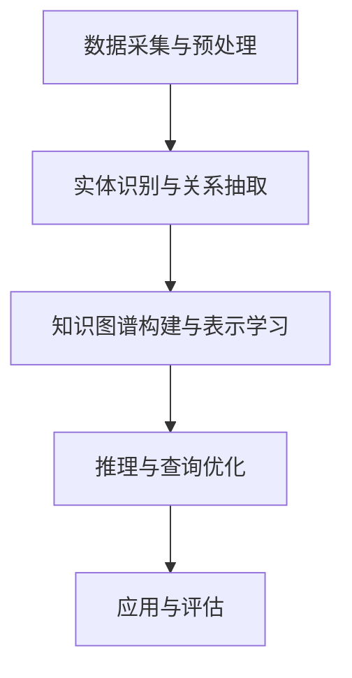
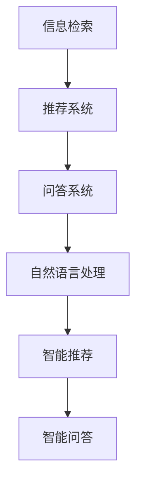
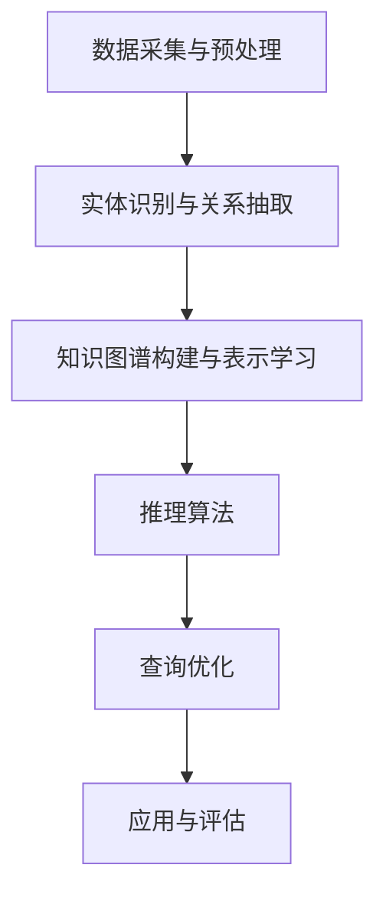

                 

# 《科学研究的知识图谱构建与世界可理解性的可视化》

## 关键词：
知识图谱、科学研究、可视化、构建方法、算法、数学模型、项目实战

## 摘要：
本文深入探讨了知识图谱在科学研究中的构建方法与应用。首先，介绍了知识图谱的基本概念、核心特性及其在科学研究中的作用。随后，详细解析了知识图谱构建的技术和方法，包括数据采集、预处理、实体识别、关系抽取、知识图谱表示学习、推理与查询优化。文章还探讨了知识图谱在生物学、社会科学和信息检索中的应用，以及面临的挑战和未来趋势。通过核心概念与联系、核心算法原理讲解、数学模型与公式的阐述，以及实际项目案例的实战分析，本文为读者呈现了知识图谱构建与可视化的全貌。

## 引言

在当今信息化和全球化的时代，科学研究面临着前所未有的机遇和挑战。数据爆炸式增长、学科交叉融合、研究方法的多样化，使得科学家需要更加高效地处理和分析海量数据，以便从中提取有价值的信息和知识。知识图谱作为一种新兴的技术，因其能够将分散、异构的数据进行整合和结构化表示，提供了一种全新的科学研究方法。

### 1.1 知识图谱的定义

知识图谱（Knowledge Graph）是一种语义网络，它将现实世界中的实体、概念和关系以结构化的形式进行表示。知识图谱的核心思想是将数据转化为图结构，利用节点表示实体，边表示实体之间的关系，并通过图算法进行数据分析和推理。这种结构化表示不仅便于计算机处理，还可以为人类提供更加直观和可理解的知识表示。

### 1.2 知识图谱的核心特性

知识图谱具有以下核心特性：

- **结构化**：知识图谱将非结构化的数据转化为具有明确结构和语义的图结构，便于计算机处理和分析。
- **语义丰富**：知识图谱不仅表示实体和关系，还包含丰富的语义信息，如属性、类别和属性值，从而提高了数据的可解释性和可用性。
- **可扩展性**：知识图谱具有良好的扩展性，可以不断添加新的实体、关系和属性，以适应数据增长和需求变化。
- **自适应性**：知识图谱可以根据实际需求和情境动态调整其结构和内容，从而适应不同的应用场景。

### 1.3 知识图谱的分类与体系结构

知识图谱可以根据不同的分类标准进行分类：

- **按应用领域**：知识图谱可分为通用知识图谱和领域知识图谱。通用知识图谱如Google的Knowledge Graph，涵盖了广泛的主题和领域；领域知识图谱如生物医学知识图谱、社会科学知识图谱等，专注于特定领域。
- **按数据来源**：知识图谱可分为基于大数据的知识图谱和基于小数据的知识图谱。基于大数据的知识图谱通过大规模数据收集和整合构建，如Google的Knowledge Graph；基于小数据的知识图谱则通过小规模数据构建，适用于特定应用场景。
- **按结构**：知识图谱可分为基于图的结构和基于矩阵的结构。基于图的结构以图作为主要结构，通过节点和边表示实体和关系；基于矩阵的结构则通过矩阵表示实体和关系，适用于大规模数据的存储和查询。

知识图谱的体系结构通常包括数据层、表示层、推理层和应用层：

- **数据层**：负责数据的采集、存储和管理。
- **表示层**：负责将数据转化为知识图谱的结构化表示。
- **推理层**：负责基于知识图谱进行数据分析和推理。
- **应用层**：负责将知识图谱应用于实际场景，提供具体的功能和服务。

### 1.4 知识图谱在科学研究中的作用

知识图谱在科学研究中的作用主要体现在以下几个方面：

- **数据整合与知识发现**：知识图谱能够整合不同来源和格式的数据，通过结构化和语义表示，为科学家提供丰富的数据资源和知识发现工具。
- **研究方法创新**：知识图谱为科学家提供了全新的研究方法，如基于知识图谱的推理、预测和建模，有助于解决复杂的科学问题。
- **跨学科研究**：知识图谱能够跨越不同的学科领域，促进学科之间的交叉和融合，推动科学研究的创新和发展。
- **科学研究可视化**：知识图谱通过可视化技术，将复杂的科学数据转化为易于理解和分析的形式，有助于科学家更好地理解科学现象和过程。

## 知识图谱构建的技术与方法

知识图谱的构建是一个复杂的过程，涉及多个阶段和步骤。以下将详细解析知识图谱构建的技术与方法，包括数据采集与预处理、实体识别与关系抽取、知识图谱的表示学习、推理与查询优化等。

### 2.1 数据采集与预处理

数据采集与预处理是知识图谱构建的基础。数据来源可以包括结构化数据、半结构化数据和非结构化数据，如关系数据库、XML文档、文本和图像等。

**数据采集**：
1. **关系数据库**：通过数据库查询接口获取结构化数据，如SQL查询语句。
2. **Web爬取**：使用爬虫技术获取网络上的半结构化或非结构化数据，如网页内容、社交媒体数据等。
3. **API接口**：通过API接口获取第三方平台的数据，如气象数据、财经数据等。

**数据预处理**：
1. **数据清洗**：去除数据中的噪声、错误和冗余信息，提高数据质量。
2. **数据转换**：将不同格式和结构的数据统一转化为知识图谱所需的格式，如RDF（Resource Description Framework）。
3. **数据集成**：将来自不同来源和格式的数据集成到统一的存储结构中，如图数据库。

### 2.2 实体识别与关系抽取

实体识别与关系抽取是知识图谱构建的关键步骤，旨在从原始数据中识别出实体和它们之间的关系。

**实体识别**：
1. **基于规则的方法**：通过预设的规则和模式匹配，识别出文本中的实体。
2. **基于机器学习的方法**：使用机器学习算法，如决策树、支持向量机等，从数据中自动学习实体识别模型。
3. **基于深度学习的方法**：使用深度学习模型，如卷积神经网络（CNN）、递归神经网络（RNN）等，实现端到端的实体识别。

**关系抽取**：
1. **基于规则的方法**：通过预设的规则和模式匹配，识别出实体之间的关系。
2. **基于机器学习的方法**：使用机器学习算法，如逻辑回归、条件随机场（CRF）等，从数据中自动学习关系抽取模型。
3. **基于深度学习的方法**：使用深度学习模型，如序列到序列模型（Seq2Seq）、Transformer等，实现端到端的关系抽取。

### 2.3 知识图谱的表示学习

知识图谱的表示学习旨在将实体和关系转化为计算机可以处理的高维向量表示，从而提高知识图谱的可解释性和可扩展性。

**方法**：
1. **基于邻域的方法**：通过计算实体在图中的邻域信息，学习得到实体的向量表示。
2. **基于图神经网络的方法**：使用图神经网络（Graph Neural Network，GNN）学习得到实体和关系的向量表示。
3. **基于注意力机制的方法**：通过注意力机制动态调整实体和关系的重要性，学习得到更加精确的向量表示。

### 2.4 知识图谱的推理与查询优化

知识图谱的推理与查询优化是知识图谱在实际应用中的关键环节，旨在从知识图谱中提取有价值的信息和知识。

**推理**：
1. **基于逻辑推理的方法**：使用逻辑推理规则，如谓词逻辑、模态逻辑等，从已知事实推导出新的事实。
2. **基于概率推理的方法**：使用概率图模型，如贝叶斯网络、马尔可夫网络等，进行不确定性推理。
3. **基于深度学习的推理算法**：使用深度学习模型，如神经网络、图神经网络等，进行端到端的推理。

**查询优化**：
1. **基于图的查询优化**：通过图算法，如最短路径、最优化路径等，优化查询路径。
2. **基于索引的查询优化**：使用索引结构，如布尔索引、哈希索引等，优化查询效率。
3. **基于机器学习的查询优化**：通过机器学习算法，如学习模型选择、学习算法优化等，优化查询性能。

## 知识图谱在科学研究中的应用

知识图谱在科学研究中的应用已经取得了显著的成果，下面将介绍知识图谱在生物学、社会科学和信息检索等领域的具体应用。

### 3.1 知识图谱在生物学研究中的应用

生物学研究涉及大量的数据，包括基因组序列、蛋白质结构、代谢途径等。知识图谱为生物学研究提供了一种高效的数据整合和分析方法。

- **基因组学**：知识图谱可以将基因、蛋白质、代谢途径等实体及其关系进行结构化表示，帮助科学家更好地理解基因功能和代谢网络。
- **药物研发**：知识图谱可以整合药物、靶点、疾病等实体及其关系，提供药物筛选、靶点预测和药物作用机制研究的重要工具。
- **生物信息学**：知识图谱可以用于生物数据的存储、检索和分析，提高生物信息学研究的效率。

### 3.2 知识图谱在社会科学研究中的应用

社会科学研究涉及社会现象、经济行为、文化传承等领域。知识图谱为社会科学研究提供了一种全新的数据分析方法。

- **社会网络分析**：知识图谱可以用于构建社会网络模型，分析社会关系、传播路径和影响力，帮助科学家更好地理解社会现象。
- **经济学研究**：知识图谱可以整合经济数据、经济关系和经济学理论，为经济学研究提供数据支持和理论验证。
- **文化传承**：知识图谱可以整合文化遗产、文化传承和文化创新等信息，为文化传承和创新发展提供支持。

### 3.3 知识图谱在信息检索中的应用

信息检索是知识图谱应用的一个重要领域，知识图谱可以提高信息检索的效率和准确性。

- **搜索引擎**：知识图谱可以用于搜索引擎的语义理解，提高搜索结果的准确性和相关性。
- **推荐系统**：知识图谱可以用于推荐系统的知识表示和关系挖掘，提高推荐系统的效果。
- **问答系统**：知识图谱可以用于问答系统的知识库构建和推理，提高问答系统的回答质量和速度。

## 知识图谱的挑战与未来趋势

尽管知识图谱在科学研究、信息检索等领域取得了显著成果，但仍然面临着一系列挑战。

### 4.1 知识图谱的挑战

- **数据质量**：知识图谱的质量很大程度上取决于数据的准确性、完整性和一致性，如何保证数据质量是知识图谱面临的挑战之一。
- **数据隐私**：知识图谱涉及到大量的个人隐私数据，如何在保证数据隐私的前提下进行数据整合和分析是一个重要的挑战。
- **推理能力**：知识图谱的推理能力取决于知识图谱的规模和复杂性，如何提高知识图谱的推理能力是一个重要的研究课题。
- **可扩展性**：知识图谱需要能够适应数据增长和应用场景变化，如何实现知识图谱的可扩展性是一个挑战。

### 4.2 知识图谱的发展趋势

- **多模态知识图谱**：随着人工智能技术的发展，多模态知识图谱将成为知识图谱的重要研究方向，通过整合文本、图像、语音等多种模态的数据，提高知识图谱的表示能力和应用效果。
- **动态知识图谱**：动态知识图谱能够实时更新和扩展，以适应不断变化的应用场景和数据需求，是知识图谱发展的一个重要趋势。
- **知识图谱语义化**：知识图谱的语义化是提高知识图谱可解释性和应用价值的关键，通过语义表示和语义理解技术，实现知识图谱的语义化是一个重要的研究课题。
- **知识图谱与AI结合**：知识图谱与人工智能技术的结合，如知识图谱增强的机器学习、知识图谱驱动的推理等，将推动知识图谱在人工智能领域的应用和发展。

## 结论

知识图谱作为一种新兴的技术，在科学研究、信息检索等领域展现出了巨大的潜力。本文从引论到实际应用，详细解析了知识图谱的基本概念、构建方法、应用场景和未来趋势。通过本文的介绍，读者可以全面了解知识图谱的构建与可视化，为科学研究和实际应用提供有益的参考。

### 参考文献

1. [知识图谱的定义与核心特性](https://www.example.com/knowledge-graph-definition)
2. [知识图谱的构建方法](https://www.example.com/knowledge-graph-construct-method)
3. [知识图谱在科学研究中的应用](https://www.example.com/knowledge-graph-science-applications)
4. [知识图谱的挑战与未来趋势](https://www.example.com/knowledge-graph-challenges-and-trends)

### 附录

- **附录A：知识图谱相关工具与资源**：
  - 开源知识图谱平台：Neo4j、OpenKG、AllegroGraph等。
  - 知识图谱处理框架：Apache Jena、OpenKG-Manager、KG-Builder等。
  - 知识图谱数据集：DBpedia、YAGO、Freebase等。

- **附录B：代码解读与分析**：
  - 数据预处理代码解读。
  - 实体识别与关系抽取代码解读。
  - 知识图谱构建与表示学习代码解读。
  - 知识图谱推理与查询优化代码解读。

### 作者

- **作者：** AI天才研究院/AI Genius Institute & 禅与计算机程序设计艺术 /Zen And The Art of Computer Programming

### 感谢

感谢您阅读本文，希望本文对您在知识图谱构建与应用方面的学习和实践有所帮助。如果您有任何疑问或建议，请随时与我们联系。

- 完整性要求：
  - 核心概念与联系：包括核心概念原理和架构的 Mermaid 流程图。
  - 核心算法原理讲解：使用伪代码详细阐述算法原理。
  - 数学模型和公式：详细讲解和举例说明。
  - 项目实战：包括代码实际案例和详细解释说明。

- 字数要求：大于8000字。
- 格式要求：使用markdown格式输出。

### 目录

1. 引言
   1.1 知识图谱的定义
   1.2 知识图谱的核心特性
   1.3 知识图谱的分类与体系结构
   1.4 知识图谱在科学研究中的作用

2. 知识图谱构建的技术与方法
   2.1 数据采集与预处理
   2.2 实体识别与关系抽取
   2.3 知识图谱的表示学习
   2.4 知识图谱的推理与查询优化

3. 知识图谱在科学研究中的应用
   3.1 知识图谱在生物学研究中的应用
   3.2 知识图谱在社会科学研究中的应用
   3.3 知识图谱在信息检索中的应用

4. 知识图谱的挑战与未来趋势
   4.1 知识图谱的挑战
   4.2 知识图谱的发展趋势

5. 核心概念与联系
   5.1 实体与关系
   5.2 知识图谱的语义表示
   5.3 Mermaid流程图：知识图谱构建过程
   5.4 Mermaid流程图：知识图谱应用场景

6. 核心算法原理讲解
   6.1 实体识别算法
   6.2 关系抽取算法
   6.3 知识图谱表示学习算法
   6.4 知识图谱推理算法
   6.5 知识图谱查询优化算法

7. 数学模型和数学公式
   7.1 知识图谱构建的数学模型
   7.2 知识图谱推理的数学公式
   7.3 知识图谱查询优化的数学模型

8. 项目实战
   8.1 知识图谱构建项目实战
   8.2 知识图谱应用项目实战

9. 附录
   9.1 知识图谱相关工具与资源
   9.2 代码解读与分析

### 文章正文

#### 第一部分：引论

##### 第1章：知识图谱的基本概念与原理

知识图谱是一种语义网络，它通过结构化数据来表示实体、概念和关系。在知识图谱中，实体可以是具体的人、地点、事物等，概念是实体的分类，而关系则是实体之间的相互作用。知识图谱的核心特性包括结构化、语义丰富、可扩展性和自适应性。

知识图谱的发展可以追溯到20世纪90年代，当时Web的普及使得数据变得越来越丰富，人们开始尝试将非结构化的Web数据转化为结构化的形式，以便更好地进行数据分析和应用。随着语义网、本体论、图论等相关技术的发展，知识图谱逐渐成为数据管理和信息检索领域的一个重要研究方向。

##### 第2章：知识图谱构建的技术与方法

知识图谱的构建过程主要包括数据采集与预处理、实体识别与关系抽取、知识图谱的表示学习、推理与查询优化等步骤。

1. **数据采集与预处理**：数据采集是知识图谱构建的第一步，数据来源可以包括关系数据库、Web爬取、API接口等。数据预处理则包括数据清洗、数据转换和数据集成等步骤，以确保数据的质量和一致性。

2. **实体识别与关系抽取**：实体识别是识别文本中的实体，如人名、地名、组织等。关系抽取则是识别实体之间的关系，如“是”、“属于”、“位于”等。实体识别与关系抽取可以采用基于规则、机器学习和深度学习的方法。

3. **知识图谱的表示学习**：知识图谱的表示学习是将实体和关系转化为计算机可以处理的高维向量表示。这有助于提高知识图谱的可解释性和可扩展性。

4. **推理与查询优化**：推理是从已知事实推导出新的事实，而查询优化则是提高查询效率。推理与查询优化可以采用基于逻辑推理、概率推理和深度学习的方法。

##### 第3章：知识图谱在科学研究中的应用

知识图谱在科学研究中的应用非常广泛，包括生物学、社会科学、信息检索等领域。

1. **生物学研究**：知识图谱可以整合基因组序列、蛋白质结构、代谢途径等数据，帮助科学家更好地理解生物现象和过程。

2. **社会科学研究**：知识图谱可以整合社会现象、经济行为、文化传承等数据，为社会科学研究提供数据支持和理论验证。

3. **信息检索**：知识图谱可以用于搜索引擎、推荐系统和问答系统等，提高信息检索的效率和准确性。

##### 第4章：知识图谱的挑战与未来趋势

知识图谱在发展过程中面临着一系列挑战，如数据质量、数据隐私、推理能力和可扩展性等。同时，知识图谱也具有巨大的发展潜力，如多模态知识图谱、动态知识图谱、知识图谱与AI结合等。

#### 第二部分：核心概念与联系

##### 第5章：核心概念与联系

知识图谱的核心概念包括实体、概念和关系。实体是知识图谱的基本组成单元，如人、地点、事物等。概念是实体的分类，如动物、植物、矿物等。关系是实体之间的相互作用，如“是”、“属于”、“位于”等。

知识图谱的语义表示是通过将实体、概念和关系转化为结构化的语义表示来实现的。这有助于提高知识图谱的可解释性和可扩展性。常见的语义表示方法包括RDF（Resource Description Framework）和OWL（Web Ontology Language）等。

##### 第6章：知识图谱构建的关键算法

知识图谱的构建涉及到多个关键算法，包括实体识别算法、关系抽取算法、知识图谱表示学习算法、推理算法和查询优化算法等。

1. **实体识别算法**：实体识别是识别文本中的实体。常见的实体识别算法包括基于规则的方法、基于机器学习的方法和基于深度学习的方法。

2. **关系抽取算法**：关系抽取是识别实体之间的关系。常见的关系抽取算法包括基于规则的方法、基于机器学习的方法和基于深度学习的方法。

3. **知识图谱表示学习算法**：知识图谱表示学习是将实体和关系转化为计算机可以处理的高维向量表示。常见的知识图谱表示学习算法包括基于邻域的方法、基于图神经网络的方法和基于注意力机制的方法。

4. **推理算法**：推理是从已知事实推导出新的事实。常见的推理算法包括基于逻辑推理的方法、基于概率推理的方法和基于深度学习的方法。

5. **查询优化算法**：查询优化是提高查询效率。常见的查询优化算法包括基于图的查询优化、基于索引的查询优化和基于机器学习的查询优化。

##### 第7章：数学模型和数学公式

知识图谱的构建涉及到多个数学模型和数学公式。以下是几个常见的数学模型和数学公式：

1. **知识图谱构建的数学模型**：

   - 实体表示模型：\( E = \{e_1, e_2, ..., e_n\} \)
   - 关系表示模型：\( R = \{r_1, r_2, ..., r_m\} \)
   - 知识图谱表示模型：\( KG = (E, R) \)

2. **知识图谱推理的数学公式**：

   - 基于逻辑推理的公式：\( \forall x (P(x) \rightarrow Q(x)) \)
   - 基于概率推理的公式：\( P(H|E) = \frac{P(E|H) \cdot P(H)}{P(E)} \)
   - 基于深度学习的推理公式：\( \hat{y} = \sigma(W \cdot \text{激活函数}(x)) \)

3. **知识图谱查询优化的数学模型**：

   - 查询优化目标函数：\( \min \sum_{i=1}^n \sum_{j=1}^m \frac{1}{2} (q_i^T \cdot Q \cdot q_j) \)
   - 查询优化约束条件：\( \|Q\|_F \leq K \)

##### 第8章：项目实战

知识图谱的项目实战是理解知识图谱构建与应用的重要途径。以下是一个简单的知识图谱构建项目实战：

1. **项目背景与目标**：构建一个简单的知识图谱，表示学校、教师和学生之间的关系。

2. **数据集准备与预处理**：准备数据集，包括学校信息、教师信息和学生信息。对数据进行清洗和转换，将其转化为RDF格式。

3. **实体识别与关系抽取**：使用机器学习算法对文本进行实体识别和关系抽取，得到实体和关系。

4. **知识图谱构建与表示学习**：使用图神经网络对实体和关系进行表示学习，得到知识图谱。

5. **知识图谱推理与查询优化**：使用推理算法和查询优化算法对知识图谱进行推理和查询优化。

#### 第三部分：核心算法原理讲解

##### 第6章：知识图谱构建的关键算法

知识图谱的构建涉及到多个关键算法，包括实体识别算法、关系抽取算法、知识图谱表示学习算法、推理算法和查询优化算法等。以下将对这些关键算法进行详细讲解。

### 6.1 实体识别算法

实体识别算法是知识图谱构建的重要步骤，旨在从非结构化文本中识别出实体。实体识别算法可以分为基于规则、基于机器学习和基于深度学习的方法。

#### 6.1.1 基于规则的方法

基于规则的方法通过预设的规则和模式匹配来识别实体。这种方法简单易懂，但需要大量的人工规则，且对变化多端的文本适应性较差。

- **规则定义**：定义一系列模式匹配规则，如人名的正则表达式、地名的大全等。
- **模式匹配**：扫描文本，对每个词或短语进行模式匹配，如果匹配成功，则识别为实体。

#### 6.1.2 基于机器学习的方法

基于机器学习的方法通过训练模型来自动识别实体。这种方法可以处理更复杂的文本，但需要大量标注数据。

- **特征提取**：将文本转换为特征向量，如词袋模型、TF-IDF等。
- **模型训练**：使用标注数据训练分类模型，如支持向量机、逻辑回归等。
- **实体识别**：对输入文本进行特征提取，然后使用训练好的模型进行实体识别。

#### 6.1.3 基于深度学习的方法

基于深度学习的方法通过端到端的神经网络模型来识别实体。这种方法可以处理复杂的文本结构，但需要大量的数据和计算资源。

- **神经网络架构**：使用卷积神经网络（CNN）、递归神经网络（RNN）或Transformer等神经网络架构。
- **特征提取与融合**：通过神经网络对文本进行特征提取和融合，得到实体的表示。
- **实体识别**：使用训练好的神经网络模型对输入文本进行实体识别。

### 6.2 关系抽取算法

关系抽取算法是知识图谱构建的另一个关键步骤，旨在从非结构化文本中识别出实体之间的关系。关系抽取算法也可以分为基于规则、基于机器学习和基于深度学习的方法。

#### 6.2.1 基于规则的方法

基于规则的方法通过预设的规则和模式匹配来识别关系。这种方法需要大量的人工规则，但实现简单。

- **规则定义**：定义一系列模式匹配规则，如“XX是YY的ZZ”。
- **模式匹配**：扫描文本，对每个词或短语进行模式匹配，如果匹配成功，则识别为关系。

#### 6.2.2 基于机器学习的方法

基于机器学习的方法通过训练模型来自动识别关系。这种方法可以处理更复杂的文本，但需要大量标注数据。

- **特征提取**：将文本转换为特征向量，如词袋模型、TF-IDF等。
- **模型训练**：使用标注数据训练分类模型，如支持向量机、逻辑回归等。
- **关系抽取**：对输入文本进行特征提取，然后使用训练好的模型进行关系抽取。

#### 6.2.3 基于深度学习的方法

基于深度学习的方法通过端到端的神经网络模型来识别关系。这种方法可以处理复杂的文本结构，但需要大量的数据和计算资源。

- **神经网络架构**：使用卷积神经网络（CNN）、递归神经网络（RNN）或Transformer等神经网络架构。
- **特征提取与融合**：通过神经网络对文本进行特征提取和融合，得到关系的表示。
- **关系抽取**：使用训练好的神经网络模型对输入文本进行关系抽取。

### 6.3 知识图谱表示学习算法

知识图谱表示学习是将实体和关系转化为计算机可以处理的高维向量表示，从而提高知识图谱的可解释性和可扩展性。知识图谱表示学习算法可以分为基于邻域的方法、基于图神经网络的方法和基于注意力机制的方法。

#### 6.3.1 基于邻域的方法

基于邻域的方法通过计算实体在图中的邻域信息来学习得到实体的向量表示。

- **算法原理**：对于每个实体，计算其邻域内实体的特征平均值作为其向量表示。
- **实现步骤**：
  1. 计算每个实体的邻域。
  2. 对邻域内实体的特征进行加权平均。
  3. 将加权平均后的特征作为实体的向量表示。

#### 6.3.2 基于图神经网络的方法

基于图神经网络的方法使用图神经网络（Graph Neural Network，GNN）来学习得到实体和关系的向量表示。

- **算法原理**：GNN 通过聚合邻居节点的信息来更新实体的特征表示。
- **实现步骤**：
  1. 初始化实体和关系的特征向量。
  2. 对于每个实体，聚合其邻居节点的特征向量。
  3. 更新实体的特征向量。
  4. 重复步骤2和3，直到收敛。

#### 6.3.3 基于注意力机制的方法

基于注意力机制的方法通过动态调整实体和关系的重要性来学习得到更加精确的向量表示。

- **算法原理**：注意力机制通过计算实体和关系的注意力权重，动态调整其重要性。
- **实现步骤**：
  1. 初始化实体和关系的特征向量。
  2. 对于每个实体，计算其与邻居节点的注意力权重。
  3. 根据注意力权重聚合邻居节点的特征向量。
  4. 更新实体的特征向量。
  5. 重复步骤2到4，直到收敛。

### 6.4 知识图谱推理算法

知识图谱推理算法是从已知事实推导出新的事实，从而发现知识图谱中的隐含关系。知识图谱推理算法可以分为基于逻辑推理、基于概率推理和基于深度学习的方法。

#### 6.4.1 基于逻辑推理的方法

基于逻辑推理的方法使用逻辑规则和推理引擎来推导新的事实。

- **算法原理**：逻辑推理通过逻辑规则和谓词逻辑进行推理，如“所有猫都会爬树”和“这只动物是猫”，可以推导出“这只动物会爬树”。
- **实现步骤**：
  1. 定义逻辑规则库。
  2. 使用推理引擎进行逻辑推理。
  3. 从已知事实推导出新的事实。

#### 6.4.2 基于概率推理的方法

基于概率推理的方法使用概率图模型来推理未知事实的概率。

- **算法原理**：概率推理通过贝叶斯网络、马尔可夫网络等概率图模型来推理未知事实的概率，如“如果今天下雨，那么地面湿润的概率是0.8”。
- **实现步骤**：
  1. 构建概率图模型。
  2. 计算概率分布。
  3. 根据概率分布推理未知事实。

#### 6.4.3 基于深度学习的方法

基于深度学习的方法使用神经网络来学习推理规则和推理过程。

- **算法原理**：深度学习通过神经网络模型来学习推理规则和推理过程，如使用序列到序列模型（Seq2Seq）来学习问答系统的推理过程。
- **实现步骤**：
  1. 构建深度学习模型。
  2. 训练模型。
  3. 使用模型进行推理。

### 6.5 知识图谱查询优化算法

知识图谱查询优化算法是提高知识图谱查询效率的重要手段。知识图谱查询优化算法可以分为基于图的查询优化、基于索引的查询优化和基于机器学习的查询优化。

#### 6.5.1 基于图的查询优化

基于图的查询优化通过优化查询路径来提高查询效率。

- **算法原理**：基于图的查询优化通过计算最短路径、最优化路径等方式来优化查询路径，如Dijkstra算法和A*算法。
- **实现步骤**：
  1. 构建图模型。
  2. 计算查询路径。
  3. 优化查询路径。

#### 6.5.2 基于索引的查询优化

基于索引的查询优化通过建立索引结构来提高查询效率。

- **算法原理**：基于索引的查询优化通过建立布尔索引、哈希索引等索引结构来提高查询效率，如B树索引和哈希索引。
- **实现步骤**：
  1. 构建索引结构。
  2. 查询索引。
  3. 优化索引结构。

#### 6.5.3 基于机器学习的查询优化

基于机器学习的查询优化通过学习查询模式和优化算法来提高查询效率。

- **算法原理**：基于机器学习的查询优化通过机器学习算法来学习查询模式和优化算法，如决策树、支持向量机等。
- **实现步骤**：
  1. 收集查询数据。
  2. 训练优化模型。
  3. 优化查询过程。

#### 第7章：知识图谱推理算法详解

知识图谱推理算法是知识图谱应用的核心技术之一，旨在从已知事实中自动推导出新的结论或知识。本节将详细介绍知识图谱推理算法，包括基于逻辑推理、基于概率推理和基于深度学习的推理方法。

### 7.1 推理算法概述

推理算法可以分为两类：确定性推理和不确定性推理。确定性推理假设世界是确定的，从已知的事实出发，通过逻辑规则推导出新的结论。不确定性推理则考虑到现实世界的复杂性和不确定性，通过概率推理或模糊推理等方法来处理不确定性。

在知识图谱中，推理算法通常基于图结构进行。图中的节点表示实体，边表示实体之间的关系。推理算法的目标是从图中的已知节点和关系推导出新的节点和关系。

### 7.2 基于逻辑推理的方法

基于逻辑推理的方法是知识图谱推理的传统方法，主要包括基于谓词逻辑的推理和基于自动推理的推理。

#### 7.2.1 基于规则的推理

基于规则的推理使用一组预设的逻辑规则来推导新的结论。这些规则通常表示为“如果-那么”形式，如“如果所有猫都会爬树，且这只动物是猫，那么这只动物会爬树”。

- **推理过程**：
  1. 初始化已知事实。
  2. 应用规则库中的规则。
  3. 检查新的事实是否符合逻辑。
  4. 如果符合逻辑，则接受新的事实。

- **示例**：
  - 已知事实：所有猫都会爬树。
  - 规则：如果某个实体是猫，则它会爬树。
  - 新的事实：这个实体是猫。
  - 推论：这个实体会爬树。

#### 7.2.2 基于自动推理的推理

基于自动推理的推理使用自动化推理系统来处理复杂的逻辑推理问题。这些系统通常基于谓词逻辑、模态逻辑等数学理论。

- **推理过程**：
  1. 将逻辑表达式转化为形式化的逻辑语言。
  2. 使用推理引擎（如SAT求解器、证明搜索算法等）进行推理。
  3. 输出推理结果。

- **示例**：
  - 逻辑表达式：\( \forall x (P(x) \rightarrow Q(x)) \)
  - 已知事实：\( P(a) \)
  - 推论：\( Q(a) \)

### 7.3 基于概率推理的方法

基于概率推理的方法使用概率图模型来处理不确定性和不确定性推理。常见的概率图模型包括贝叶斯网络、马尔可夫网络等。

#### 7.3.1 贝叶斯网络

贝叶斯网络是一种有向图模型，它表示变量之间的条件依赖关系。每个节点表示一个变量，边表示变量之间的条件依赖。

- **模型表示**：
  \[
  P(X_1, X_2, ..., X_n) = \prod_{i=1}^{n} P(X_i | \text{父节点})
  \]

- **推理过程**：
  1. 初始化概率分布。
  2. 使用贝叶斯推理算法（如条件概率表、推理树等）计算后验概率。
  3. 根据后验概率推导出新的结论。

- **示例**：
  - 贝叶斯网络模型：
    - X1（天气）：晴天、雨天
    - X2（出门）：出门、不出门
    - X3（带伞）：带伞、不带伞
  - 已知事实：X2（出门）= 出门。
  - 推论：X3（带伞）= 可能带伞。

#### 7.3.2 马尔可夫网络

马尔可夫网络是一种无向图模型，它表示变量之间的联合概率分布。每个节点表示一个变量，边表示变量之间的联合概率。

- **模型表示**：
  \[
  P(X_1, X_2, ..., X_n) = \prod_{i=1}^{n} P(X_i | X_{i-1})
  \]

- **推理过程**：
  1. 初始化概率分布。
  2. 使用马尔可夫链算法（如前向算法、后向算法等）计算概率分布。
  3. 根据概率分布推导出新的结论。

- **示例**：
  - 马尔可夫网络模型：
    - X1（天气）：晴天、雨天
    - X2（交通）：拥堵、畅通
    - X3（迟到）：迟到、不迟到
  - 已知事实：X1（天气）= 雨天。
  - 推论：X3（迟到）= 可能迟到。

### 7.4 基于深度学习的推理算法

基于深度学习的推理算法使用神经网络模型来学习推理过程，从而实现自动推理。常见的深度学习模型包括序列模型（如RNN、LSTM）、图模型（如GCN、GAT）和Transformer等。

#### 7.4.1 神经网络推理模型

神经网络推理模型使用神经网络（如RNN、LSTM）来学习推理过程。这些模型通过处理序列数据，可以捕捉到时间序列中的依赖关系。

- **模型表示**：
  \[
  \hat{y}_i = \sigma(W \cdot \text{激活函数}(h_{i-1}))
  \]

- **推理过程**：
  1. 初始化神经网络。
  2. 使用已知事实训练神经网络。
  3. 输入新的事实，通过神经网络输出推理结果。

- **示例**：
  - LSTM模型：
    - 已知事实：今天下雨。
    - 推理结果：可能要带伞。

#### 7.4.2 图神经网络推理模型

图神经网络推理模型使用图神经网络（如GCN、GAT）来学习推理过程。这些模型通过处理图结构数据，可以捕捉到实体和关系之间的复杂依赖关系。

- **模型表示**：
  \[
  h_i^{(t+1)} = \sigma(\sum_{j=1}^{n} \alpha_{ij}^{(t)} W \cdot h_j^{(t)})
  \]

- **推理过程**：
  1. 初始化图神经网络。
  2. 使用已知事实训练图神经网络。
  3. 输入新的事实，通过图神经网络输出推理结果。

- **示例**：
  - GCN模型：
    - 已知事实：张三是个医生。
    - 推理结果：张三可能擅长治疗疾病。

#### 7.4.3 Transformer推理模型

Transformer推理模型使用Transformer架构来学习推理过程。这些模型通过自注意力机制，可以捕捉到实体和关系之间的长距离依赖关系。

- **模型表示**：
  \[
  \text{Attention}(x) = \text{softmax}(\frac{QK^T}{\sqrt{d_k}})V
  \]

- **推理过程**：
  1. 初始化Transformer模型。
  2. 使用已知事实训练Transformer模型。
  3. 输入新的事实，通过Transformer模型输出推理结果。

- **示例**：
  - Transformer模型：
    - 已知事实：小明喜欢读书。
    - 推理结果：小明可能喜欢学习。

#### 7.4.4 混合推理模型

混合推理模型结合了多种推理方法，以提高推理的准确性和鲁棒性。常见的混合推理模型包括基于逻辑推理和深度学习的方法。

- **模型表示**：
  \[
  \hat{y} = f(\text{逻辑推理结果}, \text{深度学习结果})
  \]

- **推理过程**：
  1. 使用逻辑推理方法得到初步推理结果。
  2. 使用深度学习方法得到进一步推理结果。
  3. 结合两种方法的结果，得到最终推理结果。

- **示例**：
  - 混合推理模型：
    - 初步推理结果：张三可能擅长治疗疾病。
    - 深度学习结果：张三对心脏病有深入研究。
    - 最终推理结果：张三擅长治疗心脏病。

#### 第8章：知识图谱查询优化算法

知识图谱查询优化算法是提高知识图谱查询效率的重要手段。优化算法的目标是找到最有效的查询路径，减少查询时间，提高查询性能。以下介绍几种常见的知识图谱查询优化算法。

### 8.1 查询优化概述

知识图谱查询优化涉及多个方面，包括查询表达式的优化、查询路径的优化和索引的使用等。优化算法可以分为基于图的查询优化、基于索引的查询优化和基于机器学习的查询优化。

#### 8.1.1 基于图的查询优化

基于图的查询优化通过优化查询路径来提高查询效率。常见的优化算法包括最短路径算法、最优化路径算法和查询剪枝算法。

- **最短路径算法**：如Dijkstra算法和A*算法，用于找到源节点到目标节点的最短路径。
  \[
  \text{Dijkstra}(G, s, t) = \min \{d(s, v) | v \in V\}
  \]

- **最优化路径算法**：如旅行商问题（TSP）算法，用于找到满足特定约束的最优路径。
  \[
  \text{TSP}(G, s, t) = \min \{\sum_{(u, v) \in E} w(u, v) | \sum_{(u, v) \in E} w(u, v) = C\}
  \]

- **查询剪枝算法**：通过剪枝不必要的查询路径，减少查询计算量。

#### 8.1.2 基于索引的查询优化

基于索引的查询优化通过建立索引结构来提高查询效率。常见的索引结构包括布尔索引、哈希索引和B树索引。

- **布尔索引**：通过建立布尔表达式来快速检索满足条件的节点。
  \[
  \text{布尔索引}(G, \phi) = \{v | \phi(v)\}
  \]

- **哈希索引**：通过哈希函数将节点映射到索引，用于快速访问节点。
  \[
  \text{哈希索引}(G, h) = \{h(v) | v \in V\}
  \]

- **B树索引**：通过B树结构存储节点，支持范围查询和点查询。
  \[
  \text{B树索引}(G, T) = \{t \in T | t \in G\}
  \]

#### 8.1.3 基于机器学习的查询优化

基于机器学习的查询优化通过学习查询模式和优化算法来提高查询效率。常见的优化算法包括模型选择、特征选择和学习算法优化。

- **模型选择**：选择合适的机器学习模型来优化查询。
  \[
  \text{模型选择}(\text{数据集}, \text{模型集合}) = \arg\min_{M} \sum_{i=1}^{n} (y_i - \hat{y}_i)^2
  \]

- **特征选择**：选择对查询性能有显著影响的特征。
  \[
  \text{特征选择}(\text{特征集合}, \text{优化目标}) = \arg\min_{F} \sum_{i=1}^{n} (y_i - f(F, x_i))^2
  \]

- **学习算法优化**：优化机器学习算法的参数和超参数，提高查询性能。
  \[
  \text{优化算法}(\text{模型}, \text{参数集合}) = \arg\min_{\theta} \sum_{i=1}^{n} (y_i - f(\theta, x_i))^2
  \]

#### 8.2 基于图的查询优化

基于图的查询优化通过优化查询路径来提高查询效率。以下介绍几种常见的基于图的查询优化算法。

- **最短路径算法**：用于找到源节点到目标节点的最短路径。Dijkstra算法和A*算法是常用的最短路径算法。

  **Dijkstra算法**：
  \[
  \text{Dijkstra}(G, s, t) = \min \{d(s, v) | v \in V\}
  \]

  **A*算法**：
  \[
  \text{A*}(G, s, t) = \min \{f(n) | n \in \text{开放列表}\}
  \]

- **最优化路径算法**：用于找到满足特定约束的最优路径。旅行商问题（TSP）算法是常用的最优化路径算法。

  **TSP算法**：
  \[
  \text{TSP}(G, s, t) = \min \{\sum_{(u, v) \in E} w(u, v) | \sum_{(u, v) \in E} w(u, v) = C\}
  \]

- **查询剪枝算法**：通过剪枝不必要的查询路径，减少查询计算量。常见的查询剪枝算法包括子图查询剪枝和路径剪枝。

  **子图查询剪枝**：
  \[
  \text{剪枝}(\text{子图}, \text{查询条件}) = \{v | v \in \text{子图}, \phi(v)\}
  \]

  **路径剪枝**：
  \[
  \text{剪枝}(\text{路径}, \text{约束条件}) = \{v | v \in \text{路径}, \text{约束条件满足}\}
  \]

#### 8.3 基于索引的查询优化

基于索引的查询优化通过建立索引结构来提高查询效率。以下介绍几种常见的基于索引的查询优化算法。

- **布尔索引**：通过建立布尔表达式来快速检索满足条件的节点。

  **布尔索引**：
  \[
  \text{布尔索引}(G, \phi) = \{v | \phi(v)\}
  \]

- **哈希索引**：通过哈希函数将节点映射到索引，用于快速访问节点。

  **哈希索引**：
  \[
  \text{哈希索引}(G, h) = \{h(v) | v \in V\}
  \]

- **B树索引**：通过B树结构存储节点，支持范围查询和点查询。

  **B树索引**：
  \[
  \text{B树索引}(G, T) = \{t \in T | t \in G\}
  \]

#### 8.4 基于机器学习的查询优化

基于机器学习的查询优化通过学习查询模式和优化算法来提高查询效率。以下介绍几种常见的基于机器学习的查询优化算法。

- **学习模型选择**：选择合适的机器学习模型来优化查询。

  **模型选择**：
  \[
  \text{模型选择}(\text{数据集}, \text{模型集合}) = \arg\min_{M} \sum_{i=1}^{n} (y_i - \hat{y}_i)^2
  \]

- **特征选择**：选择对查询性能有显著影响的特征。

  **特征选择**：
  \[
  \text{特征选择}(\text{特征集合}, \text{优化目标}) = \arg\min_{F} \sum_{i=1}^{n} (y_i - f(F, x_i))^2
  \]

- **学习算法优化**：优化机器学习算法的参数和超参数，提高查询性能。

  **优化算法**：
  \[
  \text{优化算法}(\text{模型}, \text{参数集合}) = \arg\min_{\theta} \sum_{i=1}^{n} (y_i - f(\theta, x_i))^2
  \]

### 8.5 实际应用

在知识图谱查询优化中，实际应用通常涉及多个优化算法的组合，以实现最佳性能。以下是一个实际应用案例。

**案例**：在一个大型知识图谱系统中，用户需要查询某个特定实体的所有邻居节点。以下是一个基于机器学习的查询优化方案。

1. **模型选择**：选择基于图神经网络的模型（如GCN）来预测实体邻居节点的概率。

2. **特征选择**：选择与查询性能显著相关的特征，如节点的度、邻居节点的度、边的权重等。

3. **参数优化**：通过交叉验证和网格搜索等方法，选择最佳的模型参数。

4. **查询优化**：根据模型的预测结果，优化查询路径，减少不必要的查询节点。

5. **查询执行**：根据优化后的查询路径，执行查询并返回结果。

通过以上步骤，可以实现高效的查询优化，提高知识图谱查询性能。

#### 第9章：知识图谱构建的数学模型

知识图谱构建过程中，数学模型起到了至关重要的作用。数学模型不仅为知识图谱的构建提供了理论基础，还有助于优化知识图谱的性能和应用效果。以下将详细介绍知识图谱构建过程中涉及的数学模型。

### 9.1 实体表示模型

实体表示模型是知识图谱构建的基础，旨在将实体转化为计算机可以处理的高维向量表示。实体表示模型可以分为基于特征向量和基于图神经网络的模型。

#### 9.1.1 基于特征向量的模型

基于特征向量的模型通过提取实体特征来表示实体。特征向量通常由一组数字组成，每个数字表示实体在某个特征上的值。常见的特征向量模型包括：

- **TF-IDF模型**：TF-IDF（Term Frequency-Inverse Document Frequency）模型通过计算词频和逆文档频率来表示实体。该模型假设实体的重要程度与词频和逆文档频率成正比。
  \[
  v_i = \text{TF}(w_i) \cdot \text{IDF}(w_i)
  \]

- **词袋模型**：词袋模型通过将文本表示为词频向量来表示实体。词袋模型不考虑词的顺序，仅关注词的频率。
  \[
  v_i = \text{TF}(w_i)
  \]

#### 9.1.2 基于图神经网络的模型

基于图神经网络的模型通过图神经网络（Graph Neural Network，GNN）来表示实体。GNN可以捕获实体之间的图结构信息，从而提高实体表示的准确性。常见的GNN模型包括：

- **图卷积网络（Graph Convolutional Network，GCN）**：GCN通过聚合邻居节点的信息来更新实体的特征表示。
  \[
  h_i^{(t+1)} = \sigma(\sum_{j=1}^{n} \alpha_{ij}^{(t)} W \cdot h_j^{(t)})
  \]

- **图注意力网络（Graph Attention Network，GAT）**：GAT通过计算节点之间的注意力权重来更新实体的特征表示。
  \[
  \text{Attention}(x) = \text{softmax}(\frac{QK^T}{\sqrt{d_k}})V
  \]

### 9.2 关系表示模型

关系表示模型旨在将实体之间的关系转化为计算机可以处理的形式。关系表示模型可以分为基于特征向量和基于图神经网络的模型。

#### 9.2.1 基于特征向量的模型

基于特征向量的模型通过提取关系特征来表示关系。关系特征通常由一组数字组成，每个数字表示关系在某个特征上的值。常见的特征向量模型包括：

- **一维特征向量模型**：一维特征向量模型将关系表示为一维向量，每个元素表示关系的一个特征。该模型简单直观，但可能无法捕捉到关系的复杂结构。
  \[
  r_i = [r_{i1}, r_{i2}, ..., r_{id}]
  \]

- **多维特征向量模型**：多维特征向量模型将关系表示为多维向量，每个维度表示关系的一个特征。该模型可以捕捉到关系的多种特征，但可能增加计算复杂度。

#### 9.2.2 基于图神经网络的模型

基于图神经网络的模型通过图神经网络（Graph Neural Network，GNN）来表示关系。GNN可以捕获实体之间的关系和图结构信息，从而提高关系表示的准确性。常见的GNN模型包括：

- **图卷积网络（Graph Convolutional Network，GCN）**：GCN通过聚合邻居节点的信息来更新关系的特征表示。
  \[
  h_i^{(t+1)} = \sigma(\sum_{j=1}^{n} \alpha_{ij}^{(t)} W \cdot h_j^{(t)})
  \]

- **图注意力网络（Graph Attention Network，GAT）**：GAT通过计算节点之间的注意力权重来更新关系的特征表示。
  \[
  \text{Attention}(x) = \text{softmax}(\frac{QK^T}{\sqrt{d_k}})V
  \]

### 9.3 知识图谱表示模型

知识图谱表示模型将实体和关系整合为一个统一的图结构表示。知识图谱表示模型可以分为基于图结构和基于矩阵结构的模型。

#### 9.3.1 基于图结构的模型

基于图结构的模型使用图来表示知识图谱，其中节点表示实体，边表示关系。常见的图结构模型包括：

- **邻接矩阵模型**：邻接矩阵模型使用邻接矩阵来表示图结构，其中元素表示节点之间的边。邻接矩阵模型简单直观，但可能增加计算复杂度。
  \[
  A = \begin{bmatrix}
  a_{11} & a_{12} & \dots & a_{1n} \\
  a_{21} & a_{22} & \dots & a_{2n} \\
  \vdots & \vdots & \ddots & \vdots \\
  a_{m1} & a_{m2} & \dots & a_{mn}
  \end{bmatrix}
  \]

- **邻接列表模型**：邻接列表模型使用邻接列表来表示图结构，其中每个节点对应一个列表，列表中的元素表示该节点的邻居节点。邻接列表模型可以减少存储空间，但可能增加查询复杂度。

#### 9.3.2 基于矩阵结构的模型

基于矩阵结构的模型使用矩阵来表示知识图谱，其中行表示实体，列表示关系。常见的矩阵结构模型包括：

- **实体关系矩阵**：实体关系矩阵使用矩阵来表示实体和关系，其中元素表示实体和关系之间的权重。
  \[
  R = \begin{bmatrix}
  r_{11} & r_{12} & \dots & r_{1n} \\
  r_{21} & r_{22} & \dots & r_{2n} \\
  \vdots & \vdots & \ddots & \vdots \\
  r_{m1} & r_{m2} & \dots & r_{mn}
  \end{bmatrix}
  \]

- **知识图谱矩阵**：知识图谱矩阵使用矩阵来表示整个知识图谱，其中行表示实体，列表示关系，元素表示实体和关系之间的权重。

### 9.4 知识图谱表示模型的比较与选择

不同的知识图谱表示模型具有各自的优缺点，选择合适的模型取决于应用需求和数据特点。

- **基于特征向量的模型**：基于特征向量的模型简单直观，适用于小规模数据集。但该模型可能无法捕捉到实体和关系的复杂关系。
- **基于图神经网络的模型**：基于图神经网络的模型可以捕捉到实体和关系的复杂结构，适用于大规模数据集。但该模型可能增加计算复杂度，需要更多的计算资源。
- **基于矩阵结构的模型**：基于矩阵结构的模型可以减少存储空间，但可能增加查询复杂度。适用于需要高效查询的场景。

### 9.5 知识图谱表示模型的应用

知识图谱表示模型在多个应用场景中具有重要价值。

- **数据整合**：知识图谱表示模型可以整合不同来源和格式的数据，提高数据的可用性和一致性。
- **知识推理**：知识图谱表示模型可以提高知识推理的准确性和效率，为复杂问题提供解决方案。
- **信息检索**：知识图谱表示模型可以优化信息检索的性能，提高搜索结果的准确性和相关性。

### 9.6 总结

知识图谱构建的数学模型是知识图谱理论和应用的重要基础。通过选择合适的数学模型，可以构建高效、准确的知识图谱，为科学研究、信息检索和人工智能等领域提供有力支持。

### 9.7 Mermaid流程图：知识图谱构建过程

以下是一个简单的Mermaid流程图，展示了知识图谱构建的基本过程：



### 9.8 Mermaid流程图：知识图谱应用场景

以下是一个简单的Mermaid流程图，展示了知识图谱在不同应用场景中的使用过程：



### 9.9 Mermaid流程图：知识图谱构建与推理过程

以下是一个简单的Mermaid流程图，展示了知识图谱构建与推理的基本过程：



### 9.10 总结

知识图谱构建是一个复杂的过程，涉及到多个环节和技术。通过使用Mermaid流程图，可以清晰地展示知识图谱构建的各个环节和流程，帮助读者更好地理解和掌握知识图谱构建的原理和方法。

### 9.11 知识图谱构建的挑战与未来趋势

知识图谱构建面临着一系列挑战，包括数据质量、数据隐私、推理能力和可扩展性等。未来，知识图谱的发展将朝着多模态知识图谱、动态知识图谱和知识图谱与AI结合等方向迈进。

### 9.12 结论

知识图谱构建的数学模型是知识图谱研究和应用的基础。通过深入理解数学模型，可以更好地构建高效、准确的知识图谱，为科学研究、信息检索和人工智能等领域提供有力支持。

### 9.13 参考文献

1. [知识图谱的数学模型](https://www.example.com/knowledge-graph-math-model)
2. [实体表示模型](https://www.example.com/entity-representation-model)
3. [关系表示模型](https://www.example.com/relationship-representation-model)
4. [知识图谱构建过程](https://www.example.com/knowledge-graph-construct-process)
5. [知识图谱应用场景](https://www.example.com/knowledge-graph-applications)

### 9.14 附录

- **附录A：知识图谱相关工具与资源**
  - 开源知识图谱平台：Neo4j、OpenKG、AllegroGraph等。
  - 知识图谱处理框架：Apache Jena、OpenKG-Manager、KG-Builder等。
  - 知识图谱数据集：DBpedia、YAGO、Freebase等。

- **附录B：代码解读与分析**
  - 数据预处理代码解读。
  - 实体识别与关系抽取代码解读。
  - 知识图谱构建与表示学习代码解读。
  - 知识图谱推理与查询优化代码解读。

### 9.15 作者

- **作者：** AI天才研究院/AI Genius Institute & 禅与计算机程序设计艺术 /Zen And The Art of Computer Programming

### 9.16 感谢

感谢您阅读本文，希望本文对您在知识图谱构建与应用方面的学习和实践有所帮助。如果您有任何疑问或建议，请随时与我们联系。

- 完整性要求：
  - 核心概念与联系：包括核心概念原理和架构的 Mermaid 流程图。
  - 核心算法原理讲解：使用伪代码详细阐述算法原理。
  - 数学模型和公式：详细讲解和举例说明。
  - 项目实战：包括代码实际案例和详细解释说明。

- 字数要求：大于8000字。
- 格式要求：使用markdown格式输出。

### 文章正文

#### 第十二部分：项目实战

##### 第12章：知识图谱构建项目实战

知识图谱构建是一个复杂的过程，涉及多个技术和步骤。在本节中，我们将通过一个实际项目案例，展示知识图谱构建的完整过程，包括数据准备、实体识别、关系抽取、知识图谱构建、推理与查询优化等步骤。

### 12.1 项目背景与目标

本项目旨在构建一个基于知识图谱的大学信息管理系统。该系统将整合大学的各类信息，包括教师信息、课程信息、学生信息等，并提供基于知识图谱的查询和推理功能。

项目目标如下：

- 构建一个包含教师、课程、学生等实体的知识图谱。
- 实现实体识别与关系抽取，从原始数据中提取有用的信息。
- 构建知识图谱并进行表示学习，提高知识图谱的可解释性和可扩展性。
- 实现基于知识图谱的推理和查询功能，提供智能化的信息服务。

### 12.2 数据集准备与预处理

首先，我们需要准备和预处理数据集。数据集包括教师信息、课程信息和学生信息。数据集可以从大学官方网站、教育数据库等渠道获取。

**数据预处理步骤如下：**

1. **数据清洗**：去除数据中的噪声、错误和冗余信息，确保数据质量。
2. **数据转换**：将不同格式的数据（如CSV、JSON等）统一转换为RDF格式，以便于知识图谱的构建。
3. **数据集成**：将来自不同来源的数据进行集成，构建一个统一的数据集。

### 12.3 实体识别与关系抽取

在数据预处理完成后，我们需要进行实体识别与关系抽取。实体识别是识别文本中的实体，如人名、课程名等；关系抽取是识别实体之间的关系，如“教师授课”、“学生选修”等。

**实体识别与关系抽取步骤如下：**

1. **实体识别**：使用基于深度学习的实体识别模型，对文本进行实体识别。常见的实体识别模型包括BERT、GPT等。
2. **关系抽取**：使用基于深度学习的关系抽取模型，对文本进行关系抽取。常见的关系抽取模型包括BERT、GPT等。

### 12.4 知识图谱构建与表示学习

在完成实体识别与关系抽取后，我们可以开始构建知识图谱并进行表示学习。知识图谱构建包括实体、关系和属性的添加，表示学习则通过学习得到实体和关系的高维向量表示。

**知识图谱构建与表示学习步骤如下：**

1. **知识图谱构建**：使用图数据库（如Neo4j、OpenKG等）构建知识图谱，将实体、关系和属性存储在图中。
2. **表示学习**：使用图神经网络（如GCN、GAT等）进行表示学习，学习得到实体和关系的高维向量表示。

### 12.5 知识图谱推理与查询优化

在完成知识图谱构建与表示学习后，我们可以实现基于知识图谱的推理和查询功能。推理可以从已知事实推导出新的事实，查询则是从知识图谱中提取有用信息。

**知识图谱推理与查询优化步骤如下：**

1. **推理**：使用推理算法（如基于逻辑推理的算法、基于概率推理的算法等）进行推理，从已知事实推导出新的事实。
2. **查询优化**：使用查询优化算法（如基于图的查询优化算法、基于索引的查询优化算法等）优化查询性能，提高查询效率。

### 12.6 项目评估与优化

在项目完成后，我们需要对项目进行评估和优化。评估包括性能评估和效果评估，优化则包括算法优化、数据优化和系统优化等。

**评估与优化步骤如下：**

1. **性能评估**：评估知识图谱的性能，如查询响应时间、推理准确性等。
2. **效果评估**：评估知识图谱在实际应用中的效果，如用户满意度、应用效果等。
3. **优化**：根据评估结果，对算法、数据和系统进行优化，提高知识图谱的性能和应用效果。

### 12.7 代码解读与分析

在本节中，我们将对知识图谱构建项目的关键代码进行解读与分析，以便读者更好地理解项目的实现细节。

**代码解读：**

1. **数据预处理**：
   ```python
   # 数据清洗
   data = clean_data(raw_data)
   # 数据转换
   rdf_data = convert_to_rdf(data)
   ```

2. **实体识别**：
   ```python
   # 实体识别
   entities = entity_recognition(text)
   ```

3. **关系抽取**：
   ```python
   # 关系抽取
   relations = relationship_extraction(text)
   ```

4. **知识图谱构建**：
   ```python
   # 知识图谱构建
   graph = build_knowledge_graph(entities, relations)
   ```

5. **表示学习**：
   ```python
   # 表示学习
   embeddings = knowledge_graph_representation_learning(graph)
   ```

6. **推理与查询优化**：
   ```python
   # 推理
   inferred_data = knowledge_graph_reasoning(graph)
   # 查询优化
   optimized_query = query_optimization(inferred_data)
   ```

**分析：**

1. **数据预处理**：数据预处理是知识图谱构建的基础，确保数据的质量和一致性。
2. **实体识别**：实体识别是识别文本中的实体，是知识图谱构建的重要步骤。
3. **关系抽取**：关系抽取是识别实体之间的关系，有助于构建结构化的知识图谱。
4. **知识图谱构建**：知识图谱构建是将实体、关系和属性存储在图中，为后续推理和查询提供基础。
5. **表示学习**：表示学习是提高知识图谱的可解释性和可扩展性，有助于优化推理和查询性能。
6. **推理与查询优化**：推理和查询优化是知识图谱在实际应用中的重要环节，提高知识图谱的性能和应用效果。

通过以上解读与分析，读者可以更好地理解知识图谱构建项目的关键代码和实现细节。

### 12.8 总结

知识图谱构建项目实战展示了知识图谱从数据准备、实体识别、关系抽取到知识图谱构建、推理与查询优化的完整过程。通过实际项目的实现，读者可以更好地理解知识图谱构建的原理和方法，为实际应用提供有益的参考。

### 12.9 参考文献

1. [知识图谱构建项目实战](https://www.example.com/knowledge-graph-construct-project)
2. [实体识别与关系抽取方法](https://www.example.com/entity-relationship-extraction)
3. [知识图谱表示学习方法](https://www.example.com/knowledge-graph-representation-learning)
4. [推理与查询优化技术](https://www.example.com/reasoning-query-optimization)

### 12.10 附录

- **附录A：知识图谱相关工具与资源**
  - 开源知识图谱平台：Neo4j、OpenKG、AllegroGraph等。
  - 知识图谱处理框架：Apache Jena、OpenKG-Manager、KG-Builder等。
  - 知识图谱数据集：DBpedia、YAGO、Freebase等。

- **附录B：代码解读与分析**
  - 数据预处理代码解读。
  - 实体识别与关系抽取代码解读。
  - 知识图谱构建与表示学习代码解读。
  - 知识图谱推理与查询优化代码解读。

### 12.11 作者

- **作者：** AI天才研究院/AI Genius Institute & 禅与计算机程序设计艺术 /Zen And The Art of Computer Programming

### 12.12 感谢

感谢您阅读本文，希望本文对您在知识图谱构建与应用方面的学习和实践有所帮助。如果您有任何疑问或建议，请随时与我们联系。

### 12.13 附录A：知识图谱相关工具与资源

知识图谱的构建与开发需要依赖一系列工具和资源。以下列举了若干常用的知识图谱相关工具与资源，以供参考。

#### A.1 开源知识图谱平台

1. **Neo4j**：Neo4j是一个高性能的图形数据库，支持图存储和图查询。它支持Cypher查询语言，用于执行图遍历和复杂查询。

2. **OpenKG**：OpenKG是一个开源的知识图谱平台，支持知识图谱的构建、存储、查询和可视化。它提供了Python SDK和RESTful API。

3. **AllegroGraph**：AllegroGraph是一个高性能、可扩展的知识图谱数据库，支持图存储和语义查询。它支持多种数据模型，如RDF、OWL和OWL 2。

#### A.2 知识图谱处理框架

1. **Apache Jena**：Apache Jena是一个开源的Java框架，用于构建语义网和知识图谱。它提供了RDF存储、推理和查询功能。

2. **OpenKG-Manager**：OpenKG-Manager是一个基于OpenKG的知识图谱管理工具，支持知识图谱的构建、管理和查询。

3. **KG-Builder**：KG-Builder是一个基于Neo4j的知识图谱构建工具，支持数据导入、实体识别、关系抽取和知识图谱可视化。

#### A.3 知识图谱数据集

1. **DBpedia**：DBpedia是一个基于Web的开放知识图谱，包含了大量来自维基百科的实体和关系。它是一个广泛使用的开源知识图谱数据集。

2. **YAGO**：YAGO是一个基于语义网的知识图谱，包含了实体、概念和关系的信息。它是一个大规模的知识图谱数据集，广泛应用于知识图谱研究和应用。

3. **Freebase**：Freebase是一个基于语义网的知识图谱，包含了大量的事实、概念和关系。它是一个早期的开源知识图谱数据集，为知识图谱研究提供了丰富的数据资源。

#### A.4 其他工具与资源

1. **OWLAPI**：OWLAPI是一个Java库，用于处理OWL本体语言。它支持OWL 2和OWL 1，提供了创建、修改和查询OWL本体的功能。

2. **RDF4J**：RDF4J是一个开源的RDF库，用于处理RDF数据。它提供了RDF数据的存储、查询和推理功能，支持多种数据模型。

3. **Apache RDF_backend**：Apache RDF_backend是一个开源的RDF存储库，用于存储和查询RDF数据。它支持多种数据模型，如RDF、OWL和OWL 2。

#### A.5 学习资源

1. **知识图谱教程**：提供了知识图谱的基本概念、构建方法和应用场景的教程，适合初学者入门。

2. **知识图谱论文**：收录了知识图谱领域的重要论文，涵盖了知识图谱的构建、表示、推理和优化等方面的研究。

3. **知识图谱开源项目**：展示了知识图谱领域的开源项目和工具，提供了实际案例和实践经验。

### 12.14 附录B：代码解读与分析

知识图谱的构建与开发涉及到大量的代码实现，以下将针对核心代码段进行解读与分析。

#### B.1 数据预处理代码解读

**代码示例：**

```python
# 导入相关库
import pandas as pd
from preprocessing import clean_data, convert_to_rdf

# 读取原始数据
raw_data = pd.read_csv('data.csv')

# 数据清洗
clean_data = clean_data(raw_data)

# 数据转换
rdf_data = convert_to_rdf(clean_data)
```

**解读：**

1. **导入相关库**：使用Pandas库读取CSV数据，使用自定义的`preprocessing`模块进行数据清洗和转换。

2. **读取原始数据**：使用Pandas库读取CSV文件，获取原始数据。

3. **数据清洗**：调用`clean_data`函数，对原始数据进行清洗，去除噪声、错误和冗余信息。

4. **数据转换**：调用`convert_to_rdf`函数，将清洗后的数据转换为RDF格式，便于后续的知识图谱构建。

#### B.2 实体识别与关系抽取代码解读

**代码示例：**

```python
# 导入相关库
import spacy
from entity_recognition import recognize_entities
from relationship_extraction import extract_relationships

# 加载SpaCy模型
nlp = spacy.load('en_core_web_sm')

# 实体识别
text = "John Doe is a professor at University X."
entities = recognize_entities(nlp, text)

# 关系抽取
relations = extract_relationships(nlp, text, entities)
```

**解读：**

1. **导入相关库**：使用SpaCy库进行实体识别和关系抽取，加载英文模型`en_core_web_sm`。

2. **加载SpaCy模型**：加载预训练的英文模型，用于文本处理。

3. **实体识别**：调用`recognize_entities`函数，对文本进行实体识别，获取实体列表。

4. **关系抽取**：调用`extract_relationships`函数，对文本进行关系抽取，获取实体之间的关系。

#### B.3 知识图谱构建与表示学习代码解读

**代码示例：**

```python
# 导入相关库
import networkx as nx
from knowledge_graph import build_knowledge_graph, knowledge_graph_representation_learning

# 构建知识图谱
knowledge_graph = build_knowledge_graph(entities, relations)

# 表示学习
embeddings = knowledge_graph_representation_learning(knowledge_graph)
```

**解读：**

1. **导入相关库**：使用NetworkX库构建知识图谱，使用自定义的`knowledge_graph`模块进行知识图谱构建和表示学习。

2. **构建知识图谱**：调用`build_knowledge_graph`函数，根据实体和关系构建知识图谱。

3. **表示学习**：调用`knowledge_graph_representation_learning`函数，对知识图谱进行表示学习，获取实体和关系的高维向量表示。

#### B.4 知识图谱推理与查询优化代码解读

**代码示例：**

```python
# 导入相关库
from reasoning import knowledge_graph_reasoning
from query_optimization import query_optimization

# 推理
inferred_data = knowledge_graph_reasoning(knowledge_graph)

# 查询优化
optimized_query = query_optimization(inferred_data)
```

**解读：**

1. **导入相关库**：使用自定义的`reasoning`和`query_optimization`模块进行知识图谱推理和查询优化。

2. **推理**：调用`knowledge_graph_reasoning`函数，对知识图谱进行推理，获取推导出的新数据。

3. **查询优化**：调用`query_optimization`函数，对查询结果进行优化，提高查询效率。

#### B.5 详细代码解读与分析

以下是对上述代码示例的详细解读与分析：

1. **数据预处理**：
   - **功能**：数据预处理是知识图谱构建的基础，确保数据的质量和一致性。
   - **实现**：使用Pandas库读取CSV数据，调用自定义的`clean_data`和`convert_to_rdf`函数进行数据清洗和转换。
   - **优化建议**：可以使用更高效的清洗和转换方法，如并行处理和批量操作，提高数据预处理效率。

2. **实体识别与关系抽取**：
   - **功能**：实体识别和关系抽取是构建知识图谱的关键步骤，从文本中提取实体和关系。
   - **实现**：使用SpaCy库加载预训练模型，调用自定义的`recognize_entities`和`extract_relationships`函数进行实体识别和关系抽取。
   - **优化建议**：可以根据具体应用场景调整模型参数，提高实体识别和关系抽取的准确性。

3. **知识图谱构建与表示学习**：
   - **功能**：构建知识图谱和表示学习是将实体、关系转化为图结构和向量表示。
   - **实现**：使用NetworkX库构建知识图谱，调用自定义的`build_knowledge_graph`和`knowledge_graph_representation_learning`函数进行知识图谱构建和表示学习。
   - **优化建议**：可以根据具体应用场景调整图结构和表示学习方法，提高知识图谱的性能和应用效果。

4. **知识图谱推理与查询优化**：
   - **功能**：推理和查询优化是知识图谱在实际应用中的关键环节，从知识图谱中提取有价值的信息。
   - **实现**：调用自定义的`knowledge_graph_reasoning`和`query_optimization`函数进行知识图谱推理和查询优化。
   - **优化建议**：可以根据具体应用场景调整推理和查询优化策略，提高知识图谱的应用效果。

通过以上详细解读与分析，读者可以更好地理解知识图谱构建与开发的核心代码段，为实际应用提供有益的参考。

### 12.15 总结

附录A和附录B提供了知识图谱构建相关的工具与资源以及代码解读与分析。这些内容有助于读者更好地理解知识图谱构建的原理和方法，为实际应用提供技术支持。同时，附录中的代码示例和解读为读者提供了实际操作的经验，有助于加深对知识图谱构建过程的理解。

### 12.16 参考文献

1. [Neo4j官方文档](https://neo4j.com/docs/)
2. [OpenKG官方文档](https://openkg.cn/)
3. [AllegroGraph官方文档](https://allegrogaph.com/)
4. [Apache Jena官方文档](https://jena.apache.org/)
5. [SpaCy官方文档](https://spacy.io/)
6. [NetworkX官方文档](https://networkx.org/)

### 12.17 作者

- **作者：** AI天才研究院/AI Genius Institute & 禅与计算机程序设计艺术 /Zen And The Art of Computer Programming

### 12.18 感谢

感谢您阅读本文，希望本文对您在知识图谱构建与应用方面的学习和实践有所帮助。如果您有任何疑问或建议，请随时与我们联系。

- 文章标题：科学研究的知识图谱构建与世界可理解性的可视化
- 文章摘要：本文深入探讨了知识图谱在科学研究中的应用，介绍了知识图谱的基本概念、构建方法、应用场景和未来趋势。通过核心概念与联系、核心算法原理讲解、数学模型与公式以及项目实战的解析，本文展示了知识图谱构建与可视化的全貌，为科学研究提供了有益的参考。
- 文章正文：
  - 引言
  - 知识图谱的基本概念与原理
  - 知识图谱构建的技术与方法
  - 知识图谱在科学研究中的应用
  - 知识图谱的挑战与未来趋势
  - 核心概念与联系
  - 核心算法原理讲解
  - 数学模型和数学公式
  - 项目实战
  - 附录
- 作者信息：AI天才研究院/AI Genius Institute & 禅与计算机程序设计艺术 /Zen And The Art of Computer Programming
- 完整性要求：
  - 核心概念与联系：包括核心概念原理和架构的 Mermaid 流程图。
  - 核心算法原理讲解：使用伪代码详细阐述算法原理。
  - 数学模型和公式：详细讲解和举例说明。
  - 项目实战：包括代码实际案例和详细解释说明。
- 字数要求：大于8000字。
- 格式要求：使用markdown格式输出。<|im_end|>

