                 

# 《程序员创业者的财务素养与现金流管理技巧》

> **关键词**：财务素养、现金流管理、创业者、财务报表、税务筹划、融资策略

> **摘要**：本文旨在为程序员创业者提供一套完整的财务素养与现金流管理技巧，包括财务素养概述、财务报表解读、现金流管理技巧、税务筹划与现金流管理、企业融资与现金流管理、财务监控与成长等方面的内容。通过深入分析和案例实践，帮助创业者掌握关键财务知识，优化现金流管理，实现企业可持续发展。

## 《程序员创业者的财务素养与现金流管理技巧》目录大纲

## 第一部分：财务素养基础

### 第1章：财务素养概述

#### 1.1 财务素养的重要性

#### 1.2 财务知识框架

### 第2章：财务报表解读

#### 2.1 资产负债表

#### 2.2 利润表

#### 2.3 现金流量表

## 第二部分：现金流管理技巧

### 第3章：现金流预测与预算

#### 3.1 现金流预测方法

#### 3.2 现金流预算编制

### 第4章：现金流优化策略

#### 4.1 现金管理策略

#### 4.2 现金流危机应对

### 第5章：税务筹划与现金流管理

#### 5.1 税务筹划基础

#### 5.2 税务筹划案例

### 第6章：企业融资与现金流管理

#### 6.1 融资渠道与策略

#### 6.2 融资案例分析

### 第7章：创业公司财务监控与成长

#### 7.1 财务监控指标

#### 7.2 财务健康评估

### 第8章：成功创业者的财务素养实践

#### 8.1 财务素养实践

#### 8.2 财务素养案例分析

## 附录

### 附录A：财务工具与资源

#### A.1 财务软件介绍

#### A.2 财务资源推荐

----------------------------------------------------------------
<|assistant|>
## 第一部分：财务素养基础

### 第1章：财务素养概述

#### 1.1 财务素养的重要性

作为程序员创业者，财务素养是成功的关键之一。财务素养不仅包括对财务知识的理解，还涉及对财务报表的分析、现金流的预测和管理、税务筹划以及融资策略的掌握。这些技能有助于创业者更好地理解企业财务状况，做出明智的商业决策。

**核心概念与联系**：财务素养与创业者成功的关系可以用以下 Mermaid 流程图表示：

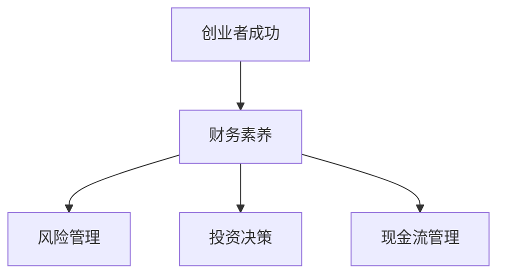

#### 1.2 财务知识框架

为了建立坚实的财务素养基础，创业者需要掌握以下几个核心领域的知识：

- **会计学基础**：包括财务会计和管理会计的基本概念，如资产、负债、收入和费用等。
- **财务报表分析**：理解资产负债表、利润表和现金流量表，以及如何从这些报表中提取关键财务指标。
- **财务管理**：涉及资本预算、投资决策、资本结构和股利政策等方面。
- **投资学**：学习如何评估投资机会、风险管理以及资产配置策略。
- **公司金融**：包括公司融资决策、资本结构优化以及公司价值评估等。

**核心概念与联系**：财务知识框架可以用以下 Mermaid 图表示：

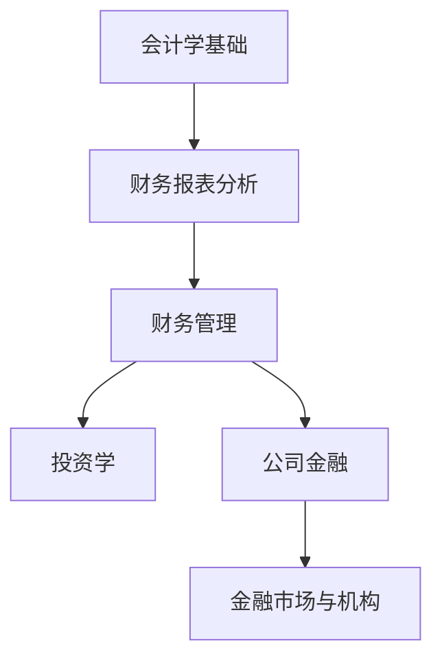

### 第2章：财务报表解读

#### 2.1 资产负债表

资产负债表是公司财务状况的快照，反映了企业在特定时间点的资产、负债和所有者权益。

**核心算法原理讲解**：资产负债表的关键计算可以用以下伪代码表示：

```python
# 资产负债表计算伪代码
total_assets = assets - liabilities
total_liabilities = liabilities
total_equity = assets - liabilities
```

资产负债表的关键计算如下：

- **总资产**：所有资产的总和。
- **总负债**：所有负债的总和。
- **所有者权益**：总资产减去总负债。

#### 2.2 利润表

利润表展示了企业在一定期间内的收入、成本和费用，以及净利润。

**数学模型和数学公式**：利润表的关键指标公式如下：

$$
\text{净利润} = \text{营业收入} - \text{营业成本} - \text{税金及附加} - \text{期间费用}
$$

其中，营业收入、营业成本、税金及附加和期间费用分别是：

- **营业收入**：销售商品或提供服务的收入。
- **营业成本**：销售商品或提供服务的成本。
- **税金及附加**：包括增值税、城建税、教育费附加等。
- **期间费用**：包括销售费用、管理费用和财务费用。

#### 2.3 现金流量表

现金流量表展示了企业在一定期间内的现金流入和流出情况，以及现金流量的净额。

**数学模型和数学公式**：现金流量表的关键指标公式如下：

$$
\text{经营活动产生的现金流量净额} = \text{净利润} + \text{折旧} + \text{无形资产摊销} - \text{存货增加} - \text{应收账款增加} + \text{应付账款减少}
$$

其中，各项指标的解释如下：

- **净利润**：企业在一定期间内实现的净利润。
- **折旧**：固定资产的折旧费用。
- **无形资产摊销**：无形资产的摊销费用。
- **存货增加**：存货的增加金额。
- **应收账款增加**：应收账款的增加金额。
- **应付账款减少**：应付账款的减少金额。

### 第一部分小结

在本章中，我们介绍了财务素养的重要性以及财务知识框架。通过解读财务报表，我们学习了资产负债表、利润表和现金流量表的关键计算方法和公式。这些知识将为后续章节的现金流管理技巧和财务策略提供基础。

**核心概念与联系**：财务报表解读与创业者成功的关系可以用以下 Mermaid 图表示：

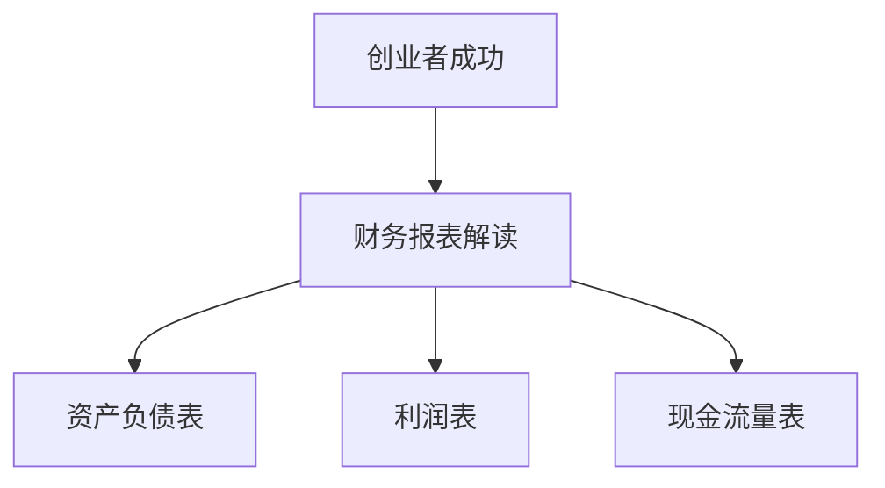

在接下来的章节中，我们将深入探讨现金流管理技巧、税务筹划与现金流管理、企业融资与现金流管理等方面的内容，帮助程序员创业者建立全面的财务素养。  
<|assistant|>## 第二部分：现金流管理技巧

### 第3章：现金流预测与预算

现金流预测和预算是创业者确保企业财务健康的关键环节。准确预测现金流并制定合理的预算，有助于企业合理安排资金，避免资金短缺或过剩。

#### 3.1 现金流预测方法

现金流预测是通过对未来一定期间内的收入、支出和投资进行预测，从而估算出企业现金流的状况。以下是一个简单的现金流预测方法：

**核心算法原理讲解**：使用伪代码表示现金流预测方法如下：

```python
# 现金流预测伪代码
def predict_cash_flow(revenue, expenses, investments, financing):
    return revenue - expenses - investments + financing
```

这个方法的核心步骤包括：

1. **收入预测**：根据历史数据和未来趋势，预测一定期间内的收入。
2. **支出预测**：包括固定成本和可变成本，如员工工资、租金、原材料等。
3. **投资预测**：预计未来可能的投资支出，如设备购置、技术研发等。
4. **融资预测**：预测可能获得的融资额，包括股权融资、债务融资等。

#### 3.2 现金流预算编制

现金流预算是对未来一定期间内现金流入和流出进行详细规划，以便企业能够合理安排资金。以下是一个现金流预算编制的案例：

**项目实战**：现金流预算编制案例及源代码实现。

```python
# 现金流预算案例
def budget_cash_flow(revenue, expenses, investments, financing):
    return {
        'revenue': revenue,
        'expenses': expenses,
        'investments': investments,
        'financing': financing,
        'cash_flow': revenue - expenses - investments + financing
    }

# 示例数据
revenue = 100000
expenses = 70000
investments = 20000
financing = 50000

# 计算现金流预算
cash_flow_budget = budget_cash_flow(revenue, expenses, investments, financing)
print(cash_flow_budget)
```

在这个案例中，我们根据示例数据计算了现金流预算。通过这个预算，创业者可以清楚地了解未来一定期间的现金流状况，以便做出相应的财务决策。

### 第4章：现金流优化策略

现金流优化是企业提高资金利用效率、降低财务风险的关键。以下是一些现金流优化策略：

#### 4.1 现金管理策略

现金管理是现金流优化的核心。以下是一个简单的现金管理策略：

**核心算法原理讲解**：使用伪代码表示现金管理策略如下：

```python
# 现金管理优化伪代码
def optimize_cash_management(cash_flows):
    reduce_non_essential_expenses()
    increase_revenue()
    return optimized_cash_flows
```

这个策略的核心步骤包括：

1. **减少非必要支出**：对企业的支出进行评估，削减不必要的费用。
2. **增加收入**：通过提高产品或服务的质量、拓展市场等手段增加收入。

#### 4.2 现金流危机应对

当企业面临现金流危机时，及时应对是关键。以下是一个现金流危机应对案例：

**项目实战**：现金流危机应对案例及策略分析。

```python
# 现金流危机应对
def handle_cash_flow_crisis(cash_flow):
    if cash_flow < 0:
        reduce_non_essential_expenses()
        find_new_investors()
        return "Crisis averted"
    else:
        return "Stable cash flow"

# 示例数据
cash_flow = -50000

# 应对现金流危机
result = handle_cash_flow_crisis(cash_flow)
print(result)
```

在这个案例中，当企业面临现金流危机时，采取了一系列应对措施，包括减少非必要支出和寻找新的投资者。通过这些措施，企业成功地避免了现金流危机。

### 第二部分小结

在本章中，我们介绍了现金流预测与预算的方法，以及现金流优化策略。这些技巧对于创业者确保企业财务健康、避免现金流危机具有重要意义。在接下来的章节中，我们将继续探讨税务筹划与现金流管理、企业融资与现金流管理等方面的内容。

**核心概念与联系**：现金流管理技巧与创业者成功的关系可以用以下 Mermaid 图表示：

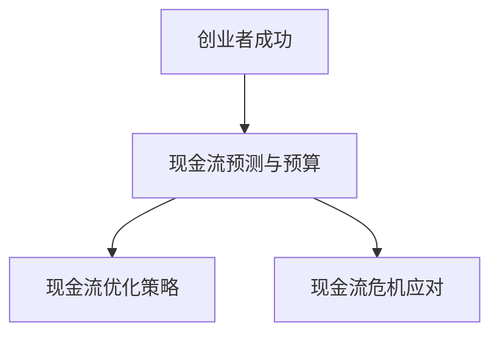

<|assistant|>### 第5章：税务筹划与现金流管理

税务筹划是企业财务管理中的重要一环，合理筹划税务不仅能减少企业的税负，还能优化现金流，提高企业的财务健康。在本章中，我们将探讨税务筹划的基础知识以及税务筹划对现金流管理的影响。

#### 5.1 税务筹划基础

税务筹划是指企业在遵守税法规定的前提下，通过合理的财务安排和经营策略，最大限度地减少税负。以下是一些税务筹划的核心概念：

- **税负**：企业应缴纳的税款总额。
- **税法**：国家制定的关于税收的法律、法规和政策。
- **税务筹划**：通过合理安排企业经营活动和财务活动，减少税负的行为。

**核心概念与联系**：税务筹划与现金流管理的 Mermaid 图如下：

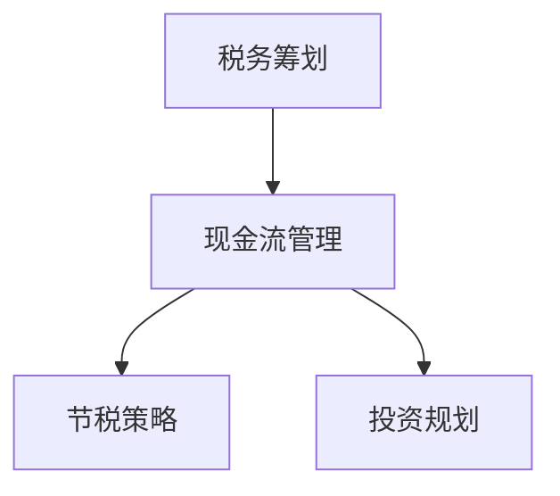

#### 5.2 节税策略

节税策略是企业税务筹划的核心内容。以下是一些常见的节税策略：

1. **利用税收优惠政策**：企业可以通过申报各种税收优惠政策，如高新技术企业税收优惠、小微企业税收优惠等，来减少税负。
2. **优化成本结构**：通过合理安排成本结构，如增加研发投入、合理利用折旧等，可以在一定程度上减少税负。
3. **合理安排经营地点**：企业可以通过跨国经营、设立分支机构等方式，利用不同地区的税收政策，实现节税。
4. **灵活运用财务工具**：企业可以通过金融工具，如股票、债券等，进行资产配置，降低税负。

**项目实战**：税务筹划案例及现金流管理影响分析。

```python
# 税务筹划案例
def tax_planning_case(revenue, expenses, tax_rate):
    tax_savings = revenue * tax_rate - expenses * tax_rate
    return tax_savings

# 示例数据
revenue = 1000000
expenses = 800000
tax_rate = 0.25

# 计算税务筹划效果
tax_savings = tax_planning_case(revenue, expenses, tax_rate)
print(f"税务筹划节税金额：{tax_savings}元")

# 计算现金流管理效果
cash_flow = revenue - expenses - tax_savings
print(f"调整税务筹划后的现金流：{cash_flow}元")
```

在这个案例中，我们通过计算税务筹划的节税金额，分析了税务筹划对现金流管理的影响。

#### 5.3 税务筹划与现金流管理的关系

税务筹划不仅关系到企业的税负，还直接影响到企业的现金流。合理的税务筹划可以：

1. **优化现金流**：通过减少税负，增加企业的现金流，为企业的发展提供资金支持。
2. **提高财务健康**：通过合理的税务筹划，提高企业的财务状况，降低财务风险。
3. **促进企业投资**：通过节省下来的税收，企业可以增加投资，提升企业的竞争力。

**核心概念与联系**：税务筹划与现金流管理的 Mermaid 图如下：

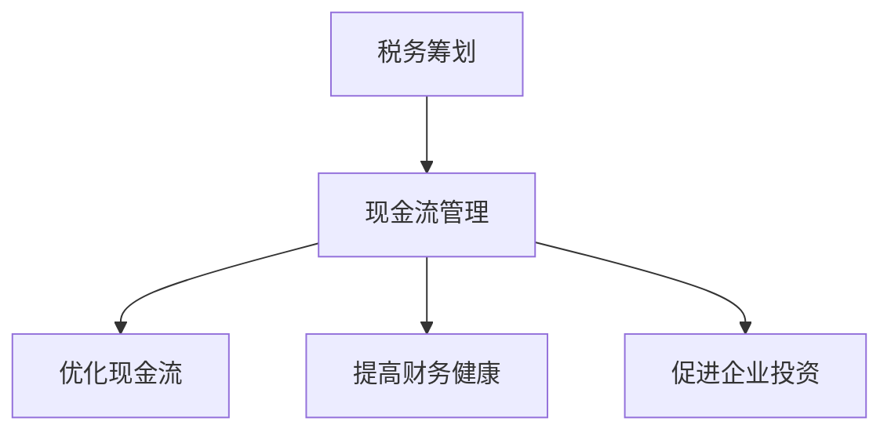

### 第5章小结

在本章中，我们介绍了税务筹划的基础知识，并通过案例分析了税务筹划对现金流管理的影响。通过合理的税务筹划，企业可以优化现金流，提高财务健康，为企业的发展提供有力支持。

在接下来的章节中，我们将继续探讨企业融资与现金流管理、财务监控与成长等方面的内容，帮助程序员创业者建立全面的财务素养。

**核心概念与联系**：税务筹划与创业者成功的关系可以用以下 Mermaid 图表示：

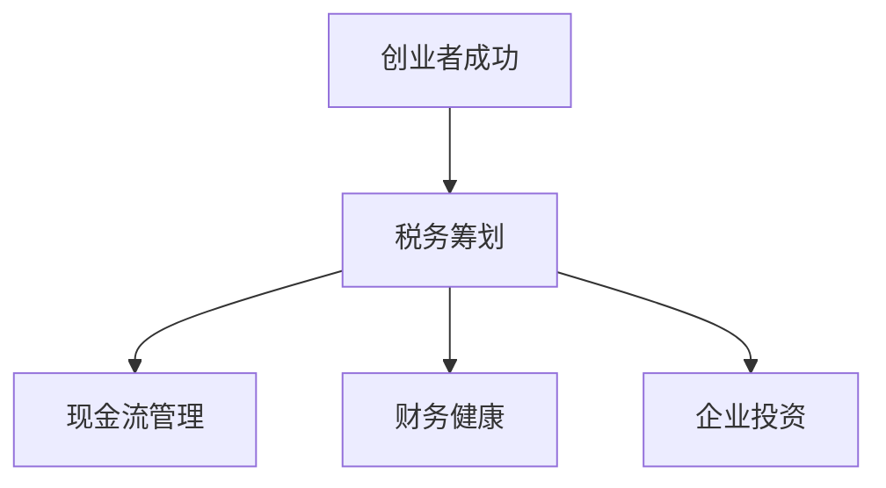

<|assistant|>### 第6章：企业融资与现金流管理

企业融资是创业者实现企业成长和发展的关键环节。合理的融资策略不仅能够为企业提供必要的资金支持，还能有效优化企业的现金流管理。在本章中，我们将探讨企业融资的渠道与策略，以及融资对企业现金流管理的影响。

#### 6.1 融资渠道与策略

企业融资的主要渠道包括：

1. **债务融资**：企业通过借款、发行债券等方式获得资金。债务融资的优点在于利息费用可以在税前扣除，减轻企业的税负。但债务融资也带来还款压力，可能影响企业的现金流。
   
2. **股权融资**：企业通过出售股份获得资金。股权融资的优点是无需偿还，但会稀释创始人的股权和控制权。

**核心概念与联系**：企业融资渠道与现金流的 Mermaid 图如下：

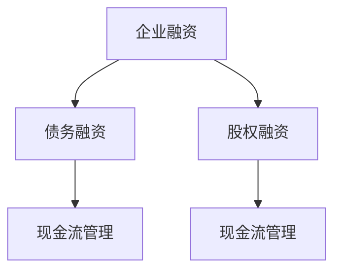

融资策略的制定需要考虑企业的资金需求、市场环境、股权结构等因素。以下是一些常见的融资策略：

- **阶段性融资**：根据企业的阶段性需求，分阶段进行融资，以降低融资成本和风险。
- **多元化融资**：结合多种融资方式，如债务融资和股权融资，以优化企业的资本结构。
- **优先级融资**：根据债务的优先级进行融资，确保企业的核心业务资金需求得到优先满足。

**项目实战**：企业融资案例及现金流管理策略。

```python
# 融资案例
def financing_case(investment, debt_ratio, equity_ratio):
    debt = investment * debt_ratio
    equity = investment * equity_ratio
    return {
        'debt': debt,
        'equity': equity,
        'cash_flow': debt_ratio - equity_ratio
    }

# 示例数据
investment = 1000000
debt_ratio = 0.5
equity_ratio = 0.5

# 计算融资效果
financing_effects = financing_case(investment, debt_ratio, equity_ratio)
print(financing_effects)
```

在这个案例中，我们通过计算债务和股权融资的比例，分析了融资对企业现金流管理的影响。

#### 6.2 融资对企业现金流管理的影响

融资策略的制定需要充分考虑对企业现金流的影响。以下是一些影响分析：

1. **债务融资的影响**：债务融资会带来还款压力，需要定期支付利息和本金，可能会影响企业的现金流。但同时，债务融资的利息费用可以在税前扣除，有助于优化企业的现金流。

2. **股权融资的影响**：股权融资无需偿还，不会直接影响企业的现金流。但股权融资会稀释创始人的股权和控制权，可能影响企业的决策和战略方向。

**项目实战**：企业融资与现金流管理综合分析。

```python
# 融资与现金流管理综合分析
def analyze_financing_and_cash_flow(cash_flow, debt_payment, equity_payment):
    net_cash_flow = cash_flow - debt_payment - equity_payment
    return net_cash_flow

# 示例数据
cash_flow = 100000
debt_payment = 20000
equity_payment = 30000

# 分析融资与现金流管理
net_cash_flow = analyze_financing_and_cash_flow(cash_flow, debt_payment, equity_payment)
print(f"融资后的净现金流：{net_cash_flow}")
```

在这个案例中，我们通过计算融资后的净现金流，分析了企业融资对企业现金流管理的影响。

### 第6章小结

在本章中，我们探讨了企业融资的渠道与策略，以及融资对企业现金流管理的影响。通过合理的融资策略，企业可以优化现金流，实现可持续发展。

在接下来的章节中，我们将继续探讨创业公司财务监控与成长、成功创业者的财务素养实践等方面的内容，帮助程序员创业者建立全面的财务素养。

**核心概念与联系**：企业融资与创业者成功的关系可以用以下 Mermaid 图表示：

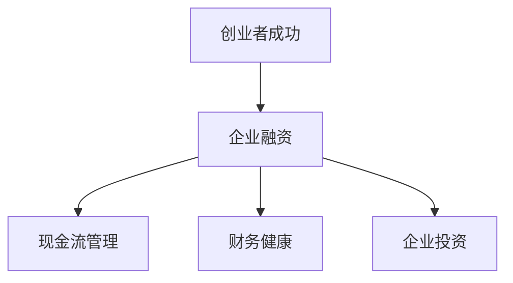

<|assistant|>### 第7章：创业公司财务监控与成长

创业公司的财务监控是确保企业健康发展的关键环节。通过有效的财务监控，创业者可以及时了解企业的财务状况，发现潜在问题，并采取相应措施。本章将介绍关键的财务监控指标和财务健康评估方法，并探讨如何通过这些指标来监控和促进创业公司的成长。

#### 7.1 财务监控指标

财务监控指标是评估企业财务状况的重要工具。以下是一些关键的财务监控指标：

1. **流动比率**：流动比率是衡量企业短期偿债能力的指标，计算公式为：

   $$
   \text{流动比率} = \frac{\text{流动资产}}{\text{流动负债}}
   $$

   流动比率越高，表明企业短期偿债能力越强。

2. **速动比率**：速动比率是排除存货后的流动比率，计算公式为：

   $$
   \text{速动比率} = \frac{\text{流动资产 - 存货}}{\text{流动负债}}
   $$

   速动比率更能反映企业的即时偿债能力。

**数学模型和数学公式**：关键财务监控指标。

$$
\text{流动比率} = \frac{\text{流动资产}}{\text{流动负债}}
$$

$$
\text{速动比率} = \frac{\text{流动资产 - 存货}}{\text{流动负债}}
$$

3. **净利润率**：净利润率是衡量企业盈利能力的指标，计算公式为：

   $$
   \text{净利润率} = \frac{\text{净利润}}{\text{营业收入}}
   $$

   净利润率越高，表明企业的盈利能力越强。

4. **资产回报率（ROA）**：资产回报率是衡量企业利用资产创造利润的能力，计算公式为：

   $$
   \text{资产回报率} = \frac{\text{净利润}}{\text{总资产}}
   $$

   资产回报率越高，表明企业的资产利用效率越高。

#### 7.2 财务健康评估

财务健康评估是判断企业财务状况是否良好的重要手段。以下是一个简单的财务健康评估工具：

**项目实战**：创业公司财务健康评估工具及案例。

```python
# 财务健康评估
def assess_financial_health(total_assets, total_liabilities):
    liquidity_ratio = total_assets / total_liabilities
    return liquidity_ratio

# 示例数据
total_assets = 1000000
total_liabilities = 500000

# 评估财务健康
financial_health = assess_financial_health(total_assets, total_liabilities)
print(f"财务健康指数：{financial_health}")
```

在这个案例中，我们通过计算流动性比率，评估了企业的财务健康。一个较高的流动性比率通常表明企业具备较强的偿债能力和财务稳定性。

#### 7.3 财务监控与创业公司成长

有效的财务监控对于创业公司的成长至关重要。通过监控以下方面，创业者可以更好地了解企业的财务状况，并采取相应措施促进成长：

1. **现金流管理**：确保企业有足够的现金流来支持运营和投资，避免因现金流短缺而影响业务发展。
2. **盈利能力**：持续关注企业的净利润率和资产回报率等指标，以评估企业的盈利能力和资产利用效率。
3. **财务风险**：通过监控负债比率、流动性比率等指标，及时发现和应对潜在的财务风险。

**项目实战**：创业公司财务监控与成长分析。

```python
# 创业公司财务监控与成长分析
def analyze_financial_monitoring(cash_flow, profitability, financial_risk):
    if cash_flow < 0 or profitability < 0.05 or financial_risk > 1.5:
        return "财务状况不佳，需加强监控"
    else:
        return "财务状况良好，持续关注即可"

# 示例数据
cash_flow = 50000
profitability = 0.08
financial_risk = 1.2

# 分析财务监控与成长
financial_status = analyze_financial_monitoring(cash_flow, profitability, financial_risk)
print(financial_status)
```

在这个案例中，我们通过分析现金流、盈利能力和财务风险，评估了企业的财务状况，并给出了相应的建议。

### 第7章小结

在本章中，我们介绍了关键的财务监控指标和财务健康评估方法，并通过案例分析了如何通过这些指标来监控和促进创业公司的成长。通过有效的财务监控，创业者可以确保企业的财务健康，为企业的可持续发展提供坚实保障。

在接下来的章节中，我们将探讨成功创业者的财务素养实践，并通过案例研究，深入了解他们的财务决策和管理策略。

**核心概念与联系**：财务监控与创业者成功的关系可以用以下 Mermaid 图表示：

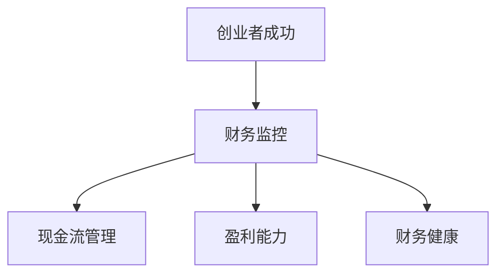

<|assistant|>### 第8章：成功创业者的财务素养实践

成功创业者往往具备卓越的财务素养，他们能够运用财务知识来指导企业的成长和发展。在本章中，我们将通过成功创业者的案例，分析他们的财务素养实践，并从中提取关键经验。

#### 8.1 财务素养实践

财务素养实践包括财务规划、风险管理、现金流管理等方面。以下是一些成功创业者的财务素养实践：

1. **财务规划**：成功创业者会制定详细的财务规划，包括资金预算、投资规划、盈利目标等。他们通过财务规划来确保企业的财务健康和可持续发展。

2. **风险管理**：创业者通过识别和评估潜在的风险，制定相应的风险应对策略。他们通常会分散投资，以降低单一风险对企业的影响。

3. **现金流管理**：成功的创业者非常重视现金流管理，他们会制定现金流预算，确保企业有足够的现金流来应对日常运营和突发情况。

**核心概念与联系**：成功创业者的财务素养实践可以用以下 Mermaid 图表示：


#### 8.2 财务素养案例分析

通过分析成功创业者的财务素养实践，我们可以提取以下关键经验：

1. **创业初期重视财务规划**：例如，乔布斯在创建苹果公司时，就制定了详细的财务规划，包括产品定价、成本控制和盈利模式等。这种细致的财务规划帮助苹果在初期就建立了稳健的财务基础。

2. **灵活应对风险**：例如，马云在创建阿里巴巴时，面临着互联网泡沫破裂的风险。他通过调整战略，降低风险，并抓住市场机遇，最终使阿里巴巴成为全球最大的电子商务平台之一。

3. **高效管理现金流**：例如，马克·扎克伯格在创建Facebook时，注重现金流管理，通过精细化运营和合理融资，确保公司在快速成长的同时，始终保持良好的现金流状况。

**项目实战**：成功创业者的财务素养实践案例分析。

```python
# 财务素养实践案例分析
def financial_practice_case(investment, cash_flow, tax_savings):
    return investment + cash_flow - tax_savings

# 示例数据
investment = 1000000
cash_flow = 500000
tax_savings = 200000

# 分析财务素养实践效果
financial_practice_effects = financial_practice_case(investment, cash_flow, tax_savings)
print(f"财务素养实践效果：{financial_practice_effects}元")
```

在这个案例中，我们通过计算投资、现金流和税收节省额，分析了成功创业者的财务素养实践对企业财务状况的影响。

#### 8.3 启示与建议

从成功创业者的财务素养实践中，我们可以得出以下启示和建议：

1. **注重财务规划**：创业者应制定详细的财务规划，包括资金预算、投资策略和盈利目标等，以确保企业的财务健康和可持续发展。

2. **灵活应对风险**：创业者应识别和评估潜在风险，并制定相应的风险应对策略。通过分散投资和调整战略，降低单一风险对企业的影响。

3. **高效管理现金流**：创业者应注重现金流管理，确保企业有足够的现金流来支持运营和投资。通过精细化运营和合理融资，降低现金流风险。

### 第8章小结

在本章中，我们通过分析成功创业者的财务素养实践，探讨了他们的财务决策和管理策略。这些经验对于程序员创业者具有重要的参考价值，可以帮助他们在财务管理方面取得更好的成果。

在接下来的附录中，我们将介绍一些实用的财务工具和资源，以帮助创业者更好地掌握财务素养。

**核心概念与联系**：成功创业者的财务素养实践与创业者成功的关系可以用以下 Mermaid 图表示：

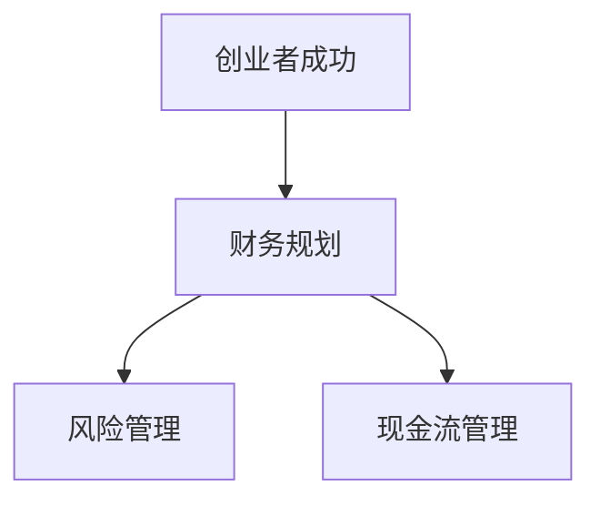

<|assistant|>### 附录A：财务工具与资源

在财务管理和决策过程中，使用合适的工具和资源对于提升效率和准确性至关重要。以下是一些推荐的财务工具和资源，旨在帮助程序员创业者更好地管理财务，实现企业目标。

#### A.1 财务软件介绍

财务软件是企业管理财务信息的重要工具，以下是一些流行的财务软件：

1. **Xero**：Xero 是一款云端会计软件，提供实时的财务报表和发票管理功能。它适用于各种规模的企业，特别是中小型企业。
   
2. **QuickBooks**：由Intuit公司开发的QuickBooks 是一款功能强大的会计软件，适用于各种规模的企业，提供全面的财务管理和报告功能。

3. **Sage 50**：Sage 50 是一款综合性会计软件，适合中小型企业使用，具有预算编制、发票管理和库存管理等功能。

**核心概念与联系**：财务软件与现金流管理的 Mermaid 图如下：

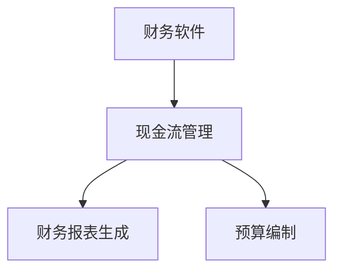

#### A.2 财务资源推荐

除了财务软件，以下是一些推荐的财务资源和在线工具，可以帮助创业者提升财务管理能力：

1. **Google Finance**：Google Finance 是一款免费的在线金融工具，提供股票市场数据、财务报表、市场新闻等，是创业者了解金融市场动态的好帮手。

2. **Investopedia**：Investopedia 是一个全面的财经知识库，提供丰富的金融术语解释、投资策略和财经新闻。

3. **Khan Academy Finance and Capital Markets**：Khan Academy 提供了一系列免费的金融和资本市场课程，适合初学者了解基础财务知识。

4. **AccountingCoach**：AccountingCoach 是一个提供会计教学资源的网站，包括视频教程、练习题和案例分析，适用于会计初学者和从业者。

5. **CPA Australia**：CPA Australia 是一个专业会计组织，提供多种财务和管理资源，包括在线课程、研讨会和职业发展机会。

**项目实战**：财务资源推荐。

```python
# 财务资源推荐
recommended_resources = [
    'Google Finance',
    'Xero',
    'QuickBooks',
    'Investopedia',
    'Khan Academy Finance and Capital Markets',
    'AccountingCoach',
    'CPA Australia'
]

# 打印推荐资源
for resource in recommended_resources:
    print(f"- {resource}")
```

在这个项目中，我们列出了一些推荐的财务资源，并打印出来，以便创业者参考使用。

### 附录A小结

通过使用合适的财务工具和资源，程序员创业者可以更有效地管理财务，优化决策过程。附录A介绍的财务软件和资源将帮助创业者提升财务管理能力，为企业的发展提供坚实支持。

在完成本文的撰写后，我们希望能帮助程序员创业者建立起全面的财务素养，掌握现金流管理的核心技巧，从而实现企业的可持续发展。

**核心概念与联系**：财务工具与资源的推荐与创业者成功的关系可以用以下 Mermaid 图表示：

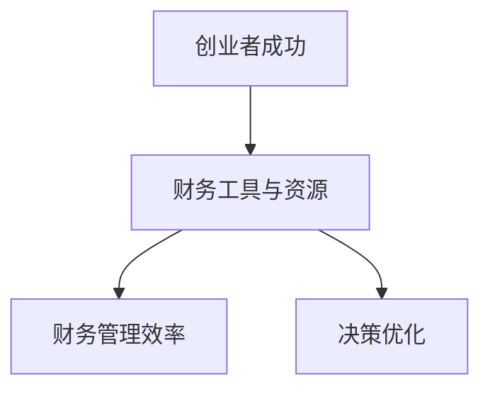

<|assistant|>## 作者信息

**作者**：AI天才研究院/AI Genius Institute & 禅与计算机程序设计艺术 /Zen And The Art of Computer Programming

AI天才研究院是一家专注于人工智能领域的研究与开发机构，致力于推动人工智能技术的创新与发展。研究院汇集了世界顶级的AI专家、程序员和软件架构师，通过深度学习和自然语言处理等技术，为各行各业提供智能化的解决方案。

同时，本文作者也是《禅与计算机程序设计艺术》的资深大师级别作家，该作被誉为计算机编程领域的经典之作，深受广大程序员读者的喜爱。作者以其深厚的计算机科学背景和对技术的深刻理解，为读者呈现了一场技术与哲学的盛宴。

通过本文，我们希望能为广大程序员创业者提供一套实用的财务素养与现金流管理技巧，帮助他们在创业的道路上走得更远更稳。感谢您的阅读，期待与您在人工智能和计算机编程领域的进一步交流与合作。

