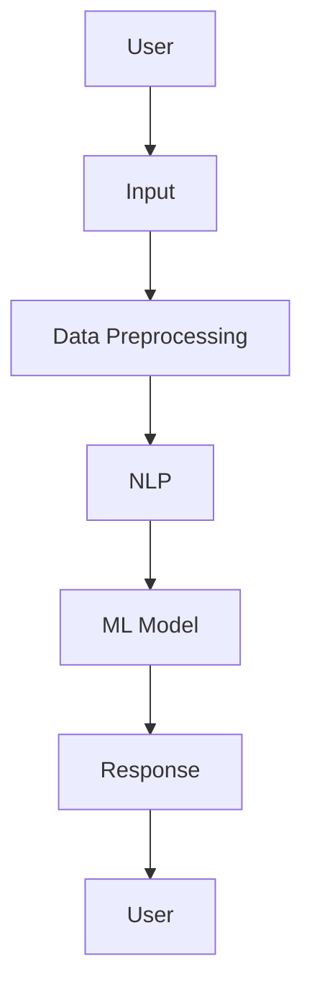

                 

# 《程序员如何利用人工智能技术创造创业机会》

> **关键词**：人工智能、创业、程序员、机器学习、深度学习、创业机会

> **摘要**：本文旨在探讨程序员如何利用人工智能技术创造创业机会。通过对人工智能基础概念、核心算法、创业应用和法律伦理问题的深入分析，本文为程序员提供了系统化的创业指导，帮助他们在人工智能领域开启自己的创业之旅。

## 第一部分: 引言与核心概念

### 1.1 引言

#### 1.1.1 人工智能时代与创业机会

人工智能（AI）正迅速成为当今科技领域的明星。随着深度学习、自然语言处理、计算机视觉等技术的突破，AI已经在各行各业中展现出巨大的潜力。这种变革不仅改变了传统行业的工作方式，也为创业者提供了前所未有的创业机会。

在人工智能时代，程序员成为了创新的驱动力。他们不仅能够开发出先进的AI应用，还能够通过这些应用为企业和个人创造价值。因此，对于程序员来说，掌握人工智能技术不仅是职业发展的需要，更是抓住创业机会的关键。

#### 1.1.2 程序员在人工智能创业中的角色

在人工智能创业中，程序员的角色至关重要。他们不仅是技术的实施者，更是创新的引领者。具体来说，程序员在人工智能创业中承担以下角色：

1. **算法工程师**：负责设计、实现和优化AI算法，提高模型的准确性和效率。
2. **数据工程师**：负责数据收集、处理和存储，为AI模型提供高质量的数据支持。
3. **产品经理**：结合用户需求和商业目标，设计并实现AI产品。
4. **创业领袖**：利用技术优势，组建团队，引领公司发展。

### 1.2 人工智能基础概念

#### 1.2.1 人工智能的定义与发展历程

人工智能是指由计算机系统执行的智能行为，旨在模拟、扩展或替代人类智能。人工智能的发展可以分为以下几个阶段：

1. **初始阶段（1956-1969）**：人工智能的概念被提出，早期研究主要集中在逻辑推理和问题解决。
2. **繁荣阶段（1970-1989）**：专家系统和知识表示技术取得突破，人工智能应用逐渐走向实际。
3. **低谷阶段（1990-2010）**：由于计算资源和算法的局限，人工智能研究陷入低谷。
4. **复兴阶段（2010至今）**：深度学习等技术的突破，使得人工智能重新崛起，应用范围不断拓展。

#### 1.2.2 人工智能的核心技术

人工智能的核心技术包括：

1. **机器学习**：通过数据训练模型，使计算机能够进行预测和决策。
2. **深度学习**：一种基于神经网络的机器学习技术，能够在大规模数据集上实现高效学习。
3. **自然语言处理**：使计算机能够理解和生成人类语言，广泛应用于语音识别、机器翻译等领域。
4. **计算机视觉**：使计算机能够理解和解释视觉信息，广泛应用于图像识别、自动驾驶等领域。

### 1.3 人工智能创业机会概述

#### 1.3.1 人工智能在不同领域的应用

人工智能在各个领域都有广泛的应用，以下是一些典型的例子：

1. **医疗健康**：通过机器学习和深度学习技术，实现疾病诊断、药物研发和健康管理。
2. **金融科技**：利用人工智能进行风险管理、信用评分和个性化金融服务。
3. **零售电商**：通过智能推荐、图像识别和语音交互，提升购物体验。
4. **智能制造**：通过计算机视觉和机器人技术，实现生产过程的自动化和智能化。
5. **自动驾驶**：通过深度学习和传感器技术，实现无人驾驶汽车。

#### 1.3.2 创业者需关注的行业趋势

人工智能创业者在选择创业方向时，需要关注以下几个行业趋势：

1. **数据驱动**：越来越多的企业意识到数据的重要性，数据将成为人工智能创业的核心资产。
2. **跨界融合**：人工智能与传统行业的融合将为创业者提供更多创新机会。
3. **开源生态**：开源技术和工具的普及，使得创业者可以更轻松地搭建人工智能应用。
4. **监管合规**：随着人工智能技术的应用，相关法律法规和伦理问题将日益受到关注。

## 第二部分: 人工智能核心算法与原理

### 2.1 机器学习算法基础

#### 2.1.1 监督学习算法

监督学习算法是一种从标记数据中学习预测模型的机器学习技术。它包括以下两种基本类型：

##### 2.1.1.1 线性回归

线性回归是一种简单的监督学习算法，用于预测一个连续值输出。其数学模型如下：

$$
y = \beta_0 + \beta_1x
$$

其中，\(y\) 是输出值，\(\beta_0\) 是截距，\(\beta_1\) 是斜率，\(x\) 是输入值。

线性回归的伪代码如下：

```python
# 伪代码
def linear_regression(x, y):
    # 计算斜率和截距
    beta_1 = calculate_slope(x, y)
    beta_0 = calculate_intercept(x, y)
    
    # 预测输出值
    predicted_y = beta_0 + beta_1 * x
    return predicted_y
```

##### 2.1.1.2 决策树

决策树是一种树形结构，用于分类和回归任务。每个节点代表一个特征，每个分支代表一个可能的特征值。其伪代码如下：

```python
# 伪代码
def decision_tree(x, tree):
    # 遍历决策树
    for node in tree:
        if node.feature == x.feature:
            return node.label
        else:
            next_node = node.next(node.feature)
            return decision_tree(x, next_node)
```

#### 2.1.2 无监督学习算法

无监督学习算法没有明确的标签信息，主要用于聚类和降维任务。以下介绍两种常见的无监督学习算法：

##### 2.1.2.1 K-均值聚类

K-均值聚类是一种基于距离的聚类算法，其目标是将数据划分为K个簇。其伪代码如下：

```python
# 伪代码
def k_means(data, k):
    # 随机初始化中心点
    centroids = initialize_centroids(data, k)
    
    # 迭代更新中心点和分类
    while not converged:
        for data_point in data:
            # 计算距离并分类
            closest_centroid = calculate_closest_centroid(data_point, centroids)
            classify(data_point, closest_centroid)
        
        # 更新中心点
        centroids = update_centroids(data, k)
    
    return centroids
```

#### 2.1.3 深度学习算法

深度学习是一种基于多层神经网络的机器学习技术，具有强大的表示和学习能力。以下介绍几种常见的深度学习算法：

##### 2.1.3.1 神经网络

神经网络是一种模仿人脑结构和功能的计算模型，由多个神经元（节点）组成。其伪代码如下：

```python
# 伪代码
def neural_network(input_data, weights, biases):
    # 前向传播
    layer_outputs = []
    for layer in layers:
        output = layer.forward(input_data)
        layer_outputs.append(output)
    
    # 计算损失函数
    loss = calculate_loss(output, target)
    
    # 反向传播
    for layer in reversed(layers):
        gradient = layer.backward(loss)
        update_weights_and_biases(layer, gradient)
    
    return layer_outputs[-1]
```

## 第三部分: 人工智能在创业中的应用

### 3.1 数据收集与预处理

在人工智能创业中，数据收集与预处理是至关重要的环节。以下介绍数据收集与预处理的方法：

#### 3.1.1 数据来源

1. **公开数据集**：如Kaggle、UCI机器学习库等。
2. **内部数据**：企业内部的业务数据、用户行为数据等。
3. **第三方数据**：通过购买或交换获得的数据。

#### 3.1.2 数据预处理方法

1. **数据清洗**：去除噪声、错误和缺失值。
2. **数据归一化**：将不同特征的数据范围统一，便于模型训练。
3. **数据增强**：通过变换、旋转、缩放等操作增加数据多样性。
4. **特征提取**：从原始数据中提取有用的特征，提高模型性能。

### 3.2 人工智能项目实战

以下介绍一个具体的人工智能项目实战：智能客服系统。

#### 3.2.1 系统架构

智能客服系统架构图如下：



#### 3.2.1.1 系统架构

智能客服系统分为以下几个部分：

1. **用户输入**：用户通过文本或语音方式向系统提出问题。
2. **数据预处理**：对输入数据进行清洗、分词、去停用词等操作。
3. **自然语言处理**：利用词向量、实体识别等技术对预处理后的数据进行分析。
4. **机器学习模型**：根据训练数据，使用机器学习算法生成回答。
5. **响应生成**：根据模型输出，生成合适的回答并返回给用户。

#### 3.2.1.2 代码实现与分析

以下是智能客服系统的伪代码实现和分析：

```python
# 伪代码
import nlp_library
import ml_library

def preprocess_data(data):
    # 数据预处理代码
    pass

def train_model(data):
    # 训练模型代码
    pass

def generate_response(input_text):
    # 生成响应代码
    pass

# 主程序
data = collect_data()
preprocessed_data = preprocess_data(data)
model = train_model(preprocessed_data)
while True:
    input_text = get_user_input()
    response = generate_response(input_text)
    send_response(response)
```

### 3.3 创业者需关注的法律与伦理问题

#### 3.3.1 数据隐私保护

在人工智能创业中，数据隐私保护至关重要。以下是一些建议：

1. **数据匿名化**：对用户数据进行匿名化处理，减少隐私泄露风险。
2. **数据加密**：对敏感数据进行加密存储和传输。
3. **合规性审查**：遵守相关法律法规，确保数据处理合法合规。

#### 3.3.2 人工智能伦理

人工智能伦理是人工智能创业中不可忽视的问题。以下是一些建议：

1. **公平性**：确保人工智能系统在处理数据时公平公正。
2. **透明度**：确保用户了解人工智能系统的决策过程。
3. **责任归属**：明确人工智能系统的责任归属，确保在出现问题时能够追溯责任。

## 第四部分: 人工智能创业之路

### 4.1 创业计划书撰写

创业计划书是创业过程中重要的文档，它详细阐述了项目的定位、目标、商业模式和融资计划。以下是一些建议：

#### 4.1.1 项目定位与目标

1. **项目定位**：明确项目的市场定位和目标用户。
2. **项目目标**：设定可量化的短期和长期目标。

#### 4.1.2 商业模式与盈利模式

1. **商业模式**：阐述项目的盈利模式，如订阅制、广告分成等。
2. **盈利模式**：分析项目的盈利能力，预测未来收益。

### 4.2 融资与投资策略

#### 4.2.1 融资渠道

1. **天使投资**：寻找个人投资者或投资机构。
2. **风险投资**：寻求风险投资机构的资金支持。
3. **政府资助**：申请政府提供的创业补贴和资助。

#### 4.2.2 投资者关系管理

1. **建立信任**：与投资者建立长期信任关系。
2. **透明沟通**：及时向投资者通报项目进展和财务状况。
3. **合理分配利益**：确保投资者利益最大化。

### 4.3 团队建设与项目管理

#### 4.3.1 团队成员角色与职责

1. **技术团队**：包括算法工程师、数据工程师、前端工程师等。
2. **产品团队**：包括产品经理、UI/UX设计师等。
3. **运营团队**：包括运营经理、市场营销人员等。

#### 4.3.2 项目管理工具与方法

1. **项目管理工具**：如Jira、Trello等。
2. **敏捷开发**：采用敏捷开发方法，提高项目交付效率。
3. **迭代开发**：分阶段实现项目功能，逐步完善产品。

## 第五部分: 未来展望

### 5.1 人工智能创业趋势

#### 5.1.1 行业发展预测

1. **市场规模**：随着技术的进步和应用场景的拓展，人工智能市场将保持高速增长。
2. **技术应用**：更多行业将采用人工智能技术，推动产业升级。

#### 5.1.2 新兴技术展望

1. **生成对抗网络（GAN）**：在图像生成、视频制作等领域具有广泛应用前景。
2. **强化学习**：在游戏、推荐系统等领域具有巨大潜力。

### 5.2 人工智能创业者的成长路径

#### 5.2.1 技术能力提升

1. **持续学习**：紧跟技术发展趋势，不断提升自己的技术水平。
2. **实践经验**：通过实际项目积累经验，提高解决问题的能力。

#### 5.2.2 领导力培养

1. **团队管理**：学会带领团队，提高团队协作效率。
2. **商业思维**：培养商业敏感度，提高商业决策能力。

## 附录

### 附录 A: 人工智能创业资源汇总

#### A.1 开源框架与工具

1. **TensorFlow**：Google开发的深度学习框架。
2. **PyTorch**：Facebook开发的深度学习框架。
3. **Scikit-learn**：Python机器学习库。

#### A.2 行业报告与研究报告

1. **CBInsights**：提供人工智能行业报告。
2. **麦肯锡**：发布人工智能研究报告。

#### A.3 创业社区与论坛

1. **Hackernoon**：人工智能和创业社区。
2. **AI Dungeon**：人工智能创作社区。

### 附录 B: 编程语言与工具介绍

#### B.1 Python

Python是一种易于学习的编程语言，广泛应用于人工智能领域。

#### B.2 R

R是一种专门用于统计分析和图形表示的编程语言。

#### B.3 Jupyter Notebook

Jupyter Notebook是一种交互式的数据分析工具，便于编写和分享代码。

### 作者

**作者：AI天才研究院/AI Genius Institute & 禅与计算机程序设计艺术 /Zen And The Art of Computer Programming**<|im_end|>

