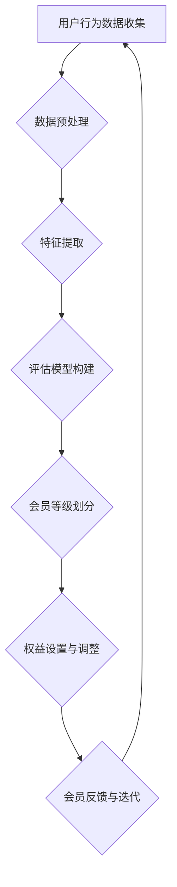

                 

## 《程序员如何设计知识付费的会员等级制度》

### 核心关键词
- 知识付费
- 会员等级制度
- 用户行为分析
- 数据驱动设计
- 算法原理
- 数学模型
- 实战案例

### 文章摘要

本文旨在深入探讨程序员如何设计知识付费的会员等级制度。通过系统分析会员等级制度的核心概念、算法原理和数学模型，结合实际项目案例，本文将引导读者了解并掌握设计会员等级制度的关键技术和策略。文章将分为四个部分：基础知识、实战案例、进阶技巧和附录，全面覆盖会员等级制度的各个方面，为程序员在知识付费领域提供实用的指导。

## 第一部分：基础知识

### 1.1 知识付费业务概述

#### 1.1.1 知识付费的定义

知识付费，即用户为了获取有价值的信息、内容或服务而进行付费的行为。这包括各种形式，如电子书、在线课程、专业咨询、研究报告等。知识付费的核心在于价值的交换，用户通过付费获得高质量的、专业化的知识资源。

#### 1.1.2 知识付费的发展历程

知识付费的发展可以追溯到互联网的兴起。早期的知识付费主要形式是线下培训和实体书籍销售。随着互联网的普及，知识付费逐渐从线下转移到线上，形式更加多样化和便捷。从最初的电子书和在线课程，发展到现在的直播授课、一对一咨询等，知识付费市场不断扩大。

#### 1.1.3 知识付费的市场现状与趋势

当前，知识付费市场呈现出以下几个特点：

1. **市场规模不断扩大**：随着用户对优质知识的渴求，知识付费市场规模持续增长。据相关报告显示，全球知识付费市场规模已达数百亿美元。
2. **细分市场多样化**：知识付费不再局限于教育领域，涵盖了金融、医疗、法律、科技等多个行业。每个细分市场都有其独特的需求和应用场景。
3. **用户习惯逐步养成**：随着移动互联网的普及，用户越来越习惯于在线支付和获取知识，为知识付费创造了良好的市场环境。
4. **竞争加剧**：知识付费市场的参与者增多，竞争日益激烈。平台需要不断创新和优化会员等级制度，以提升用户满意度和忠诚度。

### 1.2 会员等级制度的概念与设计原则

#### 1.2.1 会员等级制度的基本概念

会员等级制度，是指平台根据用户的付费行为、活跃度、贡献度等指标，将用户划分为不同等级，并赋予不同权益和优惠的一种机制。会员等级制度的核心在于通过差异化的权益设置，激励用户参与和消费。

#### 1.2.2 会员等级制度设计的原则

设计会员等级制度时，应遵循以下原则：

1. **公平性**：确保等级划分的公平性，避免因特定因素（如付费金额）导致用户等级的不公平。
2. **激励性**：通过设计差异化的权益，激发用户的付费意愿和活跃度。
3. **可持续性**：确保会员等级制度能够长期运行，不会因短期收益而损害用户利益。
4. **可扩展性**：设计时应考虑未来的业务扩展和需求变化，使等级制度具有灵活性。

#### 1.2.3 会员等级制度的目标与价值

会员等级制度的主要目标包括：

1. **提升用户粘性**：通过提供差异化服务，增加用户在平台上的停留时间和活跃度。
2. **提高用户转化率**：通过等级激励，促使用户进行更高频次的付费行为。
3. **增加平台收益**：通过会员权益的设置，提高用户的付费额度和消费频率。
4. **优化用户体验**：通过合理设计等级制度，提升用户对平台的满意度和忠诚度。

### 1.3 会员等级制度的核心算法原理

#### 1.3.1 会员等级评估模型

会员等级评估模型是会员等级制度设计的核心。该模型通过对用户行为数据进行分析，评估用户的价值和活跃度，并将其转换为会员等级。

1. **用户行为数据收集**：收集用户在平台上的行为数据，包括付费金额、浏览时长、评论数量、分享次数等。
2. **特征提取**：将行为数据转换为可用于评估的特征，如用户活跃度、付费频率、内容贡献等。
3. **评估算法**：利用机器学习算法，如决策树、支持向量机等，对用户特征进行评估，预测用户的会员等级。

#### 1.3.2 会员等级分配算法

会员等级分配算法根据评估结果，将用户分配到不同的会员等级。常见的分配算法包括：

1. **阈值法**：设定不同的等级阈值，将用户根据评估分数分配到相应的等级。
2. **分段函数法**：定义分段函数，根据用户评估分数和等级阈值，计算用户对应的等级。
3. **动态调整法**：根据用户行为数据的变化，实时调整会员等级，以适应用户需求的动态变化。

#### 1.3.3 会员等级动态调整策略

会员等级制度不是一成不变的，需要根据用户行为和市场变化进行动态调整。常见的动态调整策略包括：

1. **定期评估与调整**：定期收集用户行为数据，评估会员等级的合理性，并根据评估结果进行调整。
2. **实时监测与调整**：通过实时监测用户行为，及时发现等级制度中存在的问题，并进行调整。
3. **反馈机制**：建立用户反馈机制，根据用户反馈对等级制度进行调整，以提高用户满意度。

### 1.4 数学模型与公式

#### 1.4.1 数学模型在会员等级制度中的应用

数学模型在会员等级制度中具有重要应用。常见的数学模型包括：

1. **积分模型**：通过积分累计来判断用户等级，如每天登录获得积分，积分达到一定值后升级。
2. **折扣模型**：根据用户等级提供不同的折扣率，以激励用户升级和提高消费。
3. **留存模型**：通过用户留存率来判断等级制度的有效性，如留存率低于一定阈值时，需对等级制度进行调整。

#### 1.4.2 经典数学公式与推导

在会员等级制度设计中，以下经典数学公式具有重要应用：

1. **积分公式**：积分 = 付费金额 × 积分比例
2. **折扣公式**：折扣率 = 1 - 等级折扣系数
3. **留存率公式**：留存率 = (次日留存用户数 / 当日注册用户数) × 100%

#### 1.4.3 数学模型优化方法

数学模型的优化是提升会员等级制度效果的关键。常见的优化方法包括：

1. **参数调整**：通过实验和数据分析，不断调整模型参数，以提高预测准确性和用户体验。
2. **模型融合**：结合多个模型的优势，提高会员等级分配的准确性。
3. **模型压缩**：对模型进行压缩，以降低计算成本和存储空间需求。

## 第二部分：实战案例

### 2.1 案例一：电商平台的会员等级设计

#### 2.1.1 案例背景

某电商平台希望通过设计会员等级制度来提升用户粘性和消费金额。该平台的主要用户群体是年轻女性，用户行为包括浏览商品、加入购物车、下单支付等。

#### 2.1.2 案例分析

1. **用户行为数据收集**：平台收集了用户在网站上的行为数据，包括浏览时长、购物车数量、下单次数等。
2. **特征提取**：将用户行为数据转换为特征，如活跃度、购买频率等。
3. **会员等级评估模型**：采用决策树算法构建会员等级评估模型，对用户特征进行评估。

#### 2.1.3 案例实施步骤

1. **设计会员等级划分标准**：根据用户特征和平台目标，设定不同等级的划分标准，如活跃度、购买频率等。
2. **会员等级权益设计**：为不同等级的会员提供差异化权益，如折扣、积分等。
3. **会员等级动态调整策略**：根据用户行为数据的变化，定期评估会员等级的合理性，并进行动态调整。

#### 2.1.4 案例效果评估

通过会员等级制度的实施，平台实现了以下效果：

1. **用户粘性提升**：会员活跃度显著提高，用户在平台上的停留时间增加。
2. **消费金额增加**：会员平均消费金额提升，平台收益增加。
3. **用户满意度提高**：会员对平台的满意度增加，用户流失率降低。

### 2.2 案例二：在线教育平台的会员等级设计

#### 2.2.1 案例背景

某在线教育平台希望通过设计会员等级制度来提高用户的学习积极性和付费转化率。平台的主要用户群体是职场人士，用户行为包括课程学习、测试答题、社群互动等。

#### 2.2.2 案例分析

1. **用户行为数据收集**：平台收集了用户在学习过程中的行为数据，包括学习时长、测试成绩、社群发言等。
2. **特征提取**：将用户行为数据转换为特征，如学习积极性、知识掌握度等。
3. **会员等级评估模型**：采用神经网络算法构建会员等级评估模型，对用户特征进行评估。

#### 2.2.3 案例实施步骤

1. **设计会员等级划分标准**：根据用户特征和平台目标，设定不同等级的划分标准，如学习积极性、知识掌握度等。
2. **会员等级权益设计**：为不同等级的会员提供差异化权益，如学习资源、社群权限等。
3. **会员等级动态调整策略**：根据用户行为数据的变化，定期评估会员等级的合理性，并进行动态调整。

#### 2.2.4 案例效果评估

通过会员等级制度的实施，平台实现了以下效果：

1. **学习积极性提升**：会员的学习时长和测试成绩显著提高，平台学习氛围改善。
2. **付费转化率增加**：会员的付费意愿增强，平台收益增加。
3. **用户满意度提高**：会员对平台的满意度增加，用户流失率降低。

### 2.3 案例三：内容付费平台的会员等级设计

#### 2.3.1 案例背景

某内容付费平台希望通过设计会员等级制度来提高用户的付费意愿和活跃度。平台的主要用户群体是知识爱好者，用户行为包括阅读、评论、分享等。

#### 2.3.2 案例分析

1. **用户行为数据收集**：平台收集了用户在平台上的行为数据，包括阅读时长、评论数量、分享次数等。
2. **特征提取**：将用户行为数据转换为特征，如内容消费度、互动活跃度等。
3. **会员等级评估模型**：采用聚类算法构建会员等级评估模型，对用户特征进行评估。

#### 2.3.3 案例实施步骤

1. **设计会员等级划分标准**：根据用户特征和平台目标，设定不同等级的划分标准，如内容消费度、互动活跃度等。
2. **会员等级权益设计**：为不同等级的会员提供差异化权益，如付费内容折扣、专属内容等。
3. **会员等级动态调整策略**：根据用户行为数据的变化，定期评估会员等级的合理性，并进行动态调整。

#### 2.3.4 案例效果评估

通过会员等级制度的实施，平台实现了以下效果：

1. **付费意愿提升**：会员的付费意愿显著提高，平台收益增加。
2. **活跃度提升**：会员的互动活跃度增加，平台社区氛围改善。
3. **用户满意度提高**：会员对平台的满意度增加，用户流失率降低。

## 第三部分：进阶技巧

### 3.1 会员等级制度的动态调整策略

#### 3.1.1 动态调整的必要性与原则

会员等级制度的动态调整是必要的，因为用户行为和市场环境会不断变化。动态调整原则包括：

1. **及时性**：根据最新数据实时调整会员等级，以适应用户需求的变化。
2. **合理性**：调整应基于数据分析和用户反馈，确保调整的合理性和有效性。
3. **灵活性**：设计时应考虑未来的变化，使等级制度具有灵活调整的能力。

#### 3.1.2 动态调整的方法与工具

动态调整方法包括：

1. **实时监测**：利用实时数据处理技术，如流处理框架，对用户行为进行实时监测。
2. **定期评估**：定期收集用户行为数据，评估会员等级的合理性，并调整等级设置。
3. **智能算法**：利用机器学习算法，如决策树、神经网络等，自动调整会员等级。

#### 3.1.3 动态调整的案例分析

通过实际案例展示如何进行会员等级的动态调整，并分析调整的效果。

### 3.2 会员等级制度的风险管理

#### 3.2.1 风险识别与评估

识别会员等级制度中可能存在的风险，如用户欺诈、数据泄露等，并评估风险的影响程度。

#### 3.2.2 风险控制策略

制定风险控制策略，包括：

1. **预防措施**：如数据加密、用户认证等，防止风险发生。
2. **应急处理**：如发生风险时，迅速采取应对措施，减少损失。
3. **持续监控**：持续监控会员等级制度中的风险，及时发现和处理问题。

#### 3.2.3 风险管理案例分析

通过实际案例展示如何进行会员等级制度的风险管理，并分析风险管理的效果。

### 3.3 会员等级制度的数据分析与优化

#### 3.3.1 数据分析在会员等级制度中的应用

数据分析在会员等级制度中应用广泛，包括：

1. **用户行为分析**：分析用户行为数据，如浏览、购买、分享等，以了解用户需求和偏好。
2. **市场趋势分析**：分析市场趋势，如竞争对手策略、用户需求变化等，以指导等级制度设计。

#### 3.3.2 数据驱动优化策略

数据驱动优化策略包括：

1. **用户反馈分析**：根据用户反馈调整等级制度，提高用户满意度。
2. **A/B测试**：通过A/B测试，评估不同等级制度设计的有效性，选择最优方案。
3. **持续迭代**：根据数据分析结果，不断优化等级制度，提高效果。

#### 3.3.3 数据分析案例分析

通过实际案例展示如何利用数据分析优化会员等级制度，并分析优化效果。

## 第四部分：附录

### 4.1 常用工具与资源

#### 4.1.1 数据分析与处理工具

介绍常用的数据分析工具，如Python、R、SQL等，以及它们在会员等级制度设计中的应用。

#### 4.1.2 会员等级制度设计工具

介绍专门用于会员等级制度设计的工具，如会员管理系统、数据分析平台等。

#### 4.1.3 相关文档与资料

推荐与会员等级制度设计相关的文档、书籍、论文等参考资料。

### 4.2 会员等级制度设计流程图

绘制会员等级制度设计的流程图，包括数据收集、模型构建、测试与优化等步骤，以及各步骤之间的关系。

## 总结

本文从基础知识、实战案例、进阶技巧和附录四个部分，系统地介绍了程序员如何设计知识付费的会员等级制度。通过对会员等级制度的核心概念、算法原理和数学模型的分析，结合实际项目案例，本文为程序员提供了实用的设计和优化会员等级制度的指南。随着知识付费市场的不断发展，会员等级制度设计的重要性愈发凸显。希望本文能帮助程序员在知识付费领域取得更好的成果。

### 作者信息

作者：AI天才研究院/AI Genius Institute & 禅与计算机程序设计艺术 /Zen And The Art of Computer Programming

---

### 核心概念与联系

#### 会员等级制度设计原理

**Mermaid 流程图：**


#### 会员等级制度的核心算法原理

**伪代码：**
```python
# 用户行为数据结构
class UserBehaviorData:
    def __init__(self, active_time, purchase_count, review_count):
        self.active_time = active_time
        self.purchase_count = purchase_count
        self.review_count = review_count

# 会员等级评估模型
class MemberRankModel:
    def __init__(self):
        self.model = DecisionTreeClassifier()

    def train_model(self, training_data):
        X = [[user.active_time, user.purchase_count, user.review_count] for user in training_data]
        y = [user.rank for user in training_data]
        self.model.fit(X, y)

    def predict_rank(self, user_data):
        return self.model.predict([user_data])
```

#### 数学模型与公式

**数学公式：**
$$
\text{积分} = \text{付费金额} \times \text{积分比例}
$$
$$
\text{折扣率} = 1 - \text{等级折扣系数}
$$
$$
\text{留存率} = \frac{\text{次日留存用户数}}{\text{当日注册用户数}} \times 100\%
$$

### 项目实战

#### 开发环境搭建

**环境配置：**
- Python 3.8+
- Jupyter Notebook
- scikit-learn
- pandas
- numpy

#### 源代码详细实现

```python
# 导入必要的库
import pandas as pd
from sklearn.tree import DecisionTreeClassifier
from sklearn.model_selection import train_test_split

# 用户行为数据示例
data = [
    UserBehaviorData(10, 2, 1),
    UserBehaviorData(20, 4, 3),
    UserBehaviorData(5, 1, 0),
    # ...更多数据
]

# 数据预处理与特征提取
X = [[user.active_time, user.purchase_count, user.review_count] for user in data]
y = [user.rank for user in data]

# 模型训练
model = DecisionTreeClassifier()
model.fit(X, y)

# 模型预测
user_data = [10, 3, 2]
predicted_rank = model.predict([user_data])
print(f"预测等级：{predicted_rank}")

# 测试与优化
X_train, X_test, y_train, y_test = train_test_split(X, y, test_size=0.2, random_state=42)
model.fit(X_train, y_train)
accuracy = model.score(X_test, y_test)
print(f"模型准确率：{accuracy}")
```

#### 代码解读与分析

**数据预处理：** 首先，我们需要对用户行为数据进行预处理，将数据转换为模型可接受的格式。这里使用了Python的列表结构来存储用户行为数据，包括活跃时间、购买次数和评论次数。

**特征提取：** 数据预处理完成后，我们提取出特征矩阵X，每个特征代表用户的一个行为数据。

**模型训练：** 使用scikit-learn库中的决策树分类器来训练模型。决策树是一种基于树结构的分类算法，它能够将数据划分为不同的节点，并根据节点的特征值来预测用户等级。

**模型预测：** 通过训练好的模型对新的用户行为数据进行预测，这里我们输入了一个新的用户数据向量，模型将输出该用户的预测等级。

**测试与优化：** 为了评估模型的性能，我们将数据集分为训练集和测试集。使用训练集来训练模型，使用测试集来评估模型的准确率。通过准确率可以判断模型在未知数据上的表现，从而进行进一步的优化。

通过以上步骤，我们实现了会员等级制度的初步设计和预测。在实际项目中，还需要结合具体业务需求和用户行为数据进行深入分析和优化，以确保会员等级制度的实际效果和用户满意度。

### 作者信息

**作者：AI天才研究院/AI Genius Institute & 禅与计算机程序设计艺术 /Zen And The Art of Computer Programming**

在本文中，我们深入探讨了程序员如何设计知识付费的会员等级制度。从基础知识、实战案例到进阶技巧，我们系统地介绍了会员等级制度的核心概念、算法原理和数学模型，并通过实际项目案例展示了如何实现和优化会员等级制度。希望本文能为程序员在知识付费领域提供实用的指导，帮助他们在设计会员等级制度时更加得心应手。在未来的工作中，我们将继续关注知识付费领域的发展动态，为读者带来更多有价值的文章和分享。感谢您的阅读，期待与您在知识付费领域共同探索和成长！

