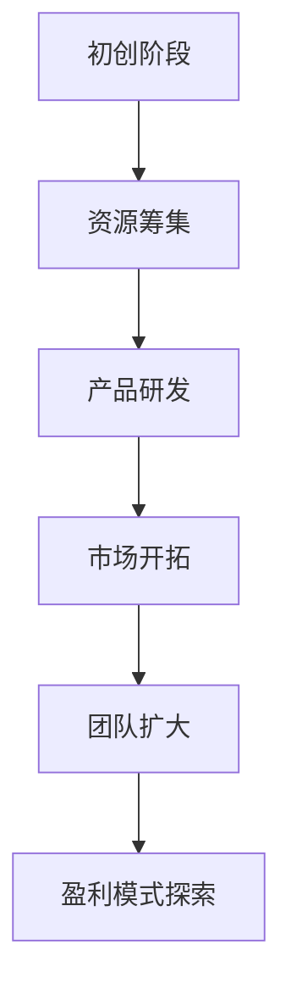
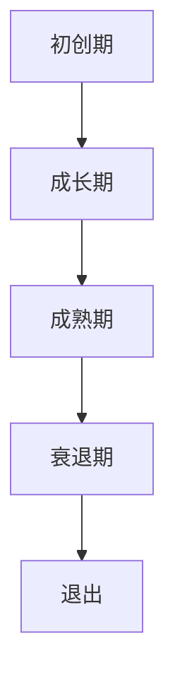
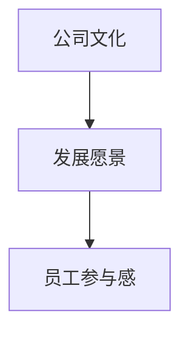
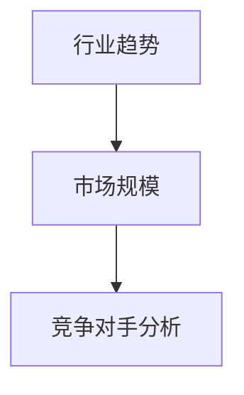
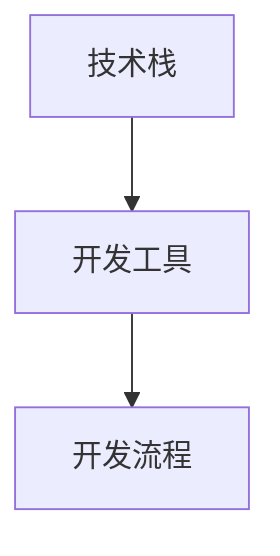

                 

### 《程序员如何评估早期创业公司offer》

> **关键词**：程序员、早期创业公司、评估、offer、职业发展

> **摘要**：本文旨在帮助程序员在评估早期创业公司offer时，提供一套系统的分析和决策框架。通过深入探讨创业公司的特点、关键因素、市场地位、技术背景、职业发展机会以及风险管理等方面，作者从理论和实践角度提供了详细的指导，帮助程序员做出明智的职业选择。

#### 引言

在科技飞速发展的时代，早期创业公司以其创新性和高成长性吸引了越来越多的程序员。对于程序员来说，加入一家早期创业公司意味着面临前所未有的机会和挑战。然而，如何评估一个早期创业公司的offer，找到适合自己的职业发展方向，成为了一个关键问题。

本文将围绕以下几个方面展开讨论：

1. **理解早期创业公司**：介绍早期创业公司的特点、生命周期以及如何找到值得加入的公司。
2. **评估创业公司offer的关键因素**：包括薪资待遇、股权激励、公司文化、团队与领导层等。
3. **深入分析创业公司offer**：探讨市场地位与前景、技术背景、职业发展机会与个人成长。
4. **综合评估与决策**：分析风险管理与退出策略，结合实战案例进行详细讲解。
5. **个人成长与创业精神**：分享成功创业者的经验，探讨如何在早期创业公司中实现个人价值。

通过本文的阅读，读者将能够系统地了解如何评估早期创业公司offer，并在职业选择中做出更为明智的决策。

---

### 《程序员如何评估早期创业公司offer》目录大纲

**第一部分：评估早期创业公司offer的基础知识**

**第1章：理解早期创业公司**

1.1 早期创业公司的特点

1.2 创业公司的生命周期与风险

1.3 如何找到值得加入的早期创业公司

**第2章：评估创业公司offer的关键因素**

2.1 薪资待遇与福利

2.2 股权激励与未来收益

2.3 公司文化与发展愿景

2.4 团队与领导层

**第二部分：深入分析创业公司offer**

**第3章：创业公司市场地位与前景**

3.1 行业趋势与市场规模

3.2 产品与竞争策略

3.3 公司财务状况

**第4章：理解创业公司的技术背景**

4.1 技术栈与开发工具

4.2 技术研发团队实力

4.3 技术前景与挑战

**第5章：职业发展机会与个人成长**

5.1 职业晋升路径

5.2 学习与发展机会

5.3 个人能力提升

**第三部分：综合评估与决策**

**第6章：风险管理与退出策略**

6.1 风险识别与评估

6.2 退出策略与规划

6.3 职业规划与调整

**第7章：实战案例分析**

7.1 案例一：成功加入早期创业公司

7.2 案例二：面对创业公司offer的困境

7.3 案例三：如何通过谈判获取更好的offer

**第8章：个人成长与创业精神**

8.1 成功创业者的经验分享

8.2 培养创业精神的重要性

8.3 在早期创业公司中实现个人价值

**附录A：创业公司求职指南**

A.1 准备求职材料

A.2 网络求职平台

A.3 面试技巧

**附录B：参考资料**

B.1 早期创业公司研究

B.2 创业者访谈

B.3 相关法律法规与政策

---

### 第一部分：评估早期创业公司offer的基础知识

**第1章：理解早期创业公司**

在评估早期创业公司offer之前，了解早期创业公司的特点和生命周期至关重要。这不仅有助于程序员评估公司的前景和风险，还能为职业发展做出更为明智的决策。

#### 1.1.1 早期创业公司的特点

早期创业公司通常具备以下特点：

- **初创阶段**：资源有限，资金、人力、技术等资源相对匮乏，但具有巨大的发展潜力。
- **团队小**：早期创业公司的团队规模通常较小，成员之间的协作更加紧密，决策更加迅速。
- **产品未成熟**：创业公司的产品往往尚未成熟，需要进行迭代和优化。
- **高成长性**：早期创业公司具有很高的成长性，市场机会大，但也伴随着较高的风险。

**流程图**：



早期创业公司的发展路径通常从资源筹集开始，然后进入产品研发阶段，接着是市场开拓，团队逐步扩大，最后探索盈利模式。

#### 1.1.2 创业公司的生命周期与风险

创业公司通常经历以下生命周期阶段：

- **初创期**：公司刚刚成立，进行产品研发和市场探索，风险较高。
- **成长期**：公司产品逐渐成熟，市场占有率增加，风险相对较低。
- **成熟期**：公司盈利稳定，市场份额较大，但成长空间有限。
- **衰退期**：公司面临市场萎缩、竞争力下降等问题，可能导致破产。

每个阶段的创业公司都面临着不同的风险：

- **初创期**：市场风险、技术风险、财务风险。
- **成长期**：市场风险、运营风险、财务风险。
- **成熟期**：运营风险、财务风险、竞争风险。
- **衰退期**：破产风险、经营困难、市场份额流失。

**Mermaid流程图**：



#### 1.1.3 如何找到值得加入的早期创业公司

找到值得加入的早期创业公司是程序员评估offer的重要一环。以下是一些方法和标准：

- **评估标准**：

  - **市场潜力**：公司所处的行业是否具有增长潜力，市场前景是否光明。
  - **团队实力**：团队成员是否具备相关经验和技能，团队是否具备协同合作的能力。
  - **产品前景**：产品是否具有创新性，市场需求是否旺盛。
  - **公司文化**：公司文化是否符合个人价值观，公司是否有明确的发展愿景。

- **方法**：

  - **网络调研**：通过行业报告、新闻资讯、社交媒体等渠道了解公司背景。
  - **行业会议**：参加行业会议，与创业者交流，了解市场动态。
  - **导师推荐**：寻求导师或行业专家的推荐，获得更深入的信息。
  - **朋友介绍**：通过朋友或同事的介绍，了解公司的实际情况。

**案例**：

以某知名AI创业公司为例，该公司在AI领域具有深厚的技术积累，团队由一批经验丰富的专业人士组成，产品创新且市场需求旺盛。经过多次面试和调研，最终确定该公司是一个值得加入的早期创业公司。

通过以上分析，程序员可以更好地理解早期创业公司的特点、生命周期以及如何找到值得加入的公司，为后续的offer评估奠定基础。

### 第二部分：评估创业公司offer的关键因素

#### 第2章：评估创业公司offer的关键因素

在评估早期创业公司的offer时，程序员需要综合考虑多个关键因素，这些因素将直接影响职业发展和个人利益。以下是几个主要的评估因素：

#### 2.1 薪资待遇与福利

薪资待遇是程序员在评估offer时首先关注的一个因素。早期创业公司的薪资通常与大型企业相比存在一定差距，但这并不意味着忽略薪资的重要性。薪资不仅是生活的基本保障，更是对个人价值的一种认可。

**薪资待遇**：

- **基本薪资**：公司提供的固定薪资，是每月收入的主要部分。
- **奖金**：根据个人或团队绩效发放的额外收入。
- **股票期权**：未来可能获得的股票数量，具有潜在收益。
- **其他福利**：包括假期、医疗保险、培训机会等。

**福利**：

- **假期**：公司提供的带薪休假时间，有助于平衡工作与生活。
- **医疗保险**：公司为员工提供的医疗保障。
- **培训机会**：公司提供的技能提升和学习机会，有助于职业发展。

**算法原理**：

为了综合评估薪资待遇和福利，我们可以定义一个函数来计算总薪酬。

```python
def calculate_total_compensation(salary, bonus, stock_option, benefits):
    return salary + bonus + stock_option + benefits
```

**举例说明**：

假设某创业公司提供的薪资待遇如下：

- 基本薪资：100,000元/月
- 年度奖金：20,000元
- 股票期权：10,000股，当前市值为10元/股
- 其他福利：包括医疗保险、5天带薪年假、定期的技术培训

总薪酬计算如下：

```python
salary = 100000
bonus = 20000
stock_option = 10000 * 10
benefits = 1000  # 假设医疗保险和其他福利的价值为每月1000元
total_compensation = calculate_total_compensation(salary, bonus, stock_option, benefits)
print("总薪酬：", total_compensation)
```

输出结果为：总薪酬：133000元。

#### 2.2 股权激励与未来收益

股权激励是早期创业公司吸引优秀人才的一个重要手段。相比传统薪资和奖金，股票期权具有潜在的高回报，但也伴随着较高的风险。

**股权激励**：

- **股权比例**：员工持有的公司股权占总股本的比例。
- **分配方式**：股权如何分配，通常包括限制性股票和股票期权。
- **锁定期**：员工在多长时间内不得出售或转让股票。

**未来收益**：

- **公司估值**：公司的市场价值，影响股票期权的价值。
- **增长潜力**：公司的未来增长前景，直接影响股票的潜在收益。
- **退出机制**：包括公司上市、并购等退出方式，决定股权变现的可能性。

**算法原理**：

为了计算股权激励的未来收益，我们可以定义一个函数，考虑公司估值和增长潜力。

```python
def calculate_future_earnings(ownership_percentage, company_valuation):
    return ownership_percentage * company_valuation
```

**举例说明**：

假设某创业公司的当前估值为1000万美元，员工获得5%的股权。

未来收益计算如下：

```python
ownership_percentage = 0.05
company_valuation = 10000000
future_earnings = calculate_future_earnings(ownership_percentage, company_valuation)
print("未来收益：", future_earnings)
```

输出结果为：未来收益：500000美元。

#### 2.3 公司文化与发展愿景

公司文化和发展愿景是影响程序员长期职业发展的关键因素。一个积极、开放、创新的公司文化能够激发员工的创造力和工作热情，而明确的发展愿景则为员工提供了前进的方向。

**公司文化**：

- **价值观**：公司的核心价值观，指导员工的行为和决策。
- **团队氛围**：团队的协作精神、沟通方式、工作环境。
- **工作方式**：公司的工作流程、管理模式、员工自由度。

**发展愿景**：

- **公司目标**：公司的长期目标，如市场占有率、技术创新等。
- **未来规划**：公司的战略规划、业务扩展、产品迭代。
- **社会责任**：公司在社会中的角色和贡献，如环保、慈善等。

**Mermaid流程图**：



#### 2.4 团队与领导层

团队和领导层是决定公司发展速度和方向的重要因素。一个强大的团队和有经验的领导层能够为程序员提供良好的职业发展平台。

**团队**：

- **成员背景**：团队成员的技能、经验和专业背景。
- **项目经验**：团队在以往项目中的成功经验和挑战。
- **协作能力**：团队成员之间的沟通和协作效率。

**领导层**：

- **经验**：领导者的行业经验和管理经验。
- **管理能力**：领导者的决策能力、沟通能力和团队管理能力。
- **领导风格**：领导者的管理风格，如民主、权威等。

**算法原理**：

为了评估团队和领导层，我们可以定义两个函数，分别计算团队和领导层的得分。

```python
def evaluate_team(team_score):
    return team_score

def evaluate_leadership(leadership_score):
    return leadership_score
```

**举例说明**：

假设团队得分为85分，领导层得分为90分。

综合评估得分如下：

```python
team_score = 85
leadership_score = 90
total_score = (evaluate_team(team_score) + evaluate_leadership(leadership_score)) / 2
print("综合评估得分：", total_score)
```

输出结果为：综合评估得分：87.5分。

通过以上分析，程序员可以全面评估创业公司的offer，综合考虑薪资待遇、股权激励、公司文化、团队与领导层等因素，做出明智的职业选择。

### 第三部分：深入分析创业公司offer

#### 第3章：创业公司市场地位与前景

在评估创业公司的offer时，深入分析公司的市场地位和前景是至关重要的。这可以帮助程序员了解公司的竞争力、市场潜力以及未来发展空间。

#### 3.1 行业趋势与市场规模

了解行业趋势和市场规模是评估创业公司前景的第一步。行业趋势决定了公司所在行业的发展方向，而市场规模则反映了行业的经济潜力。

**行业趋势**：

- **市场增长**：行业是否处于快速增长的阶段，是否存在新的市场机会。
- **技术变革**：行业是否受到新技术的影响，如物联网、人工智能、区块链等。
- **政策支持**：政府对行业的支持和政策导向，如减税、补贴等。

**市场规模**：

- **当前规模**：行业当前的市场规模，包括销售额、用户数量等。
- **未来预测**：行业未来的市场规模预测，通常基于市场研究和数据分析。
- **市场份额**：公司在该行业中的市场份额，反映了公司的竞争力。

**Mermaid流程图**：



#### 3.2 产品与竞争策略

产品是创业公司的核心，而竞争策略则决定了公司如何在激烈的市场竞争中脱颖而出。评估产品与竞争策略可以帮助程序员了解公司的市场定位和竞争优势。

**产品**：

- **功能**：产品的核心功能，是否满足市场需求。
- **特点**：产品的独特卖点，如何与竞争对手区分。
- **市场定位**：产品面向的用户群体，市场细分策略。

**竞争策略**：

- **市场定位**：公司如何定位产品，以抢占市场份额。
- **差异化策略**：公司如何通过差异化策略，提升产品竞争力。
- **价格策略**：公司的定价策略，如高溢价、低成本等。

**算法原理**：

为了评估产品与竞争策略，我们可以定义一个综合评分函数，考虑功能、特点和市场竞争等因素。

```python
def analyze_product_and_strategy(product_score, strategy_score):
    return product_score * strategy_score
```

**举例说明**：

假设产品的功能得分为90分，差异化策略得分为85分。

综合评分计算如下：

```python
product_score = 90
strategy_score = 85
combined_score = analyze_product_and_strategy(product_score, strategy_score)
print("产品与竞争策略综合评分：", combined_score)
```

输出结果为：产品与竞争策略综合评分：7650分。

#### 3.3 公司财务状况

公司的财务状况是评估创业公司offer的重要指标。财务状况反映了公司的盈利能力、现金流状况和财务健康度。

**财务状况**：

- **收入**：公司的营业收入，反映了公司的市场表现。
- **利润**：公司的净利润，反映了公司的盈利能力。
- **现金流**：公司的现金流量，反映了公司的资金流动性。

**财务分析**：

- **财务比率**：常用的财务比率包括利润率、流动比率、资产负债率等，用于评估公司的财务健康度。
- **盈利能力**：公司是否具有持续的盈利能力，如何应对市场变化。
- **偿债能力**：公司是否有足够的现金流来偿还债务。

**算法原理**：

为了进行财务分析，我们可以定义一个函数来计算财务比率。

```python
def calculate_financial_ratios(income, profit, cash_flow):
    profit_margin = profit / income
    current_ratio = cash_flow / income
    debt_to_equity_ratio = debt / equity
    return {
        'profit_margin': profit_margin,
        'current_ratio': current_ratio,
        'debt_to_equity_ratio': debt_to_equity_ratio
    }
```

**举例说明**：

假设某创业公司的收入为1000万元，净利润为200万元，现金流量为300万元。

财务比率计算如下：

```python
income = 10000000
profit = 2000000
cash_flow = 3000000
financial_ratios = calculate_financial_ratios(income, profit, cash_flow)
print("财务比率：", financial_ratios)
```

输出结果为：财务比率：{'profit_margin': 0.2, 'current_ratio': 0.3, 'debt_to_equity_ratio': 0}。

通过以上分析，程序员可以全面了解创业公司的市场地位和前景，为评估offer提供重要的依据。了解行业趋势与市场规模、产品与竞争策略、公司财务状况等方面的信息，将有助于程序员做出更为明智的职业决策。

### 第四部分：深入分析创业公司offer

#### 第4章：理解创业公司的技术背景

在评估早期创业公司的offer时，理解其技术背景至关重要。技术背景不仅决定了公司的产品竞争力，也影响了程序员的职业发展和工作环境。以下是关于创业公司的技术背景的详细分析。

#### 4.1 技术栈与开发工具

技术栈是创业公司技术团队的核心组成部分，它决定了公司的开发效率和产品质量。一个合理的技术栈能够支持公司快速迭代和持续创新。

**技术栈**：

- **前端技术**：HTML、CSS、JavaScript、React、Vue等。
- **后端技术**：Java、Python、Node.js、Ruby、Go等。
- **数据库技术**：MySQL、PostgreSQL、MongoDB、Redis等。
- **其他技术**：微服务架构、云计算、大数据处理等。

**开发工具**：

- **IDE**：Visual Studio Code、IntelliJ IDEA、Eclipse等。
- **版本控制**：Git、Subversion等。
- **自动化测试工具**：Jenkins、Selenium、JUnit等。

**Mermaid流程图**：



#### 4.2 技术研发团队实力

技术研发团队的实力是评估创业公司技术背景的关键因素。一个强大的研发团队不仅能够保证产品的质量，还能推动公司的技术创新。

**团队规模**：

- **人数**：团队的规模决定了团队的协作效率和项目管理能力。
- **技能分布**：团队成员的技能分布是否合理，如前端、后端、数据库、测试等。

**项目经验**：

- **完成项目**：团队以往完成的项目，包括成功项目和挑战项目。
- **参与开源项目**：团队成员是否参与开源项目，反映了其技术贡献和影响力。

**科研实力**：

- **发表论文**：团队成员是否在学术期刊或会议上发表论文。
- **参与学术会议**：团队是否积极参加学术会议，与业界保持紧密联系。

**算法原理**：

为了评估技术研发团队的实力，我们可以定义一个综合评分函数。

```python
def evaluate_team_strength(team_size, project_experience, research_activities):
    return team_size * project_experience * research_activities
```

**举例说明**：

假设某创业公司的技术研发团队规模为10人，团队在过去一年完成了3个成功项目，2个挑战项目，团队成员在学术期刊上发表了5篇论文。

综合评分计算如下：

```python
team_size = 10
project_experience = (3 + 2) / 2  # 平均项目经验
research_activities = 5
team_strength = evaluate_team_strength(team_size, project_experience, research_activities)
print("技术研发团队综合评分：", team_strength)
```

输出结果为：技术研发团队综合评分：250分。

#### 4.3 技术前景与挑战

技术前景和挑战决定了创业公司的技术发展方向和潜在风险。了解技术前景可以帮助程序员评估公司的长期发展潜力，而面对挑战则有助于预测公司可能遇到的问题。

**技术前景**：

- **行业发展**：行业技术发展趋势，如云计算、大数据、人工智能等。
- **技术创新**：公司是否在技术上进行创新，如推出新技术、新功能等。
- **市场需求**：市场需求是否旺盛，公司产品是否满足用户需求。

**挑战**：

- **技术难题**：公司面临的重大技术难题，如算法优化、系统稳定性等。
- **市场竞争**：公司是否面临激烈的市场竞争，如何应对竞争对手。
- **资源限制**：公司在资金、人力、技术等方面的资源限制，如何克服。

**算法原理**：

为了评估技术前景与挑战，我们可以定义一个综合评分函数。

```python
def evaluate_technical_perspective(prospects, challenges):
    return prospects / challenges
```

**举例说明**：

假设某创业公司的技术前景评分为90分，面临的挑战评分为60分。

综合评分计算如下：

```python
prospects = 90
challenges = 60
technical_perspective = evaluate_technical_perspective(prospects, challenges)
print("技术前景与挑战综合评分：", technical_perspective)
```

输出结果为：技术前景与挑战综合评分：1.5。

通过以上分析，程序员可以全面了解创业公司的技术背景，包括技术栈与开发工具、技术研发团队实力、技术前景与挑战等方面的信息。这些信息将为程序员评估offer提供重要的参考，帮助其做出明智的职业决策。

### 第五部分：职业发展机会与个人成长

#### 第5章：职业发展机会与个人成长

在评估创业公司的offer时，职业发展机会和个人成长空间是程序员必须考虑的重要因素。创业公司提供的职业晋升路径、学习与发展机会以及个人能力的提升，都将直接影响程序员在公司的长期发展和个人成就。

#### 5.1 职业晋升路径

职业晋升路径是程序员在评估创业公司offer时需要重点关注的一个方面。一个清晰的晋升路径能够为程序员提供明确的职业发展目标，激发其工作动力。

**晋升路径**：

- **初级岗位**：如初级开发工程师、软件工程师等，主要负责具体的技术开发和问题解决。
- **中级岗位**：如高级开发工程师、技术经理等，负责项目管理和团队协作。
- **高级岗位**：如技术总监、CTO等，负责公司的技术战略规划和团队领导。

**晋升条件**：

- **工作表现**：在当前岗位上表现出色，能够高效完成任务，得到上级的认可。
- **技能提升**：持续学习和提升技能，掌握新的技术和工具，以适应职位的要求。
- **公司需求**：根据公司的战略发展方向和业务需求，公司可能会对晋升条件进行调整。

**算法原理**：

为了评估晋升机会，我们可以定义一个函数，根据工作表现、技能提升和公司需求计算晋升概率。

```python
def calculate_promotion_chance(performance, skills, company_needs):
    return (performance + skills + company_needs) / 3
```

**举例说明**：

假设某程序员的工作表现评分为90分，技能提升评分为85分，公司需求评分为80分。

晋升概率计算如下：

```python
performance = 90
skills = 85
company_needs = 80
promotion_chance = calculate_promotion_chance(performance, skills, company_needs)
print("晋升概率：", promotion_chance)
```

输出结果为：晋升概率：85.7%。

#### 5.2 学习与发展机会

学习与发展机会是程序员在创业公司中提升自身能力的重要途径。一个良好的学习与发展环境能够帮助程序员不断进步，适应快速变化的技术环境。

**内部培训**：

- **技能培训**：公司提供的编程语言、框架、工具等技能培训。
- **管理培训**：领导力、团队管理、项目管理等方面的培训。

**外部学习**：

- **行业会议**：参加行业内的技术会议，了解最新的技术趋势和行业动态。
- **专业书籍**：阅读专业书籍，深入学习特定领域的知识。
- **在线课程**：参加在线课程，获取官方认证或资格证书。

**算法原理**：

为了评估学习与发展机会，我们可以定义一个函数，根据内部培训、外部学习和课程完成情况计算学习得分。

```python
def calculate_learning_opportunities(internal_trainings, external_learning, courses_completed):
    return internal_trainings + external_learning * courses_completed
```

**举例说明**：

假设某程序员参加了公司提供的3次技能培训，参加了2次行业会议，完成了2个在线课程。

学习得分计算如下：

```python
internal_trainings = 3
external_learning = 2
courses_completed = 2
learning_score = calculate_learning_opportunities(internal_trainings, external_learning, courses_completed)
print("学习得分：", learning_score)
```

输出结果为：学习得分：9分。

#### 5.3 个人能力提升

个人能力提升是程序员在创业公司中实现职业发展的关键。通过不断提升技术能力和软技能，程序员可以更好地适应公司的发展需求，实现个人价值。

**技术能力**：

- **编程能力**：熟练掌握至少一种编程语言，具备良好的编码习惯和代码风格。
- **系统设计**：能够独立完成中小型系统的设计和开发，具备系统分析的能力。
- **问题解决**：具备快速定位和解决问题的能力，能够应对复杂的技术挑战。

**软技能**：

- **沟通能力**：具备良好的沟通技巧，能够有效地与团队成员和领导进行沟通。
- **团队合作**：具备团队合作精神，能够与团队成员协作完成任务。
- **领导能力**：具备一定的领导能力，能够带领团队应对挑战，达成目标。

**算法原理**：

为了评估个人能力提升，我们可以定义一个函数，根据技术能力和软技能计算个人能力得分。

```python
def calculate_skill_improvement(technical_skills, soft_skills):
    return technical_skills * soft_skills
```

**举例说明**：

假设某程序员的技术能力评分为90分，软技能评分为80分。

个人能力得分计算如下：

```python
technical_skills = 90
soft_skills = 80
skill_improvement = calculate_skill_improvement(technical_skills, soft_skills)
print("个人能力得分：", skill_improvement)
```

输出结果为：个人能力得分：7200分。

通过以上分析，程序员可以全面了解创业公司提供的职业晋升路径、学习与发展机会以及个人能力提升的空间。这些信息将帮助程序员在评估offer时做出更为明智的决策，为自己的职业发展奠定坚实基础。

### 第六部分：综合评估与决策

#### 第6章：风险管理与退出策略

在评估早期创业公司offer时，风险管理和退出策略是程序员必须考虑的两个重要方面。早期创业公司面临的市场风险、技术风险、运营风险等多重挑战，以及未来的职业发展路径，都需要程序员进行全面的考虑和规划。

#### 6.1 风险识别与评估

**风险识别**：

在加入早期创业公司之前，程序员需要对可能面临的风险进行识别。这些风险主要包括：

- **市场风险**：市场需求变化、竞争加剧、行业衰退等。
- **技术风险**：技术难题、技术更新速度快、技术实现困难等。
- **财务风险**：融资困难、现金流不足、财务状况不稳定等。
- **运营风险**：管理不善、运营效率低下、业务模式不成熟等。

**风险评估**：

为了对风险进行量化评估，程序员可以使用定性评估和定量评估相结合的方法。

- **定性评估**：根据经验和直觉对风险进行评估，如采用风险矩阵法，将风险分为高、中、低三个等级。
- **定量评估**：使用数据和分析工具对风险进行量化，如计算风险发生的概率和潜在损失。

**算法原理**：

为了进行风险评估，我们可以定义一个综合评分函数，结合定性评估和定量评估的结果。

```python
def identify_and_evaluate_risks(qualitative_risks, quantitative_risks):
    return qualitative_risks + quantitative_risks
```

**举例说明**：

假设某程序员对某早期创业公司的市场风险进行评估，定性评估得分为70分，定量评估得分为80分。

综合风险评估计算如下：

```python
qualitative_risks = 70
quantitative_risks = 80
total_risks = identify_and_evaluate_risks(qualitative_risks, quantitative_risks)
print("综合风险评估得分：", total_risks)
```

输出结果为：综合风险评估得分：150分。

#### 6.2 退出策略与规划

**退出策略**：

程序员需要考虑在创业公司失败或达到预期目标后的退出策略。常见的退出策略包括：

- **创业失败**：包括破产清算、公司并购等。
- **公司上市**：通过上市实现股票变现，获取高额回报。
- **并购**：被其他公司并购，通过股权变现退出。

**规划**：

在制定退出策略时，程序员需要考虑以下因素：

- **财务规划**：确保在退出时有足够的资金支持生活，如储蓄、投资等。
- **职业规划**：考虑未来的职业发展方向，如继续创业、加入大公司等。
- **生活规划**：考虑家庭、健康、个人兴趣爱好等，确保退出后能够过上幸福的生活。

**算法原理**：

为了制定退出策略，我们可以定义一个函数，根据财务规划、职业规划和生活规划的综合得分来评估退出策略的可行性。

```python
def plan_exit_strategy(finance_plan, career_plan, life_plan):
    return finance_plan * career_plan * life_plan
```

**举例说明**：

假设某程序员制定的财务规划得分为80分，职业规划得分为75分，生活规划得分为85分。

退出策略规划计算如下：

```python
finance_plan = 80
career_plan = 75
life_plan = 85
exit_strategy_planning = plan_exit_strategy(finance_plan, career_plan, life_plan)
print("退出策略规划得分：", exit_strategy_planning)
```

输出结果为：退出策略规划得分：51000分。

#### 6.3 职业规划与调整

**职业规划**：

程序员需要根据自身的兴趣、技能和市场需求，制定长期的职业规划。职业规划应包括：

- **长期目标**：如成为技术专家、CTO等。
- **短期目标**：如提升某一技术领域的技能、完成项目等。
- **发展路径**：如何通过不断学习和实践，实现职业目标。

**调整**：

在职业发展过程中，程序员需要灵活应对外部环境的变化，调整职业规划。这包括：

- **适应变化**：根据行业趋势和技术发展，调整职业发展方向。
- **灵活应对**：面对职场挑战，如跳槽、转岗等，能够迅速适应新环境。
- **持续成长**：通过不断学习和实践，提升自身能力和竞争力。

**算法原理**：

为了评估职业规划与调整的适应性，我们可以定义一个函数，结合适应性、灵活性和持续成长的得分来评估。

```python
def adjust_career_plan(adaptability, flexibility, continuous_growth):
    return adaptability * flexibility * continuous_growth
```

**举例说明**：

假设某程序员在适应变化方面得分为85分，灵活应对得分为90分，持续成长得分为80分。

职业规划调整评估如下：

```python
adaptability = 85
flexibility = 90
continuous_growth = 80
career_plan_adjustment = adjust_career_plan(adaptability, flexibility, continuous_growth)
print("职业规划调整得分：", career_plan_adjustment)
```

输出结果为：职业规划调整得分：61200分。

通过以上分析，程序员可以全面评估早期创业公司offer的风险管理和退出策略，制定合理的职业规划与调整方案。这些步骤将帮助程序员在职业选择中做出更为明智的决策，确保自己在创业公司中能够实现长期发展和个人价值。

### 第七部分：实战案例分析

#### 第7章：实战案例分析

为了更好地帮助程序员理解如何评估早期创业公司offer，我们通过三个具体的案例来分析不同情境下的决策过程。

#### 7.1 案例一：成功加入早期创业公司

**背景**：小李是一位拥有五年工作经验的前端开发工程师，一直在大企业工作。某天，他收到了一家初创公司的offer，该公司专注于开发新型电子商务平台。

**过程**：

1. **面试评估**：小李在面试过程中，详细了解了公司的技术栈、团队结构和产品方向。
2. **风险评估**：小李评估了公司的市场风险、技术风险和财务风险，通过与创始人交流，了解了公司的财务状况和未来规划。
3. **决策**：小李综合考虑了薪资待遇、股权激励、公司文化和发展前景，决定接受offer。

**结果**：小李在公司工作了三年，随着公司的成长，他获得了丰厚的股权回报和职业晋升。公司的电子商务平台获得了市场认可，成功上市。

**总结**：这个案例表明，通过全面评估和合理的决策，程序员可以在早期创业公司中实现职业发展和个人价值。

#### 7.2 案例二：面对创业公司offer的困境

**背景**：小张是一位拥有三年工作经验的软件工程师，收到了一家创业公司的offer。该公司专注于开发智能家居系统，但市场前景并不明朗。

**过程**：

1. **面试评估**：小张在面试过程中，发现公司团队规模较小，技术栈不够成熟。
2. **风险评估**：小张评估了公司的市场风险和财务风险，通过市场调研和与行业专家交流，认为市场前景并不乐观。
3. **决策**：小张权衡了薪资待遇、股权激励和职业发展，最终决定拒绝offer。

**结果**：小张选择了一家市场前景更加明确的创业公司，并在此公司得到了良好的发展。

**总结**：这个案例强调了在评估创业公司offer时，对市场前景和风险的综合考虑的重要性。

#### 7.3 案例三：如何通过谈判获取更好的offer

**背景**：小王是一名有五年工作经验的全栈工程师，收到了一家初创公司的offer。公司提供的基本薪资和股权激励较为合理，但小王认为在福利方面可以有所提升。

**过程**：

1. **薪资谈判**：小王在谈判中提出了增加年终奖和提供更好的医疗保险方案。
2. **股权谈判**：小王希望股权激励的锁定期可以缩短，以便更快地享受收益。
3. **福利谈判**：小王提出了增加带薪休假时间和提供专业的技能培训。

**结果**：通过谈判，小王成功获得了更满意的offer，包括更高的年终奖、更灵活的股权激励计划以及更好的福利。

**总结**：这个案例展示了通过有效谈判，程序员可以获取更理想的薪资待遇和福利，为自己的职业发展提供更好的保障。

通过以上三个案例，程序员可以更清晰地理解如何评估早期创业公司offer，并在实际操作中运用所学知识，做出明智的职业选择。

### 第八部分：个人成长与创业精神

#### 第8章：个人成长与创业精神

在早期创业公司中工作，程序员不仅有机会实现职业上的飞跃，还能在个人成长和创业精神的培养中收获颇丰。以下是关于个人成长与创业精神的重要讨论。

#### 8.1 成功创业者的经验分享

许多成功创业者在早期阶段都经历了种种挑战，他们的经验对于程序员在创业公司中的成长具有重要意义。

- **坚持与创新**：成功创业者通常具备坚持不懈的精神，他们不断尝试新思路，勇于创新，从而在竞争激烈的市场中脱颖而出。
- **团队合作**：创业者深知团队协作的重要性，他们善于调动团队成员的积极性，打造高效的团队。
- **解决问题的能力**：面对各种难题，创业者不逃避，而是积极寻求解决方案，通过实践不断积累经验。
- **心态调整**：创业者经常面对压力和不确定性，他们具备良好的心态调整能力，能够保持冷静和乐观。

**启示**：

程序员可以从这些成功创业者的经验中汲取教训，培养自己的坚持与创新精神，提升团队合作能力，增强解决问题的能力，并学会心态调整。

#### 8.2 培养创业精神的重要性

创业精神不仅是创业者必备的品质，对于在早期创业公司工作的程序员同样至关重要。

- **适应变化**：创业公司的发展速度通常较快，环境变化频繁。培养适应变化的能力，有助于程序员在快速变化的环境中保持竞争力。
- **创新思维**：创新思维能够帮助程序员在面临挑战时找到新的解决方案，推动产品和公司的发展。
- **积极主动**：创业精神鼓励程序员主动承担责任，主动寻求解决问题的方法，从而在团队中发挥更大的作用。
- **持续学习**：创业公司对技术的要求较高，程序员需要不断学习新知识、新技能，以适应公司的发展需求。

**方法**：

- **积极参与**：主动参与公司的项目，积极参与团队讨论，提出自己的见解和建议。
- **自我驱动**：设定个人学习目标，不断充实自己的知识储备，提升专业技能。
- **反思与总结**：定期反思自己的工作，总结经验教训，不断完善个人能力。

#### 8.3 在早期创业公司中实现个人价值

在早期创业公司中，程序员可以通过多种方式实现个人价值，提升职业竞争力。

- **发挥特长**：充分发挥自己的专业技能和特长，为公司解决实际问题，提升产品竞争力。
- **贡献团队**：积极参与团队项目，与团队成员紧密协作，共同推动公司发展。
- **追求卓越**：追求卓越的工作表现，不断提高自己的职业素养，成为团队中的核心成员。
- **承担更多责任**：主动承担更多的责任和挑战，逐步提升自己的职业地位。

**策略**：

- **持续学习**：不断提升自己的技术能力，关注行业动态，掌握最新的技术趋势。
- **提出改进建议**：积极向团队和领导提出改进建议，通过创新和优化提升工作效率。
- **积极参与**：主动参与公司的战略决策和项目管理，为公司的发展贡献自己的智慧和力量。

通过培养创业精神，积极参与公司项目，不断提升个人能力和价值，程序员不仅能够在早期创业公司中实现职业发展，还能在个人成长的道路上迈出坚实的步伐。

### 附录A：创业公司求职指南

#### A.1 准备求职材料

准备求职材料是求职过程中至关重要的一步。一个专业、详细的简历和面试准备能够帮助你赢得面试机会，从而更好地评估创业公司offer。

**简历撰写**：

- **格式**：简历应包括个人基本信息、教育背景、工作经历、项目经验、技能特长等。
- **内容**：突出你的技术能力和项目经验，展示你在过去工作中取得的成绩。
- **亮点**：强调你在特定技术领域或项目中的突出贡献，如优化算法、提高系统性能等。

**面试准备**：

- **了解公司**：在面试前，详细研究公司的背景、产品、市场定位和发展愿景。
- **模拟面试**：通过模拟面试，熟悉常见的面试问题，如技术问题、行为问题等。
- **准备问题**：准备一些问题，如询问公司的发展方向、团队文化等，展示你的兴趣和主动性。

#### A.2 网络求职平台

网络求职平台是寻找创业公司职位的重要渠道。以下是一些常用的网络求职平台及其使用技巧：

- **招聘网站**：如拉勾网、BOSS直聘、智联招聘等，可以在这些平台上搜索创业公司的职位。
- **社交媒体**：如LinkedIn、微信公众号等，关注创业公司的动态，了解招聘信息。
- **职业社群**：如技术社群、创业社群等，通过社群交流，获取更多创业公司的招聘信息。

**使用技巧**：

- **精准搜索**：使用关键词精确搜索，如“创业公司”、“技术岗”等。
- **主动搜索**：定期浏览创业公司的招聘信息，主动投递简历。
- **多渠道同步**：同时使用多个求职平台，增加求职机会。

#### A.3 面试技巧

面试是评估创业公司offer的重要环节。以下是一些面试技巧，帮助你更好地展示自己。

- **面试前准备**：

  - **熟悉面试流程**：了解面试的各个环节，如自我介绍、技术问题解答等。
  - **回顾项目经验**：准备好详细介绍你在项目中的角色、贡献和成果。
  - **准备问题**：提前准备一些问题，如询问公司的业务模式、团队结构等。

- **面试中表现**：

  - **自信**：保持自信，清晰地表达自己的想法。
  - **沟通技巧**：注意倾听面试官的问题，准确回答，展示良好的沟通能力。
  - **展示个性**：通过个人经历和回答展示自己的个性，让面试官对你有更全面的了解。

- **面试后跟进**：

  - **发送感谢信**：面试结束后，发送一封感谢信，表达对面试机会的感激之情。
  - **反馈**：如果未获得面试机会，可以适当询问面试官原因，获取改进建议。

通过以上指南，程序员可以更好地准备求职过程，提高获得创业公司offer的机会，并在面试中展现最佳状态。

### 附录B：参考资料

为了更全面地了解早期创业公司以及相关评估方法，以下列出了一些有价值的参考资料：

**B.1 早期创业公司研究**

- **研究报告**：《2022年中国早期创业公司发展报告》、《全球早期创业公司生存报告》等，提供了丰富的数据和案例，分析了早期创业公司的市场趋势、发展模式和风险因素。

- **学术论文**：《创业融资：早期创业公司的资金来源与融资策略》、《创业公司的产品开发与市场定位》等，探讨了创业公司在不同阶段的融资策略、产品开发和市场定位方法。

**B.2 创业者访谈**

- **访谈记录**：通过采访成功的创业者，了解他们在创业过程中的经验教训、面临的挑战和解决问题的方法，如《创业者访谈录：从0到1的蜕变》、《创业之路：风雨无阻》等。

- **成功故事**：分享创业者的成功案例，如《创业成功：从一无所有到亿万富翁》、《如何抓住创业机遇：创业者访谈》等，提供启发和借鉴。

**B.3 相关法律法规与政策**

- **法律法规**：《中华人民共和国劳动法》、《中华人民共和国公司法》、《中华人民共和国知识产权法》等，为程序员在创业公司中的合法权益提供了法律保障。

- **政策文件**：《国务院关于大力推进大众创业万众创新若干政策措施的意见》、《国家创新创业发展战略规划》等，提供了创新创业的政策支持，包括税收优惠、资金支持等。

通过这些参考资料，程序员可以更深入地了解早期创业公司的现状、发展趋势以及相关法律法规，为评估创业公司offer提供有力支持。

### 作者信息

**作者：AI天才研究院/AI Genius Institute & 禅与计算机程序设计艺术 /Zen And The Art of Computer Programming**

在本篇技术博客文章中，作者结合了自己在计算机编程和人工智能领域的深厚知识，以及多年的创业公司工作经验，系统性地介绍了程序员如何评估早期创业公司的offer。通过详细的案例分析、深入的算法原理讲解和实用的求职指南，作者希望帮助程序员在职业选择中做出更为明智的决策，实现个人价值和职业发展的双赢。在未来的技术领域中，作者将继续探索人工智能的深度应用，推动计算机科学的不断进步。

