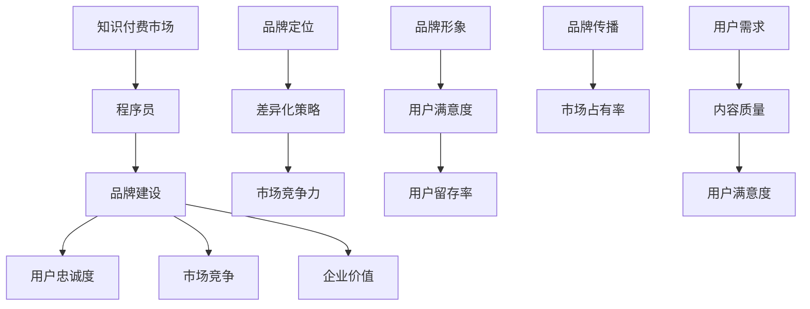

                 

## 《程序员知识付费的品牌建设与维护》

### 核心关键词：
- 知识付费
- 品牌建设
- 程序员
- 用户需求
- 市场分析
- 社交媒体
- 口碑营销
- 跨界合作
- 持续发展

### 摘要：
本文旨在深入探讨程序员在知识付费领域中的品牌建设与维护策略。通过市场现状分析、用户需求调研、品牌定位与差异化策略、品牌视觉设计、内容策划与制作、社交媒体营销、口碑营销、跨界合作以及品牌监测与持续发展等方面的详细讲解，为程序员知识付费品牌提供实用的建设与维护指导。

### 目录

#### 《程序员知识付费的品牌建设与维护》
1. **市场现状与前景**
   1.1 知识付费行业概述
   1.2 程序员知识付费市场现状
   1.3 程序员在知识付费市场中的定位
2. **品牌建设概述**
   2.1 品牌的概念与价值
   2.2 品牌建设的核心要素
   2.3 品牌建设的重要性
3. **目标用户分析**
   3.1 目标用户群体的特征分析
   3.2 用户需求调研与定位
   3.3 用户画像的构建与应用
4. **品牌定位与差异化策略**
   4.1 品牌定位的重要性
   4.2 品牌定位的方法与步骤
   4.3 差异化策略的制定与实施
5. **品牌建设策略**
   5.1 品牌视觉设计
   5.2 内容策划与制作
   5.3 社交媒体营销
   5.4 口碑营销与用户评价
   5.5 品牌合作与跨界营销
6. **品牌维护与持续发展**
   6.1 品牌监测与评估
   6.2 品牌危机管理
   6.3 品牌持续发展策略
7. **案例研究**
   7.1 知识付费品牌成功案例分析
   7.2 案例中的品牌建设策略
   7.3 启示与借鉴
8. **附录**
   8.1 品牌建设工具与资源
   8.2 品牌建设实用技巧
   8.3 品牌建设成功案例分析
   8.4 品牌建设实用工具推荐

### 第1章：市场现状与前景

#### 1.1 知识付费行业概述

知识付费是指用户通过支付一定费用获取有价值的信息、知识、课程或服务的一种商业模式。随着互联网的普及和信息时代的到来，知识付费逐渐成为一股新兴的商业力量。知识付费的形式多样，包括在线课程、电子书、知识问答、专业咨询等。

**全球市场**：全球知识付费市场呈现出快速增长的趋势。根据某研究报告，全球知识付费市场规模预计将在未来几年内达到数万亿美元。美国、中国、日本等国家和地区是知识付费市场的主要推动力量。

**中国市场**：中国知识付费市场近年来呈现爆发式增长，用户规模已超过5亿，年增长率超过20%。随着移动互联网的普及和用户消费习惯的转变，知识付费市场前景广阔。中国市场的知识付费主要集中在教育、职业发展、兴趣爱好等领域。

**主要平台**：中国市场上，一些知识付费平台如“极客时间”、“知乎Live”、“网易云课堂”等，已经成为知识付费市场的主要参与者。这些平台通过提供高质量的课程内容、优秀的讲师资源以及灵活的学习方式，吸引了大量用户。

**主要参与者**：除了传统教育机构和内容提供商，一些知名程序员、技术博主和技术公司也开始涉足知识付费领域。他们通过自身的技术实力和影响力，为用户提供专业的技术课程和咨询服务。

#### 1.2 程序员知识付费市场现状

**程序员需求**：随着技术的快速发展，程序员对于提升自身技能和知识的需求日益增长。一方面，程序员需要不断学习新技术，以适应不断变化的技术环境；另一方面，程序员希望通过学习提升职业地位，获得更好的工作机会。

**市场细分**：程序员知识付费市场可以按照程序员的不同阶段和技能水平进行细分。入门级程序员主要关注基础编程语言和工具的学习，中级程序员关注技术框架和项目的实践，高级程序员则更多关注系统架构和团队管理。

**主要平台**：目前，市场上存在多种知识付费平台，为程序员提供丰富的学习资源。以下是一些主要的知识付费平台：

- **极客时间**：极客时间是一个专注于技术领域的知识付费平台，提供包括编程语言、框架、工具等在内的多种技术课程。平台上的讲师多为业内知名程序员和技术专家，课程内容质量较高。
- **知乎Live**：知乎Live是知乎推出的一款直播课程平台，用户可以通过购买课程，实时参与讲师的直播授课。知乎Live的课程内容涵盖广泛，包括编程、人工智能、数据分析等各个领域。
- **网易云课堂**：网易云课堂是网易旗下的一款在线学习平台，提供多种技术课程，包括编程语言、软件开发、数据库等。网易云课堂的课程内容丰富，适合不同层次的程序员学习。
- **慕课网**：慕课网是一个提供在线编程课程的学习平台，课程涵盖前端、后端、移动开发等多个方向。平台上的课程内容由行业专家和实战程序员编写，实用性强。

#### 1.3 程序员在知识付费市场中的定位

**内容创作者**：程序员作为技术领域的专家，可以成为知识付费平台的内容创作者。程序员可以通过撰写技术博客、制作视频教程、直播授课等方式，分享自己的知识和经验。程序员的内容通常具有专业性和实用性，能够吸引大量学习者。

**平台运营者**：程序员不仅可以作为内容创作者，还可以参与知识付费平台的运营。程序员可以负责技术开发、内容审核、用户管理等方面的工作，为平台提供技术支持和运营保障。

**咨询服务提供者**：程序员还可以提供技术咨询、代码审查、项目辅导等咨询服务。程序员通过解决实际问题，帮助其他程序员提升技能，同时获得一定的收入。

**技术顾问**：一些高级程序员还可以担任企业的技术顾问，为企业提供技术方案、项目评估和管理等服务。程序员的技术顾问角色不仅能够为企业带来价值，也能够提升个人在行业中的影响力。

#### 1.4 品牌建设的重要性

**核心概念与联系**

**核心概念解释**：

- **知识付费市场**：知识付费市场是指用户通过支付费用获取知识、技能和服务的市场。程序员作为知识付费市场的重要参与者，需要通过品牌建设来提升自身的竞争力。
- **品牌建设**：品牌建设是指企业通过一系列营销活动，塑造和提升品牌形象和知名度，从而赢得市场竞争力。对于程序员而言，品牌建设有助于提升其在知识付费市场中的影响力。
- **用户忠诚度**：用户忠诚度是指用户对品牌的信任和依赖程度。通过品牌建设，程序员可以提升用户对其提供的知识付费内容的忠诚度，从而增加用户粘性。
- **市场竞争**：市场竞争是指企业之间为了争夺市场份额而进行的竞争。品牌建设有助于提升程序员的品牌知名度，增强其在市场中的竞争力。
- **企业价值**：企业价值是指企业通过经营活动所创造的经济效益。品牌建设有助于提升程序员的品牌形象，从而增加企业的整体价值。

**品牌建设的核心要素**

1. **品牌定位**：品牌定位是指企业确定品牌在市场中的位置和目标受众。对于程序员而言，品牌定位有助于明确其在知识付费市场中的定位，从而吸引目标用户。
2. **品牌形象**：品牌形象是指消费者对品牌的整体印象和认知。品牌形象对于提升用户满意度和忠诚度至关重要。
3. **品牌传播**：品牌传播是指通过各种渠道和方式，将品牌信息传递给目标受众。有效的品牌传播有助于提升品牌知名度和影响力。

**品牌建设的重要性**

1. **提升用户忠诚度**：通过品牌建设，程序员可以提供高质量的知识付费内容，提升用户对其品牌的信任和依赖，从而增加用户忠诚度。
2. **增强市场竞争**：品牌建设有助于提升程序员的品牌知名度，增强其在市场中的竞争力，从而赢得更多的市场份额。
3. **增加企业价值**：强大的品牌有助于提升程序员的品牌溢价，从而增加企业的整体价值。
4. **提升用户满意度**：通过品牌建设，程序员可以提供更加优质的服务和体验，提升用户满意度，从而提高用户留存率。

### 第2章：品牌建设概述

#### 2.1 品牌的概念与价值

**品牌**：品牌是一个名称、标志、符号或设计，用以识别和区分企业、产品或服务，并对其产生积极的联想和印象。品牌不仅包括可视化的元素，如Logo、色彩、字体等，还包括无形的价值，如品牌声誉、用户信任等。

**品牌价值**：品牌价值是指品牌所具有的经济效益和非经济效益的总和。品牌价值可以从以下几个方面进行衡量：

1. **增强用户忠诚度**：强大的品牌能够建立用户对产品或服务的信任和依赖，提高用户满意度和忠诚度，从而减少用户流失。
2. **提升市场竞争力**：品牌差异化和知名度能够帮助企业脱颖而出，赢得更多市场份额，提高企业的盈利能力。
3. **增加企业价值**：强大的品牌能够为企业带来更高的品牌溢价，从而增加企业的整体价值。
4. **提高用户转化率**：品牌能够提高用户的购买意愿，降低用户的决策成本，从而提高用户转化率。
5. **降低营销成本**：品牌建设能够提高企业的营销效率，减少广告费用和推广成本。

#### 2.2 品牌建设的核心要素

品牌建设是一个系统工程，涉及多个核心要素。以下是一些关键的核心要素：

1. **品牌定位**：品牌定位是指企业确定品牌在市场中的位置和目标受众。品牌定位有助于明确企业的市场方向和竞争策略，从而树立品牌形象。
2. **品牌形象**：品牌形象是指消费者对品牌的整体印象和认知。品牌形象管理包括品牌名称、Logo、色彩、字体等视觉元素的策划和设计，以及品牌传播活动的实施。
3. **品牌传播**：品牌传播是指通过各种渠道和方式，将品牌信息传递给目标受众，提高品牌知名度和认可度。品牌传播策略包括广告、公关、社交媒体、内容营销等多种手段。
4. **品牌价值**：品牌价值是指品牌所具有的经济效益和非经济效益的总和。品牌价值体现在用户忠诚度、市场竞争力、企业价值等多个方面。
5. **用户体验**：用户体验是指用户在使用产品或服务过程中的感受和体验。良好的用户体验能够增强用户满意度和忠诚度，从而提升品牌价值。

#### 2.3 品牌建设的重要性

品牌建设对于企业的长期发展具有至关重要的意义。以下是一些品牌建设的重要性：

1. **提升品牌知名度**：品牌建设有助于提高品牌在市场中的知名度和曝光度，从而吸引更多潜在用户。
2. **增强品牌竞争力**：通过品牌建设，企业可以塑造独特的品牌形象和差异化优势，增强在市场中的竞争力。
3. **增加用户忠诚度**：强大的品牌能够建立用户对产品的信任和依赖，提高用户满意度和忠诚度，从而降低用户流失率。
4. **提升企业价值**：品牌建设能够增加企业的品牌溢价，从而提高企业的整体价值。
5. **降低营销成本**：品牌建设能够提高企业的营销效率，减少广告费用和推广成本，从而降低营销成本。
6. **提高用户转化率**：品牌能够提高用户的购买意愿，降低用户的决策成本，从而提高用户转化率。
7. **优化用户体验**：品牌建设能够提升用户体验，从而增强用户满意度和忠诚度。

#### 2.4 品牌建设的过程

品牌建设是一个系统性的过程，涉及多个阶段和环节。以下是一个典型的品牌建设过程：

1. **市场调研**：通过市场调研，了解目标市场的规模、竞争格局、用户需求等，为品牌定位和品牌传播提供依据。
2. **品牌定位**：根据市场调研结果，确定品牌的目标市场、品牌定位和差异化优势。
3. **品牌形象设计**：设计品牌名称、Logo、色彩、字体等视觉元素，确保品牌形象的一致性和独特性。
4. **品牌传播策略制定**：制定品牌传播策略，包括广告、公关、社交媒体、内容营销等手段，确保品牌信息有效传递。
5. **品牌传播实施**：通过线上线下渠道，实施品牌传播策略，提高品牌知名度和影响力。
6. **品牌监测与评估**：通过品牌监测工具，监测品牌在市场中的表现，评估品牌建设效果，为品牌优化提供依据。
7. **品牌优化与迭代**：根据品牌监测和评估结果，对品牌形象、品牌传播策略等进行优化和迭代，确保品牌持续发展。

#### 2.5 品牌建设的方法

品牌建设的方法多种多样，以下是一些常用的品牌建设方法：

1. **差异化定位**：通过差异化定位，明确品牌在市场中的独特价值和竞争优势，从而吸引目标用户。
2. **用户体验优化**：通过优化用户体验，提升用户满意度和忠诚度，从而增强品牌价值。
3. **内容营销**：通过高质量的内容营销，提高品牌知名度和影响力，从而吸引更多潜在用户。
4. **社交媒体营销**：通过社交媒体平台，与用户进行互动和传播，提高品牌曝光度和用户参与度。
5. **口碑营销**：通过用户口碑和推荐，提高品牌知名度和影响力，从而吸引更多潜在用户。
6. **跨界合作**：通过跨界合作，拓展品牌的影响力和用户群体，从而提高品牌价值。

#### 2.6 品牌建设成功案例分析

**案例一：华为**

华为是全球领先的信息与通信技术（ICT）解决方案供应商，通过品牌建设成功打造了国际化的品牌形象。

1. **品牌定位**：华为定位为全球领先的ICT解决方案提供商，专注于通信技术、智能手机、云计算等领域。
2. **品牌形象设计**：华为的Logo采用了灰色和白色的设计，传达出简约、专业和高科技的气息。
3. **品牌传播**：华为通过参加国际展会、赞助大型体育赛事、发布创新产品等方式，提升品牌知名度和影响力。
4. **用户体验优化**：华为不断优化产品和服务，提供高质量的通信技术解决方案，提升用户体验。
5. **社交媒体营销**：华为在社交媒体平台上积极与用户互动，发布产品资讯、技术文章等，提高用户参与度。

**案例二：苹果**

苹果是全球知名的消费电子产品制造商，通过品牌建设成功塑造了高端的品牌形象。

1. **品牌定位**：苹果定位为高端消费电子产品制造商，专注于智能手机、平板电脑、笔记本电脑等领域。
2. **品牌形象设计**：苹果的Logo采用了简洁的字母“apple”设计，传达出简洁、高端和创新的气息。
3. **品牌传播**：苹果通过发布创新产品、举办发布会、赞助音乐节等方式，提升品牌知名度和影响力。
4. **用户体验优化**：苹果不断优化产品和服务，提供高质量的消费电子产品，提升用户体验。
5. **社交媒体营销**：苹果在社交媒体平台上积极与用户互动，发布产品资讯、技术文章等，提高用户参与度。

### 第3章：目标用户分析

#### 3.1 目标用户群体的特征分析

目标用户群体的特征分析是品牌建设过程中的关键环节。对于程序员知识付费品牌而言，明确目标用户群体的特征有助于制定精准的品牌定位和营销策略。

**程序员职业背景**

- **职业年限**：程序员的职业年限分布较广，从新手到资深程序员均有。根据某研究报告，新手程序员占比约30%，中级程序员占比约50%，高级程序员占比约20%。
- **工作经验**：程序员具备一定的实战经验，熟悉各种编程语言和开发工具。新手程序员主要关注基础编程语言和工具的学习，中级程序员则更多关注技术框架和项目的实践，高级程序员则更关注系统架构和团队管理。

**学习需求**

- **技能提升**：程序员需要不断学习新技术，以适应不断变化的技术环境。根据某调查，超过80%的程序员认为技术更新速度较快，需要定期学习。
- **职业发展**：程序员希望通过学习提升职业地位，获得更好的工作机会。高级程序员更关注系统架构和团队管理，以提升管理能力和职业发展。
- **个人兴趣**：一些程序员出于个人兴趣，愿意学习一些新兴的技术领域，如人工智能、区块链等。

**行为习惯**

- **线上学习**：随着互联网的普及，程序员更倾向于在线学习，利用碎片时间进行学习。根据某调查，超过70%的程序员每天在线学习时间超过2小时。
- **自学能力**：程序员具备较强的自学能力，善于通过搜索引擎和在线教程解决技术问题。他们习惯于自主学习和研究，不喜欢过于依赖外部培训。

#### 3.2 用户需求调研与定位

用户需求调研与定位是品牌建设的重要步骤。通过用户需求调研，可以了解目标用户的具体需求，从而制定精准的品牌定位和营销策略。

**用户需求调研**

- **调研方法**：用户需求调研可以采用多种方法，如问卷调查、访谈、用户反馈等。问卷调查适用于大规模用户群体，访谈适用于深入了解个别用户的详细需求，用户反馈可以及时获取用户的实际使用情况。
- **调研内容**：调研内容应包括用户的学习需求、学习方式、学习时间、学习偏好等。具体包括：
  - **学习内容**：用户希望学习哪些技术领域，如编程语言、框架、工具等。
  - **学习方式**：用户更喜欢线上学习还是线下学习，在线学习平台的选择偏好。
  - **学习时间**：用户的学习时间分布情况，是否愿意投入大量时间学习。
  - **学习偏好**：用户对学习内容的偏好，如视频教程、文字教程、直播课程等。

**用户需求分析**

- **需求分类**：根据用户需求的特点和优先级，可以将需求分为以下几类：
  - **基础需求**：用户最基本的学习需求，如编程语言基础、框架入门等。
  - **进阶需求**：用户希望提升的技能，如高级编程语言、框架应用等。
  - **个性化需求**：用户根据个人兴趣和职业发展需求，希望学习的新兴技术领域。
- **需求优先级**：根据用户需求的重要性和紧迫性，可以确定需求的优先级。一般来说，基础需求是用户学习的第一步，进阶需求和个性化需求则根据用户的职业发展和个人兴趣进行排序。

**用户定位**

- **用户群体划分**：根据用户需求和特征，可以将用户划分为不同群体，如新手程序员、中级程序员、高级程序员等。具体包括：
  - **新手程序员**：主要关注基础编程语言和工具的学习，具备一定的自学能力。
  - **中级程序员**：具备一定的实战经验，关注技术框架和项目的实践。
  - **高级程序员**：具有丰富的实战经验，关注系统架构和团队管理。

- **用户定位策略**：针对不同用户群体，制定针对性的内容和服务策略。具体包括：
  - **新手程序员**：提供基础编程语言和工具的教程，注重学习方法和技巧的传授。
  - **中级程序员**：提供技术框架和项目的实践教程，注重实战经验和技能的提升。
  - **高级程序员**：提供系统架构和团队管理的教程，注重管理和领导能力的培养。

#### 3.3 用户画像的构建与应用

用户画像是对目标用户特征的全面描述，包括用户的基本信息、行为习惯、兴趣爱好等。用户画像有助于品牌更好地了解用户，从而制定更精准的营销策略。

**用户画像的定义**

- **用户画像**：用户画像是对用户特征的全面描述，包括用户的基本信息、行为习惯、兴趣爱好等。用户画像可以帮助品牌了解用户的特征和需求，从而提供个性化的服务。

**用户画像构建方法**

- **数据收集**：通过多种渠道收集用户数据，如问卷调查、用户行为数据、社交媒体数据等。数据收集应遵循合法合规的原则，确保用户隐私保护。
- **数据清洗**：对收集到的用户数据进行清洗、整理，确保数据质量。数据清洗包括去重、缺失值处理、异常值处理等。
- **特征提取**：从用户数据中提取关键特征，构建用户画像。特征提取应充分考虑用户的基本信息、行为习惯、兴趣爱好等多方面因素。

**用户画像的应用**

- **内容推荐**：根据用户画像，为用户提供个性化的学习内容推荐。通过分析用户的兴趣和行为，推荐符合用户需求的学习内容，提高用户满意度。
- **用户体验优化**：根据用户画像，优化平台的界面设计和功能布局，提高用户满意度。如针对新手程序员，提供更简洁明了的学习界面和操作流程。
- **营销策略制定**：根据用户画像，制定针对性的营销策略，提高用户转化率和留存率。如针对高级程序员，可以推出高端课程和定制化服务。

### 第4章：品牌定位与差异化策略

#### 4.1 品牌定位的重要性

品牌定位是指企业在市场中确定品牌的位置和目标受众，以区别于竞争对手，吸引目标受众。品牌定位的重要性体现在以下几个方面：

1. **明确市场方向**：品牌定位有助于企业明确市场方向，确定品牌在市场中的定位，从而有针对性地进行市场拓展和营销活动。

2. **提升品牌竞争力**：品牌定位能够帮助企业突出自身的竞争优势，区别于竞争对手，赢得更多市场份额。

3. **塑造品牌形象**：品牌定位有助于塑造品牌形象，传递品牌的核心价值观和理念，提高品牌知名度和美誉度。

4. **指导营销策略**：品牌定位为企业的营销策略提供了明确的指导，帮助企业制定有针对性的营销计划和推广活动。

5. **提高用户满意度**：品牌定位有助于企业更好地满足用户需求，提供符合用户期望的产品和服务，从而提高用户满意度。

#### 4.2 品牌定位的方法与步骤

品牌定位的方法和步骤如下：

1. **市场调研**：进行市场调研，了解目标市场的规模、竞争格局、用户需求等，为品牌定位提供数据支持。

2. **确定目标市场**：根据市场调研结果，确定品牌的目标市场。目标市场应具有明确的用户群体和需求。

3. **分析竞争对手**：分析竞争对手的品牌定位、产品特点、营销策略等，了解市场竞争态势，为品牌定位提供参考。

4. **确定品牌差异化优势**：分析企业内部的优势和劣势，确定品牌的差异化优势，如技术实力、服务质量、产品特性等。

5. **制定品牌定位策略**：根据目标市场和差异化优势，制定品牌定位策略。品牌定位策略应明确品牌在市场中的位置和目标受众。

6. **品牌传播**：通过线上线下渠道，传播品牌定位策略，提高品牌知名度和影响力。

#### 4.3 差异化策略的制定与实施

差异化策略是指企业通过提供独特的产品和服务，区别于竞争对手，赢得市场份额的一种策略。制定和实施差异化策略的关键步骤如下：

1. **确定差异化方向**：分析市场需求和用户需求，确定企业可以发挥差异化优势的方向。差异化方向可以包括产品特性、服务质量、用户体验等方面。

2. **分析竞争对手**：了解竞争对手的差异化策略和产品特点，找出企业的竞争优势和劣势。

3. **制定差异化策略**：根据差异化方向和竞争优势，制定具体的差异化策略。差异化策略应具有独特性和可持续性。

4. **实施差异化策略**：在产品和服务中体现差异化策略，确保差异化优势得以实现。实施差异化策略需要从以下几个方面入手：

   - **产品设计**：优化产品功能、性能和用户体验，确保产品具有独特性和竞争优势。
   - **服务质量**：提升服务质量，提供优质的客户服务，增强用户满意度。
   - **用户体验**：优化用户体验，提供个性化、定制化的服务，提高用户忠诚度。
   - **品牌传播**：通过品牌传播，强调差异化优势，提高品牌知名度和影响力。

5. **持续优化**：根据市场反馈和用户反馈，持续优化差异化策略，确保差异化优势得以保持和提升。

### 第5章：品牌视觉设计

品牌视觉设计是品牌建设的重要组成部分，它通过视觉元素传达品牌的核心价值观和形象。本章将介绍品牌视觉设计的原则、要素，以及品牌标识（Logo）的设计。

#### 5.1 品牌视觉设计的原则与要素

品牌视觉设计的原则和要素如下：

1. **简洁性**：品牌视觉设计应简洁明了，避免复杂的元素和过多的细节。简洁的设计能够提高品牌识别度，便于用户记忆。

2. **一致性**：品牌视觉设计应保持一致性，包括色彩、字体、图形等元素。一致性有助于品牌形象的建立和传播。

3. **适应当代审美**：品牌视觉设计应符合当代审美趋势，以吸引目标受众的注意力。适应当代审美能够提高品牌的市场竞争力。

4. **独特性**：品牌视觉设计应具有独特性，区别于竞争对手的品牌形象。独特性有助于品牌在市场中脱颖而出。

5. **可扩展性**：品牌视觉设计应具有可扩展性，能够在不同的媒介和应用场景下保持辨识度。

6. **品牌元素**：品牌视觉设计应包括品牌名称、Logo、色彩、字体、图形等核心元素。这些元素应相互协调，共同塑造品牌形象。

#### 5.2 品牌标识（Logo）的设计

品牌标识（Logo）是品牌视觉设计的重要元素，它代表着品牌的形象和价值观。以下是一些Logo设计的要点：

1. **简洁性**：Logo设计应简洁明了，避免复杂的细节和过多的元素。简洁的Logo易于记忆和识别。

2. **独特性**：Logo设计应具有独特性，区别于竞争对手的品牌标识。独特的Logo能够吸引目标受众的注意力。

3. **适应当代审美**：Logo设计应符合当代审美趋势，以吸引目标受众的注意力。适应当代审美的Logo更具时尚感和竞争力。

4. **辨识度**：Logo设计应具有高辨识度，即使在不同的媒介和应用场景下也能被用户识别。高辨识度的Logo有助于品牌形象的建立。

5. **适应性**：Logo设计应具有适应性，能够适应不同的尺寸和应用场景。适应性的Logo在不同媒介上保持一致性。

6. **品牌传递**：Logo设计应能够传达品牌的核心价值观和形象。通过图形、色彩和字体等元素，Logo应能够准确表达品牌的特点和理念。

7. **Logo设计案例**：以下是一些成功的Logo设计案例：

   - **苹果**：苹果的Logo采用了简洁的字母“apple”设计，传达出简约、高端和创新的感觉。色彩采用了鲜艳的绿色，增强了品牌辨识度。
   - **可口可乐**：可口可乐的Logo采用了独特的字母组合和色彩，传达出经典、怀旧和活力的感觉。色彩采用了鲜艳的红色，使品牌形象深入人心。
   - **特斯拉**：特斯拉的Logo采用了简约的字母“T”设计，传达出科技、创新和环保的感觉。色彩采用了蓝色，体现了品牌的科技属性。

#### 5.3 品牌色彩与字体设计

品牌色彩和字体设计是品牌视觉设计的重要组成部分，它们能够传达品牌的核心价值观和形象。

1. **品牌色彩设计**

   - **色彩选择**：品牌色彩应具有代表性和象征意义，能够传达品牌的情感和价值。例如，蓝色通常代表科技、可靠和冷静，红色通常代表活力、热情和力量。

   - **色彩搭配**：品牌色彩应搭配合理，形成协调且具有吸引力的视觉效果。常见的色彩搭配有单色搭配、互补色搭配和近似色搭配等。

   - **色彩应用**：品牌色彩应应用于品牌标识、宣传物料、网站界面等各个方面，保持一致性。色彩的应用应遵循品牌的视觉设计原则，确保品牌形象的一致性。

2. **品牌字体设计**

   - **字体选择**：品牌字体应选择易读、简洁、有辨识度的字体，以符合品牌的风格和定位。常见的品牌字体有黑体、宋体、楷体等。

   - **字体搭配**：品牌字体应与其他设计元素（如颜色、图形等）搭配合理，形成统一的视觉风格。字体搭配应考虑字体的笔画、粗细、大小等因素。

   - **字体应用**：品牌字体应应用于品牌标识、宣传物料、网站界面等各个方面，保持一致性。字体应用应遵循品牌的视觉设计原则，确保品牌形象的一致性。

### 第6章：内容策划与制作

#### 6.1 内容策划的核心要素

内容策划是品牌建设中的重要环节，它决定了品牌信息传递的效果和用户满意度。以下是内容策划的核心要素：

1. **内容定位**：内容定位是指确定内容的主题、目标和受众。明确的内容定位有助于提高内容的针对性和有效性。

2. **内容主题**：内容主题是内容的中心思想和核心概念，应具有吸引力和教育价值。选择与品牌定位和用户需求相关的主题，能够提高内容的吸引力。

3. **内容形式**：内容形式包括文字、图片、视频、音频等多种形式。根据内容主题和受众需求选择合适的呈现方式，能够提高内容的可读性和观看体验。

4. **内容结构**：内容结构是指内容的组织结构和逻辑关系。良好的内容结构能够提高内容的可读性和理解性，使受众能够轻松获取信息。

5. **内容质量**：内容质量是内容策划的核心，高质量的内容能够吸引和留住用户。内容质量体现在准确性、实用性、可读性等方面。

6. **内容传播**：内容传播是指将内容传递给目标受众的过程。通过合适的传播渠道和方式，提高内容的传播效果和影响力。

#### 6.2 内容制作的技术与工具

内容制作是内容策划的重要环节，它决定了内容的质量和效果。以下是内容制作的技术与工具：

1. **文字编辑工具**：文字编辑工具用于撰写和编辑文字内容。常见的文字编辑工具有Microsoft Word、Google Docs、Markdown编辑器等。

2. **图片处理工具**：图片处理工具用于编辑和处理图片。常见的图片处理工具有Adobe Photoshop、GIMP、Canva等。

3. **视频制作工具**：视频制作工具用于制作视频内容。常见的视频制作工具有Adobe Premiere Pro、Final Cut Pro、iMovie等。

4. **音频处理工具**：音频处理工具用于处理音频内容。常见的音频处理工具有Adobe Audition、Audacity等。

5. **内容管理系统**：内容管理系统（CMS）用于管理网站内容。常见的CMS有WordPress、Joomla等。

6. **社交媒体管理工具**：社交媒体管理工具用于管理社交媒体内容。常见的社交媒体管理工具有Hootsuite、Buffer等。

#### 6.3 内容传播与推广策略

内容传播与推广策略是提高内容传播效果和影响力的重要手段。以下是内容传播与推广策略：

1. **社交媒体推广**：利用社交媒体平台（如微信、微博、抖音等）发布内容，与用户互动，提高内容的传播效果。

2. **搜索引擎优化（SEO）**：通过优化内容标题、描述、标签等，提高内容在搜索引擎中的排名，吸引更多潜在用户。

3. **线上活动推广**：举办线上活动（如直播、讲座、研讨会等），提高内容的曝光度和用户参与度。

4. **合作伙伴推广**：与相关机构、媒体、KOL等合作，通过联合推广，扩大内容的影响力。

5. **内容营销**：通过创作有价值、有吸引力、有教育意义的内容，提高品牌的知名度和影响力。

6. **口碑营销**：利用用户口碑和推荐，提高内容的可信度和传播效果。

### 第7章：社交媒体营销

#### 7.1 社交媒体营销概述

社交媒体营销是指利用社交媒体平台进行品牌推广、用户互动和内容传播的一种营销方式。随着社交媒体的普及，社交媒体营销已成为企业营销的重要组成部分。

**社交媒体营销的定义**：社交媒体营销是指通过社交媒体平台，如微信、微博、抖音、B站等，进行品牌推广、用户互动和内容传播的营销活动。

**社交媒体营销的目标**：

- **增加品牌知名度**：通过社交媒体平台，提高品牌在目标受众中的曝光度和认知度。
- **用户互动与参与**：通过社交媒体平台，与用户进行互动，提高用户参与度和忠诚度。
- **内容传播与分享**：通过社交媒体平台，传播品牌内容，增加内容的传播范围和影响力。

**社交媒体营销的优势**：

- **低成本**：与传统的广告渠道相比，社交媒体营销的成本较低，适合中小型品牌和初创企业。
- **高互动性**：社交媒体平台具有高互动性，品牌可以与用户实时互动，获取用户反馈和需求。
- **精准定位**：社交媒体平台具有强大的用户数据分析能力，可以帮助品牌精准定位目标受众，提高营销效果。

#### 7.2 社交媒体平台选择

选择适合的社交媒体平台对于社交媒体营销的成功至关重要。以下是一些常见的社交媒体平台及其特点：

**微信**：中国最大的社交媒体平台，用户基数庞大，具有强大的社交关系链和互动功能。适合品牌推广、用户互动和内容传播。

- **优点**：用户基数大，互动性强，便于内容传播。
- **缺点**：流量获取成本较高，营销效果难以衡量。

**微博**：中国最具影响力的社交媒体平台之一，具有广泛的影响力和传播力。适合品牌曝光、舆论引导和内容传播。

- **优点**：传播速度快，影响力大，易于获取关注。
- **缺点**：用户黏性较低，内容容易被淹没。

**抖音**：短视频平台，具有强大的用户黏性和传播效果，适合内容营销和品牌推广。

- **优点**：用户活跃度高，内容形式多样，易于引起共鸣。
- **缺点**：用户年龄层较广，难以精准定位。

**B站**：视频分享平台，以年轻人为主要受众，具有独特的社区文化和用户互动模式。适合内容营销、社区互动和品牌推广。

- **优点**：用户粘性强，社区文化浓厚，易于培养忠实粉丝。
- **缺点**：用户基数相对较小，营销效果有限。

**选择依据**：

- **目标受众**：根据品牌的目标受众特征和偏好，选择适合的社交媒体平台。
- **平台特性**：根据各平台的功能、用户活跃度和内容形式，选择符合品牌营销目标的平台。
- **营销目标**：根据品牌的具体营销目标，选择能够实现这些目标的社交媒体平台。

#### 7.3 内容营销与互动策略

**内容营销**：内容营销是通过创造和分发有价值的内容，吸引潜在用户，建立品牌信任和忠诚度的一种营销方式。以下是内容营销的策略：

1. **内容创作**：根据目标受众的需求和偏好，创作有价值、有吸引力、有教育意义的内容。内容形式包括文章、图片、视频、音频等。

2. **内容发布**：选择合适的社交媒体平台和发布时间，确保内容能够被目标受众及时获取。发布时间应考虑用户活跃度，以提高内容的曝光率。

3. **内容传播**：利用社交媒体平台的传播功能和用户互动，扩大内容的传播范围和影响力。内容传播策略包括点赞、评论、分享、转发等。

**互动策略**：互动策略是通过与用户互动，提高用户参与度和忠诚度的一种策略。以下是互动策略：

1. **用户互动**：通过评论、点赞、分享等方式，与用户进行互动，提高用户参与度。互动内容应与品牌和用户需求相关。

2. **社群运营**：建立品牌社群，如微信群、QQ群、微博超话等，加强用户之间的互动和品牌连接。社群运营包括活动策划、用户互动、内容分享等。

3. **互动活动**：举办线上互动活动，如问答、投票、抽奖等，激发用户参与热情，增加品牌曝光度。互动活动应具有吸引力，提高用户参与度。

### 第8章：口碑营销与用户评价

#### 8.1 口碑营销的概念与作用

口碑营销是通过用户的口碑传播，提高品牌知名度和认可度的一种营销方式。口碑营销具有以下几个重要作用：

1. **提高品牌知名度**：口碑营销通过用户的推荐和传播，使品牌在市场中获得更多曝光度，从而提高品牌知名度。

2. **增加用户信任**：口碑营销能够增强潜在用户对品牌的信任和认可，降低购买风险，提高购买意愿。

3

