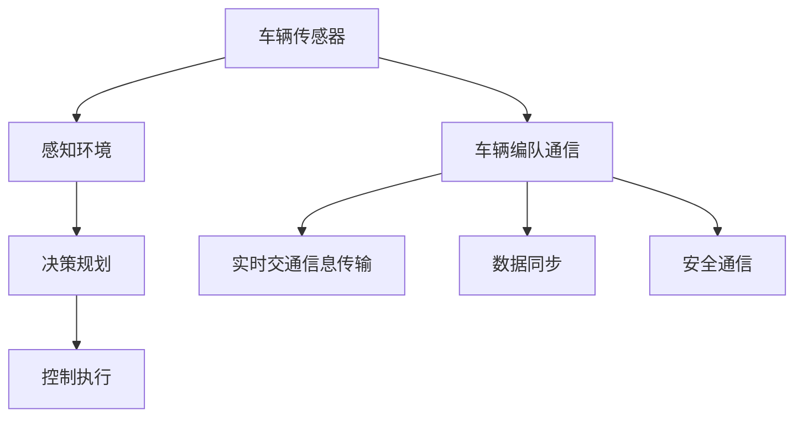

                 

### 第1章：自动驾驶与车辆编队通信概述

#### 1.1 自动驾驶技术发展现状与趋势

自动驾驶技术是人工智能领域的一个重要分支，随着科技的不断进步，自动驾驶技术正逐步从理论走向实际应用。自动驾驶技术的等级分类，通常根据SAE（美国汽车工程师协会）的标准，分为L0到L5六个等级。

- **L0：无自动化** - 所有驾驶操作由人类驾驶员完成。
- **L1：部分自动化** - 如自适应巡航控制和车道保持辅助系统，其中一项功能由自动驾驶系统控制。
- **L2：部分自动化** - 两个或两个以上的驾驶操作可同时由自动驾驶系统控制。
- **L3：有条件自动化** - 自动驾驶系统可以在特定条件下完全控制车辆，但驾驶员必须随时准备接管控制。
- **L4：高度自动化** - 在特定环境下，自动驾驶系统可以完全控制车辆，无需人类驾驶员干预。
- **L5：完全自动化** - 在所有交通和环境中，自动驾驶系统可以完全控制车辆，无需人类驾驶员。

自动驾驶技术的核心包括感知环境、决策规划、精准定位和控制执行等几个方面。感知环境是通过车载传感器如雷达、激光雷达（LiDAR）、摄像头等来获取周围环境的信息。决策规划则是在感知到的环境中，通过算法生成驾驶策略。精准定位是通过GPS、惯性测量单元（IMU）等技术实现车辆的精确定位。控制执行是将规划好的策略转化为实际驾驶操作，包括加速、转向和制动等。

车辆编队通信在自动驾驶技术中扮演着重要角色。它通过车与车（V2V）和车与基础设施（V2I）之间的通信，实现信息的共享和协调，从而提高交通效率和安全性。车辆编队通信的意义在于：

- **提高交通效率**：通过车队协调行驶，可以减少车辆间的距离，从而减少制动和加速的次数，降低能耗，减少交通拥堵。
- **提高安全性**：通过实时通信，车辆可以提前预判危险情况，及时采取避让措施，减少交通事故。
- **减少能耗**：编队行驶可以降低空气阻力，减少车辆能耗。

在了解自动驾驶技术和车辆编队通信的基础上，我们接下来将深入探讨车辆编队通信的基本原理和安全需求。

#### 1.2 车辆编队通信的基本原理

车辆编队通信是指车辆之间通过无线通信技术进行信息交换和共享，以实现协同驾驶和控制。车辆编队通信的基本原理包括通信架构、通信协议和关键技术。

**1.2.1 车辆编队通信架构**

车辆编队通信的架构可以分为三个层次：感知层、通信层和应用层。

- **感知层**：包括车辆上的各类传感器，如雷达、激光雷达（LiDAR）、摄像头等，用于感知周围环境。
- **通信层**：负责车辆之间的信息传输，包括V2V（车对车）通信和V2I（车对基础设施）通信。V2V通信通过专用短程通信（DSRC）或蜂窝网络实现，而V2I通信则通过专用基础设施或现有的无线网络实现。
- **应用层**：基于通信层提供的信息，实现车辆间的协调和控制，如车辆编队行驶、交通流量优化等。

**1.2.2 车辆编队通信协议**

车辆编队通信的协议主要包括通信协议和数据同步协议。

- **通信协议**：如DSRC、Wi-Fi、蜂窝网络等，用于实现车辆之间的数据传输。DSRC是一种基于RFID技术的通信协议，具有高速、低延迟的特点。蜂窝网络则利用现有的4G或5G网络进行通信，具有广泛覆盖的特点。
- **数据同步协议**：用于确保车辆之间的信息同步，如时间同步和位置同步。时间同步确保车辆之间的通信具有统一的时间基准，位置同步确保车辆之间的位置信息准确无误。

**1.2.3 车辆编队通信中的关键技术**

车辆编队通信中的关键技术包括通信延迟控制、数据完整性和数据保密性保障。

- **通信延迟控制**：由于车辆编队通信需要实时传输大量数据，因此通信延迟是一个关键问题。为了降低通信延迟，可以采用以下技术：
  - **实时通信协议**：如CAN总线、LIN总线等，具有低延迟的特点。
  - **优先级调度**：将关键数据分配较高的优先级，确保其快速传输。
  - **数据压缩**：通过数据压缩减少传输数据量，降低通信延迟。
- **数据完整性保障**：为了保证通信数据的完整性，可以采用以下技术：
  - **校验和**：对传输数据添加校验和，接收方通过校验和验证数据的完整性。
  - **纠错编码**：如Reed-Solomon编码，可以在传输过程中纠正一定数量的错误。
- **数据保密性保障**：为了保障通信数据的保密性，可以采用以下技术：
  - **加密技术**：如对称加密、非对称加密等，确保通信数据在传输过程中不被窃听。
  - **身份认证**：通过数字证书等身份认证技术，确保通信双方的真实身份。

在了解了车辆编队通信的基本原理后，我们将进一步探讨车辆编队通信的安全需求，以确保通信过程的可靠性和安全性。

#### 1.3 车辆编队通信安全需求

在车辆编队通信中，安全需求是至关重要的，因为通信的可靠性、数据完整性和保密性直接影响到整个系统的运行效果。以下是车辆编队通信的主要安全需求：

**1.3.1 通信安全的重要性**

车辆编队通信涉及大量敏感信息，如车辆位置、速度、加速度等，这些信息一旦泄露或被篡改，可能导致严重的安全事故。因此，确保通信的安全性至关重要。

- **防止恶意攻击**：恶意攻击可能来自外部黑客或内部恶意用户，他们可能试图篡改通信数据、窃取敏感信息或破坏系统的正常运行。
- **保护用户隐私**：车辆编队通信需要共享大量用户个人信息，如车辆位置、行驶路线等，这些信息如果被泄露，可能导致用户隐私泄露。

**1.3.2 安全需求分析**

为了确保车辆编队通信的安全，需要从多个方面进行安全需求分析：

- **通信延迟容忍度**：车辆编队通信要求通信延迟尽可能低，因为延迟可能导致车辆反应不及时，从而影响驾驶安全。因此，系统需要具备低延迟的特性。
- **通信可靠性**：车辆编队通信要求通信过程具有高可靠性，即数据传输过程中不能出现大量的丢包或错误。为此，可以采用错误检测和纠正技术，如校验和、纠错编码等。
- **数据完整性**：确保传输数据在传输过程中不被篡改，这是车辆编队通信的基本要求。可以通过加密技术、数字签名等方式来实现。
- **数据保密性**：保护传输数据的隐私，防止被未授权用户窃听或读取。可以采用对称加密、非对称加密等加密技术来实现。
- **身份认证**：确保通信双方的身份真实可靠，防止假冒身份进行通信。可以通过数字证书、身份认证协议等方式来实现。

通过上述分析，我们可以看出，车辆编队通信的安全需求涵盖了多个方面，包括通信延迟、可靠性、完整性和保密性。接下来，我们将进一步探讨如何实现这些安全需求。

---

### Mermaid 流程图：车辆编队通信架构



这个流程图展示了车辆编队通信的基本架构，从车辆传感器开始，经过感知环境、决策规划和控制执行，最终通过车辆编队通信模块实现实时交通信息传输、数据同步和安全通信。每个模块都扮演着关键角色，确保车辆编队通信的可靠性和安全性。

---

### 第2章：加密技术

加密技术是保障数据安全和隐私的重要手段，在车辆编队通信中尤其重要。加密技术可以分为对称加密、非对称加密和哈希算法。本章将详细介绍这三种加密技术的工作原理和应用。

#### 2.1 对称加密算法

对称加密算法是指加密和解密使用相同的密钥。这种加密方式速度快，适用于对大量数据进行加密。常见的对称加密算法包括DES、AES等。

**2.1.1 DES加密算法**

DES（Data Encryption Standard）是一种经典的对称加密算法，其密钥长度为56位。DES加密算法的工作原理如下：

1. **密钥生成**：生成一个56位的密钥。
2. **初始置换（IP）**：将原始数据按照特定的规则进行置换。
3. **16轮加密**：每轮加密包括置换、替换和压缩三个步骤：
   - **置换**：将数据分成两部分，对每部分进行置换。
   - **替换**：将每一部分的数据替换成另一个值。
   - **压缩**：将两个部分合并成一个新的值。
4. **最终置换（FP）**：将加密后的数据再次进行置换。

**伪代码实现**：

```plaintext
DES_Encrypt(plaintext, key):
    // 初始置换
    plaintext = IP(plaintext)
    for i from 1 to 16:
        // 置换、替换和压缩
        ciphertext = Round(plaintext, key[i])
    // 最终置换
    ciphertext = FP(ciphertext)
    return ciphertext

DES_Decrypt(ciphertext, key):
    // 初始置换
    ciphertext = IP(ciphertext)
    for i from 1 to 16:
        // 置换、替换和压缩
        plaintext = RoundInverse(ciphertext, key[17-i])
    // 最终置换
    plaintext = FP(plaintext)
    return plaintext
```

**2.1.2 AES加密算法**

AES（Advanced Encryption Standard）是对DES的改进，其密钥长度可选为128、192或256位。AES加密算法的工作原理如下：

1. **密钥扩展**：根据输入的密钥生成多个子密钥。
2. **初始置换（IP）**：将原始数据按照特定的规则进行置换。
3. **若干轮加密**：每轮加密包括变换、混淆和扩展三个步骤：
   - **变换**：将数据分为若干块，对每块进行变换。
   - **混淆**：通过替换字节、行移位和列混淆来增加数据的混乱程度。
   - **扩展**：对数据块进行扩展。
4. **最终置换（FP）**：将加密后的数据再次进行置换。

**伪代码实现**（简化版）：

```plaintext
AES_Encrypt(plaintext, key):
    // 密钥扩展
    keys = KeyExpansion(key)
    // 初始置换
    plaintext = IP(plaintext)
    for i from 1 to NUM_ROUNDS:
        // 变换、混淆和扩展
        plaintext = Round(plaintext, keys[i])
    // 最终置换
    ciphertext = FP(plaintext)
    return ciphertext

AES_Decrypt(ciphertext, key):
    // 密钥扩展
    keys = KeyExpansion(key)
    // 初始置换
    ciphertext = IP(ciphertext)
    for i from 1 to NUM_ROUNDS:
        // 变换、混淆和扩展
        ciphertext = RoundInverse(ciphertext, keys[NUM_ROUNDS-i])
    // 最终置换
    plaintext = FP(ciphertext)
    return plaintext
```

#### 2.2 非对称加密算法

非对称加密算法使用一对密钥，公钥用于加密，私钥用于解密。这种加密方式安全性更高，但速度相对较慢。常见的非对称加密算法包括RSA、ECC等。

**2.2.1 RSA加密算法**

RSA（Rivest-Shamir-Adleman）是一种基于数论的非对称加密算法，其密钥长度通常为1024位以上。RSA加密算法的工作原理如下：

1. **密钥生成**：选择两个大素数p和q，计算n=p*q和φ=(p-1)*(q-1)。然后选择一个与φ互质的整数e，计算d，使得e*d ≡ 1 (mod φ)。
2. **加密**：将明文m转换为整数M，然后计算c=M^e mod n。
3. **解密**：使用私钥d计算m=c^d mod n。

**伪代码实现**：

```plaintext
RSA_Encrypt(plaintext, public_key):
    // 转换明文为整数
    M = ConvertToInteger(plaintext)
    // 加密
    ciphertext = PowerMod(M, public_key['e'], public_key['n'])
    return ciphertext

RSA_Decrypt(ciphertext, private_key):
    // 转换密文为整数
    C = ConvertToInteger(ciphertext)
    // 解密
    plaintext = PowerMod(C, private_key['d'], private_key['n'])
    return ConvertToString(plaintext)
```

**2.2.2 ECC加密算法**

ECC（Elliptic Curve Cryptography）是一种基于椭圆曲线数学的非对称加密算法，其密钥长度相对较短但安全性更高。ECC加密算法的工作原理如下：

1. **密钥生成**：选择一个椭圆曲线E和一个基点G，然后选择一个随机整数k，计算点P=k*G。
2. **加密**：将明文m转换为点M，然后计算c=P+m*G。
3. **解密**：使用私钥k计算m=P-c*G。

**伪代码实现**：

```plaintext
ECC_Encrypt(plaintext, public_key):
    // 转换明文为点
    M = ConvertToPoint(plaintext)
    // 加密
    ciphertext = Add(PublicKey['P'], Multiply(M, PublicKey['G']))
    return ciphertext

ECC_Decrypt(ciphertext, private_key):
    // 转换密文为点
    C = ConvertToPoint(ciphertext)
    // 解密
    plaintext = Subtract(PublicKey['P'], Multiply(C, private_key['k']))
    return ConvertToPoint(plaintext)
```

#### 2.3 哈希算法

哈希算法是将输入数据转换为固定长度的字符串的算法，通常用于确保数据的完整性。常见的哈希算法包括MD5、SHA-1和SHA-256。

**2.3.1 MD5哈希算法**

MD5是一种将数据转换为128位哈希值的算法，其工作原理如下：

1. **预处理**：将输入数据填充到448位，然后添加长度信息。
2. **初始化**：初始化四个32位的哈希值。
3. **处理分组**：每次处理64位的分组，进行四轮操作。
   - **第一轮**：进行16次循环操作，包括压缩函数和置换。
   - **第二轮**：进行16次循环操作，包括压缩函数和置换。
   - **第三轮**：进行16次循环操作，包括压缩函数和置换。
   - **第四轮**：进行16次循环操作，包括压缩函数和置换。
4. **输出**：将四个哈希值拼接起来，得到128位的哈希值。

**伪代码实现**：

```plaintext
MD5 Hash(input):
    // 预处理
    input = Padding(input)
    input_length = Length(input)
    // 初始化
    hash = InitializeHashValues()
    // 处理分组
    for each 64-bit block in input:
        hash = ProcessBlock(block, hash)
    // 输出
    return ConcatenateHashValues(hash)
```

**2.3.2 SHA-1和SHA-256哈希算法**

SHA-1和SHA-256是MD5的改进版本，它们分别生成160位和256位的哈希值。SHA-1和SHA-256的算法结构与MD5类似，但进行了更复杂的初始化和循环操作。

**伪代码实现**（简化版）：

```plaintext
SHA-1 Hash(input):
    // 预处理
    input = Padding(input)
    input_length = Length(input)
    // 初始化
    hash = InitializeHashValues()
    // 处理分组
    for each 512-bit block in input:
        hash = ProcessBlock(block, hash)
    // 输出
    return ConcatenateHashValues(hash)

SHA-256 Hash(input):
    // 预处理
    input = Padding(input)
    input_length = Length(input)
    // 初始化
    hash = InitializeHashValues()
    // 处理分组
    for each 512-bit block in input:
        hash = ProcessBlock(block, hash)
    // 输出
    return ConcatenateHashValues(hash)
```

通过本章的介绍，我们可以看到，加密技术在保障数据安全方面发挥着重要作用。无论是对称加密、非对称加密还是哈希算法，都有其独特的应用场景和优势。在下一章中，我们将进一步探讨车辆编队通信中的身份认证技术。

---

### 第3章：身份认证技术

身份认证技术是确保通信双方身份真实可靠的重要手段，在车辆编队通信中尤为重要。身份认证技术可以分为用户身份认证和设备身份认证两种类型。本章将详细介绍这两种认证技术的工作原理和应用。

#### 3.1 用户身份认证

用户身份认证主要是针对驾驶车辆的驾驶员身份的验证，确保驾驶者是有权限进行车辆驾驶操作的人员。

**3.1.1 基于用户名的认证**

基于用户名的认证是最简单的一种身份认证方式，其工作原理如下：

1. **用户输入用户名和密码**：用户在登录界面输入用户名和密码。
2. **服务器验证用户名和密码**：服务器端接收用户输入的用户名和密码，与数据库中的记录进行匹配。
3. **认证结果反馈**：如果用户名和密码匹配，则认证成功，否则认证失败。

**伪代码实现**：

```plaintext
UserAuthentication(username, password):
    // 从数据库查询用户记录
    user_record = QueryDatabase(username)
    // 验证密码
    if user_record['password'] == password:
        return True
    else:
        return False
```

**3.1.2 基于密码的认证**

基于密码的认证是在基于用户名的认证基础上，增加密码验证的步骤。其工作原理如下：

1. **用户输入用户名和密码**：用户在登录界面输入用户名和密码。
2. **服务器验证用户名**：服务器端接收用户输入的用户名，与数据库中的记录进行匹配。
3. **服务器验证密码**：如果用户名匹配，服务器进一步验证用户输入的密码是否与数据库中存储的密码匹配。
4. **认证结果反馈**：如果用户名和密码都匹配，则认证成功，否则认证失败。

**伪代码实现**：

```plaintext
UserAuthentication(username, password):
    // 从数据库查询用户记录
    user_record = QueryDatabase(username)
    // 验证密码
    if user_record['password'] == password:
        return True
    else:
        return False
```

#### 3.2 设备身份认证

设备身份认证主要是针对连接到车辆编队通信网络的设备（如车辆、传感器等）的身份验证，确保设备是合法的、未被篡改的。

**3.2.1 数字证书**

数字证书是一种由可信第三方（证书颁发机构）签名的电子文档，用于证明设备身份。数字证书的工作原理如下：

1. **设备生成密钥对**：设备生成一对公钥和私钥。
2. **设备提交公钥给证书颁发机构**：设备将公钥提交给证书颁发机构。
3. **证书颁发机构验证设备身份**：证书颁发机构验证设备身份，如设备型号、厂商等信息。
4. **证书颁发机构签发数字证书**：如果验证通过，证书颁发机构使用其私钥对设备公钥签名，生成数字证书。
5. **设备使用数字证书**：设备将数字证书用于身份认证。

**伪代码实现**：

```plaintext
DigitalCertificate(device_public_key):
    // 验证设备身份
    if VerifyDeviceIdentity(device_public_key):
        // 签发数字证书
        certificate = SignCertificate(device_public_key)
        return certificate
    else:
        return None
```

**3.2.2 虚拟专用网络（VPN）**

虚拟专用网络（VPN）是一种通过加密技术在公共网络上建立安全通信通道的技术。VPN的工作原理如下：

1. **设备连接到VPN服务器**：设备通过VPN客户端连接到VPN服务器。
2. **设备与VPN服务器建立安全通道**：设备与VPN服务器通过加密协议建立安全通道，确保通信数据在传输过程中不被窃听。
3. **设备通过VPN服务器进行通信**：设备通过VPN服务器与车辆编队通信网络中的其他设备进行通信，确保通信数据在传输过程中不被篡改。

**伪代码实现**：

```plaintext
ConnectToVPN(server_address):
    // 建立安全通道
    connection = SecureConnection(server_address)
    if connection:
        return connection
    else:
        return None

CommunicateOverVPN(connection, message):
    // 加密消息
    encrypted_message = EncryptMessage(message, connection['key'])
    // 发送消息
    Send(encrypted_message)
```

通过本章的介绍，我们可以看到，用户身份认证和设备身份认证在保障车辆编队通信的安全性方面起着至关重要的作用。无论是基于用户名的认证、基于密码的认证，还是数字证书和VPN，都有其独特的应用场景和优势。在下一章中，我们将进一步探讨车辆编队通信中的安全协议。

---

### 第4章：安全协议

安全协议是在网络通信中保障数据安全性的重要机制，车辆编队通信也不例外。本章将介绍几种常用的安全协议，包括IPSec协议、TLS协议和安全聊天协议，详细描述其工作原理和特性。

#### 4.1 IPSec协议

IPSec（Internet Protocol Security）是一种用于IP层的安全协议，旨在保障IP数据包的完整性、真实性和机密性。IPSec通常用于建立安全隧道，保护数据在传输过程中的安全。

**4.1.1 工作原理**

IPSec的工作原理包括以下步骤：

1. **安全关联（SA）建立**：通信双方通过协商建立安全关联，确定加密算法、密钥等参数。
2. **数据封装**：发送方将IP数据包封装在IPSec头部和尾部，添加加密和认证信息。
3. **数据传输**：加密后的数据通过IP网络传输到接收方。
4. **数据解封装**：接收方解封装IPSec头部和尾部，恢复原始IP数据包，并验证数据完整性和真实性。

**4.1.2 安全特性**

IPSec的安全特性包括：

- **数据完整性**：通过哈希算法确保数据在传输过程中未被篡改。
- **数据保密性**：通过加密算法确保数据在传输过程中不被窃听。
- **数据源认证**：通过数字签名确保数据来自合法的发送方。

**伪代码实现**（简化版）：

```plaintext
IPSec_Send(packet, sa):
    // 封装IPSec头部
    encrypted_packet = Encrypt(packet, sa['加密算法'], sa['密钥'])
    // 添加IPSec尾部
    encrypted_packet = AddIPSecTail(encrypted_packet, sa['认证算法'], sa['认证密钥'])
    // 发送加密后的数据包
    Send(encrypted_packet)

IPSec_Receive(encrypted_packet, sa):
    // 解封装IPSec尾部
    decrypted_packet = RemoveIPSecTail(encrypted_packet, sa['认证算法'], sa['认证密钥'])
    // 解密数据包
    packet = Decrypt(decrypted_packet, sa['加密算法'], sa['密钥'])
    // 验证数据完整性
    if VerifyHash(packet, sa['认证算法'], sa['认证密钥']):
        return packet
    else:
        return None
```

#### 4.2 TLS协议

TLS（Transport Layer Security）是一种用于传输层的加密协议，旨在保障Web通信的安全性。TLS通常用于HTTPS协议，确保客户端和服务器之间的通信数据安全。

**4.2.1 工作原理**

TLS的工作原理包括以下步骤：

1. **握手协议**：客户端和服务器通过握手协议协商加密算法、密钥等参数。
2. **记录协议**：数据通过记录协议进行加密和认证。
3. **警报协议**：在出现问题时，通过警报协议发送警报。

**4.2.2 安全特性**

TLS的安全特性包括：

- **加密性**：通过加密算法确保数据在传输过程中不被窃听。
- **认证性**：通过数字证书确保服务器身份的真实性。
- **完整性**：通过哈希算法确保数据在传输过程中未被篡改。
- **抗重放攻击**：通过序列号和校验和防止重放攻击。

**伪代码实现**（简化版）：

```plaintext
TLS_Handshake(client, server):
    // 客户端发起握手
    client_hello = ClientHello(client)
    // 服务器响应握手
    server_hello = ServerHello(server, client_hello)
    // 客户端发送证书请求
    client_certificate_request = CertificateRequest(client)
    // 服务器响应证书
    server_certificate = ServerCertificate(server)
    // 客户端验证证书
    if VerifyCertificate(server_certificate):
        return server_hello
    else:
        return None

TLS_Record(layer, record):
    // 加密记录
    encrypted_record = EncryptRecord(layer, record)
    // 添加TLS头部
    tls_packet = AddTLSHeader(encrypted_record)
    // 发送加密后的记录
    Send(tls_packet)
```

#### 4.3 安全聊天协议

安全聊天协议是一种用于实时通信的安全协议，旨在保障聊天数据的机密性和完整性。安全聊天协议通常用于即时通讯应用。

**4.3.1 工作原理**

安全聊天协议的工作原理包括以下步骤：

1. **建立连接**：客户端和服务器通过TCP或UDP建立连接。
2. **握手协议**：客户端和服务器通过握手协议协商加密算法、密钥等参数。
3. **加密通信**：数据通过加密算法进行加密，确保在传输过程中不被窃听。
4. **认证协议**：通过认证协议确保通信双方的身份真实可靠。

**4.3.2 安全特性**

安全聊天协议的安全特性包括：

- **加密性**：通过加密算法确保数据在传输过程中不被窃听。
- **认证性**：通过数字证书确保服务器身份的真实性。
- **完整性**：通过哈希算法确保数据在传输过程中未被篡改。
- **抗重放攻击**：通过序列号和校验和防止重放攻击。

**伪代码实现**（简化版）：

```plaintext
Chat_Init(client, server):
    // 建立连接
    connection = EstablishConnection(client, server)
    // 发起握手
    handshake = InitiateHandshake(connection)
    // 验证握手结果
    if VerifyHandshake(handshake):
        return connection
    else:
        return None

Chat_Send(connection, message):
    // 加密消息
    encrypted_message = EncryptMessage(message, connection['加密算法'], connection['密钥'])
    // 发送加密后的消息
    Send(encrypted_message)

Chat_Receive(connection, message):
    // 解密消息
    decrypted_message = DecryptMessage(message, connection['加密算法'], connection['密钥'])
    // 验证消息完整性
    if VerifyHash(decrypted_message, connection['认证算法'], connection['认证密钥']):
        return decrypted_message
    else:
        return None
```

通过本章的介绍，我们可以看到，IPSec协议、TLS协议和安全聊天协议都在保障数据安全性方面发挥着重要作用。每种协议都有其独特的工作原理和特性，适用于不同的应用场景。在下一章中，我们将探讨车辆编队通信中的入侵检测与防御技术。

---

### 第5章：入侵检测与防御

在车辆编队通信系统中，保障数据安全是至关重要的。入侵检测与防御（Intrusion Detection and Prevention）系统是保障系统安全的有效手段。本章将介绍入侵检测系统（IDS）和入侵防御系统（IPS）的工作原理、方法和应用。

#### 5.1 入侵检测系统（IDS）

入侵检测系统（Intrusion Detection System，IDS）是一种用于检测网络中异常流量和攻击行为的系统。IDS的主要目的是及时发现和响应安全威胁，防止攻击造成损失。

**5.1.1 工作原理**

IDS的工作原理包括以下步骤：

1. **数据采集**：IDS从网络流量中采集数据，包括IP地址、端口号、协议类型等。
2. **预处理**：对采集到的数据进行预处理，去除噪声和冗余信息。
3. **特征匹配**：将预处理后的数据与预定义的攻击特征库进行匹配，检测是否存在已知攻击。
4. **异常检测**：使用统计方法或机器学习算法，检测是否存在异常行为。
5. **警报与响应**：如果检测到攻击或异常行为，IDS会生成警报，并采取相应的响应措施。

**5.1.2 检测方法**

IDS的检测方法主要包括以下几种：

- **基于签名的检测**：通过匹配已知的攻击签名，检测是否存在攻击行为。
  - **优势**：检测准确率高，适用于已知攻击。
  - **劣势**：难以检测未知攻击。

- **基于行为的检测**：通过分析网络行为特征，检测是否存在异常行为。
  - **优势**：能够检测未知攻击。
  - **劣势**：误报率较高。

- **基于异常的检测**：通过建立正常行为的模型，检测是否存在异常行为。
  - **优势**：能够检测未知攻击，误报率较低。
  - **劣势**：需要大量数据进行训练。

**伪代码实现**：

```plaintext
IDS_Detect流量：
    // 数据采集
    traffic = CollectTraffic()
    // 预处理
    cleaned_traffic = Preprocess(traffic)
    // 特征匹配
    if SignatureMatch(cleaned_traffic):
        Alert("检测到已知攻击")
    // 异常检测
    else if BehavioralAnomalyDetected(cleaned_traffic):
        Alert("检测到异常行为")
    // 异常检测
    else if AnomalyDetected(cleaned_traffic):
        Alert("检测到异常流量")
```

#### 5.2 入侵防御系统（IPS）

入侵防御系统（Intrusion Prevention System，IPS）是在IDS的基础上，增加了攻击防御功能。IPS不仅能够检测攻击，还能够采取措施阻止攻击。

**5.2.1 工作原理**

IPS的工作原理包括以下步骤：

1. **数据采集**：IPS与IDS类似，从网络流量中采集数据。
2. **预处理**：对采集到的数据进行预处理。
3. **检测与响应**：与IDS类似，IPS通过特征匹配、行为检测和异常检测等方法，检测攻击并生成警报。
4. **防御措施**：如果检测到攻击，IPS会采取相应的防御措施，如阻断攻击流量、隔离攻击者等。

**5.2.2 防御方法**

IPS的防御方法主要包括以下几种：

- **阻断攻击**：阻止攻击流量进入网络，如阻断DOS攻击、阻断网络扫描等。
- **修改流量**：修改攻击流量，使其无法达到攻击目的，如修改HTTP请求、修改DNS响应等。
- **隔离攻击者**：将攻击者隔离在网络之外，防止其继续攻击。

**伪代码实现**：

```plaintext
IPS_DetectAndPrevent(traffic)：
    // 数据采集
    traffic = CollectTraffic()
    // 预处理
    cleaned_traffic = Preprocess(traffic)
    // 检测与响应
    if AttackDetected(cleaned_traffic):
        if BlockAttack(cleaned_traffic):
            Alert("阻断攻击成功")
        else if ModifyAttack(cleaned_traffic):
            Alert("修改攻击成功")
        else if IsolateAttacker(cleaned_traffic):
            Alert("隔离攻击者成功")
    // 继续处理流量
    ProcessTraffic(cleaned_traffic)
```

通过本章的介绍，我们可以看到，入侵检测与防御系统在保障车辆编队通信安全方面发挥着重要作用。IDS和IPS通过不同的方法检测和防御攻击，确保通信过程的安全。在下一章中，我们将探讨车辆编队通信中的实时性安全。

---

### 第6章：车辆编队通信中的实时性安全

在车辆编队通信中，实时性安全是一个关键挑战。由于车辆编队通信需要快速响应和协调，通信延迟、数据完整性和实时性之间的平衡成为重要问题。本章将探讨车辆编队通信中的实时性安全需求以及相关的防护技术。

#### 6.1 实时性安全需求

实时性安全需求主要包括以下几点：

**6.1.1 时间同步**

时间同步是实时通信的基础，确保通信双方在相同的时间基准下进行通信。时间同步的需求包括：

- **精度**：时间同步的精度需要达到微秒级别，以确保通信的实时性。
- **可靠性**：时间同步系统需要具备高可靠性，确保在通信过程中不会频繁出现时间同步错误。

**6.1.2 实时通信协议**

实时通信协议需要具备低延迟、高带宽的特点，以满足车辆编队通信的需求。实时通信协议的需求包括：

- **低延迟**：实时通信协议需要具有快速的数据传输和处理能力，以降低通信延迟。
- **高带宽**：实时通信协议需要具备高带宽，以确保数据传输的连续性和稳定性。

**6.1.3 数据完整性**

数据完整性是保障通信数据准确性的关键，实时通信中的数据完整性需求包括：

- **抗干扰**：通信数据需要具备抗干扰能力，确保在噪声环境中能够正确传输。
- **纠错能力**：通信数据需要具备纠错能力，能够在传输过程中纠正错误，确保数据的完整性。

**6.1.4 数据保密性**

数据保密性是保障通信数据隐私和安全的关键，实时通信中的数据保密性需求包括：

- **加密**：通信数据需要加密，防止未授权用户窃听和篡改。
- **身份认证**：通信双方需要具备身份认证机制，确保通信过程的真实性和可靠性。

#### 6.2 实时性安全防护技术

为了满足实时性安全需求，需要采用一系列实时性安全防护技术。以下是一些常见的实时性安全防护技术：

**6.2.1 实时加密算法**

实时加密算法是在保证数据安全的同时，尽量减少加密带来的性能开销。常见的实时加密算法包括：

- **AES-GCM**：AES-GCM（Advanced Encryption Standard-Galois/Counter Mode）是一种基于AES的加密模式，具有低延迟、高安全性的特点。
- **ChaCha20-Poly1305**：ChaCha20-Poly1305是一种快速加密算法，常用于实时通信中，具有低延迟、高吞吐量的特点。

**6.2.2 实时认证算法**

实时认证算法是在保证数据完整性和真实性的同时，尽量减少认证带来的性能开销。常见的实时认证算法包括：

- **HMAC**：HMAC（Hash-based Message Authentication Code）是一种基于哈希算法的认证方法，具有快速认证和低开销的特点。
- **ECDSA**：ECDSA（Elliptic Curve Digital Signature Algorithm）是一种基于椭圆曲线数学的签名算法，具有高效性和安全性的特点。

**6.2.3 时间同步技术**

时间同步技术在实时通信中至关重要，常用的时间同步技术包括：

- **NTP**：NTP（Network Time Protocol）是一种广泛使用的网络时间同步协议，能够实现高精度的时间同步。
- **PTP**：PTP（Precision Time Protocol）是一种用于局域网中高精度时间同步的协议，能够实现亚微秒级别的时间同步精度。

**6.2.4 实时通信协议**

实时通信协议是保障实时通信的关键，常见的实时通信协议包括：

- **WebRTC**：WebRTC（Web Real-Time Communication）是一种基于浏览器的实时通信协议，具有低延迟、高带宽的特点。
- **QUIC**：QUIC（Quick UDP Internet Connections）是一种基于UDP的实时通信协议，具有快速连接、低延迟、高吞吐量的特点。

**6.2.5 数据完整性保障**

为了保障数据完整性，可以采用以下技术：

- **CRC校验**：CRC（Cyclic Redundancy Check）是一种常用的数据校验技术，通过计算校验值，确保数据在传输过程中未被篡改。
- **前向纠错（FEC）**：FEC（Forward Error Correction）是一种通过添加冗余信息，在接收端纠正传输错误的技术，能够提高数据传输的可靠性。

**6.2.6 数据保密性保障**

为了保障数据保密性，可以采用以下技术：

- **加密**：采用加密算法对数据进行加密，确保数据在传输过程中不被窃听。
- **身份认证**：通过数字证书和身份认证协议，确保通信双方的身份真实可靠。

通过本章的介绍，我们可以看到，实时性安全在车辆编队通信中至关重要。采用实时加密算法、实时认证算法、时间同步技术、实时通信协议和相关的数据完整性保障、数据保密性保障技术，可以有效地满足实时性安全需求，保障车辆编队通信的安全和可靠性。

---

### 第7章：车辆编队通信安全防护案例

为了更好地理解车辆编队通信安全防护的实施过程，下面我们将通过一个具体的案例来展示如何设计并实现一个安全防护方案。

#### 7.1 车辆编队通信安全防护实例

**7.1.1 通信安全防护方案设计**

在设计车辆编队通信安全防护方案时，我们需要考虑以下关键方面：

- **系统架构**：确定系统架构，包括感知层、通信层和应用层。
- **加密技术**：选择合适的加密算法，如AES-GCM和ChaCha20-Poly1305。
- **身份认证**：采用数字证书和HMAC进行身份认证。
- **时间同步**：使用NTP协议实现时间同步。
- **入侵检测与防御**：集成IDS和IPS系统，采用基于签名的检测和行为检测。

**7.1.2 防护策略设计**

防护策略主要包括以下方面：

- **数据加密**：对传输的数据进行加密，确保数据的机密性。
- **身份认证**：在通信双方进行通信前，通过数字证书进行身份认证，确保通信的真实性。
- **时间同步**：确保车辆之间的通信具有统一的时间基准，降低时间同步错误。
- **入侵检测**：实时监控网络流量，检测是否存在异常行为或已知攻击。
- **入侵防御**：当检测到攻击时，采取措施阻止攻击流量，如阻断攻击、修改流量等。

**7.1.3 防护策略分析**

防护策略分析主要包括以下几个方面：

- **加密性能**：评估加密算法的性能，确保加密过程不会显著增加通信延迟。
- **认证效率**：评估身份认证的过程，确保认证过程高效且安全。
- **时间同步精度**：评估时间同步协议的精度，确保时间同步误差在可接受范围内。
- **检测准确率**：评估IDS和IPS的检测准确率，确保能够准确检测到异常行为和攻击。
- **防御效果**：评估防御措施的有效性，确保能够有效阻止攻击。

#### 7.2 车辆编队通信安全防护实战

**7.2.1 开发环境搭建**

在实施安全防护方案时，首先需要搭建开发环境。开发环境搭建包括以下步骤：

- **选择开发工具**：选择适合的开发工具和平台，如Python、Java等。
- **搭建测试网络**：搭建一个模拟车辆编队通信的测试网络，确保网络环境能够支持安全防护方案的实施。
- **安装相关库和工具**：安装必要的加密库、身份认证库和时间同步工具等。

**7.2.2 源代码实现**

在源代码实现阶段，我们需要实现以下功能：

- **数据加密**：使用AES-GCM和ChaCha20-Poly1305实现数据加密。
- **身份认证**：使用数字证书和HMAC实现身份认证。
- **时间同步**：使用NTP协议实现时间同步。
- **入侵检测与防御**：集成IDS和IPS系统，实现基于签名的检测和行为检测。

**伪代码实现**（简化版）：

```plaintext
# 数据加密
def EncryptData(data, key):
    if UseAESGCM():
        return AESGCM_Encrypt(data, key)
    else:
        return ChaCha20Poly1305_Encrypt(data, key)

# 数据解密
def DecryptData(data, key):
    if UseAESGCM():
        return AESGCM_Decrypt(data, key)
    else:
        return ChaCha20Poly1305_Decrypt(data, key)

# 身份认证
def AuthenticatePeer(peer_public_key):
    certificate = FetchCertificate(peer_public_key)
    if ValidateCertificate(certificate):
        return GenerateHMAC(peer_public_key)
    else:
        return None

# 时间同步
def SynchronizeTime():
    time = NTP_Synchronize()
    return time

# 入侵检测
def DetectIntrusion(traffic):
    if SignatureMatch(traffic):
        Alert("检测到已知攻击")
    else if BehavioralAnomalyDetected(traffic):
        Alert("检测到异常行为")
```

**7.2.3 代码解读与分析**

在代码解读与分析阶段，我们需要详细分析每个模块的实现过程和性能：

- **数据加密模块**：分析加密算法的选择和实现，评估加密性能和安全性。
- **身份认证模块**：分析身份认证的过程和机制，评估认证效率和安全性。
- **时间同步模块**：分析时间同步协议的实现，评估时间同步精度和稳定性。
- **入侵检测与防御模块**：分析入侵检测和防御算法的实现，评估检测准确率和防御效果。

通过上述实战案例，我们可以看到如何设计和实现一个车辆编队通信安全防护方案。在下一章中，我们将介绍一些常用的车辆编队通信安全防护工具和资源。

---

### 附录A：车辆编队通信安全防护工具与资源

为了帮助开发者更好地理解和应用车辆编队通信安全防护技术，本章将介绍一些常用的工具和资源。

#### A.1 常用安全工具介绍

**1. OpenSSL**

OpenSSL是一个强大的加密工具包，支持多种加密算法和协议，包括RSA、ECC、TLS、SSL等。它提供了命令行工具和库函数，方便开发者进行加密和解密操作。

- **官方网站**：[OpenSSL](https://www.openssl.org/)
- **文档**：[OpenSSL官方文档](https://www.openssl.org/docs/)

**2. Wireshark**

Wireshark是一个网络协议分析工具，用于捕获、分析和可视化网络数据包。它可以帮助开发者诊断网络问题，验证加密协议的实现。

- **官方网站**：[Wireshark](https://www.wireshark.org/)
- **文档**：[Wireshark官方文档](https://www.wireshark.org/docs/man-page/)

**3. Nmap**

Nmap是一个网络探测工具，用于扫描网络中的主机和端口，识别网络拓扑和安全漏洞。它可以帮助开发者发现潜在的攻击向量。

- **官方网站**：[Nmap](https://nmap.org/)
- **文档**：[Nmap官方文档](https://nmap.org/book/index.html)

#### A.2 安全防护资源链接

**1. 车辆编队通信安全防护文献**

- **"Vehicle-to-Vehicle Communication: A Security Perspective"**：一篇关于车辆编队通信安全的综述文章，详细介绍了车辆编队通信的安全挑战和防护措施。
- **"Security in Cooperative Intelligent Transportation Systems"**：一篇关于智能交通系统安全的研究论文，涵盖了车辆编队通信、车联网等领域的安全防护技术。

**2. 车辆编队通信安全防护教程**

- **"Introduction to Vehicle-to-Vehicle Communication Security"**：一个关于车辆编队通信安全的入门教程，介绍了基本概念、加密技术、身份认证等。
- **"Building Secure IoT Systems"**：一个关于物联网安全的教程，其中包含了车辆编队通信的安全防护内容。

**3. 车辆编队通信安全防护案例研究**

- **"Case Study: Secure Vehicle Fleet Communication"**：一个关于安全车辆编队通信的案例研究，详细描述了如何设计并实现一个安全的车辆编队通信系统。
- **"Security Analysis of V2X Communication Systems"**：一篇关于车联网通信安全分析的案例研究，分析了不同类型的车联网通信系统的安全性和潜在风险。

通过上述工具和资源的介绍，开发者可以更好地了解车辆编队通信安全防护的技术和最佳实践。在下一章中，我们将总结全文，回顾核心概念和关键点。

---

### 总结

在本文中，我们深入探讨了端到端自动驾驶的车辆编队通信安全防护。从车辆编队通信的概述，到加密技术、身份认证技术、安全协议、入侵检测与防御以及实时性安全防护技术，我们系统地介绍了车辆编队通信安全防护的各个方面。

**核心概念与联系**：
- **车辆编队通信**：车辆之间通过无线通信技术进行信息交换和共享，实现协同驾驶和控制。
- **加密技术**：包括对称加密、非对称加密和哈希算法，用于保障通信数据的保密性和完整性。
- **身份认证技术**：包括用户身份认证和设备身份认证，确保通信双方的身份真实可靠。
- **安全协议**：如IPSec、TLS等，用于保障通信数据的安全性。
- **入侵检测与防御**：通过IDS和IPS系统，检测和防御网络攻击。
- **实时性安全**：保障车辆编队通信的实时性和安全性。

**核心算法原理讲解**：
- **对称加密算法**：如DES、AES，用于快速加密和解密大量数据。
- **非对称加密算法**：如RSA、ECC，用于保障通信的高安全性。
- **哈希算法**：如MD5、SHA-1/256，用于确保数据的完整性和数字签名。

**数学模型和公式**：
- **加密算法**：涉及模运算、置换、压缩等。
- **身份认证**：涉及密钥生成、数字签名等。
- **入侵检测**：涉及异常检测、特征匹配等。

**项目实战**：
- **安全防护方案设计**：系统架构设计、防护策略设计。
- **开发环境搭建**：选择开发工具、搭建测试网络。
- **源代码实现**：实现数据加密、身份认证、时间同步、入侵检测等功能。
- **代码解读与分析**：详细分析每个模块的实现过程和性能。

通过本文的详细探讨，我们不仅了解了车辆编队通信安全防护的理论基础，还掌握了实际应用中的关键技术和方法。在未来的研究和开发中，这些知识将帮助我们构建更加安全、可靠的车辆编队通信系统。

**作者**：AI天才研究院/AI Genius Institute & 禅与计算机程序设计艺术 /Zen And The Art of Computer Programming

---

感谢您阅读本文，希望这些内容能够帮助您更好地理解和应用车辆编队通信安全防护技术。在自动驾驶技术不断发展的今天，确保车辆编队通信的安全至关重要。让我们共同为构建安全、高效的自动驾驶未来而努力。

