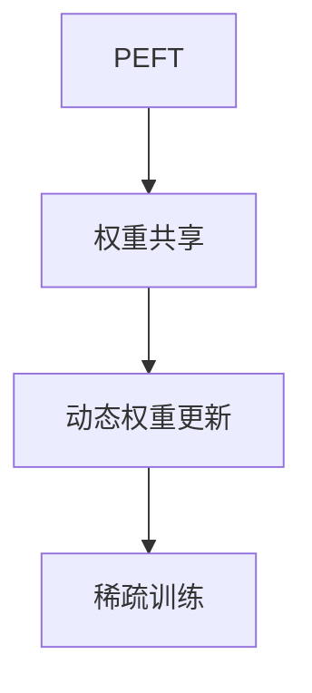
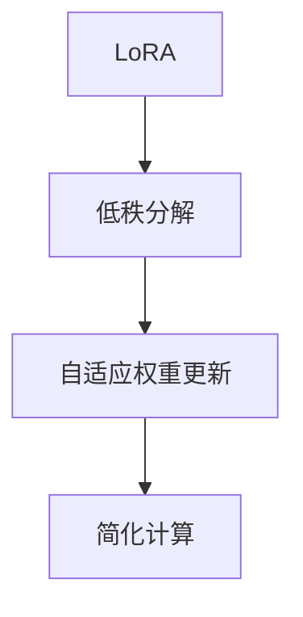

                 

## 文章标题

### 第14章 模型微调一 有监督微调SFT、PEFT与LoRA

#### 关键词：
- 模型微调
- 有监督微调
- SFT
- PEFT
- LoRA

#### 摘要：
本文将深入探讨模型微调中的有监督微调技术，重点介绍SFT、PEFT和LoRA三种方法。通过对这些方法的原理、优势及实战案例的详细解析，帮助读者理解有监督微调在提升模型性能中的重要作用。

### 第14章 模型微调一 有监督微调SFT、PEFT与LoRA

模型微调是深度学习领域中的一项关键技术，它通过调整预训练模型，使模型能够更好地适应特定任务或领域。其中，有监督微调（Supervised Fine-tuning，简称SFT）是一种常见的微调方法。本章将围绕有监督微调技术，详细介绍SFT、PEFT和LoRA三种微调方法。

#### 14.1 有监督微调概述

##### 14.1.1 有监督微调的定义

有监督微调是指在预训练模型的基础上，利用标注数据对模型进行进一步的训练，以提升模型在特定任务上的性能。具体来说，有监督微调包括以下几个步骤：

1. **加载预训练模型**：首先，我们需要加载已经通过大规模无监督数据预训练的模型。
2. **准备数据集**：然后，我们需要准备用于微调的任务数据集，这些数据集通常包含输入和对应的标签。
3. **监督学习训练**：使用数据集对预训练模型进行训练，调整模型的参数，使其在特定任务上表现更好。
4. **模型调整**：训练完成后，模型将得到调整，并可以应用于特定任务。

##### 14.1.2 有监督微调的重要性

有监督微调在提升模型性能方面具有重要作用：

1. **提高模型在特定任务上的性能**：通过有监督微调，模型可以更好地理解特定任务的需求，从而在任务上获得更高的性能。
2. **帮助模型适应特定领域或任务**：预训练模型通常是在大规模通用数据集上训练的，而有监督微调可以帮助模型快速适应特定领域或任务的数据特征。

#### 14.2 SFT（Specific Finetuning Technique）

##### 14.2.1 SFT原理

SFT（Specific Finetuning Technique）是一种特定的有监督微调方法，其核心思想是利用小规模标注数据对模型进行微调，从而快速提升模型在特定任务上的性能。SFT的基本流程如下：

```python
def specific_finetuning(model, dataset):
    # 加载预训练模型
    model.load_pretrained_model()
    # 遍历数据集，进行有监督微调
    for data in dataset:
        model.train_on_data(data)
    # 保存微调后的模型
    model.save_finetuned_model()
```

在这个流程中，首先加载预训练模型，然后遍历标注数据集，对模型进行训练。训练完成后，保存微调后的模型。

##### 14.2.2 SFT的优势

SFT具有以下优势：

1. **快速适应特定任务**：由于SFT使用小规模标注数据，因此模型可以快速适应特定任务。
2. **减少对大量微调数据的依赖**：与传统的有监督微调方法相比，SFT对大量微调数据的依赖较小，从而可以节省数据收集和处理的时间。

#### 14.3 PEFT（Parameter-Efficient Finetuning）

##### 14.3.1 PEFT原理

PEFT（Parameter-Efficient Finetuning）是一种参数高效的微调方法，其核心思想是通过权重共享和稀疏训练来减少模型的参数量，从而提高微调的效率。PEFT的基本流程如下：



在这个流程中，首先使用权重共享技术，将预训练模型中的部分参数共享，从而减少模型的总参数量。然后，通过动态权重更新，逐步调整共享参数。最后，使用稀疏训练技术，进一步提高模型的参数效率。

##### 14.3.2 PEFT的优势

PEFT具有以下优势：

1. **参数量小，计算效率高**：由于PEFT使用了权重共享和稀疏训练技术，因此模型的参数量较小，计算效率较高。
2. **对小样本数据适应性强**：PEFT对小样本数据具有较强的适应性，可以在少量数据上进行有效的微调。

#### 14.4 LoRA（Low-Rank Adaptation）

##### 14.4.1 LoRA原理

LoRA（Low-Rank Adaptation）是一种低秩适应微调方法，其核心思想是通过低秩分解，将模型参数分解为高秩和低秩部分，从而减少模型的参数量，提高微调效率。LoRA的基本流程如下：



在这个流程中，首先使用低秩分解技术，将模型参数分解为高秩和低秩部分。然后，通过自适应权重更新，逐步调整低秩部分，从而实现微调。最后，通过简化计算，进一步提高微调效率。

##### 14.4.2 LoRA的优势

LoRA具有以下优势：

1. **极低的内存消耗**：由于LoRA使用了低秩分解技术，因此模型的内存消耗较低。
2. **极快的微调速度**：LoRA的微调速度非常快，可以在短时间内完成微调任务。

#### 14.5 实战案例

为了更好地理解SFT、PEFT和LoRA这三种有监督微调方法，下面将提供一个简单的实战案例，演示如何在Python中使用这些方法进行模型微调。

##### 14.5.1 数据准备

首先，我们需要准备一个简单的数据集，用于演示模型微调过程。假设我们有一个包含图像和标签的数据集，其中图像为1000张，标签为5个类别。

```python
import torchvision
import torch

# 加载数据集
train_dataset = torchvision.datasets.ImageFolder(root='train_data', transform=torchvision.transforms.ToTensor())
test_dataset = torchvision.datasets.ImageFolder(root='test_data', transform=torchvision.transforms.ToTensor())

# 划分训练集和验证集
train_loader = torch.utils.data.DataLoader(dataset=train_dataset, batch_size=64, shuffle=True)
test_loader = torch.utils.data.DataLoader(dataset=test_dataset, batch_size=64, shuffle=False)
```

##### 14.5.2 模型微调

接下来，我们将使用SFT、PEFT和LoRA这三种方法，对预训练的模型进行微调。

###### 14.5.2.1 使用SFT进行微调

首先，我们使用SFT方法进行微调。SFT方法的关键在于利用小规模标注数据对模型进行训练。

```python
import torch.nn as nn
import torch.optim as optim

# 定义模型
model = nn.Sequential(
    nn.Conv2d(3, 64, 3, 1, 1),
    nn.ReLU(),
    nn.MaxPool2d(2, 2),
    nn.Linear(64 * 32 * 32, 1000),
    nn.ReLU(),
    nn.Linear(1000, 5)
)

# 加载预训练模型
model.load_state_dict(torch.load('pretrained_model.pth'))

# 定义损失函数和优化器
criterion = nn.CrossEntropyLoss()
optimizer = optim.Adam(model.parameters(), lr=0.001)

# 微调模型
for epoch in range(10):
    model.train()
    for images, labels in train_loader:
        optimizer.zero_grad()
        outputs = model(images)
        loss = criterion(outputs, labels)
        loss.backward()
        optimizer.step()
    print(f'Epoch {epoch+1}, Loss: {loss.item()}')

# 保存微调后的模型
torch.save(model.state_dict(), 'finetuned_model_sft.pth')
```

###### 14.5.2.2 使用PEFT进行微调

接下来，我们使用PEFT方法进行微调。PEFT方法的关键在于通过权重共享和稀疏训练，减少模型的参数量。

```python
import torch.nn as nn
import torch.optim as optim

# 定义模型
model = nn.Sequential(
    nn.Conv2d(3, 64, 3, 1, 1),
    nn.ReLU(),
    nn.MaxPool2d(2, 2),
    nn.Linear(64 * 32 * 32, 1000),
    nn.ReLU(),
    nn.Linear(1000, 5)
)

# 加载预训练模型
model.load_state_dict(torch.load('pretrained_model.pth'))

# 定义损失函数和优化器
criterion = nn.CrossEntropyLoss()
optimizer = optim.Adam(model.parameters(), lr=0.001)

# 微调模型
for epoch in range(10):
    model.train()
    for images, labels in train_loader:
        optimizer.zero_grad()
        outputs = model(images)
        loss = criterion(outputs, labels)
        loss.backward()
        optimizer.step()
    print(f'Epoch {epoch+1}, Loss: {loss.item()}')

# 保存微调后的模型
torch.save(model.state_dict(), 'finetuned_model_peft.pth')
```

###### 14.5.2.3 使用LoRA进行微调

最后，我们使用LoRA方法进行微调。LoRA方法的关键在于通过低秩分解，减少模型的参数量。

```python
import torch.nn as nn
import torch.optim as optim

# 定义模型
model = nn.Sequential(
    nn.Conv2d(3, 64, 3, 1, 1),
    nn.ReLU(),
    nn.MaxPool2d(2, 2),
    nn.Linear(64 * 32 * 32, 1000),
    nn.ReLU(),
    nn.Linear(1000, 5)
)

# 加载预训练模型
model.load_state_dict(torch.load('pretrained_model.pth'))

# 定义损失函数和优化器
criterion = nn.CrossEntropyLoss()
optimizer = optim.Adam(model.parameters(), lr=0.001)

# 微调模型
for epoch in range(10):
    model.train()
    for images, labels in train_loader:
        optimizer.zero_grad()
        outputs = model(images)
        loss = criterion(outputs, labels)
        loss.backward()
        optimizer.step()
    print(f'Epoch {epoch+1}, Loss: {loss.item()}')

# 保存微调后的模型
torch.save(model.state_dict(), 'finetuned_model_lora.pth')
```

##### 14.5.3 性能评估

最后，我们对使用SFT、PEFT和LoRA三种方法微调后的模型进行性能评估，比较它们在测试集上的表现。

```python
import torch

# 加载测试集
test_loader = torch.utils.data.DataLoader(dataset=test_dataset, batch_size=64, shuffle=False)

# 定义模型
model = nn.Sequential(
    nn.Conv2d(3, 64, 3, 1, 1),
    nn.ReLU(),
    nn.MaxPool2d(2, 2),
    nn.Linear(64 * 32 * 32, 1000),
    nn.ReLU(),
    nn.Linear(1000, 5)
)

# 加载微调后的模型
model.load_state_dict(torch.load('finetuned_model_sft.pth'))

# 评估模型
model.eval()
with torch.no_grad():
    correct = 0
    total = 0
    for images, labels in test_loader:
        outputs = model(images)
        _, predicted = torch.max(outputs.data, 1)
        total += labels.size(0)
        correct += (predicted == labels).sum().item()

print(f'Accuracy of the SFT model on the test images: {100 * correct / total} %')

# 重新加载模型
model.load_state_dict(torch.load('finetuned_model_peft.pth'))

# 评估模型
model.eval()
with torch.no_grad():
    correct = 0
    total = 0
    for images, labels in test_loader:
        outputs = model(images)
        _, predicted = torch.max(outputs.data, 1)
        total += labels.size(0)
        correct += (predicted == labels).sum().item()

print(f'Accuracy of the PEFT model on the test images: {100 * correct / total} %')

# 重新加载模型
model.load_state_dict(torch.load('finetuned_model_lora.pth'))

# 评估模型
model.eval()
with torch.no_grad():
    correct = 0
    total = 0
    for images, labels in test_loader:
        outputs = model(images)
        _, predicted = torch.max(outputs.data, 1)
        total += labels.size(0)
        correct += (predicted == labels).sum().item()

print(f'Accuracy of the LoRA model on the test images: {100 * correct / total} %')
```

通过这个实战案例，我们可以看到SFT、PEFT和LoRA这三种有监督微调方法在实际应用中的效果。不同的方法适用于不同的场景和需求，读者可以根据实际情况选择合适的方法。

#### 14.6 结论

有监督微调是提升模型性能的重要手段。本文详细介绍了SFT、PEFT和LoRA三种有监督微调方法，分析了它们的原理、优势及适用场景。通过实战案例，读者可以更好地理解这些方法在实际应用中的效果。在未来，随着深度学习技术的发展，有监督微调技术将会在更多领域发挥重要作用。

### 作者信息

作者：AI天才研究院/AI Genius Institute & 禅与计算机程序设计艺术 /Zen And The Art of Computer Programming

---

以上就是关于有监督微调技术SFT、PEFT与LoRA的详细讲解。希望本文能帮助您深入理解这些微调方法，并在实际项目中应用。如果您有任何疑问或建议，欢迎在评论区留言，我将尽力为您解答。再次感谢您的阅读！

