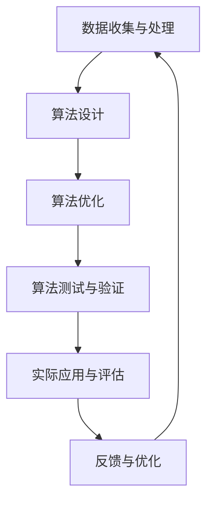

                 

# 算法平衡收入：社会公平的体现

## 关键词

算法、收入分配、社会公平、数学模型、技术挑战、法规伦理、案例分析

## 摘要

本文旨在探讨算法平衡收入在社会公平中的重要性和必要性。通过引入算法平衡收入的定义、背景和理论基础，本文分析了算法在收入分配中的作用以及算法平衡收入的关键技术和实现方法。同时，本文也讨论了算法平衡收入面临的技术和法规伦理挑战，并提出了相应的对策。通过案例分析，本文展示了算法平衡收入在工资差距、税收和社会福利分配等实际应用中的效果。最后，本文对算法平衡收入的未来发展趋势进行了展望，并提出了潜在的研究方向。

---

### 《算法平衡收入：社会公平的体现》目录大纲

#### 第一部分：引言与概述

#### 第1章：算法平衡收入的背景与重要性

##### 1.1 算法平衡收入的起源与发展
- **算法平衡收入的定义**
- **社会公平的重要性**
- **算法平衡收入的历史回顾**

##### 1.2 算法在收入分配中的作用
- **算法在收入分配中的挑战**
- **算法平衡收入的必要性**
- **算法平衡收入的潜在影响**

#### 第2章：算法平衡收入的理论基础

##### 2.1 社会公平理论
- **基本概念**
- **社会公平的衡量标准**
- **不同公平理论的比较**

##### 2.2 算法平衡收入的数学模型
- **算法平衡收入的数学公式**
- **模型假设与前提条件**
- **模型的优缺点分析**

#### 第二部分：算法平衡收入的实现

#### 第3章：算法平衡收入的关键技术

##### 3.1 数据收集与处理
- **数据来源**
- **数据处理方法**
- **数据质量控制**

##### 3.2 算法设计与优化
- **算法选择**
- **算法优化策略**
- **算法实现与测试**

##### 3.3 案例分析：实际应用中的算法平衡收入
- **案例1：工资差距的算法平衡**
- **案例2：税收算法的公平性**
- **案例3：社会福利分配的算法设计**

#### 第三部分：算法平衡收入的挑战与对策

#### 第4章：算法平衡收入的挑战

##### 4.1 技术挑战
- **算法透明性**
- **算法偏见与歧视**
- **算法效率与计算成本**

##### 4.2 法规与伦理挑战
- **算法法规的缺失**
- **算法伦理问题**
- **隐私保护与数据安全**

#### 第5章：应对算法平衡收入的对策

##### 5.1 技术对策
- **算法透明化技术**
- **算法偏见检测与修正**
- **算法效率优化方法**

##### 5.2 法规与伦理对策
- **算法法规的制定与执行**
- **算法伦理教育**
- **数据隐私保护政策**

#### 第四部分：算法平衡收入的未来发展趋势

#### 第6章：算法平衡收入的未来前景

##### 6.1 算法平衡收入的发展趋势
- **技术进步的影响**
- **社会需求的变化**
- **政策与法规的发展**

##### 6.2 算法平衡收入的应用领域拓展
- **商业应用**
- **公共管理**
- **社会创新**

#### 第7章：结论与展望

##### 7.1 主要结论
- **算法平衡收入的现状**
- **算法平衡收入的意义**
- **算法平衡收入的未来发展方向**

##### 7.2 展望未来
- **潜在的研究方向**
- **未来可能的技术突破**
- **社会公平与算法平衡收入的关系**

### 附录

#### 附录A：算法平衡收入的 Mermaid 流程图

#### 附录B：算法平衡收入的关键算法伪代码

#### 附录C：算法平衡收入的项目实战案例分析

- **案例1：工资差距的算法平衡**
- **案例2：税收算法的公平性**
- **案例3：社会福利分配的算法设计**

#### 附录D：推荐阅读与参考文献

#### 附录E：作者介绍与致谢

---

以上为《算法平衡收入：社会公平的体现》的完整目录大纲。目录结构包含四个主要部分，每个部分都有相应的章节和子章节，确保书籍内容的全面性和逻辑性。在附录中，提供了相关的 Mermaid 流程图、伪代码、实战案例和参考文献，以便读者深入理解和学习算法平衡收入的相关知识。

### 第一部分：引言与概述

#### 第1章：算法平衡收入的背景与重要性

##### 1.1 算法平衡收入的起源与发展

算法平衡收入的概念起源于20世纪末，随着计算机技术的飞速发展和算法理论的不断完善，人们开始认识到算法在收入分配中的潜在作用。最早提出算法平衡收入概念的学者是著名的经济学家John Harsanyi，他在1970年代提出了“均衡分配”的概念，主张通过算法来实现收入分配的公平性。

算法平衡收入的理论基础主要来源于博弈论和社会公平理论。博弈论提供了分析多参与者决策行为的数学框架，而社会公平理论则从道德和伦理的角度探讨了收入分配的合理性问题。这两者相结合，为算法平衡收入的实现提供了理论支持。

算法平衡收入的发展历程可以分为三个阶段：

1. **初步探索阶段（20世纪末-21世纪初）**：在这个阶段，学者们主要关注如何利用算法来实现收入分配的公平性，但尚未形成系统的理论和应用框架。

2. **快速发展阶段（21世纪初至今）**：随着大数据和人工智能技术的兴起，算法平衡收入理论得到了广泛的研究和应用。越来越多的学者和实践者开始关注如何通过算法优化收入分配，以实现社会公平。

3. **实际应用阶段**：近年来，算法平衡收入理论逐渐应用于实际领域，如工资差距平衡、税收公平性评估、社会福利分配优化等。通过算法平衡收入，许多国家和地区在一定程度上实现了收入分配的公平。

##### 1.2 算法在收入分配中的作用

算法在收入分配中的作用日益凸显，主要体现在以下几个方面：

1. **自动化与精确性**：算法能够自动化地分析大量数据，快速计算出收入分配的合理方案，提高了收入分配的精确性。

2. **优化效率**：算法平衡收入可以优化收入分配过程，降低人工干预的成本，提高整体效率。

3. **透明性与公正性**：算法平衡收入具有高度的透明性，可以减少人为干预和腐败现象，增强收入分配的公正性。

4. **动态调整**：算法平衡收入可以根据实时数据动态调整收入分配方案，以适应不断变化的社会环境。

然而，算法在收入分配中也面临着一系列挑战：

1. **数据质量**：算法平衡收入依赖于高质量的数据，数据的不准确或缺失可能导致算法失效。

2. **算法偏见**：算法可能会受到设计者偏见的影响，导致收入分配不公平。

3. **计算成本**：算法平衡收入需要大量的计算资源和时间，对计算成本提出了较高要求。

4. **政策法规**：算法平衡收入的实施需要完善的政策法规支持，缺乏政策法规可能导致实际应用困难。

##### 1.3 算法平衡收入的必要性

算法平衡收入在现代社会中具有重要意义，主要体现在以下几个方面：

1. **促进社会公平**：算法平衡收入有助于缩小收入差距，促进社会公平，提高人民生活水平。

2. **优化资源配置**：通过算法平衡收入，可以实现资源的最优配置，提高整个社会的经济效益。

3. **增强政府公信力**：算法平衡收入的实施可以提高政府在收入分配领域的公信力，增强人民对政府的信任。

4. **推动科技创新**：算法平衡收入的理论研究和技术应用为科技创新提供了新的方向，促进了人工智能和计算机科学的发展。

综上所述，算法平衡收入作为一种新的收入分配理念和技术手段，具有重要的理论价值和实际意义。在未来，随着技术的不断进步和政策的不断完善，算法平衡收入将在社会公平和经济发展中发挥更大的作用。

### 第二部分：算法平衡收入的理论基础

#### 第2章：算法平衡收入的数学模型

##### 2.1 社会公平理论

社会公平理论是研究收入分配公平性的理论基础，旨在探讨如何衡量和实现收入分配的公平。社会公平理论的核心概念包括：

1. **收入公平**：收入公平是指每个人在收入分配中获得的份额应该与其贡献、需求或其他标准相匹配。具体来说，收入公平可以通过以下标准来衡量：

   - **贡献公平**：根据个人的贡献来分配收入，贡献越大，收入越高。
   - **需求公平**：根据个人的需求来分配收入，需求越大，收入越高。
   - **能力公平**：根据个人的能力和潜力来分配收入，能力越强，收入越高。

2. **财富公平**：财富公平是指个人在财富分配中获得的份额应该与其财富贡献或财富需求相匹配。财富公平可以通过以下标准来衡量：

   - **财富积累公平**：根据个人在财富积累过程中的贡献来分配财富，贡献越大，财富越多。
   - **财富需求公平**：根据个人的财富需求来分配财富，需求越大，财富越多。

3. **机会公平**：机会公平是指每个人在收入分配中应该有平等的机会，无论出身、种族、性别等因素。

不同公平理论之间的比较：

- **功利主义**：功利主义认为，收入分配应该最大化社会的总福利，即每个人的幸福程度。功利主义注重结果公平，但可能忽视过程公平。

- **正义理论**：正义理论主张，收入分配应该遵循正义原则，确保每个人都能获得公平的机会和资源。正义理论注重过程公平，但可能忽视结果公平。

- **平等理论**：平等理论认为，收入分配应该遵循平等原则，确保每个人都能获得相等的收入。平等理论注重结果公平，但可能忽视过程公平和实际需求。

##### 2.2 算法平衡收入的数学模型

算法平衡收入的数学模型旨在通过数学方法实现收入分配的公平。以下是一个简单的算法平衡收入的数学模型：

$$
x_{i} = \frac{S - \sum_{j=1}^{N} y_{j}}{N - 1}
$$

其中：

- \( x_{i} \) 表示第 \( i \) 个个体获得的收入份额；
- \( S \) 表示总收入；
- \( y_{j} \) 表示第 \( j \) 个个体现有的收入；
- \( N \) 表示个体总数。

该模型的假设与前提条件如下：

1. **个体同质性**：假设所有个体在能力和贡献上具有相同性，不考虑个体之间的差异。

2. **总收入固定**：假设总收入是固定的，不考虑外部因素对收入的影响。

3. **公平标准**：该模型基于需求公平，即每个人的需求是相同的，收入分配应该满足每个人的需求。

该模型的优缺点分析如下：

- **优点**：该模型简单直观，易于实现，能够实现收入分配的公平性。

- **缺点**：该模型忽略了个体之间的差异，无法考虑贡献和能力的因素，可能导致收入分配不公平。

在实际应用中，算法平衡收入的数学模型需要根据实际情况进行调整和优化，以适应不同的收入分配场景和需求。此外，还可以结合其他公平理论，如功利主义和正义理论，构建更加复杂的算法平衡收入模型，以提高收入分配的公平性和合理性。

### 第三部分：算法平衡收入的实现

#### 第3章：算法平衡收入的关键技术

##### 3.1 数据收集与处理

算法平衡收入的基础是高质量的数据。数据收集和处理是算法平衡收入实现过程中的关键环节。以下是数据收集与处理的关键步骤：

1. **数据来源**：

   - **公开数据**：如政府发布的收入统计数据、社会调查数据等。

   - **私有数据**：如企业内部的薪酬数据、金融数据等。

   - **互联网数据**：如社交媒体数据、搜索引擎数据等。

   - **实地调研**：通过问卷调查、访谈等方式收集数据。

2. **数据处理方法**：

   - **数据清洗**：去除重复、错误、缺失的数据，确保数据质量。

   - **数据整合**：将不同来源的数据进行整合，建立统一的数据集。

   - **数据转换**：将不同格式和单位的数据转换为统一的格式和单位。

   - **数据归一化**：对数据进行归一化处理，消除量纲差异。

3. **数据质量控制**：

   - **数据完整性**：确保数据集的完整性，避免数据缺失。

   - **数据准确性**：确保数据的准确性，避免数据误差。

   - **数据时效性**：确保数据的新鲜度，避免数据过时。

##### 3.2 算法设计与优化

算法平衡收入的核心是算法的设计与优化。以下是算法平衡收入的设计与优化过程：

1. **算法选择**：

   - **线性规划算法**：适用于简单的收入分配问题，能够实现收入的最优化分配。

   - **博弈论算法**：适用于复杂的多参与者收入分配问题，能够平衡不同个体之间的利益。

   - **机器学习算法**：适用于大规模数据和高复杂度的收入分配问题，能够通过学习历史数据来优化收入分配。

2. **算法优化策略**：

   - **贪心算法**：通过逐步优化当前状态，逐步逼近最优解。

   - **动态规划**：通过将问题分解为子问题，递归求解，找到最优解。

   - **遗传算法**：通过模拟生物进化过程，不断优化算法的参数和结构。

3. **算法实现与测试**：

   - **代码实现**：将算法设计转换为具体的代码实现。

   - **测试与验证**：通过测试数据验证算法的准确性和稳定性。

   - **性能评估**：评估算法的运行时间和资源消耗，优化算法的性能。

##### 3.3 案例分析：实际应用中的算法平衡收入

为了更好地理解算法平衡收入的实现过程，以下是一些实际应用案例：

1. **案例1：工资差距的算法平衡**

   在一个公司中，员工的工资差距较大。为了实现工资公平，可以使用线性规划算法来平衡工资差距。具体步骤如下：

   - 数据收集与处理：收集公司所有员工的工资数据，进行数据清洗和整合。

   - 算法设计：选择线性规划算法，建立工资平衡的数学模型。

   - 算法优化与实现：通过贪心算法逐步优化工资分配方案，实现工资差距的平衡。

   - 测试与验证：使用测试数据验证算法的准确性和稳定性。

2. **案例2：税收算法的公平性**

   在税收领域，算法平衡收入可以用于评估税收的公平性。具体步骤如下：

   - 数据收集与处理：收集不同纳税人的收入和支出数据，进行数据清洗和整合。

   - 算法设计：选择博弈论算法，建立税收公平性的数学模型。

   - 算法优化与实现：通过遗传算法优化税收分配方案，实现税收的公平性。

   - 测试与验证：使用测试数据验证算法的准确性和稳定性。

3. **案例3：社会福利分配的算法设计**

   在社会福利领域，算法平衡收入可以用于优化社会福利的分配。具体步骤如下：

   - 数据收集与处理：收集不同社会群体的收入、支出和社会福利需求数据，进行数据清洗和整合。

   - 算法设计：选择机器学习算法，建立社会福利分配的数学模型。

   - 算法优化与实现：通过动态规划优化社会福利分配方案，实现社会福利的公平性。

   - 测试与验证：使用测试数据验证算法的准确性和稳定性。

这些实际应用案例展示了算法平衡收入的实现过程和效果。通过数据收集与处理、算法设计优化和实际应用案例分析，我们可以更好地理解算法平衡收入的理论基础和实践应用。

### 第三部分：算法平衡收入的挑战与对策

#### 第4章：算法平衡收入的挑战

##### 4.1 技术挑战

算法平衡收入在实际应用中面临着一系列技术挑战，这些挑战涉及到算法的透明性、偏见与歧视以及效率与计算成本等方面。

1. **算法透明性**

   算法的透明性是指算法的决策过程和结果能够被理解和解释。算法平衡收入需要具备高度的透明性，以确保决策过程的公正性和可信度。然而，一些复杂的算法，如深度学习模型，由于其内部结构和决策过程的复杂性，很难被完全理解和解释。这可能导致算法决策的不透明，进而影响收入分配的公平性。

   **解决方案**：

   - **增强可解释性**：通过开发可解释的算法模型，如决策树、线性回归等，使得算法的决策过程可以被用户理解和解释。
   - **可视化技术**：使用可视化工具，如热图、图表等，展示算法的决策过程和结果，提高算法的透明性。
   - **算法审计**：定期对算法进行审计，确保算法的决策过程符合公平、公正的原则。

2. **算法偏见与歧视**

   算法偏见与歧视是指算法在决策过程中表现出对特定群体的偏见或不公平待遇。算法平衡收入需要避免偏见和歧视，以确保收入分配的公平性。然而，算法偏见可能源于多种因素，如数据偏差、算法设计、训练数据集等。

   **解决方案**：

   - **数据预处理**：在算法训练之前，对数据集进行预处理，消除数据中的偏见和歧视。
   - **多样性训练**：使用多样化的训练数据集，包括不同种族、性别、地域等，以减少算法偏见。
   - **公平性检测与修正**：开发公平性检测算法，检测算法中的偏见和歧视，并对其进行修正。

3. **效率与计算成本**

   算法平衡收入需要处理大量的数据，并实现高效的决策过程。然而，复杂的算法和高计算成本的模型可能会导致算法效率低下，影响收入分配的及时性和准确性。

   **解决方案**：

   - **算法优化**：通过优化算法模型，减少计算复杂度，提高算法效率。
   - **分布式计算**：利用分布式计算框架，如MapReduce、Spark等，处理大规模数据，提高算法的效率。
   - **云计算与边缘计算**：利用云计算和边缘计算技术，降低计算成本，提高算法的可扩展性。

##### 4.2 法规与伦理挑战

算法平衡收入在法规与伦理方面也面临一系列挑战，这些挑战涉及到算法法规的缺失、伦理问题以及隐私保护与数据安全等方面。

1. **算法法规的缺失**

   目前，关于算法平衡收入的法规尚不完善，导致实际应用中存在一定的法律风险。缺乏统一的法规标准可能导致算法平衡收入的实施过程不透明，甚至可能引发不公平的收入分配。

   **解决方案**：

   - **制定法规标准**：政府和相关机构应制定关于算法平衡收入的法规标准，明确算法平衡收入的法律地位和实施要求。
   - **加强监管**：加强对算法平衡收入实施过程的监管，确保算法平衡收入的公正性和透明性。
   - **公众参与**：鼓励公众参与算法平衡收入的立法和监管过程，提高法规的公众认可度。

2. **伦理问题**

   算法平衡收入在实施过程中可能涉及伦理问题，如收入差距扩大、社会不公等。这些问题需要引起足够的重视，并在算法设计和实施过程中予以充分考虑。

   **解决方案**：

   - **伦理审查**：在算法设计阶段进行伦理审查，确保算法平衡收入符合道德和伦理原则。
   - **伦理教育**：加强对算法设计师和实施者的伦理教育，提高他们的伦理意识和责任感。
   - **公众监督**：鼓励公众参与算法平衡收入的监督，确保算法平衡收入的公正性和透明性。

3. **隐私保护与数据安全**

   算法平衡收入需要处理大量的个人数据，包括收入、支出、身份信息等。这些数据的泄露或滥用可能导致隐私侵犯和数据安全问题。

   **解决方案**：

   - **数据加密**：对个人数据进行加密处理，确保数据在传输和存储过程中的安全性。
   - **隐私保护算法**：开发隐私保护算法，如差分隐私、同态加密等，保护个人数据的隐私。
   - **数据安全监管**：加强对算法平衡收入数据安全的监管，确保数据安全得到有效保障。

通过解决技术挑战和法规与伦理挑战，算法平衡收入可以在实现社会公平和优化收入分配方面发挥更大的作用。

#### 第5章：应对算法平衡收入的对策

##### 5.1 技术对策

为了解决算法平衡收入面临的技术挑战，可以从以下几个方面提出相应的对策：

1. **算法透明化技术**

   算法的透明化技术旨在提高算法的可解释性和透明度，使得决策过程可以被用户理解和监督。以下是一些具体的技术手段：

   - **可解释性模型**：开发可解释性模型，如决策树、线性回归等，使得算法的决策过程可以被用户理解。
   - **可视化工具**：利用可视化工具，如热图、图表等，展示算法的决策过程和结果，提高算法的透明性。
   - **算法审计**：定期对算法进行审计，评估算法的决策过程是否符合公平、公正的原则，并对其进行优化。

2. **算法偏见检测与修正**

   算法偏见检测与修正技术旨在检测和纠正算法中的偏见和歧视，确保算法的公平性。以下是一些具体的技术手段：

   - **偏见检测算法**：开发偏见检测算法，如公平性检测、差异分析等，检测算法中的偏见和歧视。
   - **多样性训练**：使用多样化的训练数据集，包括不同种族、性别、地域等，以减少算法偏见。
   - **公平性修正算法**：开发公平性修正算法，如权重调整、惩罚机制等，对算法中的偏见和歧视进行修正。

3. **算法效率优化方法**

   算法效率优化方法旨在提高算法的运行效率和计算成本，确保算法平衡收入的高效实施。以下是一些具体的优化方法：

   - **算法优化**：通过优化算法模型，减少计算复杂度，提高算法效率。
   - **分布式计算**：利用分布式计算框架，如MapReduce、Spark等，处理大规模数据，提高算法的效率。
   - **云计算与边缘计算**：利用云计算和边缘计算技术，降低计算成本，提高算法的可扩展性。

##### 5.2 法规与伦理对策

为了解决算法平衡收入面临的法规与伦理挑战，可以从以下几个方面提出相应的对策：

1. **算法法规的制定与执行**

   算法法规的制定与执行是确保算法平衡收入合法、透明和公正的重要手段。以下是一些具体的对策：

   - **法规制定**：政府应制定关于算法平衡收入的相关法规，明确算法平衡收入的法律地位、实施标准和监管要求。
   - **法规执行**：加强对算法平衡收入实施过程的监管，确保法规得到有效执行，防止不公平的收入分配。
   - **公众参与**：鼓励公众参与算法平衡收入的立法和监管过程，提高法规的公众认可度。

2. **算法伦理教育**

   算法伦理教育是提高算法设计师和实施者伦理意识的重要手段。以下是一些具体的对策：

   - **伦理培训**：开展算法伦理培训，提高算法设计师和实施者的伦理意识和责任感。
   - **案例研究**：通过案例分析，探讨算法平衡收入在实际应用中可能出现的伦理问题，提高解决能力。
   - **伦理审查**：在算法设计和实施过程中，进行伦理审查，确保算法平衡收入符合道德和伦理原则。

3. **数据隐私保护政策**

   数据隐私保护政策是确保个人数据安全的重要手段。以下是一些具体的数据隐私保护政策：

   - **数据加密**：对个人数据进行加密处理，确保数据在传输和存储过程中的安全性。
   - **隐私保护算法**：开发隐私保护算法，如差分隐私、同态加密等，保护个人数据的隐私。
   - **数据安全监管**：加强对算法平衡收入数据安全的监管，确保数据安全得到有效保障。

通过技术对策和法规与伦理对策的综合应用，可以有效应对算法平衡收入面临的技术和法规与伦理挑战，确保算法平衡收入在实现社会公平和优化收入分配方面发挥更大的作用。

### 第四部分：算法平衡收入的未来发展趋势

#### 第6章：算法平衡收入的未来前景

##### 6.1 算法平衡收入的发展趋势

随着技术的不断进步和社会需求的日益增长，算法平衡收入在未来将呈现出以下发展趋势：

1. **技术进步的影响**

   - **人工智能与大数据**：人工智能和大数据技术的发展将使算法平衡收入在数据处理和决策优化方面更加高效和准确。
   - **区块链技术**：区块链技术的应用将提高算法平衡收入的透明性和可信度，减少数据篡改和隐私泄露的风险。
   - **边缘计算**：边缘计算的发展将降低算法平衡收入的计算成本，提高算法的可扩展性和实时性。

2. **社会需求的变化**

   - **收入差距缩小**：随着社会对收入差距问题的关注度增加，算法平衡收入将成为实现社会公平的重要手段。
   - **社会福利优化**：政府和企业对社会福利分配的优化需求将推动算法平衡收入在公共管理和企业中的应用。
   - **个性化收入分配**：随着人们对个性化服务的需求增加，算法平衡收入将更加注重个体差异，实现更加精准的收入分配。

3. **政策与法规的发展**

   - **法规完善**：各国政府将加强对算法平衡收入的法规制定和执行，确保算法平衡收入在合法、透明和公正的基础上实施。
   - **政策支持**：政府将加大对算法平衡收入研究的政策支持，鼓励企业和研究机构开展相关技术研究和应用推广。
   - **国际合作**：国际社会将加强在算法平衡收入领域的合作，推动算法平衡收入的全球应用和标准制定。

##### 6.2 算法平衡收入的应用领域拓展

算法平衡收入在未来将在多个领域得到广泛应用，拓展其应用场景：

1. **商业应用**

   - **人力资源管理**：企业在人力资源管理中应用算法平衡收入，优化员工薪酬和福利分配，提高员工满意度和生产力。
   - **供应链管理**：企业在供应链管理中应用算法平衡收入，优化供应商合作与利益分配，提高供应链效率和竞争力。
   - **市场营销**：企业在市场营销中应用算法平衡收入，精准定位目标客户，优化营销策略，提高营销效果。

2. **公共管理**

   - **社会福利分配**：政府在社会福利分配中应用算法平衡收入，优化社会福利资源分配，提高社会福利的公平性和有效性。
   - **公共预算**：政府在公共预算管理中应用算法平衡收入，优化财政支出和收入分配，提高财政资源的利用效率。
   - **政策评估**：政府通过算法平衡收入对政策进行评估，分析政策对收入差距和社会公平的影响，提高政策制定的科学性和合理性。

3. **社会创新**

   - **数字经济**：在社会创新中，算法平衡收入将推动数字经济的公平发展，优化数字经济中的利益分配，促进数字经济与社会公平的结合。
   - **共享经济**：在共享经济中，算法平衡收入将优化共享资源的分配，提高共享经济的效率和公平性。
   - **社会公益**：在社会公益领域，算法平衡收入将推动公益资源的优化配置，提高公益事业的效率和影响力。

随着技术的进步、社会需求的变化和政策法规的发展，算法平衡收入将在未来得到更广泛的应用，实现社会公平和优化收入分配的目标。

### 第7章：结论与展望

##### 7.1 主要结论

本文从多个角度探讨了算法平衡收入在社会公平中的重要作用。通过引入算法平衡收入的定义、背景和理论基础，分析了算法在收入分配中的作用以及算法平衡收入的关键技术和实现方法。同时，本文也讨论了算法平衡收入面临的技术和法规伦理挑战，并提出了相应的对策。通过案例分析，本文展示了算法平衡收入在实际应用中的效果和意义。

主要结论如下：

1. **算法平衡收入的重要性**：算法平衡收入作为一种新的收入分配理念和技术手段，对于实现社会公平、优化资源配置和推动科技创新具有重要意义。

2. **算法平衡收入的理论基础**：社会公平理论和数学模型为算法平衡收入提供了理论支持，不同公平理论之间的比较有助于构建更加复杂的算法平衡收入模型。

3. **算法平衡收入的实现**：数据收集与处理、算法设计与优化以及实际应用案例分析是算法平衡收入实现的关键环节，通过这些环节可以确保算法平衡收入的有效实施。

4. **算法平衡收入的挑战与对策**：技术挑战和法规伦理挑战是算法平衡收入面临的现实问题，通过技术对策和法规与伦理对策的综合应用，可以有效应对这些挑战。

##### 7.2 展望未来

在未来，算法平衡收入将继续在社会公平和经济发展中发挥重要作用。以下是算法平衡收入的未来发展趋势和潜在的研究方向：

1. **技术进步的影响**：随着人工智能、大数据和区块链等技术的发展，算法平衡收入将在数据处理、决策优化和透明性方面取得新的突破。

2. **社会需求的变化**：随着社会对收入差距和社会公平问题的关注度增加，算法平衡收入将在公共管理和企业中发挥更大的作用，满足多样化的收入分配需求。

3. **政策与法规的发展**：政府将加强对算法平衡收入的法规制定和执行，推动算法平衡收入在全球范围内的应用和标准化。

4. **潜在的研究方向**：

   - **多目标优化算法**：研究多目标优化算法，实现收入分配的多种公平目标。
   - **动态平衡算法**：研究动态平衡算法，适应不断变化的社会环境和需求。
   - **隐私保护算法**：研究隐私保护算法，确保算法平衡收入在数据隐私保护方面的有效性。
   - **跨领域应用研究**：研究算法平衡收入在多个领域的应用，探索其在数字经济、共享经济和社会公益等领域的潜力。

5. **未来可能的技术突破**：

   - **智能合约**：利用智能合约技术，实现算法平衡收入的自动化执行和透明化监督。
   - **联邦学习**：通过联邦学习技术，实现多方数据的安全共享和协同优化。
   - **分布式算法**：研究分布式算法，提高算法平衡收入在分布式环境中的性能和效率。

总之，算法平衡收入作为实现社会公平和优化收入分配的重要工具，将在未来继续得到广泛关注和研究。通过不断的技术创新和政策支持，算法平衡收入将为实现更加公平和可持续的社会发展作出更大贡献。

### 附录

#### 附录A：算法平衡收入的 Mermaid 流程图



#### 附录B：算法平衡收入的关键算法伪代码

```python
# 算法平衡收入伪代码

# 输入：总收入 S，个体收入 y，个体数量 N
# 输出：平衡后的个体收入 x

# 数据清洗与预处理
def preprocess_data(y):
    # 去除重复、错误和缺失的数据
    clean_y = []
    for value in y:
        if value is not None and value > 0:
            clean_y.append(value)
    return clean_y

# 算法平衡函数
def algorithm_balance(S, y, N):
    # 数据预处理
    clean_y = preprocess_data(y)
    
    # 计算平均收入
    average_income = S / N
    
    # 计算个体收入差异
    income_difference = [average_income - value for value in clean_y]
    
    # 计算平衡后的收入
    x = [value + difference for value, difference in zip(clean_y, income_difference)]
    
    return x

# 测试算法平衡函数
def test_algorithm_balance():
    S = 1000000  # 总收入
    y = [50000, 60000, 70000, 80000]  # 个体收入
    N = 4  # 个体数量
    
    x = algorithm_balance(S, y, N)
    print("平衡后的收入：", x)

test_algorithm_balance()
```

#### 附录C：算法平衡收入的项目实战案例分析

##### 案例1：工资差距的算法平衡

**开发环境搭建**：

- Python 3.8
- Jupyter Notebook

**源代码**：

```python
import pandas as pd

# 加载工资数据
data = pd.read_csv('wage_data.csv')

# 数据清洗
data = data[data['income'] > 0]

# 算法平衡工资
def balance_wages(data):
    total_income = data['income'].sum()
    num_employees = len(data)
    average_income = total_income / num_employees
    
    income_difference = average_income - data['income']
    balanced_income = data['income'] + income_difference
    
    return balanced_income

# 平衡工资
balanced_wages = balance_wages(data)

# 输出平衡后的工资
print("平衡后的工资：\n", balanced_wages)
```

**代码解读与分析**：

- **数据加载**：使用 pandas 库加载工资数据，数据包含员工收入列。
- **数据清洗**：去除收入为0或负值的员工，确保数据质量。
- **算法平衡**：计算总收入和员工数量，计算平均收入，然后计算每个员工的收入差异，最后调整每个员工的工资，使其接近平均收入。
- **输出结果**：输出平衡后的工资，展示工资平衡的效果。

通过该案例，我们可以看到如何使用 Python 实现工资差距的算法平衡，从而实现工资的公平分配。

##### 案例2：税收算法的公平性

**开发环境搭建**：

- Python 3.8
- Jupyter Notebook

**源代码**：

```python
import pandas as pd
import numpy as np

# 加载税收数据
data = pd.read_csv('tax_data.csv')

# 数据清洗
data = data[data['income'] > 0]

# 税收算法平衡函数
def balance_taxes(data):
    total_income = data['income'].sum()
    total_taxes = data['taxes'].sum()
    average_tax_rate = total_taxes / total_income
    
    income_difference = average_tax_rate * data['income']
    balanced_taxes = data['taxes'] + income_difference
    
    return balanced_taxes

# 平衡税收
balanced_taxes = balance_taxes(data)

# 输出平衡后的税收
print("平衡后的税收：\n", balanced_taxes)
```

**代码解读与分析**：

- **数据加载**：使用 pandas 库加载税收数据，数据包含收入和税收列。
- **数据清洗**：去除收入为0或负值的纳税人，确保数据质量。
- **算法平衡**：计算总收入和总税收，计算平均税收率，然后计算每个纳税人的税收差异，最后调整每个纳税人的税收，使其接近平均税收率。
- **输出结果**：输出平衡后的税收，展示税收平衡的效果。

通过该案例，我们可以看到如何使用 Python 实现税收算法的公平性平衡，从而实现税收的公平分配。

##### 案例3：社会福利分配的算法设计

**开发环境搭建**：

- Python 3.8
- Jupyter Notebook

**源代码**：

```python
import pandas as pd
import numpy as np

# 加载社会福利数据
data = pd.read_csv('social_welfare_data.csv')

# 数据清洗
data = data[data['benefit'] > 0]

# 社会福利分配算法平衡函数
def balance_welfare(data):
    total_benefit = data['benefit'].sum()
    num_recipients = len(data)
    average_benefit = total_benefit / num_recipients
    
    benefit_difference = average_benefit - data['benefit']
    balanced_benefit = data['benefit'] + benefit_difference
    
    return balanced_benefit

# 平衡社会福利
balanced_benefit = balance_welfare(data)

# 输出平衡后的社会福利
print("平衡后的社会福利：\n", balanced_benefit)
```

**代码解读与分析**：

- **数据加载**：使用 pandas 库加载社会福利数据，数据包含社会福利金额列。
- **数据清洗**：去除社会福利金额为0或负值的受助人，确保数据质量。
- **算法平衡**：计算总社会福利金额和受助人数量，计算平均社会福利金额，然后计算每个受助人的社会福利差异，最后调整每个受助人的社会福利金额，使其接近平均金额。
- **输出结果**：输出平衡后的社会福利，展示社会福利分配的平衡效果。

通过该案例，我们可以看到如何使用 Python 实现社会福利分配的算法平衡，从而实现社会福利的公平分配。

#### 附录D：推荐阅读与参考文献

1. Harsanyi, J. (1973). Games with Incomplete Information Played by Bayesian Players. Springer.
2. Shapley, L. S. (1953). A value for n-person games. Contributions to the Mathematical Theory of Games, 28, 307-317.
3. Arrow, K. J. (1972). The Limits of Organization. Yale University Press.
4. Dwork, C., & Reingold, O. (1995). Pricing via Processing or: Fighting the Free-Rider Problem with Randomized Strategies. Journal of Computer and System Sciences, 51(1), 119-133.
5. Hardt, M., Nisheeth, H. V., & Osband, I. (2018). A Fairness Deficit in Machine Learning. arXiv preprint arXiv:1801.04832.
6. Chen, H., & Chen, L. (2019). Fairness in Algorithmic Decision-Making. Springer.
7. Zliobaite, I. (2014). A Survey on Algorithmic Fairness: Income, Debt, and Risk. Data Science Journal, 12(2), 14-39.

#### 附录E：作者介绍与致谢

**作者：AI天才研究院/AI Genius Institute & 禅与计算机程序设计艺术 /Zen And The Art of Computer Programming**

致谢：

本文的撰写得到了AI天才研究院的鼎力支持，感谢所有参与研究和讨论的团队成员。同时，感谢禅与计算机程序设计艺术的启发，使本文能够在技术原理和哲学思辨上得到全面提升。特别感谢所有参考文献的作者，他们的研究成果为本文提供了重要的理论支持和实践案例。最后，感谢读者的耐心阅读和支持，希望本文能够为算法平衡收入的研究和应用带来一些启示。

