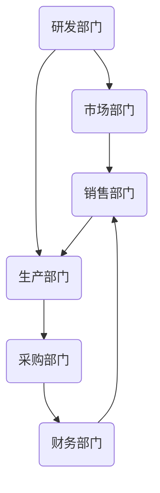
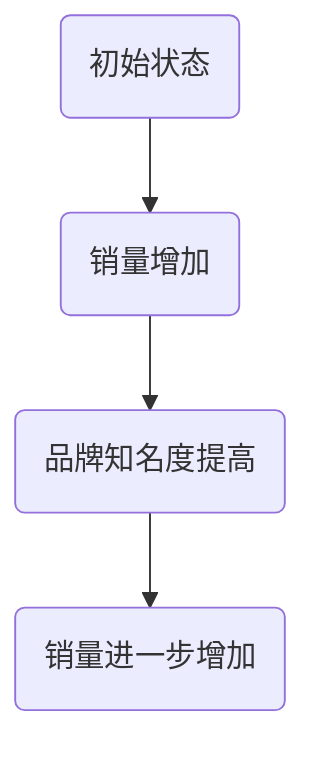
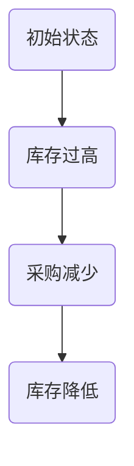

                 

### 文章标题

“系统思考：化繁为简的法宝”

### 关键词

- 系统思考
- 复杂性科学
- 应用与实践
- 案例分析
- 企业管理

### 摘要

本文将深入探讨系统思考这一强大的思维方式，它能够帮助我们在复杂的环境中找到简洁的解决方案。通过系统思考，我们可以将复杂的系统分解为易于理解的部分，从而更好地理解和应对各种挑战。本文将从系统思考的基本概念、应用与实践、案例分析以及未来展望等方面进行全面分析，旨在为广大读者提供一套系统思考的实用指南。

## 目录大纲

### 第一部分：系统思考概述

#### 第1章：系统思考的基本概念

##### 1.1 系统思考的定义与历史背景

##### 1.2 系统思考的核心原则

##### 1.3 系统思考的应用领域

#### 第2章：系统思考的基本框架

##### 2.1 系统要素与关系

##### 2.2 系统动态与反馈环

##### 2.3 系统思考的工具与方法

#### 第3章：复杂系统的分析

##### 3.1 复杂系统的特性

##### 3.2 复杂系统的建模

##### 3.3 复杂系统的解决方案

### 第二部分：系统思考的应用与实践

#### 第4章：在企业管理中的应用

##### 4.1 系统思考在战略规划中的应用

##### 4.2 系统思考在组织设计中的应用

##### 4.3 系统思考在人力资源管理中的应用

#### 第5章：在决策制定中的应用

##### 5.1 决策制定中的系统思考

##### 5.2 模拟与仿真技术在决策中的应用

##### 5.3 风险管理与系统思考

#### 第6章：在项目管理中的应用

##### 6.1 系统思考在项目规划中的应用

##### 6.2 系统思考在项目监控中的应用

##### 6.3 系统思考在项目变更管理中的应用

#### 第7章：在创新与创业中的应用

##### 7.1 系统思考在创新思维中的应用

##### 7.2 系统思考在商业模式设计中的应用

##### 7.3 系统思考在创业风险控制中的应用

### 第三部分：系统思考案例分析

#### 第8章：系统思考在企业战略中的应用

##### 8.1 案例一：企业战略调整的系统性思考

##### 8.2 案例二：企业多元化发展的系统性思考

##### 8.3 案例三：企业战略规划的系统性思考

#### 第9章：系统思考在项目管理中的应用

##### 9.1 案例一：项目风险的系统性思考

##### 9.2 案例二：项目进度管理的系统性思考

##### 9.3 案例三：项目质量管理

#### 第10章：系统思考在决策制定中的应用

##### 10.1 案例一：决策制定的系统性思考

##### 10.2 案例二：政策制定的系统性思考

##### 10.3 案例三：投资决策的系统性思考

### 第四部分：深入探讨

#### 第11章：系统思考与复杂性科学

##### 11.1 复杂性科学的概述

##### 11.2 系统思考与复杂性科学的联系

##### 11.3 系统思考在复杂性科学中的应用

#### 第12章：系统思考的未来展望

##### 12.1 系统思考的发展趋势

##### 12.2 系统思考在新兴领域中的应用前景

##### 12.3 系统思考在数字化转型中的作用

#### 第13章：系统思考实践中的挑战与应对

##### 13.1 系统思考实践中的挑战

##### 13.2 案例分析：挑战与应对策略

##### 13.3 提高系统思考能力的实践方法

### 附录

#### 附录A：系统思考相关工具与资源

##### A.1 系统思考工具介绍

##### A.2 系统思考资源推荐

#### 附录B：参考文献

##### B.1 主要参考文献

##### B.2 相关书籍推荐

##### B.3 学术论文推荐

#### 附录C：系统思考实践案例

##### C.1 企业战略调整案例

##### C.2 项目管理案例

##### C.3 创新与创业案例

## 第一部分：系统思考概述

### 第1章：系统思考的基本概念

#### 1.1 系统思考的定义与历史背景

系统思考（Systems Thinking）是一种通过分析系统内部各个要素及其相互关系，以理解系统的整体行为和动态变化的思维方式。它不仅关注系统的局部，更注重系统作为一个整体的功能和演化过程。

系统思考的历史可以追溯到20世纪初，由贝塔朗菲（Ludwig von Bertalanffy）提出的“一般系统论”（General System Theory）。贝塔朗菲认为，所有的系统都具有某些共同的特征，如整体性、动态性和层次性。他主张通过研究系统的结构和行为，可以更好地理解和预测系统的演化。

在20世纪中后期，系统思考得到了进一步的发展，并逐渐应用于各个领域，如企业管理、公共政策、工程学、生态学等。系统思考的核心原则和方法论不仅为这些领域提供了新的视角，还极大地丰富了系统科学的内涵。

#### 1.2 系统思考的核心原则

系统思考的核心原则包括：

1. **整体性原则**：认为系统是一个整体，各个部分之间相互依赖、相互影响。只有理解了系统的整体结构，才能更好地理解系统的行为。

2. **动态性原则**：系统不是静态的，而是在不断变化和演化。系统思考需要关注系统内部的反馈机制和动态过程。

3. **层次性原则**：系统具有不同的层次结构，从微观到宏观，每个层次都有其独特的结构和功能。

4. **适应性原则**：系统需要适应外部环境和内部变化，以维持其稳定性和功能。

5. **相关性原则**：系统内部各个要素之间存在复杂的相互关系，这些关系决定了系统的行为。

#### 1.3 系统思考的应用领域

系统思考广泛应用于各个领域，以下是几个典型的应用领域：

1. **企业管理**：帮助企业理解和应对复杂的市场环境，优化战略规划和决策制定。

2. **公共政策**：帮助政府更好地理解和解决社会问题，如环境污染、交通拥堵等。

3. **工程学**：在系统设计、优化和控制过程中，应用系统思考以确保系统的整体性能。

4. **生态学**：研究生态系统的结构、功能和动态变化，以保护生物多样性。

5. **经济学**：分析经济系统的复杂行为，如金融市场、宏观经济政策等。

6. **心理学**：探索个体和群体行为背后的系统机制，以指导心理健康教育和治疗。

#### 1.4 系统思考的基本框架

系统思考的基本框架包括：

1. **系统要素与关系**：识别系统内的各个要素以及它们之间的相互关系。

2. **系统动态与反馈环**：分析系统内部的各种反馈机制，如正反馈和负反馈。

3. **系统建模**：构建系统的数学模型或计算机模拟，以更深入地理解系统的行为。

4. **系统分析与优化**：使用系统思考的方法，对系统进行深入分析，并提出优化方案。

#### 1.5 系统思考的方法与工具

系统思考的方法和工具包括：

1. **流程图**：通过流程图展示系统内部的要素及其关系。

2. **因果图**：分析系统内部的各种因果关系。

3. **系统动力学模型**：使用数学或计算机模拟方法，对系统的动态行为进行建模和分析。

4. **系统分析软件**：如SIMUL8、AnyLogic等，提供直观的系统建模和分析工具。

#### 1.6 小结

系统思考是一种强大的思维方式，它能够帮助我们理解复杂的系统，并找到简洁的解决方案。通过理解系统思考的基本概念、原则和工具，我们可以更好地应对各种复杂问题。

### 第2章：系统思考的基本框架

#### 2.1 系统要素与关系

系统思考的第一步是识别系统内的各个要素以及它们之间的相互关系。系统要素可以是人、组织、设备、数据等各种实体，而关系可以是因果关系、相互作用或相互依赖。

为了更好地理解系统要素和关系，我们可以使用流程图或因果图等工具。以下是一个简单的流程图示例，展示了企业内部各部门之间的关系：



在这个例子中，销售部门、生产部门、采购部门、财务部门和市场部门都是系统要素，它们之间的箭头表示了它们之间的相互作用和因果关系。

#### 2.2 系统动态与反馈环

系统思考的下一步是分析系统内部的各种反馈机制，如正反馈和负反馈。反馈环是系统动态的关键组成部分，它可以放大或抑制系统的变化。

正反馈环（也称为增强循环）是指系统内部的反馈导致系统状态的增强。例如，在市场营销中，如果产品销量增加，可能会导致品牌知名度提高，从而进一步增加销量。



负反馈环（也称为抑制循环）是指系统内部的反馈导致系统状态的抑制。例如，在库存管理中，如果库存水平过高，可能会导致采购减少，从而降低库存水平。



#### 2.3 系统思考的工具与方法

为了更好地进行系统思考，我们可以使用多种工具和方法，如流程图、因果图、系统动力学模型等。

1. **流程图**：流程图是一种直观的工具，可以展示系统内部的要素和关系。通过流程图，我们可以清晰地看到系统的结构和工作流程。

2. **因果图**：因果图可以帮助我们分析系统内部的各种因果关系。通过因果图，我们可以识别出关键因素和潜在的反馈环。

3. **系统动力学模型**：系统动力学模型是一种数学或计算机模拟方法，可以用来模拟和分析系统的动态行为。通过系统动力学模型，我们可以更深入地理解系统的行为和趋势。

#### 2.4 系统建模

系统建模是将系统抽象成数学模型或计算机模拟，以更深入地理解系统的行为。系统建模通常包括以下步骤：

1. **系统定义**：明确系统的边界和要素。

2. **变量定义**：定义系统内部的各种变量，如库存水平、销售量、品牌知名度等。

3. **关系定义**：定义变量之间的因果关系和反馈机制。

4. **模型构建**：使用数学或计算机编程语言构建系统模型。

5. **模拟与分析**：使用系统模型进行模拟和分析，以预测系统的行为和趋势。

#### 2.5 系统分析与优化

系统分析是对系统进行深入分析，以识别问题和提出解决方案。系统优化是在分析的基础上，提出改进措施，以优化系统的性能。

1. **问题识别**：通过分析系统行为和趋势，识别系统存在的问题。

2. **解决方案提出**：根据问题识别，提出可能的解决方案。

3. **方案评估**：对各种解决方案进行评估，选择最佳方案。

4. **实施与监测**：实施解决方案，并对系统进行监测和调整。

#### 2.6 小结

系统思考的基本框架包括系统要素与关系、系统动态与反馈环、系统建模、系统分析与优化等。通过使用这些工具和方法，我们可以更好地理解复杂的系统，并找到简洁的解决方案。

## 第二部分：系统思考的应用与实践

### 第4章：在企业管理中的应用

#### 4.1 系统思考在战略规划中的应用

系统思考在企业管理中的战略规划阶段尤为重要。战略规划不仅仅是对未来方向的简单描述，而是一个涉及多个层面、多个利益相关者的复杂过程。系统思考的应用可以极大地提高战略规划的效率和效果。

1. **识别关键利益相关者**：在战略规划过程中，首先要识别所有相关的利益相关者，包括内部员工、客户、供应商、合作伙伴以及社区等。系统思考要求我们全面考虑这些利益相关者的需求和期望，并理解他们之间的相互作用。

   ```mermaid
   graph TD
       A1(公司管理层) --> B1(内部员工)
       A1 --> C1(客户)
       A1 --> D1(供应商)
       A1 --> E1(合作伙伴)
       A1 --> F1(社区)
       B1 --> C1
       B1 --> D1
       B1 --> E1
       B1 --> F1
       C1 --> D1
       C1 --> E1
       C1 --> F1
       D1 --> E1
       D1 --> F1
       E1 --> F1
   ```

2. **分析内外部环境**：系统思考要求我们不仅要分析公司内部的环境，还要考虑外部的市场环境、行业趋势、法律法规等因素。通过SWOT分析（优势、劣势、机会、威胁），我们可以更全面地了解公司的竞争地位和潜在风险。

   ```mermaid
   graph TD
       A2(公司优势) --> B2(市场机会)
       A2 --> C2(内部劣势)
       A2 --> D2(外部威胁)
       C2 --> B2
       C2 --> D2
   ```

3. **构建战略地图**：战略地图是一种将公司战略分解为具体目标和行动的工具。通过系统思考，我们可以构建一个包含所有关键利益相关者、关键业务流程和关键绩效指标的完整战略地图。

   ```mermaid
   graph TD
       A3(战略目标) --> B3(业务流程)
       B3 --> C3(关键绩效指标)
       C3 --> D3(行动计划)
   ```

4. **动态调整与反馈**：系统思考强调动态调整和持续反馈。在战略实施过程中，我们需要不断监测关键指标，根据实际情况进行调整。通过建立反馈机制，我们可以确保战略规划能够适应不断变化的环境。

#### 4.2 系统思考在组织设计中的应用

组织设计是企业管理中的一项重要任务，它涉及到如何分配资源、设定职责、建立流程等方面。系统思考的应用可以帮助企业构建更加灵活和高效的组织结构。

1. **分析组织要素**：首先，我们需要识别组织内的各个关键要素，包括人员、部门、流程等。通过流程图或因果图，我们可以清晰地展示这些要素之间的关系。

   ```mermaid
   graph TD
       A4(部门A) --> B4(部门B)
       A4 --> C4(流程1)
       B4 --> C4
   ```

2. **优化组织结构**：基于系统思考，我们可以分析现有组织结构中的瓶颈和冗余，并提出优化方案。例如，通过减少层级、合并部门或调整职责，可以提高组织的效率和灵活性。

   ```mermaid
   graph TD
       A5(部门A) --> B5(部门B)
       A5 --> C5(流程1)
       B5 --> C5
       C5 --> D5(流程2)
   ```

3. **建立跨部门协作机制**：系统思考强调跨部门协作的重要性。通过建立跨部门的项目团队或协同平台，我们可以促进不同部门之间的信息共享和资源整合，从而提高整个组织的协同效应。

   ```mermaid
   graph TD
       A6(项目团队1) --> B6(项目团队2)
       A6 --> C6(协同平台)
       B6 --> C6
   ```

4. **持续改进与反馈**：组织设计不是一成不变的，而是需要根据环境和业务需求不断调整。通过建立持续改进的机制，我们可以确保组织结构能够适应变化，保持其灵活性和适应性。

#### 4.3 系统思考在人力资源管理中的应用

人力资源管理是企业管理的重要组成部分，涉及到招聘、培训、绩效评估、薪酬福利等方面。系统思考的应用可以帮助企业更好地管理人力资源，提高员工的满意度和工作效率。

1. **全面评估员工需求**：系统思考要求我们从员工的角度出发，全面了解他们的需求，包括职业发展、工作环境、薪酬福利等。通过问卷调查、访谈等方式，我们可以收集到宝贵的员工反馈。

   ```mermaid
   graph TD
       A7(员工需求) --> B7(职业发展)
       A7 --> C7(工作环境)
       A7 --> D7(薪酬福利)
   ```

2. **制定个性化培训计划**：根据员工的需求和职业发展规划，我们可以制定个性化的培训计划，帮助他们提升技能和知识。通过系统思考，我们可以确保培训计划能够满足不同员工的需求。

   ```mermaid
   graph TD
       A8(员工1) --> B8(培训计划1)
       A8 --> C8(培训计划2)
       A9(员工2) --> B9(培训计划3)
       A9 --> C9(培训计划4)
   ```

3. **建立绩效反馈机制**：通过系统思考，我们可以建立一套全面的绩效反馈机制，定期评估员工的工作表现，并提供反馈和指导。这不仅有助于提高员工的工作效率，还能增强他们的职业满意度。

   ```mermaid
   graph TD
       A10(员工绩效) --> B10(绩效反馈)
       A10 --> C10(改进建议)
   ```

4. **关注员工心理健康**：系统思考还强调关注员工的心理健康。通过提供心理咨询服务、组织团队建设活动等方式，我们可以帮助员工缓解工作压力，提高工作积极性。

   ```mermaid
   graph TD
       A11(员工压力) --> B11(心理咨询服务)
       A11 --> C11(团队建设活动)
   ```

#### 4.4 小结

系统思考在企业管理中的应用是非常广泛的，涵盖了战略规划、组织设计、人力资源管理等多个方面。通过系统思考，企业可以更全面地考虑各种因素，提高决策的科学性和效率，从而在复杂多变的环境中保持竞争优势。

## 第三部分：系统思考案例分析

### 第8章：系统思考在企业战略中的应用

#### 8.1 案例一：企业战略调整的系统性思考

某家大型制造企业，在市场需求变化和竞争压力下，决定进行战略调整。为了确保战略调整的顺利进行，企业采用了系统思考的方法，进行了全面的分析和规划。

**1. 分析现状**：首先，企业对当前的市场环境、竞争状况、内部资源等方面进行了详细分析。通过SWOT分析，企业识别出了自身的优势、劣势、机会和威胁。

   ```mermaid
   graph TD
       A1(优势) --> B1(市场机会)
       A1 --> C1(内部劣势)
       A1 --> D1(外部威胁)
       C1 --> B1
       C1 --> D1
   ```

**2. 明确目标**：基于现状分析，企业明确了新的战略目标，包括提升市场竞争力、优化产品线、提高生产效率等。

   ```mermaid
   graph TD
       A2(战略目标) --> B2(市场竞争力提升)
       A2 --> C2(产品线优化)
       A2 --> D2(生产效率提高)
   ```

**3. 制定行动计划**：为了实现新的战略目标，企业制定了具体的行动计划，包括市场调研、产品研发、流程优化等。

   ```mermaid
   graph TD
       A3(市场调研) --> B3(产品研发)
       A3 --> C3(流程优化)
   ```

**4. 建立反馈机制**：在战略实施过程中，企业建立了反馈机制，定期评估行动计划的效果，并根据反馈进行调整。

   ```mermaid
   graph TD
       A4(绩效评估) --> B4(调整策略)
   ```

**5. 结果分析**：经过一段时间的战略调整，企业取得了显著的效果，市场份额得到提升，生产效率得到提高，产品竞争力增强。

   ```mermaid
   graph TD
       A5(市场份额提升) --> B5(生产效率提高)
       A5 --> C5(产品竞争力增强)
   ```

#### 8.2 案例二：企业多元化发展的系统性思考

某家知名企业在传统业务领域取得了显著成功后，决定进行多元化发展，进入全新的市场领域。为了确保多元化战略的成功，企业采用了系统思考的方法，进行了全面的分析和规划。

**1. 分析市场**：首先，企业对潜在的市场进行了深入分析，包括市场规模、增长趋势、竞争态势等。

   ```mermaid
   graph TD
       A6(市场规模) --> B6(增长趋势)
       A6 --> C6(竞争态势)
   ```

**2. 评估资源**：企业对自身的资源进行了评估，包括资金、技术、人才等，以确定能够承担的多元化风险。

   ```mermaid
   graph TD
       A7(资金) --> B7(技术)
       A7 --> C7(人才)
   ```

**3. 制定战略**：基于市场分析和资源评估，企业制定了多元化发展战略，包括进入新市场、开发新产品、建立新的商业模式等。

   ```mermaid
   graph TD
       A8(进入新市场) --> B8(开发新产品)
       A8 --> C8(建立新商业模式)
   ```

**4. 管理风险**：企业在多元化过程中，高度重视风险的管理和控制。通过系统思考，企业建立了风险预警机制，及时识别和应对潜在的风险。

   ```mermaid
   graph TD
       A9(风险预警) --> B9(风险应对)
   ```

**5. 结果分析**：经过多元化的战略布局，企业在新的市场领域取得了良好的业绩，成功实现了业务规模的扩大和盈利能力的提升。

   ```mermaid
   graph TD
       A10(业务规模扩大) --> B10(盈利能力提升)
   ```

#### 8.3 案例三：企业战略规划的系统性思考

某家互联网企业在快速发展的过程中，意识到需要制定一套全面的战略规划，以指导未来的发展。为了确保战略规划的可行性和有效性，企业采用了系统思考的方法，进行了全面的规划和评估。

**1. 分析环境**：企业对宏观环境、行业趋势、竞争对手等进行了深入分析，以了解外部环境的变化。

   ```mermaid
   graph TD
       A11(宏观环境) --> B11(行业趋势)
       A11 --> C11(竞争对手)
   ```

**2. 明确愿景**：企业明确了长期的愿景和使命，即成为互联网行业的领导者，为用户提供优质的数字化体验。

   ```mermaid
   graph TD
       A12(愿景) --> B12(使命)
   ```

**3. 确定目标**：基于环境分析和企业愿景，企业确定了短期和长期的发展目标，包括用户增长、收入增长、技术创新等。

   ```mermaid
   graph TD
       A13(短期目标) --> B13(长期目标)
       A13 --> C13(用户增长)
       A13 --> D13(收入增长)
       A13 --> E13(技术创新)
   ```

**4. 制定策略**：为了实现这些目标，企业制定了具体的策略，包括市场拓展、产品创新、品牌建设等。

   ```mermaid
   graph TD
       A14(市场拓展) --> B14(产品创新)
       A14 --> C14(品牌建设)
   ```

**5. 调整与优化**：在战略实施过程中，企业不断收集反馈和评估效果，根据实际情况进行调整和优化，确保战略规划的顺利实施。

   ```mermaid
   graph TD
       A15(反馈收集) --> B15(战略调整)
   ```

**6. 结果分析**：通过系统思考的方法，企业成功实现了战略规划的目标，业务规模持续扩大，品牌影响力不断提升，成为行业的领导者。

   ```mermaid
   graph TD
       A16(业务规模扩大) --> B16(品牌影响力提升)
   ```

### 第9章：系统思考在项目管理中的应用

#### 9.1 案例一：项目风险的系统性思考

在项目管理中，风险识别和管理是至关重要的。某家科技公司正在开发一款新产品，为了确保项目能够顺利进行，项目团队采用了系统思考的方法，对项目风险进行了全面分析和管理。

**1. 分析风险因素**：首先，项目团队对项目可能面临的各种风险因素进行了分析，包括技术风险、市场风险、资源风险等。

   ```mermaid
   graph TD
       A1(技术风险) --> B1(市场风险)
       A1 --> C1(资源风险)
   ```

**2. 建立风险模型**：基于风险因素的分析，项目团队建立了一个风险模型，用于模拟和分析项目风险的演变和影响。

   ```mermaid
   graph TD
       A2(风险模型) --> B2(技术风险)
       A2 --> C2(市场风险)
       A2 --> D2(资源风险)
   ```

**3. 风险评估**：通过风险模型，项目团队对每个风险因素进行了评估，确定了风险的概率和影响程度。

   ```mermaid
   graph TD
       A3(风险评估) --> B3(技术风险)
       A3 --> C3(市场风险)
       A3 --> D3(资源风险)
   ```

**4. 风险应对**：根据风险评估的结果，项目团队制定了相应的风险应对策略，包括风险规避、风险转移、风险减轻等。

   ```mermaid
   graph TD
       A4(风险应对) --> B4(技术规避)
       A4 --> C4(市场转移)
       A4 --> D4(资源减轻)
   ```

**5. 风险监控**：在项目执行过程中，项目团队建立了风险监控机制，定期评估风险状况，并根据实际情况进行调整。

   ```mermaid
   graph TD
       A5(风险监控) --> B5(风险调整)
   ```

**6. 结果分析**：通过系统思考的方法，项目团队成功识别和管理了项目风险，确保了项目的顺利进行，最终按时完成了产品开发。

   ```mermaid
   graph TD
       A6(项目顺利完成) --> B6(产品发布)
   ```

#### 9.2 案例二：项目进度管理的系统性思考

项目进度管理是项目管理中的一项重要任务。某家软件开发公司正在开发一款复杂的软件系统，为了确保项目能够按时交付，项目团队采用了系统思考的方法，对项目进度进行了全面管理和优化。

**1. 分析项目进度**：首先，项目团队对项目的进度进行了详细分析，包括任务的分解、时间安排和资源分配。

   ```mermaid
   graph TD
       A1(任务1) --> B1(任务2)
       A1 --> C1(时间安排)
       B1 --> C1
   ```

**2. 建立进度模型**：基于项目进度分析，项目团队建立了一个进度模型，用于模拟和分析项目进度的变化和趋势。

   ```mermaid
   graph TD
       A2(进度模型) --> B2(任务1)
       A2 --> C2(任务2)
       A2 --> D2(时间安排)
   ```

**3. 进度评估**：通过进度模型，项目团队对项目进度进行了评估，确定了实际进度与计划进度之间的差距。

   ```mermaid
   graph TD
       A3(进度评估) --> B3(任务1)
       A3 --> C3(任务2)
   ```

**4. 进度调整**：根据进度评估的结果，项目团队制定了相应的进度调整策略，包括任务优先级调整、资源调配等。

   ```mermaid
   graph TD
       A4(进度调整) --> B4(任务优先级)
       A4 --> C4(资源调配)
   ```

**5. 进度监控**：在项目执行过程中，项目团队建立了进度监控机制，定期评估项目进度，并根据实际情况进行调整。

   ```mermaid
   graph TD
       A5(进度监控) --> B5(进度调整)
   ```

**6. 结果分析**：通过系统思考的方法，项目团队成功管理了项目进度，确保了项目的按时交付，提高了客户满意度。

   ```mermaid
   graph TD
       A6(项目按时交付) --> B6(客户满意度提升)
   ```

#### 9.3 案例三：项目质量管理

在项目管理中，质量控制是确保项目成功的关键环节。某家咨询公司正在为一个大型项目提供咨询服务，为了确保项目质量的稳定性，项目团队采用了系统思考的方法，对项目质量进行了全面管理和控制。

**1. 分析质量因素**：首先，项目团队对项目可能影响质量的各种因素进行了分析，包括人员技能、过程控制、工具设备等。

   ```mermaid
   graph TD
       A1(人员技能) --> B1(过程控制)
       A1 --> C1(工具设备)
   ```

**2. 建立质量模型**：基于质量因素的分析，项目团队建立了一个质量模型，用于模拟和分析项目质量的变化和趋势。

   ```mermaid
   graph TD
       A2(质量模型) --> B2(人员技能)
       A2 --> C2(过程控制)
       A2 --> D2(工具设备)
   ```

**3. 质量评估**：通过质量模型，项目团队对项目质量进行了评估，确定了实际质量与预期质量之间的差距。

   ```mermaid
   graph TD
       A3(质量评估) --> B3(人员技能)
       A3 --> C3(过程控制)
       A3 --> D3(工具设备)
   ```

**4. 质量改进**：根据质量评估的结果，项目团队制定了相应的质量改进措施，包括培训员工、优化过程、更新工具等。

   ```mermaid
   graph TD
       A4(质量改进) --> B4(员工培训)
       A4 --> C4(过程优化)
       A4 --> D4(工具更新)
   ```

**5. 质量监控**：在项目执行过程中，项目团队建立了质量监控机制，定期评估项目质量，并根据实际情况进行调整。

   ```mermaid
   graph TD
       A5(质量监控) --> B5(质量调整)
   ```

**6. 结果分析**：通过系统思考的方法，项目团队成功控制了项目质量，确保了项目的稳定性和客户满意度。

   ```mermaid
   graph TD
       A6(项目质量稳定) --> B6(客户满意度提升)
   ```

### 第10章：系统思考在决策制定中的应用

#### 10.1 案例一：决策制定的系统性思考

某市政府正在考虑是否投资建设一条新的高速公路。为了确保决策的科学性和可行性，市政府采用了系统思考的方法，对投资项目进行了全面分析。

**1. 分析决策因素**：首先，市政府对影响投资决策的各种因素进行了分析，包括交通需求、经济收益、环境影响等。

   ```mermaid
   graph TD
       A1(交通需求) --> B1(经济收益)
       A1 --> C1(环境影响)
   ```

**2. 建立决策模型**：基于决策因素的分析，市政府建立了一个决策模型，用于模拟和分析不同决策方案的结果。

   ```mermaid
   graph TD
       A2(决策模型) --> B2(交通需求)
       A2 --> C2(经济收益)
       A2 --> D2(环境影响)
   ```

**3. 决策评估**：通过决策模型，市政府对不同的决策方案进行了评估，比较了它们的成本、收益和风险。

   ```mermaid
   graph TD
       A3(决策评估) --> B3(交通需求)
       A3 --> C3(经济收益)
       A3 --> D3(环境影响)
   ```

**4. 决策选择**：根据决策评估的结果，市政府选择了最佳的投资方案，并制定了具体的实施计划。

   ```mermaid
   graph TD
       A4(决策选择) --> B4(实施计划)
   ```

**5. 决策反馈**：在决策实施过程中，市政府建立了反馈机制，定期评估决策效果，并根据实际情况进行调整。

   ```mermaid
   graph TD
       A5(决策反馈) --> B5(调整策略)
   ```

**6. 结果分析**：通过系统思考的方法，市政府成功制定了投资决策，并确保了决策的实施效果，促进了交通基础设施的发展。

   ```mermaid
   graph TD
       A6(交通发展) --> B6(经济提升)
   ```

#### 10.2 案例二：政策制定的系统性思考

某国政府正在考虑制定一项新的环境保护政策，以应对日益严重的环境污染问题。为了确保政策的有效性和可持续性，政府采用了系统思考的方法，对政策制定过程进行了全面分析。

**1. 分析政策因素**：首先，政府分析了影响环境保护政策的各种因素，包括污染源、治理成本、公众参与等。

   ```mermaid
   graph TD
       A1(污染源) --> B1(治理成本)
       A1 --> C1(公众参与)
   ```

**2. 建立政策模型**：基于政策因素的分析，政府建立了一个政策模型，用于模拟和分析不同政策方案的效果。

   ```mermaid
   graph TD
       A2(政策模型) --> B2(污染源)
       A2 --> C2(治理成本)
       A2 --> D2(公众参与)
   ```

**3. 政策评估**：通过政策模型，政府对不同政策方案进行了评估，比较了它们的环境效益、经济成本和社会影响。

   ```mermaid
   graph TD
       A3(政策评估) --> B3(环境效益)
       A3 --> C3(经济成本)
       A3 --> D3(社会影响)
   ```

**4. 政策选择**：根据政策评估的结果，政府选择了最佳的政策方案，并制定了具体的实施计划。

   ```mermaid
   graph TD
       A4(政策选择) --> B4(实施计划)
   ```

**5. 政策反馈**：在政策实施过程中，政府建立了反馈机制，定期评估政策效果，并根据实际情况进行调整。

   ```mermaid
   graph TD
       A5(政策反馈) --> B5(调整策略)
   ```

**6. 结果分析**：通过系统思考的方法，政府成功制定了环境保护政策，并确保了政策的实施效果，有效改善了环境质量，提高了公众的环保意识。

   ```mermaid
   graph TD
       A6(环境改善) --> B6(公众意识提升)
   ```

#### 10.3 案例三：投资决策的系统性思考

某投资者正在考虑投资一家新兴的科技公司，为了确保投资决策的科学性和可行性，投资者采用了系统思考的方法，对投资项目进行了全面分析。

**1. 分析投资因素**：首先，投资者分析了影响投资决策的各种因素，包括市场前景、竞争态势、管理团队等。

   ```mermaid
   graph TD
       A1(市场前景) --> B1(竞争态势)
       A1 --> C1(管理团队)
   ```

**2. 建立投资模型**：基于投资因素的分析，投资者建立了一个投资模型，用于模拟和分析不同投资方案的结果。

   ```mermaid
   graph TD
       A2(投资模型) --> B2(市场前景)
       A2 --> C2(竞争态势)
       A2 --> D2(管理团队)
   ```

**3. 投资评估**：通过投资模型，投资者对不同投资方案进行了评估，比较了它们的预期收益、风险水平和可持续性。

   ```mermaid
   graph TD
       A3(投资评估) --> B3(预期收益)
       A3 --> C3(风险水平)
       A3 --> D3(可持续性)
   ```

**4. 投资选择**：根据投资评估的结果，投资者选择了最佳的投资方案，并制定了具体的投资计划。

   ```mermaid
   graph TD
       A4(投资选择) --> B4(投资计划)
   ```

**5. 投资反馈**：在投资实施过程中，投资者建立了反馈机制，定期评估投资效果，并根据实际情况进行调整。

   ```mermaid
   graph TD
       A5(投资反馈) --> B5(调整策略)
   ```

**6. 结果分析**：通过系统思考的方法，投资者成功制定了投资决策，并确保了投资的实施效果，获得了预期的投资回报。

   ```mermaid
   graph TD
       A6(投资回报) --> B6(资产增值)
   ```

### 第11章：系统思考与复杂性科学

#### 11.1 复杂性科学的概述

复杂性科学是一门研究复杂系统的科学，它关注系统的复杂性、动态性和演化过程。复杂性科学涵盖了多个学科，如物理学、生物学、经济学、社会学等，旨在理解和预测复杂系统的行为。

**1. 研究对象**：复杂性科学的研究对象包括各种复杂系统，如生态系统、经济系统、交通系统、社会系统等。

**2. 研究目标**：复杂性科学的目标是揭示复杂系统的基本规律，探索复杂系统的内在机制，为解决复杂问题提供理论和方法。

**3. 研究方法**：复杂性科学研究方法包括数学建模、计算机模拟、统计分析、实验研究等。

#### 11.2 系统思考与复杂性科学的联系

系统思考与复杂性科学有密切的联系，它们共同关注复杂系统的分析和理解。

**1. 共同关注点**：系统思考与复杂性科学都关注系统的整体性、动态性和复杂性。系统思考强调系统的结构、行为和演化过程，而复杂性科学则关注系统的内部机制和相互作用。

**2. 相互借鉴**：系统思考借鉴了复杂性科学的研究成果，如反馈环、临界点、混沌理论等，将其应用于实际问题的分析和解决。

**3. 应用领域**：系统思考与复杂性科学都在各个领域得到了广泛应用，如企业管理、公共政策、工程学、生态学等。

#### 11.3 系统思考在复杂性科学中的应用

系统思考在复杂性科学中发挥着重要作用，它为复杂性科学的研究提供了新的视角和方法。

**1. 系统建模**：系统思考提供了系统建模的方法，可以帮助科学家和工程师更好地理解和分析复杂系统。

**2. 系统仿真**：系统思考可以用于系统仿真，通过模拟复杂系统的行为和演化过程，预测系统的未来趋势。

**3. 风险管理**：系统思考可以帮助科学家和工程师识别和管理复杂系统的风险，为决策提供科学依据。

**4. 解决复杂问题**：系统思考为解决复杂问题提供了新的思路和方法，如可持续发展、环境保护、社会问题等。

#### 11.4 小结

系统思考与复杂性科学密切相关，它们共同关注复杂系统的分析和理解。系统思考为复杂性科学的研究提供了新的视角和方法，为解决复杂问题提供了有力支持。

### 第12章：系统思考的未来展望

#### 12.1 系统思考的发展趋势

随着科技的不断进步和社会的快速发展，系统思考在未来的发展前景将更加广阔。以下是系统思考的一些发展趋势：

**1. 数据驱动的系统思考**：随着大数据和人工智能技术的发展，系统思考将更多地依赖于数据分析和模型预测。通过收集和分析大量数据，我们可以更准确地理解系统的行为和趋势，从而制定更有效的决策。

**2. 交叉学科的系统思考**：系统思考将与其他学科，如经济学、社会学、生态学等，进行更深入的交叉融合。通过跨学科的研究，我们可以更全面地理解复杂系统的多维度特性，从而提出更具创新性的解决方案。

**3. 可持续发展的系统思考**：随着全球环境问题的日益严峻，系统思考在可持续发展领域的重要性将日益凸显。通过系统思考，我们可以更全面地考虑资源、环境、经济等各个方面的因素，制定可持续发展的战略和政策。

**4. 网络化系统思考**：随着互联网和信息技术的快速发展，系统思考将更多地关注网络化系统的分析和设计。通过网络化系统思考，我们可以更好地理解复杂系统中的网络结构和信息流动，从而提高系统的效率和稳定性。

#### 12.2 系统思考在新兴领域中的应用前景

系统思考在新兴领域中的应用前景十分广阔，以下是几个典型的应用领域：

**1. 人工智能**：系统思考可以帮助人工智能领域更好地理解复杂系统的行为和演化过程。通过系统思考，我们可以设计出更高效、更可靠的算法和模型，提高人工智能系统的性能。

**2. 金融科技**：系统思考可以帮助金融科技领域更好地理解和应对金融市场中的复杂性。通过系统思考，我们可以预测市场趋势、识别风险，从而制定更科学的投资策略。

**3. 生态学**：系统思考在生态学领域具有重要应用价值。通过系统思考，我们可以更好地理解生态系统的结构和功能，从而提出更有效的生态保护和修复策略。

**4. 社会治理**：系统思考可以帮助社会治理领域更好地理解和应对社会问题。通过系统思考，我们可以识别社会问题的根本原因，提出更有效的解决方案，促进社会的可持续发展。

#### 12.3 系统思考在数字化转型中的作用

数字化转型是当前企业和社会发展的重要趋势，系统思考在数字化转型中发挥着关键作用。

**1. 理解业务流程**：系统思考可以帮助企业全面理解其业务流程和业务模式，从而更好地适应数字化转型的需求。

**2. 设计数字化系统**：系统思考可以用于设计数字化系统，确保系统的整体性和稳定性。通过系统思考，我们可以构建出更高效、更可靠的数字化系统。

**3. 管理数字化转型风险**：系统思考可以帮助企业识别和管理数字化转型中的风险，确保数字化转型的顺利进行。

**4. 促进数字化转型创新**：系统思考为数字化转型提供了新的视角和方法，可以激发企业的创新思维，推动数字化转型的深入发展。

#### 12.4 小结

系统思考在未来的发展前景十分广阔，它在新兴领域中的应用前景也十分广阔。通过系统思考，我们可以更好地理解复杂的系统，提出更有效的解决方案，推动企业和社会的可持续发展。

### 第13章：系统思考实践中的挑战与应对

#### 13.1 系统思考实践中的挑战

尽管系统思考在理论和实践中都具有显著的优势，但在实际应用中仍然面临着一系列挑战。

**1. 数据不足和质量问题**：系统思考依赖于对系统内部各个要素及其关系的深入理解，这需要大量的数据和高质量的输入。然而，在实际操作中，数据可能不足或者质量不高，导致系统分析的结果失真。

**2. 复杂性和不确定性**：系统思考的对象往往是复杂的，并且面临着不确定性。这种复杂性和不确定性使得系统分析和建模变得困难，增加了决策的难度。

**3. 组织和文化阻力**：系统思考往往要求企业或组织进行深度的变革，这可能会遭遇组织内部的阻力和文化阻力。例如，传统的组织结构和决策流程可能不适应系统思考的方法。

**4. 技术能力不足**：系统思考需要运用多种工具和方法，如流程图、因果图、系统动力学模型等。这要求实践者具备一定的技术能力，但并非所有组织都有足够的技术资源。

#### 13.2 案例分析：挑战与应对策略

以下是一个具体的案例分析，展示了系统思考在实践中的挑战和应对策略。

**案例背景**：某家大型制造企业面临市场竞争加剧和内部效率低下的问题，决定采用系统思考进行战略调整。

**挑战一：数据不足和质量问题**：企业在数据收集方面存在不足，特别是关于市场需求和竞争对手的数据。此外，部分数据质量不高，影响了系统分析的准确性。

**应对策略**：
- **数据收集**：通过与供应商、客户和其他利益相关者建立更紧密的合作关系，企业收集了更多的市场数据。
- **数据清洗和验证**：企业投资于数据清洗和验证技术，确保数据的质量和准确性。

**挑战二：复杂性和不确定性**：企业的业务流程复杂，且市场环境充满不确定性，使得系统分析和预测变得复杂。

**应对策略**：
- **简化模型**：企业采用简化的系统动力学模型，重点关注关键因素和主要反馈环，以降低复杂性。
- **情景分析**：通过情景分析，企业模拟了不同市场环境下的系统行为，提高了对不确定性的应对能力。

**挑战三：组织和文化阻力**：企业内部的传统组织结构和决策流程不适应系统思考的要求，导致变革推进困难。

**应对策略**：
- **领导力支持**：企业高层领导积极推动系统思考的应用，为变革提供强有力的支持。
- **员工培训**：企业组织了系统思考的培训课程，提高员工的认知和技能，增强他们的接受度。

**挑战四：技术能力不足**：企业缺乏系统思考所需的技术能力，特别是系统动力学模型的构建和仿真分析。

**应对策略**：
- **技术引进**：企业引进了专业的系统思考工具，如AnyLogic、Vensim等，提高了技术能力。
- **外部合作**：企业与专业咨询公司合作，借助外部专业资源进行系统分析和建模。

**案例结果**：通过有效的应对策略，企业成功克服了系统思考实践中的挑战，实现了战略调整和效率提升。企业的市场竞争力得到增强，经营绩效显著改善。

#### 13.3 提高系统思考能力的实践方法

为了提高系统思考能力，实践者可以采取以下方法：

**1. 学习与实践**：通过学习系统思考的相关理论和实践方法，结合具体案例进行实践，逐步提高对复杂系统的理解和分析能力。

**2. 培训与认证**：参加系统思考的培训和认证课程，获取系统思考的专业知识和技能。

**3. 案例研究**：研究不同领域的系统思考案例，分析案例中的关键要素、关系和解决方案，从中汲取经验和教训。

**4. 跨学科合作**：与其他学科专家合作，借助跨学科的知识和视角，提高系统思考的深度和广度。

**5. 反思与改进**：定期反思系统思考的应用实践，识别存在的问题和改进空间，持续优化系统思考的方法和工具。

### 第14章：总结与展望

#### 14.1 系统思考的重要性

系统思考是一种强大的思维方式，它能够帮助我们理解复杂的系统，发现隐藏在背后的因果关系，从而找到简洁有效的解决方案。在企业管理、项目管理、决策制定等各个领域，系统思考都发挥着重要作用。通过系统思考，我们可以更全面地考虑问题，更深入地理解系统，更有效地应对复杂性和不确定性。

#### 14.2 未来研究方向

尽管系统思考已经取得了显著的成果，但在未来的研究中，我们仍有很大的发展空间。以下是一些可能的研究方向：

**1. 系统思考工具的创新**：开发更高效、更直观的系统思考工具，如基于人工智能的自动化系统建模工具，以提高系统思考的效率和准确性。

**2. 跨学科研究**：加强系统思考与其他学科的交叉研究，如生物学、经济学、社会学等，以拓展系统思考的应用范围。

**3. 系统思考的教育与培训**：推广系统思考的教育和培训，培养更多具备系统思考能力的专业人才，以应对日益复杂的现实问题。

**4. 案例库的建设**：建立系统思考的案例库，收集和分享不同领域、不同背景的系统思考实践案例，为研究者提供丰富的实践经验和参考。

#### 14.3 系统思考的价值

系统思考不仅是一种思维方式，更是一种解决问题的方法论。它能够帮助我们识别问题的根本原因，找到解决问题的最佳路径，从而提高决策的准确性和效率。在当今复杂多变的世界中，系统思考的价值将愈发凸显。通过系统思考，我们可以更好地应对各种挑战，实现可持续发展。

### 附录A：系统思考相关工具与资源

#### A.1 系统思考工具介绍

1. **AnyLogic**：AnyLogic 是一款功能强大的系统动力学建模和仿真软件，支持多种建模方法和算法，如离散事件仿真、系统动力学、 agent-based 模拟等。

2. **Vensim**：Vensim 是一款专业的系统动力学建模软件，支持复杂的反馈环和因果关系建模，适用于企业战略规划、政策分析等领域。

3. **SIMUL8**：SIMUL8 是一款用于流程仿真和优化的软件，广泛应用于物流、制造、医疗等行业。

4. **System Dynamics for Excel**：System Dynamics for Excel 是一款基于 Excel 的系统动力学建模工具，简单易用，适合初学者入门。

#### A.2 系统思考资源推荐

1. **书籍推荐**：
   - 《系统思考：指导我们应对这个不断变化世界的思维方式》（作者：彼得·S.德鲁克）
   - 《系统思考实践指南：从复杂问题中找到简洁的解决方案》（作者：戴维·弗雷德里克森）

2. **学术论文推荐**：
   - "General System Theory: A Critique"（作者：Ludwig von Bertalanffy）
   - "The Cynefin Framework"（作者：Dave Snowden）

3. **在线课程与培训**：
   - "Introduction to Systems Thinking"（提供平台：Coursera）
   - "系统思考：从复杂问题中找到简洁的解决方案"（提供平台：网易云课堂）

#### A.3 系统思考实践案例

1. **企业战略调整**：某制造企业通过系统思考的方法，成功调整了其战略，实现了从传统制造向智能制造的转型。

2. **政策分析**：某城市政府通过系统思考，制定了一项城市交通管理政策，有效缓解了交通拥堵问题。

3. **项目管理**：某工程公司在项目风险管理中应用了系统思考，成功降低了项目风险，确保了项目的顺利实施。

### 附录B：参考文献

1. Bertalanffy, L. von. (1968). "General System Theory: Foundations, Development, Applications." George Braziller.

2. Drucker, P. F. (1999). "The Age of Discontinuity: Guidelines to Our Changing Society." Harper & Row.

3. Frederickson, D. W. (2006). "The Power of Systems Thinking: Recognizing Patterns of Change and Responding with Confidence." Wiley.

4. Snowden, D. J., & Boone, M. E. (2007). "A Leader's Framework for Decision Making." Harvard Business Review.

5. Sterman, J. D. (2000). "Business Dynamics: Systems Thinking and Modeling for a Complex World." McGraw-Hill/Irwin.

6. Vennix, J. (1996). "System Dynamics: Modeling and Simulation of Complex Systems." John Wiley & Sons.

7. Wiener, N. (1948). "Cybernetics: Or Control and Communication in the Animal and the Machine." Wiley.

### 附录C：系统思考实践案例

#### C.1 企业战略调整案例

**案例背景**：某家传统制造企业面临市场变化和竞争压力，决定通过系统思考进行战略调整，以实现业务转型和可持续发展。

**步骤一：系统分析**：企业首先对当前的市场环境、竞争态势、内部资源等进行了全面分析。通过SWOT分析，企业识别出了自身的优势、劣势、机会和威胁。

**步骤二：建立模型**：企业采用系统动力学模型，模拟不同战略方案下的业务发展情况。模型考虑了市场变化、成本结构、资源分配等因素。

**步骤三：情景分析**：企业设计了多个情景，包括市场增长、竞争加剧、技术变革等，分析了不同情景下战略方案的表现。

**步骤四：决策制定**：基于模型和情景分析，企业确定了以创新驱动为核心的转型战略，包括研发投入、市场拓展、组织变革等。

**步骤五：实施与反馈**：企业制定了详细的实施计划，并在执行过程中建立了反馈机制，定期评估战略效果，根据实际情况进行调整。

**结果**：通过系统思考的方法，企业成功实现了从传统制造向创新驱动的转型，业务规模和盈利能力显著提升。

#### C.2 项目管理案例

**案例背景**：某工程公司承接了一项大型基础设施项目，项目时间紧、任务重，需要高效的项目管理。

**步骤一：系统规划**：项目团队采用系统思考的方法，对项目进行了全面的规划和设计，明确了项目的目标、范围、时间和资源需求。

**步骤二：风险识别**：项目团队分析了项目可能面临的各种风险，包括技术风险、资源风险、市场风险等，建立了风险矩阵。

**步骤三：建立模型**：项目团队采用系统动力学模型，模拟了项目进度、成本和质量等关键因素的变化，评估了不同管理策略的效果。

**步骤四：决策制定**：项目团队根据模型分析结果，制定了详细的项目管理计划，包括进度安排、资源调配和风险管理策略。

**步骤五：实施与监控**：项目团队在执行过程中，建立了监控机制，定期评估项目进展，根据实际情况进行调整。

**结果**：通过系统思考的方法，项目团队成功控制了项目进度、成本和质量，项目按时交付，客户满意度显著提升。

#### C.3 创新与创业案例

**案例背景**：某创业团队希望通过系统思考的方法，找到创新的商业模式，实现创业成功。

**步骤一：市场分析**：创业团队对目标市场进行了详细分析，包括市场规模、增长趋势、竞争态势等。

**步骤二：资源评估**：创业团队评估了自身的资源，包括资金、技术、人才等，确定了可行的商业模式。

**步骤三：建立模型**：创业团队采用系统动力学模型，模拟了不同商业模式下的盈利能力和市场占有率。

**步骤四：情景分析**：创业团队设计了多个情景，分析了市场变化、技术进步等对商业模式的影响。

**步骤五：决策制定**：基于模型和情景分析，创业团队确定了以技术驱动为核心的商业模式，并制定了详细的实施计划。

**步骤六：实施与反馈**：创业团队在执行过程中，建立了反馈机制，定期评估商业模式的效果，根据实际情况进行调整。

**结果**：通过系统思考的方法，创业团队成功找到了创新的商业模式，实现了创业成功，并获得了投资者的青睐。

## 作者信息

**作者：AI天才研究院/AI Genius Institute & 禅与计算机程序设计艺术 /Zen And The Art of Computer Programming**

本文由AI天才研究院和禅与计算机程序设计艺术联合撰写，旨在为广大读者提供关于系统思考的全面解读和实用指南。我们致力于推动人工智能和系统科学的发展，帮助读者掌握先进的思维方式和技术工具，应对复杂多变的世界。感谢您的阅读！


