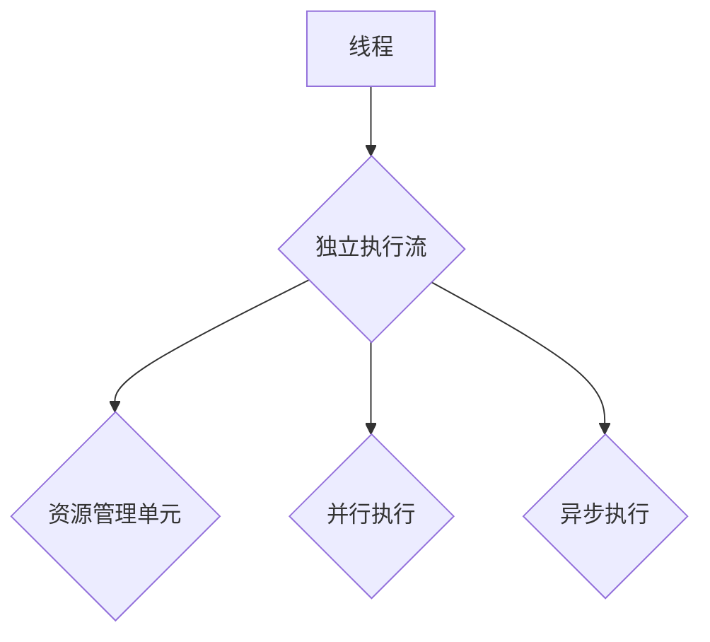
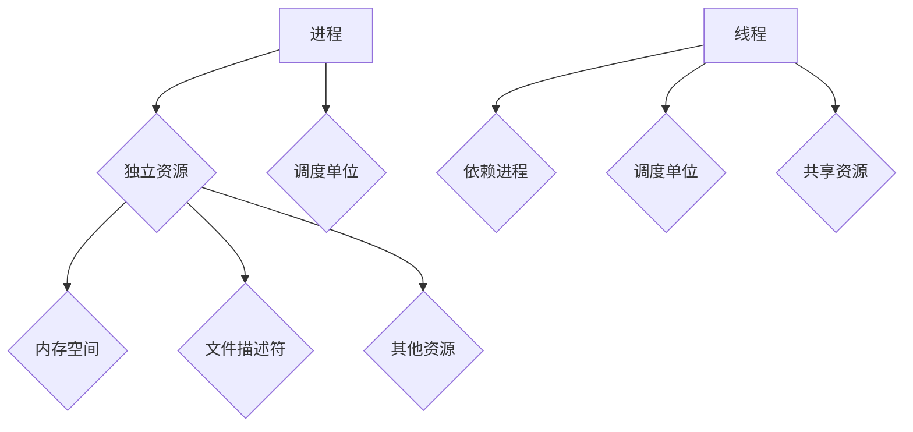
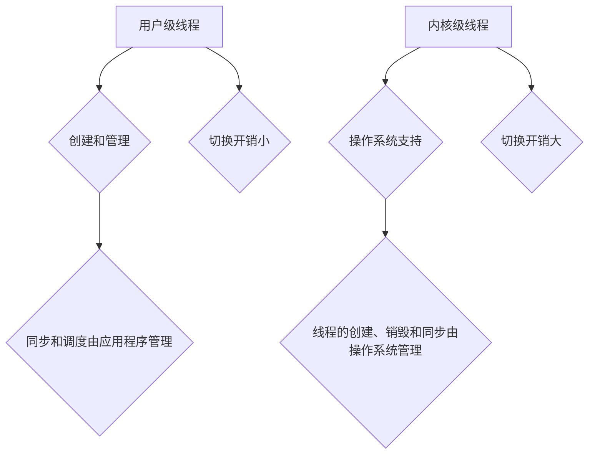

                 

### 文章标题

在现代计算机系统中，线程管理是一种至关重要的技术，尤其在需要高吞吐量的应用场景中。本文将深入探讨线程管理在高吞吐量应用中的重要性、技术细节以及实际应用案例，旨在帮助读者理解并掌握这一关键技能。

**关键词：** 线程管理、高吞吐量、并发处理、大数据处理、实时数据处理

**摘要：** 本文首先介绍了线程管理的基础知识，包括线程的概念、类型和生命周期。随后，文章详细阐述了多线程编程模型、线程安全性与效率优化策略。接着，文章分析了高并发处理、大数据处理和实时数据处理中的线程管理技术。最后，文章通过具体案例分析展示了线程管理在高吞吐量应用中的实际效果，并推荐了一些最佳实践和常用资源。

### 《线程管理在高吞吐量中的应用》

在现代计算机系统中，线程管理是一种至关重要的技术，尤其在需要高吞吐量的应用场景中。本文将深入探讨线程管理在高吞吐量应用中的重要性、技术细节以及实际应用案例，旨在帮助读者理解并掌握这一关键技能。

**关键词：** 线程管理、高吞吐量、并发处理、大数据处理、实时数据处理

**摘要：** 本文首先介绍了线程管理的基础知识，包括线程的概念、类型和生命周期。随后，文章详细阐述了多线程编程模型、线程安全性与效率优化策略。接着，文章分析了高并发处理、大数据处理和实时数据处理中的线程管理技术。最后，文章通过具体案例分析展示了线程管理在高吞吐量应用中的实际效果，并推荐了一些最佳实践和常用资源。

### 《线程管理在高吞吐量中的应用》目录大纲

## 第一部分：线程管理基础

### 第1章：线程管理概述

#### 1.1 线程的概念与作用
#### 1.2 线程与进程的区别
#### 1.3 线程的类型
#### 1.4 线程的生命周期

### 第2章：多线程编程模型

#### 2.1 线程创建与销毁
#### 2.2 线程同步机制
#### 2.3 线程通信机制
#### 2.4 线程调度策略

### 第3章：线程安全性与效率优化

#### 3.1 线程安全问题分析
#### 3.2 线程安全编程技术
#### 3.3 线程效率优化策略
#### 3.4 线程池的应用与实践

## 第二部分：高吞吐量应用场景中的线程管理

### 第4章：高并发处理

#### 4.1 高并发场景概述
#### 4.2 高并发处理策略
#### 4.3 案例分析：电商系统高并发处理

### 第5章：大数据处理

#### 5.1 大数据处理概述
#### 5.2 并行数据处理技术
#### 5.3 案例分析：大数据平台线程管理优化

### 第6章：实时数据处理

#### 6.1 实时数据处理概述
#### 6.2 实时数据处理架构
#### 6.3 案例分析：金融交易系统实时数据处理

### 第7章：高吞吐量应用案例分析

#### 7.1 案例分析1：电商平台高吞吐量订单处理
#### 7.2 案例分析2：大数据处理平台线程优化
#### 7.3 案例分析3：实时数据处理系统性能优化

## 第三部分：线程管理工具与框架

### 第8章：线程管理工具

#### 8.1 Java线程管理工具
#### 8.2 C++线程管理工具
#### 8.3 Python线程管理工具

### 第9章：线程管理框架

#### 9.1 Akka框架介绍
#### 9.2 Spring框架中的线程管理
#### 9.3 Netty线程模型解析

### 第10章：线程管理最佳实践

#### 10.1 线程池最佳实践
#### 10.2 线程安全编程最佳实践
#### 10.3 高吞吐量应用优化策略

## 附录A：线程管理常用资源与工具

#### A.1 常用线程管理库对比
#### A.2 线程管理相关书籍推荐
#### A.3 线程管理社区与论坛推荐

---

现在，让我们深入到文章的第一部分：线程管理基础。

### 第一部分：线程管理基础

线程管理是现代计算机系统中的一个关键组件，尤其在需要高吞吐量的应用场景中。本部分将涵盖线程管理的基础知识，包括线程的概念与作用、线程与进程的区别、线程的类型以及线程的生命周期。

#### 1.1 线程的概念与作用

线程（Thread）是操作系统能够进行运算调度的最小单位，它被包含在进程之中，是进程中的实际运作单位。线程自己不拥有系统资源，只拥有一点在运行中必不可少的资源（如程序计数器、一组寄存器和栈），但是它可以与同属一个进程的其他线程共享进程所拥有的全部资源。

线程的主要作用包括：

1. **并发执行**：线程能够实现并发执行，从而提高程序的运行效率。多个线程可以同时执行不同的任务，而不是像传统的进程那样一个接一个地执行。
2. **资源共享**：线程共享进程的地址空间、文件描述符和其他资源，从而减少资源占用，提高资源利用率。
3. **降低开销**：线程之间的切换开销通常比进程之间的切换开销要小，因为线程共享同一进程的内存空间。

线程的概念图如下：



**线程的定义**：线程是操作系统能够进行运算调度的最小单位，它被包含在进程之中，是进程中的实际运作单位。

**线程的优势**：线程能够实现并发执行，提高程序的运行效率；线程共享进程的地址空间、文件描述符和其他资源，减少资源占用，提高资源利用率；线程之间的切换开销较小。

**线程的常见类型**：

- **用户级线程**：由应用程序创建和管理，操作系统不直接管理。用户级线程之间切换开销较小，但线程的同步和调度完全由应用程序自己完成。
- **内核级线程**：操作系统直接支持，线程的创建、销毁和同步都由操作系统负责管理。内核级线程之间切换开销较大，但操作系统可以更好地管理线程的调度和资源分配。

#### 1.2 线程与进程的区别

进程（Process）是操作系统中独立运行的程序实例，它拥有独立的内存空间、文件描述符等资源。进程是系统进行资源分配和调度的一个独立单位。

线程（Thread）是进程中的执行单元，它依赖于进程而存在，共享进程的资源。线程是进行并发执行的基本单位。

**进程与线程的基本区别**：

- **资源**：进程拥有独立的内存空间、文件描述符等资源，线程共享进程的资源。
- **调度**：进程是系统进行资源分配和调度的一个独立单位，线程的调度依赖于进程。
- **切换开销**：进程之间的切换开销通常比线程之间的切换开销要大，因为进程之间的切换需要更多的资源重新加载。

进程与线程的对比图如下：



**进程与线程的区别**：

- 进程：进程是操作系统中独立运行的程序实例，它拥有独立的内存空间、文件描述符等资源。进程是系统进行资源分配和调度的一个独立单位。
- 线程：线程是进程中的执行单元，它依赖于进程而存在，共享进程的资源。线程是进行并发执行的基本单位。

#### 1.3 线程的类型

线程的类型主要有以下几种：

- **用户级线程**：用户级线程由应用程序创建和管理，操作系统并不直接支持。用户级线程之间切换开销较小，但线程的同步和调度完全由应用程序自己完成。
- **内核级线程**：内核级线程是操作系统直接支持的线程，线程的创建、销毁和同步都由操作系统负责管理。内核级线程之间切换开销较大，但操作系统可以更好地管理线程的调度和资源分配。

线程类型的对比图如下：



**线程的类型**：

- 用户级线程：用户级线程由应用程序创建和管理，操作系统并不直接支持。用户级线程之间切换开销较小，但线程的同步和调度完全由应用程序自己完成。
- 内核级线程：内核级线程是操作系统直接支持的线程，线程的创建、销毁和同步都由操作系统负责管理。内核级线程之间切换开销较大，但操作系统可以更好地管理线程的调度和资源分配。

#### 1.4 线程的生命周期

线程的生命周期包括以下几个状态：

- **新建态**：线程被创建后处于新建态，此时线程尚未分配到系统资源。
- **就绪态**：线程创建后，操作系统将线程放入就绪队列等待调度。
- **运行态**：线程被调度后，获得CPU时间开始执行。
- **阻塞态**：线程在执行过程中，由于某些条件未满足而被阻塞，等待条件满足后重新进入就绪队列。
- **终止态**：线程执行完毕或者被强行终止，进入终止态。

线程状态转换图如下：

```mermaid
graph TD
A[新建态] --> B{就绪态}
A --> C{阻塞态}
B --> D{运行态}
B --> E{终止

