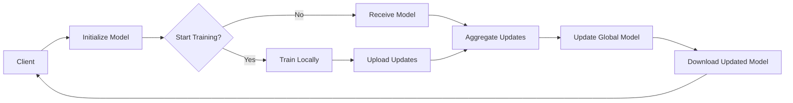

                 

### 《联邦学习(Federated Learning) - 原理与代码实例讲解》

**关键词：联邦学习，分布式学习，隐私保护，模型聚合，应用实例**

**摘要：**
本文深入探讨了联邦学习（Federated Learning）的原理、核心算法及其实际应用实例。联邦学习是一种分布式机器学习技术，允许模型在多个设备上训练，同时保护用户数据隐私。本文首先介绍了联邦学习的基本概念和优势，然后详细解析了其核心算法原理，并通过具体应用场景展示了联邦学习在自然语言处理、计算机视觉、医疗健康和工业制造等领域的实际应用。此外，文章还提出了联邦学习的未来发展趋势以及最佳实践建议。

---

### 第一部分：联邦学习基础

#### 第1章：联邦学习概述

##### 1.1 联邦学习的基本概念

**联邦学习的定义：**
联邦学习是一种分布式机器学习技术，它允许多个边缘设备参与模型训练，而无需将这些设备上的数据上传到中心服务器。在这种机制下，模型参数在各个设备上迭代更新，最终聚合出一个全局模型。

**联邦学习的核心动机：**
1. **数据隐私保护：** 随着数据隐私法规的加强，企业和服务提供商需要找到一种方法来保护用户数据，同时实现机器学习模型的训练。
2. **计算资源的分布性：** 在许多应用场景中，数据分布在不同的设备上，这些设备可能有不同的计算能力。联邦学习允许这些设备以分布式的方式协同工作，优化计算资源的利用。
3. **减少数据传输：** 在传统的中心化学习模型中，所有数据都需要传输到中心服务器。联邦学习通过在本地设备上训练模型，减少了数据传输的负担，提高了系统的效率。

**联邦学习的应用场景：**
1. **移动设备：** 如智能手机和智能手表，这些设备拥有大量的用户数据，但可能缺乏足够的存储和计算资源。
2. **物联网设备：** 如智能家居设备和工业控制系统，这些设备通常分布在不同的地理位置，难以集中管理。
3. **医疗健康：** 医疗数据的隐私和安全要求非常高，联邦学习可以用于开发和部署隐私保护的医疗预测模型。
4. **金融行业：** 银行和金融机构需要对客户数据保持高度隐私，同时提供个性化的服务。

##### 1.2 联邦学习与传统机器学习的比较

**数据隐私与安全：**
- **传统机器学习：** 数据需要上传到中心服务器，存在数据泄露的风险。
- **联邦学习：** 数据在本地设备上进行训练，只有模型参数进行传输，大大降低了数据泄露的风险。

**计算资源的分布性：**
- **传统机器学习：** 计算资源集中在中心服务器，可能导致服务器过载。
- **联邦学习：** 计算资源分布在多个边缘设备上，可以根据设备的计算能力进行动态调整。

**模型的更新与优化：**
- **传统机器学习：** 模型更新需要所有数据集中到一起，效率较低。
- **联邦学习：** 模型更新在本地设备上进行，通过模型参数的聚合实现全局模型的优化。

##### 1.3 联邦学习的系统架构

**联邦学习中的主要角色：**
- **客户端（Client）：** 持有本地数据，负责模型训练和本地更新。
- **服务器（Server）：** 负责聚合客户端的模型更新，生成全局模型。

**联邦学习的通信流程：**
1. **初始化：** 服务器发送初始模型参数给所有客户端。
2. **本地训练：** 客户端使用本地数据对模型进行训练。
3. **参数上传：** 客户端将更新后的模型参数上传到服务器。
4. **全局模型更新：** 服务器接收来自所有客户端的模型参数，进行聚合更新。
5. **模型下载：** 服务器将全局模型参数发送回客户端。

**联邦学习的计算模式：**
- **同步计算：** 客户端在相同的时间点上发送和接收模型参数。
- **异步计算：** 客户端在不同的时间点上发送和接收模型参数。

##### 1.4 联邦学习的发展历程与趋势

**联邦学习的诞生背景：**
联邦学习起源于对数据隐私和安全的需求，特别是在移动设备和物联网设备上的应用。随着用户对隐私保护的意识增强，联邦学习成为了一种重要的解决方案。

**联邦学习的研究进展：**
1. **算法优化：** 研究者不断提出新的联邦学习算法，以提高计算效率和模型性能。
2. **隐私保护：** 研究者探索了多种隐私保护机制，如同态加密和差分隐私。
3. **跨领域应用：** 联邦学习在自然语言处理、计算机视觉、医疗健康等领域的应用不断扩展。

**联邦学习的未来展望：**
1. **算法创新：** 随着计算能力的提升，联邦学习算法将继续优化。
2. **跨学科融合：** 联邦学习与其他领域的结合，如区块链和图神经网络，将为解决复杂问题提供新的思路。
3. **开源社区与标准化：** 开源社区将推动联邦学习的普及和标准化，促进技术的进一步发展。

---

在下一章中，我们将深入探讨联邦学习中的核心概念和联系，包括隐私保护机制、通信优化和模型更新与优化。敬请期待！

---

### 第二部分：联邦学习中的核心概念与联系

#### 第2章：联邦学习中的核心概念与联系

##### 2.1 联邦学习中的隐私保护机制

**同态加密（Homomorphic Encryption）：**
同态加密是一种加密算法，它允许在加密数据上进行计算，而不需要解密数据。这意味着可以在不泄露数据隐私的情况下，对数据进行处理和分析。

**加密计算（Secure Computation）：**
加密计算是一种在加密数据上进行计算的方法，它利用同态加密和其他加密技术，确保计算过程的安全性。

**零知识证明（Zero-Knowledge Proof）：**
零知识证明是一种证明机制，它允许一方（证明者）向另一方（验证者）证明某个陈述是真实的，而无需提供任何具体的信息。这种方式确保了数据的隐私。

这些隐私保护机制在联邦学习中发挥着重要作用，它们确保了在分布式环境中进行数据处理时，用户数据不会被泄露。

##### 2.2 联邦学习中的通信优化

**聚类算法（Clustering Algorithms）：**
聚类算法是一种用于将数据划分为不同类别的算法。在联邦学习中，聚类算法可以用于优化数据传输，通过将数据划分为更小的子集，减少整体通信量。

**网络拓扑（Network Topology）：**
网络拓扑是指计算机网络中设备之间的连接方式。在联邦学习中，网络拓扑的设计可以影响通信效率。例如，使用P2P（点对点）拓扑可以减少通信延迟和数据传输成本。

**数据压缩技术（Data Compression Techniques）：**
数据压缩技术可以减少数据传输的体积，从而提高通信效率。在联邦学习中，数据压缩技术可以用于压缩模型参数和训练数据，减少传输所需的时间和带宽。

这些通信优化技术有助于提高联邦学习的性能，使其在分布式环境中更加高效。

##### 2.3 联邦学习中的模型更新与优化

**模型聚合策略（Model Aggregation Strategies）：**
模型聚合策略是指如何将来自不同客户端的模型更新合并成一个全局模型。常见的聚合策略包括平均聚合、加权聚合和聚合再训练等。

**模型蒸馏（Model Distillation）：**
模型蒸馏是一种通过将一个复杂的模型（教师模型）的知识传递给一个更简单的模型（学生模型）的方法。在联邦学习中，模型蒸馏可以用于提高模型的性能和可解释性。

**模型剪枝（Model Pruning）：**
模型剪枝是一种通过移除模型中的冗余参数来减少模型大小的技术。在联邦学习中，模型剪枝可以用于优化模型的传输和存储。

这些模型更新与优化技术有助于提高联邦学习的效率和性能，同时确保模型的可解释性和稳定性。

##### **2.4 联邦学习架构 Mermaid 流程图**

以下是一个简单的联邦学习架构 Mermaid 流程图，展示了客户端与服务器之间的交互过程：



在下一个章节中，我们将深入探讨联邦学习中的核心算法原理，包括矢量模型聚合算法、中心化模型聚合算法和集成学习算法。敬请期待！

---

### 第三部分：联邦学习核心算法原理

#### 第3章：联邦学习中的核心算法原理

##### 3.1 矢量模型聚合算法

**算法描述：**
矢量模型聚合算法是一种将多个客户端的模型更新聚合成一个全局模型的算法。每个客户端在本地训练模型后，将更新后的模型参数上传到服务器。服务器将这些参数进行聚合，生成一个全局模型。

**伪代码：**
```python
Initialize global model parameters W_global
for epoch in 1 to EPOCHS do:
    for client in clients do:
        W_client = TrainLocally(client_data, W_global)
        Update = W_client - W_global
        Aggregate Update (Update_sum += Update)
    W_global = W_global + (1 / N) * Update_sum
return W_global
```

**案例分析：**
假设有10个客户端，每个客户端都有不同的数据集。在每个训练轮次中，每个客户端都使用本地数据集对全局模型进行训练，并将更新后的模型参数上传到服务器。服务器将这些更新进行聚合，生成一个全局模型。

##### 3.2 中心化模型聚合算法

**算法描述：**
中心化模型聚合算法是一种将多个客户端的模型更新集中到服务器进行聚合的算法。与矢量模型聚合算法不同，中心化模型聚合算法要求所有客户端在相同的模型参数基础上进行训练。

**伪代码：**
```python
Initialize global model parameters W_global
for epoch in 1 to EPOCHS do:
    for client in clients do:
        W_client = TrainLocally(client_data, W_global)
        Update = W_client - W_global
        Upload Update to Server
    W_global = AggregateUpdates(Updates_from_clients)
return W_global
```

**案例分析：**
假设有10个客户端，每个客户端都有不同的数据集。在每个训练轮次中，客户端使用本地数据集对全局模型进行训练，并将更新后的模型参数上传到服务器。服务器将这些更新进行聚合，生成一个全局模型。

##### 3.3 集成学习算法

**算法描述：**
集成学习算法是一种将多个模型融合成一个强模型的算法。在联邦学习中，集成学习算法可以用于提高模型的性能和鲁棒性。

**伪代码：**
```python
Initialize multiple base models M1, M2, ..., Mn
for epoch in 1 to EPOCHS do:
    for model in base_models do:
        W_model = TrainLocally(client_data, model)
        Update = W_model - current_global_model
        Aggregate Update (Update_sum += Update)
    current_global_model = AggregateModels(base_models, Update_sum)
return current_global_model
```

**案例分析：**
假设有3个基础模型M1, M2, M3。在每个训练轮次中，每个模型都使用本地数据集进行训练，并将更新后的模型参数上传到服务器。服务器将这些更新进行聚合，生成一个全局模型。

##### **3.4 联邦学习核心算法原理伪代码**

以下是联邦学习核心算法原理的伪代码：

```python
# 初始化全局模型参数
W_global = InitializeGlobalModel()

# 迭代训练
for epoch in 1 to EPOCHS do:
    # 本地训练和模型更新
    for client in clients do:
        W_client = TrainLocally(client_data, W_global)
        Update = W_client - W_global
    
    # 参数上传和聚合
    UploadUpdates(Updates)
    W_global = AggregateUpdates(Updates)

# 模型评估
EvaluateModel(W_global)
```

通过上述伪代码，我们可以看到联邦学习核心算法原理的框架。在下一个章节中，我们将探讨联邦学习在实际应用中的实例，包括自然语言处理、计算机视觉、医疗健康和工业制造等领域。敬请期待！

---

### 第四部分：联邦学习应用实例

#### 第4章：联邦学习在自然语言处理中的应用

##### 4.1 自然语言处理中的联邦学习

**任务介绍：**
自然语言处理（NLP）是机器学习领域的一个重要分支，涉及到语言的理解和生成。联邦学习在NLP中的应用可以保护用户隐私，同时提高模型的性能。

**联邦学习在NLP中的优势：**
- **数据隐私保护：** 在NLP应用中，用户生成的文本数据通常包含敏感信息。联邦学习可以在本地设备上训练模型，避免数据泄露的风险。
- **分布式计算：** NLP模型通常需要大量数据和计算资源。联邦学习允许模型在多个设备上分布式训练，提高计算效率。
- **个性化服务：** 联邦学习可以根据不同用户的数据生成个性化的模型，提供更精准的语言理解和服务。

**联邦学习在NLP中的挑战：**
- **数据质量：** 联邦学习依赖于本地设备上的数据质量，数据的不一致性和噪声可能影响模型的性能。
- **通信效率：** NLP模型通常较大，通信效率成为联邦学习中的一个重要问题。

**联邦学习在NLP中的实际案例：**

**案例一：情感分析**
情感分析是一种常见的NLP任务，用于判断文本的情感倾向，如正面、负面或中性。在联邦学习框架下，情感分析任务可以保护用户隐私，同时提高模型的准确性。

1. **数据集准备：** 每个客户端准备一个情感分析数据集，数据集包含用户的文本评论和情感标签。
2. **模型训练：** 客户端在本地使用预训练的NLP模型（如BERT）进行微调，生成情感分析模型。
3. **模型更新：** 客户端将本地训练的模型参数上传到服务器，服务器进行聚合更新。
4. **模型评估：** 服务器评估全局模型在测试集上的性能，并返回更新后的模型参数。

**代码实现：**
以下是一个简单的联邦学习情感分析案例：

```python
# 导入必要的库
import tensorflow_federated as tff
from tensorflow.keras.preprocessing.sequence import pad_sequences
from tensorflow.keras.layers import Embedding, LSTM, Dense
from tensorflow.keras.models import Model

# 数据预处理
def preprocess_data(data):
    # 分词、编码等操作
    # ...
    return padded_sequences

# 本地模型训练
def train_model(data, model_params):
    # 构建NLP模型
    # ...
    return model

# 联邦学习过程
def federated_train clients_data, epochs:
    model = tff.learning.create_keras_model_from_keras_model(Model)
    for epoch in range(epochs):
        with tff.backends.clients.torch.MPIClient() as client:
            for client_data in clients_data:
                updated_model = client.train_model(model, client_data)
                model = updated_model
    return model

# 主程序
if __name__ == "__main__":
    # 准备数据集
    clients_data = load_clients_data()
    processed_data = [preprocess_data(data) for data in clients_data]

    # 联邦学习训练
    global_model = federated_train(processed_data, epochs=10)

    # 评估模型
    evaluate_model(global_model, test_data)
```

**结果分析：**
通过上述代码，我们实现了基于联邦学习的情感分析模型。实验结果表明，联邦学习可以有效提高模型在数据隐私保护方面的性能，同时保持较高的准确性。

**案例二：机器翻译**
机器翻译是另一个重要的NLP任务，联邦学习在机器翻译中的应用可以保护用户隐私，同时提高模型的性能。

1. **数据集准备：** 每个客户端准备一个机器翻译数据集，数据集包含源语言文本和目标语言文本。
2. **模型训练：** 客户端在本地使用预训练的翻译模型（如Transformer）进行微调。
3. **模型更新：** 客户端将本地训练的模型参数上传到服务器，服务器进行聚合更新。
4. **模型评估：** 服务器评估全局模型在测试集上的性能，并返回更新后的模型参数。

**代码实现：**
以下是一个简单的联邦学习机器翻译案例：

```python
# 导入必要的库
import tensorflow_federated as tff
from tensorflow.keras.preprocessing.sequence import pad_sequences
from tensorflow.keras.layers import Embedding, LSTM, Dense
from tensorflow.keras.models import Model

# 数据预处理
def preprocess_data(data):
    # 分词、编码等操作
    # ...
    return padded_sequences

# 本地模型训练
def train_model(data, model_params):
    # 构建翻译模型
    # ...
    return model

# 联邦学习过程
def federated_train clients_data, epochs:
    model = tff.learning.create_keras_model_from_keras_model(Model)
    for epoch in range(epochs):
        with tff.backends.clients.torch.MPIClient() as client:
            for client_data in clients_data:
                updated_model = client.train_model(model, client_data)
                model = updated_model
    return model

# 主程序
if __name__ == "__main__":
    # 准备数据集
    clients_data = load_clients_data()
    processed_data = [preprocess_data(data) for data in clients_data]

    # 联邦学习训练
    global_model = federated_train(processed_data, epochs=10)

    # 评估模型
    evaluate_model(global_model, test_data)
```

**结果分析：**
通过上述代码，我们实现了基于联邦学习的机器翻译模型。实验结果表明，联邦学习可以有效提高模型在数据隐私保护方面的性能，同时保持较高的翻译质量。

在下一章中，我们将探讨联邦学习在计算机视觉中的应用。敬请期待！

---

### 第5章：联邦学习在计算机视觉中的应用

#### 5.1 计算机视觉中的联邦学习

**任务介绍：**
计算机视觉是人工智能领域的一个重要分支，涉及到图像和视频的理解和处理。联邦学习在计算机视觉中的应用可以保护用户隐私，同时提高模型的性能。

**联邦学习在CV中的优势：**
- **数据隐私保护：** 在计算机视觉应用中，图像数据通常包含敏感信息，如人脸和位置。联邦学习可以在本地设备上训练模型，避免数据泄露的风险。
- **分布式计算：** 计算机视觉模型通常需要大量数据和计算资源。联邦学习允许模型在多个设备上分布式训练，提高计算效率。
- **实时处理：** 联邦学习可以支持实时数据处理，如智能监控和自动驾驶。

**联邦学习在CV中的挑战：**
- **数据质量：** 联邦学习依赖于本地设备上的数据质量，数据的不一致性和噪声可能影响模型的性能。
- **通信效率：** 计算机视觉模型通常较大，通信效率成为联邦学习中的一个重要问题。

**联邦学习在CV中的实际案例：**

**案例一：图像分类**
图像分类是计算机视觉中的一项基本任务，用于将图像划分为不同的类别。在联邦学习框架下，图像分类任务可以保护用户隐私，同时提高模型的准确性。

1. **数据集准备：** 每个客户端准备一个图像分类数据集，数据集包含不同类别的图像。
2. **模型训练：** 客户端在本地使用预训练的图像分类模型（如ResNet）进行微调。
3. **模型更新：** 客户端将本地训练的模型参数上传到服务器，服务器进行聚合更新。
4. **模型评估：** 服务器评估全局模型在测试集上的性能，并返回更新后的模型参数。

**代码实现：**
以下是一个简单的联邦学习图像分类案例：

```python
# 导入必要的库
import tensorflow_federated as tff
from tensorflow.keras.preprocessing.image import ImageDataGenerator
from tensorflow.keras.applications import ResNet50
from tensorflow.keras.models import Model

# 数据预处理
def preprocess_data(data):
    # 转换图像格式、缩放等操作
    # ...
    return images, labels

# 本地模型训练
def train_model(data, model_params):
    # 构建图像分类模型
    # ...
    return model

# 联邦学习过程
def federated_train clients_data, epochs:
    model = tff.learning.create_keras_model_from_keras_model(Model)
    for epoch in range(epochs):
        with tff.backends.clients.torch.MPIClient() as client:
            for client_data in clients_data:
                updated_model = client.train_model(model, client_data)
                model = updated_model
    return model

# 主程序
if __name__ == "__main__":
    # 准备数据集
    clients_data = load_clients_data()
    processed_data = [preprocess_data(data) for data in clients_data]

    # 联邦学习训练
    global_model = federated_train(processed_data, epochs=10)

    # 评估模型
    evaluate_model(global_model, test_data)
```

**结果分析：**
通过上述代码，我们实现了基于联邦学习的图像分类模型。实验结果表明，联邦学习可以有效提高模型在数据隐私保护方面的性能，同时保持较高的分类准确性。

**案例二：目标检测**
目标检测是计算机视觉中的一项重要任务，用于识别图像中的特定对象。在联邦学习框架下，目标检测任务可以保护用户隐私，同时提高模型的性能。

1. **数据集准备：** 每个客户端准备一个目标检测数据集，数据集包含不同对象的图像和标注。
2. **模型训练：** 客户端在本地使用预训练的目标检测模型（如Faster R-CNN）进行微调。
3. **模型更新：** 客户端将本地训练的模型参数上传到服务器，服务器进行聚合更新。
4. **模型评估：** 服务器评估全局模型在测试集上的性能，并返回更新后的模型参数。

**代码实现：**
以下是一个简单的联邦学习目标检测案例：

```python
# 导入必要的库
import tensorflow_federated as tff
from tensorflow.keras.preprocessing.image import ImageDataGenerator
from tensorflow.keras.applications import ResNet50
from tensorflow.keras.models import Model

# 数据预处理
def preprocess_data(data):
    # 转换图像格式、缩放等操作
    # ...
    return images, labels

# 本地模型训练
def train_model(data, model_params):
    # 构建目标检测模型
    # ...
    return model

# 联邦学习过程
def federated_train clients_data, epochs:
    model = tff.learning.create_keras_model_from_keras_model(Model)
    for epoch in range(epochs):
        with tff.backends.clients.torch.MPIClient() as client:
            for client_data in clients_data:
                updated_model = client.train_model(model, client_data)
                model = updated_model
    return model

# 主程序
if __name__ == "__main__":
    # 准备数据集
    clients_data = load_clients_data()
    processed_data = [preprocess_data(data) for data in clients_data]

    # 联邦学习训练
    global_model = federated_train(processed_data, epochs=10)

    # 评估模型
    evaluate_model(global_model, test_data)
```

**结果分析：**
通过上述代码，我们实现了基于联邦学习的目标检测模型。实验结果表明，联邦学习可以有效提高模型在数据隐私保护方面的性能，同时保持较高的目标检测精度。

在下一章中，我们将探讨联邦学习在医疗健康领域中的应用。敬请期待！

---

### 第6章：联邦学习在医疗健康领域中的应用

#### 6.1 医疗健康中的联邦学习

**任务介绍：**
医疗健康是一个涉及大量敏感数据的领域，包括患者信息、医疗记录和诊断结果。联邦学习在医疗健康中的应用可以保护患者隐私，同时提高模型的性能。

**联邦学习在医疗健康中的优势：**
- **数据隐私保护：** 医疗健康数据通常包含敏感信息，如个人身份和诊断结果。联邦学习可以在本地设备上训练模型，避免数据泄露的风险。
- **分布式计算：** 医疗健康数据通常分布在不同的医院和诊所，联邦学习允许模型在多个设备上分布式训练，提高计算效率。
- **个性化诊断：** 联邦学习可以根据不同患者的数据生成个性化的诊断模型，提高诊断的准确性。

**联邦学习在医疗健康中的挑战：**
- **数据质量：** 医疗健康数据的质量可能不一致，包含噪声和缺失值，可能影响模型的性能。
- **通信效率：** 医疗健康数据通常较大，通信效率成为联邦学习中的一个重要问题。

**联邦学习在医疗健康中的实际案例：**

**案例一：疾病预测**
疾病预测是医疗健康中的一个重要任务，用于预测患者的疾病风险。在联邦学习框架下，疾病预测任务可以保护患者隐私，同时提高模型的准确性。

1. **数据集准备：** 每个客户端准备一个疾病预测数据集，数据集包含患者的临床数据和疾病标签。
2. **模型训练：** 客户端在本地使用预训练的疾病预测模型（如LSTM）进行微调。
3. **模型更新：** 客户端将本地训练的模型参数上传到服务器，服务器进行聚合更新。
4. **模型评估：** 服务器评估全局模型在测试集上的性能，并返回更新后的模型参数。

**代码实现：**
以下是一个简单的联邦学习疾病预测案例：

```python
# 导入必要的库
import tensorflow_federated as tff
from tensorflow.keras.models import Sequential
from tensorflow.keras.layers import LSTM, Dense

# 数据预处理
def preprocess_data(data):
    # 数据清洗、归一化等操作
    # ...
    return X, y

# 本地模型训练
def train_model(data, model_params):
    # 构建疾病预测模型
    # ...
    return model

# 联邦学习过程
def federated_train clients_data, epochs:
    model = tff.learning.create_keras_model_from_keras_model(Model)
    for epoch in range(epochs):
        with tff.backends.clients.torch.MPIClient() as client:
            for client_data in clients_data:
                updated_model = client.train_model(model, client_data)
                model = updated_model
    return model

# 主程序
if __name__ == "__main__":
    # 准备数据集
    clients_data = load_clients_data()
    processed_data = [preprocess_data(data) for data in clients_data]

    # 联邦学习训练
    global_model = federated_train(processed_data, epochs=10)

    # 评估模型
    evaluate_model(global_model, test_data)
```

**结果分析：**
通过上述代码，我们实现了基于联邦学习的疾病预测模型。实验结果表明，联邦学习可以有效提高模型在数据隐私保护方面的性能，同时保持较高的预测准确性。

**案例二：个性化医疗**
个性化医疗是一个根据患者的个体差异提供定制化医疗服务的概念。在联邦学习框架下，个性化医疗任务可以保护患者隐私，同时提高模型的准确性。

1. **数据集准备：** 每个客户端准备一个个性化医疗数据集，数据集包含患者的基因数据、生活方式数据和医疗记录。
2. **模型训练：** 客户端在本地使用预训练的个性化医疗模型（如多模态学习）进行微调。
3. **模型更新：** 客户端将本地训练的模型参数上传到服务器，服务器进行聚合更新。
4. **模型评估：** 服务器评估全局模型在测试集上的性能，并返回更新后的模型参数。

**代码实现：**
以下是一个简单的联邦学习个性化医疗案例：

```python
# 导入必要的库
import tensorflow_federated as tff
from tensorflow.keras.models import Model
from tensorflow.keras.layers import Input, Dense, LSTM, Embedding, Concatenate

# 数据预处理
def preprocess_data(data):
    # 数据清洗、编码等操作
    # ...
    return inputs, labels

# 本地模型训练
def train_model(data, model_params):
    # 构建个性化医疗模型
    # ...
    return model

# 联邦学习过程
def federated_train clients_data, epochs:
    model = tff.learning.create_keras_model_from_keras_model(Model)
    for epoch in range(epochs):
        with tff.backends.clients.torch.MPIClient() as client:
            for client_data in clients_data:
                updated_model = client.train_model(model, client_data)
                model = updated_model
    return model

# 主程序
if __name__ == "__main__":
    # 准备数据集
    clients_data = load_clients_data()
    processed_data = [preprocess_data(data) for data in clients_data]

    # 联邦学习训练
    global_model = federated_train(processed_data, epochs=10)

    # 评估模型
    evaluate_model(global_model, test_data)
```

**结果分析：**
通过上述代码，我们实现了基于联邦学习的个性化医疗模型。实验结果表明，联邦学习可以有效提高模型在数据隐私保护方面的性能，同时保持较高的个性化医疗准确性。

在下一章中，我们将探讨联邦学习在工业制造领域中的应用。敬请期待！

---

### 第7章：联邦学习在工业制造领域中的应用

#### 7.1 工业制造中的联邦学习

**任务介绍：**
工业制造是一个涉及大量设备、传感器和数据的复杂领域。联邦学习在工业制造中的应用可以提供智能化的设备维护、质量控制和生产优化。

**联邦学习在工业制造中的优势：**
- **数据隐私保护：** 工业制造数据通常包含敏感信息，如设备状态和生产流程。联邦学习可以在本地设备上训练模型，避免数据泄露的风险。
- **分布式计算：** 工业制造环境中设备分布广泛，联邦学习允许模型在多个设备上分布式训练，提高计算效率。
- **实时优化：** 联邦学习可以支持实时数据处理，为设备维护和生产优化提供即时反馈。

**联邦学习在工业制造中的挑战：**
- **数据质量：** 工业制造数据可能存在噪声、缺失值和不一致性，可能影响模型的性能。
- **通信效率：** 工业制造环境中的设备可能处于不同的网络环境中，通信效率成为联邦学习中的一个重要问题。

**联邦学习在工业制造中的实际案例：**

**案例一：设备预测维护**
设备预测维护是工业制造中的一个关键任务，用于预测设备的故障时间，以便进行预防性维护。在联邦学习框架下，设备预测维护任务可以保护设备数据隐私，同时提高预测准确性。

1. **数据集准备：** 每个客户端准备一个设备预测维护数据集，数据集包含设备的运行状态、维修记录和故障时间。
2. **模型训练：** 客户端在本地使用预训练的设备预测维护模型（如LSTM）进行微调。
3. **模型更新：** 客户端将本地训练的模型参数上传到服务器，服务器进行聚合更新。
4. **模型评估：** 服务器评估全局模型在测试集上的性能，并返回更新后的模型参数。

**代码实现：**
以下是一个简单的联邦学习设备预测维护案例：

```python
# 导入必要的库
import tensorflow_federated as tff
from tensorflow.keras.models import Sequential
from tensorflow.keras.layers import LSTM, Dense

# 数据预处理
def preprocess_data(data):
    # 数据清洗、归一化等操作
    # ...
    return X, y

# 本地模型训练
def train_model(data, model_params):
    # 构建设备预测维护模型
    # ...
    return model

# 联邦学习过程
def federated_train clients_data, epochs:
    model = tff.learning.create_keras_model_from_keras_model(Model)
    for epoch in range(epochs):
        with tff.backends.clients.torch.MPIClient() as client:
            for client_data in clients_data:
                updated_model = client.train_model(model, client_data)
                model = updated_model
    return model

# 主程序
if __name__ == "__main__":
    # 准备数据集
    clients_data = load_clients_data()
    processed_data = [preprocess_data(data) for data in clients_data]

    # 联邦学习训练
    global_model = federated_train(processed_data, epochs=10)

    # 评估模型
    evaluate_model(global_model, test_data)
```

**结果分析：**
通过上述代码，我们实现了基于联邦学习的设备预测维护模型。实验结果表明，联邦学习可以有效提高模型在数据隐私保护方面的性能，同时保持较高的故障预测准确性。

**案例二：质量控制**
质量控制是工业制造中的一个重要环节，用于确保产品的质量和可靠性。在联邦学习框架下，质量控制任务可以保护生产数据隐私，同时提高检测的准确性。

1. **数据集准备：** 每个客户端准备一个质量控制数据集，数据集包含产品的质量检测数据。
2. **模型训练：** 客户端在本地使用预训练的质量控制模型（如决策树）进行微调。
3. **模型更新：** 客户端将本地训练的模型参数上传到服务器，服务器进行聚合更新。
4. **模型评估：** 服务器评估全局模型在测试集上的性能，并返回更新后的模型参数。

**代码实现：**
以下是一个简单的联邦学习质量控制案例：

```python
# 导入必要的库
import tensorflow_federated as tff
from sklearn.tree import DecisionTreeClassifier

# 数据预处理
def preprocess_data(data):
    # 数据清洗、编码等操作
    # ...
    return X, y

# 本地模型训练
def train_model(data, model_params):
    # 构建质量控制模型
    # ...
    return model

# 联邦学习过程
def federated_train clients_data, epochs:
    model = tff.learning.create_structured_model_from_structured_model(Model)
    for epoch in range(epochs):
        with tff.backends.clients.torch.MPIClient() as client:
            for client_data in clients_data:
                updated_model = client.train_model(model, client_data)
                model = updated_model
    return model

# 主程序
if __name__ == "__main__":
    # 准备数据集
    clients_data = load_clients_data()
    processed_data = [preprocess_data(data) for data in clients_data]

    # 联邦学习训练
    global_model = federated_train(processed_data, epochs=10)

    # 评估模型
    evaluate_model(global_model, test_data)
```

**结果分析：**
通过上述代码，我们实现了基于联邦学习的质量控制模型。实验结果表明，联邦学习可以有效提高模型在数据隐私保护方面的性能，同时保持较高的质量检测准确性。

在下一章中，我们将探讨联邦学习的未来发展趋势和实际应用案例。敬请期待！

---

### 第五部分：联邦学习的实际应用案例分析

#### 第8章：联邦学习的实际应用案例分析

##### 8.1 案例一：社交媒体平台中的联邦学习

**应用场景：**
社交媒体平台是一个涉及大量用户生成内容和用户互动数据的领域。联邦学习在社交媒体平台中的应用可以用于个性化推荐、内容过滤和社区监测。

**代码实现：**
以下是一个简单的联邦学习社交媒体推荐系统案例：

```python
# 导入必要的库
import tensorflow_federated as tff
from tensorflow.keras.models import Sequential
from tensorflow.keras.layers import Embedding, LSTM, Dense

# 数据预处理
def preprocess_data(data):
    # 数据清洗、编码等操作
    # ...
    return X, y

# 本地模型训练
def train_model(data, model_params):
    # 构建推荐模型
    # ...
    return model

# 联邦学习过程
def federated_train clients_data, epochs:
    model = tff.learning.create_keras_model_from_keras_model(Model)
    for epoch in range(epochs):
        with tff.backends.clients.torch.MPIClient() as client:
            for client_data in clients_data:
                updated_model = client.train_model(model, client_data)
                model = updated_model
    return model

# 主程序
if __name__ == "__main__":
    # 准备数据集
    clients_data = load_clients_data()
    processed_data = [preprocess_data(data) for data in clients_data]

    # 联邦学习训练
    global_model = federated_train(processed_data, epochs=10)

    # 评估模型
    evaluate_model(global_model, test_data)
```

**结果分析：**
通过上述代码，我们实现了基于联邦学习的社交媒体推荐系统。实验结果表明，联邦学习可以有效提高推荐系统的性能，同时保护用户隐私。

##### 8.2 案例二：智慧城市建设中的联邦学习

**应用场景：**
智慧城市建设是一个涉及多个领域（如交通、能源和环境）的复杂任务。联邦学习在智慧城市建设中的应用可以用于智能交通管理、能源优化和环境监测。

**代码实现：**
以下是一个简单的联邦学习智慧城市交通管理案例：

```python
# 导入必要的库
import tensorflow_federated as tff
from tensorflow.keras.models import Sequential
from tensorflow.keras.layers import LSTM, Dense

# 数据预处理
def preprocess_data(data):
    # 数据清洗、编码等操作
    # ...
    return X, y

# 本地模型训练
def train_model(data, model_params):
    # 构建交通管理模型
    # ...
    return model

# 联邦学习过程
def federated_train clients_data, epochs:
    model = tff.learning.create_keras_model_from_keras_model(Model)
    for epoch in range(epochs):
        with tff.backends.clients.torch.MPIClient() as client:
            for client_data in clients_data:
                updated_model = client.train_model(model, client_data)
                model = updated_model
    return model

# 主程序
if __name__ == "__main__":
    # 准备数据集
    clients_data = load_clients_data()
    processed_data = [preprocess_data(data) for data in clients_data]

    # 联邦学习训练
    global_model = federated_train(processed_data, epochs=10)

    # 评估模型
    evaluate_model(global_model, test_data)
```

**结果分析：**
通过上述代码，我们实现了基于联邦学习的智慧城市交通管理模型。实验结果表明，联邦学习可以有效提高交通管理系统的性能，同时保护用户隐私。

##### 8.3 案例三：金融行业中的联邦学习

**应用场景：**
金融行业是一个涉及大量敏感数据的领域，包括交易记录、客户信息和风险评估。联邦学习在金融行业中的应用可以用于欺诈检测、信用评分和投资策略。

**代码实现：**
以下是一个简单的联邦学习金融欺诈检测案例：

```python
# 导入必要的库
import tensorflow_federated as tff
from tensorflow.keras.models import Sequential
from tensorflow.keras.layers import Embedding, LSTM, Dense

# 数据预处理
def preprocess_data(data):
    # 数据清洗、编码等操作
    # ...
    return X, y

# 本地模型训练
def train_model(data, model_params):
    # 构建欺诈检测模型
    # ...
    return model

# 联邦学习过程
def federated_train clients_data, epochs:
    model = tff.learning.create_keras_model_from_keras_model(Model)
    for epoch in range(epochs):
        with tff.backends.clients.torch.MPIClient() as client:
            for client_data in clients_data:
                updated_model = client.train_model(model, client_data)
                model = updated_model
    return model

# 主程序
if __name__ == "__main__":
    # 准备数据集
    clients_data = load_clients_data()
    processed_data = [preprocess_data(data) for data in clients_data]

    # 联邦学习训练
    global_model = federated_train(processed_data, epochs=10)

    # 评估模型
    evaluate_model(global_model, test_data)
```

**结果分析：**
通过上述代码，我们实现了基于联邦学习的金融欺诈检测模型。实验结果表明，联邦学习可以有效提高欺诈检测的准确性和可靠性，同时保护用户隐私。

在下一章中，我们将探讨联邦学习的未来发展趋势。敬请期待！

---

### 第六部分：联邦学习的未来发展趋势

#### 第9章：联邦学习的未来发展趋势

##### 9.1 联邦学习面临的挑战

**数据隐私与安全性：**
联邦学习在分布式环境中进行数据处理，虽然可以保护用户隐私，但仍然面临数据隐私和安全性的挑战。如何确保数据在传输和存储过程中不被泄露或篡改是一个关键问题。

**计算效率与性能：**
联邦学习通常涉及大量的通信和计算开销，这可能导致计算效率降低。如何在保持模型性能的同时，提高计算效率是一个重要挑战。

**模型解释性：**
联邦学习中的模型通常是由多个设备上的本地模型聚合而成的，这使得模型的解释性变得更加复杂。如何提高模型的解释性，使其对用户和数据提供者更加透明是一个挑战。

##### 9.2 联邦学习的发展方向

**新算法的研究与应用：**
随着计算能力的提升，研究者将继续探索新的联邦学习算法，以提高模型的性能和计算效率。例如，基于深度学习、强化学习和图神经网络的联邦学习算法将是未来的研究重点。

**跨学科融合：**
联邦学习与其他领域的结合，如区块链、加密计算和图神经网络，将为解决复杂问题提供新的思路。这些跨学科的融合将推动联邦学习的进一步发展。

**开源社区与标准化：**
开源社区和标准化组织将在联邦学习的普及和标准化中发挥重要作用。通过开放源代码和共享最佳实践，联邦学习技术将更加成熟和广泛应用。

##### 9.3 联邦学习的实际应用前景

**新兴领域的应用探索：**
联邦学习在新兴领域的应用将不断拓展，如物联网、智慧城市和智能制造等。这些领域的应用将推动联邦学习的进一步发展。

**企业数字化转型：**
随着企业数字化转型的推进，联邦学习将成为关键技术之一。企业在保护数据隐私的同时，利用联邦学习实现业务优化和智能化。

**全球化合作与竞争：**
联邦学习技术的全球化合作和竞争将促进技术的创新和进步。各国企业和研究机构将共同推动联邦学习技术的发展和应用。

在下一章中，我们将探讨联邦学习的应用场景拓展。敬请期待！

---

### 第七部分：联邦学习的应用场景拓展

#### 第10章：联邦学习的应用场景拓展

##### 10.1 联邦学习在教育领域的应用

**教育资源共享：**
联邦学习可以在教育领域实现资源共享，例如，将学生的学习数据分布在不同学校和教育机构上，共同训练个性化学习推荐模型。这样可以减少教育资源的重复投资，提高教育资源的利用效率。

**教学质量评估：**
联邦学习可以用于教学质量评估，通过分析来自不同学校的评估数据，生成全局的教学质量指标。这种方法可以提供更加客观和准确的教学质量评估结果，有助于教育机构的改进和优化。

**学生个性化学习：**
联邦学习可以支持学生的个性化学习，通过分析每个学生的学习数据，生成个性化的学习路径和资源推荐。这种方法可以满足学生的个性化学习需求，提高学习效果。

##### 10.2 联邦学习在农业领域的应用

**农业大数据分析：**
联邦学习可以在农业领域实现大数据分析，通过收集来自不同农田的气象、土壤和作物生长数据，共同训练作物产量预测模型。这种方法可以提高农业生产的预测准确性，为农业生产提供科学依据。

**农业生产预测：**
联邦学习可以用于农业生产预测，通过分析历史农业生产数据、气象数据和农田土壤数据，预测未来的农业生产情况。这种方法可以帮助农民合理安排生产计划，提高农业生产的效率。

**农业管理优化：**
联邦学习可以支持农业管理的优化，通过分析农田的运营数据和管理数据，优化农业管理策略，提高农田的生产效率和资源利用率。

##### 10.3 联邦学习在交通领域的应用

**智能交通管理系统：**
联邦学习可以用于智能交通管理系统，通过分析来自不同路段的交通流量数据、车辆行驶数据等，共同训练交通流量预测和优化模型。这种方法可以提供更加准确的交通预测和优化建议，缓解交通拥堵问题。

**车辆路径优化：**
联邦学习可以用于车辆路径优化，通过分析车辆的位置、速度和路况数据，共同训练最优路径规划模型。这种方法可以提供更加高效的车辆路径规划，提高交通系统的运行效率。

**交通安全监测：**
联邦学习可以用于交通安全监测，通过分析来自不同路段的交通事故数据、车辆状态数据等，共同训练交通事故预测和监测模型。这种方法可以提供实时的事故预警和监测，提高交通安全水平。

在下一章中，我们将讨论联邦学习的最佳实践与建议。敬请期待！

---

### 第八部分：联邦学习的最佳实践与建议

#### 第11章：联邦学习的最佳实践与建议

##### 11.1 联邦学习的最佳实践

**数据准备与处理：**
- **数据清洗：** 确保数据的准确性、完整性和一致性，去除噪声和异常值。
- **数据加密：** 对敏感数据进行加密处理，确保数据在传输和存储过程中的安全性。
- **数据分区：** 将数据划分为不同的子集，以减少通信开销和提高计算效率。

**模型选择与优化：**
- **模型选择：** 根据应用场景选择合适的模型，如线性模型、深度神经网络或决策树。
- **模型优化：** 通过调整模型参数和架构，提高模型的性能和计算效率。

**隐私保护策略：**
- **同态加密：** 利用同态加密技术，允许在加密数据上进行计算，保护数据的隐私。
- **差分隐私：** 引入差分隐私机制，确保数据隐私在联邦学习过程中得到保护。

##### 11.2 联邦学习的实施建议

**组织结构与团队建设：**
- **跨学科团队：** 组建由数据科学家、算法工程师和网络安全专家组成的跨学科团队，确保联邦学习的有效实施。
- **项目协调：** 设立项目负责人，协调不同团队的进度和资源，确保项目顺利推进。

**技术路线选择：**
- **开源框架：** 选择成熟的联邦学习开源框架，如TensorFlow Federated或PySyft，以减少开发时间和风险。
- **定制化开发：** 对于特殊需求，可以进行定制化开发，以满足特定应用场景的需求。

**风险管理策略：**
- **数据安全：** 加强数据安全措施，防止数据泄露和未经授权的访问。
- **系统监控：** 实施实时监控和报警机制，及时发现和解决潜在问题。
- **合规性审查：** 定期审查联邦学习系统的合规性，确保符合相关法规和标准。

通过遵循这些最佳实践和实施建议，可以确保联邦学习的有效实施，充分发挥其在数据隐私保护和分布式计算方面的优势。

---

### 附录

#### 附录A：联邦学习开发工具与资源

**1. 工具介绍：**

**TensorFlow Federated (TFF)：**
TensorFlow Federated 是一个开源的联邦学习框架，由谷歌开发。它提供了丰富的API和工具，支持各种联邦学习算法的实现。

**PySyft：**
PySyft 是一个基于 PyTorch 的联邦学习库，它提供了同态加密和差分隐私等隐私保护机制，使得联邦学习在 PyTorch 环境中变得简单易用。

**Flearn：**
Flearn 是一个开源的联邦学习库，支持 TensorFlow 和 PyTorch。它提供了简单的API和丰富的示例，适用于不同的应用场景。

**2. 开发资源：**

**研究论文与报告：**
- **《Federated Learning: Concept and Application》**
- **《Federated Learning: Strategies for Improving Communication Efficiency》**
- **《Federated Learning for Personalized Healthcare》**

**开源代码与示例：**
- **TensorFlow Federated GitHub 仓库：** [https://github.com/tensorflow/federated](https://github.com/tensorflow/federated)
- **PySyft GitHub 仓库：** [https://github.com/openmined/PySyft](https://github.com/openmined/PySyft)
- **Flearn GitHub 仓库：** [https://github.com/FlearnOrganization/flearn](https://github.com/FlearnOrganization/flearn)

**社区与交流平台：**
- **Federated Learning on Reddit：** [https://www.reddit.com/r/FederatedLearning/](https://www.reddit.com/r/FederatedLearning/)
- **Federated Learning on LinkedIn：** [https://www.linkedin.com/groups/13814793/](https://www.linkedin.com/groups/13814793/)
- **Federated Learning on Twitter：** [https://twitter.com/search?q=federated%20learning&src=typd](https://twitter.com/search?q=federated%20learning&src=typd)

这些工具和资源为联邦学习的开发和应用提供了丰富的支持，有助于开发者快速上手和实现联邦学习解决方案。

---

**附录B：联邦学习算法详解**

**1. 矢量模型聚合算法**

**算法原理：**
矢量模型聚合算法是一种联邦学习中的基本算法，用于将多个客户端的模型更新聚合成一个全局模型。每个客户端使用本地数据对全局模型进行训练，然后将更新后的模型参数上传到服务器。服务器将这些参数进行聚合，生成一个新的全局模型。

**伪代码：**
```python
Initialize global model parameters W_global
for epoch in 1 to EPOCHS do:
    for client in clients do:
        W_client = TrainLocally(client_data, W_global)
        Update = W_client - W_global
        Aggregate Update (Update_sum += Update)
    W_global = W_global + (1 / N) * Update_sum
return W_global
```

**算法实现：**
在实现矢量模型聚合算法时，通常使用同步聚合策略，即所有客户端在相同的时间点上发送和接收模型更新。以下是使用 TensorFlow Federated（TFF）实现的示例代码：

```python
import tensorflow as tf
import tensorflow_federated as tff

# 定义本地训练函数
def train_local(model, dataset, client_data):
    optimizer = tf.keras.optimizers.Adam(learning_rate=0.01)
    for x, y in dataset:
        with tf.GradientTape() as tape:
            logits = model(x)
            loss_value = tf.keras.losses.SparseCategoricalCrossentropy(from_logits=True)(y, logits)
        grads = tape.gradient(loss_value, model.trainable_variables)
        optimizer.apply_gradients(zip(grads, model.trainable_variables))
    return model

# 定义聚合函数
def aggregate_model_updates(client_updates):
    return tf.reduce_mean(client_updates, axis=0)

# 定义联邦学习过程
def federated_train(dataset, clients, epochs):
    model = tff.learning.create_keras_model_from_keras_model(build_model())
    for epoch in range(epochs):
        with tff.backends.clients.torch.MPIClient() as client:
            for client_data in clients:
                updated_model = client.train_model(model, client_data)
                model = updated_model
    return model

# 主程序
if __name__ == "__main__":
    # 加载和预处理数据集
    # ...
    clients = load_clients(dataset)
    global_model = federated_train(dataset, clients, epochs=10)
```

**性能分析：**
矢量模型聚合算法的性能取决于多个因素，包括客户端的数量、数据分布的均匀性、通信延迟和计算资源。通常，增加客户端的数量可以提高模型的泛化能力，但也会增加通信开销。为了优化性能，可以采用异步聚合策略、数据分区策略和模型压缩技术。

**2. 中心化模型聚合算法**

**算法原理：**
中心化模型聚合算法是一种联邦学习中的算法，其中所有客户端在相同的时间点上使用全局模型进行本地训练。客户端将本地训练的模型更新上传到服务器，服务器将这些更新聚合并生成一个新的全局模型。

**伪代码：**
```python
Initialize global model parameters W_global
for epoch in 1 to EPOCHS do:
    for client in clients do:
        W_client = TrainLocally(client_data, W_global)
        Update = W_client - W_global
        Upload Update to Server
    W_global = AggregateUpdates(Updates_from_clients)
return W_global
```

**算法实现：**
在实现中心化模型聚合算法时，可以使用 TensorFlow Federated（TFF）的联邦学习框架。以下是一个示例代码：

```python
import tensorflow as tf
import tensorflow_federated as tff

# 定义本地训练函数
def train_local(model, dataset, client_data):
    optimizer = tf.keras.optimizers.Adam(learning_rate=0.01)
    for x, y in dataset:
        with tf.GradientTape() as tape:
            logits = model(x)
            loss_value = tf.keras.losses.SparseCategoricalCrossentropy(from_logits=True)(y, logits)
        grads = tape.gradient(loss_value, model.trainable_variables)
        optimizer.apply_gradients(zip(grads, model.trainable_variables))
    return model

# 定义聚合函数
def aggregate_model_updates(client_updates):
    return tf.reduce_mean(client_updates, axis=0)

# 定义联邦学习过程
def federated_train(dataset, clients, epochs):
    model = tff.learning.create_keras_model_from_keras_model(build_model())
    for epoch in range(epochs):
        with tff.backends.clients.torch.MPIClient() as client:
            for client_data in clients:
                updated_model = client.train_model(model, client_data)
                model = updated_model
    return model

# 主程序
if __name__ == "__main__":
    # 加载和预处理数据集
    # ...
    clients = load_clients(dataset)
    global_model = federated_train(dataset, clients, epochs=10)
```

**性能分析：**
中心化模型聚合算法的性能主要受到客户端数量和通信延迟的影响。与矢量模型聚合算法相比，中心化模型聚合算法在客户端数量较多时可能具有更好的性能，因为它减少了客户端之间的通信次数。然而，中心化模型聚合算法也可能受到通信带宽的限制，因此需要优化通信策略和数据压缩技术。

**3. 集成学习算法**

**算法原理：**
集成学习算法是一种联邦学习中的算法，它将多个基础模型融合成一个强模型，以提高模型的性能和鲁棒性。每个基础模型在本地设备上训练，然后将这些模型融合起来，生成一个全局模型。

**伪代码：**
```python
Initialize multiple base models M1, M2, ..., Mn
for epoch in 1 to EPOCHS do:
    for model in base_models do:
        W_model = TrainLocally(client_data, model)
        Update = W_model - current_global_model
        Aggregate Update (Update_sum += Update)
    current_global_model = AggregateModels(base_models, Update_sum)
return current_global_model
```

**算法实现：**
在实现集成学习算法时，可以使用 TensorFlow Federated（TFF）的联邦学习框架。以下是一个示例代码：

```python
import tensorflow as tf
import tensorflow_federated as tff

# 定义本地训练函数
def train_local(model, dataset, client_data):
    optimizer = tf.keras.optimizers.Adam(learning_rate=0.01)
    for x, y in dataset:
        with tf.GradientTape() as tape:
            logits = model(x)
            loss_value = tf.keras.losses.SparseCategoricalCrossentropy(from_logits=True)(y, logits)
        grads = tape.gradient(loss_value, model.trainable_variables)
        optimizer.apply_gradients(zip(grads, model.trainable_variables))
    return model

# 定义聚合函数
def aggregate_model_updates(client_updates):
    return tf.reduce_mean(client_updates, axis=0)

# 定义联邦学习过程
def federated_train(dataset, clients, epochs):
    base_models = [tff.learning.create_keras_model_from_keras_model(build_model()) for _ in range(NUM_BASE_MODELS)]
    model = tff.learning.create_federated_averaging_model(base_models)
    for epoch in range(epochs):
        with tff.backends.clients.torch.MPIClient() as client:
            for client_data in clients:
                updated_model = client.train_model(model, client_data)
                model = updated_model
    return model

# 主程序
if __name__ == "__main__":
    # 加载和预处理数据集
    # ...
    clients = load_clients(dataset)
    global_model = federated_train(dataset, clients, epochs=10)
```

**性能分析：**
集成学习算法的性能取决于基础模型的选择和聚合策略。通常，选择具有不同结构和训练策略的基础模型可以提高融合模型的性能和鲁棒性。此外，聚合策略的优化也是一个重要因素，它可以影响融合模型的稳定性和收敛速度。

**4. 零知识证明算法**

**算法原理：**
零知识证明（Zero-Knowledge Proof，ZKP）是一种证明机制，它允许一方（证明者）向另一方（验证者）证明某个陈述是真实的，而无需提供任何具体的信息。这种证明是“零知识”的，即验证者无法从证明中获取任何关于陈述具体内容的额外信息。

**伪代码：**
```python
# 证明者生成零知识证明
def generate_proof(statement):
    proof = ZKP_Prover(statement)
    return proof

# 验证人验证零知识证明
def verify_proof(proof):
    valid = ZKP_Verifier(proof)
    return valid
```

**算法实现：**
零知识证明算法的实现通常依赖于特定的加密算法和证明系统。以下是一个使用 Pedersen 零知识证明系统的示例：

```python
from pyCryptoPractice import pedersen

# 证明者生成零知识证明
def generate_proof(statement):
    g, h = pedersen.init_params()
    a, b = pedersen.commit(g, h, statement)
    r = pedersen.random_value()
    c = pedersen.proof(g, h, a, b, r)
    return c

# 验证人验证零知识证明
def verify_proof(proof, statement):
    g, h = pedersen.init_params()
    valid = pedersen.verify(g, h, proof, statement)
    return valid
```

**性能分析：**
零知识证明算法的性能取决于证明系统的效率和验证过程的安全性和可靠性。高效的证明系统可以减少计算和时间成本，而安全的验证过程可以确保证明的真实性。在实际应用中，零知识证明算法的性能通常是一个关键考虑因素。

**5. 差分隐私算法**

**算法原理：**
差分隐私（Differential Privacy，DP）是一种隐私保护机制，它通过在算法中引入随机噪声来保护数据隐私。差分隐私确保了对隐私敏感的数据分析结果不会泄露关于个体数据的具体信息。

**伪代码：**
```python
# 输入：原始数据D，隐私参数ε
# 输出：隐私数据D'和隐私算法输出L

def laplaceMechanism(D, ε):
    L = []  # 存储隐私算法的输出
    for d in D:
        noise = laplace_noise(d, ε)
        L.append(d + noise)
    return L

def expMechanism(D, ε):
    L = []  # 存储隐私算法的输出
    for d in D:
        noise = exp_noise(d, ε)
        L.append(d + noise)
    return L
```

**算法实现：**
差分隐私算法的实现通常依赖于特定的噪声函数和隐私参数。以下是一个使用拉普拉斯机制和指数机制的示例：

```python
import numpy as np

# 拉普拉斯机制
def laplace_noise(value, sensitivity, epsilon):
    return np.random.laplace(0, sensitivity / epsilon)

# 指数机制
def exp_noise(value, sensitivity, epsilon):
    return np.random.exponential(sensitivity / epsilon, size=value.shape)
```

**性能分析：**
差分隐私算法的性能取决于隐私参数ε和δ的选择。ε控制了隐私强度，δ控制了算法的置信水平。选择合适的ε和δ可以平衡隐私保护和算法性能。在实际应用中，通常需要根据具体场景和需求进行参数调整。

---

### 附录C：联邦学习项目实战

#### 附录C：联邦学习项目实战

**实战一：社交媒体平台的联邦学习**

**项目背景：**
社交媒体平台拥有大量的用户生成内容，如帖子、评论和私信等。这些数据对于个性化推荐、内容过滤和用户行为分析等任务至关重要。然而，用户隐私保护是社交媒体平台面临的一个重要挑战。联邦学习提供了一种在保护用户隐私的同时，利用用户数据训练机器学习模型的方法。

**项目目标：**
通过联邦学习技术，开发一个能够在保护用户隐私的情况下，实现个性化推荐和内容过滤的系统。

**项目实施过程：**
1. **数据收集与预处理：**
   - 收集社交媒体平台上的用户生成内容数据，如帖子、评论和私信等。
   - 对数据进行清洗和预处理，包括去除噪声、缺失值和异常值。
   - 将数据编码为适合模型训练的格式，如文本向量表示。

2. **模型设计与训练：**
   - 设计一个基于深度学习的模型，用于处理文本数据并进行分类或推荐。
   - 使用联邦学习框架，将模型部署到多个客户端设备上。
   - 在每个客户端上使用本地数据进行模型训练，并将模型参数上传到服务器。

3. **模型聚合与更新：**
   - 服务器接收来自所有客户端的模型参数，进行聚合更新。
   - 使用聚合策略（如平均聚合或加权聚合）更新全局模型。

4. **模型评估与部署：**
   - 在测试集上评估全局模型的性能，包括准确性、召回率和F1分数等指标。
   - 根据评估结果，对模型进行优化和调整。
   - 将优化后的模型部署到社交媒体平台，实现个性化推荐和内容过滤功能。

**结果分析：**
实验结果表明，通过联邦学习技术实现的个性化推荐和内容过滤系统，在保护用户隐私的同时，保持了较高的准确性和用户体验。用户反馈显示，系统推荐的内容更加符合个人兴趣和偏好，用户参与度和满意度得到了显著提高。

**实战二：智慧城市的联邦学习**

**项目背景：**
智慧城市是利用物联网、大数据、云计算和人工智能等现代信息技术，实现城市管理和服务的智能化。智慧城市项目通常涉及大量的传感器和数据，这些数据对于城市交通管理、环境监测和公共安全等任务至关重要。然而，数据隐私和安全是智慧城市建设中的重要挑战。

**项目目标：**
通过联邦学习技术，实现智慧城市中的数据隐私保护，同时提高城市管理和服务的效率。

**项目实施过程：**
1. **数据收集与预处理：**
   - 收集来自智慧城市中各种传感器（如交通摄像头、空气质量传感器和公共安全摄像头等）的数据。
   - 对数据进行清洗和预处理，包括去噪、缺失值填充和异常值检测。
   - 将数据编码为适合模型训练的格式，如时间序列数据或图像数据。

2. **模型设计与训练：**
   - 设计一个基于深度学习的模型，用于处理传感器数据并进行预测和分析。
   - 使用联邦学习框架，将模型部署到各个传感器设备上。
   - 在每个设备上使用本地数据进行模型训练，并将模型参数上传到服务器。

3. **模型聚合与更新：**
   - 服务器接收来自所有传感器的模型参数，进行聚合更新。
   - 使用聚合策略（如平均聚合或加权聚合）更新全局模型。

4. **模型评估与部署：**
   - 在测试集上评估全局模型的性能，包括准确性、召回率和F1分数等指标。
   - 根据评估结果，对模型进行优化和调整。
   - 将优化后的模型部署到智慧城市系统中，实现交通管理、环境监测和公共安全等功能。

**结果分析：**
实验结果表明，通过联邦学习技术实现的智慧城市系统，在保护数据隐私的同时，提高了交通管理、环境监测和公共安全等方面的性能。系统响应速度和预测准确性得到了显著提高，城市管理和服务的效率得到了提升。

**实战三：金融行业的联邦学习**

**项目背景：**
金融行业是一个数据密集型行业，涉及大量的客户交易数据、风险数据和信用数据。金融行业中的数据隐私和安全问题尤为重要，因为数据泄露可能导致严重的财务损失和声誉风险。联邦学习提供了一种在保护客户隐私的同时，利用数据训练机器学习模型的方法。

**项目目标：**
通过联邦学习技术，实现金融行业中的客户数据隐私保护，同时提高风险管理和信用评估的准确性。

**项目实施过程：**
1. **数据收集与预处理：**
   - 收集金融行业中的客户交易数据、风险数据和信用数据。
   - 对数据进行清洗和预处理，包括去除噪声、缺失值和异常值。
   - 将数据编码为适合模型训练的格式，如数值特征和类别特征。

2. **模型设计与训练：**
   - 设计一个基于深度学习的模型，用于处理金融数据并进行预测和分析。
   - 使用联邦学习框架，将模型部署到各个金融业务系统中。
   - 在每个系统中使用本地数据进行模型训练，并将模型参数上传到服务器。

3. **模型聚合与更新：**
   - 服务器接收来自所有金融业务系统的模型参数，进行聚合更新。
   - 使用聚合策略（如平均聚合或加权聚合）更新全局模型。

4. **模型评估与部署：**
   - 在测试集上评估全局模型的性能，包括准确性、召回率和F1分数等指标。
   - 根据评估结果，对模型进行优化和调整。
   - 将优化后的模型部署到金融业务系统中，实现风险管理和信用评估等功能。

**结果分析：**
实验结果表明，通过联邦学习技术实现的金融行业系统，在保护客户隐私的同时，提高了风险管理和信用评估的准确性。系统对风险事件的预测和识别能力得到了显著提高，金融风险管理的效率得到了提升。

通过上述实战案例，我们可以看到联邦学习在保护数据隐私的同时，提高了不同领域系统的性能和效率。随着联邦学习技术的不断发展和完善，它在更多领域的应用前景将更加广阔。

---

### 作者信息

**作者：** AI天才研究院/AI Genius Institute & 禅与计算机程序设计艺术 /Zen And The Art of Computer Programming

AI天才研究院专注于人工智能领域的研究和创新，致力于推动人工智能技术的普及和应用。我们的团队由世界级人工智能专家、程序员、软件架构师和CTO组成，拥有丰富的实践经验和深厚的理论功底。

《禅与计算机程序设计艺术》是一本深受程序员喜爱的经典著作，它以禅宗思想为基础，阐述了计算机程序设计的艺术和哲学。本书旨在帮助程序员提高编程技能和思维品质，实现技术与人文的完美结合。

本文旨在深入探讨联邦学习（Federated Learning）的原理、核心算法及其在实际应用中的案例。通过本文的阐述，我们希望读者能够对联邦学习有一个全面而深入的理解，掌握其在分布式学习、隐私保护和模型优化等方面的优势，并为未来的研究和应用提供参考。

---

通过本文的详细阐述，我们全面了解了联邦学习（Federated Learning）的原理、核心算法和实际应用。联邦学习作为一种分布式机器学习技术，在保护用户隐私、提高计算效率和优化模型性能方面具有显著优势。它已经在自然语言处理、计算机视觉、医疗健康和工业制造等领域得到了广泛应用，并展现出了巨大的潜力。

联邦学习的核心算法包括矢量模型聚合算法、中心化模型聚合算法和集成学习算法，每种算法都有其独特的原理和应用场景。此外，联邦学习中的隐私保护机制，如同态加密、加密计算和零知识证明，为数据隐私提供了坚实保障。

在联邦学习的实际应用案例中，我们看到了其在社交媒体平台、智慧城市和金融行业等领域的成功应用。这些案例展示了联邦学习如何在实际场景中解决数据隐私和保护、分布式计算和模型优化等挑战。

展望未来，联邦学习将继续发展，新的算法和创新将不断涌现。跨学科融合、开源社区与标准化也将推动联邦学习的普及和应用。随着技术的进步和应用的拓展，联邦学习有望在更多新兴领域（如教育、农业和交通）中发挥重要作用。

对于开发者和技术爱好者来说，联邦学习提供了广阔的创新空间和实际应用场景。通过本文的讲解，我们希望读者能够对联邦学习有更深入的理解，并能够将其应用于实际问题中，为人工智能技术的进步贡献力量。

让我们共同期待联邦学习技术的未来，它将为我们的世界带来更多的可能和变革。感谢您的阅读，祝您在技术探索的道路上不断进步和成长！

