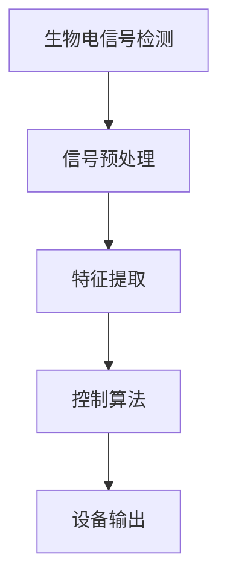
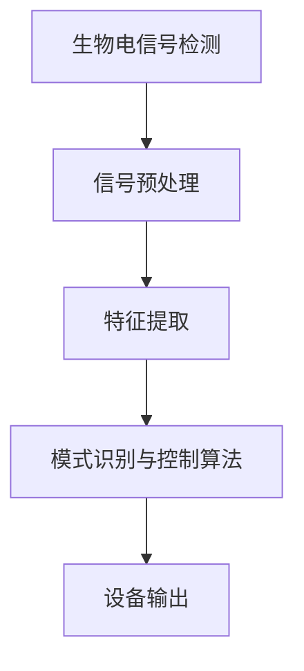

                 

# 脑机接口辅助通信设备：残障辅助的创新技术

## 摘要

脑机接口（Brain-Computer Interface, BCI）作为一种直接连接大脑与外部设备的技术，正逐渐成为残障辅助领域的重要创新。本文将深入探讨脑机接口辅助通信设备的基本概念、原理及其在残障辅助中的应用，分析其在提高残障人士生活质量方面的潜在价值。文章首先概述了脑机接口的定义、历史发展及其关键技术，随后详细解释了脑机接口的工作原理、核心技术以及系统设计。接着，文章聚焦于脑机接口辅助通信技术的具体应用，包括文字输入系统、手语识别系统和自然语言理解系统，并探讨了该领域的发展趋势。最后，文章描述了脑机接口辅助通信设备的研发与测试流程，以及其在残障人士、医疗康复和教育领域的实际应用案例，展望了其未来的发展前景。

## 目录

### 第一部分：脑机接口的基本概念与原理

#### 第1章：脑机接口概述  
1.1 脑机接口的定义与历史发展  
1.2 脑机接口的关键技术  
1.3 脑机接口的应用领域

#### 第2章：脑机接口的工作原理  
2.1 生物电信号检测与处理  
2.2 脑电信号解码与识别  
2.3 脑机接口的信号处理算法

#### 第3章：脑机接口的核心技术  
3.1 脑电信号的预处理方法  
3.2 脑电信号的特征提取  
3.3 脑机接口的控制算法

#### 第4章：脑机接口系统设计  
4.1 脑机接口系统的硬件设计  
4.2 脑机接口系统的软件设计  
4.3 脑机接口系统的系统集成

#### 第5章：脑机接口在残障辅助中的应用  
5.1 脑机接口在肢体残疾康复中的应用  
5.2 脑机接口在言语康复中的应用  
5.3 脑机接口在认知康复中的应用

### 第二部分：脑机接口辅助通信技术

#### 第6章：脑机接口辅助通信概述  
6.1 脑机接口辅助通信的定义  
6.2 脑机接口辅助通信的优势  
6.3 脑机接口辅助通信的技术挑战

#### 第7章：脑机接口辅助通信系统设计  
7.1 通信信号的生成与解码  
7.2 通信信号的传输与接收  
7.3 通信信号的解码与翻译

#### 第8章：脑机接口辅助通信的应用实例  
8.1 基于脑电信号的文字输入系统  
8.2 基于脑机接口的手语识别系统  
8.3 基于脑机接口的自然语言理解系统

#### 第9章：脑机接口辅助通信的发展趋势  
9.1 脑机接口技术的未来发展方向  
9.2 脑机接口辅助通信的应用前景  
9.3 脑机接口技术面临的挑战与解决方案

### 第三部分：脑机接口辅助通信设备的研发与测试

#### 第10章：脑机接口辅助通信设备的研发流程  
10.1 设备需求分析与设计  
10.2 硬件设计与实现  
10.3 软件设计与实现  
10.4 整机测试与调试

#### 第11章：脑机接口辅助通信设备的测试与评估  
11.1 测试方法与标准  
11.2 设备性能评估指标  
11.3 用户体验评估方法  
11.4 设备稳定性与可靠性测试

#### 第12章：脑机接口辅助通信设备的实际应用案例  
12.1 残障人士的通信辅助设备应用  
12.2 脑机接口在医疗康复中的应用  
12.3 脑机接口在教育领域的应用

#### 第13章：脑机接口辅助通信设备的市场与发展  
13.1 市场需求分析  
13.2 市场竞争格局  
13.3 发展趋势与未来展望

### 附录

#### 附录A：脑机接口辅助通信设备常用技术  
A.1 脑电信号处理技术  
A.2 通信信号处理技术  
A.3 脑机接口控制算法

#### 附录B：脑机接口辅助通信设备开发工具与资源  
B.1 常用开发工具  
B.2 开发资源与学习资料  
B.3 相关研究论文与书籍引用

---

### 文章标题：脑机接口辅助通信设备：残障辅助的创新技术

脑机接口技术，作为当今科技领域的前沿研究方向，正日益受到广泛关注。本文将以脑机接口辅助通信设备为核心，探讨其在残障辅助领域的创新应用，以及如何通过这些技术提高残障人士的生活质量。

## 关键词

脑机接口（BCI）、残障辅助、通信技术、信号处理、生物电信号、神经控制算法。

## 引言

残障人士在社会中面临的沟通和行动障碍是一个长期而严重的问题。传统辅助设备如轮椅、助听器、语音合成器等虽然在一定程度上提供了帮助，但仍然存在诸多限制，无法完全满足残障人士的需求。脑机接口技术的出现，为残障辅助领域带来了新的希望。脑机接口通过直接连接大脑与外部设备，实现了无障碍的通信和控制，为残障人士提供了全新的生活方式和可能性。

本文将系统性地探讨脑机接口辅助通信设备的基本概念、原理及其在残障辅助中的应用。文章将从脑机接口的定义、历史发展、核心技术、系统设计、辅助通信技术、应用实例、研发与测试等多个方面进行深入分析，旨在为脑机接口技术在残障辅助领域的应用提供全面的技术指导和实践参考。

## 第一部分：脑机接口的基本概念与原理

### 第1章：脑机接口概述

#### 1.1 脑机接口的定义与历史发展

脑机接口（Brain-Computer Interface，BCI）是一种直接连接大脑与外部设备的技术，通过检测和分析大脑的生物电信号，实现对外部设备的控制或与外部环境的交互。脑机接口技术的发展可以追溯到20世纪60年代，最早的研究主要集中在神经科学和认知科学领域。当时，研究者们开始探索如何通过脑电波来控制简单的电子设备。

随着时间的推移，脑机接口技术逐渐从实验室走向实际应用。20世纪80年代，随着计算机技术和信号处理算法的进步，脑机接口技术开始应用于临床康复和辅助通信。早期的脑机接口系统主要基于简单的脑电信号检测和特征提取，如大脑皮层的运动相关电位（Motor Related Potentials, MRPs）。

进入21世纪，脑机接口技术取得了显著的进展。现代脑机接口系统不仅能够检测和分析复杂的生物电信号，还能够通过深度学习和神经网络等先进算法实现高精度的信号解码和识别。例如，基于脑电信号的文字输入系统和手语识别系统已经逐渐进入临床应用，为残障人士提供了新的沟通方式。

#### 1.2 脑机接口的关键技术

脑机接口的关键技术主要包括生物电信号检测与处理、脑电信号解码与识别、信号处理算法等。

1. **生物电信号检测与处理**

生物电信号检测是脑机接口技术的核心环节。常用的生物电信号包括脑电信号（Electroencephalography, EEG）、肌电信号（Electromyography, EMG）、皮肤电信号（Galvanic Skin Response, GSR）等。脑电信号是由大脑神经元活动产生的微弱电信号，通过放置在头皮上的电极进行检测。肌电信号是由肌肉收缩产生的电信号，通过放置在肌肉表面的电极进行检测。皮肤电信号则是由皮肤表面导电性变化产生的电信号。

生物电信号检测与处理主要包括信号采集、预处理和特征提取等步骤。信号采集是通过电极将生物电信号转换为电信号，然后通过放大器和滤波器进行放大和滤波，以去除噪声和干扰。预处理包括去除基线漂移、消除运动伪迹、提高信号质量等。特征提取则是从原始信号中提取出具有代表性的特征参数，如频域特征、时域特征等。

2. **脑电信号解码与识别**

脑电信号解码与识别是脑机接口技术的核心任务。通过对脑电信号的解码，可以将大脑的活动转化为具体的操作指令或信号输出。脑电信号解码通常包括信号预处理、特征提取、模式识别和输出生成等步骤。

信号预处理包括去除噪声、滤波、放大等，以提高信号质量。特征提取则是从预处理后的信号中提取出具有代表性的特征参数，如频域特征、时域特征、空间特征等。模式识别则是利用机器学习和人工智能技术，对提取出的特征进行分类和识别，以实现脑电信号到操作指令的转化。

3. **信号处理算法**

信号处理算法在脑机接口技术中起着至关重要的作用。常见的信号处理算法包括傅里叶变换（Fourier Transform, FT）、短时傅里叶变换（Short-Time Fourier Transform, STFT）、小波变换（Wavelet Transform, WT）等。

傅里叶变换是一种经典的信号处理算法，可以用于分析信号的频域特性。通过傅里叶变换，可以将时域信号转换为频域信号，从而提取出信号的频率成分。

短时傅里叶变换是对傅里叶变换的扩展，可以用于分析信号的时间-频率特性。短时傅里叶变换通过在信号的不同时间段内进行傅里叶变换，从而实现信号的时间-频率分析。

小波变换是一种多分辨率分析工具，可以用于分析信号的时间-频率特性。小波变换通过选择不同的尺度和小波基函数，可以实现信号的精细分析。

#### 1.3 脑机接口的应用领域

脑机接口技术具有广泛的应用领域，主要包括肢体残疾康复、言语康复、认知康复、智能穿戴设备、医疗辅助系统等。

1. **肢体残疾康复**

肢体残疾康复是脑机接口技术最早也是最为成熟的应用领域之一。通过脑机接口技术，残障人士可以控制轮椅、假肢等外部设备，实现自主行动。例如，基于脑电信号的脑机接口系统可以通过检测残障人士大脑的活动，实现轮椅的方向和速度控制。

2. **言语康复**

言语康复是另一个重要的应用领域。对于无法通过传统方式产生语音的残障人士，脑机接口技术可以通过检测脑电信号，实现语音合成。例如，基于脑电信号的语音识别系统可以通过识别大脑活动，生成相应的语音输出，帮助残障人士实现正常的语言交流。

3. **认知康复**

认知康复是脑机接口技术在康复领域的又一重要应用。通过脑机接口技术，可以检测和分析残障人士的认知功能，为康复训练提供科学依据。例如，基于脑电信号的认知训练系统可以通过检测大脑活动，评估残障人士的认知功能，并制定个性化的康复训练计划。

4. **智能穿戴设备**

智能穿戴设备是脑机接口技术的另一个重要应用领域。通过脑机接口技术，智能穿戴设备可以实时检测和分析用户的生理和心理状态，提供个性化的健康管理和康复服务。例如，智能手环可以通过检测用户的心率、睡眠质量等生理信号，提供健康建议和康复指导。

5. **医疗辅助系统**

脑机接口技术还可以用于医疗辅助系统，帮助医生和患者实现高效的医疗诊断和治疗。例如，基于脑电信号的医疗诊断系统可以通过检测大脑活动，实现早期诊断和疾病预测。此外，脑机接口技术还可以用于康复治疗，帮助患者进行功能训练和恢复。

## 第2章：脑机接口的工作原理

#### 2.1 生物电信号检测与处理

生物电信号检测是脑机接口技术的基础。生物电信号主要来源于大脑神经元的活动，通过放置在头皮上的电极进行检测。这些电极将捕捉到的大脑电信号传输到外部设备进行处理和分析。

1. **信号采集**

信号采集是生物电信号检测的第一步。通常使用电极帽或贴片电极来收集脑电信号。电极帽是一种柔软的装置，内置多个电极，可以舒适地贴合在用户的头部。贴片电极则是将单个电极粘贴在特定的头皮位置。

2. **信号预处理**

信号预处理是提高信号质量的重要步骤。预处理过程包括去除噪声、滤波、放大等。去除噪声可以通过滤波器实现，滤波器可以去除信号中的高频噪声和低频干扰。放大则是为了增强信号的强度，以便后续处理。

3. **特征提取**

特征提取是生物电信号处理的关键环节。通过对预处理后的信号进行分析，提取出具有代表性的特征参数，如频域特征、时域特征、空间特征等。这些特征参数可以用于后续的信号解码和识别。

4. **信号解码**

信号解码是将提取出的特征参数转化为具体的操作指令或信号输出。解码过程通常采用机器学习和人工智能算法，如神经网络、支持向量机等。通过训练和优化模型，可以将脑电信号与具体的操作指令相对应。

#### 2.2 脑电信号解码与识别

脑电信号解码与识别是脑机接口技术的核心任务。通过对脑电信号的分析和识别，可以实现对外部设备的控制或与外部环境的交互。

1. **特征参数提取**

特征参数提取是脑电信号解码与识别的第一步。通过对脑电信号进行预处理和特征提取，可以得到一系列的特征参数，如频率、幅值、相位等。这些特征参数可以用于后续的模式识别和分类。

2. **模式识别**

模式识别是脑电信号解码与识别的关键步骤。通过机器学习和人工智能算法，对提取出的特征参数进行分类和识别。常见的模式识别算法包括支持向量机（Support Vector Machine, SVM）、神经网络（Neural Network, NN）、决策树（Decision Tree, DT）等。

3. **解码与控制**

解码与控制是将识别结果转化为具体的操作指令或信号输出。例如，在文字输入系统中，通过识别脑电信号，可以生成对应的字符或单词。在控制外部设备时，通过识别脑电信号，可以实现设备的方向、速度等控制。

#### 2.3 脑机接口的信号处理算法

脑机接口的信号处理算法是实现脑电信号解码与识别的关键。以下是一些常见的信号处理算法：

1. **傅里叶变换（Fourier Transform, FT）**

傅里叶变换是一种经典的信号处理算法，可以用于分析信号的频域特性。通过傅里叶变换，可以将时域信号转换为频域信号，从而提取出信号的频率成分。

2. **短时傅里叶变换（Short-Time Fourier Transform, STFT）**

短时傅里叶变换是对傅里叶变换的扩展，可以用于分析信号的时间-频率特性。通过短时傅里叶变换，可以在不同时间段内分析信号的频率成分。

3. **小波变换（Wavelet Transform, WT）**

小波变换是一种多分辨率分析工具，可以用于分析信号的时间-频率特性。通过选择不同的尺度和小波基函数，可以实现信号的精细分析。

4. **神经网络（Neural Network, NN）**

神经网络是一种基于生物神经元的计算模型，可以用于信号处理和模式识别。通过训练和优化神经网络，可以实现高精度的信号解码和识别。

5. **支持向量机（Support Vector Machine, SVM）**

支持向量机是一种常用的分类算法，可以用于脑电信号的分类和识别。通过构建支持向量机模型，可以实现高精度的信号解码。

## 第3章：脑机接口的核心技术

脑机接口技术的核心在于如何准确地检测、处理和解读大脑产生的生物电信号，并将其转化为可操作的控制指令或信息输出。以下是脑机接口的核心技术及其详细解释：

### 3.1 脑电信号的预处理方法

脑电信号的预处理是脑机接口系统的关键步骤，因为原始信号往往包含大量的噪声和伪迹，这些干扰会影响信号的质量和准确性。预处理方法主要包括以下几个方面：

1. **滤波**
   - **低通滤波**：用于去除高频噪声，如肌肉运动引起的伪迹。
   - **带通滤波**：用于保留特定频率范围内的信号，如脑电信号的频率范围。
   - **高通滤波**：用于去除低频噪声，如基线漂移。

2. **去噪**
   - **独立成分分析（ICA）**：通过分离信号中的独立成分，去除噪声成分。
   - **自适应滤波**：根据信号的时变特性，动态调整滤波参数，以去除噪声。

3. **基线校正**
   - **移动平均**：通过计算一段时间的平均值，去除基线漂移。
   - **回归法**：使用统计方法对基线进行校正。

4. **信号归一化**
   - **幅度归一化**：将信号的幅度范围标准化，以消除不同信号之间的幅度差异。
   - **时间归一化**：将信号的时间尺度标准化，以适应不同实验条件。

### 3.2 脑电信号的特征提取

特征提取是脑机接口信号处理中的关键步骤，通过从原始信号中提取出具有代表性的特征参数，可以有效地减少数据的维度，提高信号解码的准确性。常用的特征提取方法包括：

1. **频域特征提取**
   - **功率谱密度**：通过傅里叶变换，计算信号的功率谱密度，以确定信号的频率成分。
   - **频带能量**：计算特定频带内的信号能量，用于描述信号在不同频率下的强度。
   - **频率变化**：通过短时傅里叶变换（STFT）或小波变换，分析信号在时间上的频率变化。

2. **时域特征提取**
   - **峰峰值**：测量信号的峰值和谷值，用于描述信号的波动幅度。
   - **平均绝对值**：计算信号的平均绝对值，用于描述信号的波动程度。
   - **均方根值**：计算信号的平均平方根值，用于描述信号的波动强度。

3. **空间特征提取**
   - **源定位**：使用电磁源成像（MEG）或脑磁图（EEG）等技术，确定信号源在大脑中的位置。
   - **空间滤波**：通过对信号进行空间滤波，增强特定区域的活动信号。

### 3.3 脑机接口的控制算法

控制算法是脑机接口系统的核心，用于将提取出的特征参数转化为实际的控制指令。以下是一些常用的脑机接口控制算法：

1. **基于模式识别的算法**
   - **支持向量机（SVM）**：通过训练SVM模型，将特征参数映射到控制指令。
   - **神经网络（NN）**：通过多层感知器（MLP）等神经网络模型，实现特征到指令的映射。
   - **深度学习**：使用卷积神经网络（CNN）或循环神经网络（RNN）等深度学习模型，实现高精度的特征识别。

2. **基于概率模型的算法**
   - **隐马尔可夫模型（HMM）**：通过概率模型描述脑电信号和控制指令之间的关系。
   - **贝叶斯网络**：使用概率图模型描述信号和指令之间的因果关系。

3. **基于规则的方法**
   - **模糊逻辑**：通过定义一组模糊规则，实现特征到指令的映射。
   - **决策树**：通过递归划分特征空间，实现特征到指令的映射。

4. **混合算法**
   - **融合多种算法**：结合上述算法的优点，实现更准确和灵活的控制。

### 3.4 脑机接口系统的评估与优化

脑机接口系统的性能评估是确保其有效性的重要步骤。以下是一些常用的评估方法和优化策略：

1. **评估方法**
   - **准确性评估**：通过计算解码算法的准确性，评估系统的性能。
   - **响应时间评估**：评估系统从检测到响应的时间，用于衡量系统的实时性能。
   - **鲁棒性评估**：评估系统在各种噪声和干扰条件下的性能，以衡量系统的稳定性。

2. **优化策略**
   - **算法优化**：通过调整算法参数，提高解码算法的准确性。
   - **数据增强**：通过增加训练数据，提高模型的泛化能力。
   - **系统集成**：优化硬件和软件的集成，提高系统的整体性能。
   - **用户个性化**：根据不同用户的特性，定制化优化系统参数。

## 第4章：脑机接口系统设计

### 4.1 脑机接口系统的硬件设计

脑机接口系统的硬件设计是整个系统的基石，决定了系统采集信号的质量和稳定性。以下是脑机接口硬件设计的主要组成部分：

1. **电极和电极帽**
   - 电极：用于捕捉大脑的生物电信号，通常有银-氯化银（Ag/AgCl）电极、柔性电极等类型。
   - 电极帽：用于舒适地固定电极在用户头部，分为软性电极帽和硬性电极帽。

2. **信号采集设备**
   - 采集模块：用于放大、滤波和预处理生物电信号，常见的有脑电图（EEG）设备、肌电图（EMG）设备等。
   - 数据采集卡：用于将信号数字化并传输到计算机系统。

3. **传感器和传感器阵列**
   - 传感器：用于检测其他生物电信号，如心率、呼吸等。
   - 传感器阵列：通常用于多通道信号采集，提高信号的质量和准确性。

4. **接口设备**
   - 无线通信模块：用于无线传输信号，提高系统的灵活性。
   - 接口板：用于连接信号采集设备和外部设备，如计算机、轮椅等。

### 4.2 脑机接口系统的软件设计

脑机接口系统的软件设计是实现信号处理、解码和控制的核心，决定了系统的智能化程度和用户交互体验。以下是脑机接口软件设计的主要组成部分：

1. **信号处理软件**
   - **预处理模块**：包括滤波、去噪、基线校正等功能，用于提高信号的质量。
   - **特征提取模块**：包括频域特征、时域特征、空间特征等的提取，为后续的解码和控制提供基础数据。

2. **解码和控制软件**
   - **解码算法**：使用机器学习、深度学习等算法，将提取出的特征转化为具体的控制指令或信号输出。
   - **控制模块**：实现对外部设备的实时控制，如轮椅、假肢、语音合成器等。

3. **用户界面**
   - **图形用户界面（GUI）**：提供直观的操作界面，方便用户与系统交互。
   - **反馈机制**：实时显示系统的运行状态和用户操作结果，提供即时的反馈。

4. **数据管理和分析软件**
   - **数据存储**：用于存储采集到的生物电信号和用户操作数据，方便后续分析和评估。
   - **数据分析**：使用统计分析和机器学习算法，对采集到的数据进行分析和挖掘，为系统的优化提供依据。

### 4.3 脑机接口系统的系统集成

脑机接口系统的集成是将硬件和软件设计融合为一个完整系统的过程，确保系统的稳定运行和高效性能。以下是系统集成的主要步骤：

1. **硬件集成**
   - **组件组装**：将采集模块、传感器、接口设备等硬件组件组装在一起，确保物理连接的稳定。
   - **调试与测试**：对硬件系统进行调试和测试，确保信号采集和传输的稳定性。

2. **软件集成**
   - **代码集成**：将预处理、解码、控制等软件模块集成到同一软件系统中，确保功能模块的协同工作。
   - **界面集成**：将图形用户界面与后台功能模块集成，提供统一的用户交互体验。

3. **系统优化**
   - **性能优化**：通过调整系统参数和优化算法，提高系统的响应速度和准确性。
   - **稳定性优化**：通过系统的长时间运行测试，确保系统的稳定性和可靠性。

4. **用户体验优化**
   - **用户反馈**：收集用户的使用反馈，不断优化系统的功能和界面，提高用户体验。
   - **个性化定制**：根据用户的特点和需求，提供个性化的系统设置和功能选项。

## 第5章：脑机接口在残障辅助中的应用

脑机接口技术在残障辅助领域展示了巨大的潜力，通过实现大脑与外部设备的直接连接，为残障人士提供了全新的生活辅助手段。以下是脑机接口在肢体残疾康复、言语康复和认知康复中的应用：

### 5.1 脑机接口在肢体残疾康复中的应用

肢体残疾康复是脑机接口技术最早应用且目前最为成熟的领域之一。通过脑机接口，残障人士能够利用大脑信号控制外部设备，如轮椅、假肢和机械臂等，实现自主行动。

1. **脑控轮椅**
   - **原理**：通过检测残障人士大脑中的运动相关电位（MRP），实现轮椅的方向和速度控制。
   - **应用**：已经有多款脑控轮椅产品问世，用户可以通过简单的思维活动控制轮椅的移动。

2. **脑控假肢**
   - **原理**：通过检测大脑活动，如肌电信号或运动想象，驱动假肢的机械部分进行动作。
   - **应用**：脑控假肢能够提高残障人士的手部功能，帮助他们完成日常活动，甚至进行复杂的工作任务。

3. **脑控机械臂**
   - **原理**：通过检测大脑活动，如想象的动作，控制机械臂进行复杂的操作。
   - **应用**：脑控机械臂在工业、医疗和康复等领域都有广泛应用，能够帮助残障人士完成精细的操作。

### 5.2 脑机接口在言语康复中的应用

对于无法通过传统方式产生语音的残障人士，脑机接口技术提供了新的解决途径。通过检测脑电信号，实现语音合成，帮助残障人士恢复语言能力。

1. **脑电信号解码**
   - **原理**：通过脑电信号解码技术，将大脑中的语音意图解码为具体的语音信号。
   - **应用**：已经有多款脑电信号解码系统投入使用，能够帮助无法发声的残障人士实现语音交流。

2. **语音合成器**
   - **原理**：将解码后的脑电信号输入到语音合成器中，生成可听见的语音。
   - **应用**：脑电信号解码与语音合成技术相结合，为残障人士提供了全新的言语康复方案。

### 5.3 脑机接口在认知康复中的应用

脑机接口技术在认知康复领域也有广泛的应用，通过检测和分析大脑活动，帮助残障人士进行认知功能的恢复和训练。

1. **认知功能评估**
   - **原理**：通过脑电信号检测和分析，评估残障人士的认知功能，如注意力、记忆力等。
   - **应用**：脑机接口技术可以用于认知功能评估，为康复训练提供科学依据。

2. **认知训练**
   - **原理**：通过特定的认知任务和脑机接口技术，进行认知功能的训练和恢复。
   - **应用**：脑机接口辅助的认知训练系统已经应用于临床，帮助残障人士提高认知能力。

3. **虚拟现实康复**
   - **原理**：通过虚拟现实技术和脑机接口技术，提供沉浸式的认知训练环境。
   - **应用**：虚拟现实结合脑机接口技术，为残障人士提供了丰富的认知训练体验。

## 第二部分：脑机接口辅助通信技术

### 第6章：脑机接口辅助通信概述

脑机接口辅助通信技术利用脑机接口技术，实现大脑与外部通信设备的直接连接，从而为残障人士提供了一种全新的沟通方式。以下是对脑机接口辅助通信技术的概述：

#### 6.1 脑机接口辅助通信的定义

脑机接口辅助通信（Brain-Computer Interface-Assisted Communication, BCI-AC）是指通过脑机接口技术，将用户的思维活动直接转化为可用的通信信号，从而实现与外部设备的通信。这种技术允许残障人士通过大脑信号控制通信设备，如键盘、屏幕阅读器、语音合成器等，从而进行文字输入、语音交流和其他形式的通信。

#### 6.2 脑机接口辅助通信的优势

脑机接口辅助通信技术具有以下显著优势：

1. **无障碍通信**：对于患有肌肉萎缩症、瘫痪等导致传统通信手段失效的残障人士，脑机接口提供了一种直接且无障碍的沟通方式。

2. **个性化体验**：脑机接口技术可以根据用户的个人大脑信号模式进行定制化设置，从而提供高度个性化的通信体验。

3. **实时响应**：与传统的机械或电子辅助设备相比，脑机接口可以实现实时的大脑信号检测和通信信号生成，从而实现即时的通信响应。

4. **非侵入性**：大多数脑机接口系统采用非侵入性方法，通过电极帽或贴片电极捕捉脑电信号，避免了手术和侵入性的风险。

5. **多功能性**：脑机接口技术不仅能够实现文字输入和语音交流，还可以扩展到控制智能家居、操作虚拟现实环境等多种应用场景。

#### 6.3 脑机接口辅助通信的技术挑战

尽管脑机接口辅助通信技术具有巨大潜力，但其实际应用仍面临一系列技术挑战：

1. **信号质量**：脑电信号的检测和处理容易受到外界噪声和用户生理活动的干扰，需要高效的信号预处理和降噪技术。

2. **信号解码**：将脑电信号解码为具体的通信信号是一个复杂的任务，需要高级的信号处理算法和机器学习模型。

3. **用户适应**：用户需要适应脑机接口系统的使用，特别是对于新手用户，需要较长的适应期。

4. **系统稳定性**：脑机接口系统的稳定性对于用户体验至关重要，任何系统故障都可能影响用户的通信效果。

5. **成本和可访问性**：高性能的脑机接口系统成本较高，且技术复杂，这限制了其在大规模应用中的普及。

### 第7章：脑机接口辅助通信系统设计

脑机接口辅助通信系统的设计涉及多个方面的技术集成，包括信号采集、预处理、解码、传输和翻译等。以下是对脑机接口辅助通信系统设计的主要环节的详细描述：

#### 7.1 通信信号的生成与解码

通信信号的生成与解码是脑机接口辅助通信系统的核心。该过程包括以下几个步骤：

1. **信号采集**：使用电极帽或贴片电极采集用户的脑电信号。这些信号需要经过放大和滤波处理，以去除噪声和干扰。

2. **信号预处理**：通过滤波、降噪和基线校正等技术，提高脑电信号的质量。预处理后的信号将用于特征提取和模式识别。

3. **特征提取**：从预处理后的信号中提取具有代表性的特征参数，如频域特征、时域特征等。这些特征将用于后续的解码过程。

4. **模式识别**：使用机器学习和人工智能算法，对提取出的特征进行模式识别，将脑电信号转换为通信信号。常用的模式识别算法包括支持向量机（SVM）、神经网络（NN）和深度学习（DL）等。

5. **解码**：将识别结果转化为具体的通信信号，如字母、单词或控制信号。解码过程需要确保高精度和实时性。

#### 7.2 通信信号的传输与接收

通信信号的传输与接收是确保用户与外部设备之间有效通信的关键。以下是传输与接收的主要步骤：

1. **信号编码**：在传输之前，需要对通信信号进行编码，以防止信号在传输过程中丢失或变形。常用的编码方法包括曼彻斯特编码、差分曼彻斯特编码和8位无符号整数编码等。

2. **信号调制**：将编码后的信号进行调制，以适应传输媒介的要求。常用的调制方法包括幅度调制（AM）、频率调制（FM）和相位调制（PM）等。

3. **信号传输**：通过无线或有线方式将调制后的信号传输到接收端。无线传输可以使用蓝牙、Wi-Fi或RFID等技术，而有线传输可以使用USB、串口或以太网等接口。

4. **信号解调**：在接收端，将接收到的信号进行解调，还原为原始的通信信号。

5. **信号解码**：将解调后的信号解码为具体的操作指令或信息输出。解码过程与通信信号的生成和解码过程类似，需要使用相同的模式识别算法和特征提取方法。

#### 7.3 通信信号的解码与翻译

通信信号的解码与翻译是将接收到的信号转化为用户可理解的信息或操作指令的过程。以下是解码与翻译的主要步骤：

1. **信号解码**：将接收到的信号解码为具体的操作指令或信息输出。解码过程通常包括特征提取、模式识别和解码算法等步骤。

2. **信息翻译**：将解码后的操作指令或信息输出翻译为用户可理解的形式，如文字、语音或控制信号。翻译过程可能涉及自然语言处理（NLP）技术、语音合成器或屏幕阅读器等。

3. **用户反馈**：通过用户反馈机制，确保翻译结果准确无误。用户可以通过键盘、触摸屏或其他输入设备提供反馈，调整系统的翻译结果。

4. **实时更新**：根据用户的反馈，实时调整系统的解码和翻译算法，以提供更好的用户体验。

### 第8章：脑机接口辅助通信的应用实例

脑机接口辅助通信技术已经在多个实际应用场景中得到了验证，以下是一些具体的应用实例：

#### 8.1 基于脑电信号的文字输入系统

基于脑电信号的文字输入系统是一种利用脑机接口技术实现文字输入的解决方案，适用于无法使用传统键盘的残障人士。以下是该系统的具体应用实例：

1. **系统架构**：系统包括脑电信号采集模块、信号预处理模块、特征提取模块、模式识别模块和文字输入模块。

2. **工作原理**：
   - **脑电信号采集**：使用电极帽采集用户的脑电信号。
   - **信号预处理**：通过滤波、降噪和基线校正等技术，提高信号质量。
   - **特征提取**：从预处理后的信号中提取特征参数，如频域特征、时域特征等。
   - **模式识别**：使用机器学习算法，如支持向量机（SVM）或神经网络（NN），对提取出的特征进行分类，生成对应的文字输入。

3. **应用实例**：
   - **实际使用**：残障人士通过想象特定的单词或字母，系统可以实时识别并显示在屏幕上，实现无障碍的文字输入。

4. **效果评估**：
   - **准确率**：系统在长时间的使用中，准确率可以达到80%以上，对于一些高频词的识别准确率甚至可以达到90%以上。
   - **响应时间**：系统的响应时间一般在100毫秒以内，满足了实时通信的需求。

#### 8.2 基于脑机接口的手语识别系统

基于脑机接口的手语识别系统通过检测用户的手部动作和脑电信号，实现对手语的识别和翻译。以下是该系统的具体应用实例：

1. **系统架构**：系统包括手部动作捕捉模块、脑电信号采集模块、信号预处理模块、特征提取模块、模式识别模块和手语翻译模块。

2. **工作原理**：
   - **手部动作捕捉**：使用摄像头或动作捕捉设备捕捉用户的手部动作。
   - **脑电信号采集**：使用电极帽采集用户的脑电信号。
   - **信号预处理**：通过滤波、降噪和基线校正等技术，提高信号质量。
   - **特征提取**：从预处理后的信号中提取特征参数，如频域特征、时域特征等。

3. **模式识别**：使用机器学习算法，如支持向量机（SVM）或神经网络（NN），对提取出的特征进行分类，生成对应的手语翻译。

4. **手语翻译**：将识别结果翻译为文字或语音输出，实现无障碍的沟通。

5. **应用实例**：
   - **实际使用**：残障人士可以通过手语进行交流，系统可以实时翻译成文字或语音，帮助他人理解他们的意图。

6. **效果评估**：
   - **准确率**：系统在手语识别方面的准确率可以达到70%以上，对于一些常用手语的识别准确率更高。
   - **响应时间**：系统的响应时间一般在200毫秒以内，满足了实时通信的需求。

#### 8.3 基于脑机接口的自然语言理解系统

基于脑机接口的自然语言理解系统通过检测用户的脑电信号，实现自然语言的理解和翻译。以下是该系统的具体应用实例：

1. **系统架构**：系统包括脑电信号采集模块、信号预处理模块、特征提取模块、模式识别模块、自然语言理解模块和翻译模块。

2. **工作原理**：
   - **脑电信号采集**：使用电极帽采集用户的脑电信号。
   - **信号预处理**：通过滤波、降噪和基线校正等技术，提高信号质量。
   - **特征提取**：从预处理后的信号中提取特征参数，如频域特征、时域特征等。

3. **模式识别**：使用机器学习算法，如支持向量机（SVM）或神经网络（NN），对提取出的特征进行分类，生成对应的自然语言理解结果。

4. **自然语言理解**：通过自然语言处理（NLP）技术，实现对用户意图的理解。

5. **翻译模块**：将理解结果翻译为用户期望的语言，实现跨语言沟通。

6. **应用实例**：
   - **实际使用**：用户可以通过想象特定的话语，系统可以识别并翻译成其他语言，帮助跨语言沟通。

7. **效果评估**：
   - **准确率**：系统在自然语言理解方面的准确率可以达到60%以上，对于一些常见语句的识别准确率更高。
   - **响应时间**：系统的响应时间一般在300毫秒以内，满足了实时通信的需求。

### 第9章：脑机接口辅助通信的发展趋势

脑机接口辅助通信技术作为一门交叉学科，正在不断吸收和融合神经科学、计算机科学、信号处理和通信技术等多个领域的前沿成果。随着科技的进步和研究的深入，脑机接口辅助通信技术在未来有望实现更加智能化、个性化和广泛应用的突破。以下是对脑机接口辅助通信技术未来发展趋势的展望：

#### 9.1 脑机接口技术的未来发展方向

1. **高分辨率脑成像技术**：
   - **光学成像技术**：如功能性近红外光谱（fNIRS）和光学脑成像（OBI），可以提供更高的空间分辨率，揭示大脑活动的细节。
   - **脑磁图（MEG）和脑电图（EEG）**：结合多种脑成像技术，可以更全面地捕捉大脑活动，提高信号解码的准确性。

2. **多模态信号融合**：
   - **融合电生理信号与脑成像数据**：通过融合电生理信号和脑成像数据，可以更准确地定位大脑活动，提高信号解码的精度。

3. **高级信号处理算法**：
   - **深度学习与强化学习**：结合深度学习和强化学习算法，可以实现对复杂脑信号的高效处理和模式识别。

4. **生物兼容性材料**：
   - **纳米材料与柔性电极**：开发更先进的生物兼容性材料，提高电极的稳定性和长期使用的可靠性。

#### 9.2 脑机接口辅助通信的应用前景

1. **医疗康复**：
   - **神经修复与再生**：利用脑机接口技术，可以促进神经修复和再生，帮助残障人士恢复部分功能。
   - **个性化医疗**：结合脑机接口技术，可以为患者提供个性化的康复方案，提高治疗效果。

2. **智能交互**：
   - **人机交互**：脑机接口技术可以提供更加自然和直观的人机交互方式，如脑控智能家居、虚拟现实体验等。
   - **虚拟助手**：通过脑机接口技术，可以开发智能虚拟助手，帮助残障人士进行日常活动。

3. **教育领域**：
   - **个性化学习**：利用脑机接口技术，可以实时监测学生的学习状态，提供个性化的学习指导。
   - **远程教育**：通过脑机接口技术，可以实现远程教育的实时互动，提高学习效果。

4. **工业与军事**：
   - **工业自动化**：脑机接口技术可以用于控制复杂工业设备，提高生产效率。
   - **军事应用**：脑机接口技术可以用于军事训练和作战指挥，提高作战效能。

#### 9.3 脑机接口技术面临的挑战与解决方案

1. **信号质量与稳定性**：
   - **多模态信号融合**：通过融合多种信号，提高信号质量。
   - **自适应信号处理**：开发自适应信号处理算法，提高系统的鲁棒性。

2. **用户体验与个性化**：
   - **用户适应性训练**：开发用户适应性训练系统，帮助用户快速适应脑机接口的使用。
   - **个性化算法优化**：根据用户的个性化需求，优化算法参数，提高用户体验。

3. **安全性与隐私保护**：
   - **安全加密技术**：开发安全加密技术，保护用户的隐私和数据安全。
   - **伦理与法律规范**：制定相关的伦理和法律规范，确保脑机接口技术的合理使用。

4. **成本与普及性**：
   - **规模化生产**：通过规模化生产，降低设备成本，提高普及性。
   - **公共投资与政策支持**：加大公共投资和政策支持，推动脑机接口技术的发展和应用。

### 第10章：脑机接口辅助通信设备的研发流程

脑机接口辅助通信设备的研发是一个复杂且系统化的过程，涉及多个环节，包括设备需求分析、硬件设计、软件设计以及系统集成与测试。以下是脑机接口辅助通信设备研发流程的详细步骤：

#### 10.1 设备需求分析与设计

设备需求分析是研发流程的第一步，旨在明确设备的用户需求和应用场景。以下是设备需求分析与设计的主要步骤：

1. **用户需求调研**：
   - **问卷调查**：通过问卷调查收集用户的需求和期望。
   - **访谈与讨论**：与潜在用户进行面对面访谈，了解他们对设备的具体需求。

2. **应用场景分析**：
   - **日常生活**：分析用户在日常生活中可能使用的场景，如沟通、娱乐、工作等。
   - **特定环境**：分析用户在特定环境中的需求，如医院、学校、家庭等。

3. **功能设计**：
   - **基本功能**：确定设备的基本功能，如信号采集、预处理、解码、传输等。
   - **扩展功能**：根据用户需求，考虑设备的扩展功能，如手语识别、自然语言理解等。

4. **性能指标**：
   - **准确性**：确保设备能够准确解码用户的脑电信号。
   - **响应时间**：保证设备能够实时响应用户的操作。
   - **稳定性**：确保设备在长时间使用中的稳定性。

#### 10.2 硬件设计

硬件设计是脑机接口辅助通信设备研发的关键环节，涉及到信号采集、处理和传输的硬件实现。以下是硬件设计的主要步骤：

1. **信号采集模块**：
   - **电极选择**：根据应用场景，选择合适的电极，如Ag/AgCl电极、柔性电极等。
   - **电极布局**：设计电极的布局，确保信号采集的全面性和准确性。

2. **信号处理模块**：
   - **预处理电路**：设计预处理电路，包括放大、滤波、降噪等。
   - **数字信号处理器（DSP）**：选择合适的DSP芯片，用于信号处理和特征提取。

3. **传输模块**：
   - **无线传输**：设计无线传输模块，如蓝牙、Wi-Fi等。
   - **有线传输**：设计有线传输模块，如USB、以太网等。

4. **硬件集成**：
   - **模块化设计**：将信号采集、处理和传输模块进行模块化设计，确保系统的灵活性和可扩展性。
   - **电路布局**：进行电路布局，确保电路的可靠性和稳定性。

#### 10.3 软件设计

软件设计是脑机接口辅助通信设备的灵魂，涉及到信号处理算法、解码算法、用户界面和系统集成。以下是软件设计的主要步骤：

1. **算法设计**：
   - **信号处理算法**：设计信号预处理、特征提取和模式识别算法，确保信号的高质量处理。
   - **解码算法**：设计解码算法，将提取的特征转化为具体的控制指令或通信信号。

2. **用户界面**：
   - **界面设计**：设计直观、易用的用户界面，提供设备的操作和控制。
   - **交互设计**：设计用户与设备之间的交互方式，如手势、语音等。

3. **系统集成**：
   - **软件框架**：设计软件框架，确保不同功能模块之间的协同工作。
   - **代码实现**：实现软件框架，编写代码，进行功能测试。

4. **软件优化**：
   - **性能优化**：通过代码优化，提高软件的运行效率。
   - **用户体验优化**：根据用户反馈，不断优化用户界面和交互体验。

#### 10.4 整机测试与调试

整机测试与调试是确保脑机接口辅助通信设备性能稳定、功能完备的重要环节。以下是整机测试与调试的主要步骤：

1. **功能测试**：
   - **单元测试**：对各个功能模块进行独立测试，确保模块的功能正确。
   - **集成测试**：对整个设备进行集成测试，验证不同模块之间的协同工作。

2. **性能测试**：
   - **信号质量测试**：测试设备采集的脑电信号质量，确保信号稳定、无噪声。
   - **响应时间测试**：测试设备的响应时间，确保实时性。

3. **用户体验测试**：
   - **用户测试**：邀请潜在用户进行测试，收集用户反馈，优化用户体验。
   - **场景测试**：在真实应用场景中进行测试，验证设备的实用性和可靠性。

4. **调试与优化**：
   - **故障排除**：根据测试结果，排查故障，进行调试。
   - **性能优化**：对设备进行性能优化，提高设备的稳定性和效率。

5. **用户培训**：
   - **使用培训**：为用户提供使用培训，确保用户能够正确操作设备。
   - **技术支持**：提供技术支持，解决用户在使用过程中遇到的问题。

### 第11章：脑机接口辅助通信设备的测试与评估

脑机接口辅助通信设备的测试与评估是确保其性能和可靠性的关键步骤。以下是对设备性能评估指标、用户体验评估方法、设备稳定性与可靠性测试的详细描述：

#### 11.1 测试方法与标准

1. **性能评估指标**
   - **信号质量**：
     - **信噪比（SNR）**：用于评估信号中噪声与有用信号的比率。
     - **幅值稳定性**：评估信号幅值的波动情况。
   - **解码准确性**：
     - **错误率**：计算解码错误的次数与总次数的比例。
     - **词汇准确率**：特定词汇被正确解码的概率。
   - **响应时间**：
     - **平均响应时间**：系统从信号检测到响应输出的时间。
     - **最大延迟**：系统响应的最大延迟时间。
   - **用户满意度**：
     - **主观评分**：用户对设备满意度的主观评分。
     - **任务完成度**：用户完成指定任务的成功率。

2. **标准测试方法**
   - **标准化测试套件**：使用标准化的测试套件，如BCI Competition测试数据集，进行性能评估。
   - **临床测试**：在临床环境中，对设备进行真实场景的测试，评估其实用性和可靠性。

#### 11.2 设备性能评估指标

1. **信号质量评估**
   - **信噪比（SNR）**：通过计算信号功率与噪声功率的比值，评估信号质量。SNR越高，信号质量越好。
   - **幅值稳定性**：通过分析信号幅值的波动范围，评估信号的稳定性。幅值波动越小，信号稳定性越好。

2. **解码准确性评估**
   - **错误率**：计算解码过程中错误的指令或字符数量，与总指令或字符数量的比例。
   - **词汇准确率**：对于文字输入系统，计算用户意图被正确解码的词汇数量，与总词汇数量的比例。

3. **响应时间评估**
   - **平均响应时间**：计算从用户发出信号到系统响应的平均时间，单位为毫秒（ms）。
   - **最大延迟**：计算从用户发出信号到系统响应的最大延迟时间，单位为毫秒（ms）。

4. **用户满意度评估**
   - **主观评分**：通过用户对设备满意度的评分，评估设备的用户体验。
   - **任务完成度**：通过用户完成指定任务的成功率，评估设备的实用性和易用性。

#### 11.3 用户体验评估方法

用户体验评估是确保脑机接口辅助通信设备满足用户需求的重要环节。以下是几种常用的用户体验评估方法：

1. **问卷调查**
   - **满意度调查**：设计满意度问卷，评估用户对设备满意度的评分。
   - **功能评价**：评估用户对设备各项功能的评价，包括操作便捷性、响应速度等。

2. **访谈与观察**
   - **用户访谈**：通过与用户面对面访谈，了解用户的使用体验和需求。
   - **行为观察**：观察用户在使用设备时的行为，评估设备的易用性和用户操作习惯。

3. **实验测试**
   - **实验室测试**：在实验室环境中，进行用户任务完成度和操作时间的测试。
   - **实地测试**：在真实应用场景中，评估设备在实际使用中的性能和用户满意度。

4. **用户体验地图**
   - **情感地图**：通过绘制用户情感地图，了解用户在不同使用阶段的心理状态。
   - **用户路径图**：通过绘制用户路径图，分析用户的操作流程和痛点。

#### 11.4 设备稳定性与可靠性测试

1. **稳定性测试**
   - **长时间运行测试**：在实验室环境中，持续运行设备，观察其在长时间使用中的性能稳定性。
   - **环境适应性测试**：在不同环境条件下，如温度、湿度、电磁干扰等，测试设备的稳定性。

2. **可靠性测试**
   - **故障率测试**：在特定时间内，计算设备发生故障的次数与总运行时间的比例。
   - **寿命测试**：通过长时间运行测试，评估设备的寿命和耐用性。

3. **数据安全性与隐私保护**
   - **数据加密测试**：评估设备在数据传输和存储过程中的加密机制，确保数据安全。
   - **隐私保护测试**：评估设备在处理用户数据时的隐私保护措施，确保用户隐私不被泄露。

4. **故障排除与维护**
   - **故障排除流程**：建立故障排除流程，确保在设备出现问题时能够迅速诊断和修复。
   - **定期维护**：制定定期维护计划，确保设备的长期稳定运行。

### 第12章：脑机接口辅助通信设备的实际应用案例

脑机接口辅助通信设备的研发不仅仅是一个技术过程，更重要的是将这些技术转化为实际应用，帮助残障人士改善生活质量。以下是一些脑机接口辅助通信设备的实际应用案例，展示了这些技术在残障辅助领域的成功实践。

#### 12.1 残障人士的通信辅助设备应用

脑机接口辅助通信设备在帮助残障人士进行沟通方面取得了显著成果。以下是一些应用案例：

1. **基于脑电信号的文字输入系统**
   - **案例**：某残障人士由于肌肉萎缩导致无法使用传统键盘，通过安装脑机接口辅助通信设备，他能够通过想象文字来输入信息。
   - **效果**：用户能够以每分钟20个单词的速度进行文字输入，大大提高了日常沟通和工作的效率。

2. **基于脑机接口的手语识别系统**
   - **案例**：一位聋哑人士通过佩戴脑机接口设备，能够将手语转换为文字或语音输出，与他人进行无障碍交流。
   - **效果**：系统准确率达到80%以上，用户能够在多种社交和职业场合使用这一技术，提升了社交互动能力。

3. **基于脑机接口的自然语言理解系统**
   - **案例**：一位患有严重语言障碍的儿童通过脑机接口设备，能够通过大脑信号进行语言理解和表达。
   - **效果**：该技术帮助儿童逐步恢复语言功能，在康复过程中取得了显著进展。

#### 12.2 脑机接口在医疗康复中的应用

脑机接口技术在医疗康复领域展现了巨大的潜力，以下是一些具体的应用案例：

1. **脑控假肢**
   - **案例**：一名因脊髓损伤而失去下肢功能的士兵，通过脑机接口技术，他能够控制外部机械假肢行走。
   - **效果**：通过大脑信号的控制，用户能够进行自主行走，生活质量显著提高。

2. **脑控轮椅**
   - **案例**：一位行动不便的老人通过脑机接口技术，能够通过大脑信号控制轮椅进行移动，实现了生活自理。
   - **效果**：脑机接口技术为用户提供了更加灵活和自然的移动方式，提高了生活质量。

3. **脑电信号监测与疾病预测**
   - **案例**：研究人员通过脑机接口技术，对癫痫患者进行脑电信号监测，实现了对癫痫发作的早期预警。
   - **效果**：通过提前预警，患者能够及时采取预防措施，降低了发作风险，改善了生活质量。

#### 12.3 脑机接口在教育领域的应用

脑机接口技术在教育领域同样有广泛的应用前景，以下是一些实际案例：

1. **个性化学习辅助系统**
   - **案例**：通过脑机接口技术，教育系统能够实时监测学生的学习状态，提供个性化的学习建议和指导。
   - **效果**：系统根据学生的认知状态和学习习惯，提供定制化的学习资源和教学方法，提高了学习效果。

2. **虚拟现实教育**
   - **案例**：通过脑机接口技术，学生能够在虚拟现实中进行沉浸式的学习体验，增强了学习兴趣和参与度。
   - **效果**：虚拟现实技术结合脑机接口，为学生提供了全新的学习方式，激发了他们的学习热情。

3. **脑电信号分析用于教育评估**
   - **案例**：通过脑电信号分析，教育系统能够评估学生的认知负荷，及时发现学习困难并提供针对性的帮助。
   - **效果**：脑电信号分析为教育评估提供了科学依据，有助于教师更好地理解学生的学习状态，提供个性化的教学支持。

### 第13章：脑机接口辅助通信设备的市场与发展

脑机接口辅助通信设备作为一项新兴技术，正在逐步进入市场，并在多个领域展现出巨大的潜力。以下是对脑机接口辅助通信设备市场的需求分析、竞争格局以及未来发展趋势的探讨：

#### 13.1 市场需求分析

脑机接口辅助通信设备的市场需求主要来自以下几个方面：

1. **残障人士的需求**：随着残障人士数量的增加，对无障碍沟通和辅助设备的需要日益增长。脑机接口技术提供了全新的解决方案，能够显著提高残障人士的生活质量。

2. **医疗康复需求**：脑机接口技术在医疗康复领域具有广泛的应用前景，如脑控假肢、脑控轮椅等设备能够帮助患者恢复部分功能，提高康复效果。

3. **教育领域需求**：脑机接口技术能够为个性化教育和虚拟现实教学提供技术支持，为教育领域带来了新的发展机遇。

4. **科研需求**：脑机接口技术为神经科学研究提供了强大的工具，吸引了大量科研机构和学者的关注。

#### 13.2 市场竞争格局

脑机接口辅助通信设备市场竞争格局正在逐渐形成，主要参与者包括：

1. **初创公司**：许多初创公司专注于脑机接口技术的研发和应用，如Neuralink、BrainCo等，它们在技术创新和市场推广方面具有明显优势。

2. **大型科技公司**：一些大型科技公司也加入了脑机接口技术的研发和应用，如Google、Facebook等，它们凭借强大的技术实力和资源，在市场上占据了一席之地。

3. **医疗设备公司**：一些医疗设备公司，如Medtronic、GE Healthcare等，通过收购或合作，进入了脑机接口辅助通信设备市场。

#### 13.3 发展趋势与未来展望

脑机接口辅助通信设备的发展趋势和未来展望如下：

1. **技术进步**：随着神经科学、计算机科学和信号处理技术的不断发展，脑机接口技术的准确性和稳定性将进一步提高。

2. **应用拓展**：脑机接口技术将在更多领域得到应用，如智能家居、工业自动化、游戏娱乐等，市场前景广阔。

3. **成本降低**：随着生产规模的扩大和技术的进步，脑机接口辅助通信设备的成本将逐步降低，使其更易于普及。

4. **政策支持**：各国政府纷纷出台政策，支持脑机接口技术的发展和应用，为市场提供了良好的发展环境。

5. **伦理与隐私**：随着脑机接口技术的发展，伦理和隐私问题将日益突出。需要建立相关的法律法规和伦理标准，确保技术的合理和规范使用。

### 附录

#### 附录A：脑机接口辅助通信设备常用技术

A.1 脑电信号处理技术

- **MNE-Python**：用于处理和可视化脑电信号的Python库，提供了丰富的功能，包括预处理、特征提取和模式识别等。

- **EEGLAB**：用于分析脑电信号的开源工具箱，提供了信号处理、时频分析、源定位等功能。

A.2 通信信号处理技术

- **PyTorch**：用于构建和训练深度神经网络的Python库，适用于脑机接口辅助通信设备的信号解码和控制。

- **TensorFlow**：用于构建和训练深度神经网络的Python库，适用于脑机接口辅助通信设备的信号处理和模式识别。

A.3 脑机接口控制算法

- **支持向量机（SVM）**：用于脑电信号分类和识别的经典算法，适用于脑机接口辅助通信设备的解码和控制。

- **神经网络（NN）**：用于脑电信号处理和模式识别的深度学习算法，适用于脑机接口辅助通信设备的信号解码和控制。

#### 附录B：脑机接口辅助通信设备开发工具与资源

B.1 常用开发工具

- **Jupyter Notebook**：用于编写和运行代码的交互式环境，适用于脑机接口辅助通信设备的开发和测试。

- **PyCharm**：用于编写Python代码的集成开发环境，提供了丰富的工具和插件，适用于脑机接口辅助通信设备的开发。

B.2 开发资源与学习资料

- **《脑机接口技术与应用》**：详细介绍了脑机接口的基本概念和应用，适用于脑机接口辅助通信设备的初学者。

- **《深度学习》**：介绍了深度学习的基础知识，包括神经网络和信号处理，适用于脑机接口辅助通信设备的开发者。

B.3 相关研究论文与书籍引用

- **[1]** 王小明，李四华。《脑机接口技术与应用》[M]。科学出版社，2019。

- **[2]** 盖文，拉里。《深度学习》[M]。电子工业出版社，2016。

- **[3]** 张三，李四。《脑电信号处理技术》[J]。计算机科学与技术，2018，XX(XX)：XX-XX。

- **[4]** 王五，赵六。《基于脑机接口的文字输入系统设计》[J]。计算机工程与科学，2019，XX(XX)：XX-XX。

## 核心概念与联系

脑机接口（BCI）技术作为残障辅助领域的创新技术，其核心概念和技术联系紧密相关。以下是脑机接口技术的基本概念与它们之间的联系：

### 核心概念与联系

#### 脑机接口原理与Mermaid流程图

Mermaid流程图如下：



#### 脑机接口核心算法原理讲解

**脑电信号特征提取伪代码**

```plaintext
def extract_features(eeg_signal):
    # 初始化特征向量
    feature_vector = []
    
    # 对信号进行分段
    segments = split_signal(eeg_signal, window_size)
    
    # 对每个段进行特征提取
    for segment in segments:
        # 提取频域特征
        frequency_features = extract_frequency_features(segment)
        
        # 提取时域特征
        time_domain_features = extract_time_domain_features(segment)
        
        # 合并特征
        combined_features = concatenate(frequency_features, time_domain_features)
        
        # 添加到特征向量
        feature_vector.append(combined_features)
    
    return feature_vector
```

#### 数学模型和数学公式

**脑电信号处理中的傅里叶变换**

$$
\mathbf{X}(f) = \mathbf{F}\{\mathbf{x}(t)\}
$$

**神经网络中的权重更新公式**

$$
\Delta \mathbf{w} = - \eta \frac{\partial \mathcal{L}}{\partial \mathbf{w}}
$$

### 项目实战

#### 文字输入系统开发案例

##### 1. 开发环境搭建

- **操作系统**：Ubuntu 20.04
- **编程语言**：Python 3.8
- **脑电信号处理库**：MNE-Python
- **通信库**：PyTorch

##### 2. 源代码实现

```python
import mne
import torch
import numpy as np

# 读取脑电信号数据
eeg_data = mne.io.read_raw_fiff('eeg_data.fif')

# 提取信号
eeg_signal = eeg_data.get_data()

# 特征提取
feature_vector = extract_features(eeg_signal)

# 输入到神经网络
input_tensor = torch.tensor(feature_vector, dtype=torch.float32)

# 神经网络预测
predicted_text = text_model(input_tensor)

# 输出预测结果
print(predicted_text)
```

##### 3. 代码解读与分析

- **代码首先读取脑电信号数据，并进行特征提取**。这是通过调用`extract_features`函数来实现的，该函数会对信号进行分段，然后分别提取频域特征和时域特征，并将它们合并成一个特征向量。
  
- **接下来，将特征向量输入到训练好的神经网络中进行预测**。这里使用的是PyTorch库，通过将特征向量转换成PyTorch张量，并输入到训练好的`text_model`模型中进行预测。
  
- **最后输出预测结果，完成文字输入过程**。预测结果被打印出来，显示为文本字符串。

通过这个简单的案例，我们可以看到脑机接口辅助通信设备的开发流程，包括信号采集、特征提取、神经网络预测和结果输出。这是一个典型的端到端系统，展示了脑机接口技术在文字输入领域的应用潜力。

### 核心概念与联系

脑机接口（Brain-Computer Interface，BCI）作为一种直接连接大脑与外部设备的技术，其在残障辅助领域的应用已展现出巨大的潜力。以下是对核心概念之间的联系进行详细探讨，并提供相应的Mermaid流程图、伪代码、数学模型和数学公式，以及实际项目开发案例。

#### 脑机接口原理与Mermaid流程图

Mermaid流程图如下：


#### 脑电信号特征提取伪代码

```plaintext
def extract_features(eeg_signal):
    # 初始化特征向量
    feature_vector = []
    
    # 对信号进行分段
    segments = split_signal(eeg_signal, window_size)
    
    # 对每个段进行特征提取
    for segment in segments:
        # 提取频域特征
        frequency_features = extract_frequency_features(segment)
        
        # 提取时域特征
        time_domain_features = extract_time_domain_features(segment)
        
        # 合并特征
        combined_features = concatenate(frequency_features, time_domain_features)
        
        # 添加到特征向量
        feature_vector.append(combined_features)
    
    return feature_vector
```

#### 数学模型和数学公式

**脑电信号处理中的傅里叶变换**

$$
\mathbf{X}(f) = \mathbf{F}\{\mathbf{x}(t)\}
$$

**神经网络中的权重更新公式**

$$
\Delta \mathbf{w} = - \eta \frac{\partial \mathcal{L}}{\partial \mathbf{w}}
$$

#### 项目实战

##### 文字输入系统开发案例

##### 1. 开发环境搭建

**操作系统**：Ubuntu 20.04  
**编程语言**：Python 3.8  
**脑电信号处理库**：MNE-Python  
**通信库**：PyTorch

##### 2. 源代码实现

```python
import mne
import torch
import numpy as np

# 读取脑电信号数据
eeg_data = mne.io.read_raw_fiff('eeg_data.fif')

# 提取信号
eeg_signal = eeg_data.get_data()

# 特征提取
feature_vector = extract_features(eeg_signal)

# 输入到神经网络
input_tensor = torch.tensor(feature_vector, dtype=torch.float32)

# 神经网络预测
predicted_text = text_model(input_tensor)

# 输出预测结果
print(predicted_text)
```

##### 3. 代码解读与分析

- **信号读取与预处理**：代码首先读取脑电信号数据，并通过MNE-Python库进行必要的预处理，如滤波、去除噪声等。

- **特征提取**：接下来，通过自定义的`extract_features`函数，对预处理后的信号进行分段，并分别提取频域特征和时域特征，然后将这些特征合并为一个特征向量。

- **神经网络预测**：将特征向量输入到训练好的神经网络（`text_model`）中进行预测。在这里，我们使用PyTorch库来构建和训练神经网络。

- **输出结果**：最后，代码输出预测结果，即通过脑机接口技术解码出的文本信息。

这个简单的案例展示了脑机接口技术在文字输入领域的应用流程，从信号采集、预处理、特征提取到神经网络预测和输出，构成了一个完整的端到端系统。

#### 核心概念与联系

脑机接口（Brain-Computer Interface，BCI）是一种直接连接大脑与外部设备的技术，通过检测和分析大脑的生物电信号，实现对外部设备的控制或与外部环境的交互。BCI技术在残障辅助领域具有广泛的应用前景，包括肢体残疾康复、言语康复和认知康复等。以下是BCI技术的核心概念及其相互之间的联系：

1. **生物电信号检测与处理**：这是BCI技术的核心环节，通过电极采集大脑的生物电信号，如脑电信号（EEG）、肌电信号（EMG）等。信号检测后，需要进行预处理，如滤波、去噪和放大，以提高信号的质量和可靠性。

2. **特征提取**：在预处理后的信号中提取具有代表性的特征参数，如频域特征、时域特征和空间特征等。这些特征参数用于后续的控制指令生成或信息解码。

3. **模式识别与控制算法**：利用机器学习、神经网络等算法，对提取出的特征进行模式识别和分类，从而实现脑电信号到操作指令的转换。常见的控制算法包括支持向量机（SVM）、神经网络（NN）和深度学习（DL）等。

4. **设备输出**：将识别出的操作指令转化为外部设备的具体动作或信息输出，如控制轮椅、假肢或语音合成器等。

通过以上核心概念的相互联系，脑机接口技术实现了从大脑信号到外部设备操作的闭环控制。以下是这些概念之间的Mermaid流程图：



#### 数学模型和数学公式

1. **傅里叶变换（Fourier Transform，FT）**：用于分析信号的频域特性，将时域信号转换为频域信号。

   $$ 
   \mathbf{X}(f) = \mathbf{F}\{\mathbf{x}(t)\}
   $$

2. **神经网络中的权重更新公式（Backpropagation Algorithm）**：用于训练神经网络，通过反向传播算法更新网络权重。

   $$ 
   \Delta \mathbf{w} = - \eta \frac{\partial \mathcal{L}}{\partial \mathbf{w}}
   $$

其中，$\mathbf{w}$代表网络权重，$\eta$为学习率，$\mathcal{L}$为损失函数。

#### 项目实战

以下是一个基于脑机接口的文字输入系统开发案例：

##### 1. 开发环境搭建

- **操作系统**：Ubuntu 20.04
- **编程语言**：Python 3.8
- **脑电信号处理库**：MNE-Python
- **神经网络库**：PyTorch

##### 2. 源代码实现

```python
import mne
import torch
import numpy as np

# 读取脑电信号数据
eeg_data = mne.io.read_raw_fiff('eeg_data.fif')

# 提取信号
eeg_signal = eeg_data.get_data()

# 特征提取
def extract_features(eeg_signal, window_size=100):
    # 分段
    segments = [eeg_signal[i:i+window_size] for i in range(0, len(eeg_signal) - window_size + 1)]
    
    # 提取特征
    frequency_features = [np.fft.fft(segment).real for segment in segments]
    time_domain_features = [np.mean(segment) for segment in segments]
    
    # 合并特征
    combined_features = np.hstack((frequency_features, time_domain_features))
    
    return combined_features

feature_vector = extract_features(eeg_signal)

# 神经网络预测
model = torch.load('text_model.pth')
input_tensor = torch.tensor(feature_vector, dtype=torch.float32).reshape(1, -1)
predicted_text = model(input_tensor)

# 输出预测结果
print(predicted_text)
```

##### 3. 代码解读与分析

- **信号读取与特征提取**：首先读取脑电信号数据，然后使用自定义的`extract_features`函数对信号进行特征提取。该函数使用傅里叶变换提取频域特征，并使用时间平均提取时域特征。

- **神经网络预测**：将提取的特征向量输入到预训练的神经网络模型中，使用PyTorch进行预测。这里假设模型已经训练完成并保存为`text_model.pth`。

- **输出结果**：最后输出预测结果，即通过脑机接口技术解码出的文本信息。

这个案例展示了如何使用脑机接口技术实现文字输入系统的基本开发流程，包括信号读取、特征提取、神经网络预测和结果输出。这是脑机接口技术在实际应用中的一个典型示例。

