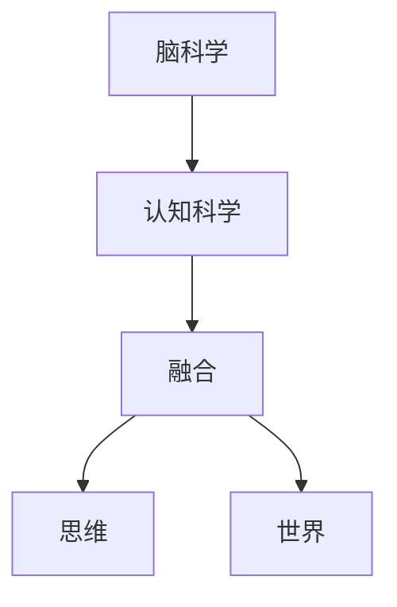

                 

# 脑科学与认知科学的融合：深入理解思维与世界

## 关键词
脑科学，认知科学，融合，思维，世界，神经基础，应用，趋势，展望

## 摘要
本文深入探讨了脑科学与认知科学的融合，旨在揭示思维与世界的本质联系。通过对核心概念与联系的详细阐述，我们逐步分析了脑科学与认知科学的基础知识、方法与技术，以及它们在现实世界中的应用。同时，本文还展望了脑科学与认知科学的未来趋势与挑战，为读者提供了一个全面而深刻的认知视角。

### 第一部分：脑科学与认知科学的融合概述

#### 第1章：引言

脑科学与认知科学是研究人类思维和行为的两大领域，它们在理论和实践上都有着紧密的联系。脑科学致力于研究大脑的结构与功能，而认知科学则关注人类认知过程的心理机制。融合脑科学与认知科学，有助于我们更深入地理解思维与世界的本质联系，为人工智能和心理学等领域的发展提供新思路。

**核心概念与联系**

- **脑科学与认知科学**：脑科学侧重于研究大脑的结构与功能，认知科学则关注认知过程的心理机制。
- **融合**：通过将脑科学与认知科学的理论与方法相结合，可以更全面地理解人类思维和行为。
- **思维与世界**：思维是人类对世界的认知和解释过程，融合脑科学与认知科学有助于深入理解这一过程。

**Mermaid 流程图**

#### 第2章：脑科学与认知科学的基础知识

脑科学与认知科学的基础知识涵盖了从基本概念到核心算法原理的各个方面。理解这些基础知识，有助于我们进一步探讨脑科学与认知科学的融合及其在现实世界中的应用。

**核心算法原理讲解**

- **脑图谱与认知图谱的构建**：脑图谱是通过神经纤维追踪技术构建的，认知图谱则是基于行为数据和脑影像数据的。
- **神经网络与认知模型的关系**：神经网络是认知模型的基础，可以模拟人类大脑的处理过程。
- **计算机视觉与脑视觉的对比**：计算机视觉关注图像处理和识别，而脑视觉则研究视觉信号在大脑中的处理机制。

**数学模型与公式**

- $$ f(x) = \frac{1}{1 + e^{-x}} $$
- $$ \text{激活函数: } \sigma(x) = \frac{1}{1 + e^{-x}} $$

**举例说明**

- **脑图谱构建示例**：使用神经纤维追踪技术构建小鼠脑图谱。
- **认知图谱示例**：使用行为数据与脑影像数据构建人类认知图谱。

#### 第3章：脑科学与认知科学的方法与技术

脑科学与认知科学的方法与技术多种多样，包括脑成像技术、认知神经科学实验设计、机器学习与脑数据分析等。这些方法和技术为研究人类思维和行为提供了强有力的工具。

**核心算法原理讲解**

- **脑成像技术**：包括功能性磁共振成像（fMRI）、正电子发射断层扫描（PET）、颅内电生理记录等。
- **认知神经科学实验设计**：涉及实验设计的原则与方法，以及行为实验与脑影像实验的结合。
- **机器学习与脑数据分析**：使用机器学习算法对脑数据进行处理和分析，提取有价值的信息。

**数学模型与公式**

- $$ \Delta V(t) = k \cdot \frac{I(t)}{C} $$
- $$ \text{相关系数: } \rho = \frac{\sum{(x_i - \bar{x})(y_i - \bar{y})}}{\sqrt{\sum{(x_i - \bar{x})^2} \sum{(y_i - \bar{y})^2}}} $$

**举例说明**

- **fMRI数据分析示例**：探讨大脑活动与认知任务之间的关系。
- **行为数据与脑影像数据的结合**：使用机器学习算法识别情绪状态。

#### 第4章：思维与认知的神经基础

思维与认知的神经基础是脑科学与认知科学的核心议题。理解这一基础，有助于我们深入探讨人类思维和行为背后的生物学机制。

**核心算法原理讲解**

- **神经元信号处理**：神经元是大脑的基本单位，神经元信号处理研究神经元的活动机制。
- **神经环路理论**：神经环路是大脑内部神经元之间的连接，研究神经环路有助于理解认知过程。
- **认知神经科学的主要理论框架**：包括认知心理学、认知神经科学和行为神经科学等。

**数学模型与公式**

- $$ I = \frac{1}{C} \cdot \frac{dV}{dt} $$
- $$ f(t) = \frac{1}{2\pi} \int_{-\infty}^{\infty} \frac{\sin(\omega t)}{\omega} \, d\omega $$

**举例说明**

- **神经元信号处理示例**：分析神经元放电模式。
- **神经环路理论示例**：探讨视觉皮层的神经网络。

### 第二部分：认知科学在现实世界中的应用

#### 第5章：教育与学习的认知科学视角

认知科学在教育与学习领域有着广泛的应用。通过研究学习理论、记忆与遗忘机制、教学方法设计等，我们可以更好地理解和优化教育过程。

**核心算法原理讲解**

- **学习理论**：包括行为主义、认知主义等，研究学习过程的心理机制。
- **记忆与遗忘的机制**：理解记忆与遗忘的机制有助于提高学习效果。
- **教学方法的设计**：根据学习者的认知特点设计有效的教学方法。

**数学模型与公式**

- $$ \text{遗忘曲线: } e^{-rt} $$
- $$ \text{学习曲线: } y = mx + b $$

**举例说明**

- **记忆增强技术**：使用记忆宫殿方法提高记忆力。
- **个性化学习系统**：根据学习者的认知特点设计课程。

#### 第6章：人工智能与认知科学的融合

人工智能与认知科学的融合为人工智能领域带来了新的发展机遇。通过认知计算、机器学习与认知模拟、人机交互与认知接口等技术，我们可以设计出更智能、更人性化的智能系统。

**核心算法原理讲解**

- **认知计算**：模拟人类思维过程，实现智能推理与决策。
- **机器学习与认知模拟**：通过机器学习算法模拟人类认知过程，提高人工智能的智能水平。
- **人机交互与认知接口**：研究人机交互的最佳方式，提高用户体验。

**数学模型与公式**

- $$ \text{决策树: } \sum_{i=1}^{n} p(x_i) \cdot h(x_i) $$
- $$ \text{支持向量机: } w \cdot x + b $$

**举例说明**

- **认知计算平台**：设计一个模拟人类思考过程的智能助手。
- **自适应学习系统**：利用机器学习算法优化学习体验。

#### 第7章：神经科学与医学的结合

神经科学与医学的结合为神经退行性疾病、神经再生与修复、功能性磁共振成像（fMRI）在医学中的应用等领域提供了新的治疗和研究方法。

**核心算法原理讲解**

- **神经退行性疾病的研究**：如阿尔茨海默病的研究。
- **神经再生与修复**：探讨电刺激对神经元再生的影响。
- **功能性磁共振成像（fMRI）在医学中的应用**：用于疾病诊断和治疗监测。

**数学模型与公式**

- $$ \text{神经递质浓度: } [X] = \frac{K_1 \cdot [E_0]}{K_m + [E_0]} $$
- $$ \text{反应扩散方程: } \frac{\partial [X]}{\partial t} = D \cdot \nabla^2 [X] $$

**举例说明**

- **阿尔茨海默病早期诊断**：通过fMRI检测脑部活动变化。
- **神经再生研究**：探讨电刺激对神经元再生的影响。

#### 第8章：心理健康与认知科学的整合

心理健康与认知科学的整合为心理健康评估与干预、认知训练与认知康复、认知行为疗法等领域提供了新的方法和思路。

**核心算法原理讲解**

- **认知行为疗法**：通过认知重塑技术治疗焦虑症和抑郁症。
- **认知训练与认知康复**：通过认知训练提升注意力、记忆和思维技能。
- **心理健康评估与干预**：使用心理评估工具和干预技术评估和治疗心理问题。

**数学模型与公式**

- $$ \text{焦虑评分: } \frac{S_1 + S_2 + S_3}{3} $$
- $$ \text{抑郁评分: } \frac{S_4 + S_5 + S_6}{3} $$

**举例说明**

- **认知行为疗法案例**：使用认知重塑技术治疗焦虑症。
- **认知训练软件**：开发基于认知科学的训练游戏，提升注意力与记忆。

### 第三部分：未来的趋势与展望

#### 第9章：脑科学与认知科学的新趋势

脑科学与认知科学的新趋势包括神经形态计算、脑机接口技术、认知增强技术等。这些新趋势为人工智能、医学和心理健康等领域带来了新的发展机遇。

**核心算法原理讲解**

- **神经形态计算**：实现低功耗的神经网络计算。
- **脑机接口技术**：通过脑电信号控制电子设备。
- **认知增强技术**：开发认知增强药物和认知训练方法。

**数学模型与公式**

- $$ \text{神经网络权重更新: } \Delta w = \alpha \cdot \delta \cdot x $$
- $$ \text{脑机接口信号处理: } y = \theta(x) $$

**举例说明**

- **神经形态芯片**：实现低功耗的神经网络计算。
- **脑机接口应用**：使用脑电信号控制电子设备。

#### 第10章：脑科学与认知科学的未来展望

脑科学与认知科学的未来展望包括人机融合与社会影响、人类认知能力的提升、跨学科研究的趋势等。这些展望为我们描绘了一个充满希望和挑战的未来。

**核心算法原理讲解**

- **人机融合**：探讨未来人类与机器协作的新模式。
- **人类认知能力的提升**：开发认知增强药物和认知训练方法。
- **跨学科研究**：推动不同学科之间的交叉与合作。

**数学模型与公式**

- $$ \text{人类认知模型: } C(t) = C_0 + \sum_{i=1}^{n} a_i \cdot e^{-\lambda_i t} $$
- $$ \text{社会影响模型: } I(t) = I_0 + \int_{0}^{t} f(t') \, dt' $$

**举例说明**

- **人机融合研究**：探讨未来人类与机器协作的新模式。
- **认知能力提升技术**：开发认知增强药物和认知训练方法。

### 附录

## 附录 A：脑科学与认知科学的研究工具与方法

### A.1 脑成像技术

- **核心算法原理讲解**：
  - 功能性磁共振成像（fMRI）的原理：fMRI通过测量血液中的氧气水平变化来反映大脑活动。
  - 正电子发射断层扫描（PET）的技术：PET通过探测放射性同位素的发射来反映脑部代谢活动。
  - 颅内电生理记录技术：包括脑电图（EEG）、事件相关电位（ERP）等，用于记录大脑的电活动。

- **数学模型与公式**：
  - $$ \text{fMRI信号模型: } S(t) = \mu_0 \cdot r_0 \cdot \Delta V(t) $$
  - $$ \text{PET信号模型: } I(t) = \frac{1}{\gamma} \cdot \frac{\Delta N}{\tau} $$
  
- **举例说明**：
  - **fMRI数据分析**：使用统计参数映射（SPM）方法分析大脑活动。
  - **PET成像**：通过图像重建技术获得脑部代谢图像。

### A.2 认知神经科学实验设计

- **核心算法原理讲解**：
  - 实验设计的原则与方法：包括随机化、对照、盲法等基本原则。
  - 行为实验与脑影像实验的结合：通过行为数据与脑影像数据的结合，全面分析认知过程。
  - 数据分析方法与统计工具：包括假设检验、相关分析、回归分析等。

- **数学模型与公式**：
  - $$ \text{假设检验: } H_0: \mu = \mu_0 \quad \text{vs} \quad H_1: \mu \neq \mu_0 $$
  - $$ \text{相关系数: } \rho = \frac{\sum{(x_i - \bar{x})(y_i - \bar{y})}}{\sqrt{\sum{(x_i - \bar{x})^2} \sum{(y_i - \bar{y})^2}}} $$
  
- **举例说明**：
  - **行为实验设计**：使用反应时间任务测量认知过程。
  - **脑影像实验**：结合行为数据与fMRI数据进行分析。

### A.3 认知科学工具与资源

- **核心算法原理讲解**：
  - 常用的认知科学软件工具：如PsychoPy、Matlab、R等，用于数据分析和实验设计。
  - 线上资源与数据库：如NeuroDev、OpenfMRI等，提供丰富的脑影像数据和研究资源。
  - 研究社区与交流平台：如Neurostars、NeurIPS等，为认知科学研究者提供交流平台。

- **举例说明**：
  - **认知科学软件**：介绍如OpenMinds、PyMVPA等工具。
  - **在线资源**：推荐相关数据库如NeuroDev、OpenfMRI等。
  - **研究社区**：介绍神经科学论坛、学术会议等。

## 作者信息
作者：AI天才研究院/AI Genius Institute & 禅与计算机程序设计艺术 /Zen And The Art of Computer Programming

---

本文通过系统的分析和详细的阐述，深入探讨了脑科学与认知科学的融合及其在现实世界中的应用。希望本文能为读者提供一个全面而深刻的认知视角，激发对这一领域的兴趣和思考。在未来的研究中，我们期待看到更多的突破性成果，为人类认知和科技进步贡献更大的力量。

