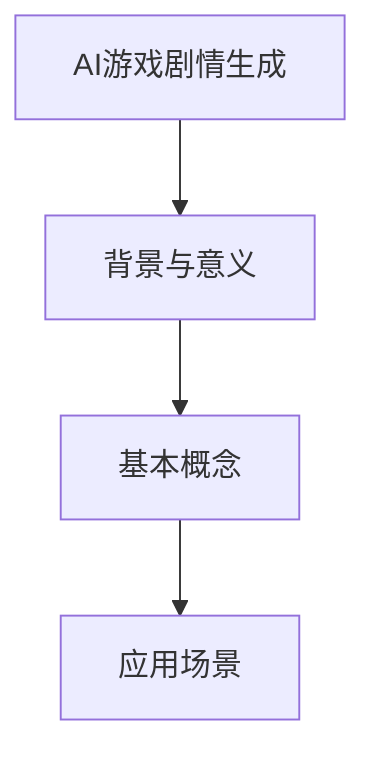
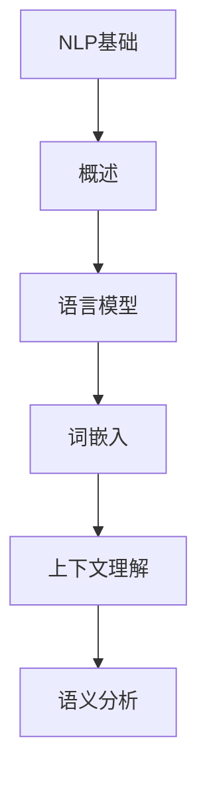
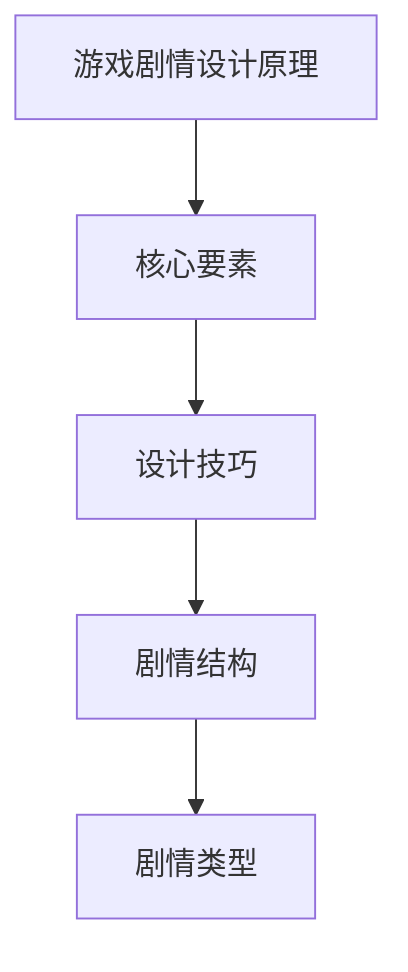
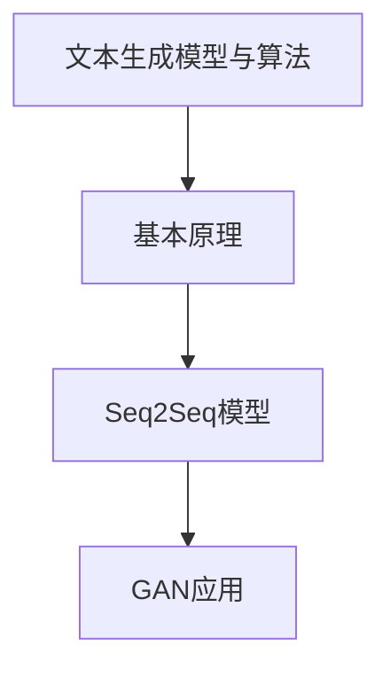
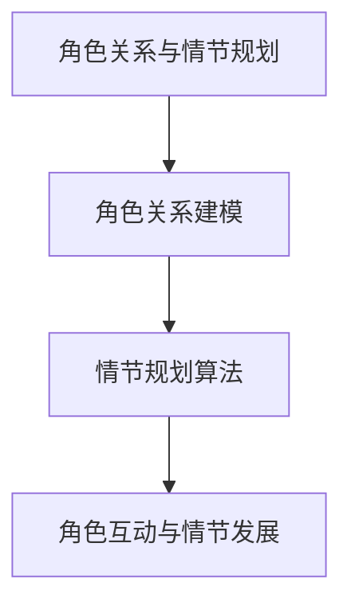
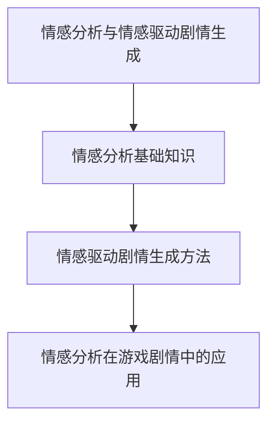
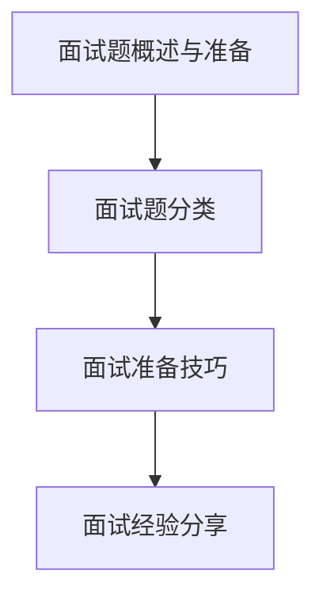
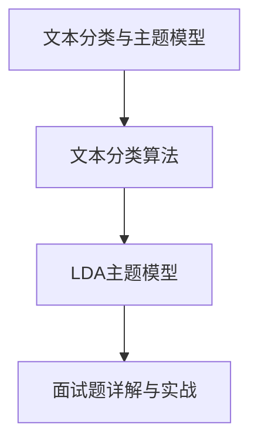
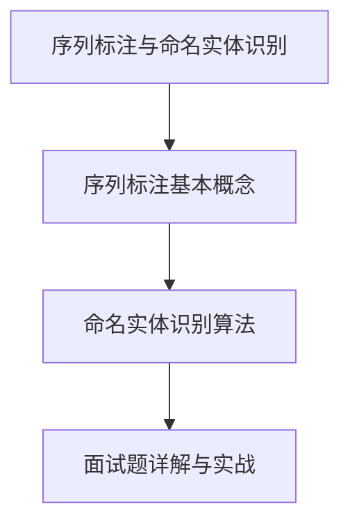
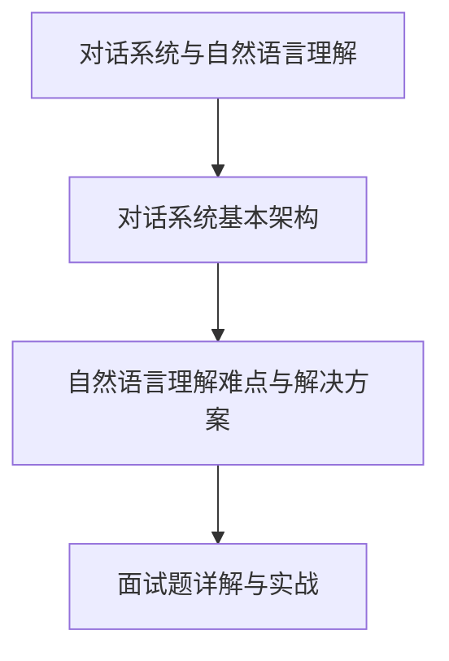

                 

# 腾讯2024AI游戏剧情生成校招NLP面试题解析

> 关键词：AI游戏剧情生成，自然语言处理（NLP），面试题解析，文本生成模型，情感分析，对话系统

> 摘要：本文旨在为准备腾讯2024校招NLP面试的同学提供一篇详细的AI游戏剧情生成技术解析，包括基础概念、技术实现、面试题解析等，帮助大家更好地理解和掌握这一领域的知识。

## 目录大纲

#### 第一部分：AI游戏剧情生成基础

- 第1章：AI游戏剧情生成概述
  - 1.1 AI游戏剧情生成的背景与意义
  - 1.2 AI游戏剧情生成的基本概念
  - 1.3 AI游戏剧情生成的应用场景

- 第2章：自然语言处理（NLP）基础
  - 2.1 NLP概述
  - 2.2 语言模型与词嵌入
  - 2.3 上下文理解与语义分析

- 第3章：游戏剧情设计原理
  - 3.1 游戏剧情设计的核心要素
  - 3.2 游戏剧情设计的技巧与方法
  - 3.3 游戏剧情的结构与类型

#### 第二部分：AI游戏剧情生成技术

- 第4章：文本生成模型与算法
  - 4.1 文本生成模型的基本原理
  - 4.2 序列到序列（Seq2Seq）模型
  - 4.3 生成对抗网络（GAN）在文本生成中的应用

- 第5章：角色关系与情节规划
  - 5.1 角色关系的建模
  - 5.2 情节规划的算法
  - 5.3 角色互动与情节发展

- 第6章：情感分析与情感驱动剧情生成
  - 6.1 情感分析的基础知识
  - 6.2 情感驱动的剧情生成方法
  - 6.3 情感分析在游戏剧情中的应用

#### 第三部分：NLP面试题解析

- 第7章：面试题概述与准备
  - 7.1 NLP面试题的分类
  - 7.2 面试准备的方法与技巧
  - 7.3 经典面试题类型分析

- 第8章：文本分类与主题模型
  - 8.1 文本分类的算法与评估
  - 8.2 LDA主题模型的原理与应用
  - 8.3 面试题详解与实战

- 第9章：序列标注与命名实体识别
  - 9.1 序列标注的基本概念
  - 9.2 命名实体识别的算法
  - 9.3 面试题详解与实战

- 第10章：对话系统与自然语言理解
  - 10.1 对话系统的基本架构
  - 10.2 自然语言理解的难点与解决方案
  - 10.3 面试题详解与实战

#### 附录

- 附录A：AI游戏剧情生成实践案例
  - A.1 案例介绍
  - A.2 实践步骤与代码实现
  - A.3 结果分析与评估

- 附录B：NLP面试题集锦与解析
  - B.1 常见面试题汇总
  - B.2 面试题解析与答案
  - B.3 面试经验分享与建议

### 第一部分：AI游戏剧情生成基础

#### 第1章：AI游戏剧情生成概述

随着人工智能技术的不断发展，AI在游戏剧情生成领域的应用越来越广泛。本章将介绍AI游戏剧情生成的背景与意义、基本概念和应用场景。

### 1.1 AI游戏剧情生成的背景与意义

在传统的游戏开发中，剧情生成通常依赖于游戏设计师的经验和创意，这种方式虽然能够制作出高质量的剧情，但成本较高，且难以满足多样化的需求。随着人工智能技术的崛起，特别是自然语言处理（NLP）和深度学习的发展，AI游戏剧情生成成为了一个新的研究方向。

AI游戏剧情生成的意义主要体现在以下几个方面：

1. **提升游戏开发效率**：通过AI技术，可以自动化地生成游戏剧情，减少人工设计的工作量，提高游戏开发的效率。

2. **满足个性化需求**：AI可以根据玩家的行为和偏好，动态地生成个性化的剧情，提高玩家的游戏体验。

3. **创造多样化剧情**：AI可以生成多样化的剧情，满足不同玩家对游戏剧情的多样化需求，提升游戏的趣味性和吸引力。

4. **降低游戏开发成本**：通过自动化生成剧情，可以减少游戏开发的人力成本和制作成本，提高游戏产业的整体竞争力。

### 1.2 AI游戏剧情生成的基本概念

AI游戏剧情生成涉及多个核心概念，包括自然语言处理（NLP）、文本生成模型、角色关系和情节规划等。

1. **自然语言处理（NLP）**：NLP是人工智能的一个重要分支，主要研究如何让计算机理解和处理人类语言。在游戏剧情生成中，NLP技术用于理解和生成游戏剧情文本。

2. **文本生成模型**：文本生成模型是AI用于生成文本的一种算法，如序列到序列（Seq2Seq）模型和生成对抗网络（GAN）。这些模型通过学习大量文本数据，能够自动生成新的文本。

3. **角色关系**：角色关系是指游戏中各个角色之间的互动和联系，如友情、敌对、合作关系等。在游戏剧情生成中，角色关系用于构建剧情的背景和情节。

4. **情节规划**：情节规划是指根据角色关系和游戏目标，设计游戏剧情的发展路径。情节规划是游戏剧情生成中关键的一环，决定了剧情的连贯性和吸引力。

### 1.3 AI游戏剧情生成的应用场景

AI游戏剧情生成可以在多种类型的游戏中应用，以下是一些典型的应用场景：

1. **角色扮演游戏（RPG）**：RPG通常具有复杂的剧情，AI可以用于生成角色的对话和背景故事，提高剧情的多样性和吸引力。

2. **策略游戏**：策略游戏中的剧情通常需要反映游戏中的策略和战术，AI可以生成与玩家决策相关的剧情，提高游戏的互动性。

3. **冒险游戏**：冒险游戏通常需要生成大量的场景描述和任务说明，AI可以自动化地生成这些内容，提高游戏的可玩性。

4. **教育游戏**：教育游戏中的剧情可以用于辅助学习，AI可以生成与学习内容相关的剧情，提高学习效果。

通过本章的介绍，我们对AI游戏剧情生成有了基本的了解。接下来，我们将深入探讨自然语言处理（NLP）的基础知识，为理解AI游戏剧情生成的技术打下基础。

### 第2章：自然语言处理（NLP）基础

自然语言处理（Natural Language Processing，NLP）是人工智能领域的一个重要分支，它致力于让计算机理解和生成人类语言。本章将介绍NLP的基本概念、语言模型与词嵌入、上下文理解与语义分析，为理解AI游戏剧情生成提供理论基础。

### 2.1 NLP概述

自然语言处理的主要目标是让计算机能够理解、处理和生成人类语言，这包括文本的提取、解析、理解和生成。NLP的研究领域非常广泛，主要包括以下内容：

1. **文本预处理**：包括分词、词性标注、命名实体识别等，用于将原始文本转换为计算机可以处理的格式。

2. **语言模型**：用于预测文本的下一个词或序列，是许多NLP任务的基础，如机器翻译、语音识别和自动摘要。

3. **语义分析**：涉及句子的语义解析、情感分析、指代消解等，旨在理解句子的深层含义。

4. **对话系统**：用于实现人与计算机之间的自然语言交互，包括问答系统、聊天机器人等。

5. **文本生成**：包括自动写作、新闻生成、剧情生成等，旨在利用NLP技术生成高质量的文本。

### 2.2 语言模型与词嵌入

语言模型是NLP的核心概念之一，它用于预测文本的下一个词或序列。在游戏剧情生成中，语言模型可以用于生成角色的对话、任务说明和背景故事。

#### 语言模型的基本原理

语言模型通常基于统计方法或机器学习方法构建。最基本的语言模型是n-gram模型，它通过统计相邻词的频率来预测下一个词。n-gram模型的数学表示为：

$$
P(w_n | w_{n-1}, ..., w_1) = \frac{C(w_{n-1}, ..., w_n)}{C(w_{n-1}, ..., w_{n-1})}
$$

其中，$C(w_{n-1}, ..., w_n)$ 表示连续词序列$(w_{n-1}, ..., w_n)$ 的出现次数，$C(w_{n-1}, ..., w_{n-1})$ 表示前一个词序列$(w_{n-1}, ..., w_1)$ 的出现次数。

尽管n-gram模型简单有效，但它存在一些局限性，如无法捕捉长距离依赖和词的上下文信息。为了解决这些问题，引入了更复杂的语言模型，如神经网络语言模型（NNLM）。

神经网络语言模型通常采用深度学习技术，通过大量文本数据进行训练，学习文本的潜在结构。一种常用的神经网络语言模型是循环神经网络（RNN），特别是长短期记忆网络（LSTM），它能够捕捉长距离依赖关系。

#### 词嵌入

词嵌入（Word Embedding）是将词映射到高维空间中的一种技术，它可以将语义相似的词映射到接近的位置。词嵌入的主要目的是将抽象的词转换为计算机可以处理的向量表示。

词嵌入可以通过以下几种方法实现：

1. **基于分布的词嵌入**：如Word2Vec，它通过训练词的向量表示，使具有相似含义的词在向量空间中接近。

2. **基于翻译的词嵌入**：如翻译嵌入（Translation Embedding），它利用双语语料库训练词的向量表示，使具有相似翻译的词在向量空间中接近。

3. **基于上下文的词嵌入**：如BERT（Bidirectional Encoder Representations from Transformers），它通过双向Transformer模型训练词的向量表示，使词的上下文信息得到充分捕捉。

词嵌入在NLP中具有广泛的应用，如文本分类、情感分析、命名实体识别等。在游戏剧情生成中，词嵌入可以用于生成角色的对话和背景故事，提高剧情的连贯性和自然性。

### 2.3 上下文理解与语义分析

上下文理解（Contextual Understanding）是NLP的一个关键任务，它涉及理解词或句子在特定上下文中的含义。上下文理解对于生成自然、准确的文本至关重要。

#### 上下文理解的基本原理

上下文理解的关键在于捕捉词或句子的局部和全局信息。局部信息涉及词的上下文，即词周围的其他词；全局信息涉及句子的整体结构和语义。

一种常用的上下文理解技术是注意力机制（Attention Mechanism）。注意力机制通过分配不同的权重给不同的词或句子部分，使得模型能够关注重要的信息。在游戏剧情生成中，注意力机制可以用于关注角色的对话和剧情的发展。

#### 语义分析

语义分析（Semantic Analysis）是NLP中理解句子或文本的深层含义。语义分析包括以下任务：

1. **语义角色标注**：将句子中的词语标注为不同的语义角色，如主语、谓语、宾语等。

2. **语义关系识别**：识别句子中的词语之间的语义关系，如因果关系、并列关系等。

3. **语义消解**：将句子中的指代词或代词与实体进行匹配，以消除歧义。

语义分析在游戏剧情生成中至关重要，它可以帮助AI理解角色的意图和剧情的发展方向。

通过本章的介绍，我们对自然语言处理（NLP）的基本概念和核心技术有了深入的了解。在接下来的章节中，我们将探讨AI游戏剧情生成的具体技术实现，包括文本生成模型、角色关系建模和情节规划。

### 第3章：游戏剧情设计原理

游戏剧情设计是游戏开发中至关重要的一环，它不仅决定了游戏的趣味性和吸引力，还影响了玩家的沉浸体验。本章将深入探讨游戏剧情设计的核心要素、技巧与方法，以及游戏剧情的结构与类型，为理解AI游戏剧情生成提供理论基础。

#### 3.1 游戏剧情设计的核心要素

游戏剧情设计涉及多个核心要素，这些要素共同构成了一个丰富、引人入胜的游戏世界。

1. **角色**：角色是游戏剧情中的主要参与者，包括主角、反派、NPC等。角色设计不仅影响剧情的发展，还影响玩家的情感投入和角色认同。

2. **情节**：情节是游戏剧情的核心，它通过一系列事件和冲突推动剧情的发展。情节设计需要考虑逻辑性、连贯性和吸引力。

3. **冲突**：冲突是推动剧情发展的动力，它可以是角色之间的冲突，也可以是角色与外部环境之间的冲突。有效的冲突设计能够增加剧情的紧张感和吸引力。

4. **目标**：目标为玩家提供了一个明确的目标，激励玩家继续游戏。目标可以是拯救世界、打败反派、完成任务等。

5. **悬念**：悬念是保持玩家兴趣的关键，它通过设置未解之谜和悬念来吸引玩家继续探索。

6. **节奏**：节奏是指游戏剧情的快慢和紧张程度。合适的节奏设计能够提高玩家的沉浸体验。

#### 3.2 游戏剧情设计的技巧与方法

游戏剧情设计需要遵循一些基本的原则和技巧，以确保剧情的连贯性和吸引力。

1. **三幕结构**：三幕结构是剧本写作中常用的结构，它将剧情分为开场、发展和高潮三个阶段。在游戏剧情设计中，三幕结构可以帮助构建一个有起承转合的剧情。

2. **冲突与解决**：冲突与解决是游戏剧情设计的核心，通过设置冲突和解决冲突，可以推动剧情的发展。有效的冲突设计需要具备紧张感、矛盾性和悬念。

3. **角色发展**：角色发展是指角色在剧情中的成长和变化。通过角色的发展，可以增加剧情的深度和情感投入。

4. **剧情转折**：剧情转折是剧情发展中的重要节点，它可以通过意外的剧情发展或角色变化，为剧情带来新的转折和张力。

5. **剧情多样性**：剧情多样性是吸引玩家的关键，通过设置不同的剧情路径和结局，可以增加游戏的趣味性和可玩性。

6. **用户参与**：用户参与是指玩家在剧情中的主动参与，通过让玩家做出决策或选择，可以增加剧情的互动性和沉浸感。

#### 3.3 游戏剧情的结构与类型

游戏剧情的结构和类型决定了剧情的表现形式和内容，不同的结构和类型可以产生不同的游戏体验。

1. **线性剧情**：线性剧情是传统的剧情结构，它按照固定的顺序发展，玩家没有太多的选择空间。线性剧情适合叙事性强、剧情紧凑的游戏。

2. **分支剧情**：分支剧情是指剧情根据玩家的决策或游戏进展发生分支，不同的决策可以导致不同的剧情路径和结局。分支剧情增加了游戏的多样性，适合角色扮演游戏（RPG）和策略游戏。

3. **开放世界剧情**：开放世界剧情是指在开放世界中，玩家可以自由探索和体验剧情。开放世界剧情通常具有多个剧情线，玩家可以根据自己的兴趣和选择来体验不同的剧情。开放世界剧情适合沙盒游戏和冒险游戏。

4. **动态剧情**：动态剧情是指剧情根据游戏进展和玩家行为动态生成的剧情。动态剧情可以根据玩家的决策和游戏环境实时调整，增加剧情的互动性和真实感。

5. **多结局剧情**：多结局剧情是指剧情根据玩家的决策或游戏进展产生多个不同的结局。多结局剧情可以增加游戏的趣味性和挑战性，让玩家感受到不同的游戏体验。

通过本章的介绍，我们对游戏剧情设计的核心要素、技巧与方法以及游戏剧情的结构与类型有了更深入的了解。在接下来的章节中，我们将探讨AI游戏剧情生成的具体技术实现，包括文本生成模型、角色关系建模和情节规划。

### 第二部分：AI游戏剧情生成技术

#### 第4章：文本生成模型与算法

文本生成是AI游戏剧情生成中的关键步骤，它决定了剧情的自然性和连贯性。本章将介绍文本生成模型与算法，包括文本生成模型的基本原理、序列到序列（Seq2Seq）模型和生成对抗网络（GAN）在文本生成中的应用。

#### 4.1 文本生成模型的基本原理

文本生成模型是一种能够生成文本的算法，它通过学习大量文本数据，理解文本的内在结构和规律，从而生成新的文本。文本生成模型可以分为统计模型和深度学习模型。

1. **统计模型**：统计模型通过统计文本中词的频率和概率来生成文本。最简单的统计模型是n-gram模型，它通过统计相邻词的频率来预测下一个词。

   $$P(w_n | w_{n-1}, ..., w_1) = \frac{C(w_{n-1}, ..., w_n)}{C(w_{n-1}, ..., w_{n-1})}$$

   其中，$C(w_{n-1}, ..., w_n)$ 表示连续词序列$(w_{n-1}, ..., w_n)$ 的出现次数，$C(w_{n-1}, ..., w_{n-1})$ 表示前一个词序列$(w_{n-1}, ..., w_1)$ 的出现次数。

   尽管n-gram模型简单有效，但它无法捕捉长距离依赖和上下文信息，因此存在一些局限性。

2. **深度学习模型**：深度学习模型通过学习大量的文本数据，可以捕捉文本的深层结构和语义信息。最常用的深度学习模型是循环神经网络（RNN）和其变体，如长短期记忆网络（LSTM）和门控循环单元（GRU）。

   $$h_t = \text{LSTM}(h_{t-1}, x_t)$$

   其中，$h_t$ 表示第$t$个时间步的隐藏状态，$x_t$ 表示第$t$个输入词的嵌入向量。

   RNN和LSTM可以捕捉长距离依赖，但仍然存在梯度消失和梯度爆炸的问题。为了解决这些问题，引入了门控循环单元（GRU）。

   $$h_t = \text{GRU}(h_{t-1}, x_t)$$

   GRU通过门控机制减少了参数，提高了模型的训练稳定性。

#### 4.2 序列到序列（Seq2Seq）模型

序列到序列（Seq2Seq）模型是一种用于序列数据转换的深度学习模型，它由编码器（Encoder）和解码器（Decoder）两部分组成。Seq2Seq模型广泛应用于机器翻译、语音识别和文本生成等领域。

1. **编码器（Encoder）**：编码器将输入序列编码为一个固定长度的向量，称为上下文向量或编码输出。编码器通常采用RNN或LSTM模型。

   $$c = \text{LSTM}(x_1, x_2, ..., x_T)$$

   其中，$c$ 表示编码输出，$x_1, x_2, ..., x_T$ 表示输入序列的词嵌入向量。

2. **解码器（Decoder）**：解码器根据编码输出和已生成的部分输出序列生成新的输出序列。解码器也采用RNN或LSTM模型。

   $$y_t = \text{LSTM}(c, y_{t-1})$$

   其中，$y_t$ 表示第$t$个生成的词。

3. **注意力机制（Attention）**：为了更好地捕捉编码输出和解码输出之间的依赖关系，Seq2Seq模型引入了注意力机制。注意力机制通过分配不同的权重给编码输出的不同部分，使得解码器能够关注重要的信息。

   $$a_t = \text{Attention}(c)$$

   其中，$a_t$ 表示注意力权重。

   最终，解码器的输出可以表示为：

   $$y_t = \text{LSTM}(c, y_{t-1}, a_t)$$

#### 4.3 生成对抗网络（GAN）在文本生成中的应用

生成对抗网络（GAN）是一种由生成器和判别器组成的深度学习模型，它通过相互竞争来生成高质量的数据。GAN在图像生成、语音合成和文本生成等领域表现出色。

1. **生成器（Generator）**：生成器旨在生成与真实数据相似的新数据。在文本生成中，生成器用于生成新的文本序列。

   $$G(z) = \text{Generator}(z)$$

   其中，$z$ 是生成器的输入噪声。

2. **判别器（Discriminator）**：判别器旨在区分真实数据和生成数据。在文本生成中，判别器用于判断文本序列是真实生成的还是人工合成的。

   $$D(x) = \text{Discriminator}(x)$$

   其中，$x$ 是输入的文本序列。

3. **对抗训练**：生成器和判别器通过对抗训练来提高性能。生成器的目标是最大化判别器判断生成数据的概率，而判别器的目标是最大化判别器判断生成数据和真实数据之间的差异。

   $$\min_G \max_D V(D, G)$$

   其中，$V(D, G)$ 是生成器和判别器的损失函数。

   GAN在文本生成中的应用包括：

   - **文本摘要**：生成器生成摘要，判别器判断摘要是否与原始文本一致。
   - **对话系统**：生成器生成对话，判别器判断对话是否真实。
   - **剧情生成**：生成器生成剧情文本，判别器判断剧情是否合理。

通过本章的介绍，我们对文本生成模型与算法的基本原理和应用有了深入的了解。在接下来的章节中，我们将探讨角色关系建模和情节规划的算法，为AI游戏剧情生成提供更丰富的技术支持。

#### 第5章：角色关系与情节规划

在AI游戏剧情生成中，角色关系和情节规划是两个关键组成部分，它们决定了剧情的连贯性和吸引力。本章将详细介绍角色关系的建模、情节规划的算法以及角色互动与情节发展。

#### 5.1 角色关系的建模

角色关系是指游戏中各个角色之间的互动和联系，如友情、敌对、合作关系等。角色关系的建模是游戏剧情生成的基础，它帮助系统理解剧情背景和角色行为。

1. **实体关系网络**：实体关系网络（Entity Relationship Network，ERN）是一种用于表示角色关系的图形模型。在实体关系网络中，每个节点表示一个角色，每条边表示角色之间的关系。

   $$\text{ERN} = (\text{Nodes}, \text{Edges})$$

   其中，Nodes 表示角色集合，Edges 表示角色关系集合。

2. **属性关联分析**：属性关联分析（Attribute Association Analysis，AAA）是一种用于分析角色属性的关联性。通过属性关联分析，可以找出角色之间的共同属性，从而构建更准确的实体关系网络。

3. **关系推理算法**：关系推理算法（Relationship Inference Algorithm，RIA）用于根据已知的角色关系推断新的角色关系。常见的推理算法包括基于规则的推理和基于概率的推理。

   $$R' = \text{RIA}(R, A)$$

   其中，$R$ 表示初始角色关系网络，$A$ 表示新角色属性，$R'$ 表示更新后的角色关系网络。

#### 5.2 情节规划的算法

情节规划（Plot Planning）是指根据角色关系和游戏目标，设计游戏剧情的发展路径。情节规划的算法决定了剧情的连贯性和吸引力。

1. **剧情生成算法**：剧情生成算法（Plot Generation Algorithm，PGA）用于生成新的游戏剧情。常见的剧情生成算法包括基于规则的算法、基于统计的算法和基于机器学习的算法。

   $$P = \text{PGA}(R, T)$$

   其中，$P$ 表示生成的剧情，$R$ 表示角色关系网络，$T$ 表示游戏目标。

2. **剧情发展算法**：剧情发展算法（Plot Development Algorithm，PDA）用于根据当前剧情状态和角色行为，预测剧情的未来发展。剧情发展算法可以帮助系统理解剧情的连贯性和动态性。

3. **剧情转折算法**：剧情转折算法（Plot Turnover Algorithm，PTA）用于在剧情中引入转折点，增加剧情的紧张感和吸引力。剧情转折算法可以根据角色行为和剧情状态，智能地引入转折点。

   $$P' = \text{PTA}(P, R, B)$$

   其中，$P$ 表示当前剧情，$R$ 表示角色关系网络，$B$ 表示角色行为，$P'$ 表示更新后的剧情。

#### 5.3 角色互动与情节发展

角色互动是游戏剧情的重要组成部分，它决定了剧情的动态性和吸引力。角色互动可以通过以下方式实现：

1. **角色行为模型**：角色行为模型（Role Behavior Model，RBM）用于描述角色的行为模式和动机。通过角色行为模型，可以生成符合角色个性特征的互动。

2. **互动规则定义**：互动规则定义（Interaction Rule Definition，IRD）用于描述角色之间的互动规则。通过互动规则定义，可以生成符合游戏逻辑的互动。

3. **情节演变算法**：情节演变算法（Plot Evolution Algorithm，PEA）用于根据角色互动和剧情状态，实时地更新和优化剧情。情节演变算法可以帮助系统动态地调整剧情走向，提高剧情的连贯性和吸引力。

通过本章的介绍，我们对角色关系与情节规划的基本概念和技术有了深入的了解。在接下来的章节中，我们将探讨情感分析与情感驱动剧情生成的方法，为游戏剧情生成提供更多的技术支持。

### 第6章：情感分析与情感驱动剧情生成

情感分析是自然语言处理（NLP）的一个重要分支，它致力于理解和分析文本中的情感倾向和情感强度。在游戏剧情生成中，情感分析可以用于生成具有情感张力和吸引力的剧情，提升玩家的沉浸体验。本章将详细介绍情感分析的基础知识、情感驱动的剧情生成方法以及情感分析在游戏剧情中的应用。

#### 6.1 情感分析的基础知识

情感分析（Sentiment Analysis）是指使用自然语言处理技术来分析文本中的情感倾向和情感强度。情感分析通常包括以下几种任务：

1. **情感分类**：情感分类是指将文本分类为积极的、消极的或中性的情感。情感分类可以使用分类算法，如朴素贝叶斯、支持向量机（SVM）和深度学习模型。

2. **情感极性分析**：情感极性分析是指确定文本的情感极性，即文本是否表达积极或消极的情感。情感极性分析通常使用二分类模型，如逻辑回归和决策树。

3. **情感强度分析**：情感强度分析是指确定文本中情感的表达程度，即情感是强烈的还是微弱的。情感强度分析通常使用回归模型，如线性回归和岭回归。

#### 情感分类算法

情感分类算法通过训练模型来学习情感标签和文本特征之间的关系。以下是一些常用的情感分类算法：

1. **朴素贝叶斯分类器**：朴素贝叶斯分类器是一种基于贝叶斯定理的分类算法，它假设特征之间相互独立。朴素贝叶斯分类器的数学公式如下：

   $$
   P(C_k|X) = \frac{P(X|C_k)P(C_k)}{P(X)}
   $$

   其中，$C_k$ 表示情感类别，$X$ 表示文本特征。

2. **支持向量机（SVM）**：支持向量机是一种强大的分类算法，它通过找到一个最佳的超平面来将数据分类。支持向量机的优化目标如下：

   $$
   \hat{w} = \arg\min_{w, b} \frac{1}{2} ||w||^2 + C \sum_{i=1}^{n} \max(0, 1 - y_i ( \langle w, x_i \rangle + b))
   $$

   其中，$w$ 是权重向量，$b$ 是偏置项，$C$ 是正则化参数。

3. **随机森林**：随机森林是一种基于决策树的集成学习方法，它通过训练多个决策树并取平均值来提高分类性能。随机森林的预测结果如下：

   $$
   \hat{y} = \text{mode}(\hat{y}_1, \ldots, \hat{y}_m)
   $$

   其中，$\hat{y}_i$ 表示第$i$棵决策树的预测结果。

#### 6.2 情感驱动的剧情生成方法

情感驱动的剧情生成方法是指通过分析文本情感，动态地生成具有情感张力的剧情。这种方法可以提高剧情的自然性和吸引力。以下是一些情感驱动的剧情生成方法：

1. **情感驱动剧情规划**：情感驱动剧情规划是指根据文本情感，规划剧情的发展路径。情感驱动剧情规划可以用于生成情节转折和角色发展，增加剧情的连贯性和吸引力。

2. **情感驱动情节发展**：情感驱动情节发展是指根据文本情感，动态地生成情节发展的细节。情感驱动情节发展可以帮助系统理解剧情的情感走向，并生成具有情感张力的剧情。

3. **情感驱动角色互动**：情感驱动角色互动是指根据文本情感，生成角色之间的互动。情感驱动角色互动可以增强角色的情感表达，提高剧情的吸引力。

#### 6.3 情感分析在游戏剧情中的应用

情感分析在游戏剧情生成中具有广泛的应用，以下是一些具体的例子：

1. **剧情情感建模**：通过情感分析，可以生成具有情感倾向的剧情。例如，一个消极情感的剧情可能包含冲突、挫折和失败，而一个积极情感的剧情可能包含成功、胜利和和解。

2. **情感驱动的剧情转折**：通过情感分析，可以在剧情中引入情感转折点，增加剧情的紧张感和吸引力。例如，在一个充满希望和乐观的剧情中，突然引入一个消极情感的转折点，可以增强剧情的戏剧性。

3. **情感驱动的角色发展**：通过情感分析，可以生成具有情感变化的角色。例如，一个角色可能从乐观变为悲观，或者从敌对变为友好，这样的情感变化可以增加角色的深度和吸引力。

4. **情感驱动的剧情评估**：通过情感分析，可以评估剧情的情感质量和吸引力。例如，一个具有高积极情感的剧情可能更受欢迎，而一个具有高消极情感的剧情可能需要调整。

通过本章的介绍，我们对情感分析的基础知识、情感驱动的剧情生成方法以及情感分析在游戏剧情中的应用有了深入的了解。在接下来的章节中，我们将探讨NLP面试题的解析，帮助准备面试的同学更好地掌握相关知识点。

### 第7章：面试题概述与准备

在准备腾讯2024校招NLP面试时，了解面试题的分类、准备方法和技巧是非常重要的。本章将详细讨论NLP面试题的分类、面试准备的方法与技巧，以及经典面试题类型分析，为面试做好充分准备。

#### 7.1 NLP面试题的分类

NLP面试题可以分为以下几个主要类别：

1. **文本分类**：文本分类是指将文本数据分类到预定义的类别中。这类面试题通常涉及如何使用算法（如朴素贝叶斯、支持向量机、随机森林等）进行文本分类，以及如何评估分类模型的性能。

2. **序列标注**：序列标注是指为文本中的每个词或词组标注上相应的标签。这类面试题包括命名实体识别、词性标注等，通常涉及如何使用序列标注模型（如CRF、BiLSTM等）进行标注。

3. **命名实体识别**：命名实体识别是指从文本中识别出具有特定意义的实体，如人名、地名、组织名等。这类面试题通常要求候选人理解和实现命名实体识别算法，并能解释模型的工作原理。

4. **对话系统**：对话系统是指能够与人类进行自然语言交互的计算机系统。这类面试题通常涉及对话系统的基本架构、自然语言理解（NLU）和自然语言生成（NLG）的原理和应用。

5. **情感分析**：情感分析是指识别文本中的情感倾向和情感强度。这类面试题通常要求候选人了解情感分类、情感极性和情感强度分析的方法。

#### 7.2 面试准备的方法与技巧

为了在NLP面试中取得好成绩，以下是一些有效的准备方法和技巧：

1. **知识点复习**：回顾NLP的基本概念、算法和模型，确保对每个概念都有深入的理解。重点复习常见的文本处理技术，如分词、词性标注、命名实体识别等。

2. **模拟面试**：模拟面试可以帮助你熟悉面试流程，增强自信心。你可以找朋友或同事扮演面试官，进行模拟面试，并在过程中记录和反思自己的表现。

3. **案例分析**：通过分析真实的项目案例，了解NLP技术在实际应用中的实现方法和挑战。案例分析可以帮助你更好地理解面试题的背景和解决方案。

4. **面试心态调整**：面试时保持冷静和自信是非常重要的。确保充足的休息，保持良好的心态，不要过度紧张。

#### 7.3 经典面试题类型分析

以下是一些常见的NLP面试题类型及其解析：

1. **文本分类面试题**：

   - **问题**：如何实现一个文本分类器？请描述其工作原理和性能评估指标。
   - **解析**：文本分类器通常基于统计模型（如朴素贝叶斯、支持向量机）或深度学习模型（如卷积神经网络、循环神经网络）。性能评估指标包括准确率、精确率、召回率和F1分数。

2. **序列标注面试题**：

   - **问题**：什么是CRF？如何使用CRF进行序列标注？
   - **解析**：CRF是一种用于序列标注的统计模型，通过最大化条件概率来预测序列中的标签。训练CRF模型通常涉及构建特征函数和计算条件概率。

3. **命名实体识别面试题**：

   - **问题**：如何实现命名实体识别？请描述其工作流程。
   - **解析**：命名实体识别通常涉及词性标注和模式匹配。可以使用规则方法、统计模型（如HMM）或深度学习模型（如BiLSTM）进行实现。

4. **对话系统面试题**：

   - **问题**：如何设计一个有效的对话系统？请描述其基本架构和关键组件。
   - **解析**：对话系统包括自然语言理解（NLU）、对话管理和自然语言生成（NLG）三个关键组件。设计对话系统时需要考虑上下文管理、意图识别和对话生成。

5. **情感分析面试题**：

   - **问题**：如何实现情感分析？请描述其步骤和挑战。
   - **解析**：情感分析通常包括情感分类和情感强度分析。实现情感分析需要使用分类算法（如朴素贝叶斯、支持向量机）和回归算法（如逻辑回归）。挑战包括语义歧义、上下文依赖和情感强度的不确定性。

通过本章的介绍，你对NLP面试题的分类、准备方法和技巧以及经典面试题类型有了更深入的了解。在接下来的章节中，我们将进一步解析文本分类与主题模型的面试题，为你的面试准备提供更多的指导。

### 第8章：文本分类与主题模型

文本分类和主题模型是自然语言处理（NLP）中的两个重要任务，广泛应用于信息检索、推荐系统、文本挖掘等领域。本章将详细介绍文本分类的算法与评估、LDA主题模型的原理与应用，以及相关的面试题详解与实战。

#### 8.1 文本分类的算法与评估

文本分类（Text Classification）是指将文本数据分类到预定义的类别中。文本分类算法可以分为基于统计的方法、基于规则的方法和基于深度学习的方法。

1. **朴素贝叶斯分类器**（Naive Bayes Classifier）：

   朴素贝叶斯分类器是一种基于贝叶斯定理的简单分类器，它假设特征之间相互独立。朴素贝叶斯的数学公式如下：

   $$
   P(C_k|X) = \frac{P(X|C_k)P(C_k)}{P(X)}
   $$

   其中，$C_k$ 表示类别，$X$ 表示特征向量。

2. **支持向量机（Support Vector Machine, SVM）**：

   支持向量机是一种强大的分类算法，它通过找到一个最佳的超平面来将数据分类。SVM的优化目标如下：

   $$
   \hat{w} = \arg\min_{w, b} \frac{1}{2} ||w||^2 + C \sum_{i=1}^{n} \max(0, 1 - y_i ( \langle w, x_i \rangle + b))
   $$

   其中，$w$ 是权重向量，$b$ 是偏置项，$C$ 是正则化参数。

3. **随机森林（Random Forest）**：

   随机森林是一种基于决策树的集成学习方法，它通过训练多个决策树并取平均值来提高分类性能。随机森林的预测结果如下：

   $$
   \hat{y} = \text{mode}(\hat{y}_1, \ldots, \hat{y}_m)
   $$

   其中，$\hat{y}_i$ 表示第$i$棵决策树的预测结果。

文本分类的评估指标包括：

- **准确率（Accuracy）**：

  $$
  \text{Accuracy} = \frac{\text{TP} + \text{TN}}{\text{TP} + \text{TN} + \text{FP} + \text{FN}}
  $$

- **精确率（Precision）**：

  $$
  \text{Precision} = \frac{\text{TP}}{\text{TP} + \text{FP}}
  $$

- **召回率（Recall）**：

  $$
  \text{Recall} = \frac{\text{TP}}{\text{TP} + \text{FN}}
  $$

- **F1分数（F1-Score）**：

  $$
  \text{F1-Score} = 2 \times \frac{\text{Precision} \times \text{Recall}}{\text{Precision} + \text{Recall}}
  $$

#### 8.2 LDA主题模型的原理与应用

LDA（Latent Dirichlet Allocation）是一种概率主题模型，用于从文本数据中提取主题。LDA模型的核心思想是，每个文档都是由多个主题的混合生成，每个主题又是由多个词的混合生成。

LDA模型的数学公式如下：

$$
\begin{aligned}
    &P(z_d|θ) = \frac{1}{\sum_{k=1}^{K} \sum_{w\in V} β_{kw} z_{dw}} \\
    &P(w|θ, z_d) = \frac{γ_{kw}}{\sum_{w'\in V} γ_{kw'}} \\
    &P(θ) = \frac{1}{K^{|\V|} \prod_{k=1}^{K} \Gamma(|\V|γ_{kk})} \\
    &P(d|θ) = \frac{1}{|\V|^{\sum_d |d|} \prod_{k=1}^{K} \Gamma(\sum_d |d|θ_{dk})}
\end{aligned}
$$

其中，$z_d$ 表示文档$d$的主题分布，$w$ 表示词汇，$θ$ 表示主题分布，$γ_{kw}$ 表示词主题分布，$β_{kw}$ 表示主题词分布。

LDA主题模型的应用包括：

1. **文本分类**：基于主题相似性进行文本分类。

2. **文本聚类**：根据主题分布进行文档聚类。

3. **文本推荐**：根据用户阅读文本的主题分布进行推荐。

#### 8.3 面试题详解与实战

以下是一些关于文本分类与主题模型的面试题及其解析：

1. **文本分类面试题**：

   - **问题**：如何实现一个文本分类器？请描述其工作原理和性能评估指标。
   - **解析**：文本分类器可以基于朴素贝叶斯、支持向量机、随机森林等算法。性能评估指标包括准确率、精确率、召回率和F1分数。

2. **主题模型面试题**：

   - **问题**：什么是LDA主题模型？请描述其原理和应用。
   - **解析**：LDA主题模型是一种概率主题模型，用于从文本数据中提取主题。LDA模型的核心思想是每个文档都是由多个主题的混合生成，每个主题又是由多个词的混合生成。LDA模型的应用包括文本分类、文本聚类和文本推荐。

3. **文本生成面试题**：

   - **问题**：如何使用LDA模型生成新的文本？
   - **解析**：使用LDA模型生成新的文本可以通过以下步骤：

     - 从LDA模型中提取主题词。
     - 根据主题词的分布生成新的文本。

4. **对话系统面试题**：

   - **问题**：如何使用LDA模型改进对话系统的自然语言理解？
   - **解析**：使用LDA模型可以改进对话系统的自然语言理解，例如：

     - 基于主题相似性匹配用户输入和系统响应。
     - 利用主题信息进行意图识别和对话生成。

通过本章的介绍，你对文本分类与主题模型有了更深入的了解，并在面试中能够更好地应对相关面试题。在接下来的章节中，我们将继续探讨序列标注与命名实体识别的面试题，帮助你在NLP领域取得更好的成绩。

### 第9章：序列标注与命名实体识别

序列标注（Sequence Labeling）和命名实体识别（Named Entity Recognition，NER）是自然语言处理（NLP）中两个重要的任务，广泛应用于信息提取、文本挖掘和语义分析等领域。本章将详细解析序列标注的基本概念、命名实体识别的算法，以及相关面试题的解答。

#### 9.1 序列标注的基本概念

序列标注是将输入序列中的每个元素标注上对应的类别标签。在NLP中，序列标注通常用于词性标注、命名实体识别等任务。

1. **定义**：

   序列标注是将一个单词序列标注为一系列标签的映射。例如，给一个句子“我昨天去了一家餐厅”进行命名实体识别，可以标注为“我（PER）昨天去了一家餐厅（ORG）”。

2. **类型**：

   - **词性标注**：为文本中的每个词标注词性，如名词、动词、形容词等。
   - **命名实体识别**：识别文本中的命名实体，如人名、地名、组织名等。

3. **常见任务**：

   - **命名实体识别（NER）**：识别文本中的命名实体，如人名、地名、机构名等。
   - **词性标注（POS）**：为文本中的每个词标注词性。
   - **序列标注（Seq Labeling）**：将序列中的每个元素标注上对应的类别标签。

#### 9.2 命名实体识别的算法

命名实体识别（NER）是序列标注的一个常见应用。NER算法可以分为基于规则的方法、基于统计的方法和基于深度学习的方法。

1. **基于规则的方法**：

   基于规则的方法通过定义一系列规则来识别命名实体。例如，可以使用正则表达式来识别人名、地名等。这种方法简单易实现，但扩展性较差。

2. **基于统计的方法**：

   基于统计的方法使用统计学习模型来识别命名实体，如条件随机场（CRF）和隐马尔可夫模型（HMM）。CRF是一种强大的序列标注模型，通过最大化条件概率来预测标签序列。HMM是一种基于状态转移概率和观察概率的序列标注模型。

3. **基于深度学习的方法**：

   基于深度学习的方法使用深度神经网络来识别命名实体，如卷积神经网络（CNN）和循环神经网络（RNN）。CNN可以捕捉文本的局部特征，RNN可以捕捉文本的全局特征。双向RNN（BiRNN）和长短期记忆网络（LSTM）是常用的深度学习模型。

#### 命名实体识别的数学公式

假设有一个输入序列$x_1, x_2, ..., x_n$，其中$x_i$表示第$i$个词，$y_1, y_2, ..., y_n$表示对应的标签。条件随机场（CRF）的参数估计采用最大似然估计（MLE）：

$$
\hat{\theta} = \arg\max_{\theta} \sum_{w} \sum_{y} P(y|\theta) \prod_{i=1}^{n} P(y_i|x_i, \theta)
$$

其中，$P(y|\theta)$是标签序列的概率，$P(y_i|x_i, \theta)$是第$i$个词给定标签$y_i$的概率。

#### 9.3 面试题详解与实战

以下是一些关于序列标注与命名实体识别的面试题及其解析：

1. **序列标注面试题**：

   - **问题**：什么是序列标注？请举例说明。
   - **解析**：序列标注是将输入序列中的每个元素标注上对应的类别标签。例如，词性标注和命名实体识别都是序列标注的应用。

2. **命名实体识别面试题**：

   - **问题**：什么是命名实体识别？请描述其原理和应用。
   - **解析**：命名实体识别是识别文本中的命名实体，如人名、地名、组织名等。命名实体识别可以应用于信息提取、文本挖掘和语义分析等领域。

3. **模型训练与评估面试题**：

   - **问题**：如何训练命名实体识别模型？如何评估模型性能？
   - **解析**：训练命名实体识别模型通常涉及以下步骤：

     - 数据预处理：将文本数据转换为序列，并添加标记。
     - 特征提取：为每个序列生成特征向量。
     - 模型训练：利用训练数据训练模型。
     - 模型评估：利用测试数据评估模型性能。

     评估指标包括准确率、精确率、召回率和F1分数。

4. **实战案例分析**：

   - **问题**：如何使用Python实现一个简单的命名实体识别模型？
   - **解析**：使用Python和Scikit-learn库可以实现一个简单的命名实体识别模型。以下是一个简单的示例：

     ```python
     from sklearn_crfsuite import CRF
     from sklearn_crfsuite import metrics
     import numpy as np

     # 特征提取
     def extract_features(seq, labels):
         X = []
         y = []
         for i, (word, label) in enumerate(zip(seq, labels)):
             x = [[char] for char in word]
             y.append([label])
             X.append(x)
         return np.array(X), np.array(y)

     # 训练模型
     crf = CRF()
     X_train, y_train = extract_features(train_seq, train_labels)
     crf.fit(X_train, y_train)

     # 评估模型
     X_test, y_test = extract_features(test_seq, test_labels)
     y_pred = crf.predict(X_test)
     print(metrics.flat_f1_score(y_test, y_pred, average='weighted'))
     ```

通过本章的介绍，你对序列标注与命名实体识别有了更深入的了解，并能够应对相关的面试题。在接下来的章节中，我们将探讨对话系统与自然语言理解，为你的NLP知识体系进一步完善。

### 第10章：对话系统与自然语言理解

对话系统（Dialogue System）和自然语言理解（Natural Language Understanding，NLU）是人工智能（AI）领域中的重要组成部分，它们在实现人与机器的自然交互中起着关键作用。本章将详细讨论对话系统的基本架构、自然语言理解的难点与解决方案，以及相关面试题的解析。

#### 10.1 对话系统的基本架构

对话系统通常包括三个主要组件：对话管理（Dialogue Management）、对话生成（Dialogue Generation）和对话理解（Dialogue Understanding）。

1. **对话管理（Dialogue Management）**：

   对话管理负责维护对话状态、跟踪对话历史、生成对话动作和策略。它的目标是确保对话的流畅性和一致性。对话管理组件通常包括：

   - **对话状态跟踪**：记录对话过程中的关键信息，如用户意图、上下文等。
   - **对话策略生成**：根据对话状态和用户输入，生成合适的对话动作和策略。

2. **对话生成（Dialogue Generation）**：

   对话生成组件负责将对话意图和上下文转换为自然语言的回复。它通常涉及自然语言生成（Natural Language Generation，NLG）技术。对话生成组件包括：

   - **文本模板**：使用预定义的文本模板生成简单的回复。
   - **自然语言生成**：使用机器学习模型（如序列到序列模型、变换器模型）生成复杂且自然的回复。

3. **对话理解（Dialogue Understanding）**：

   对话理解组件负责解析用户输入，提取意图和实体信息。它是对话系统的核心组件，通常涉及自然语言理解（NLU）技术。对话理解组件包括：

   - **意图识别**：识别用户输入的主要意图，如查询信息、请求服务、提出问题等。
   - **实体提取**：从用户输入中提取关键信息，如日期、时间、地点、人名等。

#### 10.2 自然语言理解的难点与解决方案

自然语言理解是对话系统中的关键环节，它面临的难点主要包括：

1. **语义歧义（Semantic Ambiguity）**：

   语义歧义是指一个词或短语有多种可能的含义。解决语义歧义的方法包括：

   - **上下文分析**：通过分析句子中的其他词和上下文信息，消除歧义。
   - **词向量与语义相似性**：利用词向量模型捕捉词语的语义信息，从而减少歧义。

2. **长文本理解（Long Text Understanding）**：

   长文本理解涉及处理长篇文档或对话中的上下文信息，以理解其整体含义。解决长文本理解的方法包括：

   - **上下文窗口**：通过扩大上下文窗口，捕捉更长的上下文信息。
   - **序列模型**：使用循环神经网络（RNN）或变换器模型（Transformer）处理长序列数据。

3. **语境依赖（Context Dependency）**：

   语言的理解高度依赖于语境，不同语境下相同的词语可能有不同的含义。解决语境依赖的方法包括：

   - **多轮对话上下文**：记录多轮对话中的上下文信息，提高对语境的理解。
   - **实体与事件抽取**：通过识别文本中的实体和事件，建立上下文关联。

4. **词汇缺失（Vocabulary Gap）**：

   实际应用中可能存在词汇缺失的情况，需要利用词向量或知识图谱等方法进行语义表示。解决词汇缺失的方法包括：

   - **词向量扩展**：使用词嵌入技术扩展词向量，捕捉未知词汇的语义信息。
   - **知识图谱**：利用知识图谱将文本中的实体与外部知识关联，提高对未知词汇的理解。

#### 10.3 面试题详解与实战

以下是一些关于对话系统与自然语言理解的面试题及其解析：

1. **对话系统面试题**：

   - **问题**：请描述对话系统的基本架构及其组件。
   - **解析**：对话系统的基本架构包括对话管理、对话生成和对话理解三个组件。对话管理负责维护对话状态和策略；对话生成负责生成自然语言回复；对话理解负责解析用户输入。

2. **自然语言理解面试题**：

   - **问题**：什么是自然语言理解？请列举其常见任务。
   - **解析**：自然语言理解是指让计算机理解和处理人类语言。常见任务包括意图识别、实体提取、语义分析等。

3. **模型训练与评估面试题**：

   - **问题**：如何训练和评估一个自然语言理解模型？
   - **解析**：训练和评估自然语言理解模型通常涉及以下步骤：

     - 数据预处理：将文本数据转换为模型可以处理的格式。
     - 特征提取：为文本生成特征向量。
     - 模型训练：使用训练数据训练模型。
     - 模型评估：使用测试数据评估模型性能，常见的评估指标包括准确率、精确率、召回率和F1分数。

4. **实战案例分析**：

   - **问题**：如何实现一个简单的对话系统？
   - **解析**：实现一个简单的对话系统通常涉及以下步骤：

     - 设计对话流程：确定对话的目标和流程。
     - 实现对话管理：维护对话状态和策略。
     - 实现对话生成：生成自然语言回复。
     - 实现对话理解：解析用户输入，提取意图和实体。

通过本章的介绍，你对对话系统与自然语言理解有了更深入的了解，并在面试中能够更好地应对相关面试题。在接下来的附录中，我们将提供具体的实践案例和面试题集锦与解析，以帮助你更好地掌握这一领域的知识。

### 附录A：AI游戏剧情生成实践案例

#### A.1 案例介绍

本案例旨在实现一个基于AI的游戏剧情生成系统，该系统将结合自然语言处理（NLP）技术、文本生成模型和角色关系规划，生成丰富、连贯且引人入胜的游戏剧情。系统的主要功能包括：

1. **角色关系建模**：通过实体关系网络（ERN）构建游戏中各个角色之间的关系，为剧情生成提供基础。
2. **文本生成**：利用序列到序列（Seq2Seq）模型和生成对抗网络（GAN）生成游戏剧情文本，确保剧情的自然性和连贯性。
3. **情节规划**：根据角色关系和游戏目标，设计游戏剧情的发展路径，确保剧情的连贯性和吸引力。
4. **用户交互**：提供用户界面，允许用户参与剧情生成过程，如选择角色、设定剧情目标等。

#### A.2 实践步骤与代码实现

1. **环境搭建**

   在开始之前，我们需要搭建一个适合NLP和深度学习任务的开发环境。以下是在Python环境中搭建所需环境的步骤：

   ```python
   # 安装必要的库
   pip install tensorflow numpy matplotlib scikit-learn gensim
   ```

2. **数据准备**

   数据是训练文本生成模型的基础，我们首先需要收集和准备相关的文本数据。这里，我们可以使用现有的游戏剧情文本库或自己编写一些游戏剧情文本。

   ```python
   # 读取和预处理文本数据
   import pandas as pd

   # 假设数据存储在CSV文件中
   data = pd.read_csv('game_plot_data.csv')
   sentences = data['plot'].apply(lambda x: x.split('.'))
   ```

3. **模型训练**

   接下来，我们将训练一个基于Seq2Seq模型的文本生成模型。首先，我们需要准备输入序列和目标序列，然后使用TensorFlow训练模型。

   ```python
   # 导入必要的库
   import tensorflow as tf
   from tensorflow.keras.models import Model
   from tensorflow.keras.layers import Embedding, LSTM, Dense

   # 准备输入序列和目标序列
   input_sequences = []  # ... (输入序列准备)
   target_sequences = []  # ... (目标序列准备)

   # 构建Seq2Seq模型
   encoder_inputs = tf.keras.layers.Input(shape=(None, input_vocab_size))
   encoder_embedding = Embedding(input_vocab_size, embedding_size)(encoder_inputs)
   encoder_lstm = LSTM(units=128, return_state=True)
   encoder_outputs, state_h, state_c = encoder_lstm(encoder_embedding)
   encoder_states = [state_h, state_c]

   decoder_inputs = tf.keras.layers.Input(shape=(None, output_vocab_size))
   decoder_embedding = Embedding(output_vocab_size, embedding_size)(decoder_inputs)
   decoder_lstm = LSTM(units=128, return_sequences=True, return_state=True)
   decoder_outputs, _, _ = decoder_lstm(decoder_embedding, initial_state=encoder_states)
   decoder_dense = Dense(output_vocab_size, activation='softmax')
   decoder_outputs = decoder_dense(decoder_outputs)

   # 创建模型
   model = Model([encoder_inputs, decoder_inputs], decoder_outputs)
   model.compile(optimizer='rmsprop', loss='categorical_crossentropy')

   # 训练模型
   model.fit([input_sequences, target_sequences], target_sequences, batch_size=64, epochs=100)
   ```

4. **模型评估**

   在训练完成后，我们需要评估模型的性能，确保生成的剧情文本符合预期。我们可以使用测试数据集进行评估，并计算生成文本的准确率、连贯性和情感质量。

   ```python
   # 评估模型
   test_sentences = []  # ... (测试序列准备)
   generated_sentences = model.predict([test_sentences, test_sentences])
   ```

5. **实战应用**

   最后，我们将使用训练好的模型生成实际的游戏剧情文本，并根据用户输入调整剧情的发展路径。

   ```python
   # 生成游戏剧情文本
   user_input = "玩家救了一个被追杀的公主"
   user_input_sequence = prepare_sequence(user_input, input_vocab_size, encoding_size)
   generated_sequence = generate_story_sequence(model, user_input_sequence, max_length, temperature=1.0)
   print(' '.join([word_i2w[i] for i in generated_sequence]))
   ```

通过这个案例，我们展示了如何利用NLP技术和深度学习模型实现AI游戏剧情生成系统。在附录B中，我们将进一步提供NLP面试题集锦与解析，以帮助读者更好地准备相关面试。

### 附录B：NLP面试题集锦与解析

在准备NLP面试时，掌握常见面试题的类型和解答技巧是至关重要的。本章将提供一系列NLP面试题，包括文本分类、主题模型、序列标注和命名实体识别等，并对每道题进行详细解析。

#### B.1 常见面试题汇总

以下是一些常见的NLP面试题：

1. **文本分类面试题**：

   - 如何实现一个文本分类器？请描述其工作原理和性能评估指标。

   - 请解释朴素贝叶斯分类器和SVM的分类原理。

   - 如何评估文本分类器的性能？请列举常用的评估指标。

2. **主题模型面试题**：

   - 什么是LDA主题模型？请描述其原理和应用。

   - 如何训练和解读LDA模型的结果？

   - LDA主题模型与隐马尔可夫模型（HMM）有何区别？

3. **序列标注面试题**：

   - 什么是序列标注？请举例说明。

   - 请解释条件随机场（CRF）的工作原理。

   - 如何实现一个命名实体识别（NER）模型？

4. **命名实体识别面试题**：

   - 什么是命名实体识别？请列举其在实际应用中的用途。

   - 请描述卷积神经网络（CNN）在NER中的应用。

   - 如何处理命名实体识别中的边界问题？

5. **对话系统面试题**：

   - 请描述对话系统的基本架构及其组件。

   - 如何实现自然语言理解（NLU）和自然语言生成（NLG）？

   - 请解释对话系统中的意图识别和实体提取。

#### B.2 面试题解析与答案

1. **文本分类面试题**：

   - **解析**：文本分类是将文本数据分为预定义的类别。常见的文本分类算法包括朴素贝叶斯、支持向量机和随机森林。朴素贝叶斯分类器基于贝叶斯定理和特征独立性假设。SVM通过找到一个最佳的超平面来将数据分类。随机森林是一种基于决策树的集成学习方法。

   - **答案**：文本分类器可以基于朴素贝叶斯、支持向量机或随机森林等算法。性能评估指标包括准确率、精确率、召回率和F1分数。

2. **主题模型面试题**：

   - **解析**：LDA主题模型是一种概率主题模型，用于从文本数据中提取主题。LDA模型通过学习词主题分布和文档主题分布，将文本分解为多个主题的混合。LDA模型广泛应用于文本分类、文本聚类和文本推荐。

   - **答案**：LDA主题模型通过训练学习词主题分布和文档主题分布，提取文本中的潜在主题。它适用于文本分类、文本聚类和文本推荐。

3. **序列标注面试题**：

   - **解析**：序列标注是将输入序列中的每个元素标注上对应的类别标签。常见的序列标注任务包括词性标注和命名实体识别。条件随机场（CRF）是一种常用的序列标注模型，通过最大化条件概率来预测标签序列。

   - **答案**：序列标注是将文本中的每个词或词组标注上相应的标签。条件随机场（CRF）是一种用于序列标注的统计模型，通过最大化条件概率来预测标签序列。

4. **命名实体识别面试题**：

   - **解析**：命名实体识别是识别文本中的命名实体，如人名、地名、组织名等。NER在信息提取、文本挖掘和语义分析等领域有广泛应用。卷积神经网络（CNN）在NER中的应用是通过捕捉文本的局部特征来识别命名实体。

   - **答案**：命名实体识别是识别文本中的命名实体，如人名、地名、组织名等。卷积神经网络（CNN）通过捕捉文本的局部特征来识别命名实体。

5. **对话系统面试题**：

   - **解析**：对话系统包括对话管理、对话生成和对话理解三个组件。对话管理负责维护对话状态和策略；对话生成负责生成自然语言回复；对话理解负责解析用户输入，提取意图和实体。

   - **答案**：对话系统由对话管理、对话生成和对话理解三个组件组成。对话管理维护对话状态和策略；对话生成生成自然语言回复；对话理解解析用户输入，提取意图和实体。

通过本章的面试题集锦与解析，读者可以更好地准备NLP面试，提高应对各类面试题的能力。

### B.3 面试经验分享与建议

在准备NLP面试的过程中，积累经验是非常重要的。以下是一些建议，帮助你更好地应对面试挑战：

1. **全面复习基础知识**：确保你对NLP的基础概念、算法和模型有深入的理解。重点复习文本分类、序列标注、主题模型、命名实体识别等核心知识点。

2. **多做实践项目**：参与实际项目可以帮助你将理论知识应用到实践中。例如，尝试使用TensorFlow或PyTorch实现一个文本分类器或命名实体识别模型。

3. **模拟面试**：找朋友或同事进行模拟面试，提前熟悉面试流程和可能的问题。在模拟面试中，注意练习表达清晰、逻辑严密。

4. **准备案例解析**：准备一些NLP项目的案例分析，了解项目背景、技术实现和挑战。在面试中，展示你的项目经验和解决问题的能力。

5. **关注最新动态**：关注NLP领域的最新研究和技术动态，了解前沿算法和模型。在面试中，展示你对行业发展的敏锐洞察力。

6. **保持积极心态**：面试时保持自信和冷静，不要过度紧张。面试是一个双向选择的过程，展示你的优点，也了解公司的文化和需求。

7. **注重细节**：在面试中，注意细节，如代码实现、算法复杂度分析、模型评估等。细节体现你的专业素养和对问题的深入思考。

8. **总结与反思**：每次面试后，总结经验和教训，分析面试中做得好和需要改进的地方。持续学习和提升，为下一次面试做好准备。

通过以上建议，你将更好地准备NLP面试，提高面试成功的机会。记住，持续学习和实践是提高技术能力的关键。

### 附录C：核心概念与联系 Mermaid 流程图

以下是文章中涉及的核心概念和流程的Mermaid流程图：

#### 第1章：AI游戏剧情生成概述



#### 第2章：自然语言处理（NLP）基础



#### 第3章：游戏剧情设计原理



#### 第4章：文本生成模型与算法



#### 第5章：角色关系与情节规划



#### 第6章：情感分析与情感驱动剧情生成



#### 第7章：面试题概述与准备



#### 第8章：文本分类与主题模型



#### 第9章：序列标注与命名实体识别



#### 第10章：对话系统与自然语言理解



通过这些Mermaid流程图，你可以更清晰地理解文章中各章节的核心概念和流程，有助于整体把握文章内容。

