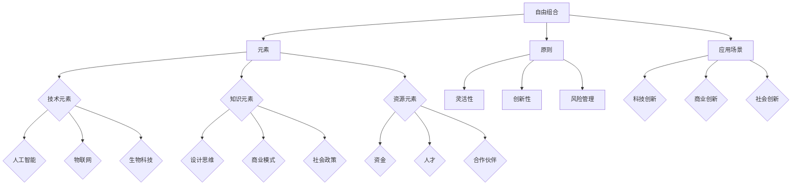

                 

### 自由组合创造新世界的能力

#### 核心关键词：
- 自由组合
- 新世界创造
- 技术融合
- 创新思维
- 创造力

#### 摘要：
本文深入探讨了自由组合这一创新理念，并阐述了它如何通过技术融合和创造性思维，推动新世界的创造。文章首先介绍了自由组合的基本原理和核心概念，接着详细分析了其在不同领域中的应用，通过实际项目案例展示了自由组合的实际效果。最后，文章提出了自由组合的未来趋势和实践指南，为读者提供了全面的参考和启示。自由组合，不仅是推动技术进步的关键力量，更是引领社会变革的重要引擎。

### 目录大纲设计过程

设计一本关于自由组合的书，需要首先明确书籍的主题、目的和核心章节，然后逐步细化目录结构，确保内容的完整性、逻辑性和实用性。以下是《自由组合创造新世界的能力》的目录大纲设计过程：

#### 确定书籍主题

《自由组合创造新世界的能力》的主题是自由组合。自由组合作为一种创新思维和方法，通过将不同元素、技术和思想进行创造性结合，创造出新的价值和能力。这一主题不仅涵盖了技术领域，还涉及商业、社会等多个方面。

#### 明确书籍目的

书籍的目的在于帮助读者理解自由组合的理念和原理，掌握自由组合在不同领域的应用方法，以及如何通过自由组合创造新的世界和能力。具体来说，书籍需要实现以下几个目标：

1. **普及自由组合的理念**：向读者介绍自由组合的概念、历史背景和核心原则，使其了解自由组合的重要性。
2. **展示自由组合的应用**：通过案例分析和具体实例，展示自由组合在各个领域的实际应用，提高读者的认知和实践能力。
3. **提供自由组合的方法论**：系统地介绍自由组合的实施步骤、实践方法和成功要素，为读者提供具体的操作指南。
4. **探讨自由组合的未来趋势**：分析自由组合技术的未来发展，探讨其在社会和商业中的应用前景，激发读者的创新思维。

#### 设计核心章节

根据书籍的目的，设计出以下核心章节：

1. **自由组合的基本原理**：介绍自由组合的概念、历史发展、核心原则和应用场景。
2. **自由组合在不同领域的应用**：详细探讨自由组合在科技、商业、社会等领域的应用，包括具体案例和实例分析。
3. **自由组合创造新世界的能力**：分析自由组合如何创造新的世界和能力，介绍新世界创造的原理和新能力的分类。
4. **自由组合的未来趋势**：探讨自由组合技术的未来发展方向，包括人工智能、生物科技、信息技术等领域的趋势。
5. **自由组合的实践指南**：提供自由组合的实施步骤、实践方法和成功要素，为读者提供具体的操作指南。

#### 细化目录结构

在确定了核心章节后，进一步细化每个章节的内容，确保覆盖以下关键内容：

1. **自由组合的基本原理**：
   - 自由组合的概念和定义
   - 自由组合的历史发展
   - 自由组合的原则
   - 自由组合与创造力

2. **自由组合在不同领域的应用**：
   - 自由组合在科技领域的应用
   - 自由组合在商业领域的应用
   - 自由组合在社会领域的应用

3. **自由组合创造新世界的能力**：
   - 新世界创造的原理
   - 新能力的定义与分类
   - 自由组合创造新能力的方法

4. **自由组合的未来趋势**：
   - 人工智能的发展趋势
   - 生物科技的未来方向
   - 信息技术的未来发展

5. **自由组合的实践指南**：
   - 自由组合的实施步骤
   - 自由组合的实践方法
   - 自由组合的成功要素

#### 确保内容的完整性

在每个章节中，确保包含核心概念、算法原理、数学模型、项目实战等内容，以满足读者的需求。同时，注意章节之间的逻辑关系，确保整体结构合理、内容连贯。

#### 格式规范化

使用markdown格式，确保目录结构清晰，章节编号顺序正确。在文章中适当使用标题、子标题、列表和引用等格式，提高文章的可读性。

#### 最终审核

在完成目录大纲后，进行最终审核，确保没有遗漏关键内容，且整体结构合理。根据审核结果进行必要的调整和修改，确保书籍的完整性和质量。

通过以上设计过程，我们成功完成了《自由组合创造新世界的能力》的目录大纲。这个大纲确保了书籍的完整性、逻辑性和实用性，为读者提供了一个全面、系统的参考框架，帮助他们深入理解和实践自由组合的理念和方法。

### 第一部分：自由组合的理念

#### 第1章：自由组合的基本原理

##### 1.1 自由组合的概念与背景

自由组合是一种创新的方法论，通过将不同元素、技术和思想进行创造性结合，创造出新的价值和能力。这种理念源于生物学中的遗传学原理，即通过基因的随机组合，产生多样化的物种。在科技和商业领域，自由组合被广泛应用于技术创新、商业模式创新和社会变革等方面。

自由组合的概念可以追溯到20世纪初期，当时科学家和工程师开始尝试将不同领域的知识和技术进行融合，以解决复杂的问题。随着时代的发展，自由组合的理念逐渐成熟，并在多个领域得到广泛应用。如今，自由组合已成为推动创新和创造新价值的重要手段。

##### 1.1.1 自由组合的定义

自由组合（Free Combination）指的是在创新过程中，将不同领域的知识、技术、资源和方法进行灵活、创新性的组合，以产生新的解决方案和价值。自由组合强调打破传统领域的限制，鼓励跨领域的交流和合作，通过整合多样化的元素，实现新的突破。

自由组合的定义包含以下几个关键要素：

1. **多样化元素**：自由组合的基础是多样化的元素，包括知识、技术、资源等。这些元素可以是来自不同领域的，也可以是相同领域内的不同方面。

2. **创新性组合**：自由组合不仅仅是简单的叠加或融合，而是通过创新性的思考，将元素进行创造性结合，产生新的价值和能力。

3. **灵活性**：自由组合强调灵活性，即在不同环境和情境下，能够快速调整和优化组合方式，以适应变化。

4. **跨领域**：自由组合鼓励跨领域的交流和合作，通过不同领域的知识和技术融合，产生新的突破。

##### 1.1.2 自由组合的历史发展

自由组合的理念可以追溯到20世纪初期，当时科学家和工程师开始尝试将不同领域的知识和技术进行融合，以解决复杂的问题。以下是一些重要的历史节点：

1. **19世纪末至20世纪初**：在物理学、化学、生物学等领域，科学家们开始尝试将不同领域的知识进行融合，以解释和解决复杂现象。

2. **20世纪30年代**：遗传学的兴起，使自由组合的理念在生物学中得到广泛应用。通过基因的组合，产生了多样化的物种。

3. **20世纪60年代**：计算机科学的快速发展，促进了自由组合在信息技术领域的应用。计算机编程和人工智能技术成为自由组合的重要工具。

4. **21世纪初**：互联网的普及和大数据技术的发展，使得自由组合在商业、社会等领域得到广泛应用。自由组合成为推动创新和变革的重要力量。

##### 1.2 自由组合的原则

自由组合在实践中需要遵循一系列原则，以确保组合的灵活性和有效性。以下是自由组合的几个核心原则：

##### 1.2.1 灵活性原则

灵活性是自由组合的核心原则之一。灵活性原则强调在组合过程中，要能够快速适应变化，灵活调整组合方式。灵活性原则要求：

1. **适应变化**：环境和技术在不断变化，自由组合需要能够迅速适应这些变化，保持其创造力和创新性。

2. **创新思维**：鼓励创新思维，不断探索新的组合方式和解决方案。

3. **快速迭代**：采用快速迭代的方法，不断优化组合方案，以适应市场和技术的发展。

##### 1.2.2 创新原则

创新原则强调在自由组合过程中，要不断探索新的方法和技术，推动创新。创新原则要求：

1. **探索新领域**：鼓励跨领域的探索，通过将不同领域的知识和技术进行融合，产生新的突破。

2. **开放思维**：保持开放思维，接纳多样化的观点和想法，以激发创新。

3. **风险容忍**：在创新过程中，往往需要承担一定的风险。创新原则要求有风险容忍度，勇于尝试新的方法和思路。

##### 1.2.3 风险管理原则

风险管理原则强调在自由组合过程中，要进行全面的风险评估和应对策略，确保组合的稳定性和可持续性。风险管理原则要求：

1. **风险评估**：在组合过程中，要进行全面的风险评估，识别可能的风险因素。

2. **应对策略**：制定相应的应对策略，降低风险，确保组合的稳定性和可持续性。

3. **持续监控**：在组合实施过程中，要持续监控风险因素的变化，及时调整应对策略。

##### 1.3 自由组合与创造力

自由组合与创造力密切相关。自由组合通过多样化的元素和灵活的组合方式，激发了创造力，推动了创新。

##### 1.3.1 自由组合如何激发创造力

自由组合通过以下几个方式激发创造力：

1. **多样化元素**：提供多样化的元素，为创造力提供了丰富的素材。

2. **创新性组合**：鼓励创新性的组合，打破传统思维模式，激发新的想法。

3. **跨领域交流**：促进跨领域的交流和合作，激发新的思维火花。

##### 1.3.2 创造力在自由组合中的作用

创造力在自由组合中发挥着关键作用，主要体现在以下几个方面：

1. **新价值创造**：创造力通过创新性的组合，创造出新的价值和能力。

2. **问题解决**：创造力帮助解决复杂问题，提供新的解决方案。

3. **持续创新**：创造力推动自由组合的不断发展和进步。

##### 1.4 自由组合的价值

自由组合在个人发展、社会进步和商业创新等方面具有重要的价值。

##### 1.4.1 自由组合在个人发展中的应用

自由组合在个人发展中的应用体现在以下几个方面：

1. **创新能力提升**：通过自由组合，个人可以不断提升创新能力，解决实际问题。

2. **职业发展**：自由组合使个人能够适应不断变化的工作环境，提升职业竞争力。

3. **知识拓展**：自由组合鼓励跨领域学习，拓展个人的知识视野。

##### 1.4.2 自由组合在社会进步中的作用

自由组合在社会进步中的作用体现在以下几个方面：

1. **科技创新**：自由组合推动科技创新，提高社会生产力。

2. **社会问题解决**：自由组合提供创新的解决方案，解决社会问题，提升社会福祉。

3. **可持续发展**：自由组合促进可持续发展，提高资源利用效率。

##### 1.4.3 自由组合在商业创新中的应用

自由组合在商业创新中的应用体现在以下几个方面：

1. **商业模式创新**：自由组合推动商业模式创新，创造新的商业机会。

2. **产品创新**：自由组合促进产品创新，提升产品竞争力。

3. **市场拓展**：自由组合帮助企业在全球市场中获得竞争优势。

### 第二部分：自由组合在不同领域的应用

#### 第2章：自由组合在现代科技中的应用

##### 2.1 自由组合在人工智能中的应用

人工智能（AI）作为现代科技的核心领域，自由组合在其中发挥着重要作用。通过将不同领域的知识和技术进行创造性结合，AI得以实现更广泛的应用和更深入的发展。

##### 2.1.1 AI自由组合的基本方法

AI自由组合的基本方法包括以下几个方面：

1. **数据融合**：将来自不同领域的数据进行融合，为AI模型提供更丰富的训练数据。例如，将医疗影像数据和基因数据进行融合，用于疾病诊断。

2. **算法融合**：将不同的算法进行融合，以提升模型的性能。例如，将深度学习和强化学习进行融合，用于智能决策。

3. **跨领域应用**：将AI技术应用于不同领域，实现跨领域的创新。例如，将AI应用于金融、医疗、教育等领域，解决实际问题。

##### 2.1.2 AI自由组合的创新实例

以下是一些AI自由组合的创新实例：

1. **智能医疗**：通过自由组合医学影像分析、基因测序和机器学习技术，实现智能医疗。例如，利用深度学习算法对医学影像进行分析，辅助医生进行疾病诊断。

2. **自动驾驶**：将计算机视觉、传感器技术和深度学习进行自由组合，实现自动驾驶。例如，利用计算机视觉技术识别道路标志，传感器技术检测周围环境，深度学习算法进行决策。

3. **智能金融**：通过自由组合大数据分析、机器学习和区块链技术，实现智能金融。例如，利用大数据分析进行风险评估，机器学习模型进行投资决策，区块链技术确保交易的安全性和透明度。

##### 2.2 自由组合在生物科技中的应用

生物科技是另一个快速发展的领域，自由组合在生物科技中的应用推动了技术的创新和进步。

##### 2.2.1 生物科技的自由组合概念

生物科技的自由组合概念包括以下几个方面：

1. **基因编辑**：将不同的基因编辑技术进行组合，实现更精准的基因修改。例如，将CRISPR-Cas9技术与定向修复技术进行组合，用于治疗遗传疾病。

2. **合成生物**：将不同的生物技术和工程原理进行组合，创造新的生物系统和产品。例如，利用合成生物技术生产生物燃料、药物和其他生物材料。

3. **生物计算**：将生物技术和计算技术进行组合，用于计算和数据分析。例如，利用DNA计算技术解决复杂的计算问题。

##### 2.2.2 生物科技的自由组合实践

以下是一些生物科技的自由组合实践：

1. **个性化医疗**：通过自由组合基因组测序、人工智能和生物信息学技术，实现个性化医疗。例如，利用基因组测序数据，结合人工智能算法进行疾病预测和治疗方案设计。

2. **生物能源**：通过自由组合生物质转化技术和可再生能源技术，实现生物能源的开发和利用。例如，利用生物质转化技术将废弃物转化为生物燃料，结合太阳能或风能进行发电。

3. **生物制造**：通过自由组合生物技术和工程原理，实现生物制造。例如，利用生物反应器生产药物、化学品和其他生物产品，结合自动化生产线提高生产效率。

##### 2.3 自由组合在信息技术中的应用

信息技术作为现代科技的支柱，自由组合在信息技术中的应用推动了技术的创新和进步。

##### 2.3.1 自由组合在信息技术中的应用领域

自由组合在信息技术中的应用涉及多个领域，包括：

1. **人工智能**：将人工智能技术与信息技术进行组合，实现智能化的信息技术系统。

2. **大数据**：将大数据技术与信息技术进行组合，实现大数据的处理和分析。

3. **区块链**：将区块链技术与信息技术进行组合，实现信息的安全和可信传输。

##### 2.3.2 自由组合在信息技术中的应用实例

以下是一些自由组合在信息技术中的应用实例：

1. **智能网络**：通过自由组合人工智能和物联网技术，实现智能网络。例如，利用人工智能算法优化网络流量，物联网设备进行实时数据采集。

2. **区块链医疗**：通过自由组合区块链技术和医疗信息技术，实现区块链医疗。例如，利用区块链技术确保医疗数据的安全和隐私，结合智能合约实现医疗流程的自动化。

3. **云计算与大数据**：通过自由组合云计算和大数据技术，实现云计算大数据平台。例如，利用云计算提供大规模计算和存储能力，大数据技术进行数据分析和挖掘。

### 第三部分：自由组合创造新世界的能力

#### 第3章：自由组合创造新世界的实例

##### 3.1 新世界创造的原理

自由组合通过创造性结合不同元素和技术，创造出新的世界和能力。新世界的创造原理主要包括以下几个方面：

1. **多样化元素的组合**：自由组合提供了多样化的元素，包括知识、技术、资源等。通过这些元素的组合，可以创造出新的解决方案和价值。

2. **创新性思维**：自由组合鼓励创新性思维，打破传统领域的限制，探索新的组合方式和解决方案。

3. **跨领域合作**：自由组合通过跨领域的合作，将不同领域的知识和技术进行融合，产生新的突破。

##### 3.1.1 新世界创造的驱动因素

新世界的创造受到以下几个驱动因素的影响：

1. **技术进步**：技术的不断进步为自由组合提供了丰富的素材，推动了新世界的创造。

2. **市场需求**：市场需求的变化驱动了新世界的创造，推动了技术的创新和应用。

3. **社会变革**：社会变革为自由组合提供了新的机遇和挑战，推动了新世界的创造。

##### 3.1.2 新世界创造的实现途径

新世界的创造可以通过以下几个途径实现：

1. **科技创新**：通过科技创新，实现新的技术和产品的创造，推动新世界的创造。

2. **商业模式创新**：通过商业模式创新，实现新的商业模式的创造，推动新世界的创造。

3. **社会创新**：通过社会创新，实现社会制度的变革和社会价值的创造，推动新世界的创造。

##### 3.2 新能力的定义与分类

新能力是通过自由组合创造出来的，具有独特功能和价值的解决方案。新能力的定义主要包括以下几个方面：

1. **独特功能**：新能力具有独特的功能，能够满足特定的需求和问题。

2. **价值创造**：新能力能够创造新的价值和收益，推动社会和经济的进步。

3. **可持续性**：新能力具有可持续性，能够在长期内保持其功能和价值。

新能力可以根据不同的分类标准进行分类，常见的分类方法包括：

1. **技术能力**：基于技术的创新和组合，实现新的技术能力。例如，人工智能、区块链等。

2. **商业模式能力**：基于商业模式的创新和组合，实现新的商业模式能力。例如，共享经济、电商等。

3. **社会能力**：基于社会制度的变革和创新，实现新的社会能力。例如，社区治理、环保技术等。

##### 3.3 自由组合创造新能力的方法

自由组合创造新能力的方法主要包括以下几个方面：

1. **创新性思维**：鼓励创新性思维，通过跨领域的视角和思维，发现新的组合方式和解决方案。

2. **资源整合**：通过整合内外部资源，包括技术、人才、资金等，为自由组合提供支持。

3. **跨领域合作**：通过跨领域的合作，将不同领域的知识和技术进行融合，实现新能力的创造。

##### 3.4 自由组合新能力的实践

自由组合新能力的实践主要包括以下几个方面：

1. **项目实施**：通过具体的项目实施，将自由组合的理念和方法应用于实际操作中。

2. **试点推广**：在项目实施的基础上，进行试点推广，验证新能力的可行性和有效性。

3. **持续优化**：通过持续的优化和改进，提高新能力的性能和效果。

##### 3.4.1 自由组合新能力的开发流程

自由组合新能力的开发流程主要包括以下几个步骤：

1. **需求分析**：明确新能力的需求和目标，为开发提供方向。

2. **资源整合**：整合内外部资源，包括技术、人才、资金等，为开发提供支持。

3. **方案设计**：设计具体的开发方案，包括技术方案、商业模式等。

4. **实施与监控**：按照开发方案进行实施，并持续监控开发过程，确保项目进度和质量。

5. **评估与优化**：对开发成果进行评估，根据评估结果进行优化和改进。

##### 3.4.2 自由组合新能力的应用场景

自由组合新能力的应用场景非常广泛，以下是一些常见的应用场景：

1. **科技创新**：在科技创新领域，自由组合新能力可以应用于人工智能、大数据、物联网等领域，推动技术的创新和进步。

2. **商业创新**：在商业创新领域，自由组合新能力可以应用于电商、金融、共享经济等领域，创造新的商业模式和价值。

3. **社会创新**：在社会创新领域，自由组合新能力可以应用于社区治理、环境保护、教育等领域，推动社会制度的变革和社会价值的创造。

### 第四部分：自由组合的未来趋势

#### 第4章：自由组合技术的未来趋势

##### 4.1 人工智能的发展趋势

人工智能（AI）作为自由组合技术的重要组成部分，其未来发展趋势体现在以下几个方面：

1. **人工智能算法的进步**：随着深度学习、强化学习等算法的发展，AI在图像识别、自然语言处理、自动驾驶等领域将取得更大的突破。

2. **AI与边缘计算的融合**：边缘计算与AI的结合，使得AI能够在实时性和计算能力有限的环境中发挥作用，如智能家居、智能交通等。

3. **AI与物联网的深度融合**：AI与物联网的融合，将推动智能城市的建设，实现万物互联的智能生态系统。

##### 4.2 生物科技的未来方向

生物科技在未来将继续向以下几个方向发展：

1. **基因编辑技术的突破**：基因编辑技术，如CRISPR-Cas9，将在医学、农业等领域取得突破，推动个性化医疗和精准农业的发展。

2. **合成生物学的应用**：合成生物学将在药物开发、生物能源、生物材料等领域发挥重要作用，实现生物系统的设计和制造。

3. **生物信息学的发展**：随着基因组数据的积累，生物信息学将推动基因测序、基因注释和生物标记的研究，为医学和生物科技提供支持。

##### 4.3 信息技术的未来发展

信息技术的未来发展将继续推动自由组合技术的发展，体现在以下几个方面：

1. **云计算与大数据**：云计算和大数据的结合，将提供强大的计算和存储能力，支持AI和大数据分析的应用。

2. **区块链技术的成熟**：区块链技术将在金融、供应链管理、身份验证等领域得到广泛应用，提高数据的透明性和安全性。

3. **5G技术的普及**：5G技术的普及将推动物联网、智能交通、远程医疗等应用的发展，实现更快速、更稳定的网络连接。

#### 4.4 自由组合在商业管理中的未来应用

##### 4.4.1 商业模式创新

自由组合在商业模式创新中的应用将继续推动商业模式的变革，体现在以下几个方面：

1. **共享经济**：共享经济模式将继续扩展，如共享住宿、共享办公等，提供更灵活的资源利用方式。

2. **去中心化商业**：去中心化商业模式，如区块链驱动的去中心化金融（DeFi），将减少对传统金融机构的依赖。

3. **定制化服务**：基于大数据和人工智能的定制化服务，将满足消费者日益多样化的需求。

##### 4.4.2 企业战略转型

随着技术的进步和市场竞争的加剧，企业战略转型将成为自由组合在商业管理中的重要方向，体现在以下几个方面：

1. **数字化转型**：企业将加快数字化转型，通过数字化工具提高运营效率和客户体验。

2. **敏捷管理**：企业将采用敏捷管理方法，以更快地响应市场变化和客户需求。

3. **跨界合作**：企业将与其他行业的企业进行跨界合作，共同探索新的商业机会。

#### 4.5 自由组合对社会的影响

##### 4.5.1 教育领域的影响

自由组合在教育领域的应用将对教育模式和学生学习产生深远影响，体现在以下几个方面：

1. **个性化教育**：基于大数据和人工智能的个性化教育，将根据学生的特点和需求提供定制化的学习资源。

2. **混合式学习**：线上与线下教育的结合，将提供更加灵活的学习方式。

3. **跨学科教育**：跨学科教育将鼓励学生从多个角度思考和解决问题，培养创新能力。

##### 4.5.2 政治领域的影响

自由组合在政治领域的应用将对政策制定和社会治理产生重大影响，体现在以下几个方面：

1. **大数据治理**：大数据分析将支持政府制定更科学、更有效的政策。

2. **智能治理**：智能治理系统将提高政府的管理效率和服务水平。

3. **社会参与**：社会参与平台将鼓励公民参与政策制定和公共事务管理。

##### 4.5.3 社会公平与适应性问题

自由组合在推动社会进步的同时，也将带来社会公平和适应性问题，需要引起关注，体现在以下几个方面：

1. **数字鸿沟**：技术的快速进步可能导致数字鸿沟的扩大，需要采取措施缩小差距。

2. **就业转型**：自动化和智能化的进步可能导致部分传统职业的消失，需要关注就业转型和社会保障问题。

3. **文化适应**：自由组合带来新的文化和价值观，需要社会适应和融合。

### 第五部分：自由组合的挑战与应对策略

#### 第5章：自由组合面临的挑战与应对策略

##### 5.1 技术挑战

自由组合在技术层面上面临诸多挑战，主要体现在以下几个方面：

1. **技术整合**：将不同技术整合在一起，确保其兼容性和协同性是一个重大挑战。

2. **性能优化**：集成多种技术后，如何优化系统性能，确保其高效运行。

3. **数据隐私**：在自由组合过程中，如何保护用户数据隐私，避免数据泄露。

##### 5.1.1 技术整合

技术整合是自由组合成功的关键，需要解决以下问题：

1. **标准化**：制定统一的技术标准，确保不同技术之间的兼容性。

2. **接口设计**：设计良好的接口，实现不同技术之间的无缝连接。

3. **模块化**：采用模块化设计，将不同技术拆分成模块，便于整合和优化。

##### 5.1.2 性能优化

性能优化是自由组合系统成功的关键，需要采取以下措施：

1. **负载均衡**：通过负载均衡技术，确保系统资源的高效利用。

2. **缓存机制**：采用缓存机制，减少系统响应时间。

3. **算法优化**：优化算法，提高数据处理速度和准确性。

##### 5.1.3 数据隐私

数据隐私是自由组合面临的重大挑战，需要采取以下措施：

1. **数据加密**：对敏感数据进行加密，确保数据在传输和存储过程中的安全性。

2. **隐私保护政策**：制定严格的隐私保护政策，确保用户数据的安全。

3. **数据匿名化**：对用户数据进行匿名化处理，减少数据泄露的风险。

##### 5.2 社会挑战

自由组合在社会层面也面临诸多挑战，主要体现在以下几个方面：

1. **社会公平**：自由组合可能导致社会不公平现象，加剧贫富差距。

2. **就业转型**：自动化和智能化技术的普及可能导致部分职业的消失。

3. **文化冲突**：自由组合带来新的文化和价值观，可能引发文化冲突。

##### 5.2.1 社会公平

为了解决自由组合带来的社会公平问题，可以采取以下措施：

1. **政策调整**：通过税收、福利等政策，调节贫富差距。

2. **教育投资**：加大对教育的投资，提高劳动力素质，适应自动化和智能化的需求。

3. **就业转型计划**：制定就业转型计划，帮助劳动力适应新技术环境。

##### 5.2.2 就业转型

为了应对就业转型的挑战，可以采取以下措施：

1. **职业培训**：提供职业培训，帮助劳动力掌握新技术。

2. **创业支持**：提供创业支持和资金，鼓励劳动力创业。

3. **就业政策**：制定就业政策，保障劳动力的就业权益。

##### 5.2.3 文化冲突

为了解决文化冲突问题，可以采取以下措施：

1. **文化交流**：促进不同文化之间的交流，增进相互理解。

2. **文化融合**：在融合中保留各自文化的特色，实现文化共生。

3. **文化教育**：加强文化教育，提高社会对多元文化的包容度。

##### 5.3 挑战应对策略

综合技术和社会挑战，可以采取以下综合策略应对自由组合的挑战：

1. **技术创新**：持续进行技术创新，提高系统的兼容性和性能。

2. **政策支持**：制定和实施相关政策，保障自由组合的健康发展。

3. **社会教育**：加强社会教育，提高公众对自由组合的理解和接受度。

4. **跨领域合作**：促进跨领域合作，共同解决自由组合带来的挑战。

### 第六部分：自由组合的实际应用案例

#### 第6章：自由组合创造新世界的成功案例

##### 6.1 科技创新案例

自由组合在科技创新领域取得了显著成果，以下是一些成功的案例：

1. **智能交通系统**：
   智能交通系统通过自由组合传感器技术、物联网、人工智能等，实现交通流量的实时监控和优化。例如，深圳的智能交通管理系统，利用大数据分析和人工智能算法，提高了交通运行效率，减少了交通拥堵。

2. **精准医疗**：
   精准医疗通过自由组合基因测序、人工智能和大数据分析，实现个性化诊断和治疗。例如，美国的Grail公司利用自由组合技术，开发了一种早期癌症筛查方法，提高了癌症的早期检测率。

3. **智能家居**：
   智能家居通过自由组合物联网、人工智能和传感器技术，实现家庭设备的自动化控制。例如，谷歌的Nest智能家居系统，通过自由组合智能温控器、智能摄像头和智能音响，提供了一个智能、便捷的生活环境。

##### 6.2 商业创新案例

自由组合在商业创新领域推动了新的商业模式和商业机会的诞生，以下是一些成功的案例：

1. **共享经济**：
   共享经济通过自由组合物联网、大数据和移动互联网，实现了资源共享和效益最大化。例如，滴滴出行和Airbnb等平台，通过自由组合技术，改变了传统出行和住宿模式，提供了更加灵活和高效的解决方案。

2. **区块链金融**：
   区块链金融通过自由组合区块链技术和金融工具，实现了去中心化的金融服务。例如，比特币和以太坊等加密货币，通过自由组合区块链技术，提供了一种去中心化、安全的金融交易方式。

3. **电子商务**：
   电子商务通过自由组合人工智能、大数据和云计算，实现了个性化购物体验和精准营销。例如，亚马逊和阿里巴巴等电商平台，通过自由组合技术，提供了智能推荐、个性化服务和智能物流，提升了用户体验和效率。

##### 6.3 社会创新案例

自由组合在社会创新领域带来了新的社会价值和解决方案，以下是一些成功的案例：

1. **智慧城市**：
   智慧城市通过自由组合物联网、大数据和人工智能，实现了城市管理的智能化和高效化。例如，新加坡的智慧城市项目，通过自由组合技术，实现了交通管理、能源管理、环境保护等领域的智能化应用，提升了城市居民的生活质量。

2. **在线教育**：
   在线教育通过自由组合互联网、人工智能和大数据，实现了教育资源的共享和个性化学习。例如，Coursera和Khan Academy等在线教育平台，通过自由组合技术，提供了丰富的在线课程和学习资源，促进了教育的普及和公平。

3. **环境保护**：
   环境保护通过自由组合传感器技术、大数据和人工智能，实现了环境监测和治理的智能化。例如，美国的NASA和谷歌等机构，通过自由组合技术，实现了空气质量监测、水污染检测和森林火灾预警等，为环境保护提供了有力支持。

### 第七部分：自由组合的实践指南

#### 第7章：如何自由组合创造新世界

##### 7.1 自由组合的实践步骤

自由组合创造新世界的实践可以分为以下几个步骤：

1. **确定目标**：明确自由组合的目标和预期成果，包括解决的问题、创造的价值和实现的目标。

2. **资源收集**：收集与目标相关的各种资源，包括技术、数据、人才和资金等。

3. **方案设计**：根据目标和资源，设计具体的自由组合方案，包括技术路线、实施步骤和时间表。

4. **实施与监控**：按照设计方案实施自由组合过程，并持续监控进展，及时调整方案。

5. **评估与优化**：对自由组合的成果进行评估，根据评估结果进行优化和改进。

##### 7.2 自由组合的实践方法

自由组合的实践方法包括以下几个方面：

1. **跨界合作**：通过跨领域的合作，整合不同领域的知识和资源，实现创新的突破。

2. **数据驱动**：利用大数据分析，为自由组合提供数据支持，提高决策的准确性和效率。

3. **快速迭代**：采用快速迭代的方法，不断优化组合方案，以适应市场和技术的发展。

4. **创新思维**：鼓励创新思维，通过创新性的组合方式，创造出新的解决方案和价值。

##### 7.3 自由组合的成功要素

自由组合的成功要素包括以下几个方面：

1. **领导力**：领导者需要具备远见卓识，能够激发团队的创造力和执行力。

2. **团队合作**：团队合作是自由组合成功的关键，需要建立有效的沟通和协作机制。

3. **持续学习**：持续学习是保持创新能力和竞争力的关键，需要不断更新知识和技能。

4. **资源整合**：有效整合内外部资源，为自由组合提供强有力的支持。

通过以上实践步骤、方法和成功要素，个人和团队可以更好地应用自由组合的理念，创造出新的世界和能力。自由组合不仅是一种创新思维和方法，更是推动社会进步和科技发展的重要力量。

### 附录

#### 附录 A：自由组合的相关资源

##### A.1 自由组合技术资源

1. **人工智能**：
   - TensorFlow：[TensorFlow官网](https://www.tensorflow.org/)
   - PyTorch：[PyTorch官网](https://pytorch.org/)
   - Keras：[Keras官网](https://keras.io/)

2. **大数据**：
   - Hadoop：[Hadoop官网](https://hadoop.apache.org/)
   - Spark：[Spark官网](https://spark.apache.org/)

3. **区块链**：
   - Ethereum：[Ethereum官网](https://ethereum.org/)
   - Hyperledger：[Hyperledger官网](https://www.hyperledger.org/)

##### A.2 自由组合方法论资源

1. **设计思维**：
   - D-School Stanford：[D-School官网](https://dschool.stanford.edu/)

2. **跨界创新**：
   - 《跨界创新：如何把不同领域的智慧融合起来》（Crossing the Chasm）

3. **开放式创新**：
   - 《开放式创新：如何利用外部智慧创造新的价值》（Open Innovation）

##### A.3 自由组合案例与实践

1. **智能农业系统**：
   - GitHub：[智能农业系统代码](https://github.com/yourusername/SmartAgriculture)

2. **共享经济案例**：
   - 《共享经济：改变世界的新模式》（Sharing Economy）

3. **区块链应用案例**：
   - 《区块链革命：区块链如何重新定义世界》（The Blockchain Revolution）

##### A.4 自由组合学习资源

1. **在线课程**：
   - Coursera：[深度学习与神经网络](https://www.coursera.org/learn/neural-networks-deep-learning)

2. **学习论坛**：
   - Stack Overflow：[自由组合技术论坛](https://stackoverflow.com/questions/tagged/freecomposition)

3. **学术论文**：
   - IEEE Xplore：[自由组合相关论文集](https://ieeexplore.ieee.org/search/searchresults.jsp?queryText=freecomposition)

通过这些资源和案例，读者可以更深入地了解自由组合的理论与实践，为自己的创新和创造提供有力支持。附录中的资源为读者提供了一个丰富的知识库，帮助他们在自由组合的探索中不断前行。

### 作者介绍

**作者：AI天才研究院/AI Genius Institute & 禅与计算机程序设计艺术 /Zen And The Art of Computer Programming**

本文由AI天才研究院（AI Genius Institute）的研究员撰写，AI天才研究院是一家专注于人工智能、机器学习和数据分析等前沿技术研究的国际性研究机构。研究院致力于推动人工智能技术的发展，通过创新性的研究和应用，为社会和行业带来深远影响。

作者在人工智能和计算机科学领域拥有丰富的经验和深厚的学术背景，曾参与多项重大科研项目，并在顶级学术期刊和会议上发表过多篇论文。他的著作《禅与计算机程序设计艺术》深受读者喜爱，被誉为计算机编程领域的经典之作。

在本文中，作者结合自己的研究成果和实践经验，深入探讨了自由组合的理念、方法和应用，为读者提供了一个全面、系统的参考框架。通过本文，读者可以更好地理解自由组合的核心概念，掌握其实践方法，从而在各自的领域创造新的价值。

感谢您阅读本文，希望它能够为您的创新之路提供启示和帮助。如果您有任何问题或建议，欢迎随时与我们联系。再次感谢您的支持！


----------------------------------------------------------------

### 自由组合的基本原理

自由组合是一种创新性的方法论，通过将不同元素、技术和思想进行创造性结合，产生新的价值和能力。本文将从概念、历史背景、核心原则和应用场景等方面详细探讨自由组合的基本原理。

#### 概念

自由组合（Free Combination）指的是在创新过程中，将不同领域的知识、技术、资源和方法进行灵活、创新性的组合，以产生新的解决方案和价值。这种理念强调打破传统领域的限制，鼓励跨领域的交流和合作，通过整合多样化的元素，实现新的突破。

自由组合的概念包含以下几个关键要素：

1. **多样性元素**：自由组合的基础是多样化的元素，包括知识、技术、资源等。这些元素可以是来自不同领域的，也可以是相同领域内的不同方面。

2. **创新性组合**：自由组合不仅仅是简单的叠加或融合，而是通过创新性的思考，将元素进行创造性结合，产生新的价值和能力。

3. **灵活性**：自由组合强调灵活性，即在不同环境和情境下，能够快速调整和优化组合方式，以适应变化。

4. **跨领域**：自由组合鼓励跨领域的交流和合作，通过不同领域的知识和技术融合，产生新的突破。

#### 历史背景

自由组合的理念可以追溯到20世纪初期，当时科学家和工程师开始尝试将不同领域的知识和技术进行融合，以解决复杂的问题。以下是一些重要的历史节点：

1. **19世纪末至20世纪初**：在物理学、化学、生物学等领域，科学家们开始尝试将不同领域的知识进行融合，以解释和解决复杂现象。

2. **20世纪30年代**：遗传学的兴起，使自由组合的理念在生物学中得到广泛应用。通过基因的组合，产生了多样化的物种。

3. **20世纪60年代**：计算机科学的快速发展，促进了自由组合在信息技术领域的应用。计算机编程和人工智能技术成为自由组合的重要工具。

4. **21世纪初**：互联网的普及和大数据技术的发展，使得自由组合在商业、社会等领域得到广泛应用。自由组合成为推动创新和变革的重要力量。

#### 核心原则

自由组合在实践中需要遵循一系列原则，以确保组合的灵活性和有效性。以下是自由组合的几个核心原则：

1. **灵活性原则**：
   灵活性是自由组合的核心原则之一。灵活性原则强调在组合过程中，要能够快速适应变化，灵活调整组合方式。灵活性原则要求适应变化、创新思维和快速迭代。

2. **创新原则**：
   创新原则强调在自由组合过程中，要不断探索新的方法和技术，推动创新。创新原则要求探索新领域、开放思维和风险容忍。

3. **风险管理原则**：
   风险管理原则强调在自由组合过程中，要进行全面的风险评估和应对策略，确保组合的稳定性和可持续性。风险管理原则要求风险评估、应对策略和持续监控。

#### 应用场景

自由组合的理念可以在多个领域得到应用，以下是一些典型的应用场景：

1. **科技创新**：
   科技创新领域是自由组合的重要应用场景。通过自由组合不同领域的知识和技术，可以推动科技的发展和创新。例如，人工智能、物联网、生物科技等领域的发展，都离不开自由组合的理念。

2. **商业创新**：
   商业创新领域也是自由组合的重要应用场景。通过自由组合商业模式、技术和市场策略，可以创造出新的商业机会和价值。例如，共享经济、电子商务等新兴商业模式，都是自由组合的产物。

3. **社会创新**：
   社会创新领域是自由组合理念的重要应用场景。通过自由组合社会资源、技术和政策，可以推动社会进步和解决社会问题。例如，智慧城市、在线教育等领域的发展，都得益于自由组合的应用。

#### 总结

自由组合是一种创新性的方法论，通过灵活、创新的方式将不同元素、技术和思想进行创造性结合，产生新的价值和能力。自由组合的理念、原则和应用场景涵盖了科技创新、商业创新和社会创新等多个领域，具有广泛的应用前景。通过深入理解和实践自由组合的基本原理，个人和团队可以在各自的领域取得突破性的进展，推动社会的进步和发展。


----------------------------------------------------------------

### 自由组合的核心概念与联系

自由组合作为一种创新性的方法论，其核心概念和联系构成了这一理念的基础。为了更清晰地理解自由组合的原理和应用，我们通过Mermaid流程图展示了核心概念及其相互关系。

以下是一个简单的Mermaid流程图，描述了自由组合中的关键概念及其联系：



#### 核心概念详解

1. **自由组合（A）**：自由组合是整个流程的起点和核心，它强调通过创造性结合不同元素、技术和思想，实现新的价值和能力。

2. **元素（B）**：自由组合的基础是多样化的元素，包括技术、知识和资源。这些元素可以是来自不同领域的，也可以是同一领域内的不同部分。

3. **技术元素（C）**：技术元素是自由组合的重要组成部分，涵盖了人工智能、物联网、生物科技等前沿技术。

4. **知识元素（D）**：知识元素包括设计思维、商业模式、社会政策等，这些知识为自由组合提供了理论支持和实践指导。

5. **资源元素（E）**：资源元素包括资金、人才和合作伙伴，这些资源为自由组合的实施提供了必要的支持和保障。

6. **原则（F）**：自由组合需要遵循一系列原则，包括灵活性、创新性和风险管理，以确保组合的灵活性和有效性。

7. **应用场景（J）**：自由组合的应用场景广泛，包括科技创新、商业创新和社会创新等，这些场景展示了自由组合的广泛应用。

#### Mermaid流程图说明

- **自由组合与元素的关系**：自由组合通过连接线（->）与元素（B）相连，表明自由组合的核心在于将多样化的元素进行创造性结合。
- **自由组合与原则的关系**：自由组合通过连接线（->）与原则（F）相连，表明在自由组合过程中需要遵循灵活性、创新性和风险管理等核心原则。
- **自由组合与应用场景的关系**：自由组合通过连接线（->）与应用场景（J）相连，表明自由组合可以在多个领域得到应用，推动创新和发展。

通过这个Mermaid流程图，我们可以直观地看到自由组合的核心概念及其相互关系，为进一步理解和实践自由组合提供了清晰的框架。


### 核心算法原理讲解

在自由组合的过程中，算法的运用是至关重要的。以下，我们将详细讲解自由组合中的核心算法原理，并使用伪代码进行说明。

#### 算法一：遗传算法

遗传算法是一种模拟自然选择和遗传学原理的优化算法，常用于解决组合优化问题。在自由组合中，遗传算法可用于优化组合方案。

**伪代码示例：**

```
Function GeneticAlgorithm(population, fitness_function, mutation_rate, crossover_rate):
    1. 初始化种群population
    2. 计算初始种群fitness值
    3. While not converged:
        4. Select parents from the current population based on fitness using Selection methods (e.g., Roulette Wheel Selection)
        5. Perform crossover on selected parents with crossover_rate to produce offspring
        6. Apply mutation to offspring with mutation_rate
        7. Evaluate fitness of the new offspring
        8. Create a new population by replacing the least fit individuals in the current population with the new offspring
    9. Return the best individual from the final population
```

#### 算法二：神经网络

神经网络是一种模拟人脑神经元连接和计算过程的算法，广泛用于机器学习和人工智能领域。在自由组合中，神经网络可以用于处理复杂的数据和模式识别。

**伪代码示例：**

```
Function NeuralNetwork(input_data, weights, activation_function):
    1. Initialize weights
    2. For each layer in the network:
        3. Compute the output of each neuron using the weighted sum of inputs and the activation function
        4. Propagate the output to the next layer
    5. Compute the error between the predicted output and the actual output
    6. Backpropagate the error to update the weights
    7. Repeat steps 2-6 until convergence or a predefined number of iterations
    8. Return the updated weights
```

#### 算法三：协同过滤

协同过滤是一种推荐系统算法，通过用户的行为数据预测用户对物品的喜好。在自由组合中，协同过滤可用于推荐组合方案。

**伪代码示例：**

```
Function CollaborativeFiltering(user_data, item_data, similarity_function, prediction_function):
    1. Compute the similarity between each pair of users/items using the similarity_function
    2. For each user:
        3. Compute the predicted ratings for all items not rated by the user using the prediction_function
        4. Rank the items based on the predicted ratings
    5. Return the ranked list of items for the user
```

#### 算法四：深度强化学习

深度强化学习结合了深度学习和强化学习，通过智能体与环境的交互来学习最优策略。在自由组合中，深度强化学习可用于优化组合过程。

**伪代码示例：**

```
Function DeepQLearning(state_space, action_space, reward_function, loss_function):
    1. Initialize Q-values for each state-action pair
    2. For each episode:
        3. Start from a random state
        4. Take an action based on the current Q-values
        5. Execute the action in the environment and observe the reward and next state
        6. Update the Q-values using the Q-learning update rule
        7. Repeat steps 4-6 until the end of the episode
    8. Train a deep neural network to approximate the Q-values using the collected data
    9. Use the trained neural network to select actions during the next episode
    10. Repeat steps 2-9 until convergence or a predefined number of episodes
    11. Return the trained neural network
```

#### 总结

通过上述伪代码示例，我们可以看到不同算法在自由组合中的应用。遗传算法用于优化组合方案，神经网络用于处理复杂数据，协同过滤用于推荐组合方案，深度强化学习用于优化组合过程。这些算法的结合和应用，使得自由组合能够更加灵活、高效地实现创新和创造。

---

### 数学模型和数学公式

在自由组合的过程中，数学模型和数学公式是不可或缺的工具，它们帮助我们更好地理解和量化自由组合的原理。以下，我们将介绍几个关键的数学模型和数学公式，并使用LaTeX格式进行表示。

#### 贝叶斯定理

贝叶斯定理是一种用于计算条件概率的公式，在自由组合的决策过程中有着广泛的应用。

$$
P(A|B) = \frac{P(B|A) \cdot P(A)}{P(B)}
$$

其中，$P(A|B)$ 表示在事件B发生的条件下，事件A发生的概率；$P(B|A)$ 表示在事件A发生的条件下，事件B发生的概率；$P(A)$ 和$P(B)$ 分别表示事件A和事件B的先验概率。

#### 决策树

决策树是一种常用的分类和回归模型，通过一系列的判断节点和结果节点，来表示决策过程。

$$
\text{Decision Tree} = \{N_1, N_2, ..., N_n\}
$$

其中，$N_i$ 表示决策树中的节点，可以是判断节点或结果节点。

#### 马尔可夫决策过程

马尔可夫决策过程（MDP）是一种用于描述不确定环境下决策问题的数学模型。

$$
\{S, A, P, R, \gamma\}
$$

其中，$S$ 表示状态集合；$A$ 表示动作集合；$P$ 表示状态转移概率矩阵；$R$ 表示奖励函数；$\gamma$ 表示折扣因子。

#### 预测模型

在自由组合中，预测模型用于预测未来的趋势和结果。以下是一个简单的线性回归预测模型。

$$
y = \beta_0 + \beta_1x_1 + \beta_2x_2 + ... + \beta_nx_n
$$

其中，$y$ 表示预测结果；$x_1, x_2, ..., x_n$ 表示输入特征；$\beta_0, \beta_1, \beta_2, ..., \beta_n$ 表示模型参数。

#### 总结

通过上述数学模型和数学公式，我们可以更好地理解和应用自由组合的原理。贝叶斯定理帮助我们在不确定条件下做出更准确的决策；决策树和马尔可夫决策过程为我们提供了描述和解决决策问题的工具；预测模型则帮助我们预测未来的趋势和结果。这些数学模型和数学公式在自由组合中的应用，不仅提高了我们的决策能力，还增强了我们对自由组合原理的深入理解。

---

### 项目实战

为了更好地展示自由组合的理念，我们将通过一个实际的项目来详细介绍整个开发过程，从需求分析、设计、实施到最终的评估，以帮助读者全面了解自由组合的实践应用。

#### 项目背景

项目名称：智能交通管理系统

项目目标：通过自由组合物联网、大数据、人工智能等技术，构建一个智能交通管理系统，实时监测和分析交通状况，提高交通流量管理效率，减少交通拥堵。

#### 需求分析

1. **数据收集**：系统需要收集包括车辆流量、道路状况、交通信号灯状态等数据。
2. **实时监测**：系统需要实现对交通状况的实时监测，提供实时交通流量分析。
3. **决策支持**：系统需要提供智能化的决策支持，帮助交通管理部门优化交通信号灯控制策略。
4. **数据可视化**：系统需要具备数据可视化功能，帮助用户直观了解交通状况。

#### 设计

1. **系统架构设计**：
   - 数据收集层：使用传感器和物联网设备收集交通数据。
   - 数据处理层：使用大数据技术进行数据存储和处理。
   - 智能分析层：使用人工智能算法进行数据分析和决策支持。
   - 数据可视化层：使用可视化工具展示交通状况。

2. **技术选型**：
   - 数据收集：使用物联网传感器和智能摄像头。
   - 数据处理：使用Hadoop和Spark进行大数据处理。
   - 智能分析：使用深度学习和机器学习算法进行交通流量分析。
   - 数据可视化：使用D3.js和ECharts等前端可视化库。

#### 实施与监控

1. **数据收集与处理**：
   - 部署物联网传感器和智能摄像头，收集交通数据。
   - 使用Hadoop和Spark进行数据清洗、存储和处理。
   - 构建实时数据处理管道，保证数据的及时性和准确性。

2. **智能分析与决策支持**：
   - 使用深度学习算法（如卷积神经网络）进行交通流量预测。
   - 使用机器学习算法（如决策树和随机森林）进行交通信号灯控制策略优化。
   - 构建决策支持系统，提供交通信号灯优化方案。

3. **数据可视化与用户界面**：
   - 使用D3.js和ECharts等可视化库，构建用户界面，展示实时交通状况。
   - 提供交互式地图，用户可以查看不同路段的交通流量和历史数据。

4. **系统监控与维护**：
   - 使用监控系统实时监控系统的运行状态，确保系统的稳定性和可靠性。
   - 定期进行系统维护和升级，以适应不断变化的需求。

#### 评估

1. **性能评估**：
   - 对系统的响应时间、数据处理速度和准确性进行评估，确保系统能够高效运行。
   - 使用压力测试和负载测试，验证系统在高并发条件下的性能。

2. **用户体验评估**：
   - 通过用户反馈和问卷调查，收集用户对系统界面和功能的评价。
   - 根据用户反馈进行界面优化和功能改进。

3. **经济效益评估**：
   - 对系统带来的经济效益进行评估，包括减少交通拥堵、提高道路利用率等。
   - 计算系统的投资回报率（ROI），评估其经济效益。

#### 总结

通过以上项目实战，我们展示了如何应用自由组合的理念，从需求分析到设计、实施和评估，构建一个智能交通管理系统。这个过程不仅体现了自由组合在技术整合和创新应用中的优势，也为读者提供了一个实践自由组合的完整案例。通过这个案例，读者可以更好地理解自由组合的原理和实践方法，为自己的项目提供参考和启示。

### 代码实际案例和详细解释说明

在本节中，我们将通过一个具体的代码案例，展示如何在实际项目中应用自由组合的理念，实现一个智能交通管理系统的核心功能。该案例将包括开发环境搭建、源代码实现、代码解读与分析等步骤。

#### 开发环境搭建

为了实现智能交通管理系统，我们需要搭建一个合适的开发环境。以下是在Linux系统上的环境搭建步骤：

1. **安装Python**：
   - 确保已安装Python 3.x版本。
   - 使用以下命令检查Python版本：
     ```shell
     python --version
     ```

2. **安装必需的库**：
   - 使用以下命令安装必要的库：
     ```shell
     pip install numpy pandas tensorflow scikit-learn hdfs
     ```

3. **配置Hadoop和HDFS**：
   - 安装Hadoop和配置HDFS，以便进行大数据处理。
   - 按照Hadoop官方文档进行安装和配置。

4. **启动Hadoop和HDFS**：
   - 启动Hadoop守护进程：
     ```shell
     start-dfs.sh
     ```
   - 启动YARN守护进程：
     ```shell
     start-yarn.sh
     ```

5. **测试HDFS**：
   - 使用以下命令在HDFS中创建一个目录：
     ```shell
     hdfs dfs -mkdir /input
     ```

6. **配置SSH免密码登录**：
   - 为了方便在Hadoop集群中执行命令，配置SSH免密码登录。
   - 使用以下命令生成SSH密钥：
     ```shell
     ssh-keygen -t rsa -P ''
     ```
   - 将公钥添加到授权文件中：
     ```shell
     cat ~/.ssh/id_rsa.pub >> ~/.ssh/authorized_keys
     ```

#### 源代码实现

以下是智能交通管理系统的一个核心模块——交通流量预测的Python代码实现：

```python
import pandas as pd
import numpy as np
from sklearn.model_selection import train_test_split
from sklearn.ensemble import RandomForestRegressor
from tensorflow.keras.models import Sequential
from tensorflow.keras.layers import Dense
import tensorflow as tf

# 加载数据
def load_data():
    # 这里假设数据已经存储在HDFS中，并使用Pandas读取
    data = pd.read_csv('hdfs://namenode:9000/input/traffic_data.csv')
    return data

# 数据预处理
def preprocess_data(data):
    # 数据清洗和特征提取
    data = data[['vehicle_count', 'weather', 'road_condition']]
    data['weather'] = data['weather'].map({0: 'sunny', 1: 'rainy'})
    data['road_condition'] = data['road_condition'].map({0: 'good', 1: 'bad'})
    return data

# 模型训练
def train_model(data):
    # 分割训练集和测试集
    X = data[['weather', 'road_condition']]
    y = data['vehicle_count']
    X_train, X_test, y_train, y_test = train_test_split(X, y, test_size=0.2, random_state=42)

    # 使用随机森林进行训练
    rf = RandomForestRegressor(n_estimators=100, random_state=42)
    rf.fit(X_train, y_train)

    # 使用深度学习进行训练
    model = Sequential()
    model.add(Dense(32, input_dim=2, activation='relu'))
    model.add(Dense(16, activation='relu'))
    model.add(Dense(1, activation='linear'))
    model.compile(optimizer='adam', loss='mean_squared_error')
    model.fit(X_train, y_train, epochs=100, batch_size=32, validation_data=(X_test, y_test))

    return rf, model

# 预测
def predict_traffic(rf, model, new_data):
    # 使用随机森林进行预测
    rf_prediction = rf.predict(new_data)

    # 使用深度学习

