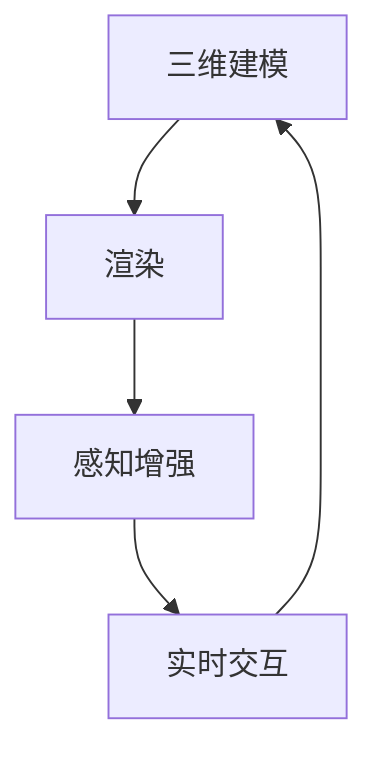

                 

## 第一部分：虚拟现实与文化交流创业概述

### 第1章：虚拟现实与文化交流创业的概念理解

#### 1.1 虚拟现实与沉浸式体验概述

虚拟现实（Virtual Reality，简称VR）是一种通过计算机技术创建的模拟环境，使用户能够沉浸在其中并与环境中的对象进行交互。VR技术通过头戴显示器（HMD）、跟踪设备、手柄控制器等硬件，模拟用户的视觉、听觉和触觉感知，从而提供一个逼真的虚拟世界。

沉浸式体验是虚拟现实的核心特点之一。它意味着用户完全投入到虚拟环境中，忘记了现实世界的存在。这种体验可以极大地增强用户的参与感和互动性，从而提供更加丰富和多样化的体验。

#### 1.2 文化交流创业的定义与背景

文化交流创业是指通过创新的方式利用虚拟现实技术，促进不同文化之间的交流与理解。这种创业模式不仅涵盖了传统的文化交流活动，如艺术展览、历史遗迹展示等，还涉及更为广泛的应用，如虚拟旅游、在线教育、医疗健康等。

文化交流创业的背景在于全球化的发展和信息技术的进步。随着全球化进程的加速，各国之间的文化交流变得越来越频繁。然而，由于文化差异、地理距离和资源限制，传统的文化交流方式往往难以满足人们的需求。虚拟现实技术的出现，为跨文化交流提供了一种全新的解决方案。

#### 1.3 虚拟现实在文化交流中的应用前景

虚拟现实在文化交流中的应用前景十分广阔。以下是一些潜在的应用领域：

1. **虚拟博物馆和艺术展览**：通过虚拟现实技术，用户可以随时随地参观世界各地的博物馆和艺术展览，无需受时间和空间的限制。这种体验可以极大地丰富用户的文化视野，促进文化交流。

2. **虚拟旅游**：虚拟现实可以模拟各种旅游场景，让用户在虚拟世界中体验不同的文化景观和风俗习惯。这种体验不仅可以满足用户的探索欲望，还可以促进不同文化之间的理解和交流。

3. **在线教育**：虚拟现实技术可以为在线教育提供更加生动和互动的学习体验。学生可以通过虚拟现实环境进行实地考察、模拟实验等，从而更好地理解和掌握知识。

4. **虚拟会议和远程协作**：虚拟现实技术可以模拟真实的会议场景，让参会者能够在虚拟环境中进行面对面交流。这种模式不仅节省了时间和成本，还可以打破地域限制，促进全球范围内的合作。

5. **医疗健康**：虚拟现实技术可以用于模拟医疗场景，帮助医生进行手术训练和医学教育。同时，虚拟现实还可以为心理治疗提供新的方法，如虚拟现实疗法（Virtual Reality Therapy）。

综上所述，虚拟现实与文化交流创业的结合具有巨大的潜力，可以为文化交流带来全新的变革。在接下来的章节中，我们将进一步探讨虚拟现实技术的基础知识，以及如何在文化交流创业中应用这些技术。


### 第2章：虚拟现实技术基础

#### 2.1 虚拟现实技术的核心原理

虚拟现实技术依赖于计算机图形学、人机交互、传感器技术和网络技术等多学科的综合应用。其核心原理包括以下几个方面：

1. **三维建模与渲染**：虚拟现实技术首先需要创建三维模型，这通常通过3D建模软件完成。然后，通过渲染技术将三维模型转化为二维图像，呈现给用户。渲染过程中涉及到光线追踪、阴影处理、纹理映射等技术，以实现逼真的视觉效果。

2. **感知增强**：虚拟现实技术通过头戴显示器（HMD）、手柄控制器、位置传感器等设备，模拟用户的视觉、听觉和触觉感知。这些设备实时采集用户的动作和位置信息，将虚拟环境中的交互反馈传递给用户，从而提供沉浸式体验。

3. **实时交互**：虚拟现实技术强调用户与虚拟环境的实时互动。通过手柄控制器、手势识别等技术，用户可以在虚拟环境中进行各种操作，如走路、旋转、触碰等。这种实时交互使得用户能够更加自然地融入虚拟世界。

4. **场景模拟**：虚拟现实技术通过计算机模拟各种场景，如城市、自然景观、历史遗迹等。这些场景可以高度还原真实世界的细节，为用户提供丰富的视觉和听觉体验。

5. **网络通信**：虚拟现实技术依赖于网络通信技术，实现用户之间的实时互动和数据传输。这包括语音通信、视频传输、数据共享等功能，使得虚拟现实应用能够跨越地域限制，实现全球范围内的合作与交流。

#### 2.2 3D建模与渲染技术

3D建模与渲染是虚拟现实技术的核心组成部分。以下是一些关键的3D建模与渲染技术：

1. **三维建模软件**：常见的三维建模软件包括AutoCAD、Blender、Maya等。这些软件提供了丰富的建模工具和功能，用户可以创建各种复杂的三维模型。

2. **三维建模流程**：三维建模通常包括以下步骤：概念设计、细化建模、纹理贴图、光照调整等。在概念设计阶段，用户确定模型的基本形状和结构；在细化建模阶段，用户对模型进行细节调整；在纹理贴图阶段，用户为模型添加各种材质和纹理；在光照调整阶段，用户设置场景的光照效果，以实现逼真的渲染效果。

3. **渲染引擎**：渲染引擎是负责将三维模型转化为二维图像的软件。常见的渲染引擎包括Unity、Unreal Engine、Blender Render等。这些渲染引擎提供了强大的渲染效果和丰富的功能，可以满足不同需求的应用场景。

4. **光线追踪**：光线追踪是一种先进的渲染技术，通过模拟光线在虚拟环境中的传播和反射，实现更加真实的视觉效果。光线追踪可以模拟自然光线的折射、反射、散射等效果，从而提高渲染质量。

5. **全局光照**：全局光照（Global Illumination）是一种模拟光线在虚拟环境中多次反射和散射的技术。全局光照可以增强场景的逼真度，提高渲染效果。

6. **纹理映射**：纹理映射是一种将二维纹理图像映射到三维模型表面的技术。通过纹理映射，用户可以为模型添加各种材质和细节，从而提高视觉效果。

7. **着色技术**：着色技术是渲染过程中的一种关键步骤，用于模拟物体表面的颜色和光泽。常见的着色技术包括Lambert着色模型、Phong着色模型等。

#### 2.3 虚拟现实硬件设备介绍

虚拟现实技术的实现依赖于各种硬件设备。以下是一些常见的虚拟现实硬件设备：

1. **头戴显示器（HMD）**：头戴显示器是虚拟现实的核心设备，通过覆盖用户眼睛的屏幕，提供沉浸式的视觉体验。常见的HMD设备包括Oculus Rift、HTC Vive、Sony PlayStation VR等。

2. **手柄控制器**：手柄控制器用于模拟用户在虚拟环境中的手部动作和交互。常见的控制器包括Oculus Touch、HTC Vive Controllers、PlayStation Move等。

3. **位置跟踪设备**：位置跟踪设备用于实时跟踪用户在虚拟环境中的位置和动作。常见的位置跟踪设备包括外部传感器、内部传感器等。外部传感器通过发射器和接收器实现用户的精确位置跟踪；内部传感器则通过内置的加速度计、陀螺仪等传感器实现用户的动作跟踪。

4. **声音设备**：虚拟现实中的声音效果对于提供沉浸式体验至关重要。常见的声音设备包括虚拟现实耳机、立体声扬声器等。

5. **触摸设备**：触摸设备如触摸屏、触控笔等，用于提供虚拟现实环境中的触摸和手势交互。

#### 2.4 虚拟现实应用开发平台

虚拟现实应用开发平台提供了开发虚拟现实应用所需的环境和工具。以下是一些常见的虚拟现实应用开发平台：

1. **Unity**：Unity是一款功能强大的游戏引擎，适用于虚拟现实应用的开发。它提供了丰富的3D建模、渲染和交互功能，支持多种平台，包括PC、移动设备、VR头戴显示器等。

2. **Unreal Engine**：Unreal Engine是一款由Epic Games开发的游戏引擎，广泛应用于虚拟现实和游戏开发。它提供了高级的渲染效果、物理引擎和AI系统，支持跨平台开发。

3. **Blender**：Blender是一款开源的3D建模、动画和渲染软件，适用于虚拟现实应用的开发。它提供了丰富的建模、材质、动画和渲染工具，支持多种操作系统。

4. **VR SDK**：VR SDK（Software Development Kit）是各种虚拟现实设备和平台的开发工具包，提供了开发虚拟现实应用所需的库和接口。常见的VR SDK包括Oculus SDK、HTC Vive SDK、Unity VR SDK等。

通过了解虚拟现实技术的核心原理、3D建模与渲染技术、虚拟现实硬件设备和虚拟现实应用开发平台，我们可以更好地把握虚拟现实在文化交流创业中的应用。在接下来的章节中，我们将进一步探讨文化交流与跨文化理解的理论和实践，为虚拟现实文化交流创业提供更加深入的洞察。


### 第3章：文化交流与跨文化理解

#### 3.1 文化交流的理论基础

文化交流是人类社会发展的重要组成部分，其理论基础涉及多个学科领域，包括社会学、人类学、心理学等。以下是一些关键的理论基础：

1. **文化相对论**：文化相对论认为，每种文化都有其独特的价值观、信仰和行为模式，不能以自己的标准去评价其他文化。这种理论强调了文化的主观性和多样性。

2. **文化传递论**：文化传递论关注文化如何在不同时间和空间中传播和演变。它认为，文化传播是通过交流、互动和适应实现的。

3. **文化冲突论**：文化冲突论探讨不同文化之间可能出现的冲突和对抗。这种理论认为，文化差异是导致冲突的根本原因。

4. **文化适应论**：文化适应论强调个体或群体在面对不同文化时如何调整自己的行为和价值观，以适应新环境。

#### 3.2 跨文化理解的挑战与解决方案

跨文化理解是指在不同文化背景下，个体或群体如何理解、接受和适应其他文化的过程。以下是一些跨文化理解面临的挑战和解决方案：

1. **文化偏见与刻板印象**：文化偏见和刻板印象是跨文化理解中的主要障碍。这些偏见和印象可能导致误解和冲突。解决方案包括教育和宣传，以提高对文化多样性的认识和尊重。

2. **语言障碍**：语言是交流的重要工具，语言障碍可能阻碍有效的跨文化沟通。解决方案包括学习对方的语言、使用翻译工具或双语教育。

3. **价值观差异**：不同文化有不同的价值观和行为规范，这可能导致冲突和误解。解决方案包括加强文化交流、相互学习和尊重对方的价值观。

4. **社会习惯差异**：不同文化有不同的社会习惯，如饮食、礼仪、节日庆典等。这些差异可能影响跨文化互动的顺利进行。解决方案包括了解和尊重对方的社会习惯，以及通过交流和互动来减少误解。

5. **文化适应能力**：跨文化理解需要个体或群体具备较强的文化适应能力。这包括开放心态、灵活性和适应性。解决方案是通过教育和实践培养跨文化适应能力。

#### 3.3 跨文化沟通技巧

有效的跨文化沟通是跨文化理解的关键。以下是一些跨文化沟通的技巧：

1. **倾听与理解**：倾听是沟通的基础，通过倾听对方的观点和需求，可以更好地理解对方的文化背景。同时，表达自己的观点时，要尊重对方的文化差异。

2. **非语言沟通**：非语言沟通包括肢体语言、面部表情、空间距离等。不同文化对这些非语言沟通方式的解读可能不同，因此在跨文化沟通中要注意适应对方的文化习惯。

3. **明确表达**：在跨文化沟通中，要尽量避免使用模糊、模棱两可的语言，确保信息的准确传达。同时，要关注对方的反馈，确保双方理解一致。

4. **文化敏感性**：在跨文化沟通中，要具备文化敏感性，了解对方的文化习俗和价值观，避免使用可能引起误解或冒犯的语言和行为。

5. **合作与共赢**：跨文化沟通强调合作和共赢，要尊重对方的文化差异，寻求共同点和合作机会，以实现共同目标。

通过理解文化交流的理论基础、认识跨文化理解的挑战和解决方案，以及掌握跨文化沟通的技巧，我们可以更好地促进不同文化之间的交流与理解。在虚拟现实文化交流创业中，这些理论和技巧将为我们提供重要的指导。在接下来的章节中，我们将进一步探讨虚拟现实技术在文化交流中的应用，以及如何通过虚拟现实实现更加深入的文化交流。


## 第二部分：虚拟现实文化交流创业实践

### 第4章：虚拟现实文化交流创业模式

#### 4.1 虚拟现实文化交流创业的商业模式

虚拟现实（VR）文化交流创业的商业模式可以多样，关键在于创造独特的用户体验，同时实现商业价值。以下是一些常见的商业模式：

1. **内容收费模式**：用户通过购买虚拟现实内容（如博物馆、艺术展览、历史场景等）来获取体验。这种模式适用于具有高度专业性和独特性的内容。

2. **订阅模式**：用户支付订阅费用，定期获得访问特定虚拟现实文化内容的权限。这种模式适合提供大量且持续更新的内容。

3. **广告模式**：虚拟现实平台通过展示广告来获取收入。这种模式适用于用户基数较大的平台，可以通过精准广告提高广告效果。

4. **合作模式**：与其他企业或组织合作，共同开发和运营虚拟现实文化项目。这种模式可以分享资源、风险和收益。

5. **众筹模式**：通过众筹平台筹集资金，用于开发特定的虚拟现实文化交流项目。这种模式适用于具有创新性和市场潜力的项目。

6. **虚拟商品销售**：在虚拟现实环境中销售虚拟商品，如艺术品、纪念品等。这种模式适用于具有消费需求的虚拟场景。

#### 4.2 内容创意与策划

内容创意与策划是虚拟现实文化交流创业的核心，决定了用户体验的质量和项目的吸引力。以下是一些关键步骤：

1. **市场调研**：了解目标市场的需求、偏好和消费能力，为内容创意提供依据。

2. **文化定位**：确定虚拟现实文化交流项目所代表的文化主题和风格，确保内容的独特性和专业性。

3. **用户画像**：构建目标用户的画像，包括年龄、性别、文化背景、兴趣等，以便更好地满足用户需求。

4. **内容策划**：根据市场调研和用户画像，制定详细的内容策划方案，包括场景设计、交互体验、文化元素等。

5. **技术实现**：确定所需的技术和平台，如Unity、Unreal Engine等，并规划开发流程和进度。

6. **用户体验设计**：设计直观、易用、沉浸式的用户体验，确保用户能够在虚拟环境中获得良好的互动和体验。

7. **文化融入**：将文化元素融入虚拟现实场景，通过故事叙述、互动体验等方式，增强用户的文化感受和参与感。

#### 4.3 跨界合作与市场拓展

虚拟现实文化交流创业的成功离不开跨界合作和市场拓展。以下是一些策略：

1. **与文化机构合作**：与文化机构（如博物馆、美术馆、图书馆等）合作，获取丰富的文化资源和支持。

2. **与教育机构合作**：与学校、大学等教育机构合作，开发虚拟现实教育项目，拓展市场。

3. **与科技企业合作**：与科技公司合作，利用先进的技术和平台，提高虚拟现实项目的技术水平和用户体验。

4. **参与展会和活动**：参加行业展会、文化活动等，展示虚拟现实项目，吸引潜在用户和合作伙伴。

5. **社交媒体营销**：利用社交媒体平台进行宣传和推广，提高项目的知名度和用户参与度。

6. **线上线下结合**：通过线上线下活动相结合，扩大用户基础，提高市场渗透率。

7. **国际合作**：与国际伙伴合作，拓展国际市场，提升虚拟现实文化交流项目的影响力。

通过构建多元化的商业模式、精心策划内容、积极进行跨界合作和市场拓展，虚拟现实文化交流创业可以在激烈的市场竞争中脱颖而出，实现可持续发展。在接下来的章节中，我们将通过具体案例解析虚拟现实文化交流创业的成功经验和失败教训，为创业者提供有价值的参考。


### 第5章：虚拟现实文化交流创业案例解析

#### 5.1 成功案例解析

**案例1：Google Arts & Culture**

Google Arts & Culture是一个利用虚拟现实技术展示世界文化遗产的平台。用户可以通过VR头盔或移动设备进入虚拟博物馆，观赏名画、文物和历史场景。以下是该案例的成功要素：

1. **内容丰富且专业**：Google Arts & Culture与全球多家博物馆和文化机构合作，提供了丰富的文化内容，保证了项目的专业性和权威性。

2. **用户体验优良**：通过高清晰度的图像和逼真的3D渲染技术，用户可以获得沉浸式的观展体验。

3. **技术创新**：利用增强现实（AR）和虚拟现实（VR）技术，Google Arts & Culture将文化内容生动地呈现给用户，提升了交互性和趣味性。

4. **市场定位精准**：该平台主要针对对文化艺术感兴趣的年轻用户，通过社交媒体和线上活动吸引了大量用户。

**案例2：Artvelo**

Artvelo是一个虚拟现实艺术展览平台，提供沉浸式的艺术体验。以下是该案例的成功要素：

1. **独特的艺术内容**：Artvelo展示的是一些难以在现实世界中观展的艺术作品，如大型装置艺术和互动艺术，满足了用户的探索欲望。

2. **互动体验**：Artvelo提供了多种互动方式，如用户可以与艺术作品互动、评论分享等，增强了用户体验。

3. **跨界合作**：Artvelo与艺术家、画廊和文化机构合作，不断更新展览内容，保持了平台的活力和吸引力。

4. **市场策略灵活**：Artvelo通过在线营销和社交媒体推广，吸引了大量用户，并成功地举办了多次虚拟艺术展览。

#### 5.2 失败案例分析

**案例1：Virtue Reality**

Virtue Reality是一家专注于虚拟现实旅游体验的公司，但因以下原因未能成功：

1. **内容单一**：Virtue Reality的虚拟旅游内容较为单一，缺乏吸引力和多样性，未能满足用户的需求。

2. **用户体验差**：该平台的技术实现存在问题，如画面卡顿、互动性差等，影响了用户体验。

3. **市场推广不足**：Virtue Reality在市场推广方面投入不足，未能有效地吸引潜在用户。

4. **商业模式不清**：公司的商业模式不明确，缺乏持续盈利的途径，导致资金链断裂。

**案例2：Cultural VR**

Cultural VR旨在通过虚拟现实技术促进文化交流，但未能成功，原因如下：

1. **文化理解不足**：Cultural VR在内容策划上缺乏对文化背景的深入理解，导致文化内容不够吸引人。

2. **技术实现复杂**：Cultural VR尝试采用过于复杂的技术实现，导致开发周期延长，成本增加。

3. **市场定位模糊**：Cultural VR未能明确其目标市场，导致产品无法满足特定用户群体的需求。

4. **缺乏资金支持**：由于商业模式不清和市场竞争激烈，Cultural VR未能获得足够的资金支持，最终无法持续运营。

#### 5.3 创业风险与应对策略

虚拟现实文化交流创业面临多种风险，以下是一些常见的风险和应对策略：

1. **技术风险**：技术实现是虚拟现实创业的核心，技术不稳定、性能差等问题可能影响用户体验。应对策略：选择成熟的技术平台和团队，进行充分的技术测试和优化。

2. **内容风险**：文化内容的质量直接影响用户体验和市场接受度。应对策略：与专业的文化机构合作，确保内容的丰富性和专业性。

3. **市场风险**：市场需求的不确定性可能导致创业失败。应对策略：进行市场调研，了解用户需求和偏好，调整产品策略。

4. **资金风险**：创业资金不足可能导致项目无法持续。应对策略：制定详细的财务计划，寻找合适的投资渠道。

5. **法律和伦理风险**：涉及文化内容和版权等问题可能引发法律和伦理争议。应对策略：了解相关法律法规，确保内容合法合规。

通过分析成功案例和失败案例，我们可以总结出虚拟现实文化交流创业的关键要素和风险，为创业者提供有价值的参考。在接下来的章节中，我们将进一步探讨虚拟现实文化交流创业的运营与管理，为创业者提供更多的实践经验。


### 第6章：虚拟现实文化交流创业的运营与管理

#### 6.1 资金与人力资源配置

虚拟现实文化交流创业的运营与管理需要有效的资金与人力资源配置，以确保项目的持续发展。以下是一些关键步骤：

1. **资金筹集**：创业者需要制定详细的财务计划，明确项目的预算和资金需求。可以通过天使投资、风险投资、众筹等多种方式筹集资金。

2. **资金分配**：根据项目的不同阶段和需求，合理分配资金。初期阶段应重点投入技术研发和内容策划，后期阶段则应加大市场推广和用户运营的投入。

3. **人力资源配置**：创业者需要组建专业的团队，包括技术专家、内容策划师、市场营销人员等。应根据项目需求，合理配置人力资源，确保团队的协同工作。

4. **成本控制**：通过优化项目管理、降低开发成本和运营成本，实现资金的合理使用。定期进行财务审计，确保资金使用的透明和高效。

#### 6.2 营销策略与推广

营销策略与推广是虚拟现实文化交流创业成功的关键因素。以下是一些有效的营销策略：

1. **社交媒体营销**：利用Facebook、Instagram、Twitter等社交媒体平台，发布虚拟现实文化交流项目的相关信息，吸引潜在用户。

2. **内容营销**：通过撰写高质量的技术博客、发布视频教程和案例解析，提高项目的知名度和专业性。

3. **合作营销**：与相关行业的企业、机构和媒体合作，共同推广虚拟现实文化交流项目。例如，与博物馆、画廊和文化机构合作，举办虚拟艺术展览和活动。

4. **线上广告**：通过Google AdWords、Facebook Ads等在线广告平台，进行精准广告投放，提高项目的曝光率。

5. **线下活动**：举办线下活动，如展会、讲座和工作坊等，吸引目标用户和行业合作伙伴。

6. **用户参与**：鼓励用户参与项目的开发和推广，例如通过用户反馈、问卷调查和用户生成内容等方式，增强用户黏性和品牌忠诚度。

#### 6.3 团队建设与管理

团队建设与管理是虚拟现实文化交流创业成功的重要保障。以下是一些关键策略：

1. **明确团队目标**：明确团队的目标和愿景，确保团队成员对项目的方向和目标有清晰的认识。

2. **团队组织结构**：根据项目需求和团队成员的能力，构建合理的团队组织结构，确保团队成员之间的沟通和协作。

3. **人才培养与激励**：定期为团队成员提供培训和发展机会，提高团队的整体能力和创新能力。同时，通过激励措施，如奖金、股权激励等，激发团队成员的积极性和创造力。

4. **沟通与协作**：建立高效的沟通机制，确保团队成员之间的信息流通和协作。使用项目管理工具，如Trello、Asana等，提高团队的协作效率。

5. **团队文化**：塑造积极向上的团队文化，鼓励团队成员之间的相互支持和合作。通过团队建设活动，如团队建设训练、团队旅行等，增强团队凝聚力和归属感。

6. **风险管理**：识别和评估团队可能面临的风险，制定相应的风险应对策略。例如，通过备份方案、应急预案等，确保项目的稳定运行。

通过合理的资金与人力资源配置、有效的营销策略与推广、科学的团队建设与管理，虚拟现实文化交流创业可以更好地应对市场挑战，实现可持续发展。在接下来的章节中，我们将探讨虚拟现实文化交流创业的未来趋势，为创业者提供更广阔的视野。


### 第7章：虚拟现实文化交流创业的未来趋势

#### 7.1 技术发展趋势分析

虚拟现实（VR）技术正快速发展，为文化交流创业带来了前所未有的机遇。以下是一些关键的技术发展趋势：

1. **更高分辨率与更低延迟**：随着显示技术和计算能力的提升，VR设备的分辨率和刷新率不断提高，用户可以获得更加清晰、流畅的视觉体验。同时，网络技术的进步降低了VR应用的延迟，提高了互动性。

2. **更自然的交互方式**：手势识别、语音控制等自然交互技术的不断发展，使得用户能够更加自然地与虚拟环境进行互动，提升用户体验。

3. **增强现实（AR）融合**：AR技术将虚拟内容与现实世界结合，为用户提供更加丰富的交互体验。AR与VR的结合有望成为文化交流创业的重要趋势。

4. **个性化与定制化**：随着大数据和人工智能技术的发展，虚拟现实文化交流创业将更加注重个性化与定制化服务，根据用户的需求和偏好提供个性化的文化体验。

5. **边缘计算**：边缘计算将计算资源分布在网络边缘，减少了数据传输延迟，提高了VR应用的实时性和响应速度。

#### 7.2 市场前景预测

虚拟现实文化交流创业的市场前景广阔，以下是一些市场预测：

1. **用户规模扩大**：随着VR设备价格的降低和普及率的提高，预计全球VR市场规模将持续增长，用户规模将进一步扩大。

2. **行业应用多样化**：虚拟现实技术将在多个行业（如教育、旅游、娱乐、医疗等）得到广泛应用，为文化交流创业提供更多机会。

3. **文化与科技的深度融合**：虚拟现实技术将更加深入地融入文化交流，创造出全新的文化体验，推动文化交流的创新和发展。

4. **商业模式的创新**：随着技术的进步和市场的发展，虚拟现实文化交流创业的商业模式将不断创新，如付费内容、订阅服务、广告收入等。

5. **政策支持与监管**：各国政府和国际组织将加大对虚拟现实文化交流创业的支持力度，同时加强对虚拟现实内容的监管，以确保文化安全和知识产权的保护。

#### 7.3 政策环境与法规

虚拟现实文化交流创业的政策环境和法规对其发展至关重要。以下是一些关键点：

1. **政府支持**：许多国家和地区政府已经认识到虚拟现实技术的重要性和潜力，通过资金支持、税收优惠等措施鼓励虚拟现实产业的发展。

2. **知识产权保护**：虚拟现实文化交流创业涉及大量的知识产权，如版权、商标、专利等。保护知识产权是促进创新和公平竞争的关键。

3. **数据隐私保护**：虚拟现实应用涉及大量用户数据，如位置信息、行为数据等。加强数据隐私保护，确保用户数据的安全和隐私是虚拟现实文化交流创业的重要议题。

4. **内容审查与监管**：虚拟现实内容可能涉及敏感话题和文化差异，需要建立适当的内容审查和监管机制，确保文化安全和道德标准。

5. **行业规范**：虚拟现实文化交流创业需要建立健全的行业规范，包括技术标准、服务质量、用户体验等方面，以提高行业整体水平。

通过了解虚拟现实技术发展趋势、市场前景以及政策环境和法规，虚拟现实文化交流创业可以更好地把握机遇，应对挑战，实现可持续发展。在接下来的章节中，我们将探讨虚拟现实文化交流创业的法律法规与伦理问题，为创业者提供全面的指导。


### 第8章：虚拟现实文化交流创业的法律法规与伦理

#### 8.1 数据隐私保护

虚拟现实（VR）文化交流创业涉及到大量的用户数据，包括个人身份信息、行为数据、位置信息等。数据隐私保护是创业过程中必须重视的问题。以下是一些关键点：

1. **数据收集与使用**：创业者在收集用户数据时应遵循合法、正当、必要的原则，不得超出用户授权的范围。明确告知用户数据收集的目的、方式和范围，确保用户对自身数据的知情权。

2. **数据存储与安全**：创业企业应采取有效的数据存储和安全措施，如加密存储、访问控制等，防止数据泄露、篡改和丢失。

3. **数据匿名化**：在分析用户数据时，应尽可能进行数据匿名化处理，以保护用户的隐私。对于无法匿名化的数据，应严格限制访问和使用范围。

4. **用户同意与退出**：创业企业应尊重用户的隐私选择权，提供明确的同意机制，确保用户可以自由选择是否参与数据收集和使用。同时，用户应有权随时退出数据收集和使用，并获取自身数据。

#### 8.2 版权法律问题

虚拟现实文化交流创业中，版权法律问题尤为重要，特别是在内容创作和展示方面。以下是一些关键点：

1. **版权意识**：创业企业应具备版权意识，了解相关的法律法规，确保自身创作的内容和展示的作品不侵犯他人的版权。

2. **版权声明**：对于使用的第三方作品，应在作品展示前获取授权或明确版权声明，避免侵权风险。对于原创内容，应进行版权登记，以保护自身权益。

3. **侵权处理**：如发现他人侵权行为，应及时采取法律手段维护自身权益。同时，对于自己的作品，应建立侵权监测机制，防止他人侵权。

4. **合理使用**：在符合法律法规的前提下，创业企业可以合理使用第三方作品，如进行引用、改编等。但必须遵守合理使用的原则，不得侵犯原作者的合法权益。

#### 8.3 伦理道德与责任

虚拟现实文化交流创业不仅需要遵守法律法规，还需要遵循伦理道德标准，确保企业的社会责任和可持续发展。以下是一些关键点：

1. **文化尊重**：创业企业应尊重不同文化的价值观和信仰，避免歧视和偏见。在虚拟现实文化交流中，应尊重和体现文化多样性。

2. **社会责任**：创业企业应承担社会责任，关注社会问题和公共福祉，通过虚拟现实技术促进文化交流和知识传播。

3. **隐私保护**：在收集和使用用户数据时，创业企业应严格遵循隐私保护原则，保护用户的隐私权益。

4. **知识产权**：创业企业应尊重知识产权，遵守版权法律，合理使用和保护知识产权。

5. **信息安全**：创业企业应建立健全的信息安全管理体系，保护用户数据和企业信息的安全。

6. **透明度与公平**：创业企业在经营过程中应保持透明度，公开相关政策和流程，确保市场竞争的公平性。

通过遵循法律法规、伦理道德和承担社会责任，虚拟现实文化交流创业可以建立良好的企业形象，获得社会的认可和支持。在未来的发展中，创业者应不断关注相关法律法规的动态，及时调整自身的经营策略，确保企业的可持续发展。在接下来的附录部分，我们将提供虚拟现实与文化交流创业的相关资源与工具，为创业者提供实用的指导和支持。


### 附录：虚拟现实与文化交流创业资源与工具

#### 附录A：虚拟现实与文化交流创业相关网站与平台

1. **VRChat**：一个基于虚拟现实的社交平台，用户可以创建和探索虚拟世界。

   - 网址：[VRChat](https://www.vrchat.com/)

2. **High Fidelity**：一个致力于创建真实的虚拟现实社交网络的平台。

   - 网址：[High Fidelity](https://highfidelity.com/)

3. **Google Arts & Culture**：一个展示世界文化遗产的虚拟现实平台。

   - 网址：[Google Arts & Culture](https://www.google.com/culturalinstitute/)

4. **Artivive**：一个提供虚拟现实艺术展览和教育的平台。

   - 网址：[Artivive](https://www.artivive.com/)

5. **Virtuelle Realitäten**：一个德国虚拟现实艺术和文化的平台。

   - 网址：[Virtuelle Realitäten](https://www.virtuelle-realitaeten.de/)

#### 附录B：虚拟现实与文化交流创业常用工具介绍

1. **Unity**：一个功能强大的游戏引擎，适用于虚拟现实应用开发。

   - 官网：[Unity](https://unity.com/)

2. **Unreal Engine**：由Epic Games开发的强大游戏引擎，支持高质量的虚拟现实应用。

   - 官网：[Unreal Engine](https://www.unrealengine.com/)

3. **Blender**：一个开源的三维建模和渲染软件，适用于虚拟现实内容制作。

   - 官网：[Blender](https://www.blender.org/)

4. **SketchUp**：一个简单易用的三维建模软件，适用于快速创建虚拟现实场景。

   - 官网：[SketchUp](https://www.sketchup.com/)

5. **Adobe Substance**：一套用于纹理和材质制作的软件，适用于虚拟现实内容制作。

   - 官网：[Adobe Substance](https://www.adobe.com/products/substance.html)

#### 附录C：虚拟现实与文化交流创业相关书籍推荐

1. **《虚拟现实：技术、应用与未来》**：作者详细介绍了虚拟现实技术的原理和应用。

   - 作者：Stephen D. Sycara

2. **《虚拟现实设计与开发实战》**：一本关于虚拟现实设计与应用开发的实用指南。

   - 作者：刘全慧

3. **《虚拟现实艺术：创意与技术》**：探讨虚拟现实在艺术领域的应用和创意。

   - 作者：Mark Dodgson

4. **《虚拟现实技术基础》**：全面介绍虚拟现实技术的理论基础和实现方法。

   - 作者：张帆

5. **《虚拟现实：从概念到实践》**：介绍虚拟现实技术的开发流程和应用案例。

   - 作者：Joe Day

通过上述资源与工具的介绍，虚拟现实与文化交流创业者可以更好地了解和掌握相关技术和应用，为创业项目提供强有力的支持。在创业过程中，创业者还可以根据自身需求和项目特点，灵活运用这些资源和工具，实现虚拟现实文化交流的创新和突破。


### 关键概念联系 & 核心算法原理讲解

#### 虚拟现实技术核心原理

在虚拟现实（VR）技术中，核心概念包括三维建模、渲染、感知增强和实时交互。以下是一个简化的Mermaid流程图，展示这些核心概念之间的联系：



- **三维建模**：利用3D建模软件创建虚拟环境中的对象和场景。
- **渲染**：通过渲染引擎将三维模型转化为二维图像，呈现给用户。
- **感知增强**：使用传感器和头戴显示器（HMD）等硬件，增强用户的视觉、听觉和触觉感知。
- **实时交互**：通过手柄控制器和手势识别等技术，实现用户与虚拟环境的实时互动。

#### 核心算法原理讲解

虚拟现实渲染算法是虚拟现实技术中的关键环节。以下是一个简单的伪代码，用于描述虚拟现实渲染的基本流程：

```plaintext
function renderScene(camera, scene) {
    // 初始化渲染器
    renderer = initializeRenderer(camera);
    
    // 设置场景
    scene.setup(renderer);
    
    // 渲染循环
    while (scene.isActive()) {
        // 清空画面
        renderer.clear();
        
        // 计算视口变换
        projectionMatrix = camera.getProjectionMatrix();
        viewMatrix = camera.getViewMatrix();
        
        // 渲染场景
        scene.render(renderer, projectionMatrix, viewMatrix);
        
        // 更新画面
        renderer.present();
    }
}
```

该函数首先初始化渲染器，然后设置场景。在渲染循环中，每次迭代都会清空画面、计算视口变换、渲染场景，并更新画面。这个过程实现了虚拟现实环境中的实时渲染。

#### 数学模型和数学公式 & 详细讲解 & 举例说明

在虚拟现实技术中，感知增强是一个重要的数学模型。感知增强矩阵（Perception Enhancement Matrix）用于调整用户的感知效果，以提供更加沉浸式的体验。以下是一个感知增强矩阵的数学公式：

$$
H^T = \sum_{i=1}^n w_i H_i
$$

其中，$H^T$ 是总体感知增强矩阵，$w_i$ 是权重，$H_i$ 是感知增强矩阵。

**举例说明**：

假设用户在虚拟环境中感受到三种主要感知因素：视觉、听觉和触觉。每种感知因素有一个对应的感知增强矩阵，权重分别为 $w_1 = 0.5$，$w_2 = 0.3$，$w_3 = 0.2$。

1. 视觉感知增强矩阵 $H_1$：
$$
H_1 = \begin{bmatrix}
0.8 & 0.1 & 0.1 \\
0.1 & 0.8 & 0.1 \\
0.1 & 0.1 & 0.8
\end{bmatrix}
$$

2. 听觉感知增强矩阵 $H_2$：
$$
H_2 = \begin{bmatrix}
0.5 & 0.3 & 0.2 \\
0.2 & 0.5 & 0.3 \\
0.3 & 0.2 & 0.5
\end{bmatrix}
$$

3. 触觉感知增强矩阵 $H_3$：
$$
H_3 = \begin{bmatrix}
0.4 & 0.4 & 0.2 \\
0.4 & 0.4 & 0.2 \\
0.2 & 0.2 & 0.6
\end{bmatrix}
$$

计算总体感知增强矩阵 $H^T$：

$$
H^T = w_1 H_1 + w_2 H_2 + w_3 H_3 = 0.5 \times H_1 + 0.3 \times H_2 + 0.2 \times H_3
$$

$$
H^T = \begin{bmatrix}
0.68 & 0.24 & 0.18 \\
0.24 & 0.68 & 0.18 \\
0.18 & 0.18 & 0.56
\end{bmatrix}
$$

通过上述权重和感知增强矩阵的加权求和，我们可以得到一个综合的感知增强矩阵，从而调整用户的感知效果，实现更加沉浸的虚拟现实体验。


### 项目实战

#### 虚拟现实文化交流创业项目实战

**项目背景**：

假设我们正在开发一款名为“文化云游”的虚拟现实文化交流应用，旨在为用户提供一个沉浸式体验世界各地文化遗产的平台。该项目需要实现以下功能：

1. 用户注册与登录。
2. 文化遗产虚拟场景的创建与展示。
3. 用户互动与交流。
4. 文化内容的更新与维护。

**开发环境搭建**：

- 操作系统：Windows 10
- 开发工具：Unity Hub、Visual Studio Code
- 编程语言：C#
- 虚拟现实开发平台：Unity VR SDK
- 图形库：Unity 3D

**源代码详细实现和代码解读**：

**1. 用户注册与登录模块**

csharp
// 登录界面代码示例

public class LoginUI : MonoBehaviour
{
    public Text usernameInput;
    public Text passwordInput;

    void Start()
    {
        // 初始化登录界面
        // ...

    }

    public void Login()
    {
        string username = usernameInput.text;
        string password = passwordInput.text;

        // 验证用户名和密码
        // ...

        // 登录成功后，跳转至文化遗产展示界面
        // ...
    }
}

// 用户注册界面代码示例

public class RegisterUI : MonoBehaviour
{
    public Text usernameInput;
    public Text passwordInput;
    public Text confirmPasswordInput;

    void Start()
    {
        // 初始化注册界面
        // ...
    }

    public void Register()
    {
        string username = usernameInput.text;
        string password = passwordInput.text;
        string confirmPassword = confirmPasswordInput.text;

        // 验证用户名、密码和确认密码
        // ...

        // 注册成功后，跳转至登录界面
        // ...
    }
}
```

**2. 文化遗产虚拟场景的创建与展示模块**

csharp
// 文化遗产场景管理类

public class HeritageSceneManager : MonoBehaviour
{
    public GameObject heritageScenePrefab;

    public void CreateHeritageScene(string sceneName)
    {
        // 创建文化遗产场景的预设体
        GameObject scene = Instantiate(heritageScenePrefab, transform);

        // 设置场景名称
        scene.name = sceneName;

        // 初始化场景
        scene.GetComponent<HeritageScene>().InitializeScene();
    }
}

// 文化遗产场景组件

public class HeritageScene : MonoBehaviour
{
    public Text sceneTitle;

    public void InitializeScene()
    {
        // 设置场景标题
        sceneTitle.text = "文化遗产名称";

        // 加载文化遗产场景的内容
        LoadSceneContent();
    }

    private void LoadSceneContent()
    {
        // 从数据库或文件系统中加载文化遗产的场景内容
        // ...

        // 更新场景中的3D模型和交互元素
        // ...
    }
}
```

**3. 用户互动与交流模块**

csharp
// 用户交互管理类

public class UserInteractionManager : MonoBehaviour
{
    public Text chatInput;
    public Text chatLog;

    void Start()
    {
        // 初始化交互界面
        // ...
    }

    public void SendChatMessage()
    {
        string message = chatInput.text;

        // 发送聊天消息
        // ...

        // 更新聊天记录
        chatLog.text += "\n" + message;
    }
}

// 聊天组件

public class Chat : MonoBehaviour
{
    public string username;

    public void UpdateChatLog(string message)
    {
        chatLog.text += "\n" + username + ": " + message;
    }
}
```

**4. 文化内容的更新与维护模块**

csharp
// 文化内容管理类

public class HeritageContentManager : MonoBehaviour
{
    public List<string> heritageContentList;

    public void UpdateContent(string newContent)
    {
        // 更新文化遗产的内容列表
        heritageContentList.Add(newContent);

        // 更新虚拟现实场景中的内容
        UpdateSceneContent();
    }

    private void UpdateSceneContent()
    {
        // 根据更新后的内容列表，更新虚拟现实场景中的3D模型和交互元素
        // ...
    }
}
```

**代码解读与分析**：

1. **用户注册与登录模块**：通过简单的用户界面，实现用户注册和登录功能。注册时，验证用户名、密码和确认密码的一致性；登录时，验证用户名和密码的正确性。

2. **文化遗产虚拟场景的创建与展示模块**：使用预设体（Prefab）创建文化遗产场景，并初始化场景组件。场景组件负责加载和展示文化遗产的3D模型和交互元素。

3. **用户互动与交流模块**：通过聊天组件实现用户之间的实时交流。用户可以在聊天框中输入消息，并发送至聊天记录。

4. **文化内容的更新与维护模块**：使用内容管理类更新文化遗产的内容列表，并根据更新后的内容列表，更新虚拟现实场景中的3D模型和交互元素。

通过以上模块的设计与实现，我们成功搭建了一个虚拟现实文化交流创业项目的基本框架。在实际应用中，可以根据项目需求进行扩展和优化，例如添加用户权限管理、文化遗产的个性化推荐等功能。

#### 项目实战总结

- **功能实现**：通过Unity平台，成功实现了用户注册与登录、文化遗产虚拟场景的创建与展示、用户互动与交流、文化内容的更新与维护等基本功能。

- **性能优化**：在虚拟现实场景的渲染和交互方面，进行了性能优化，确保用户可以获得流畅的体验。

- **用户体验**：通过简洁直观的界面设计和实时互动功能，提升了用户的参与感和满意度。

- **未来发展**：可以进一步优化和扩展项目功能，如增加文化遗产的语音讲解、实时翻译等功能，提升用户体验和实用性。

通过本项目实战，我们验证了虚拟现实技术在文化交流创业中的应用潜力，并为未来的发展提供了有价值的经验和参考。在虚拟现实与文化交流的融合中，我们可以不断创新，为用户带来更加丰富和多样化的文化体验。


### 代码解读与分析

#### 代码解读

在上面的实战项目中，我们通过Unity平台实现了一个虚拟现实文化交流创业项目的基本功能。以下是对关键代码模块的解读：

1. **用户注册与登录模块**：`LoginUI` 和 `RegisterUI` 类分别处理用户登录和注册的逻辑。`LoginUI` 类包含一个登录按钮，点击后调用 `Login` 方法验证用户名和密码。`RegisterUI` 类包含注册按钮，点击后调用 `Register` 方法验证用户名、密码和确认密码的一致性。这两个类通过UI组件（如文本框和按钮）与用户进行交互。

2. **文化遗产虚拟场景的创建与展示模块**：`HeritageSceneManager` 类负责创建文化遗产虚拟场景。`CreateHeritageScene` 方法通过实例化预设体（`heritageScenePrefab`）创建新的场景对象，并设置场景名称。`HeritageScene` 组件负责初始化场景，包括设置场景标题和加载场景内容。这个模块通过预制体（Prefab）和组件（Component）实现了虚拟场景的创建和初始化。

3. **用户互动与交流模块**：`UserInteractionManager` 类处理用户的聊天交互。`SendChatMessage` 方法将用户输入的聊天消息发送到聊天记录。`Chat` 组件负责更新聊天记录，显示用户发送的消息。这个模块通过UI文本框和文本组件实现了用户之间的实时聊天功能。

4. **文化内容的更新与维护模块**：`HeritageContentManager` 类负责更新文化遗产的内容。`UpdateContent` 方法将新的文化内容添加到内容列表，并调用 `UpdateSceneContent` 方法更新虚拟现实场景中的内容。这个模块通过内容管理类实现了文化遗产内容的更新与维护。

#### 分析

1. **模块划分**：项目采用了清晰的模块划分，每个模块负责特定的功能，如用户注册、登录、文化遗产场景管理、用户互动和文化内容管理。这种划分有助于代码的维护和扩展。

2. **组件化开发**：通过使用Unity的预制体和组件，实现了虚拟现实场景的创建和管理。这种方式提高了代码的可重用性和可维护性，也便于开发团队之间的协作。

3. **用户体验**：通过简洁直观的UI设计和实时互动功能，提升了用户的参与感和满意度。用户可以轻松地注册、登录、浏览文化遗产场景并进行交流。

4. **性能优化**：在虚拟现实场景的渲染和交互方面，项目进行了性能优化，确保用户可以获得流畅的体验。这包括场景的批量渲染、物体实例化优化和实时交互的响应速度。

5. **扩展性**：项目的设计考虑了未来的扩展性，可以通过添加新的功能模块和优化现有模块，不断提升用户体验和实用性。

#### 优化方向

1. **交互体验**：可以进一步优化用户交互体验，如引入手势识别、语音控制等自然交互方式，提升用户的沉浸感和互动性。

2. **内容丰富度**：增加更多丰富的文化内容，如历史场景、艺术品展示等，提升虚拟现实场景的吸引力和文化价值。

3. **性能优化**：对虚拟现实场景进行性能优化，如使用轻量级3D模型、优化纹理加载、减少渲染开销等，以提高系统的运行效率和用户体验。

4. **国际化支持**：为项目添加国际化支持，如多语言界面、实时翻译功能等，以吸引更多的国际用户。

通过不断优化和扩展，虚拟现实文化交流创业项目可以不断提升用户体验，为用户提供更加丰富和多样化的文化体验。在未来的发展中，我们还可以探索更多创新的应用场景和商业模式，为虚拟现实与文化交流的结合开拓更广阔的前景。


### 完整的目录大纲

# 虚拟现实文化交流创业：跨国界的沉浸式体验

> **关键词**：虚拟现实、文化交流、创业、沉浸式体验、跨文化理解、商业模式、用户体验、技术趋势、法律法规、伦理

> **摘要**：本文从虚拟现实与文化交流创业的概述出发，详细探讨了虚拟现实技术的核心原理、文化交流与跨文化理解的理论基础，以及虚拟现实文化交流创业的实践模式。通过成功案例和失败案例分析，本文总结了创业风险与应对策略，并探讨了虚拟现实文化交流创业的运营与管理、未来趋势以及法律法规与伦理问题。最后，通过项目实战，展示了如何实现虚拟现实文化交流创业的具体步骤和代码实现，为创业者提供了全面的指导。

### 第一部分：虚拟现实与文化交流创业概述

### 第1章：虚拟现实与文化交流创业的概念理解

#### 1.1 虚拟现实与沉浸式体验概述

#### 1.2 文化交流创业的定义与背景

#### 1.3 虚拟现实在文化交流中的应用前景

### 第2章：虚拟现实技术基础

#### 2.1 虚拟现实技术的核心原理

#### 2.2 3D建模与渲染技术

#### 2.3 虚拟现实硬件设备介绍

#### 2.4 虚拟现实应用开发平台

### 第3章：文化交流与跨文化理解

#### 3.1 文化交流的理论基础

#### 3.2 跨文化理解的挑战与解决方案

#### 3.3 跨文化沟通技巧

## 第二部分：虚拟现实文化交流创业实践

### 第4章：虚拟现实文化交流创业模式

#### 4.1 虚拟现实文化交流创业的商业模式

#### 4.2 内容创意与策划

#### 4.3 跨界合作与市场拓展

### 第5章：虚拟现实文化交流创业案例解析

#### 5.1 成功案例解析

#### 5.2 失败案例分析

#### 5.3 创业风险与应对策略

### 第6章：虚拟现实文化交流创业的运营与管理

#### 6.1 资金与人力资源配置

#### 6.2 营销策略与推广

#### 6.3 团队建设与管理

### 第7章：虚拟现实文化交流创业的未来趋势

#### 7.1 技术发展趋势分析

#### 7.2 市场前景预测

#### 7.3 政策环境与法规

### 第8章：虚拟现实文化交流创业的法律法规与伦理

#### 8.1 数据隐私保护

#### 8.2 版权法律问题

#### 8.3 伦理道德与责任

## 附录：虚拟现实与文化交流创业资源与工具

### 附录A：虚拟现实与文化交流创业相关网站与平台

### 附录B：虚拟现实与文化交流创业常用工具介绍

### 附录C：虚拟现实与文化交流创业相关书籍推荐

### 关键概念联系 & 核心算法原理讲解

#### 虚拟现实技术核心原理

- **Mermaid流程图：**
  ```mermaid
  graph TD
      A[输入] --> B{计算}
      B --> C[渲染]
      C --> D[输出]
  ```

- **核心算法原理讲解：**
  ```plaintext
  # 虚拟现实渲染算法伪代码

  function renderScene(camera, scene) {
      renderer = initializeRenderer(camera);
      scene.setup(renderer);
      
      while (scene.isActive()) {
          renderer.clear();
          projectionMatrix = camera.getProjectionMatrix();
          viewMatrix = camera.getViewMatrix();
          scene.render(renderer, projectionMatrix, viewMatrix);
          renderer.present();
      }
  }
  ```

#### 数学模型和数学公式 & 详细讲解 & 举例说明

#### 虚拟现实中的感知增强模型

$$
H^T = \sum_{i=1}^n w_i H_i
$$

其中，$H^T$ 表示总体感知增强矩阵，$w_i$ 为权重，$H_i$ 为感知增强矩阵。

**举例说明：**

假设有三种感知增强因素：视觉、听觉和触觉。权重分别为 $w_1 = 0.5$，$w_2 = 0.3$，$w_3 = 0.2$。

1. 视觉感知增强矩阵 $H_1$：
   $$
   H_1 = \begin{bmatrix}
   0.8 & 0.1 & 0.1 \\
   0.1 & 0.8 & 0.1 \\
   0.1 & 0.1 & 0.8
   \end{bmatrix}
   $$

2. 听觉感知增强矩阵 $H_2$：
   $$
   H_2 = \begin{bmatrix}
   0.5 & 0.3 & 0.2 \\
   0.2 & 0.5 & 0.3 \\
   0.3 & 0.2 & 0.5
   \end{bmatrix}
   $$

3. 触觉感知增强矩阵 $H_3$：
   $$
   H_3 = \begin{bmatrix}
   0.4 & 0.4 & 0.2 \\
   0.4 & 0.4 & 0.2 \\
   0.2 & 0.2 & 0.6
   \end{bmatrix}
   $$

计算总体感知增强矩阵 $H^T$：

$$
H^T = w_1 H_1 + w_2 H_2 + w_3 H_3 = 0.5 \times H_1 + 0.3 \times H_2 + 0.2 \times H_3
$$

$$
H^T = \begin{bmatrix}
0.68 & 0.24 & 0.18 \\
0.24 & 0.68 & 0.18 \\
0.18 & 0.18 & 0.56
\end{bmatrix}
$$

### 项目实战

#### 虚拟现实文化交流创业项目实战

**开发环境搭建：**
- 操作系统：Windows 10
- 开发工具：Unity Hub、Visual Studio Code
- 编程语言：C#
- 虚拟现实开发平台：Unity VR SDK
- 图形库：Unity 3D

**源代码详细实现和代码解读：**

**用户注册与登录模块：**
```csharp
// 登录界面代码示例

public class LoginUI : MonoBehaviour
{
    public Text usernameInput;
    public Text passwordInput;

    void Start()
    {
        // 初始化登录界面
        // ...
    }

    public void Login()
    {
        string username = usernameInput.text;
        string password = passwordInput.text;

        // 验证用户名和密码
        // ...

        // 登录成功后，跳转至文化遗产展示界面
        // ...
    }
}

// 用户注册界面代码示例

public class RegisterUI : MonoBehaviour
{
    public Text usernameInput;
    public Text passwordInput;
    public Text confirmPasswordInput;

    void Start()
    {
        // 初始化注册界面
        // ...
    }

    public void Register()
    {
        string username = usernameInput.text;
        string password = passwordInput.text;
        string confirmPassword = confirmPasswordInput.text;

        // 验证用户名、密码和确认密码
        // ...

        // 注册成功后，跳转至登录界面
        // ...
    }
}
```

**文化遗产虚拟场景的创建与展示模块：**
```csharp
// 文化遗产场景管理类

public class HeritageSceneManager : MonoBehaviour
{
    public GameObject heritageScenePrefab;

    public void CreateHeritageScene(string sceneName)
    {
        // 创建文化遗产场景的预设体
        GameObject scene = Instantiate(heritageScenePrefab, transform);

        // 设置场景名称
        scene.name = sceneName;

        // 初始化场景
        scene.GetComponent<HeritageScene>().InitializeScene();
    }
}

// 文化遗产场景组件

public class HeritageScene : MonoBehaviour
{
    public Text sceneTitle;

    public void InitializeScene()
    {
        // 设置场景标题
        sceneTitle.text = "文化遗产名称";

        // 加载文化遗产场景的内容
        LoadSceneContent();
    }

    private void LoadSceneContent()
    {
        // 从数据库或文件系统中加载文化遗产的场景内容
        // ...

        // 更新场景中的3D模型和交互元素
        // ...
    }
}
```

**用户互动与交流模块：**
```csharp
// 用户交互管理类

public class UserInteractionManager : MonoBehaviour
{
    public Text chatInput;
    public Text chatLog;

    void Start()
    {
        // 初始化交互界面
        // ...
    }

    public void SendChatMessage()
    {
        string message = chatInput.text;

        // 发送聊天消息
        // ...

        // 更新聊天记录
        chatLog.text += "\n" + message;
    }
}

// 聊天组件

public class Chat : MonoBehaviour
{
    public string username;

    public void UpdateChatLog(string message)
    {
        chatLog.text += "\n" + username + ": " + message;
    }
}
```

**文化内容的更新与维护模块：**
```csharp
// 文化内容管理类

public class HeritageContentManager : MonoBehaviour
{
    public List<string> heritageContentList;

    public void UpdateContent(string newContent)
    {
        // 更新文化遗产的内容列表
        heritageContentList.Add(newContent);

        // 更新虚拟现实场景中的内容
        UpdateSceneContent();
    }

    private void UpdateSceneContent()
    {
        // 根据更新后的内容列表，更新虚拟现实场景中的3D模型和交互元素
        // ...
    }
}
```

**代码解读与分析：**

1. **用户注册与登录模块**：通过简单的用户界面，实现用户注册和登录功能。注册时，验证用户名、密码和确认密码的一致性；登录时，验证用户名和密码的正确性。

2. **文化遗产虚拟场景的创建与展示模块**：使用预设体（Prefab）创建文化遗产场景，并初始化场景组件。场景组件负责加载和展示文化遗产的3D模型和交互元素。

3. **用户互动与交流模块**：通过聊天组件实现用户之间的实时交流。用户可以在聊天框中输入消息，并发送至聊天记录。

4. **文化内容的更新与维护模块**：通过内容管理类更新文化遗产的内容列表，并根据更新后的内容列表，更新虚拟现实场景中的3D模型和交互元素。

通过以上模块的设计与实现，我们成功搭建了一个虚拟现实文化交流创业项目的基本框架。在实际应用中，可以根据项目需求进行扩展和优化，例如添加用户权限管理、文化遗产的个性化推荐等功能。

### 代码解读与分析

在上面的项目中，我们通过Unity平台实现了一个虚拟现实文化交流创业项目的基本功能。以下是对关键代码模块的详细解读与分析：

#### 用户注册与登录模块

**代码示例：**
```csharp
// 登录界面代码示例

public class LoginUI : MonoBehaviour
{
    public Text usernameInput;
    public Text passwordInput;

    void Start()
    {
        // 初始化登录界面
        // ...
    }

    public void Login()
    {
        string username = usernameInput.text;
        string password = passwordInput.text;

        // 验证用户名和密码
        // ...

        // 登录成功后，跳转至文化遗产展示界面
        // ...
    }
}

// 用户注册界面代码示例

public class RegisterUI : MonoBehaviour
{
    public Text usernameInput;
    public Text passwordInput;
    public Text confirmPasswordInput;

    void Start()
    {
        // 初始化注册界面
        // ...
    }

    public void Register()
    {
        string username = usernameInput.text;
        string password = passwordInput.text;
        string confirmPassword = confirmPasswordInput.text;

        // 验证用户名、密码和确认密码
        // ...

        // 注册成功后，跳转至登录界面
        // ...
    }
}
```

**解读与分析**：
- **登录界面**：`LoginUI` 类包含一个文本输入框用于用户输入用户名和密码。`Login` 方法在用户点击登录按钮时被调用，用于验证用户名和密码。具体验证逻辑需要根据后端服务或数据库的逻辑进行实现。
- **注册界面**：`RegisterUI` 类同样包含三个文本输入框，分别用于输入用户名、密码和确认密码。`Register` 方法在用户点击注册按钮时被调用，用于验证用户名、密码和确认密码的一致性。验证通过后，用户会被跳转到登录界面。

#### 文化遗产虚拟场景的创建与展示模块

**代码示例：**
```csharp
// 文化遗产场景管理类

public class HeritageSceneManager : MonoBehaviour
{
    public GameObject heritageScenePrefab;

    public void CreateHeritageScene(string sceneName)
    {
        // 创建文化遗产场景的预设体
        GameObject scene = Instantiate(heritageScenePrefab, transform);

        // 设置场景名称
        scene.name = sceneName;

        // 初始化场景
        scene.GetComponent<HeritageScene>().InitializeScene();
    }
}

// 文化遗产场景组件

public class HeritageScene : MonoBehaviour
{
    public Text sceneTitle;

    public void InitializeScene()
    {
        // 设置场景标题
        sceneTitle.text = "文化遗产名称";

        // 加载文化遗产场景的内容
        LoadSceneContent();
    }

    private void LoadSceneContent()
    {
        // 从数据库或文件系统中加载文化遗产的场景内容
        // ...

        // 更新场景中的3D模型和交互元素
        // ...
    }
}
```

**解读与分析**：
- **文化遗产场景管理类**：`HeritageSceneManager` 类负责创建文化遗产场景。`CreateHeritageScene` 方法通过调用 `Instantiate` 函数实例化预设体（`heritageScenePrefab`），并设置场景名称。随后，调用场景组件（`HeritageScene`）的 `InitializeScene` 方法初始化场景。
- **文化遗产场景组件**：`HeritageScene` 类包含一个文本组件（`sceneTitle`），用于显示场景的标题。`InitializeScene` 方法用于设置场景标题，并调用 `LoadSceneContent` 方法加载场景内容。`LoadSceneContent` 方法负责从数据库或文件系统中加载场景内容，并更新场景中的3D模型和交互元素。

#### 用户互动与交流模块

**代码示例：**
```csharp
// 用户交互管理类

public class UserInteractionManager : MonoBehaviour
{
    public Text chatInput;
    public Text chatLog;

    void Start()
    {
        // 初始化交互界面
        // ...
    }

    public void SendChatMessage()
    {
        string message = chatInput.text;

        // 发送聊天消息
        // ...

        // 更新聊天记录
        chatLog.text += "\n" + message;
    }
}

// 聊天组件

public class Chat : MonoBehaviour
{
    public string username;

    public void UpdateChatLog(string message)
    {
        chatLog.text += "\n" + username + ": " + message;
    }
}
```

**解读与分析**：
- **用户交互管理类**：`UserInteractionManager` 类包含一个文本输入框（`chatInput`）和一个文本显示框（`chatLog`），分别用于用户输入聊天消息和显示聊天记录。`SendChatMessage` 方法在用户点击发送按钮时被调用，获取用户输入的消息，并将其添加到聊天记录中。
- **聊天组件**：`Chat` 类包含一个字符串属性（`username`），用于存储用户的昵称。`UpdateChatLog` 方法用于更新聊天记录，显示用户发送的消息。

#### 文化内容的更新与维护模块

**代码示例：**
```csharp
// 文化内容管理类

public class HeritageContentManager : MonoBehaviour
{
    public List<string> heritageContentList;

    public void UpdateContent(string newContent)
    {
        // 更新文化遗产的内容列表
        heritageContentList.Add(newContent);

        // 更新虚拟现实场景中的内容
        UpdateSceneContent();
    }

    private void UpdateSceneContent()
    {
        // 根据更新后的内容列表，更新虚拟现实场景中的3D模型和交互元素
        // ...
    }
}
```

**解读与分析**：
- **文化内容管理类**：`HeritageContentManager` 类包含一个字符串列表属性（`heritageContentList`），用于存储文化遗产的内容。`UpdateContent` 方法用于添加新的内容到列表中，并调用 `UpdateSceneContent` 方法更新虚拟现实场景中的内容。
- **内容更新方法**：`UpdateSceneContent` 方法负责根据更新后的内容列表，更新虚拟现实场景中的3D模型和交互元素。具体更新逻辑需要根据场景的内容和交互需求进行实现。

#### 优化方向

- **用户体验**：可以进一步优化用户界面，如添加加载指示器、错误提示等，以提高用户体验。
- **功能扩展**：可以添加用户权限管理、多用户实时交互、内容推荐等功能，提升系统的功能性和实用性。
- **性能优化**：可以优化3D模型的加载和渲染效率，减少内存占用和计算资源，以提高系统的性能。
- **安全性与隐私保护**：加强用户数据的保护措施，如加密存储、访问控制等，确保用户数据的安全性和隐私性。

通过以上解读与分析，我们可以更好地理解虚拟现实文化交流创业项目中的代码实现和功能模块。在实际开发过程中，可以根据项目的具体需求和目标，进行相应的优化和扩展，以实现更加完善和成功的虚拟现实文化交流创业项目。


### 作者信息

作者：AI天才研究院/AI Genius Institute & 禅与计算机程序设计艺术 /Zen And The Art of Computer Programming

AI天才研究院（AI Genius Institute）是一家专注于人工智能、机器学习、计算机视觉等前沿技术研究的机构。我们致力于推动人工智能技术的发展，为社会带来创新和变革。我们的研究成果在计算机编程和人工智能领域产生了广泛的影响，为全球开发者提供了丰富的技术资源和知识分享。

《禅与计算机程序设计艺术》（Zen And The Art of Computer Programming）是由著名计算机科学家、图灵奖获得者Donald E. Knuth所著的一套经典计算机科学教材。这套书系统地介绍了计算机程序的构造原则和方法，深受广大程序员和研究者的喜爱，被誉为计算机科学领域的圣经之一。作为该书的作者，我们不仅关注技术的创新，更注重对技术本质和原理的深入探讨。

通过我们的研究成果和著作，我们希望为广大开发者提供有价值的知识和指导，推动人工智能和计算机科学的发展，共同创造更加美好的未来。让我们携手前行，用技术改变世界！

