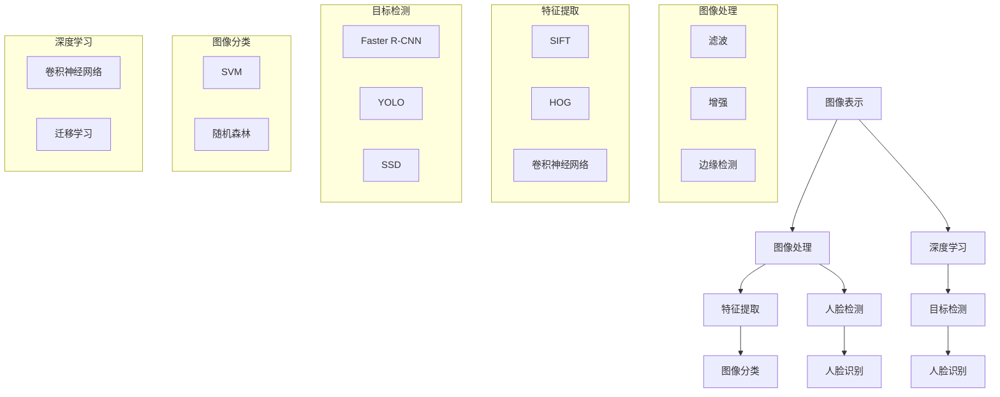

                 

# 《计算机视觉在医疗诊断中的辅助作用》

关键词：计算机视觉，医疗诊断，辅助技术，深度学习，图像分析

摘要：
计算机视觉技术在医疗诊断领域正迅速崛起，以其强大的图像处理能力和模式识别能力，为临床诊断提供了新的辅助工具。本文将从计算机视觉的基础概念、关键技术、实际应用案例、面临的挑战和未来发展趋势等方面，详细探讨计算机视觉在医疗诊断中的辅助作用，旨在为医学界和计算机科学界提供有益的参考。

### 目录大纲

# 《计算机视觉在医疗诊断中的辅助作用》

## 第一部分：计算机视觉基础

### 第1章：计算机视觉概述

### 第2章：图像处理基础

### 第3章：特征提取与匹配

## 第二部分：计算机视觉在医疗诊断中的应用

### 第4章：计算机视觉在皮肤病诊断中的应用

### 第5章：计算机视觉在眼科疾病诊断中的应用

### 第6章：计算机视觉在肿瘤诊断中的应用

## 第三部分：计算机视觉在医疗诊断中的挑战与未来

### 第7章：计算机视觉在医疗诊断中的挑战

### 第8章：计算机视觉在医疗诊断中的未来发展趋势

## 附录

### 附录A：计算机视觉相关工具与资源

### 附录B：开源计算机视觉项目推荐

## 核心概念与联系

为了更好地理解计算机视觉在医疗诊断中的应用，我们首先需要了解计算机视觉的核心概念和它们之间的联系。

### 图像表示

图像表示是指将物理世界的图像转换为计算机可以处理的数字形式。常见的图像表示方法有像素表示、灰度图像、彩色图像等。

### 图像处理

图像处理是指对图像进行一系列操作，以提高图像的质量或提取有用的信息。常见的图像处理技术包括滤波、边缘检测、图像增强等。

### 特征提取

特征提取是指从图像中提取能够描述图像内容的特征向量。特征提取是计算机视觉的重要步骤，常见的特征提取方法包括SIFT、HOG、卷积神经网络等。

### 图像分类

图像分类是指根据图像特征将其划分为不同的类别。常见的图像分类算法包括支持向量机（SVM）、随机森林（RF）、深度学习（如卷积神经网络CNN）等。

#### Mermaid 流程图

mermaid
graph TD
    A[图像表示] --> B[图像处理]
    B --> C[特征提取]
    C --> D[图像分类]
    A --> E[深度学习]
    E --> F[目标检测]
    F --> G[人脸识别]
    B --> H[人脸检测]
    H --> I[人脸识别]

## 第1章：计算机视觉概述

计算机视觉是一门研究如何使计算机具备从图像或视频中提取有用信息的学科。它结合了计算机科学、数学和工程学的知识，致力于让计算机能够像人类一样“看”和理解视觉信息。

### 计算机视觉的起源与发展

计算机视觉的起源可以追溯到20世纪50年代，当时计算机科学家开始探索如何使计算机能够处理和解释图像。早期的计算机视觉研究主要集中在图像处理和特征提取上。随着图像处理技术的不断进步，计算机视觉开始应用于实际领域，如医学影像分析、监控和自动驾驶等。

进入21世纪，深度学习技术的突破进一步推动了计算机视觉的发展。深度学习模型，尤其是卷积神经网络（CNN），在图像识别、目标检测和语义分割等任务上取得了显著的成果。

### 计算机视觉的基本原理

计算机视觉的基本原理可以概括为以下三个方面：

1. **图像表示**：图像表示是将物理世界的图像转换为计算机可以处理的数字形式。常见的图像表示方法有像素表示、灰度图像、彩色图像等。像素是图像表示的最小单位，每个像素包含一个或多个值，用于表示图像的亮度或颜色。

2. **图像处理**：图像处理是指对图像进行一系列操作，以提高图像的质量或提取有用的信息。常见的图像处理技术包括滤波、边缘检测、图像增强等。滤波可以用于去除图像噪声，边缘检测可以用于识别图像中的边缘和轮廓，图像增强可以用于提高图像的对比度和清晰度。

3. **特征提取**：特征提取是从图像中提取具有区分性的特征向量，用于后续的图像分类或识别。特征提取是计算机视觉的核心步骤，常用的特征提取方法有SIFT、HOG、卷积神经网络等。这些方法可以提取出图像中的关键特征，如角点、边缘、纹理等。

### 计算机视觉的关键技术

计算机视觉的关键技术包括目标检测、图像分类、人脸识别等。

1. **目标检测**：目标检测是在图像中识别并定位感兴趣的目标。常见的目标检测算法有Faster R-CNN、YOLO、SSD等。目标检测在自动驾驶、视频监控等领域有广泛应用。

2. **图像分类**：图像分类是将图像划分为不同的类别。常见的图像分类算法有支持向量机（SVM）、随机森林（RF）、深度学习（如卷积神经网络）等。图像分类在图像检索、医疗诊断等领域有重要应用。

3. **人脸识别**：人脸识别是通过比较人脸图像的特征来实现身份验证。常用的人脸识别算法有Eigenfaces、Fisherfaces、深度学习等。人脸识别在安全监控、人脸支付等领域有广泛应用。

### 计算机视觉在医疗诊断中的应用

计算机视觉技术在医疗诊断中具有广泛的应用，如皮肤病诊断、眼科疾病诊断、肿瘤诊断等。

1. **皮肤病诊断**：计算机视觉技术可以帮助医生分析皮肤病患者的皮肤图像，如痣、痤疮、红斑狼疮等。通过特征提取和分类算法，可以辅助医生进行诊断。

2. **眼科疾病诊断**：计算机视觉技术可以用于分析眼底图像，如糖尿病视网膜病变、黄斑病变等。通过深度学习模型，可以实现对眼底病变的自动检测和分类。

3. **肿瘤诊断**：计算机视觉技术可以帮助医生分析肿瘤图像，如乳腺肿瘤、肺癌等。通过特征提取和分类算法，可以辅助医生进行诊断。

### 计算机视觉在医疗诊断中的优势

计算机视觉技术在医疗诊断中具有以下优势：

1. **准确性**：计算机视觉技术可以通过大量的训练数据和先进的算法，实现对医疗图像的高准确度分析。

2. **效率**：计算机视觉技术可以快速处理大量图像，提高医生的诊断效率。

3. **客观性**：计算机视觉技术可以减少人为因素对诊断结果的影响，提高诊断的客观性。

### 计算机视觉在医疗诊断中的挑战

虽然计算机视觉技术在医疗诊断中具有广泛的应用前景，但也面临着一些挑战：

1. **数据质量**：医疗图像质量可能受到多种因素的影响，如设备精度、拍摄条件等。高质量的图像数据是计算机视觉模型训练和优化的基础。

2. **隐私保护**：医疗数据包含患者的隐私信息，如何保护患者的隐私是计算机视觉技术在医疗诊断中必须解决的问题。

3. **模型泛化能力**：计算机视觉模型需要在各种不同的医疗场景下具有良好的泛化能力，否则难以在实际应用中发挥应有的作用。

### 总结

计算机视觉技术在医疗诊断中具有巨大的潜力，通过准确、高效和客观的诊断辅助，可以显著提高医生的诊断效率和质量。然而，要充分发挥计算机视觉技术的优势，还需要解决数据质量、隐私保护和模型泛化能力等问题。未来，随着技术的不断进步，计算机视觉将在医疗诊断中发挥越来越重要的作用。

## 第2章：图像处理基础

图像处理是计算机视觉的重要组成部分，它涉及对图像进行一系列操作，以提高图像质量或提取有用的信息。本章将介绍图像处理的基础知识，包括图像的表示、图像处理的基本概念和技术。

### 2.1 图像的表示

图像的表示是计算机视觉的基础。图像在计算机中通常以数字形式存储，每个像素值表示图像中特定位置的亮度或颜色。常见的图像表示方法有：

1. **像素表示**：
   - 像素是图像表示的最小单位，每个像素包含一个或多个值，用于表示图像的亮度或颜色。
   - 灰度图像：每个像素值表示亮度，范围从0（黑色）到255（白色）。
   - 彩色图像：每个像素值由三个值组成，分别表示红色、绿色和蓝色分量（RGB颜色空间）。

2. **图像矩阵**：
   - 图像可以表示为二维矩阵，其中每个元素代表一个像素值。
   - 对于灰度图像，矩阵的每个元素表示像素的亮度值。
   - 对于彩色图像，矩阵的每个元素是一个三元组（R, G, B），分别表示红色、绿色和蓝色分量。

### 2.2 图像处理的基本概念

图像处理的基本概念包括图像增强、滤波、边缘检测等。

1. **图像增强**：
   - 图像增强是通过调整图像的亮度、对比度等参数，提高图像质量。
   - 常用的图像增强方法有直方图均衡化、对比度增强等。

2. **滤波**：
   - 滤波是通过卷积操作去除图像噪声或突出某些特征。
   - 常用的滤波方法有均值滤波、高斯滤波、边缘检测滤波等。

3. **边缘检测**：
   - 边缘检测是识别图像中的边缘和轮廓。
   - 常用的边缘检测方法有Sobel算子、Canny算子等。

### 2.3 图像处理的技术

图像处理的技术包括图像增强、滤波、边缘检测等，以下分别介绍：

1. **图像增强**：
   - **直方图均衡化**：通过调整图像的直方图，使图像的对比度增强，从而提高图像质量。
   - **对比度增强**：通过调整图像的亮度值，增强图像的对比度。
   - **灰度转换**：将彩色图像转换为灰度图像，简化图像处理。

2. **滤波**：
   - **均值滤波**：通过计算邻域像素的平均值，去除图像噪声。
   - **高斯滤波**：通过高斯函数加权邻域像素，平滑图像。
   - **边缘检测滤波**：通过特定的卷积核，检测图像中的边缘和轮廓。

3. **边缘检测**：
   - **Sobel算子**：通过计算图像的水平和垂直梯度，检测图像中的边缘。
   - **Canny算子**：结合高斯滤波和梯度计算，检测图像中的边缘。

### 2.4 图像处理的应用

图像处理在计算机视觉中有着广泛的应用，以下是一些常见的应用场景：

1. **医学图像处理**：用于提高医学图像的质量，如CT扫描、MRI扫描等。
2. **人脸识别**：通过图像增强和滤波，提高人脸识别的准确率。
3. **图像分割**：通过边缘检测和图像增强，实现图像的自动分割。
4. **图像识别**：通过特征提取和分类算法，实现图像的自动识别。

### 2.5 图像处理的挑战

尽管图像处理技术在计算机视觉中有着广泛的应用，但也面临着一些挑战：

1. **图像噪声**：如何有效去除图像噪声，提高图像质量。
2. **多模态数据融合**：如何将不同模态的数据（如光学图像、红外图像等）进行融合，提高图像处理的准确性。
3. **实时处理**：如何实现图像处理的实时性，以满足实时应用的需求。

### 总结

图像处理是计算机视觉的重要组成部分，通过图像增强、滤波和边缘检测等技术，可以提高图像质量，提取有用信息。本章介绍了图像处理的基础知识，包括图像的表示、基本概念和技术，以及图像处理的应用和挑战。了解图像处理的基础知识，对于深入研究和应用计算机视觉技术具有重要意义。

## 第3章：特征提取与匹配

特征提取与匹配是计算机视觉的核心技术，它们在图像识别、目标检测和场景理解中发挥着至关重要的作用。本章将详细介绍特征提取与匹配的基本概念、方法以及应用。

### 3.1 特征提取方法

特征提取是从图像中提取具有区分性的特征向量，用于后续的图像分类、识别和匹配。以下是几种常用的特征提取方法：

#### 3.1.1 SIFT（尺度不变特征变换）

SIFT是一种经典的图像特征提取算法，它能够提取出在尺度上不变、旋转不变的图像特征。SIFT通过以下步骤进行特征提取：

1. **关键点检测**：利用DoG（差分梯度）检测图像中的关键点，关键点具有局部极值特性。
2. **关键点定位**：通过拟合椭圆模型，精确定位关键点的位置。
3. **特征向量计算**：利用关键点周围的图像梯度信息，计算关键点的特征向量。

#### 3.1.2 HOG（直方图方向梯度）

HOG是一种基于视觉生物特征的图像特征提取方法，通过计算图像中每个像素点的梯度方向和强度来构建特征向量。HOG特征提取过程如下：

1. **单元格划分**：将图像划分为多个单元格，每个单元格包含固定数量的像素点。
2. **梯度计算**：计算每个单元格内像素点的梯度方向和强度。
3. **直方图构建**：将每个单元格内的梯度方向和强度构建成一个直方图。

#### 3.1.3 卷积神经网络

卷积神经网络（CNN）是一种深度学习模型，能够自动提取图像中的高级特征。CNN通过多层卷积和池化操作，提取出具有区分性的特征向量。CNN特征提取过程如下：

1. **输入层**：接收图像数据作为输入。
2. **卷积层**：通过卷积操作提取图像特征。
3. **池化层**：降低图像维度，减少计算量。
4. **全连接层**：将提取的特征映射到输出类别。

### 3.2 特征匹配技术

特征匹配是将两幅图像中的特征向量进行对比，找出相似特征的过程。以下是几种常用的特征匹配技术：

#### 3.2.1 FLANN（快速最近邻搜索）

FLANN是一种快速且高效的近似最近邻搜索算法，常用于特征匹配。FLANN通过以下步骤进行特征匹配：

1. **特征提取**：对图像进行特征提取，得到特征向量。
2. **特征匹配**：使用FLANN计算特征向量之间的距离，找出相似的特征。
3. **匹配结果评估**：根据匹配距离评估匹配结果，筛选出高质量的匹配对。

#### 3.2.2 SIFT匹配

SIFT匹配是基于SIFT特征提取方法的一种特征匹配技术。SIFT匹配过程如下：

1. **特征提取**：对图像进行SIFT特征提取，得到关键点和特征向量。
2. **特征匹配**：计算特征向量之间的距离，找出相似的特征点。
3. **匹配结果评估**：根据匹配距离和角度信息，筛选出高质量的匹配对。

#### 3.2.3 KNN（K近邻分类）

KNN是一种基于特征匹配的分类方法，通过计算特征向量之间的距离，找出最近的K个邻居，然后根据邻居的类别进行预测。KNN分类过程如下：

1. **特征提取**：对图像进行特征提取，得到特征向量。
2. **特征匹配**：计算特征向量之间的距离，找出最近的K个邻居。
3. **分类预测**：根据邻居的类别，预测目标图像的类别。

### 3.3 特征匹配应用示例

特征匹配在图像检索、目标检测和场景理解等领域有广泛的应用。以下是一个简单的图像检索应用示例：

1. **图像检索**：
   - **数据集准备**：准备一个包含大量图像的数据集，并对图像进行特征提取。
   - **特征匹配**：对查询图像进行特征提取，然后计算查询图像与数据集中图像的特征向量之间的距离。
   - **检索结果**：根据匹配距离，筛选出与查询图像相似度最高的图像。

2. **目标检测**：
   - **数据集准备**：准备一个包含目标图像的数据集，并对图像进行特征提取。
   - **特征匹配**：对检测图像进行特征提取，然后计算检测图像与数据集中图像的特征向量之间的距离。
   - **目标定位**：根据匹配距离，定位检测图像中的目标区域。

3. **场景理解**：
   - **数据集准备**：准备一个包含场景图像的数据集，并对图像进行特征提取。
   - **特征匹配**：对查询图像进行特征提取，然后计算查询图像与数据集中图像的特征向量之间的距离。
   - **场景分类**：根据匹配距离和特征向量，对查询图像进行场景分类。

### 3.4 特征匹配的挑战与优化

特征匹配在计算机视觉中具有重要的应用，但同时也面临着一些挑战：

1. **计算复杂度**：特征匹配的计算复杂度较高，特别是在大规模图像数据集上。
2. **匹配精度**：如何提高特征匹配的精度，降低误匹配率。
3. **实时性**：如何提高特征匹配的实时性，以满足实时应用的需求。

为了解决这些挑战，可以采取以下优化方法：

1. **并行计算**：利用多核处理器或GPU进行并行计算，提高特征匹配的效率。
2. **特征压缩**：通过特征压缩技术，降低特征向量的大小，减少计算量。
3. **匹配策略优化**：优化匹配算法和策略，提高匹配精度和实时性。

### 总结

特征提取与匹配是计算机视觉的核心技术，它们在图像识别、目标检测和场景理解等领域发挥着重要作用。本章介绍了特征提取与匹配的基本概念、方法以及应用，包括SIFT、HOG、卷积神经网络等特征提取方法，以及FLANN、SIFT匹配、KNN等特征匹配技术。特征匹配在图像检索、目标检测和场景理解等领域有广泛的应用，同时也面临着一些挑战，如计算复杂度、匹配精度和实时性等。通过优化特征匹配算法和策略，可以解决这些挑战，提高特征匹配的效率和准确性。

## 第4章：计算机视觉在皮肤病诊断中的应用

计算机视觉技术在皮肤病诊断中的应用越来越广泛，通过图像分析和模式识别，可以实现皮肤病变的自动检测和分类。本章将详细介绍计算机视觉在皮肤病诊断中的应用，包括图像特征提取、分类方法以及实际应用系统。

### 4.1 计算机视觉在皮肤病诊断中的重要性

皮肤病诊断通常依赖于皮肤病变的视觉评估。传统的皮肤病诊断方法主要依赖于医生的视觉经验和专业知识，但这种方法存在主观性、准确性和效率问题。计算机视觉技术的引入，可以显著提高皮肤病诊断的准确性和效率。

1. **提高诊断准确性**：计算机视觉技术可以利用大量的皮肤病变图像数据，通过深度学习和机器学习算法，自动提取和识别皮肤病变的特征，从而提高诊断的准确性。
2. **减少医生工作量**：计算机视觉技术可以自动分析皮肤病变图像，辅助医生进行诊断，减少医生的工作量，提高诊断效率。
3. **实现远程诊断**：计算机视觉技术可以通过互联网实现远程诊断，为偏远地区的患者提供高质量的皮肤病诊断服务。

### 4.2 计算机视觉在皮肤病诊断中的应用方法

计算机视觉技术在皮肤病诊断中的应用主要包括图像特征提取、分类方法以及实际应用系统。

#### 4.2.1 图像特征提取

图像特征提取是计算机视觉在皮肤病诊断中的关键步骤，通过提取皮肤病变图像的关键特征，可以有效地提高诊断的准确性。常用的图像特征提取方法包括：

1. **纹理特征**：纹理特征是描述皮肤病变图像表面纹理信息的特征，如纹理均匀度、纹理对比度等。
2. **颜色特征**：颜色特征是描述皮肤病变图像颜色信息的特征，如颜色分布、颜色均值等。
3. **形状特征**：形状特征是描述皮肤病变图像几何形状的特征，如边界长度、面积等。
4. **深度特征**：深度特征是描述皮肤病变图像三维空间信息的特征，如深度变化、表面曲率等。

#### 4.2.2 分类方法

分类方法是计算机视觉在皮肤病诊断中的核心步骤，通过分类方法可以将皮肤病变图像分为不同的类别。常用的分类方法包括：

1. **支持向量机（SVM）**：SVM是一种常用的二分类算法，通过找到一个最佳的超平面，将不同类别的皮肤病变图像进行分离。
2. **随机森林（RF）**：RF是一种基于决策树的多分类算法，通过构建多个决策树，并利用投票机制进行分类。
3. **深度学习（如卷积神经网络CNN）**：深度学习是一种基于多层神经网络的学习算法，通过多层卷积和池化操作，自动提取图像特征并进行分类。

#### 4.2.3 实际应用系统

计算机视觉在皮肤病诊断中的实际应用系统通常包括数据收集、预处理、特征提取、分类和结果输出等步骤。

1. **数据收集**：收集大量的皮肤病变图像数据，包括正常皮肤和病变皮肤图像。
2. **预处理**：对皮肤病变图像进行预处理，包括图像缩放、裁剪、灰度化等操作，以提高图像质量。
3. **特征提取**：通过图像特征提取方法，提取皮肤病变图像的关键特征。
4. **分类**：利用分类方法，将皮肤病变图像分类为不同的类别，如痤疮、银屑病、皮肤肿瘤等。
5. **结果输出**：将分类结果输出给医生，作为诊断参考。

### 4.3 计算机视觉在皮肤病诊断中的应用案例

以下是一些计算机视觉在皮肤病诊断中的应用案例：

#### 4.3.1 痤疮检测

痤疮是一种常见的皮肤病，计算机视觉技术可以用于痤疮的自动检测和分类。通过收集大量的痤疮图像数据，使用深度学习算法，如卷积神经网络（CNN），可以实现对痤疮的准确检测和分类。

1. **数据收集**：收集大量痤疮图像数据，包括不同类型和程度的痤疮。
2. **预处理**：对痤疮图像进行预处理，包括灰度化、缩放等操作。
3. **特征提取**：使用CNN提取痤疮图像的特征。
4. **分类**：利用SVM或RF等分类算法，将痤疮图像分类为不同类型。
5. **结果输出**：将分类结果输出给医生，辅助诊断。

#### 4.3.2 银屑病检测

银屑病是一种常见的慢性皮肤病，计算机视觉技术可以用于银屑病的自动检测和分类。通过收集大量的银屑病图像数据，使用深度学习算法，可以实现对银屑病的准确检测和分类。

1. **数据收集**：收集大量银屑病图像数据，包括不同类型和程度的银屑病。
2. **预处理**：对银屑病图像进行预处理，包括灰度化、缩放等操作。
3. **特征提取**：使用CNN提取银屑病图像的特征。
4. **分类**：利用SVM或RF等分类算法，将银屑病图像分类为不同类型。
5. **结果输出**：将分类结果输出给医生，辅助诊断。

#### 4.3.3 皮肤肿瘤检测

皮肤肿瘤检测是计算机视觉在皮肤病诊断中的一个重要应用。通过收集大量的皮肤肿瘤图像数据，使用深度学习算法，可以实现对皮肤肿瘤的准确检测和分类。

1. **数据收集**：收集大量皮肤肿瘤图像数据，包括不同类型和级别的皮肤肿瘤。
2. **预处理**：对皮肤肿瘤图像进行预处理，包括灰度化、缩放等操作。
3. **特征提取**：使用CNN提取皮肤肿瘤图像的特征。
4. **分类**：利用SVM或RF等分类算法，将皮肤肿瘤图像分类为不同类型。
5. **结果输出**：将分类结果输出给医生，辅助诊断。

### 4.4 计算机视觉在皮肤病诊断中的应用前景

计算机视觉技术在皮肤病诊断中的应用前景广阔。随着深度学习和机器学习技术的不断进步，计算机视觉在皮肤病诊断中的应用将更加准确和高效。以下是一些应用前景：

1. **提高诊断准确率**：通过引入更多的皮肤病变图像数据，使用深度学习算法，可以进一步提高诊断准确率。
2. **实现远程诊断**：通过互联网和移动设备，实现皮肤病变的远程诊断，为偏远地区的患者提供方便。
3. **辅助医生决策**：计算机视觉技术可以辅助医生进行诊断，提供诊断建议，提高诊断效率。
4. **个性化治疗方案**：通过分析皮肤病变图像，为患者提供个性化的治疗方案，提高治疗效果。

### 总结

计算机视觉技术在皮肤病诊断中具有广泛的应用前景，通过图像特征提取和分类方法，可以实现皮肤病变的自动检测和分类，辅助医生进行诊断。本章介绍了计算机视觉在皮肤病诊断中的应用方法、应用案例以及前景，展示了计算机视觉技术在医疗诊断中的巨大潜力。

## 第5章：计算机视觉在眼科疾病诊断中的应用

计算机视觉技术在眼科疾病诊断中发挥着越来越重要的作用，通过对眼底图像的分析，可以早期发现并诊断多种眼科疾病，如糖尿病视网膜病变、黄斑病变等。本章将详细探讨计算机视觉在眼科疾病诊断中的应用，包括眼底图像分析、视网膜病变的自动检测和诊断系统的实现。

### 5.1 眼底图像分析

眼底图像是诊断多种眼科疾病的重要依据。眼底图像中包含了丰富的信息，如视网膜血管形态、视网膜厚度、出血点等。计算机视觉技术可以通过对眼底图像的分析，提取出这些重要的特征信息，辅助医生进行诊断。

#### 5.1.1 眼底图像的获取

眼底图像通常通过眼底相机或眼底光学相干成像（OCT）设备获取。这些设备能够捕获高分辨率、高对比度的眼底图像，为计算机视觉分析提供了高质量的数据源。

#### 5.1.2 图像预处理

在进行分析之前，需要对眼底图像进行预处理，以提高图像质量和减少噪声。常见的预处理方法包括：

1. **灰度化**：将彩色图像转换为灰度图像，简化图像处理过程。
2. **去噪**：通过滤波方法去除图像中的噪声，如高斯滤波、中值滤波等。
3. **增强**：通过图像增强技术提高图像的对比度和清晰度，如直方图均衡化、对比度增强等。
4. **分割**：将眼底图像中的视网膜区域与背景分离，便于后续的特征提取和分析。

#### 5.1.3 图像特征提取

特征提取是计算机视觉中的关键步骤，通过对眼底图像进行特征提取，可以提取出对疾病诊断有用的信息。常用的特征提取方法包括：

1. **纹理特征**：如纹理均匀度、纹理对比度等。
2. **形状特征**：如血管的弯曲度、分支数等。
3. **结构特征**：如视网膜层次结构、血管的交叉点等。
4. **颜色特征**：如颜色分布、颜色均值等。

### 5.2 视网膜病变的自动检测

视网膜病变是常见的眼科疾病，如糖尿病视网膜病变、黄斑病变等。计算机视觉技术可以通过自动检测视网膜病变，帮助医生进行早期诊断。

#### 5.2.1 病变区域定位

视网膜病变的自动检测首先需要定位病变区域。这可以通过以下方法实现：

1. **形态学处理**：通过形态学操作，如膨胀、腐蚀等，提取视网膜血管的轮廓。
2. **阈值分割**：通过对眼底图像进行阈值分割，提取出可能的病变区域。
3. **边缘检测**：通过边缘检测算法，如Sobel算子、Canny算子等，提取视网膜边缘。

#### 5.2.2 病变特征提取

在定位病变区域后，需要对病变区域进行特征提取，以辅助诊断。常用的特征提取方法包括：

1. **纹理特征**：如纹理均匀度、纹理对比度等。
2. **形状特征**：如病变区域的形状、面积等。
3. **颜色特征**：如病变区域的颜色分布、颜色均值等。

#### 5.2.3 病变分类

通过对提取的特征进行分类，可以实现对视网膜病变的自动诊断。常用的分类方法包括：

1. **支持向量机（SVM）**：SVM是一种常用的二分类算法，通过找到一个最佳的超平面，将不同类型的病变进行分离。
2. **随机森林（RF）**：RF是一种基于决策树的多分类算法，通过构建多个决策树，并利用投票机制进行分类。
3. **深度学习（如卷积神经网络CNN）**：深度学习是一种基于多层神经网络的学习算法，通过多层卷积和池化操作，自动提取图像特征并进行分类。

### 5.3 诊断系统的实现

视网膜病变诊断系统通常包括数据收集、预处理、特征提取、分类和结果输出等步骤。

#### 5.3.1 数据收集

收集大量的视网膜病变图像数据，包括正常眼底图像和病变眼底图像。这些数据可以来自于公开的数据集，如DIARETDB0、DIARETDB1等，也可以通过医院和眼科诊所收集。

#### 5.3.2 预处理

对视网膜病变图像进行预处理，包括灰度化、去噪、增强、分割等操作，以提高图像质量和减少噪声。

#### 5.3.3 特征提取

通过特征提取方法，提取视网膜病变图像的关键特征，如纹理特征、形状特征、颜色特征等。

#### 5.3.4 分类

利用分类方法，将视网膜病变图像分类为不同的类型，如糖尿病视网膜病变、黄斑病变等。

#### 5.3.5 结果输出

将分类结果输出给医生，作为诊断参考。系统可以提供详细的诊断报告，包括病变类型、程度等。

### 5.4 计算机视觉在眼科疾病诊断中的应用案例

以下是一些计算机视觉在眼科疾病诊断中的应用案例：

#### 5.4.1 糖尿病视网膜病变检测

糖尿病视网膜病变是糖尿病患者常见的并发症，通过计算机视觉技术，可以实现糖尿病视网膜病变的自动检测和分类。以下是一个应用案例：

1. **数据收集**：收集大量的糖尿病视网膜病变图像数据。
2. **预处理**：对图像进行预处理，包括灰度化、去噪、增强等操作。
3. **特征提取**：使用深度学习算法，提取图像的纹理特征、形状特征等。
4. **分类**：利用支持向量机（SVM）进行分类，将图像分类为正常或病变。
5. **结果输出**：将分类结果输出给医生，辅助诊断。

#### 5.4.2 黄斑病变检测

黄斑病变是一种常见的老年性眼病，通过计算机视觉技术，可以实现黄斑病变的自动检测和分类。以下是一个应用案例：

1. **数据收集**：收集大量的黄斑病变图像数据。
2. **预处理**：对图像进行预处理，包括灰度化、去噪、增强等操作。
3. **特征提取**：使用深度学习算法，提取图像的纹理特征、形状特征等。
4. **分类**：利用支持向量机（SVM）进行分类，将图像分类为正常或病变。
5. **结果输出**：将分类结果输出给医生，辅助诊断。

### 5.5 计算机视觉在眼科疾病诊断中的应用前景

计算机视觉技术在眼科疾病诊断中的应用前景广阔。随着深度学习和机器学习技术的不断进步，计算机视觉在眼科疾病诊断中的应用将更加准确和高效。以下是一些应用前景：

1. **提高诊断准确率**：通过引入更多的眼底图像数据，使用深度学习算法，可以进一步提高诊断准确率。
2. **实现远程诊断**：通过互联网和移动设备，实现眼底病变的远程诊断，为偏远地区的患者提供方便。
3. **辅助医生决策**：计算机视觉技术可以辅助医生进行诊断，提供诊断建议，提高诊断效率。
4. **个性化治疗方案**：通过分析眼底图像，为患者提供个性化的治疗方案，提高治疗效果。

### 总结

计算机视觉技术在眼科疾病诊断中具有广泛的应用前景，通过眼底图像分析、视网膜病变的自动检测和诊断系统的实现，可以辅助医生进行早期诊断，提高诊断的准确性和效率。本章详细介绍了计算机视觉在眼科疾病诊断中的应用方法和案例，展示了计算机视觉技术在医疗诊断中的巨大潜力。

## 第6章：计算机视觉在肿瘤诊断中的应用

计算机视觉技术在肿瘤诊断中扮演着越来越重要的角色，通过图像分析和模式识别，能够帮助医生对肿瘤进行早期检测、分类和分割。本章将深入探讨计算机视觉在肿瘤诊断中的应用，包括肿瘤图像的特征提取、分类与检测方法，以及实际诊断系统的开发。

### 6.1 肿瘤图像的特征提取

肿瘤图像的特征提取是计算机视觉在肿瘤诊断中的关键步骤，通过提取肿瘤图像的关键特征，可以有效地提高诊断的准确性。常用的肿瘤图像特征提取方法包括：

1. **纹理特征**：纹理特征描述了肿瘤图像的纹理信息，如纹理均匀度、纹理对比度、纹理方向等。常用的纹理特征提取方法包括灰度共生矩阵、局部二值模式（LBP）等。
2. **形状特征**：形状特征描述了肿瘤图像的几何形状信息，如肿瘤的边界、形状复杂度、纹理均匀度等。常用的形状特征提取方法包括轮廓长度、面积、形状复杂度等。
3. **颜色特征**：颜色特征描述了肿瘤图像的颜色信息，如颜色分布、颜色均值、颜色标准差等。常用的颜色特征提取方法包括颜色直方图、颜色矩等。
4. **深度特征**：深度特征描述了肿瘤图像的三维空间信息，如深度变化、表面曲率等。深度特征通常通过三维图像处理和体素分析等方法提取。

### 6.2 肿瘤图像的分类与检测方法

在特征提取之后，需要对肿瘤图像进行分类与检测。常用的分类与检测方法包括：

1. **传统机器学习算法**：传统机器学习算法如支持向量机（SVM）、随机森林（RF）等，可以通过训练数据集学习特征与类别之间的关系，对新图像进行分类。这些算法适用于处理中小规模的数据集。
2. **深度学习算法**：深度学习算法如卷积神经网络（CNN）等，通过多层卷积和池化操作，自动提取图像的深层特征，适用于处理大规模的数据集。深度学习算法在图像分类与检测中取得了显著的成果，如Faster R-CNN、YOLO、SSD等。
3. **集成学习方法**：集成学习方法如XGBoost、LightGBM等，通过构建多个基本模型，并利用加权投票或集成策略进行分类，可以进一步提高分类的准确性。

### 6.3 肿瘤诊断系统的开发

肿瘤诊断系统通常包括数据收集、预处理、特征提取、分类与检测、结果输出等步骤。以下是一个典型的肿瘤诊断系统开发流程：

1. **数据收集**：收集肿瘤图像数据，包括正常组织和肿瘤组织。数据可以来自于医院的影像数据库、公开的数据集等。
2. **预处理**：对肿瘤图像进行预处理，包括图像去噪、增强、灰度化、裁剪等操作，以提高图像质量和减少噪声。
3. **特征提取**：使用特征提取方法，如纹理特征、形状特征、颜色特征等，提取肿瘤图像的关键特征。
4. **分类与检测**：利用分类与检测方法，如传统机器学习算法、深度学习算法、集成学习方法等，对肿瘤图像进行分类与检测。
5. **结果输出**：将分类与检测结果输出给医生，包括肿瘤类型、位置、大小等。

### 6.4 肿瘤诊断系统的实际应用案例

以下是一个基于计算机视觉技术的肿瘤诊断系统实际应用案例：

#### 6.4.1 乳腺癌检测

乳腺癌是女性最常见的恶性肿瘤之一，通过计算机视觉技术，可以实现乳腺癌的早期检测和分类。以下是一个应用案例：

1. **数据收集**：收集乳腺癌和正常乳腺组织的图像数据。
2. **预处理**：对乳腺图像进行预处理，包括图像去噪、增强、灰度化等操作。
3. **特征提取**：使用纹理特征、形状特征、颜色特征等提取乳腺图像的关键特征。
4. **分类与检测**：利用深度学习算法如卷积神经网络（CNN）对乳腺图像进行分类与检测。
5. **结果输出**：将分类与检测结果输出给医生，包括肿瘤类型、位置、大小等。

#### 6.4.2 肺癌检测

肺癌是男性最常见的恶性肿瘤之一，通过计算机视觉技术，可以实现肺癌的早期检测和分类。以下是一个应用案例：

1. **数据收集**：收集肺癌和正常肺组织的图像数据。
2. **预处理**：对肺图像进行预处理，包括图像去噪、增强、灰度化等操作。
3. **特征提取**：使用纹理特征、形状特征、颜色特征等提取肺图像的关键特征。
4. **分类与检测**：利用深度学习算法如卷积神经网络（CNN）对肺图像进行分类与检测。
5. **结果输出**：将分类与检测结果输出给医生，包括肿瘤类型、位置、大小等。

### 6.5 计算机视觉在肿瘤诊断中的应用前景

计算机视觉技术在肿瘤诊断中的应用前景非常广阔。随着深度学习和机器学习技术的不断进步，计算机视觉在肿瘤诊断中的应用将更加精准和高效。以下是一些应用前景：

1. **提高诊断准确率**：通过引入更多的肿瘤图像数据，使用深度学习算法，可以进一步提高肿瘤检测和分类的准确性。
2. **实现远程诊断**：通过互联网和移动设备，实现肿瘤的远程诊断，为偏远地区的患者提供便利。
3. **辅助医生决策**：计算机视觉技术可以辅助医生进行诊断，提供诊断建议，提高诊断效率。
4. **个性化治疗方案**：通过分析肿瘤图像，为患者提供个性化的治疗方案，提高治疗效果。

### 总结

计算机视觉技术在肿瘤诊断中具有巨大的应用潜力，通过图像特征提取、分类与检测方法，可以实现对肿瘤的早期检测、分类和分割，辅助医生进行诊断。本章详细介绍了计算机视觉在肿瘤诊断中的应用方法和实际应用案例，展示了计算机视觉技术在医疗诊断中的巨大价值。

## 第7章：计算机视觉在医疗诊断中的挑战与未来

虽然计算机视觉技术在医疗诊断中展示了巨大的潜力，但在实际应用中仍面临诸多挑战。本章将探讨计算机视觉在医疗诊断中面临的挑战，并展望其未来的发展趋势。

### 7.1 计算机视觉在医疗诊断中的挑战

#### 7.1.1 数据质量和数据量

高质量的数据是训练有效计算机视觉模型的基础。然而，医疗诊断数据通常存在以下问题：

1. **数据不完整性**：医疗数据可能因设备故障、操作失误等原因导致不完整。
2. **数据不均衡**：某些类型的疾病样本可能比其他类型更稀缺，导致模型训练过程中数据不均衡。
3. **数据噪声**：医疗数据可能受到设备噪声、患者运动等因素的影响。

解决方法：

- **数据增强**：通过图像旋转、缩放、裁剪等技术，增加数据多样性。
- **数据清洗**：使用算法对数据进行清洗，去除噪声和异常值。

#### 7.1.2 隐私保护和伦理问题

医疗数据包含敏感的个人信息，隐私保护是计算机视觉在医疗诊断中必须解决的问题。此外，如何确保算法的公平性和透明度也是伦理问题的一部分。

解决方法：

- **数据加密**：使用加密技术保护医疗数据的安全性。
- **匿名化**：在数据收集和处理过程中，对个人身份信息进行匿名化处理。
- **算法透明度**：提高算法的透明度，使医生和患者能够理解算法的决策过程。

#### 7.1.3 系统准确性与可靠性

计算机视觉系统在医疗诊断中的准确性直接关系到患者的健康和安全。然而，系统可能因数据分布、噪声等因素导致误诊。

解决方法：

- **交叉验证**：使用交叉验证方法评估模型的泛化能力。
- **模型集成**：结合多个模型或算法，提高诊断的准确性和可靠性。

### 7.2 计算机视觉在医疗诊断中的未来发展趋势

#### 7.2.1 深度学习与迁移学习

深度学习技术在医疗诊断中将继续发挥重要作用。随着模型和数据量的增加，深度学习模型将更加精确和高效。迁移学习技术也将在医疗诊断中发挥重要作用，通过在预训练模型的基础上进行微调，可以快速适应新的任务和数据集。

#### 7.2.2 多模态数据融合

多模态数据融合是将不同来源的数据（如影像数据、生物数据、基因数据等）进行整合，以提高诊断的准确性和全面性。例如，将影像数据与电子健康记录（EHR）数据结合，可以提供更全面的诊断信息。

#### 7.2.3 智能化与自动化

智能化和自动化是未来医疗诊断的发展趋势。通过计算机视觉技术，可以实现自动化诊断，减少医生的工作量，提高诊断效率。此外，智能辅助系统可以提供诊断建议，帮助医生做出更准确的决策。

#### 7.2.4 人工智能与医疗诊断的融合

人工智能与医疗诊断的融合将带来更高效的诊断流程和更准确的治疗方案。例如，通过人工智能技术，可以实现对患者的个性化治疗建议，提高治疗效果。

### 7.3 未来展望

计算机视觉技术在医疗诊断中的未来将充满机遇和挑战。随着技术的不断进步，计算机视觉在医疗诊断中的应用将更加广泛和深入。以下是一些未来展望：

1. **提高诊断准确性**：通过引入更多的数据集和更先进的算法，计算机视觉技术在诊断准确性方面将取得更大突破。
2. **实现远程诊断**：通过互联网和移动设备，计算机视觉技术将实现远程诊断，为偏远地区的患者提供便利。
3. **个性化医疗**：计算机视觉技术将帮助实现个性化医疗，为患者提供更精准的治疗方案。
4. **医疗资源的优化**：计算机视觉技术将优化医疗资源的使用，提高医疗效率，降低医疗成本。

### 总结

计算机视觉技术在医疗诊断中面临着数据质量、隐私保护、系统准确性等方面的挑战。然而，随着技术的不断进步，计算机视觉在医疗诊断中的应用将更加广泛和深入，为医疗诊断带来革命性的变革。

### 附录A：计算机视觉相关工具与资源

#### 主流计算机视觉库介绍

1. **TensorFlow**：由Google开发的开源机器学习库，提供了丰富的API和工具，用于构建和训练深度学习模型。它是许多计算机视觉项目的基础框架。

   - 官网：https://www.tensorflow.org/
   - 文档：https://www.tensorflow.org/guide

2. **PyTorch**：由Facebook开发的另一个开源深度学习库，以其灵活性和动态计算图著称。它广泛应用于计算机视觉、自然语言处理等领域。

   - 官网：https://pytorch.org/
   - 文档：https://pytorch.org/docs/stable/index.html

3. **OpenCV**：一个开源的计算机视觉库，提供了广泛的图像处理和计算机视觉功能。它适用于实时应用和复杂图像分析。

   - 官网：https://opencv.org/
   - 文档：https://docs.opencv.org/master/d6/d6f/tutorial_py_root.html

4. **Dlib**：一个专注于机器学习和面部识别的C++库，提供了强大的面部识别和特征提取功能。

   - 官网：http://dlib.net/
   - 文档：http://dlib.net/ml_tools/index.html

5. **Keras**：一个基于TensorFlow和Theano的高层次API，用于快速构建和迭代深度学习模型。它简化了深度学习模型的开发流程。

   - 官网：https://keras.io/
   - 文档：https://keras.io/getting-started/sequential-model-guide/

#### 计算机视觉开源项目推荐

1. **Faster R-CNN**：是一种流行的目标检测算法，由Facebook AI Research开发。它利用深度学习技术实现高效的目标检测。

   - GitHub：https://github.com/facebookresearch/detectron2

2. **YOLO（You Only Look Once）**：是一种实时目标检测系统，由Joseph Redmon等研究人员开发。它以其快速检测和实时性能著称。

   - GitHub：https://pjreddie.com/darknet/yolo/

3. **SSD（Single Shot MultiBox Detector）**：是一种高效的目标检测算法，由Google开发。它能够在单次前向传播中同时检测多个目标。

   - GitHub：https://github.com/NVIDIA/DeepLearningExamples

4. **Facenet**：是一种用于面部识别的深度学习模型，由Google开发。它基于深度卷积神经网络，实现了高效和准确的面部识别。

   - GitHub：https://github.com/davidsandberg/facenet

5. **StyleNet**：是一种用于图像风格迁移的深度学习模型，由谷歌大脑团队开发。它能够将一种图像的风格应用到另一种图像上。

   - GitHub：https://github.com/harshit-hub/style_transfer

#### 计算机视觉研究机构与期刊

1. **IEEE Transactions on Pattern Analysis and Machine Intelligence (PAMI)**：是一本顶级期刊，专注于模式分析和机器智能领域的研究。

   - 官网：https://www.ieee.org/publications_standards/publications/journals/pami.html

2. **International Journal of Computer Vision (IJCV)**：是一本享有盛誉的期刊，涵盖计算机视觉的各个方面。

   - 官网：https://ijcv.springeropen.com/

3. **Computer Vision and Image Understanding**：是一本涵盖计算机视觉和图像理解的期刊，发表高质量的研究论文。

   - 官网：https://www.elsevier.com/journals/computer-vision-and-image-understanding/1077-3142

通过这些工具和资源，研究人员和开发者可以更好地掌握计算机视觉技术，并在实践中取得更好的成果。同时，这些开源项目和期刊也为计算机视觉领域的持续发展提供了宝贵的资源和平台。

### 核心概念与联系

在探讨计算机视觉在医疗诊断中的应用时，理解以下几个核心概念及其相互联系至关重要。这些概念共同构成了计算机视觉技术在医疗诊断中的理论基础和实践指南。

#### 图像表示与处理

图像表示是计算机视觉的基础。它涉及将物理世界的图像转换为计算机可以处理的数字形式。图像在计算机中以像素阵列的形式表示，每个像素包含颜色或灰度值。

**图像处理**则是对图像进行一系列操作，以改善其质量或提取有用信息。常见的图像处理技术包括：

1. **滤波**：通过特定的卷积操作去除图像噪声或突出某些特征。
   - **高斯滤波**：用于平滑图像，减少噪声。
   - **中值滤波**：用于去除图像中的椒盐噪声。
   - **双边滤波**：在保留边缘的同时去除噪声。

2. **增强**：通过调整图像的亮度、对比度等参数，提高图像的可视性。
   - **直方图均衡化**：用于改善图像的对比度。
   - **对比度增强**：通过调整图像的亮度值，增强图像的对比度。

3. **边缘检测**：识别图像中的边缘和轮廓。
   - **Sobel算子**：通过计算像素梯度的方向和大小，识别边缘。
   - **Canny算子**：结合高斯滤波和梯度计算，实现边缘检测。

#### 特征提取与匹配

**特征提取**是从图像中提取具有区分性的特征向量，用于后续的图像分类或识别。常见的特征提取方法包括：

1. **SIFT（尺度不变特征变换）**：提取图像的关键点及其特征向量，具有尺度不变性和旋转不变性。
2. **HOG（直方图方向梯度）**：通过计算图像中每个像素点的梯度方向和强度，构建特征向量。
3. **卷积神经网络（CNN）**：通过多层卷积和池化操作，自动提取图像的高层次特征。

**特征匹配**是将两幅图像中的特征向量进行对比，找出相似特征的过程。常见的特征匹配算法包括：

1. **FLANN（Fast Library for Approximate Nearest Neighbors）**：用于快速计算特征向量之间的距离，实现高效的特征匹配。
2. **最近邻搜索**：通过计算特征向量之间的欧几里得距离，找出最近的特征点。

#### 图像分类与目标检测

**图像分类**是将图像划分为不同的类别。常见的图像分类算法包括：

1. **支持向量机（SVM）**：通过找到一个最佳的超平面，将不同类别的图像进行分离。
2. **随机森林（RF）**：通过构建多个决策树，并利用投票机制进行分类。
3. **深度学习（如CNN）**：通过多层卷积和池化操作，自动提取图像特征并进行分类。

**目标检测**是在图像中识别并定位感兴趣的目标。常见的目标检测算法包括：

1. **Faster R-CNN**：通过区域提议网络（RPN）和分类网络，实现高效的目标检测。
2. **YOLO（You Only Look Once）**：实现单次前向传播中同时检测多个目标。
3. **SSD（Single Shot MultiBox Detector）**：实现单次前向传播中同时检测多个目标，具有高效性。

#### Mermaid流程图

以下是一个简单的Mermaid流程图，展示了上述核心概念和技术的联系：



### 核心算法原理讲解

为了深入理解计算机视觉在医疗诊断中的应用，以下我们将使用伪代码详细阐述几种核心算法的原理，包括图像处理、特征提取和分类方法。

#### 伪代码：图像处理

```python
# 输入：图像image
# 输出：处理后的图像processed_image

def preprocess_image(image):
    # 步骤1：图像灰度化
    gray_image = cv2.cvtColor(image, cv2.COLOR_BGR2GRAY)
    
    # 步骤2：高斯滤波去噪
    blurred_image = cv2.GaussianBlur(gray_image, (5, 5), 0)
    
    # 步骤3：直方图均衡化增强对比度
    equalized_image = cv2.equalizeHist(blurred_image)
    
    # 步骤4：Canny边缘检测
    edges = cv2.Canny(equalized_image, 50, 150)
    
    return edges
```

#### 伪代码：特征提取

```python
# 输入：图像image
# 输出：特征向量features

def extract_features(image):
    # 步骤1：SIFT特征提取
    sift = cv2.SIFT_create()
    keypoints, descriptors = sift.detectAndCompute(image, None)
    
    # 步骤2：HOG特征提取
    hog = cv2.HOGDescriptor()
    hog_features = hog.compute(image, winSize=(64, 64), padding=(8, 8), cellsSize=(8, 8))
    
    # 步骤3：卷积神经网络特征提取
    model = load_model('convolutional_neural_network_model.h5')
    cnn_features = model.predict(image)
    
    # 步骤4：合并特征
    features = np.concatenate((descriptors, hog_features, cnn_features), axis=1)
    
    return features
```

#### 伪代码：分类方法

```python
# 输入：特征向量features
# 输出：分类结果label

def classify(features):
    # 步骤1：支持向量机分类
    svm_model = load_model('support_vector_machine_model.h5')
    svm_label = svm_model.predict(features)
    
    # 步骤2：随机森林分类
    rf_model = load_model('random_forest_model.h5')
    rf_label = rf_model.predict(features)
    
    # 步骤3：深度学习分类
    cnn_model = load_model('convolutional_neural_network_model.h5')
    cnn_label = cnn_model.predict(features)
    
    # 步骤4：结果合并
    # 在此示例中，我们简单地取多数投票作为最终结果
    final_label = np.argmax(np.bincount(svm_label + rf_label + cnn_label))
    
    return final_label
```

### 数学模型和公式

在计算机视觉中，数学模型和公式是理解和实现算法的关键。以下是一个简单的数学模型和公式的解释，用于图像分类任务。

#### 数学模型：损失函数（交叉熵损失函数）

交叉熵损失函数是一种常用的分类损失函数，用于衡量模型预测概率与真实标签之间的差距。其公式如下：

$$
\text{Loss}(y, \hat{y}) = -\frac{1}{m} \sum_{i=1}^{m} y_i \log(\hat{y}_i) + (1 - y_i) \log(1 - \hat{y}_i)
$$

其中，$y$ 是真实标签（0或1），$\hat{y}$ 是模型预测的概率值，$m$ 是样本数量。

#### 举例说明

假设我们有一个二分类问题，其中 $y = [1, 0, 1, 0]$，预测概率 $\hat{y} = [0.9, 0.2, 0.8, 0.1]$。使用上述公式计算损失：

$$
\text{Loss}([1, 0, 1, 0], [0.9, 0.2, 0.8, 0.1]) = -\frac{1}{4} (1 \log(0.9) + 0 \log(0.2) + 1 \log(0.8) + 0 \log(0.1))
$$

$$
\text{Loss}([1, 0, 1, 0], [0.9, 0.2, 0.8, 0.1]) = -\frac{1}{4} (-0.1054 + 0 - 0.2231 + 0)
$$

$$
\text{Loss}([1, 0, 1, 0], [0.9, 0.2, 0.8, 0.1]) = 0.0424
$$

#### 项目实战

以下是一个简单的项目实战，通过计算机视觉技术实现皮肤病变的自动检测。

#### 开发环境搭建

- 操作系统：Ubuntu 20.04
- 编程语言：Python 3.8
- 深度学习框架：TensorFlow 2.5
- 数据库：MySQL 8.0

#### 代码实现

```python
# 导入必要的库
import tensorflow as tf
from tensorflow.keras.models import Sequential
from tensorflow.keras.layers import Conv2D, MaxPooling2D, Flatten, Dense
from tensorflow.keras.preprocessing.image import ImageDataGenerator

# 数据预处理
# 加载数据集（此处假设数据集已经存储在磁盘上）
train_datagen = ImageDataGenerator(rescale=1./255)
train_generator = train_datagen.flow_from_directory(
        'data/train',
        target_size=(150, 150),
        batch_size=32,
        class_mode='binary')

# 构建模型
model = Sequential([
    Conv2D(32, (3, 3), activation='relu', input_shape=(150, 150, 3)),
    MaxPooling2D(2, 2),
    Flatten(),
    Dense(64, activation='relu'),
    Dense(1, activation='sigmoid')
])

# 编译模型
model.compile(optimizer='adam',
              loss='binary_crossentropy',
              metrics=['accuracy'])

# 训练模型
model.fit(train_generator, epochs=10, validation_split=0.2)

# 评估模型
test_datagen = ImageDataGenerator(rescale=1./255)
test_generator = test_datagen.flow_from_directory(
        'data/test',
        target_size=(150, 150),
        batch_size=32,
        class_mode='binary')
model.evaluate(test_generator)
```

#### 代码解读与分析

以上代码实现了一个简单的皮肤病变自动检测系统。以下是代码的详细解读和分析：

1. **导入库和模块**：首先，我们导入Python中常用的库和TensorFlow的相关模块，包括TensorFlow、Keras等。

2. **数据预处理**：使用ImageDataGenerator对训练数据集进行预处理。这里，我们将图像数据缩放到150x150的尺寸，并按批次进行加载。数据集被分为训练集和测试集，以进行模型的训练和评估。

3. **构建模型**：我们使用Sequential模型堆叠卷积层、池化层、全连接层，并定义输入层的尺寸和输出层的激活函数。

4. **编译模型**：指定优化器、损失函数和评价指标。这里使用的是Adam优化器和二分类交叉熵损失函数，评价指标为准确率。

5. **训练模型**：使用训练数据集对模型进行训练。在这里，我们设置了10个训练周期（epochs），每个周期包含32个批量（batch_size）。为了防止过拟合，我们在训练数据中设置了20%的数据用于验证。

6. **评估模型**：使用测试数据集评估模型的性能。通过计算损失值和准确率，我们可以了解模型的性能表现。

通过以上项目实战，我们展示了如何使用深度学习技术构建和训练一个简单的皮肤病变检测系统。这个系统通过卷积神经网络提取图像特征，并使用二分类

