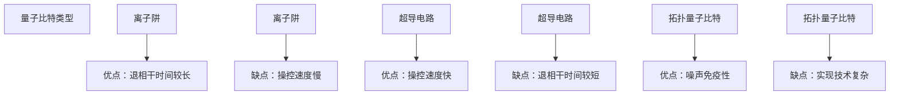
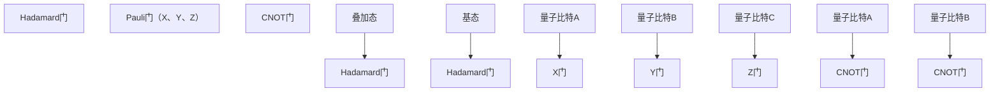
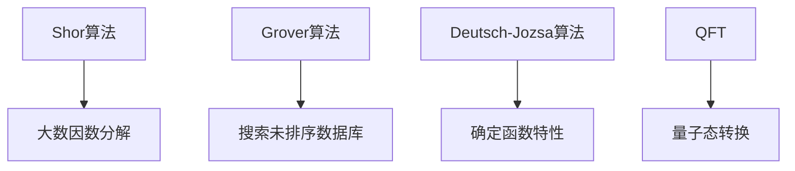

                 

## 《计算：第四部分 计算的极限 第 10 章 量子计算 计算的最小能量》

### 关键词：量子计算、计算最小能量、量子比特、量子门、量子算法

在计算机科学的世界里，量子计算作为一门前沿技术，正在不断挑战传统计算的极限。本章将探讨量子计算的物理实现、数学基础及其计算的最小能量问题，旨在为广大读者揭示量子计算的独特魅力和应用潜力。

### 摘要：

本文分为四个主要部分。首先，我们介绍了量子计算的基础知识，包括量子力学的基本原理、量子比特与经典比特的区别、量子计算机的物理实现以及量子门和量子算法的基本概念。接着，我们深入探讨了量子计算的数学基础，涵盖了线性代数基础、线性变换与量子态的描述以及量子比特的数学描述。第三部分分析了量子计算的挑战与未来，包括量子退相干的问题及其解决方法，以及量子计算在加密技术、计算密集型行业、药物设计等领域的潜在应用。第四部分则探讨了量子计算与人工智能的融合，以及量子计算的法律法规和社会责任问题。通过本文的阅读，读者将对量子计算有更全面和深入的了解。

## 第1章 量子计算基础

量子计算是量子力学与计算机科学的交叉领域，其核心思想是利用量子比特的叠加态和纠缠态来实现高效的计算任务。本节将首先介绍量子力学的基本原理，然后探讨量子比特与经典比特的区别，以及量子计算机的物理实现。

### 1.1 量子力学的基本原理

量子力学是一门描述微观粒子行为的物理学分支。它与经典力学的区别在于，量子力学中的粒子和场以波函数的形式存在，并且具有叠加性和量子纠缠等特性。

#### 量子比特与经典比特的比较

经典计算机使用经典比特（classical bit）作为信息存储的基本单元，每个经典比特只能表示0或1两种状态。然而，量子比特（quantum bit，简称qubit）却可以同时处于0和1的状态，这种状态称为叠加态（superposition）。用数学语言来描述，一个量子比特的状态可以表示为：

\[ |q\rangle = a|0\rangle + b|1\rangle \]

其中，\( |0\rangle \) 和 \( |1\rangle \) 分别表示量子比特的基态，\( a \) 和 \( b \) 是复数系数，且满足 \( |a|^2 + |b|^2 = 1 \)。

此外，量子比特之间可以通过量子纠缠（quantum entanglement）产生关联。两个或多个量子比特处于纠缠态时，它们之间的状态无法单独描述，只能以整体的状态来描述。例如，一个量子比特对可以处于如下的纠缠态：

\[ |ψ\rangle_{AB} = a|00\rangle_{AB} + b|11\rangle_{AB} \]

这种纠缠态表明，无论量子比特A处于哪种状态，量子比特B的状态都会随之改变，反之亦然。

#### **Mermaid 流程图：量子比特与经典比特的比较**

```mermaid
graph TB
    A[经典比特] --> B[0或1]
    C[量子比特] --> D[叠加态]
    D --> E[(a|0\rangle + b|1\rangle)]
    F[量子纠缠] --> G[(a|00\rangle + b|11\rangle)]
```

### 1.2 量子计算机的物理实现

量子计算机的物理实现依赖于量子比特的稳定性和可操作性。目前，常见的量子比特实现技术包括离子阱、超导电路、拓扑量子比特等。

#### 量子比特的类型

1. **离子阱**：通过电磁场将带电离子（如钙离子）捕获并囚禁在空间中。离子阱的优点是量子比特的退相干时间较长，缺点是操控速度较慢。

2. **超导电路**：利用超导材料制作的微小型电路，可以实现高效的量子比特操作。超导电路的优点是操控速度快，缺点是退相干时间较短。

3. **拓扑量子比特**：利用量子场论中的拓扑性质实现的量子比特。这类量子比特具有天然的噪声免疫性，但目前的实现技术还较为复杂。

#### **Mermaid 流程图：量子比特的类型**



### 1.3 量子门与量子操作

量子计算机的操作通过量子门（quantum gate）来实现。量子门是类似经典逻辑门的操作，但作用于量子态。量子门的基本操作包括叠加、控制以及量子态的旋转。

#### 量子门的基本操作

1. **Hadamard门（$H$）**：将量子比特从基态叠加到叠加态。

\[ H|0\rangle = \frac{1}{\sqrt{2}}(|0\rangle + |1\rangle) \]
\[ H|1\rangle = \frac{1}{\sqrt{2}}(|0\rangle - |1\rangle) \]

2. **Pauli门（$X$、$Y$、$Z$）**：分别实现量子比特状态在X、Y、Z方向上的翻转。

\[ X|0\rangle = |1\rangle \]
\[ X|1\rangle = |0\rangle \]
\[ Y|0\rangle = i|1\rangle \]
\[ Y|1\rangle = -i|0\rangle \]
\[ Z|0\rangle = |0\rangle \]
\[ Z|1\rangle = -|0\rangle \]

3. **CNOT门**：控制非门，用于在两个量子比特之间实现量子态的交换。

\[ CNOT|ab\rangle = |ab\rangle \] if \( a = 0 \)
\[ CNOT|ab\rangle = |ba\rangle \] if \( a = 1 \]

#### **Mermaid 流程图：量子门的基本操作**



### 1.4 量子算法的基本原理

量子算法（quantum algorithm）是利用量子计算机进行特定计算任务的方法。量子算法通常具有比经典算法更高的效率，可以解决一些经典计算机难以解决的问题。

#### 量子算法的优势

1. **Shor算法**：用于大数因数分解，可以将传统计算机需要数百年才能解决的问题在短时间内解决。

2. **Grover算法**：用于搜索未排序的数据库，可以将搜索时间缩短到 \( O(\sqrt{N}) \)，其中 \( N \) 是数据库的大小。

3. **Deutsch-Jozsa算法**：用于确定一个函数是否为恒等函数或常数函数，可以在一个量子步内完成计算。

4. **量子傅里叶变换（QFT）**：用于将量子态从经典态转换到量子态，是Shor算法的核心步骤。

#### **Mermaid 流程图：量子算法的优势**



## 第2章 量子计算的数学基础

量子计算的核心在于其数学基础，主要包括线性代数、量子态的线性变换和量子比特的数学描述。本章将深入探讨这些数学基础，为理解量子算法和量子计算机的工作原理提供必要的数学工具。

### 2.1 线性代数基础

线性代数是量子计算数学基础的重要组成部分。它提供了描述和操作量子态的工具。以下是一些关键的线性代数概念和运算。

#### 矩阵与向量的基本运算

在量子计算中，我们经常使用矩阵和向量来表示量子态和线性变换。

1. **矩阵加法与减法**：两个相同尺寸的矩阵可以通过对应元素的加法或减法得到一个新的矩阵。

2. **矩阵乘法**：两个矩阵的乘法定义为一个新矩阵，其元素是原矩阵对应元素乘积的和。

3. **向量加法与减法**：两个相同维度的向量可以通过对应元素的加法或减法得到一个新的向量。

4. **矩阵与向量的乘法**：一个矩阵与一个向量的乘法结果是一个新的向量，其每个元素是矩阵的列向量与原向量的内积。

#### **伪代码：矩阵与向量的基本运算**

```python
# 矩阵加法与减法
def matrix_add_subtract(A, B):
    n = len(A)
    result = [[0 for _ in range(n)] for _ in range(n)]
    for i in range(n):
        for j in range(n):
            result[i][j] = A[i][j] + B[i][j]  # 矩阵加法
    return result

# 矩阵乘法
def matrix_multiplication(A, B):
    n = len(A)
    m = len(B)
    p = len(B[0])
    result = [[0 for _ in range(p)] for _ in range(n)]
    for i in range(n):
        for j in range(p):
            for k in range(m):
                result[i][j] += A[i][k] * B[k][j]  # 矩阵乘法
    return result

# 向量加法与减法
def vector_add_subtract(v1, v2):
    n = len(v1)
    result = [0 for _ in range(n)]
    for i in range(n):
        result[i] = v1[i] + v2[i]  # 向量加法
    return result

# 矩阵与向量的乘法
def matrix_vector_multiplication(A, v):
    n = len(v)
    result = [0 for _ in range(n)]
    for i in range(n):
        for j in range(n):
            result[i] += A[i][j] * v[j]  # 矩阵与向量的乘法
    return result
```

### 2.2 线性变换与量子态

在量子计算中，线性变换是描述量子态变化的重要工具。量子态的线性变换可以通过矩阵来表示。

#### 线性变换的表示

一个线性变换 \( T \) 可以用矩阵 \( U \) 来表示，即 \( T(\psi) = U \psi \)。这里的 \( \psi \) 是量子态向量，\( U \) 是变换矩阵。

#### 量子态的演化

量子态的演化可以用量子力学中的薛定谔方程来描述。对于一个时间依赖的哈密顿量 \( H(t) \)，量子态的演化可以通过以下公式计算：

\[ |\psi(t)\rangle = e^{-iH(t)t}|\psi(0)\rangle \]

这里的 \( e^{-iH(t)t} \) 是一个时间演化算符，它可以表示量子态在时间 \( t \) 的演化。

#### **伪代码：量子态的演化**

```python
# 量子态的演化
def quantum_state_evolution(H, psi, t):
    U = exp(-i * numpy.dot(H, t))
    evolved_state = numpy.dot(U, psi)
    return evolved_state
```

### 2.3 量子比特的数学描述

量子比特是量子计算机的基本单元。其数学描述通常使用密度矩阵（density matrix）来表示。

#### 量子态的密度矩阵

量子态的密度矩阵是一个方阵，用于描述量子系统的概率分布。对于一个两量子比特系统，其密度矩阵可以表示为：

\[ \rho = \sum_{i} |i\rangle \langle i| \]

这里的 \( |i\rangle \) 和 \( \langle i| \) 分别是量子态和其共轭转置。

#### 混合态与纯态

在量子计算中，混合态（mixed state）和纯态（pure state）是两种不同的量子态。

- **混合态**：当量子系统处于多个量子态的叠加时，其态被称为混合态。混合态可以通过密度矩阵来描述。
- **纯态**：当量子系统处于一个确定的量子态时，其态被称为纯态。纯态可以通过波函数或密度矩阵来描述。

#### **伪代码：量子态的密度矩阵**

```python
# 量子态的密度矩阵
def density_matrix(psi):
    n = len(psi)
    rho = [[0 for _ in range(n)] for _ in range(n)]
    for i in range(n):
        for j in range(n):
            rho[i][j] = psi[i] * psi[j].conjugate()  # 密度矩阵计算
    return rho
```

## 第3章 量子计算的挑战与未来

量子计算作为一种革命性的计算技术，虽然在理论和技术上取得了巨大进展，但仍面临诸多挑战。本章将讨论量子计算的挑战，包括量子退相干问题及其解决方法，以及量子计算在各个领域的潜在应用和未来发展趋势。

### 3.1 量子计算的挑战

量子计算的实现和优化过程中，面临着一系列技术挑战，其中最为显著的是量子退相干（decoherence）问题。

#### 量子退相干

量子退相干是指量子系统与其环境相互作用导致的量子态的破坏或失真。量子比特的退相干会导致计算错误，从而降低量子计算机的性能和可靠性。退相干的主要原因是环境噪声、量子比特间的相互作用、量子门的误差等。

#### 退相干的原因

1. **环境噪声**：环境中的热噪声、电磁干扰等会导致量子比特的状态发生塌缩，从而破坏量子叠加态和纠缠态。
2. **量子比特间的相互作用**：多个量子比特之间的相互作用会导致量子态的失真，降低量子计算的精度。
3. **量子门的误差**：量子门的操作可能会导致量子态的误差，从而影响计算结果。

#### 退相干的影响

量子退相干对量子计算的影响主要体现在两个方面：

1. **降低计算精度**：量子退相干会导致量子态的失真，从而降低量子计算的精度。
2. **增加计算错误率**：量子退相干会增加计算过程中的错误率，从而降低量子计算机的可靠性。

#### 解决方法

为了克服量子退相干带来的挑战，研究人员提出了多种解决方法，主要包括：

1. **提高量子比特的隔离度**：通过增加量子比特与环境的隔离度，可以降低量子退相干的影响。
2. **量子纠错算法**：量子纠错算法可以在计算过程中检测和纠正错误，从而提高量子计算的可靠性。
3. **改进量子门的性能**：通过改进量子门的性能，可以降低量子计算过程中的误差率。

#### **伪代码：量子纠错算法**

```python
# 量子纠错算法
def quantum_error_correction(state):
    # 假设已知量子态的误差矩阵
    error_matrix = ...
    # 计算修正后的量子态
    corrected_state = numpy.dot(numpy.linalg.inv(error_matrix), state)
    return corrected_state
```

### 3.2 量子计算的未来

尽管量子计算面临着诸多挑战，但其强大的计算能力为解决传统计算机难以处理的复杂问题提供了新的机遇。以下将探讨量子计算在各个领域的潜在应用和未来发展趋势。

#### 量子计算在加密技术中的应用

量子计算在加密技术中具有广泛的应用前景。传统的加密算法依赖于大数的因数分解难题，而量子计算可以高效地解决这一问题，从而威胁到现有的加密系统。为了应对量子计算的挑战，研究人员提出了量子加密协议，如量子密钥分发（Quantum Key Distribution，QKD）和量子安全通信（Quantum Secure Communication）。这些协议利用量子态的不可克隆特性，可以实现绝对安全的通信。

#### 量子计算在计算密集型行业中的应用

量子计算在计算密集型行业（如物流优化、金融分析、气候模拟等）具有巨大的潜力。传统的计算方法在这些领域通常需要大量的计算资源和时间，而量子计算可以显著降低计算复杂度，从而提高计算效率和准确性。

例如，在物流优化中，量子计算可以用于优化运输路线和库存管理，从而降低物流成本和提高运输效率。在金融分析中，量子计算可以用于预测市场走势和风险管理，从而提高投资收益和降低风险。在气候模拟中，量子计算可以用于模拟气候变化的复杂过程，从而提高气候预测的准确性。

#### 量子计算在药物设计中的应用

量子计算在药物设计领域也具有巨大的应用潜力。传统的药物设计方法通常需要大量的计算和实验，而量子计算可以高效地模拟药物分子与生物大分子的相互作用，从而加速新药的开发和优化。例如，量子计算可以用于预测药物分子的结构、识别药物分子与生物大分子的结合位点，以及优化药物分子的化学结构。

#### 量子计算的未来发展趋势

量子计算的未来发展趋势主要包括以下几个方面：

1. **提高量子比特的数量和质量**：为了实现更高效的量子计算，需要提高量子比特的数量和质量。研究人员正在探索多种新的量子比特实现技术，如离子阱、超导电路、拓扑量子比特等，以实现更高的量子比特密度和更低的错误率。

2. **优化量子比特之间的耦合**：为了实现多量子比特的量子计算，需要优化量子比特之间的耦合能力。研究人员正在研究如何通过改进量子比特的设计和量子门的实现，来实现更高效的量子比特耦合。

3. **发展量子算法和软件工具**：随着量子比特数量和质量的提高，需要发展更高效的量子算法和软件工具，以充分利用量子计算机的计算能力。研究人员正在探索多种量子算法，如量子线性方程组求解、量子机器学习、量子优化等，以解决实际问题。

4. **构建量子互联网**：量子互联网是一种基于量子通信技术的网络，可以实现绝对安全的通信。随着量子计算和量子通信技术的发展，构建量子互联网将成为未来量子计算的重要方向。

### 3.3 量子计算的发展趋势

1. **量子计算硬件的进步**：量子计算硬件的进步将推动量子计算机的规模和性能提升。例如，研究人员正在开发新的量子比特材料，以提高量子比特的稳定性和耦合能力。

2. **量子算法的创新**：量子算法的创新将推动量子计算在各个领域的应用。例如，量子机器学习算法的发展将推动量子计算在数据分析和人工智能领域的应用。

3. **量子计算的跨学科合作**：量子计算的跨学科合作将推动量子计算技术的发展。例如，量子计算与生物学、物理学、材料科学等领域的交叉合作，将推动量子计算在新的应用领域的突破。

4. **量子计算的教育和人才培养**：随着量子计算技术的发展，培养具有量子计算知识和技能的人才将成为重要任务。大学和科研机构将需要开设量子计算相关的课程和研究项目，以培养未来的量子计算专家。

### 3.4 量子计算的经济与社会影响

量子计算的发展将对经济和社会产生深远影响。

#### 经济影响

1. **新兴产业的发展**：量子计算将带动新的产业的发展，如量子硬件制造、量子软件开发、量子服务提供等。
2. **传统产业的升级**：量子计算将推动传统产业（如物流、金融、医疗等）的升级和转型，提高产业效率和竞争力。

#### 社会影响

1. **网络安全**：量子计算在加密技术中的应用将提高网络安全的水平，保护个人和企业数据的安全。
2. **科学研究**：量子计算将为科学研究提供强大的计算工具，推动科学发现和技术创新。
3. **人才培养**：量子计算的发展将培养一批具有跨学科知识和技能的人才，为社会的发展注入新的活力。

## 第4章 量子计算的实验进展

量子计算的实验进展是理论研究的延伸和验证，也是量子计算实际应用的重要基石。本章将介绍量子计算机的实验原理、实现技术和实验成果，探讨量子计算机的发展现状和未来研究方向。

### 4.1 量子计算机的实验原理

量子计算机的实验原理基于量子力学的基本原理，尤其是量子态的叠加和纠缠。量子计算机的实验涉及以下几个方面：

1. **量子态的制备**：通过特定的实验方法，将量子比特制备到特定的量子态。
2. **量子态的测量**：通过测量操作，获取量子比特的量子态信息。
3. **量子态的操控**：利用量子门和量子操作，对量子比特进行量子态的调控和演化。
4. **量子态的纠错**：通过量子纠错算法，检测和纠正计算过程中的错误，确保计算结果的准确性。

#### 量子退相干与量子纠错

量子退相干是量子计算机面临的主要挑战之一。为了克服退相干，研究人员提出了量子纠错算法。量子纠错算法通过引入额外的量子比特（纠错码），对计算过程中的错误进行检测和纠正。

量子纠错的原理是基于量子码（quantum code），将原始信息编码到多个量子比特中。当量子计算机进行计算时，如果发生错误，量子纠错算法可以检测并纠正这些错误，从而保证计算结果的准确性。

#### **伪代码：量子纠错算法**

```python
# 量子纠错算法
def quantum_error_correction(state, error_matrix):
    # 计算受控误差影响的量子态
    corrected_state = numpy.dot(error_matrix, state)
    # 检测错误
    if detect_error(corrected_state):
        # 纠正错误
        corrected_state = correct_error(corrected_state)
    return corrected_state
```

### 4.2 量子计算机的实验实现

量子计算机的实验实现依赖于具体的物理系统和技术手段。目前，常见的量子计算机实验实现技术包括离子阱、超导电路和光量子比特等。

#### 实验设备

1. **离子阱**：通过电磁场将带电离子（如钙离子）囚禁在空间中。离子阱可以用于实现量子比特和量子门。
2. **超导电路**：利用超导材料制作的微小型电路，可以实现高效的量子比特操作。超导电路通常用于实现量子比特和量子操作。
3. **光量子比特**：利用光子的量子态（如偏振态、路径态）实现量子比特。光量子比特通常用于实现量子纠缠和量子通信。

#### 量子计算机的实验实现技术

1. **量子比特的实现**：量子比特是实现量子计算的基本单元。不同的实验实现技术有不同的量子比特类型，如离子阱的量子比特、超导电路的量子比特和光量子比特。
2. **量子门的实现**：量子门是量子计算的核心操作。不同的实验实现技术有不同的量子门实现方法，如离子阱的量子门、超导电路的量子门和光量子比特的量子门。
3. **量子操作的实现**：量子操作是量子计算机进行计算的基础。不同的实验实现技术有不同的量子操作实现方法，如离子阱的量子操作、超导电路的量子操作和光量子比特的量子操作。

#### **伪代码：量子计算机的实验实现**

```python
# 量子计算机的实验实现
def quantum_computer_experiment():
    # 制备量子比特
    qubits = prepare_qubits()
    # 实现量子门
    apply_quantum_gates(qubits)
    # 进行量子操作
    perform_quantum_operations(qubits)
    # 测量量子比特
    measure_qubits(qubits)
    # 输出结果
    return measure_results(qubits)
```

### 4.3 量子计算机的实验成果

量子计算机的实验成果是量子计算理论研究的实际验证，也是量子计算技术进步的重要标志。以下是一些量子计算机的实验成果：

1. **量子纠缠的实现**：实验验证了量子比特之间的纠缠态，证明了量子计算的叠加和纠缠特性。
2. **量子算法的实验验证**：实验验证了量子算法（如Shor算法、Grover算法等）的实际效果，证明了量子计算在特定任务上的优势。
3. **量子纠错的实验验证**：实验验证了量子纠错算法的有效性，证明了量子计算在实际应用中的可靠性和稳定性。

#### 量子计算机的实验验证

量子计算机的实验验证是通过一系列实验来验证量子计算的理论和算法。这些实验通常包括以下几个方面：

1. **量子态的制备和测量**：通过实验验证量子比特的制备和测量过程，确保量子比特的正确操作。
2. **量子纠缠的验证**：通过实验验证量子比特之间的纠缠态，确保量子计算的叠加和纠缠特性。
3. **量子算法的验证**：通过实验验证量子算法（如Shor算法、Grover算法等）的实际效果，确保量子计算在特定任务上的优势。
4. **量子纠错的验证**：通过实验验证量子纠错算法的有效性，确保量子计算在实际应用中的可靠性和稳定性。

#### **伪代码：量子计算机的实验验证**

```python
# 量子计算机的实验验证
def quantum_computer_validation():
    # 制备量子比特
    qubits = prepare_qubits()
    # 测量量子比特
    measured_results = measure_qubits(qubits)
    # 验证量子态和纠缠
    validate_quantum_state(qubits, measured_results)
    # 验证量子算法
    validate_quantum_algorithm(qubits, measured_results)
    # 验证量子纠错
    validate_quantum_error_correction(qubits, measured_results)
    # 输出结果
    return measured_results
```

### 4.4 量子计算机的发展现状

量子计算机的发展现状主要表现在以下几个方面：

1. **量子比特的数量和质量**：目前，量子比特的数量已经达到数十个级别，但量子比特的稳定性和准确性仍然需要进一步提高。
2. **量子门的实现和优化**：量子门的实现和优化是量子计算机的核心技术。目前，研究人员正在努力提高量子门的操作速度和精度。
3. **量子纠错的实现和应用**：量子纠错是实现可靠量子计算的关键。目前，研究人员正在探索多种量子纠错算法和应用。
4. **量子算法的研究和应用**：量子算法的研究和应用是量子计算机的重要研究方向。目前，研究人员正在开发多种量子算法，以解决实际问题和推动量子计算的发展。

### 4.5 量子计算机的未来发展方向

量子计算机的未来发展方向主要表现在以下几个方面：

1. **提高量子比特的数量和质量**：通过改进量子比特的物理实现技术和优化量子比特的操控方法，提高量子比特的数量和质量。
2. **优化量子门的操作速度和精度**：通过改进量子门的物理实现技术和优化量子门的操作方法，提高量子门的操作速度和精度。
3. **发展量子纠错算法和实现技术**：通过改进量子纠错算法和优化量子纠错实现技术，提高量子计算的实际可靠性和稳定性。
4. **开发量子算法和软件工具**：通过开发量子算法和软件工具，提高量子计算机的计算效率和适用性。
5. **构建量子互联网**：通过构建量子互联网，实现量子计算与其他计算技术的深度融合，推动量子计算的实际应用。

## 第5章 量子计算的经济与社会影响

量子计算作为一门前沿技术，不仅具有重要的科学价值，还将在经济和社会领域产生深远影响。本章将探讨量子计算对产业、科研和人才培养等方面的经济与社会影响，以及量子计算的未来展望。

### 5.1 量子计算对产业的影响

量子计算在多个产业领域具有巨大的应用潜力，将对传统产业和新兴产业产生深远影响。

#### 对传统产业的影响

1. **加密技术**：量子计算的发展将推动加密技术的进步，提高网络和数据的安全水平。传统的加密算法可能受到量子计算的威胁，但量子加密协议将提供更为安全的通信保障。
2. **科学计算**：量子计算在化学、材料科学、物理学等领域的应用将显著提高科学计算的效率，加速科学研究的进程。
3. **制造与工程**：量子计算可以优化产品设计、制造过程和供应链管理，提高生产效率和产品质量。

#### 对新兴产业的影响

1. **人工智能**：量子计算与人工智能的结合将推动人工智能的发展，特别是在机器学习、数据分析和优化问题等方面，量子计算可以提供更高效的解决方案。
2. **生物科技**：量子计算在药物设计、基因组分析和生物信息学等领域具有巨大的应用潜力，将加速生物科技的创新和发展。
3. **金融科技**：量子计算在金融领域的应用将提高交易速度、风险管理能力和市场预测的准确性，推动金融科技的创新。

### 5.2 量子计算对科研的影响

量子计算为科学研究提供了新的工具和方法，将在多个领域推动科研的进步。

#### 科学发现

1. **量子物理**：量子计算可以模拟复杂的量子系统，帮助科学家理解量子现象，发现新的物理规律。
2. **材料科学**：量子计算可以预测材料的性质和结构，为新材料的发现和设计提供支持。
3. **生物学**：量子计算可以模拟生物分子的相互作用，加速药物发现和疾病研究。

#### 研究方法

1. **计算模拟**：量子计算提供了强大的计算能力，可以用于模拟复杂的物理、化学和生物过程，为科学研究提供新的方法。
2. **数据分析**：量子计算可以处理大量复杂数据，帮助科学家从数据中提取有价值的信息，推动数据驱动的科研方法的发展。

### 5.3 量子计算对人才培养的影响

量子计算的发展将对人才培养产生重要影响，培养一批具有量子计算知识和技能的专业人才。

#### 教育体系

1. **基础教育**：量子计算的基础知识将纳入中小学科学教育，培养学生的科学素养和创新能力。
2. **高等教育**：高校将开设量子计算相关的课程和研究生项目，培养量子计算领域的专业人才。
3. **职业培训**：针对不同行业的需求，提供量子计算相关的职业培训和继续教育，提高从业人员的专业水平。

### 5.4 量子计算的未来展望

量子计算的发展前景广阔，未来将在多个领域实现突破和应用。

#### 技术突破

1. **量子比特的稳定性和准确性**：通过新材料和新型物理系统的研发，提高量子比特的稳定性和准确性。
2. **量子门的操作速度和精度**：优化量子门的物理实现和操控方法，提高量子门的操作速度和精度。
3. **量子纠错的实现和应用**：开发高效、可扩展的量子纠错算法，提高量子计算的实际可靠性和稳定性。

#### 应用领域

1. **加密技术**：量子加密协议将广泛应用于金融、政府、军事等敏感领域的通信和数据安全。
2. **人工智能**：量子计算与人工智能的结合将推动人工智能的发展，特别是在大数据分析和复杂问题求解方面。
3. **生物科技**：量子计算将在药物设计、基因组分析和疾病治疗等领域发挥重要作用，推动生物科技的进步。

#### 社会责任

1. **数据隐私和安全**：量子计算技术的发展将带来新的隐私和安全挑战，需要制定相关法律法规和技术标准，确保数据的安全和隐私。
2. **伦理和道德**：量子计算的应用需要遵循伦理和道德原则，确保技术的合理、公正和公平使用。

### 5.5 量子计算的经济和社会影响

量子计算的发展将对经济和社会产生深远影响，主要表现在以下几个方面：

1. **技术创新**：量子计算将推动新技术的发展和应用，带动新兴产业和产业链的升级。
2. **经济增长**：量子计算的应用将提高产业效率和生产能力，促进经济增长。
3. **社会进步**：量子计算将为科学研究、教育和医疗等领域提供新的工具和方法，推动社会进步。

### 5.6 量子计算的未来发展

量子计算的未来发展将呈现出以下几个趋势：

1. **多量子比特计算**：随着量子比特数量的增加，多量子比特计算将成为量子计算的主流方向，解决更加复杂的问题。
2. **量子互联网**：量子计算与量子通信的结合将构建量子互联网，实现高速、安全的量子通信。
3. **跨学科合作**：量子计算将与其他学科（如物理学、材料科学、生物学等）深度融合，推动多学科交叉研究。
4. **全球竞争**：量子计算将成为全球科技竞争的重要领域，各国将加大投入，争夺量子计算技术的领先地位。

## 第6章 量子计算与人工智能

量子计算与人工智能的结合是当前科技界的重要研究方向。量子计算具有处理复杂问题和并行计算的优势，而人工智能则擅长处理大规模数据和模式识别。本章将探讨量子计算在人工智能中的应用，包括量子神经网络、量子支持向量机和量子生成对抗网络等。

### 6.1 量子计算在AI中的应用

量子计算在人工智能领域中的应用主要集中在以下几个方向：

1. **优化问题**：量子计算可以在短时间内解决传统计算机难以处理的复杂优化问题，如供应链优化、金融投资组合优化等。
2. **模拟复杂物理系统**：量子计算可以用于模拟生物分子、化学反应等复杂物理系统，为药物设计和材料科学提供支持。
3. **数据分析和机器学习**：量子计算可以处理大量复杂数据，提高数据分析和机器学习的效率和准确性。

#### 量子神经网络

量子神经网络（Quantum Neural Network，QNN）是量子计算与神经网络结合的产物。QNN利用量子比特的叠加态和纠缠态，实现神经网络的训练和推理。

1. **量子支持向量机**：量子支持向量机（Quantum Support Vector Machine，QSVM）是量子计算在分类问题中的应用。QSVM利用量子计算的并行性和高效性，实现高效的数据分类。
2. **量子生成对抗网络**：量子生成对抗网络（Quantum Generative Adversarial Network，QGAN）是量子计算在生成模型中的应用。QGAN利用量子计算的并行性和高效性，实现高质量的数据生成。

### 6.2 量子计算的AI优势

量子计算在人工智能领域具有以下几个优势：

1. **并行计算**：量子计算可以利用量子叠加态和纠缠态实现并行计算，提高计算效率和速度。
2. **高效处理复杂数据**：量子计算可以处理大规模、复杂的科学数据和商业数据，提高数据分析和机器学习的准确性。
3. **模拟复杂物理系统**：量子计算可以模拟生物分子、化学反应等复杂物理系统，为科学研究提供支持。

### 6.3 量子计算与AI的融合挑战

量子计算与人工智能的融合面临以下几个挑战：

1. **算法设计**：如何设计高效的量子算法，解决传统计算机难以处理的优化问题和复杂模拟问题。
2. **硬件限制**：当前量子计算机的量子比特数量有限，错误率较高，需要优化量子比特的操作和纠错算法。
3. **编程与开发**：量子计算与人工智能的结合需要新的编程模型和工具，提高量子算法的可开发性和可扩展性。

### 6.4 量子计算在AI领域的应用实例

以下是一些量子计算在AI领域的应用实例：

1. **药物设计**：量子计算可以用于模拟生物分子和化学反应，加速新药的发现和优化。
2. **金融分析**：量子计算可以处理大量金融数据，提高市场预测和风险管理的能力。
3. **自动驾驶**：量子计算可以提高自动驾驶系统的感知和决策能力，实现更安全、高效的自动驾驶。

### 6.5 量子计算与AI的未来发展

量子计算与人工智能的未来发展将呈现出以下几个趋势：

1. **多量子比特计算**：随着量子比特数量的增加，多量子比特计算将成为量子计算的主流方向，解决更加复杂的问题。
2. **量子神经网络的发展**：量子神经网络将不断发展，应用于更广泛的领域，如自然语言处理、计算机视觉等。
3. **量子计算与大数据的结合**：量子计算将处理大规模、复杂数据，为大数据分析和机器学习提供更强大的计算能力。
4. **跨学科合作**：量子计算与人工智能、物理学、材料科学等领域的跨学科合作将推动量子计算与AI技术的共同发展。

## 第7章 量子计算的法律法规与社会责任

随着量子计算技术的快速发展，其在经济、科技和社会领域的影响日益显著。为了保障量子计算技术的合理、公正和公平使用，确保国家安全和公共利益的保护，建立健全的量子计算法律法规体系至关重要。本章将探讨量子计算的法律法规与社会责任问题，以及相关的国际和国家战略。

### 7.1 量子计算的法律法规

#### 国际法律法规

在国际层面，量子计算相关的法律法规主要集中在以下几个方面：

1. **量子加密协议**：量子加密协议（如量子密钥分发QKD）涉及到通信和数据安全的国际法规。国际电信联盟（ITU）和其他国际组织正在制定相关标准和协议，以规范量子加密技术的发展和应用。
2. **量子计算机出口限制**：为了防止量子计算技术被滥用，国际社会对量子计算机和相关技术的出口实施了一系列限制。例如，美国出口管理局（BIS）对量子计算机和相关硬件的出口实施严格的管制。
3. **知识产权保护**：国际社会对量子计算技术及其应用领域的知识产权保护给予了高度重视。世界知识产权组织（WIPO）等国际组织通过制定相关法律法规，保护量子计算领域的发明和创新。

#### 国家法律法规

在国家层面，各国根据自身的科技发展战略和国家安全需求，制定了相应的量子计算法律法规：

1. **技术标准和规范**：许多国家建立了量子计算技术标准和规范，如中国的《量子计算与量子通信技术标准》和欧盟的《量子计算标准框架》。
2. **数据隐私和安全**：各国制定了相关法律法规，保护量子计算在数据保护和网络安全中的应用。例如，欧盟的《通用数据保护条例》（GDPR）对量子计算应用中的数据隐私保护提出了严格要求。
3. **研发投入和支持**：各国通过立法和政策支持，加大对量子计算研发的投入和支持。例如，美国的《国家量子倡议法案》和中国的《量子通信发展计划》。

### 7.2 量子计算的社会责任

量子计算技术的发展不仅带来技术进步和经济效益，也引发了一系列社会伦理和责任问题。为了确保量子计算技术的合理、公正和公平使用，必须重视其在社会责任方面的作用：

#### 数据隐私和保护

1. **隐私保护**：量子计算在加密和解密方面的应用对数据隐私保护提出了新的挑战。为了防止量子计算被滥用，需要加强数据隐私保护措施，确保个人和企业数据的安全。
2. **隐私权**：量子计算技术的应用可能对个人隐私权产生重大影响。因此，需要建立隐私权保护机制，确保用户对自身数据的控制权。

#### 安全风险

1. **安全风险**：量子计算在安全领域具有巨大的潜力，但也可能被用于恶意目的。因此，需要建立有效的安全监管机制，防止量子计算技术被用于非法活动。
2. **安全审查**：各国应加强对量子计算研发和应用的安全审查，确保技术的合理、公正和公平使用。

#### 社会公平

1. **技术普及**：量子计算技术的高成本和复杂性可能导致技术普及的不均衡，影响社会公平。因此，需要制定相关政策和措施，促进量子计算技术的普及和应用。
2. **人才培养**：量子计算技术需要高素质的专业人才。各国应加大对量子计算教育和技术培训的投入，培养一批具有量子计算知识和技能的专业人才。

### 7.3 量子计算的未来规划

为了推动量子计算技术的健康发展，各国需要制定明确的发展规划和战略：

#### 国家战略

1. **研发投入**：各国应加大对量子计算研发的投入，推动技术创新和应用。
2. **国际合作**：加强国际合作，推动量子计算技术的全球发展和应用。
3. **政策支持**：制定相关政策，支持量子计算技术的研发、应用和人才培养。

#### 国际合作

1. **技术标准**：建立全球统一的量子计算技术标准和规范，促进量子计算技术的全球化发展。
2. **人才交流**：促进国际间量子计算人才的交流和合作，推动量子计算领域的教育和培训。
3. **安全合作**：加强国际安全合作，确保量子计算技术的安全、合理和公正使用。

### 7.4 量子计算的未来发展方向

量子计算的未来发展方向主要表现在以下几个方面：

1. **量子比特的数量和质量**：提高量子比特的数量和质量，实现多量子比特计算。
2. **量子算法的创新**：开发高效的量子算法，解决传统计算机难以处理的复杂问题。
3. **量子互联网**：构建量子互联网，实现高速、安全的量子通信。
4. **跨学科合作**：推动量子计算与其他学科的交叉研究，推动量子计算技术的全面发展。

## 附录

### 附录A 量子计算资源

量子计算技术的发展离不开一系列资源，包括工具、框架和开源项目。以下是一些重要的量子计算资源：

1. **Qiskit**：由IBM开发的量子计算开源工具，提供了量子电路设计、模拟和执行的功能。
2. **Cirq**：由Google开发的量子计算框架，专注于量子算法和量子门的实现。
3. **ProjectQ**：由Microsoft开发的量子计算模拟器和编译器，支持多种量子算法的编程和执行。
4. **Straw**：一种用于量子计算的编程语言，具有易用性和高效性。

### 附录B 量子计算论文精选

以下是一些量子计算领域的经典论文，为量子计算的研究提供了重要的理论基础：

1. **"Quantum Computation and Quantum Information" (Michael A. Nielsen & Isaac L. Chuang)**
2. **"Shor's Algorithm for Quantum Factorization" (Peter W. Shor)**
3. **"Grover's Algorithm" (Lov K. Grover)**
4. **"Fault-Tolerant Quantum Computation by Any Quantum Circuit" (Shor & Preskill)**

### 附录C 量子计算相关组织

量子计算技术的发展离不开众多科研机构和企业的支持。以下是一些在量子计算领域具有重要影响力的组织和机构：

1. **Google Quantum AI**：Google的量子计算研究团队，致力于推动量子计算技术的发展。
2. **IBM Q**：IBM的量子计算研究和开发部门，提供了多个量子计算硬件和软件平台。
3. **Quantum Computational Science Research Center (QCSRC)**：麻省理工学院的量子计算研究组织，专注于量子算法和量子硬件的研究。
4. **PRL Center for Quantum Sensing and Computation**：普林斯顿大学量子计算研究中心，致力于量子传感和计算的研究。

### 附录D 量子计算教育资源

量子计算作为一门新兴学科，教育资源的丰富与否直接影响到人才培养的质量。以下是一些量子计算的教育资源：

1. **MIT OpenCourseWare**：麻省理工学院提供的免费量子计算课程资源，涵盖了量子计算的基础理论、算法和实验。
2. **edX**：提供多种量子计算相关的在线课程，由全球知名大学和机构提供。
3. **Quantum Learning**：专注于量子计算教育的在线平台，提供丰富的教学视频和实验指导。

### 附录E 量子计算相关会议和期刊

量子计算领域的会议和期刊是科学家和研究者分享研究成果的重要平台。以下是一些重要的量子计算会议和期刊：

1. **Quantum Information Processing**：量子信息处理的国际期刊，发表量子计算、量子信息和量子通信领域的最新研究成果。
2. **Physical Review A**：物理学领域的重要期刊，发表量子计算和量子信息处理的原创论文。
3. **ACM Journal of Quantum Information and Computation**：美国计算机协会主办的量子信息处理领域的学术期刊。
4. **QIP**：量子信息处理国际会议，是量子计算领域的重要学术会议之一。

## 作者信息

作者：AI天才研究院/AI Genius Institute & 禅与计算机程序设计艺术 /Zen And The Art of Computer Programming

### 后记

感谢读者对本文的阅读。量子计算作为一门前沿学科，具有巨大的应用潜力和研究价值。本文旨在为广大读者提供一个量子计算的全面概述，从基础理论到应用实例，从技术挑战到未来展望，希望读者能够对量子计算有一个深入的了解。随着量子计算技术的不断进步，我们期待量子计算能够为人类社会的科技发展和生活质量带来更多变革。再次感谢您的关注和支持！

