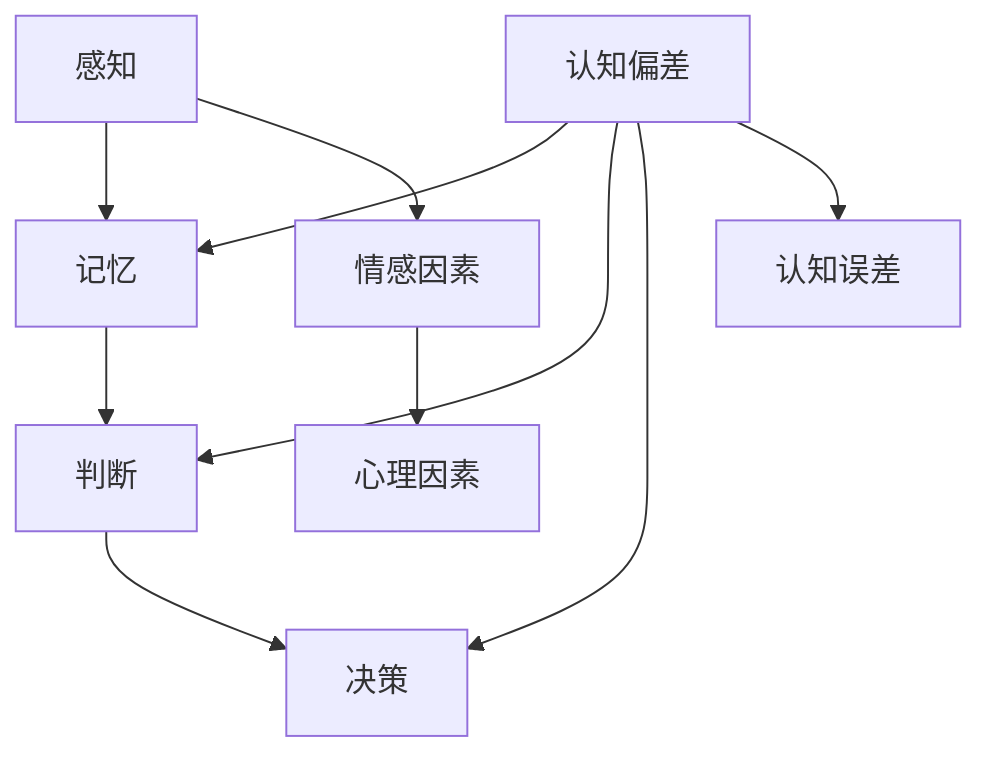
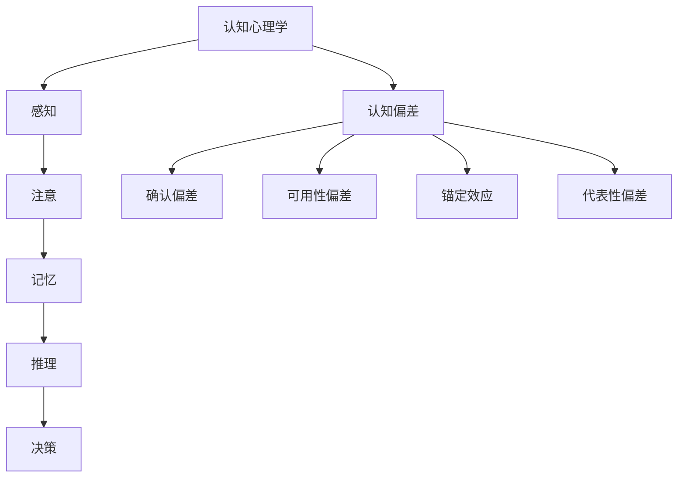
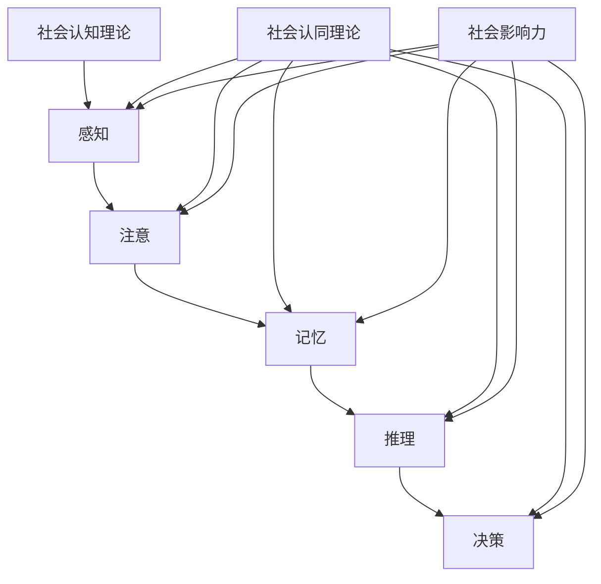
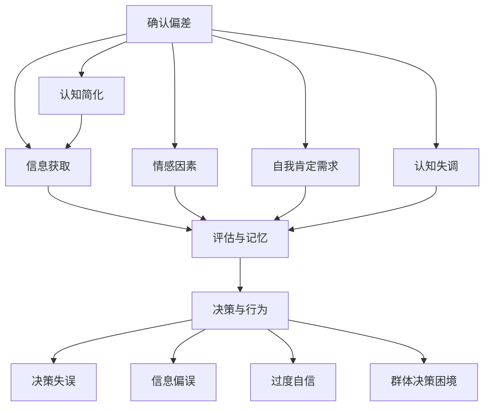
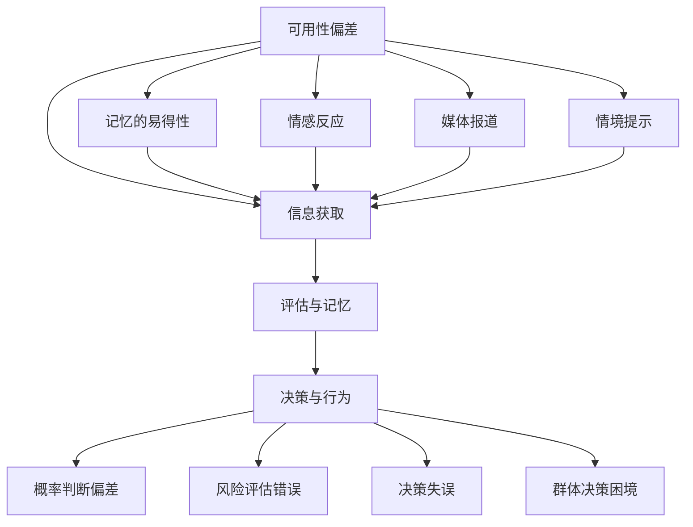
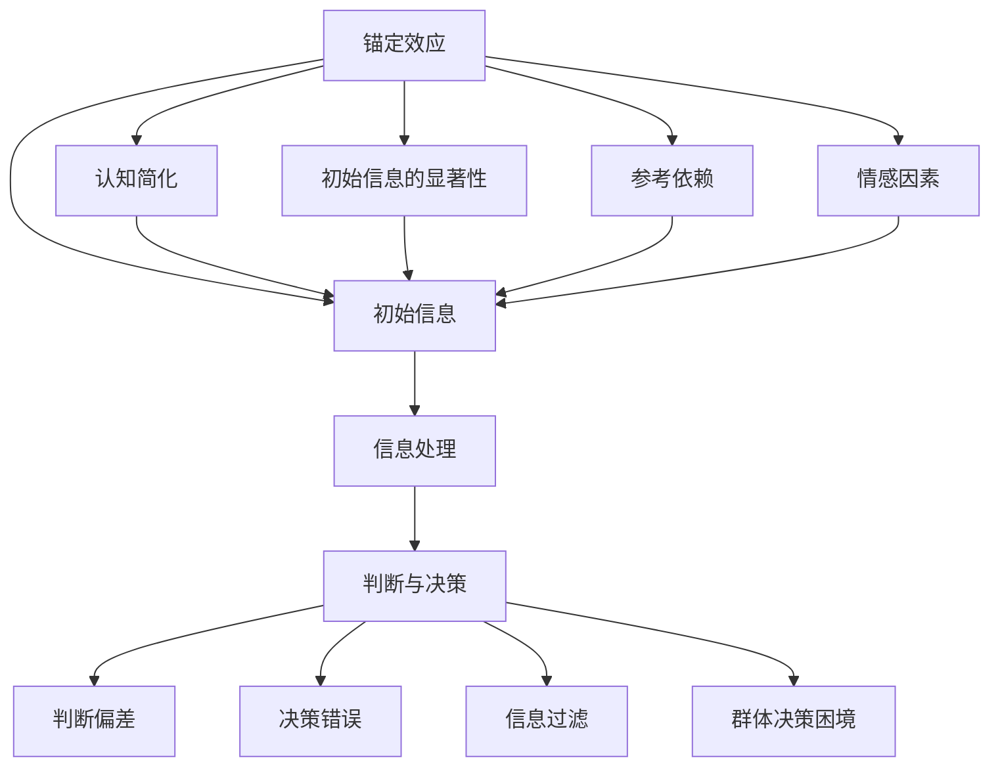
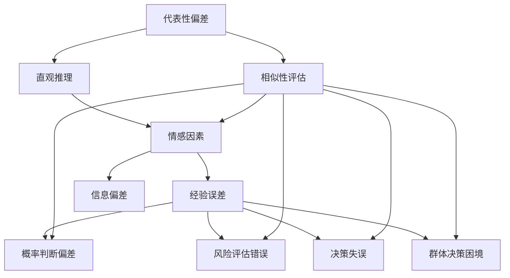
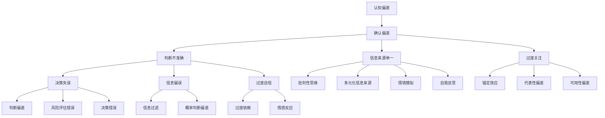
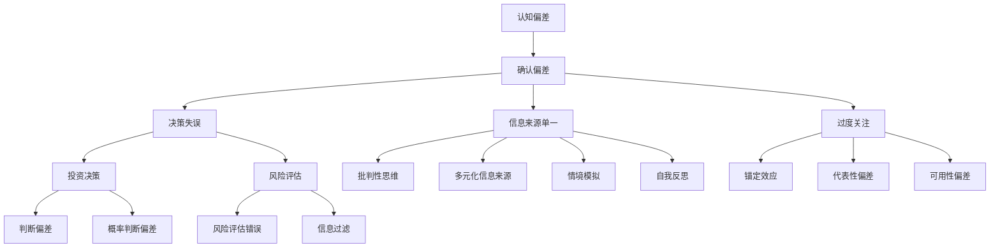
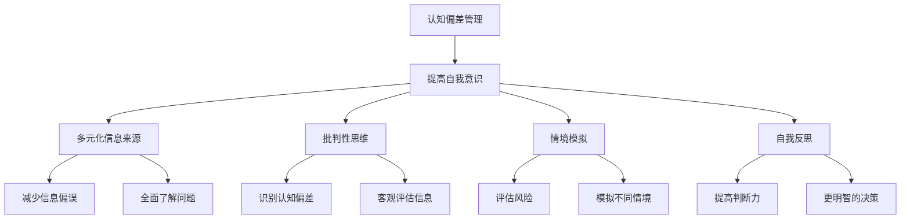

                 

### 《认知偏差：影响决策的隐形力量》

> **关键词：认知偏差，决策，心理学，社会影响力，算法检测**

> **摘要：**
> 本文将深入探讨认知偏差这一现象，它是指人们在感知、记忆、判断和决策过程中由于各种心理和社会因素产生的系统性的错误。本文首先定义了认知偏差的概念，随后详细介绍了几种常见的认知偏差类型及其影响，通过心理学和社会心理学的基础理论，揭示了这些偏差的成因。文章还通过具体的数学模型、伪代码和实际项目案例，展示了如何检测和管理认知偏差，从而为读者提供了一套完整的认知偏差管理策略。最终，本文总结了认知偏差研究的实验方法和测量工具，并推荐了相关参考资料，以供进一步学习和研究。

----------------------------------------------------------------

### 《认知偏差：影响决策的隐形力量》目录大纲

本文将按以下结构进行展开：

#### 第一部分：认知偏差基础

- **第1章：认知偏差概述**
  - 1.1 认知偏差的定义
  - 1.2 认知偏差的基本类型
  - 1.3 认知偏差的影响

- **第2章：心理学基础**
  - 2.1 认知心理学简介
  - 2.2 认知过程与认知偏差
  - 2.3 心理学实验与认知偏差

- **第3章：社会心理学与认知偏差**
  - 3.1 社会认知理论
  - 3.2 社会认同与认知偏差
  - 3.3 社会影响力与认知偏差

#### 第二部分：常见认知偏差分析

- **第4章：确认偏差**
  - 4.1 确认偏差的定义
  - 4.2 确认偏差的成因
  - 4.3 确认偏差的影响
  - 4.4 克服确认偏差的策略

- **第5章：可用性偏差**
  - 5.1 可用性偏差的定义
  - 5.2 可用性偏差的成因
  - 5.3 可用性偏差的影响
  - 5.4 克服可用性偏差的策略

- **第6章：锚定效应**
  - 6.1 锚定效应的定义
  - 6.2 锚定效应的成因
  - 6.3 锚定效应的影响
  - 6.4 克服锚定效应的策略

- **第7章：代表性偏差**
  - 7.1 代表性偏差的定义
  - 7.2 代表性偏差的成因
  - 7.3 代表性偏差的影响
  - 7.4 克服代表性偏差的策略

#### 第三部分：认知偏差与决策

- **第8章：认知偏差与判断**
  - 8.1 认知偏差对判断的影响
  - 8.2 基于认知偏差的判断案例分析
  - 8.3 提高判断质量的策略

- **第9章：认知偏差与决策**
  - 9.1 认知偏差对决策的影响
  - 9.2 基于认知偏差的决策案例分析
  - 9.3 提高决策质量的策略

- **第10章：认知偏差管理**
  - 10.1 认知偏差管理的意义
  - 10.2 认知偏差管理的策略
  - 10.3 认知偏差管理案例分析

#### 附录

- **附录A：认知偏差研究方法**
  - A.1 实验设计
  - A.2 数据分析方法
  - A.3 研究案例介绍

- **附录B：常见认知偏差测量工具**
  - B.1 智力测试
  - B.2 自我评估问卷
  - B.3 实际案例中的应用

- **附录C：参考资料**
  - C.1 推荐阅读
  - C.2 参考文献
  - C.3 网络资源链接

### 第一部分：认知偏差基础

#### 第1章：认知偏差概述

**1.1 认知偏差的定义**

认知偏差（Cognitive Bias）是指人们在感知、记忆、判断和决策过程中由于各种心理和社会因素产生的系统性的错误。这些错误并非随机发生，而是由于大脑在处理信息时，为了提高效率和简化认知负荷，采用了某些简化的信息处理规则。这些规则虽然有助于我们快速做出决策，但在某些情况下会导致认知偏差。

认知偏差可以看作是一种“认知误差”，即我们在感知和解释信息时，由于某些心理和情感因素而产生的错误。这些偏差可能是无意识的，也可能是出于某种策略性目的。例如，人们在面对不确定的情况时，往往会倾向于寻求确定性，这种倾向可能导致确认偏差（Confirmation Bias）。

**1.2 认知偏差的基本类型**

认知偏差有很多类型，以下是其中几种常见的认知偏差：

- **确认偏差（Confirmation Bias）**：人们倾向于寻求、解释和记住支持自己观点的信息，同时忽略或贬低反对自己观点的信息。
- **可用性偏差（Availability Bias）**：人们根据信息的易得性和显著性来评估其概率和重要性，易得的信息往往被高估。
- **锚定效应（Anchoring Effect）**：人们在做出判断时受到最初信息（锚点）的影响，即使这个锚点并不重要或与问题无关。
- **代表性偏差（Representativeness Bias）**：人们根据事物的相似性来评估其概率，而不是根据概率的数学定义。

**1.3 认知偏差的影响**

认知偏差对决策的影响是深远且广泛的。它可能导致以下问题：

- **决策失误**：由于认知偏差，人们可能会做出错误的决策，从而带来负面的结果。
- **信息偏误**：认知偏差使人们难以客观评估信息，从而导致信息偏误。
- **过度自信**：人们可能会高估自己的判断能力，从而做出更冒险的决策。
- **社会困境**：在群体决策中，认知偏差可能导致群体共识的形成，但这种共识往往不是最优的。

**认知偏差管理的重要性**

由于认知偏差的普遍存在，管理认知偏差变得至关重要。有效的认知偏差管理可以帮助我们：

- **提高决策质量**：通过识别和克服认知偏差，我们可以做出更合理的决策。
- **减少信息偏误**：通过采用更科学的评估方法，我们可以减少信息偏误。
- **提升判断力**：通过学习认知偏差的类型和成因，我们可以提升自己的判断力。
- **促进社会和谐**：通过提高个体的认知水平，我们可以减少群体决策中的社会困境。

在接下来的章节中，我们将详细探讨认知偏差的心理学基础、常见认知偏差的分析，以及如何在实际决策中管理认知偏差。

**核心概念与联系**

为了更好地理解认知偏差，我们可以使用Mermaid流程图来展示其核心概念和联系：

在这个流程图中，我们看到了感知、记忆、判断和决策四个关键环节，它们共同构成了认知偏差的路径。同时，情感因素和心理因素也是影响认知偏差的重要因素。

通过这个流程图，我们可以更清晰地理解认知偏差的成因和影响，从而为后续章节的讨论打下基础。

#### 第2章：心理学基础

**2.1 认知心理学简介**

认知心理学是心理学的一个分支，主要研究人的认知过程，包括感知、记忆、注意、判断和决策等。它关注的是人类如何获取、处理和存储信息，以及如何使用这些信息来指导行为。认知心理学与传统的行为心理学不同，后者主要关注外部行为，而认知心理学更关注内部心理过程。

认知心理学的兴起可以追溯到20世纪50年代，当时心理学家开始质疑行为主义理论，认为行为主义忽视了人类内在的心理过程。认知心理学的核心观点是，人类行为不仅由外部刺激决定，还受到内部认知过程的驱动。

**2.2 认知过程与认知偏差**

认知过程是认知心理学研究的核心内容。认知过程包括感知、注意、记忆、推理和决策等多个环节。以下是这些关键认知过程的简要概述：

- **感知**：感知是指人们通过感官接收外部信息并将其转化为内部认知表征的过程。感知过程中可能存在多种认知偏差，如确认偏差和可用性偏差。
- **注意**：注意是认知资源的一种分配机制，它决定了哪些信息会被加工处理。注意过程中可能出现的认知偏差包括注意力分散和选择性注意。
- **记忆**：记忆是指人们存储、保持和回忆信息的能力。记忆过程中可能出现的认知偏差包括记忆偏差和遗忘偏差。
- **推理**：推理是指人们根据已有信息进行逻辑思考和推断的过程。推理过程中可能出现的认知偏差包括确认偏差和代表性偏差。
- **决策**：决策是指人们在多个选项中选择最佳行动的过程。决策过程中可能出现的认知偏差包括锚定效应和过度自信。

**2.3 心理学实验与认知偏差**

心理学实验是研究认知偏差的重要方法。通过设计实验，心理学家可以控制变量，观察和测量人们在特定情境下的认知行为。以下是一些经典的心理学实验，它们揭示了认知偏差的存在和影响：

- **确认偏差实验**：Oneill和Snyder（1975）通过实验发现，人们在评估事件的可能性时，更倾向于接受支持自己观点的证据，而忽略相反的证据。
- **可用性偏差实验**：Tversky和Kahneman（1973）通过实验发现，人们在评估事件概率时，更倾向于依赖容易获取的信息，从而导致概率判断的偏差。
- **锚定效应实验**：Kahneman和Tversky（1973）通过实验发现，人们在做出判断时，容易受到最初信息的影响，即使这些信息并不重要。
- **代表性偏差实验**：Lichtenstein和Slovic（1971）通过实验发现，人们在评估事件概率时，倾向于根据事件的代表性进行判断，而忽略了实际概率。

**心理学实验在认知偏差研究中的作用**

心理学实验在认知偏差研究中起着至关重要的作用。通过实验，心理学家可以：

- **验证理论**：实验结果可以验证或否定某一认知偏差理论，从而推动认知心理学的发展。
- **发现新偏差**：实验可以帮助心理学家发现新的认知偏差，从而丰富对人类认知过程的理解。
- **指导实践**：实验结果可以为实际应用提供指导，帮助人们识别和克服认知偏差，提高决策质量。

总之，心理学基础为认知偏差的研究提供了重要的理论支持和实验方法。通过理解认知过程和心理学实验，我们可以更深入地探讨认知偏差的成因和影响，为实际决策提供科学依据。

**核心概念与联系**

为了更好地理解认知偏差的心理学基础，我们可以使用Mermaid流程图来展示核心概念和联系：

在这个流程图中，我们看到了认知心理学和认知偏差之间的紧密联系。认知心理学的研究对象是感知、注意、记忆、推理和决策等认知过程，而认知偏差则是在这些过程中产生的系统性错误。通过这个流程图，我们可以更清晰地理解认知偏差的成因和影响，为后续章节的讨论打下基础。

#### 第3章：社会心理学与认知偏差

**3.1 社会认知理论**

社会认知理论（Social Cognitive Theory，简称SCT）是解释人类行为的一种理论框架，它由阿尔伯特·班杜拉（Albert Bandura）在1977年提出。SCT认为，人的行为是个人认知、社会互动和环境因素共同作用的结果。这一理论强调了认知过程在社会行为中的核心作用，特别是人们如何通过观察、思维和反思来理解和适应社会环境。

在社会认知理论中，认知偏差是一个重要的概念。SCT认为，人们的思维过程受到多种认知偏差的影响，这些偏差会导致人们对信息的处理和解释出现系统性错误。例如，确认偏差、可用性偏差和代表性偏差等，都是社会认知理论中的典型认知偏差。

**3.2 社会认同与认知偏差**

社会认同（Social Identity）是指个体在群体中所获得的一种身份认同感。社会认同理论由社会心理学家亨利·泰弗尔（Henri Tajfel）和约翰·特纳（John Turner）在1979年提出。该理论认为，个体会将自我认同与所属的群体联系起来，从而形成社会认同。社会认同不仅影响个体的自我评价，还影响其行为和决策。

在社会认同过程中，认知偏差发挥着重要作用。例如，群体成员往往会表现出确认偏差，即倾向于接受和支持群体观点，而忽视或贬低相反的观点。这种倾向可能导致群体决策的偏见，影响个体的判断力和决策质量。

**3.3 社会影响力与认知偏差**

社会影响力（Social Influence）是指个体行为受到他人影响的现象。社会影响力可以通过多种渠道发挥作用，包括直接的社会互动、媒体传播和群体压力等。社会影响力对认知偏差的产生和影响具有重要意义。

首先，社会影响力可以加剧某些认知偏差。例如，在群体决策中，群体压力可能导致个体放弃自己的独立判断，从而表现出群体思维（Groupthink）。这种情况下，个体可能忽视认知偏差，导致决策质量下降。

其次，社会影响力可以缓解某些认知偏差。例如，通过与他人交流和讨论，个体可以反思自己的判断和决策，从而发现和纠正认知偏差。此外，社会影响力还可以促进个体对新信息和观点的接受，有助于扩大认知视野，减少信息偏误。

**社会心理学与认知偏差的关系**

社会心理学与认知偏差之间存在着密切的关系。社会心理学研究人类在社会互动中的认知过程，而认知偏差则是这些过程中常见的系统性错误。社会心理学理论为理解认知偏差的成因和影响提供了重要的框架，例如社会认同理论和社会影响力理论。

此外，社会心理学还揭示了认知偏差在实际决策中的重要作用。通过理解社会认同和社会影响力，我们可以更好地识别和克服认知偏差，提高决策质量。例如，通过促进群体内的开放讨论和反思，可以减少群体思维和决策偏见。

总之，社会心理学与认知偏差之间相互影响，共同构成了人类行为和决策的复杂图景。通过深入理解社会心理学原理，我们可以更好地管理认知偏差，做出更明智的决策。

**核心概念与联系**

为了更好地理解社会心理学与认知偏差的关系，我们可以使用Mermaid流程图来展示核心概念和联系：

在这个流程图中，我们看到了社会认知理论、社会认同理论和社会影响力理论三个核心概念，它们共同作用于感知、注意、记忆、推理和决策等认知过程，导致认知偏差的产生。通过这个流程图，我们可以更清晰地理解社会心理学与认知偏差之间的复杂关系，为后续章节的讨论提供基础。

### 第二部分：常见认知偏差分析

#### 第4章：确认偏差

**4.1 确认偏差的定义**

确认偏差（Confirmation Bias）是指人们在获取、评估和记住信息时，倾向于寻求、解释和记住那些支持自己已有观点的信息，同时忽视或贬低那些反对自己观点的信息。确认偏差是一种常见的认知偏差，它使人们陷入“选择性接受”信息的陷阱，导致判断和决策的偏差。

确认偏差的根源可以追溯到人类大脑的信息处理机制。为了提高认知效率和减少信息处理的负担，大脑往往会采用“确认性搜索”策略，即优先关注那些能够验证已有观点的信息。这种策略虽然有助于快速形成和维持信念，但在面对复杂和不确定的情况时，容易导致认知偏差。

**4.2 确认偏差的成因**

确认偏差的成因可以从以下几个方面进行解释：

- **认知简化**：大脑为了处理海量信息，往往采用简化的信息处理规则。确认偏差是这些规则的一种表现形式，它帮助人们快速判断和决策，但可能导致系统性错误。
- **情感因素**：情感因素在确认偏差中起着重要作用。人们往往对与自己观点相关的内容产生更强的情感反应，从而更倾向于接受和记住这些信息。
- **自我肯定需求**：人们有自我肯定的内在需求，倾向于维护和增强自己的观点和信念。确认偏差正是为了满足这种需求，使人们更愿意接受支持自己观点的信息。
- **认知失调**：当人们面临与自己观点相矛盾的信息时，会感到认知失调。为了减少这种不适感，人们往往会采取选择性接受信息的策略，从而避免认知失调。

**4.3 确认偏差的影响**

确认偏差对人们的认知和行为产生深远影响，主要表现在以下几个方面：

- **决策失误**：确认偏差可能导致人们在决策过程中忽视关键信息，从而导致决策失误。例如，在投资决策中，投资者可能会过分关注那些支持自己投资决策的信息，而忽视风险因素，从而可能导致损失。
- **信息偏误**：确认偏差使人们难以客观评估信息，容易产生信息偏误。人们可能会高估支持自己观点的信息的可靠性和重要性，低估反对自己观点的信息。
- **过度自信**：确认偏差可能导致人们高估自己的判断能力，产生过度自信。例如，在评估自己的学术成绩时，学生可能会过分关注那些支持自己成绩优秀的信息，而忽视其他可能的影响因素。
- **群体决策困境**：在群体决策中，确认偏差可能导致群体共识的形成，但这种共识往往不是最优的。群体成员倾向于接受支持群体观点的信息，忽视其他可能的解决方案，从而影响决策质量。

**4.4 克服确认偏差的策略**

为了克服确认偏差，我们可以采取以下策略：

- **多元化信息来源**：确保获取信息的来源多样化，避免单一信息源带来的偏差。通过阅读不同的观点和文献，可以减少确认偏差的影响。
- **批判性思维**：培养批判性思维能力，对信息进行客观评估，避免盲目接受支持自己观点的信息。通过质疑和反思，可以减少确认偏差。
- **自我反思**：定期进行自我反思，审视自己的观点和信念，识别和纠正潜在的确认偏差。通过反思，可以更客观地评估信息，提高决策质量。
- **群体讨论**：在群体决策中，鼓励开放讨论和辩论，促进不同观点的交流和碰撞。通过群体讨论，可以减少确认偏差，提高决策质量。

总之，确认偏差是一种常见的认知偏差，它对人们的决策和行为产生负面影响。通过采取多元化信息来源、批判性思维、自我反思和群体讨论等策略，我们可以克服确认偏差，提高决策质量。

**核心概念与联系**

为了更好地理解确认偏差的概念和影响，我们可以使用Mermaid流程图来展示核心概念和联系：

在这个流程图中，我们看到了确认偏差的核心概念和其影响路径。通过这个流程图，我们可以更清晰地理解确认偏差的成因和影响，为后续章节的讨论提供基础。

#### 第5章：可用性偏差

**5.1 可用性偏差的定义**

可用性偏差（Availability Bias）是指人们在评估事件概率或重要性时，倾向于依赖那些容易在脑海中回想起来的信息，而不是基于实际发生的频率或统计概率。这种偏差使人们更倾向于高估那些容易获取的信息，从而低估那些不易获取的信息。

可用性偏差的根源在于大脑的信息处理机制。由于人类记忆系统对容易获取的信息具有更高的注意力和记忆权重，因此这些信息在评估过程中被过分重视。这种偏差可能导致人们在决策和判断中产生系统性错误。

**5.2 可用性偏差的成因**

可用性偏差的成因可以从以下几个方面进行解释：

- **记忆的易得性**：人们更容易记住那些经常出现或具有高度显著性的事件。因此，这些事件的概率在评估时被高估。
- **情感反应**：与负面事件相比，负面事件往往具有更高的情感反应性和显著性，因此更容易在脑海中浮现。这导致人们对负面事件的概率和影响产生过度关注。
- **媒体报道**：媒体报道往往强调那些具有高度关注度和戏剧性的事件，从而影响公众对这些事件的认知和评估。
- **情境提示**：某些情境提示（如新闻标题、广告等）可能会激活特定类型的记忆，从而影响人们对相关事件的评估。

**5.3 可用性偏差的影响**

可用性偏差对人们的认知和行为产生重要影响，主要表现在以下几个方面：

- **概率判断偏差**：可用性偏差可能导致人们对某些事件的概率判断产生系统性偏差。例如，人们可能高估某些罕见事件（如自然灾害）的概率，而低估某些常见事件（如日常事故）的概率。
- **风险评估错误**：在风险评估过程中，可用性偏差可能导致人们过分关注那些容易获取的信息，从而忽视实际的风险因素。例如，在投资决策中，人们可能过分关注某些负面新闻，而忽视长期的投资趋势。
- **决策失误**：可用性偏差可能导致人们在决策过程中忽视关键信息，从而导致决策失误。例如，在招聘决策中，人们可能过分依赖候选人的先前经历，而忽视其他重要的评估指标。
- **群体决策困境**：在群体决策中，可用性偏差可能导致群体成员对某一事件的评估产生偏差，从而影响决策质量。例如，在危机管理中，群体成员可能会过分关注那些具有高度显著性的信息，从而导致决策失误。

**5.4 克服可用性偏差的策略**

为了克服可用性偏差，我们可以采取以下策略：

- **统计数据分析**：通过收集和分析实际数据，可以减少对可用性偏差的依赖。例如，在投资决策中，可以通过分析历史数据来评估投资风险，而不是仅仅依赖媒体报道。
- **多元化信息来源**：确保获取信息的来源多样化，避免单一信息源带来的偏差。通过阅读不同的观点和文献，可以减少可用性偏差的影响。
- **情境模拟**：通过情境模拟，可以更好地评估事件的实际概率和影响。例如，在风险评估中，可以模拟不同情境下的可能结果，从而更客观地评估风险。
- **自我反思**：定期进行自我反思，审视自己的观点和信念，识别和纠正潜在的可用性偏差。通过反思，可以更客观地评估信息，提高决策质量。

总之，可用性偏差是一种常见的认知偏差，它对人们的判断和决策产生负面影响。通过采取统计数据分析、多元化信息来源、情境模拟和自我反思等策略，我们可以克服可用性偏差，提高决策质量。

**核心概念与联系**

为了更好地理解可用性偏差的概念和影响，我们可以使用Mermaid流程图来展示核心概念和联系：

在这个流程图中，我们看到了可用性偏差的核心概念和其影响路径。通过这个流程图，我们可以更清晰地理解可用性偏差的成因和影响，为后续章节的讨论提供基础。

#### 第6章：锚定效应

**6.1 锚定效应的定义**

锚定效应（Anchoring Effect）是指人们在做出判断或决策时，受到初始信息（锚点）的影响，即使这个锚点并不重要或与问题无关。锚定效应是一种认知偏差，它使人们在信息处理过程中倾向于依赖初始信息，从而影响最终的判断和决策。

锚定效应的根源可以追溯到人类大脑的信息处理机制。为了简化信息处理，大脑往往会采用“锚定”策略，即利用初始信息作为参考点，从而进行后续的信息评估。这种策略虽然有助于快速做出判断，但可能导致系统性错误。

**6.2 锚定效应的成因**

锚定效应的成因可以从以下几个方面进行解释：

- **认知简化**：大脑为了处理海量信息，往往采用简化的信息处理规则。锚定效应是这些规则的一种表现形式，它帮助人们快速做出判断，但可能导致系统性错误。
- **初始信息的显著性**：初始信息往往具有更高的显著性，容易在人们的记忆中留下深刻印象。因此，人们在后续信息处理过程中，更容易受到初始信息的影响。
- **参考依赖**：人们在评估信息时，往往依赖于已有的参考点。初始信息作为一种参考点，会影响人们对后续信息的判断和评估。
- **情感因素**：情感因素在锚定效应中起着重要作用。与初始信息相关的情感反应可能会加强锚定效应，使人们在信息处理过程中更倾向于依赖初始信息。

**6.3 锚定效应的影响**

锚定效应对人们的认知和行为产生重要影响，主要表现在以下几个方面：

- **判断偏差**：锚定效应可能导致人们在判断过程中产生偏差。例如，在价格谈判中，初始报价可能会影响人们对最终报价的评估，即使这个初始报价并不合理。
- **决策错误**：锚定效应可能导致人们在决策过程中产生错误。例如，在投资决策中，投资者可能会过分依赖历史股价作为参考，从而导致错误的决策。
- **信息过滤**：锚定效应可能导致人们对后续信息进行过滤，从而忽视与初始信息不一致的信息。这种信息过滤效应会影响人们的判断和决策质量。
- **群体决策困境**：在群体决策中，锚定效应可能导致群体成员对某一问题的评估产生偏差，从而影响决策质量。例如，在团队讨论中，某个成员的初始观点可能会影响整个团队的判断和决策。

**6.4 克服锚定效应的策略**

为了克服锚定效应，我们可以采取以下策略：

- **多样化信息来源**：确保获取信息的来源多样化，避免单一信息源带来的偏差。通过阅读不同的观点和文献，可以减少锚定效应的影响。
- **明确问题框架**：在做出判断或决策前，明确问题框架，避免受到无关信息的干扰。通过明确问题，可以减少初始信息对判断的影响。
- **自我反思**：定期进行自我反思，审视自己的观点和信念，识别和纠正潜在的锚定效应。通过反思，可以更客观地评估信息，提高决策质量。
- **使用统计方法**：在决策过程中，使用统计方法来评估信息，减少对初始信息的依赖。例如，在投资决策中，可以通过计算预期收益和风险来评估投资机会，而不是仅仅依赖历史数据。

总之，锚定效应是一种常见的认知偏差，它对人们的判断和决策产生负面影响。通过采取多样化信息来源、明确问题框架、自我反思和使用统计方法等策略，我们可以克服锚定效应，提高决策质量。

**核心概念与联系**

为了更好地理解锚定效应的概念和影响，我们可以使用Mermaid流程图来展示核心概念和联系：

在这个流程图中，我们看到了锚定效应的核心概念和其影响路径。通过这个流程图，我们可以更清晰地理解锚定效应的成因和影响，为后续章节的讨论提供基础。

#### 第7章：代表性偏差

**7.1 代表性偏差的定义**

代表性偏差（Representativeness Bias）是指人们在评估事件概率或重要性时，倾向于根据事物的相似性来评估其概率，而不是基于实际发生的频率或统计概率。这种偏差使人们更倾向于高估那些与自己期望相似的情境，从而低估实际概率。

代表性偏差的根源在于人类大脑的推理机制。为了简化复杂的问题，大脑往往采用“代表性”这一直观的评估方式，即通过比较事物的相似性来做出判断。这种策略虽然有助于快速做出判断，但可能导致系统性错误。

**7.2 代表性偏差的成因**

代表性偏差的成因可以从以下几个方面进行解释：

- **直观推理**：人类大脑在处理信息时，往往采用直观的推理方式。代表性偏差是这种直观推理方式的一种表现形式，它使人们更倾向于依赖直觉和经验，而不是基于事实和数据。
- **情感因素**：情感因素在代表性偏差中起着重要作用。与某些情境相关的情感反应可能会增强代表性偏差，使人们更倾向于高估这些情境的概率。
- **经验误差**：人们在日常生活中形成的经验和信念，往往会影响他们对事件概率的评估。代表性偏差可能导致人们高估某些情境的发生概率，而低估其他情境。
- **信息偏差**：在获取和处理信息时，人们可能会受到信息偏差的影响。例如，媒体报道往往强调某些具有代表性的事件，从而影响人们对事件概率的评估。

**7.3 代表性偏差的影响**

代表性偏差对人们的认知和行为产生重要影响，主要表现在以下几个方面：

- **概率判断偏差**：代表性偏差可能导致人们对某些事件的概率判断产生系统性偏差。例如，人们可能高估某些具有代表性的事件（如自然灾害）的概率，而低估某些常见事件（如日常事故）的概率。
- **风险评估错误**：在风险评估过程中，代表性偏差可能导致人们过分关注那些具有代表性的信息，从而忽视实际的风险因素。例如，在投资决策中，人们可能过分关注某些代表性风险事件，而忽视其他潜在的风险因素。
- **决策失误**：代表性偏差可能导致人们在决策过程中产生错误。例如，在招聘决策中，人们可能过分依赖候选人的代表性特征（如学历、经验），而忽视其他重要的评估指标。
- **群体决策困境**：在群体决策中，代表性偏差可能导致群体成员对某一问题的评估产生偏差，从而影响决策质量。例如，在团队讨论中，某个成员的代表性观点可能会影响整个团队的判断和决策。

**7.4 克服代表性偏差的策略**

为了克服代表性偏差，我们可以采取以下策略：

- **统计数据分析**：通过收集和分析实际数据，可以减少对代表性偏差的依赖。例如，在投资决策中，可以通过分析历史数据来评估投资风险，而不是仅仅依赖直觉。
- **多元化信息来源**：确保获取信息的来源多样化，避免单一信息源带来的偏差。通过阅读不同的观点和文献，可以减少代表性偏差的影响。
- **情境模拟**：通过情境模拟，可以更好地评估事件的实际概率和影响。例如，在风险评估中，可以模拟不同情境下的可能结果，从而更客观地评估风险。
- **自我反思**：定期进行自我反思，审视自己的观点和信念，识别和纠正潜在的代表性偏差。通过反思，可以更客观地评估信息，提高决策质量。

总之，代表性偏差是一种常见的认知偏差，它对人们的判断和决策产生负面影响。通过采取统计数据分析、多元化信息来源、情境模拟和自我反思等策略，我们可以克服代表性偏差，提高决策质量。

**核心概念与联系**

为了更好地理解代表性偏差的概念和影响，我们可以使用Mermaid流程图来展示核心概念和联系：

在这个流程图中，我们看到了代表性偏差的核心概念和其影响路径。通过这个流程图，我们可以更清晰地理解代表性偏差的成因和影响，为后续章节的讨论提供基础。

### 第三部分：认知偏差与决策

#### 第8章：认知偏差与判断

**8.1 认知偏差对判断的影响**

认知偏差对判断的影响是深远且广泛的。认知偏差使得人们在判断过程中容易出现系统性错误，导致判断不准确。以下是几种常见的认知偏差及其对判断的影响：

- **确认偏差**：确认偏差使人们倾向于接受支持自己观点的信息，忽视或贬低反对自己观点的信息。这导致人们难以客观评估信息，从而做出错误的判断。
- **可用性偏差**：可用性偏差使人们倾向于依赖容易获取的信息来评估事件概率，导致对概率的判断出现偏差。人们往往高估那些容易在脑海中浮现的事件，而低估实际发生的频率。
- **锚定效应**：锚定效应使人们在做出判断时容易受到初始信息的影响，即使这些信息并不重要或与问题无关。人们可能会过分依赖锚点，从而影响判断的准确性。
- **代表性偏差**：代表性偏差使人们根据事物的相似性来评估其概率，导致对概率的判断出现偏差。人们往往高估与自己期望相似的情境，而低估实际概率。

这些认知偏差共同作用于人们的判断过程，导致判断不准确。例如，在投资决策中，投资者可能会因为确认偏差而过分关注某些新闻或消息，忽视市场的基本面分析，从而导致投资决策失误。同样，在风险评估中，人们可能会因为可用性偏差而过分关注某些极端事件，忽视日常风险因素，从而高估风险。

**8.2 基于认知偏差的判断案例分析**

为了更好地理解认知偏差对判断的影响，我们可以通过以下案例分析：

案例一：投资决策
某投资者在看到某支股票的新闻报道后，认为该股票具有很大的投资潜力，从而决定大量购买。然而，投资者忽视了该股票的财务报表和行业分析，仅仅因为新闻报道的积极评价而做出投资决策。这个案例中，投资者表现出了确认偏差和锚定效应。由于确认偏差，投资者过分关注新闻报道，忽视其他信息；由于锚定效应，投资者过分依赖新闻报道的初始信息，从而做出了错误的判断。

案例二：风险评估
某公司高管在评估某项新业务的风险时，过分关注了最近一次类似业务失败的事件，认为该新业务也面临同样的风险。然而，高管忽视了业务本身的特性和市场环境的变化，从而高估了新业务的风险。这个案例中，高管表现出了代表性偏差。由于代表性偏差，高管根据过去的失败案例来判断新业务的风险，而没有考虑新业务的具体情况。

**8.3 提高判断质量的策略**

为了提高判断质量，克服认知偏差的影响，我们可以采取以下策略：

- **多元化信息来源**：确保获取信息的来源多样化，避免单一信息源带来的偏差。通过阅读不同的观点和文献，可以减少认知偏差的影响。
- **批判性思维**：培养批判性思维能力，对信息进行客观评估，避免盲目接受支持自己观点的信息。通过质疑和反思，可以减少认知偏差。
- **情境模拟**：通过情境模拟，可以更好地评估事件的实际概率和影响。例如，在风险评估中，可以模拟不同情境下的可能结果，从而更客观地评估风险。
- **自我反思**：定期进行自我反思，审视自己的观点和信念，识别和纠正潜在的认知偏差。通过反思，可以更客观地评估信息，提高决策质量。

总之，认知偏差对判断的影响是显著的，它可能导致判断不准确。通过采取多元化信息来源、批判性思维、情境模拟和自我反思等策略，我们可以克服认知偏差，提高判断质量。

**核心概念与联系**

为了更好地理解认知偏差对判断的影响，我们可以使用Mermaid流程图来展示核心概念和联系：

在这个流程图中，我们看到了认知偏差对判断的影响路径。通过这个流程图，我们可以更清晰地理解认知偏差的成因和影响，为后续章节的讨论提供基础。

#### 第9章：认知偏差与决策

**9.1 认知偏差对决策的影响**

认知偏差对决策的影响是深远且广泛的。认知偏差使得人们在决策过程中容易出现系统性错误，导致决策质量下降。以下是几种常见的认知偏差及其对决策的影响：

- **确认偏差**：确认偏差使人们倾向于接受支持自己观点的信息，忽视或贬低反对自己观点的信息。这导致人们难以客观评估信息，从而做出决策失误。
- **可用性偏差**：可用性偏差使人们倾向于依赖容易获取的信息来评估事件概率，导致对概率的判断出现偏差。人们往往高估那些容易在脑海中浮现的事件，而低估实际发生的频率。
- **锚定效应**：锚定效应使人们在做出决策时容易受到初始信息的影响，即使这些信息并不重要或与问题无关。人们可能会过分依赖锚点，从而影响决策的准确性。
- **代表性偏差**：代表性偏差使人们根据事物的相似性来评估其概率，导致对概率的判断出现偏差。人们往往高估与自己期望相似的情境，而低估实际概率。

这些认知偏差共同作用于人们的决策过程，导致决策质量下降。例如，在投资决策中，投资者可能会因为确认偏差而过分关注某些新闻或消息，忽视市场的基本面分析，从而导致投资决策失误。同样，在风险评估中，人们可能会因为可用性偏差而过分关注某些极端事件，忽视日常风险因素，从而高估风险。

**9.2 基于认知偏差的决策案例分析**

为了更好地理解认知偏差对决策的影响，我们可以通过以下案例分析：

案例一：投资决策
某投资者在看到某支股票的新闻报道后，认为该股票具有很大的投资潜力，从而决定大量购买。然而，投资者忽视了该股票的财务报表和行业分析，仅仅因为新闻报道的积极评价而做出投资决策。这个案例中，投资者表现出了确认偏差和锚定效应。由于确认偏差，投资者过分关注新闻报道，忽视其他信息；由于锚定效应，投资者过分依赖新闻报道的初始信息，从而做出了错误的决策。

案例二：风险评估
某公司高管在评估某项新业务的风险时，过分关注了最近一次类似业务失败的事件，认为该新业务也面临同样的风险。然而，高管忽视了业务本身的特性和市场环境的变化，从而高估了新业务的风险。这个案例中，高管表现出了代表性偏差。由于代表性偏差，高管根据过去的失败案例来判断新业务的风险，而没有考虑新业务的具体情况。

**9.3 提高决策质量的策略**

为了提高决策质量，克服认知偏差的影响，我们可以采取以下策略：

- **多元化信息来源**：确保获取信息的来源多样化，避免单一信息源带来的偏差。通过阅读不同的观点和文献，可以减少认知偏差的影响。
- **批判性思维**：培养批判性思维能力，对信息进行客观评估，避免盲目接受支持自己观点的信息。通过质疑和反思，可以减少认知偏差。
- **情境模拟**：通过情境模拟，可以更好地评估事件的实际概率和影响。例如，在风险评估中，可以模拟不同情境下的可能结果，从而更客观地评估风险。
- **自我反思**：定期进行自我反思，审视自己的观点和信念，识别和纠正潜在的认知偏差。通过反思，可以更客观地评估信息，提高决策质量。

总之，认知偏差对决策的影响是显著的，它可能导致决策质量下降。通过采取多元化信息来源、批判性思维、情境模拟和自我反思等策略，我们可以克服认知偏差，提高决策质量。

**核心概念与联系**

为了更好地理解认知偏差对决策的影响，我们可以使用Mermaid流程图来展示核心概念和联系：

在这个流程图中，我们看到了认知偏差对决策的影响路径。通过这个流程图，我们可以更清晰地理解认知偏差的成因和影响，为后续章节的讨论提供基础。

### 第10章：认知偏差管理

**10.1 认知偏差管理的意义**

认知偏差管理在决策过程中具有重要意义。有效的认知偏差管理可以帮助我们识别、理解和克服认知偏差，从而提高决策质量和准确性。以下是认知偏差管理的几个关键意义：

- **提高决策质量**：通过识别和纠正认知偏差，决策者可以更客观地评估信息和情境，从而做出更合理的决策。例如，在投资决策中，通过管理确认偏差，投资者可以避免盲目跟风，而是基于全面的数据分析做出投资决策。
- **减少信息偏误**：认知偏差管理可以帮助决策者减少信息处理过程中的偏差，从而更准确地评估信息的重要性和相关性。例如，在风险评估中，通过管理可用性偏差，决策者可以避免过分关注某些极端事件，而是基于实际发生的频率来评估风险。
- **提升判断力**：认知偏差管理有助于提高决策者的判断力。通过学习和理解认知偏差的类型和成因，决策者可以更敏锐地识别和纠正潜在的偏差，从而做出更明智的决策。
- **促进团队合作**：在群体决策中，认知偏差管理有助于促进团队合作。通过识别和纠正个体和群体的认知偏差，团队成员可以更开放地交流观点，从而提高决策质量。

**10.2 认知偏差管理的策略**

为了有效地管理认知偏差，我们可以采取以下策略：

- **提高自我意识**：自我意识是认知偏差管理的基础。决策者需要意识到认知偏差的存在和可能影响，从而在决策过程中保持警惕。例如，在做出重要决策前，决策者可以花时间反思自己的观点和信念，识别潜在的认知偏差。
- **多元化信息来源**：确保获取信息的来源多样化，避免单一信息源带来的偏差。通过阅读不同的观点和文献，决策者可以更全面地了解问题的各个方面，从而减少信息偏误。
- **批判性思维**：培养批判性思维能力，对信息进行客观评估，避免盲目接受支持自己观点的信息。通过质疑和反思，决策者可以识别和纠正潜在的认知偏差。
- **情境模拟**：通过情境模拟，决策者可以更好地评估事件的实际概率和影响。例如，在风险评估中，决策者可以通过模拟不同情境下的可能结果，从而更客观地评估风险。
- **自我反思**：定期进行自我反思，审视自己的观点和信念，识别和纠正潜在的认知偏差。通过反思，决策者可以不断提高自己的认知水平，从而做出更明智的决策。

**10.3 认知偏差管理案例分析**

为了更好地理解认知偏差管理的实际应用，我们可以通过以下案例分析：

案例一：投资决策
某投资者在面临一项重大投资决策时，意识到自己可能存在确认偏差。为了克服这一偏差，投资者采取了多元化信息来源的策略，阅读了多份投资分析报告，并咨询了多个专家意见。通过这些措施，投资者获得了更全面的信息，从而做出了更合理的投资决策。

案例二：项目风险评估
某公司高管在评估一个新项目时，意识到自己可能存在代表性偏差。为了克服这一偏差，高管采用了情境模拟的策略，模拟了不同市场环境下的项目结果。通过这些模拟，高管更客观地评估了项目的风险，从而做出了更准确的决策。

这些案例表明，通过有效的认知偏差管理策略，决策者可以更好地识别和克服认知偏差，从而提高决策质量和准确性。

**核心概念与联系**

为了更好地理解认知偏差管理的策略，我们可以使用Mermaid流程图来展示核心概念和联系：

在这个流程图中，我们看到了认知偏差管理的核心概念和其策略路径。通过这个流程图，我们可以更清晰地理解认知偏差管理的意义和策略，为后续章节的讨论提供基础。

### 附录A：认知偏差研究方法

#### A.1 实验设计

认知偏差研究通常采用实验设计的方法，通过控制变量和实验组的设置，来验证特定认知偏差的存在和影响。以下是实验设计的关键步骤：

1. **确定研究目标**：明确研究要解决的问题和要验证的认知偏差类型。
2. **选择实验方法**：根据研究目标，选择合适的实验方法，如问卷调查、实验室实验或实地实验。
3. **设计实验流程**：设计实验的流程，包括实验的步骤、参与者的分配、实验条件的设置等。
4. **控制变量**：通过控制无关变量，确保实验结果的可靠性和有效性。例如，在实验室实验中，可以控制环境因素、实验材料和实验者的行为等。
5. **实验组设置**：将参与者随机分配到实验组和对照组，确保实验组和对照组的相似性，以便比较实验结果。

#### A.2 数据分析方法

数据分析是认知偏差研究的重要组成部分。以下是一些常见的数据分析方法：

1. **描述性统计**：计算参与者的基本特征，如年龄、性别、教育背景等，以及认知偏差的得分。
2. **推断性统计**：使用统计分析方法，如t检验、方差分析（ANOVA）等，比较实验组和对照组的差异，验证认知偏差的存在。
3. **回归分析**：通过回归分析，探究认知偏差与其他变量之间的关系，如认知偏差与决策质量、认知偏差与情绪状态等。
4. **机器学习方法**：使用机器学习算法，如分类算法、聚类算法等，对认知偏差进行预测和分析。

#### A.3 研究案例介绍

以下是一个关于确认偏差研究的案例：

**研究目标**：验证确认偏差对投资决策的影响。

**实验方法**：问卷调查。

**实验流程**：参与者首先完成一个关于投资偏好的问卷调查，然后被分为实验组和对照组。实验组参与者阅读一组支持其投资偏好的文章，而对照组参与者阅读一组中立的文章。之后，所有参与者都完成一个关于投资决策的问卷，评估其对不同投资方案的偏好。

**控制变量**：确保实验组和对照组在性别、年龄、教育背景等方面相似。

**数据分析**：通过描述性统计，比较实验组和对照组在投资偏好上的差异。通过推断性统计，验证确认偏差对投资决策的影响。

**研究结果**：结果显示，实验组参与者对其投资偏好的支持度显著高于对照组，表明确认偏差确实影响了投资决策。

通过这个案例，我们可以看到实验设计、数据分析和研究结果的整个流程。这样的研究方法有助于深入了解认知偏差对实际决策的影响，并为认知偏差管理提供科学依据。

### 附录B：常见认知偏差测量工具

#### B.1 智力测试

智力测试是评估个体认知能力和智力水平的重要工具。以下是一些常用的智力测试及其应用：

1. **韦氏智力量表（Wechsler Intelligence Scales）**：韦氏智力量表是一种广泛使用的智力测试工具，包括成人、儿童和幼儿版本。它涵盖了多种认知能力，如语言理解、数量关系、空间能力和记忆力等。
2. **斯坦福-比内智力量表（Stanford-Binet Intelligence Scales）**：斯坦福-比内智力量表是一种历史悠久的智力测试工具，适用于不同年龄段的个体。它通过一系列的测试项目评估个体的智力水平和认知能力。
3. **FMRI测试**：功能性磁共振成像（FMRI）测试通过测量大脑活动来评估个体的认知能力。这种测试方法可以提供关于大脑在不同认知任务中的功能和结构的信息。

智力测试在认知偏差研究中具有重要作用。通过评估个体的认知能力，研究者可以探讨认知偏差与智力水平之间的关系。例如，研究表明，高智力水平的个体可能更容易受到代表性偏差的影响，而低智力水平的个体可能更容易受到可用性偏差的影响。

#### B.2 自我评估问卷

自我评估问卷是另一种常见的认知偏差测量工具。以下是一些常用的自我评估问卷及其特点：

1. **认知风格问卷（Cognitive Style Questionnaire）**：认知风格问卷旨在评估个体在处理信息和做出决策时的认知风格。例如，它可能包含关于个体是否倾向于依赖直觉、是否喜欢结构化的信息等问题的调查。
2. **情绪状态量表（Emotional State Scale）**：情绪状态量表用于评估个体的情绪状态，如焦虑、压力和情绪稳定性等。情绪状态对认知偏差有重要影响，因此这种量表有助于了解情绪对认知偏差的影响。
3. **判断与决策自我评估问卷（Judgment and Decision Making Self-Assessment Questionnaire）**：这种问卷旨在评估个体在判断和决策过程中的认知偏差，例如确认偏差、可用性偏差和代表性偏差等。

自我评估问卷在认知偏差研究中具有广泛应用。通过让参与者自我评估，研究者可以了解个体在认知偏差方面的特点，从而为后续的研究提供基础。

#### B.3 实际案例中的应用

以下是一些认知偏差测量工具在实际案例中的应用：

1. **投资决策研究**：在投资决策研究中，研究者使用自我评估问卷来评估投资者在决策过程中的认知偏差。例如，研究者可能会使用“认知风格问卷”来评估投资者的直觉和逻辑思维倾向，使用“判断与决策自我评估问卷”来识别确认偏差、可用性偏差和代表性偏差等。
2. **风险评估研究**：在风险评估研究中，研究者使用“情绪状态量表”来评估个体在面对风险时的情绪状态，从而探讨情绪对认知偏差的影响。例如，研究者可能会发现，高焦虑水平的个体更容易受到代表性偏差的影响，而情绪稳定的个体可能更容易依赖逻辑分析做出决策。
3. **社会心理学研究**：在社会心理学研究中，研究者使用“认知风格问卷”和“情绪状态量表”来探讨社会影响力对认知偏差的影响。例如，研究者可能会发现，群体成员在面对外部压力时，更容易表现出确认偏差，从而影响群体决策的质量。

通过这些实际案例，我们可以看到认知偏差测量工具在多个领域的广泛应用。这些工具不仅帮助研究者深入理解认知偏差的成因和影响，也为实际决策提供了有益的指导。

### 附录C：参考资料

#### C.1 推荐阅读

1. **《思考，快与慢》（Thinking, Fast and Slow）** - 丹尼尔·卡尼曼（Daniel Kahneman）
   - 简介：本书是诺贝尔经济学奖得主丹尼尔·卡尼曼的代表作，全面介绍了人类思维中的两种系统：快速直觉思维和慢速理性思维，并探讨了认知偏差如何影响我们的决策。
2. **《决策与判断：认知偏差心理学》（Judgment in Managerial Decision Making）** - 詹姆斯·凯恩斯（James K. H. KAHN）
   - 简介：本书详细讨论了认知偏差在企业管理决策中的影响，提供了实用的方法和策略来识别和克服这些偏差。
3. **《认知心理学及其启示》（Cognitive Psychology and Its Implications）** - 布鲁斯·麦克莱恩（Bruce M. McLeod）
   - 简介：本书介绍了认知心理学的核心概念和理论，并探讨了认知偏差如何影响我们的日常决策和判断。

#### C.2 参考文献

1. Tversky, A., & Kahneman, D. (1974). Judgment under uncertainty: Heuristics and biases. Science, 185(4157), 1124-1131.
2. Kahneman, D., & Tversky, A. (1979). Prospect theory: An analysis of decision under risk. Econometrica, 47(2), 263-292.
3. Tajfel, H., & Turner, J. C. (1986). The social identity theory of intergroup behavior. In S. Worchel & W. G. Austin (Eds.), The psychology of intergroup relations (pp. 7-24). Monterey, CA: Brooks/Cole.

#### C.3 网络资源链接

1. **行为决策实验室（Behavioral Decision Making Lab）** - [网站链接](https://www.columbia.edu/~gs3710/BDML/)
   - 简介：这是一个研究认知偏差和决策的心理实验室网站，提供了丰富的研究资源和相关论文。
2. **认知心理学协会（Association for Cognitive Psychology）** - [网站链接](https://www.cognitivepsych.org/)
   - 简介：这是一个国际性的认知心理学专业协会，提供了关于认知心理学的最新研究成果和会议信息。
3. **认知偏差数据库（Cognitive Bias Archive）** - [网站链接](https://cognitivebiases.com/)
   - 简介：这是一个关于认知偏差的在线数据库，涵盖了各种认知偏差的类型、成因和应用。

通过这些参考资料，读者可以更深入地了解认知偏差的概念、成因和影响，从而为实际应用提供理论和实践指导。同时，这些资源也为进一步的研究和学习提供了丰富的信息来源。

### 总结与展望

本文全面探讨了认知偏差这一重要概念，从定义、心理学基础、社会心理学影响、常见偏差类型及其对决策的影响，到认知偏差管理策略，系统地揭示了认知偏差的复杂性和广泛影响。认知偏差作为一种普遍存在于人类决策过程中的系统性错误，其存在不仅影响了判断和决策的准确性，还对信息处理和认知过程产生了深远影响。

在决策过程中，确认偏差、可用性偏差、锚定效应和代表性偏差等常见认知偏差，往往导致人们对信息的处理和解释出现偏差，从而影响决策质量和准确性。通过本文的分析，我们了解到，认知偏差不仅是个体心理活动的产物，还受到社会因素和情感因素的共同作用。

为了克服认知偏差，本文提出了一系列管理策略，包括提高自我意识、多元化信息来源、批判性思维、情境模拟和自我反思等。这些策略不仅有助于识别和纠正认知偏差，还能提升个体的判断力和决策质量。

展望未来，认知偏差研究具有重要的理论和实践价值。随着人工智能和机器学习技术的发展，认知偏差检测和管理方法将得到进一步优化。例如，通过结合大数据分析和机器学习算法，我们可以开发出更精确的认知偏差检测工具。此外，社会心理学和认知科学领域的跨学科研究，也将为认知偏差的深层机理提供新的洞见。

我们鼓励读者进一步深入学习和研究认知偏差，积极参与相关实验和项目，以提高自己的认知水平和决策能力。通过克服认知偏差，我们不仅能够做出更明智的决策，还能在复杂的社会环境中更好地适应和发展。让我们共同努力，提升认知水平，创造更美好的未来。

