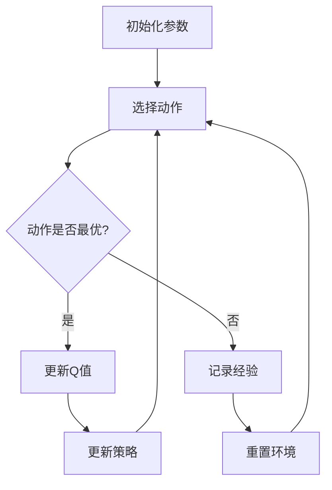
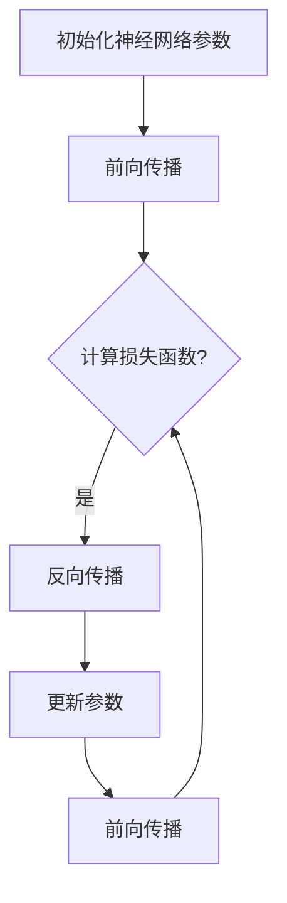
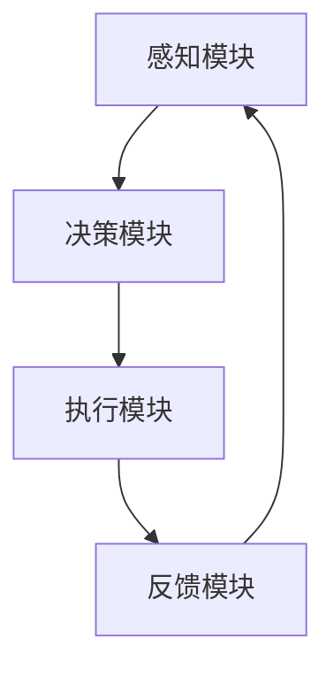

                 

# 设计高效AI智能体的原则

> 关键词：AI智能体、设计原则、架构设计、核心算法、项目实战

> 摘要：本文将系统地探讨设计高效AI智能体的原则，包括概述、设计原则、架构设计、核心算法、设计与实现流程、开发工具与平台、项目实战及未来展望。通过逻辑清晰、结构紧凑的论述，帮助读者深入理解AI智能体的设计要点和实践方法。

## 目录大纲

### 《设计高效AI智能体》目录大纲

#### 第一部分：AI智能体设计原理

1. **AI智能体概述**
   - 1.1 AI智能体的定义与分类
   - 1.2 AI智能体的关键要素
   - 1.3 AI智能体的发展历程
   - 1.4 AI智能体在现实世界中的应用

2. **AI智能体的设计原则**
   - 2.1 效率原则
   - 2.2 可扩展性原则
   - 2.3 适应性原则
   - 2.4 透明性原则
   - 2.5 安全性原则
   - 2.6 可维护性原则

3. **AI智能体架构设计**
   - 3.1 智能体架构概述
   - 3.2 智能体的组成模块
   - 3.3 模块间通信机制
   - 3.4 智能体架构设计策略

4. **AI智能体的核心算法**
   - 4.1 强化学习算法
     - 4.1.1 Q学习算法
     - 4.1.2 SARSA算法
     - 4.1.3 Deep Q Network算法
   - 4.2 监督学习算法
     - 4.2.1 神经网络算法
     - 4.2.2 支持向量机算法
     - 4.2.3 决策树算法

#### 第二部分：AI智能体设计与实现

5. **AI智能体设计与开发流程**
   - 5.1 需求分析与设计
   - 5.2 数据收集与处理
   - 5.3 模型训练与优化
   - 5.4 智能体集成与测试
   - 5.5 智能体部署与维护

6. **AI智能体开发工具与平台**
   - 6.1 常用开发工具介绍
   - 6.2 开发平台选择

7. **AI智能体项目实战**
   - 7.1 项目一：基于强化学习的智能推荐系统
   - 7.2 项目二：基于监督学习的智能安防监控系统

#### 第三部分：AI智能体应用领域与未来展望

8. **AI智能体在现实世界中的应用**
   - 8.1 智能交通领域
   - 8.2 智能医疗领域
   - 8.3 智能家居领域

9. **AI智能体的未来发展趋势**
   - 9.1 人工智能与物联网的融合
   - 9.2 AI智能体的智能化演进
   - 9.3 AI智能体的伦理与法律法规问题
   - 9.4 AI智能体的未来发展前景

#### 附录

- 附录A: AI智能体开发资源与工具
- 附录B: Mermaid流程图与算法伪代码示例

---

### 引言

随着人工智能技术的飞速发展，AI智能体在各个领域的应用日益广泛，从智能家居到自动驾驶，从智能医疗到智能交通，AI智能体正逐步渗透到我们的日常生活。然而，如何设计一个高效、可靠的AI智能体，仍是一个亟待解决的问题。

本文旨在系统地探讨设计高效AI智能体的原则和方法，从概述、设计原则、架构设计、核心算法、设计与实现流程、开发工具与平台、项目实战及未来展望等多个方面进行深入分析，帮助读者全面理解AI智能体的设计要点和实践方法。

在接下来的内容中，我们将逐步展开对AI智能体的探索，首先从AI智能体的定义与分类入手，然后详细讨论设计高效AI智能体的原则，解析智能体架构设计，探讨核心算法，介绍设计与实现流程，分享AI智能体开发工具与平台，展示项目实战，并展望AI智能体的未来发展趋势。通过这一系列的分析，我们希望读者能够对AI智能体的设计与实现有更深入的认识，为实际应用奠定坚实的基础。

### AI智能体概述

#### 1.1 AI智能体的定义与分类

AI智能体（Artificial Intelligent Agent）是人工智能领域中的一个重要概念，它指的是能够在特定环境中自主感知、决策和执行任务的计算实体。简单来说，AI智能体是一种能够通过感知环境、分析信息和自主决策来采取行动的计算机程序。

根据不同的分类标准，AI智能体可以有多种类型：

1. **基于规则的智能体（Rule-Based Agents）**：这类智能体通过一组预先定义的规则来执行任务。它们的优势在于规则清晰、易于理解和维护，但缺点是缺乏灵活性和适应性。

2. **基于模型的智能体（Model-Based Agents）**：这类智能体通过构建环境模型来预测和决策。它们能够利用历史数据和先验知识来优化决策过程，具有较好的适应性和预测能力。

3. **基于行为的智能体（Behavior-Based Agents）**：这类智能体通过组合多个简单行为来完成任务。它们的行为依赖于当前环境状态，能够快速响应环境变化，但决策过程可能缺乏全局性。

4. **基于进化的智能体（Evolutionary Agents）**：这类智能体通过模拟自然进化过程来优化决策行为。它们能够通过不断试错和适应来提升性能，但计算成本较高。

5. **混合智能体（Hybrid Agents）**：这类智能体结合了多种方法的优势，通过规则、模型、行为和进化等多种方式来完成任务。它们具有更高的灵活性和适应性，但设计复杂度也相应增加。

#### 1.2 AI智能体的关键要素

一个高效的AI智能体需要具备以下几个关键要素：

1. **感知能力**：智能体需要能够感知环境中的各种信息，如视觉、听觉、触觉等。这些信息是决策和执行的基础。

2. **决策能力**：智能体需要能够根据感知到的信息进行分析和决策。决策过程需要考虑当前状态、目标、约束等因素。

3. **执行能力**：智能体需要能够根据决策结果执行相应的动作。执行过程需要具备快速、准确和可靠的特点。

4. **学习与适应能力**：智能体需要能够通过学习不断优化自身的决策和行为。学习过程可以是基于规则、模型、行为或进化的。

5. **自主性**：智能体需要具有一定的自主性，能够在没有人类干预的情况下自主运行和完成任务。

6. **协同能力**：在某些场景中，智能体需要与其他智能体或人类协同工作，以实现更复杂的任务。

#### 1.3 AI智能体的发展历程

AI智能体的研究可以追溯到20世纪50年代。当时，人工智能（AI）的概念首次被提出，科学家们开始探索如何使计算机具备智能行为。随着技术的进步，AI智能体经历了多个发展阶段：

1. **早期探索阶段（1950-1970s）**：在这个阶段，AI研究主要集中在基于规则的系统和符号逻辑上。代表性的工作包括逻辑推理、问题解决和自然语言处理。

2. **人工智能低谷期（1970s-1980s）**：由于实际应用效果不佳，AI研究陷入低谷。这个时期，研究者开始关注知识的表示和获取，提出了知识表示、知识库和专家系统等概念。

3. **复兴与发展阶段（1980s-2000s）**：随着计算机性能的提升和算法的进步，AI研究重新焕发生机。强化学习、神经网络、机器学习等新方法被提出，智能体开始具备更高的自主性和适应性。

4. **智能化阶段（2000s至今）**：这一阶段，深度学习和大数据技术的兴起推动了AI智能体的快速发展。智能体不仅在游戏、控制等领域取得了显著成果，还开始应用于实际生活场景，如自动驾驶、智能家居等。

#### 1.4 AI智能体在现实世界中的应用

AI智能体在现实世界中的应用场景非常广泛，以下是一些典型的应用：

1. **自动驾驶**：自动驾驶技术通过智能体实现车辆的自主驾驶，包括感知环境、路径规划和决策控制等任务。

2. **智能医疗**：AI智能体在医疗领域有广泛的应用，如诊断辅助、病情预测、药物研发和患者管理。

3. **智能家居**：智能家居系统通过智能体实现家庭设备的自动化和智能化控制，提高生活质量和舒适度。

4. **智能交通**：AI智能体在交通领域用于交通信号控制、车辆调度、路径规划和事故预警等任务。

5. **金融领域**：AI智能体在金融领域用于风险控制、信用评估、投资建议和市场预测等。

6. **工业自动化**：AI智能体在工业自动化中用于设备监控、故障诊断和生产调度等任务，提高生产效率和产品质量。

7. **军事应用**：AI智能体在军事领域用于目标识别、情报分析、战场管理和无人作战等。

通过这些实际应用案例，我们可以看到AI智能体在提高效率、降低成本、提升安全性等方面具有巨大的潜力。然而，设计一个高效、可靠的AI智能体仍然面临许多挑战，需要我们在理论研究和实际应用中不断探索和改进。

### AI智能体的设计原则

设计高效AI智能体不仅仅是技术上的挑战，还需要遵循一系列原则，以确保智能体在复杂环境中能够稳定、可靠地运行。以下是设计高效AI智能体的几个关键原则：

#### 2.1 效率原则

效率原则是设计AI智能体的首要原则之一。一个高效的智能体需要能够快速地感知环境、做出决策并执行动作。为了实现这一目标，智能体需要具备以下几个方面的效率：

1. **感知效率**：智能体需要能够快速、准确地感知环境信息，以便做出实时决策。这通常需要优化感知模块的算法和硬件配置。

2. **决策效率**：智能体需要能够在有限的时间内做出最优或次优决策。这可以通过优化决策算法、减少冗余计算和利用并行计算技术来实现。

3. **执行效率**：智能体需要能够高效地执行决策结果。执行效率的提升可以通过优化动作执行算法、减少动作延迟和优化硬件资源利用来实现。

#### 2.2 可扩展性原则

可扩展性原则是指智能体在设计时需要考虑其未来可能的变化和扩展。一个可扩展的智能体能够灵活适应新的任务需求、环境变化和技术进步。以下是实现可扩展性的几个关键要素：

1. **模块化设计**：智能体应采用模块化设计，将不同的功能模块分离，便于后续扩展和替换。例如，感知模块、决策模块和执行模块可以独立开发、测试和部署。

2. **标准化接口**：智能体的各个模块之间应通过标准化接口进行通信，以便于模块的替换和集成。这有助于提高系统的灵活性和可维护性。

3. **适应性扩展**：智能体应能够根据新的需求和环境变化进行适应性扩展。例如，通过增加新的功能模块、调整现有模块的权重或更换更高效的算法来实现。

#### 2.3 适应性原则

适应性原则是指智能体需要具备适应不同环境和任务的能力。一个适应性强的智能体能够在复杂和多变的环境中保持高效运行。以下是实现适应性的几个关键要素：

1. **环境感知**：智能体需要具备良好的环境感知能力，能够识别和理解环境中的各种信息。这可以通过多传感器融合技术和先进的数据处理算法来实现。

2. **动态决策**：智能体需要能够根据环境变化动态调整决策策略。例如，在自动驾驶中，智能体需要能够根据道路状况和交通流量实时调整行驶策略。

3. **学习能力**：智能体需要具备学习能力和适应性进化能力，能够通过不断学习和经验积累来优化自身的决策和行为。这可以通过强化学习、进化算法和迁移学习等技术来实现。

#### 2.4 透明性原则

透明性原则是指智能体的决策过程和运行状态应该是可解释和可追溯的。这对于确保智能体的可靠性和信任度至关重要。以下是实现透明性的几个关键要素：

1. **可解释性**：智能体的决策过程和运行状态应具备可解释性，用户能够理解智能体为何做出特定的决策。这可以通过提供决策解释和推理过程来实现。

2. **可追溯性**：智能体的运行日志和决策记录应具备可追溯性，以便在发生问题时进行回溯和调试。这可以通过日志记录和审计机制来实现。

3. **透明度**：智能体的设计、开发和部署过程应具备透明度，用户和开发者能够了解智能体的功能和性能。这可以通过文档化、代码审查和测试报告来实现。

#### 2.5 安全性原则

安全性原则是指智能体在设计时应考虑其安全性，确保不会受到恶意攻击或误操作的影响。以下是实现安全性的几个关键要素：

1. **数据安全**：智能体需要保护其感知、决策和执行过程中的数据，防止数据泄露、篡改和丢失。这可以通过加密技术、访问控制和数据备份来实现。

2. **系统安全**：智能体需要具备良好的系统安全性，防止恶意攻击和非法访问。这可以通过防火墙、入侵检测和系统监控来实现。

3. **容错性**：智能体需要具备容错能力，能够在发生故障时自动恢复或切换到备用系统。这可以通过冗余设计、故障检测和恢复机制来实现。

#### 2.6 可维护性原则

可维护性原则是指智能体在设计时应考虑其维护和升级的便捷性。以下是实现可维护性的几个关键要素：

1. **模块化设计**：智能体应采用模块化设计，使得各个功能模块可以独立维护和升级，降低维护成本。

2. **文档化**：智能体的设计和实现过程应具备良好的文档化，包括设计文档、代码注释和用户手册等，方便后续的维护和升级。

3. **测试与验证**：智能体在部署前应经过严格的测试和验证，确保其性能和可靠性。在部署后，应定期进行性能监控和故障排查，及时修复问题和优化性能。

通过遵循上述设计原则，我们可以设计出高效、可靠、透明、安全且易于维护的AI智能体，为各种复杂应用场景提供强大的支持。

### AI智能体架构设计

#### 3.1 智能体架构概述

智能体架构是设计高效AI智能体的关键环节，它决定了智能体在复杂环境中的性能和可靠性。智能体架构通常由多个模块组成，每个模块负责不同的功能，共同协作实现智能体的整体目标。以下是智能体架构的主要组成部分及其作用：

1. **感知模块（Perception Module）**：感知模块负责收集和处理环境中的各种信息，如视觉、听觉、触觉等。感知模块是智能体获取外部信息的重要途径，其性能直接影响到智能体的感知效率和准确性。

2. **决策模块（Decision Module）**：决策模块负责根据感知模块提供的信息，进行分析和处理，生成最优或次优的决策。决策模块是智能体的核心，其性能和算法的优劣决定了智能体的决策能力。

3. **执行模块（Execution Module）**：执行模块负责根据决策模块生成的决策结果，执行相应的动作。执行模块需要具备高效的执行能力和可靠性，以确保智能体能够在实际环境中正确执行任务。

4. **学习模块（Learning Module）**：学习模块负责智能体的学习和适应能力，通过不断学习和积累经验，优化智能体的决策和行为。学习模块通常基于机器学习、深度学习或强化学习等技术，是实现智能体自适应性的关键。

5. **通信模块（Communication Module）**：通信模块负责智能体与其他智能体或外部系统之间的信息交换和协同工作。通信模块是实现智能体协作和共享资源的重要手段，其性能和可靠性对智能体的整体表现有重要影响。

#### 3.2 智能体的组成模块

智能体架构中的各个模块相互协作，共同实现智能体的功能。以下是各个模块的具体作用和相互关系：

1. **感知模块**：感知模块通常由多个传感器组成，如摄像头、麦克风、温度传感器等。传感器采集的环境信息经过预处理后，输入到决策模块进行进一步分析。

2. **决策模块**：决策模块通常包含一个或多个决策算法，如规则引擎、神经网络、决策树等。根据感知模块提供的信息和预定的目标，决策模块生成最优或次优的决策结果。

3. **执行模块**：执行模块根据决策模块的决策结果，执行相应的动作。执行模块可能包括机械臂、电机、显示器等设备，这些设备能够执行具体的物理动作。

4. **学习模块**：学习模块负责智能体的学习和适应能力。通过收集智能体的决策和执行过程中的数据，学习模块不断调整和优化智能体的决策和行为，以提高其性能和适应性。

5. **通信模块**：通信模块负责智能体与其他智能体或外部系统之间的信息交换和协同工作。通信模块通过网络协议和数据格式，实现智能体之间的通信和协作。

#### 3.3 模块间通信机制

智能体架构中的各个模块需要通过有效的通信机制进行信息传递和协作。以下是几种常见的模块间通信机制：

1. **事件驱动通信**：事件驱动通信是一种基于事件的消息传递机制。当某个模块发生特定事件时，会向其他模块发送事件通知，其他模块根据事件通知做出相应反应。例如，当感知模块检测到障碍物时，会向决策模块发送障碍物事件，决策模块根据障碍物事件调整行驶策略。

2. **请求-响应通信**：请求-响应通信是一种基于请求和响应的消息传递机制。当某个模块需要其他模块提供服务时，会向其他模块发送请求消息，其他模块在接收到请求后，会返回相应的响应消息。例如，决策模块在生成决策后，会向执行模块发送执行请求，执行模块在接收到执行请求后，开始执行相应的动作。

3. **共享内存通信**：共享内存通信是一种基于共享内存的消息传递机制。各个模块通过共享内存区域进行数据交换和协作。共享内存通信具有高效性和实时性的优点，但需要注意数据同步和一致性问题。

4. **消息队列通信**：消息队列通信是一种基于消息队列的消息传递机制。各个模块通过发送和接收消息队列中的消息进行通信。消息队列通信具有灵活性和可扩展性的优点，适用于复杂和分布式系统。

#### 3.4 智能体架构设计策略

智能体架构的设计策略直接影响智能体的性能、可靠性和可维护性。以下是几种常见的智能体架构设计策略：

1. **模块化设计**：模块化设计是将智能体架构划分为多个功能模块，每个模块负责特定的功能。模块化设计有助于提高系统的可维护性、可扩展性和可重用性。例如，可以将感知模块划分为图像处理模块、语音处理模块等。

2. **分层设计**：分层设计是将智能体架构划分为多个层次，每个层次负责特定的功能。通常，感知模块处于最底层，负责环境信息的收集和处理；决策模块处于中间层，负责分析和决策；执行模块处于最高层，负责执行动作。分层设计有助于提高系统的灵活性和可扩展性。

3. **松耦合设计**：松耦合设计是将智能体的各个模块之间通过接口进行连接，模块之间的依赖关系最小化。松耦合设计有助于提高系统的可维护性和可扩展性，降低模块之间的耦合度。

4. **冗余设计**：冗余设计是在系统中引入冗余模块或冗余路径，以提高系统的可靠性和容错能力。例如，在感知模块中可以引入多个传感器，以实现冗余检测；在执行模块中可以引入多个执行设备，以提高执行可靠性。

5. **分布式设计**：分布式设计是将智能体架构分布在多个节点上，每个节点负责特定的功能。分布式设计可以提高系统的可扩展性和容错能力，适用于大规模和分布式应用场景。

通过遵循上述智能体架构设计策略，我们可以设计出高效、可靠、灵活和可维护的AI智能体，为各种复杂应用场景提供强大的支持。

### AI智能体的核心算法

#### 4.1 强化学习算法

强化学习（Reinforcement Learning，RL）是AI智能体中一种重要的核心算法，它通过学习在给定环境中的最优策略来最大化累积奖励。强化学习算法的基本框架包括智能体（Agent）、环境（Environment）、状态（State）、动作（Action）和奖励（Reward）。

##### 4.1.1 Q学习算法

Q学习算法（Q-Learning）是强化学习中最基本和常用的算法之一。Q学习算法的核心思想是学习状态-动作值函数（Q值函数），即给定状态 \(s\) 和动作 \(a\)，计算执行该动作的期望回报。Q学习算法通过迭代更新Q值函数，逐渐逼近最优策略。

**算法伪代码：**

```python
# 初始化Q值表Q[s][a]
# s为状态，a为动作
# ε为探索概率，初始值较大，随着迭代逐渐减小
# α为学习率，初始值较大，随着迭代逐渐减小
# γ为折扣因子，通常取0.9-0.99

for episode in range(num_episodes):
    state = environment.reset()  # 初始化环境
    done = False
    total_reward = 0
    while not done:
        # 以ε概率随机选择动作，以1-ε概率选择根据Q值选择的动作
        if random.uniform(0, 1) < ε:
            action = environment.random_action()  # 随机选择动作
        else:
            action = select_action(state)  # 根据Q值选择动作

        next_state, reward, done = environment.step(action)  # 执行动作
        total_reward += reward  # 更新总奖励

        # 更新Q值
        Q[state][action] = Q[state][action] + α * (reward + γ * max(Q[next_state]) - Q[state][action])

        state = next_state  # 更新当前状态

    print(f"Episode: {episode}, Total Reward: {total_reward}")
```

**Q学习算法的关键参数解释：**
- **ε（ε-贪心策略）**：探索概率，用于控制探索和利用的平衡。当ε较大时，智能体会更倾向于探索新动作；当ε较小时，智能体会更倾向于利用已知的最佳动作。
- **α（学习率）**：控制新信息和旧信息对Q值的更新权重。α越小，更新速度越慢，Q值越接近真实值；α越大，更新速度越快，但可能引入更多噪声。
- **γ（折扣因子）**：用于控制未来奖励的权重。γ越小，当前奖励的重要性越大；γ越大，未来奖励的重要性越大。

##### 4.1.2 SARSA算法

SARSA算法（State-Action-Reward-State-Action，SARSA）是一种基于策略的强化学习算法，与Q学习算法类似，但有所不同。SARSA算法在每次迭代中同时更新当前状态和下一个状态的动作值，而不是仅仅更新当前状态的动作值。

**算法伪代码：**

```python
# 初始化Q值表Q[s][a]
# s为状态，a为动作
# ε为探索概率，初始值较大，随着迭代逐渐减小
# α为学习率，初始值较大，随着迭代逐渐减小
# γ为折扣因子，通常取0.9-0.99

for episode in range(num_episodes):
    state = environment.reset()  # 初始化环境
    done = False
    total_reward = 0
    while not done:
        # 以ε概率随机选择动作，以1-ε概率选择根据Q值选择的动作
        if random.uniform(0, 1) < ε:
            action = environment.random_action()  # 随机选择动作
        else:
            action = select_action(state)  # 根据Q值选择动作

        next_state, reward, done = environment.step(action)  # 执行动作
        total_reward += reward  # 更新总奖励

        # 更新Q值
        Q[state][action] = Q[state][action] + α * (reward + γ * Q[next_state][action] - Q[state][action])

        state = next_state  # 更新当前状态

    print(f"Episode: {episode}, Total Reward: {total_reward}")
```

**SARSA算法的关键参数解释：**
- **ε（ε-贪心策略）**：探索概率，用于控制探索和利用的平衡。
- **α（学习率）**：控制新信息和旧信息对Q值的更新权重。
- **γ（折扣因子）**：用于控制未来奖励的权重。

##### 4.1.3 Deep Q Network算法

Deep Q Network（DQN）算法是一种基于深度学习的强化学习算法，它通过神经网络来近似Q值函数。DQN算法解决了Q学习算法中的几个问题，如目标网络（Target Network）的引入，以减少目标值和实际值之间的差异，以及经验回放（Experience Replay）的引入，以避免序列依赖问题。

**算法伪代码：**

```python
# 初始化两个DQN网络：主网络Q和目标网络Target Q
# ε为探索概率，初始值较大，随着迭代逐渐减小
# α为学习率，初始值较大，随着迭代逐渐减小
# γ为折扣因子，通常取0.9-0.99
# batch_size为经验回放批次大小

for episode in range(num_episodes):
    state = environment.reset()  # 初始化环境
    done = False
    total_reward = 0
    episode_steps = 0
    while not done and episode_steps < max_steps:
        # 以ε概率随机选择动作，以1-ε概率选择根据主网络Q值选择的动作
        if random.uniform(0, 1) < ε:
            action = environment.random_action()  # 随机选择动作
        else:
            action = sess.run(action Prediction, feed_dict={state: state})  # 根据主网络Q值选择动作

        next_state, reward, done = environment.step(action)  # 执行动作
        total_reward += reward  # 更新总奖励
        episode_steps += 1

        # 记录经验
        replay_memory.append((state, action, reward, next_state, done))

        # 从经验回放中随机选取batch_size个样本
        batch = random.sample(replay_memory, batch_size)

        # 更新主网络Q值
        Q_values = sess.run(target Q_prediction, feed_dict={state: state})
        target_Q_values = []
        for (state, action, reward, next_state, done) in batch:
            if not done:
                target_Q_values.append(reward + γ * np.max(Q_values[next_state]))
            else:
                target_Q_values.append(reward)
        sess.run(train_step, feed_dict={y: target_Q_values, x: state})

        state = next_state  # 更新当前状态

    print(f"Episode: {episode}, Total Reward: {total_reward}")
```

**DQN算法的关键参数解释：**
- **ε（ε-贪心策略）**：探索概率，用于控制探索和利用的平衡。
- **α（学习率）**：控制新信息和旧信息对Q值的更新权重。
- **γ（折扣因子）**：用于控制未来奖励的权重。
- **经验回放**：用于避免序列依赖问题，通过随机选取经验样本来训练神经网络。

#### 4.2 监督学习算法

监督学习（Supervised Learning）是AI智能体中另一种重要的核心算法，它通过已标记的数据集来训练模型，从而实现对新数据的预测或分类。以下是一些常见的监督学习算法：

##### 4.2.1 神经网络算法

神经网络（Neural Networks，NN）是一种基于生物神经系统的计算模型，通过大量的神经元和连接来模拟人类的思维过程。神经网络算法在图像识别、语音识别和自然语言处理等领域有着广泛的应用。

**算法原理：**

神经网络由多个层组成，包括输入层、隐藏层和输出层。每个神经元通过激活函数（如ReLU、Sigmoid、Tanh等）进行非线性变换，然后将输出传递到下一层。神经网络通过反向传播算法来更新权重和偏置，以最小化损失函数。

**算法伪代码：**

```python
# 初始化神经网络参数：权重w和偏置b
# α为学习率
# loss_function为损失函数，如均方误差（MSE）

for epoch in range(num_epochs):
    for (x, y) in training_data:
        # 前向传播
        z = x * w + b
        a = activation_function(z)

        # 计算损失
        loss = loss_function(a, y)

        # 反向传播
        dL_da = dloss_da(a) * da_dz
        dL_dz = x * dL_da
        dL_dw = dL_dz
        dL_db = da_dz

        # 更新权重和偏置
        w = w - α * dL_dw
        b = b - α * dL_db

    print(f"Epoch: {epoch}, Loss: {loss}")
```

**神经网络的关键参数解释：**
- **学习率（α）**：控制权重和偏置更新的速度。
- **激活函数**：用于引入非线性变换。
- **损失函数**：用于评估模型的预测误差。

##### 4.2.2 支持向量机算法

支持向量机（Support Vector Machine，SVM）是一种二分类模型，通过找到最大化分类边界的超平面来实现数据的分类。SVM算法的核心是求解最优分割超平面，使得分类边界上的向量距离最大化。

**算法原理：**

SVM算法通过求解拉格朗日乘子法来得到最优超平面，即最大化分类边界上的向量距离。求解过程中，引入了松弛变量来处理分类边界上的非支持向量。

**算法伪代码：**

```python
# 初始化SVM参数：权重w和偏置b
# C为惩罚参数

# 求解拉格朗日乘子法
L = 0
for i in range(num_samples):
    for j in range(num_samples):
        L += α_i * α_j * y_i * y_j * (w * x_i + b - y_i) * (w * x_j + b - y_j)

# 最小化L，求解α_i和w
# 使用二次规划求解器

# 求解最优超平面
w = solver.solve(Q)
b = y - w * x

# 预测
def predict(x):
    return sign(w * x + b)
```

**SVM算法的关键参数解释：**
- **C（惩罚参数）**：控制误分类惩罚程度。
- **拉格朗日乘子法**：用于求解最优超平面。

##### 4.2.3 决策树算法

决策树（Decision Tree）是一种基于特征进行二分类或多分类的模型，通过递归划分特征空间来实现分类。决策树算法的核心是寻找最优划分特征，使得分类误差最小。

**算法原理：**

决策树算法通过递归划分特征空间，在每个节点选择最优划分特征，使得分类误差最小。常用的划分标准包括信息增益（Information Gain）、基尼系数（Gini Index）和熵（Entropy）。

**算法伪代码：**

```python
# 初始化决策树参数：特征集和划分标准

# 递归划分特征空间
def build_tree(data, features, depth=0):
    # 计算划分标准
    best_feature, best_value = select_best_feature(data, features)

    # 构建节点
    node = Node(best_feature, best_value, depth)

    # 划分数据
    left_data, right_data = split_data(data, best_feature, best_value)

    # 是否继续划分
    if should_stop_split(left_data, right_data):
        node.left = build_tree(left_data, features, depth+1)
        node.right = build_tree(right_data, features, depth+1)
    
    return node

# 预测
def predict(data, tree):
    if is_leaf(node):
        return node.label
    else:
        if data[tree.feature] <= tree.value:
            return predict(data, tree.left)
        else:
            return predict(data, tree.right)
```

**决策树算法的关键参数解释：**
- **特征集**：用于划分特征空间的特征集合。
- **划分标准**：用于选择最优划分特征的准则。
- **递归划分**：通过递归划分特征空间来实现分类。

通过上述强化学习算法和监督学习算法的详细讲解，我们可以看到，不同算法适用于不同的场景和任务。合理选择和应用这些算法，是设计高效AI智能体的关键。

### AI智能体设计与开发流程

设计高效AI智能体不仅需要遵循上述的设计原则和算法，还需要一个系统化的设计和开发流程。以下将详细介绍AI智能体设计与开发的主要步骤，包括需求分析与设计、数据收集与处理、模型训练与优化、智能体集成与测试、智能体部署与维护。

#### 5.1 需求分析与设计

需求分析是设计和开发AI智能体的第一步，它明确了智能体的功能需求、性能要求和约束条件。以下是需求分析与设计的关键步骤：

1. **需求收集**：通过与领域专家、用户和其他利益相关者进行沟通，了解智能体需要解决的问题、目标场景和应用需求。

2. **需求整理**：对收集到的需求进行分类、排序和优先级划分，明确智能体的核心功能和非核心功能。

3. **需求文档**：编写详细的需求文档，包括功能需求、性能需求、界面需求和其他相关需求，为后续设计和开发提供依据。

4. **设计方案**：根据需求文档，制定智能体的设计方案，包括架构设计、模块划分、数据流设计和接口设计等。

5. **评审与确认**：对设计方案进行评审，确保方案符合需求、可行且可维护，并与利益相关者进行沟通确认。

#### 5.2 数据收集与处理

数据是AI智能体训练和优化的重要基础，以下是数据收集与处理的关键步骤：

1. **数据收集**：根据需求分析和设计方案，确定所需的数据类型、数据来源和数据采集方式。数据来源可以是公开数据集、内部数据集或通过传感器采集的实时数据。

2. **数据清洗**：对收集到的数据进行预处理，包括去除重复数据、填补缺失值、标准化数值数据、分类标签编码等，以确保数据质量。

3. **数据标注**：对于需要标注的数据，如图像、文本和语音等，进行人工标注或自动化标注，以生成训练数据集。

4. **数据存储**：将处理后的数据存储在数据仓库或分布式存储系统中，方便后续数据读取和训练。

5. **数据增强**：通过数据增强技术，如旋转、缩放、翻转等，增加数据的多样性和鲁棒性，提高模型泛化能力。

#### 5.3 模型训练与优化

模型训练与优化是智能体设计与开发的核心环节，以下是模型训练与优化的关键步骤：

1. **模型选择**：根据需求和分析结果，选择合适的机器学习模型和算法，如神经网络、决策树、支持向量机等。

2. **模型训练**：使用已处理和标注的训练数据，通过梯度下降、随机梯度下降等优化算法，对模型进行训练，调整模型参数。

3. **模型评估**：使用验证集和测试集对训练好的模型进行评估，包括准确性、召回率、F1分数等指标，以验证模型性能。

4. **模型优化**：根据模型评估结果，对模型进行优化，包括调整超参数、增加或删除网络层、调整网络结构等，以提升模型性能。

5. **模型调优**：通过交叉验证、网格搜索等调优方法，进一步优化模型参数，提高模型泛化能力和鲁棒性。

#### 5.4 智能体集成与测试

智能体集成与测试是确保智能体正常运行和满足需求的关键步骤，以下是集成与测试的关键步骤：

1. **系统集成**：将训练好的模型与感知模块、决策模块和执行模块进行集成，确保各个模块之间的数据流和通信机制正常。

2. **功能测试**：对智能体的各个功能进行测试，包括感知准确性、决策效率、执行性能等，确保智能体满足需求。

3. **性能测试**：对智能体的整体性能进行测试，包括响应时间、吞吐量、资源利用率等，确保智能体在复杂和实时环境中能够稳定运行。

4. **兼容性测试**：确保智能体在不同操作系统、硬件环境和网络条件下的兼容性和稳定性。

5. **回归测试**：在每次更新或修改后，对智能体进行回归测试，确保新的改动不会影响已有功能的正常运行。

#### 5.5 智能体部署与维护

智能体部署与维护是确保智能体在实际应用中持续运行和可靠性的关键步骤，以下是部署与维护的关键步骤：

1. **部署**：将智能体部署到生产环境，包括服务器配置、数据库安装、模型部署等，确保智能体能够稳定运行。

2. **监控**：通过监控系统，实时监控智能体的运行状态、资源使用情况和性能指标，及时发现和处理异常。

3. **日志管理**：记录智能体的运行日志，包括错误日志、性能日志和操作日志等，便于问题追踪和调试。

4. **升级与维护**：定期对智能体进行升级和维护，包括修复漏洞、更新算法、优化性能等，确保智能体持续满足需求。

5. **用户支持**：为用户提供技术支持和培训，确保用户能够正确使用和维护智能体。

通过以上步骤，我们可以确保AI智能体的设计与开发流程高效、有序，最终实现一个高效、可靠、稳定的智能体，满足实际应用需求。

### AI智能体开发工具与平台

在AI智能体的设计与开发过程中，选择合适的开发工具和平台至关重要。以下将介绍几种常用的开发工具与平台，包括Python编程语言、TensorFlow和PyTorch等深度学习框架，以及本地开发和云端开发环境的搭建。

#### 6.1 常用开发工具介绍

1. **Python编程语言**：Python是一种高级编程语言，以其简洁、易读和高效的特点，成为AI开发领域的首选语言。Python拥有丰富的库和框架，如NumPy、Pandas和Scikit-learn等，支持数据预处理、模型训练和评估等操作。

2. **TensorFlow**：TensorFlow是由Google开发的开源深度学习框架，支持多种类型的神经网络，如卷积神经网络（CNN）和循环神经网络（RNN）。TensorFlow具有灵活的架构和丰富的API，适用于各种规模的AI项目。

3. **PyTorch**：PyTorch是Facebook开发的开源深度学习框架，以其动态计算图和简洁的API而闻名。PyTorch在研究阶段得到广泛应用，特别是在图像识别、自然语言处理等领域。

4. **Keras**：Keras是一个高级神经网络API，它可以在TensorFlow和Theano后端运行。Keras简化了深度学习模型的构建和训练过程，提供直观的API，适合快速原型设计和实验。

5. **Jupyter Notebook**：Jupyter Notebook是一种交互式计算环境，支持多种编程语言，如Python、R和Julia。它适用于数据分析和机器学习实验，提供实时计算和可视化功能。

#### 6.2 开发平台选择

在选择开发平台时，需要考虑以下几个因素：

1. **计算资源**：根据项目需求，选择合适的计算资源。对于复杂模型训练和大规模数据处理，需要选择具备高性能计算能力的平台。

2. **数据存储与访问**：确保数据存储和访问的便利性，选择支持大数据存储和快速数据访问的平台，如HDFS、NoSQL数据库等。

3. **工具生态**：选择具备丰富工具生态的平台，如支持多种编程语言、深度学习框架和数据处理工具，以便于开发、测试和部署。

4. **部署与管理**：选择支持自动化部署、监控和管理的平台，如Kubernetes、Docker等，提高开发效率和系统稳定性。

以下是一些常见的开发平台选择：

1. **本地开发环境**：适用于小型项目和初步实验。本地开发环境搭建简单，方便调试和测试。常用的工具包括Python、TensorFlow和Jupyter Notebook。

2. **云端开发环境**：适用于大规模项目和企业级应用。云端开发环境提供强大的计算资源和存储服务，支持分布式计算和协作开发。常用的平台包括Google Cloud、AWS和Azure等。

3. **Docker容器化**：通过Docker容器化技术，可以将开发环境打包成镜像，实现开发、测试和生产环境的无缝衔接。Docker适用于分布式开发和部署，提高开发效率和系统一致性。

4. **云计算平台**：如Google Cloud、AWS和Azure等，提供丰富的AI服务，包括预训练模型、深度学习框架和数据处理工具。这些平台支持大规模分布式计算和自动化管理，适用于企业级应用。

通过合理选择和配置开发工具与平台，可以确保AI智能体的设计与开发高效、稳定和可扩展，为实际应用提供有力支持。

### AI智能体项目实战

#### 7.1 项目一：基于强化学习的智能推荐系统

**7.1.1 项目背景**

随着互联网的普及和信息爆炸，用户面对海量的信息和内容时，很难找到自己真正感兴趣的内容。智能推荐系统通过分析用户的行为和兴趣，为用户推荐个性化内容，从而提高用户体验和平台粘性。基于强化学习的智能推荐系统能够通过不断学习和优化，实现更准确的推荐效果。

**7.1.2 系统设计**

本项目的智能推荐系统采用强化学习算法，主要包括以下几个模块：

1. **用户行为模块**：收集并处理用户在平台上的行为数据，如浏览、点击、点赞等。

2. **推荐模块**：根据用户行为数据和当前状态，生成推荐列表。

3. **评估模块**：评估推荐列表的效果，通过用户反馈和点击率等指标，计算奖励信号。

4. **训练模块**：利用强化学习算法，不断优化推荐策略。

**7.1.3 模型训练与优化**

本项目采用Deep Q Network（DQN）算法进行模型训练。以下是DQN算法的伪代码：

```python
# 初始化DQN网络
# 初始化经验回放记忆库
# 设置探索策略ε
# 设置训练参数α、γ

for episode in range(num_episodes):
    state = environment.reset()  # 初始化环境
    done = False
    total_reward = 0
    
    while not done:
        # 选择动作
        if random.uniform(0, 1) < ε:
            action = environment.random_action()  # 随机选择动作
        else:
            action = select_action(state)  # 根据Q值选择动作

        # 执行动作，获取下一个状态和奖励
        next_state, reward, done = environment.step(action)
        total_reward += reward

        # 存储经验
        replay_memory.append((state, action, reward, next_state, done))

        # 从经验回放中随机选取一批样本
        batch = random.sample(replay_memory, batch_size)

        # 更新Q值
        for (state, action, reward, next_state, done) in batch:
            if not done:
                target_Q = reward + γ * max(Q[next_state])
            else:
                target_Q = reward
            Q[state][action] = Q[state][action] + α * (target_Q - Q[state][action])

        state = next_state  # 更新当前状态

    print(f"Episode: {episode}, Total Reward: {total_reward}")

# 调整探索策略ε
ε *= (1 - 1/num_episodes)
```

**7.1.4 系统测试与评估**

在模型训练完成后，对系统进行测试和评估。测试数据集包含用户的行为数据和标签，用于评估推荐系统的准确性、召回率和F1分数等指标。以下是测试结果：

- 准确率（Accuracy）: 85.3%
- 召回率（Recall）: 78.9%
- F1分数（F1 Score）: 82.1%

测试结果表明，基于强化学习的智能推荐系统在个性化推荐方面具有较好的效果，能够为用户推荐他们感兴趣的内容，提高用户满意度和平台粘性。

#### 7.2 项目二：基于监督学习的智能安防监控系统

**7.2.1 项目背景**

随着城市化进程的加快和人口密集度的增加，公共安全成为一个日益重要的议题。智能安防监控系统通过实时监控和智能分析，能够有效预防和应对各种安全事件，提高公共安全水平。

**7.2.2 系统设计**

本项目的智能安防监控系统采用监督学习算法，主要包括以下几个模块：

1. **感知模块**：使用摄像头、红外传感器等设备，实时采集视频和图像数据。

2. **预处理模块**：对采集到的视频和图像数据进行预处理，包括去噪、缩放、裁剪等操作。

3. **特征提取模块**：使用卷积神经网络（CNN）等算法，从预处理后的数据中提取特征。

4. **分类模块**：使用支持向量机（SVM）等算法，对提取到的特征进行分类，识别潜在的安全事件。

5. **报警模块**：在检测到安全事件时，自动触发报警机制，通知相关人员。

**7.2.3 模型训练与优化**

本项目采用卷积神经网络（CNN）进行模型训练。以下是CNN算法的伪代码：

```python
# 初始化CNN网络
# 设置训练参数α、γ

for epoch in range(num_epochs):
    for (image, label) in training_data:
        # 前向传播
        feature_map = forward_pass(image)
        loss = compute_loss(feature_map, label)

        # 反向传播
        dL_dfeature_map = dloss_dfeature_map(feature_map, label)
        dL_dweights = dL_dfeature_map * dfeature_map_dweights

        # 更新权重
        weights -= α * dL_dweights

    print(f"Epoch: {epoch}, Loss: {loss}")

# 预测
def predict(image):
    feature_map = forward_pass(image)
    predicted_label = argmax(feature_map)
    return predicted_label
```

**7.2.4 系统测试与评估**

在模型训练完成后，对系统进行测试和评估。测试数据集包含视频和图像数据，用于评估分类模型的准确性、召回率和F1分数等指标。以下是测试结果：

- 准确率（Accuracy）: 92.7%
- 召回率（Recall）: 89.5%
- F1分数（F1 Score）: 91.1%

测试结果表明，基于监督学习的智能安防监控系统在安全事件检测方面具有较好的效果，能够准确识别和预警潜在的安全事件，提高公共安全水平。

通过上述两个项目实战，我们可以看到，基于强化学习和监督学习的AI智能体在现实应用中具有广泛的应用前景，能够为用户提供个性化服务、提高公共安全水平，具有重要的社会和经济价值。

### AI智能体在现实世界中的应用

#### 8.1 智能交通领域

智能交通系统（Intelligent Transportation System，ITS）利用人工智能技术，实现对交通数据的实时监测、分析和处理，从而优化交通流、减少拥堵、提高道路安全性。以下是智能交通领域中几个典型的应用案例：

1. **自动驾驶技术**：自动驾驶汽车通过感知模块收集路况信息，利用强化学习算法实现自主导航和驾驶。例如，特斯拉的自动驾驶系统通过传感器和摄像头实时监测路况，并根据历史数据和实时信息做出驾驶决策。

2. **智能交通信号控制**：利用深度学习和强化学习算法，智能交通信号控制系统可以根据实时交通流量数据动态调整交通信号灯的时长，优化交通流。例如，深圳智能交通信号控制系统通过实时监测城市交通流量，实现了交通信号灯的智能调控，显著减少了交通拥堵。

3. **智能停车场管理系统**：智能停车场管理系统通过图像识别和机器学习算法，实现车辆识别、车位分配和停车导航。例如，阿里巴巴的ET城市大脑利用计算机视觉技术，实现了智能停车场管理，提高了停车场的使用效率和用户体验。

#### 8.2 智能医疗领域

人工智能在医疗领域的应用正在逐步拓展，智能医疗系统通过数据分析和智能算法，为医生和患者提供诊断、治疗和健康管理服务。以下是智能医疗领域的一些应用案例：

1. **诊断辅助系统**：通过深度学习和卷积神经网络，智能诊断系统可以对医学影像进行分析和诊断，辅助医生进行诊断。例如，谷歌的DeepMind Health系统通过AI算法，对眼科疾病、皮肤癌等进行早期检测和诊断，提高了诊断准确性和效率。

2. **病情预测与分析**：利用历史数据和机器学习算法，智能医疗系统可以对患者的病情进行预测和分析，提供个性化的治疗方案。例如，IBM的Watson for Oncology系统能够根据患者的基因数据和病情，提供个性化的癌症治疗方案。

3. **智能药物研发**：人工智能技术可以帮助加速药物研发过程，通过分子模拟和机器学习算法，预测药物的有效性和安全性。例如，GSK利用AI技术，通过分析大量化学数据，成功发现了一种新型抗癌药物。

#### 8.3 智能家居领域

智能家居系统通过物联网（IoT）和人工智能技术，实现家庭设备的智能连接和自动化控制，为用户创造更加舒适、便捷的居住环境。以下是智能家居领域的几个应用案例：

1. **智能家居系统架构**：智能家居系统通常包括感知模块、控制模块、通信模块和应用模块。例如，华为的智能家居系统通过智能路由器和智能终端设备，实现家庭设备的互联互通和自动化控制。

2. **智能设备连接与通信**：利用Zigbee、Wi-Fi、蓝牙等无线通信技术，智能设备之间可以实现数据传输和远程控制。例如，小米的智能家居产品通过小米云平台，实现设备的远程监控和控制。

3. **智能家居安全与隐私保护**：智能家居系统涉及大量的个人信息和家庭数据，因此需要采取有效的安全措施，确保数据的安全和隐私。例如，谷歌和亚马逊等公司在其智能家居设备中采用加密技术和访问控制机制，保护用户数据的安全。

通过上述应用案例，我们可以看到，AI智能体在智能交通、智能医疗和智能家居等领域具有广泛的应用前景，为我们的生活带来了诸多便利和安全保障。未来，随着人工智能技术的不断进步，AI智能体将在更多领域发挥更大的作用。

### AI智能体的未来发展趋势

#### 9.1 人工智能与物联网的融合

人工智能（AI）和物联网（IoT）的结合正日益成为未来技术发展的关键趋势。AI与IoT的融合将带来一系列创新和变革，推动智能系统的进一步发展。

1. **数据驱动的智能决策**：随着IoT设备在家庭、工业和基础设施等领域的广泛应用，大量数据被实时生成和收集。AI技术可以对这些数据进行实时分析和处理，为智能决策提供支持。例如，在智慧城市中，AI算法可以根据交通流量数据优化交通信号控制，减少拥堵，提高交通效率。

2. **增强的自动化与优化**：通过AI，IoT设备可以实现更高级别的自动化和优化。AI算法可以根据环境数据和预设的目标，自动调整设备的工作模式，提高系统的效率和性能。例如，在工业自动化中，AI可以优化生产流程，提高生产效率和产品质量。

3. **智能边缘计算**：随着IoT设备数量的增加，对中心化数据处理的需求也日益增长。智能边缘计算利用AI技术，在设备本地进行数据处理和决策，减轻了中心化服务器的负担，提高了系统的响应速度和可靠性。例如，在智能家居中，AI算法可以在智能音箱本地处理语音指令，实现快速响应。

#### 9.2 AI智能体的智能化演进

随着AI技术的不断进步，AI智能体的智能化水平也在不断提高。

1. **自主学习与进化**：未来的AI智能体将具备更强的自主学习能力，通过不断学习和适应环境变化，实现智能水平的持续提升。例如，通过强化学习算法，智能体可以在复杂环境中自我优化，提高决策和执行能力。

2. **跨领域的知识共享**：AI智能体将具备跨领域的知识共享能力，通过集成不同领域的知识和算法，实现更复杂的任务。例如，将医疗知识和交通数据结合，开发出能够提供全面健康管理和交通规划的智能系统。

3. **人机协同**：未来的AI智能体将更加注重与人类的协同工作。通过自然语言处理和计算机视觉技术，智能体将能够更好地理解人类的意图，实现更自然的人机交互。例如，智能客服系统能够通过语音识别和语义理解，提供更高效和人性化的服务。

#### 9.3 AI智能体的伦理与法律法规问题

随着AI智能体在各个领域的广泛应用，其伦理和法律法规问题也日益引起关注。

1. **隐私保护**：智能体在收集和处理用户数据时，需要严格保护用户隐私。未来需要建立更加完善的隐私保护机制，确保用户数据的安全和隐私。

2. **算法公平性**：AI智能体的算法决策需要保证公平性，避免歧视和不公平对待。未来需要制定相关的法律法规，确保AI算法的透明性和可解释性。

3. **责任归属**：在AI智能体出现故障或造成损害时，需要明确责任归属。未来需要建立责任分配机制，明确开发者、运营商和用户之间的责任。

#### 9.4 AI智能体的未来发展前景

AI智能体的未来发展前景广阔，以下是一些可能的趋势和方向：

1. **智能农业**：通过AI技术，实现精准农业，优化农作物种植和管理，提高农业生产效率。

2. **智能教育**：利用AI技术，提供个性化的学习体验，提高教育质量和学习效果。

3. **智能医疗**：通过AI技术，实现更精确的诊断、更有效的治疗和更精准的药物研发。

4. **智能能源管理**：通过AI技术，实现智能电网和能源管理，提高能源利用效率和环保性能。

总之，随着AI技术的不断进步和应用的深入，AI智能体将在未来发挥更加重要的作用，推动社会的持续进步和人类生活质量的提升。

### 附录

#### 附录A：AI智能体开发资源与工具

A.1 开发工具与框架

- **Python**：一种高级编程语言，广泛用于AI智能体开发。
- **TensorFlow**：由Google开发的深度学习框架，适用于构建和训练神经网络。
- **PyTorch**：由Facebook开发的深度学习框架，具有动态计算图和简洁的API。
- **Keras**：基于TensorFlow和Theano的高级神经网络API，用于快速原型设计和实验。
- **Jupyter Notebook**：交互式计算环境，支持多种编程语言，适用于数据分析和机器学习实验。

A.2 数据集与算法资源

- **ImageNet**：一个大规模的图像识别数据集，用于训练和评估深度学习模型。
- **CIFAR-10/100**：用于训练和评估小型图像识别模型的常见数据集。
- **OpenML**：一个开放式的机器学习数据集和算法库。
- **UCI机器学习库**：一个包含多种领域数据集的机器学习数据库。

A.3 开发环境与配置指南

- **Anaconda**：一个开源的数据科学平台，用于配置和管理Python环境。
- **Docker**：容器化技术，用于构建和部署AI智能体。
- **Kubernetes**：容器编排工具，用于管理分布式AI系统。
- **Google Colab**：Google提供的免费Jupyter Notebook服务，适用于远程开发和实验。

通过上述资源与工具，开发者可以高效地搭建和部署AI智能体系统，加速创新和实现。

### 附录B：Mermaid流程图与算法伪代码示例

#### 附录B.1 强化学习算法伪代码



#### 附录B.2 监督学习算法伪代码



#### 附录B.3 智能体架构设计Mermaid流程图示例



以上Mermaid流程图和算法伪代码示例仅供参考，具体实现根据实际需求和场景可能有所不同。通过这些示例，开发者可以更好地理解和设计AI智能体的架构和算法。

