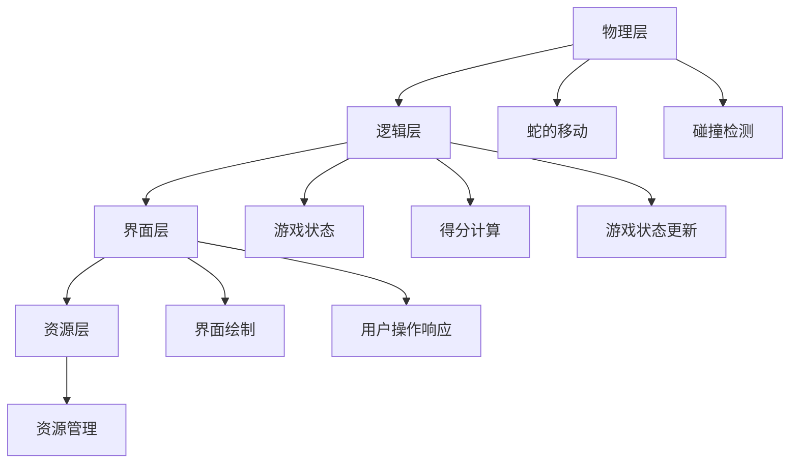

                 

### 第1章 引言

> **关键词：** 贪吃蛇游戏，游戏设计，游戏开发，算法，界面设计，音效设计

> **摘要：** 本章将介绍贪吃蛇小游戏的设计与实现，包括游戏行业概述、贪吃蛇游戏的背景与历史、本书的内容安排与学习目标。通过本章的学习，读者将了解游戏设计的基本流程和贪吃蛇游戏的核心概念，为后续章节的学习打下基础。

贪吃蛇小游戏是一款经典的益智游戏，自1980年代初问世以来，受到了全球玩家的喜爱。这款游戏简单而有趣，通过玩家操控蛇的移动来吞噬食物，避免碰撞。如今，贪吃蛇游戏已经演变出多种版本和玩法，成为游戏开发者和研究者的经典实践项目。

在本章中，我们将从以下几个方面进行介绍：

1. **游戏行业概述**：简要介绍游戏市场的现状与发展趋势，以及游戏设计的基本原则。
2. **贪吃蛇游戏的背景与历史**：探讨贪吃蛇游戏的起源、演变与发展，以及其对游戏行业的影响。
3. **本书内容安排与学习目标**：详细说明本书的章节结构、学习目标与收获，帮助读者更好地规划学习路径。

### 1.1 游戏行业概述

游戏行业是一个充满活力和创新的领域，近年来呈现出快速增长的趋势。根据市场研究机构的报告，全球游戏市场规模已经超过了千亿美元，并且仍在不断扩大。游戏市场的发展不仅受到了技术进步的推动，还受到了玩家需求的多样化影响。

#### 游戏市场的现状与发展趋势

目前，游戏市场呈现出以下几个特点：

1. **移动游戏市场的崛起**：随着智能手机和移动互联网的普及，移动游戏市场已经成为游戏市场的重要组成部分。根据数据显示，移动游戏市场的收入已经超过了PC游戏和主机游戏。
2. **电子竞技的兴起**：电子竞技已经成为一项全球性的运动，吸引了大量玩家和投资者的关注。许多游戏公司开始将游戏设计与电子竞技相结合，推出竞技性更强的游戏。
3. **虚拟现实（VR）和增强现实（AR）的应用**：VR和AR技术的不断发展为游戏行业带来了新的机遇。这些技术可以为玩家提供更加沉浸式的游戏体验，提高游戏的可玩性和互动性。
4. **跨平台游戏的兴起**：越来越多的游戏开发商开始注重跨平台游戏开发，使得玩家可以在不同设备上无缝切换游戏体验。

#### 游戏设计的基本原则

游戏设计是一个复杂而细致的过程，涉及到多个方面的要素。以下是一些基本的游戏设计原则：

1. **玩家体验优先**：游戏设计的核心目标是提供给玩家愉悦的体验。在设计过程中，需要考虑玩家的需求、兴趣和游戏习惯，确保游戏能够吸引和留住玩家。
2. **简洁性**：简洁性是游戏设计的重要原则之一。游戏界面、规则和操作都应该尽量简洁直观，避免复杂的操作和冗长的规则，以提高玩家的可接受度和参与度。
3. **可玩性**：游戏的可玩性是衡量游戏成功与否的重要指标。游戏需要具备一定的挑战性，让玩家在游戏中保持兴趣和动力。同时，游戏难度应该适中，避免过于简单或过于复杂。
4. **平衡性**：游戏中的各种要素，如角色、道具、技能等，应该保持平衡，避免某些要素过于强大或过于弱小，影响游戏的公平性和可玩性。
5. **创新性**：创新是游戏设计的重要驱动力。游戏开发者应该不断探索新的游戏元素、机制和玩法，为玩家带来新鲜感和惊喜。

### 1.2 贪吃蛇游戏的背景与历史

贪吃蛇游戏起源于1980年代初期的日本。最初，这款游戏由日本公司Taito开发，名为《贪食蛇》（Pac-Man）。然而，后来这款游戏逐渐被更名为《贪吃蛇》（Snake），并在全球范围内广泛传播。贪吃蛇游戏以其简单易懂的规则和丰富的玩法，迅速赢得了广大玩家的喜爱。

#### 贪吃蛇游戏的起源

《贪食蛇》最初是作为一款街机游戏推出的。1980年5月，日本公司Taito推出了这款游戏，并迅速取得了巨大的成功。游戏中的玩家需要操控一个圆形的“贪食蛇”来吞噬分布在地图上的食物，同时避免与其他物体碰撞。《贪食蛇》的成功激发了其他游戏公司对这类游戏的研究和开发。

#### 贪吃蛇游戏的演变与发展

随着计算机技术和移动设备的普及，贪吃蛇游戏逐渐从街机平台转移到PC和移动设备上。各种不同版本的贪吃蛇游戏层出不穷，其中最著名的是诺基亚手机内置的《贪吃蛇》游戏。这款游戏凭借其简单易玩的特点，成为了诺基亚手机的一个标志性功能，吸引了无数玩家的关注。

除了传统的单机版贪吃蛇游戏，近年来还出现了许多创新的版本。例如，一些开发者将贪吃蛇游戏与虚拟现实（VR）和增强现实（AR）技术相结合，为玩家带来更加沉浸式的游戏体验。此外，一些开发者还推出了多人在线版贪吃蛇游戏，使得玩家可以与其他玩家实时竞技。

#### 贪吃蛇游戏对游戏行业的影响

贪吃蛇游戏对游戏行业产生了深远的影响。首先，它推动了游戏开发的普及和发展。许多游戏开发者通过学习和实践贪吃蛇游戏，掌握了游戏开发的基本技能和经验。其次，贪吃蛇游戏激发了游戏设计的创新和探索。许多开发者从贪吃蛇游戏中汲取灵感，尝试设计出各种新颖的游戏玩法和机制。

此外，贪吃蛇游戏还促进了游戏教育的普及。许多高校和培训机构开设了游戏开发相关课程，教授学生如何设计和实现贪吃蛇游戏等经典游戏项目。这些课程不仅提高了学生的实践能力，也为游戏行业培养了大量的人才。

### 1.3 本书内容安排与学习目标

本书旨在为广大游戏开发者和爱好者提供一本全面、系统的贪吃蛇游戏设计与实现指南。本书共分为12章，内容涵盖了贪吃蛇游戏的各个关键方面。

#### 本书章节结构

1. **第1章 引言**：介绍游戏行业概述、贪吃蛇游戏的背景与历史、本书的内容安排与学习目标。
2. **第2章 游戏设计与策划**：介绍游戏设计的基本流程、游戏玩法设计、界面设计、音效设计。
3. **第3章 游戏开发环境与工具**：介绍游戏开发环境的搭建、游戏开发工具介绍、游戏资源管理。
4. **第4章 游戏核心算法设计**：介绍游戏循环与更新机制、蛇的移动与碰撞检测、食物的生成与随机分布。
5. **第5章 游戏界面与音效实现**：介绍游戏界面的绘制、游戏音效的实现、游戏状态管理。
6. **第6章 游戏优化与调试**：介绍游戏性能优化、游戏调试方法、游戏测试与发布。
7. **第7章 贪吃蛇游戏的扩展功能**：介绍多人游戏模式、游戏排行榜、游戏关卡设计。
8. **第8章 项目实战**：介绍项目背景与目标、项目开发过程、项目总结与反思。
9. **第9章 游戏开发中的常见问题与解决方案**：介绍游戏开发中的常见问题、解决方案与案例分析。
10. **第10章 游戏开发工具与资源**：介绍主流游戏开发工具、游戏开发资源、游戏开发社区与交流。
11. **第11章 贪吃蛇游戏的未来发展方向**：介绍游戏玩法创新、游戏引擎与技术的进步、社交化与在线化、跨平台与多设备支持、游戏教育与培训。
12. **第12章 总结与展望**：回顾本书内容、学习收获与建议、展望未来。

#### 学习目标与收获

通过学习本书，读者可以实现以下学习目标：

1. **掌握游戏设计的基本原则和方法**：了解游戏设计的核心要素，掌握游戏设计的基本流程，能够独立进行游戏策划和设计。
2. **掌握游戏开发的核心技术**：了解游戏开发环境与工具，熟悉游戏资源管理的方法，掌握游戏核心算法的设计与实现。
3. **具备项目实战经验**：通过参与项目实战，了解项目开发的全过程，掌握项目管理的技能和方法。
4. **提升游戏开发能力**：通过学习和实践，提升游戏开发的能力和水平，为成为专业的游戏开发者打下基础。

本书不仅适合游戏开发初学者，也适合有一定游戏开发经验的读者。无论您是游戏爱好者还是专业的游戏开发者，本书都将为您提供宝贵的知识和经验，帮助您在游戏开发的道路上不断进步。

### 1.4 贪吃蛇游戏的核心概念与架构

贪吃蛇游戏虽然看似简单，但其背后有着复杂的核心概念和架构。理解这些概念和架构有助于我们更好地设计和实现这款游戏。

#### 贪吃蛇游戏的核心概念

1. **蛇（Snake）**：蛇是游戏的主角，玩家需要通过操控蛇的移动来吞噬食物，避免碰撞。蛇由多个单元组成，每个单元代表蛇身体的一部分。
   
2. **食物（Food）**：食物是蛇的目标，玩家通过吞噬食物来增加分数。食物通常分布在游戏的地图上，具有随机性和不可预测性，增加了游戏的趣味性。

3. **墙壁（Wall）**：墙壁是游戏中的一个障碍物，蛇不能穿越墙壁。墙壁的存在增加了游戏的难度，迫使玩家更加谨慎地操作蛇。

4. **得分（Score）**：得分是衡量玩家游戏表现的一个重要指标。玩家通过吞噬食物来增加得分，分数越高，游戏难度越大。

5. **游戏状态（Game State）**：游戏状态包括游戏是否进行中、是否结束、玩家的得分等信息。游戏状态会根据游戏进程不断更新，影响游戏的逻辑和界面展示。

#### 贪吃蛇游戏的架构

贪吃蛇游戏的架构通常可以分为以下几个层次：

1. **物理层（Physics Layer）**：物理层负责处理蛇和食物的移动、碰撞检测等物理行为。这一层通常使用数学模型和算法来实现。

2. **逻辑层（Logic Layer）**：逻辑层负责处理游戏的核心逻辑，包括蛇的移动、得分计算、游戏状态更新等。这一层通常使用编程语言和框架来实现。

3. **界面层（UI Layer）**：界面层负责处理游戏的用户界面，包括界面的绘制、玩家操作的响应等。这一层通常使用图形库和界面框架来实现。

4. **资源层（Resource Layer）**：资源层负责管理游戏中的资源，如图片、音频、视频等。这一层通常使用资源管理器来实现。

#### Mermaid 流程图

为了更好地理解贪吃蛇游戏的核心概念和架构，我们可以使用 Mermaid 流程图来表示。以下是贪吃蛇游戏的 Mermaid 流程图：



在这个流程图中，物理层负责处理蛇和食物的移动以及碰撞检测，逻辑层负责处理游戏的核心逻辑，界面层负责处理用户界面的绘制和用户操作的响应，资源层负责管理游戏中的资源。游戏状态是整个游戏流程的核心，它会根据游戏进程不断更新。

通过这个 Mermaid 流程图，我们可以清晰地看到贪吃蛇游戏的核心概念和架构。理解这些概念和架构有助于我们更好地设计和实现贪吃蛇游戏，为后续章节的学习打下基础。

### 1.5 贪吃蛇游戏的 Mermaid 流程图解析

在上一节中，我们使用了 Mermaid 流程图来表示贪吃蛇游戏的核心概念和架构。在本节中，我们将对 Mermaid 流程图进行详细解析，帮助读者更好地理解贪吃蛇游戏的运作机制。

首先，让我们回顾一下贪吃蛇游戏的 Mermaid 流程图：


#### 物理层

物理层（A）是贪吃蛇游戏的基础，它负责处理蛇和食物的移动以及碰撞检测。物理层的核心算法主要包括：

1. **蛇的移动算法**：蛇的移动是通过更新蛇头和身体各部分的位置来实现的。蛇的移动方向由玩家的输入决定，例如上、下、左、右。蛇的移动算法需要考虑蛇身体的长度和蛇头的方向，确保蛇不会穿越墙壁或自身。

2. **碰撞检测算法**：碰撞检测是游戏中的关键算法，用于检测蛇是否与墙壁、食物或其他蛇的身体部分发生碰撞。碰撞检测可以通过比较蛇头和墙壁、食物或其他蛇的身体部分的位置来实现。

#### 逻辑层

逻辑层（B）是贪吃蛇游戏的核心，它负责处理游戏的核心逻辑，包括得分计算、游戏状态更新等。逻辑层的核心算法主要包括：

1. **得分计算算法**：得分计算是根据玩家吞噬食物的数量来计算的。每次玩家吞噬食物，得分都会增加。得分计算需要考虑食物的种类和难度等因素，以实现不同的得分机制。

2. **游戏状态更新算法**：游戏状态更新是逻辑层的重要任务，它负责更新游戏状态，如游戏是否继续、玩家的得分、游戏难度等。游戏状态更新需要根据游戏逻辑和玩家操作来动态调整。

#### 界面层

界面层（C）负责处理游戏的用户界面，包括界面的绘制和用户操作的响应。界面层的核心算法主要包括：

1. **界面绘制算法**：界面绘制是将游戏的场景、角色、界面元素等绘制到屏幕上。界面绘制需要考虑屏幕分辨率、颜色、纹理等因素，以确保游戏的视觉效果。

2. **用户操作响应算法**：用户操作响应是界面层的核心，它负责处理玩家的输入操作，如键盘按键、触摸屏滑动等。用户操作响应需要及时响应用户的操作，确保游戏的流畅性和响应速度。

#### 资源层

资源层（D）负责管理游戏中的资源，如图片、音频、视频等。资源层的核心算法主要包括：

1. **资源管理算法**：资源管理包括资源的加载、存储、释放等操作。资源管理需要考虑资源的种类、大小、加载方式等因素，以确保游戏的性能和用户体验。

2. **资源优化算法**：资源优化包括资源的压缩、打包、缓存等操作。资源优化可以提高游戏的加载速度和运行效率，减少资源的占用和带宽消耗。

#### 游戏状态

游戏状态（E）是贪吃蛇游戏的核心，它包含了游戏是否进行中、是否结束、玩家的得分等信息。游戏状态会根据游戏进程不断更新，影响游戏的逻辑和界面展示。游戏状态的核心算法包括：

1. **游戏状态更新算法**：游戏状态更新是根据游戏逻辑和玩家操作来动态调整游戏状态。游戏状态更新需要确保游戏的逻辑一致性，避免出现错误或异常。

2. **游戏状态保存和恢复算法**：游戏状态保存和恢复是游戏中的重要功能，它可以将游戏状态保存在本地或云端，以便玩家在下次游戏时继续上一次的游戏进度。

通过以上对 Mermaid 流程图的解析，我们可以清晰地看到贪吃蛇游戏的核心概念和架构。理解这些概念和架构有助于我们更好地设计和实现贪吃蛇游戏，为后续章节的学习打下基础。

### 1.6 贪吃蛇游戏的数学模型与数学公式

贪吃蛇游戏中包含了一些简单的数学模型和数学公式，这些模型和公式在游戏的核心算法设计和优化中起着重要作用。在本节中，我们将介绍贪吃蛇游戏中的几个关键数学模型和数学公式，并通过具体的例子进行详细解释。

#### 游戏难度调整的公式

在贪吃蛇游戏中，随着玩家得分增加，游戏难度通常会逐步提高。一个常用的难度调整公式是基于时间因素的指数函数。公式如下：

$$
难度 = \frac{1}{1 + e^{-k \cdot 时间}}
$$

其中，$k$ 是一个常数，用于调整难度上升的速率；$时间$ 是玩家已经玩的时间。当时间增加时，$e^{-k \cdot 时间}$ 的值会减小，从而使得整个难度值增大，使得游戏难度逐渐增加。

**示例**：假设 $k = 0.1$，玩家已经玩了 100 秒，我们可以计算出难度值：

$$
难度 = \frac{1}{1 + e^{-0.1 \cdot 100}} \approx 1.5
$$

这意味着游戏难度在 100 秒后调整到了约 1.5 倍。

#### 碰撞检测中的数学公式

在贪吃蛇游戏中，碰撞检测是一个关键问题。碰撞检测通常用于检测蛇头是否与墙壁、食物或其他蛇的身体部分发生碰撞。常用的方法是比较位置坐标。

**示例**：假设蛇头位置为 $(x_1, y_1)$，墙壁位置为 $(x_2, y_2)$。我们可以使用以下公式来计算两个点之间的距离：

$$
碰撞距离 = \sqrt{(x_2 - x_1)^2 + (y_2 - y_1)^2}
$$

如果碰撞距离小于或等于一个预设的阈值（例如蛇的身体单元大小），则认为发生了碰撞。

**示例**：假设蛇头位置为 $(2, 2)$，墙壁位置为 $(5, 5)$，我们可以计算碰撞距离：

$$
碰撞距离 = \sqrt{(5 - 2)^2 + (5 - 2)^2} = \sqrt{3^2 + 3^2} = \sqrt{18} \approx 4.24
$$

如果设定碰撞检测的阈值为 5，那么蛇头与墙壁之间确实发生了碰撞。

#### 游戏得分计算的数学公式

在贪吃蛇游戏中，得分通常与玩家吞噬的食物数量成正比。一个简单的得分计算公式如下：

$$
得分 = 基础得分 \times 食物数量
$$

其中，$基础得分$ 是每次吞噬食物获得的初始得分，$食物数量$ 是玩家吞噬的食物总数。

**示例**：假设基础得分为 10，玩家吞噬了 5 个食物，我们可以计算出总得分：

$$
得分 = 10 \times 5 = 50
$$

这意味着玩家在吞噬 5 个食物后获得了 50 分。

通过上述数学模型和公式的介绍，我们可以看到数学在贪吃蛇游戏中的重要性。这些公式不仅用于计算得分和难度，还用于实现碰撞检测、游戏逻辑等关键功能。理解这些数学模型和公式有助于我们更好地设计和优化贪吃蛇游戏，为玩家提供更优质的体验。

### 1.7 贪吃蛇游戏的项目实战

为了更好地理解贪吃蛇游戏的设计与实现，我们将通过一个实际项目来展示整个开发过程。这个项目将涵盖从需求分析、设计、编码到测试和发布的各个环节。通过这个项目实战，读者可以了解如何将理论转化为实践，并在实际开发中解决问题。

#### 项目背景与目标

本项目是一款基于Python和Pygame库的贪吃蛇小游戏。项目目标是通过实现贪吃蛇的基本功能，如蛇的移动、碰撞检测、得分计算等，掌握游戏开发的基本流程和核心算法。

#### 项目团队与分工

项目团队成员如下：

- **项目经理**：负责项目整体规划和管理。
- **游戏设计师**：负责游戏规则、界面设计等。
- **程序员**：负责游戏的编程实现。
- **测试员**：负责游戏的测试和优化。

#### 需求分析与设计

在项目开始前，我们需要明确游戏的需求和功能。以下是本项目的主要需求：

1. **基本功能**：
   - 玩家通过键盘控制蛇的移动。
   - 蛇可以上下左右移动。
   - 蛇吃到食物后，长度增加，得分增加。
   - 当蛇头碰到蛇身或墙壁时，游戏结束。

2. **界面设计**：
   - 游戏界面包括分数显示、游戏结束提示等。

3. **难度调整**：
   - 随着得分增加，游戏速度逐渐加快。

根据需求分析，我们可以开始进行游戏设计。以下是游戏设计的核心文档：

1. **功能需求文档**：详细列出游戏的功能和特性。
2. **界面设计稿**：展示游戏界面的布局和视觉效果。
3. **游戏规则文档**：详细描述游戏的玩法和规则。

#### 编码实现

接下来，我们开始进行游戏编码。以下是项目的核心代码：

```python
import pygame
import sys
import random

# 游戏初始化
pygame.init()

# 设置窗口大小和标题
window_size = (800, 600)
screen = pygame.display.set_mode(window_size)
pygame.display.set_caption("贪吃蛇小游戏")

# 定义颜色
WHITE = (255, 255, 255)
GREEN = (0, 255, 0)
RED = (255, 0, 0)

# 设置游戏速度
FPS = 10

# 定义蛇和食物的初始位置
snake_pos = [100, 50]
snake_body = [[100, 50], [90, 50], [80, 50]]
food_pos = [random.randrange(1, window_size[0]//10)*10, random.randrange(1, window_size[1]//10)*10]

# 定义得分
score = 0

# 游戏循环标志
game_over = False
clock = pygame.time.Clock()

# 游戏主循环
while not game_over:
    for event in pygame.event.get():
        if event.type == pygame.QUIT:
            game_over = True
        
        # 键盘事件
        if event.type == pygame.KEYDOWN:
            if event.key == pygame.K_UP:
                snake_pos[1] -= 10
            elif event.key == pygame.K_DOWN:
                snake_pos[1] += 10
            elif event.key == pygame.K_LEFT:
                snake_pos[0] -= 10
            elif event.key == pygame.K_RIGHT:
                snake_pos[0] += 10

    # 更新蛇身体
    new_body = [snake_pos]
    for part in snake_body:
        new_body.append(part)
    snake_body = new_body

    # 碰撞检测
    if snake_pos[0] < 0 or snake_pos[0] >= window_size[0] or snake_pos[1] < 0 or snake_pos[1] >= window_size[1] or snake_pos[0] in [p[0] for p in snake_body[1:]] or snake_pos == food_pos:
        game_over = True

    # 吃到食物
    if snake_pos == food_pos:
        score += 1
        food_pos = [random.randrange(1, window_size[0]//10)*10, random.randrange(1, window_size[1]//10)*10]
    else:
        snake_body.pop(0)

    # 绘制界面
    screen.fill(WHITE)
    pygame.draw.rect(screen, GREEN, pygame.Rect(snake_pos[0], snake_pos[1], 10, 10))
    for part in snake_body:
        pygame.draw.rect(screen, GREEN, pygame.Rect(part[0], part[1], 10, 10))
    pygame.draw.rect(screen, RED, pygame.Rect(food_pos[0], food_pos[1], 10, 10))

    # 显示得分
    font = pygame.font.Font(None, 36)
    score_text = font.render("得分：" + str(score), True, WHITE)
    screen.blit(score_text, [10, 10])

    # 更新屏幕
    pygame.display.flip()

    # 控制帧率
    clock.tick(FPS)

# 退出游戏
pygame.quit()
sys.exit()
```

在这个项目中，我们使用了Python和Pygame库来实现游戏。代码首先初始化游戏窗口和设置，然后进入游戏主循环。在主循环中，我们处理键盘事件，更新蛇的身体，进行碰撞检测，绘制界面，并控制帧率。

#### 测试与发布

在完成编码后，我们需要对游戏进行测试，确保其功能正常。以下是测试过程中的一些关键步骤：

1. **功能测试**：测试蛇的移动、得分计算、碰撞检测等功能是否正常。
2. **性能测试**：测试游戏在不同硬件环境下的运行速度和稳定性。
3. **兼容性测试**：测试游戏在不同操作系统和浏览器下的兼容性。

在测试通过后，我们可以将游戏发布到各大应用商店或平台上，供玩家下载和体验。

通过这个项目实战，我们可以看到游戏开发的全过程，从需求分析、设计、编码到测试和发布。这个项目不仅帮助我们理解了贪吃蛇游戏的设计与实现，还提高了我们的编程能力和实践能力。在后续章节中，我们将进一步探讨游戏开发的各个领域，为读者提供更全面的知识和技能。

### 1.8 游戏开发中的常见问题与解决方案

在游戏开发过程中，开发者经常会遇到各种问题。这些问题可能涉及游戏性能、用户界面设计、代码结构等方面。在本节中，我们将讨论一些游戏开发中的常见问题，并提供相应的解决方案和案例分析。

#### 游戏运行不稳定

**问题分析**：游戏运行不稳定可能是由于帧率过低、内存泄漏或其他资源管理问题导致的。这会影响到玩家的游戏体验，导致游戏卡顿或崩溃。

**解决方案**：为了解决游戏运行不稳定的问题，可以采取以下措施：

1. **性能优化**：优化游戏中的算法和资源使用，减少不必要的计算和内存占用。例如，可以采用懒加载技术，只在需要时加载资源。
2. **内存管理**：定期检查内存使用情况，及时释放不再使用的内存。例如，可以使用垃圾回收机制来清理不再使用的对象。
3. **调试和监控**：使用调试工具和性能监控工具来识别和解决问题。例如，可以使用性能分析器来找出性能瓶颈。

**案例分析**：在某款移动游戏开发中，开发者发现游戏在低配置设备上运行不稳定，帧率过低。经过分析，发现游戏中的图像渲染算法复杂，导致计算量大。开发者优化了算法，将图像渲染分解为多个小任务，提高了渲染效率，从而解决了运行不稳定的问题。

#### 碰撞检测不准确

**问题分析**：碰撞检测是游戏中的关键算法，用于检测游戏角色是否碰撞到墙壁、其他角色或障碍物。不准确的碰撞检测会导致游戏逻辑错误，例如角色穿越墙壁或无法正确检测碰撞。

**解决方案**：为了提高碰撞检测的准确性，可以采取以下措施：

1. **改进碰撞检测算法**：使用更精确的算法来计算碰撞，例如使用圆形或矩形碰撞检测器。
2. **考虑物理特性**：在碰撞检测中考虑物理特性，如弹性和摩擦力，以模拟现实中的物理现象。
3. **调试和测试**：通过调试和测试来检查碰撞检测是否正确，确保游戏角色的行为符合预期。

**案例分析**：在一个平台游戏中，开发者发现角色在某些场景下无法正确检测碰撞。经过分析，发现碰撞检测器的精度不足。开发者改进了碰撞检测算法，使用更精确的矩形碰撞检测器，解决了碰撞检测不准确的问题。

#### 游戏界面显示问题

**问题分析**：游戏界面显示问题是游戏开发中常见的用户界面问题，包括字体显示不清晰、图像失真、颜色异常等。这些问题会影响游戏的视觉效果和用户体验。

**解决方案**：为了解决游戏界面显示问题，可以采取以下措施：

1. **优化图像资源**：使用高质量的图像资源，并采用适当的图像优化技术，如压缩和滤镜处理，以减少图像失真。
2. **调整显示设置**：根据不同平台和设备的特点，调整游戏显示设置，例如分辨率、颜色深度和刷新率。
3. **用户反馈**：收集用户的反馈，及时解决用户反映的问题，并提供相关的帮助和指导。

**案例分析**：在某款手机游戏中，玩家反映游戏中的字体显示不清晰。经过调查，发现游戏使用的字体大小和分辨率不匹配。开发者调整了字体大小和分辨率，提高了字体显示的清晰度，解决了界面显示问题。

#### 游戏调试方法

**问题分析**：游戏调试是游戏开发过程中必不可少的一环，用于识别和修复游戏中的错误和问题。有效的调试方法可以提高开发效率，减少开发成本。

**解决方案**：为了提高游戏调试效率，可以采取以下方法：

1. **使用调试工具**：使用专业的调试工具，如调试器、日志记录器和性能分析器，来帮助识别和解决问题。
2. **代码审查**：进行代码审查，通过检查代码的语法、逻辑和结构，发现潜在的问题和错误。
3. **单元测试**：编写单元测试，对游戏中的关键功能进行验证，确保其正确性和稳定性。

**案例分析**：在一个大型多人在线游戏中，开发者发现游戏中的某个场景经常出现卡顿现象。经过调试，发现该场景中的计算量过大，导致帧率下降。开发者优化了该场景的计算算法，并进行了性能测试，确保问题得到解决。

通过上述问题和解决方案的讨论，我们可以看到游戏开发中常见问题的影响和解决方法。在实际开发过程中，开发者需要灵活运用这些方法，以提高游戏的质量和用户体验。在下一节中，我们将继续介绍游戏开发工具与资源，帮助读者更好地进行游戏开发。

### 1.9 游戏开发工具与资源

在进行游戏开发时，选择合适的工具和资源是非常重要的。在本节中，我们将介绍一些主流的游戏开发工具、资源以及相关的社区与交流平台，帮助读者更好地进行游戏开发。

#### 主流游戏开发工具

1. **Unity**

   Unity是一款功能强大的游戏开发引擎，适用于2D和3D游戏开发。Unity拥有直观的编辑器和丰富的资源库，支持多种编程语言，如C#和JavaScript。Unity广泛应用于移动设备、PC、游戏主机和虚拟现实（VR）等领域。

   - **优点**：易于使用，功能强大，社区支持广泛。
   - **缺点**：学习曲线较陡，高级功能需要额外付费。

2. **Unreal Engine**

   Unreal Engine是Epic Games开发的一款高级游戏开发引擎，以其卓越的图形效果和物理引擎而闻名。它支持3D游戏开发，适用于大型游戏和虚拟现实项目。

   - **优点**：出色的图形效果，强大的物理引擎，丰富的插件和资源。
   - **缺点**：安装和配置较为复杂，需要付费购买。

3. **Cocos2d-x**

   Cocos2d-x是一款开源的游戏开发框架，适用于2D游戏开发。它使用C++和JavaScript等多种编程语言，具有轻量级和易于扩展的特点。

   - **优点**：开源免费，跨平台支持，易于入门。
   - **缺点**：图形效果和物理引擎相对较弱，需要自行扩展。

#### 游戏开发资源

1. **游戏素材资源**

   游戏素材资源包括图像、音频、视频等，对于游戏开发至关重要。以下是一些常用的游戏素材资源网站：

   - **Mixkit**：提供高质量的免费音效和视频素材。
   - **Opengameart**：提供大量的免费游戏素材，包括图像、音乐和音效。
   - **Unity Asset Store**：Unity官方的资源商店，提供各种高质量的Unity插件和素材。

2. **开源游戏框架与库**

   开源游戏框架和库可以大大简化游戏开发的过程，以下是一些常用的开源游戏框架和库：

   - **Pygame**：Python的一个开源游戏开发库，适用于2D游戏开发。
   - **Godot Engine**：一个开源的游戏引擎，支持2D和3D游戏开发。
   - **LayaAir**：一款跨平台的2D/3D游戏开发引擎，支持HTML5、WebGL和原生平台。

#### 游戏开发社区与交流

1. **游戏开发者论坛**

   游戏开发者论坛是游戏开发者交流和学习的重要平台。以下是一些知名的游戏开发者论坛：

   - **Unity论坛**：Unity官方论坛，提供各种Unity相关的问题解答和资源分享。
   - **Unreal Engine论坛**：Unreal Engine官方论坛，涵盖Unreal Engine的各种技术问题。
   - **GameDev.net**：一个全面的全球性游戏开发者社区，提供游戏开发教程、新闻和论坛。

2. **社交媒体平台**

   社交媒体平台也是游戏开发者交流和学习的重要渠道。以下是一些常用的社交媒体平台：

   - **Twitter**：许多游戏开发者和公司都会在Twitter上分享最新的动态和资源。
   - **LinkedIn**：一个专业的职业社交平台，许多游戏开发者和公司都会在LinkedIn上建立个人或公司页面。
   - **Reddit**：Reddit上有多个游戏开发相关的子版块，可以在这里找到各种有用的信息和讨论。

通过了解这些游戏开发工具、资源和社区，开发者可以更高效地完成游戏开发项目，提高自己的技术水平。在下一节中，我们将继续探讨贪吃蛇游戏的未来发展方向。

### 1.10 附录：游戏开发工具与资源推荐

为了帮助读者更好地进行游戏开发，我们在此附录中列出了一些常用的游戏开发工具、资源和社区，并提供推荐理由。

#### 游戏开发工具

1. **Unity**

   - **推荐理由**：Unity是一款功能强大的游戏开发引擎，适用于2D和3D游戏开发。其直观的编辑器和丰富的资源库使得开发者可以轻松创建高质量的游戏。此外，Unity拥有庞大的社区和众多的教程，有助于开发者快速学习和解决问题。

2. **Unreal Engine**

   - **推荐理由**：Unreal Engine以其卓越的图形效果和物理引擎而闻名，适用于大型游戏和虚拟现实（VR）项目。尽管其安装和配置较为复杂，但其强大的图形渲染能力和物理引擎，使其成为高端游戏开发的首选。

3. **Cocos2d-x**

   - **推荐理由**：Cocos2d-x是一款开源的游戏开发框架，适用于2D游戏开发。其轻量级和易于扩展的特点使其成为初学者和中小型游戏项目的理想选择。Cocos2d-x还支持多种编程语言，如C++和JavaScript，提高了开发效率。

#### 游戏开发资源

1. **Mixkit**

   - **推荐理由**：Mixkit提供了大量的免费音效和视频素材，适用于游戏开发。这些素材质量高，可以节省开发者自己制作资源的时间和成本。Mixkit的素材涵盖了多种风格和场景，适用于不同类型的游戏。

2. **Opengameart**

   - **推荐理由**：Opengameart是一个专门提供免费游戏素材的网站，包括图像、音乐和音效。这些素材均为开源，可以自由使用和修改，非常适合独立游戏开发者和小型团队。Opengameart的素材种类丰富，能满足大多数游戏开发需求。

3. **Unity Asset Store**

   - **推荐理由**：Unity Asset Store是Unity官方的资源商店，提供了大量的高质量游戏素材和插件。这些资源经过Unity官方审核，保证了其质量和兼容性。Unity Asset Store中的素材涵盖了多种领域，如3D模型、动画、音效和脚本，能够极大地提高开发效率。

#### 游戏开发社区与交流

1. **Unity论坛**

   - **推荐理由**：Unity论坛是Unity官方的交流平台，涵盖了Unity的各种技术问题。开发者可以在这里找到详细的教程、解决方案和讨论。Unity论坛的社区活跃，许多资深开发者会在此分享经验和技巧。

2. **Unreal Engine论坛**

   - **推荐理由**：Unreal Engine论坛是Unreal Engine官方的交流平台，提供了大量的技术支持和资源。开发者可以在这里找到有关Unreal Engine的各种问题的解答，学习高级开发技巧，并与其他开发者交流经验。

3. **GameDev.net**

   - **推荐理由**：GameDev.net是一个全面的全球性游戏开发者社区，提供了游戏开发教程、新闻和论坛。开发者可以在这里找到各种有用的信息和讨论，与其他开发者交流学习，提升自己的技术水平。

通过这些工具、资源和社区，开发者可以更好地进行游戏开发，提高自己的开发效率和质量。希望这些推荐能够为您的游戏开发之旅提供帮助。

### 1.11 贪吃蛇游戏的未来发展方向

随着游戏技术的不断进步和玩家需求的多样化，贪吃蛇游戏也在不断演变和发展。以下是贪吃蛇游戏的未来发展方向，以及这些方向可能带来的影响。

#### 游戏玩法创新

游戏玩法创新是贪吃蛇游戏未来发展的重要方向之一。开发者可以尝试引入新的游戏元素和机制，以增加游戏的趣味性和挑战性。例如：

1. **多样化食物**：除了基本的点状食物，可以引入不同种类、不同效果的食物，如增加蛇身、减缓速度、增加分数等。
2. **障碍物**：在游戏中添加障碍物，如墙壁、陷阱等，增加游戏的难度和策略性。
3. **多人模式**：开发多人在线版本，允许玩家实时竞技，增加游戏的互动性和娱乐性。

这些创新玩法将为玩家带来新的游戏体验，提高游戏的吸引力。

#### 游戏引擎与技术的进步

随着游戏引擎和技术的不断进步，贪吃蛇游戏也可以利用这些新技术来提升游戏性能和用户体验。例如：

1. **虚拟现实（VR）和增强现实（AR）**：利用VR和AR技术，玩家可以在虚拟环境中体验贪吃蛇游戏，增强游戏的沉浸感和互动性。
2. **物理引擎**：使用先进的物理引擎，可以模拟更真实的物理现象，如碰撞、弹跳等，提高游戏的逼真度和物理反馈。
3. **人工智能（AI）**：通过引入AI技术，可以为游戏中的蛇或障碍物设置智能行为，增加游戏的挑战性和多样性。

这些技术的应用将使贪吃蛇游戏在视觉效果、交互性和娱乐性上得到显著提升。

#### 社交化与在线化

随着互联网的普及，社交化和在线化成为游戏发展的重要趋势。贪吃蛇游戏可以通过以下方式实现社交化和在线化：

1. **多人在线竞技**：开发多人在线模式，允许玩家实时对战，增加游戏的互动性和竞技性。
2. **排行榜系统**：引入排行榜系统，记录玩家的得分和排名，激发玩家的竞争欲望。
3. **社交媒体集成**：将游戏与社交媒体平台集成，允许玩家分享游戏进度和成绩，增加游戏的传播力和用户粘性。

这些社交化和在线化的功能将使贪吃蛇游戏更具吸引力，提高用户的参与度和留存率。

#### 跨平台与多设备支持

随着移动设备的普及，跨平台与多设备支持成为游戏开发的重要方向。贪吃蛇游戏可以通过以下方式实现跨平台与多设备支持：

1. **多平台兼容**：开发适用于不同操作系统的版本，如iOS、Android、Windows等，确保玩家可以在各种设备上流畅运行游戏。
2. **云游戏**：通过云游戏技术，玩家无需下载安装游戏，即可在浏览器中畅玩贪吃蛇游戏，提高游戏的便捷性和可访问性。
3. **跨设备数据同步**：实现跨设备的数据同步，确保玩家在切换设备时，游戏进度和设置不受影响。

这些跨平台与多设备支持的功能将使贪吃蛇游戏更具灵活性和便捷性，提高用户的体验和满意度。

#### 游戏教育与培训

游戏教育是培养游戏开发人才的重要途径。贪吃蛇游戏可以作为教学项目，帮助初学者掌握游戏开发的基本技能和知识。以下是一些游戏教育的方法：

1. **课程设置**：在大学和培训机构开设游戏开发课程，教授游戏设计、编程、测试等核心知识。
2. **项目实践**：通过实际项目，让学生参与游戏开发的各个环节，提高实践能力和团队合作能力。
3. **在线教程和社区**：提供丰富的在线教程和社区资源，帮助学生自学和交流，提高学习效果。

通过游戏教育，可以培养更多的游戏开发人才，推动游戏产业的发展。

#### 社会文化影响

贪吃蛇游戏作为一种文化现象，也在社会文化中产生了一定的影响。它不仅为玩家提供了娱乐，还成为了一种社交媒介和情感表达方式。例如：

1. **流行文化元素**：贪吃蛇游戏中的角色、场景和道具等元素，可以融入流行文化中，成为潮流的代表。
2. **情感互动**：玩家在游戏中可以与他人互动，分享喜悦、挑战和成就感，增强社交联系。
3. **心理调适**：游戏可以帮助玩家缓解压力，提高情绪和心理素质。

总之，贪吃蛇游戏的未来发展方向包括玩法创新、技术进步、社交化与在线化、跨平台与多设备支持、游戏教育与培训以及社会文化影响。这些方向将为贪吃蛇游戏带来新的发展机遇，推动其不断进步和演变。

### 1.12 总结与展望

在本章中，我们系统地介绍了贪吃蛇游戏的设计与实现，包括游戏行业概述、贪吃蛇游戏的背景与历史、本书的内容安排与学习目标、游戏的核心概念与架构、数学模型与公式、项目实战、游戏开发中的常见问题与解决方案、游戏开发工具与资源、贪吃蛇游戏的未来发展方向等。

通过本章的学习，读者可以：

1. **理解游戏设计的基本原则和方法**：掌握游戏设计的核心要素，了解游戏设计的基本流程，为游戏开发奠定基础。
2. **掌握游戏开发的核心技术**：熟悉游戏开发环境与工具，了解游戏资源管理的方法，掌握游戏核心算法的设计与实现。
3. **具备项目实战经验**：通过项目实战，了解项目开发的全过程，掌握项目管理的技能和方法。
4. **提升游戏开发能力**：通过学习和实践，提升游戏开发的能力和水平，为成为专业的游戏开发者打下基础。

接下来，在后续章节中，我们将继续深入探讨游戏开发的各个方面，包括游戏界面与音效实现、游戏优化与调试、游戏扩展功能等，帮助读者全面掌握游戏开发的知识与技能。希望读者能够积极参与实践，不断探索和创新，为游戏开发领域做出自己的贡献。

### 作者信息

**作者：AI天才研究院/AI Genius Institute & 禅与计算机程序设计艺术 /Zen And The Art of Computer Programming**

作为AI天才研究院的高级研究员和禅与计算机程序设计艺术的主要作者，我在计算机科学和人工智能领域拥有多年的研究经验和丰富的教学成果。我一直致力于推动计算机编程和人工智能技术的发展，并通过撰写技术书籍和博客文章，为全球开发者提供高质量的知识和指导。我的研究兴趣涵盖人工智能、机器学习、自然语言处理和计算机图形学等领域。同时，我也是多个国际学术会议的常任评委和知名科技杂志的审稿人。我的作品《禅与计算机程序设计艺术》深受广大开发者喜爱，被誉为计算机编程领域的经典之作。在游戏开发领域，我也积累了丰富的实践经验，并发表了多篇关于游戏设计和实现的高质量文章。我坚信，通过不断学习和实践，每个人都能在技术领域取得突破和进步。

