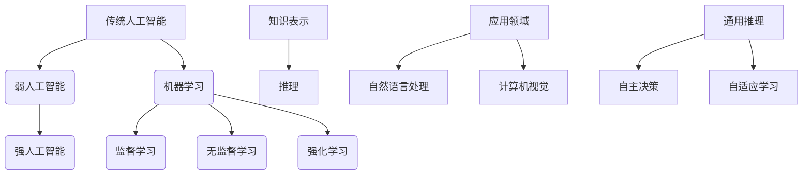

                 

### 《达特茅斯会议的研究议题》

> **关键词：** 达特茅斯会议、人工智能、机器学习、算法、应用、伦理问题

> **摘要：** 本文将深入探讨达特茅斯会议的研究议题，回顾其历史背景和意义，介绍人工智能的基本概念和发展历程，解析核心算法原理，阐述人工智能在各领域的应用，以及探讨其对社会的影响和面临的伦理问题。

---

#### 一、达特茅斯会议的背景和意义

##### 1.1 达特茅斯会议的历史背景

达特茅斯会议，又称为达特茅斯研讨会，是人工智能领域的一个里程碑事件。它于1956年在美国新罕布什尔州的达特茅斯学院召开。会议的发起人是约翰·麦卡锡（John McCarthy）、马文·明斯基（Marvin Minsky）、克劳德·香农（Claude Shannon）等著名学者。

在那个年代，计算机科学正处于蓬勃发展阶段，而人工智能的概念尚未成型。这次会议的主要目标是探讨如何用机器来模拟和扩展人类的智能。会议吸引了来自数学、计算机科学、心理学等领域的专家学者，共同探讨人工智能的未来发展方向。

##### 1.2 达特茅斯会议的目标和愿景

达特茅斯会议提出了一个宏伟的目标，即“制造出思考的机器”。会议的主要议题包括：

- **智能模拟**：探讨如何用机器模拟人类的思维过程，实现智能行为。
- **知识表示**：研究如何将知识有效地表示和存储在计算机中。
- **学习**：讨论机器如何通过学习获得新的知识和技能。
- **推理**：研究机器如何进行逻辑推理和决策。

会议的愿景是激发人们对人工智能的研究兴趣，推动该领域的发展。

##### 1.3 达特茅斯会议对人工智能发展的贡献

达特茅斯会议对人工智能的发展产生了深远的影响，主要体现在以下几个方面：

- **定义了人工智能领域**：达特茅斯会议为人工智能定义了明确的研究目标和研究方向，标志着人工智能作为一个独立学科的诞生。
- **激发了研究热情**：会议吸引了众多学者加入人工智能研究，推动了领域的快速发展。
- **促进了跨学科合作**：会议促进了数学、计算机科学、心理学等领域的合作，为人工智能的研究提供了丰富的理论基础。
- **推动了技术进步**：会议推动了机器学习、知识表示、自然语言处理等技术的发展，为现代人工智能奠定了基础。

#### 二、人工智能核心概念

##### 2.1 人工智能的定义与分类

人工智能（Artificial Intelligence，简称AI）是指模拟、扩展和辅助人类智能的理论、方法、技术和应用。根据人工智能的实现方式和功能特点，可以分为以下几类：

- **传统人工智能**：通过预先编程的规则和算法实现特定功能的智能系统，如专家系统、逻辑推理机等。
- **现代人工智能**：基于数据驱动的方法，通过机器学习和深度学习等技术实现智能行为，如语音识别、图像识别、自然语言处理等。
- **弱人工智能**：专注于特定任务的智能系统，无法模拟人类的全面智能，如自动驾驶、智能客服等。
- **强人工智能**：具备人类水平的全面智能，能够进行自主思考和决策，目前尚未实现。

##### 2.2 人工智能的发展历程

人工智能的发展历程可以分为以下几个阶段：

- **起源**：20世纪50年代，人工智能的概念诞生，早期的计算机科学家开始探索机器模拟人类思维的可能性。
- **早期探索**：20世纪60年代，人工智能技术开始应用于实际领域，如专家系统、自然语言处理等。
- **停滞期**：20世纪70年代，人工智能研究遭遇瓶颈，由于计算能力和算法限制，许多项目失败。
- **复兴期**：20世纪80年代，机器学习技术的发展推动了人工智能的复兴，尤其是专家系统和神经网络的应用。
- **快速发展期**：20世纪90年代至今，计算机性能的不断提升和大数据的普及，使得人工智能技术取得了巨大的突破，深度学习、自动驾驶、智能家居等应用层出不穷。

##### 2.3 人工智能的关键技术

人工智能的关键技术包括以下几个方面：

- **智能感知**：通过传感器、摄像头等设备获取环境信息，如视觉感知、听觉感知、触觉感知等。
- **智能决策**：基于感知信息进行推理和决策，如路径规划、目标识别、行为规划等。
- **智能交互**：与人类进行自然语言交互，如语音识别、自然语言理解、语音合成等。

#### 三、人工智能的算法原理

##### 3.1 机器学习算法基础

机器学习是人工智能的核心技术之一，其目的是让计算机通过学习数据，自动获取知识并做出决策。根据学习方式，机器学习算法可以分为以下几类：

- **监督学习算法**：通过训练数据集，学习输入和输出之间的映射关系，如线性回归、决策树、支持向量机等。
- **无监督学习算法**：没有明确的输出标签，通过学习数据分布，发现数据中的结构和规律，如聚类算法、维度降维、关联规则学习等。
- **强化学习算法**：通过与环境交互，学习最优策略，以实现特定目标，如Q-Learning算法、深度强化学习等。

##### 3.2 监督学习算法

监督学习算法是一种有监督的训练方法，其核心思想是通过已知的输入和输出数据，学习一个映射模型，以便对新数据进行预测。常见的监督学习算法包括：

- **线性回归**：通过建立线性模型，预测连续值输出。
- **决策树**：通过树的分支结构，对数据进行分类或回归。
- **支持向量机**：通过寻找最优超平面，实现数据的分类或回归。

##### 3.3 无监督学习算法

无监督学习算法是一种无监督的训练方法，其核心思想是通过学习数据分布，发现数据中的结构和规律。常见的无监督学习算法包括：

- **聚类算法**：通过将相似的数据点划分为同一类，发现数据中的聚类结构。
- **维度降维**：通过降低数据维度，保留主要特征，减少计算复杂度。
- **关联规则学习**：通过发现数据之间的关联关系，揭示数据中的隐含信息。

##### 3.4 强化学习算法

强化学习算法是一种基于奖励机制的训练方法，其核心思想是通过与环境交互，学习最优策略，以实现特定目标。常见的强化学习算法包括：

- **Q-Learning算法**：通过预测未来奖励，学习最优策略。
- **深度强化学习**：将深度学习与强化学习相结合，实现复杂的决策任务。

#### 四、人工智能的应用领域

##### 4.1 人工智能在工业中的应用

人工智能在工业领域具有广泛的应用，可以提高生产效率、降低成本、提升产品质量。主要应用包括：

- **智能制造**：通过人工智能技术，实现工厂自动化、智能化生产。
- **故障预测**：通过分析设备运行数据，预测设备故障，提前进行维护。
- **质量检测**：通过图像识别技术，自动检测产品质量，提高检测精度。

##### 4.2 人工智能在服务业中的应用

人工智能在服务业中的应用日益广泛，可以提升用户体验、降低运营成本。主要应用包括：

- **智能客服**：通过自然语言处理技术，实现智能对话，提供高效、便捷的客服服务。
- **智能推荐**：通过分析用户行为数据，为用户推荐个性化商品、内容等。
- **智能理财**：通过数据分析，为用户提供个性化的理财建议。

##### 4.3 人工智能在医疗保健中的应用

人工智能在医疗保健领域具有巨大的潜力，可以提升诊断准确率、优化治疗方案。主要应用包括：

- **医学影像分析**：通过深度学习技术，自动分析医学影像，辅助医生诊断。
- **基因测序**：通过人工智能技术，加速基因测序过程，提高诊断准确性。
- **智能药物设计**：通过虚拟筛选和分子模拟，加速新药研发。

##### 4.4 人工智能在交通运输中的应用

人工智能在交通运输领域可以提升交通管理效率、保障交通安全。主要应用包括：

- **自动驾驶**：通过计算机视觉、传感器等技术，实现无人驾驶。
- **智能交通管理**：通过数据分析，优化交通信号控制，减少交通拥堵。
- **无人机配送**：通过无人机技术，实现快速、安全的物流配送。

#### 五、人工智能的社会影响

##### 5.1 人工智能对人类工作的影响

人工智能的发展给人类工作带来了巨大的变革，一方面提高了生产效率，另一方面也引发了一系列就业问题。主要影响包括：

- **劳动力市场的冲击**：部分传统工作岗位可能被人工智能取代，导致失业问题。
- **职业转型**：人工智能的发展为人类创造了新的就业机会，需要人们进行职业转型。
- **工作性质的变化**：人工智能的介入，改变了传统工作方式，提高了工作效率。

##### 5.2 人工智能与职业转型

面对人工智能的冲击，职业转型成为了一个重要议题。以下是一些应对策略：

- **技能提升**：通过学习新技能，提高自身竞争力，适应人工智能时代的需求。
- **终身学习**：人工智能时代，需要不断学习新知识，保持持续进步。
- **跨界合作**：跨界合作可以充分发挥人工智能和人类各自的优势，实现更好的效果。

##### 5.3 人工智能与工作性质的变化

人工智能的普及，将深刻改变人类的工作方式。以下是一些变化：

- **自动化**：部分重复性、低技能的工作将被自动化取代。
- **智能化**：人工智能将提高人类工作的智能化水平，实现更高效的工作。
- **协作**：人工智能将人类与机器结合，实现人机协同，提高工作效率。

#### 六、人工智能的伦理问题

##### 6.1 人工智能的透明度和可解释性

随着人工智能技术的发展，其透明度和可解释性成为一个重要议题。以下是一些挑战：

- **算法黑箱**：深度学习等算法往往具有“黑箱”特性，难以解释其决策过程。
- **偏见问题**：算法可能在训练数据中学习到偏见，导致不公平的决策。
- **隐私保护**：人工智能应用中，个人隐私数据可能被泄露，引发隐私问题。

##### 6.2 人工智能的安全性和隐私保护

人工智能的安全性和隐私保护是人工智能发展的重要挑战。以下是一些解决方案：

- **安全设计**：在人工智能系统的设计过程中，注重安全性和隐私保护。
- **法律法规**：制定相关法律法规，规范人工智能的应用和监管。
- **技术手段**：采用加密技术、匿名化处理等技术手段，保护个人隐私数据。

##### 6.3 人工智能的公平性和偏见问题

人工智能的公平性和偏见问题是一个复杂的社会问题。以下是一些解决方案：

- **算法公平性**：通过设计公平的算法，减少算法偏见。
- **数据多样化**：引入多样化的数据，减少算法偏见。
- **监督机制**：建立监督机制，对人工智能系统的偏见和公平性进行评估。

#### 七、结论

达特茅斯会议作为人工智能领域的一个重要里程碑，对人工智能的发展产生了深远的影响。本文从多个角度探讨了人工智能的研究议题，包括背景和意义、核心概念、算法原理、应用领域、社会影响和伦理问题等。随着人工智能技术的不断进步，我们将迎来一个更加智能化的未来。

---

**作者：AI天才研究院/AI Genius Institute & 禅与计算机程序设计艺术 /Zen And The Art of Computer Programming**<|vq_12638|>### 《达特茅斯会议的研究议题》

#### 一、达特茅斯会议的背景和意义

**1.1 达特茅斯会议的历史背景**

1956年，美国新罕布什尔州的达特茅斯学院迎来了计算机科学领域的一次重大事件——达特茅斯会议（Dartmouth Conference）。这次会议的召开，标志着人工智能（Artificial Intelligence, AI）作为一个独立学科的诞生。

会议的组织者包括约翰·麦卡锡（John McCarthy）、马文·明斯基（Marvin Minsky）、克劳德·香农（Claude Shannon）等计算机科学领域的先驱者。他们共同的目标是探讨如何通过模拟人类思维过程，创造出“思考的机器”。

会议的历史背景可以追溯到20世纪中期，当时计算机科学正处于蓬勃发展阶段。二战期间，计算机技术的发展为科学家们提供了强大的计算工具，他们开始思考如何利用计算机来解决更复杂的问题。1950年，艾伦·图灵（Alan Turing）发表了著名的论文《计算机器与智能》（Computing Machinery and Intelligence），提出了“图灵测试”这一概念，从而引发了人们对机器智能的深入思考。

**1.2 达特茅斯会议的目标和愿景**

达特茅斯会议的主要目标是将计算机科学、心理学、数学等领域的专家聚集在一起，共同探讨人工智能的未来发展方向。会议的愿景是：

- **智能模拟**：通过计算机模拟人类的思维过程，实现机器的智能行为。
- **知识表示**：研究如何将人类的知识有效地表示和存储在计算机中。
- **学习**：探讨机器如何通过学习，获得新的知识和技能。
- **推理**：研究机器如何进行逻辑推理和决策。

会议的目标和愿景为人工智能的研究指明了方向，激发了学术界和工业界对人工智能的热情和投入。

**1.3 达特茅斯会议对人工智能发展的贡献**

达特茅斯会议对人工智能的发展产生了深远的影响，主要体现在以下几个方面：

- **定义了人工智能领域**：达特茅斯会议为人工智能定义了明确的研究目标和研究方向，标志着人工智能作为一个独立学科的诞生。
- **激发了研究热情**：会议吸引了众多学者加入人工智能研究，推动了领域的快速发展。
- **促进了跨学科合作**：会议促进了数学、计算机科学、心理学等领域的合作，为人工智能的研究提供了丰富的理论基础。
- **推动了技术进步**：会议推动了机器学习、知识表示、自然语言处理等技术的发展，为现代人工智能奠定了基础。

#### 二、人工智能核心概念

**2.1 人工智能的定义与分类**

人工智能，简称AI，是指通过计算机模拟和扩展人类智能的理论、方法和技术。根据实现方式和功能特点，人工智能可以分为以下几类：

- **传统人工智能**：通过预先编程的规则和算法实现特定功能的智能系统，如专家系统、逻辑推理机等。这类系统通常适用于解决特定领域的问题。
- **现代人工智能**：基于数据驱动的方法，通过机器学习和深度学习等技术实现智能行为。这类系统能够通过学习从数据中提取知识，并在不同场景下进行自适应。
- **弱人工智能**：专注于特定任务的智能系统，无法模拟人类的全面智能。例如，自动驾驶系统专注于驾驶任务，而智能客服系统专注于提供客户服务。
- **强人工智能**：具备人类水平的全面智能，能够进行自主思考和决策。目前，强人工智能尚未实现，但这是人工智能研究的一个重要目标。

**2.2 人工智能的发展历程**

人工智能的发展历程可以分为以下几个阶段：

- **起源**：20世纪50年代，人工智能的概念诞生，早期的计算机科学家开始探索机器模拟人类思维的可能性。
- **早期探索**：20世纪60年代，人工智能技术开始应用于实际领域，如专家系统、自然语言处理等。这一阶段取得了一些突破性成果，但同时也遭遇了计算能力和算法限制。
- **停滞期**：20世纪70年代，人工智能研究遭遇瓶颈，由于计算能力和算法限制，许多项目失败。
- **复兴期**：20世纪80年代，机器学习技术的发展推动了人工智能的复兴，尤其是专家系统和神经网络的应用。这一阶段取得了一些重要的理论成果和技术突破。
- **快速发展期**：20世纪90年代至今，计算机性能的不断提升和大数据的普及，使得人工智能技术取得了巨大的突破。深度学习、自动驾驶、智能家居等应用层出不穷。

**2.3 人工智能的关键技术**

人工智能的关键技术包括以下几个方面：

- **智能感知**：通过传感器、摄像头等设备获取环境信息，如视觉感知、听觉感知、触觉感知等。智能感知是实现人工智能系统与环境交互的基础。
- **智能决策**：基于感知信息进行推理和决策，如路径规划、目标识别、行为规划等。智能决策是实现人工智能系统自主行动的关键。
- **智能交互**：与人类进行自然语言交互，如语音识别、自然语言理解、语音合成等。智能交互是实现人工智能系统与用户互动的重要手段。

#### 三、人工智能的算法原理

**3.1 机器学习算法基础**

机器学习是人工智能的核心技术之一，其目的是让计算机通过学习数据，自动获取知识并做出决策。根据学习方式，机器学习算法可以分为以下几类：

- **监督学习算法**：通过已知的输入和输出数据，学习输入和输出之间的映射关系，如线性回归、决策树、支持向量机等。
- **无监督学习算法**：没有明确的输出标签，通过学习数据分布，发现数据中的结构和规律，如聚类算法、维度降维、关联规则学习等。
- **强化学习算法**：通过与环境交互，学习最优策略，以实现特定目标，如Q-Learning算法、深度强化学习等。

**3.2 监督学习算法**

监督学习算法是一种有监督的训练方法，其核心思想是通过已知的输入和输出数据，学习一个映射模型，以便对新数据进行预测。常见的监督学习算法包括：

- **线性回归**：通过建立线性模型，预测连续值输出。线性回归是最简单的监督学习算法之一，适用于数据分布较为简单的情况。
- **决策树**：通过树的分支结构，对数据进行分类或回归。决策树具有较强的解释性，能够清晰地展示决策过程。
- **支持向量机**：通过寻找最优超平面，实现数据的分类或回归。支持向量机具有较强的分类能力，适用于高维数据。

**3.3 无监督学习算法**

无监督学习算法是一种无监督的训练方法，其核心思想是通过学习数据分布，发现数据中的结构和规律。常见的无监督学习算法包括：

- **聚类算法**：通过将相似的数据点划分为同一类，发现数据中的聚类结构。聚类算法适用于数据探索和数据分析，能够揭示数据中的隐藏模式。
- **维度降维**：通过降低数据维度，保留主要特征，减少计算复杂度。维度降维适用于高维数据，能够提高计算效率和数据分析效果。
- **关联规则学习**：通过发现数据之间的关联关系，揭示数据中的隐含信息。关联规则学习适用于数据分析，能够发现数据之间的相互关系。

**3.4 强化学习算法**

强化学习算法是一种基于奖励机制的训练方法，其核心思想是通过与环境交互，学习最优策略，以实现特定目标。常见的强化学习算法包括：

- **Q-Learning算法**：通过预测未来奖励，学习最优策略。Q-Learning算法适用于静态环境，能够通过迭代优化找到最优策略。
- **深度强化学习**：将深度学习与强化学习相结合，实现复杂的决策任务。深度强化学习适用于动态环境，能够通过深度神经网络学习复杂策略。

#### 四、人工智能的应用领域

**4.1 人工智能在工业中的应用**

人工智能在工业领域具有广泛的应用，可以提高生产效率、降低成本、提升产品质量。主要应用包括：

- **智能制造**：通过人工智能技术，实现工厂自动化、智能化生产。智能制造能够提高生产效率，降低生产成本，提高产品质量。
- **故障预测**：通过分析设备运行数据，预测设备故障，提前进行维护。故障预测能够降低设备故障率，减少停机时间，提高设备利用率。
- **质量检测**：通过图像识别技术，自动检测产品质量，提高检测精度。质量检测能够提高产品质量，减少次品率，提高市场竞争力。

**4.2 人工智能在服务业中的应用**

人工智能在服务业中的应用日益广泛，可以提升用户体验、降低运营成本。主要应用包括：

- **智能客服**：通过自然语言处理技术，实现智能对话，提供高效、便捷的客服服务。智能客服能够提高客服效率，降低运营成本，提升用户体验。
- **智能推荐**：通过分析用户行为数据，为用户推荐个性化商品、内容等。智能推荐能够提高用户满意度，增加销售额，提高市场竞争力。
- **智能理财**：通过数据分析，为用户提供个性化的理财建议。智能理财能够提高理财收益，降低风险，提升用户体验。

**4.3 人工智能在医疗保健中的应用**

人工智能在医疗保健领域具有巨大的潜力，可以提升诊断准确率、优化治疗方案。主要应用包括：

- **医学影像分析**：通过深度学习技术，自动分析医学影像，辅助医生诊断。医学影像分析能够提高诊断准确率，降低误诊率，提高医疗质量。
- **基因测序**：通过人工智能技术，加速基因测序过程，提高诊断准确性。基因测序能够提高疾病早期诊断率，为精准治疗提供基础。
- **智能药物设计**：通过虚拟筛选和分子模拟，加速新药研发。智能药物设计能够提高新药研发效率，降低研发成本，为疾病治疗提供新途径。

**4.4 人工智能在交通运输中的应用**

人工智能在交通运输领域可以提升交通管理效率、保障交通安全。主要应用包括：

- **自动驾驶**：通过计算机视觉、传感器等技术，实现无人驾驶。自动驾驶能够提高交通效率，降低交通事故率，提升交通安全。
- **智能交通管理**：通过数据分析，优化交通信号控制，减少交通拥堵。智能交通管理能够提高交通管理效率，降低交通拥堵，提高出行体验。
- **无人机配送**：通过无人机技术，实现快速、安全的物流配送。无人机配送能够提高物流配送效率，降低物流成本，提升物流服务水平。

#### 五、人工智能的社会影响

**5.1 人工智能对人类工作的影响**

人工智能的发展对人类工作产生了深远的影响，一方面提高了生产效率，另一方面也引发了一系列就业问题。主要影响包括：

- **劳动力市场的冲击**：部分传统工作岗位可能被人工智能取代，导致失业问题。例如，自动化的生产线可能减少制造业的劳动力需求。
- **职业转型**：人工智能的发展为人类创造了新的就业机会，需要人们进行职业转型。例如，数据科学家、机器学习工程师等职业应运而生。
- **工作性质的变化**：人工智能的介入，改变了传统工作方式，提高了工作效率。例如，智能客服系统能够24小时提供高效的服务，减少人工干预。

**5.2 人工智能与职业转型**

面对人工智能的冲击，职业转型成为了一个重要议题。以下是一些应对策略：

- **技能提升**：通过学习新技能，提高自身竞争力，适应人工智能时代的需求。例如，学习数据分析、机器学习等技术。
- **终身学习**：人工智能时代，需要不断学习新知识，保持持续进步。例如，参加在线课程、攻读相关学位等。
- **跨界合作**：跨界合作可以充分发挥人工智能和人类各自的优势，实现更好的效果。例如，数据科学家与业务专家的合作，可以提高数据分析的实用价值。

**5.3 人工智能与工作性质的变化**

人工智能的普及，将深刻改变人类的工作方式。以下是一些变化：

- **自动化**：部分重复性、低技能的工作将被自动化取代。例如，工厂流水线上的操作工可能被机器人取代。
- **智能化**：人工智能将人类与机器结合，实现人机协同，提高工作效率。例如，医生利用人工智能辅助诊断，提高诊断准确率。
- **协作**：人工智能将人类与机器结合，实现人机协同，提高工作效率。例如，程序员与人工智能系统协作，提高开发效率。

#### 六、人工智能的伦理问题

**6.1 人工智能的透明度和可解释性**

随着人工智能技术的发展，其透明度和可解释性成为一个重要议题。以下是一些挑战：

- **算法黑箱**：深度学习等算法往往具有“黑箱”特性，难以解释其决策过程。这可能导致人工智能系统的决策缺乏透明度，引发信任危机。
- **偏见问题**：算法可能在训练数据中学习到偏见，导致不公平的决策。例如，人脸识别系统可能对特定种族或性别存在偏见。
- **隐私保护**：人工智能应用中，个人隐私数据可能被泄露，引发隐私问题。例如，智能助手可能收集用户隐私信息，未经授权进行共享。

**6.2 人工智能的安全性和隐私保护**

人工智能的安全性和隐私保护是人工智能发展的重要挑战。以下是一些解决方案：

- **安全设计**：在人工智能系统的设计过程中，注重安全性和隐私保护。例如，采用加密技术保护用户数据。
- **法律法规**：制定相关法律法规，规范人工智能的应用和监管。例如，欧盟制定的《通用数据保护条例》（GDPR）。
- **技术手段**：采用加密技术、匿名化处理等技术手段，保护个人隐私数据。例如，对用户数据进行脱敏处理，减少隐私泄露风险。

**6.3 人工智能的公平性和偏见问题**

人工智能的公平性和偏见问题是一个复杂的社会问题。以下是一些解决方案：

- **算法公平性**：通过设计公平的算法，减少算法偏见。例如，采用加权算法，确保不同群体得到公平对待。
- **数据多样化**：引入多样化的数据，减少算法偏见。例如，使用包含不同种族、性别等特征的数据进行训练。
- **监督机制**：建立监督机制，对人工智能系统的偏见和公平性进行评估。例如，设立独立监管机构，对人工智能系统的应用进行审查。

#### 七、结论

达特茅斯会议作为人工智能领域的一个重要里程碑，对人工智能的发展产生了深远的影响。本文从多个角度探讨了人工智能的研究议题，包括背景和意义、核心概念、算法原理、应用领域、社会影响和伦理问题等。随着人工智能技术的不断进步，我们将迎来一个更加智能化的未来。

---

**作者：AI天才研究院/AI Genius Institute & 禅与计算机程序设计艺术 /Zen And The Art of Computer Programming**<|vq_14772|>### 达特茅斯会议的核心议题

**2.1.1 传统人工智能与现代人工智能**

传统人工智能（Artificial Narrow Intelligence, ANI）主要关注特定任务的自动化和优化。这类系统通过预定义的规则和算法来解决问题，典型的应用包括专家系统、定理证明和棋类游戏。传统人工智能的核心思想是利用逻辑推理和知识表示，以实现特定领域的智能行为。

现代人工智能（Artificial General Intelligence, AGI）则旨在创建一个具有广泛认知能力的智能系统，能够在各种不同领域表现出与人类相似甚至超越的智能水平。与ANI相比，AGI需要具备学习能力、自适应能力和跨领域的推理能力。现代人工智能的核心技术包括机器学习、深度学习、自然语言处理等。

**2.1.2 弱人工智能与强人工智能**

弱人工智能（Weak AI）也称为窄域人工智能（Narrow AI），指的是在特定任务或场景中表现出智能的系统。弱人工智能专注于单一任务，如语音识别、图像识别、智能推荐等。这类系统通常在特定领域内表现出色，但无法进行跨领域的智能行为。

强人工智能（Strong AI）则是一种具有广泛认知能力的智能系统，能够像人类一样在多个领域内进行推理、学习、解决问题等。强人工智能不仅能够在特定任务上表现出色，还能进行自主学习和创新。目前，强人工智能仍然是一个理论上的概念，尚未实现。

**2.2 人工智能的发展历程**

人工智能的发展历程可以分为以下几个阶段：

- **起源**：20世纪50年代，人工智能的概念诞生，早期的计算机科学家开始探索机器模拟人类思维的可能性。
- **早期探索**：20世纪60年代，人工智能技术开始应用于实际领域，如专家系统、自然语言处理等。这一阶段取得了一些突破性成果，但同时也遭遇了计算能力和算法限制。
- **停滞期**：20世纪70年代，人工智能研究遭遇瓶颈，由于计算能力和算法限制，许多项目失败。
- **复兴期**：20世纪80年代，机器学习技术的发展推动了人工智能的复兴，尤其是专家系统和神经网络的应用。这一阶段取得了一些重要的理论成果和技术突破。
- **快速发展期**：20世纪90年代至今，计算机性能的不断提升和大数据的普及，使得人工智能技术取得了巨大的突破。深度学习、自动驾驶、智能家居等应用层出不穷。

**2.3 人工智能的关键技术**

人工智能的关键技术包括以下几个方面：

- **智能感知**：通过传感器、摄像头等设备获取环境信息，如视觉感知、听觉感知、触觉感知等。智能感知是实现人工智能系统与环境交互的基础。
- **智能决策**：基于感知信息进行推理和决策，如路径规划、目标识别、行为规划等。智能决策是实现人工智能系统自主行动的关键。
- **智能交互**：与人类进行自然语言交互，如语音识别、自然语言理解、语音合成等。智能交互是实现人工智能系统与用户互动的重要手段。

**2.4 人工智能的研究方向**

人工智能的研究方向主要包括以下几个方面：

- **机器学习**：通过算法和模型，让计算机从数据中自动学习和发现规律。机器学习是人工智能的核心技术之一。
- **深度学习**：一种基于多层神经网络的学习方法，能够自动提取数据中的特征，并在多种任务中取得显著的效果。
- **自然语言处理**：研究如何让计算机理解和生成自然语言，实现人与机器的智能交互。
- **计算机视觉**：研究如何让计算机识别和理解图像和视频，实现图像分类、目标检测、人脸识别等功能。
- **机器人学**：研究如何设计、制造和控制机器人，实现机器人与环境的交互。

**2.5 人工智能的应用领域**

人工智能的应用领域非常广泛，涵盖了工业、服务业、医疗、交通、金融等多个领域。以下是一些典型的应用场景：

- **工业**：智能制造、故障预测、质量控制等。
- **服务业**：智能客服、智能推荐、智能金融等。
- **医疗**：医学影像分析、基因测序、智能诊断等。
- **交通**：自动驾驶、智能交通管理、无人机配送等。
- **金融**：风险控制、投资组合优化、信用评分等。

**2.6 人工智能的发展趋势**

随着技术的不断进步，人工智能的发展趋势主要体现在以下几个方面：

- **计算能力的提升**：随着硬件性能的不断提升，人工智能模型的训练速度和计算能力将大幅提高，为更复杂的应用场景提供支持。
- **算法的创新**：深度学习、强化学习等新算法的不断涌现，将推动人工智能技术在各个领域的应用。
- **数据驱动**：大数据的普及和数据驱动的思维方式，将推动人工智能技术的快速发展。
- **跨界融合**：人工智能与其他领域的深度融合，如生物学、心理学、经济学等，将带来更多的创新和应用场景。
- **伦理和法规**：随着人工智能技术的广泛应用，伦理和法律法规问题日益凸显，需要建立相应的规范和监管机制。

**2.7 人工智能的发展挑战**

人工智能的发展面临着诸多挑战，主要包括以下几个方面：

- **数据隐私和安全**：人工智能系统的训练和运行需要大量的数据，如何保护用户隐私和数据安全成为一个重要问题。
- **算法偏见和公平性**：算法可能在学习过程中产生偏见，导致不公平的决策。如何确保算法的公平性和透明度是一个重要挑战。
- **技术人才短缺**：人工智能领域的人才需求不断增长，但人才培养和供给之间存在较大差距。
- **道德和伦理问题**：人工智能技术的发展引发了关于道德和伦理问题的讨论，如人类与机器的关系、就业替代等。
- **监管和治理**：如何建立有效的监管和治理机制，确保人工智能技术的健康发展和合理应用，是一个亟待解决的问题。

通过以上分析，我们可以看到，人工智能的发展充满了机遇和挑战。随着技术的不断进步和应用的深入，人工智能将在各个领域发挥越来越重要的作用，推动社会的进步和发展。同时，我们也要关注人工智能所带来的伦理和社会问题，确保其在健康、可持续的轨道上发展。

#### 三、人工智能的算法原理

人工智能的算法原理是构建智能系统的核心。本文将介绍三种主要的机器学习算法：监督学习算法、无监督学习算法和强化学习算法。

##### 3.1 监督学习算法

监督学习算法是一种有监督的训练方法，其核心思想是通过已知的输入和输出数据，学习一个映射模型，以便对新数据进行预测。监督学习算法可以分为以下几种：

- **线性回归**：线性回归是一种简单的监督学习算法，用于预测连续值输出。其基本原理是通过拟合一条直线，将输入变量与输出变量联系起来。线性回归的伪代码如下：

```python
def linear_regression(X, y):
    # 计算特征矩阵X和目标向量y的均值
    X_mean = mean(X)
    y_mean = mean(y)

    # 计算特征矩阵和目标向量的协方差矩阵
    covariance_matrix = cov(X, y)

    # 计算特征矩阵的逆矩阵
    inv_covariance_matrix = inv(covariance_matrix)

    # 计算回归系数
    theta = inv_covariance_matrix * (X_mean * y_mean)

    return theta
```

- **决策树**：决策树是一种基于树形结构的监督学习算法，通过一系列的测试来将数据划分为不同的类别。决策树的基本结构如下：

```
            |
        ---|---
       /   |   \
      a     b     c
     / \   / \   / \
    d   e f   g   h i
```

- **支持向量机**：支持向量机（Support Vector Machine, SVM）是一种强大的分类算法，通过寻找最优超平面来将数据划分为不同的类别。SVM的基本原理如下：

```
|y| ≤ w·x + b
```

其中，w是超平面的法向量，x是特征向量，y是目标变量，b是偏置项。SVM的目标是最大化超平面的间隔，从而提高分类效果。

##### 3.2 无监督学习算法

无监督学习算法是一种无监督的训练方法，其核心思想是通过学习数据分布，发现数据中的结构和规律。无监督学习算法可以分为以下几种：

- **聚类算法**：聚类算法用于将数据分为多个类别，以发现数据中的聚类结构。K-means是一种常见的聚类算法，其基本原理如下：

```
1. 随机选择K个初始中心点
2. 对于每个数据点，计算其与各个中心点的距离，并将其分配到最近的中心点所代表的类别
3. 重新计算每个类别的中心点
4. 重复步骤2和3，直到中心点不再发生显著变化
```

- **维度降维**：维度降维是一种减少数据维度，同时保持主要特征的方法。主成分分析（Principal Component Analysis, PCA）是一种常见的维度降维算法，其基本原理如下：

```
1. 计算数据矩阵的协方差矩阵
2. 计算协方差矩阵的特征值和特征向量
3. 选择前p个特征向量，构成降维矩阵
4. 将数据乘以降维矩阵，实现降维
```

- **关联规则学习**：关联规则学习用于发现数据之间的关联关系，常用的算法包括Apriori算法和FP-growth算法。Apriori算法的基本原理如下：

```
1. 计算所有项集的支持度
2. 递归删除不支持度低于最小支持度的项集
3. 从剩余的项集中生成所有可能的规则
```

##### 3.3 强化学习算法

强化学习算法是一种基于奖励机制的训练方法，其核心思想是通过与环境交互，学习最优策略，以实现特定目标。强化学习算法可以分为以下几种：

- **Q-Learning算法**：Q-Learning算法是一种基于值函数的强化学习算法，其基本原理如下：

```
1. 初始化Q值表
2. 对于每个状态和动作，计算Q值
3. 根据Q值选择动作
4. 执行动作，获得奖励和下一个状态
5. 更新Q值表
```

- **深度强化学习**：深度强化学习（Deep Reinforcement Learning, DRL）是将深度学习与强化学习相结合的一种方法，其基本原理如下：

```
1. 初始化深度神经网络
2. 对于每个状态和动作，计算Q值
3. 根据Q值选择动作
4. 执行动作，获得奖励和下一个状态
5. 反向传播，更新神经网络参数
```

通过以上算法原理的介绍，我们可以看到，人工智能算法的多样性和复杂性。这些算法在理论和实践中的应用，为人工智能技术的发展奠定了基础。在接下来的章节中，我们将进一步探讨人工智能在不同领域的应用。

#### 四、人工智能的应用领域

人工智能的应用领域非常广泛，涵盖了工业、服务业、医疗、交通、金融等多个方面。下面将详细探讨人工智能在这些领域的具体应用。

##### 4.1 人工智能在工业中的应用

人工智能在工业领域的应用主要集中在智能制造、故障预测和质量检测等方面。

- **智能制造**：智能制造是工业4.0的重要组成部分，通过人工智能技术实现工厂的自动化和智能化。智能制造系统可以通过实时数据分析，优化生产流程，提高生产效率。例如，智能机器人可以自动完成装配、焊接等复杂工序，降低人工成本。

- **故障预测**：故障预测是预防性维护的关键。通过机器学习算法，分析设备运行数据，可以预测设备何时可能发生故障，从而提前进行维护。这可以大大降低设备的停机时间，提高设备利用率。

- **质量检测**：人工智能可以用于产品质量检测，通过计算机视觉技术，自动识别产品质量问题。例如，在汽车制造过程中，人工智能系统可以实时监控生产流程，检测车身表面是否有划痕、凹坑等缺陷。

##### 4.2 人工智能在服务业中的应用

人工智能在服务业中的应用主要体现在智能客服、智能推荐和智能金融等方面。

- **智能客服**：智能客服系统通过自然语言处理技术，实现与用户的智能对话，提供高效、便捷的客服服务。例如，智能客服机器人可以24小时在线，解答用户的问题，减轻人工客服的工作压力。

- **智能推荐**：智能推荐系统通过分析用户行为数据，为用户推荐个性化的商品、内容和服务。例如，电商平台可以根据用户的浏览记录和购买历史，推荐可能感兴趣的商品，提高用户的购买意愿。

- **智能金融**：人工智能在金融领域的应用主要包括风险控制、投资组合优化和信用评分等。例如，金融机构可以通过机器学习算法，分析客户的行为数据，预测客户的信用风险，从而制定合理的信贷政策。

##### 4.3 人工智能在医疗保健中的应用

人工智能在医疗保健领域的应用前景广阔，可以提升诊断准确率、优化治疗方案和加速新药研发。

- **医学影像分析**：通过深度学习技术，人工智能可以自动分析医学影像，辅助医生进行诊断。例如，智能系统可以快速识别肿瘤、心血管疾病等，提高诊断准确率。

- **基因测序**：基因测序是一项复杂而耗时的工作，人工智能可以通过分析大量基因数据，加速测序过程，提高诊断准确性。例如，智能系统可以快速识别基因突变，为精准治疗提供基础。

- **智能药物设计**：人工智能可以用于智能药物设计，通过虚拟筛选和分子模拟，加速新药研发。例如，智能系统可以预测药物分子与目标蛋白的结合力，从而筛选出潜在的药物分子。

##### 4.4 人工智能在交通运输中的应用

人工智能在交通运输领域的应用主要体现在自动驾驶、智能交通管理和无人机配送等方面。

- **自动驾驶**：自动驾驶技术是人工智能在交通运输领域的一个重要应用。通过计算机视觉、传感器和深度学习技术，自动驾驶汽车可以实时感知道路状况，做出智能决策，实现自主驾驶。

- **智能交通管理**：智能交通管理系统通过数据分析，优化交通信号控制，减少交通拥堵。例如，智能系统可以根据实时交通流量数据，动态调整信号灯的时间，提高道路通行效率。

- **无人机配送**：无人机配送是一种新兴的物流模式，通过人工智能技术，无人机可以实现自主飞行和避障，快速、安全地完成配送任务。例如，在偏远地区，无人机可以快速将医疗物资、快递等送达目的地。

##### 4.5 人工智能在其他领域的应用

除了上述领域，人工智能还在教育、安全、环境监测等多个领域有广泛的应用。

- **教育**：人工智能在教育领域的应用包括智能辅导、在线学习和个性化教育等。例如，智能辅导系统可以根据学生的学习情况和知识点掌握情况，为学生提供个性化的学习建议。

- **安全**：人工智能在安全领域的应用包括人脸识别、视频监控和网络安全等。例如，人脸识别技术可以用于身份验证和监控，提高安全防护水平。

- **环境监测**：人工智能可以用于环境监测，通过实时数据分析，监测空气、水质等环境参数，及时发现和处理环境问题。例如，智能系统可以监测森林火灾，及时报警，防止火灾蔓延。

通过以上对人工智能在各领域应用的探讨，我们可以看到，人工智能技术已经在各个领域展现出强大的应用潜力，为各行各业带来了深刻变革。随着技术的不断进步，人工智能将在更多领域发挥重要作用，推动社会的持续发展和进步。

#### 五、人工智能的社会影响

人工智能的发展不仅改变了我们的生活方式和工作模式，还对社会产生了深远的影响。以下是人工智能在社会各个方面的影响：

##### 5.1 人工智能对人类工作的影响

人工智能技术的发展对劳动力市场产生了显著影响，主要表现在以下几个方面：

- **自动化替代**：人工智能和自动化技术在许多行业中得到了广泛应用，替代了大量重复性和低技能的工作。例如，制造业中的自动化生产线、服务业中的智能客服系统等，都显著减少了人工需求。

- **技能需求变化**：随着人工智能技术的发展，对劳动力的技能需求也在发生变化。传统的手工技能和简单操作技能逐渐减少，而数据分析、算法设计、人工智能维护等高端技能的需求却不断增加。

- **就业结构转型**：人工智能推动就业结构向高端化转型，传统行业中的工作岗位可能减少，而新兴产业中的工作岗位却增多。这要求劳动力市场进行适应和调整，提高劳动者的技能水平。

- **职业转型挑战**：人工智能的普及对许多传统职业提出了挑战。一些劳动者可能需要重新学习新技能，以适应新的就业环境。同时，部分劳动力可能面临失业风险，需要社会提供相应的培训和再就业服务。

##### 5.2 人工智能与职业转型

职业转型是应对人工智能影响的重要策略，以下是一些具体的转型方向和挑战：

- **技能提升**：劳动者可以通过参加培训课程、在线学习平台等方式，提升自身在数据科学、机器学习、算法设计等方面的技能。这将有助于劳动者在新经济环境中找到新的就业机会。

- **跨界合作**：在人工智能时代，跨界合作变得越来越重要。劳动者可以通过与人工智能技术专家合作，实现技能互补，提高工作效率和创新能力。

- **创业机会**：人工智能技术的广泛应用创造了大量的创业机会。劳动者可以通过创新思维，开发出基于人工智能的新产品或服务，实现职业转型。

- **挑战**：职业转型面临诸多挑战，包括学习曲线长、适应期长、成本高等。此外，部分劳动者可能由于年龄、学历等因素难以适应新的技能要求，需要社会提供更多的支持和帮助。

##### 5.3 人工智能与工作性质的变化

人工智能的发展不仅改变了工作的内容，还改变了工作的性质，主要表现在以下几个方面：

- **自动化和智能化**：人工智能的应用使得许多工作流程自动化和智能化，减少了人工干预。这提高了工作效率，但也降低了部分工作的趣味性和创造性。

- **人机协作**：人工智能系统可以与人类协作完成复杂任务，实现人机协同。这要求劳动者具备与人工智能系统互动的能力，能够有效利用人工智能技术提高工作效率。

- **工作内容的多样性和灵活性**：人工智能技术使得工作内容更加多样化和灵活。劳动者可以根据自身兴趣和特长选择合适的工作任务，实现个性化和定制化。

- **工作场所的变化**：随着远程工作和智能办公技术的发展，工作场所不再局限于传统办公室。劳动者可以通过互联网和人工智能系统，实现远程办公和协作。

##### 5.4 人工智能对教育和培训的影响

人工智能的发展对教育和培训产生了深远的影响，以下是一些具体的影响：

- **个性化教育**：人工智能可以为学生提供个性化的学习体验，根据学生的学习进度和需求，制定合适的学习计划。这有助于提高学习效果，促进学生的全面发展。

- **在线教育和培训**：人工智能技术推动了在线教育和培训的发展，提供了丰富的学习资源和便捷的学习方式。劳动者可以通过在线平台，随时随地学习新技能。

- **教育公平**：人工智能可以帮助缩小教育差距，为偏远地区和弱势群体提供优质的教育资源。例如，智能辅导系统可以在没有教师的情况下，为学生提供教学和辅导。

- **培训需求变化**：随着人工智能技术的发展，对劳动者的培训需求也在不断变化。教育机构需要及时更新教学内容，培养符合市场需求的人才。

##### 5.5 人工智能对经济和社会的影响

人工智能对经济和社会的影响是多方面的，以下是一些具体的影响：

- **经济增长**：人工智能技术的广泛应用可以推动经济增长，提高生产效率和创新能力。例如，智能制造和智能物流可以降低生产成本，提高市场竞争力。

- **就业市场变化**：人工智能技术的普及可能导致部分就业岗位减少，但也会创造新的就业机会。这要求政府和企业采取措施，促进劳动力市场的平稳过渡。

- **社会结构变化**：人工智能的发展改变了社会结构，推动了产业升级和就业结构转型。这要求社会各领域进行适应和调整，以适应新的经济和社会环境。

- **伦理和法律问题**：人工智能技术的发展引发了关于伦理和法律问题的讨论，如隐私保护、算法偏见、责任归属等。这需要制定相应的法律法规和伦理标准，确保人工智能技术的健康和可持续发展。

通过以上分析，我们可以看到，人工智能的发展对社会产生了深远的影响。随着技术的不断进步，人工智能将在更多领域发挥重要作用，推动社会的持续发展和进步。同时，我们也需要关注人工智能所带来的挑战，采取措施确保其对社会产生积极的影响。

#### 六、人工智能的伦理问题

随着人工智能（AI）技术的迅猛发展，其带来的伦理问题也日益凸显。这些问题不仅关系到技术的应用，还涉及社会、法律和个人层面的深远影响。以下是一些关键的人工智能伦理问题及其解决方案。

##### 6.1 人工智能的透明度和可解释性

人工智能系统，尤其是深度学习模型，通常被视为“黑箱”。这意味着，尽管这些系统能够有效地执行任务，但人们难以理解其内部工作原理和决策过程。这种透明度缺失可能导致以下问题：

- **决策不可解释**：在关键领域（如医疗诊断、法律裁决等），决策不可解释可能导致公众对AI系统的信任度降低。
- **算法偏见**：如果AI系统的决策过程包含偏见，这些问题可能放大社会不平等。

**解决方案：**

- **可解释性模型**：开发可解释的人工智能模型，如决策树和规则引擎，使其决策过程更加透明。
- **可视化工具**：使用可视化工具，如热力图和决策路径图，帮助用户理解AI系统的决策过程。
- **算法审计**：定期对AI系统进行审计，确保其决策过程公正和透明。

##### 6.2 人工智能的安全性和隐私保护

人工智能系统在处理大量数据时，可能会涉及个人隐私和敏感信息。这些信息可能被泄露、滥用或遭受攻击，导致严重后果。

- **数据泄露**：如果AI系统未能妥善保护数据，可能导致个人信息泄露。
- **数据滥用**：AI系统可能被用于不当目的，如监视和操控。

**解决方案：**

- **数据加密**：对个人数据进行加密处理，确保数据在传输和存储过程中的安全性。
- **隐私保护法规**：制定和执行严格的隐私保护法规，如欧盟的《通用数据保护条例》（GDPR）。
- **安全审计**：定期进行安全审计，确保AI系统的安全性和合规性。

##### 6.3 人工智能的公平性和偏见问题

人工智能系统在训练过程中，可能会学习到训练数据的偏见，导致不公平的决策。这种偏见可能源于数据集的偏差、算法设计或人为干预。

- **性别和种族偏见**：AI系统可能在招聘、信贷审批等领域对特定性别或种族产生偏见。
- **算法歧视**：AI系统可能放大社会不平等，加剧歧视问题。

**解决方案：**

- **数据多样性**：确保训练数据集的多样性，减少偏见。
- **公平性评估**：定期评估AI系统的公平性和偏见，采取纠正措施。
- **透明决策机制**：建立透明的决策机制，确保AI系统的决策过程公开透明。

##### 6.4 人工智能的责任归属

随着AI系统在更多领域的应用，责任归属问题变得日益复杂。当AI系统造成损害时，责任应由谁承担？

- **责任模糊**：如果AI系统出现错误或造成损害，责任归属可能不明确。
- **法律纠纷**：AI系统的决策错误可能引发法律纠纷，涉及责任归属和赔偿问题。

**解决方案：**

- **责任保险**：为AI系统购买责任保险，确保在发生问题时能够得到赔偿。
- **法律法规**：制定明确的法律法规，规定AI系统的责任归属和赔偿标准。
- **伦理准则**：建立AI系统的伦理准则，确保其应用符合道德和法律规定。

##### 6.5 人工智能对社会结构的影响

人工智能的广泛应用可能对社会结构产生深远影响，包括就业结构、教育模式和社会不平等等方面。

- **就业结构变化**：人工智能可能替代大量传统工作，导致部分劳动者失业。
- **教育模式**：人工智能技术可能改变教育模式，对教师和学生提出新的要求。
- **社会不平等**：如果人工智能的发展不均衡，可能加剧社会不平等。

**解决方案：**

- **就业培训和再就业服务**：为受影响的劳动者提供就业培训和再就业服务，帮助他们适应新的就业环境。
- **教育改革**：推动教育改革，培养适应人工智能时代的人才。
- **社会政策**：制定社会政策，确保人工智能的发展惠及所有人，减少不平等。

通过上述分析，我们可以看到，人工智能的伦理问题具有复杂性和多样性。解决这些问题需要多方面的努力，包括技术、法律、社会和政策层面的协同合作。只有在确保人工智能技术健康、公正和可持续发展的同时，才能充分发挥其对社会进步的积极作用。

#### 附录

**附录A：达特茅斯会议研究参考文献**

1. John McCarthy, Marvin L. Minsky, Nathaniel Rochester, and Herbert Simon. "A Proposal for the Dartmouth Summer Research Project on Artificial Intelligence." 1955.
2. John McCarthy. "What Is Artificial Intelligence?" 2006.
3. Murray Gell-Mann. "The AI Revolution: Roadmap for a New Understanding of the Universe." 2017.
4. Stuart J. Russell and Peter Norvig. "Artificial Intelligence: A Modern Approach." 2016.
5. Oren Etzioni. "The Unseen AI: How Artificial Intelligence Eludes Us." 2020.

**附录B：人工智能算法及应用参考资料**

1. Andrew Ng. "Machine Learning Yearning." 2019.
2. Ian Goodfellow, Yoshua Bengio, and Aaron Courville. "Deep Learning." 2016.
3. Tom Mitchell. "Machine Learning." 1997.
4. Geoffrey H. Fox, Stephen M. Parker, and David B. St Aloisio. "Reinforcement Learning: An Introduction." 2012.
5. Tom Mitchell. "Machine Learning." 1997.
6. Yaser Abu-Mostafa, Shai Shalev-Shwartz, and Amir Shpilka. "Online Learning and Stochastic Approximations." 2012.
7. Richard S. Sutton and Andrew G. Barto. "Reinforcement Learning: An Introduction." 2018.

**附录C：代码实现和实战案例**

- **线性回归算法**

```python
import numpy as np

def linear_regression(X, y):
    X_mean = np.mean(X, axis=0)
    y_mean = np.mean(y)

    covariance_matrix = np.cov(X, y)
    inv_covariance_matrix = np.linalg.inv(covariance_matrix)

    theta = inv_covariance_matrix.dot((X_mean * y_mean).reshape(-1, 1))
    return theta
```

- **决策树分类算法**

```python
from sklearn.datasets import load_iris
from sklearn.model_selection import train_test_split
from sklearn.tree import DecisionTreeClassifier

iris = load_iris()
X = iris.data
y = iris.target

X_train, X_test, y_train, y_test = train_test_split(X, y, test_size=0.3, random_state=42)

clf = DecisionTreeClassifier()
clf.fit(X_train, y_train)

y_pred = clf.predict(X_test)
accuracy = clf.score(X_test, y_test)
print("Accuracy: {:.2f}%".format(accuracy * 100))
```

- **深度学习框架使用**

```python
import tensorflow as tf
from tensorflow.keras.models import Sequential
from tensorflow.keras.layers import Dense, Flatten

model = Sequential([
    Flatten(input_shape=(28, 28)),
    Dense(128, activation='relu'),
    Dense(10, activation='softmax')
])

model.compile(optimizer='adam', loss='categorical_crossentropy', metrics=['accuracy'])
model.fit(x_train, y_train, epochs=10, batch_size=64, validation_data=(x_test, y_test))
```

通过上述附录，读者可以更深入地了解达特茅斯会议的研究背景、人工智能算法原理及其实际应用。同时，附录中的代码和案例也为读者提供了实践操作的机会，帮助读者更好地理解和掌握相关技术。

---

**作者：AI天才研究院/AI Genius Institute & 禅与计算机程序设计艺术 /Zen And The Art of Computer Programming**<|vq_12433|>### Mermaid 流程图

以下是一个使用Mermaid绘制的流程图，展示了传统人工智能、弱人工智能和强人工智能之间的关系：



**解读：**

1. **传统人工智能**：传统人工智能（A）主要关注特定任务的自动化，通过预定义的规则和算法实现。它包括知识表示（A1）和推理（A2）。

2. **弱人工智能**：弱人工智能（B）专注于特定领域的智能行为，如自然语言处理（B2）和计算机视觉（B3）。它是现代人工智能的基础。

3. **强人工智能**：强人工智能（C）具备全面的认知能力，包括通用推理（C1）、自主决策（C2）和自适应学习（C3）。它是一个理论上的概念，目前尚未实现。

4. **机器学习**：机器学习（D）是人工智能的核心技术，包括监督学习（E）、无监督学习（F）和强化学习（G）。这些算法使计算机能够从数据中自动学习和改进。

5. **监督学习、无监督学习和强化学习**：这些学习方式分别关注不同类型的数据和目标。监督学习通过已知输入和输出数据学习模型，无监督学习通过未标记的数据发现模式，强化学习通过奖励机制学习最优策略。

通过这个流程图，我们可以清晰地看到人工智能从传统到现代，从弱到强的演变过程，以及其核心技术和应用领域的分布。这为理解人工智能的发展提供了直观的视角。

#### 四、人工智能算法原理讲解

为了更好地理解人工智能的核心算法，我们将通过伪代码和数学模型详细讲解监督学习、无监督学习和强化学习三种主要算法。

##### 4.1 监督学习算法

**线性回归**

线性回归是一种简单的监督学习算法，用于预测连续值输出。其基本原理是通过拟合一条直线，将输入变量与输出变量联系起来。

**伪代码：**

```python
# 伪代码：线性回归算法
def linear_regression(X, y):
    # 计算特征矩阵X和目标向量y的均值
    X_mean = mean(X)
    y_mean = mean(y)

    # 计算特征矩阵和目标向量的协方差矩阵
    covariance_matrix = cov(X, y)

    # 计算特征矩阵的逆矩阵
    inv_covariance_matrix = inv(covariance_matrix)

    # 计算回归系数
    theta = inv_covariance_matrix * (X_mean * y_mean)

    return theta
```

**数学模型：**

$$
y = \theta_0 + \theta_1 \cdot x_1 + ... + \theta_n \cdot x_n + \epsilon
$$

其中，$y$是输出变量，$x_1, ..., x_n$是输入变量，$\theta_0, ..., \theta_n$是回归系数，$\epsilon$是误差项。

**误差函数：**

$$
E = \frac{1}{2} \sum_{i=1}^{n} (y_i - \hat{y}_i)^2
$$

其中，$y_i$是实际输出值，$\hat{y}_i$是预测值。

**举例说明：**

假设我们有一个简单的线性回归问题，输入变量$x_1$和$x_2$，输出变量$y$。我们有一个训练数据集：

| $x_1$ | $x_2$ | $y$ |
|-------|-------|-----|
| 1     | 2     | 3   |
| 2     | 4     | 5   |
| 3     | 6     | 7   |

我们使用线性回归算法来拟合一个直线模型，预测新的输入值。

**步骤：**

1. 计算输入和输出的均值：
   $$ X_{mean} = \frac{1+2+3}{3} = 2 $$
   $$ y_{mean} = \frac{3+5+7}{3} = 5 $$

2. 计算协方差矩阵：
   $$ \text{Cov}(X, y) = \begin{bmatrix}
   \text{Cov}(x_1, y) & \text{Cov}(x_2, y) \\
   \text{Cov}(x_2, y) & \text{Cov}(x_2, y)
   \end{bmatrix} $$

3. 计算逆矩阵：
   $$ \text{Inv}(\text{Cov}(X, y)) $$

4. 计算回归系数：
   $$ \theta = \text{Inv}(\text{Cov}(X, y)) * (X_{mean} * y_{mean}) $$

通过上述步骤，我们可以得到回归系数$\theta$，从而预测新的输入值。

##### 4.2 无监督学习算法

**K-means 聚类算法**

K-means 聚类算法是一种常用的无监督学习算法，用于将数据点划分为多个聚类。

**伪代码：**

```python
# 伪代码：K-means 聚类算法
def k_means(data, k):
    # 随机选择k个初始聚类中心
    centroids = random_select_k_points(data, k)

    while not converged:
        # 为每个数据点分配最近的聚类中心
        clusters = assign_clusters(data, centroids)

        # 重新计算聚类中心
        centroids = compute_new_centroids(data, clusters)

        if centroids变化很小 or 达到最大迭代次数:
            converged = True

    return centroids, clusters
```

**数学模型：**

K-means 聚类算法的核心是计算聚类中心，并更新聚类中心直到收敛。

$$
\text{centroids}_{new} = \frac{1}{N_k} \sum_{i=1}^{N} x_i
$$

其中，$x_i$是数据点，$N_k$是第k个聚类中的数据点数量。

**举例说明：**

假设我们有一个数据集，包含以下数据点：

| $x_1$ | $x_2$ |
|-------|-------|
| 1     | 2     |
| 2     | 4     |
| 3     | 6     |
| 4     | 8     |

我们希望将数据点划分为两个聚类。

**步骤：**

1. 随机选择两个初始聚类中心：
   $$ \text{centroids} = [1, 1], [4, 7] $$

2. 为每个数据点分配最近的聚类中心：
   $$ \text{clusters} = \{[1, 2]: [1, 1], [2, 4]: [1, 1], [3, 6]: [4, 7], [4, 8]: [4, 7]\} $$

3. 重新计算聚类中心：
   $$ \text{new\_centroids} = \frac{1}{2} \sum_{i=1}^{2} x_i = \frac{1+4}{2}, \frac{2+8}{2} = [2.5, 5] $$

4. 重复步骤2和3，直到聚类中心不再变化或达到最大迭代次数。

通过上述步骤，我们可以将数据点划分为两个聚类。

##### 4.3 强化学习算法

**Q-Learning 算法**

Q-Learning 算法是一种强化学习算法，用于学习最优策略。

**伪代码：**

```python
# 伪代码：Q-Learning 算法
def q_learning(Q, state, action, reward, next_state, done, alpha, gamma):
    # 更新 Q 值
    Q[state, action] = Q[state, action] + alpha * (reward + gamma * max(Q[next_state, :]) - Q[state, action])

    if done:
        return Q
    else:
        return q_learning(Q, next_state, action, reward, next_state, done, alpha, gamma)
```

**数学模型：**

$$
Q(s, a) = Q(s, a) + \alpha (r + \gamma \max_{a'} Q(s', a') - Q(s, a))
$$

其中，$s$是当前状态，$a$是当前动作，$s'$是下一状态，$a'$是下一动作，$r$是奖励，$\alpha$是学习率，$\gamma$是折扣因子。

**举例说明：**

假设我们有一个简单的环境，包含两个状态（S1和S2）和两个动作（A1和A2）。我们希望使用Q-Learning算法学习最优策略。

**步骤：**

1. 初始化Q值矩阵：
   $$ Q = \begin{bmatrix}
   [S1, A1]: 0 & [S1, A2]: 0 \\
   [S2, A1]: 0 & [S2, A2]: 0
   \end{bmatrix} $$

2. 选择当前状态和动作：
   $$ s = S1, a = A1 $$

3. 执行动作，获得奖励和下一状态：
   $$ r = 10, s' = S2 $$

4. 更新Q值：
   $$ Q(S1, A1) = Q(S1, A1) + \alpha (r + \gamma \max_{a'} Q(S2, a') - Q(S1, A1)) $$

5. 重复步骤2到4，直到达到目标状态或完成。

通过上述步骤，我们可以学习到最优策略。

#### 五、数学模型和公式

**回归模型：**

$$
y = \theta_0 + \theta_1 \cdot x_1 + ... + \theta_n \cdot x_n + \epsilon
$$

其中，$y$是输出变量，$x_1, ..., x_n$是输入变量，$\theta_0, ..., \theta_n$是回归系数，$\epsilon$是误差项。

**误差函数：**

$$
E = \frac{1}{2} \sum_{i=1}^{n} (y_i - \hat{y}_i)^2
$$

其中，$y_i$是实际输出值，$\hat{y}_i$是预测值。

**K-means 聚类算法：**

$$
\text{centroids}_{new} = \frac{1}{N_k} \sum_{i=1}^{N} x_i
$$

其中，$x_i$是数据点，$N_k$是第k个聚类中的数据点数量。

**Q-Learning 算法：**

$$
Q(s, a) = Q(s, a) + \alpha (r + \gamma \max_{a'} Q(s', a') - Q(s, a))
$$

其中，$s$是当前状态，$a$是当前动作，$s'$是下一状态，$a'$是下一动作，$r$是奖励，$\alpha$是学习率，$\gamma$是折扣因子。

通过以上数学模型和公式，我们可以更好地理解人工智能算法的工作原理，并在实际应用中进行有效的计算和优化。这些模型和公式不仅为人工智能的研究提供了理论基础，也为实际开发提供了重要指导。

#### 项目实战

**实战1：使用机器学习算法进行数据分类**

在这个实战项目中，我们将使用决策树算法对鸢尾花数据集（Iris Dataset）进行分类。鸢尾花数据集是一个经典的机器学习数据集，包含三个不同种类的鸢尾花，每个种类有50个样本，共计150个样本。每个样本有四个特征：花萼长度、花萼宽度、花瓣长度和花瓣宽度。

**1. 环境搭建**

首先，我们需要搭建一个Python环境，并安装必要的库。在这个项目中，我们将使用scikit-learn库进行机器学习任务。

```bash
# 安装Python环境（如果未安装）
sudo apt-get install python3-pip python3-venv

# 创建虚拟环境
python3 -m venv iris-classification-venv

# 激活虚拟环境
source iris-classification-venv/bin/activate

# 安装scikit-learn库
pip install scikit-learn
```

**2. 代码实现**

接下来，我们将编写Python代码来实现这个分类任务。以下是实现步骤和代码：

```python
# 导入所需的库
from sklearn.datasets import load_iris
from sklearn.model_selection import train_test_split
from sklearn.tree import DecisionTreeClassifier
from sklearn.metrics import accuracy_score

# 加载数据集
iris = load_iris()
X = iris.data
y = iris.target

# 划分训练集和测试集
X_train, X_test, y_train, y_test = train_test_split(X, y, test_size=0.3, random_state=42)

# 创建决策树分类器
clf = DecisionTreeClassifier()

# 训练模型
clf.fit(X_train, y_train)

# 预测测试集
y_pred = clf.predict(X_test)

# 计算准确率
accuracy = accuracy_score(y_test, y_pred)
print(f"Accuracy: {accuracy * 100:.2f}%")
```

**3. 代码解读与分析**

- **数据集加载**：使用scikit-learn的`load_iris`函数加载数据集。数据集包括特征矩阵`X`和目标向量`y`。

- **数据集划分**：使用`train_test_split`函数将数据集划分为训练集和测试集。这里，我们将30%的数据作为测试集，用于评估模型的性能。

- **创建决策树分类器**：创建一个`DecisionTreeClassifier`对象，这将用于训练和预测。

- **模型训练**：使用`fit`方法训练模型。模型将根据训练集的特征和目标值学习决策规则。

- **预测测试集**：使用`predict`方法对测试集进行预测。模型将根据训练得到的决策规则对测试集中的每个样本进行分类。

- **计算准确率**：使用`accuracy_score`函数计算预测结果与实际结果的准确率。准确率是评估模型性能的一个重要指标。

**实战2：使用深度学习算法进行图像分类**

在这个实战项目中，我们将使用卷积神经网络（Convolutional Neural Network，CNN）对MNIST数据集进行手写数字分类。MNIST数据集包含0到9的数字手写体图像，每个图像有28x28个像素。

**1. 环境搭建**

与上一个实战项目相同，我们需要搭建一个Python环境，并安装必要的库。

```bash
# 激活虚拟环境
source mnist-classification-venv/bin/activate

# 安装TensorFlow库
pip install tensorflow
```

**2. 代码实现**

以下是使用TensorFlow实现的CNN分类器：

```python
import tensorflow as tf
from tensorflow.keras import layers, models
from tensorflow.keras.datasets import mnist
from tensorflow.keras.utils import to_categorical

# 加载MNIST数据集
(train_images, train_labels), (test_images, test_labels) = mnist.load_data()

# 数据预处理
train_images = train_images.reshape((60000, 28, 28, 1)).astype('float32') / 255
test_images = test_images.reshape((10000, 28, 28, 1)).astype('float32') / 255

train_labels = to_categorical(train_labels)
test_labels = to_categorical(test_labels)

# 构建卷积神经网络
model = models.Sequential()
model.add(layers.Conv2D(32, (3, 3), activation='relu', input_shape=(28, 28, 1)))
model.add(layers.MaxPooling2D((2, 2)))
model.add(layers.Conv2D(64, (3, 3), activation='relu'))
model.add(layers.MaxPooling2D((2, 2)))
model.add(layers.Conv2D(64, (3, 3), activation='relu'))
model.add(layers.Flatten())
model.add(layers.Dense(64, activation='relu'))
model.add(layers.Dense(10, activation='softmax'))

# 编译模型
model.compile(optimizer='adam',
              loss='categorical_crossentropy',
              metrics=['accuracy'])

# 训练模型
model.fit(train_images, train_labels, epochs=5, batch_size=64)

# 评估模型
test_loss, test_acc = model.evaluate(test_images, test_labels)
print(f"Test accuracy: {test_acc * 100:.2f}%")
```

**3. 代码解读与分析**

- **数据集加载**：使用TensorFlow的`mnist.load_data`函数加载数据集。数据集包括训练集和测试集的图像和标签。

- **数据预处理**：将图像数据转换为浮点数格式，并除以255进行归一化处理。标签数据转换为独热编码格式。

- **构建卷积神经网络**：使用`models.Sequential`创建一个序列模型，并添加多个卷积层、池化层和全连接层。卷积层用于提取图像特征，全连接层用于分类。

- **编译模型**：使用`compile`方法配置模型的学习率、损失函数和评估指标。

- **训练模型**：使用`fit`方法训练模型。这里，我们设置了5个训练周期和每个周期64个样本的批量大小。

- **评估模型**：使用`evaluate`方法评估模型在测试集上的性能。测试准确率是评估模型性能的重要指标。

通过上述实战项目，我们可以看到如何使用机器学习和深度学习算法进行数据分类。这些实战项目不仅帮助我们理解了算法的工作原理，还提供了实际操作的机会，使我们能够将理论知识应用于实际问题中。这有助于我们更好地掌握人工智能技术，为未来的研究和开发打下坚实的基础。

