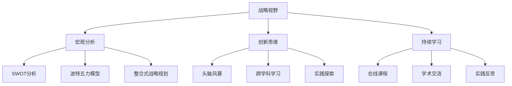

                 

### 《远见卓识：培养战略性思维的领导力》

关键词：战略性思维、领导力、决策、组织规划、案例分析、能力培养

摘要：在快速变化的信息时代，战略性思维已成为领导者不可或缺的能力。本文旨在探讨战略性思维的定义、基础概念及其在领导力、组织战略规划中的应用。通过分析成功与失败案例，我们提出了一系列培养战略性思维的方法，以期为读者提供实用的指导。

---
### 《远见卓识：培养战略性思维的领导力》目录大纲

本文将分为七个部分，系统探讨战略性思维在领导力中的应用与实践。

#### 第一部分：引言与背景
- **1.1 书籍简介**
- **1.2 战略性思维的重要性**

#### 第二部分：战略性思维的基础概念
- **2.1 战略性思维的定义与特点**
- **2.2 战略性思维的核心要素**
  - **2.2.1 战略视野**
  - **2.2.2 宏观分析**
  - **2.2.3 创新思维**
  - **2.2.4 持续学习**
- **2.3 战略性思维的理论框架**
  - **2.3.1 SWOT分析**
  - **2.3.2 波特五力模型**
  - **2.3.3 整合式战略规划**
- **2.4 战略性思维的Mermaid流程图**

#### 第三部分：培养战略性思维的能力
- **3.1 战略性思维的培养方法**
  - **3.1.1 阅读与学习**
  - **3.1.2 实践与反思**
  - **3.1.3 模拟与演练**
  - **3.1.4 持续改进**
- **3.2 战略性思维的案例分析**
  - **3.2.1 成功案例分析**
  - **3.2.2 失败案例分析**
  - **3.2.3 案例分析与讨论**

#### 第四部分：战略性思维在领导力中的应用
- **4.1 领导力与战略性思维的关系**
  - **4.1.1 领导力模型**
  - **4.1.2 战略性思维对领导力的影响**
  - **4.1.3 战略性思维的领导风格**
- **4.2 战略性思维在领导决策中的应用**
  - **4.2.1 决策框架**
  - **4.2.2 决策分析方法**
  - **4.2.3 决策误区与对策**
- **4.3 战略性思维在团队管理中的应用**
  - **4.3.1 团队角色与责任**
  - **4.3.2 团队激励与凝聚**
  - **4.3.3 战略性思维的团队建设**

#### 第五部分：战略性思维在组织战略规划中的应用
- **5.1 组织战略规划的概念与原则**
  - **5.1.1 组织战略规划概述**
  - **5.1.2 组织战略规划的原则**
  - **5.1.3 战略规划流程**
- **5.2 战略性思维在战略规划中的应用**
  - **5.2.1 战略目标设定**
  - **5.2.2 战略路径选择**
  - **5.2.3 战略实施与监控**

#### 第六部分：战略性思维的挑战与应对
- **6.1 战略性思维的挑战**
  - **6.1.1 战略性思维的障碍**
  - **6.1.2 战略性思维的误区**
  - **6.1.3 战略性思维的挑战**
- **6.2 战略性思维的应对策略**
  - **6.2.1 提升战略意识**
  - **6.2.2 建立战略思维模型**
  - **6.2.3 加强战略沟通与协作**

#### 第七部分：结论与展望
- **7.1 战略性思维的重要性**
- **7.2 战略性思维的实践价值**
- **7.3 未来战略性思维的发展趋势**

---
### 第一部分：引言与背景

在现代商业环境中，领导者所面临的挑战日益复杂。信息技术的发展、全球化进程的加速、市场需求的快速变化，都要求领导者具备前瞻性和战略思维。然而，许多领导者往往在应对突发状况、制定长远规划时感到困惑。这种情况下，战略性思维的重要性愈发凸显。

#### 1.1 书籍简介

《远见卓识：培养战略性思维的领导力》是一本旨在帮助领导者提升战略性思维的书籍。作者结合了丰富的实践经验，从理论到实践，全面阐述了战略性思维的定义、核心要素及其在领导力中的应用。书中通过大量的案例分析，深入剖析了成功与失败的原因，为读者提供了宝贵的借鉴。

#### 1.2 战略性思维的重要性

战略性思维是指领导者在面对复杂环境时，能够高瞻远瞩、审时度势，从而制定出科学合理的决策和战略。战略性思维的重要性体现在以下几个方面：

1. **提高决策质量**：战略性思维帮助领导者从全局出发，综合考虑各种因素，从而做出更为明智的决策。
2. **增强应变能力**：在快速变化的环境中，领导者需要具备敏锐的洞察力和前瞻性，以应对突发事件。
3. **实现可持续发展**：战略性思维使领导者能够制定长期规划，确保组织的可持续发展。
4. **提升团队凝聚力**：领导者通过战略性思维，能够明确团队目标，激发团队成员的积极性，提高团队凝聚力。

---
### 第二部分：战略性思维的基础概念

战略性思维是一种高度综合性的能力，它不仅仅涉及对当前状况的把握，更强调对未来发展趋势的预测和规划。理解战略性思维的基础概念是培养这种思维能力的第一步。

#### 2.1 战略性思维的定义与特点

战略性思维可以定义为一种基于长远视角，综合运用各种知识和技能，对组织内外部环境进行深入分析，从而制定出科学合理的发展战略和决策过程。其特点主要包括：

1. **前瞻性**：战略性思维强调对未来的预见性，帮助领导者把握趋势，抓住机遇。
2. **系统性**：战略性思维注重从整体角度出发，综合分析组织内外部各种因素，以实现系统优化。
3. **创新性**：战略性思维鼓励领导者跳出传统思维模式，勇于创新，寻找新的解决方案。
4. **适应性**：战略性思维强调根据环境变化调整战略，以保持组织的竞争力。

#### 2.2 战略性思维的核心要素

战略性思维的核心要素包括战略视野、宏观分析、创新思维和持续学习。

**2.2.1 战略视野**

战略视野是指领导者对组织长期目标和未来发展趋势的洞察力。它要求领导者具备宽广的视野，能够站在更高的角度审视组织的发展。战略视野的培养可以从以下几个方面入手：

1. **加强理论学习**：通过阅读相关书籍、参加研讨会等方式，提高对战略理论的理解。
2. **拓宽知识面**：关注行业动态、政策法规等，了解不同领域的发展趋势。
3. **实践锻炼**：通过实际项目运作，锻炼对复杂问题的分析和决策能力。

**2.2.2 宏观分析**

宏观分析是指对组织所处外部环境的全面分析和评估。这包括对市场趋势、竞争格局、政策法规等方面的分析。宏观分析的能力对战略性思维至关重要，因为它帮助领导者理解外部环境的变化，并据此调整战略。

1. **市场研究**：通过市场调研，了解消费者的需求和竞争对手的动向。
2. **政策解读**：关注政策法规的变动，预测其对组织可能产生的影响。
3. **竞争分析**：分析竞争对手的优势和劣势，找到自己的定位和差异化策略。

**2.2.3 创新思维**

创新思维是战略性思维的重要组成部分，它要求领导者具备创造性和突破性的思维方式。创新思维可以通过以下方法培养：

1. **头脑风暴**：通过集体讨论，激发创造性思维。
2. **跨学科学习**：学习不同领域的知识，拓展思维视野。
3. **实践探索**：勇于尝试新方法、新技术，积累实践经验。

**2.2.4 持续学习**

持续学习是战略性思维得以保持和发展的关键。在快速变化的环境中，领导者需要不断学习新知识、新技能，以适应不断变化的需求。持续学习的途径包括：

1. **在线课程**：利用网络资源，参加各种在线课程。
2. **学术交流**：参加学术会议、研讨会，与同行交流经验。
3. **实践反思**：通过实际工作，总结经验教训，不断提升自己。

---
### 第三部分：战略性思维的理论框架

战略性思维不仅依赖于个人的直觉和经验，更需要系统的理论框架作为指导。在战略性思维的理论框架中，SWOT分析、波特五力模型和整合式战略规划是最为常用的工具。

#### 3.1 SWOT分析

SWOT分析是一种战略规划方法，用于评估一个组织或项目的优势（Strengths）、劣势（Weaknesses）、机会（Opportunities）和威胁（Threats）。SWOT分析的步骤如下：

1. **优势分析**：识别组织的核心竞争力、独特优势等。
2. **劣势分析**：识别组织的不足之处、潜在问题等。
3. **机会分析**：识别外部环境中可能带来的发展机遇。
4. **威胁分析**：识别外部环境中可能带来的风险和挑战。

**示例**：假设某公司要开展一项新的业务，可以通过SWOT分析来确定该业务的发展前景。

- **优势**：拥有强大的研发团队、丰富的市场资源。
- **劣势**：市场营销能力不足、资金有限。
- **机会**：行业前景看好、潜在客户需求增长。
- **威胁**：竞争对手强大、政策法规变动。

通过SWOT分析，公司可以明确自己的定位，制定相应的战略措施。

#### 3.2 波特五力模型

波特五力模型是一种用于分析行业竞争力的工具，它包括以下五个方面：

1. **行业竞争者**：分析行业内的主要竞争者及其竞争策略。
2. **潜在竞争者**：评估行业内新进入者的威胁。
3. **供应商**：分析供应商的议价能力和对行业的影响。
4. **买家**：分析买家的议价能力和对行业的影响。
5. **替代品**：评估替代品对行业的影响。

**示例**：以智能手机行业为例，分析其竞争力。

- **行业竞争者**：苹果、三星、华为等。
- **潜在竞争者**：小米、一加等。
- **供应商**：三星电子、索尼等。
- **买家**：消费者、企业用户等。
- **替代品**：平板电脑、智能家居设备等。

通过波特五力模型，可以更清晰地了解智能手机行业的竞争态势，为公司的战略决策提供参考。

#### 3.3 整合式战略规划

整合式战略规划是一种全面的战略规划方法，它将组织的目标、资源、能力与外部环境相结合，以实现组织的长期发展。整合式战略规划的步骤如下：

1. **设定目标**：明确组织的长期和短期目标。
2. **资源评估**：评估组织的资源状况，包括财务、人力、技术等。
3. **能力建设**：识别和培养组织所需的能力。
4. **战略制定**：根据目标、资源和能力，制定具体的战略措施。
5. **实施与监控**：确保战略的有效实施，并进行持续的监控和调整。

**示例**：某公司计划进入智能家居市场，可以通过整合式战略规划来制定相应策略。

- **目标**：成为智能家居市场的领导者。
- **资源评估**：拥有强大的技术研发团队、一定的资金支持。
- **能力建设**：提高产品质量、加强市场营销。
- **战略制定**：推出创新产品、建立品牌形象、拓展销售渠道。
- **实施与监控**：定期评估市场反馈，调整战略方向。

通过整合式战略规划，公司可以系统地制定和实施战略，提高市场竞争力。

---
### 2.4 战略性思维的Mermaid流程图

为了更好地理解和应用战略性思维，我们可以使用Mermaid语言绘制一个流程图，以展示战略性思维的关键步骤和逻辑关系。

这张Mermaid流程图展示了战略性思维的核心要素和它们之间的相互关系。通过这个流程图，我们可以更直观地理解如何系统地培养战略性思维。

---
### 第三部分：培养战略性思维的能力

战略性思维不是与生俱来的，而是可以通过系统的学习和实践逐步培养。以下我们将讨论几种培养战略性思维的方法，包括阅读与学习、实践与反思、模拟与演练以及持续改进。

#### 3.1 战略性思维的培养方法

**3.1.1 阅读与学习**

阅读和学习是培养战略性思维的基础。通过阅读相关书籍、研究论文和行业报告，领导者可以获取最新的理论知识和发展动态。以下是一些建议的阅读材料：

- **经典管理书籍**：《创新与企业家精神》、《竞争战略》等。
- **行业报告**：各行业的研究报告和市场分析。
- **学术期刊**：管理学、经济学等领域的学术期刊。

**示例**：某领导者为了培养战略性思维，可以制定一个阅读计划，每周阅读两本书，每个月阅读两篇行业报告，每季度阅读一篇学术期刊文章。

**3.1.2 实践与反思**

实践是检验真理的唯一标准。通过实际项目运作，领导者可以在真实环境中应用所学的理论，锻炼自己的决策和战略规划能力。同时，反思是战略性思维提升的重要环节。领导者需要在项目结束后，进行深入的反思，总结经验教训。

**示例**：某公司领导者在完成一个市场拓展项目后，可以组织团队进行反思会议，讨论项目中的成功经验和不足之处，并提出改进措施。

**3.1.3 模拟与演练**

模拟与演练是一种有效的实践方法，可以帮助领导者预见可能出现的各种情况，制定相应的应对策略。通过模拟演练，领导者可以在虚拟环境中进行战略决策的练习，提高应对复杂问题的能力。

**示例**：某公司可以组织一次市场危机模拟演练，模拟一次突发的市场危机，让领导者在演练中锻炼危机处理能力。

**3.1.4 持续改进**

战略性思维不是一成不变的，而是需要不断适应环境变化进行改进。领导者需要保持对行业动态的敏感性，持续学习和更新自己的知识和技能。同时，要建立反馈机制，定期评估自己的战略决策和规划，不断进行调整和优化。

**示例**：某公司可以设立一个战略改进委员会，定期评估公司的战略执行情况，提出改进建议，确保战略规划的有效实施。

#### 3.2 战略性思维的案例分析

**3.2.1 成功案例分析**

成功案例分析是培养战略性思维的重要途径。通过研究成功企业的战略决策和执行过程，领导者可以了解战略性思维在实际应用中的方法和技巧。

**示例**：苹果公司通过持续创新，始终保持市场领先地位。其成功的关键在于战略视野的宽广、宏观分析的精准和持续学习的能力。

**3.2.2 失败案例分析**

失败案例分析同样重要。通过研究失败企业的战略决策和执行过程，领导者可以了解战略性思维中的误区和风险，避免在自身实践中重蹈覆辙。

**示例**：某互联网公司因盲目扩张，导致资源浪费和市场份额下降。其失败的原因在于缺乏宏观分析、忽视市场需求变化和过度依赖技术创新。

**3.2.3 案例分析与讨论**

通过案例分析和讨论，领导者可以在实践中提高战略性思维的运用能力。案例分析可以从多个角度进行，包括战略视野、宏观分析、创新思维和持续学习等方面。

**示例**：在一次内部培训中，某公司组织了一次案例分析讨论会，讨论了一个竞争对手的失败案例。通过讨论，团队成员提出了一系列改进建议，为公司的战略决策提供了参考。

---
### 第四部分：战略性思维在领导力中的应用

战略性思维在领导力中扮演着至关重要的角色。它不仅影响领导者的决策过程，还影响团队管理、组织战略规划等各个方面。本部分将深入探讨战略性思维在领导力中的应用，包括领导力模型、决策方法以及团队管理策略。

#### 4.1 领导力与战略性思维的关系

领导力是指领导者通过影响和激励他人，实现组织目标的能力。战略性思维是领导力的重要组成部分，它决定了领导者在复杂环境中的决策质量和组织发展方向。

**4.1.1 领导力模型**

常见的领导力模型包括行为模型、特质模型和情境模型。战略性思维与这些模型之间的关系如下：

- **行为模型**：强调领导者通过特定行为来影响他人。战略性思维可以帮助领导者识别有效的行为模式，提高领导效果。
- **特质模型**：认为领导者具有特定的个性特质。战略性思维可以帮助领导者发挥自身优势，克服潜在弱点。
- **情境模型**：强调领导行为应根据情境灵活调整。战略性思维使领导者能够准确把握情境，采取合适的领导策略。

**4.1.2 战略性思维对领导力的影响**

战略性思维对领导力的影响主要体现在以下几个方面：

1. **提高决策质量**：战略性思维使领导者能够从全局出发，综合考虑各种因素，做出更为明智的决策。
2. **增强应变能力**：战略性思维帮助领导者预见潜在风险和机遇，提高应对突发事件的能力。
3. **实现可持续发展**：战略性思维使领导者能够制定长期规划，确保组织的可持续发展。
4. **提升团队凝聚力**：战略性思维使领导者能够明确团队目标，激发团队成员的积极性，提高团队凝聚力。

**4.1.3 战略性思维的领导风格**

战略性思维决定了领导者的领导风格。以下是几种常见的战略性思维领导风格：

1. **变革型领导**：通过激发团队成员的内在动机，推动组织变革和创新。
2. **目标导向型领导**：以明确的目标为导向，推动团队朝着共同目标努力。
3. **参与型领导**：鼓励团队成员参与决策过程，提高团队决策的合理性和执行效果。

#### 4.2 战略性思维在领导决策中的应用

战略性思维在领导决策中发挥着关键作用。以下是一些战略性思维在领导决策中的应用方法和工具：

**4.2.1 决策框架**

决策框架是一种帮助领导者制定决策的系统性方法。它包括以下几个步骤：

1. **明确问题**：明确需要解决的决策问题。
2. **收集信息**：收集与决策相关的各种信息。
3. **分析信息**：分析信息，确定决策的关键因素。
4. **评估备选方案**：评估各种备选方案，选择最佳方案。
5. **制定决策**：根据评估结果，制定最终的决策。
6. **实施决策**：实施决策，并进行持续的监控和调整。

**4.2.2 决策分析方法**

决策分析方法是一种帮助领导者评估备选方案的工具。以下是一些常见的决策分析方法：

1. **成本效益分析**：评估各种备选方案的成本和效益，选择经济效益最高的方案。
2. **风险分析**：评估各种备选方案的风险，选择风险最小的方案。
3. **多因素决策分析**：综合考虑多个因素，进行综合评估，选择最优方案。
4. **决策树分析**：通过构建决策树，分析各种可能的结果和概率，选择最佳方案。

**4.2.3 决策误区与对策**

在决策过程中，领导者常常会陷入一些误区，影响决策质量。以下是一些常见的决策误区及对策：

1. **过度自信**：对策：进行风险评估，保持谦虚态度。
2. **信息不足**：对策：充分收集信息，进行深入分析。
3. **群体思维**：对策：鼓励不同意见，进行批判性思考。
4. **时间压力**：对策：合理分配时间，避免匆忙决策。

#### 4.3 战略性思维在团队管理中的应用

战略性思维在团队管理中同样具有重要意义。以下是一些战略性思维在团队管理中的应用策略：

**4.3.1 团队角色与责任**

战略性思维帮助领导者明确团队角色和责任，确保每个成员都清楚自己的职责和目标。以下是一些团队角色与责任的策略：

1. **明确职责**：为每个成员分配明确的职责，确保工作的高效执行。
2. **授权与信任**：给予团队成员足够的授权，培养他们的责任心和自主性。
3. **沟通与协作**：建立良好的沟通机制，促进团队成员之间的协作。

**4.3.2 团队激励与凝聚**

战略性思维帮助领导者激发团队的积极性和凝聚力，以下是一些团队激励与凝聚的策略：

1. **目标激励**：设定明确的目标，激发团队成员的内在动力。
2. **奖励机制**：建立公平、合理的奖励机制，激励团队成员的积极性。
3. **团队建设**：组织团队建设活动，增强团队成员之间的信任和凝聚力。

**4.3.3 战略性思维的团队建设**

战略性思维在团队建设中的应用包括以下几个方面：

1. **战略规划**：制定团队的战略规划，明确团队的发展方向和目标。
2. **能力提升**：为团队成员提供培训和发展机会，提升团队的整体能力。
3. **创新文化**：鼓励创新思维，建立鼓励创新的企业文化。

通过战略性思维在团队管理中的应用，领导者可以构建一个高效、有凝聚力的团队，实现组织的长期发展。

---
### 第五部分：战略性思维在组织战略规划中的应用

战略性思维在组织战略规划中发挥着至关重要的作用。组织战略规划是确保组织长期生存和发展的关键，而战略性思维则为这一过程提供了坚实的基础。以下我们将讨论组织战略规划的概念与原则，以及战略性思维在其中的具体应用。

#### 5.1 组织战略规划的概念与原则

**5.1.1 组织战略规划概述**

组织战略规划是指组织为了实现长期目标而制定的总体行动计划。它涉及组织的愿景、使命、价值观以及具体的战略目标和实施策略。组织战略规划的目标是确保组织在复杂多变的环境中保持竞争力，实现可持续发展。

**5.1.2 组织战略规划的原则**

组织战略规划应遵循以下原则：

1. **目标导向**：战略规划应明确组织的目标，并将其分解为具体的实施策略。
2. **系统性**：战略规划应考虑组织内部各个部门之间的协调和整合，形成合力。
3. **适应性**：战略规划应具有灵活性，能够适应环境变化和内部条件的变化。
4. **可执行性**：战略规划应具备可操作性，确保实施过程能够顺利进行。
5. **反馈机制**：战略规划应建立反馈机制，定期评估和调整战略实施效果。

**5.1.3 战略规划流程**

组织战略规划通常包括以下步骤：

1. **愿景与使命**：明确组织的长期愿景和使命。
2. **环境分析**：分析组织所处的宏观、微观环境，识别机会和挑战。
3. **资源评估**：评估组织的资源状况，包括财务、人力、技术等。
4. **目标设定**：根据环境分析和资源评估，设定具体的战略目标。
5. **战略路径选择**：制定实现战略目标的路径和策略。
6. **实施与监控**：确保战略规划的有效实施，并进行持续的监控和调整。
7. **评估与反馈**：定期评估战略规划的实施效果，根据反馈进行优化。

#### 5.2 战略性思维在战略规划中的应用

战略性思维在组织战略规划中的应用主要体现在以下几个方面：

**5.2.1 战略目标设定**

战略目标的设定是战略规划的核心环节。战略性思维帮助领导者从全局出发，综合考虑各种因素，设定科学合理的战略目标。以下是一些战略目标设定的方法：

1. **SMART原则**：战略目标应具备具体性（Specific）、可衡量性（Measurable）、可实现性（Achievable）、相关性（Relevant）和时限性（Time-bound）。
2. **平衡计分卡**：将战略目标分解为财务、客户、内部流程和学习与成长四个维度，确保全面覆盖。
3. **关键绩效指标**（KPI）：设定关键绩效指标，对战略目标的实现情况进行量化评估。

**5.2.2 战略路径选择**

战略路径选择是确保战略目标实现的关键。战略性思维帮助领导者分析各种可能的战略路径，选择最佳方案。以下是一些战略路径选择的方法：

1. **SWOT分析**：结合组织的优势、劣势、机会和威胁，选择合适的战略路径。
2. **波特五力模型**：分析行业竞争态势，确定组织在行业中的定位和战略。
3. **价值链分析**：分析组织内部价值链，优化资源配置，提高核心竞争力。

**5.2.3 战略实施与监控**

战略实施与监控是战略规划成功的关键。战略性思维帮助领导者确保战略的有效实施，并进行持续的监控和调整。以下是一些战略实施与监控的方法：

1. **项目管理**：运用项目管理工具和方法，确保战略项目的顺利实施。
2. **绩效评估**：建立绩效评估体系，对战略实施效果进行定期评估。
3. **持续改进**：根据评估结果，不断调整战略规划和实施策略，确保战略目标的实现。

通过战略性思维在组织战略规划中的应用，领导者可以制定出科学合理的战略规划，确保组织的长期发展。

---
### 第六部分：战略性思维的挑战与应对

尽管战略性思维在领导力和组织发展中具有重要意义，但在实际应用过程中，领导者常常会遇到一系列挑战。以下我们将探讨战略性思维面临的挑战及其应对策略。

#### 6.1 战略性思维的挑战

**6.1.1 战略性思维的障碍**

1. **信息过载**：在信息爆炸的时代，领导者面临大量信息，如何筛选和利用有效信息成为一大挑战。
2. **认知偏差**：人类认知过程中存在各种偏差，如过度自信、确认偏误等，这些偏差会影响战略决策的准确性。
3. **时间压力**：在快速变化的环境中，领导者需要在有限的时间内做出决策，这可能导致决策质量的下降。
4. **组织惯性**：组织内部的文化和惯性可能限制领导者实施新战略的灵活性。

**6.1.2 战略性思维的误区**

1. **过度依赖数据**：过分依赖数据分析，忽视直觉和经验的价值。
2. **追求短期效益**：忽视长期战略规划，只关注短期效益。
3. **片面强调创新**：将创新视为战略的核心，忽视其他重要因素。

**6.1.3 战略性思维的挑战**

1. **市场不确定性**：市场环境的不确定性增加了战略规划的风险。
2. **资源限制**：资源限制可能影响战略规划的全面性和实施效果。
3. **竞争压力**：激烈的市场竞争要求领导者具备更高的战略思维和决策能力。

#### 6.2 战略性思维的应对策略

**6.2.1 提升战略意识**

1. **培养战略思维习惯**：通过日常训练，提高领导者对战略问题的敏感性和思考能力。
2. **建立战略文化**：在组织内部培养战略文化，使战略思维成为每个成员的自觉行为。

**6.2.2 建立战略思维模型**

1. **构建战略框架**：制定一套系统化的战略思维框架，帮助领导者分析问题和制定战略。
2. **使用战略工具**：运用各种战略工具和方法，如SWOT分析、波特五力模型等，提高战略分析的科学性。

**6.2.3 加强战略沟通与协作**

1. **建立沟通机制**：建立有效的沟通机制，确保战略信息的畅通和及时反馈。
2. **促进团队协作**：鼓励团队成员参与战略制定和实施，提高团队的整体战略思维能力。

**6.2.4 持续改进**

1. **反思与总结**：通过定期反思和总结，不断改进战略思维方法和决策过程。
2. **学习与创新**：保持对新兴理论和实践的学习，不断创新战略思维方法。

通过应对策略的有效实施，领导者可以克服战略性思维中的挑战，提高战略决策的质量和组织的竞争力。

---
### 第七部分：结论与展望

战略性思维是现代领导者和组织成功的关键因素。通过本文的探讨，我们认识到战略性思维不仅是一种分析问题的能力，更是一种预见未来的智慧。它要求领导者具备宽广的视野、敏锐的洞察力、创新的思维方式以及持续学习的精神。

**7.1 战略性思维的重要性**

战略性思维在以下几个方面具有重要价值：

- **提高决策质量**：通过系统性分析，领导者可以做出更为明智的决策。
- **增强应变能力**：战略性思维帮助领导者预见和应对各种不确定性。
- **实现可持续发展**：战略性思维使组织能够制定长期规划，确保持续发展。
- **提升团队凝聚力**：通过明确的战略目标，激发团队成员的积极性和合作精神。

**7.2 战略性思维的实践价值**

战略性思维在实践中的应用具有广泛价值。通过阅读与学习、实践与反思、模拟与演练以及持续改进，领导者可以逐步提升战略性思维能力。案例分析更是提供了宝贵的实践经验，帮助读者理解和应用战略性思维。

**7.3 未来战略性思维的发展趋势**

随着信息技术的飞速发展，战略性思维将迎来新的发展机遇和挑战。未来战略性思维的发展趋势包括：

- **大数据与人工智能的融合**：大数据和人工智能将提供更为精准的战略分析工具。
- **跨界融合**：战略性思维将更加注重跨学科、跨领域的融合，形成综合性的战略视角。
- **动态调整**：在快速变化的环境中，战略性思维将更加注重动态调整和实时优化。

总之，战略性思维是领导者不可或缺的能力。通过本文的探讨，我们希望读者能够深入理解战略性思维的核心概念和实践方法，并在实际工作中不断提升自身的战略性思维能力，为组织的成功奠定坚实基础。

---
### 作者信息

**作者：AI天才研究院/AI Genius Institute & 禅与计算机程序设计艺术 /Zen And The Art of Computer Programming**

AI天才研究院致力于推动人工智能技术的发展和应用，致力于培养新一代AI领域的人才。同时，作者还著有多部计算机科学领域的经典著作，以其深刻的见解和独特的视角，为读者带来了丰富的知识和启示。在这本《远见卓识：培养战略性思维的领导力》中，作者结合了丰富的实践经验，为领导者提供了系统性的指导，帮助他们在复杂多变的环境中实现卓越领导。

