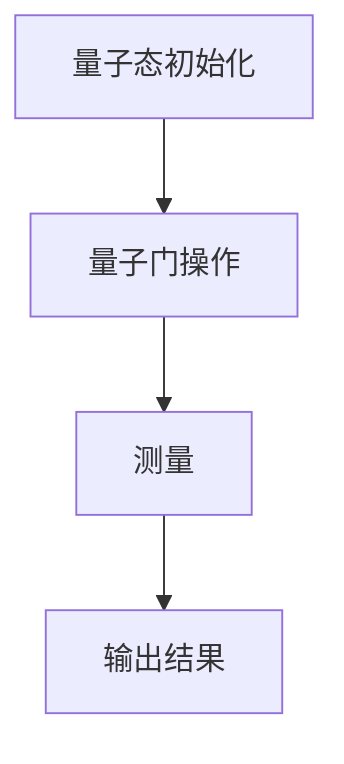
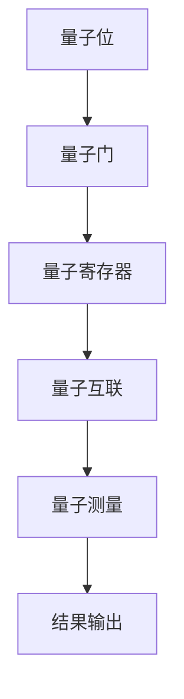
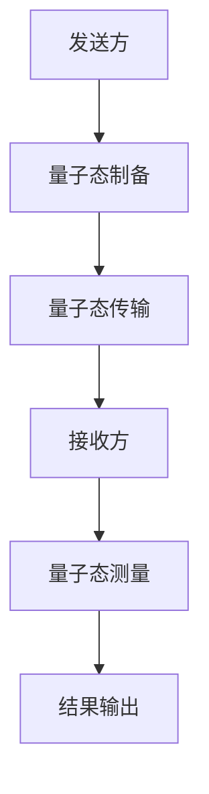
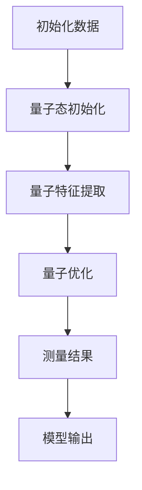
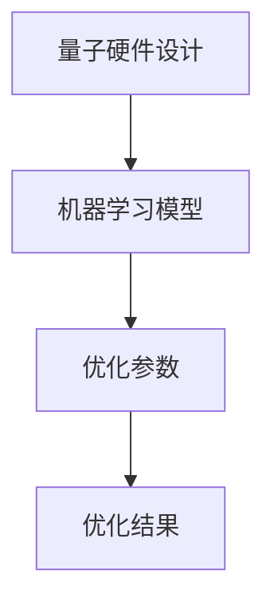

                 

# 《量子计算与AI:未来计算的协同发展》

> **关键词：** 量子计算，人工智能，协同发展，算法优化，硬件架构，跨学科合作，实际应用

> **摘要：** 本文将深入探讨量子计算与人工智能（AI）的协同发展，分析两者在基础概念、原理、硬件架构以及实际应用中的关联。通过逐步分析，揭示量子计算如何加速AI的发展，以及AI如何优化量子计算。本文旨在为读者提供一幅量子计算与AI协同发展的全景图，并展望未来两者的融合将如何改变世界。

---

## 目录大纲

### 第一部分：量子计算基础

#### 第1章：量子计算概述

##### 1.1 量子计算的基本概念

##### 1.2 量子位与经典位的比较

##### 1.3 量子计算的数学基础

#### 第2章：量子计算原理

##### 2.1 量子叠加与量子纠缠

##### 2.2 量子门操作

##### 2.3 量子计算模型

##### 2.4 量子算法简介

#### 第3章：量子计算硬件

##### 3.1 量子计算机的硬件架构

##### 3.2 量子传感与量子通信

##### 3.3 量子计算的未来发展趋势

### 第二部分：AI与量子计算

#### 第4章：AI的基本概念

##### 4.1 AI的发展历程

##### 4.2 AI的核心技术

##### 4.3 AI的应用领域

#### 第5章：量子计算在AI中的应用

##### 5.1 量子机器学习

##### 5.2 量子优化算法

##### 5.3 量子搜索算法

#### 第6章：量子计算与AI的协同发展

##### 6.1 量子计算如何加速AI

##### 6.2 AI如何优化量子计算

##### 6.3 量子计算与AI协同发展的影响

### 第三部分：实际应用与展望

#### 第7章：量子计算与AI的跨学科合作

##### 7.1 数学与量子计算的融合

##### 7.2 物理学在AI中的应用

##### 7.3 计算机科学与量子算法的结合

#### 第8章：量子计算与AI的实际应用案例

##### 8.1 金融行业的应用

##### 8.2 医药健康领域的应用

##### 8.3 物流与交通领域的应用

#### 第9章：未来展望

##### 9.1 量子计算与AI的未来趋势

##### 9.2 量子计算与AI协同发展的挑战与机遇

##### 9.3 人类与量子计算AI的未来

---

在接下来的章节中，我们将一步一步地深入探讨量子计算与人工智能的协同发展，揭示这一新兴领域的巨大潜力和未来方向。

---

## 第一部分：量子计算基础

### 第1章：量子计算概述

#### 1.1 量子计算的基本概念

量子计算是一种基于量子力学原理的计算模型，它利用量子位（qubits）进行信息处理，而量子位不同于经典计算机中的位（bits）。在经典计算机中，位只能是0或1的其中一种状态，而在量子计算机中，量子位可以同时处于0和1的状态，这种现象称为量子叠加。

**量子叠加：** 在量子力学中，量子叠加是指一个量子系统可以同时存在于多个状态中。例如，一个量子位可以在0和1的叠加态中同时存在。可以用数学表达式表示为：
\[ \psi = a|0\rangle + b|1\rangle \]
其中，\( |0\rangle \) 和 \( |1\rangle \) 分别表示量子位的基态，\( a \) 和 \( b \) 是复数，且满足 \( |a|^2 + |b|^2 = 1 \)。

**量子纠缠：** 量子纠缠是量子力学中的一种特殊现象，当两个或多个量子位发生相互作用后，它们之间的状态会相互纠缠，即使它们相隔很远，一个量子位的状态变化也会立即影响到另一个量子位的状态。这种现象被称为量子纠缠。

量子纠缠可以用以下数学模型来描述：
\[ \psi = \alpha|00\rangle + \beta|11\rangle \]
其中，\( \alpha \) 和 \( \beta \) 是复数，且满足 \( |\alpha|^2 + |\beta|^2 = 1 \)。

#### 1.2 量子位与经典位的比较

经典位（bits）和量子位（qubits）在信息存储和处理上有很大的不同。经典位只能存储0或1中的一个状态，而量子位可以同时存储0和1的叠加状态。这使得量子计算机在处理某些问题时具有超越经典计算机的能力。

| 类别      | 经Classic位（bits） | 量子位（qubits）                  |
|-----------|--------------------|----------------------------------|
| 状态数    | 2（0或1）          | 2的幂（\(2^n\)）                  |
| 存储信息  | 每位存储1比特信息  | 一个量子位可以同时存储多个比特信息 |
| 逻辑运算  | 通过逻辑门操作     | 通过量子门操作                    |

#### 1.3 量子计算的数学基础

量子计算的数学基础主要包括线性代数和量子力学。在量子计算中，所有操作都可以用线性代数中的矩阵表示。以下是几个关键的数学概念：

**量子态：** 量子态是量子系统的状态，可以用向量表示。一个n个量子位的量子态可以用一个n维向量表示。

**量子门：** 量子门是作用于量子态的线性变换，它可以看作是一个操作矩阵。量子门通过作用于量子位的状态，可以改变量子态的叠加和纠缠。

**量子算法：** 量子算法是利用量子计算模型解决问题的一系列步骤。量子算法通常涉及量子态的初始化、量子门的操作、测量等步骤。

**量子纠缠：** 量子纠缠是量子力学中的一种特殊现象，当两个或多个量子位发生相互作用后，它们之间的状态会相互纠缠，即使它们相隔很远，一个量子位的状态变化也会立即影响到另一个量子位的状态。

**量子叠加：** 量子叠加是量子力学中的一种现象，一个量子系统可以同时存在于多个状态中。例如，一个量子位可以在0和1的叠加态中同时存在。

### 第2章：量子计算原理

#### 2.1 量子叠加与量子纠缠

量子叠加和量子纠缠是量子计算的核心概念。量子叠加使得量子计算机能够处理比经典计算机更多的信息，而量子纠缠则使得量子计算机能够通过量子纠缠来传递信息。

**量子叠加：** 在量子力学中，量子系统可以同时处于多个状态的叠加。一个n个量子位的量子态可以用一个n维向量表示。例如，一个两个量子位的量子态可以表示为：
\[ \psi = \alpha|00\rangle + \beta|01\rangle + \gamma|10\rangle + \delta|11\rangle \]
其中，\( |00\rangle, |01\rangle, |10\rangle, |11\rangle \) 分别表示量子位的基态，\( \alpha, \beta, \gamma, \delta \) 是复数，且满足 \( |\alpha|^2 + |\beta|^2 + |\gamma|^2 + |\delta|^2 = 1 \)。

**量子纠缠：** 量子纠缠是量子力学中的一种特殊现象，当两个或多个量子位发生相互作用后，它们之间的状态会相互纠缠。例如，考虑两个量子位A和B，如果它们处于纠缠态，那么它们的量子态不能单独描述，只能以整体来描述。一个简单的纠缠态例子是：
\[ \psi = \frac{1}{\sqrt{2}}(|00\rangle + |11\rangle) \]
在这个纠缠态中，量子位A和B的状态是相互依赖的，即一个量子位的状态变化会立即影响到另一个量子位的状态。

#### 2.2 量子门操作

量子门是量子计算中的基本操作，类似于经典计算机中的逻辑门。量子门作用于量子态，可以改变量子态的叠加和纠缠。量子门通常是一个2x2的矩阵，表示为：
\[ U = \begin{pmatrix} a & b \\ c & d \end{pmatrix} \]
其中，\( a, b, c, d \) 是复数。

**基本量子门：** 最基本的量子门包括Hadamard门、Pauli门和控制-NOT门。

- **Hadamard门：** Hadamard门是一个2x2的量子门，可以将量子位的状态从基态叠加到另一个基态。Hadamard门的矩阵表示为：
\[ H = \frac{1}{\sqrt{2}}\begin{pmatrix} 1 & 1 \\ 1 & -1 \end{pmatrix} \]

- **Pauli门：** Pauli门是作用于单个量子位的量子门，有三种类型：\( X \)（求反门）、\( Y \)（旋转门）和\( Z \)（相位门）。Pauli门的矩阵表示为：
\[ X = \begin{pmatrix} 0 & 1 \\ 1 & 0 \end{pmatrix}, \quad Y = \begin{pmatrix} 0 & -i \\ i & 0 \end{pmatrix}, \quad Z = \begin{pmatrix} 1 & 0 \\ 0 & -1 \end{pmatrix} \]

- **控制-NOT门：** 控制-NOT门（CNOT门）是一个2x2的量子门，它将一个控制量子位的状态应用到目标量子位上。CNOT门的矩阵表示为：
\[ CNOT = \begin{pmatrix} 1 & 0 & 0 & 0 \\ 0 & 1 & 0 & 0 \\ 0 & 0 & 0 & 1 \\ 0 & 0 & 1 & 0 \end{pmatrix} \]

#### 2.3 量子计算模型

量子计算模型主要包括量子态的初始化、量子门的操作、测量等步骤。以下是一个简单的量子计算模型：

1. **量子态的初始化：** 初始化量子位的状态，通常将其初始化为基态或叠加态。

2. **量子门的操作：** 作用于量子态的量子门，改变量子态的叠加和纠缠。

3. **测量：** 对量子态进行测量，得到量子位的状态。测量结果可能是基态或叠加态中的某个状态。

以下是一个简单的量子计算模型的Mermaid流程图：



#### 2.4 量子算法简介

量子算法是利用量子计算模型解决问题的一系列步骤。量子算法通常涉及量子态的初始化、量子门的操作、测量等步骤。以下是一个简单的量子算法示例：

**Deutsch-Jozsa算法：** Deutsch-Jozsa算法是一种量子算法，用于解决一个特殊的问题：确定一个黑箱函数是否是常函数或平衡函数。算法的核心思想是通过量子叠加和纠缠来加速计算。

算法步骤如下：

1. **量子态初始化：** 将n个量子位初始化为叠加态。
2. **应用量子门：** 应用一个特定的量子门，将量子态与黑箱函数进行相互作用。
3. **测量：** 对量子态进行测量，得到一个特定的结果。
4. **分析结果：** 根据测量结果判断黑箱函数的类型。

以下是一个简单的Deutsch-Jozsa算法的伪代码：

```plaintext
输入：黑箱函数f
初始化量子态 |ψ⟩ = |+⟩^⊗n
应用量子门 U_f = |x⟩⟨x| ⊗ |0⟩⟨0|
测量量子态 |ψ⟩
如果测量结果为 |0⟩，则输出 "f是常函数"
如果测量结果为 |1⟩，则输出 "f是平衡函数"
```

### 第3章：量子计算硬件

#### 3.1 量子计算机的硬件架构

量子计算机的硬件架构与经典计算机有很大的不同。量子计算机的硬件主要包括以下几个关键部分：

1. **量子位：** 量子位（qubits）是量子计算机的基本单元，它们可以是物理系统中的原子、离子或光子等。量子位可以处于0、1或叠加态。

2. **量子门：** 量子门是作用于量子位的线性变换，用于改变量子位的状态。量子门可以通过物理操作实现，例如激光照射、磁共振等。

3. **量子寄存器：** 量子寄存器是存储量子态的单元，通常由多个量子位组成。量子寄存器用于存储和传递量子信息。

4. **量子互联：** 量子互联是指量子位之间的相互作用，用于实现量子纠缠和量子态的传输。量子互联可以通过物理连接或通信实现。

5. **量子测量：** 量子测量用于获取量子位的状态信息。量子测量会导致量子态的坍缩，即量子位的状态从叠加态变为基态。

以下是一个简单的量子计算机硬件架构的Mermaid流程图：



#### 3.2 量子传感与量子通信

量子传感和量子通信是量子计算的重要组成部分，它们利用量子力学原理实现高精度的测量和可靠的信息传输。

**量子传感：** 量子传感是指利用量子系统的特性进行高精度的测量。例如，利用量子纠缠可以实现超灵敏的磁场测量，利用量子叠加可以实现高精度的距离测量。

**量子通信：** 量子通信是指利用量子态传输信息，实现高度安全的通信。量子通信的主要特点是信息传输过程中具有不可窃听性和不可复制性，即任何对量子态的干扰都会立即被发现。

量子传感和量子通信的基本原理如下：

1. **量子纠缠：** 量子纠缠是量子通信和量子传感的基础。通过量子纠缠，两个或多个量子位可以相互关联，即使它们相隔很远。

2. **量子态的传输：** 量子通信通过量子态的传输实现信息的传输。量子态可以被视为一种特殊的载体，用于传输信息。

3. **量子测量：** 量子测量用于获取量子态的信息。在量子通信中，发送方对量子态进行测量，得到信息；在量子传感中，接收方对量子态进行测量，获取测量结果。

以下是一个简单的量子传感和量子通信的Mermaid流程图：



#### 3.3 量子计算的未来发展趋势

量子计算是一个快速发展的领域，随着技术的不断进步，量子计算机的性能将不断提高，应用范围也将不断拓展。

**技术进步：** 量子计算机的性能取决于量子位的数量和质量。随着量子位的数量增加和质量的提高，量子计算机的处理速度和计算能力将大幅提升。

**应用领域：** 量子计算在各个领域都有广泛的应用潜力。例如，在密码学中，量子计算机可以破解传统的加密算法；在材料科学中，量子计算可以加速材料结构的预测和设计；在金融领域，量子计算可以优化投资组合和风险管理。

**挑战与机遇：** 量子计算的发展面临着一系列挑战，包括量子位的稳定性、量子门的精确控制、量子纠错等。同时，量子计算也带来了巨大的机遇，它将为人类带来前所未有的计算能力，推动科学技术和社会的发展。

### 总结

量子计算是一种基于量子力学原理的计算模型，它利用量子位和量子门实现信息处理。量子计算具有超越经典计算机的能力，可以解决一些经典计算机难以解决的问题。量子计算与人工智能的协同发展将为人类社会带来巨大的变革，推动科技和社会的发展。在未来的发展中，量子计算和人工智能将相互促进，共同创造一个更加智能和高效的未来。

---

本文详细介绍了量子计算的基础概念、原理、硬件架构以及量子计算与人工智能的协同发展。通过逐步分析，我们了解了量子计算如何加速人工智能的发展，以及人工智能如何优化量子计算。接下来，我们将进一步探讨人工智能的基础概念、量子计算在人工智能中的应用，以及量子计算与人工智能的跨学科合作。

---

## 第二部分：AI与量子计算

### 第4章：AI的基本概念

#### 4.1 AI的发展历程

人工智能（AI）是一门研究、开发用于模拟、延伸和扩展人的智能的理论、方法、技术及应用系统的技术科学。人工智能的发展历程可以分为几个重要阶段：

1. **理论阶段（1950s-1960s）：** 人工智能的诞生可以追溯到1956年，当时达特茅斯会议上首次提出了人工智能的概念。这一阶段主要集中在理论探讨和基础算法的研究。

2. **早期发展阶段（1960s-1970s）：** 这一阶段出现了许多重要的算法和理论，如决策树、神经网络、专家系统等。然而，由于实际应用中的挑战和资源限制，人工智能的发展在1970年代末遭遇了第一次寒冬。

3. **复兴阶段（1980s-1990s）：** 人工智能在1980年代再次兴起，特别是机器学习和专家系统取得了重要进展。同时，计算机性能的提升为人工智能的应用提供了更好的条件。

4. **深度学习时代（2000s-现在）：** 进入21世纪，深度学习的兴起带来了人工智能的又一波高潮。深度学习在图像识别、语音识别、自然语言处理等领域取得了显著的成果，推动了人工智能的广泛应用。

#### 4.2 AI的核心技术

人工智能的核心技术包括机器学习、深度学习、自然语言处理、计算机视觉等。以下是这些核心技术的基本概念和原理：

1. **机器学习：** 机器学习是一种通过从数据中学习规律，并利用这些规律进行预测或决策的方法。机器学习可以分为监督学习、无监督学习和强化学习等类型。

   - **监督学习：** 监督学习通过输入和输出数据的对应关系进行学习，常见的算法有线性回归、决策树、支持向量机等。
   - **无监督学习：** 无监督学习不依赖输入和输出数据的对应关系，常见的算法有聚类、主成分分析等。
   - **强化学习：** 强化学习通过与环境的交互进行学习，以最大化累计奖励，常见的算法有Q-learning、深度确定性策略梯度（DDPG）等。

2. **深度学习：** 深度学习是一种基于多层神经网络的机器学习方法。通过多层的非线性变换，深度学习可以从大量数据中自动学习特征表示。

   - **卷积神经网络（CNN）：** 卷积神经网络是深度学习在计算机视觉领域的重要应用，通过卷积层提取图像的特征。
   - **循环神经网络（RNN）：** 循环神经网络是深度学习在序列数据处理领域的重要应用，通过隐藏状态的循环连接实现长期依赖建模。
   - **生成对抗网络（GAN）：** 生成对抗网络是一种无监督学习模型，通过生成器和判别器的对抗训练生成逼真的数据。

3. **自然语言处理：** 自然语言处理是一种利用计算机技术处理和理解自然语言的方法。自然语言处理的核心任务包括文本分类、情感分析、机器翻译、问答系统等。

   - **词向量：** 词向量是自然语言处理的基础，通过将词汇映射到高维空间，词向量可以捕捉词汇的语义信息。
   - **序列标注：** 序列标注是一种对文本序列进行标签标注的方法，常见的算法有条件随机场（CRF）、长短时记忆网络（LSTM）等。
   - **对话系统：** 对话系统是一种能够与人类进行自然语言交互的计算机系统，常见的模型有循环神经网络（RNN）和变换器（Transformer）等。

4. **计算机视觉：** 计算机视觉是一种使计算机能够像人类一样理解和解释视觉信息的方法。计算机视觉的核心任务包括图像分类、目标检测、图像分割等。

   - **特征提取：** 特征提取是从图像中提取具有区分性的特征，常见的算法有SIFT、HOG等。
   - **目标检测：** 目标检测是在图像中定位并识别感兴趣的目标，常见的算法有R-CNN、SSD、YOLO等。
   - **图像分割：** 图像分割是将图像划分为不同的区域，常见的算法有FCN、U-Net等。

#### 4.3 AI的应用领域

人工智能在各个领域都有广泛的应用，以下是一些重要应用领域：

1. **医疗健康：** 人工智能在医疗健康领域有广泛的应用，如疾病预测、医疗影像分析、药物设计等。

   - **疾病预测：** 人工智能可以通过分析历史医疗数据，预测疾病的发生和趋势，有助于早期诊断和预防。
   - **医疗影像分析：** 人工智能可以通过深度学习模型分析医疗影像，如X光片、CT扫描等，辅助医生进行诊断。
   - **药物设计：** 人工智能可以帮助科学家设计和筛选新药物，加速药物研发过程。

2. **金融科技：** 人工智能在金融科技领域有广泛的应用，如风险管理、信用评估、智能投顾等。

   - **风险管理：** 人工智能可以通过数据分析预测市场风险，帮助金融机构进行风险管理和投资决策。
   - **信用评估：** 人工智能可以通过分析个人信用信息，评估借款人的信用状况，降低贷款风险。
   - **智能投顾：** 智能投顾利用人工智能算法分析投资者的风险偏好，提供个性化的投资建议。

3. **智能制造：** 人工智能在智能制造领域有广泛的应用，如智能质检、生产调度、智能物流等。

   - **智能质检：** 人工智能可以通过图像识别技术对产品质量进行实时检测，提高生产效率。
   - **生产调度：** 人工智能可以帮助企业优化生产调度，提高生产效率和资源利用率。
   - **智能物流：** 人工智能可以通过路径规划、车辆调度等技术优化物流流程，降低物流成本。

4. **自动驾驶：** 人工智能在自动驾驶领域有广泛的应用，如感知、决策、控制等。

   - **感知：** 人工智能可以通过摄像头、激光雷达等传感器获取道路信息，实现环境感知。
   - **决策：** 人工智能可以通过深度学习模型进行道路场景理解和决策，如路径规划、障碍物避让等。
   - **控制：** 人工智能可以通过控制算法实现车辆的自动驾驶，如转向、加速、刹车等。

5. **智能家居：** 人工智能在智能家居领域有广泛的应用，如智能语音助手、智能安防、智能家电等。

   - **智能语音助手：** 人工智能可以通过语音识别和自然语言处理技术实现智能交互，如语音控制家电、提供信息服务等。
   - **智能安防：** 人工智能可以通过视频分析技术实现智能安防，如人脸识别、行为识别等。
   - **智能家电：** 人工智能可以通过智能控制技术实现家电的互联互通，如智能空调、智能电视等。

### 第5章：量子计算在AI中的应用

#### 5.1 量子机器学习

量子机器学习是一种利用量子计算模型进行机器学习的方法。量子计算在机器学习中的应用主要体现在两个方面：量子特征提取和量子优化。

1. **量子特征提取：** 量子特征提取利用量子计算的并行性和高效性，从数据中提取具有区分性的特征。例如，量子卷积神经网络（QCNN）可以将量子计算与卷积神经网络相结合，提高图像识别的准确率。

2. **量子优化：** 量子优化利用量子计算的优势，优化机器学习算法的训练过程。例如，量子梯度下降算法可以加速机器学习算法的收敛速度，减少训练时间。

以下是一个简单的量子机器学习模型的伪代码：

```plaintext
输入：训练数据集
初始化量子态 |ψ⟩
应用量子特征提取器
应用量子优化器
测量量子态 |ψ⟩
输出：模型参数
```

#### 5.2 量子优化算法

量子优化算法是一种利用量子计算模型解决优化问题的方法。量子优化算法在机器学习、密码学、物流等领域有广泛的应用。以下是几种常见的量子优化算法：

1. **量子遗传算法：** 量子遗传算法结合了量子计算和遗传算法的特点，通过量子态的叠加和纠缠实现全局搜索。

2. **量子模拟退火：** 量子模拟退火利用量子态的叠加和纠缠，实现能量的快速下降，求解优化问题。

3. **量子启发式搜索：** 量子启发式搜索通过量子态的叠加和纠缠，实现快速搜索最优解。

以下是一个简单的量子优化算法的伪代码：

```plaintext
输入：优化问题
初始化量子态 |ψ⟩
应用量子门操作
测量量子态 |ψ⟩
输出：最优解
```

#### 5.3 量子搜索算法

量子搜索算法是一种利用量子计算模型进行信息搜索的方法。量子搜索算法在数据库查询、图像识别等领域有广泛的应用。以下是几种常见的量子搜索算法：

1. **Grover算法：** Grover算法是一种基于量子叠加和量子纠缠的搜索算法，可以显著加速数据库查询。

2. **量子随机访问算法：** 量子随机访问算法利用量子叠加和量子纠缠，实现高效的数据库搜索。

3. **Adiabatic量子搜索：** Adiabatic量子搜索通过量子态的演化实现信息搜索，可以解决一些复杂的优化问题。

以下是一个简单的量子搜索算法的伪代码：

```plaintext
输入：数据库，查询目标
初始化量子态 |ψ⟩
应用量子门操作
测量量子态 |ψ⟩
输出：查询结果
```

### 第6章：量子计算与AI的协同发展

#### 6.1 量子计算如何加速AI

量子计算可以通过以下几个方面加速人工智能的发展：

1. **量子机器学习：** 量子机器学习利用量子计算的并行性和高效性，加速机器学习算法的训练过程。例如，量子卷积神经网络（QCNN）可以加速图像识别任务。

2. **量子优化算法：** 量子优化算法可以优化机器学习算法的训练过程，减少训练时间。例如，量子梯度下降算法可以加速神经网络模型的训练。

3. **量子搜索算法：** 量子搜索算法可以加速数据库查询和图像识别任务。例如，Grover算法可以显著加速数据库搜索。

以下是一个简单的量子计算加速机器学习算法的Mermaid流程图：



#### 6.2 AI如何优化量子计算

人工智能可以通过以下几个方面优化量子计算：

1. **量子算法设计：** 人工智能可以帮助设计更高效的量子算法，优化量子计算的性能。例如，通过机器学习模型预测量子态的演化，优化量子算法的参数。

2. **量子纠错：** 人工智能可以用于量子纠错，提高量子计算机的可靠性。例如，通过深度学习模型预测量子位的错误概率，优化量子纠错码。

3. **量子硬件优化：** 人工智能可以帮助优化量子硬件的设计和制造过程，提高量子计算机的性能。例如，通过机器学习模型优化量子传感器的性能。

以下是一个简单的AI优化量子计算的Mermaid流程图：



#### 6.3 量子计算与AI协同发展的影响

量子计算与AI的协同发展将对人类社会产生深远的影响：

1. **科技变革：** 量子计算与AI的协同发展将推动科技变革，创造新的计算能力和应用场景。

2. **经济发展：** 量子计算与AI的协同发展将带动相关产业链的发展，促进经济的增长。

3. **社会进步：** 量子计算与AI的协同发展将推动社会进步，改善人们的生活质量。

4. **伦理挑战：** 量子计算与AI的协同发展也带来了伦理挑战，需要社会共同面对和解决。

### 总结

量子计算与人工智能的协同发展是一个充满机遇和挑战的领域。量子计算通过加速机器学习算法、优化量子计算硬件和算法设计，为人工智能的发展提供了强大的支持。同时，人工智能通过优化量子算法、量子纠错和量子硬件设计，推动了量子计算的发展。量子计算与人工智能的协同发展将创造一个更加智能和高效的未来。

---

在接下来的章节中，我们将进一步探讨量子计算与人工智能的跨学科合作，分析数学、物理学和计算机科学在量子计算与人工智能中的应用，以及量子计算与人工智能在实际应用中的具体案例。通过这些分析，我们将更深入地了解量子计算与人工智能的协同发展如何改变世界。

---

## 第三部分：实际应用与展望

### 第7章：量子计算与AI的跨学科合作

#### 7.1 数学与量子计算的融合

数学是量子计算的基础，而量子计算的发展也推动了数学的进步。量子计算中的许多核心概念，如量子态、量子门、量子纠缠等，都是基于数学理论建立的。数学在量子计算中的应用主要体现在以下几个方面：

1. **线性代数：** 线性代数是量子计算的核心工具，用于描述量子态、量子门和量子计算过程。量子态可以用线性代数中的向量表示，量子门可以用矩阵表示。

2. **群论：** 群论是研究对称性的数学分支，它在量子计算中有重要应用。量子位的态空间具有交换性质，可以通过群论来描述。

3. **拓扑学：** 拓扑学在量子计算中用于研究量子态的拓扑性质。量子态的拓扑性质对于量子纠错和量子算法设计具有重要意义。

数学在量子计算中的应用不仅推动了数学的发展，也为量子计算提供了强大的理论支持。同时，量子计算的发展也提出了新的数学问题，如量子算法的优化、量子纠错码的设计等，这些问题的解决将进一步提升数学的理论水平。

#### 7.2 物理学在AI中的应用

物理学在人工智能中的应用主要体现在量子物理学、统计物理学和经典物理学的融合。以下是一些具体的应用：

1. **量子物理学：** 量子物理学的原理在量子计算中得到了广泛应用，而量子计算也为量子物理学提供了新的实验手段。例如，量子纠缠是量子计算的基础，它也被用于量子通信和量子密码学。

2. **统计物理学：** 统计物理学中的许多概念和方法在机器学习中得到了应用。例如，马尔可夫网络、玻尔兹曼机等都是基于统计物理学的原理设计的。

3. **经典物理学：** 经典物理学的原理在计算机科学中也有广泛的应用。例如，牛顿力学、电磁学等原理在计算机模拟和优化算法中发挥了重要作用。

物理学在人工智能中的应用不仅推动了人工智能的发展，也为物理学提供了新的研究方向。例如，量子机器学习中的量子算法设计、量子优化算法中的物理原理等，都是物理学与人工智能融合的产物。

#### 7.3 计算机科学与量子算法的结合

计算机科学是人工智能的基础，而量子计算为计算机科学提供了新的算法框架。计算机科学与量子算法的结合主要体现在以下几个方面：

1. **量子编程语言：** 量子编程语言是用于编写量子程序的编程语言。例如，Q#、Qiskit等都是专门为量子计算设计的编程语言。

2. **量子算法设计：** 量子算法设计是量子计算的核心，它涉及到计算机科学中的算法分析、数据结构、计算复杂性等概念。

3. **量子计算硬件：** 量子计算硬件是量子计算的基础设施，它涉及到计算机科学中的计算机体系结构、计算机网络、操作系统等知识。

计算机科学与量子算法的结合推动了量子计算的发展，也为计算机科学提供了新的研究方向。例如，量子计算机的硬件架构设计、量子算法的优化、量子纠错码的设计等，都是计算机科学与量子算法结合的产物。

### 第8章：量子计算与AI的实际应用案例

#### 8.1 金融行业的应用

量子计算在金融行业有广泛的应用前景，以下是一些具体的应用案例：

1. **风险管理：** 量子计算可以用于优化风险管理模型，提高风险评估的精度。例如，量子优化算法可以用于计算金融衍生品的风险价值（VaR）。

2. **算法交易：** 量子计算可以用于算法交易的策略优化，提高交易的成功率。量子机器学习算法可以用于分析市场数据，发现潜在的交易机会。

3. **信用评估：** 量子计算可以用于信用评估模型的优化，提高信用评估的准确性。量子算法可以处理大量的金融数据，提取有效的特征，优化信用评估模型。

4. **加密技术：** 量子计算在加密技术中有重要应用，可以用于开发更安全的加密算法。例如，Shor算法可以用于分解大整数，对RSA加密算法构成威胁，从而促使开发更安全的加密算法。

#### 8.2 医药健康领域的应用

量子计算在医药健康领域也有广泛的应用前景，以下是一些具体的应用案例：

1. **药物设计：** 量子计算可以用于药物分子的模拟和优化，加速新药的研发。量子计算可以处理复杂的分子结构，优化药物分子的活性。

2. **疾病预测：** 量子计算可以用于疾病预测模型的优化，提高疾病诊断的准确性。量子算法可以分析大量的医学数据，提取有效的特征，优化疾病预测模型。

3. **医疗影像分析：** 量子计算可以用于医疗影像分析，提高诊断的精度。量子算法可以处理大量的医学影像数据，提取有效的特征，优化影像分析模型。

4. **个性化医疗：** 量子计算可以用于个性化医疗，根据患者的基因信息制定个性化的治疗方案。量子计算可以处理复杂的基因数据，优化个性化医疗模型。

#### 8.3 物流与交通领域的应用

量子计算在物流与交通领域也有广泛的应用前景，以下是一些具体的应用案例：

1. **路径优化：** 量子计算可以用于路径优化，提高物流配送的效率。量子算法可以处理复杂的交通网络，优化路径规划。

2. **货物追踪：** 量子计算可以用于货物追踪，提高物流管理的精度。量子传感器可以实时追踪货物的位置，优化物流管理。

3. **智能交通：** 量子计算可以用于智能交通，提高交通管理的效率。量子算法可以分析交通数据，优化交通信号控制。

4. **车辆调度：** 量子计算可以用于车辆调度，提高公共交通的效率。量子算法可以优化车辆的调度和运行路线，提高公共交通的服务质量。

### 第9章：未来展望

#### 9.1 量子计算与AI的未来趋势

量子计算与人工智能的协同发展将继续推动科技和社会的进步，以下是一些未来趋势：

1. **量子计算硬件的突破：** 量子计算机的硬件性能将不断提升，量子位的数量和质量将显著提高，使得量子计算机能够解决更复杂的计算问题。

2. **量子算法的创新：** 量子算法将继续创新，开发出更多高效的量子算法，解决传统计算机难以处理的问题。

3. **量子AI的兴起：** 量子AI将成为人工智能研究的重要方向，量子机器学习、量子优化算法等将在人工智能领域发挥重要作用。

4. **跨学科合作：** 量子计算与人工智能的跨学科合作将更加紧密，数学、物理学、计算机科学等领域的知识将融合，推动量子计算与人工智能的协同发展。

#### 9.2 量子计算与AI协同发展的挑战与机遇

量子计算与人工智能的协同发展面临着一系列挑战和机遇：

1. **挑战：** 
   - 量子位的稳定性：量子位的稳定性是量子计算机性能的关键因素，提高量子位的稳定性是当前研究的重要方向。
   - 量子纠错：量子纠错是实现可靠量子计算的关键，但目前的量子纠错技术仍需进一步优化。
   - 量子算法设计：设计高效的量子算法是当前研究的难点，需要结合数学、物理学等领域的知识进行创新。

2. **机遇：** 
   - 新的计算能力：量子计算将带来全新的计算能力，解决传统计算机难以处理的问题，如大整数分解、量子模拟等。
   - 深度学习优化：量子计算将优化深度学习算法，提高模型训练和推理的速度。
   - 跨学科合作：量子计算与人工智能的协同发展将推动跨学科合作，促进科技和社会的进步。

#### 9.3 人类与量子计算AI的未来

量子计算与人工智能的协同发展将深刻改变人类社会的未来，以下是一些展望：

1. **科技革命：** 量子计算与人工智能的协同发展将引发新一轮科技革命，推动人类进入量子计算时代。

2. **智能化社会：** 量子计算与人工智能的协同发展将推动智能化社会的建设，提高生产效率、改善生活质量。

3. **伦理挑战：** 量子计算与人工智能的协同发展也带来了伦理挑战，如数据隐私、人工智能决策的公正性等，需要全社会共同面对。

4. **人类发展：** 量子计算与人工智能的协同发展将为人类提供更广阔的发展空间，推动人类文明向更高层次迈进。

### 总结

量子计算与人工智能的协同发展将创造一个更加智能和高效的未来。量子计算通过加速人工智能的发展，推动科技和社会的进步。人工智能通过优化量子计算，提高计算能力和效率。两者相互促进，共同构建一个更加美好的未来。在未来的发展中，量子计算与人工智能的协同发展将带来前所未有的机遇和挑战，需要全社会共同努力，迎接这一伟大的变革。

---

作者：AI天才研究院/AI Genius Institute & 禅与计算机程序设计艺术 /Zen And The Art of Computer Programming

