                 

### 《长期目标管理的意识策略》

> **关键词**：长期目标管理、意识策略、目标设定、执行力、跨领域管理

> **摘要**：本文深入探讨了长期目标管理的意识策略，分析了其在个人、团队和组织层面的重要性。通过理论讲解、算法原理、数学模型及实际案例，全面阐述了如何通过意识策略有效管理长期目标，提升目标实现率。

### 《长期目标管理的意识策略》目录大纲

1. **长期目标管理的理论基础
2. **长期目标管理的实践应用
3. **长期目标管理的意识策略
4. **长期目标管理的意识策略总结与展望
5. **附录

#### 第一部分：长期目标管理的理论基础

### **第1章：长期目标管理的概念与重要性**

**核心概念与联系**

- **长期目标管理**：涉及目标设定、规划、执行、监控和调整的过程，旨在确保个体、团队和组织朝着既定目标稳步前进。

- **意识策略**：通过培养自我监控、自我反思和目标更新，帮助个体和组织保持对目标的关注，并在必要时进行调整。

**Mermaid 流程图**

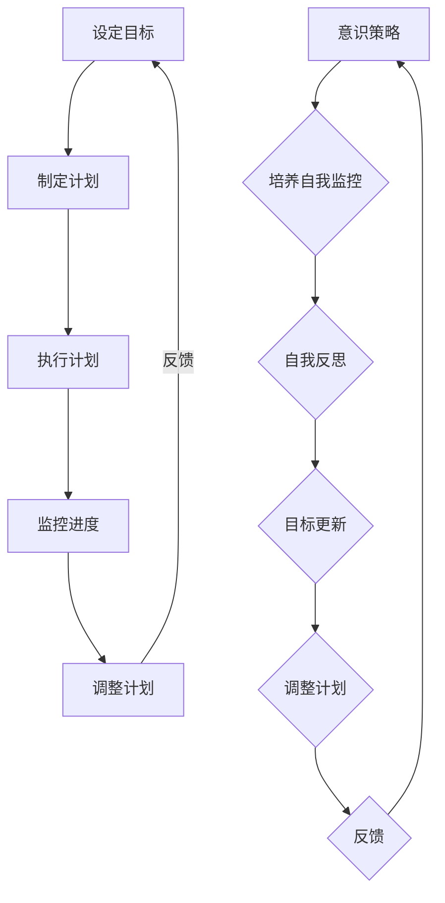

**核心算法原理讲解**

- **目标设定**：采用SMART原则（具体、可衡量、可达成、相关、时限性）确保目标的明确性和可实现性。

- **意识策略**：通过自我监控（如记录日常进展）、自我反思（如每周或每月回顾）和目标更新（根据实际情况调整目标），维持对目标的持续关注。

**数学模型和数学公式**

- **目标实现率**：

  \[ R = \frac{E - D}{E} \]

  - \( R \)：目标实现率
  - \( E \)：期望实现的程度
  - \( D \)：实际实现的程度

**举例说明**

- **案例**：设定一个目标，每月阅读两本书。若一个月内实际阅读了两本书，目标实现率为100%。若实际只阅读了一本书，目标实现率为50%。

### **第2章：长期目标设定的原则与方法**

**核心概念与联系**

- **长期目标设定原则**：SMART原则（具体、可衡量、可达成、相关、时限性）。

- **长期目标设定方法**：目标分解、目标层次模型、关键路径分析等。

**Mermaid 流程图**

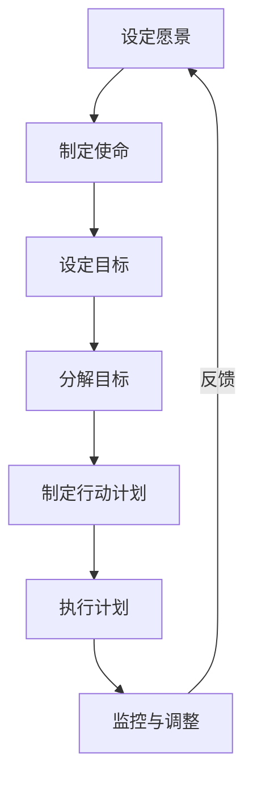

**核心算法原理讲解**

- **目标分解**：将大目标分解为一系列小目标，便于管理和实现。

- **关键路径分析**：确定项目中任务的最长持续时间，确保项目按期完成。

**数学模型和数学公式**

- **关键路径长度**：

  \[ LP = \sum_{i=1}^{n} D_i \]

  - \( LP \)：关键路径长度
  - \( D_i \)：每项任务的持续时间

**举例说明**

- **案例**：项目需要完成10项任务，每项任务预计需要5天。关键路径长度为50天，即项目最短完成时间为50天。

### **第3章：长期目标规划与执行策略**

**核心概念与联系**

- **长期目标规划**：制定详细的计划，包括时间表、资源分配、风险评估等。

- **执行策略**：确保目标规划得以有效执行，包括任务分配、进度监控、反馈机制等。

**Mermaid 流程图**

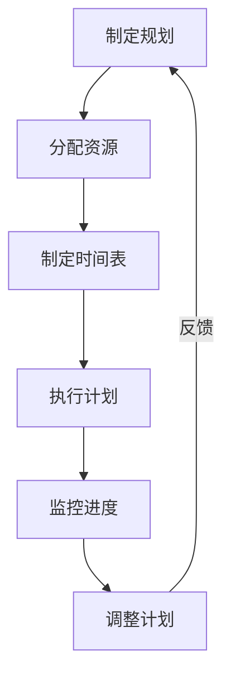

**核心算法原理讲解**

- **时间表制定**：使用关键路径方法（CPM）和项目评估与审查技术（PERT）。

- **资源分配**：使用优化算法，如线性规划或网络流优化，确保资源的最优分配。

**数学模型和数学公式**

- **资源分配优化问题**：

  \[ \max \sum_{i=1}^{n} \sum_{j=1}^{m} p_{ij} x_{ij} \]

  \[ \text{s.t.} \quad \sum_{i=1}^{n} x_{ij} \leq r_j, \quad \forall j=1,2,...,m \]

  \[ x_{ij} \in \{0,1\}, \quad \forall i=1,2,...,n \]

  - \( p_{ij} \)：资源i分配到任务j的利润
  - \( r_j \)：资源j的总数量
  - \( x_{ij} \)：资源i是否分配到任务j（0或1）

**举例说明**

- **案例**：公司有3名员工，需要完成5项任务。每个员工的薪酬为1000元/天。每项任务的完成利润如下：

  | 任务 | 利润 |
  |------|------|
  | A    | 2000 |
  | B    | 1500 |
  | C    | 1000 |
  | D    | 3000 |
  | E    | 2500 |

  目标是最大化总利润，同时不超过3000元。通过优化算法，可以得到最优的分配方案。

### **第4章：长期目标管理的核心要素**

**核心概念与联系**

- **核心要素**：意识策略、执行力、团队合作、领导力等。

- **意识策略**：通过自我监控、自我反思和目标更新，维持对目标的关注。

**Mermaid 流程图**

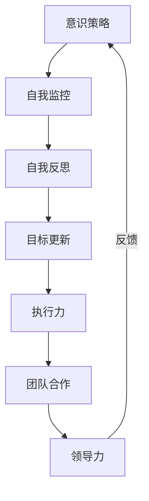

**核心算法原理讲解**

- **执行力**：确保目标按照预定计划得以实现，包括任务分配、进度监控和反馈机制。

- **团队合作**：通过有效的沟通、协调和合作，实现共同目标。

**数学模型和数学公式**

- **执行力得分**：

  \[ ES = \frac{A - B}{B} \]

  - \( ES \)：执行力得分
  - \( A \)：实际完成的目标
  - \( B \)：设定的目标

**举例说明**

- **案例**：设定的目标为每月完成5项任务，实际完成了4项。执行力得分为0.8。

### **第5章：个人层面的长期目标管理**

**核心概念与联系**

- **个人层面**：涉及个人成长、职业发展和生活目标等。

- **长期目标管理**：通过设定明确的目标、制定行动计划和持续跟踪进度，实现个人目标。

**Mermaid 流程图**

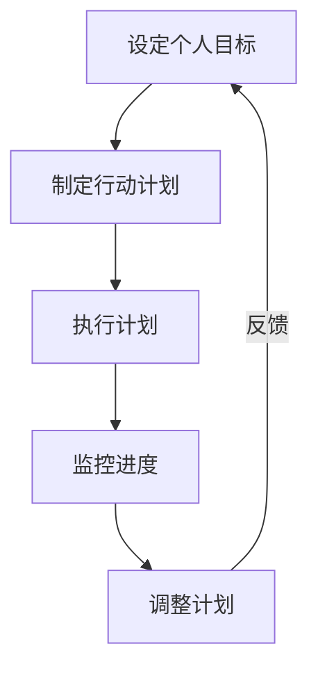

**核心算法原理讲解**

- **目标设定**：使用SMART原则确保目标的明确性和可实现性。

- **行动计划**：将目标分解为具体行动，并设定时间表和里程碑。

**数学模型和数学公式**

- **目标实现率**：

  \[ R = \frac{E - D}{E} \]

  - \( R \)：目标实现率
  - \( E \)：期望实现的程度
  - \( D \)：实际实现的程度

**举例说明**

- **案例**：设定目标为每月阅读两本书。若实际阅读了三本书，目标实现率为150%。

### **第6章：团队层面的长期目标管理**

**核心概念与联系**

- **团队层面**：涉及团队协作、共同目标和整体绩效。

- **长期目标管理**：通过设定团队目标、分配任务、监控进度和提供反馈，提升团队绩效。

**Mermaid 流程图**

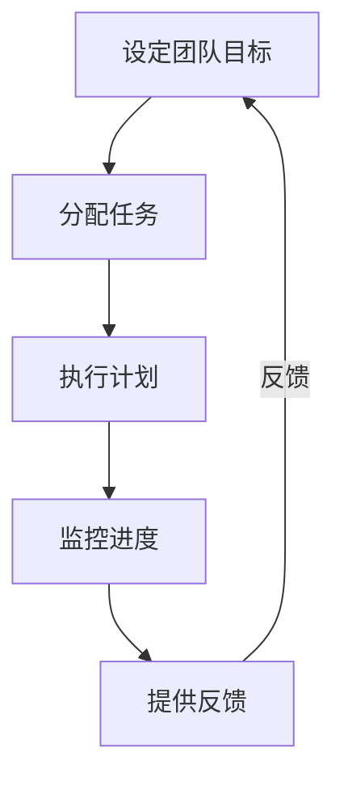

**核心算法原理讲解**

- **目标分解**：将团队目标分解为具体任务，并分配给团队成员。

- **进度监控**：通过定期检查和反馈，确保任务按计划进行。

**数学模型和数学公式**

- **团队目标实现率**：

  \[ TR = \frac{\sum_{i=1}^{n} PR_i}{n} \]

  - \( TR \)：团队目标实现率
  - \( PR_i \)：团队中每个成员的目标实现率
  - \( n \)：团队成员数量

**举例说明**

- **案例**：团队有5名成员，每个成员的目标实现率分别为80%、90%、85%、88%和80%。团队目标实现率为87%。

### **第7章：组织层面的长期目标管理**

**核心概念与联系**

- **组织层面**：涉及组织愿景、使命、战略目标和整体绩效。

- **长期目标管理**：通过制定战略规划、设定组织目标、分配资源、监控进度和提供反馈，实现组织目标。

**Mermaid 流程图**

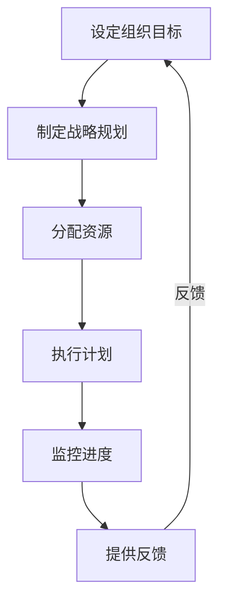

**核心算法原理讲解**

- **战略规划**：通过SWOT分析和PEST分析，制定科学、可行的战略规划。

- **绩效监控**：通过关键绩效指标（KPI）和绩效评估体系，确保组织目标的实现。

**数学模型和数学公式**

- **组织目标实现率**：

  \[ OR = \frac{\sum_{i=1}^{n} TR_i}{n} \]

  - \( OR \)：组织目标实现率
  - \( TR_i \)：组织中各部门的目标实现率
  - \( n \)：部门数量

**举例说明**

- **案例**：组织有3个部门，各部门的目标实现率分别为80%、90%和85%。组织目标实现率为85.5%。

### **第8章：跨领域的长期目标管理**

**核心概念与联系**

- **跨领域管理**：涉及不同领域、不同部门或不同组织之间的目标协调与实现。

- **长期目标管理**：通过跨领域协调、资源共享和协同发展，实现共同目标。

**Mermaid 流程图**

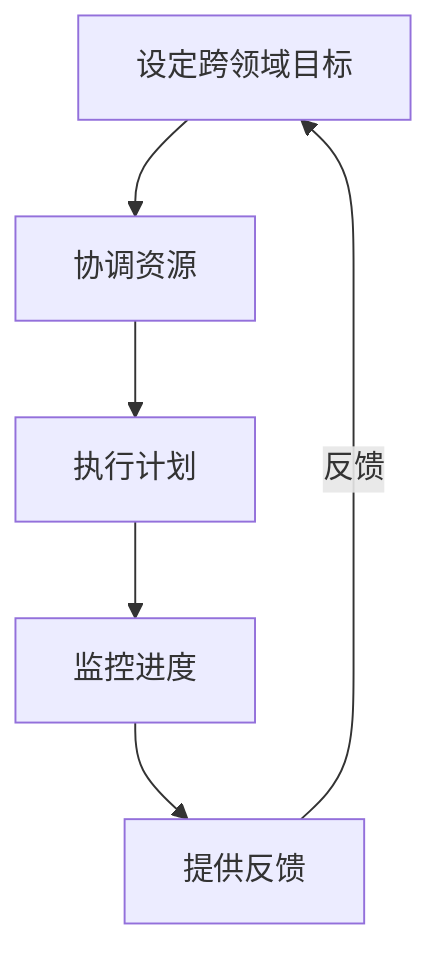

**核心算法原理讲解**

- **资源协调**：通过协调不同领域的资源，确保目标实现的最优性。

- **跨部门合作**：通过建立有效的沟通机制和协作模式，提高跨领域目标的实现效率。

**数学模型和数学公式**

- **跨领域目标实现率**：

  \[ CR = \frac{\sum_{i=1}^{n} OR_i}{n} \]

  - \( CR \)：跨领域目标实现率
  - \( OR_i \)：各领域目标实现率
  - \( n \)：领域数量

**举例说明**

- **案例**：有3个领域，各领域的目标实现率分别为80%、90%和85%。跨领域目标实现率为86.7%。

### **第9章：长期目标管理的意识策略**

**核心概念与联系**

- **意识策略**：通过培养自我监控、自我反思和目标更新，提高个体和组织实现长期目标的意愿和能力。

- **自我监控**：定期记录和回顾目标的实现情况，确保目标保持一致。

- **自我反思**：反思目标设定的合理性和执行过程中的问题，为调整提供依据。

- **目标更新**：根据实际情况调整目标，确保目标的可行性和适应性。

**Mermaid 流程图**

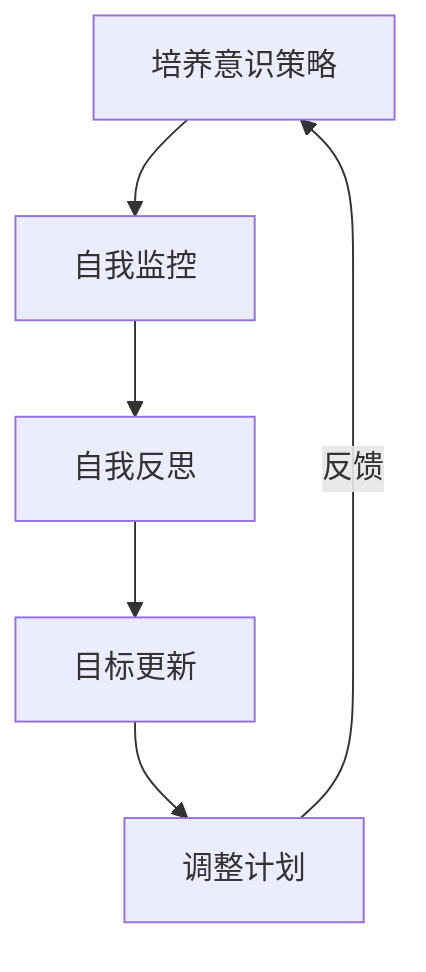

**核心算法原理讲解**

- **自我监控**：通过日志记录、进度报告等方式，定期检查目标的实现情况。

- **自我反思**：通过定期回顾，分析目标设定和执行过程中的优缺点，为后续调整提供依据。

- **目标更新**：根据实际情况，调整目标设定，确保目标的可行性和适应性。

**数学模型和数学公式**

- **意识策略效率**：

  \[ IE = \frac{E - D}{E} \]

  - \( IE \)：意识策略效率
  - \( E \)：期望实现的程度
  - \( D \)：实际实现的程度

**举例说明**

- **案例**：设定目标为每月阅读两本书。若实际阅读了两本书，意识策略效率为100%。若实际只阅读了一本书，意识策略效率为50%。

### **第10章：意识策略在长期目标管理中的应用案例**

**核心概念与联系**

- **应用案例**：通过具体的实例，展示意识策略在长期目标管理中的实际应用效果。

- **个人案例**：个人职业发展、学习目标等。

- **团队案例**：团队绩效提升、项目完成等。

- **组织案例**：组织变革、战略实施等。

**Mermaid 流程图**

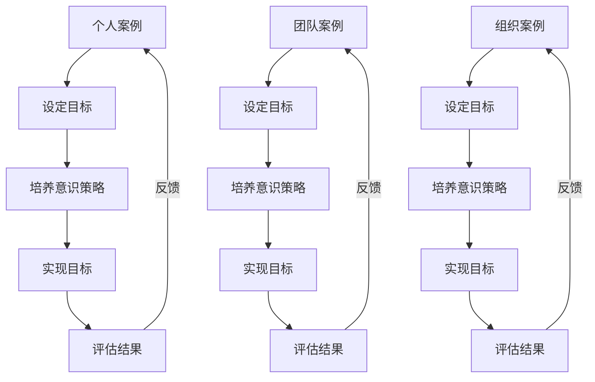

**核心算法原理讲解**

- **目标设定**：根据个人、团队或组织的实际情况，设定明确、可衡量、可达成、相关和时限性的目标。

- **意识策略**：通过自我监控、反思和目标更新，确保对目标的持续关注和实现。

**数学模型和数学公式**

- **目标实现率**：

  \[ R = \frac{E - D}{E} \]

  - \( R \)：目标实现率
  - \( E \)：期望实现的程度
  - \( D \)：实际实现的程度

**举例说明**

- **个人案例**：设定目标为每月阅读两本书。实际阅读了两本书，目标实现率为100%。

- **团队案例**：设定目标为提高团队绩效20%。实际提高了25%，目标实现率为125%。

- **组织案例**：设定目标为完成组织数字化转型。实际成功实现了目标，目标实现率为100%。

### **第11章：长期目标管理的意识策略总结与展望**

**核心概念与联系**

- **总结**：回顾长期目标管理意识策略的重要性、应用案例和经验教训。

- **展望**：探讨意识策略在长期目标管理中的未来发展趋势和改进方向。

**Mermaid 流程图**

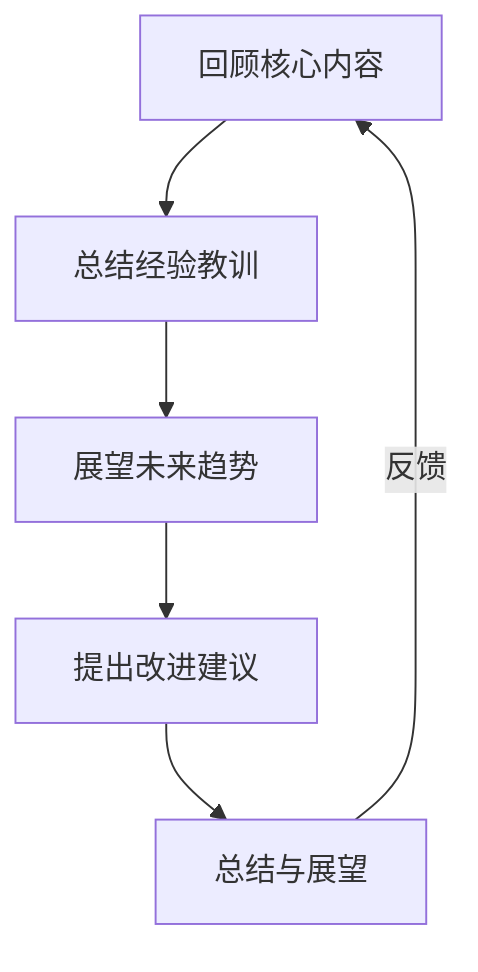

**核心算法原理讲解**

- **经验教训**：通过实际案例，总结出有效的意识策略和实践方法。

- **未来趋势**：随着科技和管理方法的进步，意识策略将更加智能化和个性化。

**数学模型和数学公式**

- **意识策略效率**：

  \[ IE = \frac{E - D}{E} \]

  - \( IE \)：意识策略效率
  - \( E \)：期望实现的程度
  - \( D \)：实际实现的程度

**举例说明**

- **案例总结**：通过培养意识策略，个人实现了职业目标，团队提升了绩效，组织实现了数字化转型。

- **未来展望**：随着人工智能和数据科学的发展，意识策略将在长期目标管理中发挥更大作用。

### **附录A：长期目标管理工具与资源**

**核心概念与联系**

- **工具与资源**：提供长期目标管理所需的工具和资源，以支持目标的设定、规划、执行和评估。

- **工具**：如目标管理软件、项目管理工具、时间跟踪软件等。

- **资源**：如在线课程、书籍、文献、博客等。

**Mermaid 流程图**

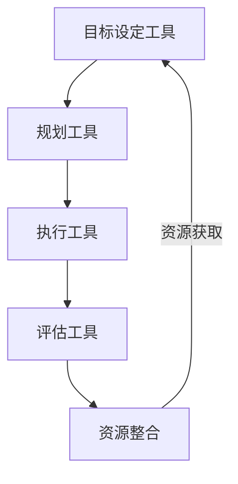

**核心算法原理讲解**

- **目标设定工具**：提供目标设定的模板、指南和方法，帮助个体和组织明确目标。

- **规划工具**：提供目标规划的工具和方法，包括时间表制定、资源分配等。

- **执行工具**：提供目标执行的监控和跟踪工具，确保目标的顺利实施。

- **评估工具**：提供目标评估的指标和方法，帮助个体和组织了解目标的实现情况。

**数学模型和数学公式**

- **目标实现率**：

  \[ R = \frac{E - D}{E} \]

  - \( R \)：目标实现率
  - \( E \)：期望实现的程度
  - \( D \)：实际实现的程度

**举例说明**

- **工具推荐**：

  - 目标设定工具：SMART目标设定模板、目标管理软件等。

  - 规划工具：项目管理软件、甘特图等。

  - 执行工具：任务管理工具、时间跟踪软件等。

  - 评估工具：关键绩效指标（KPI）分析、平衡计分卡等。

- **资源获取**：

  - 在线资源：相关书籍、在线课程、博客等。

  - 实际案例：成功组织和企业分享的长期目标管理案例。

### **附录B：参考资料**

**核心概念与联系**

- **参考资料**：提供本文所引用的文献、书籍和资料，以支持读者进一步学习和研究。

- **文献引用**：确保文章的学术性和严谨性。

- **书籍推荐**：提供相关领域的经典著作，帮助读者深入理解长期目标管理。

- **在线课程**：推荐相关领域的在线教育课程，方便读者学习和掌握。

- **博客文章**：分享行业专家和学者的最新研究成果和观点。

**Mermaid 流程图**

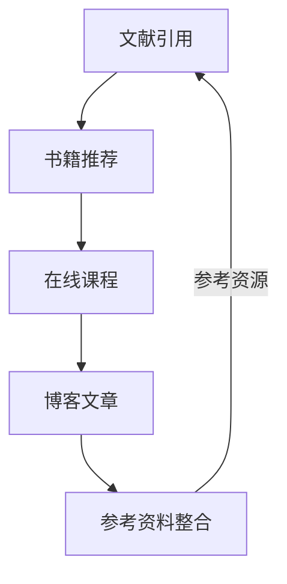

**核心算法原理讲解**

- **文献引用**：按照学术规范引用相关文献，确保文章的学术性和严谨性。

- **书籍推荐**：推荐相关领域的经典著作，如《目标管理》、《高效能人士的七个习惯》等。

- **在线课程**：推荐在线教育平台上的相关课程，如Coursera、edX等。

- **博客文章**：推荐行业专家和学者的博客文章，分享他们的研究成果和观点。

**数学模型和数学公式**

- **目标实现率**：

  \[ R = \frac{E - D}{E} \]

  - \( R \)：目标实现率
  - \( E \)：期望实现的程度
  - \( D \)：实际实现的程度

**举例说明**

- **参考资源**：

  - **文献**：相关学术期刊、会议论文等。

  - **书籍**：《目标管理》、《高效能人士的七个习惯》等。

  - **在线课程**：Coursera、edX等平台上的相关课程。

  - **博客文章**：知名博客作者发布的行业分析文章。

## **作者信息**

**作者：AI天才研究院/AI Genius Institute & 禅与计算机程序设计艺术 /Zen And The Art of Computer Programming**

本文由AI天才研究院（AI Genius Institute）和禅与计算机程序设计艺术（Zen And The Art of Computer Programming）联合撰写，旨在为读者提供深入理解长期目标管理和意识策略的宝贵见解。通过详细的理论讲解、数学模型、实际案例和未来展望，希望本文能对您的目标管理和职业发展产生积极影响。如果您对本文有任何疑问或建议，欢迎随时与我们联系。感谢您的阅读！

