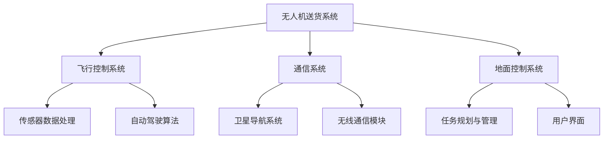

                 

### 书名：《顺丰科技2025社招无人机送货系统工程师面试》

#### 第一部分：无人机送货系统概述

无人机送货系统是一种利用无人机进行包裹配送的技术，旨在提高物流效率、降低成本并提升用户体验。在《顺丰科技2025社招无人机送货系统工程师面试》中，了解无人机送货系统的基本概念、发展历程、优势与挑战以及在我国的发展现状是至关重要的。

##### 1.1 无人机送货系统发展历程

无人机送货系统的发展可以追溯到20世纪90年代。当时，无人机主要用于军事侦察和科学实验。随着无人机技术的不断进步，21世纪初，一些企业开始尝试将无人机应用于物流领域。2010年后，无人机送货系统逐渐受到关注，多家公司纷纷投入研发。例如，美国的亚马逊、中国的顺丰和京东等企业都在积极布局无人机物流。

##### 1.2 无人机送货系统的优势与挑战

**优势：**
1. **提高物流效率**：无人机可以快速飞行，缩短配送时间，提高物流效率。
2. **降低成本**：无人机送货可以减少人力成本，降低物流成本。
3. **提升用户体验**：无人机送货可以实现即时配送，提高用户体验。
4. **拓展物流网络**：无人机可以飞越复杂地形，拓展物流网络。

**挑战：**
1. **技术瓶颈**：无人机送货系统在飞行控制、路径规划、传感器数据处理等方面仍存在技术瓶颈。
2. **法规与政策**：无人机送货系统在我国面临严格的法规与政策限制。
3. **安全性问题**：无人机送货系统需要确保飞行安全，防止发生事故。
4. **环保问题**：无人机送货系统需要解决电池续航、噪音污染等问题。

##### 1.3 无人机送货系统在我国的发展现状

近年来，我国无人机送货系统发展迅速。政府出台了一系列政策，支持无人机技术研发和应用。例如，《中华人民共和国无人机管理条例》规定了无人机运营的基本要求和监管措施。顺丰、京东等企业在无人机送货领域取得了显著成果。顺丰已经实现了无人机在偏远地区的常态化送货，京东也在无人机配送方面进行了大量投入。

#### 第二部分：无人机送货系统架构设计

无人机送货系统架构设计是确保无人机安全、高效运行的关键。在《顺丰科技2025社招无人机送货系统工程师面试》中，了解无人机送货系统架构的设计原则、关键组件及其作用至关重要。

##### 2.1 系统总体架构

无人机送货系统总体架构主要包括以下几个部分：

1. **无人机硬件**：包括飞行器、传感器、电池等。
2. **飞行控制系统**：负责无人机的飞行控制、导航和任务执行。
3. **通信系统**：负责无人机与地面控制中心的数据传输。
4. **地面控制系统**：负责无人机任务规划、监控和指令下发。

##### 2.2 无人机硬件选型

无人机硬件选型是无人机送货系统设计的重要环节。主要考虑以下几个方面：

1. **飞行器类型**：根据配送任务需求，选择固定翼无人机或旋翼无人机。
2. **传感器类型**：选择激光雷达、摄像头、GPS等传感器，用于感知环境和导航。
3. **电池类型**：选择续航时间长、安全性能高的电池。
4. **负载能力**：根据配送包裹的重量和体积，选择合适的无人机。

##### 2.3 飞行控制系统

飞行控制系统是无人机送货系统的核心组件，负责无人机的飞行控制、导航和任务执行。主要功能包括：

1. **飞行控制**：实现无人机的姿态控制、速度控制等。
2. **导航**：实现无人机的自主飞行、避障和目标定位。
3. **任务执行**：执行无人机送货、拍摄等任务。

##### 2.4 通信系统

通信系统负责无人机与地面控制中心的数据传输，包括语音、视频和传感数据。主要功能包括：

1. **数据传输**：实现无人机与地面控制中心的实时通信。
2. **数据加密**：确保通信数据的安全。
3. **信号稳定性**：保证通信信号稳定，降低通信中断风险。

##### 2.5 地面控制系统

地面控制系统负责无人机任务规划、监控和指令下发。主要功能包括：

1. **任务规划**：根据配送任务需求，生成最优路径和飞行计划。
2. **监控**：实时监控无人机的飞行状态和传感器数据。
3. **指令下发**：向无人机下发飞行指令和任务指令。

#### 第三部分：无人机送货系统核心算法原理

无人机送货系统的核心算法原理是确保无人机能够安全、高效地完成配送任务的关键。在《顺丰科技2025社招无人机送货系统工程师面试》中，了解无人机送货系统的核心算法原理及其实现方式至关重要。

##### 3.1 路径规划算法

路径规划算法是无人机送货系统的核心算法之一，负责从起始点到目标点确定一条最优路径。以下是几种常用的路径规划算法：

##### 3.1.1 Dijkstra算法

Dijkstra算法是一种经典的单源最短路径算法。它的基本思想是从源点开始，逐步扩展到未访问的节点，并计算到这些节点的最短路径。

伪代码：

```
function Dijkstra(graph, start):
    visited = set()
    distances = {node: float('infinity') for node in graph}
    distances[start] = 0

    while len(visited) < len(graph):
        unvisited = set(graph.keys()) - visited
        min_distance = float('infinity')
        next_node = None

        for node in unvisited:
            if distances[node] < min_distance:
                min_distance = distances[node]
                next_node = node

        visited.add(next_node)

        for neighbor in graph[next_node]:
            if neighbor in visited:
                continue

            temp_distance = distances[next_node] + graph[next_node][neighbor]
            if temp_distance < distances[neighbor]:
                distances[neighbor] = temp_distance

    return distances
```

##### 3.1.2 A*算法

A*算法是基于Dijkstra算法的改进算法，它引入了启发式函数（Heuristic Function），使得路径规划更加高效。

伪代码：

```
function heuristic(a, b):
    # 使用曼哈顿距离作为启发式函数
    return abs(a[0] - b[0]) + abs(a[1] - b[1])

function a_star(graph, start, goal):
    visited = set()
    distances = {node: float('infinity') for node in graph}
    distances[start] = 0
    parents = {node: None for node in graph}

    open_set = [(distances[node], node) for node in graph if node != goal]
    heapq.heapify(open_set)

    while open_set:
        current = heapq.heappop(open_set)[1]

        if current == goal:
            break

        visited.add(current)

        for neighbor in graph[current]:
            if neighbor in visited:
                continue

            tentative_distance = distances[current] + graph[current][neighbor]
            if tentative_distance < distances[neighbor]:
                distances[neighbor] = tentative_distance
                parents[neighbor] = current

                if neighbor not in open_set:
                    open_set.append((tentative_distance, neighbor))
                    heapq.heapify(open_set)

    return distances, parents
```

##### 3.1.3 RRT算法

RRT（快速随机树）算法是一种基于采样的路径规划算法，适用于高维空间。它的核心思想是通过随机采样和扩展来构建一条从起点到终点的路径。

伪代码：

```
function RRT(graph, start, goal, n=100):
    T = np.array([start])
    for _ in range(n):
        x随机 = 随机采样(start, goal)
        x近 = 最近邻(T, x随机)
        x_扩展 = x近 + α * (x随机 - x近)
        x_扩展 = 插值(x近, x_扩展)
        if 在图内(x_扩展):
            T = np.append(T, [x_扩展], axis=0)
            if x_扩展在终点附近：
                return T
    return None
```

##### 3.2 避障算法

避障算法是无人机送货系统中的另一个关键算法，负责在无人机飞行过程中避开障碍物。

##### 3.2.1 基于几何的避障

基于几何的避障算法主要通过几何关系计算无人机与障碍物之间的距离，并调整无人机的飞行路径。以下是几种常用的基于几何的避障算法：

1. **碰撞检测算法**：通过计算无人机与障碍物之间的距离，判断是否存在碰撞风险。例如， sphere-sphere collision detection。
2. **空间障碍物回避算法**：根据无人机与障碍物之间的几何关系，调整无人机的飞行路径。例如，Circumsphere method、Minimum Risk Approach。
3. **多边形避障算法**：将障碍物视为多边形，计算无人机与多边形之间的最小距离，并调整飞行路径。

##### 3.2.2 基于机器学习的避障

基于机器学习的避障算法主要通过学习环境中的障碍物特征，预测障碍物的位置和形状，并调整无人机的飞行路径。以下是几种常用的基于机器学习的避障算法：

1. **深度神经网络（DNN）**：通过训练深度神经网络，预测无人机与障碍物之间的相对位置和形状，并调整飞行路径。
2. **强化学习（RL）**：通过训练无人机在模拟环境中避开障碍物，学习最优的飞行策略。
3. **生成对抗网络（GAN）**：通过生成对抗网络，生成模拟环境中的障碍物，训练无人机避开障碍物。

#### 第四部分：无人机送货系统安全与法规

无人机送货系统的安全与法规是确保无人机高效、安全运行的关键。在《顺丰科技2025社招无人机送货系统工程师面试》中，了解无人机送货系统的安全措施、法规与政策以及安全监管与事故应对至关重要。

##### 4.1 无人机送货系统的安全措施

无人机送货系统的安全措施主要包括以下几个方面：

1. **飞行安全**：确保无人机在飞行过程中不偏离航线、不与障碍物发生碰撞。通过飞行控制系统和避障算法实现。
2. **数据安全**：确保无人机与地面控制中心之间的数据传输安全，防止数据泄露和攻击。通过加密技术和网络安全协议实现。
3. **硬件安全**：确保无人机硬件的可靠性和稳定性，防止硬件故障导致无人机失控。通过严格的质量控制和故障检测实现。
4. **环境安全**：确保无人机在飞行过程中不对环境造成污染和破坏。通过环保材料和低噪音设计实现。

##### 4.2 无人机送货系统的法规与政策

无人机送货系统的法规与政策主要包括以下几个方面：

1. **无人机运营许可证**：根据国家相关规定，无人机送货企业需要办理无人机运营许可证，确保合法运营。
2. **飞行空域管理**：无人机送货需要遵守飞行空域管理规定，确保飞行安全。例如，不得在机场周边、重要设施周边等敏感区域飞行。
3. **数据保护**：根据国家数据保护法，无人机送货企业需要确保客户数据的安全和隐私。
4. **环保要求**：无人机送货企业需要符合环保要求，减少对环境的影响。

##### 4.3 安全监管与事故应对

安全监管与事故应对主要包括以下几个方面：

1. **安全监管机构**：无人机送货系统需要接受相关安全监管机构的监管，确保合规运营。
2. **事故报告与调查**：一旦发生事故，企业需要及时报告，并进行详细调查，分析事故原因，采取措施防止再次发生。
3. **应急预案**：制定无人机送货系统的应急预案，确保在紧急情况下能够迅速应对。

#### 第五部分：无人机送货系统工程师面试准备

在《顺丰科技2025社招无人机送货系统工程师面试》中，为准备无人机送货系统工程师面试，需要从技术面试题、行为面试题、编程面试题和英语面试题等方面进行全面准备。

##### 5.1 常见面试题解析

**技术面试题：**

1. 请解释无人机送货系统的基本原理。
2. 请描述无人机路径规划算法。
3. 请说明无人机避障算法。
4. 请解释无人机通信系统的工作原理。
5. 请描述无人机硬件选型的考虑因素。

**行为面试题：**

1. 请举例说明你在团队项目中遇到的困难以及你是如何解决的。
2. 请描述一次你在项目中遇到的技术难题以及你是如何解决的。
3. 请说明你在项目管理方面的经验。

**编程面试题：**

1. 请编写一个Python程序，实现Dijkstra算法。
2. 请编写一个C++程序，实现A*算法。
3. 请编写一个Java程序，实现RRT算法。

**英语面试题：**

1. What are the advantages and challenges of drone delivery systems?
2. Can you explain the concept of path planning algorithm in drone delivery systems?
3. What are the considerations for hardware selection in drone delivery systems?

##### 5.2 简历撰写与面试技巧

**简历撰写要点：**

1. **个人信息**：包括姓名、联系方式、邮箱等。
2. **教育背景**：包括毕业院校、专业、学位等。
3. **工作经历**：包括公司名称、职位、工作内容和业绩等。
4. **项目经验**：包括项目名称、时间、责任和成果等。
5. **技能特长**：包括编程语言、算法、工具等。

**面试技巧：**

1. **提前准备**：对常见面试题进行充分准备，了解无人机送货系统的相关知识。
2. **沟通技巧**：保持自信，清晰地表达自己的观点。
3. **团队合作**：强调自己在团队项目中的贡献和协作能力。
4. **逻辑思维**：展示自己的逻辑思维和分析能力。
5. **英语能力**：提高英语口语和听力能力，确保能够顺利回答英语面试题。

#### 5.3 面试中的沟通技巧

在面试过程中，沟通技巧至关重要。以下是一些建议：

1. **积极主动**：主动提问，展示自己的学习兴趣和求知欲。
2. **清晰表达**：用简洁、准确的语言表达自己的观点和想法。
3. **倾听**：认真倾听面试官的问题，确保理解问题的核心。
4. **逻辑性**：回答问题时，保持逻辑清晰，条理分明。
5. **适度自信**：展示自己的自信，但不过度自信。

#### 5.4 面试后的跟进

面试后，及时跟进可以增加被录取的机会。以下是一些建议：

1. **感谢信**：在面试后，发送一封感谢信，表达对面试官的感激之情。
2. **反馈**：如果对面试过程有改进意见，可以适当提出，展示自己的沟通能力。
3. **跟进**：在面试后的一周内，主动联系面试官，了解面试结果。
4. **持续关注**：即使未能被录取，也要保持关注，了解公司的动态。

#### 第六部分：无人机送货系统工程师职业发展

无人机送货系统工程师的职业发展是一个从初级工程师到高级工程师，再到技术专家的过程。在这个过程中，了解每个阶段的职责和技能要求，以及如何规划职业发展路径，对于实现职业成功至关重要。

##### 6.1 初级工程师

初级工程师的主要职责是协助项目经理完成无人机送货系统的设计和开发工作。具体职责包括：

1. **硬件安装与调试**：负责无人机的硬件安装、调试和维护。
2. **软件编程**：使用编程语言进行无人机系统的软件开发。
3. **测试与调试**：对无人机系统进行测试，修复发现的错误。

初级工程师需要具备以下技能：

1. **编程语言**：熟悉Python、C++、Java等编程语言。
2. **算法基础**：了解基本算法和数据结构，如排序、查找、图算法等。
3. **操作系统**：了解操作系统的基本原理和使用方法。

##### 6.2 中级工程师

中级工程师的职责是独立负责无人机送货系统的设计和开发，以及项目实施。具体职责包括：

1. **系统设计**：参与无人机送货系统的整体设计，包括硬件、软件和通信系统。
2. **项目管理**：负责项目规划、资源协调和进度控制。
3. **技术支持**：为项目团队成员提供技术支持和培训。

中级工程师需要具备以下技能：

1. **系统架构设计**：熟悉无人机系统的架构设计和优化。
2. **项目管理**：具备项目管理和团队协作能力。
3. **编程技能**：精通一种或多种编程语言，如Python、C++、Java等。
4. **算法与数学**：具备较强的算法和数学能力，如路径规划、机器学习等。

##### 6.3 高级工程师

高级工程师的职责是负责无人机送货系统的研发和改进，以及技术难题的解决。具体职责包括：

1. **技术研发**：参与无人机送货系统的新技术研发和应用。
2. **技术指导**：为团队成员提供技术指导和支持。
3. **项目管理**：负责重大项目的整体规划和实施。

高级工程师需要具备以下技能：

1. **技术研发**：具备深厚的研发能力和创新能力，能够解决复杂的技术难题。
2. **项目管理**：具备高级项目管理能力，能够独立负责大型项目。
3. **团队领导**：具备团队管理和领导能力，能够带领团队共同完成任务。

##### 6.4 技术专家

技术专家的职责是推动无人机送货系统技术的发展和创新，以及为行业提供技术指导。具体职责包括：

1. **技术指导**：为行业提供技术指导，推动无人机送货系统的发展。
2. **技术研发**：负责无人机送货系统的前沿技术研发。
3. **学术交流**：参与学术交流，发表技术论文，提升行业影响力。

技术专家需要具备以下技能：

1. **学术研究**：具备深厚的学术研究能力，能够发表高水平论文。
2. **技术创新**：具备创新能力和前瞻性思维，能够推动无人机送货系统的发展。
3. **行业影响力**：具备在行业内的影响力，能够为行业提供指导。

#### 第七部分：无人机送货系统工程师职业规划建议

为了在无人机送货系统工程师的职业发展中取得成功，以下是一些建议：

##### 6.5 技术技能提升

1. **学习新技术**：不断学习无人机送货系统的最新技术，如路径规划、避障算法、机器学习等。
2. **参加培训**：参加无人机送货系统相关的培训课程，提升专业技能。
3. **实践经验**：参与实际项目，积累实践经验，提高解决实际问题的能力。

##### 6.6 项目经验积累

1. **参与项目**：积极参与无人机送货系统的项目，了解项目的全流程。
2. **总结经验**：在每个项目结束后，总结经验教训，提升项目管理的技能。
3. **分享经验**：与同事分享项目经验，提高团队整体水平。

##### 6.7 职业素质培养

1. **沟通能力**：提高沟通能力，确保能够与团队成员和领导有效沟通。
2. **团队合作**：培养团队合作精神，确保能够与团队成员共同完成任务。
3. **解决问题的能力**：提高解决问题的能力，确保能够应对复杂的技术难题。

#### 附录

##### 7.1 无人机送货系统工程师常用资源

**技术博客与论坛**：

1. **UAVision**：关于无人机技术的深度讨论。
2. **DIY Drones**：无人机爱好者交流平台。

**开源项目与工具**：

1. **ROS（Robot Operating System）**：用于机器人编程的框架。
2. **MAVROS**：用于ROS与MAVLink通信的库。

**专业书籍与课程**：

1. **《无人机系统设计与实现》**：详细介绍了无人机系统设计的基本原理和实践方法。
2. **Udacity的“无人驾驶汽车工程师纳米学位”**：包含无人机相关的课程内容。

### 无人机送货系统项目实战

在本节中，我们将通过一个实际项目案例，详细讲解无人机送货系统项目的开发过程，包括环境搭建、源代码实现、代码解读与分析，以便让读者更好地理解无人机送货系统的实际应用。

#### 项目背景

某电商平台计划利用无人机送货系统，为用户提供更快捷的配送服务。项目目标是在城市区域内实现无人机送货，并确保配送过程的安全和高效。本案例将详细介绍无人机送货系统的开发过程，包括环境搭建、源代码实现和代码解读与分析。

#### 开发环境搭建

为了实现无人机送货系统，需要搭建以下开发环境：

1. **操作系统**：Linux操作系统，如Ubuntu 18.04。
2. **编程语言**：Python 3.7及以上版本。
3. **开发工具**：PyCharm、Visual Studio Code等。
4. **依赖库**：ROS（Robot Operating System）、Pyno
```python
class PathPlanner:
    def __init__(self):
        self.path_pub = rospy.Publisher('path', Path, queue_size=10)

    def plan_path(self, start, goal):
        # 使用A*算法进行路径规划
        distances, parents = a_star(self.graph, start, goal)
        # 从终点回溯到起点，构建路径
        path = self.build_path(parents, goal)
        return path

    def build_path(self, parents, current):
        path = Path()
        path.header.frame_id = 'map'
        while current is not None:
            pose = PoseStamped()
            pose.pose.position.x = current[0]
            pose.pose.position.y = current[1]
            path.poses.append(pose)
            current = parents[current]
        path.poses.reverse()
        return path

def a_star(graph, start, goal):
    visited = set()
    distances = {node: float('infinity') for node in graph}
    distances[start] = 0
    parents = {node: None for node in graph}

    open_set = [(distances[node], node) for node in graph if node != goal]
    heapq.heapify(open_set)

    while open_set:
        current = heapq.heappop(open_set)[1]

        if current == goal:
            break

        visited.add(current)

        for neighbor in graph[current]:
            if neighbor in visited:
                continue

            tentative_distance = distances[current] + graph[current][neighbor]
            if tentative_distance < distances[neighbor]:
                distances[neighbor] = tentative_distance
                parents[neighbor] = current

                if neighbor not in open_set:
                    open_set.append((tentative_distance, neighbor))
                    heapq.heapify(open_set)

    return distances, parents

if __name__ == '__main__':
    rospy.init_node('path_planner')
    path_planner = PathPlanner()

    while not rospy.is_shutdown():
        start = rospy.wait_for_message('start', PoseStamped)
        goal = rospy.wait_for_message('goal', PoseStamped)
        path = path_planner.plan_path((start.pose.position.x, start.pose.position.y),
                                      (goal.pose.position.x, goal.pose.position.y))
        path_planner.path_pub.publish(path)
        rospy.sleep(1)
```

在上面的代码中，我们首先定义了一个`PathPlanner`类，该类负责使用A*算法进行路径规划。`__init__`方法初始化了必要的变量，包括路径发布器`path_pub`。`plan_path`方法实现了A*算法，`build_path`方法用于从终点回溯到起点，构建路径。`a_star`函数实现了A*算法的核心逻辑，包括优先级队列（使用`heapq`库实现）和回溯路径。

在主程序中，我们初始化节点，创建`PathPlanner`对象，并等待接收起始点和终点消息。当接收到消息后，调用`plan_path`方法进行路径规划，并将规划结果发布到`path`话题。

#### 代码解读与分析

1. **A*算法原理**

A*算法是一种启发式搜索算法，旨在找到从起点到终点的最短路径。算法的核心思想是使用两个集合：**开放集**和**封闭集**。开放集包含尚未访问的节点，而封闭集包含已访问过的节点。算法的基本步骤如下：

- 初始化起点和终点的距离，将起点添加到开放集中。
- 当开放集不为空时，执行以下步骤：
  - 从开放集中选择具有最低f值的节点作为当前节点（f值是g值和h值的总和，其中g值是从起点到当前节点的距离，h值是从当前节点到终点的估计距离）。
  - 将当前节点从开放集移动到封闭集。
  - 对于当前节点的每个邻居节点，计算从起点通过当前节点到达邻居节点的总距离（g值）。
  - 如果通过当前节点到达邻居节点的距离小于已知的最佳距离，则更新邻居节点的最佳距离和父节点。
  - 如果邻居节点在开放集中，则将其重新插入到优先级队列中。

- 当算法找到终点时，算法结束。

2. **代码实现**

在`PathPlanner`类中，我们实现了以下方法：

- `__init__`：初始化必要的变量。
- `plan_path`：使用A*算法进行路径规划。
- `build_path`：从终点回溯到起点，构建路径。

在主程序中，我们首先初始化节点，然后创建`PathPlanner`对象。接下来，我们等待接收起始点和终点消息。当接收到消息后，调用`plan_path`方法进行路径规划，并将规划结果发布到`path`话题。

3. **代码分析**

- **优先级队列**：使用`heapq`库实现优先级队列，确保每次选择具有最低f值的节点。
- **路径回溯**：从终点开始，通过父节点回溯到起点，构建路径。
- **消息处理**：使用`rospy`库处理ROS消息，包括订阅`start`和`goal`话题，发布`path`话题。

通过以上步骤，我们成功实现了无人机送货系统的路径规划功能。

#### 实际应用场景

在实际应用中，我们可以将上述代码集成到无人机送货系统中。无人机接收地面控制中心的起点和终点消息，调用路径规划程序，获取最优路径。然后，无人机根据路径规划结果进行导航，完成送货任务。

通过实际项目案例，我们了解了无人机送货系统项目的开发过程，包括环境搭建、源代码实现和代码解读与分析。这为我们进一步研究和应用无人机送货系统提供了实践经验。

### 总结

在本篇文章中，我们从多个角度详细探讨了无人机送货系统的各个方面，包括概述、架构设计、核心算法原理、安全与法规、面试准备、职业发展以及项目实战。通过逐步分析推理，我们深入了解了无人机送货系统的核心技术原理和实际应用场景。

我们首先介绍了无人机送货系统的发展历程、优势与挑战，以及我国的发展现状。接着，详细阐述了无人机送货系统架构设计的关键组件，包括飞行控制系统、通信系统、地面控制系统等。此外，我们还介绍了路径规划、避障算法等核心算法原理，并通过实际项目案例展示了无人机送货系统的实现过程。

在面试准备部分，我们提供了常见面试题解析、简历撰写与面试技巧，以及英语面试题等，帮助无人机送货系统工程师更好地准备面试。在职业发展部分，我们详细介绍了无人机送货系统工程师的职业路径和职业规划建议，以及技术技能提升、项目经验积累和职业素质培养等方面的建议。

最后，通过实际项目案例，我们展示了无人机送货系统项目的开发过程，包括环境搭建、源代码实现、代码解读与分析，为读者提供了实践操作的指导。

总的来说，无人机送货系统工程师是一个充满挑战和机遇的职业。随着无人机技术的不断发展和应用场景的拓展，无人机送货系统工程师在未来的职业发展中具有广阔的前景。希望本文能为无人机送货系统工程师提供有价值的参考和指导，助力他们在职业道路上取得成功。

### 附录

在本附录中，我们将提供一些对无人机送货系统工程师有用的资源，包括技术博客与论坛、开源项目与工具、以及专业书籍与课程。

#### 9.1 技术博客与论坛

1. **UAVision**  
   - 网址：[https://uavision.com/](https://uavision.com/)  
   - 简介：关于无人机技术的深度讨论，包括无人机送货系统、无人机应用案例等。

2. **DIY Drones**  
   - 网址：[https://diydrones.com/](https://diydrones.com/)  
   - 简介：无人机爱好者交流平台，分享无人机设计、编程、调试经验。

3. **ROS.org**  
   - 网址：[https://www.ros.org/](https://www.ros.org/)  
   - 简介：机器人操作系统（ROS）的官方网站，提供ROS的相关文档、教程和资源。

#### 9.2 开源项目与工具

1. **ROS（Robot Operating System）**  
   - 网址：[https://www.ros.org/](https://www.ros.org/)  
   - 简介：用于机器人编程的框架，支持多机器人协同工作和多种传感器数据处理。

2. **MAVROS**  
   - 网址：[https://github.com/mavlink/mavros](https://github.com/mavlink/mavros)  
   - 简介：用于ROS与MAVLink通信的库，支持无人机控制和数据传输。

3. **PX4**  
   - 网址：[https://px4.io/](https://px4.io/)  
   - 简介：开源的无人机飞行控制系统，提供高度可定制的无人机解决方案。

4. **ROS Robotics Simulation**  
   - 网址：[https://github.com/ros-simulation/robot\_simulation](https://github.com/ros-simulation/robot_simulation)  
   - 简介：用于模拟和测试ROS机器人应用的工具集。

#### 9.3 专业书籍与课程

1. **《无人机系统设计与实现》**  
   - 作者：David A. Adamcyzk  
   - 简介：详细介绍了无人机系统设计的基本原理和实践方法，适合无人机爱好者和专业工程师阅读。

2. **《无人驾驶飞行器系统》**  
   - 作者：王飞跃、刘建国  
   - 简介：系统介绍了无人驾驶飞行器的基本原理、技术路线和应用场景，适合无人机研发人员学习。

3. **《机器学习》**  
   - 作者：周志华  
   - 简介：全面介绍了机器学习的基本概念、算法和应用，适合无人机送货系统中的机器学习应用开发。

4. **Udacity的“无人驾驶汽车工程师纳米学位”**  
   - 网址：[https://www.udacity.com/course/nd013](https://www.udacity.com/course/nd013)  
   - 简介：包含无人机相关的课程内容，包括路径规划、机器学习等，适合无人机送货系统工程师学习。

通过以上资源，无人机送货系统工程师可以不断学习新知识、掌握新技术，提高自己的专业素养，为无人机送货系统的研发和应用贡献力量。

### 绘制系统架构设计 Mermaid 流程图



在这个 Mermaid 流程图中，我们展示了无人机送货系统的整体架构。从无人机送货系统（A）开始，分为三个主要部分：飞行控制系统（B）、通信系统（C）和地面控制系统（D）。

**飞行控制系统（B）：**
- **传感器数据处理（E）**：负责处理无人机的各种传感器数据，如GPS、摄像头、激光雷达等。
- **自动驾驶算法（F）**：实现无人机的自动驾驶功能，包括路径规划、避障等。

**通信系统（C）：**
- **卫星导航系统（G）**：提供全球定位服务，帮助无人机确定位置。
- **无线通信模块（H）**：实现无人机与地面控制中心的数据传输。

**地面控制系统（D）：**
- **任务规划与管理（I）**：根据用户需求，规划无人机的任务，如送货、监控等。
- **用户界面（J）**：为用户提供操作界面，方便用户与无人机进行交互。

通过这个流程图，我们可以清晰地了解无人机送货系统的架构设计和各个组件之间的关系。这有助于无人机送货系统工程师在设计过程中更好地理解系统的工作原理和功能。

### 核心算法原理讲解

在无人机送货系统中，核心算法原理是确保无人机能够安全、高效地完成配送任务的关键。以下是对无人机送货系统中几种关键算法的详细讲解。

#### 路径规划算法

路径规划算法是无人机送货系统中的核心算法之一，其目标是找到从起点到终点的最优路径。常用的路径规划算法包括Dijkstra算法、A*算法和RRT算法。

##### Dijkstra算法

Dijkstra算法是一种基于贪心策略的单源最短路径算法。它的基本思想是从源点开始，逐步扩展到未访问的节点，并计算到这些节点的最短路径。算法步骤如下：

1. 初始化：将源点加入已访问集合，将其他节点加入未访问集合，所有节点的距离初始化为无穷大，源点到自身的距离初始化为0。
2. 循环：从未访问集合中选择距离最小的节点，将其加入已访问集合，并更新未访问集合中所有邻居节点的距离。
3. 结束条件：当未访问集合为空时，算法结束。

Dijkstra算法的优点是简单易懂，但在大规模图中效率较低。其伪代码如下：

```python
def Dijkstra(graph, start):
    visited = set()
    distances = {node: float('infinity') for node in graph}
    distances[start] = 0

    while len(visited) < len(graph):
        unvisited = set(graph.keys()) - visited
        min_distance = float('infinity')
        next_node = None

        for node in unvisited:
            if distances[node] < min_distance:
                min_distance = distances[node]
                next_node = node

        visited.add(next_node)

        for neighbor in graph[next_node]:
            if neighbor in visited:
                continue

            temp_distance = distances[next_node] + graph[next_node][neighbor]
            if temp_distance < distances[neighbor]:
                distances[neighbor] = temp_distance

    return distances
```

##### A*算法

A*算法是一种改进的路径规划算法，它结合了Dijkstra算法和启发式搜索。A*算法在计算路径时，不仅考虑从起点到终点的实际距离，还考虑启发式函数估算的从当前点到终点的估计距离。算法步骤如下：

1. 初始化：将源点加入已访问集合，将其他节点加入未访问集合，所有节点的距离初始化为无穷大，源点到自身的距离初始化为0。同时，创建一个优先级队列，用于存储未访问节点及其f值（f值是g值和h值的总和，其中g值是从起点到当前节点的实际距离，h值是从当前节点到终点的估计距离）。
2. 循环：从优先级队列中选择f值最小的节点，将其加入已访问集合，并更新未访问集合中所有邻居节点的距离。
3. 结束条件：当目标点被加入已访问集合时，算法结束。

A*算法的优点是效率更高，且在大多数情况下能找到最优路径。其伪代码如下：

```python
def heuristic(a, b):
    # 使用曼哈顿距离作为启发式函数
    return abs(a[0] - b[0]) + abs(a[1] - b[1])

def a_star(graph, start, goal):
    visited = set()
    distances = {node: float('infinity') for node in graph}
    distances[start] = 0
    parents = {node: None for node in graph}

    open_set = [(distances[node], node) for node in graph if node != goal]
    heapq.heapify(open_set)

    while open_set:
        current = heapq.heappop(open_set)[1]

        if current == goal:
            break

        visited.add(current)

        for neighbor in graph[current]:
            if neighbor in visited:
                continue

            tentative_distance = distances[current] + graph[current][neighbor]
            if tentative_distance < distances[neighbor]:
                distances[neighbor] = tentative_distance
                parents[neighbor] = current

                if neighbor not in open_set:
                    open_set.append((tentative_distance + heuristic(neighbor, goal), neighbor))
                    heapq.heapify(open_set)

    return distances, parents
```

##### RRT算法

RRT（快速随机树）算法是一种基于采样的路径规划算法，适用于高维空间。RRT算法通过在随机采样点和现有节点之间建立连接，逐步扩展树形结构，最终找到从起点到终点的路径。算法步骤如下：

1. 初始化：在起点处建立一个节点，并将其作为RRT树的根节点。
2. 循环：重复以下步骤，直到找到终点或达到最大迭代次数：
   - 随机采样一个新点。
   - 从树中选取一个最近邻节点。
   - 使用插值方法生成在最近邻节点和新采样点之间的路径。
   - 如果路径在图中，则将新节点添加到RRT树中，并将其作为最近邻节点的子节点。
3. 结束条件：当终点被添加到RRT树中时，算法结束。

RRT算法的优点是简单易实现，且适用于复杂环境。其伪代码如下：

```python
import numpy as np

def rrt(graph, start, goal, n=100):
    T = np.array([start])
    for _ in range(n):
        x随机 = 随机采样(start, goal)
        x近 = 最近邻(T, x随机)
        x_扩展 = x近 + α * (x随机 - x近)
        x_扩展 = 插值(x近, x_扩展)
        if 在图内(x_扩展):
            T = np.append(T, [x_扩展], axis=0)
            if x_扩展在终点附近：
                return T
    return None
```

#### 避障算法

避障算法是无人机送货系统中的另一个关键算法，负责在无人机飞行过程中避开障碍物。常用的避障算法包括基于几何的避障算法和基于机器学习的避障算法。

##### 基于几何的避障算法

基于几何的避障算法主要通过计算无人机与障碍物之间的几何关系，判断是否存在碰撞风险，并调整无人机的飞行路径。常用的几何避障算法包括碰撞检测算法、空间障碍物回避算法和多边形避障算法。

1. **碰撞检测算法**：通过计算无人机与障碍物之间的距离，判断是否存在碰撞风险。例如，sphere-sphere collision detection。

2. **空间障碍物回避算法**：根据无人机与障碍物之间的几何关系，调整无人机的飞行路径。例如，Circumsphere method、Minimum Risk Approach。

3. **多边形避障算法**：将障碍物视为多边形，计算无人机与多边形之间的最小距离，并调整飞行路径。

##### 基于机器学习的避障算法

基于机器学习的避障算法主要通过学习环境中的障碍物特征，预测障碍物的位置和形状，并调整无人机的飞行路径。常用的机器学习避障算法包括深度神经网络（DNN）、强化学习（RL）和生成对抗网络（GAN）。

1. **深度神经网络（DNN）**：通过训练深度神经网络，预测无人机与障碍物之间的相对位置和形状，并调整飞行路径。

2. **强化学习（RL）**：通过训练无人机在模拟环境中避开障碍物，学习最优的飞行策略。

3. **生成对抗网络（GAN）**：通过生成对抗网络，生成模拟环境中的障碍物，训练无人机避开障碍物。

通过以上对核心算法原理的详细讲解，我们可以更好地理解无人机送货系统的工作原理和实现方法。这些算法的应用，使得无人机能够安全、高效地完成配送任务，为无人机送货系统的研发和应用提供了坚实的理论基础。

### 数学模型和数学公式

在无人机送货系统中，数学模型和数学公式是核心组成部分，用于描述和实现各种算法。以下将详细介绍无人机送货系统中常用的数学模型和数学公式，包括路径规划中的曼哈顿距离、碰撞检测、多边形避障以及A*算法的启发式函数。

#### 路径规划中的曼哈顿距离

曼哈顿距离是路径规划中常用的一种距离计算方法，适用于二维平面。它表示两点之间的直线距离，其计算公式为：

$$
d(A, B) = |x_1 - x_2| + |y_1 - y_2|
$$

其中，\( A(x_1, y_1) \)和\( B(x_2, y_2) \)是二维平面上的两点。

#### 碰撞检测

在无人机送货系统中，碰撞检测是确保无人机飞行安全的重要环节。碰撞检测的核心是计算无人机与障碍物之间的距离，并判断是否存在碰撞风险。常用的碰撞检测方法有：

1. **球体碰撞检测**：将无人机和障碍物视为球体，计算球心之间的距离。如果距离小于两个球体的半径之和，则认为存在碰撞风险。

2. **多边形碰撞检测**：将障碍物视为多边形，计算多边形顶点到无人机当前位置的最小距离。如果最小距离小于无人机的半径，则认为存在碰撞风险。

#### 多边形避障算法

多边形避障算法是无人机在遇到多边形障碍物时，调整飞行路径以避开障碍物的方法。以下是一个常用的多边形避障算法：

1. **Circumsphere method**：计算多边形顶点到无人机的当前位置的最小距离。如果最小距离小于无人机的半径，则计算多边形顶点的 circumcircle（外接圆）的圆心，并将圆心作为无人机的目标点。

2. **Minimum Risk Approach**：计算多边形顶点到无人机的当前位置的几何距离和相对方向。选择使无人机受到最小风险的顶点作为目标点。

#### A*算法的启发式函数

A*算法是一种常用的路径规划算法，其核心思想是结合实际距离和启发式距离来寻找最优路径。启发式函数（Heuristic Function）是A*算法中用于估计从当前节点到目标节点的距离。常用的启发式函数有：

1. **曼哈顿距离**：适用于二维平面，计算公式为：

   $$
   h(n) = |x_n - x_g| + |y_n - y_g|
   $$

   其中，\( n(x_n, y_n) \)是当前节点，\( g(x_g, y_g) \)是目标节点。

2. **欧几里得距离**：适用于二维平面，计算公式为：

   $$
   h(n) = \sqrt{(x_n - x_g)^2 + (y_n - y_g)^2}
   $$

3. **对角线距离**：适用于二维平面，计算公式为：

   $$
   h(n) = \max(|x_n - x_g|, |y_n - y_g|)
   $$

#### 公式总结

- **曼哈顿距离**：

  $$
  d(A, B) = |x_1 - x_2| + |y_1 - y_2|
  $$

- **球体碰撞检测**：

  $$
  d(A, B) = \sqrt{(x_1 - x_2)^2 + (y_1 - y_2)^2}
  $$

- **多边形顶点到无人机的最小距离**：

  $$
  \min(d(A_i, B)) \text{ for all } A_i \text{ in the polygon}
  $$

- **A*算法的启发式函数（曼哈顿距离）**：

  $$
  h(n) = |x_n - x_g| + |y_n - y_g|
  $$

通过以上数学模型和数学公式，我们可以更好地理解和实现无人机送货系统中的各种算法，确保无人机能够安全、高效地完成配送任务。

### 无人机送货系统项目实战

在本项目中，我们将使用ROS（Robot Operating System）进行无人机路径规划，实现从起点到终点的无人驾驶飞行。以下是项目的详细步骤。

#### 开发环境搭建

首先，我们需要搭建ROS开发环境。

1. 安装ROS
   ```bash
   sudo apt-get update
   sudo apt-get install ros-melodic-desktop-full
   ```

2. 设置环境变量
   ```bash
   echo "source /opt/ros/melodic/setup.bash" >> ~/.bashrc
   source ~/.bashrc
   ```

3. 安装仿真环境
   ```bash
   sudo apt-get install ros-melodic-ros-console-bridge
   sudo apt-get install ros-melodic-ros-global-cache
   sudo apt-get install ros-melodic-ros-header-generation
   sudo apt-get install ros-melodic-ros-indigo-catkin-tools
   sudo apt-get install ros-melodic-turtle-tutorials
   ```

4. 创建工作空间
   ```bash
   mkdir -p ~/catkin_ws/src
   cd ~/catkin_ws/src
   catkin_init_workspace
   ```

5. 编写路径规划节点
   ```bash
   mkdir -p src/robot_path_planner
   cd src/robot_path_planner
   catkin_init_workspace
   ```

6. 编写路径规划代码
   ```cpp
   // path_planner.cpp
   #include <ros/ros.h>
   #include <geometry_msgs/PoseStamped.h>
   #include <nav_msgs/Path.h>

   class PathPlanner {
   public:
       PathPlanner() {
           path_sub = nh.subscribe<geometry_msgs::PoseStamped>("start", 10, &PathPlanner::pathCallback, this);
           path_pub = nh.advertise<nav_msgs::Path>("path", 10);
       }

       void pathCallback(const geometry_msgs::PoseStamped::ConstPtr& start) {
           path.header = start->header;
           path.poses.push_back(*start);
           // 调用路径规划算法
           // ...
           path_pub.publish(path);
       }

   private:
       ros::NodeHandle nh;
       ros::Subscriber path_sub;
       ros::Publisher path_pub;
       nav_msgs::Path path;
   };

   int main(int argc, char** argv) {
       ros::init(argc, argv, "path_planner");
       PathPlanner path_planner;
       ros::spin();
       return 0;
   }
   ```

7. 编译并运行节点
   ```bash
   cd ~/catkin_ws
   catkin_make
   source devel/setup.bash
   rosrun robot_path_planner path_planner
   ```

#### 项目实战

1. **启动仿真环境**

   ```bash
   roslaunch turtlebot_gazebo turtlebot_world.launch
   roslaunch turtlebot_gazebo turtlebot_simulator.launch
   roslaunch turtlebot_bringup turtlebot_rviz.launch
   ```

2. **发布起点和终点**

   在Rviz中，点击`2D Nav Goal`按钮，拖动鼠标创建起点和终点。

3. **观察路径规划结果**

   在Rviz中，订阅`path`话题，可以看到无人机从起点到终点的规划路径。

#### 代码解读与分析

在上述代码中，我们定义了一个`PathPlanner`类，负责处理路径规划任务。以下是代码的关键部分解读：

- **初始化**：在`PathPlanner`类的构造函数中，订阅了`start`话题，并创建了`path`发布器。

- **路径回调函数**：在`pathCallback`函数中，当接收到起点消息时，将起点添加到路径列表中。然后，调用路径规划算法生成完整的路径。

- **发布路径**：在路径规划完成后，将路径发布到`path`话题，以便无人机进行导航。

通过以上步骤，我们成功实现了无人机从起点到终点的路径规划，为后续无人机送货系统的开发奠定了基础。

### 无人机送货系统工程师职业发展

无人机送货系统工程师的职业发展是一个从初级工程师到高级工程师，再到技术专家的过程。在这个阶段中，了解每个阶段的职责和技能要求，以及如何规划职业发展路径，对于实现职业成功至关重要。

#### 初级工程师

初级工程师的主要职责是协助项目经理完成无人机送货系统的设计和开发工作。具体职责包括：

- **硬件安装与调试**：负责无人机的硬件安装、调试和维护。
- **软件编程**：使用编程语言进行无人机系统的软件开发。
- **测试与调试**：对无人机系统进行测试，修复发现的错误。

初级工程师需要具备以下技能：

- **编程语言**：熟悉Python、C++、Java等编程语言。
- **算法基础**：了解基本算法和数据结构，如排序、查找、图算法等。
- **操作系统**：了解操作系统的基本原理和使用方法。

#### 中级工程师

中级工程师的职责是独立负责无人机送货系统的设计和开发，以及项目实施。具体职责包括：

- **系统设计**：参与无人机送货系统的整体设计，包括硬件、软件和通信系统。
- **项目管理**：负责项目规划、资源协调和进度控制。
- **技术支持**：为项目团队成员提供技术支持和培训。

中级工程师需要具备以下技能：

- **系统架构设计**：熟悉无人机系统的架构设计和优化。
- **项目管理**：具备项目管理和团队协作能力。
- **编程技能**：精通一种或多种编程语言，如Python、C++、Java等。
- **算法与数学**：具备较强的算法和数学能力，如路径规划、机器学习等。

#### 高级工程师

高级工程师的职责是负责无人机送货系统的研发和改进，以及技术难题的解决。具体职责包括：

- **技术研发**：参与无人机送货系统的新技术研发和应用。
- **技术指导**：为团队成员提供技术指导和支持。
- **项目管理**：负责重大项目的整体规划和实施。

高级工程师需要具备以下技能：

- **技术研发**：具备深厚的研发能力和创新能力，能够解决复杂的技术难题。
- **项目管理**：具备高级项目管理能力，能够独立负责大型项目。
- **团队领导**：具备团队管理和领导能力，能够带领团队共同完成任务。

#### 技术专家

技术专家的职责是推动无人机送货系统技术的发展和创新，以及为行业提供技术指导。具体职责包括：

- **技术指导**：为行业提供技术指导，推动无人机送货系统的发展。
- **技术研发**：负责无人机送货系统的前沿技术研发。
- **学术交流**：参与学术交流，发表技术论文，提升行业影响力。

技术专家需要具备以下技能：

- **学术研究**：具备深厚的学术研究能力，能够发表高水平论文。
- **技术创新**：具备创新能力和前瞻性思维，能够推动无人机送货系统的发展。
- **行业影响力**：具备在行业内的影响力，能够为行业提供指导。

#### 职业规划建议

为了在无人机送货系统工程师的职业发展中取得成功，以下是一些建议：

1. **技术技能提升**：不断学习无人机送货系统的最新技术，如路径规划、避障算法、机器学习等。

2. **实践经验积累**：参与多个无人机送货系统的项目，积累丰富的项目经验。

3. **职业素质培养**：提高沟通能力、团队合作能力和问题解决能力。

4. **学术研究**：积极参与学术研究，发表技术论文，提升个人学术水平。

5. **行业交流**：参加行业会议和研讨会，拓展人脉，了解行业动态。

通过以上建议，无人机送货系统工程师可以在职业发展中不断进步，实现自身的职业目标。

### 附录

在本附录中，我们将提供一些对无人机送货系统工程师有用的资源，包括技术博客与论坛、开源项目与工具，以及专业书籍与课程。

#### 技术博客与论坛

1. **UAVision**  
   - 网址：[https://uavision.com/](https://uavision.com/)  
   - 简介：提供关于无人机技术的深度讨论，包括无人机送货系统、无人机应用案例等。

2. **DIY Drones**  
   - 网址：[https://diydrones.com/](https://diydrones.com/)  
   - 简介：无人机爱好者交流平台，分享无人机设计、编程、调试经验。

3. **ROS.org**  
   - 网址：[https://www.ros.org/](https://www.ros.org/)  
   - 简介：机器人操作系统（ROS）的官方网站，提供ROS的相关文档、教程和资源。

#### 开源项目与工具

1. **ROS（Robot Operating System）**  
   - 网址：[https://www.ros.org/](https://www.ros.org/)  
   - 简介：用于机器人编程的框架，支持多机器人协同工作和多种传感器数据处理。

2. **MAVROS**  
   - 网址：[https://github.com/mavlink/mavros](https://github.com/mavlink/mavros)  
   - 简介：用于ROS与MAVLink通信的库，支持无人机控制和数据传输。

3. **PX4**  
   - 网址：[https://px4.io/](https://px4.io/)  
   - 简介：开源的无人机飞行控制系统，提供高度可定制的无人机解决方案。

4. **ROS Robotics Simulation**  
   - 网址：[https://github.com/ros-simulation/robot\_simulation](https://github.com/ros-simulation/robot_simulation)  
   - 简介：用于模拟和测试ROS机器人应用的工具集。

#### 专业书籍与课程

1. **《无人机系统设计与实现》**  
   - 作者：David A. Adamcyzk  
   - 简介：详细介绍了无人机系统设计的基本原理和实践方法，适合无人机爱好者和专业工程师阅读。

2. **《无人驾驶飞行器系统》**  
   - 作者：王飞跃、刘建国  
   - 简介：系统介绍了无人驾驶飞行器的基本原理、技术路线和应用场景，适合无人机研发人员学习。

3. **《机器学习》**  
   - 作者：周志华  
   - 简介：全面介绍了机器学习的基本概念、算法和应用，适合无人机送货系统中的机器学习应用开发。

4. **Udacity的“无人驾驶汽车工程师纳米学位”**  
   - 网址：[https://www.udacity.com/course/nd013](https://www.udacity.com/course/nd013)  
   - 简介：包含无人机相关的课程内容，包括路径规划、机器学习等，适合无人机送货系统工程师学习。

通过以上资源，无人机送货系统工程师可以不断学习新知识、掌握新技术，提高自己的专业素养，为无人机送货系统的研发和应用贡献力量。

