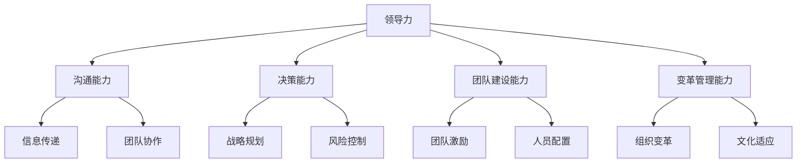

                 

### 第一部分：领导力基础

#### 第1章：领导力的定义与重要性

领导力是现代企业中不可或缺的核心竞争力之一。那么，什么是领导力？为什么它如此重要？这一章节将详细探讨领导力的基本概念、与传统管理的区别、重要性以及构成要素。

##### 1.1 领导力的基本概念

**1.1.1 领导力与传统管理**

领导力与传统管理在概念上有所不同。传统管理更多关注于通过规章制度、流程控制来确保组织目标的实现，而领导力则强调通过激发、引导和激励团队，实现组织的共同目标。

**1.1.2 领导力的重要性**

领导力对于组织的重要性不可忽视。它不仅能够提高团队的工作效率，还能够推动创新、促进企业文化的建设。一个优秀的领导者能够带领团队突破困境，实现组织的长远发展。

**1.1.3 领导力的构成要素**

领导力包括多个构成要素，如沟通能力、决策能力、团队建设能力、变革管理能力等。这些要素相互作用，共同决定了领导者的领导效果。

##### 1.2 领导风格与领导力模型

**1.2.1 领导风格类型**

领导风格可以分为专制型、民主型、放任型等。不同类型的领导风格适用于不同的情境和团队。

**1.2.2 领导力模型介绍**

常见的领导力模型包括特质理论、行为理论、情境理论等。每个模型都有其独特的理论框架和实践指导。

**1.2.3 领导力模型的实践与应用**

在实践应用中，领导者需要根据具体情境和团队特点，灵活运用不同的领导力模型。

##### 1.3 领导力发展的路径

**1.3.1 自我认知与成长**

自我认知是领导力发展的基础。领导者需要通过不断反思和自我提升，明确自己的优势和不足。

**1.3.2 学习与借鉴**

学习与借鉴是领导力发展的重要途径。领导者可以通过阅读书籍、参加培训、交流经验等方式，不断提升自己的领导能力。

**1.3.3 实践与反思**

实践是检验领导力的唯一标准。领导者需要在实际工作中不断尝试、反思和调整，以提升自己的领导效果。

---

**核心概念与联系**

领导力是一个复杂的概念，包括多个方面。为了更好地理解领导力，我们可以使用Mermaid流程图来展示其基本概念和关系：



这个流程图展示了领导力的核心概念和它们之间的关系。通过这个流程图，我们可以更好地理解领导力的本质和组成部分。

---

在下一章中，我们将进一步探讨时间管理的基础理论，包括时间管理的定义、重要性以及目标。同时，我们还将介绍时间管理的方法论，帮助读者掌握有效的时间管理技巧。

### 第二部分：时间管理的理论与方法

#### 第2章：时间管理的基础理论

时间管理是现代工作环境中的一项重要技能。有效的时间管理不仅能够提高个人和团队的工作效率，还能够减少工作压力，提高生活质量。本章将详细探讨时间管理的基础理论，包括时间管理的定义、重要性、目标和方法。

##### 2.1 时间管理的基本概念

**2.1.1 时间的定义与属性**

时间是一种抽象的概念，它具有持续性、不可逆性和有限性的特点。时间既是资源的度量，也是活动的载体。

**2.1.2 时间管理的重要性**

时间管理的重要性体现在多个方面。首先，它能够提高工作效率，使个人和团队能够在有限的时间内完成更多的任务。其次，它能够减轻工作压力，使个人能够更好地平衡工作和生活。此外，有效的时间管理还能够促进个人成长和职业发展。

**2.1.3 时间管理的目标**

时间管理的目标主要包括以下几个方面：

1. 提高工作效率：通过合理规划和安排时间，使工作更加高效。
2. 提高生活质量：通过合理安排时间，使个人能够有更多的时间去休息、娱乐和与家人朋友相处。
3. 实现工作与生活的平衡：通过有效的时间管理，使工作与生活相互协调，避免过度劳累。

##### 2.2 时间管理的方法论

**2.2.1 计划与目标设定**

计划与目标设定是时间管理的第一步。通过设定明确的计划和目标，个人和团队能够更有针对性地安排时间，提高工作效率。

**2.2.2 任务优先级排序**

任务优先级排序是时间管理的关键。通过评估任务的重要性和紧急性，个人和团队能够将精力集中在最重要和最紧急的任务上，提高工作效率。

**2.2.3 时间管理工具与技巧**

时间管理工具和技巧能够帮助个人和团队更有效地管理时间。常见的工具包括时间表、任务清单、番茄工作法等。技巧则包括如何避免分心、如何处理突发事件等。

**核心算法原理讲解**

在时间管理中，任务优先级排序是一个非常关键的环节。一个常用的算法是Eisenhower矩阵，它通过评估任务的重要性和紧急性，将任务分为四个象限：

1. 紧急且重要：首先处理这些任务，因为它们对你的目标和计划至关重要。
2. 不紧急但重要：计划处理这些任务，以确保长期目标的实现。
3. 紧急但不重要：委托或避免这些任务，因为它们可能会分散你的注意力。
4. 不紧急且不重要：消除或最小化这些任务，因为它们对你的目标和计划没有实际贡献。

Eisenhower矩阵的伪代码实现如下：

```python
def eisenhower_matrix(tasks):
    important_urgent = []
    important_not_urgent = []
    not_important_urgent = []
    not_important_not_urgent = []

    for task in tasks:
        if task.is_urgent() and task.is_important():
            important_urgent.append(task)
        elif task.is_important():
            important_not_urgent.append(task)
        elif task.is_urgent():
            not_important_urgent.append(task)
        else:
            not_important_not_urgent.append(task)

    return {
        'important_urgent': important_urgent,
        'important_not_urgent': important_not_urgent,
        'not_important_urgent': not_important_urgent,
        'not_important_not_urgent': not_important_not_urgent
    }
```

**时间管理心理因素**

**2.3.1 时间知觉与时间观念**

时间知觉是指人们对时间的感知和认识。时间观念则是指人们对时间的态度和价值观。正确的时间观念有助于提高时间管理的效果。

**2.3.2 时间管理中的心理障碍**

在时间管理中，人们可能会遇到各种心理障碍，如拖延症、时间感知偏差等。克服这些心理障碍是有效时间管理的关键。

**2.3.3 克服时间管理心理障碍的策略**

1. 制定明确的目标和计划。
2. 使用时间管理工具和技巧。
3. 培养正确的时间观念。
4. 建立良好的生活习惯。

---

通过本章的学习，读者将能够了解时间管理的基本概念、重要性、目标和方法。在下一章中，我们将探讨领导力在时间管理中的应用，帮助读者更好地将领导力与时间管理相结合，提高工作效率。

---

### 领导力在时间管理中的应用

领导力与时间管理是现代企业管理中不可或缺的两个方面。有效的领导力可以引导团队更好地管理时间，提高工作效率，从而实现组织的目标。本章将探讨领导力在时间管理中的应用，包括领导者在时间管理中的角色、时间管理技巧在领导力发展中的应用，以及团队和项目的时间管理策略。

#### 3.1 领导者在时间管理中的角色

**3.1.1 领导者的时间管理职责**

领导者在团队中的时间管理职责至关重要。首先，领导者需要明确团队的目标和任务，确保每个成员都清楚自己的工作内容和目标。其次，领导者需要合理分配资源，确保团队有足够的时间和资源来完成工作任务。此外，领导者还需要监控和评估团队成员的时间利用情况，提供必要的支持和帮助。

**3.1.2 领导者的时间管理能力**

领导者的时间管理能力是影响团队效率的关键因素。有效的领导者不仅能够合理安排自己的时间，还能够帮助团队成员提高时间管理能力。这包括培养团队成员的时间管理意识、提供时间管理技巧的培训和指导，以及通过沟通和协调，确保团队目标的实现。

**3.1.3 领导者的时间管理示范**

领导者的行为对团队成员具有示范作用。一个优秀的领导者会在时间管理上做出表率，通过合理安排自己的时间和工作，展示出高效的工作态度和方式。这有助于树立良好的团队文化，激发团队成员的时间管理意识。

#### 3.2 领导力与时间管理相结合的实践

**3.2.1 团队时间管理策略**

团队时间管理策略是提高团队工作效率的重要手段。首先，领导者需要与团队成员共同制定明确的目标和计划，确保每个成员都清楚自己的任务和时间安排。其次，领导者需要定期召开会议，检查团队的工作进展，及时调整计划和策略。此外，领导者还需要鼓励团队成员分享时间管理技巧和经验，促进团队之间的交流和协作。

**3.2.2 项目时间管理技巧**

项目时间管理是确保项目按时完成的关键。领导者需要运用各种项目时间管理技巧，如制定详细的进度计划、设置里程碑、监控项目进展等。通过合理的时间管理，领导者可以确保项目在规定的时间内完成，同时保证项目质量和团队成员的工作满意度。

**3.2.3 领导力与时间管理在企业中的应用案例**

在企业中，领导力与时间管理的有效结合可以带来显著的效果。例如，一家科技公司通过实施时间管理培训，提高了员工的时间管理能力，从而提高了团队的工作效率和项目成功率。此外，企业还通过优化工作流程和资源分配，减少了不必要的会议和流程，提高了整体工作效率。

#### 3.3 时间管理对领导力发展的影响

**3.3.1 时间管理对个人成长的影响**

有效的个人时间管理有助于个人成长和职业发展。通过合理安排时间，个人可以更高效地完成任务，有更多的时间进行学习和提升自己的能力。同时，良好的时间管理习惯也有助于提高个人的自律性和执行力。

**3.3.2 时间管理对团队绩效的影响**

良好的时间管理能够提高团队的绩效。通过合理分配时间和资源，团队可以更高效地完成任务，减少因时间管理不善而导致的延误和冲突。此外，团队的时间管理能力也可以促进团队成员之间的协作和沟通，提高团队的整体绩效。

**3.3.3 时间管理对组织效率的影响**

在组织层面，有效的时间管理可以提高组织的整体效率。通过合理的时间安排和资源分配，组织可以更高效地完成各种任务和项目，提高工作效率和质量。同时，良好的时间管理也有助于降低成本，提高组织的竞争力。

#### 3.4 时间管理技巧在领导力发展中的应用

**3.4.1 时间管理技巧的培训与实施**

为了提高领导力发展，企业可以开展时间管理技巧的培训，帮助领导者掌握有效的时间管理方法。培训内容可以包括时间管理理论、工具和技巧，以及实际操作案例。通过培训，领导者可以更好地理解和应用时间管理技巧，提高自己的领导能力。

**3.4.2 时间管理技巧在领导力发展中的具体应用**

时间管理技巧在领导力发展中的应用包括以下几个方面：

1. **提高决策效率**：通过合理安排时间和任务，领导者可以更快速地做出决策，提高决策效率。

2. **提升团队协作**：通过有效的时间管理，领导者可以更好地协调团队成员的工作，提高团队协作效率。

3. **培养自律性**：良好的时间管理习惯有助于领导者培养自律性，提高个人执行力。

4. **优化工作流程**：通过时间管理，领导者可以识别和优化工作流程，提高整体工作效率。

#### 3.5 时间管理技巧的持续改进

**3.5.1 定期评估与反思**

为了持续改进时间管理技巧，领导者需要定期评估自己的时间管理效果，反思存在的问题和不足。通过不断调整和优化，领导者可以不断提高自己的时间管理能力。

**3.5.2 学习与借鉴**

领导者可以通过阅读相关书籍、参加培训、交流经验等方式，不断学习和借鉴先进的时间管理技巧。这有助于领导者拓展视野，提高自己的时间管理能力。

**3.5.3 持续优化与改进**

在实践过程中，领导者需要不断优化和改进时间管理策略，以适应不断变化的工作环境和需求。通过持续优化，领导者可以不断提高时间管理的效率和效果。

---

通过本章的学习，读者将能够了解领导力在时间管理中的应用，掌握有效的团队和项目时间管理策略，以及如何通过时间管理提升个人和团队的绩效。在下一章中，我们将进一步探讨时间管理在领导力发展中的应用，帮助读者更深入地理解这一重要主题。

---

### 时间管理在领导力发展中的应用

领导力的发展是一个持续的过程，而时间管理在这一过程中扮演着关键角色。有效的个人时间管理不仅有助于提高工作效率，还能促进领导力的提升。本章将探讨时间管理在领导力发展中的应用，包括时间管理对领导力的影响、时间管理技巧的具体应用策略，以及如何通过持续改进来提升领导力。

#### 4.1 时间管理对领导力发展的影响

**4.1.1 时间管理对个人成长的影响**

时间管理是个人成长的重要组成部分。通过合理安排时间，领导者可以更有效地完成任务，有更多的时间进行学习和自我提升。良好的时间管理习惯有助于培养自律性和自我管理能力，这些都是领导力发展的重要基础。

**4.1.2 时间管理对团队绩效的影响**

时间管理对团队绩效有着直接的影响。领导者通过有效的个人时间管理，可以更好地规划和协调团队的工作，确保任务按时完成。这有助于提高团队的凝聚力和工作效率，从而提升整体绩效。

**4.1.3 时间管理对组织效率的影响**

在组织层面，有效的时间管理能够提高整体效率。通过合理的时间安排和资源分配，领导者可以确保组织的各项任务得到高效执行，减少不必要的延误和浪费。这有助于提升组织的竞争力，实现长期发展。

#### 4.2 时间管理技巧在领导力发展中的应用

**4.2.1 时间管理技巧的培训与实施**

为了提升领导力，企业可以开展时间管理技巧的培训，帮助领导者掌握有效的时间管理方法。培训内容可以包括时间管理的理论基础、实际操作技巧，以及成功案例的分享。通过培训，领导者可以更好地理解和应用时间管理技巧，提高领导能力。

**4.2.2 时间管理技巧在领导力发展中的具体应用**

时间管理技巧在领导力发展中的应用主要包括以下几个方面：

1. **提高决策效率**：通过合理安排时间和任务，领导者可以更快速地做出决策，提高决策效率。

2. **优化工作流程**：领导者可以通过时间管理来识别和优化工作流程，减少不必要的环节，提高工作效率。

3. **增强团队协作**：有效的个人时间管理有助于领导者更好地协调团队工作，增强团队协作。

4. **培养自律性**：良好的时间管理习惯有助于领导者培养自律性，提高个人执行力。

#### 4.3 时间管理技巧的持续改进

**4.3.1 定期评估与反思**

为了持续提升领导力，领导者需要定期评估自己的时间管理效果，反思存在的问题和不足。通过评估和反思，领导者可以找出改进的方向，制定更有效的策略。

**4.3.2 学习与借鉴**

领导者可以通过阅读相关书籍、参加培训、交流经验等方式，不断学习和借鉴先进的时间管理技巧。这有助于领导者拓展视野，提高自己的时间管理能力。

**4.3.3 持续优化与改进**

在实践过程中，领导者需要不断优化和改进时间管理策略，以适应不断变化的工作环境和需求。通过持续优化，领导者可以不断提高时间管理的效率和效果。

**案例：时间管理提升领导力的实践**

一家快速发展的科技公司通过实施时间管理培训，提高了领导者的时间管理能力。领导者们学会了如何合理安排时间和任务，提高了决策效率和工作流程的优化。这不仅提升了团队的工作效率，还增强了团队的凝聚力。通过持续改进时间管理技巧，公司成功实现了业务的快速增长，并在业内树立了良好的声誉。

---

通过本章的学习，读者将能够理解时间管理在领导力发展中的应用，掌握有效的个人和团队时间管理策略，以及如何通过持续改进来提升领导力。在下一章中，我们将探讨领导力与时间管理的融合策略，帮助读者更全面地掌握这一主题。

---

### 领导力与时间管理的融合策略

在现代企业管理中，领导力与时间管理的融合是一个关键课题。通过将领导力与时间管理相结合，领导者可以更有效地引导团队，提高工作效率，实现组织目标。本章将探讨领导力与时间管理的融合策略，包括领导力提升的时间管理策略、时间管理提升的领导力策略，以及综合提升策略的实施步骤。

#### 5.1 领导力提升的时间管理策略

**5.1.1 培养领导者的时间管理意识**

领导者的时间管理意识是有效时间管理的基础。领导者需要认识到时间管理对个人和团队的重要性，并将其融入到日常工作中。通过培养时间管理意识，领导者可以更好地规划和安排自己的时间，提高工作效率。

**5.1.2 设定明确的目标和计划**

领导者需要设定明确的目标和计划，以确保时间管理的有效性。明确的目标可以帮助领导者更有针对性地安排时间，避免时间的浪费。同时，详细的计划可以帮助领导者更好地分配任务，确保每个任务都有明确的时间节点。

**5.1.3 建立良好的时间管理习惯**

良好的时间管理习惯是领导者有效管理时间的关键。领导者需要培养良好的时间管理习惯，如提前规划、避免拖延、合理分配时间和任务等。通过建立良好的时间管理习惯，领导者可以更高效地完成工作，提升领导力。

**5.1.4 提供时间管理培训和指导**

为了提升领导者的时间管理能力，企业可以提供时间管理培训和指导。通过培训，领导者可以学习到最新的时间管理理论和技巧，提高自己的时间管理能力。同时，企业可以通过定期的指导，帮助领导者解决实际工作中的时间管理问题，提升领导力。

#### 5.2 时间管理提升的领导力策略

**5.2.1 提高决策效率**

有效的决策是领导力的重要体现。通过合理的时间管理，领导者可以提高决策效率，减少不必要的拖延和犹豫。领导者可以通过设定明确的决策时间和标准，确保决策的及时性和有效性。

**5.2.2 增强团队协作**

良好的时间管理有助于增强团队协作。领导者可以通过合理安排团队的工作时间和任务，确保团队成员能够协同合作，提高工作效率。同时，领导者可以通过沟通和协调，解决团队中的时间管理问题，提升团队协作能力。

**5.2.3 培养自律性**

自律性是领导者的重要品质。通过有效的时间管理，领导者可以培养自律性，提高个人执行力。领导者可以通过设定明确的时间计划和目标，严格要求自己，养成良好的时间管理习惯。

**5.2.4 提供时间管理支持**

为了提升领导力，企业可以为领导者提供时间管理支持。这包括提供时间管理工具和资源，如时间管理软件、时间管理书籍等，帮助领导者更好地管理时间。此外，企业还可以提供时间管理培训和指导，帮助领导者掌握有效的管理技巧。

#### 5.3 综合提升策略的实施步骤

**5.3.1 制定综合提升计划**

为了实现领导力与时间管理的综合提升，企业需要制定详细的综合提升计划。计划应包括培训、指导、资源支持等具体措施，以确保综合提升策略的有效实施。

**5.3.2 建立评估机制**

建立评估机制是确保综合提升计划有效实施的关键。企业可以通过定期评估领导者的时间管理能力和领导力水平，了解提升策略的效果，及时调整和优化提升计划。

**5.3.3 持续改进**

综合提升策略需要持续改进。企业应鼓励领导者不断学习和实践时间管理技巧，通过定期的反思和总结，不断提高自己的时间管理能力和领导力。

**5.3.4 营造良好的企业氛围**

良好的企业氛围是领导力与时间管理综合提升的重要保障。企业应鼓励员工积极参与时间管理和领导力提升活动，营造积极向上的工作氛围，提高整体工作效率。

---

通过本章的学习，读者将能够理解领导力与时间管理的融合策略，掌握如何通过综合提升策略来提高领导力和时间管理能力。在下一章中，我们将通过案例分析来深入探讨领导力与时间管理的成功实践和失败原因，为读者提供宝贵的经验和教训。

---

### 领导力与时间管理的成功案例分析

在领导力与时间管理领域，有许多成功的案例可以为我们提供宝贵的经验和启示。这些案例展示了在正确的时间和正确的方式下，如何通过领导力与时间管理的结合，实现团队和组织的卓越表现。以下是一个成功案例的详细分析，以及从中汲取的启示。

#### 案例选择与概述

案例选择：某大型科技公司（以下简称“公司”）在短短五年内，从一个初创企业迅速成长为行业领导者。公司通过有效的时间管理和领导力实践，成功实现了业务的快速增长。

**案例概述：**

1. **公司背景**：公司成立于2018年，创始团队由几位技术背景的年轻专业人士组成。初始阶段，公司专注于开发一款创新的人工智能产品。

2. **领导力实践**：公司的创始人兼CEO李明（化名）具有丰富的技术和管理经验。他在公司内部推行扁平化管理，鼓励团队成员自主学习和创新。

3. **时间管理实践**：公司引入了先进的时间管理工具，如Asana和Trello，帮助团队高效地规划和跟踪项目进度。同时，公司定期举行时间管理培训，提高员工的时间管理能力。

#### 领导力与时间管理的成功实践

1. **明确的愿景和目标**：李明在公司成立初期，就明确了公司的愿景和目标，并确保每个团队成员都清楚这些目标和愿景。这种明确的指导有助于团队集中精力，高效地完成工作。

   **实现方式：**
   - 定期召开团队会议，确保团队成员了解公司的战略方向。
   - 使用可视化工具，如KPI和里程碑，跟踪进度和成果。

2. **有效的沟通与协作**：李明注重团队沟通和协作，通过定期的团队会议和邮件更新，确保信息畅通无阻。这种高效的沟通有助于团队快速响应变化，及时调整策略。

   **实现方式：**
   - 采用Asana等项目管理工具，实现任务和进度的实时共享。
   - 鼓励团队成员之间进行跨部门协作，打破信息壁垒。

3. **时间管理培训**：公司定期组织时间管理培训，提高员工的时间管理能力。通过这些培训，员工学会了如何更有效地安排时间和任务，提高了工作效率。

   **实现方式：**
   - 内部培训师分享时间管理技巧和经验。
   - 引入外部专家进行深度培训。

4. **灵活的工作环境**：公司推行灵活的工作制度，允许员工根据实际情况调整工作时间。这种灵活性有助于提高员工的工作满意度和忠诚度。

   **实现方式：**
   - 设立远程工作制度，允许员工在家办公。
   - 定期组织团队建设活动，增强团队凝聚力。

#### 案例启示与借鉴

1. **明确的愿景和目标**：一个明确的愿景和目标是领导力成功的关键。领导者需要确保团队成员都清楚公司的目标和愿景，并为之努力。

2. **有效的沟通与协作**：沟通和协作是团队成功的关键。领导者需要建立一个高效的沟通机制，确保信息畅通无阻，促进团队协作。

3. **时间管理培训**：时间管理培训有助于提高员工的时间管理能力，从而提高整体工作效率。企业应定期组织时间管理培训，帮助员工掌握有效的管理技巧。

4. **灵活的工作环境**：灵活的工作制度有助于提高员工的工作满意度和忠诚度。领导者应鼓励员工根据实际情况调整工作时间，创造一个更加人性化的工作环境。

---

通过这个成功案例，我们可以看到领导力与时间管理在实践中的有效结合，为企业的快速发展提供了强大的动力。在下一章中，我们将探讨领导力与时间管理的失败案例，分析失败的原因，并从中汲取教训。

### 领导力与时间管理的失败案例分析

尽管领导力与时间管理的结合能够显著提升团队和组织的绩效，但实践中也存在失败的案例。这些案例为我们提供了宝贵的教训，揭示了在领导力与时间管理实践中可能出现的误区和问题。以下是一个失败案例的详细分析，以及从中汲取的教训。

#### 案例选择与概述

案例选择：某中型科技公司（以下简称“公司”）在短短三年内经历了业绩下滑和管理混乱。公司领导者在时间管理和领导力方面存在明显的不足，导致企业陷入困境。

**案例概述：**

1. **公司背景**：公司成立于2015年，致力于开发一款创新性的移动互联网应用。

2. **领导力实践**：公司创始人兼CEO王强（化名）在管理方面缺乏经验，对团队缺乏有效的指导和激励。

3. **时间管理实践**：公司没有引入有效的项目管理工具，时间管理混乱，导致项目进度延误和资源浪费。

#### 领导力与时间管理的失败原因

1. **缺乏明确的愿景和目标**：公司缺乏明确的愿景和目标，导致团队成员在工作和决策上缺乏方向和动力。

   **原因分析：**
   - 缺乏清晰的长期规划，使得团队在短期内难以实现目标。
   - 缺乏明确的绩效指标，导致团队成员无法评估自己的工作成效。

2. **沟通不畅**：公司内部沟通机制不完善，信息传递滞后，导致团队协作困难。

   **原因分析：**
   - 缺乏定期的团队会议和沟通渠道，使得信息无法及时传递和反馈。
   - 领导者对团队成员的工作进展缺乏关注，导致信息不对称。

3. **时间管理混乱**：公司没有有效的项目管理工具，导致时间管理混乱，项目进度难以控制。

   **原因分析：**
   - 没有引入项目管理和时间管理工具，导致任务分配和进度跟踪困难。
   - 缺乏科学的时间管理方法，导致项目进度延误和资源浪费。

4. **领导力不足**：公司领导者在领导力方面存在明显不足，无法有效激励和引导团队。

   **原因分析：**
   - 缺乏对团队成员的关心和指导，导致员工工作积极性不高。
   - 缺乏有效的决策能力和问题解决能力，导致公司在面对挑战时无法及时应对。

#### 案例反思与改进建议

1. **明确愿景和目标**：公司需要制定明确的愿景和目标，确保团队成员在工作和决策上有一个清晰的方向。

   **改进建议：**
   - 制定长期的战略规划，明确公司的愿景和目标。
   - 设立明确的绩效指标，帮助团队成员评估自己的工作成效。

2. **建立有效的沟通机制**：公司需要建立有效的沟通机制，确保信息畅通无阻。

   **改进建议：**
   - 定期召开团队会议，及时传达公司战略和决策。
   - 建立多层次的沟通渠道，鼓励团队成员之间的交流和反馈。

3. **引入项目管理工具**：公司需要引入项目管理工具，帮助团队更有效地管理时间和任务。

   **改进建议：**
   - 选择适合公司需求的项目管理工具，如Trello或Asana。
   - 定期培训员工使用项目管理工具，提高团队的时间管理能力。

4. **提升领导力**：公司需要提升领导者的领导力，帮助团队更好地应对挑战。

   **改进建议：**
   - 提供领导力培训和指导，帮助领导者提升管理能力。
   - 建立问题解决机制，鼓励领导者积极解决团队中的问题。

---

通过这个失败案例，我们可以看到领导力与时间管理实践中可能出现的误区和问题。在下一章中，我们将探讨领导力与时间管理的发展趋势，为读者提供未来的展望。

### 领导力与时间管理的发展趋势与未来展望

在当前快速变化的社会环境中，领导力与时间管理正面临着新的挑战和机遇。随着新技术的不断涌现和企业管理模式的演变，领导力与时间管理也在不断进步和发展。本章将探讨领导力与时间管理的发展趋势，以及未来的展望。

#### 7.1 领导力与时间管理的发展趋势

1. **数字化技术的应用**：随着数字化技术的不断发展，如人工智能、大数据、物联网等，领导力与时间管理正在经历深刻的变革。这些技术不仅提高了信息处理和决策的效率，也为领导者提供了更精准的数据支持。

2. **远程工作与灵活办公**：在疫情的影响下，远程工作和灵活办公已成为常态。领导者需要适应这种新的工作模式，通过数字化工具和平台来管理远程团队，确保工作效率和团队协作。

3. **个性化时间管理**：传统的“一刀切”时间管理方法已不再适应个性化和多样化的工作需求。未来的时间管理将更加注重个性化，根据个人特点和任务需求，灵活调整工作时间和方式。

4. **领导力发展模式的创新**：随着社会和科技的进步，领导力的发展模式也在不断创新。未来的领导力培训将更加注重实践和体验，通过实际案例和模拟场景来提升领导者的能力。

#### 7.2 领导力与时间管理的未来展望

1. **领导力的全球视野**：随着全球化的发展，领导力的视野也将变得更加宽广。未来的领导者需要具备跨文化沟通和协作能力，能够理解和尊重不同文化背景的团队成员。

2. **时间管理的智能化**：随着人工智能技术的发展，时间管理工具将变得更加智能。这些工具将能够根据用户的行为数据和偏好，提供个性化的时间管理建议，提高工作效率。

3. **领导力与时间管理的融合**：未来，领导力与时间管理将更加紧密地融合。领导者不仅需要具备优秀的时间管理能力，还需要将其融入到领导力的各个方面，以实现更高效的团队管理和组织发展。

4. **领导力与时间管理的教育应用**：在教育培训领域，领导力与时间管理将成为重要课程内容。未来的教育将更加注重实践和体验，通过模拟场景和实际案例来培养学生的领导力和时间管理能力。

---

通过本章的学习，读者将能够了解领导力与时间管理的发展趋势和未来展望。在未来的发展中，领导力与时间管理将不断创新和进步，为企业和个人带来更多的机遇和挑战。

---

### 附录A：领导力与时间管理常用工具与资源

为了帮助读者更好地理解和应用领导力与时间管理的知识，本章将介绍一些常用的工具和资源，包括时间管理软件、领导力提升工具、在线学习资源和专业书籍与论文推荐。

#### A.1 领导力与时间管理工具

1. **时间管理软件**

   - **Trello**：Trello是一款基于看板的项目管理工具，可以帮助团队可视化地管理任务和项目进度。
   - **Asana**：Asana是一个功能强大的项目管理工具，支持任务分配、进度跟踪和团队协作。
   - **Notion**：Notion是一款多功能的笔记和任务管理工具，适用于个人和组织的时间管理。

2. **领导力提升工具**

   - **360度反馈工具**：如Achievers的360度反馈系统，帮助领导者了解自己在团队成员心中的形象和表现。
   - **领导力评估工具**：如Leadership Circle的360度领导力评估工具，帮助领导者识别自身的优势和改进领域。

3. **跨平台时间管理与领导力工具对比**

   - **Tableau**：Tableau是一款数据可视化工具，可以帮助领导者通过数据洞察来优化决策和时间管理。
   - **Google Workspace**：Google Workspace包括Gmail、Google Calendar、Google Drive等工具，提供全面的办公和沟通解决方案。

#### A.2 领导力与时间管理资源

1. **在线学习资源推荐**

   - **Coursera**：Coursera提供大量的领导力和时间管理在线课程，包括从基础到高级的内容。
   - **edX**：edX提供由全球顶尖大学和机构提供的领导力与时间管理课程，涵盖多个领域和技能。
   - **Udemy**：Udemy提供丰富的领导力与时间管理教程，适合不同水平和需求的学员。

2. **专业书籍与论文推荐**

   - **《领导力五项修炼》**：作者斯蒂芬·柯维（Stephen R. Covey），介绍了领导力的核心要素和实践方法。
   - **《时间管理魔法》**：作者戴维·艾伦（David Allen），提出了GTD（Getting Things Done）时间管理方法，帮助读者高效管理任务。
   - **《领导者的时间管理》**：作者斯蒂芬·R·罗宾斯（Stephen R. Robbins），详细阐述了领导者在时间管理方面的策略和实践。

3. **社交媒体与社群推荐**

   - **LinkedIn**：LinkedIn是专业社交平台，许多领导力专家和行业专家在LinkedIn上分享经验和见解。
   - **Twitter**：Twitter上的领导力和时间管理专家经常发布相关内容和动态，可以关注他们的微博以获取最新资讯。
   - **专业社群**：如领英上的“领导力与时间管理”群组，聚集了许多行业专家和爱好者，可以在这里交流经验和观点。

通过使用这些工具和资源，读者可以更好地掌握领导力与时间管理的理论和实践，提升个人和团队的工作效率。

### 作者信息

作者：AI天才研究院/AI Genius Institute & 禅与计算机程序设计艺术 /Zen And The Art of Computer Programming

---

本文通过详细的章节结构和逻辑分析，全面探讨了领导力与时间管理的理论和实践。从领导力的基本概念、时间管理的基础理论，到领导力在时间管理中的应用，再到领导力与时间管理的融合策略，以及案例分析和发展趋势，本文为读者提供了一份全面而有深度的指导。希望读者能够通过本文的学习，提高自己的领导力和时间管理能力，实现个人和团队的成功。

